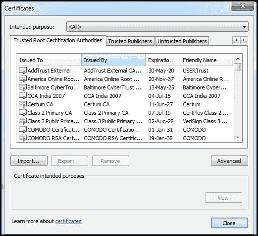
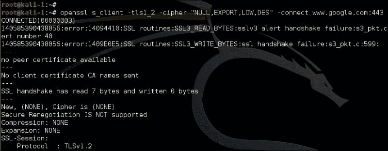
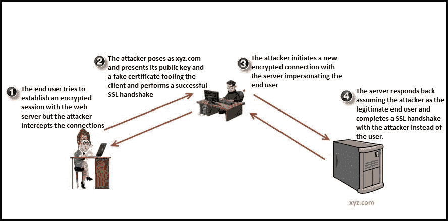
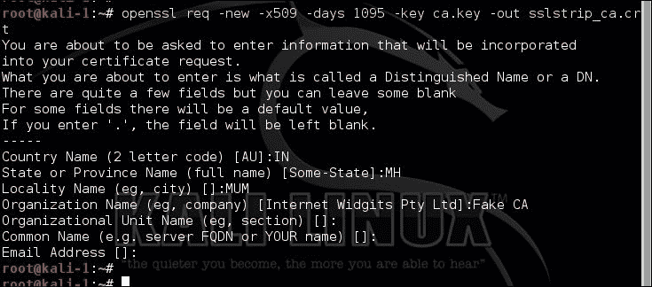
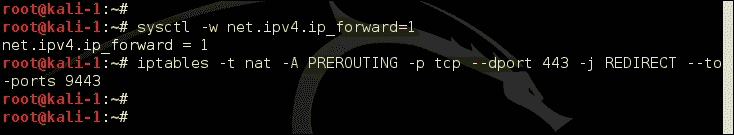
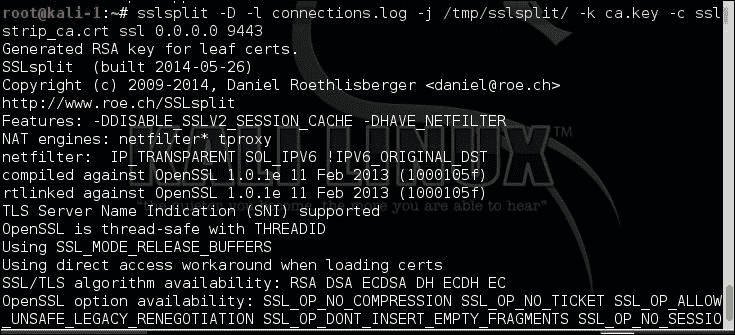

# 十七、攻击基于 SSL 的网站

信息安全的主要目标之一是保护数据的机密性。在 web 应用中，目的是确保用户和应用之间交换的数据是安全的，并且对任何第三方都是隐藏的。当数据存储在服务器上时，还需要防止黑客攻击。密码学用于保护数据的机密性和完整性。

加密是用于保护信息的最广泛接受的加密形式。它用于保护敏感数据免受嗅探或数据在存储和传输过程中被篡改等威胁*。*当网络上的数据流未加密时，攻击者可以窃听并嗅探数据。如果嗅探到的数据包含身份验证凭据，则攻击者可以劫持会话。因此，我们需要加密。当数据被加密时，明文被转换成密文，密文只能在密钥的帮助下解密。

攻击者总是试图找出不同的方法来击败加密层并公开纯文本数据。它们使用不同的技术，例如利用加密协议中的设计缺陷，或欺骗用户通过非加密通道发送数据，从而绕过加密本身。我们将讨论其中的几种技术。

如果底层操作系统受损，存储在服务器上数据库中的信息也可能被公开。静止的数据需要受到保护，免受恶意内部人员、管理员、承包商和外包服务提供商的攻击。令牌化可用于保护静止数据的机密性，并在需要保护的数据非常关键时（如信用卡和社会保险号码）与磁盘加密结合使用。加密数据库只会在数据静止时保护数据，不会对传输中的数据产生影响。当数据通过网络发送时，应通过称为**安全套接字层**（**SSL**的加密链路发送。

在本章中，我们将讨论 SSL 以及攻击者试图利用加密连接的不同方式：

*   SSL 的使用
*   SSL 加密过程
*   加密算法的类型
*   弱密码组的识别
*   SSL 中间人攻击

# 安全插座层

**安全套接字层**或**SSL**作为更为常见，是用于保护网络通信安全的加密协议。Netscape 在 1994 年利用了 SSL 协议。1999 年，IETF 发布了传输层安全协议，取代了 SSL 协议版本 3。SSL 被认为是不安全的，因为多年来发现了多个漏洞。POODLE 和 BEAST 漏洞暴露了 SSL 协议本身的缺陷，因此无法通过软件补丁修复。升级到 TLS 是修复和保护应用的最佳方法。TLS 的最新版本是 1.2 版。建议始终使用最新版本的 TLS。

大多数网站已经迁移到并开始使用 TLS 协议，但加密通信仍被称为 SSL 连接。SSL 不仅提供机密性，而且有助于维护数据的完整性并实现不可否认性。

保护客户端和 web 应用之间的通信是 TLS/SSL 最常用的用法，它被称为 HTTP over SSL 或 HTTPS。TLS 还用于通过以下方式保护其他协议使用的通信信道：

*   邮件服务器用于加密两个邮件服务器之间以及客户端和邮件服务器之间的电子邮件
*   确保数据库服务器和 LDAP 身份验证服务器之间的通信安全
*   加密**虚拟专用网**（**VPN**）连接称为 SSL VPN
*   Windows 操作系统中的远程桌面服务使用 TLS 加密和验证连接到服务器的客户端

还有其他几个应用和实现，其中 TLS 用于保护双方之间的通信。

## web 应用中的 SSL

SSL 使用公钥-私钥加密机制对数据进行加密，这有助于保护数据免受脚本小子甚至恶意攻击者的攻击。通过网络嗅探数据只会显示加密信息，如果不访问相应的密钥，加密信息就没有用处。

SSL 协议旨在保护 CIA 黑社会的三个方面：

*   **保密**：维护数据的隐私和保密性
*   **报文完整性**：主要保证数据的准确性和一致性，保证数据在传输过程中不被篡改
*   **可用性**：防止数据丢失，维护数据访问

Web 服务器管理员实施 SSL 以确保 Web 服务器和客户端之间共享的敏感用户信息安全。除了保护数据的机密性，SSL 还通过使用 SSL 证书和数字签名提供不可否认性。这就保证了信息确实是由声称发送信息的一方发送的。这类似于签名在我们日常生活中的工作方式。这些证书由称为证书颁发机构的独立第三方组织签署、验证和颁发。以下列出了一些著名的证书颁发机构：

*   VeriSign
*   解冻
*   科摩多
*   迪吉塞特
*   委托
*   全球符号

如果攻击者试图伪造证书，浏览器将向用户显示一条警告消息，通知用户正在使用无效证书加密数据。

数据完整性是通过使用附加到消息并在另一端验证的哈希算法计算消息摘要来实现的。

### 注

消息摘要是使用表示传输数据的公式创建的数字字符串。

## SSL 加密过程

加密过程是一个多步骤的过程，但对最终用户来说是一种无缝体验。为了将整个过程分为两部分，加密的第一阶段使用非对称加密技术完成，第二阶段使用对称加密过程完成。以下是使用 SSL 加密和传输数据的主要步骤：

1.  客户端和服务器之间的握手是客户端显示其支持的 SSL 版本号和加密算法的初始步骤。
2.  服务器响应，确定其支持的 SSL 版本和加密算法，并且双方同意最高的共同值。服务器还使用 SSL 证书进行响应。此证书包含服务器的公钥和有关服务器的常规信息。
3.  The client then authenticates the server by verifying the certificate against the list of root certificates stored on the local computer. The client checks if the **certificate authority** (**CA**) that undersigned the certificate issued to the website is stored in the list of trusted CAs. In Internet Explorer, the list of trusted CAs can be viewed by navigating to **Tools** | **Internet options** | **Content** | **Certificates** | **Trusted Root Certification Authorities**:

    

4.  通过使用握手期间共享的信息，客户端可以为会话生成预主密钥。然后，它用服务器的公钥加密该秘密，并将加密的预主密钥发送回服务器。
5.  服务器使用私钥解密预主密钥（因为它是用公钥加密的）。然后，服务器和客户端都使用一系列步骤从预主密钥生成会话密钥。此会话密钥在整个会话期间加密数据，称为对称加密。散列也会被计算并附加到消息中，这有助于测试消息的完整性。

## 非对称加密与对称加密

非对称加密使用公钥和私钥的组合，比对称加密更安全。公钥与所有人共享，私钥单独保存。使用一个密钥加密的数据只能使用另一个密钥解密，这使得在更大范围内实现非常安全和高效。

另一方面，对称加密使用相同的密钥加密和解密数据，您需要找到一种安全的方法与另一方共享对称密钥。

一个经常被问到的问题是，为什么不使用公钥-私钥对来加密数据流，而是生成一个使用对称加密的会话密钥。公钥和私钥的组合是通过复杂的数学过程生成的，这是一项处理器密集且耗时的任务。因此，它仅用于对端点进行身份验证以及生成和保护会话密钥，会话密钥用于加密批量数据的对称加密。这两种加密技术的结合可以更快、更高效地加密数据。

### 非对称加密算法

以下是主要的非对称加密算法：

*   **Diffie-Hellman 密钥交换**：这是 1976 年利用的第一个在有限域中使用离散对数的非对称加密算法。它允许两个端点在不安全的介质上使用密钥交换，而不需要事先知道对方。
*   **Rivest Shamir Adleman（RSA）**：这是应用最广泛的非对称算法。RSA 算法用于加密数据和签名，提供机密性和不可否认性。该算法使用一系列模块乘法来加密数据。
*   **椭圆曲线密码（ECC）**：该主要用于手机等手持设备，因为其加密和解密过程需要较少的计算能力。ECC 的功能类似于 RSA。

### 对称加密算法

在对称加密中，使用相同的密钥对数据进行加密和解密。这种数据加密方式自古以来就以不同的形式使用。它提供了一种加密和解密数据的简单方法，因为密钥是相同的。对称加密很简单，也很容易实现，但它带来了一个挑战，即以安全的方式与用户共享密钥。

对称算法分为两种主要方式：

*   **分组密码**：一次加密定义的数据块，而不是每一位。此方法用于加密 internet 上的大量数据。
*   **流密码**：此一次加密单个位，因此需要更高的处理能力。它还需要大量的随机性，因为每个比特都要用唯一的密钥流进行加密。流密码更适合在硬件层实现，并用于加密音频和视频等流通信，因为它可以快速加密和解密每个比特。

以下是一些广泛使用的对称加密算法：

*   **数据加密标准（DES）**：使用 DEA 密码。DEA 是一种使用 64 位密钥大小的分组密码。考虑到当今计算机的计算能力，这种加密算法很容易被破解。
*   **高级加密标准（AES）**：该标准于 1998 年首次发布，被认为比其他对称加密算法更安全。AES 使用 Rijndael 密码，该密码由两位比利时密码学家 Joan Daemen 和 Vincent Rijmen 利用。它取代了 DES。它可以配置为使用可变密钥大小，最小值为 128 位，最大值为 256 位。
*   **国际数据加密算法（IDEA）**：IDEA 的密钥长度为 128 位，比 DES 快。它也是一种分组密码。
*   **Rivest Cipher 4 (RC4)**: RC4 is a widely used stream cipher and has a variable key size of 40 to 2048 bits. RC4 has some design flaws that makes it susceptible to attacks, although they are not practical and require huge computing power. RC4 is widely used in the SSL/TLS protocol. But many organizations have started to move to AES instead of RC4.

    以下协议使用 RC4 密码加密数据：

    *   WEP
    *   TLS/SSL
    *   远程桌面
    *   安全壳

## 针对消息完整性的哈希

散列函数确保传输消息的完整性。它生成一个表示实际数据的固定长度值（哈希）。在接收器端，数据再次通过散列函数，并将输出与先前生成的散列进行比较，以确定数据是否在传输过程中被篡改。SSL 使用散列来验证所接收消息的完整性。

**安全散列算法**（**SHA**）是散列函数家族，通常用于创建散列。下表列出了一些散列函数：

<colgroup><col> <col></colgroup> 
| 

散列函数

 | 

输出哈希大小（位）

 |
| --- | --- |
| MD5 | 128 |
| SHA-1 | 160 |
| SHA-2 | 224256384512 |

如表所示，SHA-2 可用于生成从 224 位到 512 位的各种大小的摘要。输出哈希大小表示生成的摘要的长度。使用的位数越高，哈希算法对冲突攻击的安全性和免疫性就越高。已经设计了一个新版本，称为 SHA-3，但尚未广泛使用。SHA-2 仅在 TLS 1.2 实施中受支持。

### 注

在冲突攻击中，两个不同的输入文件将生成相同的哈希输出。

TLS 利用称为 HMAC 的算法生成附加到要传输的数据的哈希值。HMAC 是消息认证码算法的改进实现，被认为更安全、更健壮。

### 注

HMAC 结合哈希算法使用共享密钥来生成哈希值。这为实现增加了更多的安全性，因为两个端点都应该有共享密钥来测试数据的完整性。

HMAC 代表密钥散列消息身份验证码。

例如，当两个端点使用 SSL 通信时，可以使用以下算法组合：

<colgroup><col> <col></colgroup> 
| 

算法

 | 

用于 SSL 加密

 |
| --- | --- |
| RSA/Diffie-Hellman | 密钥交换和身份验证 |
| AES | 使用 DH/RSA 生成和共享的密钥加密批量数据 |
| HMAC-SHA2 | 消息完整性 |

## 识别弱 SSL 实现

正如我们在上一节中所看到的，SSL 是各种加密算法的组合，打包成一个，以提供机密性、完整性和身份验证。在第一步中，当两个端点协商 SSL 连接时，它们标识它们支持的公共密码套件。这允许 SSL 支持多种设备，这些设备可能没有硬件和软件来支持较新的密码。支持旧的加密算法有一个主要缺点。大多数较旧的密码套件被发现很容易被密码分析员在合理的时间内利用今天可用的计算能力破解。

一个专门的攻击者会从云服务提供商那里租用廉价的计算能力，并使用它来破解旧密码，获取明文信息。因此，使用旧密码会产生错误的安全感，应该禁用。客户端和服务器只允许协商被认为是安全的、实际上很难破解的密码。

### 注

OpenSSL 是 Linux 中用于实现 SSL 协议的著名库，Schannel 是 Windows 中 SSL 功能的提供者。

### OpenSSL 命令行工具

在中，为了识别远程 web 服务器协商的密码套件，我们可以使用 OpenSSL 命令行工具，该工具预装在所有主要 Linux 版本上，也包含在 Kali Linux 中。该工具可以直接从 bash shell 测试 OpenSSL 库的各种函数，而无需编写任何代码。它还可用作故障排除工具。

在下面的示例中，我们使用`s_client`命令行选项，该选项使用 SSL/TLS 建立到远程服务器的连接。该命令的输出对于新手来说很难解释，但对于识别服务器和客户端之间约定的 TLS/SSL 版本和密码套件很有用：


OpenSSL 实用程序包含各种命令行选项，可用于使用特定的 SSL 版本和密码套件测试服务器。在以下示例中，我们尝试使用 TLS 版本 1.2 和弱算法 RC4 进行连接：

```
openssl s_client –tls1_2 –cipher 'ECDH-RSA-RC4-SHA' –connect <target>:port

```

下面的屏幕截图显示了命令的输出。由于客户端无法与`ECDH-RSA-RC4-SHA`密码套件协商，握手失败，未选择密码：


在下面的截图中，我们正试图与服务器协商弱加密算法，但失败了，因为谷歌正确地禁用了服务器上的弱密码套件：



要使用当前可用的计算能力找出容易破解的密码套件，请键入以下屏幕截图所示的命令：


你会经常看到密码套件被写成`ECDHE-RSA-RC4-MD5`。格式分为以下几个部分：

*   **ECDHE**：这是一个密钥交换算法
*   **RSA**：这是一种认证算法
*   **RC4**：这是一种加密算法
*   **MD5**：这是一个哈希算法

SSL 和 TLS 密码套件的全面列表可在以下 URL 中找到：

[https://www.openssl.org/docs/apps/ciphers.html](https://www.openssl.org/docs/apps/ciphers.html)

### SSLScan

尽管 OpenSSL 命令行工具提供了许多选项来测试 SSL 配置，但该工具的输出并不友好。该工具还需要对要测试的密码套件有相当多的了解。

Kali Linux 附带了许多工具，可以自动识别 SSL 错误配置、过时的协议版本以及弱密码套件和散列算法。其中一个工具是在**应用****信息收集****SSL 分析**中找到的 SSLScan。

默认情况下，该工具会检查服务器是否容易受到犯罪和心脏出血漏洞的攻击。`–tls`选项将强制 SSLScan 仅使用 TLS 协议测试密码套件。输出以各种颜色分布，绿色表示密码套件是安全的，红色和黄色的部分试图吸引您的注意：


客户端支持的密码套件可以通过运行以下命令进行识别。它将显示客户端支持的密码的长列表：

```
sslscan –show-ciphers www.example.com:443

```

如果要分析证书相关数据，请使用以下命令显示证书的详细信息：

```
sslscan --show-certificate --no-ciphersuites www.amazon.com:443

```

命令的输出可以使用`–xml=<filename>`选项导出到 XML 文档中。

### 提示

当支持的密码名称中指出 NULL 时，请注意。如果选择空密码，SSL 握手将完成，浏览器将显示安全挂锁，但 HTTP 数据将以明文传输。

### SSLyze

Kali Linux 附带的另一个有趣的工具是 iSEC 合作伙伴发布的 SSLyze 工具，它有助于分析 SSL 配置。该工具位于 GitHub 的[上 https://github.com/iSECPartners/sslyze](https://github.com/iSECPartners/sslyze) 可以在 Kali Linux 中的**应用****信息收集****SSL 分析**中找到。SSLyze 是用 Python 语言编写的。

该工具附带各种插件，有助于测试以下各项：

*   检查 SSL 的旧版本
*   分析密码组识别弱密码
*   使用输入文件扫描多台服务器
*   正在检查会话恢复支持

使用`–regular`选项将包括我们感兴趣的所有常见选项，例如测试不安全的密码套件、识别是否启用了压缩，以及其他一些选项。

在以下示例中，服务器不支持压缩，并且发现颁发的证书是由受信任的 CA 颁发的。输出还列出了接受的密码套件：


### 使用 Nmap 测试 SSL 配置

Nmap 包括一个名为`ssl-enum-ciphers`的脚本，该脚本可以识别服务器支持的密码套件，并根据密码强度对其进行评级。它使用 SSLv3、TLS 1.1 和 TLS 1.2 进行多个连接。如果脚本识别出 SSL 实现易受任何先前发布的漏洞（如犯罪和贵宾犬）的攻击，则脚本还将突出显示：


SSL 服务器测试（[https://www.ssllabs.com/ssltest/](https://www.ssllabs.com/ssltest/) 是 Qualys 托管的在线工具，对网站的 SSL 配置进行深入分析。如果您想测试一个公开的 web 服务器，并且您对由另一个组织托管的工具感到满意，可以识别您实现中的弱点，那么强烈建议使用此免费工具。

利用弱密码套件只能由专业且技术高超的攻击者完成，因为它需要将多个东西排列在一起：

*   易受攻击的服务器应长时间重复使用密钥
*   你需要计算能力来破解密码
*   您需要找到一个可以尝试中间人攻击的客户端

尽管利用弱密码套件很困难，但您不应自满，并在 web 服务器上禁用它，因为您的安全性只与最薄弱的环节一样。

## SSL 中间人攻击

**中间人**（**MITM**攻击是一种老派伎俩，它通过攻击者控制的机器重定向信息流，攻击者可以在将数据转发到其目标之前嗅探和操纵数据。

如果攻击者能够访问最终用户和 web 服务器之间的通信链路，则可能会发生 MITM 攻击。想到的第一个问题是，攻击者如何解密数据？由于客户端浏览器在发送数据之前对其进行加密，因此只能通过安全存储在服务器上的私钥对其进行解密。简而言之，攻击者能够解密数据，因为它位于最终用户和模拟两者的 web 应用之间。通过模拟真实服务器，浏览器认为它正在通过加密通道与服务器通信，但实际上，加密通道在攻击者的机器上终止，攻击者在那里解密数据、嗅探敏感信息、重新加密数据并将其转发给服务器。

模拟真实服务器的攻击者向最终用户提供假证书（因为它没有真实服务器的私钥），客户端使用该证书的公钥加密数据。由于攻击者拥有该公钥的私钥，因此他们能够解密数据。

然后，攻击者模拟客户端创建到真实服务器的新 SSL 连接，并根据服务器提供的合法证书进行身份验证。

下图显示了攻击的图示：



证书授权系统是谜题中缺失的部分，这使得欺骗用户启动与攻击者的加密会话有点困难。当攻击者向用户提供假证书时，浏览器上会显示一条警告，告知用户他连接的服务器可能是假服务器，因为该证书没有由您信任的证书颁发机构签名。

只有在以下情况下，SSL 上的 MITM 才可能成功：

*   客户端信任一个不可信的 CA，该 CA 颁发了一个伪造的证书，从而防止警告出现在用户的浏览器上。这是可能的，因为 CA 系统可能已被攻击者入侵。
*   尽管浏览器上出现警告，客户端仍会创建加密会话。
*   客户端系统本身可能已被黑客攻击，并在其上安装了伪造的 CA 根证书。此 CA 生成的任何证书都不会在浏览器上显示警告。

### Kali Linux 中的 SSL MITM 工具

Kali Linux 中有几种工具可用于拦截和绕过加密通信。下面列出了三种著名的工具。SSLsplit 和 SSLsniff 使用一种通用技术来阻止加密，而 SSLstrip 工具使用一种独特的方式来绕过 SSL 连接：

*   SSLsplit
*   SSLstrip
*   SSLsniff

#### SSLsplit

SSLsplit 是一个透明 SSL MITM 工具。它拦截 SSL 连接，并通过动态生成证书来假装是服务器。它在拦截 SMTP、IMAP 和 FTP 等协议的加密连接时也很有用。

拦截和解密 SSL 连接的第一个要求是攻击者能够成功地将流量从受害者的机器重定向到其控制下的系统，这可以通过以下不同方式实现：

*   诱骗用户更改其机器的默认网关，从而重定向所有流量
*   使用 ARP 欺骗技术，这将错误地将默认网关映射到攻击者的机器
*   修改主机文件中的条目，并将要拦截流量的域名映射到攻击者的 IP 地址
*   泄露 DNS 条目以重定向流量

SSLsplit 工具位于**应用****嗅探&欺骗****欺骗和 MITM**中。此工具需要一个自签名根 CA 证书，该证书用于动态签名各个网站的证书。此根证书还应推送到受害者计算机的证书信任存储中，以避免浏览器上出现警告。自签名 CA 证书及其私钥可以使用前面讨论过的 OpenSSL 命令行工具生成。

以下命令将生成 2048 位 RSA 私钥：


下一个命令将使用上一步中生成的私钥构建证书。它还将询问生成证书时通常会问的一些问题，如以下屏幕截图所示：



一旦受害者的机器重定向流量并且根 CA 证书准备就绪，您需要将 HTTP 数据转移到 SSLsplit 正在侦听的端口。

由于我们只对 SSL 流量感兴趣，因此我们需要为基于 SSL 的流量配置 NAT 规则，该规则将其重定向到 SSLsplit 正在侦听的端口，而不是直接将其传输到默认网关。您还需要在攻击者的机器上启用 IP 转发，这将把发送到不同 IP 地址和端口的 IP 数据包转移到机器上配置的默认网关：



可以使用以下命令验证 NAT 表条目：

```
iptables -t nat –list

```

配置流量重定向后，我们需要使用相关选项启动 SSLsplit。我们使用的最有用的选项如下：

*   `-l`：记录每个文件的连接
*   `-j`：记录连接到 chrooted 目录的内容
*   `-k`：使用该关键字后指定的私钥
*   `-c`：使用关键字后指定的证书

以下屏幕截图显示了这些命令生成的输出：



#### SSLstrip

SSL 剥离是一种使用 MITM 攻击击败 SSL 加密的技术。当 SSLsplit 工具截获流量并向用户提供假证书时，SSL 剥离技术诱使用户相信服务器接受未加密的数据。当用户通过未加密的通道发送数据时，攻击者可以轻松地嗅探数据，然后假装是用户创建到服务器的合法 SSL 连接。

Kali Linux 中的 SSLstrip 工具可以执行 SSL 剥离攻击。位于**应用****嗅探&欺骗****欺骗和 MITM**中。

由于此技术依赖于成功的 MITM 攻击，因此攻击者应首先能够将网络流量从受害者的机器重定向到其控制下的机器。攻击者可以使用 ARPSopof 或 TTERCAP for MITM 等工具。完成此操作后，还需要配置 iptables 以将流量重定向到 SSLstrip 正在侦听的端口，如 SSLsplit 示例所示。然后，您可以使用`–l`选项启动工具：

```
Sslstrip –l <listen port>

```

如以下屏幕截图所示，您可以指定不同于默认端口的端口，并将截获的数据重定向到文件：


##### SSL 剥离限制

SSL 剥离暴露了一个基本缺陷，需要修复，这导致了一种新的 web 安全机制，称为**HTTP 严格传输安全**（**HSTS**。此缓解技术使用了一个称为严格传输安全标头的附加标头。网站使用此标头通知客户端仅使用 SSL 进行连接。这是一种选择加入的安全机制，因此它只适用于支持此标题的网站和浏览器。如果客户端使用的是较旧的浏览器，或者网站没有添加标题，SSLstrip 工具仍然可以工作。

此外，如果客户端第一次连接到网站，SSLstrip 可以运行 MITM 攻击并阻止 HSTS 标头到达客户端。为了缓解这种情况，可以将网站包括在预构建的列表中，该列表存储在支持 HST 的浏览器中。chrome 浏览器在`chrome://net-internals/#hsts`页面提供了一种快速检查域 HSTS 状态的方法。

# 总结

这一章是关于 SSL 加密的。Web 应用依赖不同的加密技术来保护数据，攻击者找到不同的方法来击败数据。我们看到了攻击者如何使用 Kali Linux 附带的工具识别弱密码套件。在本章后面，我们讨论了攻击者如何使用 MITM 攻击来嗅探加密的 SSL 连接。

在下一章中，我们将讨论使用 Kali Linux 中的工具进行客户端攻击。