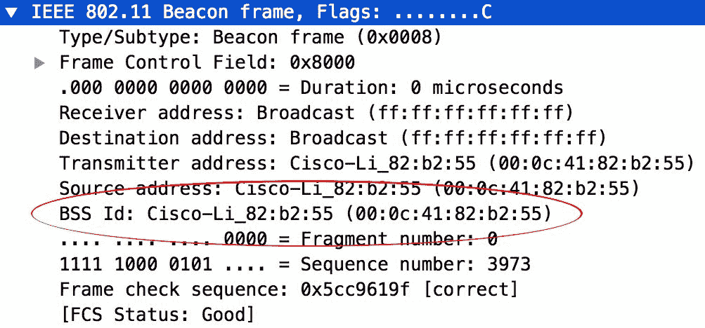
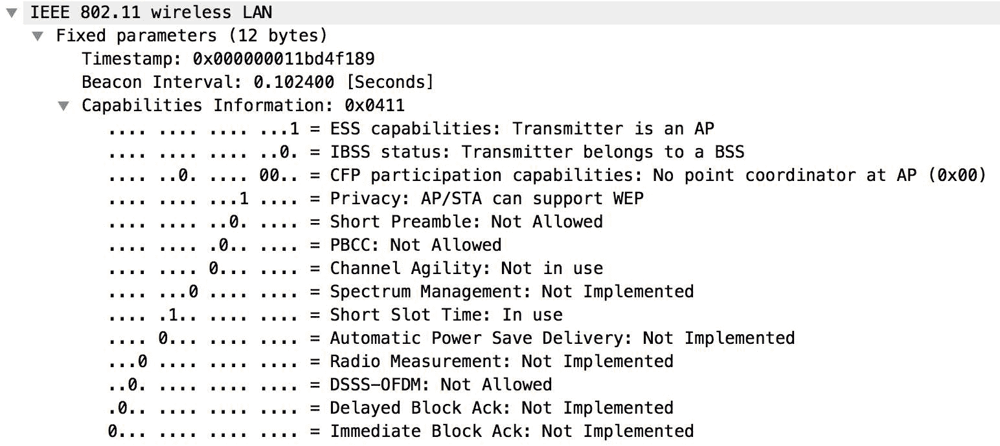

# 九、Wi-Fi 嗅探

在本章中，我们将介绍以下配方：

*   查找 Wi-Fi 设备
*   查找 SSID
*   暴露隐藏的 SSID
*   隐藏 ssid 的字典攻击
*   用 Scapy 伪造接入点

# 介绍

我们已经学会了在 Python 中使用 Scapy 模块。现在我们可以利用 Scapy 模块嗅探接入点及其 MAC 地址。在此之前，了解 SSID 是很有用的。**服务集标识符**（**SSID**是无线网络的名称，有助于分离同一网络中的多个信号。我们可以使用 SSID 识别并连接到网络。

# 查找 Wi-Fi 设备

加入 Wi-Fi 网络的过程很简单。这些设备可以侦听其他设备以识别它们。这些标识符连续广播，称为**信标**。这些类型的独特信标由作为接入点的设备广播。这些信标包括作为该接入点名称的 SSID。每个 SSID 广播其自己独特的信标帧，以通知任何侦听设备该 SSID 可用且具有特定功能。我们可以嗅探 Wi-Fi 接口中的数据包，通过收听接入点广播的这些信标，获取该地区可用的 Wi-Fi 设备。这里，我们使用 Scapy 分析接口捕获的数据包以提取信标。

# 准备

由于我们必须从接口嗅探数据包，我们需要一个能够通过监视器模式嗅探 Wi-Fi 信号的 Wi-Fi 卡。因此，我们必须确保该卡能够进行嗅探。然后我们必须将接口设置为监视器模式，这对于不同的操作系统是不同的。由于 Scapy 在 Windows 系统中有一些限制，我们必须在 Linux 或 macOS 环境中运行此配方。

在我们开始编码之前，我们必须了解 Wi-Fi 数据包。与其他数据包一样，Wi-Fi 数据包也有一个结构。根据规范 802.11，来自接入点的每个信标帧包含关于特定 SSID 的大量信息。

以下是 802.11 mgmt 信标帧的帧格式：


由此，我们可以了解信标帧的内容。信标帧中真正重要的项目如下：

*   **SSID 名称**：这是 WLAN 网络的一个 1-32 个字符的名称，存在于所有信标中。Wireshark 捕获将显示 SSID 标记，如下所示：


*   **BSSID**：SSID 唯一的第二层 MAC 地址。以下是 Wireshark 捕获中的外观：



*   **时间戳**：表示接入点上的时间。
*   **安全能力**：此项指接入点的安全能力，如开放、WEP、WPA、WPA2、个人（密码短语）与企业（802.1x，带 RADIUS 服务器）。以下是 Wireshark 捕获中的外观：



*   **信道**：表示该 AP 上 SSID 操作的具体频率。以下是 Wireshark 捕获中的外观：


*   **信道宽度**：表示信道的宽度，如 20、40、80、160Mbps。
*   **国家**：提供所有支持的频道列表及相应的频道设置。每个国家都有自己的监管机构，决定其监管领域允许的渠道或权力水平。该标签定义了操作国家、允许的信道和允许的最大传输限制。
*   **信标间隔**：表示 AP 广播该信标帧的频率。以下是 Wireshark 捕获中的外观：


# 怎么做。。。

在网络接口中启用监视器模式。这对于不同的操作系统是不同的。此外，并非所有网卡都支持监视器模式。我们必须使用一个终端命令来完成这项工作，因为通过 Python 脚本是不可能的。这将使网卡接口作为 wlan0 进入监视模式。

# Linux

按照以下步骤在 Linux 环境中启用监视器模式：

1.  这可以通过`airmon-ng`包完成。请确保为此安装了`airmon-ng`软件包。此外，请确保提供正确的接口作为参数：

```
airmon-ng start wlan0  
```

2.  也可以使用以下网络命令完成此操作：

```
ifconfig wlan0 down
iw dev wlan0 set type monitor
ifconfig wlan0 up  
```

3.  要禁用监视器模式，我们可以使用以下命令：

```
ifconfig wlan0 down
iw dev wlan1 set type managed
ifconfig wlan0 up  
```

# 马科斯

按照以下步骤在 macOS 环境中启用监视器模式：

1.  我们可以使用 airport utility 命令在 macOS 中启用监控模式。由于这是库中的一个二进制命令，所以我们可以`symlink`将其转换为`usr/local/bin/`：

```
sudo ln -s /System/Library/PrivateFrameworks/Apple80211.framework/Versions/Current/Resources/airport /usr/local/bin/airport

```

现在我们可以用`airport`选择要嗅探的通道：

```
airport en0 channel 7  
```

然后，我们可以使用以下命令开始嗅探：

```
sudo airport en0 sniff  
```

这将`sniff`接口`en0`并保存到`tmp/`文件夹中的 pcap 文件中，如：`/tmp/airportSniffXXXXXX.pcap.`我们可以使用 Scapy 分析此文件。

2.  现在创建一个`wifi-sniff.py`文件并在编辑器中打开它。
3.  通常，加载所需的模块：

```
from scapy.all import *
```

4.  现在我们可以定义所需的变量。在这里，我们将创建访问点列表：

```
access_points = []    
```

5.  现在我们可以定义回调函数来解析数据包：

```
def parsePacket(pkt):
    if pkt.haslayer(Dot11):
        print(pkt.show())  
```

这将打印捕获的 Wi-Fi 数据包。输出结果如下：


对于 802.11 数据包层，主要变量为：

6.  根据前面的详细信息，我们可以更新解析器函数以获取 Wi-Fi MAC 地址：

```
def parsePacket(pkt):
    if pkt.haslayer(Dot11):
        if pkt.type == 0 and pkt.subtype == 8:
            if pkt.addr2 not in ap_list:
               print(pkt.addr2)
```

7.  现在调用`sniff`函数并将数据包传递给`callback`函数：

```
sniff(iface='en0', prn=parsePacket, count=10, timeout=3, store=0)  
```

8.  保存脚本并使用`sudo`权限调用：

```
$ sudo python3 Wi-Fi-sniff.py  
```

# 查找 SSID

要获得 SSID，我们需要更新之前的配方并从数据包中解析 SSID。

# 怎么做。。。

以下是使用`scapy`模块编写 SSID 嗅探器脚本的步骤：

1.  创建一个`sniff-ssid.py`文件并在编辑器中打开它。
2.  导入所需的模块：

```
from scapy.all import *   
```

3.  现在创建一个函数来解析数据包中的 SSID：

```
def parseSSID(pkt):
    if pkt.haslayer(Dot11):
        print(pkt.show())
        if pkt.type == 0 and pkt.subtype == 8:
                ap_list.append(pkt.addr2)
                print("SSID:" + pkt.info)
```

4.  现在运行`sniff`并在回调函数上调用 parse 函数。

```
sniff(iface='en0', prn=ssid, count=10, timeout=3, store=0)  
```

5.  现在使用`sudo`权限运行此脚本：

```
$ sudo python3 sniff-ssid.py  
```

# 暴露隐藏的 SSID

我们可以修改前面的配方以获得隐藏的 SSID。使用 Scapy，我们可以识别探测答案和请求以提取隐藏的 ssid。

# 怎么做。。。

按照以下步骤编写脚本以公开隐藏的 SSID：

1.  创建一个`sniff-hidden-ssid.py`文件并在编辑器中打开它。
2.  导入`scapy`模块并为已识别的 SSID 创建字典：

```
from scapy.all import *
hiddenSSIDs = dict()  
```

3.  现在创建函数来解析数据包中隐藏的 SSID：

```
def parseSSID(pkt):
if pkt.haslayer(Dot11Beacon) or pkt.haslayer(Dot11ProbeResp):
   if not hiddenSSIDs.has_key(pkt[Dot11].addr3):
         ssid       = pkt[Dot11Elt].info
         bssid      = pkt[Dot11].addr3
         channel    = int( ord(pkt[Dot11Elt:3].info))
         capability = pkt.sprintf("{Dot11Beacon%Dot11Beacon.cap%}\{Dot11ProbeResp:%Dot11ProbeResp.cap%}")
    if re.search("privacy", capability): 
              encrypted = 'Y'
   else: 
              encrypted  = 'N'
    hiddenSSIDs[pkt[Dot11].addr3] =[encrypted, ssid, bssid, channel] 
          print (hiddenSSIDs)  
```

在这里，它检查探测响应和提取 BSSID 和 SSID 的请求

4.  最后，`sniff`保存数据包并将其传递给`callback`函数。

```
sniff(iface='wlan0', prn=parseSSID, count=10, timeout=3, store=0)    
```

5.  现在使用 root 权限运行此脚本：

```
sudo sniff-hidden-ssid.py    
```

# 隐藏 ssid 的字典攻击

对于隐藏的 SSID，我们可以运行字典攻击来识别隐藏的 SSID。为此，我们将遍历 SSID 列表，并发送带有特定 SSID 的广播数据包。如果 SSID 存在，接入点将用数据包进行响应。因此，我们可以启动在上一个配方中创建的 SSID 嗅探器，并在使用 SSID 运行暴力攻击时等待访问点的响应。

# 怎么做。。。

以下是编写可用于对 SSID 运行字典攻击的脚本的步骤：

1.  像往常一样，创建一个新的`dictionary-attack-ssid.py`文件并在编辑器中打开它。
2.  加载所有必需的模块，并初始化变量：

```
from scapy.all import *
senderMac = "aa:aa:aa:aa:aa:aa"
broadcastMac = "ff:ff:ff:ff:ff:ff"  
```

3.  然后，我们迭代列表中的 SSID，并发送一个以 SSID 设置为参数的`RadioTap()`数据包：

```
for ssid in open('ssidList.txt', 'r').readlines():
     pkt = RadioTap()/Dot11(type = 0, subtype = 4 ,addr1 = broadcastMac, addr2 = senderMac, addr3 = broadcastMac)/Dot11ProbeReq()/Dot11Elt(ID=0, info =ssid.strip()) / Dot11Elt(ID=1, info = "\x02\x04\x0b\x16") / Dot11Elt(ID=3, info="\x08")
     print ("Checking ssid:" + ssid)
     print(pkt.show())
     sendp (pkt, iface ="en0", count=1)
```

4.  现在在一个终端窗口中启动嗅探器脚本并等待响应。
5.  最后，使用`sudo`权限启动字典攻击脚本：

```
sudo python3  dictionary-attack-ssid.py  
```

# 用 Scapy 伪造接入点

我们可以通过使用 Scapy 注入信标帧来创建假 Wi-Fi 接入点。

# 怎么做。。。

让我们通过以下步骤尝试创建假 SSID：

1.  创建一个新的`fake-access-point.py`文件并在编辑器中打开它。
2.  加载脚本所需的模块：

```
from scapy.all import *
import random  
```

这里我们使用`scapy`和`random`模块创建随机 MAC ID

3.  然后定义接入点名称和要广播的接口：

```
ssid = "fakeap" 
iface = "en0"  
```

4.  现在我们可以用`beacon`帧制作包，如下所示：

```
dot11 = Dot11(type=0, subtype=8, addr1='ff:ff:ff:ff:ff:ff', addr2=str(RandMAC()), addr3=str(RandMAC()))
dot11beacon = Dot11Beacon(cap='ESS+privacy')
dot11essid = Dot11Elt(ID='SSID',info=ssid, len=len(ssid))
 rsn = Dot11Elt(ID='RSNinfo', info=(
    '\x01\x00'                 #For RSN Version 1
    '\x00\x0f\xac\x02'         #Group Cipher Suite : 00-0f-ac TKIP
    '\x02\x00'                 #2 Pairwise Cipher Suites (next two lines)
    '\x00\x0f\xac\x04'         #AES Cipher
    '\x00\x0f\xac\x02'         #TKIP Cipher
    '\x01\x00'                 #1 Authentication Key Managment Suite (line below)
    '\x00\x0f\xac\x02'         #Pre-Shared Key
    '\x00\x00'))               #RSN Capabilities (no extra capabilities)   
frame = RadioTap()/dot11/dot11beacon/dot11essid/rsn
```

5.  现在我们可以通过`sendp()`方式广播接入点：

```
sendp(frame, iface=iface, inter=0.0100 if len(frames)<10 else 0, loop=1)  
```

6.  现在使用所需权限运行脚本：

```
sudo python3 fake-access-point.py  
```

这将使用提供的 SSID 广播接入点