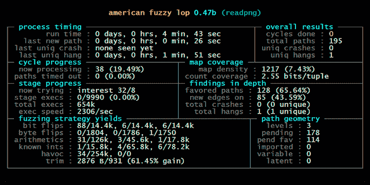

# 基于变异的模糊化

> 原文： [https://www.fuzzingbook.org/html/MutationFuzzer.html](https://www.fuzzingbook.org/html/MutationFuzzer.html)

大多数[随机生成的输入](Fuzzer.html)在语法上都是*无效*，因此很快就被处理程序拒绝。 要行使输入处理之外的功能，我们必须增加获得有效输入的机会。 一种这样的方法就是所谓的*突变模糊测试*-也就是说，对现有输入进行小的更改，这些更改可能仍会保持输入有效，但会行使新的行为。 我们将展示如何创建此类突变，以及如何使用流行的AFL模糊器的中心概念来引导它们走向尚未发现的代码。

**前提条件**

*   您应该知道基本的模糊测试是如何工作的。 例如，在[“模糊处理”](Fuzzer.html) 一章中。

## 内容提要

要使用本章中提供的代码来[，请编写](Importing.html)

```py
>>> from [fuzzingbook.MutationFuzzer](MutationFuzzer.html) import <identifier>

```

然后利用以下功能。

本章介绍`MutationFuzzer`类，该类采用*种子输入*的列表，然后将其突变：

```py
>>> seed_input = "http://www.google.com/search?q=fuzzing"
>>> mutation_fuzzer = MutationFuzzer(seed=[seed_input])
>>> [mutation_fuzzer.fuzz() for i in range(10)]
['http://www.google.com/search?q=fuzzing',
 'http://www.g=oNogl.om/search?q=fuzzing/',
 'RttpX://w)ww.goo(gle.comq/sarc(q=fuzzng',
 'hdt8p://"wWw.goole.com/seDarb`*?q=fuzzing',
 'httop://www.CooglGe.om/s$arch?q=fuzzingY',
 'http://wwlw.google.c"om/secrch?yq=fuzzin',
 'hup://www.google.comC/search?q=fuzzing',
 'http://w7w.google.com/search?q=ufuzgzing',
 'http://www,google.com/sear4ch?.q=fuzzing',
 'http://w&ww.google.cKom/search7q=fuzzing']

```

`MutationCoverageFuzzer`保持输入的*种群*，然后对其进行演化以最大化覆盖范围。

```py
>>> mutation_fuzzer = MutationCoverageFuzzer(seed=[seed_input])
>>> mutation_fuzzer.runs(http_runner, trials=10000)
>>> mutation_fuzzer.population[:5]
['http://www.google.com/search?q=fuzzing',
 'htTp://www.googld.cqom/searchq=fuzzIng',
 'htTp://www.gloogld.qom/|searchq=fuzzng',
 'htTp://www.googld.cqomo0searchq=fuzzIng',
 'htTp://www*goegld.cqoe/sa7#hq=fuzIng']

```

## 带有突变的

2013年11月，发布了 [American Fuzzy Lop](http://lcamtuf.coredump.cx/afl/) （AFL）的第一版。 从那时起，AFL已成为最成功的模糊测试工具之一，并具有许多特色，例如 [AFLFast](https://github.com/mboehme/aflfast) ， [AFLGo](https://github.com/aflgo/aflgo) 和 [AFLSmart](https://github.com/aflsmart/aflsmart) （在 这本书）。 AFL使模糊测试成为自动漏洞检测的流行选择。 它是第一个证明可以在许多对安全性要求很高的实际应用程序中大规模自动检测漏洞的工具。



<center>**Figure 1.** American Fuzzy Lop Command Line User Interface</center>

在本章中，我们将介绍突变模糊测试的基础。 接下来的下一章将进一步说明如何将模糊测试引导到特定的代码目标。

## 模糊化URL解析器

许多程序期望它们的输入以非常特定的格式输入，然后才能实际处理它们。 例如，考虑一个接受URL（Web地址）的程序。 该URL必须采用有效格式（即URL格式），以便程序能够对其进行处理。 当使用随机输入进行模糊测试时，我们实际产生有效URL的机会是多少？

为了更深入地研究这个问题，让我们探索一下URL的组成。 URL由许多元素组成：

```py
scheme://netloc/path?query#fragment 
```

哪里

*   `scheme`是要使用的协议，包括`http`，`https`，`ftp`，`file` ...
*   `netloc`是要连接的主机的名称，例如`www.google.com`
*   `path`是该主机上的路径，例如`search`
*   `query`是键/值对的列表，例如`q=fuzzing`
*   `fragment`是所检索文档中某个位置的标记，例如`#result`

在Python中，我们可以使用`urlparse()`函数来解析URL并将其分解为各个部分。

```py
import [fuzzingbook_utils](https://github.com/uds-se/fuzzingbook/tree/master/notebooks/fuzzingbook_utils)

```

```py
try:
    from [urlparse](https://docs.python.org/3/library/urlparse.html) import urlparse      # Python 2
except ImportError:
    from [urllib.parse](https://docs.python.org/3/library/urllib.parse.html) import urlparse  # Python 3

urlparse("http://www.google.com/search?q=fuzzing")

```

```py
ParseResult(scheme='http', netloc='www.google.com', path='/search', params='', query='q=fuzzing', fragment='')

```

我们将看到结果如何将URL的各个部分编码为不同的属性。

现在让我们假设我们有一个使用URL作为输入的程序。 为简化起见，我们不会让它做太多事情。 我们只是让它检查传递的URL的有效性。 如果URL有效，则返回True；否则返回True。 否则，将引发异常。

```py
def http_program(url):
    supported_schemes = ["http", "https"]
    result = urlparse(url)
    if result.scheme not in supported_schemes:
        raise ValueError("Scheme must be one of " + repr(supported_schemes))
    if result.netloc == '':
        raise ValueError("Host must be non-empty")

    # Do something with the URL
    return True

```

现在让我们开始模糊`http_program()`。 为了模糊起见，我们使用了所有可打印的ASCII字符，包括`:`，`/`和小写字母。

```py
from [Fuzzer](Fuzzer.html) import fuzzer

```

```py
fuzzer(char_start=32, char_range=96)

```

```py
'"N&+slk%h\x7fyp5o\'@[3(rW*M5W]tMFPU4\\P@tz%[X?uo\\1?b4T;1bDeYtHx #UJ5w}pMmPodJM,_'

```

让我们尝试对1000个随机输入进行模糊测试，看看我们是否取得了一些成功。

```py
for i in range(1000):
    try:
        url = fuzzer()
        result = http_program(url)
        print("Success!")
    except ValueError:
        pass

```

实际获得有效URL的机会是什么？ 我们需要以`"http://"`或`"https://"`开头的字符串。 让我们先来看`"http://"`案例。 这是我们需要开始的七个非常具体的字符。 随机产生这七个字符（字符范围为96个不同字符）的机会为$ 1：96 ^ 7 $，或者

```py
96 ** 7

```

```py
75144747810816

```

产生`"https://"`前缀的几率甚至更糟，为$ 1：96 ^ 8 $：

```py
96 ** 8

```

```py
7213895789838336

```

这给了我们完全的机会

```py
likelihood = 1 / (96 ** 7) + 1 / (96 ** 8)
likelihood

```

```py
1.344627131107667e-14

```

这是我们产生有效的URL方案所需的运行次数（平均）：

```py
1 / likelihood

```

```py
74370059689055.02

```

让我们测量一下`http_program()`的运行时间：

```py
from [Timer](Timer.html) import Timer

```

```py
trials = 1000
with Timer() as t:
    for i in range(trials):
        try:
            url = fuzzer()
            result = http_program(url)
            print("Success!")
        except ValueError:
            pass

duration_per_run_in_seconds = t.elapsed_time() / trials
duration_per_run_in_seconds

```

```py
5.87425309995524e-05

```

那非常快，不是吗？ 不幸的是，我们有很多需要解决的问题。

```py
seconds_until_success = duration_per_run_in_seconds * (1 / likelihood)
seconds_until_success

```

```py
4368685536.722877

```

转化为

```py
hours_until_success = seconds_until_success / 3600
days_until_success = hours_until_success / 24
years_until_success = days_until_success / 365.25
years_until_success

```

```py
138.4352909195527

```

即使我们并行处理很多事情，我们仍需要等待数月至数年。 这是为了使*成功运行一次*，这将使`http_program()`更加深入。

基本的模糊测试会很好地进行测试`urlparse()`，如果此解析函数中有错误，则很有可能将其发现。 但是，只要我们无法产生有效的输入，我们就无法达到任何更深层次的功能。

## 突变输入

从头开始生成随机字符串的替代方法是从给定的*有效*输入开始，然后随后*对其进行*变异。 在此上下文中，*突变*是一种简单的字符串操作-例如，插入（随机）字符，删除字符或在字符表示中翻转一位。 这被称为*突变模糊测试*-与之前讨论的*世代模糊测试*技术相反。

以下是一些可以帮助您入门的变体：

```py
import [random](https://docs.python.org/3/library/random.html)

```

```py
def delete_random_character(s):
    """Returns s with a random character deleted"""
    if s == "":
        return s

    pos = random.randint(0, len(s) - 1)
    # print("Deleting", repr(s[pos]), "at", pos)
    return s[:pos] + s[pos + 1:]

```

```py
seed_input = "A quick brown fox"
for i in range(10):
    x = delete_random_character(seed_input)
    print(repr(x))

```

```py
'A uick brown fox'
'A quic brown fox'
'A quick brown fo'
'A quic brown fox'
'A quick bown fox'
'A quick bown fox'
'A quick brown fx'
'A quick brown ox'
'A quick brow fox'
'A quic brown fox'

```

```py
def insert_random_character(s):
    """Returns s with a random character inserted"""
    pos = random.randint(0, len(s))
    random_character = chr(random.randrange(32, 127))
    # print("Inserting", repr(random_character), "at", pos)
    return s[:pos] + random_character + s[pos:]

```

```py
for i in range(10):
    print(repr(insert_random_character(seed_input)))

```

```py
'A quick brvown fox'
'A quwick brown fox'
'A qBuick brown fox'
'A quick broSwn fox'
'A quick brown fvox'
'A quick brown 3fox'
'A quick brNown fox'
'A quick brow4n fox'
'A quick brown fox8'
'A equick brown fox'

```

```py
def flip_random_character(s):
    """Returns s with a random bit flipped in a random position"""
    if s == "":
        return s

    pos = random.randint(0, len(s) - 1)
    c = s[pos]
    bit = 1 << random.randint(0, 6)
    new_c = chr(ord(c) ^ bit)
    # print("Flipping", bit, "in", repr(c) + ", giving", repr(new_c))
    return s[:pos] + new_c + s[pos + 1:]

```

```py
for i in range(10):
    print(repr(flip_random_character(seed_input)))

```

```py
'A quick bRown fox'
'A quici brown fox'
'A"quick brown fox'
'A quick brown$fox'
'A quick bpown fox'
'A quick brown!fox'
'A 1uick brown fox'
'@ quick brown fox'
'A quic+ brown fox'
'A quick bsown fox'

```

现在让我们创建一个随机变异器，它随机选择要应用的变异：

```py
def mutate(s):
    """Return s with a random mutation applied"""
    mutators = [
        delete_random_character,
        insert_random_character,
        flip_random_character
    ]
    mutator = random.choice(mutators)
    # print(mutator)
    return mutator(s)

```

```py
for i in range(10):
    print(repr(mutate("A quick brown fox")))

```

```py
'A qzuick brown fox'
' quick brown fox'
'A quick Brown fox'
'A qMuick brown fox'
'A qu_ick brown fox'
'A quick bXrown fox'
'A quick brown fx'
'A quick!brown fox'
'A! quick brown fox'
'A quick brownfox'

```

现在的想法是*如果*我们有一些有效的输入作为开始，那么我们可以通过应用上述突变之一来创建更多输入候选。 要了解其工作原理，让我们回到URL。

## 突变网址

现在让我们回到我们的URL解析问题。 让我们创建一个函数`is_valid_url()`，该函数检查`http_program()`是否接受输入。

```py
def is_valid_url(url):
    try:
        result = http_program(url)
        return True
    except ValueError:
        return False

```

```py
assert is_valid_url("http://www.google.com/search?q=fuzzing")
assert not is_valid_url("xyzzy")

```

现在让我们在给定的URL上应用`mutate()`函数，并查看我们获得了多少有效输入。

```py
seed_input = "http://www.google.com/search?q=fuzzing"
valid_inputs = set()
trials = 20

for i in range(trials):
    inp = mutate(seed_input)
    if is_valid_url(inp):
        valid_inputs.add(inp)

```

现在我们可以观察到，通过*突变*原始输入，我们得到了很大一部分有效输入：

```py
len(valid_inputs) / trials

```

```py
0.8

```

通过突变`http:`样本种子输入来产生`https:`前缀的几率是多少？ 我们必须在正确的位置（$ 1：l $）中插入（$ 1：3 $）右字符`'s'`（$ 1：96 $），其中$ l $是种子输入的长度。 这意味着平均而言，我们需要进行多次运行：

```py
trials = 3 * 96 * len(seed_input)
trials

```

```py
10944

```

我们实际上可以负担得起。 我们试试吧：

```py
from [Timer](Timer.html) import Timer

```

```py
trials = 0
with Timer() as t:
    while True:
        trials += 1
        inp = mutate(seed_input)
        if inp.startswith("https://"):
            print(
                "Success after",
                trials,
                "trials in",
                t.elapsed_time(),
                "seconds")
            break

```

```py
Success after 3656 trials in 0.010670263999600138 seconds

```

当然，如果我们想获得一个`"ftp://"`前缀，我们将需要更多的突变和更多的运行–但是，最重要的是，我们需要应用*多个*突变。

## 多个突变

到目前为止，我们仅对示例字符串应用了一个突变。 但是，我们也可以应用*多个*突变，以进一步对其进行更改。 例如，如果我们对样本字符串应用20个突变，会发生什么情况？

```py
seed_input = "http://www.google.com/search?q=fuzzing"
mutations = 50

```

```py
inp = seed_input
for i in range(mutations):
    if i % 5 == 0:
        print(i, "mutations:", repr(inp))
    inp = mutate(inp)

```

```py
0 mutations: 'http://www.google.com/search?q=fuzzing'
5 mutations: 'http:/L/www.googlej.com/seaRchq=fuz:ing'
10 mutations: 'http:/L/www.ggoWglej.com/seaRchqfu:in'
15 mutations: 'http:/L/wwggoWglej.com/seaR3hqf,u:in'
20 mutations: 'htt://wwggoVgle"j.som/seaR3hqf,u:in'
25 mutations: 'htt://fwggoVgle"j.som/eaRd3hqf,u^:in'
30 mutations: 'htv://>fwggoVgle"j.qom/ea0Rd3hqf,u^:i'
35 mutations: 'htv://>fwggozVle"Bj.qom/eapRd[3hqf,u^:i'
40 mutations: 'htv://>fwgeo6zTle"Bj.\'qom/eapRd[3hqf,tu^:i'
45 mutations: 'htv://>fwgeo]6zTle"BjM.\'qom/eaR[3hqf,tu^:i'

```

如您所见，原始种子输入几乎无法识别。 通过一次又一次地改变输入，我们得到了更高的输入多样性。

为了在单个程序包中实现这样的多个突变，让我们介绍一个`MutationFuzzer`类。 它需要种子（字符串列表）以及最小和最大数量的突变。

```py
from [Fuzzer](Fuzzer.html) import Fuzzer

```

```py
class MutationFuzzer(Fuzzer):
    def __init__(self, seed, min_mutations=2, max_mutations=10):
        self.seed = seed
        self.min_mutations = min_mutations
        self.max_mutations = max_mutations
        self.reset()

    def reset(self):
        self.population = self.seed
        self.seed_index = 0

```

接下来，让我们通过添加更多方法来进一步开发`MutationFuzzer`。 Python语言要求我们使用所有方法将整个方法定义为单个连续单元； 但是，我们想介绍一种方法。 为了避免这个问题，我们使用了一种特殊的技巧：每当我们想向某个类`C`引入新方法时，我们都会使用

```py
class C(C):
    def new_method(self, args):
        pass

```

这似乎将`C`定义为其自身的子类，这没有任何意义-但实际上，它引入了一个新的`C`类作为*旧* `C`类的子类，然后进行了阴影处理 旧的`C`定义。 这使我们得到的是`C`类，并以`new_method()`作为方法，这正是我们想要的。 （不过，较早定义的`C`对象将保留较早的`C`定义，因此必须重新构建。）

使用此技巧，我们现在可以添加一个`mutate()`方法，该方法实际调用上述`mutate()`函数。 当我们以后要扩展`MutationFuzzer`时，将`mutate()`作为方法很有用。

```py
class MutationFuzzer(MutationFuzzer):
    def mutate(self, inp):
        return mutate(inp)

```

让我们回到我们的策略，在我们的人群中最大化覆盖率。 首先，让我们创建一个方法`create_candidate()`，该方法从当前种群（`self.population`）中随机选择一些输入，然后在`min_mutations`和`max_mutations`突变步骤之间应用，返回最终结果：

```py
class MutationFuzzer(MutationFuzzer):
    def create_candidate(self):
        candidate = random.choice(self.population)
        trials = random.randint(self.min_mutations, self.max_mutations)
        for i in range(trials):
            candidate = self.mutate(candidate)
        return candidate

```

`fuzz()`方法设置为首先采摘种子； 当这些消失后，我们进行变异：

```py
class MutationFuzzer(MutationFuzzer):
    def fuzz(self):
        if self.seed_index < len(self.seed):
            # Still seeding
            self.inp = self.seed[self.seed_index]
            self.seed_index += 1
        else:
            # Mutating
            self.inp = self.create_candidate()
        return self.inp

```

```py
seed_input = "http://www.google.com/search?q=fuzzing"
mutation_fuzzer = MutationFuzzer(seed=[seed_input])
mutation_fuzzer.fuzz()

```

```py
'http://www.google.com/search?q=fuzzing'

```

```py
mutation_fuzzer.fuzz()

```

```py
'http://www.gogl9ecom/earch?qfuzzing'

```

```py
mutation_fuzzer.fuzz()

```

```py
'htotq:/www.googleom/yseach?q=fzzijg'

```

每次`fuzz()`的新调用，我们都会得到另一个应用了多个突变的变体。 但是，输入的多样性较高，会增加输入无效的风险。 成功的关键在于*指导*这些突变的想法，也就是说*保留那些特别有价值的突变。*

## 覆盖率指导

为了涵盖尽可能多的功能，可以依赖*指定的*或*实现的*功能，如[“覆盖”](Coverage.html) 一章中所述。 现在，我们不会假设程序行为是规范的（尽管*肯定是*会很好！）。 但是，我们*将假定*存在，并且我们可以利用其结构来指导测试的产生。

由于测试总是执行手头的程序，因此人们总是可以收集有关其执行的信息-最少是决定测试是否通过所需的信息。 由于也经常测量覆盖率以确定测试质量，因此我们还假设我们可以检索测试运行的覆盖率。 问题是：*我们如何利用覆盖率来指导测试的产生？*

一种特别成功的想法是在名为 [American Fuzzy lop](http://lcamtuf.coredump.cx/afl/) 或简称为 *AFL* 的流行模糊器中实现的。 就像上面的示例一样，AFL会开发成功的测试用例-但是对于AFL，``成功''表示*通过程序执行*找到了新的路径。 这样，AFL可以继续变异到目前为止已经找到新路径的输入。 如果输入找到另一条路径，则也会保留该路径。

让我们制定这样的策略。 我们首先介绍一个`Runner`类，该类捕获给定功能的覆盖范围。 首先，一个`FunctionRunner`类：

```py
from [Fuzzer](Fuzzer.html) import Runner

```

```py
class FunctionRunner(Runner):
    def __init__(self, function):
        """Initialize.  `function` is a function to be executed"""
        self.function = function

    def run_function(self, inp):
        return self.function(inp)

    def run(self, inp):
        try:
            result = self.run_function(inp)
            outcome = self.PASS
        except Exception:
            result = None
            outcome = self.FAIL

        return result, outcome

```

```py
http_runner = FunctionRunner(http_program)
http_runner.run("https://foo.bar/")

```

```py
(True, 'PASS')

```

现在，我们可以扩展`FunctionRunner`类，以便它也可以测量覆盖范围。 调用`run()`之后，`coverage()`方法返回上次运行时获得的覆盖率。

```py
from [Coverage](Coverage.html) import Coverage, population_coverage

```

```py
class FunctionCoverageRunner(FunctionRunner):
    def run_function(self, inp):
        with Coverage() as cov:
            try:
                result = super().run_function(inp)
            except Exception as exc:
                self._coverage = cov.coverage()
                raise exc

        self._coverage = cov.coverage()
        return result

    def coverage(self):
        return self._coverage

```

```py
http_runner = FunctionCoverageRunner(http_program)
http_runner.run("https://foo.bar/")

```

```py
(True, 'PASS')

```

以下是前五个位置：

```py
print(list(http_runner.coverage())[:5])

```

```py
[('urlparse', 375), ('__exit__', 25), ('_coerce_args', 115), ('http_program', 10), ('http_program', 3)]

```

现在是主要班级。 我们维持人口和已经实现的一系列覆盖率（`coverages_seen`）。 `fuzz()`辅助函数接受输入并在其上运行给定的`function()`。 如果其覆盖范围是新的（即`coverages_seen`中没有），则将输入添加到`population`并将覆盖范围添加到`coverages_seen`。

```py
class MutationCoverageFuzzer(MutationFuzzer):
    def reset(self):
        super().reset()
        self.coverages_seen = set()
        # Now empty; we fill this with seed in the first fuzz runs
        self.population = []

    def run(self, runner):
        """Run function(inp) while tracking coverage.
 If we reach new coverage,
 add inp to population and its coverage to population_coverage
 """
        result, outcome = super().run(runner)
        new_coverage = frozenset(runner.coverage())
        if outcome == Runner.PASS and new_coverage not in self.coverages_seen:
            # We have new coverage
            self.population.append(self.inp)
            self.coverages_seen.add(new_coverage)

        return result

```

现在让我们使用它：

```py
seed_input = "http://www.google.com/search?q=fuzzing"
mutation_fuzzer = MutationCoverageFuzzer(seed=[seed_input])
mutation_fuzzer.runs(http_runner, trials=10000)
mutation_fuzzer.population

```

```py
['http://www.google.com/search?q=fuzzing',
 'http://www.goog.com/search;q=fuzzilng',
 'http://ww.6goog\x0eoomosearch;/q=f}zzilng',
 'http://uv.Lboo.comoseakrch;q=fuzilng',
 'http://ww.6goog\x0eo/mosarch;/q=f}z{il~g',
 'Http://www.g/ogle.com/earchq=fuzzing',
 'http://www.goog.com/lsearkh;q=fuzzilng',
 'http://www.Ifnole.com/searchq=fzzing',
 'Http://ww.g/ogle.com/earchq=furzing',
 'Http://wwQw.g/oGle.ug/m/ear#hq=uzzGing',
 'Http://ww.g/ogle.cnom?earchq=fZrzing',
 'http://www.goog.co#m/lsearkh;q=fuzilng',
 'Http://wwQw.g/oGle.ug/m/ear#hqg=uzzGvi~g',
 'http://RuV.Lboo.comose`krch;q=ftzil~g',
 "http://www.googco#_mx/lsa'rkhq=fuzilng",
 'htTp://w.6goog\x0eo/mosarch;/q=f}z{il~g',
 'http://www.google.com/sea[arch?q=fuzzGing',
 'Http://wwQ?w.g/oGle6.ug/m/ekar#hq=uzzGing',
 'httP://uv.Lboo.comoseakrch;q=fzilng',
 'http://ww.6goog\x0eo/mosarch;/?q=fz{il~g',
 'htTp://w.6eoog\x0eo/mosarch;?p=f}z{il~w',
 'http://www.goog\x0eom/sea7rch;#q=fuezzi-mog',
 'httP://uv.L"Noo.omosekrch;q=fziln',
 'htTp://w.6go7opg\x0eo/mosayrch;/ #q=b}z{il~g',
 'Http://wwQ?w.g/%oGle6.ug//ekar!hq=uzzGinc',
 'htTp://wS.6eoog\x0e/msarcah;?p=f}z{i~7,',
 'http://www.goog\x0eo}/qa5ch;Y#q=fuezzi-mog',
 'http://ww.W=6goxog\x0eo/mosarXch;+?q=fz{il~g',
 'htTp://w.6Foo\x0en/mosarch;q=fK}z{il~g',
 'htTp://7.6Gogo\x0e/iowarcj;q=fK}z{Il~gX',
 'http://ww.62gogo/m%/saRch;/q=fl}ziil~g',
 'http://www.go?og\x0eo}/qac`P;Y#eq=fuezzik-mog',
 'http://www.go?g\x0ek}/qa`P;Y#q=fuezzik-moga',
 'htTp://Hw.6g7`g\x0eo/mosayrc)h;/K #q=j}zyil~g',
 'htTp://Hw.6g`g\x0eo/moseyrc)h;OK(#q=j}zyil~g',
 'http://*ww.W=goxog\x0e/2RmosarXch;+?Cq=f{i2l~g',
 'htTp://.6,gokg\x0eo~/mosrch;/?f\\}z{il~g',
 'htTp://Hw.6g`g\x0eo/}oseyrc)h;OK(#p=j}zyil~g',
 'htTp://w.A6go7evopg\nFo/mosayvch;?R#q=b}z{il~g',
 'htTp://w.Ago7e%vopgV\nzFo/oayv=ch;?R6#q=b}z{il~g',
 'Http://wwQ?w.g/oGle6.ug/m/ka2#hq9=uzzGing',
 'http://wHw.67`g\x0eo/mosaygrc)h;/K #q=j}zyil~g',
 'htTp://w.g&o\x0eo/mocarh;/q=b}Mx{iBl~g',
 'http://w.Ago7e%vopoV\nzIFo/oayv=ch;?R6#q=b}z{il~+g=',
 'htTp://.6O,gokg\x0eo~/mTmsrc;h;/?f\\}Ez{il~g',
 'http://ww%.6goog\x0eo/mosach;/?q=fz{il~g',
 'http://wHw.67`g\x0eo/mosaygc)h;/K #q#`=j}zyilg']

```

成功！ 在我们的总体中，*的每个输入*现在都是有效的，并且覆盖范围不同，来自方案，路径，查询和片段的各种组合。

```py
all_coverage, cumulative_coverage = population_coverage(
    mutation_fuzzer.population, http_program)

```

```py
import [matplotlib.pyplot](https://docs.python.org/3/library/matplotlib.pyplot.html) as [plt](https://docs.python.org/3/library/plt.html)

```

```py
plt.plot(cumulative_coverage)
plt.title('Coverage of urlparse() with random inputs')
plt.xlabel('# of inputs')
plt.ylabel('lines covered');

```

![](data:image/png;base64,iVBORw0KGgoAAAANSUhEUgAAAYIAAAEWCAYAAABrDZDcAAAABHNCSVQICAgIfAhkiAAAAAlwSFlzAAALEgAACxIB0t1+/AAAADl0RVh0U29mdHdhcmUAbWF0cGxvdGxpYiB2ZXJzaW9uIDIuMi4zLCBodHRwOi8vbWF0cGxvdGxpYi5vcmcvIxREBQAAIABJREFUeJzt3XmcHWWd7/HPN/tCQghpYlhCJGACeCFAABVGGUFZRIGZwRUFQcBxg6uXEb1eFxRR1HEZHRxkiwgMkZERGWWUCCI4IgmERTqsBhLJ0oFAd5ZOevndP+rp5ND0cjrp6nPqnO/79erXOVWnlt95uk796qmn6ilFBGZmVr+GVToAMzOrLCcCM7M650RgZlbnnAjMzOqcE4GZWZ1zIjAzq3NOBJYLSadIWiZpnaSDBmF5Z0i6ezBiG2yS7un6jpI+Ielrg7DM6anshvcxTUjae3vXNRgkzUjxjBiCdf1Z0lF5r6eeOBEMEknvlbQw/XhXSPqVpCMrHVcFfRP4WETsEBEPVDqYvEh6O9BS8h0vB06TtMv2LDcink1l15HWc6ekD21nuDUhIvaPiDvzXo+kayR9Je/1VAMngkEg6ZPAd4CvAlOB6cC/AicNYQySVE3/zz2BPw/GgvI8yhyEZX8YuLZrICJagV8BH9jO5eZqKI7crUAiwn/b8QfsCKwDTu1jmtFkieK59PcdYHT6rBE4sWTaEcAa4OA0/DrgD8CLwIPAUSXT3glcDNwDbAT2Bj6YltkCPA2c2y2WfwJWpDg+BASwd0mc3wSeBVYBPwTG9vKdhgGfA54BVgM/TmUxOpVHAOuBp3qYd0b6fES37/Kh9P6M9J2+DbwAfCWNu7tk+gA+kb7jGuAbwLD02Uzgt8Dz6bPrgEkl8y4FPg08BGxKZf5p4K+p3B4Dji75nhcCT6XlzQcmp89GpXLfvdv3ex9wRy/l9iXgX9L7kamMLk3DY4FWYKfSMkr/44702Trg+yVl8GHgCWAt8ANAvaz3i8BNwE+A5vS/Pwz4H7JtawXwfWBUtzLucfnA8LStrEn/g4+W/k+BXYFb0v/vSeDsbrH8NMXSAjwMvAb4DNm2tAx4ax+/p6XAMSXLmk+2/bWQHXzM7TbtZ4BH03e4GhhTsp3d3W3ZQfY7OgdoAzanMv9F+rzH7aTofxUPoOh/wHFAOyU7tR6muQj4I7AL0EC2Y/9y+uzzwHUl074NWJLe70a28zmBbIf0ljTckD6/k2ynvX/aYYxM888EBLwJ2MDWpHIcsDJNP47sSLY0EXwn/XgnAxOAXwCX9PKdzkw/8L2AHYCfAdeWfL5luT3MO4P+E0E78PH0vcZ2/9Gm+e9IsU4HHi+Zf+9UVqNTed8FfKdk3qXAYmCPtOxZZDufXUvim5nen5/+d7un5f0bcEP6bH9gfQ/f72DghV6++5uBh9P7N5AlmHtLPnuwpzIqLZ9uZXArMCmVQRNwXC/r/SLZju1ksm1pLHAI2YHGiLS+RuD8cpZPliCWpDKcnP4XpfH+jqxWPAaYk+Y9uiSWVuDYtO4fA38B/i/ZNnw28Jc+fk9LeXkiaCX7jQwHLgH+2G3aR0rivAf4Ssl21mMiSO+v6Zo2Dfe6nRT9r+IBFP2P7OhvZT/TPAWcUDJ8LLA0vd+b7OhiXBq+Dvh8ev9pSnauadx/A6en93cCF/Wz7v8Ezkvvr6Jkx57W3XUEJLKj05kln7++tx8ksAD4SMnwLLIdTdeOYHsTwbPd5nnZjzbNf1zJ8EeABb2s72TggZLhpcCZ3cphNXAMMLLbvI2UHPUB07q+J3BET/97YB+go5dYuo76dyaraXwWWE6WTL8EfK+nMqL3RHBkyfB84MJe1vtF4K5+tpXzgZvLWT5ZjevDJZ+9la01mD3IajATSj6/BLimJJbflHz2drKj7uFpeEJa1qRe4lzKyxPB7SWf7Qds7DZtaZwnkGqp3bep7tstr0wEvW4nRf+rpnPKRfU8MKWfc667kp1C6fJMGkdEPEm2s3m7pHHAO4Dr03R7AqdKerHrDziSbGfUZVnpiiQdL+mPkl5I058ATCmJY1kv8zaQ1RIWlazrtjS+3O80gqyNZDAs63+Sl02zpUwl7SLp3yX9VVIz2SmIKb3Nm/4H55PtVFaneXdNH+8J3FxSJo1kO7mpZKcaJvQQ1wTgpZ4CjoiNwEKy2tobyY6c/0CWVN6UhgdiZcn7DWQJpTfdt5XXSLpV0spUTl/lleXU2/K7b0ul28KuZDWilm6f71YyvKrk/UZgTaSG8TRMP9+lrxjHdPs99ridDFQ/20mhORFsv/8hO8I7uY9pniPboXSZnsZ1uQF4D1nj8qNpg4NsA742IiaV/I2PiNLLE6PrjaTRwH+QnbudGhGTgF+SHe1Ddh5495J59yh5v4bsB7h/ybp2jIjefow9fad2Xv4D78369DquZNyruk0T9K80/tIyvSTNf0BETAROY2sZ9Lj8iLg+Io4k+04BfD19tAw4vtv/YExE/JXs3Lkk7cbL7UvWntOb35GdBjoIuC8NH0t2zv6uXuYppzz6030Zl5Gd3tknldNneWU59WYFryz/Ls8BkyVN6Pb5XwcW7qDpbTtZT8k2KKnfbbCP7aTQnAi2U0S8RHae/weSTpY0TtLIdGR+aZrsBuBzkhokTUnT/6RkMf9OVrX+R7bWBkjTvF3SsZKGSxoj6ShJpTvzUqPIzmM3Ae2Sjk/L7TIf+KCkfVPt4/Ml36MT+BHw7a5LHyXtJunYXtZ1A/C/Jb1a0g5kR5M3RkR7X+WV1tVEtlM4LX2vM8naNQbqAkk7SdoDOA+4MY2fQHaq4cW0k76gr4VImiXpzSmRtpIlxK6j0x8CF0vaM03bIOmk9D3agNvJjuRLvYnsyqHe/I7sqqJHI2Iz6bQP2Wm4pl7mWUXWHjOYJpA1HK+TNJts+yvXfOATknaXtBPZaS4AImIZWS3nkrTNHgCcRXbasxI+muKcTJbsuraTB4H9Jc2RNIbsSL/Uy8q8n+2k0JwIBkFE/DPwSbKraJrIjiI/RnZ+HrKrXhaSXaXyMHB/Gtc1/wqymsUb2LqRdv2gTiLbeLuWewG9/N9SVfwTZD/StcB7yRp/uz7/FfA9soa9J9M6IbtyBrI2iSeBP6ZTBbeTnfvvyVVkjc13kTX0tZI17pbr7PRdnidrdP3DAObt8nNgEVnD738BV6bxXyJrsH0pjf9ZP8sZDXyNrFa0kqxR/7Pps++SleGvJbWQNRwfXjLvvwHv7xpIO5QTgHl9rO8PZG0FXUf/j5KVX2+1ga44/kHSWknf6+f7lOv/kG0jLWQHATf2PfnL/IisvepBsu25exm/h6yd4zngZuALEfGb7Yx3W10P/Jrs6qanSb+9iHic7EKO28lqd91vWLwS2C+dFvxP+t5OCq3rUjCrQ5L2JbuiYnQ5R/LVRFKQndJ4st+J84/lbuDjEfGApI8De0TEP1U6LgNJS8ka2W+vdCzVzDeV1BlJp5AdJY8nO7/5i6IlgWqTzhl3vf+XSsZiti18aqj+nEt2mukpsvObAzkvbGY1yKeGzMzqnGsEZmZ1rhBtBFOmTIkZM2ZUOgwzs0JZtGjRmojo7abQLQqRCGbMmMHChQsrHYaZWaFIeqb/qXxqyMys7jkRmJnVOScCM7M650RgZlbnnAjMzOpcns+CncXLO7Hai6y3y0lkHY519bL42Yj4ZV5xmJlZ33JLBBHxGNkj6pA0nKzb4ZvJnqn77Yj4Zl7rNjOz8g3VfQRHkz0e7hmp3Ode2FD4/RNN3PeXFyodhpn14pSDd+fVU8bnuo6hSgTvJnuQSZePSfoAWR/9n4qItd1nkHQOcA7A9OnTu39sg+DXf17Jh3+yiM4A52ez6nTwnjvlnghy73RO0iiyh1PsHxGrJE0le7BDAF8GpkXEmX0tY+7cueE7iwfXfUtf4LQr7mX2tInccPbhjBtViJvMzWwAJC2KiLn9TTcUVw0dD9wfEasAImJVRHSUPBrxsCGIwUo8trKFs665j912GsvVZxzqJGBW54YiEbyHktNCkqaVfHYK2ROybIj89cWNnH7Vnxg7ajg/PvMwJo8fVemQzKzCcj0UTA9IfwvZw1C6XCppDtmpoaXdPrMcrV2/mQ9ceS/rN7fz0w+/nt13GlfpkMysCuSaCCJiA7Bzt3Hv72Vyy9GGze2cOe8+lq3dyLVnHsbsV02sdEhmViV8Z3EdaOvo5GPXP8CDy17ke++ew+F77dz/TGZWN9xKWOMigs/87GF+u2Q1F5/yWo577bT+ZzKzuuIaQY279L8f46ZFyznv6H143+F7VjocM6tCTgQ17Op7/sJldz7Few+fzvnH7FPpcMysSjkR1KhbHnyOi259lGP3n8qXT3ot7trDzHrjRFCD7n5iDZ+av5hDZ0zmu+8+iOHDnATMrHdOBDXmkb++xLnXLmRmww786ANzGTNyeKVDMrMq50RQQ555fj1nXP0nJo0bxbwzD2PHsSMrHZKZFYATQY1oatnE+6/8Ex2dwY/POoypE8dUOiQzKwjfR1AD1m1q54PX/Immlk1cf/bhzGzYodIhmVmBOBEU3Kb2Ds69diGNK1q44vS5HDR9p0qHZGYF41NDBdbZGXxq/oPc8+TzXPr3B/C3s3apdEhmVkBOBAUVEXz5vx7l1odWcOHxs/n7Q3avdEhmVlBOBAX1w989zdX3LOXMI17NuW/cq9LhmFmBOREU0E8XLuPrty3hHQfuyufetq/vGjaz7eLG4gq69aHneGj5SwOaZ1NbBz+591n+Zp8pfPPUAxnmu4bNbDs5EVTIhs3tfHL+g0QEI4YNrGJ22IzJXHbaIYwa4QqdmW0/J4IKufuJNWxu7+S6Dx3OEXtPqXQ4ZlbHfEhZIQsaVzNh9AgOnTG50qGYWZ1zIqiAzs5gwZLVvHFWg0/vmFnFeS9UAQ8uf5E16zZxzL6+AczMKs+JoAIWNK5mmOCo1zgRmFnlORFUwO2Nq5i752R2Gj+q0qGYmTkRDLXlazewZGULx+zn2oCZVQcngiH22yWrATh636kVjsTMLONEMMRub1zNq6eM9zMDzKxqOBEMoXWb2vnjU89z9GyfFjKz6uFEMIR+/3gTmzs6fVrIzKpKbolA0ixJi0v+miWdL2mypN9IeiK91s0jtW5vXM3EMSOYO6NuvrKZFUBuiSAiHouIORExBzgE2ADcDFwILIiIfYAFabjmdXQGdzy2mqNm7cLI4a6ImVn1GKo90tHAUxHxDHASMC+NnwecPEQxVNTiZWt5Yf1mjvbdxGZWZYYqEbwbuCG9nxoRKwDSa497RknnSFooaWFTU9MQhZmf2xtXM3yYfDexmVWd3BOBpFHAO4CfDmS+iLg8IuZGxNyGhoZ8ghtCCxpXceiMndhx3MhKh2Jm9jJDUSM4Hrg/Ilal4VWSpgGk19VDEENFPfv8Bh5ftY5jfLWQmVWhoUgE72HraSGAW4DT0/vTgZ8PQQwVdXtjlgOdCMysGuWaCCSNA94C/Kxk9NeAt0h6In32tTxjqAYLlqxiZsN4ZkwZX+lQzMxeIddHVUbEBmDnbuOeJ7uKqC40t7Zx79MvcNaRr650KGZmPfIF7Tm76/Em2jvDdxObWdVyIshZ44pmhg8TB0+fVOlQzMx65ESQs+aN7UwcM4IRvpvYzKqU9045a2ltY8IY3ztgZtXLiSBnza3tTByba5u8mdl2cSLIWUtrGxNGu0ZgZtXLiSBnzRvbmTDGNQIzq15OBDlraW1j4ljXCMysejkR5Ky51TUCM6tuTgQ56ugM1m1qZ6KvGjKzKuZEkKN1m9oBXCMws6rmRJCj5o1tAG4jMLOq5kSQo5bWrEYw0TUCM6tiTgQ5am7NagS+s9jMqpkTQY621gicCMysejkR5KirjcCNxWZWzZwIctTS6sZiM6t+TgQ56jo15BqBmVUzJ4IcNbe2MXbkcEb6WQRmVsW8h8pRi7uXMLMCcCLIUXNrmxOBmVU9J4IctbS2u6HYzKqeE0GOmjf6MZVmVv2cCHLU0tru7iXMrOo5EeQoexaBawRmVt16PVyV9DAQvX0eEQfkElENaW5t84Przazq9bWXOjG9fjS9Xpte3wdsyC2iGtHa1sHm9k73M2RmVa/XRBARzwBIOiIijij56EJJ9wAX9bdwSZOAK4DXktUuzgSOBc4GmtJkn42IX25b+NXLdxWbWVGU00YwXtKRXQOS3gCML3P53wVui4jZwIFAYxr/7YiYk/5qLglAST9DrhGYWZUr53D1LOAqSTuSHdW/RHZk3ydJE4E3AmcARMRmYLOkbQ62SJpdIzCzgui3RhARiyLiQOAAoOso/v4ylr0X2emfqyU9IOkKSV01iY9JekjSVZJ26mlmSedIWihpYVNTU0+TVDX3PGpmRdFvIpA0VdKVwI0R8ZKk/SSdVcayRwAHA5dFxEHAeuBC4DJgJjAHWAF8q6eZI+LyiJgbEXMbGhrK/DrVw20EZlYU5bQRXAP8N7BrGn4cOL+M+ZYDyyPi3jR8E3BwRKyKiI6I6AR+BBw2sJCLYcuD691GYGZVrpxEMCUi5gOdABHRDnT0N1NErASWSZqVRh0NPCppWslkpwCPDCzkYnCNwMyKopy91HpJO5NuLpP0OrIG43J8HLhO0ijgaeCDwPckzUnLWwqcO9Cgi6C5tQ0Jxo9yIjCz6lbOXuqTwC3AzHT/QAPwD+UsPCIWA3O7jX7/gCIsqJbWdiaMHsGwYfVxlZSZFVefiUDSMGAM8CZgFiDgsYhoG4LYCi17FoHbB8ys+vWZCCKiU9K3IuL1wJ+HKKaa0LzRzyIws2Iop7H415L+XvVyJ9ggafHTycysIMptIxgPdEjaSHZ6KCJiYq6RFVxzazu7TRpb6TDMzPrVbyKIiAlDEUitaWltY+IYF52ZVb9y7iyWpNMk/b80vIekmrwJbDBlj6n0qSEzq37ltBH8K/B64L1peB3wg9wiqgERwbpNbiw2s2Io55D18Ig4WNIDABGxNt0gZr1Yv7mDzvBdxWZWDOXUCNokDWfrncUNpO4mrGfuZ8jMiqScRPA94GZgF0kXA3cDX801qoLb2s+QE4GZVb9yrhq6TtIisk7jBJwcEY39zFbXmrc8i8Cnhsys+vW7p5L0XbJnEbiBuExdD6VxjcDMiqCcU0P3A5+T9KSkb0jq3omcddO80V1Qm1lxlPOoynkRcQLZA2QeB74u6YncIyswP7jezIqknBpBl72B2cAMYEku0dQIP7jezIqknDuLu2oAF5H1QHpIRLw998gKrLm1jVEjhjFm5PBKh2Jm1q9yDln/Arw+ItbkHUytaGltZ6JrA2ZWEOVcPvpDSe+Q9MY06ncR8Yuc4yq05o1tbh8ws8Io59TQJcB5wKPp7xNpnPWipbXd7QNmVhjl7K3eBsyJiE4ASfOAB4DP5BlYkfkxlWZWJOVeNTSp5P2OeQRSS1pa231XsZkVRjl7q0uAByTdQdbFxBtxbaBPLa1tTBjtGoGZFUM5jcU3SLoTOJQsEXw6IlbmHViRZQ+ud43AzIqhnMbiU4ANEXFLRPwcaJV0cv6hFVNbRycb2zrcRmBmhVFOG8EXIuKlroGIeBH4Qn4hFVtXF9S+j8DMiqKcRNDTNN7L9cI9j5pZ0ZSTCBZK+mdJMyXtJenbwKK8Aysq9zxqZkVTTiL4OLAZuBGYD2wEPppnUEW2pedRP7jezAqinKuG1gMXbsvCJU0CrgBeS/bM4zOBx8iSygxgKfDOiFi7LcuvRu551MyKZiDdUG+L7wK3RcRs4ECgkSypLIiIfYAFbGOSqVbNfhaBmRVMbolA0kSym8+uBIiIzemKo5OAeWmyeUBNXYq69aohJwIzK4Y8awR7AU3A1ZIekHSFpPHA1IhYAZBed+lpZknnSFooaWFTU1OOYQ6u5o1ZjWAHnxoys4Io54aySyVNlDRS0gJJaySdVsayRwAHA5dFxEHAgNoaIuLyiJgbEXMbGhrKna3iWlrb2WH0CIYPU6VDMTMrSzk1grdGRDNwIrAceA1wQRnzLQeWR8S9afgmssSwStI0gPS6esBRV7Gs51HXBsysOMpJBF0nu08AboiIF8pZcOqPaJmkWWnU0WTPM7gFOD2NOx34efnhVr+WVj+UxsyKpZxD119IWkJ2/8BHJDUArWUu/+PAdZJGAU8DHyRLPvMlnQU8C5w68LCrlx9KY2ZFU859BBdK+jrQHBEdkjaQXfnTr4hYDMzt4aOjBxZmcTS3trHLhDGVDsPMrGzlNBaPI7uT+LI0ald63rkbrhGYWfGU00ZwNVkXE29Iw8uBr+QWUcH5wfVmVjTlJIKZEXEp0AYQERvJHlBj3USEawRmVjjlJILNksaS9RWEpJnAplyjKqiNbR20d4a7oDazQinn0PULwG3AHpKuA44AzsgzqKLa0r2EH1NpZgVSzlVDv5F0P/A6slNC50XEmtwjKyA/lMbMiqjcQ9cxwNo0/X6SiIi78gurmF7a6MdUmlnx9LvHSvcQvAv4M9CZRgfgRNCNawRmVkTlHLqeDMyKCDcQ96ProTQ7uo3AzAqknKuGnmZrf0PWB9cIzKyIyjl03QAslrSAkstGI+ITuUVVUH5wvZkVUTl7rFvSn/WjpbWNEcPE2JHDKx2KmVnZyrl8dF5/01im665iyTdem1lx9JoIJM2PiHdKeph0V3GpiDgg18gKqLm1jYlj3T5gZsXSV43gvPR64lAEUgvcz5CZFVGve62SB8w/M3ThFJt7HjWzIurr1FALPZwSIutmIiJiYm5RFVRLazszpoyrdBhmZgPSV41gwlAGUgtaWtt8D4GZFU45N5RZmZpb231qyMwKx4lgkHR0Bus2ubHYzIrHiWCQrNvyLALXCMysWJwIBknzln6GXCMws2JxIhgkXYnAbQRmVjROBINky2MqXSMws4JxIhgkXYnAl4+aWdE4EQyS5o3p1JAfSmNmBeNEMEj8UBozKyongkHS3OqH0phZMeWaCCQtlfSwpMWSFqZxX5T01zRusaQT8oxhqLS0tjF25HBGDnduNbNiGYrD17+NiDXdxn07Ir45BOseMs0b290+YGaF5MPXQdKyyR3OmVkx5Z0IAvi1pEWSzikZ/zFJD0m6StJOPc0o6RxJCyUtbGpqyjnM7eeH0phZUeWdCI6IiIOB44GPSnojcBkwE5gDrAC+1dOMEXF5RMyNiLkNDQ05h7n9/FAaMyuqXBNBRDyXXlcDNwOHRcSqiOiIiE7gR8BhecYwVFwjMLOiyi0RSBovaULXe+CtwCOSppVMdgrwSF4xDCU/uN7MiirPQ9ipwM2SutZzfUTcJulaSXPI2g+WAufmGMOQaXaNwMwKKrc9V0Q8DRzYw/j357XOSmlt62Bze6fbCMyskHz56CBY3bwJcM+jZlZMTgTbad2mdj56/f2MGTmMw/faudLhmJkNmA9ht8Pm9k7+8SeLeHRFM5e//xBeM3VCpUMyMxsw1wi2UWdncMFND/L7J9Zwyd/9L47ed2qlQzIz2yZOBNsgIrj4l438fPFzXHDsLN45d49Kh2Rmts2cCLbB5Xc9zZV3/4Uz3jCDjxw1s9LhmJltFyeCAfqPRcu55FdLOPGAaXz+xP1I90mYmRVW3TYW37FkNU81rRvQPC2t7Xz/jic5Yu+d+dY7D2TYMCcBMyu+ukwErW0dnP3jhbR3xoDnnbPHJH542iGMHjE8h8jMzIZeXSaCJ1evo70z+NapB/KW/Qd2tc8Oo0a4JmBmNaUuE0HjimYADpo+yd1CmFndq8vG4iUrWxgzchh77jy+0qGYmVVcXSaCxhXNzHrVRIb7FI+ZWf0lgoigcUUz+77K3UGYmUEdJoKmlk2s3dDGbCcCMzOgDhPBo6mhePa0iRWOxMysOtRdIliysgWAfV/lRGBmBvWYCFY0s+uOY9hxnC8bNTODekwEK1t8WsjMrERdJYJN7R08uXqdG4rNzErUVSJ4avV62juDfV0jMDPboq4SwZKV2RVD+05zjcDMrEudJYIWRo0Yxgx3LWFmtkVdJYLGFc28ZuoOjBheV1/bzKxPdbVHbFzR4vsHzMy6qZtE0NSyiTXrNvnSUTOzbuomEWxpKPalo2ZmL5Prg2kkLQVagA6gPSLmSpoM3AjMAJYC74yItXnGAbBkRda1hGsEZmYvNxQ1gr+NiDkRMTcNXwgsiIh9gAVpOHeNK5uZOnE0k8ePGorVmZkVRiVODZ0EzEvv5wEnD8VKl6xoYbYbis3MXiHvRBDAryUtknROGjc1IlYApNddeppR0jmSFkpa2NTUtF1BtHV0Zl1L+EYyM7NXyPvh9UdExHOSdgF+I2lJuTNGxOXA5QBz586N7Qni6ab1bO7o9KWjZmY9yLVGEBHPpdfVwM3AYcAqSdMA0uvqPGOA0q4lnAjMzLrLLRFIGi9pQtd74K3AI8AtwOlpstOBn+cVQ5fGFS2MHC72anDXEmZm3eV5amgqcLOkrvVcHxG3SboPmC/pLOBZ4NQcYwCyriX23mUCI921hJnZK+SWCCLiaeDAHsY/Dxyd13p7smRlM0fMnDKUqzQzK4yaP0R+Yf1mVjVvcvuAmVkvaj4RLFmRNRT70lEzs57VfCJoXJm6lvClo2ZmPar5RLBkRTNTdhhFw4TRlQ7FzKwq1X4iWNni9gEzsz7UdCJo7+jksVUtzHbX02ZmvarpRLD0+fVsbu90+4CZWR9qOhE0bnkGgWsEZma9qelEsGRlMyOGib132aHSoZiZVa2aTgTTJ4/j7w7ejdEjhlc6FDOzqpV3N9QV9a5Dp/OuQ6dXOgwzs6pW0zUCMzPrnxOBmVmdcyIwM6tzTgRmZnXOicDMrM45EZiZ1TknAjOzOudEYGZW5xQRlY6hX5KagGe2cfYpwJpBDKeoXA5buSwyLodMLZfDnhHR0N9EhUgE20PSwoiYW+k4Ks3lsJXLIuNyyLgcfGrIzKzuORGYmdW5ekgEl1c6gCrhctjKZZFxOWTqvhxqvo3AzMz6Vg81AjMz64MTgZlZnavpRCDpOEmPSXpS0oWVjmeoSLpK0mpJj5SMmyzpN5KeSK87VTLGoSBpD0l3SGqU9GdJ56XxdVUWksZI+pOkB1M5fCmNf7Wke1M53ChpVKVtv6EdAAAE3UlEQVRjHQqShkt6QNKtabguy6FUzSYCScOBHwDHA/sB75G0X2WjGjLXAMd1G3chsCAi9gEWpOFa1w58KiL2BV4HfDRtA/VWFpuAN0fEgcAc4DhJrwO+Dnw7lcNa4KwKxjiUzgMaS4brtRy2qNlEABwGPBkRT0fEZuDfgZMqHNOQiIi7gBe6jT4JmJfezwNOHtKgKiAiVkTE/el9C9mPfzfqrCwisy4Njkx/AbwZuCmNr/lyAJC0O/A24Io0LOqwHLqr5USwG7CsZHh5GlevpkbECsh2kMAuFY5nSEmaARwE3EsdlkU6HbIYWA38BngKeDEi2tMk9fL7+A7wT0BnGt6Z+iyHl6nlRKAexvla2TokaQfgP4DzI6K50vFUQkR0RMQcYHey2vK+PU02tFENLUknAqsjYlHp6B4mrely6MmISgeQo+XAHiXDuwPPVSiWarBK0rSIWCFpGtmRYc2TNJIsCVwXET9Lo+uyLAAi4kVJd5K1mUySNCIdDdfD7+MI4B2STgDGABPJagj1Vg6vUMs1gvuAfdIVAaOAdwO3VDimSroFOD29Px34eQVjGRLp/O+VQGNE/HPJR3VVFpIaJE1K78cCx5C1l9wB/EOarObLISI+ExG7R8QMsv3BbyPifdRZOfSkpu8sTpn/O8Bw4KqIuLjCIQ0JSTcAR5F1r7sK+ALwn8B8YDrwLHBqRHRvUK4pko4Efg88zNZzwp8layeom7KQdABZI+hwsoO/+RFxkaS9yC6imAw8AJwWEZsqF+nQkXQU8H8i4sR6LocuNZ0IzMysf7V8asjMzMrgRGBmVuecCMzM6pwTgZlZnXMiMDOrc04EVtMkXSLpKEknD7QH2nT9/b2pp8q/6fbZFXl0Yijps4O9TLP++PJRq2mSfkvWydhXgZsi4p4BzPtu4PiIOL3fiQeJpHURscNQrc8MXCOwGiXpG5IeAg4F/gf4EHCZpM/3MO2ekhZIeii9Tpc0B7gUOEHS4nRHbuk8d0qam96vk3Rx6u//j5KmpvHXSPqhpN9Lejz1dYOkMyR9v2RZt6Zay9eAsWl910kaL+m/0nIfkfSunIrL6pwTgdWkiLiAbOd/DVkyeCgiDoiIi3qY/PvAjyPiAOA64HsRsRj4PHBjRMyJiI19rG488MfU3/9dwNkln80A3kRWK/mhpDF9xHwhsDGt731kz5R4LiIOjIjXAreV893NBsqJwGrZQcBiYDbwaB/TvR64Pr2/FjhygOvZDNya3i8i2/l3mR8RnRHxBPB0iqVcDwPHSPq6pL+JiJcGGJdZWWq591GrU+m0zjVkPUmuAcZlo7UYeH0/R/cw8G6I22JrY1sHL/9ddV9WkD05rfQgrMdaQkQ8LukQ4ATgEkm/7qVGY7ZdXCOwmhMRi1Pf+4+TPab0t8CxfZzi+QNZb5QA7wPuHsRwTpU0TNJMYC/gMWApMCeN34Ps+QBd2lLX2UjaFdgQET8BvgkcPIhxmW3hGoHVJEkNwNqI6JQ0OyL6OjX0CeAqSRcATcAHBzGUx4DfAVOBD0dEq6R7gL+Qnfp5BLi/ZPrLgYck3Q/8GPiGpE6gDfjHQYzLbAtfPmqWE0nXALdGxE39TWtWST41ZGZW51wjMDOrc64RmJnVOScCM7M650RgZlbnnAjMzOqcE4GZWZ37/7kRUBGYUcGRAAAAAElFTkSuQmCC
)

这种策略的好处是，应用于较大的程序时，它将很乐于探索另一条路径–涵盖功能与功能之间的关系。 所需要的只是捕获覆盖范围的一种方法。

## 经验教训

*   随机生成的输入通常是无效的-因此主要行使输入处理功能。
*   来自现有有效输入的变异具有较高的有效机会，因此可以行使输入处理以外的功能。

## 后续步骤

在有关[灰箱模糊](GreyboxFuzzer.html)的下一章中，我们进一步扩展了基于突变的测试的概念，其中包含*功率调度表*，可以为执行“不太可能”路径和种子运行的种子提供更多能量 与目标位置“更近”。

## 练习

### 练习1：对带有突变的CGI解码进行模糊处理

将上述*指导的基于*突变的模糊技术应用于[“封面”](Coverage.html) 一章的`cgi_decode()`。 在涵盖`+`，`%`（有效和无效）和常规字符的所有变体之前，您需要进行几次试验？

```py
from [Coverage](Coverage.html) import cgi_decode

```

```py
seed = ["Hello World"]
cgi_runner = FunctionCoverageRunner(cgi_decode)
m = MutationCoverageFuzzer(seed)
results = m.runs(cgi_runner, 10000)

```

```py
m.population

```

```py
['Hello World', 'he_<+llo(or<D', 'L}eml &Wol%dD', 'L)q<}aml &cWol%d3D+']

```

```py
cgi_runner.coverage()

```

```py
{('__exit__', 25),
 ('cgi_decode', 9),
 ('cgi_decode', 10),
 ('cgi_decode', 11),
 ('cgi_decode', 12),
 ('cgi_decode', 15),
 ('cgi_decode', 16),
 ('cgi_decode', 17),
 ('cgi_decode', 18),
 ('cgi_decode', 19),
 ('cgi_decode', 20),
 ('cgi_decode', 21),
 ('cgi_decode', 22),
 ('cgi_decode', 23),
 ('cgi_decode', 24),
 ('cgi_decode', 25),
 ('cgi_decode', 26),
 ('cgi_decode', 30),
 ('cgi_decode', 31),
 ('cgi_decode', 32),
 ('run_function', 7)}

```

```py
all_coverage, cumulative_coverage = population_coverage(
    m.population, cgi_decode)

import [matplotlib.pyplot](https://docs.python.org/3/library/matplotlib.pyplot.html) as [plt](https://docs.python.org/3/library/plt.html)
plt.plot(cumulative_coverage)
plt.title('Coverage of cgi_decode() with random inputs')
plt.xlabel('# of inputs')
plt.ylabel('lines covered');

```

![](data:image/png;base64,iVBORw0KGgoAAAANSUhEUgAAAYIAAAEWCAYAAABrDZDcAAAABHNCSVQICAgIfAhkiAAAAAlwSFlzAAALEgAACxIB0t1+/AAAADl0RVh0U29mdHdhcmUAbWF0cGxvdGxpYiB2ZXJzaW9uIDIuMi4zLCBodHRwOi8vbWF0cGxvdGxpYi5vcmcvIxREBQAAIABJREFUeJzt3XecFYXV//HPoVdB2IWlL70tirpiVzQWsKFJ/CUaazQaE6NJfPJo7DXGNJM8JjFGCbHEaEzsgmIDu4KiLL0X2WXpfWHL+f0xs3pdt1xg751bvu/Xa187d+qZO3PnTD1j7o6IiGSvJlEHICIi0VIiEBHJckoEIiJZTolARCTLKRGIiGQ5JQIRkSynRCC7zczONLMVZrbVzA5oxPHOMrPRuznMaDNb2VgxxDnNW8zskd3o/zIz+33Y3NXM5phZy0aIY6KZXVBP9wlmdsfeTqexmNkbZnZJEqZznZk9kOjpZBIlgjiY2TlmNi3c8BWHP8Ajo44rQr8BrnD3du7+cWON1N2Hu/sbjTW+VGBmLYAbgF8DuPtq4HXg0r0dt7uPdfd/hNO50Mze2ttxZgJ3/4W7JyPhJH0nJFGUCBpgZj8Ffg/8AugK9Ab+DIxLYgxmZqm0rPoAs6IOIk2MA+a6+2cx7R4FLosonriYWbOoY5Akcnf91fEHdAC2AmfV009LgkSxKvz7PdAy7DYHODWm32bAWuDA8POhwDvARuATYHRMv28AdwJvAzuAAcBF4Ti3AIuBy2rE8r9AcRjHJYADA2Li/A2wHFgN3Ae0rmOemhDsxS4DSoGHwu+iZfh9OLANWFTH8MOBycD6cFrXhe1bA/8ANoTz8b/AypjhlgLHN7BMWgMTwnHMBn5WYxzdgf8Aa4AlwJUx3ZoC1wGLwu9wOtAr7HY48CGwKfx/eMxwfYEp4TCTgXuBR2K617ccxwM31JiHZsB2oE8t89c3HE+T8PMDQGlM90eAH8esI5cAQ4EyoDJcPhvD7hOAPwEvhLG/D/Sv43vND5frxeE6MjVs/2+gJPxepgLDY4apd/zACcDccNh7w+/wkvrWsRqxXASsCJf194GDgU/D7+feetaRW6qXT8y4Lgjnay1wfY1+nwQeD+fhI2D/mO6f/4Zi5vkOoC3B77Iq/M63Eqx7o4BpwGaCdf93UW/H4trWRR1AKv8BY4AKoFk9/dwGvAd0AXIJNgi3h91uAh6N6fcUgr1DgB7AOuDk8EdxQvg5N+z+RrjiDifYcDQPh+8PGHAMwcbkwJhYS8L+2wAP8+VE8HvgWaAT0B54Drirjnn6LrAQ6Ae0A/4LPBzT/Us/jhrDtidIRlcDrcLPh4TdfkmwMdgX6Bn+qHc3EfwSeDOcj15AUfU4wu9xevi9twjjXwycFHb/GTATGBx+h/sDncNxbQDOC7/rs8PPncPh3gV+R5AIjybYYDwS53L8kFp2JMJ5P72OeVwOHBQ2zwvnYWhMtwNi1pHqDeuFwFs1xjOBIBmPCufrUeBfdUwzP1yuDxFs5FrHrAvt+WKHZ0Y84wdyCDaG3yRYd39C8Fu6JGa8ta5jMbHcR7AOnUiQ6J4m+J31IEgex9QxL7fw1UTwN4KdiP2BnTHf5y1AeUyc/0OwA9G8tnU9nOc7wubRxKy/MevKeWFzO+DQqLdjcW3rog4glf+A7wAlDfSzCDg55vNJwNKweQDBRqNN+PlR4Kaw+RpiNq5hu5eAC8LmN4DbGpj208BVYfN4Yjbs4bQ9/G8Ee/Cxe2uHAUvqGO+rwA9iPg8OfyzNws/1JYKzgY/r6Pb5Rjn8fAm7nwgWA2NiPl/KF4ngEGB5jf5/Dvw9bJ4HjKtlnOcBH9Ro9y7BxrU3wQasbUy3f8ZsaBpajgti443p523g/Drm8WHgp0BeGPOvCPaIax4tvEHDieCBmM8nE+6I1DLN/HC59qvnu+8Y9tOhofED5wPvxXQzYGVMvHWuYzGx9Ijpvg74Vszn/xAeGdUS5y18NRH0jOn+AfDtmH5j42xCsCNzVG3rOg0ngqnArUBOfetxqv2l0nnnVLQOyGngfGl3gsPbasvCdrj7QoJTIKeZWRvgdIKNCATn2c8ys43Vf8CRQLeYca2InZCZjTWz98xsfdj/yQR7XtVxrKhj2FyCo4TpMdOaFLaPd56aEVwjaUgvguRY13jrijFeNccRG2cfoHuN7/Q6voi7rthqzm/1eHuE3Ta4+7Z6plnfctxAsEddU3uCjXptphBsZI4m2LC8QXAEeAzwprtX1TFcbUpimrcT7KXW5/Pv1syamtkvzWyRmW0mSNTwxTpX3/i/tJw82ErGLrd41rHVMc07avnc0LzEqu97iI2ziiBhdd+Ncce6GBgEzDWzD83s1D0cT1IpEdTvXYJD0jPq6WcVwcagWu+wXbXHCPaSxwGzw+QAwcr3sLt3jPlr6+6/jBnWqxvC2w3/Q3Cev6u7dwReJNjTgmAvpmfMsL1imtcS/HCGx0yrg7vX9UOqbZ4q+PIPsS4rCE5f1aa+GONVXGO43jWmvaTGd9re3U9uILaa81s93s/C6e1rZm3rmWZ9y/FTgg3D58IdiwEE1xNqMwU4iiAZTAHeAo4gSART6hjG62i/u2LHcw7Bens8wTWi/LC90bAvLSczM7683PZmHWtssXE2IVhHq3/D2wl2oqrlxTR/5Tt39wXufjbBKay7gSdrrDspSYmgHu6+ieB885/M7Awza2NmzcM981+FvT0G3GBmuWaWE/Yfe4/5vwjOcV7OF0cDhP2cZmYnhXtercLb0WI3lLFaEJynXQNUmNnYcLzVngAuMrOh4dHHTTHzUUVwjvQeM+sCYGY9zOykOqb1GPATM+trZu0I7ph63N0r6vu+Qs8DeWb2YzNraWbtzeyQmBh/bmb7mlkP4Io4xldT7Dh6Aj+K6fYBsNnMrjGz1uH3WmBmB4fdHwBuN7OB4Z1Y+5lZZ4KEOii8TbiZmX0LGAY87+7LCC7+3WpmLcLbhk+LmWZDy/FFgg14rFEEpw9rHoUAwcaEIHGfS3DRtvrC4zeoOxGsBnqGt6s2lvYE59PXEWwMf7Ebw74ADDezr4eJ70q+vBHdm3WssR0UE+ePCeb5vbDbDOCccNmO4cvLcjXQ2cw6VLcws3PNLDf8zVUf8VUmfhb2jhJBA9z9dwTna28g2AivINiAPR32cgfBhuJTgguRH4XtqocvJjiyOJzgzoTq9isI9rauixnvz6hjmbj7FoIf0xMEpxvOIbj4W919IvBHgnvUF4bThGClhuBc9kLgvfAw/xWC87K1GU9wnnoqwYWzMr68wa1TGOcJBBvLEoJz5MeGnW8jOOxeEk7/yZj44nUrwWmEJcDLYZzV064Mpzsy7L6WYONf/UP9HcH39zLBhcwHCS6KrgNOJbjAvY7gbqZT3X1tONw5BNcf1gM3E1xQrZ5mQ8vxOWCImcWeavgOwYXQ+kwB1rn78pjPBtT13MZrBLf0lpjZ2jr62V0PEXzXnxHcofVe/b1/IfzuziK4uL8OGEhwXaTaHq9jCfAM8C2+uGHg6+5eHna7imCd2kiw3Kp/97j7XIKEtjg8Ldid4KaNWWa2FfgDwbWIsqTNyR6y8AKHZBgzG0pwR03LiPayGmRmlxP8UGruMWcUM7sUGObuPw6PyKYQ3PmT8huITGdmtxBcDD436liipIdGMoiZnUlwSN6W4Pzkc6mUBMysG8Htgu8S7CFeTXB/eUZz9/tjmksJ7vsXSRk6NZRZLiM4PbGI4Lzk5dGG8xUtgL8S3FL7GsEh+Z9r9hSW8Nhay991SY5XJCvo1JCISJbTEYGISJZLi2sEOTk5np+fH3UYIiJpZfr06Wvdva4HRz+XFokgPz+fadOmRR2GiEhaMbNan1WpSaeGRESynBKBiEiWUyIQEclySgQiIllOiUBEJMslLBGYWS8ze93M5pjZLDO7Kmzfycwmm9mC8P++iYpBREQalsgjggrgancfSvBO1x+a2TDgWuBVdx9I8JaiaxMYg4iINCBhzxGE5ZeLw+YtZjaH4I1P4wheuAHBi8zfICiRLCIRmVO8mYkzi6MOQ2px5oE96ZuT2HfbJOWBMjPLBw4A3id4u1Z1giiuflFKLcNcSvA+Wnr37l1bLyLSCDbtKOe8Bz9g7dadWDzvHpOkOrDPvumfCMK3D1W/aHqzxbmmhaV77wcoLCxUZTyRBPnNS/NYv20nz//oSAp6dGh4AMk4Cb1ryMyaEySBR939v2Hr1WFd+ur69KWJjEFE6vbJio088v4yzj8sX0kgiyXyriEjeBXgnPB1j9WeBS4Imy8gqEkvIklWUVnFdU/NJLddS64+cVDU4UiEEnlq6AiC93/ONLMZYbvrCN5h+oSZXQwsJ3ivqYgk2cPvLWPWqs3ce84BtG/VPOpwJEKJvGvoLYKXbdfma4marog0bPXmMn778nyOHpTLKSO6RR2ORExPFotkoduen82uyipuHzeceG/gkMylRCCSZabMX8MLnxZzxbED6NM5sbclSnpQIhDJImXlldz0TBH9ctpy2TH9og5HUkRavKFMRBrHn19fyLJ12/nnJYfQslnTqMORFKEjApEssWjNVv4yZRFnjOzO4QNyog5HUogSgUgWcHdufLqIVs2bcv0pw6IOR1KMEoFIFnhmxireWbSOa8YMIbd9y6jDkRSjRCCS4TZtL+eOF2azf6+OnDNKBRzlq5QIRDLcr1+ey/ptu7jzjAKaNNEzA/JVSgQiGezj5Rt49P3lXHh4XxWVkzopEYhkqIrKKq5/qogu7VvyUxWVk3ooEYhkqIfeXcbs4s3cfNpw2rXUI0NSNyUCkQxUsqmM3748j9GDcxlbkBd1OJLilAhEMtBtz8+iosq57fQCFZWTBikRiGSY1+eV8uLMEn503AB6d24TdTiSBpQIRDJIdVG5/rlt+d7RKion8dEVJJEMcu9rC1mxfgf//J6Kykn8dEQgkiEWlm7lr1MX8fUDenB4fxWVk/gpEYhkAHfnhqdn0rp5U647ZWjU4UiaUSIQyQBPffwZ7y1ezzVjh5DTTkXlZPcoEYikuU3by7nzhTkc0LsjZx+sonKy+3SxWCTN3f3SXDbuKOfhM0aoqJzsER0RiKSxj5Zv4J/vL+fCw/MZ1n2fqMORNKVEIJKmqovK5e3Tip+coKJysucSlgjMbLyZlZpZUUy7/c3sXTObaWbPmZl2YUT20IR3ljKneDO3nD5MReVkryTyiGACMKZGuweAa919BPAU8LMETl8kYxVv2sE9k+dz7OBcThquonKydxKWCNx9KrC+RuvBwNSweTLwjURNXyST3fbc7KCo3DgVlZO9l+xrBEXA6WHzWUCvuno0s0vNbJqZTVuzZk1SghNJB6/NXc3EohKu/NpAenVSUTnZe8lOBN8Ffmhm04H2wK66enT3+9290N0Lc3NzkxagSCrbsauSm56ZxYAu7fjeUSoqJ40jqVeY3H0ucCKAmQ0CTknm9EXS3b2vL2Dlhh3869JDadFMN/1J40jqmmRmXcL/TYAbgPuSOX2RdLZg9Rbun7qYbxzYk0P7dY46HMkgibx99DHgXWCwma00s4uBs81sPjAXWAX8PVHTF8kkQVG5Itq0aMZ1Jw+JOhzJMAk7NeTuZ9fR6Q+JmqZIpvrvR5/x/pL13PX1EXRWUTlpZDrJKJLiNm7fxZ0vzuHA3h35VmGdN9qJ7DElApEUd/ekuWzaUc6dZ6qonCSGEoFICpu+bD2PfbCC7x6Rz9BuqsgiiaFEIJKiysOict06tOLHx6uonCSOEoFIiprw9lLmlmzh5tOG01ZF5SSBlAhEUtCqjTu455X5fG1IF04a3jXqcCTDKRGIpKBbn5tFlTu3nD5cReUk4ZQIRFLMq3NW89Ks1SoqJ0mjRCCSQqqLyg3s0o5LjlRROUkOXYESSSF/fG0Bn23cweMqKidJpDVNJEXMX72Fv01dzDcP6skhKionSaREIJIC3J0bniqiXatm/HysispJcikRiKSAJ6ev5IOl6/n52CEqKidJp0QgErEN23bxixfncFCffTnrIBWVk+RTIhCJ2N2T5rK5rII7zyxQUTmJhBKBSISmLV3Pvz5cwSVH9mVInorKSTSUCEQiUl1UrnuHVlz5tYFRhyNZTM8RiETk728vYd7qLdx/3kEqKieR0hGBSAQ+27iDeyYv4PihXTlxeF7U4UiWUyIQicAtz84K/p8+LOJIRJQIRJJu8uzVTJ69mquOH0jPfVVUTqKnRCCSRNt3VXDLs7MY1LUdFx/ZN+pwRABdLBZJqj+8GhSV+/f3D6N5U+2HSWrQmiiSJPNKtvDgm0v4f4U9OTi/U9ThiHwuYYnAzMabWamZFcW0G2lm75nZDDObZmajEjV9kVRSVeXc8PRM2rdqxrVjh0YdjsiXJPKIYAIwpka7XwG3uvtI4Kbws0jGe3L6Sj5cuoGfjx1Kp7Ytog5H5EsSlgjcfSqwvmZroPo5+g7AqkRNXyRVrN+2i7smzuHg/H355kE9ow5H5CuSfbH4x8BLZvYbgiR0eF09mtmlwKUAvXv3Tk50Ignwy4lz2FJWwR1njFBROUlJyb5YfDnwE3fvBfwEeLCuHt39fncvdPfC3NzcpAUo0pg+XLqeJ6at5OKj+jI4r33U4YjUqs4jAjObSXAqp1buvt8eTO8C4Kqw+d/AA3swDpG0EBSVm0mPjq25SkXlJIXVd2ro1PD/D8P/D4f/vwNs38PprQKOAd4AjgMW7OF4RFLeg28tYf7qrTxwfiFtWuiRHUldda6d7r4MwMyOcPcjYjpda2ZvA7fVN2IzewwYDeSY2UrgZuB7wB/MrBlQRngNQCTTrNywnT+8soAThnXl+GFdow5HpF7x7Ka0NbMj3f0tADM7HGjb0EDufnYdnQ7ajfhE0tItz84O/p8+POJIRBoWTyK4GBhvZh0IrhlsAr6b0KhE0tjLs0p4Zc5qrjt5CD06to46HJEGNZgI3H06sL+Z7QOYu29KfFgi6WnbzqCo3OCu7bnoCBWVk/TQ4O2jZtbVzB4EHnf3TWY2zMwuTkJsImnnj68uYNWmMu48s0BF5SRtxLOmTgBeArqHn+cTPBgmIjHmlmzmgbeW8O2De1GoonKSRuJJBDnu/gRQBeDuFUBlQqMSSTNVVc71TxXRoXVzrhkzJOpwRHZLPIlgm5l1Jny4zMwOJbhgLCKhf09fwfRlG/j52CHsq6JykmbiuWvop8CzQP/w+YFc4JsJjUokjazbupO7Js5lVN9OKionaaneRGBmTYBWBE8DDwYMmOfu5UmITSQt3DVxLlvLKrjjjALMVFRO0k+9p4bcvQr4rbtXuPssdy9SEhD5wvuL1/Hk9JV87+h+DOqqonKSnuK5RvCymX3DtKsj8iW7Kqq44ekieu7bmiuPU1E5SV/xXiNoC1Sa2Q6C00Pu7vvUP5hIZnvgrcUsKN3KgxcU0rpF06jDEdlj8TxZrONdkRpWrN/OH19dwEnDu/K1oSoqJ+ktnieLzczONbMbw8+99NJ5yWbuzs3PzqKJGTefpqJykv7iuUbwZ+Aw4Jzw81bgTwmLSCTFvTRrNa/NLeUnxw+iu4rKSQaI5xrBIe5+oJl9DODuG8xMT8xIVtq2s4Jbn5vFkLz2XHhEftThiDSKeBJBuZk15Ysni3MJy02IZJvfvzKf4k1l3HvOgSoqJxkjnjX5j8BTQBczuxN4C/hFQqMSSUFzijcz/u2lnD2qFwf12TfqcEQaTTx3DT1qZtOBrxHcOnqGu89JeGQiKSQoKjdTReUkIzWYCMzsDwTvItAFYslaj09bwUfLN/Lbs/anYxtdIpPMEs+poY+AG8xsoZn92swKEx2USCpZu3Unv5w4l0P6duLrB/aIOhyRRtdgInD3f7j7ycAogpfS3G1mCxIemUiKuOvFuWzfVcGdZ6qonGSm3bntYQAwBMgH5iYkGpEU8+6idfzno5VcenQ/BnTRQ/aSmeJ5srj6COA2YBZwkLuflvDIRCK2q6KKG58JispdcayKyknmiuc5giXAYe6+NtHBiKSSv725mIWlW/n7hQerqJxktHhuH73PzE43s6PDVlPc/bmGhjOz8cCpQKm7F4TtHid4wQ1AR2Cju4/cs9BFEmf5uqCo3NiCPI4d0iXqcEQSKp5TQ3cBVwGzw78rw3YNmQCMiW3h7t9y95Hhxv8/wH93O2KRBAuKyhXRrIlx02nDog5HJOHiOTV0CjAyfFsZZvYP4GPg5/UN5O5TzSy/tm7hS27+H3Dc7gQrkgwvzSrh9XlruOGUoXTroKJykvnivWuoY0xzh0aY7lHAanev8zZUM7vUzKaZ2bQ1a9Y0wiRFGrZ1ZwW3PDubod324cLD86MORyQp4jkiuAv42MxeJygxcTQNHA3E4Wzgsfp6cPf7gfsBCgsLfS+nJxKXeybPZ/WWMv587oE0U1E5yRLxXCx+zMzeAA4mSATXuHvJnk7QzJoBXwcO2tNxiCTCrFWbmPDOUs4e1ZsDe6uonGSPeC4Wnwlsd/dn3f0ZoMzMztiLaR4PzHX3lXsxDpFGFRSVK6Jj6+Zcc5KKykl2iefY92Z331T9wd03Ajc3NJCZPQa8Cww2s5VmdnHY6ds0cFpIJNke+3A5M1Zs5PpThtKhTfOowxFJqniuEdSWLOI5pXR2He0vjGOaIkmzdutO7p44l0P7deLMA1RUTrJPPEcE08zsd2bW38z6mdk9wPREByaSLL94YQ47yiu544wRKionWSmeRPAjYBfwOPAEsAP4YSKDEkmWdxat5b8ff8b3j+nPgC7tog5HJBLxnOLZBlybhFhEkmpnRSU3PF1E705t+OGxA6IORyQy8VwjEMlIf5u6mMVrtjHhooNp1VxF5SR76YkZyUrL123n/15byCkjujF6sIrKSXZTIpCs4+7c+ExQVO7GU1VUTiSeB8p+ZWb7mFlzM3vVzNaa2bnJCE4kESYWlTBl/hquPnEweR1aRR2OSOTiOSI40d03E7xbYCUwCPhZQqMSSZAtZeXc+twshnffh/MP6xN1OCIpIZ5EUP2Y5cnAY+6+PoHxiCTUPZMXULplJ3eeOUJF5URC8dw19JyZzSV4fuAHZpYLlCU2LJHGV/TZJia8s4TvHNKbkb06NjyASJZocJfI3a8FDgMK3b0c2A6MS3RgIo2pssq5/ukiOrVtwc9UVE7kS+K5WNyG4Eniv4StugOFiQxKpLE99sFyPlmxkRtOGUaH1ioqJxIrnpOkfycoMXF4+HklcEfCIhJpZGu27OTuSXM5vH9nxo3sHnU4IiknnkTQ391/BZQDuPsOghfUiKSFO1+Yzc7yKm4/o0BF5URqEU8i2GVmrQEHMLP+wM6ERiXSSN5ZuJanZ6zi+8f0o3+uisqJ1Caeu4ZuBiYBvczsUeAI4MJEBiXSGKqLyvXp3IYfqKicSJ3iqT462cw+Ag4lOCV0lbuvTXhkInvpr1MWs3jtNv7x3VEqKidSj3irj7YCNoT9DzMz3H1q4sIS2TtL127j3tcXcsp+3ThmUG7U4YiktAYTgZndDXwLmAVUha0dUCKQlFRdVK5F0ybcpKJyIg2K54jgDGCwu+sCsaSFF2YW8+aCtdxy2jC67qOiciINieeuocV8UW9IJKVtKSvntudmU9BjH847LD/qcETSQjxHBNuBGWb2KjG3jbr7lQmLSmQP/fbl+azZupO/nV9I0yZ6ZkAkHvEkgmfDP5GUVvTZJh56dynnHdqH/VVUTiRu8dw++o9kBCKyNyqrnOufmkmnti25+sTBUYcjklbqvEZgZk+E/2ea2ac1/xoasZmNN7NSMyuq0f5HZjbPzGaZ2a/2fhZE4J/vL+OTlZu48dShKionspvqOyK4Kvx/6h6OewJwL/BQdQszO5aghPV+7r7TzPTWcNlrpVvK+NWkeRw5IIfT91dROZHdVWcicPfi8P+yPRmxu081s/warS8Hfll9K6q7l+7JuEVi3fnCHHZWVHHbuOEqKieyB+o7NbTFzDbX8rfFzDbv4fQGAUeZ2ftmNsXMDq5n+pea2TQzm7ZmzZo9nJxkurcWrOWZGau4fHR/+qmonMgeqe+IoH2CprcvQd2ig4EnzKyfu3st078fuB+gsLDwK91FysorufGZIvI7t+Hy0f2jDkckbSX77d0rgf964AOCkhU5SY5BMsRfpyxmydpt3H5GgYrKieyFZCeCp4HjAMxsENACUCVT2W1L1m7jT28s5LT9u3PUQBWVE9kb8VYf3W1m9hgwGsgxs5UE7zUYD4wPbyndBVxQ22khkfq4Ozc9U0TLpk248ZShUYcjkvYSlgjc/ew6Op2bqGlKdnj+06Co3K2nD6eLisqJ7LVknxoS2Suby8q57fnZjOjRgXMP7RN1OCIZIWFHBCKJ8NuX5rFu607GX3CwisqJNBIdEUja+HTlRh5+bxnnHdqHET07RB2OSMZQIpC0EBSVK6Jzu5ZcfZKKyok0JiUCSQuPvLeMmZ9t4qZTh7FPKxWVE2lMSgSS8ko3l/Gbl+Zx1MAcTt2vW9ThiGQcJQJJebe/MIedlVXcNq5AReVEEkCJQFLamwvW8Nwnq/jh6AH0zWkbdTgiGUmJQFJWWXklNz5dRN+ctnx/dL+owxHJWHqOQFLWX95YxNJ123nk4kNo2UxF5UQSRUcEkpIWr9nKX95YxLiR3TlyoArUiiSSEoGknKCo3CxaNm/C9SoqJ5JwSgSScp79ZBVvLVzL/540mC7tVVROJNGUCCSlbNpRzu3Pz2H/nh045xAVlRNJBl0slpTy25fnsX7bTiZcpKJyIsmiIwJJGZ+sCIrKnX9YPgU9VFROJFmUCCQlVFY51z89k9x2Lbn6xEFRhyOSVZQIJCU8/O5Sij7bzE2nDaO9isqJJJUSgURu9eYyfvPyfI4elMspI1RUTiTZlAgkcrc9P5tdlVXcPm64isqJRECJQCI1Zf4aXvi0mCuOHUCfzioqJxIFJQKJTFl5JTc9U0S/nLZcdoyKyolERc8RSGT+/PpClq3bzj8vUVE5kSjpiEAisWjNVu6bspgzRnbn8AEqKicSpYQlAjMbb2alZlYU0+4WM/vMzGaEfycnavqSutydG58uCovKDYs6HJGsl8gjggnAmFra3+PuI8M+9AhSAAANUklEQVS/FxM4fUlRz8xYxTuL1nHNmCHktm8ZdTgiWS9h1wjcfaqZ5Sdq/JJ+lq/bzsSiYv46dTH79+rIOaN6Rx2SiBDNxeIrzOx8YBpwtbtvqK0nM7sUuBSgd29tMNLVwtKtTCoq5sWZJcwu3gzAfj078Jtv7kcTFZUTSQnm7okbeXBE8Ly7F4SfuwJrAQduB7q5+3cbGk9hYaFPmzYtYXFK43F35hRvYVJRMROLSlhQuhWAA3t3ZGxBN8YU5NGrU5uIoxTJDmY23d0LG+ovqUcE7r66utnM/gY8n8zpS2K4O5+s3MTEomImFZWwbN12mhiM6tuJcw8dzknD88jroBfMiKSqpCYCM+vm7sXhxzOBovr6l9RVVeVMX76BiTNLeGlWCZ9t3EGzJsZh/Ttz2dH9OXF4V3La6UKwSDpIWCIws8eA0UCOma0EbgZGm9lIglNDS4HLEjV9aXwVlVW8v2Q9E4uKeWnWatZs2UmLZk04emAOPzlhECcM7UqHNqocKpJuEnnX0Nm1tH4wUdOTxNhVUcXbi9YycWYxk2evZsP2clo3b8qxQ3IZU9CN44Z0oV1LPaAuks70C5avKCuvZMr8NUwqKuGVOavZUlZBu5bN+NrQLowtyOOYQV1o3UIlIUQyhRKBALBtZwWvzS1lUlEJr88rZfuuSjq2ac6Y4XmMHZHHEQNyVA9IJEMpEWSxTTvKeXXOaiYWlTBl/hp2VVSR064FZxzQg5MLunFIv040b6pyVCKZTokgy6zbupPJs4ON/zuL1lJe6XTr0IpzRvVmbEEehfmdaKoHvUSyihJBFijdXMZLs0p4cWYJ7y9ZR5VDr06tueiIvowtyGP/nh31lK9IFlMiyFArN2xnUlEJk4pKmL58A+7QP7ctPxg9gDEFeQzvvo9eCykigBJBRlmydtvnT/d+unITAEO77cNPjh/E2II8BnZtH3GEIpKKlAjSmLuzoHQrE2eWMLGomLklWwDYv2cHrhkzhLEFeeTn6D3AIlI/JYI04+7MWrWZiWFRt8VrtmEGhX325cZThzGmII8eHVtHHaaIpBElgjRQVeXMWLmRiTOLmTSrhBXrd9C0iXFI305cdHg+Jw3Po8s+KuomIntGiSBFVVY5Hy5d//kF35LNZTRvahwxIIcrjh3ACcPy6NS2RdRhikgGUCJIIeWVVby7aB0Ti0qYPLuEtVt30bJZE44elMs1IwZz3JCudGitom4i0riUCCK2s6KStxasDTf+q9m0o5w2LZpy7JCgrs+xg7vQVkXdRCSBtIWJwPZdFUyZt4aJRSW8NreUrTsraN+qGScM7cqYgjyOHpRLq+aq6yMiyaFEkCRbysp5bW4pE2eW8Mb8UsrKq9i3TXNOGdGNMSPyOKJ/Di2aqa6PiCSfEkECbdy+i8mzVzOpqIQ3F6xlV2UVue1bctZBvRhbkMeovp1opqJuIhIxJYJGtmbLTl6eHdzp8+6idVRUOT06tubcQ/tw8og8Duy9r+r6iEhKUSJoBCWbyphUVMyLRSVMW7qeKof8zm245Kh+jC3IY7+eHVTXR0RSlhLBHlqxfvvnT/d+vHwjAIO6tuOK4wYytiCPIXnttfEXkbSgRLAbFpZuZVK48Z+1ajMAw7vvw/+cOIgxBd0Y0KVdxBGKiOw+JYJ6uDtzS7YwsaiEiTOLWVC6FYADenfkupOHMGZ4N3p3bhNxlCIie0eJoAZ359OVm5hYVMKkomKWrtuOGRyc34mbTwuKunXroKJuIpI5lAgIirp9tHwDL84s4aVZJXy2MSjqdnj/znzv6H6cOCyP3PYtow5TRCQhsjYRVFRW8cGS9UwsCjb+pVt20qJpE44cmMOPjx/ICcO60rGNirqJSOZLWCIws/HAqUCpuxfU6PY/wK+BXHdfm6gYatpVUcXbi9YyaWYJk+esZv22XbRq3oTRg7owdkQexw3pQvtWKuomItklkUcEE4B7gYdiW5pZL+AEYHkCp/25svJKps4P6vq8Mmc1W8oqaNeyGceFRd2OGZxLmxZZe2AkIpK4RODuU80sv5ZO9wD/CzyTqGlX++OrC7hvyiK276qkQ+vmnDgsj7EFeRw5MEdF3UREQkndFTaz04HP3P2Thh62MrNLgUsBevfuvUfTy+vQinEjezC2II/D+nemuer6iIh8hbl74kYeHBE87+4FZtYGeB040d03mdlSoDCeawSFhYU+bdq0hMUpIpKJzGy6uxc21F8yd5H7A32BT8Ik0BP4yMzykhiDiIjUkLRTQ+4+E+hS/Xl3jghERCRxEnZEYGaPAe8Cg81spZldnKhpiYjInkvkXUNnN9A9P1HTFhGR+Ok2GhGRLKdEICKS5ZQIRESynBKBiEiWS+gDZY3FzNYAy/Zw8BwgU25R1byknkyZD9C8pKq9mZc+7p7bUE9pkQj2hplNi+fJunSgeUk9mTIfoHlJVcmYF50aEhHJckoEIiJZLhsSwf1RB9CINC+pJ1PmAzQvqSrh85Lx1whERKR+2XBEICIi9VAiEBHJchmTCMxsjJnNM7OFZnZtLd1bmtnjYff363iNZkqIY14uNLM1ZjYj/LskijgbYmbjzazUzIrq6G5m9sdwPj81swOTHWM84piP0Wa2KWZ53JTsGONlZr3M7HUzm2Nms8zsqlr6SZflEs+8pPyyMbNWZvaBmX0SzsettfST2O2Xu6f9H9AUWAT0A1oAnwDDavTzA+C+sPnbwONRx70X83IhcG/UscYxL0cDBwJFdXQ/GZgIGHAo8H7UMe/hfIwmeBNf5LHGMS/dgAPD5vbA/FrWr3RZLvHMS8ovm/B7bhc2NwfeBw6t0U9Ct1+ZckQwCljo7ovdfRfwL2BcjX7GAf8Im58EvmYNvTg5GvHMS1pw96nA+np6GQc85IH3gI5m1i050cUvjvlIG+5e7O4fhc1bgDlAjxq9pctyiWdeUl74PW8NPzYP/2rexZPQ7VemJIIewIqYzyv56grxeT/uXgFsAjonJbrdE8+8AHwjPGx/0sx6JSe0RhfvvKaDw8JD+4lmNjzqYOIRnl44gGAPNFbaLZd65gXSYNmYWVMzmwGUApPdvc5lkojtV6YkgtoyY82MGk8/qSCeOJ8D8t19P+AVvthTSDfpskwa8hFBTZf9gf8Dno44ngaZWTvgP8CP3X1zzc61DJKyy6WBeUmLZePule4+kuBd7qPMrKBGLwldJpmSCFYCsXvFPYFVdfVjZs2ADqTm4X6D8+Lu69x9Z/jxb8BBSYqtscWz3FKeu2+uPrR39xeB5maWE3FYdTKz5gQbzkfd/b+19JI2y6WheUm3ZePuG4E3gDE1OiV0+5UpieBDYKCZ9TWzFgQXU56t0c+zwAVh8zeB1zy88pJiGpyXGudrTyc4N5qOngXOD+9SORTY5O7FUQe1u8wsr/p8rZmNIvhdrYs2qtqFcT4IzHH339XRW1osl3jmJR2WjZnlmlnHsLk1cDwwt0ZvCd1+Jeydxcnk7hVmdgXwEsFdN+PdfZaZ3QZMc/dnCVaYh81sIUEm/XZ0Edctznm50sxOByoI5uXCyAKuh5k9RnDXRo6ZrQRuJrgQhrvfB7xIcIfKQmA7cFE0kdYvjvn4JnC5mVUAO4Bvp+hOBsARwHnAzPCcNMB1QG9Ir+VCfPOSDsumG/APM2tKkKiecPfnk7n9UokJEZEslymnhkREZA8pEYiIZDklAhGRLKdEICKS5ZQIRESynBKBZDQzuyusQHmG1VLJtYFhc8NKjx+b2VE1uj1gZsMaN1ows+sae5wiDdHto5LRzOw14BTgF8CT7v72bgz7bWCsu1/QYM+NxMy2unu7ZE1PBHREIBnKzH5tZp8CBwPvApcAf6mtHr2Z9TGzV8Mifq+aWW8zGwn8Cjg5rGPfusYwb5hZYdi81czuDAubvWdmXcP2E8zsPjN708zmm9mpYfsLzezemHE9Hx61/BJoHU7vUTNra2YvhOMtMrNvJejrkiynRCAZyd1/RrDxn0CQDD519/3c/bZaer+XoOzyfsCjwB/dfQZwE0Hd95HuvqOeybUF3gsLm00FvhfTLR84huCo5D4za1VPzNcCO8LpfYeg3swqd9/f3QuASfHMu8juUiKQTHYAMAMYAsyup7/DgH+GzQ8DR+7mdHYBz4fN0wk2/tWecPcqd18ALA5jiddM4Hgzu9vMjnL3TbsZl0hcMqLWkEis8LTOBIKqmWuBNkFrmwEc1sDePex+ed/ymPo1lXz5d1VzXE5QIyp2J6zWowR3n29mBxHU/bnLzF6u44hGZK/oiEAyjrvPCGu7zweGAa8BJ9Vziucdviji9R3grUYM5ywza2Jm/QlePzoPWAqMDNv3IngrXbXysLQyZtYd2O7ujwC/IXhdpkij0xGBZCQzywU2uHuVmQ1x9/pODV0JjDeznwFraNxqm/OAKUBX4PvuXmZmbwNLCE79FBG8PKXa/cCnZvYR8BDwazOrAsqByxsxLpHP6fZRkQQxswkEL05/MupYROqjU0MiIllORwQiIllORwQiIllOiUBEJMspEYiIZDklAhGRLKdEICKS5f4/sHUNJbySbLcAAAAASUVORK5CYII=
)

经过10,000次运行，我们设法合成了`+`字符和有效的`%xx`表格。 我们仍然可以做得更好。

### 练习2：使用突变对bc进行模糊处理

在[“模糊化简介”](Fuzzer.html) 一章中，将上述基于突变的模糊化技术应用于`bc`。

#### 第1部分：非引导式突变

从非引导性突变开始。 有多少输入有效？

[Use the notebook](https://mybinder.org/v2/gh/uds-se/fuzzingbook/master?filepath=docs/notebooks/MutationFuzzer.ipynb#Exercises) to work on the exercises and see solutions.

#### 第2部分：引导突变

继续*指导的*突变。 为此，您将必须找到一种从诸如`bc`之类的C程序中提取覆盖率的方法。 继续执行以下步骤：

首先，获得 [GNU bc](https://www.gnu.org/software/bc/) ； 下载并说`bc-1.07.1.tar.gz`并解压缩：

```py
!curl -O mirrors.kernel.org/gnu/bc/bc-1.07.1.tar.gz

```

```py
  % Total    % Received % Xferd  Average Speed   Time    Time     Time  Current
                                 Dload  Upload   Total   Spent    Left  Speed
100  410k  100  410k    0     0   146k      0  0:00:02  0:00:02 --:--:--  146k

```

```py
!tar xfz bc-1.07.1.tar.gz

```

其次，配置软件包：

```py
!cd bc-1.07.1; ./configure

```

```py
checking for a BSD-compatible install... /usr/bin/install -c
checking whether build environment is sane... yes
checking for a thread-safe mkdir -p... ./install-sh -c -d
checking for gawk... no
checking for mawk... no
checking for nawk... no
checking for awk... awk
checking whether make sets $(MAKE)... yes
checking whether make supports nested variables... yes
checking for gcc... gcc
checking whether the C compiler works... yes
checking for C compiler default output file name... a.out
checking for suffix of executables... 
checking whether we are cross compiling... no
checking for suffix of object files... o
checking whether we are using the GNU C compiler... yes
checking whether gcc accepts -g... yes
checking for gcc option to accept ISO C89... none needed
checking whether gcc understands -c and -o together... yes
checking for style of include used by make... GNU
checking dependency style of gcc... gcc3
checking how to run the C preprocessor... gcc -E
checking for grep that handles long lines and -e... /usr/bin/grep
checking for egrep... /usr/bin/grep -E
checking for ANSI C header files... yes
checking for sys/types.h... yes
checking for sys/stat.h... yes
checking for stdlib.h... yes
checking for string.h... yes
checking for memory.h... yes
checking for strings.h... yes
checking for inttypes.h... yes
checking for stdint.h... yes
checking for unistd.h... yes
checking minix/config.h usability... no
checking minix/config.h presence... no
checking for minix/config.h... no
checking whether it is safe to define __EXTENSIONS__... yes
checking for flex... flex
checking lex output file root... lex.yy
checking lex library... -ll
checking whether yytext is a pointer... yes
checking for ar... ar
checking the archiver (ar) interface... ar
checking for bison... bison -y
checking for ranlib... ranlib
checking whether make sets $(MAKE)... (cached) yes
checking for stdarg.h... yes
checking for stddef.h... yes
checking for stdlib.h... (cached) yes
checking for string.h... (cached) yes
checking for errno.h... yes
checking for limits.h... yes
checking for unistd.h... (cached) yes
checking for lib.h... no
checking for an ANSI C-conforming const... yes
checking for size_t... yes
checking for ptrdiff_t... yes
checking for vprintf... yes
checking for _doprnt... no
checking for isgraph... yes
checking for setvbuf... yes
checking for fstat... yes
checking for strtol... yes
Adding GCC specific compile flags.
checking that generated files are newer than configure... done
configure: creating ./config.status
config.status: creating Makefile
config.status: creating bc/Makefile
config.status: creating dc/Makefile
config.status: creating lib/Makefile
config.status: creating doc/Makefile
config.status: creating doc/texi-ver.incl
config.status: creating config.h
config.status: executing depfiles commands

```

第三，用特殊标志编译软件包：

```py
!cd bc-1.07.1; make CFLAGS="--coverage"

```

```py
/Applications/Xcode.app/Contents/Developer/usr/bin/make  all-recursive
Making all in lib
gcc -DHAVE_CONFIG_H  -I. -I..  -I. -I.. -I./../h  -g -O2 -Wall -funsigned-char --coverage -MT getopt.o -MD -MP -MF .deps/getopt.Tpo -c -o getopt.o getopt.c
mv -f .deps/getopt.Tpo .deps/getopt.Po
gcc -DHAVE_CONFIG_H  -I. -I..  -I. -I.. -I./../h  -g -O2 -Wall -funsigned-char --coverage -MT getopt1.o -MD -MP -MF .deps/getopt1.Tpo -c -o getopt1.o getopt1.c
mv -f .deps/getopt1.Tpo .deps/getopt1.Po
gcc -DHAVE_CONFIG_H  -I. -I..  -I. -I.. -I./../h  -g -O2 -Wall -funsigned-char --coverage -MT vfprintf.o -MD -MP -MF .deps/vfprintf.Tpo -c -o vfprintf.o vfprintf.c
mv -f .deps/vfprintf.Tpo .deps/vfprintf.Po
gcc -DHAVE_CONFIG_H  -I. -I..  -I. -I.. -I./../h  -g -O2 -Wall -funsigned-char --coverage -MT number.o -MD -MP -MF .deps/number.Tpo -c -o number.o number.c
mv -f .deps/number.Tpo .deps/number.Po
rm -f libbc.a
ar cru libbc.a getopt.o getopt1.o vfprintf.o number.o 
ranlib libbc.a
Making all in bc
gcc -DHAVE_CONFIG_H -I. -I..  -I. -I./../h  -g -O2 -Wall -funsigned-char --coverage -MT main.o -MD -MP -MF .deps/main.Tpo -c -o main.o main.c
mv -f .deps/main.Tpo .deps/main.Po
gcc -DHAVE_CONFIG_H -I. -I..  -I. -I./../h  -g -O2 -Wall -funsigned-char --coverage -MT bc.o -MD -MP -MF .deps/bc.Tpo -c -o bc.o bc.c
mv -f .deps/bc.Tpo .deps/bc.Po
gcc -DHAVE_CONFIG_H -I. -I..  -I. -I./../h  -g -O2 -Wall -funsigned-char --coverage -MT scan.o -MD -MP -MF .deps/scan.Tpo -c -o scan.o scan.c
mv -f .deps/scan.Tpo .deps/scan.Po
gcc -DHAVE_CONFIG_H -I. -I..  -I. -I./../h  -g -O2 -Wall -funsigned-char --coverage -MT execute.o -MD -MP -MF .deps/execute.Tpo -c -o execute.o execute.c
mv -f .deps/execute.Tpo .deps/execute.Po
gcc -DHAVE_CONFIG_H -I. -I..  -I. -I./../h  -g -O2 -Wall -funsigned-char --coverage -MT load.o -MD -MP -MF .deps/load.Tpo -c -o load.o load.c
mv -f .deps/load.Tpo .deps/load.Po
gcc -DHAVE_CONFIG_H -I. -I..  -I. -I./../h  -g -O2 -Wall -funsigned-char --coverage -MT storage.o -MD -MP -MF .deps/storage.Tpo -c -o storage.o storage.c
mv -f .deps/storage.Tpo .deps/storage.Po
gcc -DHAVE_CONFIG_H -I. -I..  -I. -I./../h  -g -O2 -Wall -funsigned-char --coverage -MT util.o -MD -MP -MF .deps/util.Tpo -c -o util.o util.c
mv -f .deps/util.Tpo .deps/util.Po
gcc -DHAVE_CONFIG_H -I. -I..  -I. -I./../h  -g -O2 -Wall -funsigned-char --coverage -MT warranty.o -MD -MP -MF .deps/warranty.Tpo -c -o warranty.o warranty.c
mv -f .deps/warranty.Tpo .deps/warranty.Po
echo '{0}' > libmath.h
/Applications/Xcode.app/Contents/Developer/usr/bin/make global.o
gcc -DHAVE_CONFIG_H -I. -I..  -I. -I./../h  -g -O2 -Wall -funsigned-char --coverage -MT global.o -MD -MP -MF .deps/global.Tpo -c -o global.o global.c
mv -f .deps/global.Tpo .deps/global.Po
gcc -g -O2 -Wall -funsigned-char --coverage   -o libmath.h -o fbc main.o bc.o scan.o execute.o load.o storage.o util.o warranty.o global.o ../lib/libbc.a -ll  
./fbc -c ./libmath.b </dev/null >libmath.h
./fix-libmath_h
2655
2793
rm -f ./fbc ./global.o
gcc -DHAVE_CONFIG_H -I. -I..  -I. -I./../h  -g -O2 -Wall -funsigned-char --coverage -MT global.o -MD -MP -MF .deps/global.Tpo -c -o global.o global.c
mv -f .deps/global.Tpo .deps/global.Po
gcc -g -O2 -Wall -funsigned-char --coverage   -o bc main.o bc.o scan.o execute.o load.o storage.o util.o global.o warranty.o ../lib/libbc.a -ll  
Making all in dc
gcc -DHAVE_CONFIG_H -I. -I..  -I./.. -I./../h  -g -O2 -Wall -funsigned-char --coverage -MT dc.o -MD -MP -MF .deps/dc.Tpo -c -o dc.o dc.c
mv -f .deps/dc.Tpo .deps/dc.Po
gcc -DHAVE_CONFIG_H -I. -I..  -I./.. -I./../h  -g -O2 -Wall -funsigned-char --coverage -MT misc.o -MD -MP -MF .deps/misc.Tpo -c -o misc.o misc.c
mv -f .deps/misc.Tpo .deps/misc.Po
gcc -DHAVE_CONFIG_H -I. -I..  -I./.. -I./../h  -g -O2 -Wall -funsigned-char --coverage -MT eval.o -MD -MP -MF .deps/eval.Tpo -c -o eval.o eval.c
mv -f .deps/eval.Tpo .deps/eval.Po
gcc -DHAVE_CONFIG_H -I. -I..  -I./.. -I./../h  -g -O2 -Wall -funsigned-char --coverage -MT stack.o -MD -MP -MF .deps/stack.Tpo -c -o stack.o stack.c
mv -f .deps/stack.Tpo .deps/stack.Po
gcc -DHAVE_CONFIG_H -I. -I..  -I./.. -I./../h  -g -O2 -Wall -funsigned-char --coverage -MT array.o -MD -MP -MF .deps/array.Tpo -c -o array.o array.c
mv -f .deps/array.Tpo .deps/array.Po
gcc -DHAVE_CONFIG_H -I. -I..  -I./.. -I./../h  -g -O2 -Wall -funsigned-char --coverage -MT numeric.o -MD -MP -MF .deps/numeric.Tpo -c -o numeric.o numeric.c
mv -f .deps/numeric.Tpo .deps/numeric.Po
gcc -DHAVE_CONFIG_H -I. -I..  -I./.. -I./../h  -g -O2 -Wall -funsigned-char --coverage -MT string.o -MD -MP -MF .deps/string.Tpo -c -o string.o string.c
mv -f .deps/string.Tpo .deps/string.Po
gcc -g -O2 -Wall -funsigned-char --coverage   -o dc dc.o misc.o eval.o stack.o array.o numeric.o string.o ../lib/libbc.a 
Making all in doc
restore=: && backupdir=".am$$" && \
	am__cwd=`pwd` && CDPATH="${ZSH_VERSION+.}:" && cd . && \
	rm -rf $backupdir && mkdir $backupdir && \
	if (makeinfo --no-split --version) >/dev/null 2>&1; then \
	  for f in bc.info bc.info-[0-9] bc.info-[0-9][0-9] bc.i[0-9] bc.i[0-9][0-9]; do \
	    if test -f $f; then mv $f $backupdir; restore=mv; else :; fi; \
	  done; \
	else :; fi && \
	cd "$am__cwd"; \
	if makeinfo --no-split   -I . \
	 -o bc.info bc.texi; \
	then \
	  rc=0; \
	  CDPATH="${ZSH_VERSION+.}:" && cd .; \
	else \
	  rc=$?; \
	  CDPATH="${ZSH_VERSION+.}:" && cd . && \
	  $restore $backupdir/* `echo "./bc.info" | sed 's|[^/]*$||'`; \
	fi; \
	rm -rf $backupdir; exit $rc
restore=: && backupdir=".am$$" && \
	am__cwd=`pwd` && CDPATH="${ZSH_VERSION+.}:" && cd . && \
	rm -rf $backupdir && mkdir $backupdir && \
	if (makeinfo --no-split --version) >/dev/null 2>&1; then \
	  for f in dc.info dc.info-[0-9] dc.info-[0-9][0-9] dc.i[0-9] dc.i[0-9][0-9]; do \
	    if test -f $f; then mv $f $backupdir; restore=mv; else :; fi; \
	  done; \
	else :; fi && \
	cd "$am__cwd"; \
	if makeinfo --no-split   -I . \
	 -o dc.info dc.texi; \
	then \
	  rc=0; \
	  CDPATH="${ZSH_VERSION+.}:" && cd .; \
	else \
	  rc=$?; \
	  CDPATH="${ZSH_VERSION+.}:" && cd . && \
	  $restore $backupdir/* `echo "./dc.info" | sed 's|[^/]*$||'`; \
	fi; \
	rm -rf $backupdir; exit $rc
make[4]: Nothing to be done for `all-am'.

```

文件`bc/bc`现在应该是可执行的...

```py
!cd bc-1.07.1/bc; echo 2 + 2 | ./bc

```

```py
4

```

...并且您应该能够运行`gcov`程序来检索覆盖率信息。

```py
!cd bc-1.07.1/bc; gcov main.c

```

```py
File 'main.c'
Lines executed:51.69% of 118
main.c:creating 'main.c.gcov'

```

如[“覆盖率”一章](Coverage.html)中所述，文件 [bc-1.07.1 / bc / main.c.gcov](bc-1.07.1/bc/main.c.gcov) 现在保存`bc.c`的覆盖范围信息。 每行都以执行次数为前缀。 `#####`表示零倍； `-`表示不可执行的行。

像`FunctionCoverageRunner`一样，为`bc`解析GCOV文件并创建`coverage`集。 将其设置为`ProgramCoverageRunner`类，将使用一系列源文件（`bc.c`，`main.c`和`load.c`）构建该类以运行`gcov`。

完成后，请不要忘记清理：

```py
!rm -fr bc-1.07.1 bc-1.07.1.tar.gz

```

### 练习3

在[博客文章](https://lcamtuf.blogspot.com/2014/08/binary-fuzzing-strategies-what-works.html)中， *American Fuzzy Lop* （AFL）的作者，一个非常流行的基于变异的模糊器，讨论了各种变异算子的效率。 如上例所示，实施其中四个并评估其效率。

### 练习4

将新元素添加到候选列表时，AFL实际上并不比较*覆盖率*，但如果它行使新的*分支*则添加元素。 使用[“覆盖率”](Coverage.html) 一章的练习中的分支覆盖率，实施此“分支”策略，并将其与上述“覆盖率”策略进行比较。

### 练习5

设计并实现一个系统，该系统将从Web收集大量URL。 您可以使用这些样本获得更高的覆盖率吗？ 如果将它们用作进一步突变的初始种群怎么办？