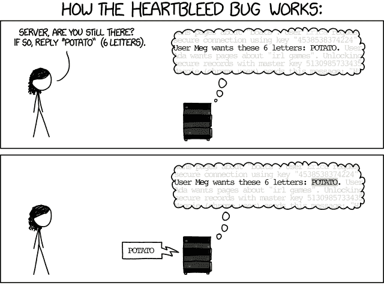
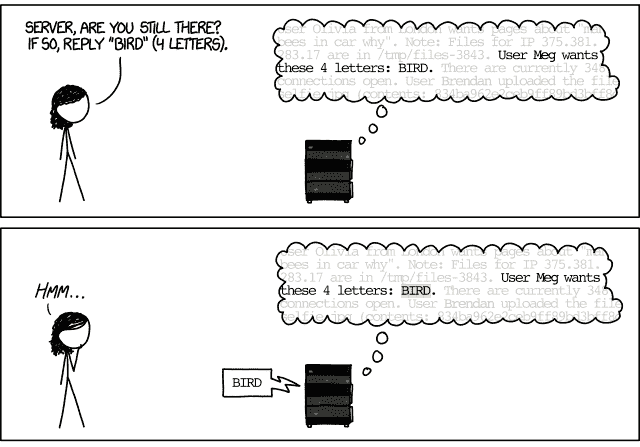
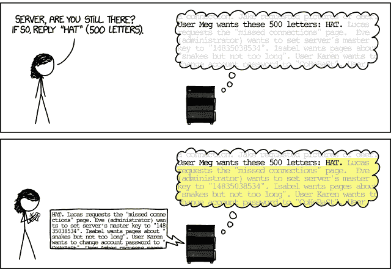

# 模糊测试：使用随机输入打破事物

> 原文： [https://www.fuzzingbook.org/html/Fuzzer.html](https://www.fuzzingbook.org/html/Fuzzer.html)

在本章中，我们将从最简单的测试生成技术之一开始。 随机文本生成（也称为*模糊测试*）的关键思想是将*随机字符字符串*馈入程序，以期发现故障。

**前提条件**

*   您应该了解软件测试的基础知识； 例如，从[一章“软件测试简介”](Intro_Testing.html) 中。
*   您应该对Python有一定的了解； 例如，来自 [Python教程](https://docs.python.org/3/tutorial/)。

我们可以使这些先决条件明确。 首先，我们将导入在笔记本中工作所需的标准软件包。

```py
import [fuzzingbook_utils](https://github.com/uds-se/fuzzingbook/tree/master/notebooks/fuzzingbook_utils)

```

现在，我们显式导入（因此需要）上一章。

```py
import [Intro_Testing](Intro_Testing.html)

```

## 内容提要

要使用本章中提供的代码来[，请编写](Importing.html)

```py
>>> from [fuzzingbook.Fuzzer](Fuzzer.html) import <identifier>

```

然后利用以下功能。

本章提供了两个重要的类，它们在 [A Fuzzing Architecture](#A-Fuzzing-Architecture) 中进行了介绍：

*   `Fuzzer`作为模糊器的基础类； 和
*   `Runner`作为被测程序的基类。

### 模糊器

`Fuzzer`是模糊器的基类，`RandomFuzzer`是简单的实例。 `Fuzzer`对象的`fuzz()`方法返回具有生成的输入的字符串。

```py
>>> random_fuzzer = RandomFuzzer()
>>> random_fuzzer.fuzz()
'%$<1&<%+=!"83?+)9:++9138 42/ "7;0-,)06 "1(2;6>?99$%7!!*#96=>2&-/(5*)=$;0$$+;<12"?30&'

```

`RandomFuzzer()`构造函数允许指定许多关键字参数：

```py
>>> print(RandomFuzzer.__init__.__doc__)
Produce strings of `min_length` to `max_length` characters
           in the range [`char_start`, `char_start` + `char_range`]

>>> random_fuzzer = RandomFuzzer(min_length=10, max_length=20, char_start=65, char_range=26)
>>> random_fuzzer.fuzz()
'XGZVDDPZOOW'

```

### 跑步者

`Fuzzer`可以与`Runner`配对，后者将模糊的字符串作为输入。 其结果是特定于类别的*状态*和*结果*（`PASS`，`FAIL`或`UNRESOLVED`）。 `PrintRunner`会简单地打印出给定的输入并返回`PASS`结果：

```py
>>> print_runner = PrintRunner()
>>> random_fuzzer.run(print_runner)
EQYGAXPTVPJGTYHXFJ

('EQYGAXPTVPJGTYHXFJ', 'UNRESOLVED')

```

`ProgramRunner`将产生的输入馈入外部程序。 其结果是一对程序状态（一个`CompletedProcess`实例）和一个*结果*（`PASS`，`FAIL`或`UNRESOLVED`）：

```py
>>> cat = ProgramRunner('cat')
>>> random_fuzzer.run(cat)
(CompletedProcess(args='cat', returncode=0, stdout='BZOQTXFBTEOVYX', stderr=''),
 'PASS')

```

## 测试分配

模糊测试诞生于“ 1988年秋天的黑暗和暴风雨的夜晚”中[ [Takanen *等人*，2008年。](http://us.artechhouse.com/Fuzzing-for-Software-Security-Testing-and-Quality-Assurance-Second-Edition-P1930.aspx)。 巴顿·米勒教授坐在麦迪逊威斯康星州的公寓里，通过一条1200波特的电话线连接到他的大学计算机。 雷暴在线路上造成噪音，而该噪音又导致两端的UNIX命令获得错误的输入并崩溃。 频繁的崩溃让他感到惊讶-当然，程序应该比这更强大吗？ 作为一名科学家，他想调查问题的严重程度及其原因。 因此，他为威斯康星大学麦迪逊分校的学生编写了*编程练习*-该练习将使他的学生创建第一个模糊测试器。

这是[分配](http://pages.cs.wisc.edu/~bart/fuzz/CS736-Projects-f1988.pdf)的读取方式：

> 在给定不可预测的输入流的情况下，该项目的目标是评估各种UNIX实用程序的健壮性。 [...]首先，您将构建一个*模糊生成器*。 这是一个将输出随机字符流的程序。 其次，您将使用模糊发生器，并使用它来攻击尽可能多的UNIX实用程序，以试图破坏它们。

该任务捕获了模糊测试的本质：*创建随机输入，并查看它们是否破坏东西。* 只要让它运行足够长的时间，您就会看到。

## 一个简单的Fuzzer

让我们尝试完成此任务并构建一个模糊生成器。 这个想法是产生随机字符，将它们添加到缓冲区字符串变量（`out`），最后返回字符串。

此实现使用以下Python功能和特性：

*   `random.randrange(start, end)` –返回随机数$ [$ `start`，`end` $）$
*   `range(start, end)` –创建一个范围为$ [$ `start`，`end` $）$的整数列表。 通常在迭代中使用。
*   `for elem in list: body` –循环执行`body`，其中`elem`从`list`中获取每个值。
*   `for i in range(start, end): body` –用`i`从`start`到`end` $-$循环执行`body`。
*   `chr(n)` –返回带有ASCII码`n`的字符

要使用随机数，我们必须导入相应的模块。

```py
import [random](https://docs.python.org/3/library/random.html)

```

这里是实际的`fuzzer()`功能。

```py
def fuzzer(max_length=100, char_start=32, char_range=32):
    """A string of up to `max_length` characters
 in the range [`char_start`, `char_start` + `char_range`]"""
    string_length = random.randrange(0, max_length + 1)
    out = ""
    for i in range(0, string_length):
        out += chr(random.randrange(char_start, char_start + char_range))
    return out

```

使用其默认参数，`fuzzer()`函数返回一串随机字符：

```py
fuzzer()

```

```py
'!7#%"*#0=)$;%6*;>638:*>80"=</>(/*:-(2<4 !:5*6856&?""11<7+%<%7,4.8,*+&,,$,."'

```

巴特·米勒（Bart Miller）创造了“模糊”一词作为此类随机，非结构化数据的名称。 现在想象一下这个``模糊''字符串是期望特定输入格式的程序的输入-例如，用逗号分隔的值列表或电子邮件地址。 程序是否可以毫无问题地处理这样的输入？

如果上述模糊输入已经很吸引人，请考虑可以轻松设置模糊以产生其他类型的输入。 例如，我们也可以让`fuzzer()`产生一系列小写字母。 我们使用`ord(c)`返回字符`c`的ASCII码。

```py
fuzzer(1000, ord('a'), 26)

```

```py
'zskscocrxllosagkvaszlngpysurezehvcqcghygphnhonehczraznkibltfmocxddoxcmrvatcleysksodzlwmzdndoxrjfqigjhqjxkblyrtoaydlwwisrvxtxsejhfbnforvlfisojqaktcxpmjqsfsycisoexjctydzxzzutukdztxvdpqbjuqmsectwjvylvbixzfmqiabdnihqagsvlyxwxxconminadcaqjdzcnzfjlwccyudmdfceiepwvyggepjxoeqaqbjzvmjdlebxqvehkmlevoofjlilegieeihmetjappbisqgrjhglzgffqrdqcwfmmwqecxlqfpvgtvcddvmwkplmwadgiyckrfjddxnegvmxravaunzwhpfpyzuyyavwwtgykwfszasvlbwojetvcygectelwkputfczgsfsbclnkzzcjfywitooygjwqujseflqyvqgyzpvknddzemkegrjjrshbouqxcmixnqhgsgdwgzwzmgzfajymbcfezqxndbmzwnxjeevgtpjtcwgbzptozflrwvuopohbvpmpaifnyyfvbzzdsdlznusarkmmtazptbjbqdkrsnrpgdffemnpehoapiiudokczwrvpsonybfpaeyorrgjdmgvkvupdtkrequicexqkoikygepawmwsdcrhivoegynnhodfhryeqbebtbqnwhogdfrsrksntqjbocvislhgrgchkhpaiugpbdygwkhrtyniufabdnqhtnwreiascfvmuhettfpbowbjadfxnbtzhobnxsnf'

```

假设程序需要一个标识符作为其输入。 它会期望这么长的标识符吗？

## 模糊外部程序

让我们看看如果我们实际上使用模糊输入调用外部程序会发生什么。 为此，让我们分两步进行。 首先，我们创建带有模糊测试数据的*输入文件*； 然后我们将输入文件输入所选的程序中。

### 创建输入文件

让我们获取一个临时文件名，以免使文件系统混乱。

```py
import [os](https://docs.python.org/3/library/os.html)
import [tempfile](https://docs.python.org/3/library/tempfile.html)

```

```py
basename = "input.txt"
tempdir = tempfile.mkdtemp()
FILE = os.path.join(tempdir, basename)
print(FILE)

```

```py
/var/folders/n2/xd9445p97rb3xh7m1dfx8_4h0006ts/T/tmphvkaqy6w/input.txt

```

现在，我们可以打开该文件进行写入。 Python `open()`函数打开一个文件，然后我们可以在其中写入任意内容。 它通常与`with`语句结合使用，该语句可确保在不再需要该文件时立即将其关闭。

```py
data = fuzzer()
with open(FILE, "w") as f:
    f.write(data)

```

我们可以通过读取其内容来验证该文件是否实际上是创建的：

```py
contents = open(FILE).read()
print(contents)
assert(contents == data)

```

```py
!6"*-2,$994,%*:"$25!2=!+!2#''6/3'4!6%7056'??2#7;75>27'15#-4.?*<?6&" !3'7-5>18%

```

### 调用外部程序

现在我们有了输入文件，我们可以在其上调用程序。 有趣的是，让我们测试`bc`计算器程序，该程序采用算术表达式并对其求值。

要调用`bc`，让我们使用Python `subprocess`模块。 这是这样的：

```py
import [os](https://docs.python.org/3/library/os.html)
import [subprocess](https://docs.python.org/3/library/subprocess.html)

```

```py
program = "bc"
with open(FILE, "w") as f:
    f.write("2 + 2\n")
result = subprocess.run([program, FILE],
                        stdin=subprocess.DEVNULL,
                        stdout=subprocess.PIPE,
                        stderr=subprocess.PIPE,
                        universal_newlines=True)  # Will be "text" in Python 3.7

```

从`result`中，我们可以检查程序输出。 对于`bc`，这是对算术表达式求值的结果：

```py
result.stdout

```

```py
'4\n'

```

我们还可以检查状态。 值为0表示程序正确终止。

```py
result.returncode

```

```py
0

```

任何错误消息都可以在`results.stderr`中找到：

```py
result.stderr

```

```py
''

```

实际上，您可以放入任何您喜欢的程序来代替`bc`。 但是请注意，如果您的程序能够更改甚至损坏系统，则模糊输入很可能包含精确执行此操作的数据或命令。

只是为了好玩，想象一下您将测试一个文件删除程序。 模糊器产生有效文件名的机会是什么？ （请注意，`.`和`/`可能已经是有效的目录名称。）

### 长时间运行的模糊测试

现在让我们将大量输入提供给我们的测试程序，以查看它是否可能在某些程序上崩溃。 我们将所有结果存储在`runs`变量中，作为输入数据对和实际结果对。 （注意：运行此程序可能需要一段时间。）

```py
trials = 100
program = "bc"

runs = []

for i in range(trials):
    data = fuzzer()
    with open(FILE, "w") as f:
        f.write(data)
    result = subprocess.run([program, FILE],
                            stdin=subprocess.DEVNULL,
                            stdout=subprocess.PIPE,
                            stderr=subprocess.PIPE,
                            universal_newlines=True)
    runs.append((data, result))

```

现在，我们可以查询`runs`以获取一些统计信息。 例如，我们可以查询实际通过了多少次运行-也就是说，没有错误消息。 我们在此处使用*列表理解*：形式*表达式* `for` *元素* `in` *列表* `if` *条件[ 如果*条件*为true，则HTG14返回评估的*表达式*的列表，其中每个*元素*来自*列表*。 （实际上，列表推导返回一个*列表生成器*，但出于我们的目的，该生成器的行为类似于列表。）在这里，对于所有元素，其中*表达式*均为1，其中 *]* 条件成立，我们使用`sum()`对列表中的所有元素求和。*

```py
sum(1 for (data, result) in runs if result.stderr == "")

```

```py
4

```

大多数输入显然是无效的-并不奇怪，因为随机输入不太可能包含有效的算术表达式。

让我们看一下第一个错误消息：

```py
errors = [(data, result) for (data, result) in runs if result.stderr != ""]
(first_data, first_result) = errors[0]

print(repr(first_data))
print(first_result.stderr)

```

```py
'5*,55&8>"86,?"/7!1%5-**&-$&)$91;"21(\'8"(%$'
/var/folders/n2/xd9445p97rb3xh7m1dfx8_4h0006ts/T/tmphvkaqy6w/input.txt 1: parse error
/var/folders/n2/xd9445p97rb3xh7m1dfx8_4h0006ts/T/tmphvkaqy6w/input.txt 1: illegal character: &
/var/folders/n2/xd9445p97rb3xh7m1dfx8_4h0006ts/T/tmphvkaqy6w/input.txt 1: parse error
/var/folders/n2/xd9445p97rb3xh7m1dfx8_4h0006ts/T/tmphvkaqy6w/input.txt 1: illegal character: &
/var/folders/n2/xd9445p97rb3xh7m1dfx8_4h0006ts/T/tmphvkaqy6w/input.txt 1: illegal character: $
/var/folders/n2/xd9445p97rb3xh7m1dfx8_4h0006ts/T/tmphvkaqy6w/input.txt 1: illegal character: &
/var/folders/n2/xd9445p97rb3xh7m1dfx8_4h0006ts/T/tmphvkaqy6w/input.txt 1: illegal character: $
/var/folders/n2/xd9445p97rb3xh7m1dfx8_4h0006ts/T/tmphvkaqy6w/input.txt 1: parse error
/var/folders/n2/xd9445p97rb3xh7m1dfx8_4h0006ts/T/tmphvkaqy6w/input.txt 1: illegal character: $

```

除了`illegal character`，`parse error`或`syntax error`之外，是否还运行其他消息？ （例如，类似`crash`或`you found a fatal bug`的东西？）不是很多：

```py
[result.stderr for (data, result) in runs if
 result.stderr != ""
 and "illegal character" not in result.stderr
 and "parse error" not in result.stderr
 and "syntax error" not in result.stderr]

```

```py
[]

```

也许崩溃只是通过`bc`来指示。 不幸的是，返回码永远不会非零：

```py
sum(1 for (data, result) in runs if result.returncode != 0)

```

```py
0

```

我们再让上面的`bc`测试运行怎么样？ 在运行的同时，让我们看一下1989年的技术水平。

## 错误检测器查找

当Miller和他的学生在1989年运行他们的第一个模糊器时，他们发现了一个令人震惊的结果：大约**三分之一的UNIX实用程序**遇到了问题–当遇到模糊的输入时，它们崩溃，挂起或以其他方式失败[ [Miller *等*，1990。](https://doi.org/10.1145/96267.96279)。 这也包括上面的`bc`程序。 （显然，这些错误现已修复！）

考虑到这些UNIX实用程序中有许多都是在脚本中使用的，这些脚本也将处理网络输入，因此这是一个令人震惊的结果。 程序员迅速构建并运行了自己的模糊器，急于修复所报告的错误，并学会了不再信任外部输入。

米勒的模糊实验发现了什么问题？ 事实证明，程序员在1990年犯的错误仍然与今天犯的错误相同。

### 缓冲区溢出

许多程序具有输入和输入元素的内置最大长度。 在像C这样的语言中，很容易超出这些长度，而无需程序（或程序员）甚至注意到，就触发了**缓冲区溢出**。 例如，以下代码即使`input`具有八个以上的字符，也很乐意将`input`字符串复制到`weekday`字符串中：

```py
char weekday[9]; // 8 characters + trailing '\0' terminator
strcpy (weekday, input);

```

具有讽刺意味的是，如果`input`为`"Wednesday"`（9个字符），则此操作已失败； 任何多余的字符（此处为`'y'`和以下`'\0'`字符串终止符）都将被简单复制到`weekday`之后的内存中，从而触发任意行为； 也许是一些布尔字符变量，可以将其设置为`'n'`至`'y'`。 使用模糊测试，很容易产生任意长的输入和输入元素。

我们可以在Python函数中轻松模拟这种缓冲区溢出行为：

```py
def crash_if_too_long(s):
    buffer = "Thursday"
    if len(s) > len(buffer):
        raise ValueError

```

是的，它很快崩溃了。

```py
from [ExpectError](ExpectError.html) import ExpectError

```

```py
trials = 100
with ExpectError():
    for i in range(trials):
        s = fuzzer()
        crash_if_too_long(s)

```

```py
Traceback (most recent call last):
  File "<ipython-input-23-f83db3d59a06>", line 5, in <module>
    crash_if_too_long(s)
  File "<ipython-input-21-928c2d2de976>", line 4, in crash_if_too_long
    raise ValueError
ValueError (expected)

```

上面代码中的`with ExpectError()`行可确保打印错误消息，但继续执行； 这是为了将其他代码示例中的“意外”错误与“意外”错误区分开。

### 缺少错误检查

许多编程语言没有例外，但是在特殊情况下，函数会返回特殊的**错误代码**。 例如，C函数`getchar()`通常从标准输入返回一个字符； 如果没有输入可用，它将返回特殊值`EOF`（文件末尾）。 现在假设程序员正在扫描输入中的下一个字符，并使用`getchar()`读取字符，直到读取空格为止：

```py
while (getchar() != ' ') {
}

```

如果输入过早结束（如模糊测试完全可行），会发生什么情况？ 好吧，`getchar()`返回`EOF`，并在再次调用时继续返回`EOF`； 所以上面的代码只是进入一个无限循环。

同样，我们可以模拟这种丢失的错误检查。 如果输入中没有空格，此函数将有效挂起：

```py
def hang_if_no_space(s):
    i = 0
    while True:
        if i < len(s):
            if s[i] == ' ':
                break
        i += 1

```

使用我们的[测试简介](Intro_Testing.html)中的超时机制，我们可以在一段时间后中断此功能。 是的，经过一些模糊的输入后，它确实挂起了。

```py
from [ExpectError](ExpectError.html) import ExpectTimeout

```

```py
trials = 100
with ExpectTimeout(2):
    for i in range(trials):
        s = fuzzer()
        hang_if_no_space(s)

```

```py
Traceback (most recent call last):
  File "<ipython-input-26-8e40f7d62a1b>", line 5, in <module>
    hang_if_no_space(s)
  File "<ipython-input-24-5f437edacff4>", line 4, in hang_if_no_space
    if i < len(s):
  File "<ipython-input-24-5f437edacff4>", line 4, in hang_if_no_space
    if i < len(s):
  File "<string>", line 16, in check_time
TimeoutError (expected)

```

上面代码中的`with ExpectTimeout()`行可确保在两秒钟后中断内含代码的执行，并打印错误消息。

### 流氓编号

通过模糊处理，很容易在输入中生成**罕见值**，从而引起各种有趣的行为。 再次考虑下面的C语言代码，该代码首先从输入中读取缓冲区大小，然后分配给定大小的缓冲区：

```py
char *read_input() {
    size_t size = read_buffer_size();
    char *buffer = (char *)malloc(size);
    // fill buffer
    return (buffer);
}

```

如果`size`很大，超过了程序存储器，该怎么办？ 如果`size`少于后面的字符数会怎样？ 如果`size`为负会怎样？ 通过在此处提供随机数，模糊处理可以造成各种损害。

同样，我们可以轻松地在Python中模拟此类流氓数字。 如果传递的值（字符串）在转换为整数后过大，则函数`collapse_if_too_large()`将失败。

```py
def collapse_if_too_large(s):
    if int(s) > 1000:
        raise ValueError

```

我们可以让`fuzzer()`创建一个数字字符串：

```py
long_number = fuzzer(100, ord('0'), 10)
print(long_number)

```

```py
7056414967099541967374507745748918952640135045

```

如果我们将这些数字输入`collapse_if_too_large()`，它将很快失败。

```py
with ExpectError():
    collapse_if_too_large(long_number)

```

```py
Traceback (most recent call last):
  File "<ipython-input-29-7a1817f3dbfc>", line 2, in <module>
    collapse_if_too_large(long_number)
  File "<ipython-input-27-2c22a83a4dca>", line 3, in collapse_if_too_large
    raise ValueError
ValueError (expected)

```

如果我们真的想在系统上分配那么多的内存，那么让内存如上所述快速失败实际上是更好的选择。 实际上，内存不足可能会极大地减慢系统的运行速度，甚至导致它们完全无法响应–并且重启是唯一的选择。

可能有人争辩说，这些都是不良编程或不良编程语言的问题。 但是，每天都有成千上万的人开始编程，甚至在今天，所有人都一次又一次地犯同样的错误。

## 捕获错误

当Miller和他的学生建造第一个模糊器时，他们可以仅仅因为程序崩溃或挂起就能识别错误-这两个条件很容易识别。 但是，如果故障更加微妙，我们需要进行其他检查。

### 通用检查器

如上文所讨论的，缓冲区溢出是一个更普遍问题的特定实例：在诸如C和C ++之类的语言中，程序可以访问其内存的任意部分-甚至包括那些未初始化，已经释放或已释放的部分。 根本不是您要访问的数据结构的一部分。 如果您要编写一个操作系统，这是必需的；如果要获得最大的性能或控制，那是非常好的，但是如果要避免错误，那是非常糟糕的。 幸运的是，有一些工具可以在运行时帮助捕获此类问题，并且与模糊测试结合使用时，它们非常有用。

#### 检查内存访问

为了在测试期间捕获有问题的内存访问，可以在特殊的*内存检查*环境中运行C程序； 在运行时，它们检查每个内存操作是否访问有效和初始化的内存。 一个流行的例子是 [LLVM Address Sanitizer](https://clang.llvm.org/docs/AddressSanitizer.html) ，它检测整套潜在的危险内存安全违规行为。 在下面的示例中，我们将使用此工具编译一个相当简单的C程序，并通过读取内存的已分配部分来引发越界读取。

```py
with open("program.c", "w") as f:
    f.write("""
#include <stdlib.h>
#include <string.h>

int main(int argc, char** argv) {
 /* Create an array with 100 bytes, initialized with 42 */
 char *buf = malloc(100);
 memset(buf, 42, 100);

 /* Read the N-th element, with N being the first command-line argument */
 int index = atoi(argv[1]);
 char val = buf[index];

 /* Clean up memory so we don't leak */
 free(buf);
 return val;
}
 """)

```

```py
from [fuzzingbook_utils](https://github.com/uds-se/fuzzingbook/tree/master/notebooks/fuzzingbook_utils) import print_file

```

```py
print_file("program.c")

```

```py
#include <stdlib.h>
#include <string.h>

int main(int argc, char** argv) {
    /* Create an array with 100 bytes, initialized with 42 */
    char *buf = malloc(100);
    memset(buf, 42, 100);

    /* Read the N-th element, with N being the first command-line argument */
    int index = atoi(argv[1]);
    char val = buf[index];

    /* Clean up memory so we don't leak */
    free(buf);
    return val;
}

```

我们在启用地址清理的情况下编译此C程序：

```py
!clang -fsanitize=address -g -o program program.c

```

如果我们使用参数`99`运行该程序，则它将返回`buf[99]`，即42。

```py
!./program 99; echo $?

```

```py
42

```

但是，访问`buf[110]`会导致AddressSanitizer中出现越界错误。

```py
!./program 110

```

```py
=================================================================
==55061==ERROR: AddressSanitizer: heap-buffer-overflow on address 0x60b0000000ae at pc 0x00010bca1ea5 bp 0x7ffee3f5e4a0 sp 0x7ffee3f5e498 READ of size 1 at 0x60b0000000ae thread T0
    #0 0x10bca1ea4 in main program.c:12
    #1 0x7fff65c683d4 in start (libdyld.dylib:x86_64+0x163d4)

0x60b0000000ae is located 10 bytes to the right of 100-byte region [0x60b000000040,0x60b0000000a4) allocated by thread T0 here:
    #0 0x10bd06053 in wrap_malloc (libclang_rt.asan_osx_dynamic.dylib:x86_64h+0x5c053)
    #1 0x10bca1df4 in main program.c:7
    #2 0x7fff65c683d4 in start (libdyld.dylib:x86_64+0x163d4)

SUMMARY: AddressSanitizer: heap-buffer-overflow program.c:12 in main
Shadow bytes around the buggy address:
  0x1c15ffffffc0: 00 00 00 00 00 00 00 00 00 00 00 00 00 00 00 00
  0x1c15ffffffd0: 00 00 00 00 00 00 00 00 00 00 00 00 00 00 00 00
  0x1c15ffffffe0: 00 00 00 00 00 00 00 00 00 00 00 00 00 00 00 00
  0x1c15fffffff0: 00 00 00 00 00 00 00 00 00 00 00 00 00 00 00 00
  0x1c1600000000: fa fa fa fa fa fa fa fa 00 00 00 00 00 00 00 00
=>0x1c1600000010: 00 00 00 00 04[fa]fa fa fa fa fa fa fa fa fa fa
  0x1c1600000020: fa fa fa fa fa fa fa fa fa fa fa fa fa fa fa fa
  0x1c1600000030: fa fa fa fa fa fa fa fa fa fa fa fa fa fa fa fa
  0x1c1600000040: fa fa fa fa fa fa fa fa fa fa fa fa fa fa fa fa
  0x1c1600000050: fa fa fa fa fa fa fa fa fa fa fa fa fa fa fa fa
  0x1c1600000060: fa fa fa fa fa fa fa fa fa fa fa fa fa fa fa fa
Shadow byte legend (one shadow byte represents 8 application bytes):
  Addressable:           00
  Partially addressable: 01 02 03 04 05 06 07 
  Heap left redzone:       fa
  Freed heap region:       fd
  Stack left redzone:      f1
  Stack mid redzone:       f2
  Stack right redzone:     f3
  Stack after return:      f5
  Stack use after scope:   f8
  Global redzone:          f9
  Global init order:       f6
  Poisoned by user:        f7
  Container overflow:      fc
  Array cookie:            ac
  Intra object redzone:    bb
  ASan internal:           fe
  Left alloca redzone:     ca
  Right alloca redzone:    cb
  Shadow gap:              cc
==55061==ABORTING

```

如果您想在C程序中发现错误，则为模糊测试打开此类检查相当容易。 根据工具的不同，它会将执行速度降低一定程度（对于AddressSanitizer，通常为2 $ \ times $），并且还会消耗更多的内存，但是与人工发现这些bug相比，CPU周期非常便宜。

对内存的越界访问具有很大的安全风险，因为它们可能使攻击者访问甚至修改并非针对他们的信息。 作为一个著名的例子， [HeartBleed错误](https://en.wikipedia.org/wiki/Heartbleed)是OpenSSL库中的安全错误，它实现了加密协议，该协议提供了计算机网络上的通信安全性。 （如果您在浏览器中阅读此文本，则可能已使用这些协议对其进行了加密。）

通过向SSL *心跳*服务发送特制命令来利用HeartBleed错误。 心跳服务用于检查另一端的服务器是否仍在运行。 客户端会向服务发送一个字符串，例如

```py
BIRD (4 letters)
```

服务器将向其回复`BIRD`，并且客户端将知道该服务器处于活动状态。

不幸的是，可以通过要求服务器以比请求的字母集多*的*答复来利用此服务。 在 [XKCD漫画](https://xkcd.com/1354/)中对此进行了很好的解释：**







在OpenSSL实现中，这些内存内容可能涉及加密证书，私钥等，而且更糟的是，没有人会注意到刚刚访问了该内存。 发现HeartBleed错误后，它已经存在了很多年，没有人会知道是否泄漏了哪些秘密；哪些秘密已经泄漏。 快速设置的 [HeartBleed公告页面](http://heartbleed.com/)就说明了一切。

但是如何发现HeartBleed？ 很简单。 Codenomicon公司以及Google的研究人员都使用内存清理器编译了OpenSSL库，然后用模糊的命令高兴地将其淹没。 然后，内存清理程序会注意到是否发生了越界内存访问-实际上，它将很快发现这一点。

内存检查器只是众多检查器之一，可在模糊检查期间运行该检查器以检测运行时错误。 在有关挖掘功能规范的[一章中，我们将了解有关如何定义通用检查器的更多信息。](DynamicInvariants.html)

我们已经完成了`program`，所以我们清理一下：

```py
!rm -fr program program.*

```

#### 信息泄漏

信息泄漏不仅可能通过非法内存访问而发生； 它们也可能出现在``有效''内存中-如果此``有效''内存包含不应泄漏的敏感信息。 让我们在Python程序中说明此问题。 首先，让我们创建一些程序存储器，其中填充了实际数据和随机数据：

```py
secrets = ("<space for reply>" + fuzzer(100)
     + "<secret-certificate>" + fuzzer(100)
     + "<secret-key>" + fuzzer(100) + "<other-secrets>")

```

我们向`secrets`添加更多“内存”字符，并用`"deadbeef"`填充作为未初始化内存的标记：

```py
uninitialized_memory_marker = "deadbeef"
while len(secrets) < 2048:
    secrets += uninitialized_memory_marker

```

我们定义了一个服务（类似于上面讨论的心跳服务），该服务将接收答复并发送回一个长度。 它会将要发送的回复存储在内存中，然后以给定的长度发送回去。

```py
def heartbeat(reply, length, memory):
    # Store reply in memory
    memory = reply + memory[len(reply):]

    # Send back heartbeat
    s = ""
    for i in range(length):
        s += memory[i]
    return s

```

这非常适合标准字符串：

```py
heartbeat("potato", 6, memory=secrets)

```

```py
'potato'

```

```py
heartbeat("bird", 4, memory=secrets)

```

```py
'bird'

```

但是，如果该长度大于应答字符串的长度，则会溢出其他内存内容。 请注意，所有这些仍然在常规数组范围内发生，因此不会触发地址清理器：

```py
heartbeat("hat", 500, memory=secrets)

```

```py
'hatace for reply>#,,!3?30>#61)$4--8=<7)4 )03/%,5+! "4)0?.9+?3();<42?=?0<secret-certificate>7(+/+((1)#/0\'4!>/<#=78%6$!!$<-"3"\'-?1?85!05629%/); *)1\'/=9%<secret-key>.(#.4%<other-secrets>deadbeefdeadbeefdeadbeefdeadbeefdeadbeefdeadbeefdeadbeefdeadbeefdeadbeefdeadbeefdeadbeefdeadbeefdeadbeefdeadbeefdeadbeefdeadbeefdeadbeefdeadbeefdeadbeefdeadbeefdeadbeefdeadbeefdeadbeefdeadbeefdeadbeefdeadbeefdeadbeefdeadbeefdeadbeefdeadbeefdeadbeefdeadbeefdeadbeefdeadbeefdeadbeefdeadbeefdeadbeefdeadbeefdeadbeefdeadb'

```

一个人如何发现此类问题？ 这个想法是要识别不应该泄漏的信息，例如给定的机密，以及未初始化的内存。 我们可以在一个小的Python示例中模拟这样的检查：

```py
from [ExpectError](ExpectError.html) import ExpectError

```

```py
with ExpectError():
    for i in range(10):
        s = heartbeat(fuzzer(), random.randint(1, 500), memory=secrets)
        assert not s.find(uninitialized_memory_marker)
        assert not s.find("secret")

```

```py
Traceback (most recent call last):
  File "<ipython-input-44-b7e8a1210599>", line 4, in <module>
    assert not s.find(uninitialized_memory_marker)
AssertionError (expected)

```

通过这种检查，我们发现机密和/或未初始化的内存确实泄漏了。 在有关信息流的[一章中，我们将讨论如何自动执行此操作，“污染”敏感信息及其衍生的值，并确保“污染”的值不会泄漏出去。](InformationFlow.html)

根据经验，在进行模糊测试时，应始终*启用尽可能多的自动检查器*。 CPU周期便宜，错误也很昂贵。 如果只执行该程序而没有实际检测错误的选项，那么您将失去几个机会。

### 程序特定的检查器

除了适用于给定平台或给定语言的*所有*程序的通用检查器之外，您还可以设计适用于您的程序或子系统的*特定*检查器。 在有关测试的[一章中，我们已经暗示了](Intro_Testing.html)[运行时验证](Intro_Testing.html#Runtime-Verification)的技术，该技术在运行时检查函数结果的正确性。

尽早发现错误的一个关键思想是*断言*的概念–用来检查重要功能的输入（前提）和结果（前提条件）的谓词。 程序中的断言越多，执行过程中检测到一般检查程序无法检测到的错误的机会就越高，尤其是在模糊测试期间。 如果您担心断言对性能的影响，请记住可以在生产代码中关闭断言（尽管将最关键的检查保持活动状态会有所帮助）。

断言查找错误最重要的用途之一是*检查复杂数据结构的完整性。* 让我们用一个简单的例子来说明这个概念。 假设我们有一个机场代码到机场的映射，如

```py
airport_codes = {
    "YVR": "Vancouver",
    "JFK": "New York-JFK",
    "CDG": "Paris-Charles de Gaulle",
    "CAI": "Cairo",
    "LED": "St. Petersburg",
    "PEK": "Beijing",
    "HND": "Tokyo-Haneda",
    "AKL": "Auckland"
}  # plus many more

```

```py
airport_codes["YVR"]

```

```py
'Vancouver'

```

```py
"AKL" in airport_codes

```

```py
True

```

机场代码清单可能非常重要：如果我们在任何机场代码中都有拼写错误，这可能会影响我们拥有的任何应用程序。 因此，我们引入了一个检查列表一致性的功能。 一致性条件称为*表示不变式*，因此检查该一致性条件的函数（或方法）通常被命名为`repOK()`以表示“表示还可以”。

首先，让我们检查一下各个机场代码。 如果代码不一致，则检查器将失败。

```py
def code_repOK(code):
    assert len(code) == 3, "Airport code must have three characters: " + repr(code)
    for c in code:
        assert c.isalpha(), "Non-letter in airport code: " + repr(code)
        assert c.isupper(), "Lowercase letter in airport code: " + repr(code)
    return True

```

```py
assert code_repOK("SEA")

```

现在，我们可以使用`code_repOK()`检查列表中的所有元素：

```py
def airport_codes_repOK():
    for code in airport_codes:
        assert code_repOK(code)
    return True

```

```py
with ExpectError():
    assert airport_codes_repOK()

```

如果将无效元素添加到列表，则检查将失败：

```py
airport_codes["YMML"] = "Melbourne"

```

```py
with ExpectError():
    assert airport_codes_repOK()

```

```py
Traceback (most recent call last):
  File "<ipython-input-53-21eb3b08ef3e>", line 2, in <module>
    assert airport_codes_repOK()
  File "<ipython-input-50-f8128f7dc918>", line 3, in airport_codes_repOK
    assert code_repOK(code)
  File "<ipython-input-48-345123a45730>", line 2, in code_repOK
    assert len(code) == 3, "Airport code must have three characters: " + repr(code)
AssertionError: Airport code must have three characters: 'YMML' (expected)

```

当然，除了直接操作列表之外，我们还有添加元素的特殊功能。 然后还可以检查代码是否有效：

```py
def add_new_airport(code, city):
    assert code_repOK(code)
    airport_codes[code] = city

```

```py
with ExpectError():  # For BER, ExpectTimeout would be more appropriate
    add_new_airport("BER", "Berlin")

```

此检查还使我们能够找出参数列表中的错误：

```py
with ExpectError():
    add_new_airport("London-Heathrow", "LHR")

```

```py
Traceback (most recent call last):
  File "<ipython-input-56-6aeb45bf2b91>", line 2, in <module>
    add_new_airport("London-Heathrow", "LHR")
  File "<ipython-input-54-f4d30ab4bf9e>", line 2, in add_new_airport
    assert code_repOK(code)
  File "<ipython-input-48-345123a45730>", line 2, in code_repOK
    assert len(code) == 3, "Airport code must have three characters: " + repr(code)
AssertionError: Airport code must have three characters: 'London-Heathrow' (expected)

```

但是，为了进行最大程度的检查，`add_new_airport()`功能还可以确保正确显示机场代码列表-之前的*和更改*之后的*。*

```py
def add_new_airport(code, city):
    assert code_repOK(code)
    assert airport_codes_repOK()
    airport_codes[code] = city
    assert airport_codes_repOK()

```

这捕获了前面介绍的不一致之处：

```py
with ExpectError():
    add_new_airport("IST", "Istanbul Yeni Havalimanı")

```

```py
Traceback (most recent call last):
  File "<ipython-input-58-a80a619d120e>", line 2, in <module>
    add_new_airport("IST", "Istanbul Yeni Havalimanı")
  File "<ipython-input-57-93da9120109e>", line 3, in add_new_airport
    assert airport_codes_repOK()
  File "<ipython-input-50-f8128f7dc918>", line 3, in airport_codes_repOK
    assert code_repOK(code)
  File "<ipython-input-48-345123a45730>", line 2, in code_repOK
    assert len(code) == 3, "Airport code must have three characters: " + repr(code)
AssertionError: Airport code must have three characters: 'YMML' (expected)

```

您的代码中存在的`repOK()`断言越多，捕获的错误就越多-即使是仅针对您的域和问题的错误。 最重要的是，此类断言记录了您在编程过程中做出的假设，从而帮助其他程序员理解您的代码并防止错误。

最后一个例子是让我们考虑一个相当复杂的数据结构-[红黑树](https://en.wikipedia.org/wiki/Red-black_tree)，这是一种自平衡二进制搜索树。 实施一棵红黑树并不难，但是即使对有经验的程序员来说，正确地实施它也可能要花费几个小时。 但是，`repOK()`方法记录所有假设并进行检查：

```py
class RedBlackTree:
    def repOK(self):
        assert self.rootHasNoParent()
        assert self.rootIsBlack()
        assert self.rootNodesHaveOnlyBlackChildren()
        assert self.treeIsAcyclic()
        assert self.parentsAreConsistent()
        return True

    def rootIsBlack(self):
        if self.parent is None:
            assert self.color == BLACK
        return True

    def add_element(self, elem):
        assert self.repOK()
        # Add the element
        assert self.repOK()

    def delete_element(self, elem):
        assert self.repOK()
        # Delete the element
        assert self.repOK()

```

在此，`repOK()`是在`RedBlackTree`类的对象上运行的方法。 它运行五种不同的检查，所有检查都有自己的断言。 每当添加或删除元素时，所有这些一致性检查都会自动运行。 如果您有任何错误，检查器会找到它们-当然，如果您通过足够多的模糊输入来运行树。

### 静态代码检查器

通过在代码上使用*静态类型检查器*，也可以从`repOK()`断言中获得很多好处。 例如，在Python中，只要正确声明了参数的类型， [MyPy](http://mypy-lang.org) 静态检查器就可以发现类型错误：

```py
from [typing](https://docs.python.org/3/library/typing.html) import Dict

airport_codes = {
    "YVR": "Vancouver",  # etc
}  # type: Dict[str, str]

```

如果我们现在添加一个非字符串类型的键，如

```py
airport_codes[1] = "First"

```

这将被MyPy立即捕获：

```py
$ mypy airports.py
airports.py: error: Invalid index type "int" for "Dict[str, str]"; expected type "str"

```

静态检查更高级的属性，例如由完全由三个大写字符组成的机场代码或非循环的树，但是，它们很快达到了静态检查的极限。 仍然需要您的`repOK()`断言–最好与良好的测试生成器结合使用。

## 模糊结构

由于我们希望在以后的章节中重用本章的某些部分，因此让我们以一种易于重用的方式（尤其是*扩展*）的方式定义事物。 为此，我们引入了许多*类*，它们以可重用的方式封装了上述功能。

### 跑步者类

我们介绍的第一件事是`Runner`的概念–即，一个对象的工作是使用给定的输入执行某些对象。 运行程序通常是受测试的某些程序或函数，但我们也可以使用更简单的运行程序。

让我们从跑步者的基础课开始。 运行程序实质上提供了一种方法`run(input)`，该方法用于将`input`（字符串）传递给运行程序。 `run()`返回一对（`result`和`outcome`）。 在这里，`result`是跑步者特定的值，提供跑步的细节； `outcome`是将结果分为三类的值：

*   `Runner.PASS` –测试*通过了*。 运行产生正确的结果。
*   `Runner.FAIL` –测试*失败*。 运行产生不正确的结果。
*   `Runner.UNRESOLVED` –测试未通过或未通过。 如果无法进行运行，则会发生这种情况-例如，由于输入无效。

```py
class Runner(object):
    # Test outcomes
    PASS = "PASS"
    FAIL = "FAIL"
    UNRESOLVED = "UNRESOLVED"

    def __init__(self):
        """Initialize"""
        pass

    def run(self, inp):
        """Run the runner with the given input"""
        return (inp, Runner.UNRESOLVED)

```

作为基本类，`Runner`仅为在其上构建的更复杂的运行程序提供接口。 更具体地说，我们引入*子类*，*继承其超类的方法，以添加其他方法或覆盖继承的方法。*

这是此类子类的一个示例：`PrintRunner`会简单地打印出赋予它的所有内容，从而覆盖继承的`run()`方法。 在许多情况下，这是默认运行程序。

```py
class PrintRunner(Runner):
    def run(self, inp):
        """Print the given input"""
        print(inp)
        return (inp, Runner.UNRESOLVED)

```

```py
p = PrintRunner()
(result, outcome) = p.run("Some input")

```

```py
Some input

```

结果就是我们作为输入传递的字符串：

```py
result

```

```py
'Some input'

```

到目前为止，我们仍无法对程序行为进行分类：

```py
outcome

```

```py
'UNRESOLVED'

```

`ProgramRunner`类将输入发送到程序的标准输入。 创建`ProgramRunner`对象时指定程序。

```py
class ProgramRunner(Runner):
    def __init__(self, program):
        """Initialize.  `program` is a program spec as passed to `subprocess.run()`"""
        self.program = program

    def run_process(self, inp=""):
        """Run the program with `inp` as input.  Return result of `subprocess.run()`."""
        return subprocess.run(self.program,
                              input=inp,
                              stdout=subprocess.PIPE,
                              stderr=subprocess.PIPE,
                              universal_newlines=True)

    def run(self, inp=""):
        """Run the program with `inp` as input.  Return test outcome based on result of `subprocess.run()`."""
        result = self.run_process(inp)

        if result.returncode == 0:
            outcome = self.PASS
        elif result.returncode < 0:
            outcome = self.FAIL
        else:
            outcome = self.UNRESOLVED

        return (result, outcome)

```

这是二进制（即非文本）输入和输出的变体。

```py
class BinaryProgramRunner(ProgramRunner):
    def run_process(self, inp=""):
        """Run the program with `inp` as input.  Return result of `subprocess.run()`."""
        return subprocess.run(self.program,
                              input=inp.encode(),
                              stdout=subprocess.PIPE,
                              stderr=subprocess.PIPE)

```

让我们使用`cat`程序演示`ProgramRunner`，该程序将其输入复制到其输出。 我们看到`cat`的标准调用仅完成了工作，`cat`的输出与其输入相同：

```py
cat = ProgramRunner(program="cat")
cat.run("hello")

```

```py
(CompletedProcess(args='cat', returncode=0, stdout='hello', stderr=''), 'PASS')

```

### 模糊器类别

现在让我们定义一个*模糊器*，它实际上将数据馈送到使用者。 模糊器的基类提供了一种创建某些输入的中央方法`fuzz()`。 然后，`run()`函数将fuzz（）输入发送给跑步者，返回结果； `runs()`会执行给定次数（`trials`）。

```py
class Fuzzer(object):
    def __init__(self):
        pass

    def fuzz(self):
        """Return fuzz input"""
        return ""

    def run(self, runner=Runner()):
        """Run `runner` with fuzz input"""
        return runner.run(self.fuzz())

    def runs(self, runner=PrintRunner(), trials=10):
        """Run `runner` with fuzz input, `trials` times"""
        # Note: the list comprehension below does not invoke self.run() for subclasses
        # return [self.run(runner) for i in range(trials)]
        outcomes = []
        for i in range(trials):
            outcomes.append(self.run(runner))
        return outcomes

```

默认情况下，`Fuzzer`对象不执行任何操作，因为它们的`fuzz()`函数只是一个抽象占位符。 但是，子类`RandomFuzzer`实现上述`fuzzer()`函数的功能，并添加了附加参数`min_length`以指定最小长度。

```py
class RandomFuzzer(Fuzzer):
    def __init__(self, min_length=10, max_length=100,
                 char_start=32, char_range=32):
        """Produce strings of `min_length` to `max_length` characters
 in the range [`char_start`, `char_start` + `char_range`]"""
        self.min_length = min_length
        self.max_length = max_length
        self.char_start = char_start
        self.char_range = char_range

    def fuzz(self):
        string_length = random.randrange(self.min_length, self.max_length + 1)
        out = ""
        for i in range(0, string_length):
            out += chr(random.randrange(self.char_start,
                                        self.char_start + self.char_range))
        return out

```

使用`RandomFuzzer`，我们现在可以创建一个模糊器，在创建模糊器时只需配置一次即可。

```py
random_fuzzer = RandomFuzzer(min_length=20, max_length=20)
for i in range(10):
    print(random_fuzzer.fuzz())

```

```py
'>23>33)(&"09.377.*3
*+:5 ? (?1$4<>!?3>.'
4+3/(3 (0%!>!(+9%,#$
/51$2964>;)2417<9"2&
907.. !7:&--"=$7',7*
(5=5'.!*+&>")6%9)=,/
?:&5) ";.0!=6>3+>)=,
6&,?:!#2))- ?:)=63'-
,)9#839%)?&(0<6("*;)
4?!(49+8=-'&499%?< '

```

现在，我们可以将此类生成的输入发送到我们先前定义的`cat`运行器，验证`cat`实际上确实将其（模糊的）输入复制到其输出中。

```py
for i in range(10):
    inp = random_fuzzer.fuzz()
    result, outcome = cat.run(inp)
    assert result.stdout == inp
    assert outcome == Runner.PASS

```

但是，将`Fuzzer`与`Runner`组合在一起非常普遍，我们可以为此目的使用`Fuzzer`类提供的`run()`方法：

```py
random_fuzzer.run(cat)

```

```py
(CompletedProcess(args='cat', returncode=0, stdout='?:+= % <1<6$:(>=:9)5', stderr=''),
 'PASS')

```

使用`runs()`，我们可以重复执行一次模糊测试，以获得结果列表。

```py
random_fuzzer.runs(cat, 10)

```

```py
[(CompletedProcess(args='cat', returncode=0, stdout='3976%%&+%6=(1)3&3:<9', stderr=''),
  'PASS'),
 (CompletedProcess(args='cat', returncode=0, stdout='33$#42$ 11=*%$20=<.-', stderr=''),
  'PASS'),
 (CompletedProcess(args='cat', returncode=0, stdout='"?<\'#8 </:*%9.--\'97!', stderr=''),
  'PASS'),
 (CompletedProcess(args='cat', returncode=0, stdout="/0-#(03/!#60'+6>&&72", stderr=''),
  'PASS'),
 (CompletedProcess(args='cat', returncode=0, stdout="=,+:,6'5:950+><3(*()", stderr=''),
  'PASS'),
 (CompletedProcess(args='cat', returncode=0, stdout=" 379+0?'%3137=2:4605", stderr=''),
  'PASS'),
 (CompletedProcess(args='cat', returncode=0, stdout="02>!$</'*81.#</22>+:", stderr=''),
  'PASS'),
 (CompletedProcess(args='cat', returncode=0, stdout="=-<'3-#88*%&*9< +1&&", stderr=''),
  'PASS'),
 (CompletedProcess(args='cat', returncode=0, stdout='2;;0=3&6=8&30&<-;?*;', stderr=''),
  'PASS'),
 (CompletedProcess(args='cat', returncode=0, stdout='/#05=*3($>::#7!0=12+', stderr=''),
  'PASS')]

```

有了这一点，我们就可以创建模糊器了-从本章介绍的简单随机模糊器开始，甚至要先进得多。 敬请关注！

## 经验教训

*   随机生成输入（“模糊测试”）是一种简单，经济高效的方法，可以快速测试任意程序的健壮性。
*   模糊器发现的错误主要是由于*输入处理*中的错误和不足。
*   要捕获错误，请尽可能多地使用*一致性检查器*。

我们已经完成了，所以不要忘记清理：

```py
os.remove(FILE)
os.removedirs(tempdir)

```

## 后续步骤

在这里，您可以探索如何

*   [在现有输入上使用*突变*获得更多有效输入](MutationFuzzer.html)
*   [使用*语法*指定输入格式，从而获得更多有效输入](Grammars.html)
*   [减少*失败的输入*，以进行有效的调试](Reducer.html)

享受阅读！

## 背景

一般而言，有关生成软件测试的书籍很少（这就是我们编写这本书的原因）。 尽管有一些关于*模糊测试的书籍*，但也基于本章介绍的基本模糊测试技术：

*   《模糊测试-蛮力漏洞发现》一书涵盖了广泛的模糊测试领域，包括文件，网页，环境变量和网络协议。 作者从Microsoft的模糊测试中获得了很多经验，并包括了许多用于Windows和UNIX程序的现成工具。 工具已经有些老化，但是原理仍然存在。

*   《软件安全测试和质量保证的模糊测试》一书[ [Takanen *等人*，2008年。](http://us.artechhouse.com/Fuzzing-for-Software-Security-Testing-and-Quality-Assurance-Second-Edition-P1930.aspx)]现已出版，2018年第二版，涵盖了广泛的模糊测试工具和检测技术 ; 其作者从安全测试和漏洞发现中获得了丰富的经验。 这可以说是该领域最全面，最新的书籍之一。

特别是在本章中，有关模糊测试的开创性工作（介绍术语和方法）是“ UNIX实用程序可靠性的实证研究” [Miller *等人*，1990年。](https://doi.org/10.1145/96267.96279) ]。 作为该领域的基础，这对于任何对模糊测试和鲁棒性测试感兴趣的人都必须阅读，其观察与30年前一样有效。

## 练习

米勒等人发现的错误之一。 [ [Miller *等人*，1990。](https://doi.org/10.1145/96267.96279)]涉及 *troff* 排版系统。 *Troff* 接受由行组成的文本作为输入； 以点开头的行（`.`）包含排版命令，如

```py
.NH
Some Heading
.LP
Some paragraph
```

这将产生（使用`nroff -ms`）文本

```py
1\.  Some Heading

Some paragraph
```

在Miller等人当时，如果 *troff* 的输入包含

1.  输入序列`\D`（反斜杠+ D），后跟不可打印字符
2.  ASCII范围为128–255的字符（即设置了第8位），后跟换行符
3.  单个点（`.`）后跟换行符。

### 练习1：模拟Troff

对于上述每一项，编写一个Python函数`f(s)`，如果`s`满足失败条件，该函数将失败。

[Use the notebook](https://mybinder.org/v2/gh/uds-se/fuzzingbook/master?filepath=docs/notebooks/Fuzzer.ipynb#Exercises) to work on the exercises and see solutions.

### 练习2：运行模拟Troff

创建一个类`TroffRunner`作为`Runner`的子类，以检查上述谓词。 使用`Fuzzer`运行它。 确保`Fuzzer`对象产生整个字符范围。 计算单个谓词失败的频率。

[Use the notebook](https://mybinder.org/v2/gh/uds-se/fuzzingbook/master?filepath=docs/notebooks/Fuzzer.ipynb#Exercises) to work on the exercises and see solutions.

### 练习3：运行真实Troff

使用`BinaryProgramRunner`，应用在实际`troff`程序上配置的模糊器。 检查是否可以产生任何输出代码非零的运行，表示失败或崩溃。

[Use the notebook](https://mybinder.org/v2/gh/uds-se/fuzzingbook/master?filepath=docs/notebooks/Fuzzer.ipynb#Exercises) to work on the exercises and see solutions.