# 码头工人剥削

在学习了如何利用和保护 Active Directory 之后，让我们继续我们的旅程。本章将引导您了解 Docker 容器的各个方面。在本章中，我们将介绍从安装和配置 Docker 到利用 Docker 的基本知识。通过学习如何建立一个完整的渗透测试实验室，您还将了解 Docker 容器的威力。

本章将介绍以下主题：

*   码头工人威胁
*   码头工人突围
*   建立一个 Docker 渗透测试实验室

# Docker 基础

Docker 凭借其强大的能力和有前途的服务，在现代组织中如野火般蔓延。这是一个具有 Apache2.0 许可证的开放源码项目，允许开发人员打包他们的应用程序，而不必考虑依赖性问题，这对现代应用程序开发产生了巨大影响。自 2013 年 3 月开发以来，它使开发人员能够专注于他们的产品，而不是浪费时间解决库问题。因此，Docker 的三个主要原则是：开发、装运和运行。这三个术语解释了 Docker 的主要概念。开发人员只需要开发他们的应用程序，换句话说，Docker 将负责其余的工作。它允许他们发布应用程序并在任何系统中部署它们。有关集装箱管理服务的更多信息，请查看项目官方网站[www.docker.com](http://www.docker.com)、[，如图所示：](http://www.docker.com)


# 虚拟化

在深入探讨 Docker 的魔力之前，让我们回到过去，了解这一切是如何发生的以及为什么发生的。正如他们所说，需求是发明之母，许多年前，技术人员面临着一个巨大的问题，称为冰山问题；他们注意到组织只使用了其总技术资源的 30%。因此，需要一种优化资源的新方法。这就是虚拟化这个术语出现的时候。虚拟化基于将大规模资源分解为小型资源。这不仅是一种管理资源的好方法，而且隔离方法还增加了一个保护层，以及许多其他优点，例如：

*   最小化成本（一个硬件上有多台主机）
*   易于管理
*   将资源分离到逻辑独立的虚拟机中

要实现这一切，需要名为 hypervisor 的软件。它是一款管理所有虚拟化方面的软件。它位于硬件和软件之间。虚拟机监控程序的基本角色是通过分配操作系统所需的数量来管理资源。主要有两种类型的虚拟机监控程序：

*   **类型 1**：这种类型的虚拟机监控程序直接在硬件的裸机上运行，如 VMware ESXi 和 Xen
*   **类型 2**：这种类型的虚拟机监控程序在 VMware Workstation 和 Sun VirtualBox 等操作系统上运行

下图说明了两种虚拟机监控程序之间的区别：


# 云计算

云计算在最近几年有了惊人的增长。这种计算模式基于资源池，为客户提供可伸缩性和一长串服务。它降低了成本，而客户只为他们使用的东西付费，提供电费或其他服务。换句话说，你随走随付。这种托管计算基础架构提供了不同的本地环境和服务，如存储、网络、应用程序、服务器，以及每个现代组织中所需的其他许多服务。我们可以将云计算模型分为以下三种模型：

*   **软件即服务**（**SaaS**）：**客户端可以访问云中托管的最终用户应用程序**
***   **平台即服务****PaaS**：客户端可以访问运行时环境和处理平台*   **基础设施即服务**（**IaaS**）：客户端可以访问虚拟化基础设施，包括服务器、存储和网络**

 **下图给出了不同型号的简单说明：


当我们谈论云计算时，组织可以从三种类型的云计算中受益：

*   公共云
*   私有云
*   混合云

# 云计算安全挑战

云中承载的信息是恶意攻击者的诱人目标。这就是为什么理解云安全问题并知道如何解决这些问题是至关重要的。根据 2017 年《云安全报告》，超过 35 万名信息安全专业人士认为，数据保护是采用云计算的首要问题。当涉及到云计算时，窃取敏感信息确实是一个严重的问题。根据欧盟**通用数据保护法规**（**GDPR**），从 2018 年开始，欧洲公司将面临内部数据流限制，如果不遵守新法规，可能会被罚款数百万美元。加密始终是保护敏感云数据的一个很好的解决方案。弱身份验证和缺乏良好的身份管理是最大的云威胁之一。应该建立双因素身份验证机制，以加大黑客攻击的难度。

# 码头集装箱

Docker 容器是虚拟化的一种形式，但开发人员需要创建容器，而不是创建整个虚拟机。换句话说，Docker 容器是小型虚拟机，而不必为创建虚拟机而头疼。下图显示了虚拟机和 Docker 容器之间的区别：


部署 Docker 容器除了提供轻量级和可扩展的环境外，还将使开发人员能够降低成本。

现在，让我们回到现在。为了安装 Docker，我们将使用 Ubuntu 16.04（也可以使用 Kali Linux）机器作为演示。

首先，为 Docker 官方存储库添加 GPG 密钥：

```
curl -fsSL https://download.docker.com/linux/ubuntu/gpg | sudo apt-key add -
```


将 Docker 存储库添加到 APT 源：

```
sudo add-apt-repository "deb [arch=amd64] https://download.docker.com/linux/ubuntu $(lsb_release -cs) stable" sudo apt-get update
```


最后，安装 Docker：

```
sudo apt-get install -y docker-ce
```

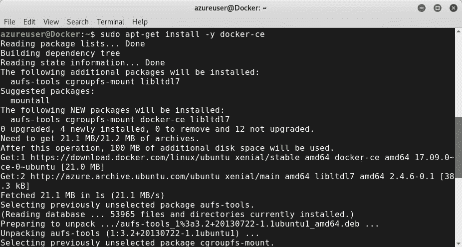

要检查 Docker 守护进程，可以使用`systemct1`命令：

```
sudo systemctl status docker
```


有关 Docker 的更多信息，请键入：

```
sudo docker info
```

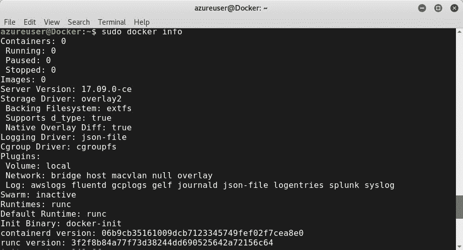

要获取 Docker 版本，请点击以下命令：

```
 sudo docker version
```

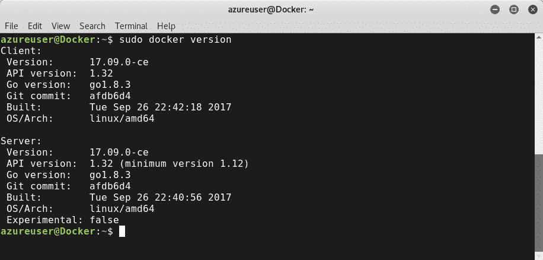

典型的 Docker 命令格式为：

```
docker [option] [command] [arguments]
```

Docker 容器基于一组参数和文件系统的图像。要检查 Docker 容器中的所有图像，请键入：

```
 docker images
```

要运行映像，请使用命令`run`：

```
docker run <Image_Here>
```

Docker 还有许多其他惊人的功能。可以使用 Docker 命令检查它们。以下是一些 Docker 命令：

*   `create`：新建一个容器
*   `cp`：复制文件
*   `exec`：在容器中执行命令
*   `kill`：杀死正在运行的容器
*   `network`：检查 docker 网络
*   `ps`：列出集装箱
*   `build`：基于 Dockerfile 构建容器

您可以通过键入`sudo docker`来检查所有可用的命令：


Dockerfile 是一个文本文件，其中包含有关所需图像的环境、文件和命令的信息。您可以使用任何普通文本编辑器对其进行编辑。以下是 elasticsearch（elasticsearch 是一个分布式 RESTful 搜索和分析引擎）。Dockerfile 示例如下所示：


要从 Dockerfile 生成映像，请键入：

```
sudo docker build -t <image>
```

为了演示，我使用的是 Microsoft Azure 云平台。您可以从这里访问 Azure 官方网站[www.Azure.com](https://azure.microsoft.com/en-us/?v=18.01)。因此，为了构建映像，我创建了 Azure 容器注册表并登录：


单击新建并创建新的 Azure 容器注册表：


为了登录，我使用了`login`命令：

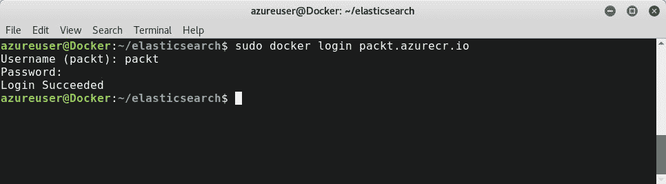

为了检查我们是否成功部署了环境，我使用了`pull`命令从注册表中提取映像或存储库，这是默认的 Microsoft Azure 映像：

```
docker pull microsoft/aci-helloworld
```


要运行作为 Docker 映像实例的容器，我们需要使用`run`命令。

要列出所有可用的容器，请使用`ps`命令：

```
sudo docker ps
```


还有许多其他有用的容器命令，如：

*   `top`：容器内的流程
*   `stop`：停止一个容器
*   `rm`：删除一个容器
*   `stats`：关于集装箱的统计信息
*   `pause`：暂停容器

Docker 容器基于以下工作流所示的生命周期：


# 码头工人剥削

您学习了如何安装和配置 Docker 容器。作为渗透测试人员，您需要了解 Docker 系统的潜在安全问题和潜在威胁。根据 ClusterHQ 2015 年的数据，在 Docker 生产环境中，超过 60%的企业最关心集装箱的安全问题。Docker 容器面临许多安全问题。为了做到这一点，渗透测试人员应该考虑以下常见的容器安全挑战和向量：

*   内核漏洞
*   **拒绝服务****拒绝服务**
*   集装箱漏装
*   中毒图像
*   数据盗窃

# 内核漏洞

Docker 容器在服务器上运行，但请记住，有一个内核**。**事实上，所有进程共享同一个内核**。**Docker 具有许多功能，例如：

*   `chown`：更改任何文件的所有权
*   `fowner`：对要求进程的 UID 和文件的 UID 相同的操作绕过权限检查
*   `kill`：向非根进程发送 kill 信号
*   `setgid`：操作流程 GID 和 GID 列表
*   `setuid`：操作流程 UID
*   `net_raw`：允许使用原始和数据包套接字

要检查可用的功能，可以使用`pscap`命令。在此之前，您需要确保已安装`libcap-ng-utils`依赖项：

```
sudo apt-get install libcap-ng-utils
```

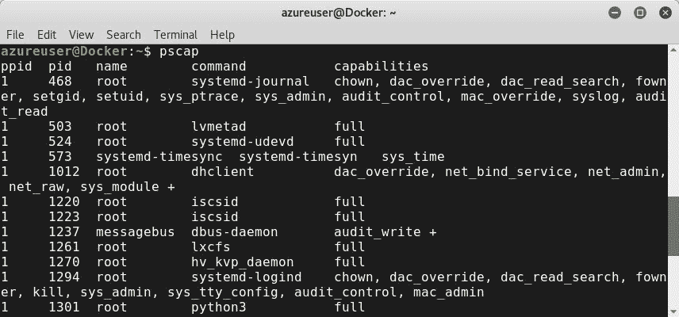

执行时的**设置用户 ID**（**SUID**）和执行时的**设置组 ID**（**SGID**）在前面的[第 2 章](02.html#36VSO0-ccc418ef6725406983cf4586f3600cdf)、*高级 Linux 开发*中进行了讨论。它们是表示访问权限的两个术语。它们允许用户以与其所有者相同的权限执行二进制文件。攻击者可以利用这两次执行。这就是为什么需要将 DockerFile 配置为禁用`setuid`权限。

要删除功能，请使用选项：`--cap-drop =`。

例如，如果要删除`setgid`功能，可以运行以下命令：

```
docker run -d --cap-drop= mknod sudo docker run  --cap-drop=mknod  -t -i --volumes-from kali-data kali
```


如果您想删除所有功能，并且只想运行`setfcap`，请使用以下命令：

```
sudo docker run  --cap-drop=all --cap-add=setfcap  -t -i --volumes-from kali-data kali
```

作为安全措施，您需要通过修改 Dockerfile 来禁用`setuid`权限：

```
RUN find / -perm +6000 -type  f -exec chmod a-s {} \; \ || true
```

# 拒绝服务和资源滥用

DoS 是 Docker 平台的严重威胁。Docker 面临许多 DoS 威胁，例如：

*   **待处理信号**
*   **Posix 消息队列**
*   **最大用户进程数**
*   **最大文件数**

为了抵御这些攻击，我们需要：

*   使用`-m`选项分配内存限制：

```
docker run  -d -m  512m  <Image_Name>
```

*   使用`-c`选项限制 CPU 共享（默认为 1024）：

```
docker run  -d -c  512  <Image_Name></strong>
```

Linux 内核中可以用来限制访问进程的另一个特性是使用`--cpu-set-cpus`标志的`cgroups`（控制组）。通过查看下图，您可以更清楚地了解。


# 码头工人突围

Docker breakout 是绕过 Docker 容器的隔离层，转向主机并以授权方式访问信息的操作，以及尝试获得更多特权（特权升级）的过程。多亏了一些不同的攻击向量，Docker 突破是可以实现的。第一个向量是前面讨论的威胁：内核漏洞。滥用特权是 Docker 的另一种突破技术。攻击者可以使用**集装箱间通信**（**icc**），允许集装箱相互通信。要保护 Docker，除了配置`iptables`外，还需要将`-icc`标志设置为`false`：

```
docker -d --icc=false --iptables
```

Docker 在内核和容器之间起着中间件的作用。作为一项安全措施，它将内核调用列入黑名单，但在 2015 年，出现了一个漏洞，利用名为`CAP_DAC_READ_SEARCH`的未被阻止的内核调用，使得攻击者能够突破 Docker 隔离并潜入容器。代码名为*The shocker*，作为突破性演示展示。你可以从这个[克隆它的概念证明 https://github.com/gabrtv/shocker](https://github.com/gabrtv/shocker) 存储库：

```
sudo git clone https://github.com/gabrtv/shocker
```

要测试该漏洞，您只需使用`docker run`命令：

```
root@Demo:~# docker run gabrtv/shocker
```

Docker 依赖名为 Docker daemon 的守护程序。它需要根权限。不受信任的用户构成严重威胁。为了获得根访问权限，攻击者可以使用 Docker 守护程序特权升级 Metasploit 模块：

```
msf > use exploit/linux/local/docker_daemon_privilege_escalation msf exploit(docker_daemon_privilege_escalation) > show targets ...targets... msf exploit(docker_daemon_privilege_escalation) > set TARGET <target-id> msf exploit(docker_daemon_privilege_escalation) > show options ...show and set options... msf exploit(docker_daemon_privilege_escalation) > exploit
```

# 中毒图像

在 Docker Hub 上，有超过 100000 个预构建容器和图像。图像是 Docker 容器的重要组成部分。事实上，容器是基于图像构建的。这就是为什么您需要维护 Docker 图像的真实性。图像在互联网上随处可见，因此必须检查 Docker 图像，因为您不想在基础设施上运行任何任意程序。要验证 Docker 映像，请使用`pull`命令验证映像是否已签名。换句话说，如果拉取成功，则验证图像。此外，请确保您的设置与`DOCKER_CONTENT_TRUST=1.`匹配

# 数据库密码和数据盗窃

使用 Docker 时，您将每天处理密码和凭据。与往常一样，敏感信息和密码对攻击者非常有吸引力。另外，通过添加`--read-only option`，将文件系统设置为只读是一个明智的决定：

```
docker run --read-only  kali
```

# 码头工作台安全

Docker 交付了一个名为*Docker bench security*的重要脚本。使用一个简单的输出来收集和报告信息、警告和传递消息是非常有用的。您可以从其官方 GitHub 存储库[中克隆该工作台 https://github.com/docker/docker-bench-security:](https://github.com/docker/docker-bench-security)

```
sudo git clone https://github.com/docker/docker-bench-security
```

运行脚本，它将检查 Docker，这要归功于预定义的最佳实践。基本上，它基于 CIS Docker 社区版基准 v1.1.0：

```
./docker-bench-security.sh
```


# 基于 Clair 的 Docker 漏洞静态分析

Clair 是一个开源项目，用于静态分析 Docker 容器中的漏洞。它允许渗透测试人员识别容器中的漏洞。您可以在**[找到其官方存储库 https://github.com/coreos/clair](https://github.com/coreos/clair)** [。](https://github.com/coreos/clair)

Clair 项目由以下七个部分组成，如图所示：

*   内容检测器
*   数据存储
*   漏洞更新程序
*   RESTful API
*   通知者
*   客户
*   漏洞数据库


建设码头化环境，请访问码头官网[https://quay.io/](https://quay.io/) ：

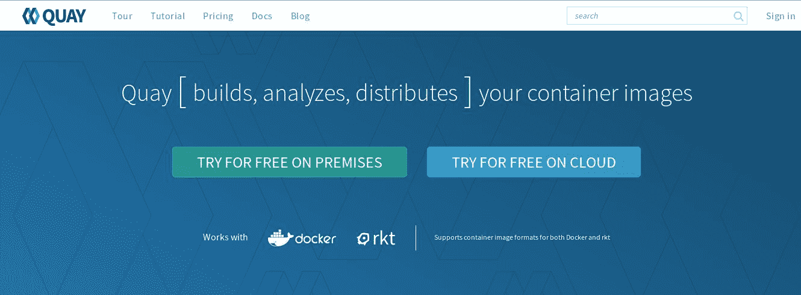

用所需信息填写您的个人资料：

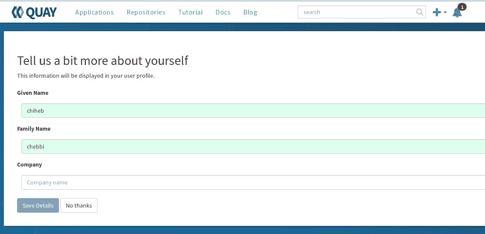

创建新存储库并选择其可见性：


选择指向存储库的链接，例如，我使用了 Dockerfile：


等待构建操作完成：

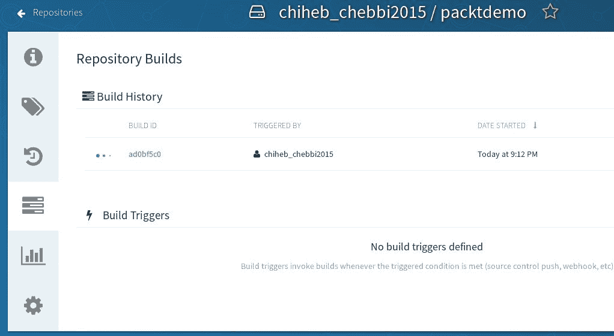

如果单击构建，您将看到 Dockerfile 的内容：

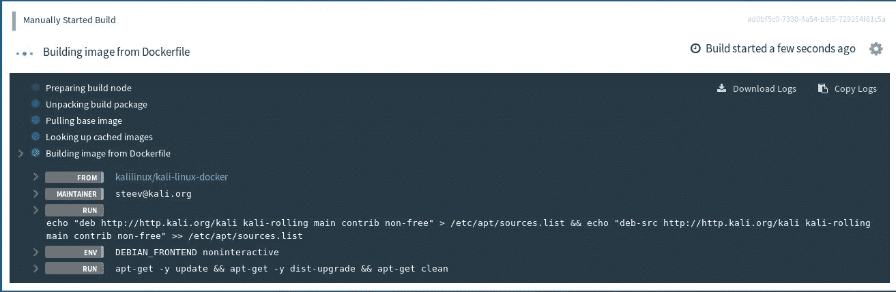

等待几分钟以完成操作：


要使用安全扫描程序，您需要一个企业帐户：

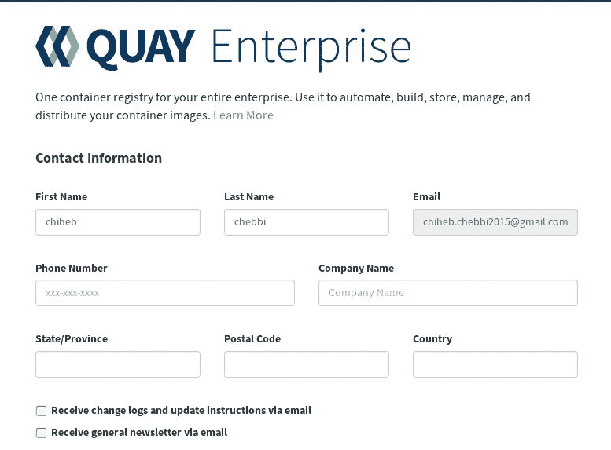

完成配置文件后，您将能够测试码头安全扫描程序，以检查是否存在一些常见 Docker 漏洞：


# 建立渗透测试实验室

在前面的部分中，我们发现了 Docker 容器的威力，并学习了如何防范 Docker 攻击技术。让我们转到 Docker 容器的另一个方面。在本节中，您将学习如何基于 Dockernized 环境构建渗透测试实验室。

我们使用 Kali Linux 发行版开始了学习过程，因此我们将使用相同的发行版作为演示。

首先，让我们使用`git clone command`从 GitHub 克隆一个 Kali Linux 容器文件：

```
git clone https://github.com/offensive-security/kali-linux-docker.git
```


打开 Dockerfile 并添加任何其他配置：

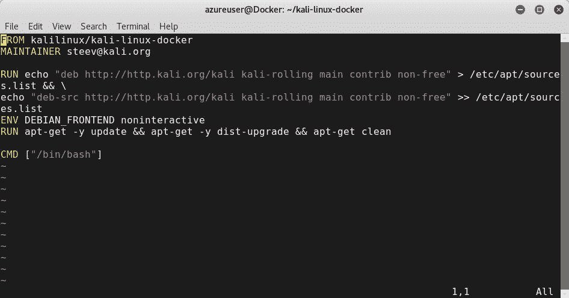

例如，我添加了`metasploit-framework`：


现在，让我们使用`build`命令构建图像：

```
sudo docker build -t kali ~/kali-linux-docker
```


完成`pull`操作后，将提取文件：

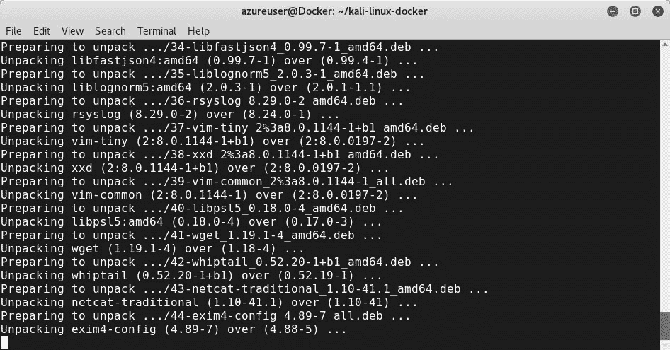

要保留数据并使其持久化，请确保您创建了一个连接到 Kali Linux 的卷以保留您的文件，即使在重新启动系统后：

```
sudo docker create -v /tmp --name kali-data ubuntu
```

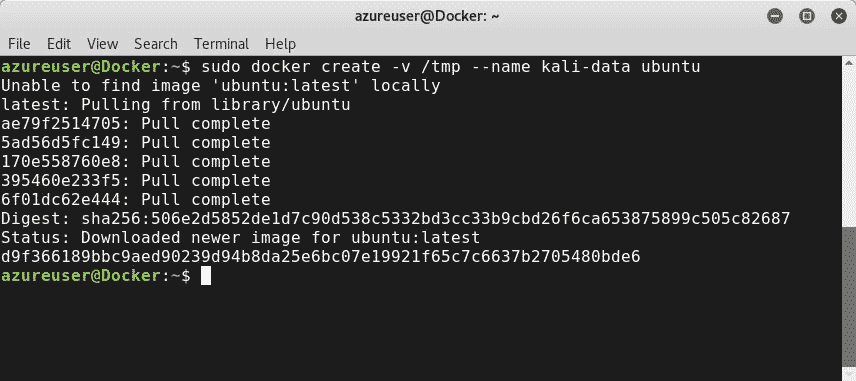

```
sudo docker run -t -i --volumes-from kali-data kali
```

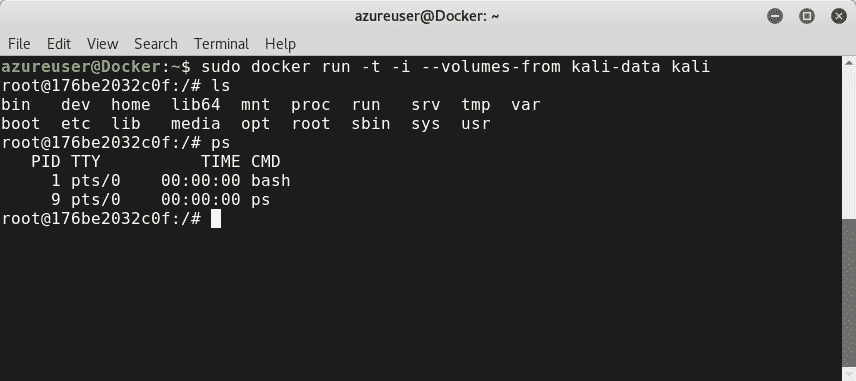

现在，如您所见，您在实例中：

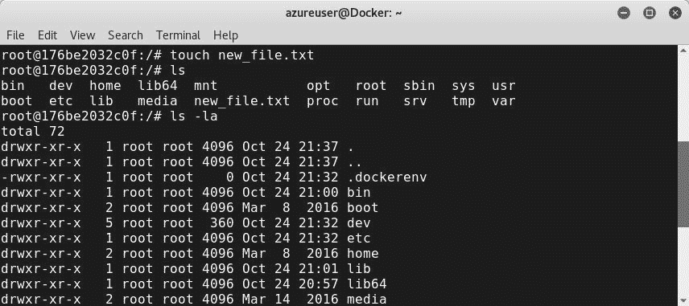

瞧！你的实验室现在准备好了。例如，如果要运行 Metasploit，只需键入`msfconsole`：


您还可以在停靠环境中运行任何其他 Kali Linux 工具。通过这样做，您将 Docker 的灵活性与 Kali Linux 发行版的强大功能结合起来。

# 总结

本章是学习如何安装和配置 Docker 的实践经验。您了解了 Docker 环境的功能以及如何保护它。通过建立渗透测试实验室，您还发现了 Docker 的威力。在下一章中，我们将清楚地了解如何保护**持续集成**（**CI**服务器。**