# 第 1 章：成功渗透测试的规划和范围界定

本章介绍了测试复杂和加固环境所需的规划和准备工作。将向您介绍以下主题：

*   先进渗透测试简介
*   如何成功确定测试范围
*   测试前需要做什么
*   设定你的极限——没有什么是永恒的
*   行动规划
*   使用 MagicTree 进行细节管理
*   使用 MagicTree 将结果导出为各种格式
*   基于团队的数据收集和与 Dradis 的信息共享
*   在 Dradis 中创建可重用模板

# 先进渗透测试介绍

渗透测试对于确定环境的真实攻击足迹是必要的。它可能经常与脆弱性评估相混淆，因此，向客户充分解释差异是很重要的。

## 脆弱性评估

脆弱性评估对于发现整个环境中的潜在脆弱性是必要的。有许多工具可以自动化此过程，因此即使是没有经验的安全专业人员或管理员也可以有效地确定其环境的安全状态。根据范围，还可能需要额外的手动测试。系统和服务的充分利用通常不在正常脆弱性评估活动的范围内。系统通常会被枚举并评估漏洞，测试通常可以通过身份验证或不通过身份验证来完成。大多数漏洞管理和扫描解决方案都提供了可操作的报告，详细说明了缓解策略，如应用缺失的补丁或纠正不安全的系统配置。

## 渗透测试

渗透测试通过在组合中引入漏洞来扩展脆弱性评估工作

### 提示

在进行渗透测试时，意外导致非故意拒绝服务或其他中断的风险略高于进行漏洞评估时的风险。在某种程度上，这可以通过适当的规划和对测试过程中涉及的技术的深入了解来缓解。因此，渗透测试人员必须不断更新和完善必要的技能。

渗透测试使业务部门能够了解所采用的缓解策略是否实际按照预期工作；从本质上讲，它消除了等式中的猜测。预期渗透测试人员将模拟攻击者可能尝试的操作，并通过证明他们能够危害目标关键系统而受到挑战。最成功的渗透测试使渗透测试人员能够毫无疑问地证明，所发现的漏洞将导致巨大的收入损失，除非妥善解决。想想看，如果你能向客户证明，世界上几乎任何人都可以轻松访问他们最机密的信息，你会产生什么样的影响！

渗透测试需要比漏洞分析更高的技能水平。这通常意味着渗透测试的价格将远远高于漏洞分析的价格。如果您无法渗透网络，您将确保您的客户的系统尽您所知是安全的。如果你想在晚上睡个好觉，我建议你在验证你客户的安全性时要超越一切。

## 先进渗透测试

某些环境将比其他环境更安全。您将面临使用以下内容的环境：

*   有效的补丁管理程序
*   托管系统配置强化策略
*   多层 DMZ
*   集中式安全日志管理
*   基于主机的安全控制
*   网络入侵检测或预防系统
*   无线入侵检测或预防系统
*   Web 应用程序入侵检测或预防系统

有效使用这些控制措施会显著提高渗透测试的难度。客户需要完全相信这些安全机制和程序能够保护其系统的完整性、机密性和可用性。他们还需要了解，攻击者能够破坏系统的原因有时是由于配置错误或设计不当的 IT 架构。

请注意，在安全性方面没有灵丹妙药。作为渗透测试人员，我们有责任从各个角度审视问题，并让客户意识到任何允许攻击者对其业务造成不利影响的因素。

通过利用最新的安全研究和开发方法，高级渗透测试超越了标准渗透测试。目标应该是证明敏感数据和系统即使受到有针对性的攻击也能得到保护，如果不是这样，则确保向客户提供适当的指示，说明需要更改哪些内容才能做到这一点。

### 注

渗透测试是当前安全态势的快照。渗透测试应持续进行。

许多开发方法都没有很好的文档记录，通常很难使用，并且需要实际操作经验才能有效地执行。在第 19 届大会上，布鲁斯“格里米尔”巴内特就“欺骗性黑客”进行了精彩的演讲。在本演示中，他讨论了黑客如何使用魔术师使用的许多相同技术。我相信这正是渗透测试人员必须具备的韧性。只有通过奉献、努力、实践和探索未知领域的意愿，渗透测试人员才能模仿恶意黑客在野外尝试的目标攻击类型。

通常情况下，您需要作为团队的一部分参与这些渗透测试，并且需要知道如何使用可用的工具，以使此过程更加持久和高效。这是今天的五旬斋面临的另一个挑战。当您的范围将您限制在非常有限的测试周期内时，在思洛存储器中工作不是一个选项。

在某些情况下，公司可能会使用非标准方法来保护其数据，这使得您的工作更加困难。他们的安全系统相互协同工作的复杂性实际上可能是他们安全战略中最薄弱的环节。

### 注

发现可利用漏洞的可能性与测试环境的复杂性成正比。

# 测试开始前

在开始测试之前，必须考虑一些要求。您需要确定测试的适当范围、时间框架和限制、测试类型（白盒、黑盒）以及如何处理第三方设备和 IP 空间。渗透测试执行标准（PTES）将这些范围项目列为“参与前互动”阶段的一部分。我强烈建议您在[查看此阶段 http://www.pentest-standard.org/index.php/Pre-engagement](http://www.pentest-standard.org/index.php/Pre-engagement) 。

### 注

虽然本书没有直接遵循 PTE，但我将尝试指出 PTE 中与材料相关的部分。

## 确定范围

在准确确定测试范围之前，需要收集尽可能多的信息。在开始测试程序之前，必须充分了解以下内容：

*   谁有权授权测试？
*   测试的目的是什么？
*   测试的拟议时间表是什么？关于何时可以进行测试，是否有任何限制？
*   您的客户是否了解漏洞评估和渗透测试之间的区别？
*   您是否与 IT 安全运营团队合作进行此测试？你在测试它们的有效性吗？
*   社会工程允许吗？那么拒绝服务攻击呢？
*   您是否能够测试用于保护服务器、关键数据存储或任何其他需要物理访问的物理安全措施？例如，撬锁、冒充员工进入大楼，或者只是走进普通无关联人员不应进入的区域。
*   在测试之前，是否允许您查看网络文档或了解网络体系结构，以加快进度？（不一定推荐，因为这可能会让人对您的调查结果的价值产生怀疑。大多数企业并不希望您自己能够轻松确定这些信息。）
*   允许您测试的 IP 范围是什么？法律禁止未经适当许可的扫描和测试系统。在确保这些设备和范围真正属于您的客户时，请务必格外小心，否则您可能面临法律后果的危险。
*   公司的实际位置是什么？如果社会工程是允许的，这对你作为一个测试者来说更有价值，因为它可以确保你在测试时在被批准的大楼里。如果时间允许，您应该让您的客户知道您是否能够公开访问这些信息，以防他们认为他们的位置是秘密的或难以找到。
*   如果出现问题或达到了测试的初始目标，该怎么办。您会继续测试以查找更多条目，还是测试已经结束？这一部分非常关键，并且与客户为什么首先需要渗透测试的问题有关。
*   您是否需要了解法律含义，例如不同国家的系统等？并非所有国家在渗透测试方面都有相同的法律。
*   一旦漏洞被利用，是否需要额外的权限？在分段网络上执行测试时，这一点很重要。客户可能不知道您可以使用内部系统作为轴心点，以便在其网络中进行更深入的研究。
*   如何处理数据库？是否允许添加记录、用户等？

此列表不包括所有内容，您可能需要根据客户的要求向列表中添加项目。大部分数据可以直接从客户机收集，但有些数据必须由您的团队处理。

如果存在法律问题，建议您寻求法律顾问，以确保您完全理解测试的含义。一旦开始测试，信息太多总比不够好。在任何情况下，您都应该自己验证所提供的信息是否准确。您不想发现您正在访问的系统实际上不属于客户机的权限范围！

### 注

在访问任何客户系统之前，获得适当的书面授权**非常重要。如果不这样做，可能会导致法律诉讼和可能的监禁。使用正确的判断！你也应该考虑错误和遗漏保险是必要的，当执行渗透测试。**

## 设定极限——没有什么是永恒的

如果您想成功执行渗透测试，设置适当的限制是至关重要的。您的客户需要了解所涉及的全部后果，如果需要合同中所列服务以外的其他服务，则应了解所产生的任何剩余成本。

请确保为您的服务设置定义的开始和结束日期。明确定义接战规则，包括可能需要测试的 IP 范围、建筑物、时间等。如果它不在您的交战规则文档中，则不应进行测试。会议应该在测试开始之前预先确定，客户应该确切地知道您的可交付成果是什么。

### 审计业务规则文件

每次渗透测试都需要从所有相关方都必须具备的交战规则文件开始。本文件至少应包括以下几项：

*   **适当人员的适当许可**。
*   测试的开始和结束日期。
*   将要执行的测试类型。
*   测试的局限性。
    *   什么类型的测试是允许的？DDOS？全穿透？社会工程？这些问题需要详细解决。
    *   可以进行侵入性测试和非侵入性测试吗？
    *   您的客户是否希望在测试完成后执行清理，或者这是一个将在测试完成后完全重建的阶段环境？
*   IP 范围和待测试的物理位置。
*   测试结束时报告的传输方式。（使用安全的传输方式！）
*   测试期间将使用哪些工具？不要只局限于一种特定的工具；提供一个主要工具集的列表以避免将来的混淆可能是有益的。例如，我们将使用回溯套件最新版本中的工具。
*   **让您的客户知道测试期间发现的任何非法数据将如何处理：**应在客户之前联系执法部门。在进行测试之前，请确保充分了解这方面的法律。
*   **如何处理敏感信息：**您不应该下载敏感客户信息；还有其他方法可以证明客户的数据不安全。当涉及受监管的数据时，这一点尤为重要。
*   您的团队和您正在测试的公司关键员工的重要联系信息。
*   关于如何确保客户的系统信息不会保留在测试期间使用的不安全笔记本电脑和台式机上的协议。测试后，您是否需要正确擦洗机器？你打算如何处理你收集的信息？是否将其保存在某个地方以备将来测试？确保在开始测试之前，而不是之后，已经解决了这个问题。

参与规则应包含确定评估范围所需的所有细节。在起草交战规则之前，任何问题都应该得到回答，以确保在测试时间到来时不会产生误解。在执行测试时，您的团队成员需要随身携带一份此签名文档的副本。

想象一下，你被雇来维护客户无线网络的安全态势，你正带着巨大的定向 Wi-Fi 天线和笔记本电脑沿着私人物业上的停车场悄悄爬行。如果有人目击你的这一行为，他们可能会担心并致电当局。你需要随身携带一些东西，证明你有正当理由去那里。这是一个拥有雇佣你的商业领袖的联系信息将非常方便的时刻！

# 行动计划

一旦到了开始测试的时候，您将需要做好准备。这需要有一个可用的行动计划，所有的设备和脚本都要启动并运行，当然还有一些记录所有步骤和行动的机制。这将为您自己和其他团队成员提供参考。你可能还记得你现在为绕过防火墙所采取的步骤，但是四个月后当你面临同样的挑战时又会怎样呢？做好笔记是成功进行渗透测试的关键。

在本书中，我们将回顾使用 VirtualBox 安装回溯套件的过程，该套件由 Oracle 根据 GNU 通用公共许可证（GPL）提供。此开源虚拟化工具可用于在 Linux、OSX 和 Windows 等平台上构建虚拟测试环境。

### 提示

我强烈建议使用回溯操作系统来满足您的测试需求。如果您不熟悉 BackTrack，PacktPub 最近发布了一本关于该主题的优秀书籍，标题为*BackTrack 4：通过渗透测试确保安全*。这本书将详细介绍 BackTrack 套件的各种安装方法，并全面介绍您可以在其中找到的所有工具。如果您还不熟悉渗透测试，那么您很可能会从阅读本书中获益匪浅。由于*高度安全环境的高级渗透测试*的重点是高级攻击方法，因此我们不会涵盖回溯套件中的所有工具。

您还可以在回溯论坛网站上找到回溯的更多信息，网址为：[http://www.backtrack-linux.org/forums/backtrack-5-forums/](http://www.backtrack-linux.org/forums/backtrack-5-forums/) 。BackTrack 的开发人员非常专业，为安全社区提供了大量的时间和精力。

## 安装 VirtualBox

此时，Windows 操作系统仍然是最常见的桌面操作系统，因此我将详细介绍使用 Windows 7 安装 VirtualBox 的过程。然而，对于所有操作系统来说，安装都很简单，因此您不应该回避在您喜欢的平台上安装它。

### 注

我们在本书中使用的几乎所有工具都是基于 Linux 或 FreeBSD 的。由于许多人使用 Windows 作为他们的主桌面，我们将提供有关在 Windows 7 上安装 VirtualBox 的说明。一旦您启动并运行了它，您将能够跟随它，无论哪个操作系统被用作虚拟测试环境的主机。

1.  转到[http://www.virtualbox.org/](http://www.virtualbox.org/) 。
2.  点击页面左侧的**下载**链接。
3.  下载适用于 Windows 主机 x86/amd64 的最新版本的**VirtualBox**。
4.  开始安装（根据您的系统配置，您可能需要以管理员身份开始安装）。
5.  在初始设置窗口点击**下一步>**。
6.  确保安装位置是您希望安装程序的位置，并且选择了所有要安装的选项，然后单击**下一步>**。
7.  选择您喜欢的桌面快捷方式选项，然后单击**下一步>**。
8.  如果您想使用在前面屏幕上选择的设置继续安装，请单击**是**。
9.  Click on **Install** to proceed with installation. This step may take some time depending on your system performance. You may be asked to install device software as well, at which point you will have to click on **Install** in the pop-up window.

    ### 提示

    这可能不止一次发生；在我的例子中，它弹出了四次，然后我的防火墙发出通知，请求允许将附加网络添加到我的防火墙设置中。

10.  单击**完成**向 Oracle VirtualBox Manager 演示。

现在，您将启动并运行 VirtualBox，并可以开始创建虚拟测试环境的第一步，以便在本书中进行实际操作！

## 安装回溯虚拟机

### 注

在讨论攻击和防御策略时，我们将参考这些安装说明中使用的系统和虚拟网络名称。

将 BackTrack 安装为虚拟机有两种主要方法。一种是使用 livecdiso 安装 BackTrack，就像在物理机器上一样；另一种是下载预先准备好的虚拟机。这是在 BackTrack-Linux.org 下载站点上看到的 VMWare 映像选项。

我们将使用 LiveCD 进行回溯安装，因为这使我们能够灵活地确定硬盘大小和其他设置。使用 ISO 的另一个好处是，您将知道如何在将来安装回溯到物理机器。如果使用全磁盘安装，安装过程将非常类似于虚拟机安装。

回溯可在[下载 http://www.backtrack-linux.org/](http://www.backtrack-linux.org/) 。请确保针对 32 位或 64 位体系结构选择适当的 ISO 版本。如果您没有在主机上运行 64 位操作系统，您也将无法在来宾实例上运行 64 位操作系统。如果在主机上运行 64 位操作系统，您可以为来宾计算机操作系统选择 32 位或 64 位。

### 注

主机是您安装 VirtualBox 的主要操作系统。与 VirtualBox 一起安装的虚拟化操作系统映像将被称为来宾计算机。

### 准备回溯虚拟来宾机

1.  一旦获得回溯 ISO，是时候开始了。
2.  从您的**开始**菜单中选择 Oracle VM VirtualBox Manager，启动它。
3.  点击左上角的**新**图标。
4.  在**欢迎使用新虚拟机向导**屏幕上，单击**下一步**按钮。
5.  You will be prompted to enter the name of the guest machine. Enter `BT5_R1_Tester1`, select **Linux** as the **Operating System**, and **Linux 2.6** (**32 bit** or **64 bit)** as the **Version**, and then click on **Next**.

    

6.  在**内存**屏幕上，您需要使用滑块选择**基本内存大小**。如果您的系统有超过 2GB 的 RAM，您应该为此系统使用至少**512 MB**。您仍然可以使用更少的 RAM 遵循示例，但可能会遇到一些系统延迟。选择 RAM 大小后，点击**下一步**。
7.  虚拟硬盘：确保选中了**启动盘**复选框，并选中了**创建新硬盘**径向按钮，然后点击**下一步**。
8.  将打开一个新的弹出窗口，其中应选择**VDI（VirtualBox 磁盘映像）**。点击**下一步**。
9.  当要求选择**虚拟磁盘存储详细信息**时，选择**动态分配**并点击**下一步**继续安装。
10.  现在是选择存储虚拟来宾机文件的**位置**的时候了。选择**位置**文本输入字段右侧的文件夹图标。
11.  创建并选择一个名为 `APT_VirtualLab`的新文件夹，我们将在其中存储专用于此实验室的所有来宾计算机。请确保您选择的驱动器具有足够的空间来存储多个虚拟机。
12.  **Size** the virtual disk to be at least 10 GB. We will be using this machine extensively throughout the book and although technically possible, it is better to avoid having to resize the VDI. Click on **Next** to continue.

    

13.  验证**摘要**页面上的数据是否准确，点击**创建**。
14.  If everything has been successful you are once again prompted with the VirtualBox Manager application window with your new guest machine.

    

15.  We will want to have two network adapters available to this machine. Select **BT5_R1_Tester1** and then click on **Settings** followed by the **Network** option on the left menu bar.

    

16.  点击**适配器 2**并选中**启用网络适配器**复选框。
17.  连接到：下拉框的**需要设置为**内部网络**。**
18.  将**名称：**文本框更改为**Vlab_1**并点击**确定**。

现在，您已经完成了在虚拟磁盘上安装操作系统所需的准备工作。在准备其他操作系统时，此过程变化不大，VirtualBox 使许多配置更改变得微不足道。有时，您可能需要调整来宾计算机上的设置以提高其性能。使用一些设置可以让您了解此工具的功能。

### 注

您可以随时更改虚拟机的设置。但是，有时您需要在进行更改之前关闭来宾计算机。

### 在虚拟磁盘映像上安装回溯

现在虚拟机已经安装，我们已经准备好安装 BackTrack。由于 Backtrack-Linux.org 团队的辛勤工作，这个过程简单而简单。

1.  打开**VM VirtualBox Manager**并在屏幕左侧选择您的**BT5_R1_Tester1**来宾机器。点击应用程序顶部栏上的大**启动**图标，启动虚拟机实例。
2.  您的机器现在将启动。由于我们尚未选择用于引导系统的映像，因此需要使用初始系统初始化之前出现的菜单选项来选择此映像。
3.  您可能会收到一个信息窗口的提示，说明**自动捕获键盘**选项已打开。点击**确定**按钮继续系统初始化。
4.  **首次运行向导**仅在虚拟机首次启动时出现。它允许您轻松选择希望从中启动的 ISO。
5.  也可以在**存储**类别的**虚拟机设置**中添加安装介质。
6.  Click on **Next** to continue.

    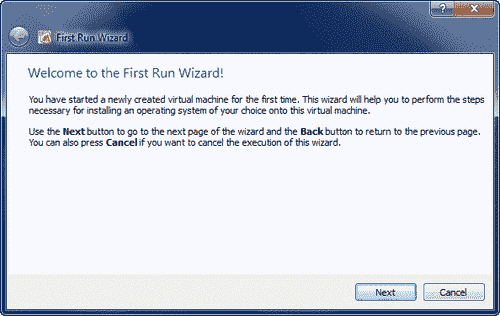

7.  On the **Select Installation Media** screen you will need to click on the folder icon to the right of the **Media Source** bar. You will then need to browse to the folder where you have downloaded the BackTrack ISO, and select it so that it appears as displayed in the following screenshot. Click on **Next** when ready.

    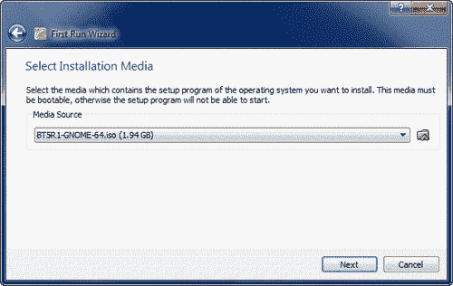

8.  验证您的摘要信息并点击**启动**启动机器。如果机器在 `boot:`命令下挂起，按*Enter*键，系统将继续引导。允许它完全加载 LiveCD（默认启动选项）。您可能会收到**键盘主机捕获**消息的提示。只需点击**确定**即可根据需要完成这些操作。
9.  **Type** `startx` **at the** `root@root:~#`**prompt.**

    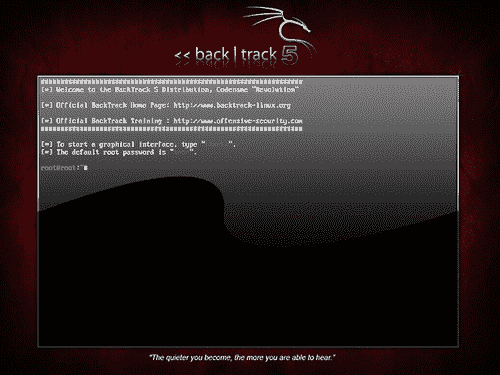

10.  Now that we have the BackTrack ISO up and running on our virtual machine, we need to add persistence so that changes we make remain. Click on the **Install BackTrack** icon to begin the short installation process:

    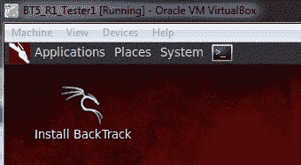

11.  选择您喜欢的语言，点击**转发**。
12.  让安装人员知道您在世界上的位置。这将影响您的时间设置，并有助于选择离您较近的服务器进行更新。点击**转发**继续。
13.  选择您喜欢的键盘布局，点击**前进**。
14.  为了简单起见，我们将使用整个可用磁盘空间，而无需手动分区。选择**擦除并使用整个磁盘**径向按钮，点击**前进**。
15.  Click on **Install** to initialize the changes. This stage may take a few minutes to complete.

    

16.  When the install has finished you will be required to reboot the system. Click on the **Restart Now** button and then unload the ISO. You will need to choose **Devices** | **CD/DVD Devices** | **{Your BackTrack ISO image name}**. This will eject the ISO image before the system reboots. Press *Enter* to reboot.

    

# 探索回溯

祝贺您，您现在拥有最强大的渗透工具集之一，可供您使用。整本书致力于涵盖作为 BackTrack Linux 平台一部分的优秀工具集合。此工具包肯定会为您节省大量的野外工作时间。

### 登录

您的默认安装登录信息为：

```
bt login: root
bt password: toor

```

### 更改默认密码

登录后，我们应该尽快更改此默认密码。您可以通过在提示符处键入 `passwd`并用您自己的安全密码替换示例中的 `1NewPassWordHere`来完成此操作。

```
root@bt:~# passwd
Enter new UNIX password: 1NewPassWordHere!
Retype new UNIX password: 1NewPassWordHere!
passwd: password updated successfully
root@bt:~# 

```

### 提示

如果您的屏幕分辨率有问题或遇到其他小麻烦，您可能需要安装 VirtualBox Guest Additions。当来宾计算机运行时，点击**设备**，然后点击**安装来宾添加**启动此安装。之后，您需要重新启动回溯。

### 更新应用程序和操作系统

您的虚拟机网卡当前配置为允许回溯安装使用 NAT 访问主机系统的 Internet 连接。为了更新操作系统，您应该熟悉一些命令。

### 注

如果没有 Internet 连接，系统将无法更新。

需要记住的一点是，BackTrack 基于 Ubuntu，与其他任何操作系统一样，需要进行修补，以确保应用最新的安全修补程序。保持应用程序的最新状态也很重要，这样可以利用最新的测试技术和工具！

默认情况下，BackTrack 设置为仅使用 BackTrack 存储库。如果好奇，您可以通过查看 `/etc/apt/sources.list`文件来了解这些内容。

需要初始化的第一个命令是**高级打包工具（APT）**更新功能。这将同步包索引文件，以确保您拥有有关可用的最新包的信息。在安装任何软件或更新已安装的软件包之前，应始终使用更新功能。

```
# apt-get update 

```

此更新完成后，您可以初始化 apt 的升级命令。所有安装的软件包都将更新到存储库中的最新版本。

```
# apt-get upgrade 

```

还有另一个 apt 命令用于更新系统。 `dist-upgrade`将返回最新版本。例如，如果您正在运行 BackTrack 4 并希望升级，而不是下载和安装最新版本的 BackTrack 5 release，则可以通过键入以下内容来完成：

```
# apt-get dist-upgrade 

```

### 注

您不必担心依赖性；所有这些都由 `apt-get dist-upgrade`命令自动处理！

现在您的系统已经更新，是时候启动图形用户界面（再次在提示符处键入 `startx`）并查看您的新工具包了。在本书的整个过程中，我们将广泛使用这些工具。

### 注

执行 `apt-get dist-upgrade`时，可能有利于后续重新启动。任何内核升级都是如此。

# 安装 OpenOffice

有时，您可能需要打开电子表格来查看 IP 范围，或者快速查看您的 ROE。有时，让您的数据收集工具从 BackTrack 中直接将数据导出到字处理器中甚至是件好事。现在有很多开源软件可以替代 MicrosoftWord，OpenOffice 是其中的佼佼者。它已被许多企业采用，可以输出各种文件格式。要从 BackTrack 中安装 OpenOffice，只需打开终端会话并键入：

```
# apt-get update
# apt-get install openoffice.org 

```

按*Y*接受下载，几分钟后，您将成功地将非常强大的 Office 套件添加到回溯工具集中。

# 有效管理您的测试结果

在进行渗透测试的过程中，将使用各种工具。几乎所有这些都有您想要保留的输出。一个主要的挑战是能够在一个地方合并所有这些数据，以便通过为您提供数据的整体视图来轻松地用于增强测试工作，并缩短报告生成阶段。

## MagicTree 简介

MagicTree 是由 Gremwell 创建的 Java 应用程序，是一个受积极支持的数据收集和报告工具。它使用树状结构中的节点管理数据。这种分层存储方法在管理主机和网络数据方面特别有效。在尝试分析数据时，MagicTree 的真正威力得以释放。例如，搜索在扫描大型网络时发现的所有 IIS web 服务器只需几分钟。

除了提供出色的数据收集机制外，MagicTree 还使您能够根据选择的优先级创建可操作的报告。使用 MagicTree 生成的报告完全可自定义，并且可以轻松定制以满足您的报告要求。您甚至可以使用它将数据导出到 OpenOffice！

MagicTree 允许 XML 数据导入，并具有许多流行格式的 XSLT 转换，如：

*   内苏斯（v1 和 v2）
*   Nikto
*   Nmap
*   打嗝
*   Qualys
*   Imperva 水肺
*   OpenVas

请注意，MagicTree 的开发人员是通过交易进行交易的。在探索 MagicTree 时，很明显他们了解测试人员每天面临的挑战。其中一个例子是他们提供的功能，允许您为该工具创建自己的 XSLT 转换。如果无法使用提供的转换导入所需的 XML 数据，您可以自行创建！

### 启动 MagicTree

与本书中我们将使用的大多数工具一样，这一个是预装在回溯 5 R1 上的。

要从 BackTrack 启动 MagicTree，我们选择**应用程序****BackTrack****报告工具****证据管理****MagicTree**。显示初始屏幕和许可协议后（需要接受许可），您将看到主应用程序工作区。

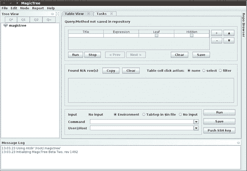

### 添加节点

要添加节点，请按*Ctrl+N*，并在**输入**弹出框中键入 `127.0.0.1`。这将使用另外两个节点填充树。一个用于**测试数据**，一个用于主机**127.0.0.1**。

在存储数据时，有几种节点类型可用。为了能够有效地使用该工具，您需要熟悉各种节点类型：

*   **分支节点：**用于创建树的结构，请确保在使用此节点类型时不包含空格。
*   **简单节点：**最常见的节点类型，将用于存储简单数据，如 IP 地址或完全限定的域名。
*   **文本节点：**在节点内存储文本数据，可用于提供有关测试的信息，或您希望显示在报告中的数据。
*   **数据节点：**在项目文件夹中存储非图像和非 XML 附件。
*   **XML 数据节点：**存储 XML 数据。
*   **图像节点：**可以存储截图等图像或其他重要证据。
*   **交叉引用：**在节点之间创建链接，避免信息重复。
*   **概述节点：**用于输入测试结果和建议的缓解策略。可以链接到受影响的主机。
*   **Special nodes:** Created automatically and used by the application to perform certain tasks. Are not user created.

    ### 注

    MagicTree 会将来自不同数据源的数据合并到单个节点中，以避免数据重复。针对 127.0.0.1 运行多个扫描工具不会导致多个节点表示相同的数据。

### 数据采集

让我们收集一些关于 127.0.0.1 的数据。除了能够从您在 MagicTree 之外运行的工具中选择扫描结果外，您还可以直接从工具中扫描，并使用变量选择目标范围或主机。

在**树状视图**菜单中选择**主机 127.0.0.1**节点，点击表示查询全部的**Q***按钮，在**命令**文本字段中输入以下内容（必须点击才能激活）：

```
# nmap -vv -O -sS -A -p- P0 -oX $out.xml $host 

```

这将启动针对 127.0.0.1 的 Nmap 扫描，并将结果放入名为 `$out.xml`的 XML 文件中。


我们将选择 `$out.xml`并点击**导入**按钮，MagicTree 将根据扫描结果自动生成我们的节点结构。


MagicTree 已导入 Nmap 结果并将其与主机合并。看起来我们有**postgresql 版本 8.4.0**在**端口 7175 的回溯虚拟机上运行！**

### 报表生成

现在我们有了一些结果，我们将看看生成报告有多简单。与 BackTrack 5 R1 一起预装的安装有五个 OpenOffice 预配置的报告模板，可作为创建您自己的模板的参考，也可按原样使用。

在菜单栏顶部，选择**报告**选项，然后选择**生成报告**。这将启动**生成报告**模板选择屏幕。使用浏览选项选择 `open-ports-and-summary-of-findings-by-host.odt`，然后点击**生成报告**。几分钟后，OpenOffice 将打开自动生成的报告，按主机列出所有打开的端口，以及您可能获得的任何发现。

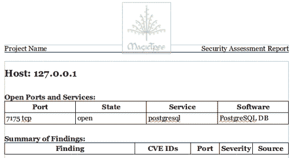

这只是对 MagicTree 项目的一个简单介绍。这个工具非常强大，在它真正的潜力被释放之前，你需要一点实践。MagicTree 提供的文档编写良好，并经常更新。如果您主要是在非常小的团队或一人一组的团队中执行渗透测试，那么 MagicTree 可能是您需要的唯一数据收集工具。

# Dradis 框架介绍

Dradis 框架是一个 Rails 应用程序，可用于帮助管理测试时可能出现的数据过载。通过其用户友好的基于 web 的界面，它简化了整个测试周期的数据收集，并且在与团队成员共享数据时是无价的。

当组合不同的数据源（如 Nmap、Nessus，甚至 Metasploit）时，通常需要构建某种数据库，然后使用各种方法管理导入。Dradis 有一些插件，您只需点击几下就可以导入这些数据。Dradis 还允许您上传附件（如屏幕截图）或将自己的笔记添加到数据库中。

### 注

Dradis 框架可以安装在 Linux、Windows 或 OSX 上。

通过点击快捷菜单**应用程序****回溯****报告工具【证据管理】Dradis**或在终端中键入以下内容，即可启动 Dradis 服务器：

```
# cd /pentest/misc/Dradis/
# ./start.sh 

```

服务器启动后，您可以打开浏览器并键入 `https://127.0.0.1:3004`，进入 Dradis 应用程序的介绍屏幕。

### 注

当证书自签名时，浏览器将向您显示警告。将证书添加到例外列表并继续访问站点。您可能还希望在无脚本浏览器加载项中选择**允许 127.0.0.1**。

您将看到“What is Dradis”屏幕。要设置服务器的共享密码，您需要单击页面右上角的**返回应用程序**链接。


Dradis 框架使用由所有团队成员共享的密码。在**密码**字段中输入您选择的密码。

### 注

永远不要重复使用密码！

点击**初始化**按钮继续。这将设置新密码并接受默认的元服务器选项。

您现在可以在**登录**字段中选择新用户名。“用户登录”字段仅用于提供信息，不会影响工作区。在**密码**字段中键入共享服务器密码。单击**登录**按钮后，您将看到主 Dradis 工作区。


我们将通过创建一个新分支来表示渗透测试，从而开始设置 Dradis 环境。这些分支允许您根据各种用户创建的标准管理您的发现。

1.  单击应用程序窗口顶部工具栏中显示的**添加分支**按钮。
2.  新分支将为您重命名做好准备。用 `PracticePenTest`覆盖**分支 2**并按*进入*。
3.  右键点击**PracticePenTest**并选择**add child**启动您的层次结构。
4.  进行一点实验，添加额外的文件夹。开始考虑您希望如何安排数据以便于访问和管理。

以下是一个项目树的示例，假设可以在渗透测试期间用于数据收集：

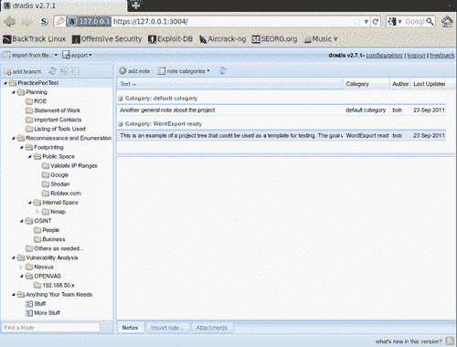

## 导出项目模板

测试将由一系列计划的阶段和程序组成，这些阶段和程序在不同的测试之间波动不大。为了充分利用这一事实，我们将创建一个可重用的模板。

选中**PracticePenTest**节点后，我们将点击顶部菜单栏中的**导出**图标。在扩展**项目导出**菜单时，我们会看到**作为模板**选项。单击此按钮将允许我们将项目模板保存到我们选择的位置，作为 `.xml`文件。


将文件保存到回溯**桌面**文件夹中，并保留默认名称 `dradis-template.xml`。返回您的 Dradis web 应用程序窗口，选择 `PracticePenTest`节点，右键单击该节点，然后选择**删除节点**，将其删除。

## 导入项目模板

`PracticePenTest`节点已与我们的其他数据一起删除。现在是我们重用它的时候了，所以我们需要导入 `dradis-template.xml`文件。点击菜单栏中的**从文件**导入，然后选择**旧导入器**。从下拉菜单中选择**项目模板上传**，点击**上传**完成导入顺序，刷新屏幕后，我们现在有两个新文件夹：一个名为**上传文件**，当然还有我们原来的**实习专家**节点结构。


## 准备导入样本数据

为了充分理解 Dradis 框架的价值，我们将使用渗透和漏洞测试中常用的一些工具生成一些测试结果。你们中的大多数人可能对这些工具有些熟悉，所以我们将不深入介绍它们。

我们需要做的第一件事是让我们的**BT5_R1_Tester1**实例启动并运行，如果它还没有启动的话。登录 BackTrack guest machine 并使用 `startx`启动图形用户界面后，单击顶部栏中的终端图标，启动新的终端会话。

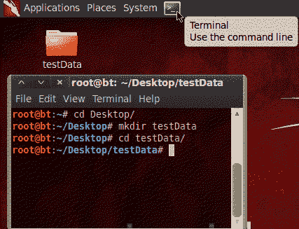

### 提示

您可能已经注意到，您正在以 root 用户身份运行。您将使用的许多工具需要管理权限才能正常运行。

将目录更改为 `Desktop`，然后为自己创建一个名为 `testData`的新目录。这将用于存储我们将使用的少数出口。将您当前的工作目录更改为 `/Desktop/testData`。

```
# cd Desktop/
# mkdir testData
# cd testData/ 

```

现在，我们将使用 Nmap 生成稍后将导入 Dradis 的数据：

```
nmap -vv -O -sS -A -p- P0 -oA nmapScan 127.0.0.1 

```

此命令初始化 Nmap 以在本地主机上运行，并指示它将结果发送到三种文件类型：XML、standard 和 grepable。由于未指定目录，文件将被放置到当前工作目录中。我们正在对所有具有操作系统和版本检测的端口执行非常详细的 TCP SYN 扫描，其中命令将所有主机视为联机。

### 导入您的 Nmap 数据

打开 Dradis web 控制台，加载 PracticePenest 项目树，选择**从文件导入，旧导入器**，然后在**从文件导入**菜单中选择**Nmap 上传**格式，点击**选择文件：**输入字段右侧的文件夹图标。浏览并突出显示 `nmapScan.xml`文件，点击**打开**。


点击**上传**完成导入。处理数据需要一些时间。处理所需的时间长度与您拥有的数据量成正比。

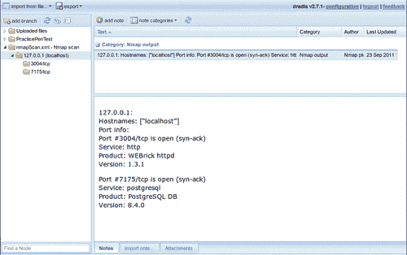

导入已将一个附加节点添加到我们的树中。通过使用鼠标左键拖动，可以将其移动到**PracticePenTest**节点中您希望其位于的任何位置。通过将 `127.0.0.1`扫描结果移动到 PracticePenTest 的逻辑层次结构中，现在可以很容易地将其与渗透测试和其他相关数据关联起来。

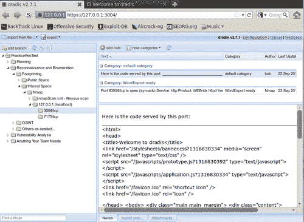

## 将数据导出为 HTML

使用这种集中式数据收集的好处之一是，您可以在 notes 上设置某些标志，以便将数据导出为 PDF、MS Word 或 HTML 格式。

Dradis 启动并运行后，我们需要选择**PracticePenTest**节点，然后单击项目树右侧工作区中的**添加注释**按钮。在弹出的编辑器中键入“此**是一个注释**，然后单击**保存**。这会将您的注释添加到列表中。

### 注

这些注释对渗透测试至关重要，应仔细考虑并清楚书写。避免使用仅在当前上下文中有意义的注释，因为您可能需要在以后重新查看这些注释。

## Dradis 类别字段

您并不总是希望将所有内容导出到您的报告格式中。为了解决这个问题，Dradis 开发团队添加了**类别**字段。此字段将标记要导出为各种可用格式的数据。在这种情况下，我们将双击新便笺右侧列出的文本**默认类别**，标题为**“这是便笺。**”从下拉菜单中选择**HTMLExport ready**选项。

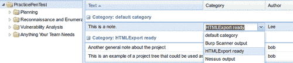

要查看我们的数据，请选择顶部工具栏上的**导出**选项，然后单击**HTML 导出**。您将看到整个项目树中属于**HTMLExport**类别的所有**PracticePenTest**注释的 HTML 输出。

### 更改默认 HTML 模板

正如您所看到的，输出非常好，但是如果您想要一些更定制的东西呢？可以更改标准模板以自定义导出的外观。下面是一个如何更改文档页脚的示例：

将当前工作目录更改为所选的导出插件。在这种情况下，我们将修改 `html_export/template.html.erb`文件。

```
# cd /pentest/misc/dradis/server/vendor/plugins/html_export 

```

为了修改 `template.html.erb`，我们将使用 nano，这是一个非常强大且易于使用的文本编辑器。

```
# nano template.html.erb 

```

该文件将显示在 Nano 文本编辑器中。如果需要参考，Nano 命令将列在应用程序的底部。我们看到了组成 `template.html.erb`文件的 HTML。通过将`<h1>You can change this template to suite your needs.</h1>`放在`<title><%= title %></title>`行正下方的模板 HTML 中，对模板进行一个小的更改。

```
<title><%= title %></title>
<h1>You can change this template to suite your needs.</h1>

```

使用*Ctrl+O*将更改保存在 Nano 中，并将文件写入磁盘。系统将询问您要使用什么文件名来保存文件；通过按键盘上的*回车*接受默认值。

要查看您的操作更改，请返回 Dradis web 控制台，选择**PraticePenTest**并单击**导出**，然后单击工具栏菜单中的**HTML 导出**。将加载新模板，并且您所做的更改将在报告导出中可见。该模板是非常可定制的，可以通过一点努力和 HTML 技巧使其具有您想要的外观和感觉。

### 提示

**请注意，MS Word 导出功能要求您安装 MS Office。**

这意味着我们不能使用回溯实例来充分理解 Dradis 的强大功能。Word 模板可以轻松自定义，以包含您的公司信息、以首选格式列出数据，以及向文档中添加标准页脚和页眉。

由于 Dradis 非常便携，如果您需要导出到 MS Word 的功能，但没有在 BackTrack 中安装的许可证，请在安装了 Microsoft Office 的 Windows 计算机上安装 Dradis，从 BackTrack 导出 Dradis 项目，然后将其重新导入 Windows Dradis 安装。

# 总结

在本章中，我们重点介绍了准备和计划成功渗透测试所需的所有内容。我们讨论了渗透测试和脆弱性评估之间的差异。

适当范围界定所涉及的步骤以及确保在测试之前收集所有信息的必要步骤都进行了详细说明。需要记住的一点是，正确的范围界定和规划与确保针对最新和最大的漏洞进行测试同样重要。

我们还讨论了 VirtualBox 和 BackTrack 的安装，并提供了安装 ISO BackTrack 以及如何保持更新所需的说明。除此之外，我们还提供了如何在 BackTrack 上安装 OpenOffice 的说明。

最后但并非最不重要的一点是，我们讨论了两个非常强大的工具，它们允许您执行数据收集并提供报告功能。MagicTree 是一个数据收集和分析的发电站，Dradis 的数据收集和共享能力令人难以置信。

在下一章中，我们将学习各种侦察技术以及为什么需要它们。其中包括有效使用互联网搜索引擎定位公司和员工数据，操纵和读取各种文件类型的元数据，以及充分利用 DNS 的功能使渗透测试任务更容易。