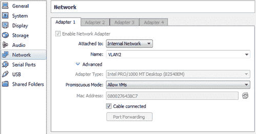
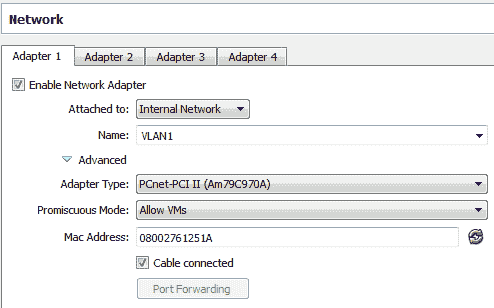
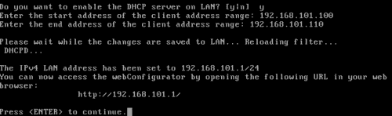
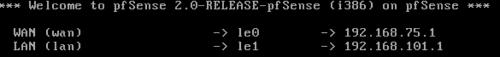
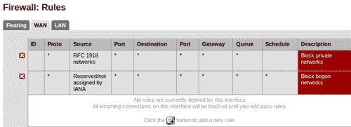
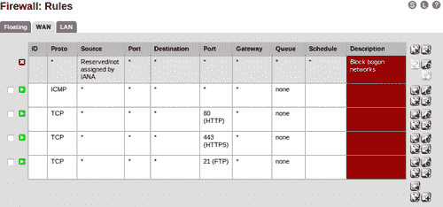
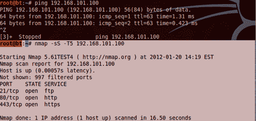
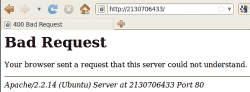

# 第 8 章，绕过防火墙，避免检测

渗透测试的类型和范围将决定渗透测试期间是否需要隐身。测试过程中避免检测的原因多种多样；其中一个好处包括测试据称可以保护网络的设备，另一个好处是您的客户希望知道信息技术团队需要多长时间来应对针对环境的目标攻击。您不仅需要提防目标网络上的管理员和其他观察者，还需要了解自动检测方法，如 web 应用程序、网络和基于主机的入侵检测系统，这些系统可以避免触发警报。

### 提示

当出现最合适的目标时，花点时间验证它不是某种蜜罐，当检测到异常流量或活动时会触发警报！走进聪明的管理员设下的陷阱毫无意义。请注意，如果您确实发现这样一个系统，那么确保它设置正确并且不会由于配置错误而无意中允许访问关键的内部资产仍然非常重要！

在本章中，我们将回顾以下内容：

*   测试防火墙环境
*   在 IDS 下滑入
*   内部开店
*   查看网络流量
*   使用标准凭据
*   清理受损系统

# 实验室准备

为了遵循本章中的示例，需要进行一些实验室准备。

### 提示

在这本书中，人们一直非常关注能够模拟目标网络。这对于能够学习和实践最新和最伟大的技术至关重要，因为安全研究领域的优秀人才不断以新的漏洞和可能的攻击向量让我们大吃一惊。这本书不能涵盖所有可能的网络测试方法，但建立实验室是一种尝试，旨在增加持久的价值，有望导致终身的“黑客心态”。如果你继续建设你的个人实验室，增加你为自己设置的实践挑战的难度，你将很快适应任何类型的环境测试。

BackTrack、pfSense 和 Ubuntu 虚拟机应按以下方式配置：


需要进行某些配置更改：

## 回溯访客机

此机器需要连接到 `192.168.75.0/24`子网。在 Oracle VM VirtualBox 管理器控制台中，突出显示回溯实例，并从顶部导航栏中选择**设置**选项。确保仅启用了一个网络适配器。适配器应使用 Vlan1 内部网络选项。


正如前面在[第 3 章](03.html "Chapter 3. Enumeration: Choosing Your Targets Wisely")中所述，*枚举：明智地选择您的目标*我们可以通过在终端中键入以下命令，从回溯内将 IP 地址（`192.168.75.10`在本例中）分配给以太网适配器（eth0）：

```
# ifconfig eth0 192.168.75.10 netmask 255.255.255.0 broadcast 192.168.75.255 promisc 

```

由于 pfSense 机器也需要成为我们的路由器，我们需要将其设置为默认网关。这可以通过以下方式实现：

```
# route add default gw 192.168.75.1 

```

## Ubuntu 客户机

Ubuntu 机器将被用作目标。它需要配置为连接到 VLAN2，这是一个我们以前从未使用过的新内部网络。要创建内部网络，您需要在 Oracle VM VirtualBox Manager 的网络配置屏幕中手动键入 VLAN2。您的设置应类似于以下内容：



## pfSense 客户机配置

配置防火墙需要更多的工作。它需要能够将限制性流量从 VLAN1 网络路由到 VLAN2 子网。我们需要进行一些配置更改，以确保其正常工作。

### 注

pfSense 提供从配置菜单重置为出厂默认值的选项。请注意，如果选择此选项，则必须重新配置适配器。这并不困难，但以前的所有设置都将丢失。如果担心丢失以前的配置，请确保制作 pfSense 计算机的副本/快照。

### pfSense 网络设置

我们的防火墙来宾计算机将使用两个网络适配器。一个用于 VLAN1 段，另一个用于 VLAN2 段。在本章的示例中，VLAN1 将被视为不受信任的广域网。网络适配器 1 应类似于以下屏幕截图：



网络适配器 2 应类似于以下内容：


### 广域网 IP 配置

其余的网络设置需要在来宾计算机内执行。

1.  Boot up your pfSense virtual instance. There may be an additional delay as pfSense attempts to configure the WAN adapter. Allow it to fully load until you see the following menu:

    

2.  需要正确配置 WAN 和 LAN 接口。选择选项**2）设置接口 IP 地址**。
3.  Select option 1 — WAN.

    

4.  当要求通过 DHCP 类型*n*配置 WAN 接口时。
5.  WAN 适配器的 IP 应为 `192.168.75.1`。
6.  Subnet bit count should be set to 24\. Type `24` and press *Enter*.

    

7.  按*进入*返回配置菜单。

### 局域网 IP 配置

我们也可以从配置菜单设置 LAN IP 信息。在这里配置 LAN 的一个好处是，我们可以同时为 VLAN2 配置 DHCP 服务器。

1.  从配置菜单中选择 `2`选项，启动 LAN IP 配置模块。
2.  选择 LAN 接口（选项 `2)`。
3.  当提示输入 IP 地址类型 `192.168.101.1`时。
4.  位计数应设置为 `24`。
5.  当被问及是否希望在 LAN 上启用 DHCP 服务器时，选择*y*表示是。
6.  DHCP 客户端 IP 范围开始将为 `192.168.101.100`。
7.  DHCP 客户端 IP 范围停止将为 `192.168.101.110`。
8.  Press *Enter*.

    

9.  再次按*进入*返回配置菜单。

您的 LAN 和 WAN IP 范围应符合以下要求：



## 防火墙配置

pfSense 可以使用其直观的 web 界面进行配置。启动 Ubuntu 机器，打开终端并执行 `sudo dhclient`从 VLAN2（192.168.101.0/24）上的 pfSense DHCP 服务器获取地址。在 Ubuntu 机器上的 web 浏览器中键入 `http://192.168.101.1/`以访问配置面板。如果已重置为出厂默认值，则需要逐步通过向导进入标准控制台。

### 注

pfSense 的默认用户名和密码组合为： `admin/pfsense`。

要查看当前防火墙规则，请选择**防火墙规则**并查看当前配置。默认情况下，应阻止 WAN 接口进行内部连接，因为没有预先建立的规则允许任何流量通过。



出于测试目的，我们将启用端口 80、443、21 并允许 ICMP。增加如下规则：

1.  点击前面屏幕截图中显示的**添加新规则**按钮。
2.  使用以下规则设置启用 ICMP 传递：
    *   行动：通过
    *   接口：广域网
    *   协议：ICMP
    *   所有其他：默认值
3.  点击屏幕底部的**保存**按钮。
4.  点击屏幕顶部的**应用更改**按钮。
5.  Use the **Interface** | **WAN** navigation menu to enter the WAN interface configuration menu and uncheck **Block private networks**. Apply the changes and return to **Firewall** | **Rules**.

    

6.  点击**添加新规则**按钮。
7.  使用以下规则设置启用 HTTP 传递。
    *   行动：通过
    *   接口：广域网
    *   协议：TCP
    *   目标端口范围：HTTP
8.  Continue adding ports until the configuration matches the following:

    

此时，连接到 VLAN1 的任何机器都可以通过开放端口以及 VLAN2 段上的 ping 机器进行通信，如以下屏幕截图所示（运行扫描的系统位于 `192.168.75.10):`



# 通过防火墙进行隐形扫描

在当今时代，最常见的安全机制将是某种防火墙。当防火墙与其他安全控制结合使用时，它是一种非常好的安全机制；然而，它们必须得到适当的维护和监测，才能真正有效。有几种机制可用于尝试绕过这些设备。

## 寻找港口

扫描时，了解您被阻挡的位置非常重要。当通过防火墙进行测试时，如果您没有所有信息，则可能很难准备秘密攻击。请记住，Firealker 或 Hping 等工具可以帮助确定阻塞发生的位置，以及端口是否真正可用或刚刚关闭。虽然这看起来很琐碎，但是知道是否有防火墙也是相当重要的。

### 追踪路由以确定是否存在防火墙

有时我们可以使用 traceroute 查看到目标系统的路径。让我们来看看从 VLAN2 到 VLAN1：开放 TraceouTE：

```
student@Phobos:~$ traceroute 192.168.75.10 
traceroute to 192.168.75.10 (192.168.75.10), 30 hops max, 60 byte packets
1 pfSense.localdomain (192.168.101.1) 0.248 ms 0.166 ms 0.117 ms
2 192.168.75.10 (192.168.75.10) 1.351 ms 1.243 ms 1.188 ms

```

查看这个结果，我们可以看到第一个跃点在被路由到主机之前通过我们的网关 `192.168.101.1`。现在，我们将尝试从回溯机器反转：

```
root@bt:~# traceroute 192.168.101.1
traceroute to 192.168.101.1 (192.168.101.1), 30 hops max, 60 byte packets
1 * * *
2 * * *
[Truncated…]
30 * * *

```

有东西阻止我们接收路径信息（这是 pfSense 防火墙配置）。这项技术并不总是有用的，但绝对值得了解。

### 查明防火墙是否阻塞了某些端口

有防火墙；现在怎么办？下一步是确定哪些端口被防火墙阻止，或者更重要的是哪些端口是打开的。

#### 海平

Hping2 和 Hping3 是回溯 5 发行版的一部分。可通过 GUI 导航栏**应用程序****回溯****信息采集****网络分析****识别活主机****Hping2**访问。也可以在命令行中通过简单地键入： `hping2`来调用它。Hping2 是一个功能强大的工具，可用于各种安全测试任务。以下语法可用于在完全控制扫描的同时查找打开的端口：

```
root@bt:/pentest# hping2 -S 192.168.101.100 -c 80 -p ++1 
HPING 192.168.101.100 (eth0 192.168.101.100): S set, 40 headers + 0 data bytes
len=46 ip=192.168.101.100 ttl=63 DF id=0 sport=21 flags=SA seq=20 win=5840 rtt=0.6 ms
len=46 ip=192.168.101.100 ttl=63 DF id=0 sport=80 flags=SA seq=79 win=5840 rtt=0.6 ms
--- 192.168.101.100 hping statistic ---
80 packets tramitted, 2 packets received, 98% packet loss
round-trip min/avg/max = 0.6/0.6/0.6 ms

```

该命令允许我们从端口 1 开始执行 `SYN`扫描，并递增 80 步。

### 注

*CTRL+Z*用于手动增加端口。从低位开始，然后手动向上移动。开始 Hping2 扫描并尝试一下！

根据防火墙配置，也可能发送伪造的数据包。在测试期间，确保配置不允许出现这种行为是有益的。Hping 非常适合此任务。以下是如何测试防火墙是否允许此流量通过的示例：

```
hping2 -c10 -S --spoof 192.168.101.101 -p 80 192.168.101.100 

```

此命令将从 `192.168.101.101`向 `192.168.101.100`上的端口 80 欺骗 10 个数据包。这是空闲扫描的基础，如果成功，将允许您 `hping`启动 `192.168.101.101`机器以查找 IP 序列号的增加。在这种情况下，我们可以在 pfSense 机器上启用监视，以模拟网络管理员查看日志时该流量的样子。

挑战自己，创建并监控不同的数据包和 HPNG 的使用，以便更好地了解流量。在测试过程中保持不被检测的最佳方法是充分了解正在使用的技术。

查看成功扫描生成的日志，请记住，由于涉及的流量太大，即使是安全的网络有时也只会记录和触发基于拒绝流量的事件。

### 注

需要在防火墙上启用按规则记录才能查看允许的流量。不记录允许的流量是相当标准的做法，因为它减少了防火墙日志的大小。教育您的客户，在尝试真正保护网络安全时，主动监视允许的流量也会有所帮助。


`hping2`的粒度控制与 `hping3`的脚本功能相结合，使 Hping 工具成为每个工具箱的宝贵补充。

有关如何有效使用 Hping2 和 Hping3 的更多信息和教程，请访问 Hping wiki:[http://wiki.hping.org/](http://wiki.hping.org/) 。

#### Nmap firewalk 脚本

测试防火墙上打开的端口最简单的方法之一就是简单地使用 Nmap 的 firewalking 脚本。要测试开放的防火墙端口，您需要防火墙后面的主机作为目标：

```
nmap --script=firewalk --traceroute 192.168.101.100 

```

命令序列简单而熟悉：我们调用 `nmap`，使用脚本选项，然后选择 Firealk 脚本。然后，我们通过执行到目标防火墙后面的 `192.168.101.100`的跟踪路由来提供 Firealk 所需的输入。


虽然我们能够确定防火墙上的哪些端口是打开的（21、80 和 443），但如果您查看防火墙，很快就会发现这不是一个安静的测试，应该只在不需要隐身的情况下使用。归根结底，秘密行动需要耐心和周密的行动计划。手动验证防火墙上是否有打开的公共端口，然后尝试使用其中一个已知端口进行扫描可能更容易。

### 注

为了有效地利用 Hping 模拟适当的 Firewalk 或端口探测，网络需要在防火墙后面有一个网关。当复制生产环境时，这可以在实验室中完成，但超出了本章的范围。命令保持不变；获得的信息可能会急剧增加。这些工具使用 TTL 来确定端口是否打开，并且由于我们的网关与防火墙和路由器位于同一台机器上，因此结果会有所不同且不明显。


总而言之，空闲扫描仍然是确定正确锁定的防火墙背后是什么的最佳方法。这一时刻的味道是一个很好的扫描，这是一个关于这个主题的伟大论文，题目是：To.T1.网络模型协议栈的空闲端口扫描和非干扰分析，新墨西哥大学 RoYa EnSaFi，Jong Chun Park，Deepak Kapur 和 Jedidiah R. Crandall 编写的模型检验。 http://www.usenix.org/events/sec10/tech/ 。

# 现在你看到我了，现在你没有了——避开身份证

在安全的环境中，您可以指望运行到 ID 和 IP。作为真正的纵深防御模型的一部分，正确配置和使用可以极大地提高其有效性。这意味着需要在适当的位置正确更新、监控和使用 ID。预期渗透测试人员将验证 IDS 是否与所有其他安全控制一起正常工作，以正确保护环境。

绕过任何 ID 的主要方法是避免创建用于查找特定模式的签名。必须对这些签名进行微调，以仅发现积极的恶意行为，并且这些签名的限制性不应太大，以至于针对正常流量模式触发警报。多年来，这些签名的成熟度显著提高，但渗透测试人员或知识渊博的攻击者将能够使用各种手段绕过最精心编制的签名。在本节中，我们将回顾攻击者在野外使用的一些方法。

## 规范化

规范化是指用各种输入替换文件或路径的规范名称的行为。这种做法可以简单地替换十六进制表示形式的 ASCII 文本值。下面是一个等效字符串的示例：

*   **十六进制字符串 A:**“54:68:69:73:20:69:73:20:61:20:73:74:72:69:6e:67”
*   **文本中的字符串 A:**“这是一个字符串”
*   **ASCII 格式的字符串 A:**“084 104 105 115 032 105 032 097 032 115 116 114 105 110 103”

利用这一事实，有时一个 URL 可能有数千种组合。为了让我们看到这个问题，让我们来看看我们从浏览器到本地 Ubuntu Apache 服务器的地址：

```
http://2130706433/ 

```

幸运的是，此地址混淆了我们的 Apache 服务器，我们收到以下消息：



上一个请求试图在 `127.0.0.1`加载本地页面。让我们看看当我们尝试以相同的方式加载 remote pfSense 管理控制台时会发生什么：

```
http://3232254721/ 

```

在这里，承载 pfSense 管理控制台的 web 服务器警告我们，可能发生 DNS 重新绑定攻击：


让我们尝试其他一些实际工作正常的方法：

在控制台中， `ping`我们上面列出的地址之一：

```
PING 3232254721 (192.168.75.1) 56(84) bytes of data. 

```

```
64 bytes from 192.168.75.1: icmp_seq=1 ttl=64 time=9.34 ms
64 bytes from 192.168.75.1: icmp_seq=2 ttl=64 time=0.265 ms
64 bytes from 192.168.75.1: icmp_seq=3 ttl=64 time=0.292 ms

```

正如我们所见，IP 地址正确解析，我们收到了预期的回复。当试图绕过 IDS 规则时，同样的概念是关键。如果可以确定 ID 的类型，那么应该可以获得签名。在查看这些签名时，您将寻找机会来隐藏 URL、文件名或其他路径信息，使其能够绕过现有规则集。

### 注

在常见的网站上试试这个。许多 web 服务器将正确解释这些 URL 并为页面提供服务。当与社会工程活动结合使用时，这也会很有趣。在网络钓鱼电子邮件中隐藏 URL 会导致未经适当培训的用户点击次数增加。

## 时间就是一切

在前面的章节中，我们已经回顾了在安全环境中执行网络扫描时，时间安排可能非常关键。使用 Nmap，我们可以调整在给定时间范围内发送的数据包数量。IDS 签名寻找模式，在短时间内将数据包发送到多台机器是一种确定的模式。

当试图绕过这些机制时，了解设备背后的逻辑及其工作方式非常重要。如果您的流量与网络上通常看到的流量不匹配，则很有可能在获得更多信息之前被阻止。这在最好的情况下是令人沮丧的，在最坏的情况下会导致评估失败。慢慢来，计划好成功测试所需的阶段。与其冲进世界上每一个可能的端口，让你的测试 IP 范围自动被禁止，不如从一开始就放慢速度，确定哪种类型的安全机制已经到位。

Nmap 和许多其他工具具有限制扫描时间的粒度和能力。甚至建议从怀疑打开的特定端口的手动控制网络枚举开始，而不是从自动扫描开始。

# 融入

在内部发起攻击既可以让人满意，也可以带来回报。您将不再受网络受保护外壳的限制，可以随意进行遍历。小心使用的工具不会泄露你的信息。

### 提示

通过了解管理员在特定条件下看到的情况，渗透测试人员更有可能执行经过深思熟虑的工作，这符合合同约定规则中描述的测试最终目标。

这里我们有一个从回溯机器到 Kioptrix 1 级机器的连接。看看防火墙记录的奇怪流量：


现在，如果我们要快速登录到系统并设置或升级用户帐户的权限，以允许我们使用 SSH 功能，那么我们可以与网络上的现有流量合并。让我们看看当我们在 SSH 会话中运行 AutoT0AY 命令时登录到 SSH 的区别：

```
bash-2.05# tree | head 
.
|-- X11R6
| |-- bin
| | |-- fslsfonts
| | |-- fstobdf
| | |-- mkfontdir
| | |-- xfs
| | `-- xfsinfo
| |-- include
| |-- lib |
[Output Truncated…]
| |-- i686
| | `-- noarch
| |-- SOURCES
| |-- SPECS
| `-- SRPMS
`-- tmp -> ../var/tmp
2093 directories, 33808 files
bash-2.05#

```

当此命令传回 Linux 盒的整个目录结构时，我们在防火墙日志中看到以下内容：


请注意，SSH 通信没有条目。与之前的端口 139 流量相比，这是最小的。通过适当的脚本编写，也可以在 SSH 连接中模拟通过攻击后模块完成的工作，并且该通信量完全加密，可能会被测试网络中的各个管理员使用。

# 查看交通模式

网络嗅探可以节省大量时间。使用远程 Windows 计算机为您执行此任务更加困难，因为网卡需要处于混杂模式，但这是可以完成的。理想情况下，您可以找到一台 Unix 或 Linux 主机，它可以轻松地变成一个监听站。

这里我们来看看 `192.168.101.0/24`子网上的一台受损 Linux 主机。我们的攻击机器驻留在 `192.168.75.0/24`上，无法看到与 Linux 机器相同的流量。我们将使用许多 Linux 发行版都可以使用的 `tcpdump`：

```
tcpdump -i eth0 -c 100 -n 

```

在这里，我们在远程 Kioptrix 机器上调用 `tcpdump`，我们已通过 SSH 使用我们在“后利用”一章中设置的游戏帐户。我们使用 `-i`选项指定要使用 `eth0`作为侦听适配器。然后我们告诉适配器只捕获下一个 `100`数据包。 `-n`开关用于避免 DNS 查找，并将显示 IP 号码而不是主机名。此命令的输出将为我们提供未过滤的数据包信息，这些信息主要与 SSH 连接有关。

更有趣的是，看看还有什么东西在穿过这一段。例如，使用 `icmp`的简单过滤器，我们可以看到以下内容：


查看前面的屏幕截图，我们可以确定此子网上还有其他单元。以这种方式使用 `tcpdump`最重要的一点是，我们没有干扰流量，只是在信息通过网络时对其进行筛选。

# 清理受损主机

在处理小型网络时，很容易低估清理受损主机所需的时间和精力。这项任务对于避免检测以及在测试完成后使网络保持原始状态至关重要。任何人最不希望看到的就是忽略一个安装了流量计后门的受损主机，并等待下一个人出现并利用它！关键是要做细致的记录，不仅要准确记录测试时所做的事情，还要记录测试后所做的事情是否可能持续。

想想我们在“剥削后”一章中做了什么；您认为忘记我们启用了用于 SSH 登录的游戏帐户、root 权限和弱密码有多容易！似乎唯一更糟糕的事情是不小心将错误的报告发送给客户，并泄露某人的机密信息。人们似乎永远不会做这两件事，但如果没有适当的计划和组织，这两件事都有可能发生。当处理一台、两台甚至五台机器时，返回并清理可能不是一个大问题或担忧。如果在 40 个不同的子网上有 1000 台机器，会发生什么？

## 使用检查表

如果尚未编写完整利用和利用后过程的脚本，请确保保留所有必须撤消的操作的清单。这超出了为最终报告创建注释和日志命令的范围。我们讨论的是一个指南，它将用于确保没有任何事情是偶然的，所有的更改都会被正确地反转，比如在一个世界可写目录中添加一个临时文件，这样您就可以测试盲目的 SQL 注入。如果您自己无法删除文件，请准备一些东西，以便管理员提醒他们为您删除文件。渗透测试人员的工作是帮助验证环境的安全性，而不是使其更容易受到攻击。

## 什么时候清理

开始清理过程永远不会太早。这不仅有助于保持未被发现，还可确保在整个贯入试验过程中使用系统方法。

同一子网不需要有 300 个打开的外壳。选择一个允许您设置正确轴心的目标，然后从列表中删除其他壳。你接触的机器越少，清理工作就越容易。无论如何，您将需要额外的时间来报告和验证结果！

## 本地日志文件

了解日志文件的存储位置、它们捕获的内容以及它们如何向管理员报告数据是至关重要的。花点时间了解至少最广泛使用的操作系统（如流行的 Linux 发行版和 Windows 服务器）的各种日志文件。如果试图避免检测，简单地删除日志可能无助于达到预期的结果。这就好比拿着别人的冰激凌筒，吃了冰激凌，然后把冰激凌筒放回冰箱。有人会注意到的。相反，请使用允许您编辑部分日志文件或将权限升级到未受监控的帐户的技术。枚举内部网络所需的许多任务不需要管理权限；也许最好对这些活动使用受限帐户，希望只记录和监视管理操作？

实际查看日志的管理员不会查找标准流量。他们将寻找异常情况。为了避免被检测到，您的流量和操作必须能够与普通用户的流量和操作合并。

# 各种规避技巧

可实现的检测避免级别因网络而异。在执行测试时，请记住，在当今这个时代，资源通常非常有限，管理员工作过度且不受重视。专注于绕过自动检测方法，除非你的流量和行为模式与普通超级用户的流量和行为模式大不相同，否则你不太可能被一个活跃而热切的管理员发现。当嗅探流量并查看网络连接和活动时，您应该能够了解什么是网络上的正常流量。

## 分而治之

在执行扫描时，最好使用多个源来发起扫描。在一些人点击了你的社会工程活动页面的链接后，这在大型网络中更可能实现。一旦您控制了多台机器，就不建议从一台机器进行扫描。使用这些工具将扫描分块并减少扫描时间。利用空闲扫描，特别是当有网络支持的打印机可用时。

## 隐藏（在受控装置上）

如果在实际渗透测试完成之前，您控制的任何系统开始进行清洁、重新成像或以其他方式补救，则减慢或至少停止所有侵蚀性测试，直到确定谁或什么人在控制系统补救。可能有第三方参与，在这种情况下，您的流量和努力不与第三方的流量和努力相混淆将变得非常重要，特别是如果该个人或团体本质上是恶意的，并试图确保他们不会失去对竞争对手团体或个人的“他们”拥有的系统的控制。在一个完美的世界里，情况并非如此，相反，只有一个非常好的安全和管理团队负责处理业务，并在威胁发生时消除威胁。

## 文件完整性监控

我们在本书中没有经常讨论的一个安全措施是使用文件完整性监视。正确使用此控件可能会对攻击者和渗透测试人员造成破坏。对于管理员来说，使用这些工具让他们知道关键文件或目录发生了更改是非常简单的。当遇到那些完全开放的系统时，请记住这一点，这些系统正等待着被完全掠夺。一次不正确的更改，管理员和可能的安全组将进入超速状态，并开始寻找网络上最小的异常。这将保证你的工作变得更加困难。

FIM 通常可以通过采用非侵入性的后利用和枚举方法来避免。由于误报率高，某些目录和文件，特别是那些处理数据库或临时文件的目录和文件，将不会被扫描以查找更改。确保您修改或删除的任何文件都位于这些目录中，并避免尝试更改关键系统文件。（日志文件可能包含在其中！）再一次，像管理员一样思考，避免任何容易编写脚本以发出警报的操作。

## 使用常用的网络管理工具进行

最后但并非最不重要的一点：使用手头的工具执行枚举和进一步利用。如果目标系统安装了编译器，请使用它来编译您自己的网络扫描仪，而不是从机器上随机访问某个网站并下载一个。尤其是 Windows 机器，它有大量的 Net 命令和 shell 命令，使许多枚举和掠夺任务变得轻而易举。在执行测试时尽可能地使用这些工具，管理员可能不会检测到您。

# 总结

在本章中，我们学习了如何在 pfSense 中设置防火墙规则，并监控我们的流量，这样我们就可以了解什么类型的活动是响亮的，什么类型的活动不是响亮的。我们还讨论了 IDS 的工作原理，以及在执行扫描、启动社会工程活动或简单评估 web 应用程序时，如何利用这些知识避免被检测到。

我们讨论了流量模式以及尝试匹配流量将如何帮助避免检测；毕竟，如果所有的信息看起来都是一样的，那么人们怎么能确定什么是合法的，什么是不合法的呢。

还讨论了各种策略，即如果以战略性和深思熟虑的方式进行测试，如何避免检测。最后，还谈到了有效避免被发现的必要心态。

在下一章中，我们将介绍数据收集工具和报告。这是渗透测试的一个重要方面，因此不应忽视。我们将介绍如何生成最终报告，并快速概述如何有效地使用 vim、nano、NoteCase 和 Dradis 等工具来跟踪您的测试工作。