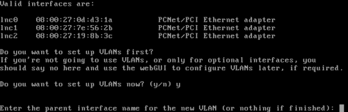
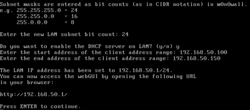
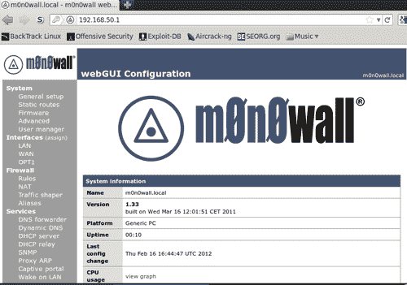
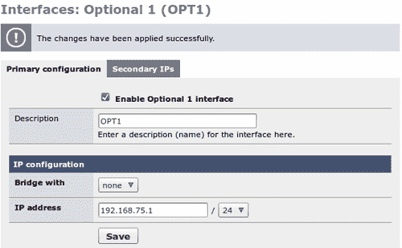
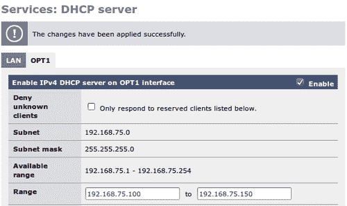
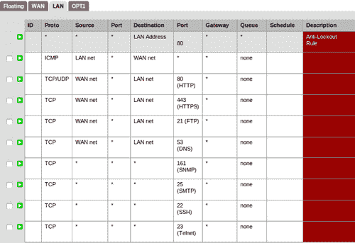

# 第十章虚拟实验室环境的搭建

在大多数职业中，保持技能的更新是极其重要的；渗透测试也一样。渗透测试技能需要时间来培养，并在每天的信息安全环境变化中脱颖而出。考虑到这一点，在当今时代，获得一个具有 4-16 千兆 RAM 和四核或六核处理器的半功能计算机系统并不困难。这类设备允许渗透测试人员构建成熟的虚拟网络，用作实践实验室。在本章中，我们将回顾如何构建这样的环境。我们将尝试使用有限的系统资源来模拟我们在使用中可能看到的安全网络类型。

我们将在本章中讨论以下事项：

*   模拟带有防火墙的简单网络
*   建立多层 DMZ
*   在虚拟环境中模拟更复杂的网络

# 为什么要费心设立实验室？

一旦你的实验室建成，在更全面的测试环境中进行实验似乎永远是最好的选择，但事实上，你可能只是增加了不必要的复杂性，这可能会转移或完全破坏测试。

让我们来看看建立一个 Web 服务器来运行一个简单的 Web 应用程序。在选择实验室环境之前，我们需要确定测试的内容。应提出的一些问题包括：

*   是否需要任何特定的服务来确保测试准确地模拟真实测试中看到的环境？
    *   负载平衡？
    *   软件的特定版本？
    *   防火墙？
*   是否有任何因素会导致结果不准确地表示真实生产环境中发生的情况？
*   您的实验室是否为您提供了在现实世界中复制您的发现所需的实践经验；如果没有，需要做哪些改变才能做到这一点？

希望这张基本问题的快速列表能让您在选择哪种类型的实验室以及完成哪项任务时考虑到这些问题。有许多场景可以通过一个简单的虚拟客户机与另一个虚拟客户机对话来测试；另一方面，有些场景需要使用数十个甚至数百个系统来准确表示您在真实环境中的体验。无论您选择如何建设您的实验室，它应该始终允许您进行修改或在现有系统的基础上建设。它还应该易于管理，并根据需要进行更新。

### 注

拍摄新构建的系统的快照是确保必要的操作系统构建在需要时准备就绪的有效方法。

# 保持简单

有时，可以建立一个简单的实验室来满足您的测试要求。很多时候，特别是在学习环境中，保持简单会缩短学习曲线，并能够快速吸收相关材料，而不是被无关紧要的事实或不相关的配置设置淹没。在本书中，每个章节都试图使用审查手头任务所需的最低系统设置。在建立实验室时，不应轻视此选项。

## 无意义测试示例

许多新利用漏洞和漏洞的示例都可以通过以下简单配置进行测试：

这个网络非常简单（除了简单地从目标机器本身进行测试之外，这对于许多情况来说肯定是有用的）。

我们有一台回溯机器与易受攻击的目标机器连接在同一 LAN 段上。没有内联防火墙或其他任何东西可以阻止验证攻击代码是否按预期工作。如果在更复杂的环境中测试某些方法或技术时遇到问题，这将是一个很好的健全性检查。

我们将不讨论设置这种类型的环境，因为在本书中已经反复介绍过。

## 网络分段与防火墙

添加内联防火墙和适当的网络分段使得以下基本网络基础设施变得司空见惯，这些基础设施带有网关或防火墙，将测试机与易受攻击的目标分开。这种分层防御只是保护典型环境的一小步：

从外部世界来看，系统将有一个可公开访问的 IP 地址，然后在后端它将有一个真实的 IP 地址（可能使用 NAT 非路由地址）。任何来回传递的流量都将通过网关或防火墙进行处理。让我们来看看我们将如何模仿这样的环境：

### 要求

要继续构建此示例，您需要以下内容：

*   Oracle 的 Virtualbox 最新版本
*   2GB 内存
*   M0n0Wall 虚拟来宾机
*   回溯虚拟来宾机
*   Ubuntu 服务器 10.04 稳定带灯（连接到 MyLab2）

这是所有必要的开始！

### 设置

我们将从安装**M0n0Wall**防火墙开始。如果您在前面的章节中使用过 pfSense，您会注意到设置非常相似。在这种情况下，我们的 M0n0Wall 实例将有三个适配器：WAN、LAN 和 OPT1。首先在[下载 M0n0Wallhttp://m0n0.ch/wall/downloads.php](http://m0n0.ch/wall/downloads.php) 。我们将使用 `cdrom-1.33.iso`版本，尽管将来的版本在设置上应该非常类似。M0n0Wall 是一个完善的小型防火墙，由于所需资源有限，它可以完美地满足我们的需求。

在 VirtualBox 中，使用以下设置设置新的来宾计算机：

*   名称：M0n0Wall_ 底座安装
*   操作系统类型：BSD/FreeBSD
*   内存：128 MB
*   虚拟硬盘：**启动盘**勾选，**新建硬盘**勾选
*   创建新虚拟磁盘：VDI
*   虚拟磁盘存储详细信息：动态分配
*   虚拟磁盘文件位置和大小：（位于用于未来实验室的文件夹中），大小为 200 MB

此计算机需要使用 VirtualBox Manager 配置三个网络适配器。

*   **网络适配器 1**应配置为使用**NAT**，这将是我们的 WAN 连接
*   需要为内部网络名称 `MyLab1`配置**网络适配器 2**，该名称将代表我们的 LAN 连接和
*   **Network Adapter 3** should be set up at Internal Network name `MyLab2` and will be tied to our internal network (the OPT device)

    ### 提示

    使用**PCnet PCI II**适配器将减少可能出现问题的可能性。此外，建议更改每个适配器的 MAC 地址，以便更轻松地确定您在服务器设置中选择的适配器。例如，如果网络适配器 1 的当前 MAC 为 0800270DD321，则将其更改为 0800270DD31A 将提供一个易于记忆的可视 que：1A 是适配器 1，2B 可能是适配器 2，依此类推。

`M0n0Wall`将需要安装在新的 VirtualBox 机器上。

1.  启动 `M0n0Wall_Base_Install`并选择从[下载的安装介质 http://m0n0.ch/wall/downloads.php](http://m0n0.ch/wall/downloads.php) 。
2.  Choose the **7) Install on Hard Drive** option:

    

3.  When asked which hard drive to install on, choose your hard drive (in this case it is `ad0)`.

    

4.  出现提示时重新启动，并确保系统是从硬盘安装而不是从 ISO 启动的。

现在已经安装了 M0n0Wall，我们必须配置接口：

1.  选择**1）接口：分配网络端口**并按*键进入*。
2.  当提示列出可用接口时，请继续设置 VLAN。按*y*继续。
3.  Enter the parent interface name for the first adapter. This will be listed next to the MAC addresses on your display:

    

4.  继续完成每个适配器的创建过程。在这种情况下，我们的 `lnc0`适配器分配给 VLAN 1、 `lnc1`分配给 2、 `lnc2`分配给 VLAN 3。这些 VLAN 可以是介于 1 和 4094 之间的任何未使用的数字。
5.  When determining the LAN interface name choose the adapter that is assigned to MyLab1, the WAN adapter should be assigned to the NAT adapter, and the MyLab2 adapter should be assigned as the OPT device:

    

6.  重新启动防火墙以保存更改。

防火墙已安装在硬盘上，适配器已分配给 VLAN。现在，我们需要设置 LAN IP 地址并连接到 web 界面以进行进一步配置。作为可选步骤，可以更改默认密码。为了简单起见，在本练习的其余部分中，我们将继续使用默认密码。

1.  选择选项**2）设置 LAN IP 地址**并按*输入*继续。
2.  When prompted type the IP address you would like your LAN to use. We will choose `192.168.50.1`.

    

我们现在可以在 MyLab1 内部网络上启动回溯实例，并通过首先在适当范围内获得新的 DHCP 地址，然后将我们的 web 浏览器指向 `http://192.168.50.1:`来连接到防火墙的 web 界面

我们需要设置我们的其他接口来执行我们想到的任务，即为 `192.168.75.0/24`子网提供一条到位于 `192.168.75.100`的易受攻击主机的防火墙路由（将 Ubuntu 机器连接到 MyLab2）。从屏幕左侧的导航菜单中选择**OPT1 接口**，并通过选中相应的框启用。将带有选项的**网桥保留为无，并键入此接口的 IP 地址： `192.168.75.1`。确保下拉列表 `24`。在进行相应的更改后，单击**保存**按钮。**

我们可以在 OPT1 接口上启用 DHCP 服务器。选择左侧导航菜单上的**DHCP 服务器**，选择**服务下的**OPT1**选项卡：DHCP 服务器**。选中此端口上启用 DHCP 服务的框，并将**范围**输入为 `192.168.75.100`到 `192.168.75.150`。选择更改后，单击**保存**按钮继续。

目前没有为 OPT1 接口设置默认规则。让我们建立一些基本规则，允许我们在 `192.168.50.0/24`中的系统 ping `192.168.75.0/24`中的系统。

点击左侧导航栏中的**防火墙规则**选项，选择 OPT1 选项卡。选择圆圈内看起来像加号**（+）**符号的图标将带您进入允许配置新规则的屏幕。单击此图标继续。

在这个初始规则中，我们希望允许 ICMP 数据包从任何地方发送到 OPT1 接口。需要选择以下设置：

*   **动作：**通过
*   **接口：**OPT1
*   **协议：**ICMP
*   **ICMP**类型：任意
*   所有其他：默认设置

保存您的设置并点击**应用**按钮加载更改。

我们现在可以从**回溯机器**追踪路由到**目标机器**（在本例中，Ubuntu 服务器安装设置为接收 DHCP 地址）。

使用 M0n0Wall，我们可以在非常有限的空间内使用许多功能强大的选项。当您希望在虚拟实验室环境中放置多个防火墙时，这一点非常重要。

# 增加复杂性或模拟目标环境

有时，为了在实际测试之前执行离线测试，模仿客户的网络可能会变得有益。这种做法有时可以让您在一些简单的枚举之后确定阻力最小的路径。

让我们来看看下面的网络例子：

查看图表，我们可以确定至少有四个已知子网、两个防火墙和六台机器履行各种职责。还发现了一个 web 应用程序防火墙和一个入侵检测系统，该系统位于 `192.168.25.0/24`和 `192.168.50.0/24`与 DMZ 的 Web1 服务器之间。不需要太多的讨论就可以理解我们正在处理的是哪种类型的商店，让我们假设这个客户只使用最新和最好的开源社区驱动软件而感到自豪。理想情况下，我们会尽可能地模拟客户环境，以确定是否存在任何未正确定位或经常配置错误的安全控件。考虑到这一点，我们将尝试使用以下配置进行仿真：

*   1 个 M0n0 墙壁防火墙
*   1 个安装并配置了 IDS 和 WAF 模块的 pfSense 防火墙
*   5 Ubuntu 服务器系统
*   1 个运行 MySQL 的 FreeBSD 系统（例如，虚构的企业所有者无意中透露，他希望开始在所有服务器上使用 FreeBSD，因为他们在 FreeBSD 服务器上拥有丰富的经验）

如果我们在实验室中执行直接的系统到系统构建，那么总共需要模拟 8 个虚拟服务器。再次查看图表，我们确定如果我们将一些服务器组合起来，可以使其更加资源友好。默认情况下，每个虚拟单元最多可以有四个网络适配器。

### 注

本节详细介绍了如何配置每台机器。在到达每台机器的区域之前，不要构建这些系统。以下清单将用作所需内容的概述。

考虑到这一点，我们将按照如下方式配置虚拟实验室：

*   防火墙 1
    *   pfSense
    *   256 MB 内存
    *   1 GB 硬盘驱动器
    *   身份证
    *   瓦夫
    *   DHCP 服务
    *   适配器 1:192.168.25.0/24 内部网络名称：MyLab1
    *   适配器 2:192.168.50.0/24 内部网络名称：MyLab2
    *   适配器 3:192.168.75.0/24 内部网络名称：MyLab3
*   防火墙 2
    *   M0n0 墙
    *   128 MB 内存
    *   200 MB 硬盘
    *   DHCP 服务
    *   适配器 1:192.168.75.0/24 内部网络名称：MyLab3
    *   适配器 2:192.168.101.0/24 内部网络名称：MyLab4
*   Web1
    *   Ubuntu 服务器
    *   512 MB 内存
    *   1 GB 硬盘驱动器
    *   灯
    *   适配器 1:192.168.25.0/24 内部网络名称：MyLab1
    *   WordPress 3.1
*   DB1
    *   FreeBSD 8.2
    *   MySQL
    *   256 MB 内存
    *   6 GB 硬盘驱动器（如果资源有限是一个问题，可以减少）
    *   适配器 1:192.168.50.0/24 内部网络名称：MyLab2
    *   适配器 2:192.168.75.0/24 内部网络名称：MyLab3
*   附录 1
    *   Ubuntu 服务器
    *   256 MB 内存
    *   1 GB 硬盘驱动器
    *   灯
    *   适配器 1:192.168.75.0/24 内部网络名称：MyLab3
    *   适配器 2:192.168.101.0/24 内部网络名称：MyLab4
    *   WordPress 3.1
*   Admin1
    *   Ubuntu 服务器
    *   256 MB 内存
    *   1 GB 硬盘驱动器
    *   灯
    *   适配器 2:192.168.101.0/24 内部网络名称：MyLab4
    *   安装了各种管理工具（Wireshark、Nmap 等）

这使我们的内存总量达到 1664MB，硬盘容量刚刚超过 10GB。大多数现代系统都能够处理这种类型的虚拟网络，但如果您的系统无法处理，请根据需要战略性地减少 RAM 或 HDD 的数量。

### 注

请注意，这不包括为回溯机器或主机保留的任何 RAM 或 HDD 空间。如果您有 16 GB 的 RAM，请不要将其全部分配给您的虚拟机，否则您可能会遇到一些问题！

## 配置防火墙 1

使用上面确定的设置下载并安装 pfSense 虚拟机：

*   防火墙 1
    *   pfSense 2.0
    *   256 MB 内存
    *   300 MB 硬盘
    *   身份证
    *   瓦夫
    *   DHCP 服务
    *   适配器 1:192.168.25.0/24 内部网络名称：MyLab1
    *   适配器 2:192.168.50.0/24 内部网络名称：MyLab2
    *   适配器 3:192.168.75.0/24 内部网络名称：MyLab3

确保使用与 FreeBSD 兼容的适配器类型以避免任何问题。我们将不再回顾 pfSense 基本适配器配置的设置，因为在前面的章节中已经详细介绍了这一点。一旦基本配置完成，您应该得到类似于以下内容的结果：

配置 IPs 后，设置应如下所示：

使用回溯虚拟机连接到其中一个网络，并配置以下 pfSense web 控制台设置：

*   DHCP 服务器：为范围 X.X.X.100 X.X.X.150 上的所有接口启用。
*   创建允许 ICMP、80、443、53、161、25、22、23 和 21 TCP/UDP 从 192.168.25.0/24（WAN）到 192.168.50.0/24（LAN）的规则。删除现有的 WAN 规则。
*   创建一个规则，允许从 192.168.50.0/24（LAN）到 192.168.75.0/24（OPT1）的所有流量。
*   允许从 LAN 到 WAN 接口的所有通信。

以下是正在为 LAN 设置 Firewall 1 规则的示例：

### 在 pfSense 中安装附加包

Firewall1 还列出了一个 ID 和一个 WAF。我们可以使用 pfSense 提供的软件包管理器在系统上安装此附加功能。

### 注

pfSense 系统需要临时接入互联网，才能访问和下载这些软件包。这可以使用 NAT 进行配置。在连接到 Internet 之前，请确保禁用任何其他测试机器。在 WAN 接口上启用 Internet 将使所有使用 Firewall 1 的系统都能够访问 Internet！还请注意，在从内部网络更改为 NAT 之前，需要关闭机器。

1.  点击**系统****套餐**并选择**可用套餐**页签。
2.  Choose **Proxy Server with mod_security** and install it.

    

3.  Select the **Snort** package and install it as well.

    

    ### 提示

    花些时间，熟悉可与 pfSense 结合使用的各种一键安装软件包。易用性和优秀选择的可用性使得使用这些软件安装快速高效。

每个已安装的软件包将添加到导航栏中的**服务**菜单中，以便进一步配置。根据需要更新软件包并进行配置。由于我们不知道这个虚构练习中的客户机是如何配置 WAF 或 ID 的，因此我们可以假设默认值一直在使用，直到我们要执行初始枚举，此时我们可以更接近地模拟目标环境。

## 防火墙 2 设置和配置

我们需要设置一个 M0n0wall 虚拟实例，如下所示：

*   防火墙 2
    *   M0n0 墙
    *   128 MB 内存
    *   200 MB 硬盘
    *   DHCP 服务
    *   适配器 1:192.168.75.0/24 内部网络名称：MyLab3
    *   适配器 2:192.168.101.0/24 内部网络名称：MyLab4

由于我们已经在本章中介绍了设置 M0n0wall，我们将跳到下一种机器类型。

## Web1

从典型的存储库下载并安装 Ubuntu Server 10.04。虚拟机需要定义如下：

*   Web1
    *   Ubuntu 服务器
    *   主机名：Web1
    *   512 MB 内存
    *   1 GB 硬盘驱动器
    *   灯
    *   OpenSSH
    *   适配器 1:192.168.25.0/24 内部网络名称：MyLab1

机器安装、更新和配置完成后，我们需要安装 WordPress。

### 注

Ubuntu 网站提供了优秀的资源，帮助用户进行直观的安装。

在 Ubuntu 服务器上安装 WordPress 很简单；[上有很多很好的说明 http://codex.wordpress.org/Installing_WordPress#Famous_5-分钟安装](http://codex.wordpress.org/Installing_WordPress#Famous_5-Minute_Install)。要总结说明，您可以在[处简单地 `wget`包装 http://wordpress.org/latest.tar.gz](http://wordpress.org/latest.tar.gz) ，将其解压缩，然后将其移动到服务器上的 `/var/www`目录。如果您按照前面的说明进行操作，则可以通过 `http://192.168.25.100/wordpress`访问 WordPress 安装。请记住，本练习的目标是了解如何创建模拟常见配置中的模拟。在本例中，数据库被抽象并存储在 FreeBSD 机器上。这允许更精确地控制谁和什么可以访问网络上的特定数据。这也使得攻击者更难间接访问机器，通常足以防止对机器本身的直接攻击（攻击者将使用 SQL 注入和其他基于 web 应用程序的缺陷来访问和控制系统，而不是直接将其作为目标）。

## DB1

DB1 是 FreeBSD8.2 的一个非常基本的安装，只有一个 MySQL 服务器、Telnet 和 SSH 作为服务运行。在[处获取 ISOhttp://www.freebsd.org/where.html](http://www.freebsd.org/where.html) 并使用以下虚拟机设置安装机器。请注意，这台机器是多主机的，由管理员直接管理 `192.168.101.0/24`段。在一个完美的世界中，您还将限制对这台机器的直接访问仅限于管理员和 Web1 服务器的 MySQL 端口、Telnet 端口和 SSH 端口。

*   DB1
    *   FreeBSD 8.2
    *   MySQL
    *   256 MB 内存
    *   6 GB 硬盘驱动器（如果资源有限是一个问题，可以减少）
    *   适配器 1:192.168.50.0/24 内部网络名称：MyLab2
    *   适配器 2:192.168.75.0/24 内部网络名称：MyLab3

系统设置和配置完成后，应使用 `WP_production`和 `WP_Test`数据库作为 Web1 和 App1 实例的 MySQL 数据库服务器。

## 附录 1

这基本上是 Web1 服务器的克隆。在一个典型的环境中，这台机器可能会有最新和最大的变化，这也意味着它可能没有位于 DMZ 中的服务器那么安全。这是进一步入侵网络的一个很好的目标，因为许多管理员不会使用强密码，或者这些系统上使用的证书可能与你在野外看到的不一致。

*   附录 1
    *   Ubuntu 服务器
    *   256 MB 内存
    *   1 GB 硬盘驱动器
    *   灯
    *   适配器 1:192.168.75.0/24 内部网络名称：MyLab3
    *   适配器 2:192.168.101.0/24 内部网络名称：MyLab4
    *   WordPress 3.1

只需使用 VirtualBox 克隆机制创建此计算机，重命名相应的项，并确保适配器 MAC 地址已重置。您还需要在 VirtualBox 中适当地分配**网络适配器**。

## 管理员 1

由于这台机器很可能包含许多工具和关键数据，因此您应该确保包括管理员通常使用的某些电动工具，如 Nmap、WireShark 等。此计算机将用作管理员在网络上执行不同管理任务的管理工具和孤岛。玩得开心，安装 Ubuntu 服务器和任何你觉得舒服的服务或软件。理想情况下，此时，您在实际测试期间执行的枚举工作将为您提供有关此系统真正拥有的内容的更多信息，以便您可以更紧密地模拟它。网络中的许多系统可能都有允许从该系统直接访问的规则，而不管网络位置如何。

对于本例，构建一个满足以下规范的 Ubuntu 服务器：

*   管理员用户
    *   Ubuntu 服务器
    *   256 MB 内存
    *   1 GB 硬盘驱动器
    *   灯
    *   适配器 1:192.168.101.0/24 内部网络名称：MyLab4
    *   安装了各种管理工具（Wireshark、Nmap 等）

至此，您应该拥有一个功能齐全的多层环境，在某种程度上类似于小型商店中常见的多层环境。要测试真正安全的网络，您还必须添加额外的模块，并依靠高度监控的日志、文件完整性检查、基于网络的防病毒扫描（在 pfSense 上尝试此功能！！）等等。无论有多少安全控制措施到位，它们都必须协同工作才能充分发挥作用。通过努力工作和开箱即用的思维，渗透测试人员将把这些环境推向极限，并确定客户是否得到充分保护（或不…）。

# 总结

在本章中，我们回顾了建立各种类型的虚拟实验室。显然，几乎任何类型的虚拟环境都可以使用常用工具和足够的资源进行仿真。这对于任何使用开源软件的系统来说尤其如此，因为开源软件随时可用，并且不需要购买许可证（通常取决于软件是什么）。

我们还进一步了解了 pfSense 的功能，以及如何利用它更紧密地模拟我们在测试高度安全网络时将发现的环境类型。使用这些技术安装和配置 WAF、IDS、IP 甚至反向代理都很简单。

我们还介绍了 M0n0wall 的安装和配置，它非常适合在资源非常丰富且占用空间很小的情况下使用。一些渗透测试人员已经建立了跨越多台主机和数百名来宾的测试实验室。这可能超出了大多数人的需要，但它可以廉价完成这一事实仍然是事实。

在下一章中，我们将创建一个非常特殊的实验室，用于模拟真实的渗透测试。您需要使用本书中讨论的所有方法（可能更多，因为没有一本书能够涵盖渗透测试的所有内容！）才能从头到尾测试虚构的公司。

下一章见！