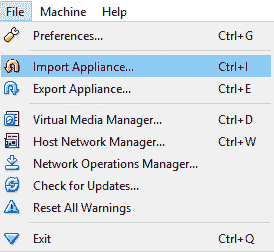
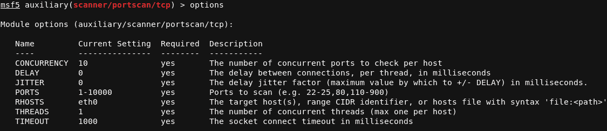
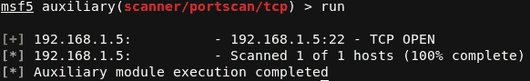

# *第 2 章*：测试与道德黑客

下一章讨论渗透测试，也称为 pentesting。Pentesting 是 20 世纪 60 年代由计算机引起的。随着计算机系统开始更多地分发数据，确保数据的安全变得至关重要。在对如何穿透通信线路进行了大量讨论之后，建议使用某种类型的“穿透评估”来评估具有“真实威胁”评估的计算机系统和通信线路。追溯到 20 世纪 70 年代初，tiger 团队作为第一批渗透测试团队成立，并执行类似于本书中所述战术的操作。这些 tiger 团队的主要职责是发现漏洞，并根据手动利用发现的漏洞评估威胁影响级别。

快进到今天，pentesting 的世界越来越流行，并且正在成为评估公司基础设施和安全状况的常用方法。企业雇佣 pentesters 来攻击他们的公司，并从道德上突出弱点。pentesting 的目的是在坏人发现漏洞之前让好人知道漏洞。

在我们进入 AWS 之前，我们将学习网络安全的笔试部分，以及如何成功地执行笔试，以便为我们在这本书中的工作奠定基础。我们需要理解它，这样我们就可以像五旬斋一样思考，并通过这个思考过程来阅读这本书。毕竟，要了解敌人，你必须像敌人一样思考。

在本章中，我们将简要介绍渗透测试的定义。然后，我们将在自己的机器上本地设置一个 Kali Linux 系统，并探索安装在操作系统上的工具。不要担心没有 Linux 方面的经验；本章将涵盖你需要知道的一切。我们还将检查一些 pentesting 工具，并在需要时安装一些工具。我们还将学习如何编写可以在自己的主机上运行的基本脚本。

在本章中，我们将介绍以下主题：

*   什么是渗透测试？
*   卡利 Linux
*   Linux 命令
*   测试工具
*   操作系统

# 技术要求

要遵循本章中的说明，您需要以下内容：

*   虚拟箱：[https://www.virtualbox.org/manual/ch01.html](https://www.virtualbox.org/manual/ch01.html)
*   皮查姆

本章中使用的代码可通过以下链接获取：[https://github.com/PacktPublishing/AWS-Penetration-Testing/tree/master/Chapter%202:%20Pentesting%20and%20Ethical%20Hacking](https://github.com/PacktPublishing/AWS-Penetration-Testing/tree/master/Chapter%202:%20Pentesting%20and%20Ethical%20Hacking) 。

查看以下视频以查看代码的运行：[https://bit.ly/386jRrY](https://bit.ly/386jRrY)

# 什么是渗透测试？

术语“渗透测试仪”对专业人员来说是一个有趣的职位。虽然这个职位可能是一个很好的谈话开端，尽管有一些有趣的评论，渗透测试可能是网络安全领域最有价值的职业之一。那么，什么是渗透测试，或者 pentesting？

渗透测试是通过手动和自动利用对系统攻击面的评估。这涉及到使用多个源来发现和利用系统内的问题。系统是组成实体（系统）的一组人员、机制、软件和策略。

我们可以从另一个角度来看，pentesting 强调了系统的工作方式，并揭示了使系统暴露于黑客攻击之下的漏洞，从而使这些漏洞能够在对手攻击之前得到纠正。这让工作人员了解他们的技术、安全性，以及攻击者如何思考和利用这些系统。在当今的环境中，对手总是与公司玩猫捉老鼠的游戏。pentester 的工作是确保这些系统有更熟练的猫来捕杀恶意的老鼠。

## 在坏人之前发现关键问题

远离新闻是游戏的名称，而 pentesting 是一个帮助公司留在游戏中的过程。正如我们许多人所看到的，新闻喜欢报道被网络罪犯攻击的公司。这些攻击使公司损失数百万美元，同时也降低了它们的声誉。由于这些公司中的许多都是小公司，它们反弹的机会较小。事实上，60%的小企业在网络攻击后 6 个月内倒闭。渗透测试是一种高水平的质量保证检查，确保公司能够弥补攻击面上的漏洞，并在问题被利用之前解决问题，最终将其排除在新闻之外，并避免遭受严重的金钱影响。

## 测试方法学

理解 pentesting 中的步骤是很重要的。了解这些约定不仅可以让您深入了解业务中如何执行安全操作，还可以正式表示攻击者可能实际试图利用您的系统进行攻击。

下面是一个压缩列表，其中列出了在 pentest 约定中采取的步骤：

1.  **计划**五旬考试是五旬考试最关键的阶段之一。在这个阶段，你需要在法律上和逻辑上制定你的整个计划。确定参与范围并设定目标。
2.  您将在**侦察**阶段收集信息。这将涉及到被动或主动地查找信息。
3.  **威胁建模**依赖于您收集测试期间收集的所有数据，并使用这些数据提供系统视图，突出显示其测量的威胁。
4.  **测试和利用**涉及您探测在测试之前发现的漏洞。如果验证探测成功，则开始利用该漏洞。利用漏洞有多种方式。一些常见的方法包括向 web 应用程序发送意外输入、使用自动化工具和利用漏洞和/或执行手动利用漏洞。
5.  当您进入**后期开发阶段**时，您将保持持久性并执行横向移动和数据过滤。此外，保持秘密和掩盖你的踪迹是很好的实践。保持隐身状态可以让蓝队测试探测和反应。
6.  **报告**是测试中最关键的部分。提交一份出色的报告可确保客户/被测试公司了解发现的问题以及如何缓解在测试过程中发现的问题。

虽然我们已经了解了 pentesting 的一般步骤，但我们还需要了解不同的方法，我们将在下面介绍。这些方法是 pentesting 的“风格”，可以通过 pentesting 执行。这些风格使用局外人或局内人的方式，并在今天的普遍 pentesting 实践中使用！

## 测试类型

在计划你的五旬考试时，了解你想要遵循的方法是很重要的。让我们看一下一般方法：

*   **Black box**: This type of test involves assessing the in-scope targets with no knowledge of the inner workings of the in-scope systems and applications. Often, it can be thought of as a validation of a system's functional requirements. For example, a client will develop a new application and requires a test to be performed at the user level.

    通常，用户不知道应用程序的内部工作，只将其用于功能属性——这意味着可能需要进行功能测试。功能测试旨在突出显示应用程序中几乎一无所知的人可能发现的任何漏洞。

*   **白盒**：白盒测试是您在现实世界中看到的最常见的测试方法。它涉及到在对范围内的一切都有充分了解的情况下测试一个系统。将其视为质量保证或测试系统的每一个可能细节，以确保其不易受到攻击。白盒测试是发现和验证源代码和系统设置内部的一种很好的方法。通常，在将新产品（应用程序、硬件等）集成到业务中之前，会执行白盒测试。白盒测试是我们在本书中将要做的。
*   **灰盒**：简单来说，这是黑盒和白盒测试的混合体。测试 web 应用程序就是一个很好的例子。测试人员完全了解 web 应用程序的前端，但对后端几乎一无所知。

## 利与弊

*   我们已经探索了各种类型的测试，所以在进一步讨论之前，让我们先看看它们的优缺点。每种类型的测试都有一个最佳的时间和地点，我们将在下面介绍其条件。

### 优势

白盒测试具有以下优点：

*   由于发现所需的时间较短，因此速度较快
*   由于时间限制较少，价格便宜
*   允许测试人员有更多的时间查看深层功能方面，如代码审查

黑盒测试具有以下优点：

*   由于测试人员必须模拟真实的威胁向量，因此提供了更可靠和真实的结果
*   通过网络钓鱼活动突出终端用户的弱点

灰盒试验具有以下优点：

*   结合使用白盒和黑盒测试
*   允许创造性且不受一种测试方式的限制

现在我们已经看到了优点，让我们继续讨论每种测试类型的缺点。

### 缺点

白盒测试有以下缺点：

*   通常，白盒测试不会根据真实的攻击者场景提供结果。
*   如果计划不当，可能会让人头疼。通常情况下，白盒测试没有正确准备，测试开始时会丢失大量信息。例如，当白盒测试启动时，目标业务通常可能会忽略某些内容，而忘记 pentest 中的特定资源。这是一个需要注意的问题，在[*第 10 章*](10.html#_idTextAnchor438)*【五项测试最佳实践】*中有详细讨论。
*   由于测试人员已经对环境了如指掌，这样的测试可能会带来偏见。

黑盒测试有以下缺点：

*   这很费时，因为测试人员必须花时间获得访问权限。
*   这可能很昂贵，取决于订婚的时间长短。

灰盒测试有以下缺点：

*   这可能很费时，这取决于五旬斋节的范围有多广以及五旬斋节的知识有多丰富。
*   根据测试长度，它也可能很昂贵。
*   现在我们已经对 pentesting 有了一个很好的概述，让我们下载一个 Kali Linux 的 VirtualBox 映像，并设置操作系统，以便使用它与 our AWS 环境进行交互。

# 卡利 Linux

Kali Linux 是一个 Debian 发行版，由进攻性安全（[www.aproval-Security.com](http://www.offensive-security.com)免费提供。由于安全性越来越重要，Kali Linux 在过去几年中变得越来越流行。事实上，这对任何从事 pentesting 工作的人来说都是至关重要的。这是因为操作系统预装了一批安全工具，而不必手动安装。

在本节中，我们将学习如何在自己的机器上本地设置自己的 Kali Linux 映像。本练习的目的是让我们更熟悉 Kali，并教您如何设置自己的虚拟机。在本书中，我们还将使用这个 Kali 实例与 AWS t 进行交互。

## 设置 Linux 映像

设置 Kali Linux 很容易。按照此处给出的步骤进行操作：

1.  我们需要去从攻击性安全网站上抓取一张卡利图像。确保您为 VirtualBox 获取了**Kali Linux VirtualBox 64 位版本**：https://www.offensive-security.com/kali-linux-vm-vmware-VirtualBox-image-download/.
2.  在下载的同时，让我们去抓取一个新版本的 VirtualBox。VirtualBox 将是我们构建和托管 Kali 机器的地方：https://www.VirtualBox.org/wiki/Downloads.
3.  按照说明安装 VirtualBox。安装步骤因主机操作系统而异。
4.  Start VirtualBox and go to the top left-hand corner and click **Import Appliance…**, listed under **File**:

    

    图 2.1–选择了 Import Appliance…的文件菜单

5.  After that, you will need to import the Kali Linux **.ova** file that we downloaded in *step 1*. The **.ova** file is a VirtualBox-formatted file that allows us to import our virtual image directly into VirtualBox with little to no effort:

    

    图 2.2–导入 Kali Linux.ova 文件

6.  Once you select the new image, you'll need to change the name of the virtual machine. In this case, we change the name to **AWS Kali**. If you change the name to something else, ensure that you remember what you name it so you can use the Kali Linux machine throughout this book. We also turn off the **USB Controller** functionality since we won't be using it:

    

    图 2.3–设备设置窗口

7.  Now let's start up our Kali Linux virtual machine. To do so, double-click on the host you created. The virtual machine will start up and prompt you with a user login:

    

    图 2.4–Kali Linux 启动屏幕

8.  To log in, use the following credentials:

    用户名：**根目录**

    密码：**toor**

现在我们已经登录到我们的 Kali 机器，让我们熟悉一些基本的 Linux 命令，这些命令将在本书中帮助我们。了解这些命令的作用很重要，因为它允许您在 Kali Linux 机器以及其他 Linux 发行版中操作。

## 探索基本 Linux 命令

因为我们正在使用 AWS 和 Kali Linux，所以理解一些基本的 Linux 命令很重要。您将使用许多工具，这些工具需要使用终端。因此，您必须了解如何运行基本命令。我们将使用我们在机器上本地设置的新 Kali Linux 映像来发现其中一些新命令：

1.  With your Kali instance started and up and running, let's log in and make a directory. To do so, you will need to type the **mkdir** command. This command allows us to make directories that we can store information in. Let's name the directory **Pentesting**:

    **$mkdir Pentesting**

2.  After that, you're going to need to move into that directory, but before we can do that, we need to know what directory we are currently working in. Use the **pwd** command to print out your current directory. **PWD** stands for **print working directory**. If you haven't moved yet, you should be in the root directory. Now move into the **Pentesting** directory by using the **cd** command:

    **$cd Pentesting**

3.  Now that we have the directory, let's create a **.txt** file that we can add notes to later throughout this book. Type the **touch** command to make a file called **notes.txt**:

    **$touch notes.txt**

4.  现在我们已经创建了一个文件，让我们在其中添加一些实际的注释。我们将使用**echo**命令将一些文本输出到**notes.txt**文件中。之后，我们将使用**cat**命令列出文件中的单词。**cat**命令打印出文件的内容，也可用于将两个文件连接在一起。之后，我们将创建另一个名为**notes2.txt**的文件，并将其与**notes.txt**组合成一个文件。
5.  Let's output some text into **notes.txt**:

    **$echo“我爱五旬斋！”>notes.txt**

6.  Now list out the context using the **cat** command:

    **$cat notes.txt**

7.  Now let's make another file and add some text to it all in one command:

    **$echo“我爱 AWS！”>notes2.txt**

8.  Then, we will combine **notes.txt** and **notes2.txt** to form one file:

    **$cat notes.txt notes2.txt>awspentest.txt**

    你应该有如下的东西：

图 2.5–notes.txt 和 notes2.txt 组合的输出

祝贺现在，您已经了解了如何在 Linux 操作系统中创建目录和文件。虽然知道这些命令很好，但它们并不是我们需要知道的所有命令。现在，我们将在阅读本书并了解更多有关 AWS 和 pentesting 的信息时，了解一些其他的命令。

**附加命令**：

在阅读本书时，我们需要了解的一些其他命令如下：

*   **ls**：此命令表示“列表”，用于列出目录的内容。
*   **rm**：此命令表示“删除”并从目录中删除文件。
*   **mv**：此命令将文件从一个目录移动到您指定的另一个位置。
*   **ping**：这个命令不仅适用于 Linux，而且是一个很好的命令。**ping**命令向主机发送回显请求，希望接收回显响应。它与主机对话，以查看它们是否在线。但是，有时主机会禁用 ping，使其看起来离线。如果出现这种情况，我们可以使用**网络映射器**（**NMAP**中的**-Pn**交换机发现一台不会响应**ping**的主机。
*   **ifconfig**：这允许您查看您正在运行的网络接口。使用 Kali，运行**ifconfig**通常会向您显示**eth0**接口，该接口通常路由或连接到您的主**网络接口卡**（**NIC**。

在本节中，我们探讨了 Linux 中的基本命令。这些命令将帮助我们有效地使用 Linux，因为我们将学习本标题中的课程。接下来，我们将开始探索 pentesting 工具，它将帮助我们学习 pentesting。

测试工具

在 pentesting 中，您将拥有大量的工具供您使用，以满足您的所有需求。除了使用工具进行手动测试、自动测试，甚至编写您自己的脚本（我们将在本书中介绍）之外，当涉及到创造性的测试时，可能性真的是无穷无尽的。

虽然我鼓励您了解 Kali Linux 中的工具，但我们也将简要介绍本书中我们将经常使用的几个工具。对于这一部分，让我们来看看 NMAP HOLT T0 和 TY1 T1。这两个工具在扫描和探测服务和漏洞时提供了非常准确的结果。我们还将简要介绍**AWS Inspector**，这是一个用于 EC2 实例漏洞分析的绝佳工具。

## NMAP

NMAP 是一个很棒的工具，它预装在 Kali Linux 中。它是网络管理员常用的开源工具，但由于它能够同时在多台主机上发现服务和打开端口，因此在 pentesting 中受到了欢迎，这通常被称为端口扫描。

端口扫描通过探测特定端口来完成，如果该端口打开，则返回有关该端口的信息。还可以从 NMAP 运行各种脚本，这些脚本将告诉您扫描的主机是否易受特定问题的攻击。还记得我们在[*第一章*](01.html#_idTextAnchor025)*中如何设置匿名服务器，构建您的 AWS 环境*吗？我们可以使用以下脚本检测匿名 FTP 登录：

$nmap-sV-sC-P21

让我们对命令进行分解，以便更好地了解发生了什么。我们将按顺序分解开关：

*   **-sV**开关枚举服务的版本。这意味着扫描输出将转发正在使用的 FTP 版本。
*   **-sC**开关用于结合扫描使用脚本。在这种情况下，它将检查匿名 FTP。
*   **-p**开关指示要扫描的端口。在本例中，我们只使用了端口**21**，因为我们只探测端口**21**。但是，我们可以扫描多个端口。

在阅读本书的过程中，我们将发现并使用更多的 NMAP。在同时，请随意使用 NMAP 查看更多函数。Check out[www.nmap.org](http://www.nmap.org)了解更多信息。

## AWS 检查员

AWSInspector 是 AWS 环境中可用的工具，可在 AWS 云环境中对 EC2 实例运行自动安全评估。扫描器会检查常见漏洞、暴露和最佳做法（补救措施），这将使您能够安全、快速地加固您的环境。AWS Inspector 的缺点是有服务费，因此我们将在本书中避免使用它。不过，请随意阅读有关该服务的内容。

## 变质岩

我们在[*第一章*](01.html#_idTextAnchor025)*中提到了 Metasploit，构建您的 AWS 环境*，并通过我们的 AWS Kali 实例学习了如何更新它。鉴于我们在 MyasPopIt 中了解到的关于 TasaT8 的内容，第 1 章，第 10 章，第 11 章，建立了 AWS 环境。我们将访问本练习的本地实例：

1.  Before we do anything, we will need to update Metasploit the same way we did before, in [*Chapter 1*](01.html#_idTextAnchor025)*, Building Your AWS Environment*:

    **$apt 安装 metasploit 框架**

2.  Once you have finished updating Metasploit, get started by starting up the program:

    **$msfdb 运行**

3.  Now that Metasploit is running, let's test out the port scanning module on our own host. This is going to help us understand some of the syntaxes of the Metasploit commands. Before we begin, we will need to start up SSH on our host. To get started, open a new terminal and type the following command to start up SSH:

    **$service ssh start**

4.  To ensure that the service is running, we can type in the following command:

    **$服务 ssh 状态**

如果全部启动并运行，您将在以下屏幕截图中看到类似的输出：

图 2.6–启动 SSH 的输出

现在我们已经启动了 SSH，让我们看看如何使用它和 Metasploit：

1.  Go back to your terminal that has Metasploit open and use the **search** command to find a TCP port scanner. The syntax should look something similar to **search TCP portscan**. One of the first results will be **auxiliary/scanner/portscan/tcp**. Let's use that to scan our machine:

    **$使用辅助/扫描仪/端口扫描/tcp**

2.  Once you have the module loaded, type the **options** command to see what parameters we need to set. The **options** command lists out all the parameters that are part of the module. Different modules will have different parameters that need to be set:

    

    图 2.7–选项命令的输出

3.  The only parameter we will need to set in this chapter is **RHOSTS**. Now, **RHOSTS** stands for **remote host** and is typically set to a remote victim host. In this case, we will set it to our own machine. To do so, you'll need to know the IP of your machine. Type the **ifconfig** command to discover the IP of your machine. In this case, the IP of my machine is **192.168.1.5**:

    

    图 2.8–运行 ifconfig 的输出

4.  Now that you know the IP of your machine, type the following command to assign it to the **RHOSTS** parameter:

    **$set RHOSTS 192.168.1.5**

5.  由于这是我们需要的唯一参数，请继续使用**run**命令针对主机启动模块。它应该发现 SSH 有一个开放端口：

图 2.9–使用 run 命令的输出

如您所见，它显示端口**22**已打开！查看命令的输出显示主机扫描已 100%完成，并显示**22–TCP 打开**。

就像那样，我们现在知道如何在 Metasploit 中设置扫描模块。在本书中，我们将大量使用 Metasploit，在[*第 9 章*](09.html#_idTextAnchor381)*中，我们将在整个章节中使用 Metasploit，真实生活中使用 Metasploit 的 Pentesting 等等！*。现在我们对使用我的 tasploit 有了一点了解，让我们继续看一下脚本。

## 脚本

脚本是道德黑客和 pentesting 的重要部分，甚至是必不可少的部分。有时，您的工具无法正常工作，或者您可能只需要编写一个快速脚本来测试应用程序或服务。当你有疑问时，写一个脚本来帮助你达到你需要的结果。我们将在**PyCharm**中了解一些使用 Python 编程的非常基本的脚本。

PyCharm 是一个 IDE，允许您构建和运行自己的代码。IDE 与使用终端和文本编辑器的区别在于软件中内置的故障排除功能。不需要查找语法错误；IDE 将在您运行代码之前突出显示问题。本节将介绍如何在本地 Kali 实例上安装 PyCharm，并创建一个 Python 脚本，我们可以在一两步内调试该脚本。如果你以前从未写过剧本，不要感到不知所措；这个基本脚本将为我们提供 Python 发展所需的一般知识和语法：

1.  首先，我们需要在本地 Kali 机器上安装 PyCharm。要做到这一点，您需要获得它的最新下载，您可以从 JetBrains 检索到：[https://www.jetbrains.com/pycharm/download/](https://www.jetbrains.com/pycharm/download/) 。
2.  Download a free version of the community edition and then move it to our working folder:

    **$mv<PyCharm><工作目录>**

3.  Once it's moved over, you'll want to go ahead and extract all the content from the folder, and then move it to the **/opt** folder:

    **$sudo tar xfz<pycharm.tar.gz>-C/opt/**

4.  Now that we have it extracted, we can move on and run the program. To get started, move into the **/bin** folder and run the following command:

    **$./pycharm.sh**

5.  Once you're done installing PyCharm, create a new project and name it **Script**. This will be our working folder where we can make all our scripts throughout this book. Feel free to call your folder anything you like, but make sure you remember the name and where you store it:

    

    图 2.10–在 PyCharm 中创建新项目

6.  Now that we have a folder, let's make a program called **1**. This will automatically store the file as **1.py**. To get started, right-click on your folder and create a new file. Then, assign it a name; in this case, assign it the name **1**. Click **OK**. Now we have an environment to build our first program in. Let's write a simple program that will check whether a variable is true. Before moving forward, please take a look at https://www.python.org for more information about Python programming. Once you feel comfortable with some of the basics, take a look at the following code:

    #!/usr/bin/python

    语句=“你好，世界”

    if 语句==“Hello World”：

    打印报表

    其他：

    打印“该声明不正确”

    看看程序，我们可以运行它，看到我们实际上打印了语句*Hello World*。这是因为**语句**变量的文本与**if**条件匹配。让我们看看如果我们将语句更改为*Hello World 会发生什么！*：

    #!/usr/bin/python

    statement=“你好，W0rld！”

    if 语句==“Hello World”：

    打印报表

    其他：

    打印“该声明不正确”

    很可能你会得到另一个陈述*该陈述不正确*。这是因为变量的语法与**if**语句设置的条件不匹配。条件应该是“Hello World”，而不是“Hello World！”——因此使条件无效。

花点时间看看 Python 是如何工作的。有许多参考资料将重点介绍 Python 的基础知识及其在安全性和 pentesting 中的使用。在本书的后面部分，我们将发现使用 Python 为 AWS 环境编写脚本的方法。

# 操作系统

在你的 pentesting 旅程中，你会遇到多种不同的操作系统。不同的操作系统有不同的用途，包括作为服务器、主机客户端或云环境。了解这些不同的操作系统很重要，因为您需要了解它们在其环境中的工作方式。在本节中，我们将讨论 Linux 和 Windows 系统的一些方面，您应该在测试时了解这些方面。

## Linux/Unix

Linux 是基于 Unix 平台的开源操作系统。在我们目前使用的很多设备和服务器上都可以看到，因此了解一些关于它的基本知识非常重要。它是开源的，所以它有一个开放的协作平台，允许其他开发人员使用它，这意味着你可以添加自己的代码和 bug 修复。

Linux 有许多不同的“风格”的操作系统，比如 Debian（Kali 就是它），Fedora 和 Ubuntu 等等。在你的 IT 生涯中，甚至在这本书中，你都会遇到这些系统！

## Linux 文件权限

理解 Linux 文件系统是如何工作的很重要。Linux 文件系统被称为平面文件系统，这意味着操作系统中的每个文件都必须有不同的名称。操作系统中的文件是使用三种不同的权限创建的，可以设置：

*   读取：允许用户读取文件
*   写入：允许用户写入文件
*   执行：允许用户执行程序

了解这一点很重要，因为有时您需要了解或设置文件的权限。在 pentesting 中，您将遇到可能需要编辑并设置为可执行文件的开源工具。**chmod**命令允许您更改文件的权限，使其成为可执行文件。例如，如果我们有一个名为**pentest.py**的文件，并且需要将其设置为可执行文件，那么我们可以使用以下命令来创建可执行文件：

$chmod+x pentest.py

有时候，你可能没有权利运行这样的程序。您可能需要额外的权限来运行命令，甚至在某些目录中移动。To 解锁这些特权，我们来谈谈**超级用户**。

## 苏多

**sudo**代表**超级用户 do**将以超级用户身份运行其后面的任何命令：

$sudo chmod+x pentest.py

所有**sudo**用户都存储在**/etc/sudoers**文件路径中，只能使用**visudo**命令进行编辑。请随意查看本地 Kali 实例中的文件路径。

现在我们对 Linux 有了更多的了解，让我们来看看我们生活中一个时间点使用的操作系统：Windows 操作系统。

## 窗户

Windows 是一种操作系统，每个人在生活中的某个时刻都会用到它。它是最常见的家庭用户操作系统，经常被许多不同公司用作用户操作系统。虽然操作系统确实很容易使用，其惊人的桌面环境和一切都是点击拖动，但近年来，由于新版本中的漏洞和某些 UI 和 UX 决策，操作系统受到了一些抵制。

多年来，许多不同的漏洞攻击都针对 Windows 操作系统。例如，有是**永恒蓝**，这是一种攻击**服务器消息块**服务并允许攻击者访问受害者系统的漏洞。这种攻击实际上是用来攻击系统，然后将这些系统用作勒索软件有效载荷的服务器，几年前，勒索软件有效载荷产生了很多麻烦。

在过去的年中，已经发现了针对 Windows 系统的其他漏洞和问题。EternalBlue 只是一个例子，但这是一个重要的例子，可以强调和理解为什么补丁和安全性如此重要。如果 Windows sy 阀杆处于易受攻击状态，则可能导致大规模问题。

## 桂

Linux 和 Windows 最大的区别之一是**图形用户界面**（**GUI**）。虽然 Linux 确实有自己的 GUI 和桌面环境，但 Windows 始终在允许用户通过鼠标点击和拖动来扩展文件和内容方面处于领先地位。操作系统的 GUI 是如此的通用，以至于即使是 2019.4 版的 Kali 也有一个**Windows 模式**，允许用户通过在终端中键入**Kali-undercover**来切换到 Windows 风格的桌面。

# 总结

这一章涵盖了相当多的内容，所以如果您觉得有必要，请回顾一下。我们了解了什么是 pentesting，以及如何在我们的机器上本地设置 Kali Linux，并在操作系统中使用各种工具，我们研究了各种操作系统。

在下一章中，我们将进入本书的下一节，开始研究 AWS 以及如何在我们自己的环境中进行测试和安全评估。

# 进一步阅读

*   了解有关 AWS Inspector 的更多信息：https://aws.amazon.com/inspector/
*   Python 网站及资源：https://www.Python.org
*   NMAP 网站和资源：https://www.nmap.org