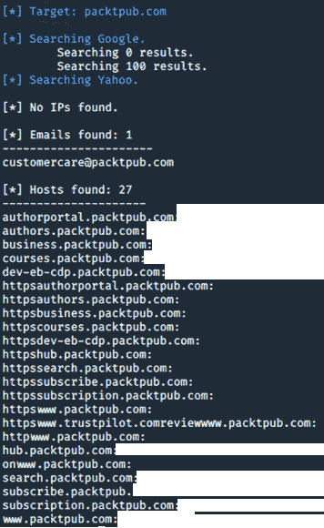
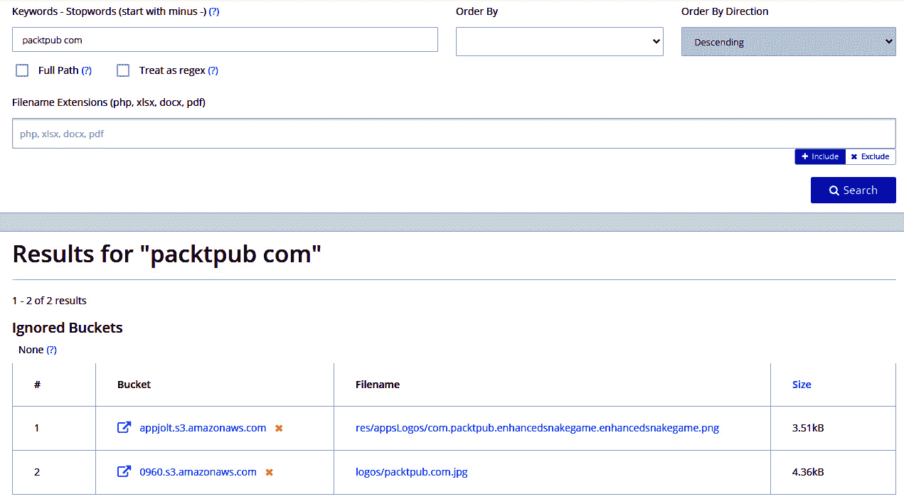
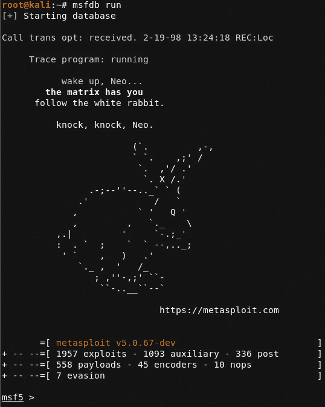
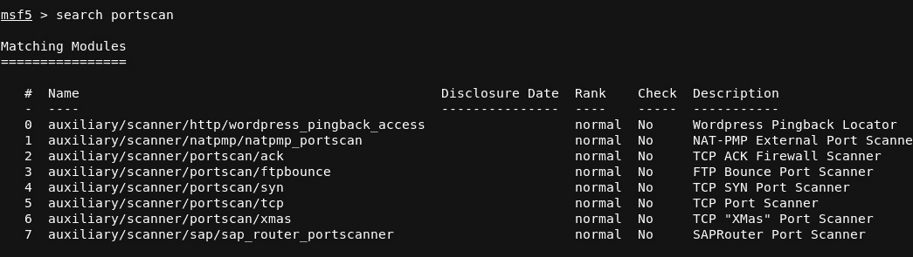
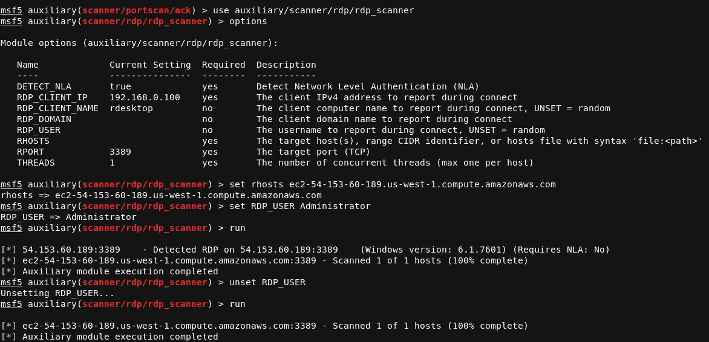
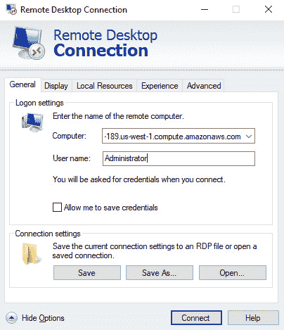
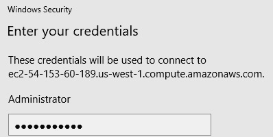

# 三、探索渗透测试和 AWS

欢迎来到旅程的下一部分。在这里，我们将开始学习前两章所学的知识，并将其应用于进一步了解 pentesting 和 AWS。理解前两章很重要，因为我们将在本书中构建更多的实例，并将使用您在[*第 2*](02.html#_idTextAnchor056)**【pentesting and Ethical Hacking】*中阅读的 pentesting 方法。*

在本章中，我们将重点介绍扫描和枚举来自我们构建的主机以及其他通用系统的信息意味着什么。扫描和枚举是 pentesting 中最重要的步骤之一，因此我们沿着侦察车道走一段路，了解枚举的各种方法并了解枚举策略是至关重要的。我们还将学习各种攻击路径，包括情绪测试和对抗性评估以及心态。必须了解，侦察和枚举在创建攻击路径方面扮演着巨大的角色，这些攻击路径可能导致客户机受损，并暴露以前管理员可能忽略的威胁。

在本章中，我们将了解以下内容：

*   侦察
*   枚举和 AWS 服务
*   扫描和检查目标
*   创建攻击路径
*   SSH 密钥
*   扫描并连接到 AWS
*   从经验中学习

# 技术要求

要遵循本章中的说明，您需要以下内容：

*   Metasploit:[https://github.com/rapid7/metasploit-framework/blob/master//modules/post/multi/gather/aws_ec2_instance_metadata.rb](https://github.com/rapid7/metasploit-framework/blob/master//modules/post/multi/gather/aws_ec2_instance_metadata.rb)
*   羔羊守卫：[https://github.com/Skyscanner/LambdaGuard](https://github.com/Skyscanner/LambdaGuard)

查看以下视频以查看代码的运行：[https://bit.ly/3eicsXx](https://bit.ly/3eicsXx)

# 探测侦察

**侦察**又称通常被称为**侦察**，包括使用工具收集有关目标的信息，这些信息可用于获得对目标的优势。侦察可以让你表现得像詹姆斯·邦德一样，可以收集目标的情报。正如[*第 2 章*](02.html#_idTextAnchor056)*【Pentesting and Ethical Hacking】*中所述，在白盒测试中，测试人员将了解目标的所有信息。最好使用工具搜索客户可能忘记告诉您的信息，或者让我们查看客户可能认为没有“影响力”的开源信息。不同的组织将决定什么是影响力，什么不是影响力——这不是“一刀切”的交易类型。让我们讨论一种适用于大多数组织的简单的侦察方法。

## 侦察驾驶枚举

在执行成功侦察时，您必须确保发现尽可能多的信息。这意味着你需要寻找对你的客户有影响的东西，并继续搜索，直到你有足够的信息继续前进。结果因 pentest 而异，因此您必须对“足够”的信息量做出最佳判断。以下是进行一些基本侦察和信息收集的基本方法：

*   在目标网站上查找信息。查找电子邮件地址、电话号码以及任何可用于直接联系客户的信息。
*   使用其他工具自动化发现信息的过程，如 DNS、开放 S3 存储桶、员工姓名、电话号码、电子邮件地址、街道地址等！
*   使用你选择的工具记下你的笔记，这样你可以在以后的测试中使用它们。

遵循这些步骤将允许您对客户端或目标执行正确的侦察，并帮助您创建更好的攻击路径，从而导致整个系统受损。现在我们已经讨论了这些步骤，让我们来看看一些可以用于侦察的工具。

重要提示

在 pentest 约定期间，您将发现各种服务器的记录。虽然这与本书无关，但了解不同的记录类型是件好事。在此处查看更多信息：[https://docs.aws.amazon.com/Route53/latest/DeveloperGuide/ResourceRecordTypes.html](https://docs.aws.amazon.com/Route53/latest/DeveloperGuide/ResourceRecordTypes.html) 。

## 获取电子邮件地址

在五旬考试期间，收集电子邮件地址可能非常重要。通过收集电子邮件地址，您可以了解谁为目标公司工作，以及如何直接联系到他们。攻击者使用此方法对组织进行钓鱼，并试图诱骗用户登录假网站或单击某种类型的恶意软件。对于 pentesting，我们使用它来全面了解公开的内容，以便我们可以与客户讨论，除非目标明确要求进行网络钓鱼。

我们将使用名为**收割机**的工具来执行此操作。收割机允许我们通过查询特定数据库来收集目标上的各种信息。在我们的案例中，我们将以 Packt Publishing 公司为目标，看看我们能找到什么。

要开始，请执行以下步骤：

1.  打开您的 Kali Linux 机器。
2.  打开机器中的端子。
3.  Type the following command:

    **$theHarvester-d packtpub.com-l 100-b linkedin**

    运行**theHarvester**命令后，您将看到从 LinkedIn 检索到的姓名列表，这些姓名基于与 Packt Publishing 合作或为 Packt Publishing 工作的个人。攻击者可以使用此列表收集更多信息，例如电子邮件、电话号码，甚至物理地址：

    

    图 3.1–收割机的输出

    正如你所看到的，我们没有找到任何电子邮件，但我们确实发现了一些员工。现在我们知道了员工的姓名，让我们看看我们可以使用两个流行的搜索引擎查询什么。

4.  We will use Google and Yahoo to query information:

    **$theHarvester-d packtpub.com-l 100-b 雅虎、谷歌**

    与前一次尝试一样，我们使用 Harvester 帮助我们找到随时可用的信息，我们或攻击者可以使用这些信息来帮助绘制攻击路径。在这种情况下，我们使用该工具查找任何可能用于映射潜在攻击的域和 IP 地址：

图 3.2–谷歌和雅虎的 Harvester 输出

正如你所看到的，我们找到了一个电子邮件地址，我们可以用来联系，还有一些主机，我们可以稍后锁定。所有这些信息都将在以后的五旬考试期间或五旬考试之后的报告期间被证明是有益的。向客户提供有关信息（如从 Harvester 收集的数据）的建议可以显示组织外部的情况。

现在我们已经收集了诸如姓名、电子邮件和主机之类的信息，让我们来看看我们可以用来发现 DNS 通知的工具。

## WHOIS 命令

DNS 名称在这些域名注册后分配给 IP 地址。例如，**foo.com**可以使用**a 类**IP 地址集。**WHOIS**命令用于从公共或内部备用设备中发现此信息。使用该命令可显示有关域名、这些域的注册用户、ISP 联系人以及其他有用的技术信息，攻击者可利用这些信息创建指向其目标的深入攻击路径。

让我们来看看如何使用 WHOIS 来拉扯一些关于组织的信息。在本例中，我们将以 Packt Publishing 为目标，看看我们可以发现关于它们的哪些信息。以下步骤将说明如何正确执行此操作：

1.  启动您的 Kali Linux 机器。
2.  打开一个终端。
3.  Type the following command:

    **$whois packtpub.com**

    让命令运行一段时间后，您应该会看到结果中出现了关于 domain 的信息：

图 3.3–从 WHOIS 检索的 DNS 信息

WHOIS 将允许 pentesters 收集有关客户端域的信息，这些信息可用于创建攻击路径，攻击路径可针对特定主机，如 web 服务器甚至域控制器。此外，您可以通过 WHOIS 命令或 Netcraft 命令收集 AWS 信息，例如正在使用的 AWS 区域，我们将在下面讨论。

## 网游

**Netcraft**是一个很好的资源，在试图查找有关特定目标的任何公共信息时可以使用。该工具允许人员通过搜索单个主机来查找多个域。来自查询结果的一些信息可以是：

*   IP 地址
*   域名解析服务器
*   反向域名解析
*   Netblock 所有者
*   DNS 管理员
*   域注册表
*   AWS 地区

我建议在测试组织时始终运行 Netcraft。这是一个伟大的工具，它有一个图形用户界面，可以为您生成报告，不像 WHOIS。此外，在进行黑盒测试时，它可以向您显示链接到目标域的 AWS 信息，还可以向您显示客户公司可能忽略的信息。

在这里查看更多关于 Netcraft 的信息：[https://www.netcraft.com](https://www.netcraft.com) 。

现在我们已经讨论了一些快速有效的方法，我们可以找到有关我们目标的信息，让我们开始更多地了解如何开始对 AWS 服务执行侦察。

# 列举和理解 AWS 服务

枚举是收集信息的过程，在侦察目标的过程中，这些信息为您提供有关目标的有价值的特征。枚举包括执行侦察和扫描目标。这意味着获取有关服务、域名、端口等的信息。当我们通过收集开源信息来执行枚举时，让我们快速查看一下我们在 AWS PTENST 中可能遇到或遇到的一些 AutoT1 AWS 服务。讨论这些服务可以让我们在开始解释目标之前了解更多。

重要提示

有关枚举的更多信息，请查看渗透测试标准：[http://www.pentest-standard.org/](http://www.pentest-standard.org/) 。

## S3 bucket 和使用 web 应用发现打开的 bucket

S3 桶是 AWS 提供的一个很好的资源。S3 存储桶充当“容器”，允许用户在其中存储对象或数据，只要用户具有访问数据的适当权限，就可以随时检索这些对象或数据。虽然在本章中我们不会深入讨论 S3，但很高兴知道，在 S3 资源上进行侦察是测试 AWS 的一个重要部分。在[*第 4 章*](04.html#_idTextAnchor171)*中，我们将深入探讨 S3，利用 S3 桶*。但是，让我们看看我们如何公开查询缺少安全控制的 S3 桶。

开放 S3 存储桶是 AWS 环境中发现的较大问题之一。这些类型的漏洞在过去给组织造成了压力和负面影响，一些公司甚至在新闻中妥协了——所有这些都是由于开放的 S3 存储桶造成的。我们可以使用名为**灰帽战**的工具进行快速搜索，从而帮助我们的目标避免这种情况。

Grayhat War 是一个 web 应用程序工具，允许我们通过 web 应用程序查询打开的 S3 存储桶。这使得枚举和重新确认变得相当简单和容易，因为所有内容都安排在一个简单但高效的图形用户界面中。

重要提示

灰帽战可以在以下链接找到：[https://buckets.grayhatwarfare.com/](https://buckets.grayhatwarfare.com/) 。

下面的屏幕截图显示了我们在[packtpub.com](http://packtpub.com)上查询任何打开桶的基本示例。正如您所看到的，只有两个文件打开到 internet。仅通过 web 浏览器查看文件，您就可以知道这些文件是图像文件，这使我们能够假设没有影响的数据处于打开状态：

图 3.4–使用 Grayhat Ware 发现打开的 S3 存储桶

现在，我们对使用 S3 存储桶收集信息有了更多的了解，让我们简单地看一下并讨论一下我们将在本书中看到的一些其他服务。

## 兰姆达

Lambda 是一种无服务器计算服务，允许用户运行代码以响应查询和/或触发事件。在 Lambda 内部运行的代码称为**Lambda 函数**。当执行 Lambda 函数时，它会执行您希望它执行的任何操作。Lambda 非常适合用于对 AWS 中运行的应用程序执行代码。

重要提示

要了解更多关于 Lambda 的信息，请查看此处：[https://docs.aws.amazon.com/lambda/latest/dg/welcome.html](https://docs.aws.amazon.com/lambda/latest/dg/welcome.html)

在本书后面的[*第 7 章*](07.html#_idTextAnchor309)*【评估和五旬斋】中，我们将更深入地了解 Lambda。现在，请理解 Lambda 是一种计算服务，它允许您运行代码而无需配置或管理服务器。在参考章节中，我们将执行更多的实践技巧。*

现在让我们继续前进，开始讨论 EC2 实例。

## EC2 实例

EC2 实例充当要“托管”的特定操作系统的主机。将 EC2 实例视为属于其他人的实际设备，并允许您“远程”使用该硬件存储和使用操作系统，然后是您自己的应用程序。然后，该实例可用于托管应用程序和其他服务，公司可使用这些应用程序和服务执行业务实践。

这使公司和其他组织能够灵活地扩展和扩展其业务，而无需购买物理资源。正如我们已经看到的，在本书中，我们将不断遇到使用 EC2 实例的情况。

侦察和枚举是执行渗透测试时首先要做的事情。必须执行成功的枚举，以帮助您更好地了解目标，并能够找出您找到的服务。现在我们已经了解了这些主题，让我们继续了解如何使用扫描技术枚举信息！

# 扫描检查侦察目标

扫描是 AWS 测试的重要部分之一。扫描允许您查看实例及其环境的总体姿态。这样做将使您能够查看攻击者可以轻松利用的开放端口、漏洞和服务版本。随着本书的阅读，我们将开始使用越来越多的扫描技术，并执行它们来枚举和利用服务。

在真正的 pentesting 场景中，您通常会有一个需要扫描的资产列表——除非这是一个黑盒评估，在这种情况下，您将不知道有关网络的任何信息。然后，获取资产列表，并使用各种工具对其进行扫描。如果您使用 Nmap 之类的工具，您的主要任务将是发现开放的端口和服务。端口允许我们通过不同的途径进入系统，如果服务易受攻击且过时，在端口上运行的服务有时可以让我们轻松进入。

重要提示

要快速回顾不同类型的 pentesting，例如白盒测试和黑盒测试，请重温[*第 2 章*](02.html#_idTextAnchor056)*、pentesting 和道德黑客行为*。

另一方面，您可能需要对活动主机运行漏洞扫描，以获取有关每个资产的所有漏洞信息。漏洞扫描是一种让公司全面了解其安全状况的好方法，因为它们提供了系统中每台主机上存在的每一个漏洞。需要注意的是，pentesters 通常需要向系统主机提供凭据，以允许扫描仪对主机进行身份验证和扫描。给白帽颁发证书会使参与变得不那么全面，因为测试人员已经有了用户名和密码，而无需进行测试。

让我们向前看，看看我们可能用于扫描的一些工具。请注意，下一节将不会用作利用练习，但将讨论用于扫描和收集信息的某些工具。在本书余下的部分中，我们将使用各种工具和技术来进行利用。然而，我们需要先学会走路，然后才能跑步，这在本书中我们会看到很多。

重要提示

在应用知识之前，理解工具的理论总是很重要的。

## 变质岩

尽管 Metasploit 以其漏洞利用模块和自动漏洞利用而闻名，但它还是一个非常棒的工具，可以进行扫描。在其库中，它承载着所谓的“辅助模块”。这些模块作为工具，允许扫描和验证漏洞。您还可以像使用 Nmap 一样使用 Metasploit 来扫描端口—稍后会有更多介绍—并探测打开的 TCP 和 UDP 端口。

当然，寻找开放端口和漏洞是很好的，但在测试时正确的枚举仍然是关键。Metasploit 有助于减轻这一过程，允许您搜索服务版本和默认凭据，并可以发现您通常无法找到的打开的 web 目录。在这本书中，我们将花费相当多的时间在 Metasploit 上，所以不要担心！将 Metasploit 添加到您的兵工厂时，可能性是无穷的。另一个具有无限可能性的扫描工具是 Nmap。

## Nmap

我们在[*第二章*](02.html#_idTextAnchor056)*中提到了 Nmap，Pentesting and Ethical Hacking*，但是，应该再次提到的是，Nmap 是添加到扫描工具集中的一项巨大资产。Nmap 提供了许多脚本，允许您枚举在扫描目标上不同端口上运行的软件版本。通过查找服务的版本，您可以攻击可能已过时且具有公共漏洞的服务。

让我们使用 Nmap 在[packtpub.com](http://packtpub.com)上进行扫描，看看我们可以发现哪些信息。以下步骤说明了我们如何做到这一点：

要主动扫描目标，请执行以下操作：

1.  在 Kali Linux 中打开终端。
2.  Type the following command:

    **$nmap-A packtpub.com-Pn**

    **nmap**扫描的输出应该向我们显示我们可以通过命令检索的所有内容。使用**-A**参数，我们可以针对目标运行所有脚本和服务扫描，以获取尽可能多的信息：

图 3.5–使用 Grayhat Ware 发现打开的 S3 存储桶

请注意，我们是如何获得更多信息的，例如 IP 和地址跳数。这让我们可以使用 k 现在找到主机的路径。

提示

SPARTA 是一个基于 Python 的工具，它为您提供了一个图形用户界面，可以与您的目标进行交互。虽然在本书中我们不会使用斯巴达，但根据您的需要，您可能会发现它很有用。SPARTA 只需点击一个按钮，即可组合各种扫描和检查。您还可以将 Nmap 扫描导入 SPARTA，使攻击路径和自动化的可能性无限。要了解有关斯巴达的更多信息，请查看此处的链接以了解该工具的更多用途：[https://tools.kali.org/information-gathering/sparta](https://tools.kali.org/information-gathering/sparta) 。

现在，让我们进一步讨论 AWS 服务工具、提示和技巧。

## 羔羊守卫

Lambda 是一个计算服务，在这里可以执行代码，这意味着代码只在应该执行的时候执行——为消费者节省资源和金钱。然而，这并不是说它没有问题——特别是因为它是驱动 Lambda 环境的人工创建的代码。LambdaGuard 是一个工具，它提供了审核 Lambda 服务和扫描任何可能成为攻击向量的潜在问题的可视化信息。它可能发现的其他一些问题如下：

*   公共 S3 存储桶是公开的，任何人都可以在互联网上找到。这意味着您可以查询公共 bucket 并查找可能敏感或不敏感的信息。个人信息、信用卡号码或健康记录等敏感信息可能是公共信息中的潜在问题。
*   公共 API 网关充当了通向互联网的大门，然而，这并不意味着每个人都应该访问它们。AWS API 网关用于内部资源，如果 API 不安全，如果将其公开，任何人都可以访问网络。但是，要知道，创建公共 API 也是为了允许环境中的授权人员。
*   配置不当的策略会造成安全问题，这些问题可能会演变成影响深远的情况。例如，策略可能允许某人绕过安全限制并获得对资源（如 S3 存储桶）的访问。

要安装该工具，请使用以下步骤：

1.  Use Git to pull the code from its repo:

    **$git 克隆 https://github.com/Skyscanner/lambdaguard**

2.  Then change into the directory:

    **$cd lambdaguard**

3.  Once you go into the LambdaGuard working directory, move forward with installing the application by running the following command:

    **$sudo 制作安装**

现在应该设置为使用该工具。除了这本书之外，我强烈推荐使用它并熟悉它。

## S3 扫描

近年来，错误配置的 S3 桶已经成为一个相当大的问题，并且是测试 AWS 时最容易发现的问题之一。S3 存储桶具有“内置”安全性，但安全权限随后会在单独配置之后进行编辑。

我们将在[*第 4 章*](04.html#_idTextAnchor171)*中讨论大量关于 S3 的信息，利用 S3 桶*；明智的做法是，在道德黑客 S3 方面，扫描是侦察和信息收集的基本功能。

在本例中，我们将重点介绍扫描企业的 S3 存储桶通常需要做些什么。S3 存储桶充当一个“容器”，存储诸如归档、PDF 语句和其他冗余信息等信息。扫描 S3 存储桶对于确保不存在错误配置至关重要。如果是这样，他们可能会泄露信息——比如上述信息——而这些信息可能会落入坏人之手。

继续了解 AWS 及其服务的相关信息，让我们开始讨论一些不同类型的攻击者以及基于这些类型的攻击者模拟的潜在攻击路径。

# 认识袭击者

假设您正在执行 pentesting 任务，您的客户要求您测试他们的系统。我们有几种方法可以做到这一点。我们可以从局外人的角度来做，也可以从局内人的角度来做。两者都根据客户的业务需求为客户提供不同的结果回报和投资回报。让我们来看看什么是一个确切的 T1 内部人员 T2 和一个外部 T3。

### 内部人士

从内部人士的角度来看，更常见的请求将是。内部人员被视为员工或有权访问客户系统的人员。这意味着您（测试人员）将获得连接到 AWS 环境所需的信息。您将获得访问云环境的帐户 ID 和凭据，并且可以从中运行脚本以查找 S3 中的问题。

通常情况下，白盒 pentesting 会与内部人士的观点相结合。这意味着客户需要 pentesting 公司检查系统中的任何东西。这意味着 pentest 的范围将列出访问这些系统所需的所有系统和凭证，允许测试人员发现任何易受攻击和可利用的内容。

现在，有不同类型的内部人员，您可能必须模仿他们，以满足客户的特定需求或目标，以满足他们所要求的测试。了解可能对组织构成威胁的各种类型的恶意内部人员非常重要。以下是一些您应该注意的事项：

*   **情绪攻击者**：这些人让自己的情绪肆虐，并恶意恶化。通常，这些攻击者都是以前和现在不满的员工。他们不满的原因各不相同，但任务通常都是一样的：为了利润或竞争公司而过滤数据。最好在进行 pentesting 时查看业务和人员流程，以确保像他们这样的内部人员不会做出可能伤害公司的恶意或有意更改。
*   **Unintentional and Inadvertent**: This type of insider is not so much an attacker as they are unaware of their own actions. For example, a database administrator may have accidentally dropped a table with important client information in it. Unaware to them, they may have just not fully understood what they did, and just lack training.

    事故和威胁事件之间的区别在于个人是否坚持。如果他们坚持下去，那可能不是因为缺乏知识，也可能是其他原因。确保员工接受培训并定期跟进，将有助于减少此类事件恶化的可能性。此外，必须密切关注它们，因为它们最容易受到攻击者的攻击。虽然我们不一定要模仿这种类型的内幕人士，但这是很好的知识。

*   **顽固的内幕人士**：最危险的威胁之一就是顽固的威胁。这意味着这个人将不惜一切代价获得他们想要的信息或结果。他们的推理可能因情况而异，但他们对剥削或利润的渴望使他们顽固而坚定。

### 局外人

外部人员被视为不直接与公司合作的任何人，包括承包商和特权较低的人员，如访客或第三方供应商。有时，有些人可以被视为**近在咫尺**——但在本书中，我们将坚持称他们为局外人，以保持简单。

局外人是指必须有权访问系统的人，不应该对目标系统有任何了解。这里要记住的关键词是“授权”一词，因为可能有一个不幸的时刻，局外人可能拥有未经授权的访问权限——这仍然被视为访问权限。

局外人的描述各不相同，可以是任何使用他人代码试图利用 web 服务器的脚本小子，也可以是国家发起的威胁——通常是**高级持续性威胁**（**APT**）–这将不择手段地抓住一个系统，并拥有客户提供的权力和资金。在许多情况下，APT 客户或资金直接来自其政府。

现在我们已经了解了各种攻击者，让我们继续讨论攻击路径，以及这些攻击者如何使用场景执行攻击。

# 创建攻击路径

攻击路径涉及使用从目标收集的信息来制作一个“故事”或“场景”，说明您或实际威胁如何利用该信息攻击目标系统或应用程序。网络上有一些框架，可以让你从以前的实际事件中了解攻击路径。

提示

虽然这本书有点偏离正轨，但我强烈建议您查看 MITRE ATT&CK 框架，以获取更多信息：[https://attack.mitre.org/](https://attack.mitre.org/) 。

针对不同的攻击场景，有不同的测试方法。有些场景需要整体的方法，有些场景更注重目标。在开始扫描和尝试连接到任何 AWS 设备之前，或者在测试之前，了解您需要了解的信息非常重要！一些客户端可能有一种更自然的方法，而另一些客户端则有一个他们希望您攻击并试图利用的直接目标。

## 有机攻击路径

有机攻击路径包括以自然方式利用系统。这意味着你——测试者——没有被赋予特定的目标，应该以**道德**可能的方式接近系统。我们强调“道德”一词，因为确保客户和您自己的安全至关重要。

有机攻击路径可能如下所示：

1.  测试仪给出**接战规则**（**ROE**）和系统架构概述。
2.  测试人员发送一封网络钓鱼电子邮件。
3.  一个具有高度特权的用户点击一封网络钓鱼电子邮件，允许测试人员获取域的管理员凭据。
4.  测试仪能够在机器之间转动。
5.  在网络上进行横向移动后，测试人员能够获得**域管理**。一旦建立为域管理员，测试人员就能够在目标环境中执行任何操作。

在**域控制器**上获得域管理员通常是 pentesting 的主要目标。本质上，如果用户拥有网络的域管理员，他们就拥有网络——这里的术语“拥有”意味着他们完全控制网络。

有时候，获得域管理员不是 pentesting 的目标。不同的约定将有不同的范围，不同的范围可能导致不同的目标。这些类型的约定被称为“基于目标的”约定。

## 基于目标的攻击路径

基于目标的攻击路径包括为客户组织利用特定目标，同时保持在范围内。基于目标的评估的目的可能是测试正在投入生产或可用于复制特定**高级持续威胁**（**APT**的攻击方法的系统。

客户可能希望以特定对手可能攻击他们的方式对系统进行测试。这在国防工业中很常见，用于测试系统的防御能力。客户可能希望确保他们是最新的，能够检测并响应 ond–以防万一。

## AWS 攻击路径

AWS 攻击在 pentesting 中还不是那么传统。主要由于 AWS 较新的实现，并非所有的测试和对抗性仿真都能赶上 AWS。然而，这并不意味着我们仍然可以使用我们的传统思维来创建无法应用于 AWS 的攻击路径。下面展示了一种攻击 AWS 实例的方法，可以将其作为一种测试或练习。

对于 AWS，攻击路径通常如下所示：

1.  测试人员扫描互联网以查找公共 S3 存储桶。
2.  测试仪扫描常见的 bucket 名称并找到匹配项。
3.  测试仪扫描铲斗中的物体。
4.  测试人员查找匹配项并过滤信息。

请注意，您可能会获得访问 AWS 环境的凭据，这将允许您作为内部人员访问系统。如果提供了访问系统的凭据，那么谨慎的做法是查找员工在创建 S3 存储桶后可能实施的错误配置。关注这个潜在的问题很重要，因为它可能会导致更多的负面影响，比如信息泄露，或者允许未经授权的用户查看他们不应该查看的 inf 信息。

## 测试攻击路径

在现实世界的 pentest 场景中，你的攻击路径在不同的交战中会有所不同，交战本身就是 pentest，每个方面都是 pentest。谨慎的做法是，在进行 pentest 之前，先在客户网站上做功课，以确保收集到足够的信息，以便为目标组织执行有效的 pentest。要开始收集信息，可以使用谷歌搜索目标的各种属性。也许你可以找到目标的电子邮件和电话号码，甚至可以找到存储重要信息的公共 S3 存储桶。

## 企业红队

“红队”与其说是一种攻击途径，不如说是对业务流程和策略的质量保证检查。根据客户可能需要或想要的内容，红队可能涉及到不同的 pentesting 区域以及混合攻击路径。由于其灵活性和强度，红队测试业务的各个方面。然而，重要的是要了解客户在测试之前需要有成熟的商业模式。

通常，在评估一家红色团队参与的公司之前，客户会从漏洞评估或基本 pentest 中获益更多。公司需要有一个成熟且稳健的商业模式和安全计划，以充分发挥其潜力，否则，红队演习将无法充分揭示公司内部的所有问题。

## 潜入攻击者的心态

这个话题有点忌讳，但在这本书中会被反复提及。黑客一直是禁忌，因为它被用于盗窃数据和攻击政府等犯罪活动。然而，近年来，它已经变得更加主流，现在被用来测试公司，让他们真正了解自己的安全态势。

理解攻击者的心态至关重要，因为这是区分好结果和好结果的关键。了解系统及其工作方式，并向客户提供关于如何修复和补救漏洞的详细报告，才能获得良好的效果。具有攻击者思维的白帽黑客能够洞察恶意黑客如何通过任何必要的手段侵入系统。

我们现在讨论了许多不同的话题。我们从讨论侦察和如何收集信息开始，然后讨论了不同的攻击者类型，以帮助说明信息对公司的影响。现在，让我们来看看一些实践练习并应用这些信息。然而，first，让我们提到一些重要的东西——SSH 密钥。

# 发现 SSH 密钥

**SSH**或**secure shell**是各种系统管理员在其基础设施中实现的通用登录服务。快速、安全的系统使该服务成为安全目的的理想选择，同时由于其类似密钥的基础设施，该服务也具有“可行性”。这些密钥使身份验证无缝，就像我们在[*第一章*](01.html#_idTextAnchor025)*【构建您的 AWS 环境*中使用我们从 AWS 实例下载的密钥所做的那样。可以说，这些钥匙给了我们“王国的钥匙”，并允许我们访问 AWS 实例。

## 钥匙是如何工作的

必须使用私钥和公钥才能使用该服务。创建密钥对时，将生成私钥并将其存储在系统上。在这种情况下，密钥存储在我们的 EC2 实例中。私钥是永远不应该与任何人共享的密钥。近年来，私人风险敞口及其对公司造成的损害已为人们所了解。

图 3.6–公钥和私钥说明

私钥只是身份验证关系的第一部分。需要生成一个公钥，允许用户向系统进行身份验证。公钥由用户（在本例中为 us）持有，并确保从客户端和服务器来回加密通信。如果公钥与服务器上的授权密钥列表不匹配，则身份验证将失败，用户将无法登录服务器。您可以在 Linux 实例上找到存储在**~/.ssh**中的这些密钥。

## 卫生好

一个好的做法是永远不要将私钥存储在不安全的地方，例如打开的 web 目录。开放共享是一个可以通过匿名 FTP 访问的目录文件。将私钥丢失给服务器可能会产生难以克服的严重后果。始终记住**绝不**共享私钥，并将其存储在具有访问控制的地方，以防止未经授权的用户访问这些密钥。

现在我们了解了这些 SSH 密钥的用途，让我们好好利用这个 knowledge 并连接到我们的 EC2 实例！

# 扫描并连接到 AWS

现在我们将成为 AWS 内部的扫描系统。这在测试中起着重要作用，因为正如我们所提到的，扫描和计数是测试 AWS 和一般测试项目的第一个技术部分。开始测试 AWS 环境时，了解从何处开始非常重要。假设所有先决条件都已满足，并且一切正常，继续扫描和连接实例应该是测试 AWS 的下一个逻辑组件。

开始之前，请确保您的 Windows 主机已启动并正在运行。登录 AWS 管理控制台，查看[*第 1 章*](01.html#_idTextAnchor025)*【建设您的 AWS 环境】*，如果您需要复习，请返回此处。

一旦你准备好了，我们将移动 forward 并开始使用 Nmap 扫描我们的 AWS 环境。

## Nmap 扫描

现在让我们将 Nmap 付诸行动，并使用它检查 Windows 2008 server 并查看我们在系统上启用的开放 RDP 端口：

1.  首先，我们将通过使用 Nmap 扫描主机来查看它。这将允许我们检查并查看**远程桌面协议**（**RDP**是否打开。RDP 将允许我们从自己的机器远程连接到主机。
2.  To scan the host, use your Kali Linux host that we set up earlier on, back in [*Chapter 1*](01.html#_idTextAnchor025)*, Building Your AWS Environment*. Once your host is up and running, open a Terminal and fire off the following command:

    **$nmap-P3389-Pn<AWS 主机>**

让我们快速分析一下这个简单但有效的命令。使用以下开关：

*   **-p**: Indicates what ports we want to probe for, with probe meaning send a request in an attempt to get a response back from the host. In this case, we are checking for port **3389**, which is the port that correlates with RDP. If we wanted to scan for more ports, we could add them by separating the ports with a comma. We can also scan a range, such as using the following command to scan for the first 100 ports:

    **$nmap-P0-100<主机名>**

    我们希望确保添加到端口**0**，因为这通常是一个被忽略的端口，但有时可以提供进入系统的方法。

*   **-Pn**：此开关从**nmap**扫描中禁用**ping**。**ping**通常会导致不必要的噪音，如果主机没有响应**ping**，有时在扫描的主机上不会给您提供良好的输出。需要注意的是，如果主机没有响应**ping**，那么这并不意味着主机没有活动，因为主机通常不响应**ping**。特别是在 AWS 环境中，请确保您习惯于使用带有**nmap**扫描的**-Pn**开关。

扫描完成后，您将收到反馈，提醒您 RDP 已打开，并收到如下输出：

图 3.7–RDP 扫描

如您所见，我们的实例显示主机实际上正在运行，并且具有端口**3389**，远程桌面处于打开状态，并允许我们连接到它。在我们看用 RDP 打开连接到主机之前，让我们来看看如何使用 Meta ASTIFIT 来扫描 RDP。我们想尝试这种方法的原因是，针对主机测试各种工具是一种很好的做法。最终，这将提供 you 选项，以防您需要使用特定工具。

## 启动金属喷溅

您可以使用 Metasploit 进行扫描，在这种情况下，由于我们只关注 RDP，所以我们只需要在 Metasploit 中使用端口扫描模块来探测打开的端口。正如我们提到的，能够在一个场景中使用不同的工具来执行是一个很好的实践，以防一个工具不起作用，并且您没有时间进行故障排除。以下步骤将讨论使用 Metasploit 扫描主机所需的步骤。

确保 Metasploit 已启动：

$msfdb 运行

现在，您应该有一个终端，为您提供 Metasploit 的主要背景：

图 3.8–Metasploit 控制台

如果这是一个真正的参与，比如客户的 pentest，那么下一步就是连接到资源并开始评估 AWS 资源。获取您将在订婚期间与之互动的主机的凭据非常重要。在这种情况下，我们已经有了所需的信息，可以从我们设置的 Windows 计算机中获取凭据。

现在我们已经启动了 Metasploit，是时候来看看几个不同的扫描模块了，我们可以用它们来扫描主机上的 RDP。我们将在本地 Kali 实例上使用 Metasploit 进行下一步操作，但是，如果您选择在 AWS 中使用 Kali 图像，请使用 free。

## 使用 Metasploit 进行 TCP 扫描

接下来，我们希望能够扫描我们的 Windows 主机并检查打开的端口。Metasploit 提供了各种模块来执行主机扫描。每个模块为各种服务提供不同的技术和扫描。在启动扫描之前，让我们先来讨论几个模块：

1.  First, type the following into your Metasploit Terminal:

    **$搜索端口扫描**

    如果键入的命令正确，则会出现如下提示：

    

    图 3.9–Portscan Metasploit 模块

    如果您没有得到与前面屏幕截图类似的结果，请更新您的 Metasploit，然后返回本章的这一部分。

2.  Next, we are going to use a TCP scan. A TCP scan is going to execute the full TCP 3-way handshake and make a full connection to the host in order to enumerate the host. This does not mean that our machine is going to authenticate to the host – more on that later. Our host is going to send a **SYN** packet to our AWS instance and wait for a response.

    如果一切顺利，AWS 实例将发回一个**SYN/ACK**数据包，让主机知道他们已经确认了该数据包，并且已经发回了一个**SYN**数据包。然后，我们的主机发送一个**ACK**数据包，让主机知道我们确认了 AWS 实例数据包，并且 TCP 握手已经完成。下图说明了 TCP 三方握手：

    

    图 3.10–TCP 握手

    一旦我们发送了 ACK 数据包并创建了连接，AWS 实例就会向我们提供我们扫描的信息——在本例中，我们正在检查端口**3389**（RDP）。

3.  Moving back to using Metasploit, we are going to be using the TCP portscan module to perform the 3-way handshake and get the information we so desire. With Metasploit started, type in the following to use the TCP port scanner:

    **$使用辅助/扫描仪/端口扫描/tcp**

在我们查看端口**3389**是否打开之前，您需要更改模块中的一些参数。首先，您需要键入**options**命令来查看参数（Metasploit 将它们标记为选项），并设置这些参数以满足您的需要。在这种情况下，我们只需更改以下参数：

*   **RHOSTS**：此选项设置为您要测试的目标，或者在本例中，设置为我们要扫描的目标。将该选项设置为 AWS 实例的公共 DNS 地址。
*   **端口**：此选项可以设置为单个端口，也可以设置为一个范围–非常类似于 Nmap 中的端口设置方式。在这种情况下，我们将使用端口**3389**。

确保您正确设置了这些参数。如果您发现自己在事后诸葛亮自己，您可以键入**选项**命令查看当前选项的设置。之后，您可以键入**运行**或**利用**命令来执行模块：

图 3.11–使用 Metasploit 进行端口扫描

如您所见，我们收到的输出告诉我们主机上的端口**3389**已打开。模块使用以下格式向我们显示：

[+]<ip>-IP:端口-TCP 打开</ip>

好消息–我们已成功使用 Metasploit 扫描了 Windows 主机！现在我们知道 TCP 扫描模块是如何工作的，让我们来看看一个可以用来进行较少侵入性扫描的 D 模块。

## 带 Metasploit 的 ACK 扫描

接下来，我们将使用我喜欢使用的扫描来查看端口是否被过滤。通常，端口将被过滤，以仅允许特定流量进入，或仅允许特定主机使用该端口。这通常会使 Pentester 使用欺骗攻击来尝试并破坏服务，或者只是转移到其他方面。

检查端口是否被过滤的一个好方法是使用 ACK 扫描。这种类型的扫描由主机向目标发送**确认**数据包，目标机器通常向主机发送**重置**数据包。在这种情况下，我们要进行这种类型的扫描，以检查端口**3389**是否未过滤。如果未过滤，那么我们可以尝试在该端口上前进。在我们的实验室环境中，端口将是开放的——但是，如果这是一个真正的 pentest，并且我们被告知一个端口*已*过滤，那么谨慎的做法是查看其他未过滤的端口和服务。

在我们继续之前，请看下图，其中简要概述了 ACK 扫描的工作原理。这张图片非常简单地介绍了扫描的工作原理及其用途：

图 3.12–确认扫描

现在，我们对 ACK 扫描有了大致的了解，让我们使用以下模块来完成这项工作：

$use 辅助/扫描仪/端口扫描/确认

就像之前一样，我们需要为我们的模块设置参数。我们可以通过设置与之前 TCP 扫描相同的参数来实现这一点。与前面一样，设置参数并对 AWS 主机运行扫描：

图 3.13–Metasploit 的 ACK 扫描

如果扫描按计划进行，您将收到主机已成功扫描的反馈，并且端口正在取消筛选。

现在我们已经在主机上使用了 TCP 和 ACK 扫描，让我们看看另一个模块在主机上做一些侦察。对于我们的下一次扫描，我们将使用 Metasploit 中提供的内置 RDP 扫描仪。

## Metasploit RDP 扫描

自从我们开始使用 Metasploit 进行扫描以来，我们在主机上进行了大量的侦察和枚举。在使用 Metasploit 和 Nmap 之间，我们现在了解了有关目标的以下内容：

*   端口**3389**已打开。
*   端口**3389**未过滤。

如果这是一个真正的测试，那么下一步的操作将是查看主机上运行的操作系统。我们可以通过在 Nmap 中使用**-O**开关来实现这一点，但既然我们已经启动并运行了 Metasploit，那么让我们继续使用它：

1.  To begin, use the following module:

    **$辅助/扫描仪/rdp/rdp\U 扫描仪**

    我们将设置与以前相同的参数。唯一的区别是您将在主机上将**RDP_USER**参数设置为用户名。此参数允许我们使用已知用户名（必须在目标上处于活动状态）扫描机器，并检查端口和可能的操作系统。我们已经知道，我们的 Windows 主机用户名是**管理员**，然而，在真正的 pentest 中，通常尝试的不仅仅是默认用户名。

2.  Once you set the parameters, start the scan by using the **run** command and view the output. If all goes well, output showing you that port **3389** is open and that the instance is operating on Windows should be displayed:

    

    图 3.14–使用 Metasploit 进行 RDP 扫描

3.  如果您想要查看结果的差异，请使用和**UNSET**命令删除您在选项中输入的值。**UNSET**命令的作用与它所说的完全相同–它将取消您刚才放置的参数！

现在我们已经成功地完成了一些枚举并扫描了主机。请随意查看其他模块以扫描主机，并了解如何使用 Metasploit 扫描主机。

让我们继续前进，真正连接到我们的 Windows 主机。首先，我们将使用我们的 Kali Linux 映像–请随意使用您的本地或 AWS Kali 机器。之后，我们将使用远程桌面客户端测试我们与 AWS 主机的连接。

## 与卡利连接

既然我们肯定知道**RDP**已打开，我们可以使用我们从解密 Windows AWS 密钥中获得的用户名和密码连接到它。如果需要，请返回并查看如何检索 Windows 密码，然后返回此处：

1.  To start, you're going to need to use a tool called **rdesktop**. rdesktop is an application that comes preinstalled with all Kali instances and is used to establish remote connections between hosts. In this case, we are going to use it to connect to our AWS. The next command will allow you to connect to the host:

    **$rdesktop<AWS 主机名>-u 管理员**

    此命令运行程序并使用用户名**Administrator**连接到我们的 AWS 主机。有一个参数允许在终端中输入密码，但它以纯文本显示。最好的做法是（稍后将详细介绍）不以纯文本形式显示密码：

    

    图 3.15–通过 rdesktop 通过 RDP 连接

2.  由于 password 参数允许以纯文本形式查看密码，因此当显示登录屏幕时，您将输入密码。输入 AWS 密钥分配给您的密码：

图 3.16–Windows Server 的登录屏幕

成功登录后，您可以像对普通 Windows 主机一样进行更改。

如果您连接正确，您将看到一个桌面，该桌面如下所示：

图 3.17–Windows 桌面

请随意在周围看一看并感受一下。这可能需要一点时间来适应。

## 与窗户连接

现在我们已经在 Kali 机器上使用了 rdesktop，现在是时候转向更流行的，或者至少是更传统的通过 RDP 连接的方法了。如果您没有基于 Windows 的主机，请不要烦恼；您还可以下载其他操作系统的远程桌面：

1.  要启动，打开**启动**菜单，输入**远程桌面**，然后点击*进入*。它会自动启动已安装的 RDP 应用程序。如果没有，则需要对问题进行故障排除，然后返回完成本章的这一部分。
2.  Just as before, we will put in the public DNS name to our AWS instance, as well as the username **Administrator** to start the connection:

    

    图 3.18–Windows 上的远程桌面应用程序

3.  点击**连接**按钮后，系统将提示您输入 Windows 主机的凭据。继续，将密码复制并粘贴到**密码**字段中，并记住连接，这样您就不必在每次登录 AWS 实例时一直输入密码：

图 3.19–远程桌面的登录提示

一旦你连接，你应该有一个桌面，占据你的整个桌面。此新桌面是 AWS Windows 实例的桌面。

恭喜！您已成功扫描并连接到 AWS 实例！在本章中，我们学到了很多东西，现在应该能够熟练地使用一些 pentesting 工具，并使用各种操作系统启动我们自己的 EC2 实例。现在我们已经完成了 pentesting 和 AWS 的基础知识，让我们在本书中谈谈 les 的儿子们学到了什么，以及他们是如何应用于前进的。

# 从经验中学习

你在五旬期考试中学到的课程是你作为五旬期考试者所能获得的最有价值的资源之一。无论你是以它为职业，还是把它作为业余爱好，所学到的经验包括运用你从专业和个人经验中获得的知识，并将其应用到你未来的工作中。

用后见之明来审视自己的努力，可以让你看到自己的错误，并将这些错误视为一次学习经历，而不是一次惨痛的失败。这是关于向前失败，而不是向后失败，这将确保你在五旬斋知识方面的成长。通常，这就是在 pentesting 社区中造就或摧毁专业人士和业余爱好者的原因。

对于这本书，重要的是要理解所学到的经验教训，这可能需要你不止一次地复习材料，或者你可能需要回去尝试以不同的方式做一些事情，因为它似乎更适合你，或者，您可能意识到一直在 Metasploit 中输入错误的参数，现在知道在将来设置参数之前需要对自己进行监控。在这本书中所学到的经验将帮助你在材料中成长。

在现实生活中，为客户提供高**投资回报**（**ROI**）通常是确保你将自己打造成一个五星级酒店并保持专业五星级酒店关系的关键。因此，不断地评估自己，让你和你的客户从 pentesting 中获得最大的收益，这是非常重要的。我们将在本书后面讨论更多这方面的内容，但我们仍然可以理解，在五旬考试方面，经验教训和投资回报率之间有一点相互关联和因果关系。

# 总结

在本书中，您现在已经掌握了前进所需的知识。本章概述了五测试技术，以及不同类型的五测试及其执行方式。重要的是要简要了解如何以不同的方式使用 pentesting，例如红队或目标导向的 pentesting。我们将在本书中探讨更多的方法，并在出现这些情况时提醒您。

本章的最大测试是扫描我们的 AWS 主机，然后通过 RDP 连接到它。我们展示了如何扫描主机以成功枚举并使用该信息连接到主机的理论和实践知识。在本书中，我们将使用类似的技术和方法——因此，请确保您将所学到的知识作为本书的基线。

在下一章中，我们将继续讨论一个更加实际的主题，并开始利用 AWS 服务。

# 进一步阅读

*   网络框架：[https://www.nist.gov/cyberframework/online-learning/five-functions](https://www.nist.gov/cyberframework/online-learning/five-functions)
*   有关 Metasploit 的更多信息：[https://www.offensive-security.com/metasploit-unleashed/port-scanning/](https://www.offensive-security.com/metasploit-unleashed/port-scanning/)
*   三方握手：[https://study-ccna.com/tcp-three-way-handshake/](https://study-ccna.com/tcp-three-way-handshake/)
*   端口扫描：[https://resources.infosecinstitute.com/port-scanning-using-scapy/#gref](https://resources.infosecinstitute.com/port-scanning-using-scapy/#gref)
*   有关远程桌面的更多信息：[https://www.microsoft.com/en-us/p/microsoft-remote-desktop/9wzdncrfj3ps?activetab=pivot:overviewtab](https://www.microsoft.com/en-us/p/microsoft-remote-desktop/9wzdncrfj3ps?activetab=pivot:overviewtab)