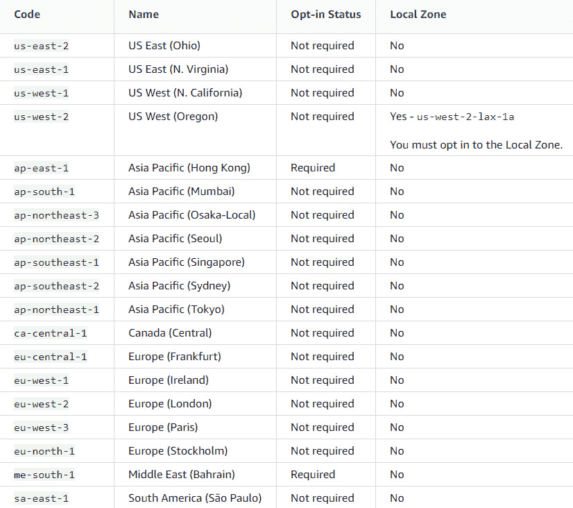
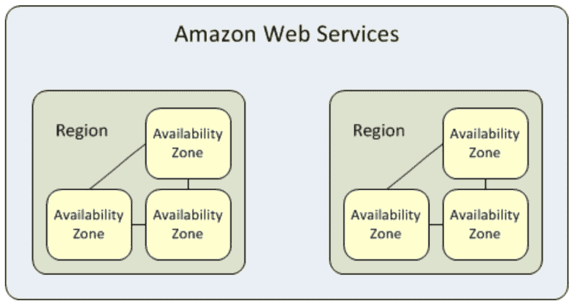
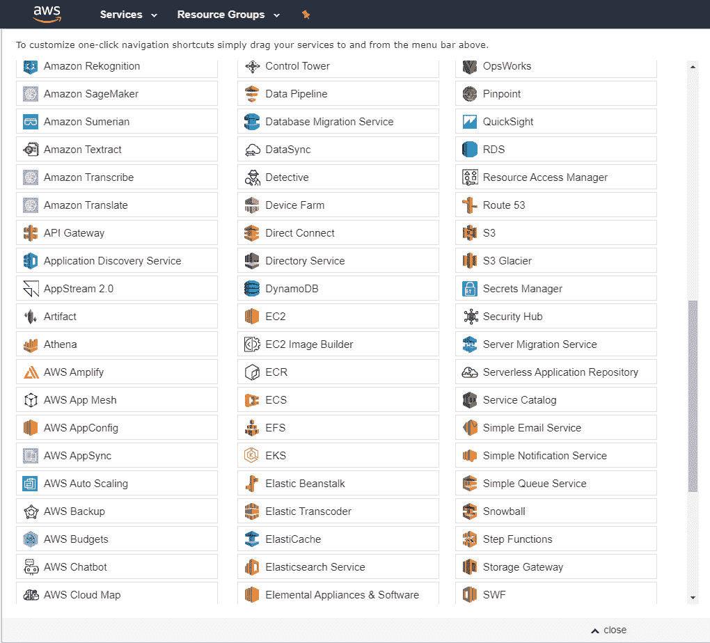
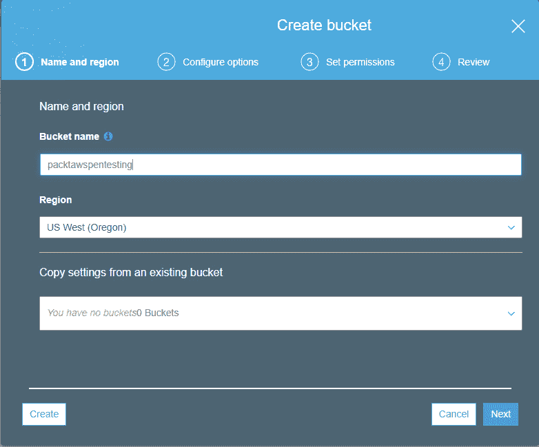
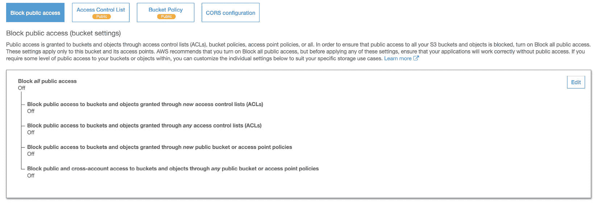
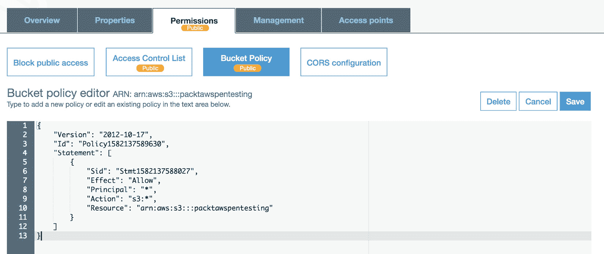
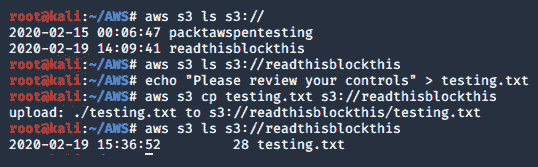
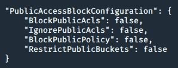
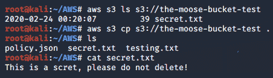
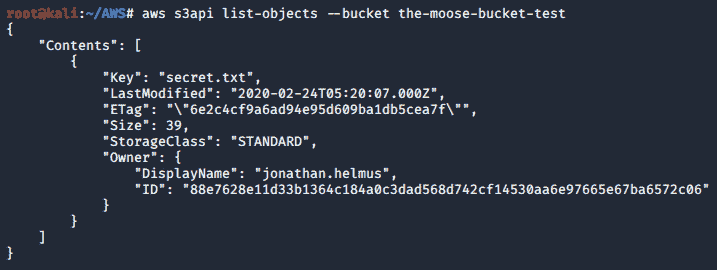

# *第四章*：开发 S3 桶

S3 存储桶是 AWS 用来保存数据的主要资源之一。S3 存储桶是保存数据和元数据等对象的好方法。然而，与其他文件存储解决方案非常相似，S3 存储桶可以通过简单的错误配置轻松利用。这些错误配置可能导致数据泄漏和其他严重的安全问题。

在本章中，我们将深入探讨 S3 存储桶及其功能，以及如何利用公共存储桶和配置错误的存储桶的问题。我们还将讨论现实世界中的场景，以及 S3 存储桶中的漏洞如何成为许多公司共同的全球问题。

在本章中，我们将介绍以下主题：

*   AWS 区域和可用性区域
*   操纵 S3 铲斗
*   S3 桶策略
*   理解公共桶
*   用于查找私有存储桶的脚本
*   基于目标的测试场景
*   用灰帽战发现水桶
*   构建本地 S3 环境

# 技术要求

要遵循本章中的说明，您需要以下内容：

*   AWS CLI（包含在[*第 1 章*](01.html#_idTextAnchor025)*中，构建您的 AWS 环境*）
*   猛击

本章使用的代码可通过以下链接获得：

*   [https://github.com/PacktPublishing/AWS-Penetration-Testing/tree/master/Chapter%204:%20Exploiting%20S3](https://github.com/PacktPublishing/AWS-Penetration-Testing/tree/master/Chapter%204:%20Exploiting%20S3)
*   [https://github.com/sa7mon/S3Scanner](https://github.com/sa7mon/S3Scanner)
*   [https://github.com/kromtech/s3-inspector](https://github.com/kromtech/s3-inspector)
*   [https://github.com/minio/minio](https://github.com/minio/minio)
*   [https://realpython.com/python-boto3-aws-s3/](https://realpython.com/python-boto3-aws-s3/)

查看以下视频以查看代码的运行：[https://bit.ly/3mJdY89](https://bit.ly/3mJdY89)

# AWS 区域和可用区

在开始使用 S3 之前，我们应该讨论一些事情。了解 AWS 是如何存储数据的是非常重要的，因为了解如何存储数据以及为什么存储数据有助于我们更好地理解基本原理。有了一个基本的理解，我们就能进一步理解我们已经知道的东西，并从中走出来。为了帮助我们更好地理解这一点，在深入研究 S3 之前，让我们先讨论一下基础设施。

就像本地服务器通常存储在您的企业或组织附近的场所中一样，谨慎的做法是尽可能靠近您托管 AWS 中保存的信息。我的意思是，使用地理位置靠近您的系统来帮助您使用基于云的资源支持您的任务。这就是 AWS 区域发挥作用的地方，它允许您根据您的需求和位置在地理上分配资源。这些被称为**区域**的地理位置区域可以在 AWS 中找到。您可以通过在 AWS 控制台的右上角选择区域来查看这些区域。我们在本书中使用的当前区域是**俄勒冈州**：

图 4.1–AWS 区域列表

AWS 地区是 AWS 用来承载其数据及其基础设施的各种地理位置。谢天谢地，它们在全球范围内与主要国家的地区一起举办，允许您选择离您最近的地区。选择靠近您的基础架构意味着您自己或最终用户的延迟更少。目前，您可以选择几个地区。以下屏幕截图直接从 Amazon 中提取，突出显示了您可以选择的所有区域和本地区域：

图 4.2–AWS 区域的较长列表

你可以看到这里有很多你可以选择的地区。如前所述，请确保选择离您最近的一个。这将确保资源得到最佳利用，因为它们离您最近。

现在我们已经了解了 AWS 地区，让我们看看一些最佳实践。

AWS 地区最佳实践

在查看区域时，您需要记住以下几点家政技巧。这些管理技巧可以帮助您更好地使用云系统并优化速度。这些最佳实践更多地应用于企业层面，但对于理解以下内容仍然至关重要：

*   选择离您最近的区域以最小化延迟。
*   某些较新的服务可能无法承载您需要的服务，因此请确保您选择的区域具有您想要的服务。如果没有，请选择支持所需服务的下一个最近的区域。
*   这一点我怎么强调都不过分–*合规性*！确保无论您在做什么，它都符合您所在地区的要求。不同的国家有不同的法律，所以请确保您了解该地区的最新协议。

现在我们了解了哪些区域，让我们来看看区域内托管的服务。这些服务称为**可用区**。

## 可用区

如果 EC2 实例离线，可用性区域对于最小化冗余和停机时间非常有用。创建可用性区域是为了允许您跨多个区域分发 EC2 实例，这样，如果您的实例在一个区域中出现故障，仍然可以在另一个区域中访问它。当然，这一切都发生在后台，而你，用户，没有注意到它！如果您需要快速复习 EC2 实例，请返回[*第 1 章*](01.html#_idTextAnchor025)*【建设您的 AWS 环境*，并进行快速复习。

接下来，让我们看下一张图。该图说明了 AWS 如何利用每个区域内的可用性区域。在本书中，我们将使用俄勒冈**地区**和**us-west-2****可用区**：

图 4.3-可用性区域冗余

考虑冗余是非常重要的，因为当服务停机时，冗余是一种故障检查，可确保这些服务正常运行。在一个生产或商业案例中，一个系统的崩溃可能意味着数百万甚至数十亿美元的损失！

重要提示

您可以在此处找到有关可用区域的更多信息：[https://docs.aws.amazon.com/AWSEC2/latest/UserGuide/using-regions-availability-zones.html#concepts-可用区域](https://docs.aws.amazon.com/AWSEC2/latest/UserGuide/using-regions-availability-zones.html#concepts-available-regions)

现在，我们对如何在可用性区域上分配资源有了更好的了解，让我们开始研究可能使用这些区域的服务。我们要讨论的第一项服务是 S3 及其存储解决方案 S3 Bucket。

# 连接和操作 S3 铲斗

中央文件存储是组织保护和存储数据的常规方式。如果您曾经在 IT 领域工作过，那么您很可能在 Windows 上设置**服务器消息块**（**SMB**共享以允许多台主机之间的文件共享时遇到过公平的磨合。允许集中配置文件资源是一种协作和共享信息的好方法，同时也允许人员从另一个系统远程访问数据。设置一个文件服务器，在那里存储和检索数据并不是什么新鲜事。新的是我们如何用同样的方法存储数据，只是现在我们可以使用称为**S3**的技术将数据存储在云中——或者**简单存储服务**，如果您想详细说明的话。

那么，什么是 S3？S3 是一个简单的存储系统（顾名思义），允许用户在云中存储数据。就像我们在文件服务器上存储数据一样，我们可以将数据存储在 S3 存储桶中，它将保存数据的内容。您可以在这些存储桶中存储大量数据，并随时检索。

在本节中，我们将学习 S3 存储桶、它们的用法以及如何创建文件并将其上载到 S3。让我们首先了解 S3 stands 的用途。

## 了解 S3 桶

如前所述，S3 是一种简单的存储服务，允许用户在云中存储数据。默认情况下，存储解决方案是安全的；但是，用户和管理员在存储周围设置策略，使其容易受到攻击。我们现在还不打算担心 S3 存储桶上的攻击和漏洞，因为我们需要首先了解基本知识。在开始攻击之前，让我们先分析一下有关存储解决方案的一些问题：

*   信息是如何存储的？
*   它去哪里了？
*   我们能储存多少，它有多耐用？

S3 将您的数据存储在称为**对象**的中，也称为**对象存储**。对象存储允许您以对象的形式存储图片、视频、文件等数据以及与之相关的任何数据。我们不打算介绍各种存储类，但您可以在此处了解更多信息：https://aws.amazon.com/s3/features/.

S3 是为“11 9”模型而设计的，这意味着它需要数据的持久性，并自动创建和存储跨多个系统的所有 S3 对象的副本。但是，这并不意味着 S3 对象将存储在操作系统中。S3 与 EC2 实例不同，无法承载 Windows 或 Linux 等操作系统。

S3 还具有高度的可扩展性，允许您存储看似无限量的存储；然而，没有什么是无限的，对吗？使 S3 存储无限增加了“11 9”模型的功能，推动了安全可靠存储的成功。

现在，让我们开始看看 S3 的用法及其在企业中的实际原则。

## 使用 S3 铲斗

我们了解使用云存储的原因非常重要。它为公司存储数据并能够访问数据提供了关键服务。如上所述，S3 存储以下类型的数据：

*   图片
*   视频
*   文件夹
*   包含敏感数据的文档等

虽然我们了解可以存储的数据类型，但 S3 是如何使用的？这不仅仅是加载一个新的文本文档，而是冗余和备份数据！

在企业中使用 S3 解决方案的主要原因之一是备份和归档数据，否则这些数据将存储在备份位置，如热站点、热站点和冷站点。S3 就像一个热门站点，因为数据随时可用和可访问。将 S3 作为备份存储解决方案也是灾难恢复的一个出色实现。如果您的主文件系统意外宕机，那么您的数据仍然可以在使用 S3 的云中使用。

S3 还可以作为一个中心位置，在企业中的用户之间存储和分发数据。请记住：S3 是关于扩展和存储的，因此能够全局访问数据对于提高生产率非常重要。

现在我们已经对 S3 以及它所包含的一切有了更好的理解，是时候开始研究 S3 桶了，以及我们如何可能对它们进行挖掘了。

## S3 吊桶

我们现在已经很好地掌握了什么是 S3，以及它如何为企业存储信息和备份数据。如前所述，S3 是一个简单的存储服务，它将数据存储为对象。这些**对象**存储在中，称为**桶**。简单地说，bucket 是一个基本的容器，托管在 S3 中并存储您的数据对象。让我们简单地看看这一切意味着什么，然后建立一个我们自己的桶。

重要提示

记住，S3 是云中的一个本地文件系统！

如前所述，S3 存储桶本质上类似于一个简单的文件服务器，您可以在本地文件系统中找到它，但它存储在云中而不是本地。bucket 存储可以随时上载和下载的对象。一些资源将存储在公共存储桶中，而另一些资源将存储在内部，仅对有权访问它们的用户可用。

为了简化 S3 属性，下面列出了 S3 需要记住的事项：

*   S3 bucket 名称是唯一的，不能与其他人的名称相同。这些名称特定于特定区域内的特定存储桶。我们稍后会看一看。
*   您最多可以创建 100 个桶！这将为您提供大量的练习和存储空间。
*   桶是按区域分配的。记住存储桶的区域很重要，这就是访问桶的方式！
*   它们可靠且足以满足您的所有存储需求。
*   S3 有一个通用名称空间，其中创建了 bucket。
*   它们可以虚拟地访问，也可以通过路径访问——一旦创建了一个 bucket，我们将讨论这一点。

现在你应该很好地掌握 S3 是什么以及它是如何工作的。但是，如果您仍然不确定，请不要担心–随着本章的阅读，我们会有更多的理解，随着本书的进一步阅读，我们会将更多的理论与实践相结合。

接下来，让我们构建一个 S3 bucket，然后看看一些常见的安全问题以及如何利用它们。我们将使用 Kali Linux 作为与 S3 交互的主机操作系统–确保您的本地 AWS Kali Linux 映像是最新的，并且安装了 AWS CLI，如本章的*技术要求*部分 o 所述。

### 创建 S3 存储桶

让我们开始将 S3 的所有理论应用到实际应用中，然后登录 AWS 控制台。登录后，让我们将 S3 服务图标固定到主页上。我们将大量使用它，因此将其保留在主页上是一种很好的做法。

让我们按照以下步骤继续创建一个 bucket：

1.  To begin, click on the thumbtack icon toward the top of the screen. Once you click on it, an extensive list of resources is displayed to you. Click and drag the **S3** icon to the top:

    

    图 4.4–AWS 服务列表

2.  You'll have something that looks like the following. Notice the **S3** icon at the top of your screen:

    

    图 4.5–作为服务快捷方式添加的 S3 图标

3.  Now you can click on the S3 icon and be directed to the S3 buckets page. This is where we will begin creating our buckets! Click on the icon that says **Create bucket** to start:

    

    图 4.6–S3 铲斗仪表板

4.  On the next screen, you'll need to enter a name and a region for the bucket:

    重要提示

    使用离您最近的区域。确保您的 bucket 使用全局唯一的名称。例如，不能有两个名为**AWSBucket**的桶。

    

    图 4.7–S3 Bucket 仪表板（创建和命名）

5.  The next screen will display the **Configure options**. In an enterprise environment, this is the start of where you will want to begin thinking about securing your buckets by assigning encryption and logging. However, for this, we will just leave everything unchecked:

    

    图 4.8–S3 铲斗配置选项

6.  Next, we will want to make the bucket public. If this were a real-world scenario, we would stray away from setting up a bucket like this; however, we want to make sure the bucket is public for our lab purposes. Public buckets are what lead to the majority of attacks where S3 is the primary vulnerability. By unchecking **Block all public access**, you'll be making the bucket public for anyone to access:

    

    图 4.9–S3 铲斗配置选项

7.  检查所有您的配置，点击**创建 bucket**：

图 4.10–S3 桶审查

干得好！你刚刚创建了你的第一个 S3 桶！在本书中，此存储桶将充当易受攻击的存储解决方案，因此请确保不要删除它。

现在，让我们看看上传数据的方法，看看测试 S3 存储桶的方法是如何获取信息的。在开始之前，让我们创建一个管理员用户，它将为我们提供一个访问 ID 和一个秘密，我们可以使用它连接到 AWSS3 环境。

## 快速绕道-使用 IAM

让用户访问 S3 非常重要，因此请前往 AWS 控制台中的以下区域并开始：https://console.aws.amazon.com/iam/home?#/users.

进入**身份和访问管理（IAM）**页面后，按照以下步骤创建一个用户，我们可以使用该用户访问 S3 存储桶：

1.  点击左上角**添加用户**。
2.  给你的用户一个名字。
3.  Check off the following options:

    --**AWS 管理控制台访问**

    **——编程访问**

4.  点击**下一步**。
5.  跳过添加标记。
6.  查看并创建一个**用户**！

之后，您将获得一个**访问密钥 ID**、**秘密访问密钥**和**密码**。保存这些文件并将其存储在安全的地方：

图 4.11–成功创建 IAM 用户

现在我们已经了解了用户是如何创建的，让我们看看如何为我们的 AWS 环境配置用户，并将 data 复制并上传到 S3 存储桶。

## 复制并上传至 S3

很好–现在我们有一个用户可以用来访问 S3 存储桶。将文件上载到 S3 存储桶是处理 S3 存储桶最基本的用途。这就是我们如何安全地将信息输入云中的方式。

有两种方法可以将数据上载到 S3：

1.  使用 web 浏览器
2.  使用 AWS CLI

我们将同时使用这两种方法，但我们的测试方法依赖于 CLI。虽然拥有一个**图形用户界面**（**GUI**）是一个很好的选择，但在可用时最好使用 CLI–这通常允许您使用更多选项，并且在 GUI 出现故障时会保持稳定。该用户具有管理员权限，即具有**读**和**写**访问权限。让我们看看如何通过 CLI 将文件上传到 S3：

1.  Connect to your AWS environment with the **Access key ID** and **Secret access key** from the user you created:

    **$aws 配置**

2.  Enter the ID and secret from your user. When prompted, leave the region and output format blank. You should now be all set and connected. Now let's check out the buckets and verify the contents by listing out the contents of the S3 bucket:

    **$aws s3 ls s3://**

现在，您应该能够看到您创建的 bucket 以 Linux 类型的格式列出。在继续之前，让我们先对命令进行分解，以便了解每个参数的作用：

*   **aws**：此命令允许您与 aws 环境交互。
*   **s3**：此参数将允许您访问您的**s3**存储桶。我们可以将其他命令放在这里，稍后我们将发现这些命令。
*   **ls**：我们之前提到过。**ls**允许用户列出文件系统的内容。我们可以在各种操作系统中使用它，也可以在**s3**文件系统中使用它。
*   **s3://**：简单地说，这允许您通过**s3**访问文件系统。此语法类似于访问本地文件系统的其他语法，如 SMB 或 FTP。

现在您已经了解了命令的作用，让我们继续前进，创建一个可以上传到 bucket 的文件。我们找到了我们创建的目录；下一步是列出目录中可能存在的任何内容。在这种情况下，我们不会有任何。

以下内容将允许我们创建一个文件：

1.  Type in the following command to list out the contents of the target bucket:

    **$aws s3 ls s3://packetawspentesting**

2.  Now we create a file in the Terminal that can later be uploaded:

    **$echo“AWS 测试的测试”>test.txt**

3.  Make sure that contents were written to the file correctly:

    **$cat test.txt**

4.  Now upload the contents of the file:

    **$aws s3 cp test.txt s3://packtawspentest**

5.  Verify the file:

    **$aws s3 ls s3://PACKTAWS 测试**

恭喜，您成功地从 AWS 命令行上传了一个文件！您还可以在 AWS web 控制台中检查您的文件，其内容如下所示：

图 4.12–AWS 控制台的文本文件视图

总而言之，以下是我们为让 S3 bucket 上线而采取的步骤：

1.  创建了一个 IAM 用户
2.  已配置并连接到 AWS 环境
3.  列出了 S3 存储桶的内容
4.  创建一个文件并将其复制到 bucket

现在我们已经创建了一个 bucket，让我们看看在测试 S3 时出现的一些常见错误配置。

# Bucket 策略和 ACL

Bucket 策略和**访问控制列表**（**ACL**）用于访问控制–充当的前线，允许和拒绝访问 AWS 环境中的 S3 资源。ACL 和 Bucket 都使用 JSON 或 YAML 来编写策略，这会使事情变得困难或简单，这取决于您如何看待它。

现在让我们向前看，看看这些策略是如何创建的！

## 公共政策

在测试 S3 时，首先要做的事情之一是查看 S3 存储桶的策略。下面我们将创建一个简单的 bucket 策略，以及如何开始基于该策略与 bucket 交互。

按照以下步骤创建 bucket，然后列出其策略：

1.  转到 S3 bucket 页面并单击我们创建的 bucket。
2.  接下来，点击**权限**选项卡。
3.  Ensure that you have everything unchecked on **Block all public access**:

    

    图 4.13–S3 铲斗访问视图

4.  接下来，进入**Bucket Policy**部分，点击页面左下角附近的**Policy Generator**。
5.  From here, you'll want the following parameters to be set:

    --**选择策略类型**：**S3 桶策略**

    --**效果**：**允许**

    --**负责人**：*****-放置***说明我们正在选择“全部”

    --**AWS 服务**：**亚马逊 S3**

    --**动作**：**所有动作**

    --**ARN**：**你桶的 ARN**

6.  您将能够创建策略并将其上载：

图 4.14–S3 桶策略

现在我们更新了政策，让我们看看如何从 AWS CLI 读取它：

$aws s3api 获取 bucket 策略--bucket packtawspentest

这将告诉我们桶政策的结果；但是，我们可以使用下面的命令使格式更清晰一点，**将**导入另一个命令。第二个命令启用 Python，并使用内置模块**json 工具**输出信息：

$aws s3api 获取 bucket 策略--bucket packtawspentest--输出文本| python-m json.tool

以下屏幕截图显示了前面命令的输出：

图 4.15–通过终端获取 S3 存储桶策略

正如你所看到的，我们已经成功地以更清晰的格式列出了我们桶的政策。

## 了解政策属性

理解政策的每一部分意味着什么以及它在做什么是至关重要的。您不需要理解 JSON 就可以知道策略在做什么。让我们分析一下刚才制定的策略，看看每个属性的含义。让我们来看看我们将看到的一些基本属性是：

*   **ID**：用作参考号。
*   **版本**：告知用户使用的策略版本。
*   **动作**：这会告诉您正在使用什么类型的资源。在本章中，我们使用 S3。
*   **效果**：此部分策略将“拒绝”或“允许”访问资源。
*   **资源**：ARN 放在这里，告诉策略 policy 应用于什么资源。

## 写入 bucket 策略进行策略绕过

现在让我们来看一看写一个新的桶策略。对于此练习，请使用 AWS 控制台中内置的策略生成器。为此，我们将制作一个新桶；只有这一次，我们将创建一个具有更严格策略的 bucket。它应该将**效果**设置为**拒绝**，而不是**允许**。

以下是您的新存储桶的策略：

{

“Id”：“保单 1582144841563”，

“版本”：“2012-10-17”，

“声明”：[

    {

“Sid”：“Stmt1582144836532”，

“行动”：“s3:*”，

“效果”：“拒绝”，

“资源”：“arn:aws:s3:：：readthisblockthis”，

“委托人”：“*”

    }

  ]

}

向前看，让我们看看如何将文件上传到我们的 S3 桶：

1.  List out the contents of the bucket:

    **$aws s3 ls s3://**

    现在我们已经知道了要针对哪些 bucket，让我们制作一个文件并将其上载到 bucket：

    

    图 4.16–列出 bucket 的内容并将文件复制到 bucket

2.  Now we've confirmed that we can upload files to the bucket, this gives us a hint that we should be able to upload just about any file to the bucket. Next, let's take our policy and change one line that will allow us to make any action on the S3 bucket:

    {

    “Id”：“保单 1582144841563”，

    “版本”：“2012-10-17”，

    “声明”：[

        {

    “Sid”：“Stmt1582144836532”，

    “行动”：“s3:*”，

    “效果”：“允许”，

    “资源”：“arn:aws:s3:：：readthisblockthis”，

    “委托人”：“*”

        }

      ]

    }

3.  It's as simple as that. We now need to upload this to our bucket. Save the new policy as **policy.json**, and upload it using the following command:

    **$aws s3api 放置 bucket 策略--bucket readthisblockthis--policy policy.json**

现在你将有一个更多**过度**的许可政策放在的位置，允许你更多的控制。这在企业层面上可能是危险的——它将允许用户在没有适当授权的情况下随心所欲地更改策略。

既然我们已经了解了如何制定水桶政策，让我们继续前进，开始关注公共水桶的危险。

# 公共水桶

公共水桶是 AWS 和 S3 最大的健康风险之一。由于安全状况不佳，S3 中的错误配置导致大量数据泄漏。已报告的一些问题如下：

*   缺乏对 S3 存储桶的监控。如果没有监控，实际上就没有一种稳定的方法来检查对 S3 环境的访问。
*   缺乏对 S3 环境的测试和审核被证明是一个安全问题。像脆弱性评估或甚至简单的 pentest 这样简单的东西将有助于突出可以轻松修复的问题。
*   放松政策是另一个问题。如果策略允许太多的用户访问 S3 资源，那么如果这些帐户被破坏，则可能会出现问题。

围绕 S3 安全性的流行观点强调，监控将提高 S3 的安全态势；然而，监控只是成功的一半。正如我们所看到的，拥有一个过度许可的策略也可以允许用户做出被认为是“未经授权”的更改。未经授权一词被轻描淡写地使用，因为策略在技术上说它是允许的，但良好的实践建议不要这样做。

现在，让我们开始向前看，看一看桶中的公共 misc 配置。

## 铲斗配置错误

就像本地文件系统一样，错误配置可能是保护网络的根本原因。寻找可以用作杠杆的简单而微小的细节是至关重要的。S3 是“预处理的”，考虑到安全性，这意味着它是默认安全的。您将在本书和现实世界中看到的错误配置通常涉及到错误配置的策略，这些策略允许对特定资源进行过多访问，或者权限很容易被绕过。

虽然我们在本章中创建了易受攻击的存储桶，并在整本书中全面探讨了薄弱问题，但必须确保您保护所有资源，使其不被利用。

我们已经在*编写用于策略绕过的桶策略*部分讨论了如何查找配置错误的策略。现在让我们来看看我们将如何在 AWS 环境中的公共桶中搜索数据。

首先，让我们继续使用我们的**访问密钥 ID**和**秘密访问密钥**进行身份验证。**一旦对环境进行了身份验证，让我们使用以下步骤来查找公共 bucket：**

 **1.  List out the buckets within the AWS environment:

    **$aws s3 ls s3://**

    在我们的例子中，我们发现了一个名为**awspublicpackt**的 bucket，它似乎是公众错误配置的可能目标。让我们继续前进，把公共障碍从中拉出来。

2.  The next command will show us whether there is any public access allowed to the bucket:

    **$aws s3api 获取公共访问块——bucket awspublicpackt**

    运行命令后，我们将看到一些输出，这些输出将列出所有设置为 false 的访问控制列表。将 ACL 设置为 false 意味着所有访问都是公共的，并且 bucket 周围没有授权控件：

图 4.17–公共存储桶的输出，awspublicpackt

从命令的输出可以看出，我们可以确认 bucket 是公共的。如果我们要在 pentest 期间发现这一点，则需要对其进行日志记录，并且我们需要通知客户端应该拒绝公共访问，除非出于业务原因该存储桶是公共的。此外，如果 bucket 需要保持公开，则需要建议用户不要在 bucket 中存储任何被认为敏感的信息。

在下一节中，我们将讨论一个稍微不同的主题。我们将讨论有关 S3 存储桶的脚本和使用脚本实现安全性。

# 用于查找私有存储桶的脚本

在网络安全方面，脚本编写是一项备受追捧的技能，因为拥有编写任务脚本的知识和能力，您可以在执行另一项任务的同时以更高的效率实现自动化并提供结果。脚本编写也是解决可能是唯一的问题的一种很好的方法——在本例中，查找可能没有通用名称的存储桶。bucket 只能有一个唯一的名称，并且没有 bucket 是相同的，因此拥有已知 bucket 的字典列表不会直接帮助您。这意味着您需要对 bucket 名称进行修改，并将其放入一个文本文件中，该文件可用于发现 bucket 名称。

现在我们有了大量的关于 S3 的知识，让我们来看看你们下一个最新约定的脚本。我们将研究两种 popu 语言：Python 和 Bash。

## Python 脚本

Python 是安全社区中的一种标准编程语言，因为它的简单性和可用性。许多安全工程师使用它，因为它允许您创建、自动化和动态监控一切！回想一下，我们在[*第 2 章*](02.html#_idTextAnchor056)*【Pentesting and Ethical Hacking】*中设置了 PyCharm，并编写了一个简单的程序来概述 Python 的工作原理。

请注意，这不是一门 Python 课程，因此我们将不讨论 Python 的内部工作原理；然而，**Packt Publishing**提供了大量 Python 书籍。我们总是鼓励大家走出去，多读一些本书未涉及的内容。

我们需要为 AWS 安装 Boto3 SDK。**SDK**是**软件开发工具包**的首字母缩写，在这种情况下，您可以使用 Boto3 直接从 Python 脚本中创建、更新和删除 AWS 资源。

重要提示

Boto3 是一个 AWS**软件开发工具包**（**SDK**），用于 Python，允许开发人员编写可以利用 S3 和 EC2 等服务的代码。

以下步骤将帮助您正确执行此操作：

1.  Open up a Terminal and type the following command to install **boto3**:

    **$pip 安装 boto3**

2.  Now you have the SDK that will allow you to build S3 buckets using Python! Let's create a file that we can store our credentials in:

    **$touch~/.aws/凭证**

3.  This will create a file that you can store your credentials in. Open the file using a file editor and input the following parameters:

    **【默认】**

    **aws_-access_-key_-id=您的 _-access_-key_-id**

    **aws_secret_access_key=您的 _secret_access_key**

    **地区=您的首选地区**

    重要提示

    您需要将 ID 和密钥替换为 AWS 用户的 ID 和密钥。您需要将该区域替换为您喜欢的区域–这本书一直在**西部****2**工作。

现在，您已经准备好使用**boto3**和 Python 与 S3 bucket 交互了！

有很多方法可以与 S3 和 Python 交互——本书的目的是展示实现这一点的基础知识，但是，请将本书作为入门，并“保持好奇”，并查看更多有关 Python 脚本编写的资源。

以下是一个很好的资源，可以在您已经设置好的情况下使用：https://docs.ceph.com/docs/master/radosgw/s3/python/

现在，让我们创建一个脚本，它可以帮助我们找到 bucket，使我们能够在 S3 环境中查找 bucket。您可以使用 Python 终端编写以下脚本：

1.  We create a file with the **.py** extension at the end – for example, **myBucket.py**.

    无论您选择以何种方式使用，以下脚本都将帮助您查找存储桶：

    **进口 boto3**

    **s3=boto3.资源（'s3'）**

    **我的桶=s3.桶（“我的桶名”）**

    **用于 my_bucket.objects.filter 中的 object_ 摘要（前缀=“dir_name/”）：**

    **打印（对象\汇总.键）**

强烈建议将此脚本放在 PyCharm 中，您可以稍后使用它，或者使用更多功能扩展它。将其放置在 PyCharm 中还允许您在默认情况下在 PyCharm 中编辑文件，使 PyCharm 成为您的主要工作区。

现在我们已经了解了如何制作一个简单的脚本来查找 bucket，让我们来看一下一些**Bash**脚本。

## Bash 脚本

**Bash**是一种脚本语言，支持任务自动化，在我们的例子中，通过测试 S3 帮助我们实现目标。**Bourne SHell**或简称**Bash**是一个通常内置在操作系统中的 SHell 进程，就像我们在本书中使用的 Kali Linux 发行版一样。

为了确保在您的环境中设置了**Bash**，请在 Kali Linux 终端中键入以下命令：

$echo$SHELL

既然您已经验证了已经在您的机器上设置了**Bash**，那么让我们创建一个脚本，用于查找可能没有这样一个通用名称的 bucket。遵循以下步骤：

1.  Open a new file using the **vi** text editor:

    **$vi.sh**

2.  You should have the **vi** editor open. Now, input the following text in the Terminal. You'll need to press *Shift* **+** *I*together to begin typing.

    编写以下脚本是为了发现潜在的存储桶：

图 4.18–Bash 脚本

完成后，点击*Esc*，然后输入**：wq**保存并关闭终端。该命令将允许您保存并退出程序。

如果要验证脚本是否正确保存，您可以将**cat**从文件中取出，并应看到以下代码：

#!/bin/bash

同时读取 F；做

count=$（curl$1/$F-s | grep-E“NoSuchBucket | InvalidBucketName”| wc-l）

如果[$count-等式 0]]

然后

echo“找到桶：$F

fi

完成

脚本准备就绪后，使用桶的 ARN 扫描桶。

现在，我们将学习到目前为止所学的所有知识，并利用这些知识做一些非常重要的事情——在一个你可以理解的五旬节场景中使用它。本演练有助于帮助和强调真正的潜在方式使用 AWS 执行 pentest。

# 基于目标的测试场景

现在让我们开始向前看，看看在现实环境中测试 S3 时比较常见的一些真实场景。虽然它看起来不像是典型的“pentesting”，因为 AWS pentesting 没有使用典型的 pentesting 方法，但它仍然可以帮助您发现问题并利用它们为您带来优势。基于目标的测试需要测试一个心中有“目标”的目标。在本例中，我们正在寻找 S3 存储桶中可能存在的问题和灾难。通常，组织会想知道特定资源有多脆弱，以及导致该漏洞的路径如何被利用。

在本例中，我们将了解一个不安全的 bucket 如何导致我们删除一个重要文档，然后上载一个同名文档。我们将使用“假定模型”，这意味着我们已经有了某种类型的系统访问权限。在我们完成练习之前，让我们来看看我们将要做什么：

1.  我们需要访问 S3 环境–我们将使用我们的凭据。由于我们是在一个假设的模型上行动，这意味着我们将作为一个近侧操作。
2.  接下来，我们将获取有关 bucket 中对象的信息。
3.  然后我们将删除该对象，并使我们自己的对象上载-然后将该对象上载到 bucket。

现在我们有了我们需要的，让我们执行这个计划，继续前进。以下是如何正确执行此操作的分步过程：

1.  Use **AWS configure** to enter your environment. Remember, because we are using an "assumed" model, we are acting like someone who already has access to the environment.

    配置并连接后，下一步是列出存储桶的内容：

    **$aws s3 ls s3://**

2.  Now that we see the buckets, let's take a look at the **test** bucket:

    **$aws s3 ls s3://驼鹿桶试验**

3.  Hmm, it looks like we have a secret file that someone must have left behind. Unfortunately, the bucket was made public and made quickly, so security was an afterthought. Next, let's go and grab the secret file:

    **$aws s3 cp s3://驼鹿桶试验**

4.  Great, now we have the file! Using our Kali Linux machine, let's take a look at the contents of the file:

    **$cat secret.txt**

    

    图 4.19–列出存储桶中的文件

5.  We can take a deeper look and see who owns the object. In a real pentest, this could be useful information for spoofing or social engineering attacks:

    **$aws s3api 列表对象——木桶驼鹿木桶测试**

图 4.20–列出对象的内容

看来这不是我们的本意；然而，因为我们是 pentesting，所以向客户说明安全的重要性是至关重要的。为了做到这一点，我们需要删除该文件并上传一个新工件。确保保留原始文件，以便客户端可以返回该文件。

重要提示

如果这是一个真正的 pentest，并且文件包含敏感数据，那么您应该立即停止 pentest 并在继续之前通知您的客户。

继续测试，看看是否可以删除该文件：

1.  So, we have our file, now let's delete that file:

    **$aws s3api 删除对象——木桶驼鹿木桶测试——key secret.txt**

2.  Create a new file:

    **$echo“您已经被解雇了！请确保您的水桶安全！”>>secret.txt**

3.  Upload the file:

    **$aws s3api 放置对象——木桶驼鹿木桶测试——key secret.txt**

我们已经成功地删除了旧文件并上传了我们自己的新文件！正如您所看到的，让公共存储桶保持打开状态是一个巨大的问题，通过设置适当的访问控制，拒绝未经授权的用户访问包含不适合他们的数据的文件，可以轻松缓解这个问题。

现在我们更好地了解了如何在实际渗透测试情况下查找存储桶，接下来让我们看看另一个可以通过您选择的浏览器使用的工具。名为**Grayhat War**的网络工具允许您通过其搜索引擎进行查询来发现存储桶。

# 用灰帽战发现水桶

我们将在本章中提到的下一个工具是我个人的最爱。它使发现开放的 S3 存储桶变得简单高效。基于 web 的工具**Grayhat War**允许用户通过简单的查询快速查找打开的 bucket，也允许我们通过搜索各种文件类型快速查找其他文档。

让我们看一个快速示例，它将查找**packtpub.com**域下的文件。

首先，打开您的 web 浏览器，进入[https://buckets.grayhatwarfare.com/](https://buckets.grayhatwarfare.com/) ：

1.  Next, search [packtpub.com](http://packtpub.com) in the **Keywords** section of the tool. Once you have the name in the **Keywords** box, click **Search**:

    

    图 4.21–使用 Grayhat War 搜索 packtpub.com

2.  You'll see a banner saying **Results for "packtpub com"**. Under the banner, you will see a list of buckets. In our case, with this example, we only discovered one bucket, however, that may change over time and by the time you complete this exercise:

    

    图 4.22–使用 Grayhat Ware 发现 packtpub.com 存储桶

3.  从这里，您可以单击 bucket 并下载 bucket 中的对象（如果您选择）。本例更多地关注方法，而不是执行完整的工具。

使用**Grayhat Ware**时，请确保您使用的是最佳实践，并且仅出于道德目的使用该工具。这是什么意思？这意味着，虽然使用该工具是 100%合法的，但如果您发现与他们的域相关的泄漏桶，您应该通知任何公司。

重要提示

泄密桶是一个 S3 桶，对互联网开放，泄露敏感信息。如果你发现一个漏水的水桶，请联系水桶的主人并立即通知他们！

它还意味着不出于不道德的原因使用该工具，例如使用发现的数据来损害组织。

接下来，让我们开始结束本章。我们已经学习了很多关于 S3 环境以及如何操作和利用 S3 存储桶的知识。接下来，让我们讨论一些关于 S3 的 extras，然后开始结束。

# S3 打嗝套件扩展

Burp Suite 是 web 应用程序测试常用的工具。我们不打算深入了解打嗝套件的工作原理，但是，请访问 PortSwigger 网站了解更多详细信息：https://portswigger.net/burp.

有了大量可用的扩展，**Burp**正被 Pentester 和应用程序安全工程师越来越广泛地使用，现在可以被云安全专业人员用来测试他们的环境。我们将看一看名为**aws 扩展器**的扩展。扩展允许您扫描 S3 存储桶中的错误配置。

在开始之前，我们需要确保安装了最新的 Python 包。

在这里下载：[https://github.com/jythontools/jython](https://github.com/jythontools/jython) 。

现在，让我们继续并检索该工具的副本：

1.  Start by retrieving a copy of the package:

    **$git 克隆 https://github.com/jythontools/jython.git**

    按照网站上提供的说明进行操作，完成后继续。

2.  After installing the new **jython** package, go ahead and clone the tool to your machine from this repository: [https://github.com/VirtueSecurity/aws-extender.git](https://github.com/VirtueSecurity/aws-extender.git):

    **$git 克隆 https://github.com/VirtueSecurity/aws-extender.git**

3.  Once you're done, you'll need to move onto the extensions and use **pip** to install the requirements:

    **$pip 安装-r requirements.txt**

这部分可能需要一些时间，所以给它一些时间。

现在您需要将扩展加载到 Burp 套件中。您可以在终端中找到**打嗝套件**或键入**打嗝包**，应用程序将启动。启动应用程序后，转到**扩展器**选项卡并单击**选项**。您应该看到加载模块的**文件夹**。将其设置为**aws extender**Python 程序目录。

我们将很快朝着一个不同的方向前进，看看一些非常有趣的事情——创建一个本地 S3 实验室，供您练习使用！

## 创建本地 S3 实验室

有时，您可能希望测试 S3，而不必在云中设置文件系统。由于 S3 只允许唯一的名称，查找“测试”名称可能会变得很麻烦，创建测试环境可能会很乏味。然而，这不应该妨碍您建立一个本地实验室，在那里您可以了解更多关于 S3 的知识。

**MinIO**是一个本地存储系统，可用于在云中存储您想要的数据。我们在本书中提到它的原因是，这是了解本地网络上 S3 存储的一个很好的方法，而不限于使用 AWS 中可用的名称。然而，MinIO 的一个缺点是，如果您习惯于使用 AWS 生成典型的策略，那么策略设置可能有点像学习曲线，或者有些奇怪。

现在你可以这样做了——建立一个本地 S3 实验室，你可以使用一个名为**MinIO**的程序，按照他们的说法：

*MinIO 是 Apache 许可证 v2.0 下发布的高性能对象存储。它是与 Amazon S3 云存储服务兼容的 API。使用 MinIO 为机器学习、分析和应用程序数据工作负载构建高性能基础架构。*

*-迷你*

您可以在此处找到有关 MinIO 项目的更多信息：[https://github.com/minio/minio](https://github.com/minio/minio) 。

重要提示

您可以在此处找到有关如何设置 MinIO 的完整演练：[https://medium.com/@jonathanchelmus/creating-an-s3-lab-on-an-ec2-instance-95ffd8ac6c1](mailto:https://medium.com/@jonathanchelmus/creating-an-s3-lab-on-an-ec2-instance-95ffd8ac6c1)。

我强烈建议您仔细阅读文档并建立一个本地实验室，您可以使用它来测试和构建 S3 skill 集合，并方便地使用您的本地实验室。

# 总结

在本章中，我们学习了很多关于 S3 存储桶的知识，以及一些利用公共存储桶问题的方法。我们还进一步了解了 AWS 区域和可用性区域，以及它们与 S3 bucket 和 AWS 的关系。本章还介绍了各种脚本语言，如 Python 和 Bash，以及如何使用 Python 和 Bash 扫描 S3 存储桶。

最后，我们将概念验证应用到我们制作的公共 S3 存储桶中，来查看一个“真实世界”场景。我们鼓励您创建自己的场景并执行它们，同时保持在 AWS 实践和政策的法律范围内。

最后，我们看了一些其他项目，它们可以帮助我们更深入地研究 S3，而不必使用 AWS。如果您希望建立一个本地 S3 bucket 实验室，那么 MinIO 之类的技术是一个很好的资源。

在下一章中，我们将通过讨论一些关键的 points 和使用 MySQL 建立一个 RDS 数据库来了解什么是 RDS。

# 进一步阅读

*   公共桶工具：[https://github.com/Moos1e/Recon-Public-Buckets/tree/master](https://github.com/Moos1e/Recon-Public-Buckets/tree/master)
*   EC2 中的 MinIO 设置：[https://medium.com/@jonathanchelmus/creating-an-s3-lab-on-an-ec2-instance-95ffd8ac6c1](mailto:https://medium.com/@jonathanchelmus/creating-an-s3-lab-on-an-ec2-instance-95ffd8ac6c1)
*   更多关于 S3:[https://aws.amazon.com/s3/features/](https://aws.amazon.com/s3/features/)
*   创建桶：[https://docs.aws.amazon.com/AmazonS3/latest/gsg/CreatingABucket.html](https://docs.aws.amazon.com/AmazonS3/latest/gsg/CreatingABucket.html)
*   更多关于 boto3:[https://realpython.com/python-boto3-aws-s3/](https://realpython.com/python-boto3-aws-s3/)**