# *第 8 章*：评估 AWS API 网关

AWS API 网关充当可承载各种类型数据的应用程序的网关。它们承载的数据各不相同；然而，事实并非如此，一些数据可能被认为对未经授权的人员有吸引力，例如 S3 存储桶的位置或过度许可的标题。本章将讨论什么是 AWSAPI 网关，以及如何学习使用开源工具检查 API 调用和操纵 API 调用。

了解 AWSAPI 是如何工作的将使我们的思维方式从 Linux 终端扩展到浏览器，并了解 web 服务的基础知识以及如何与之交互。在阅读本章时，请记住其中的许多技术也可以评估 AWS 中的所有 web 应用程序。本章旨在让您彻底了解 AWS API 以及如何通过操纵 API 调用来评估 web 应用程序。

在本章中，我们将介绍以下主题：

*   探索和配置 AWSAPI
*   使用 AWS 创建我们的第一个 API
*   打嗝套件入门
*   使用打嗝套件检查交通
*   操纵 API 调用

# 技术要求

*   打嗝套房：[https://portswigger.net/burp/communitydownload](https://portswigger.net/burp/communitydownload)

查看以下视频以查看代码的运行：[https://bit.ly/3kPr2sb](https://bit.ly/3kPr2sb)

# 探索和配置 AWS API

您是否想过信息是如何从您的计算机传输到网站或该网站的后端服务器的？通常，您的请求是从浏览器发送的，然后通过一个称为**应用程序编程接口**（**API**的东西）。API 是一个接口，用于允许其他应用程序或主机与一个中心点进行交互。在这种情况下，API 是中心点，应用程序将是我们在 AWS 中交互的服务。

那么，这对 AWS 意味着什么？我们将如何在本书中使用它？首先，我们需要了解什么是 amazonapi 以及 amazonapi 网关如何管理服务的基本术语。我们将通过查看 AWS 环境中 API 的一些高级视图来了解这一点，然后稍后将学习如何像在实际 pentest 中一样拦截和操作 API 请求。

AWS API 网关是一种托管服务，它提供了一个**前门**，允许您访问各种 AWS 服务上的应用程序和数据。网关处理所有涉及接受和处理来自 API 的请求的任务。API 在身份验证和授权控制中也起着至关重要的作用，而身份验证和授权控制在安全性方面起着至关重要的作用。如果有人能够绕过身份验证和授权机制，他们将能够直接访问目标服务或资源。

在我们开始研究 API 的高级映射以及它们如何与我们的 AWS 环境协同工作之前，我们需要了解 AWS 提到的两种 API 类型。我们将讨论的两个 API 是**RESTful API**和**WebSocket API**。

## RESTful API

REST 实际上是代表性状态转移的首字母缩写。RESTful API 设计使我们能够进行所谓的无状态调用或无状态请求。这种无状态请求允许在出现故障时重新部署调用，并且还可以在需要时进行扩展。此函数使 RESTful API 在云应用程序（如 AWS）中合理地受到追捧，因为无状态 API 的扩展可以轻松地与敏捷的扩展云环境集成。由于其敏捷性，RESTful API 可以相当快地根据流量负载进行调用和更改，而不会变得不知所措。

重要提示

在本书的内容之上，有很多关于 API 的信息。如果您想了解有关 RESTful API 的更多信息，请查看此处的 AWS 文档：[https://docs.aws.amazon.com/apigateway/api-reference/](https://docs.aws.amazon.com/apigateway/api-reference/) 。

既然我们对 RESTful API 有了更多的了解，那么让我们简要介绍一下另一种类型的 API：WebSocket API。

## WebSocket API

WebSocket API 网关是各种路由的集合，集成了各种服务，如 Lambda 函数和 HTTP 端点。WebSocket API 是双向的，确保终端客户端可以向服务发送通信量，也可以从服务发送通信量，并且服务还可以将通信发送回客户端。

重要提示

双向本质上意味着交通可以在两个不同的方向上运行。

由于其多功能性和双向功能，WebSocket API 通常用于运行实时流媒体频道的应用程序，如游戏、华尔街使用的金融交易平台和聊天应用程序，其中一些应用程序可用于与朋友和家人聊天！

现在，我们已经了解了什么是 API 以及它们是如何工作的，我希望我们开始更多地应用一些实践知识，以帮助一切顺利进行。然而，在我们这样做之前，让我们快速查看 API 如何在 AWS 中工作并与诸如 LAMBDA 之类的服务进行交互的高级概述。

## API 地图概述

本节将简要地说明 API 如何在 VPC 和 EC2 实例中使用 Lambda 函数的高级视图。运行 API 并将其与各种服务集成的优点是，您可以通过 web 流量门户（在本例中为 API）扩展多个服务，并从 API 集中记录所有内容。如前所述，API 允许快速高效地进行扩展，因此将它们作为访问多个服务的主要门户将使您能够构建更多从一个中央 API 查询的服务。

现在让我们来看一个简单的解决方案，用于创建一个 API，允许您访问 lambda 函数和 EC2 实例。在这个例子中，我们并不担心这些服务在做什么。我们更关心的是了解流量如何从 AmazonAPI 网关流向服务，以及如何从服务返回 API。

请参阅下图，以帮助您了解 AWS 服务的 API 流程：

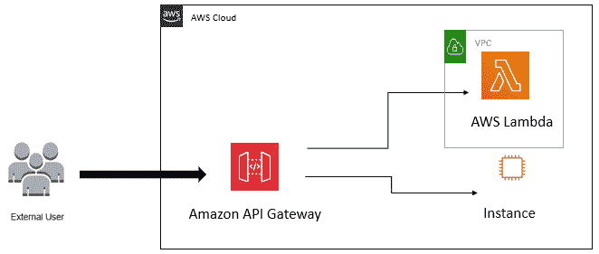

图 8.1–AWS API 网关图

从图中可以看出，**外部用户**正试图通过 API 访问服务。请记住，API 使用 web 请求调用发布和检索信息。**亚马逊 API 网关**根据用户请求调用**Lambda 函数**或**EC2 实例**。然后，服务将数据发送回外部用户。这完成了用户和服务之间的通信流。

重要提示

在本章后面的部分中，我们将在处理 API 调用时了解有关 web 请求的更多信息。

现在我们已经很好地理解了什么是 API 以及它如何与 AWS 服务一起工作，让我们继续制作我们自己的 API。

# 使用 AWS 创建我们的第一个 API

本节将简单而简洁地介绍如何在 AWS 中设置自己的 API。我们不必担心将任何服务连接到它——我们将在以后的练习中检查流量和处理对 API 的调用时这样做。

以下说明将帮助您创建一个可在本章中使用的 API。要开始，请登录 AWS 控制台并执行以下步骤：

1.  Search for the **api** service in the search bar at the main menu of the AWS console:

    

    图 8.2–搜索 api

2.  Next, you'll be given a list of APIs to choose from. Select **REST API** and click **Build**:

    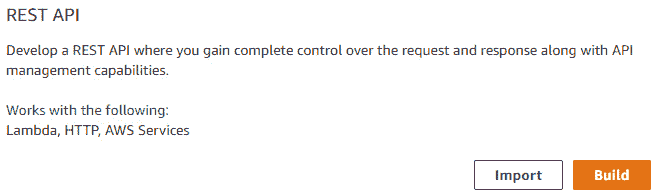

    图 8.3–构建 API

3.  Now you'll need to configure the API. Make sure that you choose **REST** and **New API**. You'll need to provide input for **API name**. For this example, we have called the API **PentestPacktAWS**. You may call your API whatever you like, but ensure that you remember the name. Giving a description is optional, but is good practice, especially when you start building out more APIs – it will help you remember the purpose of each API:

    

    图 8.4–命名 API

4.  输入完所有信息后，点击**创建 API**完成。

单击**创建 API**后，系统将向您介绍 API 的主仪表板。在本章后面我们将在这里配置 API。现在，请随意熟悉面板。

现在，我们已经了解了如何创建 API，接下来的逻辑步骤是了解我们将用于评估 API 的工具。本章的下一节将重点介绍一个名为 Burp Suite 的流行 web 工具。

# 打嗝套装入门

本章的这一部分将讨论我们在本书中尚未使用的工具。我们将使用的工具是一个代理工具，它允许我们在 web 应用程序上执行安全测试，在我们的情况下，它将使我们能够拦截发送到 AWS API 目标的请求。这意味着 Burp 套件将使我们能够完全控制通过 web 浏览器发送的请求，从而使我们能够处理 API 之间的调用。

重要提示

代理是一个服务器或服务，在将流量发送到我们的目标之前对其进行检查和分析。

拦截对 API 的调用和来自 API 的调用使我们能够看到一些参数，如令牌、会话和其他属性，这些参数可能会被更改，以使 API 接受不应该接受的调用。这是 bug 赏金猎人和 web 应用程序渗透测试人员使用的一种相当常见的技术。

重要提示

bug 赏金猎人是一名自由职业的渗透测试人员，他与公司合作，在网站上测试他们的应用程序是否存在 bug。这些 bug 是通过第三方服务（称为 bug 赏金计划）报告的。了解更多关于臭虫赏金计划的信息请点击这里：[https://whatis.techtarget.com/definition/bug-bounty-program](https://whatis.techtarget.com/definition/bug-bounty-program) 。

在下一节中，我们将登录到本地的 Kali Linux 机器，启动 Burp 套件，并将其配置到 web 浏览器。一旦我们设置好了，我们将拦截一些不同的请求并检查各种 web 请求，以了解更多关于如何使用该工具的信息。

## 配置打嗝套件

既然我们对打嗝套件有了更多的了解，让我们继续实际动手，并开始使用该应用程序。在开始之前，您需要在 VirtualBox 中启动本地 Kali Linux 机器。机器启动并运行后，登录到 Kali Linux 机器。

登录后，使用以下步骤启动并运行 Burp Suite：

1.  启动一个终端并键入**Burpusuite**。
2.  Once Burp Suite is open, you'll need to select **Temporary Project**:

    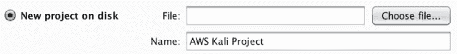

    图 8.5——新打嗝项目

3.  Select **Use Burp defaults**:

    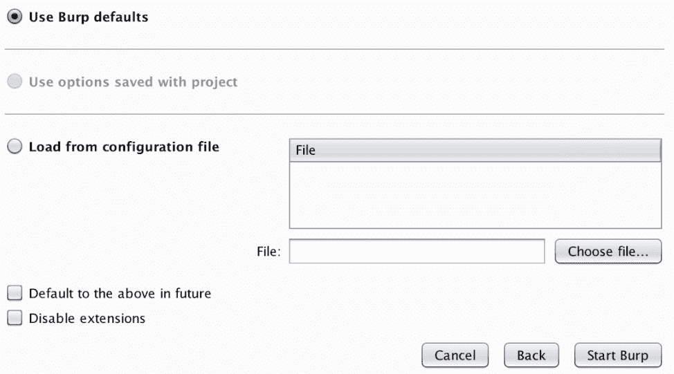

    图 8.6–使用打嗝默认值

4.  Next, go to the **Proxy** tab and find the **Options** section:

    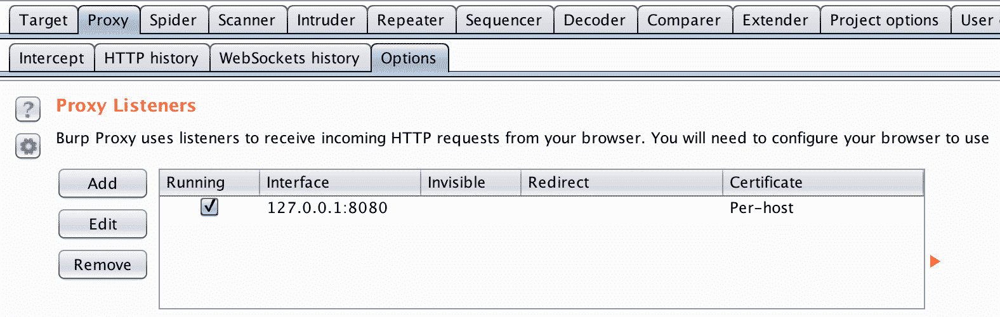

    图 8.7–配置接口

5.  您需要确保您的接口配置为您的本地地址**127.0.0.1**，并且端口设置为**8080**。Burp Suite 在默认情况下配置了此选项，但是，如果可能不是这样，您可以配置 Burp Suite 以满足上一个屏幕截图的规范。

太好了，现在我们已经设置了 Burp 套件以绑定到端口**8080**上的本地主机。这意味着任何通过本地主机发送到**8080**端口的流量都会被 Burp 套件捕获。

我们还没有完成，现在我们需要配置浏览器，以便在指定端口上通过本地主机推送流量。

要开始，请在 Kali Linux 机器中打开 Firefox：

1.  打开一个终端，键入**firefox**并点击**进入**。
2.  Next, click the options in the top right of the browser and select **Preferences**:

    

    图 8.8–浏览器配置

3.  Next, type **proxy** in the search bar of the **Preferences** section. Click **Settings…** to continue:

    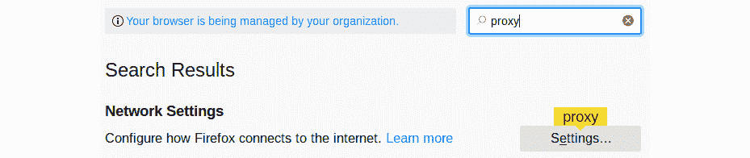

    图 8.9–配置 web 代理

4.  确保选择了**手动代理配置**，将**HTTP 代理**设置为本地主机地址，端口号配置为**8080**。确保选择了**将此代理服务器用于所有协议**。这将允许加密的流量也通过。完成后点击**确定**：

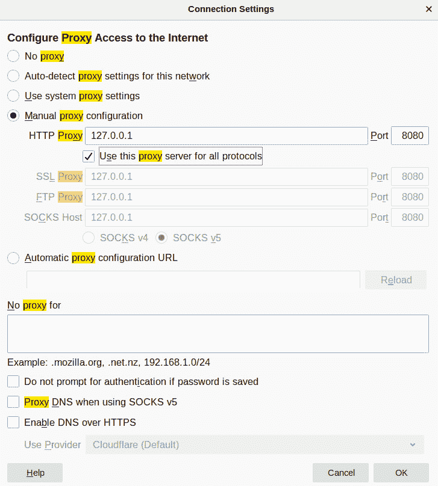

图 8.10–设置代理服务器的参数

很好，您已经成功地将浏览器配置为与 Burp Suite 一起使用。从这里开始，我们将在本章的其余部分使用 Burp 套件拦截 web 请求。但是，在开始之前，我们需要在浏览器上安装 Burp Suite 证书。重要的是，我们有能力拦截流量，以便我们可以通过浏览器看到通过 web 服务协议的未加密和加密流量。

要安装 Burp 套件证书，请执行以下步骤：

1.  With Burp Suite running and configured, type the following web address in your browser:

    [http://burp](http://burp)

2.  You'll see in the top-right corner a banner that says **CA Certificate**. Click on it:

    

    图 8.11–打嗝证书

3.  保存文件。
4.  Go back to the **Preferences** section of your browser and search the keyword **certificates**. Click **View Certificates…**:

    

    图 8.12–查看证书

5.  Next, you'll be prompted with the **Certificate Manager**. Here, you'll need to import the certificate we just downloaded from Burp Suite. To do this, click **Import…**:

    

    图 8.13–导入证书

6.  导入我们刚刚下载的**cacert.der**文件。
7.  选中**信任此 CA 识别网站**和**信任此 CA 识别电子邮件用户**。完成后点击**确定**：

图 8.14–继续导入证书

就这样！现在我们正式准备拦截一些网络请求！接下来，在本书中或现实生活中使用 Burp Suite 时，请确保在使用代理之前将其打开，在使用后将其关闭！如果不关闭代理，则在使用 web 浏览器时可能会遇到一些问题。

重要提示

如果您的 Burp Suite 应用程序仍有问题，请查看帮助指南以了解常见问题的解决方法：[https://portswigger.net/burp/documentation/desktop/getting-started/proxy-troubleshooting](https://portswigger.net/burp/documentation/desktop/getting-started/proxy-troubleshooting) 。

# 使用打嗝套件检查交通

接下来的部分将介绍如何检查我们刚刚创建的 REST API 之间的通信量。使用 Burp 套件检查流量对于网络测试和 web 应用程序渗透测试至关重要，因为它允许我们查看特定连接上的所有通信。虽然我们不会担心网络拦截，但我们将使用许多与 web 应用程序渗透测试相同的技术。

在我们开始检查交通之前，我们需要确保在开始之前进行一些快速整理。我们需要确保我们也部署了 AWSAPI 网关，以便我们能够了解如何拦截来自 RESTAPI 的流量。

## 部署 API 网关

要开始，请重新登录 AWS 控制台并转到我们在本章开头创建的 API：

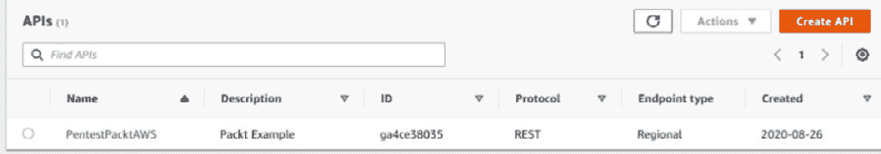

图 8.15–选择我们的 API

单击 API 访问网关以开始。

进入 AWS API 的主配置屏幕后，需要选择**操作**。这将下拉一个菜单，其中包含创建方法、删除 API 以及最重要的创建方法和部署 API 的选项。以下步骤将帮助您完成 API 的部署：

1.  Click **Actions**:

    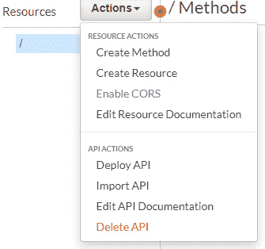

    图 8.16–选择行动

2.  选择**创建方法**。
3.  选择**任意**作为动作。
4.  Select **Mock** as the integration type:

    

    图 8.17–创建模拟方法

5.  点击**保存**。

很好，我们现在有了一个可以用来调用 API 的方法。现在我们有了一个方法，我们可以继续部署 API 并使其可访问。接下来的步骤将帮助我们部署 API：

1.  点击**动作**。
2.  Next, select **Deploy API**:

    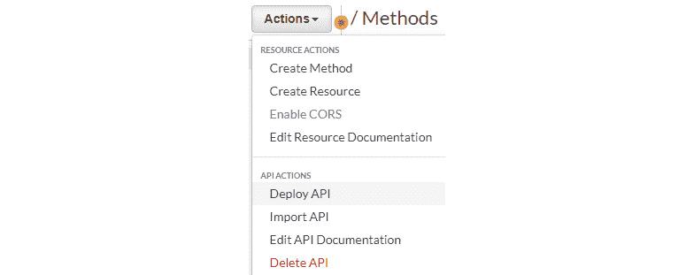

    图 8.18–部署 API

3.  为**部署阶段**选择**【新阶段】**。
4.  For the stage name, use **prod**:

    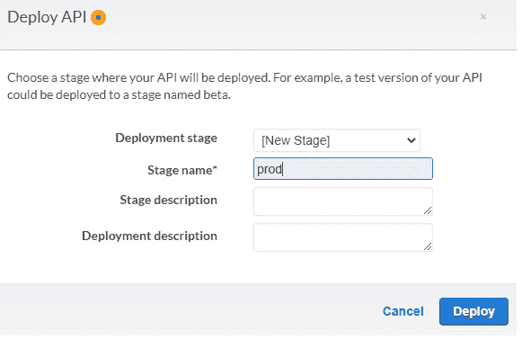

    图 8.19–配置阶段名称

5.  To finish, click **Deploy**.

    在您点击**部署**后，您会注意到 AWS API 仪表板顶部会有一个横幅。横幅上会显示**调用 URL**。您应该看到一个 web 地址，其外观如以下屏幕截图所示：

图 8.20–API 横幅

该网址是新部署的 AWSAPI 的网址，我们将在下一节中使用它来测试拦截流量。知道您的 API 地址将不同于本例中的 web 地址。

接下来，让我们继续在新部署的 AWSAPI 上拦截一些流量。

## 拦截 API 调用变得实用

现在来点有趣的，动手的东西。现在我们将从客房管理部分开始，进行一些动手练习，帮助您使用打嗝套件。继续之前，请确保已将 Burp 套件和浏览器配置为拦截 web 流量。如果您需要复习，请参阅*配置打嗝套件*部分。

在正确配置了 Burp 套件和 web 浏览器之后，让我们开始：

1.  打开浏览器，将 API URL 放入地址栏，点击*输入*。查看上一节中的*步骤 5*，了解如何**调用 URL**的提示。
2.  Your Burp Suite application should come up with an **Intercept** window:

    

    图 8.21–GET 请求

3.  这里发生的是我们正在拦截主机和服务器之间的调用。注意**GET**参数后接**/prod**。这意味着我们正在尝试检索**prod**目录。
4.  To continue, click **Forward** to push the request to the server:

    

    图 8.22–转发请求后的 Web 浏览器

5.  正如你所看到的，我们有一个空白屏幕-这是完全好的。因为页面呈现为空白，并且没有**未找到**横幅，我们知道 URL 是有效的。

我们现在已经成功截获了主机和 AWS API 之间的数据包。虽然这看起来很基本，但在开始处理 API 和主机之间的调用之前，我们必须了解 Burp 套件拦截 web 流量的基本知识。如果我们忽略了如何设置环境和理解基本拦截，那么我们就无法真正理解正在发生的确切过程。

接下来，我们将继续本章的最后一节。我们将学习更多关于 HTTP 方法的知识，并通过构建到目前为止所学的知识来学习如何操作 API 调用。

# 操纵 API 调用

在开始之前，我们需要了解可以用来操纵 API 调用的基本 HTTP 方法。HTTP 请求方法本质上是您希望在目标 API 上执行的操作。这些方法通常被称为 HTTP 谓词，它们允许我们从目标资源中放置数据和检索数据或信息。下一节将简要介绍这些方法。

**GET**方法从特定地址请求资源。使用**GET**的请求只应检索数据。**HEAD**方法请求一个等于**GET**请求的确认，但没有确认主体。**删除**方法用于删除指定的资源。**POST**方法用于向目标资源提交数据–通常，您会看到**POST**方法用于发布数据并引发问题。**PUT**方法用于将数据放入目标服务器。

现在我们了解了什么是 HTTP 方法以及它们是如何工作的，让我们来看看它们的作用。对于下一个示例，我们将运行一个练习，在该练习中，我们操纵对易受攻击的 S3API 的调用。如果您需要关于创建 S3 存储桶的复习，请参考[*第 4 章*](04.html#_idTextAnchor171)*，利用 S3 存储桶*。

重要提示

要了解更多有关为 S3 创建 API 的信息，请参考此资源：[https://aws.amazon.com/s3/features/access-points/](https://aws.amazon.com/s3/features/access-points/) 。您需要创建一个包含您自己的测试文件夹的 bucket 来执行下一个练习。

## 改变 HTTP 方法的乐趣

在下一节中，我们将通过 AWS API 以 S3 bucket 为目标。铲斗位于[位置 https://awspublicpackt.s3.amazonaws.com/](https://awspublicpackt.s3.amazonaws.com/) 。让我们继续在 Burp Suite 中拦截它：

1.  With Burp Suite and your browser configured to intercept web traffic, input the address in your URL bar:

    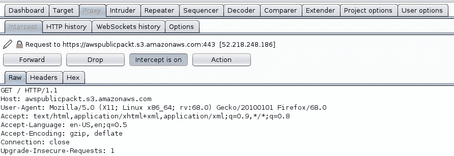

    图 8.23–打嗝请求

2.  As you can see, we are intercepting the API call based on the **host** parameter. We are using the **GET** method, meaning we are retrieving the resources. Click **Forward** to continue:

    

    图 8.24–查看铲斗对象和钥匙

3.  As you can see, there is a directory called **test**. Also, if you look closer, you will see that there is an object within the directory called **TestAPI.txt**. Next, let's move forward and intercept the **test** directory and see whether we can view the text file:

    

    图 8.25–检索 TestAPI.txt

4.  Click **Forward**:

    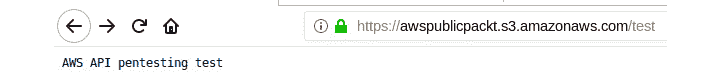

    图 8.26–TestAPI.txt 的输出

5.  Notice that the contents of the text file are being displayed. This means we have read access. Next, let's see whether we can place an object in the bucket by manipulating the API. Let's use the **PUT** method to place the **HackedAPI.txt** test file into the **test** directory. The next screenshot illustrates placing the file and inserting the **i love pentesting** data into the text file:

    

    图 8.27–通过操纵 API 调用放置数据

6.  Now, to confirm we have placed data on the target, we can use the **curl** command in our Terminal to check and see whether the data was stored. We use the following command to validate that the data was put in the S3 bucket:

    **$curlhttps://awspublicpackt.s3.amazonaws.com/test/Hacked.txt**

    我们看到以下输出：

    

    图 8.28–成功上传数据

7.  如我们所见，通过在 API 中操纵调用，成功地将数据放入 S3 存储桶。接下来，让我们看看是否可以删除**/测试**合法资源。

如您所见，我们能够通过操纵 HTTP 请求中的方法来操纵主机和资源之间的调用。根据我们刚才做的练习，我们能够通过操纵 HTTP 调用来读写数据到资源中。这是非常危险的，因为攻击者可能会留下恶意软件或在发现时窃取敏感信息。正确的访问控制是至关重要的，以确保资源不会处于不安全状态。

现在，让我们继续前进，结束这一章，开始看本书下一部分的标题，[*第 9 章*](09.html#_idTextAnchor381)*、与 Metasploit 的现实生活 Pentesting 等等！*

# 总结

在本章中，我们了解了一些 web 流量和 web 请求，因为它们与 AWS 中的 API 和网关有关。我们学习了如何部署一个简单的 API 网关，还学习了如何使用一个重要的工具来评估 API 和网关—Burp 套件。我们进行了一个有趣的练习，演示了如何使用 Burp 套件操纵 HTTP 请求，并提到了让 API 易受攻击的危险。有了这些知识，您现在可以使用本章中学习的方法对基于 web 的应用程序和服务执行攻击和评估。

在下一章中，我们将通过应用更多的实际操作经验来进一步了解 AWS。这是本书中最长的一章，它将让你建立新的环境，并根据场景利用它们——最终，教你 AWS pentesting 的技术部分以及随之而来的过程。

# 进一步阅读

*   bug 赏金程序列表：[https://www.bugcrowd.com/bug-bounty-list/](https://www.bugcrowd.com/bug-bounty-list/)
*   WebSocket API:[https://docs.aws.amazon.com/apigateway/latest/developerguide/apigateway-websocket-api.html](https://docs.aws.amazon.com/apigateway/latest/developerguide/apigateway-websocket-api.html)
*   从轮询到推送：使用 Amazon API 网关 REST API 和 WebSocket 转换 API:[https://aws.amazon.com/blogs/compute/from-poll-to-push-transform-apis-using-amazon-api-gateway-rest-apis-and-websockets/](https://aws.amazon.com/blogs/compute/from-poll-to-push-transform-apis-using-amazon-api-gateway-rest-apis-and-websockets/)