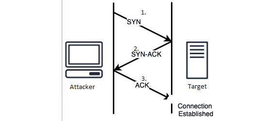
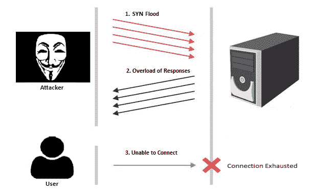

# 十一、摆脱麻烦

Pentesting 可能会对 AWS 系统造成干扰，如果执行不正确，也可能导致法律问题。在测试 AWS 时，了解 pentester 可以在 AWS 系统上执行什么和不能执行什么是至关重要的。这些类型的攻击会在 pentest 期间导致系统崩溃，破坏您的声誉，同时还可能破坏客户系统，并为 pentesting 公司和目标客户造成巨大的收入损失。

本章将讨论**拒绝服务**（**拒绝服务**）和洪水攻击，以及它们是如何工作的。了解这些攻击的工作原理说明了攻击的严重性以及我们应该远离它们的原因。

我们将通过讨论压力测试（有时也称为负载测试）来结束本章，并从较高的层次了解什么是压力测试以及客户是否应该担心。

本章将介绍以下主题：

*   禁止的活动
*   通过 DoS 耗尽服务
*   理解洪水
*   避免法律问题
*   压力测试

# 禁止的活动

当涉及到五旬斋时，了解哪些活动是允许的，哪些是不允许的是至关重要的。正如我们在本书中所述，这就是我们所说的*在*范围内和*在*范围外。当我们提到范围内的系统时，我们正在讨论我们可以测试什么，在什么时候测试，以及我们可以对范围内的主机产生多大的影响。然而，同样重要的是要知道什么超出了范围。了解哪些内容超出范围可确保您只测试客户的要求，并防止您和您的团队逃避任何类型的法律罚款或处罚

以下部分将讨论 AWS 针对其基础设施和服务规定的禁止活动。请记住，共享安全模型的一部分依赖于 AWS 及其硬件的正常运行时间，因此 AWS 在如何测试其产品方面有发言权

让我们继续讨论对 AWS 的禁止攻击——**DoS**和**洪水**。

## 通过 DoS 耗尽服务

DoS 和**分布式拒绝服务**（**DDoS**是针对各种系统的破坏性攻击，例如网站和应用程序，有时也可以针对用户。DoS 攻击会产生大量流量，目的是压倒目标，使其无法使用或使其离线。DDoS 攻击执行相同的攻击，只是它从多个受损或受控主机（称为僵尸网络）执行攻击，以攻击目标

重要提示

大量受控或受损主机通常被称为**僵尸网络**。AWS 在这里有一篇关于僵尸网络的更老但有趣的文章：[https://aws.amazon.com/security/security-bulletins/zeus-botnet-controller/](https://aws.amazon.com/security/security-bulletins/zeus-botnet-controller/) 。

DoS 和 DDoS 攻击将攻击**开放系统互连**（**OSI**模型的多层；然而，我们看到的更常见的攻击发生在**3**、**4**、**6**和**7**层。以下截图来自 AWS 网站，显示了各个层：

图 11.1–AWS 的图层

层**3**、**4**、**6**和**7**说明了破坏性攻击最突出的层，可以分为两个不同的层。将这些分组可以简化缓解过程，因为它允许我们将缓解技术应用于驻留在一个组中的多个层。我们将层连接到以下组中：

*   **基础设施层**（层**3**和**4**）
*   **应用层**（层**6**和**7**）

考虑到我们的团队，让我们讨论他们以及他们针对 AWS 的服务。

### 基础设施层攻击

基础设施层攻击重点攻击网络层**3**和传输层**4**。我们在 AWS 中看到的攻击该层的一些更常见的攻击涉及 SYN 洪泛和 UDP 洪泛，我们将在本章的*理解洪泛*部分进一步讨论这些攻击，它们旨在降低该层的服务。这需要中断通过 TCP、UDP 和 IP 在网络上建立的任何连接，例如与 AWS 环境中的其他节点建立连接

现在，让我们讨论下一层，应用层，并考虑它会对 AWS 造成什么影响。

### 应用层攻击

发生在应用层的攻击通常不太常见；然而，他们确实提出了自己的问题。虽然这些类型的 DoS 攻击可能会产生大量流量值，从而导致服务停机，但它们也可能很简单，例如更改文件、策略或允许访问和授权资源的另一种数据类型的完整性。在本书中，我们看到了通过更改 S3 策略或更改 EC2 实例上的 SSH 密钥来拒绝服务的攻击情况和方法

应用层攻击主要针对 AWS 时的 SSH 和 HTTP。这意味着，如果没有正确的安全或保护，API 和对 EC2 实例的访问可能会受到攻击。我们将在本章的*缓解洪水攻击和 DoS*部分进一步讨论保护和缓解措施。

现在我们已经了解了各层，让我们继续讨论洪水，以及在五旬节期间洪水意味着什么。

## 理解洪水

洪泛是一种简单但有效的策略，恶意和好奇的用户通过向目标主机发送超负荷的数据包，以期压倒主机。洪水的另一部分使其**变得简单**是，它通过洪水淹没网络中的每条路径，或者在我们的**VPC**和云环境中，使用到目标的最短路径。这意味着当洪水攻击发生时，它们可能会影响该目标之外的其他主机，因为洪水**会向其他节点喷射**以找到最短路径

此外，泛洪攻击是 DoS 攻击中的常见技术。DoS 攻击的任务是淹没和淹没网络、系统或环境，使其可用性中断，服务中断。

现在，让我们来介绍一些洪泛技术，以及几种类型的拒绝服务攻击

### UDP 泛洪

端口泛洪涉及一种攻击，以系统端口为目标，使用**用户数据协议**（**UDP**数据包对其进行溢出。因为 UDP 数据包是无连接的，所以它们可以以不需要目标主机建立任何连接的方式发送，这与三向**传输控制协议**（**TCP**握手不同。当目标发送大量 UDP 数据包时，它可能会不知所措并离线。如果目标主机脱机，则会向我们发送一条消息，说明**目的地无法到达**

### 讨论 SYN 洪水和 TCP 握手

SYN 洪水，或 TCP SYN 洪水，是一种 DoS 攻击，通过发送 SYN 请求过载而不接受目标发送的 ACK 请求，利用三方 TCP 握手。本质上，这会让目标等待攻击者的响应，同时处理来自该攻击者机器的大量 SYN 请求

为了更好地理解 synflood，我们需要了解 TCP 握手及其工作原理。以下步骤重点介绍了如何在两个节点之间启动 TCP 握手的三个步骤，在我们的案例中，如果攻击者想要建立连接，则可能是目标和攻击者：

1.  攻击者计算机向该目标发送 SYN 消息以请求与该目标的连接。
2.  目标将 SYN-ACK 请求发送回攻击者机器并确认该请求
3.  攻击者计算机会以 ACK 消息进行响应，并启动连接

下图说明了我们刚才提到的步骤，有助于直观了解 TCP 三方握手：

图 11.2–TCP 三方握手

现在我们了解了握手的工作原理，让我们讨论一下如何利用这种握手攻击我们的目标。以下步骤将强调如何执行 SYN 洪水：

1.  该攻击会引发 SYN 洪水。攻击者发送多个 SYN 请求，这些请求被发送到该目标服务器
2.  目标接收并响应过载的请求，而不接收来自攻击机器的 ACK 响应。在尝试从攻击者计算机接收 ACK 时，目标计算机仍然会因来自攻击者计算机的 SYN 请求而过载
3.  该服务关闭，使该目标无法处理合法请求

下图说明了我们刚才在洪水方法中提到的三个步骤：

图 11.3–使用 DoS 滥用三方握手

正如我们所看到的，如果不正确缓解洪水攻击，它可能是危险的。停止服务意味着收入损失、声誉损失和员工信任的潜在损失。我们将在稍后进一步探讨这些原因；但是，请记住，虽然洪水是一种危险的攻击，但 AWS 中有一个极好的解决方案

既然我们从较高的层次了解了 DoS、DDoS 和洪水攻击，那么让我们谈谈我们如何减少这些攻击的发生。这就是我们建议客户如何保护其系统免受破坏性攻击的建议。

#### 缓解洪水袭击和 DoS

对洪水以及如何缓解洪水最基本的理解是，大多数操作系统，如 Windows，将限制 ICMP 响应并过滤掉过载的请求。您还可以使用更传统的方法和防火墙解决方案来帮助缓解这些攻击。AWS 提供了一项名为**AWS 防火墙**的服务，该服务充当**Web 应用程序防火墙**（**WAF**），可用于过滤 AWS 环境和 API 的流量，并防止针对 Web 应用程序的常见漏洞攻击

还有另一项服务被称为**AWS Shield**，它有助于防止针对 AWS 中运行的任何应用程序的 DoS 和 DDoS 攻击。两层服务提供实时检测和缓解措施，防止发送到应用程序的过载流量实际造成任何损害——这非常棒，因为 AWS Shield 基本上完成了所有繁重的工作，并且不需要任何额外的 AWS 支持

那么，AWS 屏蔽究竟是如何工作的呢？为什么建议使用它来防止任何类型的 DoS 攻击呢

简单地说，AWS Shield 创建并提供基于启发式的实时监控和内联缓解。这意味着 AWS Shield 使用先进的监控技术，在基于常规流量的环境中创建基线，并且它将报告任何偏离该流量的情况。此外，它还将对常见和更频繁的攻击（如 DoS 和洪水攻击）执行实时缓解。它还将提供更具体的检测和高级缓解技术，帮助阻止更高级的攻击方式，如 DDoS 攻击

您可以在此处了解更多关于 AWS 防护以及它如何帮助您实施缓解策略的信息：[https://aws.amazon.com/shield/](https://aws.amazon.com/shield/) 。

另一种减轻破坏性攻击的方法是减少 AWS 环境的攻击面。这意味着确保 EC2 实例不公开，除非它们需要基于业务原因。应用程序对互联网的接触越少，就越不容易被发现和攻击。我们还可以通过在环境中放置**负载平衡器**来帮助扩展环境将承担的负载。下图显示了负载平衡器如何在四个不同节点之间获取负载，并根据当时能够处理的流量类型在四个节点之间分配负载：

图 11.4–AWS 内的负载平衡

如您所见，负载平衡器不是每个节点自己处理流量，而是根据每个节点可以处理的流量分配流量

最后要提到的一件事，也是非常重要的一件事，是您培训了 AWS 工程师，他们能够安全有效地在环境中实施安全控制。工程师实施这些控制的最佳方式是理解和了解环境中的正常流量和异常流量。这就是为什么文化不仅在 AWS 中而且在企业本身中都是安全的重要组成部分

虽然文化是一个巨大的影响因素，但了解内部人员可能会产生影响以及他们恶意的黑客心态如何在组织内引发问题也很重要。下一节将讨论与 DoS 和 DDoS 攻击相关的黑客心态。

#### DoS 和 DDoS 的攻击者心态

攻击者对受害者目标执行破坏性攻击的原因有很多。在这种情况下，威胁行动将是 DoS 或 DDoS 攻击，这看起来会直接造成损害公司声誉的滋扰，或者如果政治分支机构拥有 AWS 系统，则多次被用于创建政治状态

我们在[*第 3 章*](03.html#_idTextAnchor098)*中提到了探索 Pentesting 和 AWS*的一些不同类型的攻击者，例如内部人和外部人。这些相同的攻击者心态可以应用于执行 DoS 和洪水攻击的原因。

既然我们对需要远离的攻击有了更多的了解，那么让我们结束这一章，讨论一下如果超出 pentest 的范围，您可能会面临的一些法律问题

# 避免法律问题

正如我们在本书中所看到的一样，如果您的团队不完全了解 pentest 范围内的内容，pentesting 可能会非常具有侵入性，有时甚至会非常危险，并可能导致罚款，甚至根据**计算机欺诈和滥用法**（**CFAA）被视为非法行为**）根据 pentest 团队测试的人员和内容，您也可能违反其他法律，如联邦和州法律；然而，这取决于每个 pentest

这一切都在说，让我们来看看我们如何能避免法律和我们的客户的麻烦。

## 出狱免费卡

这是最重要的基本因素之一，可以确保你在五旬斋期间避免任何法律冲突。免出狱卡本质上是一张纸，表明 pentest 团队有权对目标组织进行 pentest–但是，它还应该注明**什么**、**在哪里**、以及**何时**允许 pentest 团队进行 pentest。这一点非常重要，因为由于高价值的交通时间，戊酯在某些时间内可能无法进行戊酯测试；对于 AWS 环境中承载的网络或 web 应用程序的某些 pentest 区域，它们也可能未经授权

在目标组织向 pentest 团队发放免出狱卡之前，需要清楚地了解范围。如果需要添加或删除 pentest 范围内的内容，则应将其更正并列在免出狱卡上

## 潜在损害

这是一个我们很多人都不喜欢讨论的话题，或者至少是一个让人感到非常不安的话题：在五旬斋期间，系统可能被破坏或破坏的可能性。当要求对一个生产或现场系统进行最大限度的测试时，这尤其具有挑战性，如果该系统崩溃，将导致巨大的收入损失。pentest 团队和客户组织必须在发生停机的不幸情况下制定应急响应计划。此外，还应该有一个变通方法来创建一个模拟生产环境的测试系统

在 pentest AWS 时，我们可以建议客户创建一个单独的私有 VPC，模拟生产环境，只允许访问 pentest 团队。这样做可以让 pentest 团队实时测试系统，而不会对实时系统造成任何伤害

## 了解数据分类

我们想知道 pentest 期间环境中存储了什么类型的数据。如果有信用卡数据、社会保险号码和其他敏感数据，则需要有一份声明，说明在 pentest 期间可能会看到这些数据。当然，如果敏感数据在需要加密时以明文形式被发现，那么 pentest 团队需要立即通知他们的客户

在这一章中，我们学到了很多关于有影响力的攻击以及法律问题的知识。现在，让我们再讨论一个我们需要了解和注意的问题——压力测试。

# 压力测试

亚马逊的客户计划使用某种类型的高容量测试来测试其系统、网络和产品的可靠性和耐久性，这是围绕这些客户制定的政策。在这种情况下，客户通常希望确保托管在 EC2 实例上的 web 服务器能够承受大量流量。压力测试有时也被称为负载测试或游戏性测试，它还可以确保如果流量对 web 服务器来说太大，那么流量就会被负载平衡器重定向。负载平衡的高级视图请参见*图 11.4*。

## 为什么要进行压力测试？

如前所述，我们执行压力测试，以确保目标环境能够在系统生产过程中承受预期的高流量。

重要提示

生产服务器通常可以在 web 上访问，并确保来自合法和非合法来源的大量流量。

负载测试或压力测试本质上是一种保证策略，让您可以放心地了解 AWS 环境的可用性—确保您的站点或应用程序不会宕机！如果某件事情，特别是在生产方面，出现问题，可能会导致收入损失、公司与其客户之间的信任损失，或者员工与公司之间的信任关系损失。

现在我们了解了压力测试的影响——从某种意义上说，我们也了解了压力测试（如果不应用）的含义——让我们讨论一下如何在 AWS 环境中完成压力测试。

## 授权压力测试

为了获得授权在您的 AWS 环境中执行压力测试，您需要向 AWS 提交一份录取表。虽然大多数客户网络不在指导原则范围内，但检查而不是不检查是非常重要的——毕竟，不要对您的环境进行压力测试可能会在以后导致更严重的问题！

虽然 AWS 在提供资源以防止与高流量流量的不利影响相关的任何问题方面做得很好，但客户可以向 AWS 员工发送电子邮件，以确定他们的网络是否应进行负载测试，以及测试应施加多少负载。

如果相关，客户应将查询发送至**aws 安全模拟-event@amazon.com**。收到电子邮件确认后，需要在接收表上填写客户对其网络的担忧，并且必须授权 AWS 评估其环境，以分析是否需要进行压力测试。

压力测试的同意将基于风险和相关系统的影响。建议客户说明潜在的高流量流量可能对实时系统产生的影响。如果授权进行压力测试，建议在生产系统未通过负载测试的情况下准备好部署备份站点。负载测试失败的生产系统会导致系统脱机，客户无法访问。

拥有一致备份的另一个好方法是在内部网络上建立生产系统的利用模型或测试模型。此实时系统的副本可用于测试新功能，并在外部和内部 pentest 期间作为目标，而不是针对生产站点。如果生产现场的测试系统不可用，强烈建议使用一个！

现在我们了解了更多关于压力测试的内容，以及如何使用它来评估我们自己的系统，让我们开始结束本章，并开始进入下一章。

# 总结

在本章中，我们讨论了 pentest 期间应注意的事项，并了解了 DoS、DDoS 和洪水攻击的更多细节。正如我们所了解的，这些攻击可能影响极大，并且是针对 AWS 策略进行的。我们还学习了如何避免法律问题，以及如何缓解在测试期间可能出现的任何潜在法律问题。在本章的最后，我们讨论了压力测试以及 AWS 客户可以做些什么，以了解他们的环境是否应该接受负载平衡测试。

在下一章，也是最后一章中，我们将探讨一些其他项目，我们可以使用这些项目来帮助加强我们的 AWS 方法。

# 进一步阅读

*   AWS pentesting:[https://aws.amazon.com/security/penetration-testing/](https://aws.amazon.com/security/penetration-testing/)
*   什么是 DDoS 和 DoS？[https://aws.amazon.com/shield/ddos-attack-protection/](https://aws.amazon.com/shield/ddos-attack-protection/)
*   压力测试：[https://aws.amazon.com/ec2/testing/](https://aws.amazon.com/ec2/testing/)