# 六、创建外部攻击架构

在本章中，我们将构建一个外部体系结构，在攻击的不同阶段进行时使用该体系结构。我们将在本章中讨论以下主题：

*   建立分层体系结构
*   配置防火墙体系结构
*   部署 IDS/IP 和负载平衡器
*   集成 web 应用防火墙

本章将为我们提供一个外部攻击体系结构，该体系结构将提供模拟多种不同测试环境的能力。在本章中，我们将完成配置范围核心设备的过程，这些设备是路由器、交换机和防火墙机器等体系结构的连接设备。因此，我们可以轻松地构建目标机器或设备，并将其插入到我们的体系结构中，然后立即开始测试。

# 建立分层架构

我们在这里的意图是提供一些层，作为一个外部定位的攻击者，我们可能必须穿透这些层才能到达目标。这是外部测试的现实；许多目标将在攻击者和目标之间设置多重保护。幸运的是，由于这些机器需要允许从外部访问服务，因此在我们进行测试时，它们也将为我们提供访问权限。

我们将构建我们的网络架构，以提供如下图所示的层：

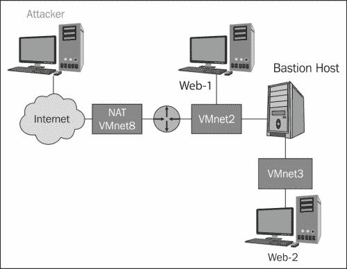

当我们回顾架构时，我们看到我们在原始设计中添加了一个 web 服务器和一个 Bastion 主机，并且一个路由器连接到了 VMnet8 和 VMNet2 交换机。如[第 4 章](04.html "Chapter 4. Identifying Range Architecture")、*识别射程架构*所述，这是我们计划架构的力量；我们只要在任何我们想测试的地方插入机器。在上图所示的体系结构中，我们有一个用于测试的路由器设备。正如我们在[第 3 章](03.html "Chapter 3. Planning a Range")*规划范围*中提到的，我们在本书中使用的是 Dynamicps Cisco 软件模拟器，我们需要对此进行配置以允许我们的服务。如果您使用的是**iptables**选项，则必须配置该设备以支持您的体系结构的服务。

第一步是在 VMware Workstation 中启动路由器设备。机器完成引导后，使用您在安装软件期间创建的用户名和密码登录。输入`dynamips –H 7200`启动路由器。一旦启动，您需要通过打开另一个终端窗口并输入`dynagen config.net`来加载配置文件。配置加载后，进入 R10 控制台并访问正在运行的路由器。在路由器提示下，输入`en`进入路由器上的特权模式。

此时，我们接下来进入`show ip int brief`显示路由器接口的配置；您的输出应该与以下屏幕截图中显示的类似：

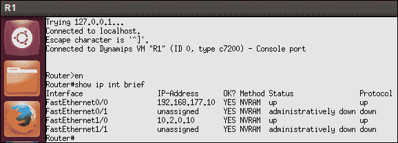

正如前面的截图所示，我们在路由器中有两个接口，显示**状态**为**up**和**协议**也为**up**，这就是我们想要的。如果您的路由器屏幕上没有显示此信息，您必须返回到我们在[第 4 章](04.html "Chapter 4. Identifying Range Architecture")*识别范围架构*中使用的流程，以查看出现了什么问题。希望您至少能看到 IP 地址信息是正确的。如果是这种情况，那么可能只是打开界面的问题，通过在界面配置菜单中输入`no shut`来完成。要打开该界面，请输入以下命令：

```
conf t
int <interface name eg: f0/0>
no shut

```

如果您没有正确的地址信息，那么您可能没有保存我们在[第 4 章](04.html "Chapter 4. Identifying Range Architecture")、*标识范围架构*中创建的配置，因此您必须返回到该章并继续执行步骤以获得上一屏幕截图中显示的结果。

### 提示

我们现在的架构中有一个路由器，虽然我们可能会遇到一个没有过滤的路由器，但我们很可能不会那么幸运；因此，我们需要在路由器设备上设置过滤。这肯定是我们想要添加的内容，但现在，我们将构建网络，并确保在应用过滤之前它能正常工作。这样我们就可以根据需要进行故障排除，而不必处理过滤问题。

由于我们有一个路由器，我们需要添加一个目标机器并连接我们的架构；我们将通过在我们的架构中添加一个 web 服务器来实现这一点。我们的目的是在第一级创建网络，如下图所示：


我们可以继续为我们的体系结构构建更多的层，但更好的设计方法是在进入下一层之前测试每一层。当我们回顾前面的图表时，我们有三台机器是体系结构的组件。我们现在想添加这些机器并进行测试。路由器已启动并正在运行，因此我们需要启动两台机器。下一台机器是攻击者。正如我们在[第 4 章](04.html "Chapter 4. Identifying Range Architecture")*识别范围架构*中所做的那样，我们将使用 Kali Linux 分发机。首选机器是我们以 VM 格式下载的机器。VM 的配置如以下屏幕截图所示：


我们要确保的主要事情是我们有一个网卡连接到 VMnet8（NAT）交换机，在这种情况下，我们确实有。一旦我们验证了网络适配器，我们就可以启动虚拟机了。机器启动后，使用您创建的用户名和密码登录，如果未更改密码，则使用默认值登录。无论何时启动 Kali 虚拟机，更新发行版都是一个好主意。但是，在执行此操作之前，请始终拍摄快照，以防在更新过程中出现问题。导航至**VM****快照****拍摄快照**。在打开的窗口中，输入快照的名称，然后单击**拍摄快照**。拍摄快照后，通过输入以下命令更新分发：

```
apt-get update
apt-get dist-upgrade

```

升级完成后，下一步要做的是测试与路由器的连接。在 Kali 上，输入`ping 192.168.177.10 –c 5`，如果一切顺利，您应该会看到回复，如下图所示：


既然我们有了连接，我们就可以添加我们的下一台机器，这就是我们的 web 服务器。正如我们在[第 4 章](04.html "Chapter 4. Identifying Range Architecture")*识别范围架构*中提到的，我们在添加 web 服务器时有很多选择，这确实是个人偏好的问题。正如我们所知，我们将在体系结构中有两个 web 服务器；我们可以为第二台机器选择与第一台机器不同的 web 服务器。对于本书中的第一个 web 服务器，我们将从 OWASP 和 Mandiant 中选择**已损坏的 web 应用 VM**。由于这将连接到 DMZ 交换机，我们只需确保网络适配器连接到 VMnet2 交换机。

以下屏幕截图显示了此配置的示例：

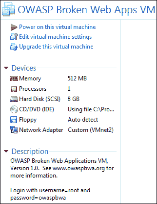

一旦配置被验证，我们接下来要做的就是启动虚拟机。机器启动后，您将注意到分配给 VM 的 IP 地址。现在我们已经启动并运行了这台机器，我们想要验证我们是否可以访问它。我们有两个选择。我们可以使用简单的 ping，也可以使用应用层并通过浏览器进行连接。为此，我们将使用浏览器。在写这本书的时候，我们的机器被分配了`10.2.0.132`的 IP 地址，所以我们打开浏览器访问该 IP 地址。以下屏幕截图显示了一个示例：


以地址 10.2.0.132 打开时显示浏览器的屏幕（剪切的文本不重要）

怎么搞的？为什么我们无法连接？在构建虚拟环境时，这实际上是一个非常常见的问题，但在揭示原因之前，我们将按照逻辑顺序进行步骤。接下来，我们将尝试从路由器 ping 它。选择您的 Dynamips 机器，并在路由器窗口中输入 ping`10.2.0.132`以验证您可以在平面网络上访问该机器。下面的屏幕截图显示了一个示例。您的 IP 地址可能不同，在这种情况下，您将使用分配的 IP 地址。


这表明我们在平坦的情况下有连通性，我们也知道我们可以通过我们之前的测试 ping 路由器外部接口；那么，下一步是什么？我们想看看通往目标的路径。因此，在您的主机上打开命令提示符并输入`tracert 10.2.0.132`。以下屏幕截图显示了此命令的输出示例：

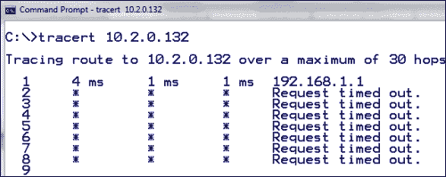

问题的关键在于，在第一跳时，网关应该指向路由器接口；但是，它当前指向机器所连接的无线路由器。这在我们构建架构时非常常见；此外，当我们执行诸如旋转之类的技术时，我们必须设置路由以便能够访问目标。我们可以更改默认网关，但这是最没有吸引力的选项，因为我们使用它从 NAT 接口将流量输出到 Internet。因此，更好的选择是手动添加路线。当我们想要通过网络进行通信时，所有机器都需要这样做。用于添加路由的语法在不同的操作系统中会有所不同。我们将首先在主机 Windows 计算机中添加路由。打开管理员命令提示符，在命令提示符中输入`route add 10.2.0.0 mask 255.255.255.0 192.168.177.10 metric 2`，然后进行测试。以下屏幕截图显示了一个示例：


等一下！为什么它不起作用？这是建筑环境过程的一部分；我们喜欢说挫折是好的，因为这是你学习的时候。一旦你陷入困境，退一步想想，然后再努力。在前面的图像中，我们看到通信量正朝着正确的方向发展，也就是说，朝向路由器接口；然而，在那一跳之后，它没有报告任何事情。这是你必须记住的另一件常见的事情。我们已经在主机上添加了路由，但是我们没有在目标上添加路由，这是必需的；我们必须在网络会话的两侧配置路由。

选择坏掉的 web app**VM**，登录机器。登录后，我们将输入命令以添加路由。您可以输入`man route`并查看主页，以确定添加路由所需的语法。输入`route add –net 192.168.177.0 netmask 255.255.255.0 dev eth0`并将路线添加到机器。返回主机并测试配置。

测试后的示例如以下屏幕截图所示：

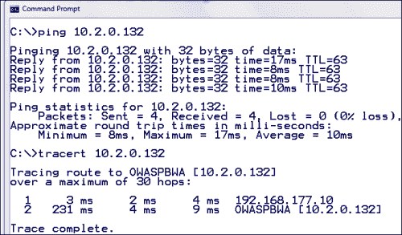

现在，我们在第一层中实现了连接性。我们还需要将路线添加到我们的攻击机器中。幸运的是，语法是相同的；情况并非总是如此，但这次确实如此。在您的 Kali 攻击者机器中，输入`route add –net 10.2.0.0 netmask 255.255.255.0 dev eth0`并通过 ping 目标测试配置；以下屏幕截图显示了成功测试的示例：

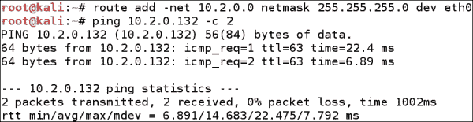

我们现在已经安装了防御基线的第一层，更重要的是，我们已经建立并运行了网络连接。我们的配置有一个问题，那就是路由。我们没有将路由设置为在重新启动后仍然有效。我们有很多方法可以做到这一点，但我们不会涵盖所有方法。Windows 中的一个选项是在路由语句中使用`batch`文件，然后根据需要运行它。在 Windows 中还有一个选项可以使用，这是 route 命令本身的`-p`选项。这会将路由设置为持久路由，执行此操作时，会将路由添加到注册表中。此路由的位置插入注册表中的`HKEY_LOCAL_MACHINE\SYSTEM\CurrentControlSet\Services\Tcpip \Parameters\PersistentRoutes`键。出于我们的目的，我们不需要使路由持久化，但这只是一种选择，这就是我们讨论它的原因。

接下来，我们将配置第二层；这需要我们将 web 服务器连接到我们在[第 3 章](03.html "Chapter 3. Planning a Range")、*规划范围*中在 Bastion 主机上设置的橙色或 eth2 接口。为了进一步完成第二层，我们必须在连接机器后添加路由。第二层的示例如下图所示：

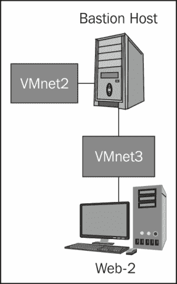

如上图所示，我们需要为连接到**VMnet3**交换机的第二层构建另一个 web 服务器。这将作为一个独立的服务子网体系结构，路由器和堡垒主机将对其进行屏蔽，从而形成一个两层防御体系结构。

我们可以使用与第一层防御体系结构相同的平台，但我们希望在构建外部环境时使用各种机器；因此，我们将使用另一台机器。我们已经从 Rapid7 下载了 metasploitable 虚拟机，因此我们将使用它作为第二个 web 服务器。我们只需要将其配置为符合第二层防御的要求。

以下屏幕截图显示了配置示例：


我们现在为子网设置了机器；因此，是时候启动所有机器并测试它了！一旦机器启动，您将测试连接性；最简单的方法是从 Bastion 主机虚拟机进行测试。出于测试目的，我们将启动 Kali、路由器、堡垒主机和 metasploitable。我们将在 metasploitable 启动时注意它的 IP 地址。由于我们已经使用 DHCP 服务器设置了 VMnet3，因此应该在引导时自动分配地址。登录机器，输入`ifconfig`显示 web 服务器的网络配置。

以下屏幕截图中显示了的示例：


正如我们在构建第一层时发现的，我们必须建立路由。由于我们在一个孤立的子网上，我们可以配置一个默认网关，而不是逐个添加子网。在 metasploitable 虚拟机中，输入`sudo route add default gw 10.3.0.10`将路由添加到表中。这为我们提供了一条路线；任何时候，当一个数据包到达我们的 web 服务器时，如果它不知道往哪个方向去，它会将数据包转发到默认网关，即 Bastion 主机上的接口。要测试连接性，必须在从 Bastion 主机到 web 服务器的方向上 ping。默认情况下，Smoothwall 防火墙不允许您从橙色子网出站 ping。这对于安全性和我们的测试来说都是一件好事，因为除非管理员犯了错误并打开了这样的漏洞，否则我们将遇到相同类型的默认配置。以下屏幕截图显示了橙色子网成功测试的示例：


我们要做的下一件事是验证攻击者路由器对橙色子网的访问。为此，我们需要从路由器到 web 服务器进行测试。为此，我们必须在路由器中向`10.3.0.0`子网添加一条路由。您可能还记得，我们制作了堡垒主机虚拟机器 DHCP 的红色界面。这是我们可能需要重新考虑的一件事，因为我们已经在架构中添加了另一层。如果需要，可以将 IP 更改为静态。出于我们的目的，我们将只使用在 Bastion 主机启动时分配的一个。要确定此命令的 IP 地址，请在 Bastion 主机中输入`ifconfig eth0`并在界面上注明 IP 地址。

以下屏幕截图显示了一个示例：


如上图所示，eth0 接口上分配的 IP 地址为`10.2.0.131`；我们将使用它在路由器中添加路由。切换到路由器，在路由器终端窗口中输入`show ip route`。命令的输出将显示我们没有到 10.3.0.0 网络的路由；因此，我们必须添加它，以便能够访问该子网。在路由器中，输入`conf t`进入配置模式。到达此处后，输入`ip route 10.3.0.0 255.255.255.0 10.2.0.131`将路线添加到表中。从命令中可以看到，我们使用 eth0 接口的 IP 地址来路由流量。输入命令后，通过输入*Ctrl*+*Z*返回主提示。输入`ping 10.3.0.10`ping 堡垒主机的 eth2 接口。接下来，我们将测试与 web 服务器机器的连接。输入`ping 10.3.0.128`；你会注意到这失败了！为什么会这样？嗯，你必须重新考虑一下架构。堡垒主机作为防火墙，正如我们在[第 3 章](03.html "Chapter 3. Planning a Range")*规划范围*中所示，Smoothwall 防火墙上的入口过滤默认设置为不允许任何入站；因此，我们必须打开从外部到 orange eth2 子网的连接。

我们需要访问 Smoothwall 防火墙的配置，正如您在[第 3 章](03.html "Chapter 3. Planning a Range")中回忆的那样，*计划范围*，我们可以通过 web 浏览器进行访问。打开您选择的 web 浏览器，输入`https://10.4.0.10:441`打开登录页面，进入配置。然后，输入创建计算机时配置的用户名和密码。

一旦出现配置页面，导航至**联网****传入**打开传入流量的配置页面。在查看可用信息时，您会注意到允许 ICMP 入站的功能不是一个选项；因此，我们只能允许 UDP 或 TCP。因此，这也是我们在设计范围时喜欢使用平滑墙防火墙的另一个原因。我们知道 metasploitable 机器上有一个 web 服务器，因此我们将配置防火墙以允许访问服务器。

我们将配置规则以满足以下屏幕截图中标识的设置：


我们可以使用为外部源 IP 指定的特定 IP 块使规则更细粒度，但出于我们的目的，这就足够了；此外，您可能希望使 web 服务器中的 IP 地址保持静态，以避免 IP 地址发生更改，然后违反我们的规则，但这很容易做到，并且已经介绍过了，因此在此不再介绍。

接下来我们要做的就是测试我们的规则。我们已经看到，我们无法使用 ping 从路由器访问机器。因此，我们现在将尝试访问 web 服务器，它是 web 服务器的端口 80，因为我们已经将它添加到防火墙规则集中。在路由器终端窗口中，输入`telnet 10.3.0.128 80`，连接完成后，输入`get / http/1.1`，然后按*回车*两次。这将尝试从 web 服务器返回主页，并验证您是否已通过 Bastion 主机连接到 web 服务器。以下屏幕截图显示了一个示例：

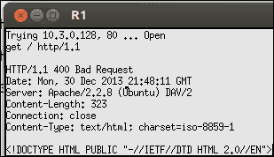

我们现在必须添加一条路线，并从我们的攻击机器上测试它；此外，我们必须在堡垒主机中添加一条路由，返回 192.168.177.0 网络。这是一个经常被忽视的领域。您必须维护目标范围内网络流量的路由，因为这是至关重要的。

在 Kali 和 Bastion 主机中，添加路由。在卡利机器中，在堡垒主机中输入`route add 10.3.0.0 netmask 255.255.255.0 dev eth0`和`route add 192.168.177.0 netmask 255.255.255.0 dev eth0`。

添加路由后，打开您选择的浏览器并连接到 metasploitable VM 上的 web 服务器；或者，您可以使用我们在路由器上使用的 telnet 方法。下面的屏幕截图显示了您应该看到的示例：

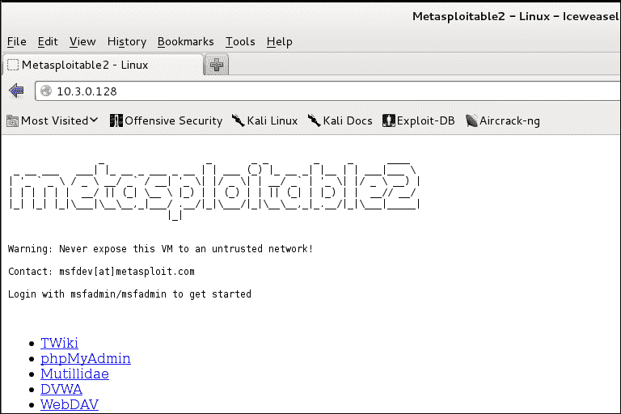

祝贺你成功了！我们已经建立了我们的外部架构！构建它需要一些时间，但一旦构建完成，我们就可以执行我们可能遇到的任何类型的外部测试，这就是虚拟化的力量。

### 注

这里有一个关于路线的说明；这可能是一个麻烦的事情，如果你把它搞混了，犯了一个错误，那么，你可能想考虑永久存储路由更改，以生存重启或任何其他无法预见的挑战。

您可以像我们讨论的那样创建批处理文件，另一种方法是将路由配置保存在文本文件中，并根据需要复制和粘贴它们。最后，如果您真的想在更持久的基础上设置路由，那么您可以设置 cron 作业或将路由命令放在配置文件中。对于那些想做这件事的人来说，这是留给你们的家庭作业！

下图显示了我们已完成的外部架构示例：

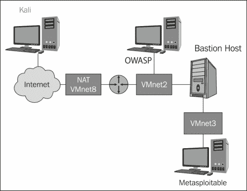

我们现在已经在这里设置了基线架构，我们已经准备好开始各种组件的构建和配置。首先，我们必须进行一些配置更改，因为我们的体系结构在过滤方面有点松散。我们现在就做。在继续之前，请保存已构建的路由器配置。在路由器提示下输入`write mem`。

对于那些正在使用 iptables 机器的用户，我们将开始讨论此配置的一些更改。到目前为止，这些更改是不需要的，而且您不必像使用 Cisco IOS 的用户那样创建路由器配置条目。

# 配置防火墙架构

我们在 Smoothwall 防火墙中配置了一条规则，这是我们唯一配置的过滤。虽然我们希望从外部位置进行测试，而没有任何过滤，这将有效地为我们提供一个平坦的网络，但事实上，这种情况很少发生。因此，我们希望在我们的体系结构中设置一组最小的过滤器，这些过滤器将类似于我们在典型网络体系结构中看到的东西。这里有一点很重要：如果我们运行在一个配置良好的分层和受保护的体系结构中，我们将只通过它们必须允许进入其服务的端口。这就是测试的现实；一个配置良好的体系结构不会为我们提供很多向量，除了它们必须允许的向量之外。因此，这并不是一件坏事，因为我们知道会有空缺，我们几乎总是有一个 web 服务器和 web 应用可以使用。

根据当前的架构配置，我们在第一层防御上没有设置过滤，读到这篇文章，你们中的一些人（如果不是的话）可能知道，即使我们的外围设备用作路由器，路由器的核心功能之一就是过滤流量。传统的路由器过滤被认为是无状态的，除了它正在处理的当前数据包之外，没有任何内存。如今，周边的路由器和过滤功能通常是有状态的，其运行方式与传统防火墙基本相同。出于本书的目的，我们将保持传统的无状态过滤方法。这是为我们提供我们想要测试的弱点所必需的，并且它仍然是非常可行的，因为许多管理员将以传统方式配置路由器。因此，即使在今天的测试中，我们仍然会遇到弱过滤配置，您需要知道如何在测试的早期阶段进行测试和识别。

在您的路由器窗口中，输入`sh access-lists`并显示路由器上配置的访问列表，此时您将看到路由器上没有访问列表。这就是为什么我们不仅可以通过它 ping，还可以通过它访问 web 服务器。因此，我们要做的第一件事是配置访问列表。在此之前，请先谈谈访问列表。我们可以在访问列表或**访问控制列表**（**ACL**）中放入多种配置，因为我们喜欢引用它们；然而，要涵盖这些内容本身需要一到两章，因此我们将只介绍最基本的内容。这样做的目的是，一旦您和目标之间有了访问列表，我们希望在我们通过测试方法时看到我们的网络数据包的行为。对于那些想了解更多的人，在[上有一个非常好的教程 http://gtcc-it.net/billings/acltutorial.htm](http://gtcc-it.net/billings/acltutorial.htm) 。

要在路由器中创建访问控制列表，请输入`ip access-list extended External`并按*输入*。下一步要做的是创建规则；我们希望始终允许 ICMP，以便进行故障排除。我们知道我们只想从 VMnet8（NAT）子网进行访问，因此我们可以使用规则进行设置；输入`permit icmp 192.168.177.0 0.0.0.255 any`并按*输入*。接下来要配置的是对 web 服务器的访问；我们可以制定两条规则，并将它们设置为足够细粒度，以便只允许端口 80 的流量流向 web 服务器。但是，出于测试目的，允许访问路由器后面的整个子网是可以接受的。此外，它将使我们的测试比总是为每个协议配置一个规则要容易得多。如果它是一个生产环境，那么这就是实现它的方法，但是我们有一个奢侈的测试架构。在路由器窗口中，输入`permit tcp any any eq 80`，然后按*输入*。我们现在有了配置集，需要应用它。点击*Ctrl*+*Z*返回主提示，然后输入以下内容：

```
conf t 
int f0/0
ip access-group External in .

```

我们现在准备测试它；ping 然后访问位于 10.3.0.0 子网的 web 服务器。你应该是成功的，如果不是，那么这是我们最喜欢的故障排除时间。要查看您的访问列表是否在路由器中工作，请按*Ctrl*+*Z*返回主提示。到达后，输入`show access-lists`显示访问列表信息。以下屏幕截图显示了一个示例：

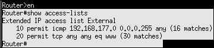

查看访问列表时，这里的关键是您是否看到匹配项？如果您看到匹配项，那么您的访问列表正在工作。这是我们防火墙配置的范围。从这一点上，我们可以向架构中添加任何我们想要的内容，这就是我们将要做的，因为我们将继续执行各种不同的测试技术，以模拟我们在执行实际测试时需要计划的内容。我们已经对路由器做了很多更改，因此在继续保存我们构建的路由器配置之前，请在路由器提示符处输入`write mem`。

现在，对于无法访问 Cisco IOS 的用户，我们将使用在[第 4 章](04.html "Chapter 4. Identifying Range Architecture")、*识别范围架构*中设置的 iptables。如前所述，到目前为止，我们的配置确实没有什么不同，但这种情况即将改变。iptables 必须配置为允许到堡垒主机和我们公共 DMZ 中的 OWASP web 服务器的流量。除此之外，我们的配置没有变化。这是我们朝着这个方向前进的另一个原因。我们构建的体系结构使我们能够将任何设备或虚拟机作为外围设备放置，而不改变其背后的任何内容。我们的堡垒主人也是如此；我们可以在构建不同的环境时进行更改，我们的体系结构允许我们这样做。

# iptables

对于没有 Cisco IOS 的用户，我们可以使用**iptables**的过滤功能创建我们在 Dynamicps 虚拟机中使用的防火墙功能。

在[第 4 章](04.html "Chapter 4. Identifying Range Architecture")*识别范围架构*中，我们创建了一个 Debian 发行版作为我们的 iptables 机器。我们也可以使用 iptables 作为我们的堡垒主机过滤器，但就本书而言，我们将坚持在第一级防御中使用 iptables 机器。当然，您可以在体系结构中的任何位置构建和插入机器，因为它是灵活的，并且只是一个基线分层配置。

即使您已经构建了**Cisco Dynamips**机器，您仍然应该遵循并完成将 iptables 机器添加到您的体系结构中的步骤，因为这是您可能遇到的问题。许多组织正在将 Linux 添加到他们的企业中，这已经不是什么秘密了，几乎所有这些组织都带有某种形式的过滤。此外，这种 iptables 过滤功能实际上是所有发行版的一部分。

回想一下我们构建 iptables 机器时，我们选择的地址与用于 Dynamips 虚拟机的地址不同。我们这样做是为了在体系结构中始终拥有这两台机器，这使我们能够涵盖笔测试人员可能遇到的不同场景。我们所要做的就是在外部机器（Kali）中添加路由，并将其指向 iptables 机器的接口。虚拟配置与 Dynamips 相同。以下屏幕截图显示了一个示例：

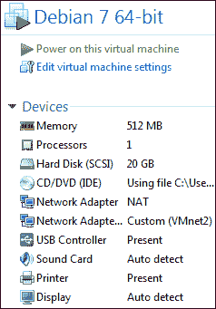

棘手的部分是路由的配置；因此，在我们研究实际的过滤规则语法之前，我们将先研究这个问题。请注意，我们可以启用数据包转发，然后我们可以测试我们的路由，但现在我们将只设置路由方向，并验证它是否到达我们希望它去的地方。

打开 Debian 虚拟机的电源，一旦启动，使用您在构建机器时创建的用户名和密码登录。打开终端窗口，输入`ifconfig`显示界面配置信息。请记住，如果您不是以`root`身份登录，则必须使用`su`命令提升您的权限，然后输入 root 密码以使该命令生效。以下屏幕截图显示了我们机器的配置示例：

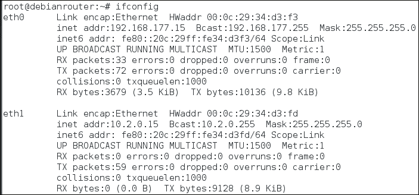

正如前面的截图所示，我们在两个界面上都有 15 个地址。我们已经在本章前面添加了路由，但是这些路由是通过 Dynamips 虚拟机添加的。因此，如果您同时启动这两台机器，将不会出现 IP 冲突，但您必须调整其他机器中的路由，以确保流量通过正确的机器。最简单且推荐的方法是在继续之前挂起 Dynamips 虚拟机。要在 VMware Workstation 中挂起机器，请导航到**VM****电源****挂起来宾**。

现在机器已暂停，我们将进入 Kali 机器的路径并对其进行测试。如果您仍然拥有 Dynamips 计算机的路由，它将工作，因为我们刚刚使用了子网 10.2.0.0，没有为网关计算机创建条目。要测试您的路由，请输入`ping 10.2.0.15 –c 3`以测试您是否具有连接性。如果没有，则表中不再有路由。我们已经演示了如何执行此操作，但为了避免您思考或参考本章前面的内容，下面的屏幕截图显示了查看表、添加和测试路线的方法示例：


显示查看表格、添加和测试路线方法示例的屏幕（裁剪文本不重要）

一旦成功测试了对 iptables 机器接口的访问，我们将下一步测试与我们构建的 OWASP web 服务器的连接。在终端窗口中，输入`ping 10.2.0.132 –c 3` 测试与 web 服务器的连接。请记住，如果您的 OWASP 计算机位于另一个 IP 地址，则必须输入此地址。但是，您会注意到这失败了。你知道为什么吗？希望您还记得我们有一个带有 Dynamips 机器的路由器，所以路由已经设置好了。大多数 Linux 机器的默认安装没有启用 IP 转发。因此，我们必须手动打开它以提供路由器的功能。在 iptables 机中，在终端窗口中输入`cat /proc/sys/net/ipv4/ip_forward`检查 IP 转发设置；如果转发已打开，则该值应为`1`。要打开转发，请输入`echo 1 > /proc/sys/net/ipv4/ip_forward`并用`1`覆盖`0`。现在将启用转发。以下屏幕截图显示了启用转发的示例：

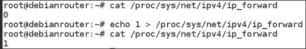

一旦打开它，您可能无法完成成功的测试。当我们早些时候配置我们的路由时，我们并没有像我们应该的那样细粒度。我们这样做的原因是：向那些可能对你的社交技能有点生疏的人展示；此外，如果你在上层花费了很多时间，你可能已经失去了路由知识。我们在这里的意思是，您必须在路由命令中放置一个网关。有时，它在没有网关的情况下也能工作，就像我们在上一章中所做的那样，但通常会失败，因此最好将我们的路线设置得尽可能具体，以避免出现这种情况。您必须在 Kali 和 OWASP 虚拟机中输入路由。

以下屏幕截图显示了两台机器的路由命令示例：

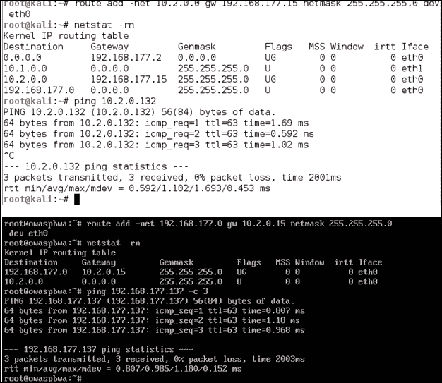

显示两台机器的路由命令示例的屏幕（裁剪的文本不重要）

提醒一下，如果您设置自己的方案，您的 IP 地址可能会有所不同。我们现在已经构建了我们的网络架构，因此是时候配置和设置过滤了，因为我们可以在任何端口上访问机器。打开浏览器并验证是否可以访问 OWASP 计算机上的 web 服务器。

现在我们将在 Debian 机器中配置 iptables。配置 iptables 时，可以直接从命令行配置规则。但是，我们将在这里使用的方法是在命令行中输入规则，然后保存它们。对于 Debian，默认情况下没有在引导时加载 iptables 的设置。因此，这不是我们想留下的东西。要更正它，我们将为`iptables-persistent`添加包。在终端窗口中，输入`apt-get install iptables-persistent`抓取软件包并安装。

安装包后，`/etc/iptables`文件夹中将有一个名为`rules.ip4`的配置文件。如果要查看该文件，请输入`more /etc/iptables/rules.v4`以显示该文件的内容。如您所见，默认情况下，链都设置为`ACCEPT`。我们现在将改变这一点。因此，我们将使用命令行，然后使用 save 实用程序保存更改。在我们这样做之前，我们将测试在整个架构中是否具有连通性；我们可以通过 ping OWASP 机器来实现这一点。一旦你成功地做到了这一点，现在是时候改变它并阻止数据包的转发了。在 Debian 机器中，输入`iptables –P FORWARD DROP`将策略设置为丢弃且不转发所有数据包。我们这样做是因为这是一种谨慎的安全方法，也是我们将在测试环境中遇到的。问题是，如果我们不保存规则，那么当我们重新启动时，规则将不存在。在我们下载的软件包中，有一个用于此的工具。在终端窗口中，输入`iptables-save /etc/iptables/rules.v4`将配置保存到文件中。这将为我们提供规则，即使我们重新启动机器。下面的屏幕截图提供了规则文件的后续示例：

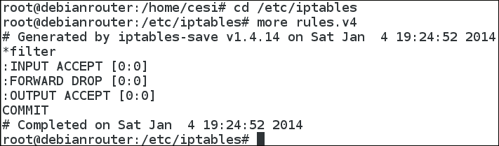

这条规则应该防止您 ping 机器，这就是我们想要实现的。我们目前有一个默认的拒绝策略，并将根据需要添加规则以允许我们需要的流量。我们需要允许的流量是到 web 服务器的 web 流量。在终端窗口中，输入`iptables –A FORWARD –p tcp –d 10.2.0.0/24 –dport 80 –j ACCEPT`为要转发到 OWASP 机器的入站端口 80 流量创建规则。我们还需要另一个方向的规则。我们可以使用状态指令和其他方法，但我们希望尽可能创建路由器的功能，这需要无状态过滤器所需的两条规则。

我们想要输入的第二个规则是`iptables –A FORWARD –p tcp –s 10.2.0.0/24 –sport 80 –j ACCEPT`为返回流量添加规则。一旦您输入了规则，您将通过输入`iptables-save /etc/iptables/rules.v4`来保存规则。保存配置后，您现在应该可以访问 web 服务器，但不能访问 OWASP 机器上的任何其他内容，这正是我们想要的。以下屏幕截图显示了此配置文件的示例：


这就完成了我们的配置。我们可以根据需要向 iptables 过滤器添加协议，并实践几乎所有我们很可能遇到的测试形式。

## 部署 IDS/IP 和负载平衡器

现在，我们的体系结构的主要组件大部分都已构建；因此，现在是讨论将监控能力添加到我们的测试范围的时候了。有一件事很重要需要注意：无论我们选择什么监控解决方案，我们都无法预测站点将如何配置它！这是我们在测试时唯一不能忽视的事情。我们可以测试并成功规避我们在靶场上安装的监控系统，但由于这些系统主要基于策略和配置，因此我们有可能不会获得与实验室相同的成功。在本节中，我们将讨论一些可用的监控系统类型的示例，并查看如何部署其中一种。我们将在本书后面讨论规避时进一步讨论这个概念。

## 入侵检测系统（IDS）

在为我们的体系结构选择 IDS 时，我们需要考虑很多事情，比如我们想要将什么产品设置为我们的实践 ID。有许多产品可用，这可能会成为一项艰巨的任务，但由于 Snort 是最受欢迎的产品之一，我们将重点关注这一点。Snort 的另一个好处是它有一个免费版和一个商业版。

当我们在网络上部署 Snort 机器时，我们有两种选择，但在解决这个问题之前，我们需要讨论将在何处部署 Snort 传感器，以及流量将如何到达虚拟环境中的传感器。

在实际的体系结构中，交换机是一种单播设备，它只将流量转发到目的地的端口。此外，广播流量是在所有端口上发送的唯一流量。在部署 IDS 网络传感器时，这可能会出现问题，我们必须使用 SPAN 端口或 tap。有关这些选项的详细信息和比较，请转到以下链接：

[http://www.networktaps.com/](http://www.networktaps.com/)

幸运的是，我们在 VMware 交换机中没有这个问题。交换机的设置使我们能够看到交换机上的流量，这使我们能够连接 IDS 网络传感器，而无需担心配置 SPAN 端口。为了验证这一点，您可以在两台机器之间进行 ping，并在第三台机器上运行`tcpdump`，然后检查是否可以看到其他两台机器之间的通信量。例如，我们将在 OWASP web 服务器和 Bastion 主机之间执行 ping；我们将通过在 Kali 机器中运行`tcpdump`来查看 ping 流量。

以下屏幕截图显示了一个示例：


一旦我们确定可以查看交换机上的流量，接下来我们要讨论的是传感器的位置。对于基于网络的 IDS，的正常配置是在每个网段上都有一个网络传感器。因此，唯一的要求是所有机器必须连接到同一个开关。展望未来，在我们的范围内部署和监控时，我们将遵循这种方法。我们的 IDS 传感器外部架构示例如下图所示：


现在我们已经确定了我们的体系结构中的传感器位置，我们现在将讨论如何在虚拟配置中实现这一点。我们可以构建另一个虚拟机作为 IDS 传感器，但这样我们就可以开始感受到现有 RAM 的压力。因此，我们首选的方法是使用一台机器，配置多个网卡，并在连接到所需交换机的每个现有网卡上配置 Snort 传感器。

### 注

要实现这一点，我们需要构建一台运行 Snort 的机器。我们可以从头开始构建一个，但出于本书的目的，我们将研究其他替代方案。然而，从头开始构建一台机器是一种有趣的体验，它是留给读者的家庭作业。关于如何为 Snort 实现这一点的优秀资源，在[中可以找到，该资源还提供了许多平台上的指导 http://www.snort.org/docs](http://www.snort.org/docs) 。请注意，这些研究指南并非 100%准确，因此您的里程数可能会有所不同。

为了创建我们的 Snort 传感器，我们将使用一个已经安装了 Snort 程序的发行版，更重要的是，所有依赖项。我们将使用的发行版是**网络安全工具包**。它包含 125 个顶级安全工具，这是值得添加到您的体系结构中的东西。我们最喜欢的是它易于设置 Snort。您可以从[下载 ISO 图像 http://sourceforge.net/projects/nst/files/](http://sourceforge.net/projects/nst/files/) 。下载 ISO 映像后，需要创建一个虚拟机。由于我们已经谈到了这一点，我们将不再这样做。您必须做的事情是装载 ISO 映像并引导它。一旦机器启动，您将把它安装到硬盘上。位于桌面上，有一个要安装到硬盘上的图标。桌面示例如以下屏幕截图所示：


双击图标并按照提示将映像安装到硬盘驱动器。这需要一些时间。你可能想知道为什么我们要安装硬盘，而我们可以从 ISO 映像启动。我们将安装到硬盘驱动器的原因是我们希望 NST VM 作为一台实际机器，因此我们可以使用它保存和构建各种配置，然后保存它们。如果安装时选择了自定义分区，请单击图标并将其更改为自动分区，因为这样可以节省时间。安装完成后，双击桌面上的图标并设置系统密码。设置好密码后，右键点击桌面区域，选择**在终端**中打开，打开新的终端窗口，输入`shutdown –h now`关闭系统。一旦系统关闭，我们需要配置机器以支持连接 Snort 传感器所需的三个接口。

以下屏幕截图显示了此配置的示例：

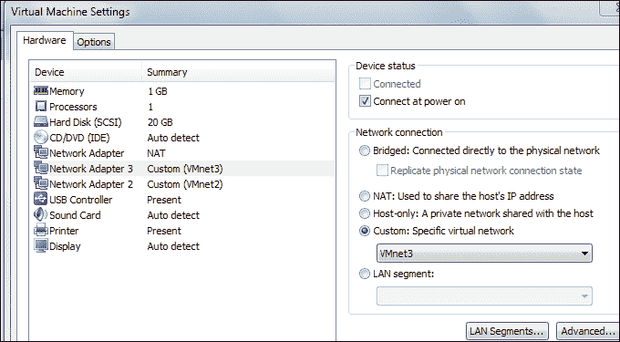

正如您在上一个屏幕截图中所注意到的，ISO 图像不再挂载；最好删除该设置以避免任何潜在冲突。一旦您在虚拟机上验证了您的配置能力，我们将继续配置虚拟机，以满足外部体系结构范围的 IDS 要求。打开终端窗口，输入`ifconfig`，确认有三个界面，如下图所示：


既然已经设置好了接口，我们就可以开始 Snort 了。我们选择网络安全工具包的原因是它为我们提供了一个非常简单的 Snort 传感器设置。点击**活动**并选择 Firefox 图标并打开浏览器，系统会提示您输入用户名和密码。输入用户名`root`和将其安装到硬盘时设置的密码。在 web 界面中，点击**安全****入侵检测****Snort IDS**打开 GUI 配置 Snort。以下屏幕截图显示了一个示例：


屏幕显示配置 Snort 的 GUI（裁剪的文本不重要）

要配置传感器，请选择要启动的传感器的单选按钮，为 eth0 界面。选择界面后，向下滚动并单击**设置/启动 Snort**启动传感器。给它一些时间，然后点击**检查状态**查看传感器是否已启动。有时需要两次尝试，如果显示停止，请单击**启用**并再次运行该过程。一旦成功，您应该看到进程在接口上运行。对其他两个接口执行相同的步骤。以下屏幕截图显示了此配置的示例：

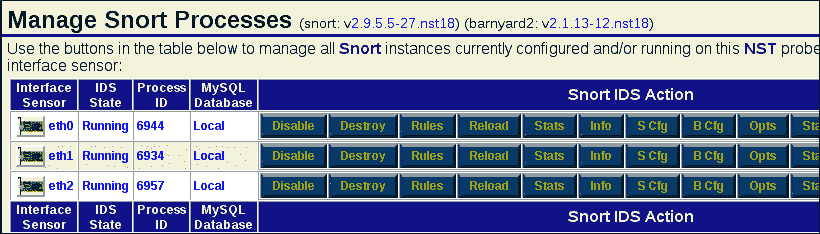

显示在界面上运行的进程的屏幕（剪切的文本不重要）

就这样！我们现在有了一个使用 Snort 工具的完全分布式的 IDS，并且我们有传感器连接到架构的每个交换机。在这里，我们将不深入讨论使用 IDS 的细节，因为当我们展示规避方法时，我们将非常详细地介绍它。现在，我们至少想看看一种简单的方法来验证您的 Snort 安装是否正常工作。传感器右侧有多个按钮；点击**规则**按钮进入 eth0 界面。这将显示您可以在界面上配置的规则；当您查看规则时，您将看到此基本安装没有启用那么多规则；这有助于避免误报。站点禁用扫描规则是很常见的，因为这会导致许多误报，实际上，扫描是很常见的。我们希望通过在单选按钮中选择来启用界面的扫描规则。对规则进行更改后，将需要重新加载接口。点击**仅包含所选规则**。以下屏幕截图显示了一个示例：

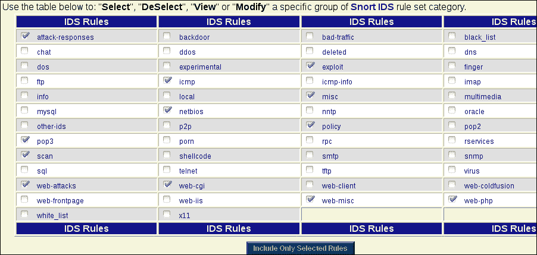

下一步是重新加载传感器以更新规则。点击**管理 Snort 进程**管理 Snort 传感器，点击**重新加载**按钮。我们现在开始测试我们的传感器！打开终端窗口，输入`cd /etc/snort_eth0`进入运行 NST 脚本文件时配置的目录。当您使用 web 界面启动传感器时，所有配置文件都位于位置。从这里开始，流程是再次启动 Snort 传感器并执行快速测试。同样，这只是一个如何测试传感器的快速参考；在规避一节中，我们将更多地使用 NST 分布。如您所见，我们必须启用扫描规则，以便能够检测扫描，这是非常常见的。

此外，即使启用了扫描规则，也有避免检测的方法，但这是另一次。在终端窗口中，输入`snort –A console –c snort.conf`启动另一个 Snort 实例，并将信息记录到控制台。如果您没有 root 权限，则必须以`root`的身份运行该命令。打开另一个终端，在其中输入`nmap –sX –p 137,445 192.168.177.1`对主机进行圣诞树扫描。下面的屏幕截图显示了从 Snort 在控制台上看到的警报示例：

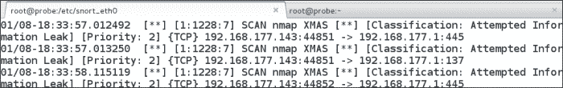

这将验证我们是否配置了 Snort 以及规则是否正常工作。这个时候，我们不会再在这里做了。欢迎您自行探索。NST 发行版有大量的工具，值得探索以了解更多，建议您使用 NST 作为 Kali 机器的良好补充。

## 入侵防御系统（IPS）

我们已经部署了 IDS，所以现在是时候将注意力转向 IPS 了。在 IDS 的早期，IDS 为我们提供了三种功能：；它们是监视、检测和响应。这就是 IP 的来源；今天的响应功能是响应和潜在防止攻击的能力。在大多数情况下，当涉及到网络 IP 时，响应是按 IP 地址阻塞。对于基于主机或机器的 IP，这是一个阻止进程访问某些内容的问题。最新版本 Windows 上的**用户帐户控制**（**UAC**保护就是一个有点限制的例子。这些方法的问题在于，我们要求软件检测真实的攻击，而不是不真实的攻击。也就是说，我们要求软件思考。我认为，无论媒体或娱乐业试图描绘什么，我们都没有思考软件。例如，当我们在涉及 UAC 的机器上执行操作时，它会警告我们发生了什么事情；问题是它警告我们太多，以至于我们只需点击**是**。因此，这不是一种有效的保护方法。我们知道用户很可能会点击；这对测试是好的，对安全性是坏的。

几年前，我们会欺骗客户端站点使用的某个东西的 IP 地址，如他们的网关，然后生成攻击。响应行动是封锁 IP 地址，结果，他们封锁了自己的网关，没有人能够访问网络之外的任何东西。因此，正如您所想象的，IPS 在部署时可能会导致问题；因此，根据我的经验，如果部署它，它将在监视模式下配置，而不是在块模式下配置。

说到 IPS，我们的产品系列中没有那么多不是商业产品。出于这个原因，我们目前不会在我们的范围内添加一个。当我们进入回避一节时，我们将再看一看这个。我们范围内的 IPS 部署将取决于我们与客户的接触情况以及工作范围内的详细信息。

## 负载平衡器

当涉及到将负载平衡器添加到我们的体系结构时，有两种选择。测试的主要内容是检测负载平衡器何时到位，并在执行测试时处理其后果。

我们将集中讨论在体系结构中实现负载平衡的潜在选项。我们将只讨论协议负载平衡。我们能够在 iptables 中使用负载平衡。有关此示例，请参阅以下屏幕截图：

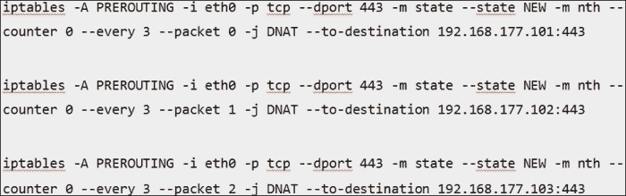

前一屏幕截图中的示例使用了概念，即按照规定在三台机器之间旋转数据包。配置负载将传入的 HTTPS 流量平衡到三个不同的 IP 地址，每三个数据包使用`counter 0`。

负载平衡的下一个例子是 pfsense 防火墙；防火墙配置中具有负载平衡功能。要查找配置入站负载平衡的其他信息和教程，请参阅本网站[https://doc.pfsense.org/index.php/Inbound_Load_Balancing](https://doc.pfsense.org/index.php/Inbound_Load_Balancing) 。此外，Lee Allen 的《针对高度安全环境的高级渗透测试：终极安全指南》一书详细介绍了如何使用 pfsense 实现负载平衡。

## 集成 web 应用防火墙

在撰写本书时，您遇到的越来越多的体系结构开始部署对其 web 服务器的保护。此外，web 应用防火墙的部署（通常称为 WAF）正变得越来越普遍。因此，我们需要在我们的体系结构中部署它们，以测试和确定如何通过它们。我们将在后面的部分中介绍这方面的细节。现在，我们将考虑在我们的体系结构中添加 WAF 功能。ModSecurity 是最流行的免费开源 WAF 之一。我们将在后面的章节中重新讨论这一点；现在，我们将向我们在早期架构中使用的现有 metasploitable VM 添加一个 WAF。

在安装和配置 WAF 之前，我们将克隆机器并为我们的体系结构创建 WAF 设备。这将允许我们将 WAF 机器连接到我们范围内的任何点，以便我们可以测试我们通过它的能力。这将为我们提供如下图所示的配置：


由于我们需要访问互联网，您需要更改网络适配器，使其连接到 NAT 交换机，并为我们提供到互联网的链接。更改配置后，打开机器电源。登录后，输入`sudo –i`以采用根权限级别。

我们需要下载软件，我们将使用`wget`命令进行此操作。当你阅读这本书时，链接会有所不同。因此，请访问该网站，验证当前可用的版本，并更改版本号以匹配您发现的版本，然后下载应正常进行。在终端窗口中，输入`wget http://www.applicure.com/downloads/5.12/Linux/i386/dotDefender-5.12.Linux.i386.deb.bin.gz`连接并下载软件。软件下载后，就可以安装了。然而，在我们这样做之前，我们必须解压缩它并使其可执行。输入`gunzip dotDefender-5.12.Linux.i386.deb.bin.gz`解压文件。文件解压缩后，我们现在必须使其可执行。进入`chmod +x dotDefender-5.12.Linux.i386.deb.bin`并更改执行权限。以下屏幕截图中显示了这些命令的示例：


我们现在准备开始安装过程。输入`./dotDefender-5.12.Linux.i386.deb.bin`开始安装过程。遵循默认设置，直到必须输入 Apache 可执行文件的路径为止。输入`/usr/sbin/apache2`作为 Apache 服务器的位置，并继续安装默认值，直到您可以输入 URI 来访问应用。输入`dotDefender`。然后，输入管理员访问的密码；同样，您可以输入您选择的任何密码，但在测试环境中，我希望保持简单，因此我们将使用密码`adminpw`并继续安装。在更新选项中，选择**或**选项并继续安装。如果提示您输入更新周期选项，请选择任意一个选项，然后单击**下一步**。选择第一个选项从网站获取更新，然后选择**下一个**继续安装。

如果一切顺利，您将看到一条成功安装完成消息，如以下屏幕截图所示：

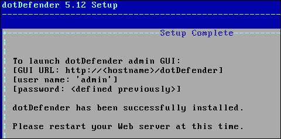

我们现在需要按照完成消息中的指示重新启动 Apache；输入 `/etc/init.d/apache2 restart`重新启动服务器。一旦 web 服务器重新启动，我们将访问 WAF。打开您选择的浏览器，并使用 Metasploitable 机器的 URL 连接到 WAF。连接后，输入管理员用户名和安装时选择的密码，进入配置页面；以下屏幕截图显示了一个示例：


由于我们没有申请许可证，我们只处于监控模式，但为了测试和使用 WAF 进行实践，这才是我们真正需要的。我们现在要测试 WAF，我们将使用 Kali 分布进行测试。在 Kali 机器中，打开终端窗口并输入`nikto –h 192.168.177.134`以使用 nikto web 扫描仪，查看 DotdFinder WAF 是否发出警报。如果您的 WAF 位于不同的 IP 地址，则您必须将目标目的地更改为 WAF 的 IP 地址。执行扫描后，返回 dotDefender 并导航至**日志查看器****Metasploitable**以查看 WAF 中的日志。您应该会看到一些来自 nikto 扫描的警报；以下屏幕截图显示了一个示例：


我们现在已经为外部测试和其他方法构建了一个健壮、完整的体系结构。我们有可以在许多不同场景中重用的组件；因此，从本章的角度来看，我们的要求已得到满足，我们完成了既定目标。最后要做的一件事是拍摄我们在本章中配置的所有机器的快照，以便在出现问题时使用它们。

# 总结

在本章中，我们构建了一个分层体系结构，以满足我们可能遇到的各种潜在场景的需求。我们以分层方法开始本章，以满足外部测试的需要。

在定义层之后，我们开始向架构的每个部分添加所需的组件。我们还研究了过滤和路由需求，并构建和配置了 Cisco 路由器模拟器和 iptables 机器，以满足过滤需求。

一旦我们配置并测试了第一层组件，我们就开始向体系结构添加防火墙。我们使用流行的工具 Smoothwall 作为防火墙，并将其配置为支持一项服务以进行测试。

在我们构建了防火墙并测试了配置之后，接下来我们承担了向范围中添加监控功能的任务。我们在所有三个子网上构建并配置了 Snort，以支持我们对入侵检测能力的需求。然后，我们讨论了向配置中添加 IP 和负载平衡的过程。

最后，我们在本章结尾讨论了 web 应用防火墙的集成。我们安装并配置了 web 应用防火墙 dotDefender。一旦我们构建了这台机器，我们就克隆了它，这样我们现在就有了一台 WAF 机器，可以连接到架构中的任何位置。完成克隆过程后，我们使用 nikto 工具测试 WAF 是否检测到 web 应用类型的攻击。

本章到此结束。现在，您有了一个完整的分层体系结构来包含路由需求。现在，只需将所需的目标连接到此体系结构，并进行测试，以查看哪些对目标有效，哪些对目标无效。从这一点上讲，这个过程将着眼于我们可能遇到的潜在目标，然后进行实验，看看我们能发现什么。建立范围的基础和核心，现在是添加目标的时候了。我们将遇到的第一个保护目标是某种形式的装置；因此，这是我们将在下一章开始的地方。