# 八、构建 IDS/IPS 范围

在本章中，我们将学习在我们的网络范围内设计和构建各种 IDS/IPS 功能的技术。我们还将介绍典型主机和端点安全配置的部署。我们将讨论以下主题：

*   部署基于网络的 IDS
*   实现基于主机的 IPS 和端点安全
*   使用虚拟交换机
*   逃避

本章将为我们提供一种方法，以便在遇到许多不同的监控设备时使用。在本章中，我们将研究规避，即避免被发现的技术。虽然这是一个热门话题，但作为一名专业的安全测试人员，现实是很少有人要求它；此外，它取决于许多因素，这不是一件容易准备的事情。成功与否在很大程度上取决于 IDS 传感器的类型和位置及其配置。作为您工作范围的一部分，您可能会被要求逃避检测，这就是我们在本书中介绍它的原因。

# 部署基于网络的 IDS

正如我们之前在[第 6 章](06.html "Chapter 6. Creating an External Attack Architecture")*创建外部攻击架构*中所讨论的，当我们部署基于网络的**入侵检测系统（IDS）**时，我们在网络的每个部分上放置一个传感器。传感器由一个网络卡组成，该卡处于混杂模式，这将关闭 MAC 地址过滤。所有通信量都向上传递到堆栈，并传递到监控传感器的应用。我们还讨论了在交换机上部署传感器的挑战，因为流量不是从所有端口发送的，这可能会对向传感器提供数据造成挑战。

对于基于网络的 IDS，IDS 的功能是在数据包级别处理网络流量，然后分析其特征或模式，这些特征或模式可能是攻击的迹象。考虑到这一点，请记住网络传感器正在捕获数据包；那么，一次有多少数据包通过网络？这是基于网络的 IDS（如何以不断提高的网络速度处理流量）面临的挑战之一。然而，我们正在超越自己。我们要做的第一件事是设计我们的体系结构，以便能够很好地表示在客户端网络上可能看到的典型 ID。我们将使用下图：


我们的建筑

我们可以在每一点上构建架构并测试传感器，但这样做真的毫无意义。这是因为我们有机会使用 VMware 这样的虚拟环境。所以，一旦我们决定要用什么进行测试，我们只需将网络适配器更改为连接到该交换机。这也是我们做出选择的另一个原因。

另一件需要注意的事情是，我们希望有一个受害者进行攻击，并查看 IDS 如何响应，但一个更好的方法，尤其是在涉及到规避时，是直接在网络传感器上引导攻击流量。这将为我们提供一种力量，让我们能够看到传感器上的攻击是否能够在不被发现的情况下通过。我们稍后将在*规避*部分中进行此操作。

下一步我们要做的是启动我们的三台机器，并验证我们是否已启动 ID 和功能。在此之前，您应该使用网络安全工具包、Kali 机器和受害者验证您的设置，并检查它们是否都连接到 VMnet2 交换机。您可能想知道为什么我们不使用 VMnet8 交换机，因为它还可以为我们提供 Internet 连接和 VMware 的其他内置功能。这是一个有效的问题，我们选择另一个交换机的最大原因是，我们希望确保没有任何虚假或异常流量，可能导致传感器出现问题。VMnet8 交换机与主机共享适配器配置，并且通常存在传输的数据包，这些数据包可能会干扰我们的结果。机器启动后，我们将启动 Snort 传感器。登录网络安全工具包虚拟机，然后点击**活动**并选择 Firefox 图标。

Firefox web 浏览器启动时，如果未填写用户名和密码详细信息，请输入所需信息并单击**确定**。这会将您放在网络安全工具包 Web 用户界面的主页上。然后导航至**安全****入侵检测****Snort IDS**，如下图所示：

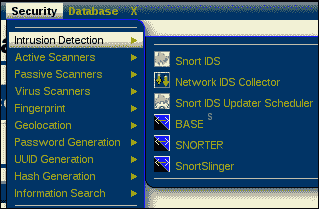

打开 Snort 页面后，您将希望看到在挂起或关闭虚拟机时，机器处于何种状态。如果未看到处于列出状态的传感器，则必须为传感器配置接口。尽管我们在前面已经解释过了，但我们将再次研究它，这样您就不必寻找它了。如果您没有看到列出的传感器，则需要向下滚动并选择适当的界面。对于本书，我们使用的是 eth1 接口，因此下面的示例将基于此。如果您在另一个接口上设置了 VMnet2 开关，那么您必须选择该接口，而不是我们正在使用的接口。

选择相应界面的单选按钮后，单击**设置/启动 Snort**启动界面上的传感器。

### 注

您很可能需要点击按钮两次才能让传感器真正启动。

传感器成功启动后，您应该看到 Snort 传感器处于**运行**状态，如下图所示：

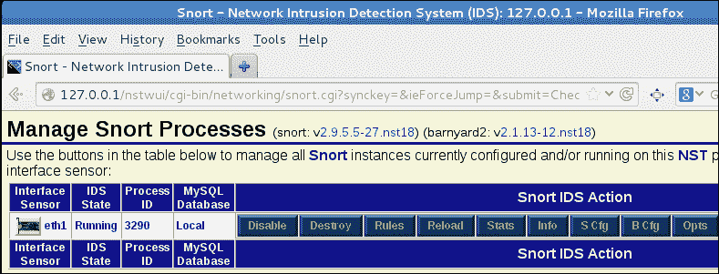

屏幕显示 Snort 传感器处于运行状态（剪切的文本不重要）

一旦进程处于我们希望它处于的状态，我们将验证规则是否已打开。点击**规则**并验证**扫描**规则是否被选中。以下屏幕截图显示了一个示例：

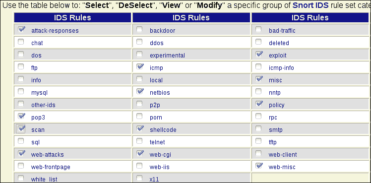

屏幕以验证是否选择了扫描规则（剪切的文本不重要）

### 注

如果您更改了规则，则必须重新加载传感器。重新加载按钮位于**规则**按钮的右侧。

现在我们的规则完成了我们希望它们完成的任务，我们准备验证传感器是否工作。我们在前面介绍了这方面的步骤，但我们不会让您找到它们。我们必须打开终端窗口并输入以下命令：

```
cd /etc/snort_eth0
snort –A –c snort.conf

```

启动 Snort 后，打开另一个窗口并使用非法标志组合扫描来验证传感器是否正常工作。作为提醒，我们在[第 6 章](06.html "Chapter 6. Creating an External Attack Architecture")*中使用了圣诞树扫描，创建了外部攻击架构*，您可以使用此扫描或任何包含非法标志的扫描，如 FIN 或 NULL 扫描。

除了 Snort 易于安装之外，我们还喜欢网络安全工具包的另一个特点是，我们有优秀的 Snort 工具。我们来看看工具**Base Analysis Search Engine**（**Base**）。要启动基地，您需要导航到**安全****入侵检测****基地**。以下屏幕截图显示了一个示例：


当基本工具启动时，将要求您进行身份验证。应该已经为您输入了凭据，如果没有，您将有输入相应的凭据以访问 GUI。完成此操作后，单击**确定**，如下图所示：


基本 GUI 允许我们在图形显示中记录传感器检测到的警报。返回您的 Kali 机器，再次运行圣诞树扫描。作为提醒，您可以使用**X**选项配置扫描。扫描完成后，返回到**基本**显示屏并刷新显示屏，您现在应该可以看到检测到的 TCP 流量，如以下屏幕截图所示：


基本工具的一个优点是可以从警报中检查的信息。我们现在就做。单击百分比数字，将弹出另一个窗口，其中包含传感器检测到的警报列表。以下屏幕截图显示了一个示例：

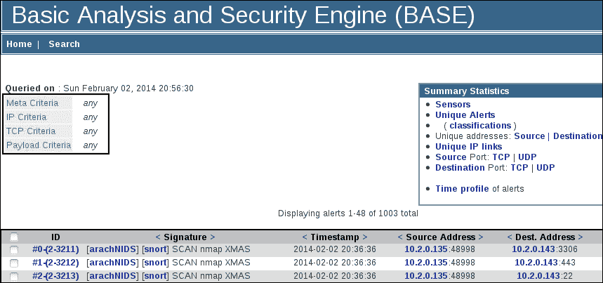

我们要做的下一件事是检查警报。我们通过单击警报来实现这一点。单击警报时，您将看到有关警报的其他信息。以下屏幕截图显示了一个示例：

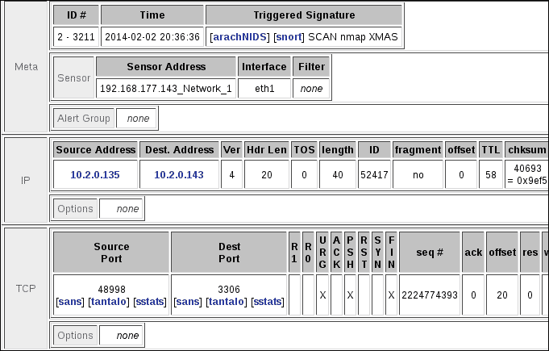

正如前面的屏幕截图所示，数据包的组成，包括封装数据的显示，可供查看。这显示了**Nmap**工具设置 FIN、PUSH 和紧急标志来表示扫描。某些工具在执行扫描时会设置所有六个标志。

有两个链接位于**元**部分和**触发签名**下。单击 Snort 链接，它将显示触发签名的规则。以下屏幕截图显示了一个示例：


前面的屏幕截图显示了您可以检查的信息，不仅可以发现有关签名的更多细节，还可以发现触发事件的影响。此外，您还可以提供有关误报评级的信息。这一点很重要，因为许多实施 IDS 的管理员将关闭生成大量错误警报的签名。事实上，你可能还记得，我们必须打开扫描规则，这是因为它有一个高假阳性率的趋势。现在我们将检查 Nmap XMAS 扫描的假阳性评级。向下滚动并查看信息。以下屏幕截图显示了一个示例：

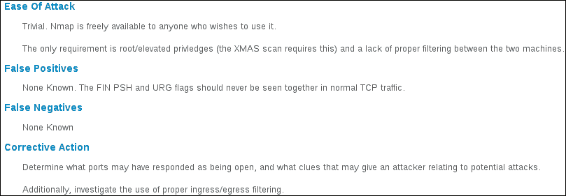

我们现在有了一个 IDS 范围，可以用来观察不同工具和技术的反应。在执行此操作之前，我们将清除机器中的所有警报，要执行此操作，您需要转到**查询结果**屏幕的底部，并导航到**操作**|**删除警报**。完成此操作后，单击**整个查询**按钮删除警报，然后单击**主页**上的返回主屏幕。我们将使用 Nikto web 扫描工具查看使用扫描仪时 Snort 传感器的反应。我们将扫描 Snort 传感器网络上的网络安全工具包 web 服务器。要在 Kali Linux 机器上进行扫描，打开终端窗口，输入`nikto –ssl –h <IP address of the Sensor>`，如下图所示：

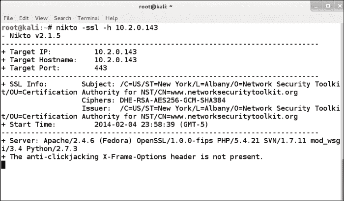

`ssl`选项用于强制检查**安全套接字层**（**SSL**），因为在默认配置中，网络安全工具包在端口 80 没有 web 服务器；只能访问 HTTPS 端口 443。扫描完成后，您会注意到有几个发现。要查看这些发现，您需要滚动浏览并查找它们。与大多数工具一样，有一种更好的方法，我们现在将对此进行探讨。

在终端窗口中，我们将使用工具的输出功能将其写入文件。输入`nikto –ssl –h <IP address of the Sensor> -o file.html`，如下图所示：

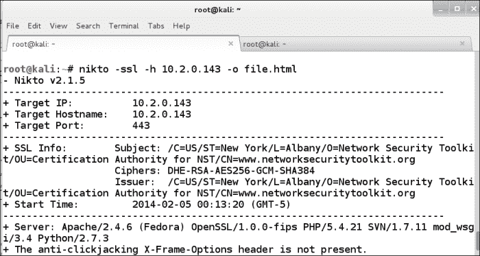

这已经获取了工具结果的输出，并将其写入 HTML 文件。导航至**应用****互联网****Iceweasel 网络浏览器**打开**Iceweasel**。浏览器打开时，打开已创建的文件并查看结果。您将看到输出更易于阅读，如以下屏幕截图所示：

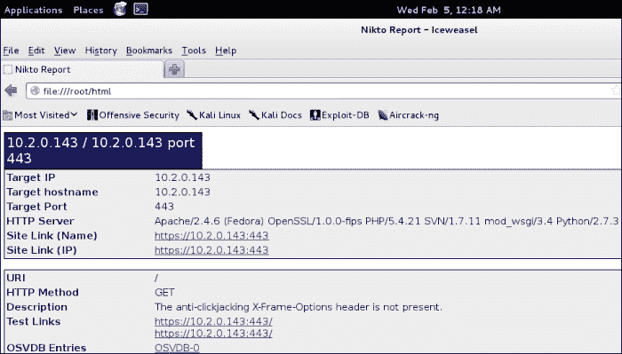

现在是时候返回我们的 Snort 传感器和基本显示器查看是否有任何警报。我们已经进行了多次网络扫描，想看看检测到了什么。返回网络安全工具包，刷新基本显示并查看信息。以下屏幕截图显示了一个示例：


正如前面的截图所示，我们没有任何警报！为什么会这样？嗯，这是反复试验过程的一部分。我们知道在配置 Snort 传感器时加载了特定的规则，因为我们过去必须启用一些规则。因此，从这里开始的过程将是尝试启用更多规则，看看会发生什么。还有一个很好的机会是存在另一个问题，但只要我们发送非法标志组合数据包，我们就会收到某种警报，这告诉我们传感器正在工作。在这种情况下，如果启用所有规则，仍然不会出现警报。我们将保留这个问题的答案，直到我们进入关于逃避的部分。

# 实现基于主机的入侵检测和端点安全

站点可以通过多种不同的方式配置和部署其基于主机的保护，甚至可以配置和部署其端点安全性。作为一名测试人员，在我们的目标范围内实现这一点需要进行实验。这些产品大部分是商用产品，您必须获得试用版或要求供应商提供概念验证实施。无论哪种方式，您在网络范围内部署此功能的能力将在很大程度上取决于您的客户机拥有什么。这是可以在非侵入性目标搜索的早期阶段获得的信息。但是，它通常在会议上提供给您，以确定工作范围，或者在测试的社会工程阶段（如果允许并且在范围内）提供。

我们将看看赛门铁克推出的一些流行的端点保护软件。正如我们在上一段中所说，您可能会遇到其他问题，但对于大多数检测解决方案，都会设置一些警报或警报阈值。作为测试人员，这是我们必须确定的。因此，这将在规避一节中讨论。

我们将要看到的赛门铁克版本是一个旧版本（11.0 版），但它可以满足我们的需要。这里的目的是，当您准备参与时，您将在实验室环境中尽可能多地创建。安装基于主机的 IDS 或 IPS 后，请查看其配置，以了解该工具用于检测和/或阻止事件的内容。

使用 Symantec 工具，我们查看工具配置中的选项以获得此信息。以下屏幕截图显示了仪表板的示例：


正如前面的截图所示，有三个主要保护区域。我们现在只有一个启用的，这是我们首先要看的。我们将导航到**选项****更改设置****入侵预防**以打开菜单更改阻止可疑攻击流量的设置。以下屏幕截图显示了一个示例：


正如前面的截图所示，我们有许多值可以配置和定制，这是我们作为测试人员面临的挑战之一。如果管理员调整或更改了不同的设置，我们可能无法逃避检测，但我们正在超越自己，因为我们不在逃避部分。我们在这里更改了默认值。

我们需要做的下一件事是看看我们是否能够检测到潜在的攻击并实际阻止 IP 地址。我们可以使用 Nmap，但我们更喜欢使用攻击工具，这就是 Nikto 的用武之地。我们将把它指向赛门铁克机器的 IP 地址，看看会发生什么。以下屏幕截图显示了一个结果示例：

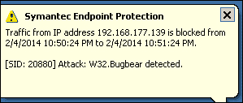

正如前面的截图所示，攻击被检测到，IP 地址现在被阻止；这就是为什么我们将块更改为 60 秒，以便 Nikto 扫描不会花费太长时间。扫描完成后，我们可以在 Symantec 工具中查看检测历史和相应的块。所有这些功能对用户来说都很好，并且易于使用，但对攻击者来说也很好。Nikto 扫描的日志结果示例如以下屏幕截图所示：


如前一个屏幕截图所示，入侵预防工具已检测到并随后阻止了来自该工具的攻击尝试。问题是，正如许多阅读本文的人可能知道的那样，IP 阻止并不总是一个好主意，因为我们可以欺骗 IP 地址，然后用户将被阻止。这就是 IP 阻塞通常只针对可能导致重大损失的配置的原因之一。

赛门铁克工具还有其他几个部分，我们在这里不一一介绍。但是，我们将看一个与网络无关，但实际上与主机相关的。我们现在要看的功能是**防病毒和反间谍软件保护**。我们要做的第一件事是点击**修复所有**按钮，这将打开所有保护，如以下屏幕截图所示：

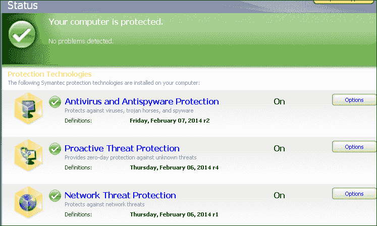

显示屏幕上所有保护的屏幕（剪切的文本不重要）

我们现在启用了所有端点保护；因此，我们试图在机器上安装的任何被视为威胁的程序都将被保护机制标记。为了证明这一点，我们将使用 Jamie Butler 在 2005 年编写的 FU rootkit 来展示微软使用 Intel 架构环的弱点。关于这一点的详细解释超出了本书的范围，但对于那些想了解更多的人来说，你可以得到他与格雷格·霍格隆德合著的书*Rootkits:Subversion the Windows 内核，Addison Wessely*。

当我们将 FU rootkit 的可执行文件复制到受保护的机器时，它会立即被检测为威胁，如下图所示：


正如前面的截图所示，它已被检测到，并被归类为**黑客工具。Rootkit**，由于它被视为威胁，因此被删除。我们可以通过点击防病毒和反间谍软件保护来查看更多检测细节。导航至**选项****查看日志****风险日志**查看已检测到的风险。以下屏幕截图显示了一个示例：


正如前面的截图所示，检测是在两个文件上进行的，可执行文件是一个和`msdirectx.sys`，这是加载并用于访问内核内存的驱动程序。FU-rootkit 是一个先驱，因为它是第一个实现**直接内核对象内存**（**DKOM**操作的。

那么，这给我们的范围架构带来了什么？正如前面提到的，你将要遇到的产品种类繁多。因此，在大多数情况下，我们等待，看看客户有什么可用的，然后我们开始研究，以获得它的副本，并进行实验。你们很多人可能都知道，关键是我们被发现是因为文件的签名。因此，我们将使用一个工具来更改该签名；然而，这是一种逃避，因此我们将在本章后面介绍。

# 使用虚拟交换机

当我们正在构建我们的范围时，我们必须考虑我们拥有的交换机类型，以及我们是否需要配置**交换机端口分析仪**（**SPAN**）或**测试接入点**（**TAP**）。像大多数事情一样，每件事都有优点和缺点。您可以在网站[上了解更多信息 http://www.networktaps.com](http://www.networktaps.com) 。以下截图中显示了一个来自网站的比较示例：


如果你正在用物理开关构建你的射程，那么这是你必须考虑的事情。但是，如果您使用的是虚拟交换机，那么我们就没有这个难题。我们已经看过一次了，但我们想从入侵检测的角度来看。为此，我们将运行扫描，但这次不直接在传感器上运行。您将需要 Kali Linux 机器、OWASP 和网络安全工具包。在继续之前，启动所有三个虚拟机。

机器联机后，我们将使用运行 Snort 传感器的网络安全工具包，从 Kali Linux 机器对 OWASP 机器和 VMnet2 交换机进行扫描。设置如下图所示：

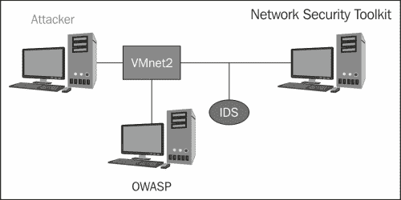

您将下一步需要在网络安全工具包机器上启动 Snort 传感器。我们在本章前面介绍了这方面的步骤。

### 注

在正确的接口上启动传感器，选择连接到 VMnet2 的接口。在本书中，我们使用 eth1 接口。

传感器启动并运行后，启动基本 GUI 并清除当前列出的所有警报。我们要做的下一件事是从 Kali Linux 机器对 OWASP 机器进行扫描。我们可以使用任何我们想要的工具，但是为了演示，我们将使用我们之前使用的 Nikto 工具。OWASP 机器的目标 IP 地址是`10.2.0.132`，这是我们将在工具中使用的地址。在 Kali Linux 终端窗口中，输入`nikto –h 10.2.0.132`扫描 OWASP 机器。返回基本显示屏，查看是否检测到攻击。

以下屏幕截图显示了一个示例：


显示基本显示的屏幕（剪切的文本不重要）

正如前面的截图所示，流量已经生成了一些警报。接下来我们要做的是查看传感器生成的警报。点击**100%**，这将显示传感器报告的警报列表。当我们使用 Nikto 工具时，我们正在寻找与 web 流量相关的警报。以下屏幕截图显示了一个示例：


我们现在有了警报，所以选择其中一个并进一步检查它。在本章的前面，当我们检查警报时，我们看到了有关生成警报的数据包的附加信息。然而，我们没有关于数据包有效载荷的任何信息。这是因为没有可捕获的有效载荷。由于这些数据包是攻击模式，我们有更好的机会找到有效负载。目录遍历攻击的有效负载示例如以下屏幕截图所示：


您可以看到，虚拟交换机上的传感器不需要像物理交换机那样使用范围或镜像来查看网络流量，因此我们已经准备好进入另一部分。

# 规避

在这一节中，我们将讨论规避问题。这来自于经常提到的**永不被抓住的概念！**虽然这确实有助于提高戏剧效果，但现实情况是渗透测试很少要求这样做。此外，这在很大程度上取决于管理员如何配置其环境。我们不能保证我们会通过，但我们可以进行实验，至少找到一些可能有效的东西，如果这是我们工作范围的一部分。

## 确定阈值

我们想要关注的是，所有这些工具都必须有某种形式的阈值，当它们达到该阈值时会保持警惕。在这里我们可以找到逃避侦查的方法。如果我们重新访问 Snort 传感器并清除所有现有警报，我们可以尝试一些不同的方法来查看何时被检测到以及何时未被检测到。

### 注

需要记住的一点是，任何带有非法标志组合的扫描都会立即被检测到，因此，如果规避是您工作范围的一部分，请避免这些扫描。

对于 Snort 传感器，阈值似乎在五个关闭端口左右，即接收 RST 数据包可以让您检测到；因此，只要您在任何时间停留在五个扫描端口以下，就不会被检测到。

## 压力测试

我们可能需要对 IDS 传感器执行的另一种测试类型是压力测试。通过这种技术，我们会产生大量噪声，看看攻击是否能被噪声掩盖，或者传感器是否会被淹没并停止工作。在 Kali 发行版中，有许多用于此的工具，欢迎您试用。您可以通过导航到**应用****Kali Linux****压力测试**并查看其中的程序来找到它们。我们将把这个测试留给你做家庭作业。您将发现 IDS 工具已经存在了足够长的时间，不会被这些攻击淹没。话虽如此，但总有机会，这就是我们报道它的原因。

## 外壳代码混淆

在检测漏洞时，检测到的数据是 shell 代码；此外，该代码的签名。因为它是一种标准，所以工具很容易检测到它。我们现在来看看这个。您将需要您的 Kioptrix 机器，因为我们将利用它。我们已经讨论了许多实现这一点的方法，出于我们的目的，我们将使用 metasploit 工具对其进行开发。当我们试图避免检测时，有许多参数可以操纵，不幸的是，没有保证。如果您使用 Armitage 工具，那么您可以选择**显示高级选项**来查看我们可以使用的其他参数。以下屏幕截图显示了一个示例：


我们将首先使用默认设置进行攻击，以查看基本工具检测到了什么。再说一次，当涉及到逃避时，没有保证，所以这是一个实验和记录你的发现的问题。以下屏幕截图显示了利用漏洞的尝试示例：

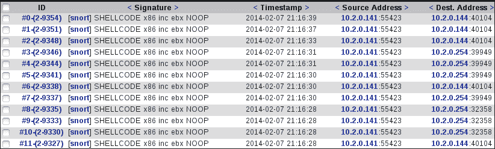

正如前面的屏幕截图所示，我们没有成功，所以现在我们将修改有效负载，看看我们是否有更好的运气。这是一个过程：你尝试不同的事情，发现什么是有效的，什么是无效的。这就是为什么很少要求逃避是件好事。

在高级选项中，我们可以修改一些参数，但在编写本书时，我们无法成功地使用这些工具逃避检测。如果您想了解更多信息，您可以收集更多信息并查看为防病毒规避而编写的脚本，网址为：[http://healthtalkie.com/discussion/script-for-av-evasion-uz3mb.php](http://healthtalkie.com/discussion/script-for-av-evasion-uz3mb.php) 。

关于逃避，我们还有最后一件事要做。有时，尝试不同的端口更容易，因为您知道，默认情况下不会被 IDS 检查。这种遗漏是正常的，因为流量会产生太多误报。

在本章前面，我们使用 Nikto 工具对网络安全工具包进行了扫描，但没有检测到任何内容。现在，我们将更仔细地了解这一点。我们对 NST 进行的扫描是针对端口 443 和协议*HTTPS*。未检测到的原因可能不止一个。首先，我们将测试它是否未被检测到，因为攻击是针对端口 443 的，而端口 443 实际上是加密的流量，而 IDS 对此视而不见。关于如何完成此测试，我们有两个选择。我们可以在 NST 虚拟机上打开 web 服务器，也可以在 OWASP 机器的服务器上激活 HTTPS 协议。我们将使用 NST 机器；我们必须导航到配置文件并取消对 HTTP 行的注释，以使其在机器上运行。在终端窗口中，输入`gvim /etc/httpd/conf/httpd.conf`打开配置文件。

向下滚动至服务器配置部分，删除`#`以取消注释`Listen 80`，如下图所示：

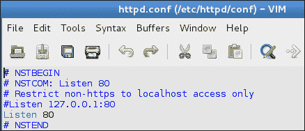

编辑完成后，导航至**文件****保存退出**退出编辑器。接下来要做的是重新启动 web 服务器。在终端窗口中，输入`service httpd restart`重新启动服务。一旦服务重新启动，我们将使用 Nikto 对 NST 机器进行扫描。对于第一次扫描，我们将使用 SSL 选项，但在执行此操作之前，请确保清除库中的所有查询。返回您的 Kali 机器并扫描 NST 机器的 IP 地址。在我们的示例中，机器地址是 10.2.0.144，这就是我们将使用的地址。在终端窗口中，输入`nikto -ssl -h 10.2.0.144`。扫描完成后，返回基地，查看是否检测到扫描。你被发现了吗？答案应该是否定的！为什么会这样？好吧，在我们回答这个问题之前，就像所有好的测试一样，我们将证明这一点。基本显示中不应有任何警报。返回您的 Kali 机器，再次运行扫描，而不强制它通过 SSL。在终端窗口中，输入`nikto -h 10.2.0.144`。扫描完成后，返回基本显示屏，查看是否检测到扫描。以下屏幕截图显示了仪表板的示例：


显示基本显示的屏幕（剪切的文本不重要）

正如前面的屏幕截图所示，我们可以将攻击指向 SSL 端口 443，但传感器没有设置警报。这是很常见的，但是管理员总是有可能打开规则来检查 HTTPS 流量。然而，它确实为我们提供了一种潜在的逃避检测的方法。同样，您的成功也会有所不同，但如果它是工作范围的一部分，这些技术中的一些可能会帮助您规避客户的监控能力。这种技术也是隧道的过程，我们在另一个端口（如 SSH 端口）上隧道协议，以便 IDS 不会像通常加密的那样检查它。

# 总结

在本章中，我们讨论了在靶场体系结构中构建 IDS/IPS 功能的需求。我们讨论了如何部署基于网络的 IDS 以及在每个网段上放置传感器的配置。我们部署了 Snort ID，并在部署后检测到大量攻击。

在网络 ID 之后，我们研究了基于主机的保护和赛门铁克的一款产品，该产品提供了多种端点保护方法。我们试图使用网络攻击工具 Nikto 攻击该机器，并在检测到攻击后触发软件阻止 IP 地址。我们完成了端点保护部分，尝试将恶意文件传输到计算机，Symantec 工具成功检测到该文件，并在文件传输到计算机之前将其删除。

最后，我们在结束这一章时讨论了回避问题。我们解释说，在专业测试范围内很少要求这样做，但有可能这样做。正如本章所讨论的，在这方面没有保证，因为我们只有在配置设备的管理员允许的情况下才能取得成功。话虽如此，当我们使用已知包含加密数据的端口时，成功率最高。此外，我们通过扫描端口 443 上的网络安全工具包虚拟机来验证这一点，但当我们在端口 80 上运行攻击时，我们被检测到。

本章到此结束。现在，您已经在靶场环境中部署了 IDS/IP，并且已经看到了逃避检测的方法。在下一章中，我们将研究如何将 web 服务器和 web 应用添加到我们的系列体系结构中。