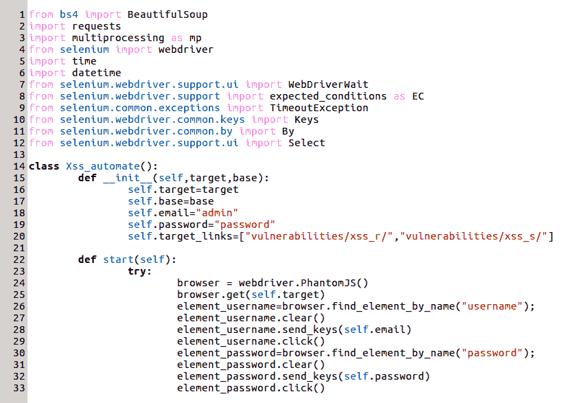
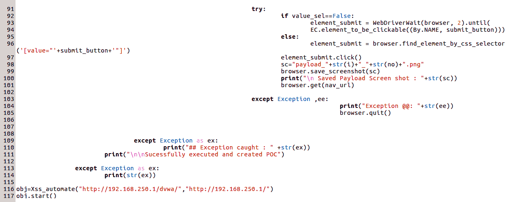
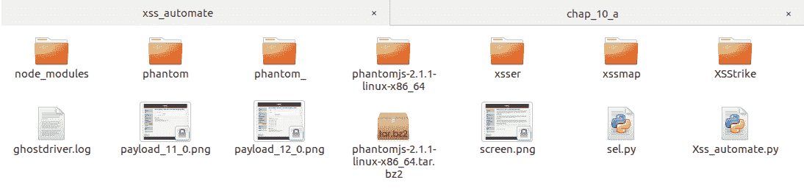
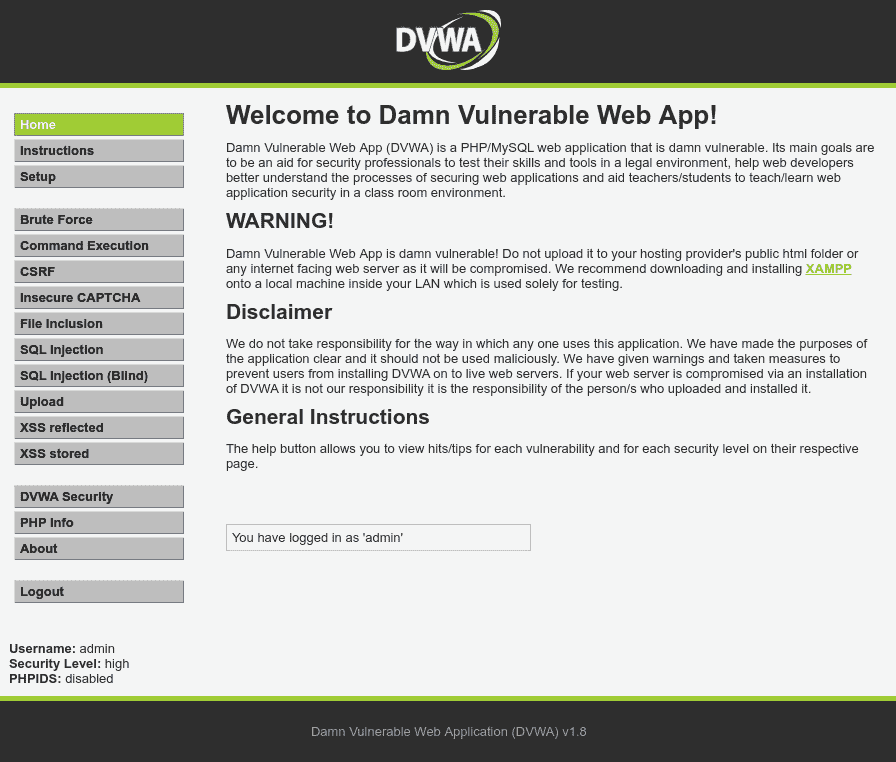
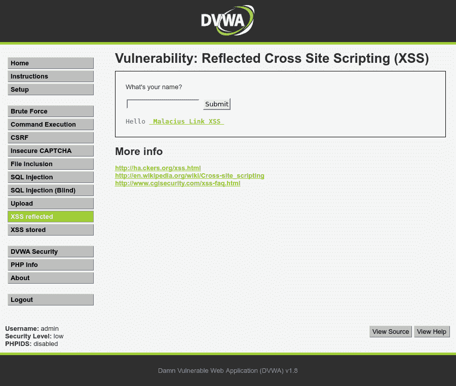
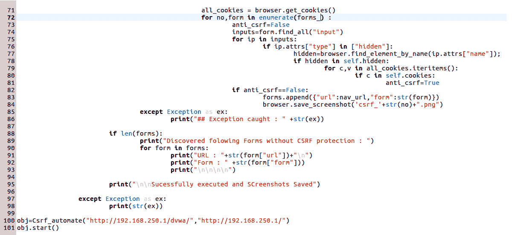
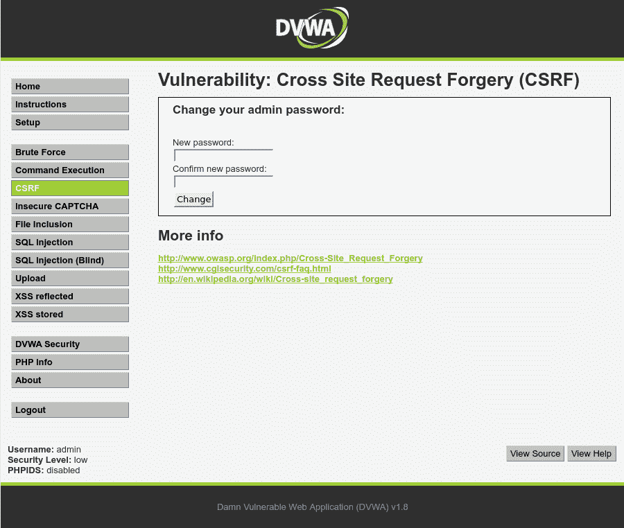

# 自动 Web 应用扫描.第 2 部分

继续上一章的讨论，我们现在将学习如何使用 Python 自动检测**跨站点脚本**（**XSS**）、**跨站点请求伪造**（**CSRF**）、点击劫持和**安全套接字层**（【T10 SSL】）剥离。我们将在本章中讨论的所有技术都将帮助我们加快 web 应用评估过程。我建议您不要局限于我们将在本章中讨论的方法。讨论的方法可以作为基线，同样的想法可以扩展和改进，以获得更好的解决方案或开发工具来帮助笔测试社区。本章将讨论以下主题：

*   跨站点脚本
*   跨站点请求伪造
*   点击劫持
*   SSL 条带（缺少 HSTS 标头）

# XSS

**XSS**攻击属于 web 应用攻击的注入类。它们主要是由于没有清理从最终用户传递到 web 应用的用户输入而导致的。这不会导致服务器受到危害，但对用户数据的危害是非常严重的。当攻击者能够将某种 Java 脚本或 HTML 内容注入将提供给用户的网页时，就会发生攻击。此恶意内容可能试图从访问网站的用户处窃取敏感信息。在以下部分中，我们将了解不同类型的 XSS 攻击。

# 存储或类型 1 XSS 攻击

**存储 XSS**是指攻击者提供的恶意输入被持久化并存储在后端数据库或存储库中的攻击。每当检索并呈现该内容以显示在网页上时，浏览器完全不知道该内容，它要么执行来自数据库的恶意 JavaScript，要么呈现恶意 HTML 标记，而不是将其显示为文本。存储的 XSS 将永久保留在数据库中，并将影响访问受影响网页的所有用户。

# 反射或类型 2 XSS 攻击

反射式 XSS AUTT1 攻击是第二类 XSS 攻击向量，其中恶意 XSS 有效载荷不存储在数据库表中用于持久性，但仍注入到返回给用户的 Web 页面的某些参数中。浏览器不知道这一变化，只是简单地呈现注入的恶意 HTML 或执行注入的恶意 Java 脚本代码，再次导致用户的数据受到损害。

# 基于 DOM 或类型 0 的 XSS 攻击

基于**文档对象模型的 XSS 是第三类 XSS 攻击。在这里，XSS 负载不会发送到服务器，但由于实现缺陷以及在客户端 JavaScript 的帮助下更改网页的状态/DOM，攻击者会使用负责操纵网页状态的 JavaScript 对获取的负载进行调整。**

我们这里的重点是了解如何使用 Python 自动检测 XSS。

# 用 Python 实现 XSS 的自动检测

在这里，我们将看到一种使用 Python、Beautifulsoup、Selenium 和 Phantomjs 在 web 应用中自动检测 XS 的方法。

让我们通过运行以下命令来安装依赖项：

```
pip install BeautifulSoup
pip install bs4
pip install selenium
sudo apt-get install libfontconfig
apt-get install npm
npm install ghostdriver
wget https://bitbucket.org/ariya/phantomjs/downloads/phantomjs-2.1.1-linux-x86_64.tar.bz2
tar xvjf phantomjs-2.1.1-linux-x86_64.tar.bz2
sudo cp phantomjs-2.1.1-linux-x86_64/bin/phantomjs /usr/bin/
sudo cp phantomjs-2.1.1-linux-x86_64/bin/phantomjs /usr/local/bin/
```

让我们了解每种方法的目标：

*   **BeautifulSoup**是一个出色的 Python 库，用于抓取和解析网页。
*   **Selenium**是一个用于自动测试 web 应用的自动化框架。它的功能在安全领域尤其重要，用于浏览器模拟和自动遍历 web 应用的工作流。
*   **Phantomjs**是一个用于无头浏览的实用程序。它执行浏览器的所有活动而不实际加载它，而是在后台运行它，这使得它轻量级且非常有用。

安装 Phantomjs 后，需要在控制台上执行以下命令：`unset QT_QPA_PLATFORM`。这用于处理 Ubuntu 16.04 上 Phantomjs 版本引发的错误，如下所示：`Message: Service phantomjs unexpectedly exited. Status code was: -6`。

应该注意，本练习的目标是模拟正常的用户行为，并在 web 应用中找到注入点。我们所说的*注入点*是指用户可以提供输入的所有输入字段。为了找到注入点，我们将使用`BeautifulSoup`库。从网页中，我们提取类型为 text、password 或 textarea 的所有字段。一旦找到注入点，我们将使用 selenium 在注入点中传递有效负载值。在注入点中设置有效负载后，我们将再次在`BeautifulSoup`的帮助下找到表单的提交按钮。之后，我们将提交按钮的 ID 传递给 silinium，单击它，以提交表单。

我们将使用的有效载荷为`<a href=#> Malicious Link XSS </a>`。如果这是创建的，我们可以推断该网站易受 XSS 攻击。还必须注意的是，在提交有效负载后，我们还捕获了网页的屏幕截图，以查看链接是否实际创建，这将作为概念证明。

需要注意的是，我们将在本地 IP`http://192.168.250.1/dvwa`上运行的 DVWA 应用上演示我们脚本的概念验证。正如我们所知，应用需要用户登录。我们将首先让脚本自动登录到应用中，然后设置适当的 cookie 和会话。然后，在登录之后，我们将导航到 XSS 所在的页面并执行上述操作。我们还将更新 cookie 值并设置 security=low，以便在 DVWA 应用中实现 XSS。应该注意的是，相同的概念可以扩展并应用于任何 web 应用，因为我们使用一种非常通用的方法来识别注入点并在其中提交有效负载。修改脚本并根据需要进一步扩展它。我将致力于在这个脚本之上开发一个功能齐全的 XSS 检测工具，它将位于我的 GitHub 存储库中。请随时捐款。

在下一节中，我们将了解极端自动化。

# 动作脚本

让我们将脚本命名为`Xss_automate.py`并添加以下截图所示的内容：






现在可以按如下方式运行脚本：


让我们检查一下当前路径，看看是否创建了屏幕截图：



如前所述，创建并捕获了三个屏幕截图。让我们打开每一个来验证概念证明。以下是我们使用脚本成功登录后看到的屏幕截图：



以下屏幕截图显示了通过创建链接利用反射的 XSS 漏洞的情况。请注意安全性的值，该值设置为低：



以下屏幕截图显示了存储的 XSS 漏洞：


应该注意的是，我们只在两个页面中应用了前面的方法来检测 XSS，只是为了减少执行时间并展示这个概念的威力。但是，这可以扩展到应用的所有 web 页面。我们需要删除检查从`<a>`标记获取的 URL 是否存在于列表中的条件：`self.target_links=["vulnerabilities/xss_r/","vulnerabilities/xss_s/"]`。尝试此方法，删除此条件，并在需要时修改脚本以查看其内容。

# CSRF

**CSRF**是一种攻击，攻击者借助该攻击以允许代表当前登录用户执行某些操作的方式利用有效用户会话。例如，假设管理员用户登录到应用，并且在浏览器中设置了有效的会话 cookie。管理员可以通过单击 delete all 按钮从网站中删除所有用户，该按钮在内部调用 HTTP 请求`http://www.mysite.com/delete?users=all`。web 浏览器的一个属性，用于在用户登录到应用后，将会话参数/cookie 发送到服务器，以满足后续的每个请求。攻击者可以通过制作一个包含 HTML 图像的假页面（如``）来利用此漏洞。攻击者可以将此假页面的链接发送给当前登录其网站`mysite.com`的管理员。如果管理员用户未意识到恶意意图，则会代表他们触发删除所有用户的 HTTP 请求，并发送有效的会话 cookie，从而导致服务器删除所有用户。

# 用 Python 自动检测 CSRF

在这里，我们将研究一种方法，我们将使用 Python、Beautifulsoup、Selenium 和 Phantomjs 在 web 应用中自动检测 CSRF。然而，在自动检测之前，让我们讨论一下我们将采取的方法。我们知道，通过实施反 CSRF 令牌，可以减轻 CSRF 攻击。

从服务器提供的任何可能修改服务器状态的表单都应该有一个隐藏字段，其中包含一个称为 CSRF 令牌的随机加密值。大多数 CSRF 令牌背后的原理是，此表单和 cookie 还必须设置一个神秘值，该值转换为隐藏字段中服务的令牌的相同值。当表单发回服务器时，将提取 cookie 的秘密值，并在隐藏字段中将其与发回服务器的隐藏值进行比较。如果两个秘密都匹配，则假定请求是真实的，并进一步处理。

我们将在检测机制中使用相同的方法。对于任何将发布回服务器的表单，我们将提取所有输入字段，并将它们与各种技术（如 Java、PHP、Python/Django、ASP.NET 和 Ruby）中 CSRF 常用的隐藏字段参数名称列表进行比较。此外，我们还将查看在提交表单之前设置的 cookie，并将 cookie 的名称与所有知名技术堆栈中用于 CSRF 保护的常用名称进行比较。

同样，应该注意的是，脚本将模拟正常的人类行为。它将登录到应用并维护有效会话，然后尝试查找 CSRF 缺陷。最常用的 CSRF 隐藏场参数以及技术堆栈如下所示：

*   `ASP.NET [Hiddenfiled : __RequestVerificationToken, Cookie : RequestVerificationToken]`
*   `PHP [Hiddenfiled : token, Cookie : token], [Hiddenfileld :_csrfToken, Cookie : csrfToken]`
*   `PHP [Hiddenfiled : _csrftoken, Cookie : csrftoken]`

前面的列表可能更详尽，但就我们的目的而言，它是可以的。我们将使用 DVWA 应用创建概念验证脚本。

# 动作脚本

让我们继续创建一个名为`Csrf_detection.py`的脚本，内容如以下屏幕截图所示：




当我们执行脚本时，我们得到以下输出：


创建的屏幕截图如下所示：


DVWA 应用捕获的屏幕截图如下所示：



应该注意的是，我们使用前面的方法仅在一个页面中检测 CSRF，只是为了减少执行时间并展示概念的威力。但是，这可以扩展到应用的所有 web 页面。我们需要删除检查从`<a>`标记获取的 URL 是否在列表中的条件：`self.target_links=["vulnerabilities/csrf"]`。尝试相同的方法，删除此条件，并在需要时修改脚本以查看其涵盖的内容。

# 点击劫持

**点击劫持**是一种攻击，攻击者将定制的攻击页面覆盖在合法网站或网页上。考虑 CSRF 攻击案例中提到的相同场景。可以删除所有用户的网页可以透明化，用户看不到页面上的按钮。因此，可见的是合法网页透明层下方的攻击页面。例如，攻击者可以制作一个显示 iPhone 产品的网页，在透明按钮**删除所有用户**下可能会有一个按钮，上面写着**立即赢得 iPhone**。因此，当受害者**管理员用户**认为他们在点击 win iPhone 按钮时，他们实际上是在点击从数据库中删除所有用户的透明按钮。

网站防止点击劫持的方法之一是实现一个称为 X-Frame-Options 的特殊标题，该标题在下一节中定义。

# X-Frame-Options

有一个名为**X-Frame-Options**的特殊 HTTP 响应头，通过该头，网站可以声明它不应在 Frame 或 iframe 中呈现。客户端浏览器在收到此标头时，会检查在帧限制内设置的值，并根据设置的值采取适当的操作。各种数值如下所示：

*   **拒绝**：此值将阻止网页加载到框架或 iFrame 中。这是建议使用的值。
*   **SAMEORIGIN**：如果试图将页面加载到 iframe 中的页面与正在加载的页面来自同一来源，则此值仅允许将页面加载到 frame 或 iframe 中。
*   **ALLOW-FROM**：该值定义允许将页面加载到框架或 iframe 中的位置。

# 用 Python 自动检测点击劫持

在这里，我们将看到一种方法，我们将使用它来查看网站是否容易被点击劫持。我们将使用一个简单的 Python 脚本来检查应用呈现的响应头中是否存在 X-Frame-Options。我们将调用脚本`CJ_detector.py`并添加以下内容：


我们将运行脚本，查看 DVWA 应用是否受到了点击劫持保护：


# SSL 剥离（缺少 HSTS 标头）

【结果】SSL 剥除，Stl T1 或 St2 T2，SSL 降级，AUT3 T3 是攻击 HTTP 连接到 HTTP 的攻击向量。此攻击由位于受害者和 web 服务器之间并充当透明代理的攻击者执行。它还与受害者保持基于 HTTP 的下游连接，并与服务器保持正确的 HTTPS 上游连接。

因此，通过结合 ARP 中毒、SSL 剥离以及在攻击者和受害者之间设置透明代理来实施攻击。假设受害者想要访问一个名为`abc.com`的网站。默认情况下，服务器通过 HTTPS 将`abc.com`作为`https://www.abc.com`提供服务，但当用户在浏览器中键入 URL`abc.com`时，浏览器将请求作为`http://www.abc.com`发送给服务器，服务器以 302 响应进行响应，并将用户重定向到`https://www.abc.com`。需要注意的是，当用户键入`abc.com`时，从用户浏览器到服务器的第一个请求通过普通 HTTP 进行。这就是攻击者使用 SSL 条进行攻击的原因。

考虑攻击者谁放置在同一网络上谁是 ARP 中毒受害者和路由器。在这种情况下，受害者对`abc.com`的请求首先到达攻击者。攻击者设置了一个透明代理，可以从中将请求转发到实际服务器。服务器以 302 响应进行响应。攻击者代理向`https://abc.com`发送请求并接收响应，响应只不过是一个网页。攻击者代理还具有解析整个响应的附加功能，将所有 HTTPS 链接替换为普通 HTTP，然后将普通页面呈现回受害者。在下一个请求中，受害者发布其凭据，而不知道流量正在通过攻击者。

为了防止这种攻击，网站必须在发送给客户端的响应中包含一个特殊的头。此标题将保存在浏览器首选项中，然后每当连接到网站时，第一个请求本身将通过 HTTPS 发送；因此，使攻击者无法嗅探流量。

**HTTP 严格传输安全**（**HSTS**）是浏览器记住此主机是 HSTS 主机并将详细信息保存在浏览器首选项中的安全机制。因此，每当再次访问此站点时，即使用户在浏览器中键入`abc.com`，在向服务器释放请求之前，浏览器也会在内部将请求转换为 HTTPS，因为它会检查其 HSTS 列表并找到目标主机或服务器投诉。如果第一个请求是 HTTPS，则攻击者没有窗口来降级该请求。

# 用 Python 自动检测缺失的 HST

在这里，我们将看到一种方法，我们将使用它来确定网站是否容易受到点击劫持。我们将使用一个简单的 Python 脚本来检查应用呈现的响应头中是否存在严格的传输安全性。我们将脚本命名为`HSTS_detector.py`并在其中放入以下内容：


让我们运行脚本，看看应用 DVWA 是否受到点击劫持的保护：


# 总结

在本章中，我们讨论了使用 Python 自动化 web 应用扫描和评估的方法。我们了解了如何使用 Python 自动检测 web 应用漏洞，如 XSS、CSRF、clickjacking 和 SSL 剥离。所有这些都可以在实际评估中非常方便，并将帮助笔测试人员更好地掌握使用 python 实现自动化。

在下一章中，我们将探讨与反向工程、模糊化和缓冲区溢出相关的各种概念。

# 问题

1.  Python 还可以自动化哪些应用安全用例？
2.  我们如何使用 Python 集成网络扫描和 web 应用扫描？

# 进一步阅读

*   学习 Python web 渗透测试：[https://www.lynda.com/Python-tutorials/Learning-Python-Web-Penetration-Testing/521198-2.html](https://www.lynda.com/Python-tutorials/Learning-Python-Web-Penetration-Testing/521198-2.html)
*   用于戊酯的 Python:[https://www.pentesteracademy.com/course?id=1](https://www.pentesteracademy.com/course?id=1)
*   使用 Python 和 Kali Linux 的渗透测试自动化：[https://niccs.us-cert.gov/training/search/pluralsight/penetration-testing-automation-using-python-and-kali-linux](https://niccs.us-cert.gov/training/search/pluralsight/penetration-testing-automation-using-python-and-kali-linux)