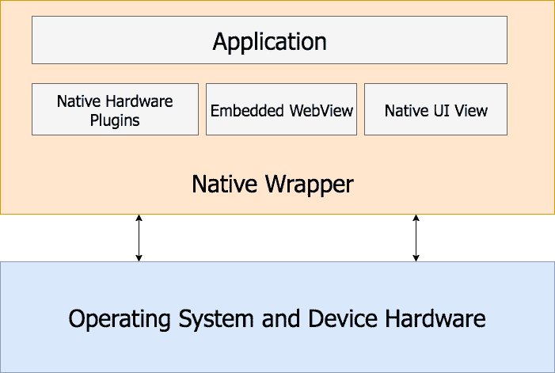
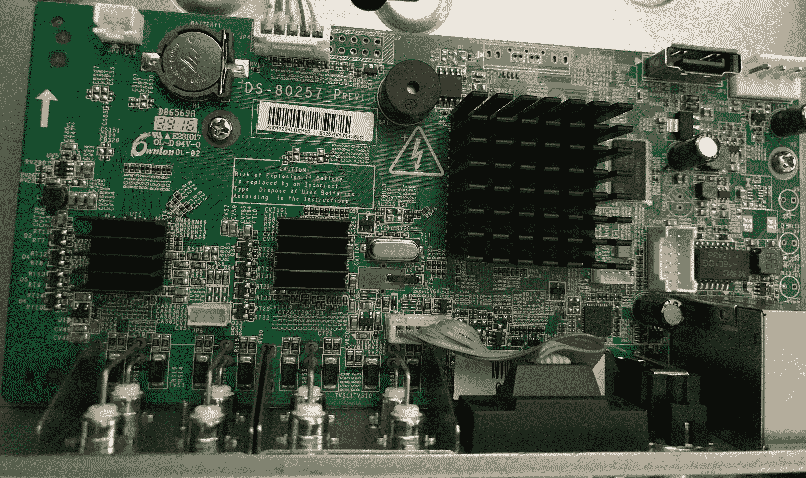

# 一、物联网渗透测试

尽管**物联网**一词是麻省理工学院的自动识别实验室在 1999 年创造的，但嵌入式设备在技术上已经存在了几十年。新的物联网和嵌入式设备世界之间的区别在于传统的设计决策和配置，这些决策和配置从未打算在互联网上公开。在制造公司不考虑后果的情况下，物联网设备的广泛利用正在发生，导致了有记录以来世界上最大的**分布式拒绝服务**（**DDoS**攻击。我们将涵盖物联网笔测试的各个方面和实用安全指南，以提供针对我们目前在市场上看到的攻击的预防措施。

要了解物联网的起源，您可以访问以下链接：

[http://autoid.mit.edu/iot_research_initiative](http://autoid.mit.edu/iot_research_initiative)

上述 DDoS 攻击的详细信息可通过以下链接找到：[https://www.us-cert.gov/ncas/alerts/TA16-288A](https://www.us-cert.gov/ncas/alerts/TA16-288A)

在本章中，我们将介绍以下主题：

*   定义物联网生态系统和 pen 测试生命周期
*   固件 101
*   物联网中的 Web 应用
*   物联网中的移动应用
*   设备基础知识
*   物联网无线通信简介
*   建立物联网笔测试实验室

本章的目标是为物联网渗透测试奠定基础，然后将在随后的章节中使用。

# 介绍

本章重点介绍执行物联网渗透测试时所需的基础知识。它提供了有关物联网内许多攻击面的基本概念，并为协助测试人员启动物联网测试实验室奠定了基础。

我们将讨论物联网渗透测试的当前状态和可能攻击面的每个区域，以解决测试多年来的进展情况。然后我们将介绍固件安全性、web 应用安全性、移动应用安全性、硬件安全性和无线电通信的基础知识。

最后，我们将向您介绍如何设置测试所需的软件工具和硬件工具。

# 定义物联网生态系统和渗透测试生命周期

在过去几年中，由于物联网设备的部署数量巨大、提供的便利性、易用性以及它们在我们社会中造成的潜在安全风险，人们的注意力一直集中在物联网设备上。随着物联网的繁荣在我们眼前发生，我们作为一个民族更接近于一个技术奇点。对物联网和互联网的依赖使他们对安全、隐私和安全产生了担忧。由于设备扩散到所有垂直行业，如消费者、娱乐、商业、医疗、工业、能源和制造业，已证明消费者以及商业技术运营商和所有者无法正确确保这些设备的安全。依靠设备制造商提供适当的保证，确保设备采用设计安全等方法制造，这在很大程度上取决于设备制造的行业。

每个行业和地区都有各自的测试设备法规。重要的是，在测试之前，自己进行尽职调查，以确保不违反法律。在一些地区，如美国，消费类设备的安全研究被允许并免于遵守**数字千年版权法**（**DMCA**），只要该研究是善意的，是合法获得的，在受控环境中进行的，并且不违反**2016 年 10 月的《计算机欺诈和滥用法案》**（**CFAA**）。这意味着对联网车辆、摄像头、各种智能家居设备、视频游戏机和越狱移动设备的安全研究现在是合法的。经过与 DMCA 和安全社区的长期斗争，这是一个巨大的胜利。

既然这样的法律已经通过，这就是我们进来的地方；我们将评估设备固件、web 应用、移动应用、硬件和无线电通信。首先，我们需要了解物联网的全部范围，包括渗透测试方法和生命周期，以识别其所有攻击面。让我们讨论每个物联网组件的基本原理，以了解攻击。

# 渗透测试方法

测试应用、网络和设备的安全缺陷对于保持互联网更安全至关重要。无论测试是由制造商、第三方咨询公司、企业安全团队还是安全研究人员进行，方法都会根据提供给执行评估的测试人员的信息而有所不同。理想情况下，综合测试应包括整个物联网系统及其基础设施，而不仅仅是设备本身，但由于价格或技术能力，测试仅包括物联网系统的一个子集并不少见。

# 黑匣子

黑盒评估是常见的，且已知其成本相对较低。这些类型的评估是在事先不了解所采用的技术或设备实现的情况下进行的。通常情况下，黑盒评估由安全研究人员或第三方咨询公司执行，但也可以由内部安全团队进行风险评估。

责任披露说明
如果通过安全研究发现漏洞，重要的是按照供应商网站的披露政策。如果供应商没有披露政策，CERT 可以协助适当披露报告的错误。有关 CERT 漏洞披露政策的详细信息，请参见[http://www.cert.org/vulnerability-analysis/vul-disclosure.cfm?](http://www.cert.org/vulnerability-analysis/vul-disclosure.cfm?) 。

# 白盒

白盒评估是指测试人员可以完全访问源代码、网络图、体系结构图、数据流图以及有关目标设备所采用技术的各种其他详细信息。通常，事先向测试人员提供的有关目标设备或应用的信息越多，测试结果越好。白盒评估成本更高，但也可以确保对设备的安全控制及其实施进行更彻底的审查。

# 灰盒

当测试人员对组织内部人员了解的知识有限或部分时，就会进行灰箱评估。这些评估可以由测试人员组成，他们只知道所使用的应用堆栈和库，而不知道 API 的详细文档。

有关 DMCA 安全研究的更多信息，请访问以下链接：[https://www.ftc.gov/news-events/blogs/techftc/2016/10/dmca-security-research-exemption-consumer-devices](https://www.ftc.gov/news-events/blogs/techftc/2016/10/dmca-security-research-exemption-consumer-devices) 。

# 固件 101

固件是一种写入硬件设备以控制用户应用和各种系统功能的软件。固件包含使软件能够访问硬件功能的低级编程代码。运行固件的设备称为嵌入式系统，具有有限的硬件资源，如存储能力和内存。运行固件的嵌入式设备包括智能手机、交通灯、连接的车辆、某些类型的计算机、无人机和有线电视机顶盒。

显然，嵌入式技术和运行在这些设备上的固件控制着我们的日常生活，从城市所依赖的关键基础设施，到银行自动柜员机和消费者居住的家庭。了解固件二进制文件的组成及其相关属性非常重要。固件由引导加载程序、内核、文件系统和各种其他资源组成。在嵌入式 Linux、嵌入式 Windows、Windows IoT 内核和各种**实时操作系统**（**RTOS**上构建了不同类型的固件。这本书将面向嵌入式 Linux 环境，但是，这些原则仍然与平台无关。

您可以通过以下链接了解有关固件的更多信息：
[https://wiki.debian.org/Firmware](https://wiki.debian.org/Firmware)

下图表示固件包含的内容：闪存内容、引导加载程序、内核和根文件系统：


图 1.1：固件内容

# 深入研究固件

让我们首先看看引导加载程序。引导加载程序的职责是初始化易失性数据存储的 RAM，初始化串行端口，检测机器类型，设置内核标记列表，加载`initramfs`（初始 RAM 文件系统），并调用内核映像。引导加载程序通过通常由第三方利用的**板支持包**（**BSP**来初始化硬件驱动程序。引导加载程序驻留在单独的**电可擦除可编程只读存储器**（**EEPROM**）上，后者不太常见，或者直接驻留在闪存上，后者更常见。将引导加载程序视为启动时 PC 的 BIOS。详细讨论每个引导加载程序的责任超出了本书的范围；但是，我们将强调引导加载程序在哪些方面对我们有利。ARM 和 MIPS 体系结构的一些常见引导加载程序有：Redboot、u-boot 和 barebox。一旦引导加载程序启动内核，文件系统就被加载。

固件中使用了许多文件系统类型，有时甚至根据设备使用专有文件类型。然而，一些最常见的文件系统类型是 SquashFS、cramFS、JFFS2、YAFFS2 和 ext2。设备（尤其是消费设备）中使用的最常见的文件系统是 SquashFS。有一些实用程序，如`unsquashfs`和修改后的`unsquashfs`用于从压缩的文件系统中提取数据。当供应商将 SquashFS 更改为使用不受支持的压缩时，例如 LZMA（在 SquashFS 4.0 之前，官方唯一支持的压缩是`.zlib`），将使用修改后的`unsquashfs`工具，并且与常规 SquashFS 文件系统相比，文件系统的起始位置将有不同的偏移量。我们将在本书后面讨论定位和识别偏移。

有关嵌入式 Linux 文件系统的更多信息，请访问以下链接：[http://elinux.oimg/b/b1/Filesystems-for-embedded-linux.pdf](http://elinux.oimg/b/b1/Filesystems-for-embedded-linux.pdf) 。

Sasquatch 是一个方便的工具，可用于提取修改后的 SquashFS 文件系统。Saskash 可在以下链接中找到：
[https://github.com/devttys0/sasquatch](https://github.com/devttys0/sasquatch)

类似地，有许多类型的文件压缩用于固件映像，例如 LZMA、`.gzip`、`.zip`、`.zlip`和`.arj,`等等。每种方法都有优点和缺点，例如压缩后的大小、压缩时间、解压缩时间，以及设备本身的业务需求。出于我们的目的，我们将文件系统视为包含配置文件、服务、帐户密码、哈希和应用代码以及启动脚本的位置。在下一章中，我们将引导您了解如何找到正在使用的文件系统以及正在使用的压缩。

# 固件供应链的发展

在文件系统中，设备专用代码驻留在 C、C++或其他编程语言（如 Lua）中。特定于设备的代码，甚至所有固件本身，可以是外包的第三方利用人员的混合体，称为**原始设计制造商**（**ODM**），或与**原始设备制造商**（**OEM**合作的内部利用人员。ODM 是嵌入式设备利用供应链中的一个重要组成部分。它们通常都是亚洲的小公司，一角钱一打。一些原始设备制造商信任他们在产品线上与之合作的 ODM，而另一些原始设备制造商将与只对一种产品收费最低的 ODM 开展业务。根据行业的不同，ODM 也可以称为供应商。需要注意的是，ODM 可以自由地与许多不同的 OEM 合作，甚至可以分发相同的代码库。你可能熟悉这个概念，甚至想知道为什么一个重要的公共咨询会影响十家以上的设备制造商来解决软件缺陷。这是由于 ODM 缺乏安全的利用生命周期流程和 OEM 的验证。ODM 完成其应用交付物（可能是 SDK 或 OEM 固件）后，OEM 将其代码库合并到固件中，固件可能与 web 界面上的 OEM 徽标一样小。根据 ODM 和 OEM 合并代码的方式，实现方式有所不同；然而，ODM 向 OEM 提供二进制文件并不少见。OEM 负责分发固件、管理固件和支持设备本身。这包括第三方研究人员报告的固件安全问题，如果 ODM 保留源代码，并且 OEM 只能访问二进制映像，这会给 OEM 带来压力。

在[第 3 章](03.html)*分析和利用固件*中，我们将学习如何通过识别文件系统、识别压缩并模拟二进制文件进行测试来反向工程固件二进制映像，以利用常见的固件问题。

# 物联网中的 Web 应用

网站，也称为 web 应用，不需要介绍。至少，web 应用包含前端 HTML、JavaScript、后端 web 服务器、应用服务器和数据库。随着 web 应用的发展，为了减轻后端基础设施或设备的计算负载，对前端代码（如 JavaScript）的严重依赖越来越频繁。互联网上的 Web 应用与通过嵌入式设备提供服务的 Web 应用略有不同。

您使用的 web 应用具有更多的依赖关系，包括分离 web 服务器、应用服务器、数据库服务器以及在后端运行的微服务。分离每台服务器是由于性能和可用性的原因。传统上，嵌入式 web 应用设计为在自己的自包含环境中运行。从广义上讲，对于嵌入式 web 应用的性能和可用性关注较少。

目前，物联网领域中使用了两种不同的 web 应用模型，例如混合云模型和嵌入式服务器独立模型。混合模式是提供**软件即服务**（**SaaS**）web 应用的供应商或制造商的组合，同时还连接运行固件的嵌入式设备的 web 应用。然后，数据从制造商的云与设备本地网络上的嵌入式设备同步。对于某些物联网设备，使用物联网云服务提供商 SDK，如 AWS 的物联网 SDK 和 Azure 的物联网 SDK，并将其内置到设备 web 应用堆栈中。为了在公司服务条款范围内以及在您所在地区的法律范围内，识别混合模式非常重要。许多使用混合模式的物联网公司通常使用第三方软件利用公司或 ODM 代表 OEM 托管其 web 应用。这些 ODM 的 web 应用通常为特定的 OEM 产品重新命名，这样在不代理通信的情况下就不会引起注意。

具有互联网功能的物联网设备的混合云模型可能如下图所示。用户访问设备界面，供应商云和用户设备之间的 web 服务在幕后进行更改或收集数据：


图 1.2 混合 web 模型

如前所述，嵌入式设备 web 应用使用嵌入式 web 服务器（如 lighttpd 或 nginx）在设备固件的内部运行，没有外部依赖关系。您可能熟悉这些独立的嵌入式 web 应用，它们可以在打印机、VoIP 电话和家庭路由器上运行。通常，输入会直接发送到设备固件，如果用户输入未经验证或消毒，攻击者可以在设备上下文中执行任意命令。在某些情况下，嵌入式 web 应用设计为仅在**局域网**（**局域网**）内运行，以防止外部攻击或出于管理目的。家庭物联网、工业和商业设备都是如此。通常，只有局域网本地可用的设备是出于安全目的，但正如我们所了解的，这并不是缓解攻击的权宜之计。以这种意图设计产品的设备制造商正在认识到，客户有意或无意地将其设备放在互联网上，给客户网络带来了风险。

下图演示了用户通过 web 浏览器连接到嵌入式独立 web 应用，而无需外部系统依赖项：


图 1.3：本地嵌入式 web 应用

# 网络通信

浏览器、嵌入式服务器和 web 应用服务器之间的通信通常通过 web 服务完成，例如通过 HTTP/HTTPS 上的**简单对象访问协议**（**SOAP**）/XML 或基于**表示状态传输**（**REST**）的 API。SOAP 请求由一个信封元素、一个`xmlns:soap`名称空间、一个`encodingStyle`属性和各种元素（如 SOAP body 元素）组成。有关 SOAP 的更多详细信息，请访问以下链接：
[https://www.w3schools.com/xml/xml_soap.asp](https://www.w3schools.com/xml/xml_soap.asp) 。

`HTTP SOAP`请求查询账户余额示例如下：

```
POST http://example.com/soap/webservices HTTP/1.1 
User-Agent: Mozilla/5.0 (Macintosh; Intel Mac OS X 10.12; rv:49.0) Gecko/20100101 Firefox/49.0 
Accept: text/html,application/xhtml+xml,application/xml;q=0.9,*/*;q=0.8 
Accept-Language: en-US,en;q=0.5 
Authorization: BasicYWRtaW46YWRtaW4= 
Content-Length: 821 
Content-Type: text/plain;charset=UTF-8 
DNT: 1 
Connection: keep-alive 
Host: example.com 

<soapenv:Envelope xmlns:soapenv="http://schemas.xmlsoap.org/soap/envelope/" xmlns:v1="http://example.com/webservices/BillingAccountSummary/V1"> 
   <soapenv:Header/> 
   <soapenv:Body> 
      <getAccountBalance> 
         <messageHeader> 
            <action>get</v1:action> 
            <scopeObject>AccountBalance</v1:scopeObject> 
            <revision>1.0</v1:revision> 
           <createdTimestamp>2017-01-13T09:15:01.469</v1:createdTimestamp> 
            <sourceInterface>WEB</v1:sourceInterface> 
            <messageIdentifier>00810187-101EDDA4</v1:messageIdentifier> 
            <functionName>getAccountBalance</v1:functionName> 
         </messageHeader> 
         <billingAccountIdentifier>1234566</v1:billingAccountIdentifier> 
      </getAccountBalance> 
   </soapenv:Body> 
</soapenv:Envelope> 
```

REST 风格的 API 利用各种 HTTP 方法来更新资源值，这些方法在传统 web 应用中可能不是标准的，例如 PUT 方法，以及删除 API 中的值的`DELETE`方法。REST 请求可以通过 URL（不推荐用于敏感数据）或通过**JavaScript 对象表示法**（**JSON**中的 HTTP 正文）使用参数调用。

将`test@example.com`电子邮件地址订阅到电子邮件分发列表的示例 REST 请求如下所示：

```
POST /rest/email/subscribe HTTP/1.0 
Host: example.com 
User-Agent: Mozilla/5.0 (Macintosh; Intel Mac OS X 10.12; rv:49.0) Gecko/20100101 Firefox/49.0  
Accept: text/html,application/xhtml+xml,application/xml;q=0.9,*/*;q=0.8 
Content-Type: application/json 
Content-Length: 160 
Connection: close 

{ 
  "subscriberId":"12345", 
  "emailAdress":"test@example.com", 
  "confirmed":"Y" 
} 
```

为了查看 SOAP 或 REST 请求，需要中间人代理。Burp Suite 和/或 OWASP ZAP 等工具用作 web 代理，以查看从浏览器和移动应用向应用的 web 后端基础结构发出的所有请求。稍后我们将在[第 4 章](04.html)*嵌入式 Web 应用的利用*中介绍设置代理应用流量的配置。

由于涉及物联网，web 应用是控制设备的常用方式，从内部和外部网络的角度来看，它只是一个攻击入口点。在[第 4 章](04.html)*嵌入式 Web 应用利用*中，我们将学习如何识别常见的物联网 Web 应用缺陷和漏洞。

# 物联网中的移动应用

在物联网领域，移动应用与前面讨论的 web 应用模型类似。尽管讨论移动设备平台的安全模型的具体细节超出了本书的范围，但掌握移动应用利用模型的基础知识将有助于进一步测试。

# 混合的

安装在 Android、iOS 或 Windows phone 设备上的移动应用可以是混合的，也可以是本机的。虽然混合和本地这两个术语在移动应用意义上与 web 应用意义不同，但它们的原理是相似的。混合应用利用了两种 web 技术，如 HTML/HTML5、CSS 和 JavaScript，以及一些本机平台硬件，如 GPS 或蓝牙。只有通过使用混合框架提供的插件才能访问硬件资源。可以将混合应用看作是打包成本地平台可以使用的包装器的 web 应用。这意味着 web 利用人员现在可以编写移动应用，而无需学习新语言。

混合应用在多个平台（如 Windows Phone、Android 和 iOS）上使用一个代码库，这在考虑首次上市物联网设备时是一个巨大的优势。使用称为 WebView 的嵌入式 web 浏览器通过 web 调用应用。目前市场上最流行的应用使用了许多混合框架，例如 ApacheCordova、AdobePhoneGap 和 Xamarin 等。

每个移动混合框架都包含第三个市场，其中包含各种功能的插件。有些框架，如 Xamarin，是用一种编程语言（C#）编写的，并被翻译成本地语言（Objective C 和 Java），以便于快速利用。众所周知，这些移动框架有许多安全建议，从本机平台上的关键远程代码执行问题到隐私问题。如果您碰巧注意到正在使用某个移动混合框架，那么最好查看一个漏洞数据库，以便轻松取胜。

为了让您更好地了解运行混合应用所需的体系结构，下图显示了应用代码、Web 视图、插件和移动设备本身之间的不同组件。请记住，大多数包装器代码和插件都是由混合框架或为框架做出贡献的第三方利用人员利用的：



混合应用实例

# 本机应用

本机应用是为特定操作系统构建的，并使用设备平台的本机语言编写，如 Java、Objective C、Swift，甚至针对 Windows Phone 的 C#。本机应用使用各自的平台 SDK，该平台允许应用访问摄像头、蓝牙和 GPS 等硬件。本机应用的性能和安全性更好，但它们依赖于熟悉本机语言的经验丰富的利用人员。在某些情况下，由于平台 API 经常更新和弃用语言类或方法，这可能会给利用人员带来困难。越来越多的平台（如 iOS 和 Android）正在利用本机安全 API，利用者无需使用第三方库即可利用这些 API。这对于安全通信和安全数据存储非常重要。

本机架构比混合应用架构简单得多。下图显示了直接在设备上运行本机代码的本机应用，无需第三方组件访问硬件资源：


本机应用示例

了解每种移动应用模型的优缺点对于高效测试非常重要。由于将设备控制权委托给移动应用，它们是进入设备的另一个攻击入口点，有时比另一个入口点更容易。在[第 5 章](05.html)*物联网移动应用的利用*中，我们将在剖析物联网设备的同时，深入研究物联网移动应用中最常见的一些漏洞。

# 设备基础知识

设备硬件从**印刷电路板**（**PCB**开始，由玻璃纤维、铜、焊接掩模、丝网、迹线和焊盘组成。电阻器、电容器、Wi-Fi 芯片、EEPROM、串行和微控制器等组件焊接在 PCB 上。有各种各样的薄铜箔层使 PCB 导电，也有绝缘层使其不导电。在查看 PCB 时，识别感兴趣的组件非常重要。感兴趣的组件包括直接或间接进入设备固件的输入源。EEPROM、NAND 闪存、**通用异步收发器**（**UART**）和**联合测试行动小组**（**JTAG**）等组件是测试中最常见的组件。

这就是**数字录像机**（**DVR**的 PCB 板的外观）：



PCB 板

# 硬件输入

EEPROM 是一种非易失性存储位置，可作为单个字节块进行读写。EEPROM 可通过电荷或紫外线照射擦除。与其他闪存类型类似，EEPROM 允许有限数量的写入周期。EEPROM 是一种感兴趣的芯片，因为固件可以加载在 EEPROM 上，并且可以从 PCB 上卸下到 EEPROM 读取器上进行进一步分析：


EEPROM
图像源：[https://cdn.sparkfun.coimg/parts/3/0/5/EEPROM.jpg](https://cdn.sparkfun.coimg/parts/3/0/5/EEPROM.jpg)

NAND 闪存是以块的形式写入和读取的，这种块通常存在于 USB 驱动器中，但也存在于物联网设备以及游戏机中。NAND 闪存通常包含一个设备的引导加载程序，该引导加载程序遵循各种指令启动操作系统，并且可以进行操作；我们将在本书后面的部分向您介绍这一点。

UART 是访问设备最常用的方式之一。制造商使用 UART 进行诊断、记录消息，并在部署设备时用作验证配置的调试控制台，这使其成为固件中最常见的输入源之一。因为它用于调试，所以通常在连接后授予根访问权限。然而，有时 UART 访问是受密码保护的，这可能会增加强制执行的额外时间。UART 包含大约八条带控制引脚的数据线，还有两条串行线，即接收数据线和发送数据线（RX/TX）。UART 不需要外部时钟。PCB 上的 UART 引脚为 TX、RX、Vcc（电压）和 GND（接地）。为了连接到 UART，必须使用万用表定位 TX、RX 和 GND。有时，在某些设备上定位 UART 可能比在其他设备上更困难。一些制造商可能会从 PCB 上移除 UART 头引脚，需要进行焊接。制造商也可能用不同的丝网层覆盖 UART 头引脚，并用另一个集成电路覆盖头引脚，这可能有点麻烦。

JTAG 是 IEEE 1149.1 下的另一种串行通信。它是为芯片和系统级测试而创建的。制造商使用 JTAG 作为调试源，类似于 UART。有密码保护 JTAG 访问的能力，但是旁路模式应该仍然有效。固件可以转储以供分析或使用 JTAG 升级。它提供了与电路板上硬件的直接接口，这意味着它可以访问与其相连的设备，如闪存或 RAM。有 TDI（数据输入）、TDO（数据输出）、TMS（测试模式选择）、TCK（测试时钟）和 TRST（测试复位）。JTAG 连接到一个片上测试访问端口（TAP），该端口在访问片上寄存器时调节状态。与 UART 类似，制造商可能会混淆标头引脚或记录道。

要查看 PCB 并定位物联网设备中的组件，可以拆解设备或通过第三方网站（如[进行搜索）https://fccid.io](https://fccid.io) 。FCC ID 是由 FCC 分配的产品 ID，用于跟踪市场上的无线产品。io 非常棒，为我们提供了大量关于设备的详细信息！FCC 发布各种设计文件、数据表、内部图像、外部图像、测试报告、各种手册、无线频率等。在[第 6 章](06.html)*物联网设备黑客攻击*中，我们将引导您了解硬件黑客攻击的方法，以定位硬件细节并连接到输入。

# 物联网无线通信简介

物联网设备最常见的连接和交互方式是通过无线**射频**（**射频**通信。在当今的市场上，有不同的无线频率、调制和协议负载。有些无线协议是专有的，有些是标准的。打开一个设备将展示一个或多个执行无线通信的芯片。这对于需要接收各种不同无线通信协议和频率的物联网网关和集线器来说无疑是常见的。无线技术的优势之一是能够远程控制设备。利用具有无线通信的设备时也是如此。了解每种无线技术能够达到的距离非常重要。一个无线协议的距离可能为 105 英尺，或约 32 米，而其他无线协议的距离可能短至 20 厘米。在物联网生态系统中的许多无线协议中，最常用的协议包括 Wi-Fi（802.11）、ZigBee（802.15.4）、Z-Wave、蓝牙（802.15.1）和蓝牙低能耗协议。

# 无线局域网

**Wi-Fi**多年来一直是许多设备中最常用的无线技术。它在 2.4 GHz 和 5 GHz ISM 频段上工作。有许多 Wi-Fi 标准正在使用，例如 802.11a、802.11b、802.11g、802.11n 和 802.11ac。802.11b 和 802.11g 在 2.4 GHz 频段上运行，而 802.11a、802.11n 和 802.11ac 使用 5 GHz 频段。共有 14 个无线信道在不同频率上工作。根据地区的不同，允许 Wi-Fi 路由器在某些频道上广播。

# 齐格比

**ZigBee**基于物理和媒体访问控制层的 IEEE 802.15.4 规范，支持低功耗无线网状网络。ZigBee 基于不同的地区在不同的 ISM 频段上运行，但在全球范围内主要运行在 2.4 GHz 上，美国为 915 MHz，欧盟为 868 MHz。ZigBee 由协调器（ZC）、路由器（ZR）和终端设备（ZED）组成。协调器自动启动网络的形成。网络中只有一个协调器，它通常是信任中心，用于验证和验证已加入网络且具有唯一网络密钥的每个设备。路由器从其他设备传递数据，并将路由关联到终端设备。

路由器必须持续供电，以便正确地将消息传递到网络。终端设备是物联网设备，如光开关、传感器、摄像头或监视器。它们不能在网络内路由数据，但可以在不传输数据的情况下以低功率模式休眠。ZigBee 网络基于两个安全密钥，即网络密钥和链路密钥。网络密钥用于安全传输通信，是网络中所有设备共享的 128 位密钥。链路密钥用于保护 ZigBee 应用层的单播通信。链路密钥也是仅在两个设备之间共享的 128 位密钥。链接密钥可以预先安装在设备上，也可以通过密钥交换进行分发。设备配对期间易受攻击的密钥交换是基于消费者的 ZigBee 网络中的一个已知缺陷，使得攻击者能够嗅探交换网络密钥并危害整个网络。

通过 2015 年在 Blackhat 举行的*ZigBee Explored*演讲，可以找到一个参考 ZigBee 安全漏洞的好幻灯片：

[https://www.blackhat.com/docs/us-15/materials/us-15-Zillner-ZigBee-Exploited-The-Good-The-Bad-And-The-Ugly-wp.pdf](https://www.blackhat.com/docs/us-15/materials/us-15-Zillner-ZigBee-Exploited-The-Good-The-Bad-And-The-Ugly-wp.pdf) 。

# Z 波

**Z-Wave**是另一种低功耗无线通信协议，支持主从模式的网状网络。它使用的是亚 1 GHz 频段，该频段因地区而异（美国为 916 MHz，欧盟为 868.42）。其物理和媒体访问层根据国际电联批准为国际标准 G.9959。Z-Wave 在两台设备之间的距离为 328 英尺或 100 米，但当流量通过其网状网络中的 Z-Wave 产品时，它可以达到 600 英尺或 200 米。Z-Wave 网络由一个 4 字节（32 位）的 HomeID 标识，该 HomeID 是控制器或主节点的唯一 ID。同一网络中的所有节点共享相同的 HomeID。每个节点由一个 1 字节（8 位）的节点 ID 标识，该节点 ID 在连接到网络后由控制器提供。具有不同 HomeID 的节点无法相互通信。Z-Wave 可以使用 AES 加密，这是由 Z-Wave 集线器支持的，但制造商完全可以选择实现。Z-Wave 确实包含一个很好的信号干扰检测功能，可以防止**拒绝服务**（**拒绝服务**攻击。

有关 Z-Wave 协议的其他规范，请访问[http://www.z-wave.com](http://www.z-wave.com) 。

# 蓝牙

**蓝牙**是一种常用的无线技术标准（IEEE 802.15.1），用于短距离数据通信。蓝牙广播频率超过 2.4 至 2.485 GHz，可以达到 100 米，但在 10 米或 30 英尺以下更常用。本书将包含蓝牙和**蓝牙低能量**（**BLE**测试技术，因为很多物联网设备都将蓝牙作为主要通信手段。有关蓝牙的更多信息，请访问以下链接：

[https://www.bluetooth.com/what-is-bluetooth-technology/how-it-works](https://www.bluetooth.com/what-is-bluetooth-technology/how-it-works)

# 建立物联网笔测试实验室

既然已经涵盖了所有基本的物联网技术，那么让我们来建立一个物联网测试实验室。由于物联网设备采用了一套技术，测试的软件和硬件部分需要几个工具。我们将使用付费商业工具和免费工具。硬件和无线电分析工具需要一些前期采购。web 应用代理工具的许可费不高，但我们将尽量降低价格，并尽可能提供免费工具。

# 软件工具要求

软件工具将包括固件、web 应用和移动应用测试工具。除了用于 web 应用测试的 Burp 套件之外，大多数测试工具对于这三个类别都是免费的。为了方便起见，本书在虚拟机中设置和安装了用于固件分析、web 测试、移动测试（有限）和无线电分析的大多数软件工具。然而，所有工具的清单已经编制完毕，并记录在这里。

# 固件软件工具

幸运的是，大多数固件分析工具都是免费和开源的。一些工具正在积极更新，而另一些工具可能已经过时，但仍然有效。以下是一些固件软件工具，可在运行时分析固件映像、反汇编映像并连接到固件进程：

*   宾沃克
*   菲尔马德因
*   Firmwalker
*   焦虑
*   固件模块工具包
*   固件分析工具包
*   GDB
*   雷达 2
*   **二元分析工具**（**BAT**）
*   Qemu
*   IDA Pro（可选）

# Web 应用软件工具

对于 web 应用测试，最常用的工具是 Burp 套件和 OWASP**Zed 攻击代理**（**ZAP**）。Burp Suite 有一个免费的专业版，价格适中。ZAP 是完全免费和开源的，这可能是一个保持低成本的好选择。其他插件或附加组件可用于帮助进行 web 服务和 API 测试。不幸的是，要安装带有 Burp 套件的插件，需要专业许可证。此处列出的所有工具都是跨平台的，因为它们要么基于 Java，要么在浏览器中：

*   Burp 套件教程
*   OWASP**Zed 攻击代理**（**ZAP**）
*   RESTEasy Firefox 插件
*   邮递员铬分机

# 移动应用软件工具

与固件工具一样，大多数移动应用安全工具也是免费的、开源的。将使用的移动工具根据下面的移动平台进行细分。

# 安卓

在撰写本书时，有许多 Android 测试工具和虚拟机可以在线使用。一些工具只关注于静态分析 APK 的代码，而其他工具则关注于运行时的应用分析。大多数安卓测试虚拟机发行版都是免费的，并且包含测试安卓应用（如安卓 SDK）的必要条件。尽管此处列出了 Android 测试工具，但建议您下载适合您测试需要的 Android 测试虚拟机发行版，并在该虚拟机中安装任何补充测试工具。

尽管不是必需的，但将您的 Android 测试工具与主机分离将导致更稳定的移动测试工作台，并防止依赖性问题。

*   Android 测试虚拟机分发：
    *   安卓模拟器
    *   Android 仿真器
*   恩贾里夫
*   jdgui
*   暴徒
*   SQLite 浏览器
*   Burp 套件教程
*   OWASP ZAP

# 网间网操作系统

**iOS**测试工具的独特之处在于，测试需要一台 OS X 计算机和一台越狱设备。如果没有这两个先决条件，就不可能测试 iOS 应用。以下是一些可用于 iOS 移动测试的工具：

**OSX 计算机**

以下列出的项目是要安装在主机上用于测试和/或评估 iOS 应用的软件工具：

*   泛美利用银行
*   Xcode 工具
*   类转储
*   料斗（可选）
*   暴徒
*   SQLite 浏览器
*   Burp 套件教程
*   OWASP ZAP

**越狱创意**

以下列表包括需要安装到越狱设备上才能开始测试的软件包：

*   苏铁
*   openURL
*   转储解密
*   IPA 安装程序
*   SSL 终止开关 2
*   离合器 2
*   Cycript

# 硬件分析工具需求

硬件工具因所分析的特定设备而异；但是，有一些基本工具适用于所有硬件甚至电气要求。制造商将使用不同类型的螺钉、外壳和安全钻头作为硬件拆卸的权宜之计。有时，螺钉会隐藏在标签或橡胶脚下。确定螺钉类型很重要。我们将列出可以绕过供应商使用的这种混淆技术的工具包。下图有助于使用一些不同类型的螺钉类型：


图像来源：http://www.instructables.com/id/When-a-Phillips-is-not-a-Phillips/

这里列出了本书中将使用的硬件工具和硬件分析软件的选项。

# 硬件工具

硬件测试工具需要一些前期投资才能开始。以下是拆卸设备、寻找地面和访问设备接口所需的必要和可选工具：

*   万用表
*   IFixit 用于硬件拆卸的经典专业技术工具包
*   总线海盗
*   USB 到串行适配器
    *   Shikra，FTDI FT232，CP2102，PL2303，Adafruit FTDI Friend
*   JTAG 适配器
    *   Shikra、JTAGulator、Arduino 和 JTAGenum、JLINK、总线爆炸机
*   逻辑分析仪（可选）
    *   Salae 逻辑或其他

有关详细信息，您可以访问以下链接：

*   [https://www.ifixit.com/Store/Tools/Classic-Pro-Tech-Toolkit-/IF145-072-1](https://www.ifixit.com/Store/Tools/Classic-Pro-Tech-Toolkit-/IF145-072-1)
*   [http://int3.cc/products/the-shikra](http://int3.cc/products/the-shikra)
*   [https://www.sparkfun.com/products/12942](https://www.sparkfun.com/products/12942)
*   [http://www.grandideastudio.com/jtagulator/](http://www.grandideastudio.com/jtagulator/)
*   [https://www.saleae.com/](https://www.saleae.com/)

# 硬件分析软件

以下是一些免费的硬件分析工具。这些工具使我们能够访问硬件接口，例如控制台访问或将固件侧向加载到设备上：

*   开放性强迫症
*   闪光
*   迷你通信
*   波特率

# 无线电分析工具要求

为了开始嗅探无线技术，需要某些无线芯片组。在本书中，我们将重点关注从 ZigBee 和 Z-Wave 协议嗅探流量。无线网卡或加密狗需要配备特殊软件。此处提供了使用哪些无线网卡和分析软件的建议。

# 无线电分析硬件

以下是用于分析无线电频率的硬件列表：

*   Atmel RZ Raven USB（KillerBee 框架）
*   服装徽章（或者，C232HM-DDHSL-0 电缆和 Adafruit FTDI 分接头的组合）
*   哈克夫一号
*   尺度一
*   带 XBee 防护罩的 XBee
*   优牙
*   可编程适配器

# 无线电分析软件

以下是由无线电分析软件定义的通用软件列表。本书将使用大部分列出的项目。

*   基勒比框架
*   修饰 ZigBee 框架
*   GNU 无线电
*   暗淡的
*   GQRX
*   双齿刀具
*   蓝水螅
*   RTL sdr
*   Hackrf 包
*   EZ 波