# 十一、先进的物联网利用和保护自动化

在本章中，我们将介绍以下配方：

*   查找 ROP 小工具
*   链接 web 安全漏洞
*   为固件配置连续集成测试
*   为 web 应用配置连续集成测试
*   为移动应用配置连续集成测试

# 介绍

为了利用物联网漏洞并保护自己不受其影响，需要自动化来利用武器化概念验证，并为防御安全团队提供可扩展性。如果安全团队不能跟上代码推送和利用的速度，那么漏洞肯定会被引入。此外，安全团队需要适应利用团队的速度，并且不妨碍他们当前的安全测试和审查流程。本章将介绍先进的物联网利用技术以及以自动化方式发现和预防物联网漏洞的方法。

# 查找 ROP 小工具

在利用嵌入式设备的过程中，最重要的一点是能够使用诸如**面向返回编程**（**ROP**等技术来利用易受攻击的二进制文件，这是我们将在本节中介绍的。

我们之所以需要这种技术，是因为在利用过程中，我们经常需要最终结果作为外壳或执行后门，这可能会授予我们额外的信息或访问敏感资源的权限。

ROP 的概念在 ARM 和 MIPS（甚至 x86）中都是相同的；但是，我们需要记住一些平台级别的差异。要用极其简单的术语解释 ROP，需要从不同的位置获取特定的指令（小工具），并将它们链接在一起，以构建一个完整的 ROP 链，该链将执行特定的任务。

# 准备

如前所述，要执行 ROP，我们需要能够识别可以链接在一起的有用 ROP 小工具。为了找到这些特定的小工具，我们可以手动查看 libc 或其他库中的不同位置，甚至可以使用自动化工具和脚本来帮助我们完成同样的工作。

为了简单起见，我们将举一个非常简单的例子，介绍 ARM 上的一个易受攻击的程序，然后再看一些其他例子，这将有助于我们加深对基于 ROP 的利用的理解。

我们需要的一些组件如下：

*   **GDB Multiarch**：这是各种架构的 GDB
*   **BuildRoot**：用于编译我们针对 ARM 架构的易受攻击程序
*   **PwnDbg**：这是帮助利用的 GDB 插件
*   **Ropxx**：这是帮助我们组合 ROP 小工具并构建最终链的 Python 脚本

到目前为止，我们没有考虑任何自动化工具，而是将重点放在手动方法上，以便了解基本原理。如果您以后想使用自动工具（我推荐），您可以查看*部分，也可以参见*部分中的一些有用链接。

# 怎么做。。。

在本节中，我们将了解如何在 ARM 环境中开始利用基于普通堆栈的缓冲区溢出。

1.  在这种情况下，易受攻击的程序如下所示：

```

#include <stdio.h> 
#include <stdlib.h> 
void IShouldNeverBeCalled() 
{ 
puts("I should never be called\n"); 
exit(0); 
} 
void vulnerable(char *arg) 
{ 
char buff[10]; 
strcpy(buff,arg); 
} 
int main(int argc, char **argv) 
{ 
vulnerable(argv[1]); 
return(0); 
} 
```

正如您在前面的程序中所看到的，`main`函数接受用户提供的输入，然后将该参数传递给易受攻击的函数，该函数有一个名为 buff 的 10 字节缓冲区。正如所料，如果输入参数的大小明显大于 buff 的大小，则会导致溢出。

一旦它溢出 buff，我们需要找到一种方法来覆盖`pc`或`lr`寄存器，以控制程序执行流。这可以通过在`strcpy`地址设置断点，然后在复制前后分析堆栈来实现。

2.  让我们首先使用针对 ARM 架构的 Qemu 仿真来运行这个程序：
    

我们还添加了`-``g`参数，以将调试器附加到正在运行的实例，在本例中位于端口`12345`，现在可以使用 GDB 连接该端口，如下所示。

3.  我们将在这里使用 GDB multiarch，然后指定 sysroot 和远程目标，如以下屏幕截图所示：


让我们在 main（b main）设置一个断点，然后继续（c）程序。

现在是寻找小工具的有趣部分。为了找到有用的小工具，我们需要寻找一些指令，这些指令允许我们设置某些可以跳转到的值，比如说系统（在我们当前的场景中），并且在跳转时，有一个参数作为`/bin/sh`的地址，这将给我们外壳。

这意味着我们可能需要将系统的地址放在`pc`或`lr`中，将`/bin/sh`的地址放在`r0`中，这是 ARM 中的第一个寄存器，也是被调用函数的参数。一旦我们找到了允许我们执行所有这些操作的指令，我们还需要确保在前面提到的有用指令之后的指令中存在其中一项内容，即我们控制的地址分支，或`pop {pc}`或`pop {lr}`。

4.  如果我们查看`erand48`的反汇编，这是`libc`中存在的函数之一，我们可以看到它有一组特定的有用指令，允许我们控制执行以及设置寄存器的值。这显示在以下屏幕截图中：


以下是我们感兴趣的三个说明：

我们现在需要找到两件事，如下所示：

5.  我们可以使用`print`命令或 disass 系统找到系统的地址，如下图所示：


6.  现在，让我们生成一个 50 个字符的循环字符串，看看如何使 buff 溢出以成功跳转到`errand48`：

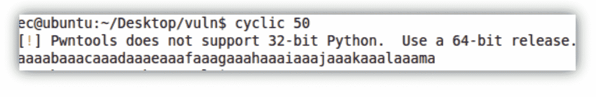

7.  让我们使用生成的字符串调试程序：


8.  现在，我们将在易受攻击的函数上设置一个断点并继续执行。GDB 将命中断点，如以下屏幕截图所示：


9.  让我们在易受攻击函数的最后一条指令处设置断点：

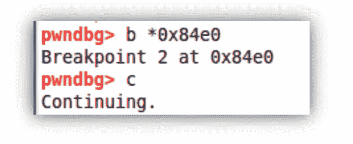

10.  命中断点后，让我们分析堆栈：

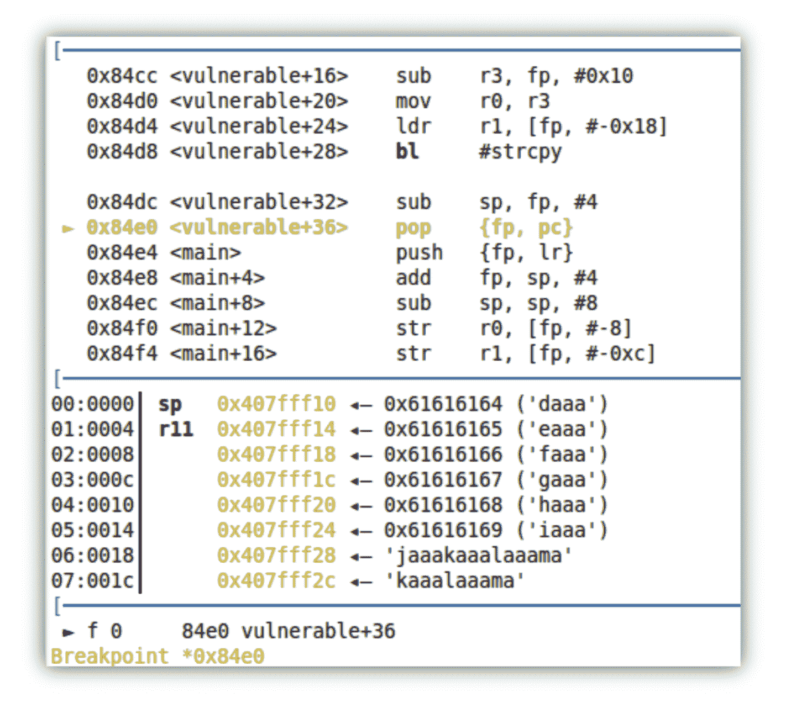

高亮显示的指令将从堆栈中分别弹出两个 DWORD（双字）到`fp`和`pc`。如果我们看一下堆栈中的第二个值，它是`0x61616165`（‘eaaa’），这意味着这是`pc`中的值。

11.  如果我们查看该值的偏移量，我们将能够计算出如果我们想用所需的地址覆盖`pc`，偏移量将是多少个字符。我们可以通过`cyclic``-``l 0x61616165`来了解，如下图所示：


12.  这意味着我们需要将所需的`pc`（erand48`ldm`指令）值以一种小尾端格式放置在偏移量 16 处。

我们可以使用以下 Python 代码生成新字符串：

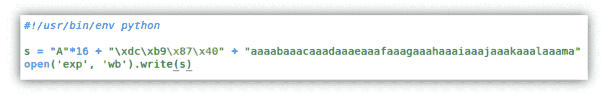

13.  接下来，我们可以重新运行生成的字符串，如以下屏幕截图所示：


14.  在这个阶段，像我们之前做的那样连接 GDB。在易受攻击函数的最后一条指令上设置断点，地址为`0x84e0`：


15.  这次我们可以看到`pc`正在加载位于`0x4087b9dc`的`erand48`指令的地址。让我们使用`ni`到达`ldm`指令的第一步指令：


16.  正如我们在这一步中看到的，寄存器`r0`加载了`0x61616161`，这是我们想要放置`/bin/sh string`地址的寄存器：


17.  有效偏移量为*16+4+0=20*，如下所示：

```
 "A"*16 => 16 bytes 
 "\xdc\xb9\x87\x40" => 4 bytes
```

18.  因此，在偏移量 20 处，我们需要输入字符串`/bin/sh`的地址，然后将其作为参数传递给系统。第二步有更多的说明来达到 pop，如以下屏幕截图所示：

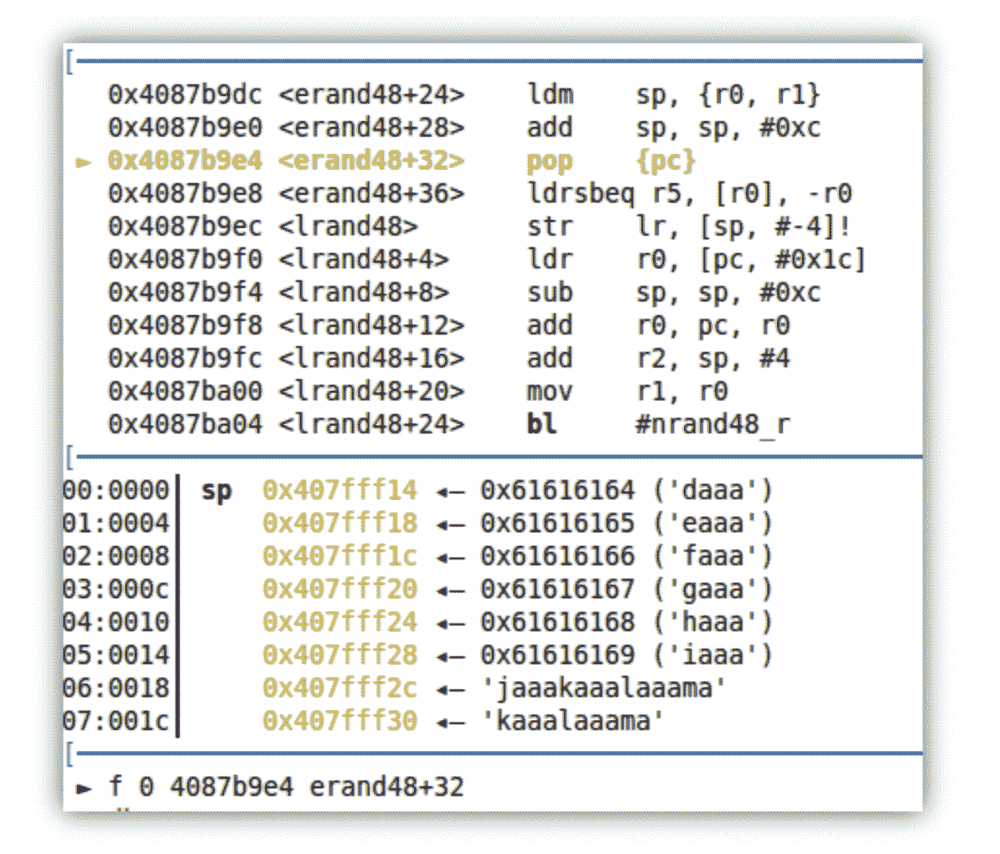

19.  `pc`将得到`0x61616164`的值，偏移量的计算方法与前面的相同：

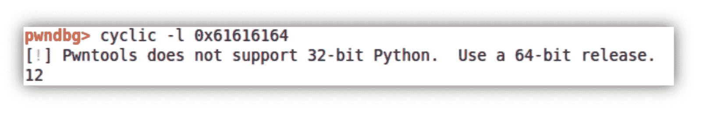

20.  因此`pc`的有效偏移量为：

*16 + 4 + 0 + 12 = 32*

这意味着在偏移量 32 处，我们需要输入系统的地址，这是我们之前找到的。

另外，让我们继续将`/bin/sh`ASCII 字符串放在偏移量 36 处，并在偏移量 20 处引用它。因此，堆栈上字符串的地址将为`0x407fff18`。

21.  我们可以使用`ropgen`模块生成漏洞字符串，如下图所示：

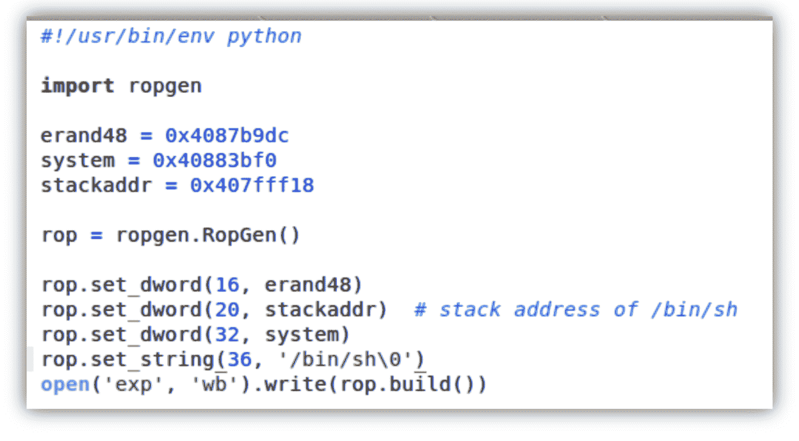

22.  让我们再次调试并逐步执行：

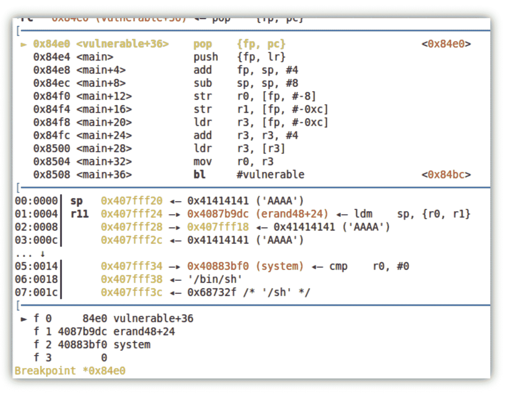

23.  如果我们现在查看堆栈，ASCII 字符串`/bin/sh`现在位于地址`0x407fff38`，这意味着我们需要调整代码以反映这一点：


24.  通过与前面相同的方式进行调试，我们可以看到我们的 ASCII 字符串这次加载到了正确的地址：

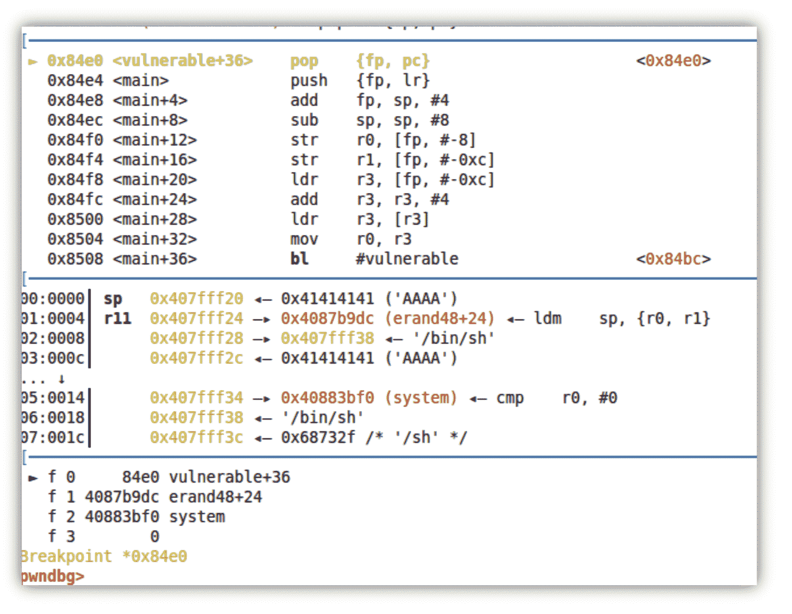

25.  我们可以再次进入`erand48`地址，如下图所示：

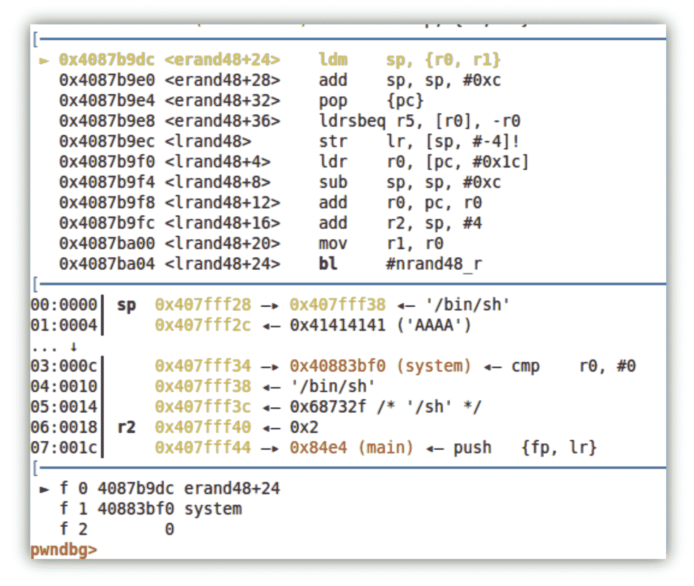

26.  寄存器`r0`这次根据需要存储 ASCII 字符串的地址。点击**c**进行两次步骤，得到功能的最后一条指令（pop pc），如下所示：

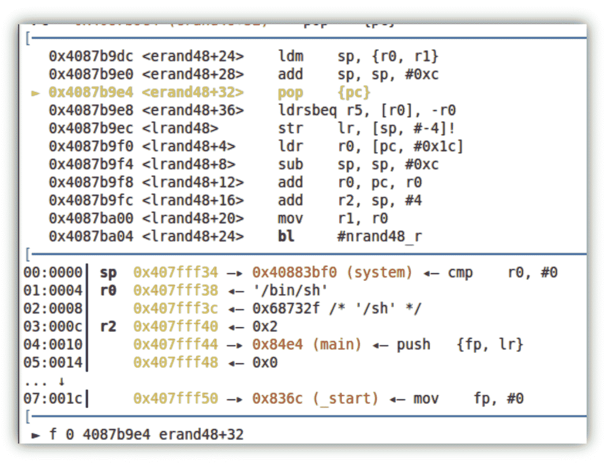

27.  `pop {pc}`将从堆栈中加载系统的地址，并将其放入`pc`中，然后将其转到系统，参数位于`r0`，我们将其作为我们的`/bin/sh string`的地址。我们可以查看 REG 以确认这一点：


28.  一旦我们点击`c`，我们将能够得到一个外壳，如下所示：


因此，我们能够利用基于堆栈的缓冲区溢出，并使用 ROP 跳转到系统，以我们所需的字符串作为参数，利用位于`erand48`函数中的指令，最后给我们一个 shell。

然而，这是在基于 ARM 的体系结构上开始 ROP 的一个非常简单的例子。类似的技术可应用于 MIPS 上的 ROP，如下所示。我们在这里展示的另一件事是如何绕过缓存不一致性问题，这通常发生在攻击过程中。

29.  我们在本例中寻找的易受攻击程序是 DVRF 固件中的`socket_bof`。在本例中，我们将跳转到的第一条指令是 sleep，它提供了我们想要睡眠时间的参数。我们调用 sleep 来刷新缓存，然后准备我们的小工具以命令地址作为参数来调用系统，如下所示。下面的屏幕截图显示了我们的第一个小工具的外观：


我们可以看到，通过这个小工具，除了设置第一个寄存器`$a0`（就像 ARM 中的`r0`一样），我们还可以控制**返回地址**（**RA**）和其他一些寄存器，如`$fp`、`$s7`、`$s6`。。。`$s0`，最后跳到`$ra`。

30.  在下一个小工具中，我们将准备使用我们已经设置好的`$a0`值跳转到睡眠状态。请注意，在此小工具中，`$t9`从`$s0`获取值，我们可以在前面的小工具中控制该值：


31.  一旦我们设置了这个小工具，下一个小工具将设置系统参数（我们要执行的字符串命令的地址），并允许我们跳转到系统。在本例中，参数为`$sp+24`，`$t9`（我们希望设置为系统地址）从`$s3`获取其值，我们可以在前面提到的第一个小工具中控制该值：


32.  一旦我们有了所有的小工具，下一步显然是计算各种偏移量，以确保我们的 ROP 链工作。整个 ROP 链如下图所示：


33.  接下来，将各个参数放置在正确的位置，运行二进制文件，并从`/proc/maps`中找出`libc`地址：


34.  一旦您正确识别了`libc`地址并且程序正在运行，您应该能够看到我们的参数现在在运行时被放置在正确的地址中，这可以使用 GDB 确认：

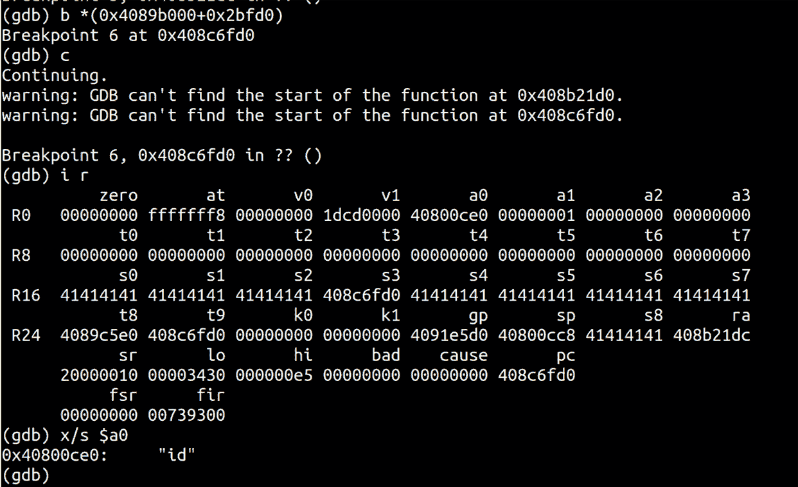

在前面的屏幕截图中，`id`是我们想要执行的命令。

35.  总而言之，在这种情况下，我们的 ROP 链是这样的：

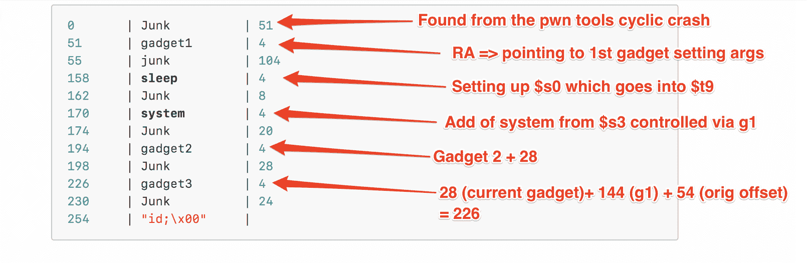

这就是 ROP 利用的全部内容，我们在这里介绍了 ARM 和 MIPS 的示例。在实际场景中，应用是相同的。在这种情况下，您可能需要大量的指令来形成 ROP 链，而不仅仅是一些指令。

# 另见

您可以查看一些自动化工具，这些工具将在各种平台上基于 ROP 的利用过程中为您提供帮助。建议您查看的一些工具如下：

*   ROPGadget:[https://github.com/JonathanSalwan/ROPgadget](https://github.com/JonathanSalwan/ROPgadget)
*   金钱射击：[https://github.com/blasty/moneyshot](https://github.com/blasty/moneyshot)

# 链接 web 安全漏洞

当对手以一种物联网设备为目标时，往往会在利用漏洞进行武器化时使用多个漏洞。这些漏洞本身的危险性可能较低；但是，当组合使用时，利用漏洞的影响要大得多。低漏洞组合升级为严重漏洞的情况并不少见。这对于物联网设备尤其重要。在物联网设备中发现的一个关键缺陷可能会损害设备的完整性。本食谱将介绍如何将网络安全漏洞链接在一起，以便在没有遥控钥匙、汽车钥匙或凭证的情况下访问连接斯巴鲁的车辆。

重要的是，任何脆弱性研究都必须符合法律依据。对 MySubaru 帐户和 Subaru 服务器执行未经授权的测试是非法的。所有测试应在受控环境中进行，并应为合法所有。虽然斯巴鲁远程服务不控制发动机和传动系功能，但测试结果未知。斯巴鲁已报告并解决了此配方中的所有关键漏洞。

# 怎么做。。。

进行任何评估的第一步是威胁建模；在这种情况下，从黑匣子的角度对 2017 斯巴鲁 WRX STi 连接车辆进行威胁建模。从识别进入车辆的入口点开始，这将提供一个可建立在其上的已识别攻击面。

# 步骤 1-确定资产和入口点

每辆车都是不同的，有些车型比其他车型有更多的功能。研究斯巴鲁连接车辆的公开可用资源以及车型和年份之间的不同特征。例如，我们知道连接的车辆可以通过 Cell 4G/LTE 连接访问互联网，但其他车辆可以通过连接电话或其他方式（如 Wi-Fi）访问互联网。让我们从这里开始，在执行任何主动攻击阶段之前，记录我们对目标车辆的了解：

*   **蜂窝连接**：连接斯巴鲁的车辆通过 AT&T 4G LTE（[连接互联网 http://about.att.com/story/att_subaru_bring_4G_lte_to_select_model_year_vehicles.html](http://about.att.com/story/att_subaru_bring_4G_lte_to_select_model_year_vehicles.html) ）。
*   **Wi-Fi**：这在目标斯巴鲁车辆中不可用。
*   **蓝牙**：信息娱乐系统通过蓝牙连接设备，以访问媒体、设备通讯录和信息。
*   **遥控钥匙**：要进入并启动此特定车辆，需要遥控钥匙。遥控钥匙以 314.35-314.35 MHz 的频率范围（[发射 https://fccid.io/HYQ14AHC](https://fccid.io/HYQ14AHC) ）。
*   **USB 连接**：信息娱乐系统使用 USB 连接设备媒体以及 GPS 和信息娱乐系统本身的更新。
*   **SD 卡**：信息娱乐系统有一个用于 GPS 地图的 microSD 卡槽。
*   **OBD II**：用于访问 CAN 总线进行诊断，并在车辆上闪烁 ECU 图像进行调谐或其他性能修改。
*   **CAN 总线**：每辆车有一条或多条 CAN 总线用于车内通信。CAN 总线天生易受攻击，可以使用免费工具进行嗅探。
*   **移动应用**：斯巴鲁的 Starlink 车载技术连接到 MySubaru 应用，该应用允许您远程锁定和解锁车辆，访问喇叭和车灯，查看车辆健康报告，并在地图上定位车辆。要使用这些功能，必须购买订阅。
*   **网络应用**：除了 MySubaru 移动应用外，斯巴鲁的 Starlink 车载技术还连接到一个网络界面，该界面允许您远程锁定和解锁车辆，访问喇叭和车灯，更改用户设置，安排服务，添加授权用户，以及在地图上定位车辆。要使用这些功能，必须购买订阅。

现在我们已经列出了连接车辆的入口点，我们对首先瞄准什么有了更好的想法。我们还可以根据自己的技能和舒适度来衡量努力程度。

# 第 2 步-找到最薄弱的环节

人们已经对信息娱乐系统和 CAN 总线利用进行了大量的研究。在蓝牙、Wi-Fi 或遥控钥匙中发现的任何协议漏洞都可能会变成类似零天的漏洞，并且需要相当长的时间。话虽如此，让我们把注意力转移到 MySubaru 移动应用和 web 应用上。对于移动和网络应用，不需要靠近汽车。所需要的只是 STARLINK Safety Plus 和 Security Plus 订阅、支持的型号以及 MySubaru 帐户的凭据。这很好，因为我们同时处理所有三个应用的多任务和工作。此外，斯巴鲁还授权解锁、锁定、按喇叭以及通过其移动和网络应用定位车辆。目标应用是 MySubaru Android 和 iOS 应用的 1.4.5 版。发现的任何应用级错误都可能产生高级别的影响，也可能对斯巴鲁车主造成安全问题。

# 步骤 3-侦察

由于我们将精力集中在应用上，因此需要对所有三个应用执行一定级别的侦察。让我们先从移动应用开始，然后再从 web 应用开始。

# Android 应用

Android 应用在执行动态测试之前很容易进行静态分解和分析。在逆转 Android 应用时需要一定程度的努力，但如果我们能够发现低挂果实，那么我们将轻松获胜。我们首先需要通过第三方市场获得 MySubaru 应用，并确保它与 Google Play 版本相同。验证后，应采取以下步骤在 MySubaru Android 应用上执行基线级别的侦察：

*   使用 MobSF 或类似工具拆卸 APK：
    *   分析类和方法
    *   识别第三方库
    *   确定应用是本机应用还是混合应用
    *   查找硬编码的值
    *   寻找潜在的秘密和环境
*   安装应用并监视 Android 组件
    *   活动、服务和意图
*   分析数据存储
    *   SD 卡使用
    *   `SharedPreferences.xml`
    *   隐藏物
    *   SQLite 数据库
*   使用 Burp 套件或类似工具将所有 API 请求从 Android 应用代理到车辆
    *   登录/注销
    *   解锁/锁定
    *   按喇叭
    *   闪光
    *   找到车辆的位置
    *   查看车辆健康报告
    *   编辑车辆详细信息

确保为 Android 通信记录颜色编码的突出显示和注释。这将有助于编译用于识别 Android 以及其他斯巴鲁应用漏洞的不同 API 调用。

# iOS 应用

在反转 iOS 应用时，需要更多的时间来获取 IPA 文件、解密它、将应用二进制文件传输到主机，然后努力查找漏洞。在这种情况下，我们必须通过应用商店下载 MySubaru 应用，并执行解密和二进制传输到主机。完成后，应采取以下步骤在 iOS MySubaru 应用上执行基线级别的侦察：

*   使用 Hopper 或类似工具拆解 iOS 二进制文件：
    *   分析类和方法（使用 Class-dump-z）
    *   身份第三方图书馆
    *   确定应用是本机应用还是混合应用
    *   查找硬编码的值
    *   寻找潜在的秘密和环境
*   安装应用和监视器 iOS 组件：
    *   通过 URL 方案实现 IPC
*   分析数据存储：
    *   夹钳
    *   SQLite 数据库
    *   Cache.db
    *   本地存储
*   使用 Burp 套件或类似工具将 iOS 应用的所有 API 请求代理到车辆：
    *   登录/注销
    *   解锁/锁定
    *   按喇叭
    *   闪光
    *   找到车辆的位置
    *   查看车辆健康报告
    *   编辑车辆详细信息

应该注意 iOS 和 Android API 调用之间的差异。还应注意数据的存储，重点是个人详细信息和凭证。应根据对两种应用进行的侦察，确定对潜在路障的观察结果。例如，两个移动应用都通过带有`sessionId`参数值的`POST`请求发送远程服务呼叫，该参数值对于每个请求都是唯一的。

这可能会妨碍我们伪造远程服务请求的能力，因为此值是唯一的，而不是硬编码的值。在 iOS 应用中发现的一个关键观察是缓存所有 HTTP 请求和对`Cache.db`SQLite 数据库的响应。`Cache.db`中的所有数据均为明文，包含车辆详细信息、个人所有者详细信息、帐户令牌和 API 请求，攻击者可在备份 iOS 设备或使用 iFunbox 等免费工具时提取这些数据。

以下屏幕截图显示了一个缓存请求，URL 中有一个`handoffToken`令牌：

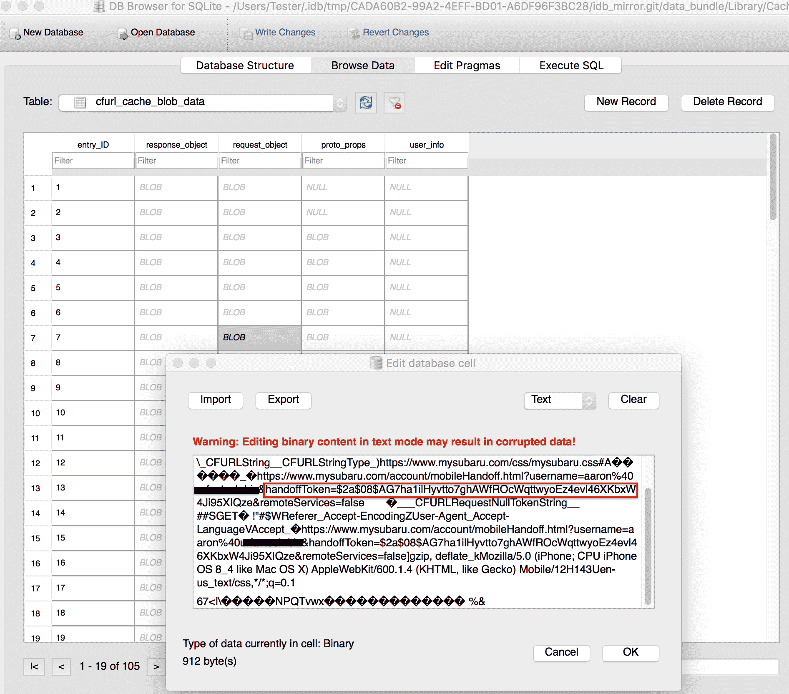

# Web 应用

接下来，我们将查看 MySubaru web 应用，并检查所有 HTTP 请求和响应。MySubaru web 应用包含移动应用没有的其他选项，例如添加授权用户或更改帐户 pin 码。代理 web 应用流量时，请遵循相同的步骤，但请确保单击并分析所有状态配置更改，如以下列出的更改：

*   登录/注销
*   锁定/解锁
*   按喇叭
*   闪光
*   找到车辆的位置
*   查看车辆健康报告
*   编辑车辆详细信息
*   添加车辆
*   添加和删除授权用户
*   换针
*   更改密码
*   更改安全问题
*   更改个人帐户详细信息

应注意 web 应用和移动应用之间的所有差异。到目前为止，web 和移动应用之间的一个主要区别是如何将远程服务 API 请求发送到 Subaru 服务器。API 端点对于所有应用都保持不变，如果我们发现可利用的漏洞，这将非常有用。

以下屏幕截图显示了 Burp Suite 中的 HTTP 历史记录，并对所有应用进行了颜色编码：


# 步骤 4-识别漏洞

在我们的 web 代理中记录了所有应用功能和 API 调用之后，我们现在可以开始识别设计中的漏洞，并测试漏洞的逻辑缺陷。以下是观察到的漏洞列表：

1.  web 应用通过 URL 以`GET`请求的形式发送所有远程服务调用，而移动应用以`POST`的形式发送远程服务调用，参数在正文中。没有用于执行 web 远程服务调用的随机生成的`sessionIds`。
2.  移动应用不强制执行证书固定和验证。
3.  iOS 应用的所有请求和响应都被缓存。
4.  帐户配置更改（如编辑车辆详细信息或添加授权用户）不包含反 CSRF 令牌。

5.  添加授权用户时，不会通知所有者。
6.  更新帐户 pin 不需要了解以前设置的 pin。
7.  安全问题的更新不需要重新身份验证，没有最小字符长度，并且可以是相同的值，例如 1。
8.  授权用户可以完全访问斯巴鲁远程服务，并且不限制可以添加多少。
9.  没有针对所有应用的并发登录策略。

以下是 pin 和安全问题更新配置文件部分的屏幕截图，该部分不需要身份验证或之前的设置知识即可进行更改：


现在，我们可以开始更改配置参数值，以反映屏幕上的用户输入。由于在这种情况下我们无权发送恶意有效载荷，因此所有工作都将是手动的，参数将通过 Burp Suite 的中继器手动输入。考虑到这一点，我们可以尝试基本 XSS 有效负载，并观察是否存在任何验证和/或编码。首先想到的反映参数值的位置是车辆昵称。看起来一个香草`<script> alert(1)</script>`在浏览器中工作并执行。

这现在是一个经过身份验证的**跨站点脚本**（**XSS**）漏洞，可能对我们有用（漏洞#10）。以下是 XSS 的屏幕截图：


接下来，我们可以检查其他 API 逻辑缺陷，例如是否强制执行了速率限制，或者是否可以在不修改的情况下重放 API 请求。这可以通过将 HTTP 请求发送到 Burp 套件的中继器和重播请求来实现。我们会发现，在进行远程服务调用时，不会强制执行重播或速率限制安全控制（漏洞#11）。尽管在 API 请求之间需要 5 秒钟的时间，以便车辆执行请求。

另一个需要测试的逻辑缺陷是移动应用和斯巴鲁服务器之间的登录过程。斯巴鲁通过`POST`主体传递用户凭证，然后在验证后将用户重定向到其帐户仪表板。在登录过程中以及成功验证帐户凭据后，会向 Subaru 的服务器发送一个带有用户名、切换令牌和其他参数的`GET`请求。这是在 iOS 应用的`Cache.db`中找到的相同 HTTP 请求，但具有不同的令牌值。此`GET`请求可以复制并粘贴到浏览器中，并自动登录到 MySubaru 帐户，而无需用户名或密码（漏洞 12）。此外，即使 MySubaru 用户从 web 和移动应用注销，切换令牌也不会过期，并且仍然有效。即使密码更改也不会使此令牌过期。这是一个伟大的发现，因为我们现在可以获得对 MySubaru 帐户的持久访问，而所有者不知道攻击者有访问权限。与切换令牌相关的另一个问题是，为登录 MySubaru 移动应用的新设备和授权用户创建了新令牌。例如，一名所有者使用两部 iPhone 和两部 Android 设备登录其 MySubaru 帐户。现在他们的帐户有四个实时切换令牌。这也适用于授权用户。例如，两名授权用户（`carhackingemail@gmail.com`和`carhackingemail1@gmail.com`使用三台设备登录其 MySubaru 移动应用。授权用户现在有六个 live Token，这将一个 MySubaru 帐户的攻击面扩展到 10 个 live Token。以下示例显示了两个授权用户帐户`carhackingemail@gmail.com`和`carhackingemail1@gmail.com`，它们使用三种不同的移动设备登录并获得不同的切换令牌值：

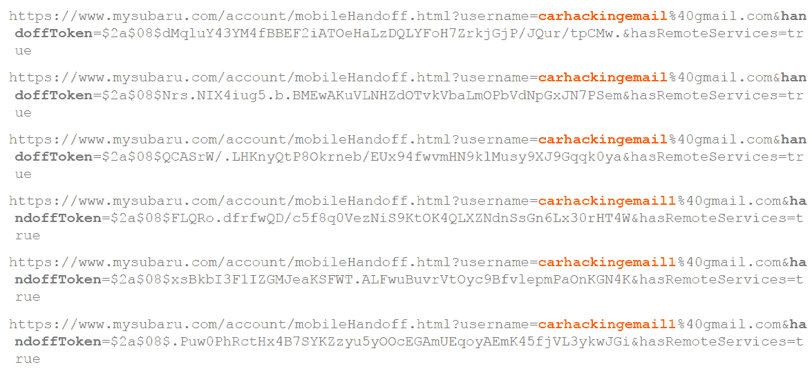

# 步骤 5-利用-链接漏洞

通过被动和主动分析，至少发现了 11 个漏洞。由于应用的逻辑和设计，一些漏洞可以被直接利用，而其他漏洞可能被间接利用。为了在没有遥控钥匙、车钥匙或证件的情况下进入车辆，我们应该拥有我们需要的东西。

通过查看已识别的安全漏洞，需要用户干预才能成功利用 MySubaru 所有者的帐户和车辆。我们有几种方法可以做到这一点。我们可以尝试以下攻击场景，该场景依赖于一种社会工程：

*   制作一个恶意页面，使用 XSS 有效载荷作为车辆的昵称
*   获取切换令牌以获得有效会话
*   通过 CSRF 添加授权用户
*   通过 CSRF 对目标斯巴鲁车辆进行伪造解锁远程服务呼叫
*   更改安全问题
*   换针
*   利润$$

可用于获得有效`handoffToken`的其他攻击场景有：

*   受害者使用攻击者设备登录，可以从缓存中提取令牌
*   受害者将移动设备（Android/iOS）备份到攻击者的计算机，攻击者将受害者的备份恢复到包含切换令牌的测试移动设备
*   攻击者窃取授权用户的令牌而不是所有者
*   通过 Wi-Fi 热点或其他方式的 MITM 受害者流量
*   通过 iFunBox（iOS）获取`Cache.db`
*   审计日志通过`URL GET`请求泄漏切换令牌，斯巴鲁的系统管理员、检查网络流量的公司网络管理员和无线热点可以获取该请求

攻击者不仅可以未经授权进入车辆，还可以跟踪车主并危及其安全。还可以探索其他利用后场景，例如：

*   偷车内物品
*   破坏车辆的引擎
*   保留 MySubaru 帐户的持久性，该帐户可能已配置多个车辆
*   植入带外跟踪器
*   植入带有 GSM 的恶意 Wi-Fi 接入点进行远程连接，以利用相邻接入点或车辆进行攻击
*   重播远程服务请求，例如锁定车辆以耗尽电池电量

正如您可能已经注意到的，这些是基本的 web 安全漏洞，而不是突破性的零日攻击。对于物联网连接的设备和车辆，利用基本漏洞的影响要大得多。

# 另见

请访问以下网页阅读本配方中讨论的研究：

*   [https://www.scmagazine.com/researcher-hacks-subaru-wrx-sti-starlink/article/666460/](https://www.scmagazine.com/researcher-hacks-subaru-wrx-sti-starlink/article/666460/)
*   [https://www.bitdefender.com/box/blog/iot-news/researcher-finds-basic-mistakes-subarus-starlink-service/](https://www.bitdefender.com/box/blog/iot-news/researcher-finds-basic-mistakes-subarus-starlink-service/)
*   [http://www.databreachtoday.com/exclusive-vulnerabilities-could-unlock-brand-new-subarus-a-9970](http://www.databreachtoday.com/exclusive-vulnerabilities-could-unlock-brand-new-subarus-a-9970)

# 为固件配置连续集成测试

对于具有复杂 makefile 的旧式产品，构建用 C/C++编写的固件可能是一个挑战。然而，在部署生产构建之前，应静态分析所有源代码的安全漏洞。此配方将展示如何在连续集成环境中为固件配置基本 C/C++静态分析。

# 准备

对于此配方，我们将使用以下应用和工具：

*   **Jenkins**：这是一个开源的构建自动化服务器，可以定制以运行质量和安全代码分析。Jenkins 可通过以下链接[下载 https://jenkins.io/download/](https://jenkins.io/download/) 。根据操作系统的不同，有多种安装 Jenkins 的方法。对于 Debian 和 Ubuntu，可以使用以下命令安装 Jenkins：

```
wget -q -O - https://pkg.jenkins.io/debian-stable/jenkins.io.key | sudo apt-key add -

```

*   将以下行添加到`/etc/apt/sources.list`：

```
deb https://pkg.jenkins.io/debian-stable binary/
sudo apt-get update
sudo apt-get install jenkins

```

*   **Fuzzgoat**：这是一个易受攻击的 C 程序，可以通过以下 GitHub 存储库[下载 https://github.com/packttestaccount/fuzzgoat](https://github.com/packttestaccount/fuzzgoat) 。使用以下方法将 fuzzgoat 应用克隆到 Jenkins build 服务器中：

```
 git clone https://github.com/packttestaccount/fuzzgoat.git

```

*   **DefaultFinder**：这是一个分析 C/C++代码潜在安全漏洞的简单工具。可通过以下链接[下载 DefaultFinderhttps://www.dwheeler.com/flawfinder/flawfinder-2.0.4.tar.gz](https://www.dwheeler.com/flawfinder/flawfinder-2.0.4.tar.gz) 。

安装 DefaultFinder 的简单方法是通过 pip 使用以下命令：

```
pip install flawfinder

```

# 怎么做。。。

要设置固件的持续集成测试，请使用以下步骤创建环境。

1.  安装 Jenkins 后，登录并单击新项目：


确保您的`JAVA_HOME`环境变量已配置。如果使用多个 Java 版本，请确保通过 Jenkins 中的全局工具配置通过`http://127.0.0.1:8080/configureTools/`配置 JDK。

2.  输入名称并选择自由式项目：


3.  此时将显示配置页面。不要输入任何设置，因为我们要将本地项目加载到 Jenkins 在构建项目后将创建的工作区中。构建将失败，这没关系，因为我们只希望 Jenkins 创建目录，然后我们将使用 C 代码将项目文件复制到工作区中。此步骤还将用于以下创建工作区的方法：


4.  单击“保存”按钮后，Jenkins 会将您重定向到项目页面，我们将在其中选择“立即生成”：


现在，詹金斯已经建立了我们的工作区，我们可以在这里传输代码文件。目录结构因使用的操作系统而异。对于 Ubuntu，工作区文件位于`/var/lib/Jenkins/workspace/`，而对于 OS X，工作区文件位于`/Users/Shared/Jenkins/Home/workspace/`。将 fuzzgoat 文件传输到新创建的工作区目录中，该目录以项目名称作为目录。在这种情况下，它是`/var/lib/Jenkins/workspace/PacktTestFirmware/`。

确保 Jenkins*Nix 用户具有适当的文件和文件夹权限来扫描`workspace`目录中的任何内容。这还包括工具扫描相对目录的权限。

5.  现在 fuzzgoat 位于 Jenkins workspace 目录中，导航回 Jenkins 构建项目并添加一个构建步骤以执行 shell 命令，该命令将在我们的`workspace`目录中执行`flawfinder`：


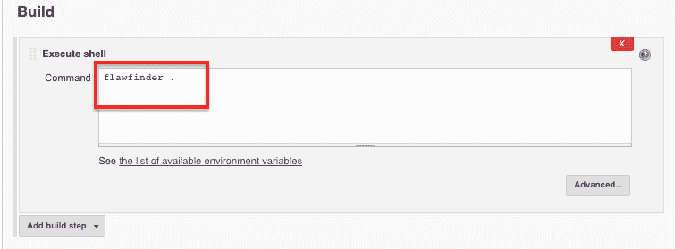

6.  添加另一个构建步骤以执行另一个 shell 命令。这将在工作目录中执行`make`命令，该目录基于 fuzzgoat 提供给我们的 Makefile。单击“以后保存”：


7.  在“项目”页面中选择“立即生成”选项。单击永久链接箭头并选择 Console Output，如以下屏幕截图所示：

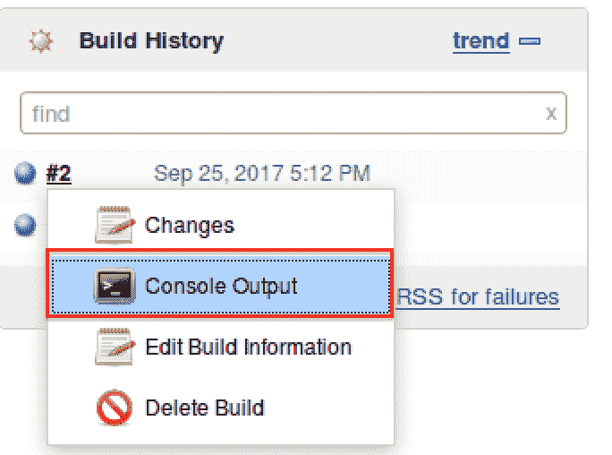

8.  以下页面应显示构建和`flawfinder`结果：

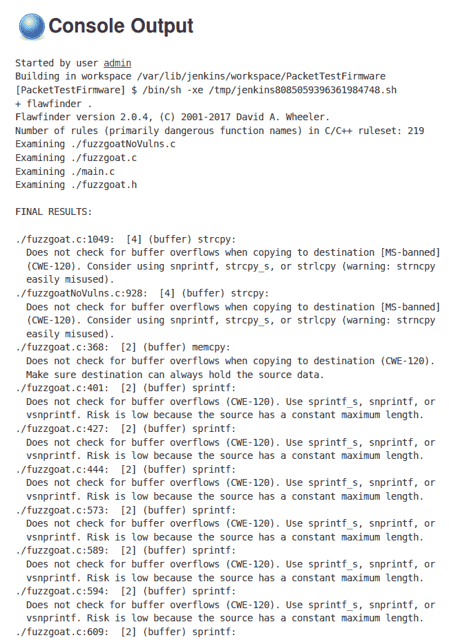

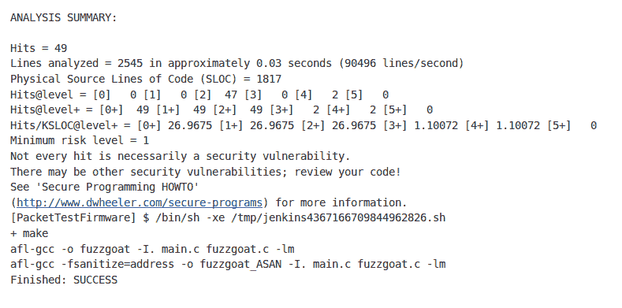

可以自定义构建步骤，以提醒工程或安全经理根据结果执行操作。然而，并非所有来自`flawfinder`的点击都是漏洞，但应该对其进行审查，以确保不会引入软件安全漏洞。请记住，`flawfinder`是一个简单的工具，它为 C/C++代码提供了最低数量的检查。它只是检查常见的缓冲区溢出问题和其他众所周知的问题，如禁用函数的使用。商业 SAST 工具包括依赖关系图以及用于检查依赖关系软件错误和应用数据流的调用图。此外，许多商业 SAST 工具还包括 IDE 插件，用于实时检查代码是否存在软件安全漏洞。有免费的 C/C++IDE 插件和 XCode 的 Clang 静态分析器；但是，为了在 OSX 环境中编译此类代码，需要自定义配置。Clang 不会分析任何无法编译的文件。在为移动应用配置持续集成测试部分，我们将讨论如何使用 IDE 插件静态分析代码。

# 另见

有关 Clang Static Analyzer 的更多信息，请访问以下链接：

*   [https://clang-analyzer.llvm.org/](https://clang-analyzer.llvm.org/)
*   [https://help.apple.com/xcode/mac/9.0/#/devb7babe820](https://help.apple.com/xcode/mac/9.0/#/devb7babe820)

有关各种编程语言的更多源代码分析工具的列表，请参阅以下 URL：

*   [https://www.owasp.org/index.php/Source_Code_Analysis_Tools](https://www.owasp.org/index.php/Source_Code_Analysis_Tools)

# 为 web 应用配置连续集成测试

无论 IoT 设备使用 web 应用还是 web 服务进行消息传递，其代码都应进行静态和动态分析，以发现软件安全漏洞。在此配方中，我们将演示如何在生产部署之前配置 web 应用构建的动态扫描。

# 准备

在这个配方中，我们将使用 Jenkins 作为我们的自动化构建服务器，使用 OWASP ZAP 作为我们的动态扫描程序。我们将使用 OWASP ZAP Jenkins 插件和 OWASP ZAP 工具，可通过以下链接下载：

[https://github.com/zaproxy/zaproxy/wiki/Downloads](https://github.com/zaproxy/zaproxy/wiki/Downloads) 。

# 怎么做。。。

要为 web 应用设置连续集成测试，请使用以下步骤创建环境。

1.  首先，我们需要下载 OWASP ZAP 插件，这可以通过 Jenkin 的插件管理器完成，如以下屏幕截图所示：


OWASP ZAP 插件下载

2.  詹金斯随后将重新启动。重新登录 Jenkins，我们将致力于配置 ZAP。在 Jenkins 中使用 ZAP 有两种方法。一种是在加载会话的情况下运行 ZAP，另一种是设置 Selenium 以执行 ZAP 并在之后保留会话。我们将设置 ZAP，以便在目标构建的加载会话中运行。为此，我们首先需要在本例中通过`http://127.0.0.1:8080/`配置来配置 ZAP 设置和环境变量。设置 ZAP 主机和端口号，如下图所示：


可以将多个 ZAP 主机配置为允许多个并发构建扫描。这可以在单个项目的生成步骤中配置，该步骤将覆盖系统设置。

3.  根据操作系统插入 ZAP 的默认目录（[https://github.com/zaproxy/zaproxy/wiki/FAQconfig](https://github.com/zaproxy/zaproxy/wiki/FAQconfig) ）正在使用中。以下是 ZAP 用于 OS X 的默认目录：

如果您使用 ZAP 的每周版本，请使用`/Users/<user>/Library/Application\ Support/ZAP_D/`。

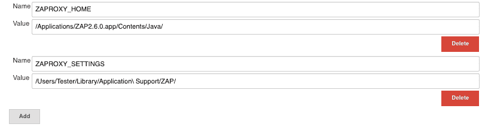

4.  现在，创建一个自由式项目，就像我们在上一个配方中所做的那样，并适当地命名它：

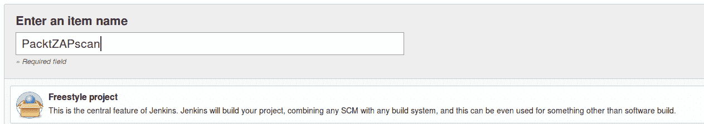

5.  保存项目并选择 Build Now，这样 Jenkins 就可以像前面的方法一样创建我们的项目工作区。

由于我们将使用加载的会话执行 ZAP，因此必须创建一个会话并将其保存在项目工作区目录中。为此，请导航到正在运行的目标应用生成，并通过浏览器代理应用通信量以 ZAP。确保单击所有链接和蜘蛛网页并执行应用功能。在下面的示例中，我们使用在端口`8888`上本地运行的 BodgeIT 存储，并通过导航到文件| Persist session…，将会话保存到项目工作区：


6.  将会话保存在项目的 Jenkins 工作区目录中。在本例中，PacktZAPscan 位于工作区项目目录中，如以下屏幕截图所示：

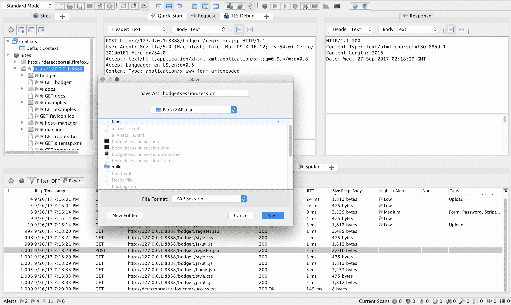

工作区项目目录中的 PacktZAPscan

7.  在 ZAP 中，让我们配置 ZAP 的 API 密钥。导航到“工具”菜单并打开“选项”页面。在选项中，选择 API 部分并插入 Jenkins 插件提供的默认`ZAPROXY-PLUGIN`键，如下图所示：

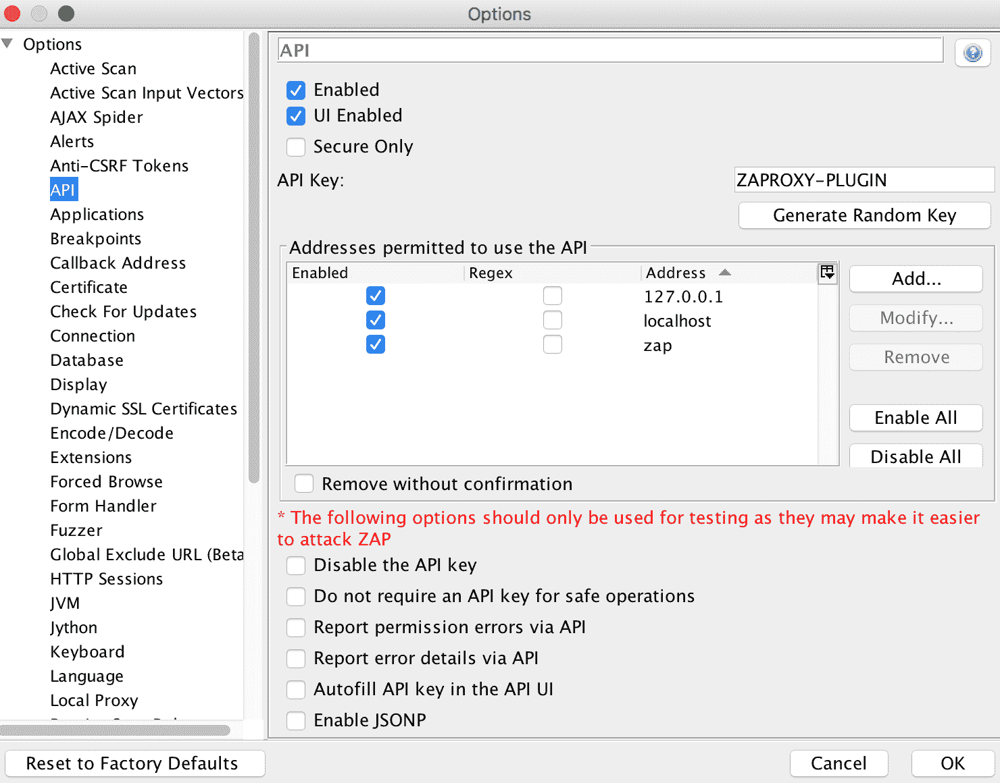

注意，在创建构建步骤时，可以完全禁用此 API 密钥，或者通过 ZAP 插件命令行参数部分进行更改。如果 API 键与 Jenkins 插件 API 键值不匹配，扫描将失败。

8.  会话保存在工作区中后，导航回项目并选择“配置”。根据应用体系结构插入适当的源代码管理设置、生成环境和任何生成脚本。在构建部分，选择添加构建步骤|执行 ZAP：

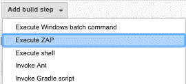

9.  在 ZAP 主机设置和主目录路径中输入保存的相应会话。如果会话未保存在项目工作区文件夹中，则该会话将不会出现在“加载会话”下拉菜单中：


10.  输入会话内属性，例如上下文和任何身份验证凭据。上下文是指用于自动扫描的范围内和范围外目标。上下文必须是唯一的，并且不在加载的会话中。我们可以使用 build ID 环境变量迭代上下文编号，使其唯一，如以下屏幕截图所示：


11.  下一个会话是攻击模式部分。在这里，我们指定目标 URL、扫描设置以及可能配置并保存到项目工作区中的任何自定义扫描策略。在接下来的示例中，输入测试 URL 时选择了 spidering 并配置了定制的 XSS 扫描策略。当未指定自定义扫描策略时，将使用默认策略。配置攻击设置后，命名生成的报告，选择格式和任何导出报告设置，然后单击保存：


确保权限设置正确，以便 Jenkins 和 ZAP 可以扫描您的工作区目录。

12.  然后，您将被引导到项目页面。选择 Build Now 并单击构建的控制台输出。这将显示 ZAP 扫描的生成状态和进度：


控制台输出应类似于下图：

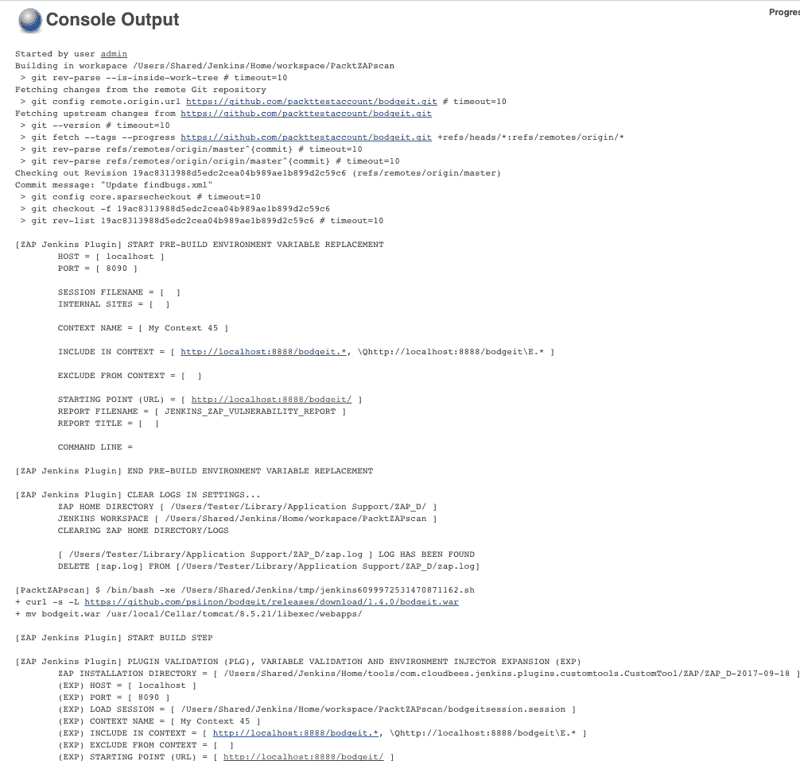

控制台输出

13.  构建和扫描完成后，会在`reports`文件夹下的 workspace 项目目录中生成报告，如以下屏幕截图所示：

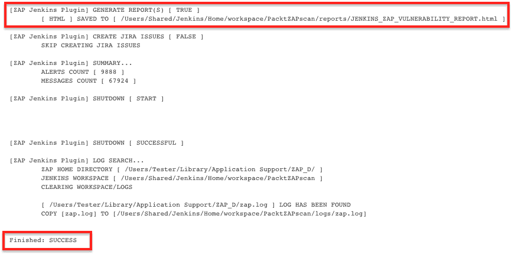

14.  报告的 XML 和 HTML 版本可供审查：


ZAP 扫描和报告的警报可以大量定制，以仅报告中等和/或高严重性的发现。扫描应根据应用架构创建上下文详细信息和扫描策略，以适应每个应用。例如，如果应用运行在 Apache web 服务器、Apache Tomcat 应用服务器和 MySQL 数据库上，则应自定义扫描策略，以针对相应的体系结构环境运行检查。不建议运行默认扫描策略，因为将使用不相关的攻击，导致扫描时间长时间拖延，甚至可能耗尽 ZAP 的内部数据库资源。扫描器的性能取决于给定的配置、规则集和策略。

自动扫描对于获取低挂果实和可伸缩性非常有用，但它们永远不应该取代手动 web 应用安全评估。自动扫描器无法执行上下文业务逻辑测试或智能来捕获手动评估可以捕获的未报告结果。应结合使用自动和手动测试。

# 另见

要了解有关 Jenkins OWASP ZAP 插件的更多信息，请参阅以下链接：

[https://wiki.jenkins.io/display/JENKINS/zap+插件](https://wiki.jenkins.io/display/JENKINS/zap+plugin)

[https://wiki.jenkins.io/display/JENKINS/Configure++作业#configuratejob configuratejoboexecutezap](https://wiki.jenkins.io/display/JENKINS/Configure+the+Job#ConfiguretheJob-ConfiguretheJobtoExecuteZAP)

# 为移动应用配置连续集成测试

遵循早期配方中的自动分析的相同趋势，本配方将展示如何在生产部署之前配置依赖项扫描和 Android 应用构建的动态分析。

# 准备

在此配方中，我们将使用 Jenkins 自动化构建服务器和以下工具：

*   **移动安全框架**（**MobSF**）：这是一个开源的移动应用静态和动态分析工具。MobSF 正在积极为移动安全社区进行利用和修改。MobSF 可从以下链接下载：

[https://github.com/MobSF/Mobile-Security-Framework-MobSF/archive/master.zip](https://github.com/MobSF/Mobile-Security-Framework-MobSF/archive/master.zip)

*   **OWASP 依赖项检查**：这是一种工具，用于检测项目依赖项中公开披露的漏洞，包括 Java、NodeJS、Python、Ruby 和 Swift 等多种编程语言。我们将使用 Jenkins OWASP 依赖项检查插件，该插件可通过 Jenkins 插件管理器下载，如以下屏幕截图所示：

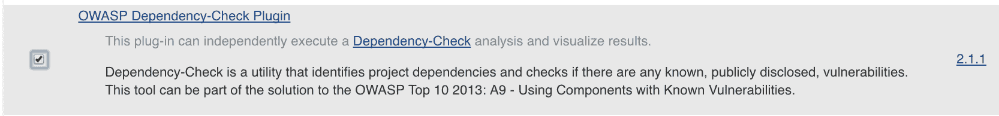

*   还可以使用以下链接中描述的方法将依赖项检查作为独立工具下载：

[https://github.com/jeremylong/DependencyCheck](https://github.com/jeremylong/DependencyCheck)

# 怎么做。。。

要为移动应用设置连续集成测试，请使用以下步骤创建环境。

1.  让我们首先为应用构建创建一个具有适当名称的自由式项目：


2.  保存并构建项目，以便创建我们的工作区，就像我们在前面的菜谱中所做的那样，以达到简化的目的。接下来，将您的 Android 项目文件复制到 Jenkins 为我们创建的新工作区，如下面的屏幕截图所示。


本例中我们工作区的路径为`/Users/Shared/Jenkins/Home/workspace/PacktTestAndroid`。

3.  接下来，在项目中打开“配置”选项并设置生成设置，如以下屏幕截图所示：

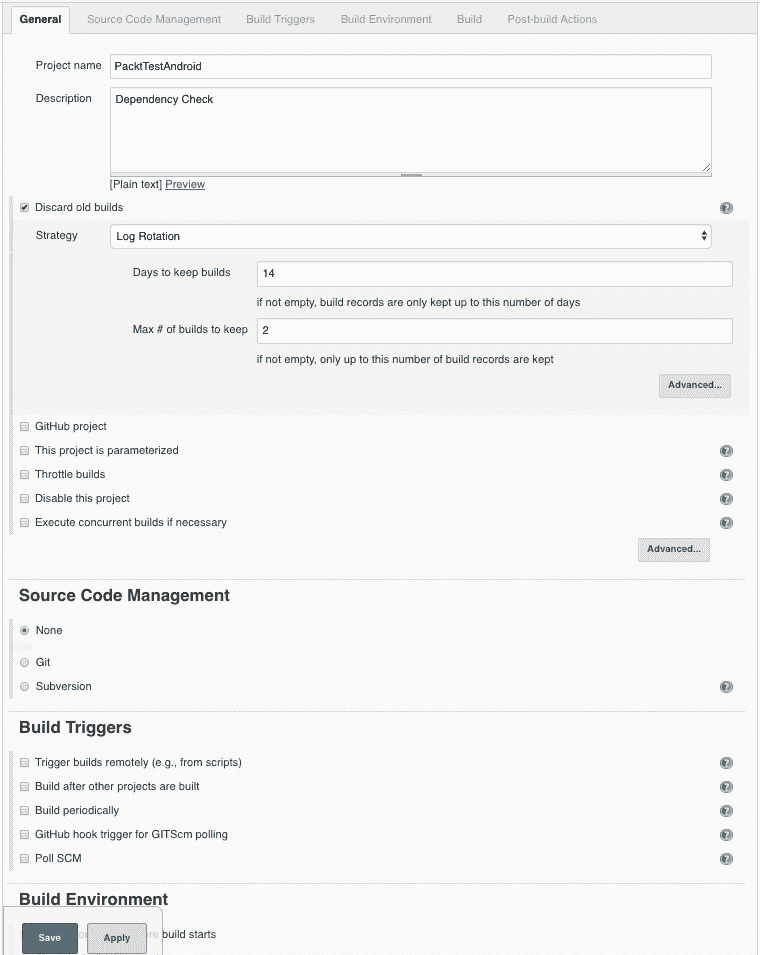

4.  为生成环境输入任何必要的生成脚本：


如果这是一个现有项目，那么您可能已经知道生成完成后输出 APK 将放置在何处。对于新项目，请确保生成编译为 APK。运行构建时知道 APK 存储在哪里是扫描构建 APK 的下一部分的关键。

5.  在单独的窗口中，打开终端并导航到安装 MobSF 的位置。进入 MobSF 文件夹后，运行以下命令：

```
$ python manage.py runserver
```

6.  您的终端应如以下屏幕截图所示：


注意 MobSF 的 API 键，因为我们需要它来执行来自 Jenkins 构建服务器的 restapi 调用。

当通过`clean.sh`脚本 MobSF 提供的所有扫描和 MobSF 数据库信息被删除时，API 键将发生变化。

7.  导航回 Android 项目的 Jenkins 配置页面。添加生成步骤以执行 shell 命令：

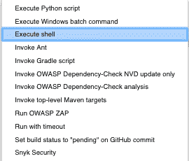

8.  在命令区，我们将执行 RESTAPI 调用，以上传构建到 MobSF 的 APK。为此，您需要拥有 RESTAPI 密钥和生成后 APK 的存储位置。使用以下命令并插入 API 密钥以及 API 的文件路径，如下面所示的`curl`命令：

```
curl --fail --silent --show-error -F 'file=@/Users/Shared/Jenkins/Home/workspace/PacktTestAndroid/app/build/outputs/apk/app-debug.apk' http://localhost:8000/api/v1/upload -H "Authorization:61ecd74aec7b36f5a9fbf7ac77494932ab5fcf4e4661626d095b5ad449746998" | awk -F'[/"]' '{print $8}' >  hash.txt  
```

这个`curl`命令将我们新构建的 APK 上传到我们的工作区，然后对其进行扫描。MobSF 创建一个上传二进制文件的散列，这是为其他 API 调用引用特定二进制文件所需的内容。`awk`命令只是解析 JSON 响应数据，并将哈希值插入到一个文件中，该文件将在以后的 MobSF API 请求中调用。

9.  上传我们的 APK 后，添加另一个构建步骤以执行 shell 命令，并插入带有 APK 名称和 API 键值的以下命令以扫描构建：

```
curl --fail --silent --show-error -X POST --url http://localhost:8000/api/v1/scan --data "scan_type=apk&file_name=app-debug.apk&hash=$(cat hash.txt)" -H "Authorization:61ecd74aec7b36f5a9fbf7ac77494932ab5fcf4e4661626d095b5ad449746998"
```

10.  MobSF 扫描 APK 需要几分钟的时间，所以让我们创建另一个 executeshell 构建集并插入以下`sleep`命令：

```
Sleep 180

```

`sleep`命令可以根据 MobSF 分析特定应用所需的时间进行更改。在这种情况下，大约需要两分钟。请记住，如果您没有等待足够长的时间让 MobSF 扫描 APK 并尝试下载报告，则报告将为空。

11.  接下来，创建另一个构建步骤来生成和下载刚才提到的 PDF。使用各自的 API 密钥插入以下命令：

```
curl --fail --silent --show-error  -K hash.txt -X POST --url http://localhost:8000/api/v1/download_pdf --data  "hash=$(cat hash.txt)&scan_type=apk" -H "Authorization:61ecd74aec7b36f5a9fbf7ac77494932ab5fcf4e4661626d095b5ad449746998" -o MobSF${BUILD_ID}.pdf
```

您可以选择以自己喜欢的方式命名 MobSF 报告。要使报表唯一，请使用 build ID 环境变量。詹金斯现在应该能够从我们构建的 APK 上传、扫描、生成和下载 MobSF 报告。

12.  我们还将添加一个构建步骤来调用依赖项检查，该步骤将扫描项目的依赖项以查找已知漏洞：


13.  扫描依赖项检查的生成步骤路径应为空，因为工作区目录中的项目文件将被扫描并用于在工作区中输出结果：

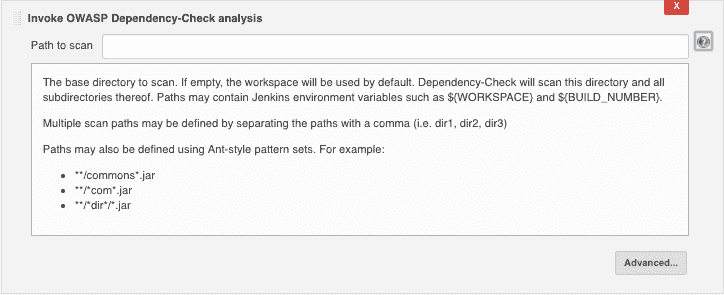

确保权限设置正确，以便 Jenkins 和 Dependency Check 可以扫描您的工作区目录。

14.  您的项目配置构建步骤应类似于以下屏幕截图：


项目配置构建步骤

15.  保存项目配置并构建 Android 应用。查看 Android 应用项目的控制台输出以查看构建进度。第一个构建步骤是构建实际的应用 APK，然后执行 MobSF 扫描功能，最后使用依赖项检查扫描项目的依赖项：

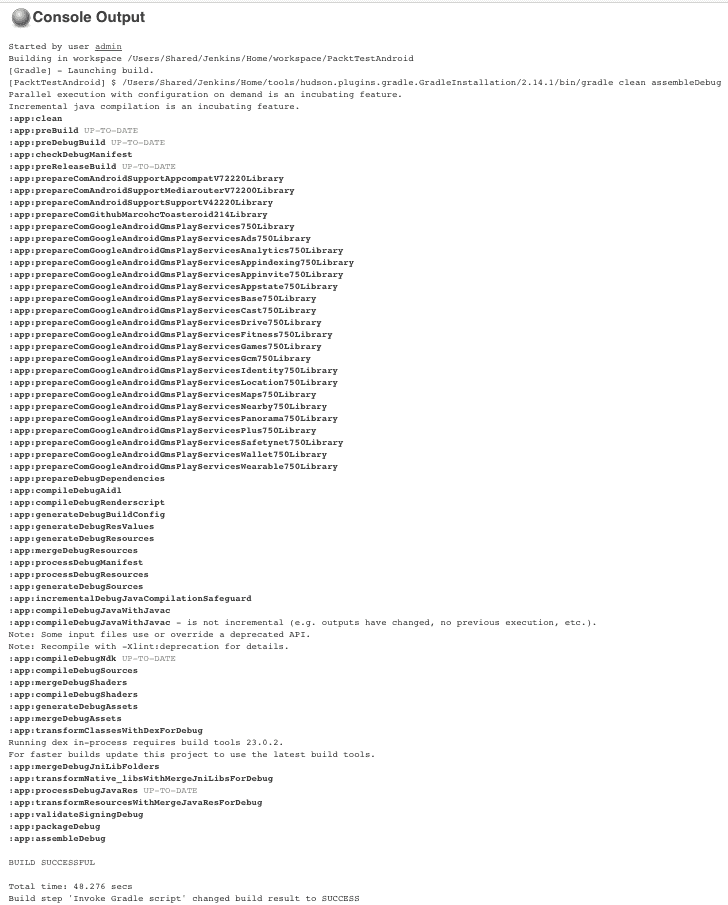

控制台输出

16.  以下屏幕截图显示了上传和扫描 APK 的第二和第三个构建步骤：

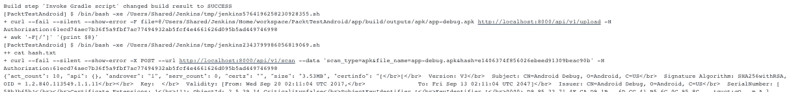

构建上传和扫描 APK 的步骤

17.  接下来的第四、第五和第六个构建步骤是执行`sleep`命令，生成 MobSF 扫描结果的 PDF，并扫描项目的依赖项：

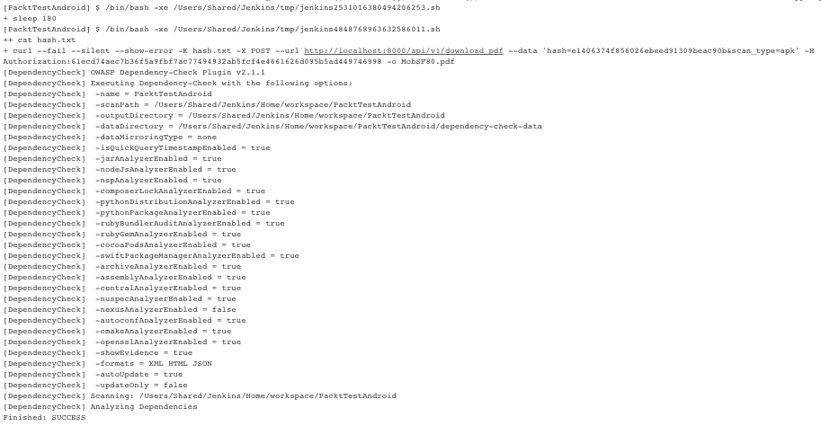

18.  如果检查项目工作区，现在应该有一个 MobSF 报告和一个依赖项检查报告：

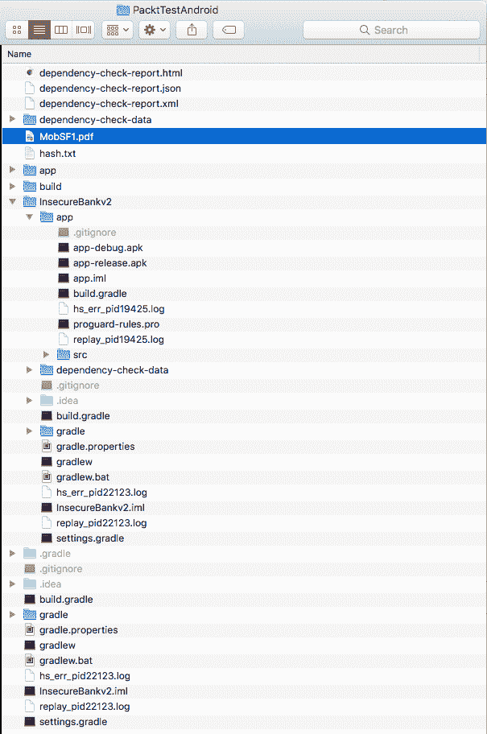

19.  单击 MobSF 和依赖项检查报告应以各自的格式打开扫描输出（PDF 用于 MobSF 和 HTML、JSON、XML 用于依赖项检查），如以下屏幕截图所示：


扫描输出

20.  下图是依赖项检查 HTML 报告：


可以将这些扫描报告配置为发送到集中式报告服务器，并在发现构建的某些严重性发现时执行操作，如发送电子邮件警报或 Jira 通知单。Jenkins 是高度可定制的，具有比本章所述更高级的功能。帮助应用安全团队提高安全测试速度和自动化的一个伟大的 OWASP 项目是 OWASP AppSec 管道项目（[https://www.owasp.org/index.php/OWASP_AppSec_Pipeline](https://www.owasp.org/index.php/OWASP_AppSec_Pipeline) ）。本文讨论了 AppSec 管道的各种工具和设计模式，以使小型安全团队在推送代码的速度下尽可能具有可扩展性和效率。

# 另见

*   依赖项检查 Jenkins 插件还提供了一个位置，用于归档多个应用依赖项以及跨应用使用易受攻击的组件，称为 OWASP 依赖项跟踪。这可以通过 OWASP 依赖项跟踪部分中的`http://JenkinsURL:8080/configure`进行配置。有关 OWASP 依赖项跟踪的详细信息，请参阅以下链接：

[https://www.owasp.org/index.php/OWASP_Dependency_Track_Project](https://www.owasp.org/index.php/OWASP_Dependency_Track_Project) 。

*   有关 MobSF 的 RESTAPI 的详细信息，请访问其文档页面[https://github.com/MobSF/Mobile-Security-Framework-MobSF/wiki/3.-REST-API-Documentation](https://github.com/MobSF/Mobile-Security-Framework-MobSF/wiki/3.-REST-API-Documentation) 。