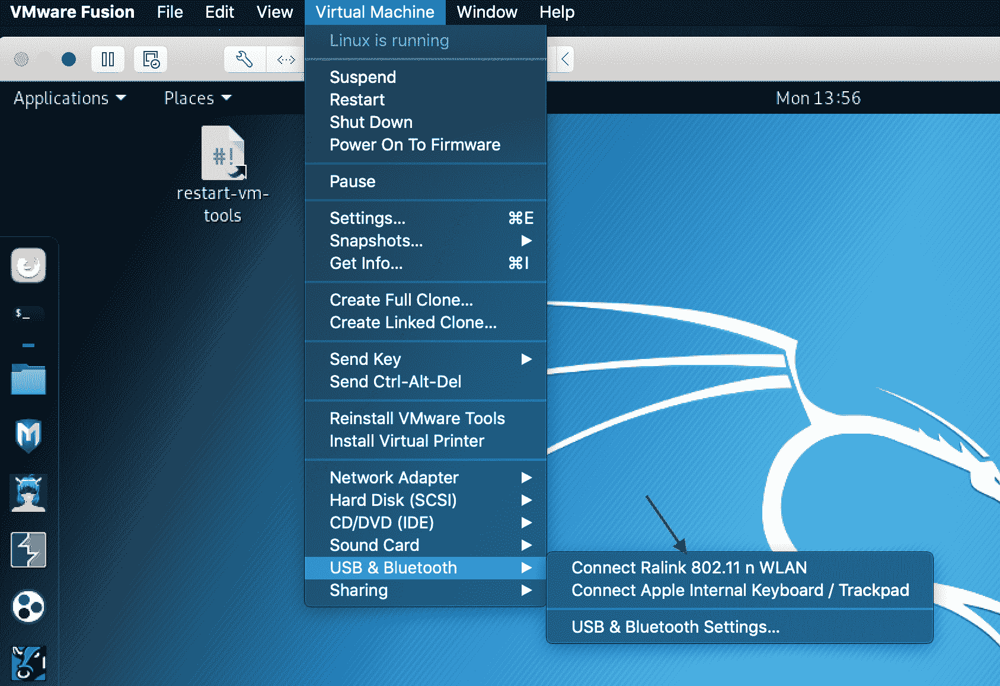
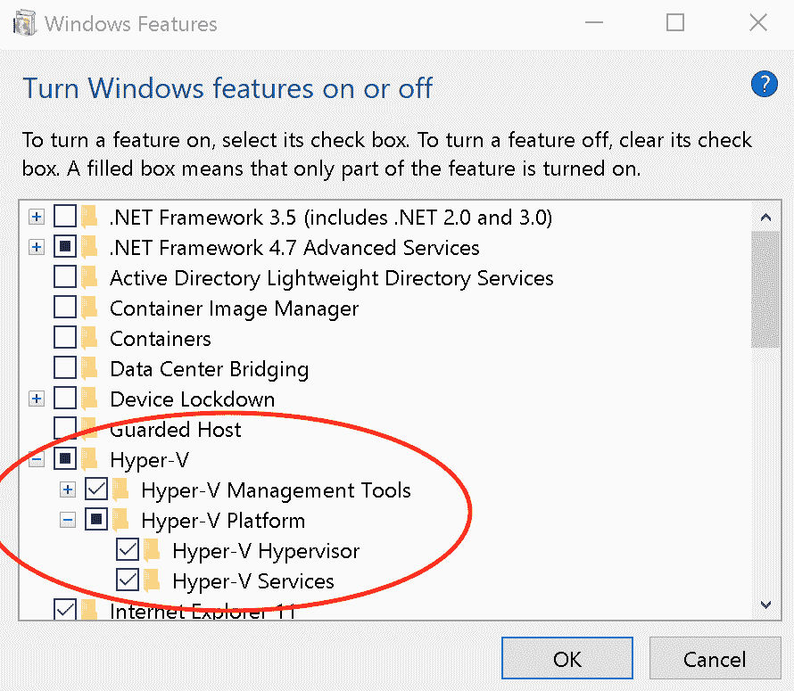

# 一、渗透测试简介

在这一章中，我们通过建立坚实的基础来开始我们的旅程。深入了解渗透测试的基础知识将有助于您成功地进行渗透测试，而不是随意扫描网络和盲目执行测试。我们将定义渗透测试及其与其他安全评估的区别。在进行实际渗透测试之前，需要做一些事情，以确保获得正确的授权并定义正确的范围。每一个成功的渗透测试学生都需要一个实验室环境——构建一个环境可能会让人望而生畏，但不要绝望。我们将了解实验室环境中存在哪些选项。

随着本章的学习，您将学习以下内容：

*   什么是渗透测试？
*   渗透测试的阶段
*   开始你的实验室
*   在 VMware、Hyper-V 和 Virtualbox 中创建**虚拟机**（**虚拟机**）

# 技术要求

本章要求以下技术要求：

*   Kali Linux 2019.1 版
*   任何虚拟机监控程序，如 VMware、Hyper-V 或 Virtualbox

# 什么是渗透测试？

如今，渗透测试常常与漏洞评估、红队评估和其他安全评估混淆。但是，它们之间有一些区别，如下所示：

*   **漏洞评估**：识别系统中的漏洞和风险的过程。在脆弱性评估中，不利用该脆弱性。它只是强调风险，以便业务部门能够识别风险并制定补救计划。
*   **渗透测试**：这是在预定义的时间范围内发现并使用漏洞对网络、应用或主机进行入侵的授权过程。渗透测试可由内部团队或外部第三方进行。与漏洞评估相比，渗透测试更进一步，渗透测试利用漏洞确保其不是误报。渗透测试不涉及任何未经授权或不协调的内容。在渗透测试期间，某些测试可能会影响业务应用并导致停机。因此，管理层和工作人员往往需要提高认识。
*   **红队评估**：类似渗透测试，但更有针对性。由于渗透测试的主要目的是发现多个漏洞并加以利用，因此红色团队评估的目标是测试组织的响应能力，并针对能够满足其目标的漏洞采取行动。在红色团队评估中，团队将尝试以任何可能的方式访问信息，并尽可能保持沉默。秘密行动是红队评估的关键。在红队评估中，评估的持续时间比渗透测试长得多。

当您开始渗透测试之旅时，了解什么是渗透测试很重要。为了说明渗透测试是什么，让我们考虑一个场景。

您当前拥有一个保存客户数据的组织。在您的组织中，您拥有 SQL 数据库、面向公众的网站、面向 internet 的服务器和大量用户。您的组织是许多攻击的主要目标，例如 SQL 注入、针对用户的社会工程和弱密码。如果您的组织受到威胁，则存在暴露客户数据等风险。

为了减少风险暴露，您需要识别当前安全态势中的漏洞。渗透测试有助于您在攻击者之前以可控的方式识别这些漏洞。渗透测试使用攻击者会利用的真实世界攻击；其目的是获取关于攻击者可以在您的网络中深入到多深以及攻击者可以获取多少信息的准确信息。渗透测试的结果为组织提供了漏洞的开放视图，并允许他们在对手采取行动之前修补这些漏洞。

将渗透测试视为通过敌人的眼睛进行观察。

渗透测试通常被称为道德黑客、白帽黑客、pentest 或 pentesting。

由于组织的安全成熟度不同，渗透测试的范围也不同。有些组织可能有非常好的安全机制，而其他组织可能没有。由于企业将策略、业务连续性计划、风险评估和灾难恢复作为其整体安全性的组成部分，因此需要包括渗透测试。

# 渗透测试的阶段

现在您了解了什么是渗透测试，您可能想知道渗透测试的流程是什么。渗透测试分为多个阶段，每个阶段都是整个渗透测试的重要组成部分。

有各种与渗透测试相关的标准。本书没有具体遵循其中任何一个标准。还有其他已知标准，例如：

*   NIST SP800-115 标准– [https://csrc.nist.gov/publications/detail/sp/800-115/final](https://csrc.nist.gov/publications/detail/sp/800-115/final)
*   **开源安全测试方法手册** **OSSTMM**–[http://www.isecom.org/research](http://www.isecom.org/research)

以下阶段遵循**渗透测试执行标准**（**PTES**），我发现这是一个很好的起点。完整标准见[http://www.pentest-standard.org/](http://www.pentest-standard.org/) 。

# 订婚前

这是每个渗透测试中最重要的阶段。在此阶段，您将开始定义渗透测试的蓝图，并将此蓝图与客户机的业务目标对齐。这样做的目的是确保所有相关人员都站在同一个角度，并提前设定好期望值。

在此阶段，作为渗透测试人员，您需要花时间了解客户的需求和目标。例如，客户为什么要执行渗透测试？客户是否受到威胁？客户进行渗透测试纯粹是为了满足合规性要求，还是打算对发现的问题进行补救？与客户交谈并了解他们的业务目标将有助于您规划和确定渗透测试的范围，从而避免任何棘手的情况。

预接合阶段包括需要考虑的几个附加组件。

# 范围界定

此组件定义将要测试的内容。在这里，关键在于找到时间、成本和业务目标之间的平衡。需要注意的是，必须清楚地记录在范围内达成的所有协议，并且必须考虑所有法律影响

在本部分中，您将提出以下问题：

*   将要测试的 IP 地址范围或系统的数量是多少？
*   渗透测试是否涵盖物理安全、无线网络、应用服务器、社会工程等？
*   渗透测试的禁区是什么？业务部门可能拥有任务关键型系统，如果这些系统受到渗透测试的影响，可能会导致收入损失。
*   渗透测试将在现场还是场外进行？
*   是否有任何第三方服务器在渗透测试范围内
*   您是否正在执行白盒、灰盒或黑盒渗透测试？

列出的问题并不涵盖所有问题，每个客户的问题也会有所不同。为了得到一个更全面的你应该考虑的问题类型列表，你可以参考 PTES 标准。http://www.pentest-standard.org/index.php/Pre-engagement 。

**White-box** testing gives you complete open access to systems, code, network diagrams, and so on. It provides more comprehensive results that are not available to average attackers.

**Grey-box** testing gives you some sort of information about the internal systems; the aim is to obtain information from the viewpoint of an attacker who has already breached the system.

**Black-box** testing does not provide you with any information or access to the network. This type of test is more practical, as you simulate an external attacker.

在确定渗透测试的范围时，要非常小心**范围蠕变**。范围蠕变是指在初始范围内未达成一致的任何额外工作。它会给渗透测试带来风险，这可能会导致您、不满意的客户的收入损失，甚至法律影响。范围爬行是一个你很容易陷入的陷阱。

在范围界定阶段，请记住渗透测试的成本。渗透测试价格因需要测试的内容而异。例如，测试一个复杂的 web 应用将需要更多的时间和精力，因此与简单的网络渗透测试相比，成本将高得多。进行渗透测试的规律性是影响成本的另一个因素。

# 时间线

客户可以设置允许您执行渗透测试的时间。某些客户机可能具有在特定时间窗口内修补的业务关键型服务器，而这些服务器在此期间可能是禁止使用的。

确保定义了开始日期和结束日期。这允许渗透测试有一个定义的结束日期。

# 与第三方打交道

如今，许多企业都在利用云服务。在您的渗透范围内，您很可能会遇到云服务器。记住谁拥有服务器是很重要的。在云环境中，服务器不属于正在进行渗透测试的企业，而是属于云提供商。

云计算领域的大公司，如微软、亚马逊和谷歌，都有参与文档的渗透测试规则。这些文件详细说明了什么是允许做的，什么是不允许做的。

微软在此处定义了其参与规则：[https://www.microsoft.com/en-us/msrc/pentest-rules-of-engagement](https://www.microsoft.com/en-us/msrc/pentest-rules-of-engagement) 。 [](https://www.microsoft.com/en-us/msrc/pentest-rules-of-engagement) 亚马逊在这里定义了其交战规则：[https://aws.amazon.com/security/penetration-testing/](https://aws.amazon.com/security/penetration-testing/) [。](https://www.microsoft.com/en-us/msrc/pentest-rules-of-engagement) [](https://aws.amazon.com/security/penetration-testing/) 谷歌在这里定义了其交战规则：[https://cloud.google.com/security/overview/](https://cloud.google.com/security/overview/) [。](https://aws.amazon.com/security/penetration-testing/)

如果您在渗透范围内拥有任何云服务，请确保您从云提供商处获得正确的批准；否则可能导致法律后果。

# 付款

关于付款条件的讨论至关重要，因为大型组织通常会延迟付款。您需要预先定义您的付款条件。应明确规定付款日期

别忘了定义成本；例如，您将对 10 个 IP 地址执行渗透测试，每个 IP 地址的成本为 500 美元

# 你的“自由出狱卡”

当您执行渗透测试时，您将发现对真实世界攻击者有价值的大量信息，并且您还将执行非法活动。渗透测试人员与恶意黑客的唯一区别是权限。

获取相关许可表，即“免出狱卡”。业务部门提供的权限详细说明了任何约束，并授权您执行范围界定协议中定义的活动

开始渗透测试是业务部门的正式批准。

# 情报收集

一旦你完成了交战前阶段，你需要在开始攻击之前收集尽可能多的信息。在情报收集阶段，也被称为信息收集，你开始考虑你能获得多少关于目标的信息。您将从可公开访问的资源中收集信息。这被称为**开源智能**（**OSIT**。您将开始利用可以帮助您的工具，如 Maltego 和 Shodan。

情报收集的重要性在于你能够发现进入目标组织的入口点。企业和员工没有考虑到他们可以在互联网上公开多少数据，因此这些数据对于确定的攻击者来说是一笔财富。

在[第三章](03.html)*执行信息收集*中，我们将更详细地介绍信息收集。

# 威胁建模

一旦在情报收集阶段收集了信息，就可以开始进行威胁建模。在威胁建模中，您开始创建威胁的结构以及它们与目标环境的关系。例如，您将识别包含有价值信息的系统，然后识别与系统相关的威胁，以及系统中存在哪些漏洞可允许攻击者对威胁采取行动。

威胁建模有几种方法，例如：

*   **欺骗、篡改、否认、信息泄露、拒绝服务、提升权限**（**跨步**）
*   **攻击模拟和威胁分析流程**（**意大利面**）
*   **视觉敏捷、简单的威胁建模**（**广域**）

您可以利用的威胁建模工具很少；最常见的有以下两种：

*   **微软威胁建模工具**：[https://aka.ms/tmt](https://aka.ms/tmt)
*   **OWASP 威吓龙**：[https://www.owasp.org/index.php/OWASP_Threat_Dragon](https://www.owasp.org/index.php/OWASP_Threat_Dragon)

# 脆弱性分析

一旦定义了可能导致危害的威胁，就应该发现这些威胁存在哪些漏洞。在漏洞分析阶段，您将开始发现系统中的漏洞，以及如何通过利用漏洞来应对这些漏洞

在这里，您将执行主动或被动分析。请记住，任何失败的攻击都可能导致检测。

主动漏洞分析可包括以下内容：

*   网络扫描仪
*   Web 应用扫描程序
*   自动扫描器

被动漏洞分析可包括以下内容：

*   监控流量
*   元数据

目前存在许多漏洞扫描程序。例如，更常用的是 Nessus，但还有许多其他的，如 OpenVAS、Nikto 和 QualysGuard。

# 剥削

在利用阶段，您开始关注获取对系统的访问权，并避开任何现有的安全阻止程序。通过在攻击阶段执行漏洞分析，您可以创建一个可以执行的精确计划

在这个阶段，您将开始使用许多工具。有些漏洞利用很容易完成，而另一些则很复杂

# 剥削后

后利用包括成功利用目标后可以执行的活动。

开发后阶段真正展示了您作为渗透测试人员的技能。当恶意黑客入侵系统时，他们开始在环境中搜寻高价值目标。他们还开始创建后门，以便能够轻松地重新访问受损的系统。

作为渗透测试人员，您将像攻击者一样执行任务。一旦你破坏了一个系统，是时候寻找高价值的目标和有价值的信息，尝试访问升级的特权，横向移动，并看看你可以如何旋转。

# 报告

在渗透测试的最后阶段，需要以有意义的方式向业务部门提供调查结果。在这里，您将定义从如何进入他们的环境到发现的一切。向业务部门提供有关如何修复渗透测试中暴露的漏洞的建议非常重要。

你的报告应该有一份执行摘要和一份技术报告。每个部分都需要根据您要向其演示的观众进行定制。例如，您不会在执行摘要中说您使用了**MS17-010 TernalBlue**漏洞来破坏系统，但您会在技术报告中这样说。

# 执行摘要

执行摘要将定义渗透测试的目标，并在非常高的层次上概述测试结果。由于执行摘要的受众通常是业务决策者，因此您需要在他们的层面上进行沟通。为此，执行摘要可包含以下章节：

*   **背景**：**在背景部分，您需要解释渗透测试的目的**
***   **总体姿态**：**在这里，您将定义渗透测试相对于交战前阶段定义的目标的有效性。*****   **风险等级**：定义业务所在的整体风险等级。例如，业务可能处于**极端**、**高**、**中等**或**低风险**。您必须解释该评级，以便业务部门清楚地了解他们为什么会进入该风险等级。*   **一般调查结果**：本节简要总结了渗透测试期间发现的问题。这里经常可以找到突出安全风险类别的图表；例如，缺少修补程序和操作系统强化。*   **建议摘要**：这概述了应该执行哪些任务来重新调解调查结果。请不要在此详述，因为技术报告中包含了详细信息。*   **战略路线图**：这为企业提供了一个可行的路线图，以纠正发现的问题。此路线图必须优先考虑，并与潜在影响的业务级别保持一致。路线图可分为**1-3 个月**、**3-6 个月**、**6-12 个月**等部分。在每个部分中，应定义行动；例如，在**1 至 3 个月**计划中，业务部门应解决影响较小的缺失补丁。****

 ****# 技术报告

与执行摘要相比，技术报告将包含更多的细节。在技术报告中，您将全面定义范围、信息、攻击方法和修复步骤。在本报告中，您可以使用易于理解的技术术语，如远程 shell、传递散列和 NTLM 散列。

技术报告将包括以下章节：

*   **简介**：本部分将包括渗透测试的范围、联系人、涉及的系统和方法等主题。
*   **信息收集**：在这里，您将解释您能够收集到多少关于目标的信息。在本节中，您可以深入了解**被动情报**（互联网上公开的信息、DNS 记录、IP 地址信息等）、**主动情报**（端口扫描、足迹等）、**人员情报**获取的信息（从社会工程、网络钓鱼等方面获得了哪些信息）等等。
*   **漏洞评估**：在本节中，您将定义发现的漏洞类型、发现方式，并提供漏洞证据
*   **漏洞利用/漏洞验证**：本节提供了您如何处理发现的漏洞的详细步骤。应包括攻击的时间线、目标、成功/失败率和获得的访问级别等详细信息。
*   **开发后**：此处包含的详细信息包括升级路径、数据提取、信息价值、对策的有效性（如有）、持久性和轴心点等活动。
*   **风险/暴露**：将前面各节的结果结合起来，并与风险和暴露等级相关联。本节将包含信息，如每次事件的估计损失、执行特定攻击所需的技能、对策强度和风险等级（临界、高、中、低）。
*   **结论**：结论应始终以积极的音符结束。在这里，您将通过对渗透测试的最终概述，重点介绍提高业务安全态势的任何指导。

现在我们已经建立了渗透测试的基础，它的阶段，以及它如何不同于脆弱性评估和红色团队评估，现在是潜入实验室环境的时候了。

# 开始你的实验室

在阅读本书的过程中，您将学习如何在受控环境中使用不同的工具。为了有一个受控的环境，我们需要建立一个。

建立渗透实验室有三种选择。如下所示：

*   **使用云提供商**：Microsoft Azure、Amazon Web Services 和 Google cloud 等云提供商为您提供了部署系统的灵活性和可扩展性，其成本仅为购买专用硬件的一小部分。使用云提供商的唯一问题是，在部署的服务上执行渗透测试可能需要权限。
*   **使用具有虚拟化软件的高性能笔记本电脑或台式机**：由于高性能笔记本电脑和台式机相对便宜，这将是许多人更喜欢的选择。通过使用 Microsoft Hyper-V、VMware 和 Virtualbox 等虚拟化软件，您可以在主机上部署完全隔离的网络。

当使用虚拟机监控程序进行渗透测试时，Hyper-V 有一个限制。目前，Hyper-V 不允许您将 USB 无线卡直接连接到 VM，而不是 VMware（如以下屏幕截图所示）和 Virtualbox。当您尝试利用监视器模式进行无线渗透测试时，会出现问题。VMware 和 Virtualbox 允许您将 USB 无线网卡直接连接到虚拟机。下面的屏幕截图描述了将无线网卡直接连接到虚拟机（*图 1*：



图 1：将无线网卡连接到虚拟机。

*   **使用专用硬件**：这是更昂贵的选择。在这里，您将需要一整套网络设备，包括专用服务器和工作站。

让我们从使用 VMware、Hyper-V 和 VirtualBox 等虚拟化工具构建实验室环境开始。

# 在 VMware、Hyper-V 和 VirtualBox 中创建虚拟机

利用虚拟机监控程序，您可以以最低的硬件成本构建实验室环境。现在任何一台像样的笔记本电脑或台式机都可以运行虚拟机监控软件。使用所选的虚拟机监控程序时，请确保正确配置虚拟网络。例如，如果您要求隔离您的虚拟机，那么您将只使用**主机**。如果您需要您的虚拟机访问互联网，您可以使用**网络地址转换**或**桥接网络**。**网络地址转换和桥接网络的区别在于，通过桥接网络，虚拟机将获得自己的 IP 地址，而通过网络地址转换，虚拟机将利用主机、IP 地址进行外部通信。**

 **请注意，不同的虚拟机监控程序软件之间的选项可能不同，但概念是相同的。

# 微软 Hyper-V

Hyper-V 是 Microsoft 的一种虚拟化产品，可用于创建虚拟机。Microsoft Hyper-V 可在 Windows 10 上使用。它可以在企业版、教育版和专业版 Windows 10 上启用

Hyper-V 可以通过多种方式安装。

使用 Powershell，您可以使用以下代码安装 Hyper-V 角色：

```
Enable-WindowsOptionalFeature -Online -FeatureName Microsoft-Hyper-V -All
```

另外，通过使用以下 DISM 和 CMD（以管理员身份运行）代码：

```
DISM /Online /Enable-Feature /All /FeatureName:Microsoft-Hyper-V
```

还可以使用 Windows 中的程序和功能安装 Hyper-V。为此，应在 Windows 10 中执行以下步骤：

1.  按 Windows 键+*R*打开运行对话框。输入`appwiz.cpl`打开程序和功能，如*图 2*所示：


图 2：打开程序和功能。

2.  点击打开或关闭 Windows 功能，如*图 3*所示：


图 3：打开或关闭 windows 功能。

3.  选择 Hyper-V 角色，如*图 4*所示：



图 4：选择 Hyper-V 角色。

4.  点击 OK。

您的计算机需要重新启动才能安装 Hyper-V 角色。

Hyper-V 目前无法将 USB 设备直接连接到虚拟机。这会导致用于无线渗透测试的无线卡出现问题，因为您无法切换到监控模式。

有关 Microsoft Hyper-V 的更多信息，请访问[https://docs.microsoft.com/en-us/virtualization/hyper-v-on-windows/about/](https://docs.microsoft.com/en-us/virtualization/hyper-v-on-windows/about/) 。

# VMware

VMware 是一种提供免费和付费版本的虚拟化软件。VMware 提供了对 Microsoft Windows、Linux 和 Mac OS 的支持。

VMware 工作站播放器（[https://www.vmware.com/products/workstation-player.html](https://www.vmware.com/products/workstation-player.html) 免费提供给 Microsoft Windows 和 Linux 操作系统。有一个付费版本称为 VMware Workstation Pro（[https://www.vmware.com/products/workstation-pro.html](https://www.vmware.com/products/workstation-pro.html) ），它在免费版本上提供了一些附加功能。VMware Fusion（[https://www.vmware.com/products/fusion.html](https://www.vmware.com/products/fusion.html) ），这也是一个付费版本，适用于 macOS

# 虚拟机

Virtualbox 是一个免费使用的开源虚拟机监控程序。它提供对 Microsoft Windows、Linux 和 macOS 的支持。Virtualbox 有许多可供使用的扩展，包括对 USB3、PXE 引导、磁盘加密等的支持。

Virtualbox 可在[下载 https://www.virtualbox.org/wiki/Downloads](https://www.virtualbox.org/wiki/Downloads) 。

# 目标机器

随着本书的深入，我们将针对目标机器执行一些渗透测试

当我们谈论目标机器时，它们是本书中用于测试各种工具和概念的虚拟机。

对于 Microsoft Windows，我们将利用评估中心下载 Windows 10 Enterprise 和 Server 2012 R2。

可通过[访问微软评估中心 https://www.microsoft.com/en-us/evalcenter/](https://www.microsoft.com/en-us/evalcenter/) 。

Windows Server 2012R2 的直接链接为[https://www.microsoft.com/en-us/evalcenter/evaluate-windows-server-2012-r2](https://www.microsoft.com/en-us/evalcenter/evaluate-windows-server-2012-r2) ，对于 Windows 10 Enterprise，直接链接为[https://www.microsoft.com/en-us/evalcenter/evaluate-windows-10-enterprise](https://www.microsoft.com/en-us/evalcenter/evaluate-windows-10-enterprise) 。

对于这两种操作系统，您将利用`.iso`文件，并使用您选择的虚拟机监控程序安装它们。

# 可变形

Metasploitable 是一台故意易受攻击的计算机，可用于测试 Metasploit 漏洞以获取 shell 权限。Metasploitable 不同于其他易受攻击的计算机，因为它更关注操作系统和网络层。

Metasploitable 目前有三个版本；它们被恰当地命名为 Metasploitable、Metasploitable 2 和 Metasploitable 3。

在每个版本中，除了设置它们的方式外，还有很多重大的变化。

Metasploitable（版本 1）是一个基于 VM 的自定义 Ubuntu 映像。在此映像中，安装了许多易受攻击且配置不当的软件。例如，您可能拥有凭证较弱的 Tomcat，可以使用 Metasploit 轻松利用它。

Metasploitable（版本 1）可在 Vulnhub 上下载，网址为[https://www.vulnhub.com/entry/metasploitable-1，28/](https://www.vulnhub.com/entry/metasploitable-1,28/)。

Metasploitable 2 更健壮，引入了更多的漏洞。它包括 30 多个暴露在 Nmap 扫描中的端口。它还包括易受攻击的 web 应用，如**该死的易受攻击的 web 应用**（**DMVA**）和**Mutillidae**。这允许人们测试他们的 web 应用渗透测试技能。

Metasploitable（版本 2）可在[下载 https://information.rapid7.com/download-metasploitable-2017.html](https://sourceforge.net/projects/metasploitable/) 。

Metasploitable 3 提高了游戏的质量。版本 1 和 2 基于 Linux，但版本 3 基于 Windows。Metasploitable 3 利用了自动化和资源调配。构建过程简单而健壮，它的所有脚本都是开源的，并且它利用了诸如**vagrant**和**packer**等工具。在编写本书时，Metasploitable 3 同时支持 VMware 和 Virtualbox

Metasploitable 3 可从[下载 https://github.com/rapid7/metasploitable3](https://github.com/rapid7/metasploitable3) 。

在启动和运行 Metasploitable 之前，还需要安装其他软件。以下是必需的：

*   打包机（可在[下载）https://www.packer.io/intro/getting-started/install.html](https://www.packer.io/intro/getting-started/install.html) ）
*   流浪汉（可在[下载）https://www.vagrantup.com/docs/installation/](https://www.vagrantup.com/docs/installation/) ）
*   流浪者重新加载插件（可在[下载）https://github.com/aidanns/vagrant-reload#installation](https://github.com/aidanns/vagrant-reload#installation) ）
*   Virtualbox 还是 VMware
*   Metasploitable 3（可在[下载）https://github.com/rapid7/metasploitable3](https://github.com/rapid7/metasploitable3) ）

Metasploitable 3 的构建步骤相对简单，可以在 Rapid7 维护的 GitHub 存储库中找到（[https://github.com/rapid7/metasploitable3](https://github.com/rapid7/metasploitable3) ）。internet 上有可用资源托管预构建的 Metasploitable 3 虚拟机。

在[第 5 章](05.html)中*深入到 Metasploit 框架*中，我们将使用这里讨论的 Metasploitable 实验室执行各种任务。

# 总结

在本章中，我们开始建立坚实的基础，因为你了解渗透测试，以及它如何不同于脆弱性和红色团队评估。我们定义了利用渗透测试方法或标准的重要性，如 PTES 标准及其各个阶段。在每个阶段中，我们都讨论了所涉及的内容，并强调了一些不应忽视的重要方面，如“免出狱卡”。最后，我们研究了实验室环境、当前存在的各种虚拟机监控程序，以及如何构建 Metasploitable 实验室环境以供将来使用。

在下一章（[第 2 章](02.html)、*开始使用 Kali Linux*）中，我们将深入了解 Kali Linux，以探索 Kali Linux 的不同安装选项以及所需的一些初始配置。我们将探讨 Kali Linux 中的一些基本工具及其主要用途。

# 问题

1.  渗透测试的目的是什么？
2.  列出至少两种渗透测试标准。
3.  为什么渗透测试的范围很重要？
4.  请至少列出两种威胁建模方法。
5.  为什么 Metasploitable 不同于其他易受攻击的机器？******