# 九、无线攻击入门

随着无线设备数量的不断增加，无线行业继续增长。一个普通家庭拥有接入点、媒体中心、电话、控制台、个人电脑，甚至安全系统。公司依靠无线网络为员工提供便利，员工可以在公司大楼内外自由走动。能够自由访问网络的缺点是，它使网络容易受到漏洞攻击。因此，公司识别并修复无线网络中的漏洞非常重要。

在本章中，您将了解无线攻击以及如何执行这些攻击。我们将讨论无线分组的各种组件，例如信标帧，以及分组中包含的内容。您将了解可用于无线数据包注入和监视的无线适配器的类型。我们将深入研究可用于执行不同攻击的各种工具。最后，您将学习如何破解各种无线加密协议。

随着本章的学习，您将了解以下主题：

*   探索无线攻击
*   兼容硬件
*   无线攻击工具
*   开裂 WPA/WPA2 和 WEP

# 技术要求

本章需要以下技术要求：

*   Kali Linux 2019.1
*   用于数据包注入的兼容网卡
*   支持 WPA/WPA2 和 WEP 的无线路由器

# 探索无线攻击

无线网络已经从**很好地拥有**发展到组织中**必须具备**的要求。无线网络几乎无处不在。例如，您可能有一个无线网络在家中运行，以方便 internet 访问。这种接入将移动电话、智能电视、媒体播放器、游戏机、平板电脑和个人电脑等设备随时连接到互联网。你所有的邻居可能都有类似的设置

在企业中，无线网络是提高生产力和促进信息交流的强大工具。员工可以漫游，可以不受限制地访问共享文档、电子邮件、应用和其他网络资源。无线网络提供了简单、易用、方便的客户服务，以及难以到达的区域的网络接入。

不幸的是，无线设备往往缺乏安全性，这导致了严重的漏洞。公司通常不会安全地配置无线设备，有些公司甚至可能使用默认配置的无线设备

如果您想成功执行渗透测试，了解无线网络的工作原理以及各种加密算法和针对无线网络的攻击至关重要。

# 无线网络体系结构

在对无线网络盲目进行渗透测试之前，了解无线网络的体系结构非常重要。这将帮助您从渗透测试的角度很好地理解不同的模式以及哪些类型的无线帧是重要的。

无线网络以两种主要模式运行：

*   基础设施模式
*   特别模式

在这两种模式中，都有一个称为**服务集标识符**（**SSID**的公共组件，用于网络验证。使用基础架构模式时，SSID 由**接入点**（**AP**设置）。在特别模式下，SSID 由创建网络的站点设置。

在**基础设施模式**中，应至少有一个接入点和一个站点。这两者都构成了一个**基本业务集**（**BSS**。**扩展服务集**（**ESS**）是指两个或多个接入点连接到同一 IP 子网或**虚拟局域网**（**VLAN**），从而创建单个逻辑网段。

在**自组织模式**下，当两个或多个站点在没有接入点的情况下开始通信时，创建**独立基本业务集**（**IBSS**。这种模式可以称为对等模式。其中一个站点将自由地处理接入点将处理的职责，例如信标和认证新客户。

# 无线帧

在无线网络中，使用帧进行通信。在无线帧内，前两个字节属于称为**帧控制**的组件。在这个帧控制帧中，我们有多个字段，它们具有不同的位大小。值得注意的是`type`字段。

`type`字段包含以下类别的帧：

*   **管理帧**：负责保持站点与接入点之间的通信。这些帧的某些子类型包括身份验证、取消身份验证、关联、信标、探测请求和探测响应。
*   **控制帧**：负责接入点与站点之间的数据交换。这里的一些子类型包括请求发送、清除发送和确认。
*   **数据帧**：这些帧承载实际数据。它们没有亚型。

我想深入研究以下几帧，因为这些帧可以揭示一些关键信息。

# 值得注意的无线帧

**信标帧**是通过无线网络发送的最常见的数据包。这些信息发送得相当快，通常每秒发送几次。当然，这可以在各种无线接入点中进行控制。信标帧包含有用的信息，例如：

*   SSID 名称（除非禁用 SSID 广播）
*   接入点的 Mac 地址
*   安全功能（WPA2 密码短语、WPA、WEP、WPA 企业版）
*   信标间隔
*   通道和通道宽度
*   国
*   接入点支持的连接速度

*图 1*显示了信标帧中包含的内容。您会注意到间隔为 0.102400[秒]。第 1 点显示帧是由 AP 发送的，并且由于未设置第二位，这表明它不是一个自组织网络。第 2 点包含有关 SSID、支持的数据速率、通道宽度和国家/地区信息的详细信息：

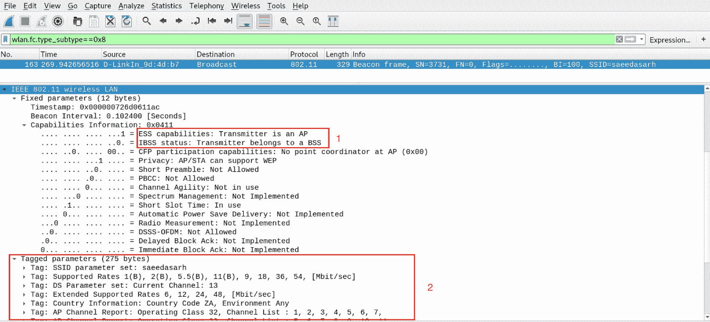

图 1：信标帧

应用的过滤器（`wlan.fc.type_subtype==0x8`特定于信标帧，因为它们是管理帧（帧零）和子类型 8 的一部分。

**反验证**帧用于解除当前与接入点关联的客户端的关联。你会强迫客户解除联系的原因有很多；例如，如果您想要发现隐藏的 SSID，或者想要捕获 WPA/WPA2 握手。

*图 2*显示了一个反验证数据包的示例捕获：

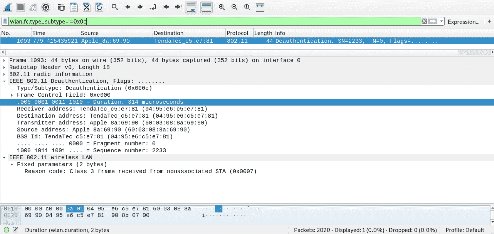

Figure 2: Deauthentication frame

请注意，定义的原因码为`class 3`表示站点正在离开或已经离开独立的基本服务集。此反验证是使用 aireplay ng 进行的。我们将在本章后面详细介绍此工具。原因码有很多，我在*表 1*中列出了常见的原因码：

| **原因码** | **说明** | **说明** |
| `0` | 无原因代码 | 这是正常的行为 |
| `1` | 不明原因 | 客户端当前已关联，但不再授权 |
| `2` | 以前的身份验证不再有效 | 客户端已关联但未授权 |
| `3` | 取消认证离开 | 电台已取消身份验证，因为它将离开 IBSS 或 ESS |
| `4` | 由于不活动而解除关联 | 客户端会话已超时 |
| `5` | 解除关联 AP 忙 | 接入点当前正忙，无法处理当前关联的客户端 |
| `6` | `Class2`来自非认证站的帧 | 客户端试图在进行身份验证之前传输数据 |
| `7` | `Class3`来自非关联站的帧 | 客户端试图在数据与访问点关联之前传输数据 |

**认证**帧组成认证过程。交换的认证帧的数量不同；**认证交易序列号**负责跟踪认证过程，可以处理`1`到`65535`之间的值。**认证算法***用于识别正在使用的认证类型。下面的示例捕获（*图 3*显示正在使用开放式身份验证：*

 *

图 3：身份验证框架

使用值`0`表示正在使用开放式身份验证。`1`值表示使用共享密钥认证。

# 无线安全协议

随着无线技术的发展和广泛应用，为无线技术提供安全性的安全协议也在发展

密码只是无线安全的一半。选择正确的加密级别同样重要，正确的选择将决定您的无线局域网是否易于利用。大多数无线接入点支持三种无线加密标准之一：**有线等效隐私**（**WEP**），或**Wi-Fi 保护接入**（**WPA**或**WPA2**）。

在潜入无线网络进行渗透测试之前。我们需要检查现有的加密标准，并了解其漏洞。

# WEP

WEP 的创建是为了解决开放网络由于未使用加密而容易被窃听的问题。它在创建时提供了合理程度的安全性。它使用**Rivest 密码 4**（**RC4**）对流量进行加密，并使用 CRC32 校验和提供消息完整性。RC4 是一种对称密码，这意味着相同的密钥用于数据的加密和解密。密码创建一个与纯文本异或的比特流，从而生成加密数据。当然，解密数据可以通过简单地使用密钥流对加密数据执行 XOR 来完成。

WEP 使用了一个 24 位的**初始化向量**（**IV**。IV 用于确保加密的第一个纯文本数据块是随机的。这确保了如果对相同的纯文本进行加密，结果将是不同的密文。由于 IV 的小尺寸，密钥重用的可能性很高，这使得破解加密很容易实现

2001 年，网络安全专家发现了 WEP 中的几个严重缺陷，导致业界建议在商业和消费设备中逐步停止使用 WEP。

# 湿法磷酸

基于 WEP 的缺陷，迫切需要为无线设备提供更多的安全性。这就是 WPA 被引入的时候。WPA 引入了两种新的链路层加密协议；它们是**时态密钥完整性协议**（**TKIP**）和**带 CBC-MAC 的计数器模式**（**CCMP**）。

WPA 有两种模式：

*   **WPA personal**：使用预共享密钥进行身份验证，该密钥由网络中的所有对等方共享。
*   **WPA 企业**：利用 radius 服务器进行 802.1x 认证**认证、授权和计费**（**AAA**）。

WPA 仍然使用 WEP 作为加密算法，以支持向后兼容性和遗留硬件。然而，使用 TKIP，它通过使用以下内容解决了许多安全缺陷：

*   256 位密钥
*   通过为每个数据包生成唯一密钥来混合每个数据包密钥
*   自动传送更新的钥匙
*   完整性检查
*   48 位 IV 大小和 IV 排序可减少重播攻击

# Wi-Fi 保护访问版本 2（WPA2）

WPA2 是作为 WPA 的继任者引入的。它采用了更强的**高级加密标准**（**AES**算法。AES 由三个对称分组密码组成，每个密码为 128 位。块的加密和解密可以使用 128 位、192 位和 256 位密钥进行。AES 需要更多的计算能力，但随着无线设备的进步，性能问题只在较旧的硬件上常见。

WPA2 与**密码分组链报文认证码协议**（**CCMP**一起使用计数器模式。CCMP 通过仅允许有权接收数据的设备或用户来提供数据保密性。密码块链接用于提供数据的完整性

WPA2 与旧硬件不兼容，因为它是从头开始重新设计的。支持 WPA 引入的**个人**和**企业**模式。

2017 年，一个严重缺陷被宣布影响 WPA2。它被称为**KRACK**，代表**密钥重新安装攻击**。当攻击者诱使目标重新安装已在使用的密钥时，就会发生密钥重新安装攻击。这可以通过操纵和重放 WPA2 的加密握手消息来实现。安装此密钥后，nonce（增量传输包编号）和重播计数器等参数将重置为其初始值。通过强制 nonce 重用，可以重放、伪造和解密数据包。

# Wi-Fi 保护访问版本 3（WPA3）

WPA3 于 2018 年发布，旨在取代广泛使用的 WPA2，并带来了几个核心增强功能，以增强个人和公司网络的安全保护和程序

WPA3 引入了一种不同的握手过程，称为等于（**SAE**）的**同步认证，也称为**蜻蜓**密钥交换。加密由 AES-GCM 处理，WPA3 使用的会话密钥长度对于企业模式为 192 位，个人模式为 128 位（192 位是可选的）。数据完整性由**安全哈希算法 2**（**SHA2**处理）。**

即使对于没有密码的 Wi-Fi 网络，WPA3 安全性也提供了一种称为**个人数据加密**的数据保护机制。此机制使用单独的密钥加密每个设备的数据包，因此其他设备无法解密彼此的数据。

WPA3 听起来很安全；然而，有一个叫做**龙血**的漏洞。此漏洞允许攻击者通过滥用计时或基于缓存的侧通道泄漏来恢复密码。

WPA3 不在本书的范围内，但值得了解其中存在的新标准和漏洞。

有关 WPA3 的更多信息，请访问此处的 Wi-Fi 联盟页面：[https://www.wi-fi.org/discover-wi-fi/security](https://www.wi-fi.org/discover-wi-fi/security) 。

# 无线攻击的类型

让我们来看看存在的各种类型的无线攻击：

*   **访问控制攻击**：这些类型的攻击试图通过绕过访问控制保护（如 MAC 过滤器或`802.1x`端口安全）来访问无线网络。访问控制攻击的一些示例如下：
    *   **流氓接入点**：这些是不安全的接入点，用于创建进入可信网络的后门。
    *   **Mac 欺骗**：该攻击试图欺骗已经授权的接入点或站点的 Mac 地址。
    *   **临时关联**：这种类型的攻击试图通过临时模式直接连接到站点。这使得可以绕过接入点的安全性，因为站点可能会受到攻击或被用作枢轴点。
*   **保密性攻击**：这些类型的攻击旨在拦截通过无线网络发送的流量。机密性攻击的一些示例如下：
    *   **邪恶孪生 AP**：这是一个恶意接入点，伪装成合法接入点，试图欺骗客户端对其进行身份验证。这可用于窃取凭据或执行中间人攻击。
    *   **假门户**：在此次攻击中，假捕获门户被用来欺骗用户提供预共享密钥、敏感信息或登录详细信息等信息。
*   **完整性攻击**：此类攻击利用伪造帧误导接收者。它们还可用于执行拒绝服务攻击。完整性攻击的一些示例如下：
    *   **Radius 重放攻击**：利用嗅探和拦截等技术，可以捕获和存储请求认证器、标识符和服务器响应。以后可能会出于恶意目的重播这些内容
    *   **帧注入攻击**：在这种攻击中，可以操纵无线帧。例如，强制取消身份验证帧以强制设备对接入点重新身份验证，以便捕获握手。
*   **身份验证攻击**：这些类型的攻击旨在窃取身份验证信息，这些信息可用于访问资源或服务。身份验证攻击的一些示例如下：
    *   **WEP/WPA/WPA2****密钥破解**：此攻击需要捕获身份验证握手并执行离线暴力以获取预共享密钥。
    *   **降级攻击**：这些攻击可以通过强制服务器使用伪造的 EAP 数据包提供较弱的身份验证来对付`802.1x`。

# 兼容硬件

拥有合适的硬件是对无线网络进行渗透测试的关键。并非所有的无线适配器都允许您切换到监控模式或执行数据包注入。

监控模式允许无线适配器切换到**混杂**模式，这样它可以**监控**数据包而无需任何过滤。许多工具，如`airodump-ng`和`aireplay-ng`需要将无线适配器置于监控模式下才能运行。

# 无线适配器

选择正确的无线适配器可能会很棘手，尤其是现在有很多选择。正确的适配器是特定于您的需要的。您可能需要一个小型紧凑型适配器或一个可以利用各种天线尺寸的适配器。这完全取决于你的偏好，以及它是否适合你。

无线适配器需要注意的一点是，应考虑发送功率和接收灵敏度。例如，灵敏度越低，接收效果越好，但功率越高，数据传输效果越好。通常，如果您正在考虑范围，您将只使用高性能适配器。

具有 Atheros、Realtek 或 Ralink 芯片组的无线适配器通常支持监控模式和数据包注入。然而，并不是所有人都这样做。互联网上有多篇评论和评论，定期使用最新支持的硬件进行更新。在您喜爱的搜索引擎上快速搜索`Kali Linux compatible wireless adapters`等关键词，将为您提供大量结果。

最常用的无线适配器是 Alfa 无线适配器。在亚马逊和其他供应商那里都可以找到，而且价格相对便宜。小心假货，因为市场上有很多假货。我正在使用的无线适配器是**阿尔法****AWUSO36NH**。这张卡的发射功率高达 2000 兆瓦，令人印象深刻。在撰写本文时，它在亚马逊上的售价为 31.99 美元。由于某些网络使用 2.4 GHz 和 5 GHz 频率，您可能需要一个可以跨这两个频率工作的无线适配器。**熊猫 PAU09**与 Kali linux 配合良好，支持 2.4 GHz 和 5 GHz 频率；在撰写本文时，Amazon 上提供此适配器的价格为 39.99 美元。

需要注意的是，有些无线网卡在使用 Kali Linux 时可以直接使用。有些需要编译驱动程序。有时，对同一卡片模型进行小的修改会产生不同的结果。确保彻底研究无线网卡。

2.4 GHz 和 5 GHz 频率之间的主要区别是范围。与 5 GHz 相比，2.4 GHz 能够达到更远的距离。或者，2.4 GHz 受到的干扰比 5 GHz 多得多。在 2.4 GHz 中，重叠信道的数量要多得多，2.4 GHz 有三个非重叠信道，而 5 GHz 有二十三个非重叠信道。

拥有兼容的无线适配器后，可以通过执行以下操作将其置于监视器模式：

1.  在 Kali Linux 中打开终端窗口并发出`iwconfig`命令。请注意无线网卡的接口名称（*图 4*），在下面的示例中，无线适配器接口名称为`wlan0`：


图 4：使用 iwconfig 识别无线适配器

2.  在更改模式之前，最好关闭接口。这可以使用`ifconfig wlan0 down`命令来完成。要将模式从“管理”更改为“监视”，请使用`iwconfig wlan0 mode monitor`命令。最后，使用*图 5*所示的`ifconfig wlan0 up`命令将界面恢复在线：

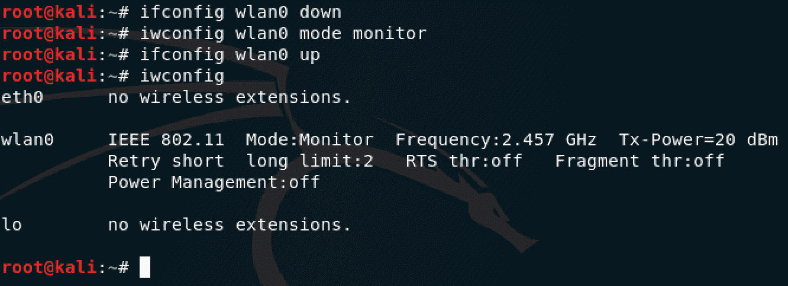

图 5：将无线适配器置于监视器模式

现在无线适配器正在监视器模式下工作（`Mode:Monitor`。若要将界面切换回监控模式，请按照之前的*步骤 2*，但使用`iwconfig wlan0 mode managed`。

使用`airmon-ng`可以更快地启用监控模式；这将在下一节中介绍。

如果您使用的阿尔法无线网卡支持 1000MW 的额定发射功率，则根据您所在的位置，`Tx-Power`可能会设置为 20dBm（根据*图 6*。要启用卡的全部功能，请执行以下步骤：

1.  使用`ifconfig wlan0 down`命令关闭接口。`Wlan0`为接口名称；在您的环境中可能会有所不同。
2.  使用`iw reg set US`命令将区域设置为 US。
3.  使用`ifconfig wlan0 up`命令使界面联机。
4.  使用`iwconfig wlan0`命令检查额定功率：


图 6：增加阿尔法发射功率

请注意，现在额定功率已增加到`30 dBm`（*图 6*），每`10 dBm`增加 10 倍功率，单位为 mW。

# 无线攻击工具

Kali Linux 包括许多可用于攻击无线网络的内置工具。我们将探讨各种工具以及如何使用它们。

请注意，在阅读本章的过程中，您应该在自己的无线网络上执行攻击。

# 菲舍尔

Wifiphisher 是一款优秀的恶意接入点工具，可用于进行渗透测试或 Wi-Fi 安全测试。该工具的工作原理是创建一个中间人攻击，攻击正在执行接入点关联的无线客户端。Wifiphisher 可以通过使用第三方登录页面进行定制，也可以创建自己的页面

Wifiphisher 默认安装在 Kali Linux 中。可以使用`wifiphisher`命令运行。注意`wifiphisher`需要`roguehostapd`，但是您可以使用`hostapd`，它安装在 Kali 中。要使用`hostapd`，您可以运行`wifiphisher --force-hostapd`命令。

让我们使用`wifiphisher`的内置网络钓鱼页面执行一个简单的网络钓鱼活动。请记住将无线适配器置于监视器模式：

1.  从 Kali 终端窗口，运行`wifiphisher --force-hostapd`命令。您将看到`wifiphisher`（*图 7*的主屏幕。在这里，您将看到发现的无线网络列表。选择要为其创建流氓访问点的访问点：

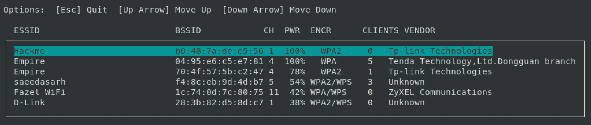

图 7:Wifipher 无线网络选择

2.  选择网络后，您将看到一系列可用的网络钓鱼方案。我选择了标准`Firmware Upgrade Page`，如*图 8*所示：


图 8:wifiphisher 的网络钓鱼场景

您可以构建自己的网络钓鱼场景，并利用 internet 上提供的预构建自定义页面。这些页面需要存储在`wifiphisher/data/phishingpages`目录中。

选择页面后，`wifiphisher`将自动创建恶意访问点，并开始对任何连接的客户端进行反验证。

一旦用户再次尝试连接到无线网络，他们将看到您选择的网络钓鱼页面。在我的例子中，是固件升级页面，如*图 9*所示：


图 9：固件升级仿冒页面

一旦提供了预共享密钥，页面开始`upgrade the firmware`，但当然，实际上什么都没有发生。但是，在 Wifiphisher 终端上，我们有捕获的明文凭证，如*图 10*所示：


图 10：捕获的 PSK

在渗透测试中使用此工具时，您需要使仿冒页面具有说服力。一些终端用户精通技术，不会轻易爱上一个简单的网络钓鱼页面。你还需要考虑在企业 Wi-Fi 认证中使用他们的域凭证；在这种情况下，您需要创建一个类似于企业门户的狡猾的网络钓鱼页面。

有关创建自定义网络钓鱼页面的更多信息，请参见此处：[https://wifiphisher.org/docs.html](https://wifiphisher.org/docs.html) 。

# 空勤舱

Aircrack ng 是一套功能强大的工具，与 Kali Linux 一起预装。该套件包括处理以下类别的工具：

*   **监控**：执行数据包捕获，并提供将数据导出到文本文件的功能，以便在第三方工具中使用
*   **攻击**：用于执行重放攻击、帧攻击，如反验证等，使用数据包注入
*   **测试**：查看 Wi-Fi 适配器功能，执行捕获和数据包注入
*   **破解**：对 WEP、WPA 和 WPA2 预共享密钥执行攻击

让我们深入了解各种工具，以及如何将这些工具用于渗透测试。请记住，您的无线适配器必须处于监视模式，工具才能工作。我们将首先使用`airmon-ng`启用监控模式。

# 吴爱蒙

Airmon ng 是一个脚本，用于在无线适配器上启用和禁用监视器模式。不带任何参数运行`airmon-ng`将显示您当前的无线接口状态。

Airmon ng 简单明了。使用以下步骤在无线适配器上启用监视器模式：

1.  打开终端窗口，使用`airmon-ng`命令查看无线适配器的名称。此命令将显示当前无线适配器、其接口名称、驱动程序和芯片组。
2.  要将适配器置于监视模式，可以使用`airmon-ng start [interface name]`命令。例如，在*图 11*中，我的适配器的接口名为`wlan0`：

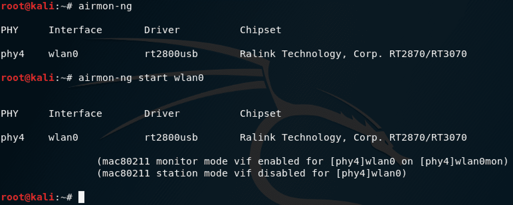

图 11：使用 airmon ng 启用监视器模式

可以使用`airmon-ng`检查是否有任何流程会干扰`aircrack-ng`套件的工具。检查这一点的命令是`airmon-ng check`。

在*图 12 中*我们看到有几个过程可能会导致`aircrack-ng`工具套件出现问题：


图 12：识别有问题的流程

您可以让`airmon-ng`通过使用此命令`airmon-ng check kill`杀死任何将进行接口的进程。

要将无线适配器恢复到`managed`模式，可以使用以下命令：`airmon-ng stop [interface name]`。

`airmon-ng`使您能够在特定通道上将适配器设置为监视器模式。可以使用以下命令执行此操作：

```
airmon-ng start [interface name] [channel number]
```

当有很多无线网络，并且您希望将注意力集中在目标网络运行的特定通道上时，这会很方便。

# 空气泵

Airodump ng 用于执行原始 802.11 帧的数据包捕获。该工具可用于收集 WPA 握手或弱 WEP 初始化向量，以用于 Aircrack ng。它具有记录检测到的无线网络的 GPS 坐标的功能，这些坐标稍后可以导入在线 Wi-Fi 映射工具。

`airodump-ng`的命令语法为`airodump-ng [options][interface name]`。

`airodump-ng`有很多选择。只要发出`airodump-ng`命令，就会显示完整的列表。一些值得注意的选择如下：

*   `-w`：用于将输出写入文件。
*   `-c`：用于指定要捕获的通道。
*   `-bssid`：用于定义目标 BSSID。

使用`airodump-ng`嗅探无线网络是使用`airodump-ng [interface name]`命令完成的，没有任何选项。显示的输出将显示范围内的当前无线网络，包括连接的站点，如*图 13*所示：

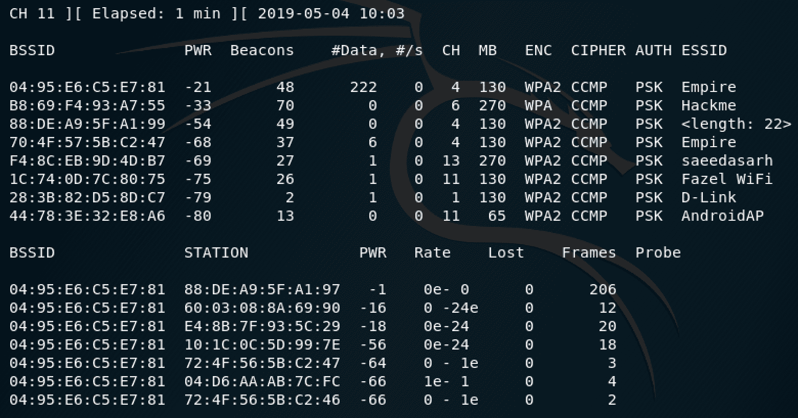

图 13：空气泵 ng 输出

不要被显示的信息淹没，因为理解它很简单。Airodump ng 有两个单独的部分。顶部显示有关已发现网络的信息。字段描述如下：

| **字段** | **说明** |
| `BSSID` | 这是接入点的 MAC 地址。 |
| `PWR` | 这是信号电平。您离接入点越近，信号等级越高。有些可能显示为`-1`，这意味着您太远了，或者检测信号电平时存在驾驶员问题。 |
| `Beacons` | AP 发送的信标帧数。 |
| `#Data` | 捕获的数据包数。如果使用 WEP，它将是唯一的 IV 计数。 |
| `#/s` | 在 10 秒内捕获的数据包数。 |
| `CH` | 这是从信标帧导出的信道号。 |
| `MB` | AP 支持的最大速度。 |
| `ENC` | 正在使用加密算法。 |
| `Cipher` | 已检测到的密码。 |
| `Auth` | 正在使用的身份验证协议。 |
| `ESSID` | 网络的 SSID。如果 SSID 被隐藏，则该值将为空；然而，`airodump-ng`将尝试从探测和关联响应中恢复 SSID。 |

底部显示检测到的接入点和连接到接入点的客户端（站）的 MAC 地址。

出于演示目的，我的目标是 Hackme 无线网络。我会告诉`airodump-ng`把重点放在那个接入点和通道上，我想把捕获的内容写到磁盘上。这可以使用以下命令完成：

```
airodump-ng -c 6 --bssid B8:69:F4:93:A7:55 -w hackme-cap [interface name]
```

在此命令中，`-c 6`表示通道号，`--bssid`表示接入点 MAC 地址，`-w`表示捕获文件名，`interface name`表示我的无线适配器，处于监控模式：

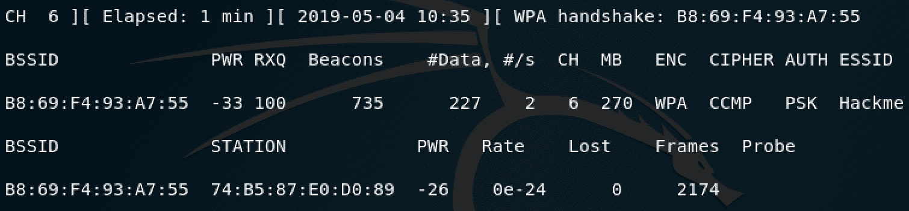

图 14：为特定网络定制 airodump ng

注意*图 14*中的输出，其中捕获了 WPA 握手。我们将在本章后面的*机组 ng*部分介绍如何破解握手。

# Aireplay ng

Aireplay ng 主要用于注入帧和生成流量，以便稍后与`aircrack-ng`一起使用。常见的攻击之一是反身份验证攻击；此攻击的目的是捕获握手数据。

`aireplay-ng`的命令语法如下：

```
aireplay-ng [options][interface name]
```

`aireplay-ng`有丰富的选项，其中对于各种攻击方法中的每一种，可以通过名称或编号来定义攻击方法。例如，可以使用`deauthentication attack is attack number 0`或`--deauth`。`aireplay-ng`支持以下攻击方式：

*   **反验证**：此攻击的目的是解除连接到接入点的客户端的关联。这将迫使他们重新关联，并使您能够捕获握手。
*   **假****身份验证**：此攻击允许您与接入点关联。当您需要利用各种攻击，并且没有与访问点关联的站点时，它非常有用。
*   **交互式数据包重放**：当您想要选择一个特定的数据包重放到接入点时，使用此攻击。
*   **ARP 请求重放攻击**：该攻击有效生成新的 IVs。它的工作原理是将 ARP 数据包重新传输回接入点，这迫使接入点使用新的 IV 重复 ARP 数据包。
*   **KoreK****chopchop****攻击**：该攻击能够在不具备密钥的情况下对 WEP 数据包进行解密。它不会恢复 WEP 密钥，但会以纯文本形式显示它。
*   **碎片攻击**：该攻击用于获取**伪随机生成算法**（**PRGA**）。此 PRGA 可与`packetforge-ng`一起用于生成用于各种其他注入攻击的数据包。
*   **咖啡拿铁攻击**：此攻击使您能够从客户端站而不是访问点获取 WEP 密钥。它处理 ARP 数据包，这些数据包被发送到客户机，客户机又将其发送回，然后对其进行捕获和分析。
*   **面向客户端的碎片攻击**：这扩展了 cafe-latte 攻击，使用任何数据包，而不仅仅是 ARP 数据包。
*   **WPA 迁移模式**：此攻击针对 Cisco 接入点中发现的漏洞，该漏洞使 WPA 和 WEP 客户端能够使用相同的 SSID 关联到接入点。
*   **注入测试**：此测试确定您的无线适配器是否能够成功地将数据包注入接入点。

每次攻击都可以使用一个数字来定义。例如，反身份验证攻击可以定义为`-0`。您将在本章后面注意到，将使用数字进行各种攻击。

让我们使用`aireplay-ng`执行一个反验证攻击，如*图 15*所示，使用以下命令：

```
aireplay-ng -0 10 -a [BSSID] -c [Client MAC] [interface name]
```

在该命令中，`-0 10`用于指定反认证攻击，只发送`10`数据包，`-a`**用于定义接入点的 MAC 地址，`-c`用于定义客户端 MAC 地址，`interface name`为无线适配器，处于监控模式。有时，可能需要更多的数据包才能使站点取消身份验证。您可以使用`-0 0`选项发送无限数量的数据包：**

 **

图 15：反验证攻击

`ACKs`代表以下内容：

```
[Client ACKs received | Access point ACKs received]
```

这为您提供了是否收到数据包的良好指示。值越高越好。

# 空袭

离开`aircrack-ng`套件中的多个工具，现在让我们关注一个内置了多种功能且易于使用的工具。

Airgeddon（由`v1s1t0r1sh3r3`开发）是在`bash`中编写的针对无线网络的多重攻击的工具。Airgeddon 的一些功能如下：

*   能够管理接口模式（监控和管理）
*   支持 2.4 GHz 和 5 GHz 频段
*   协助 WPA/WPA2 握手捕获，清理和优化文件
*   WPA/WPA2 企业和个人的脱机密码破解
*   邪恶双生攻击
*   WPS 攻击

默认情况下，在 Kali Linux 中未安装 Airgeddon。要安装它，请执行以下步骤：

1.  可以通过克隆存储库来安装 Airgeddon。使用以下命令在 Kali Linux 中克隆 Airgeddon：

```
git clone https://github.com/v1s1t0r1sh3r3/airgeddon
```

2.  克隆 Airgeddon 后，使用以下命令运行它：

```
sudo bash airgeddon.sh
```

当 Airgeddon 启动时，它将执行一系列检查，以确保您拥有所有必需的工具。如果检测到缺少工具，将突出显示这些工具，并包括包名，如*图 16*所示：

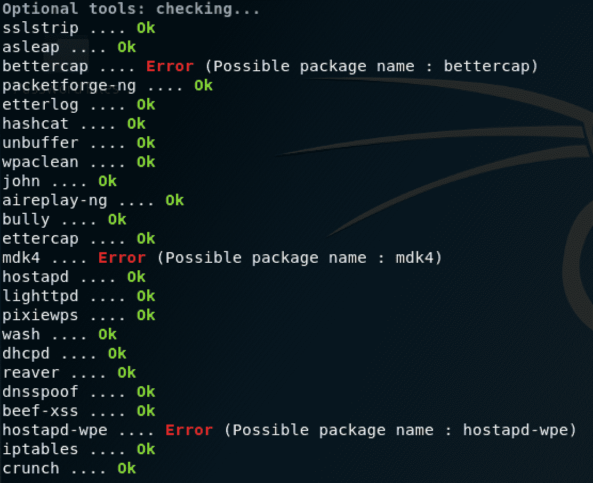

图 16:Airgeddon 可选工具检查

3.  在*图 16*中，缺少一些工具。注意包名。要安装缺少的工具，只需使用以下命令：

```
apt get install bettercap mdk4 hostapd-wpe
```

4.  初始检查完成后，Airgeddon 会提示您输入要使用的网卡，如*图 17*所示：


图 17：界面选择

5.  一旦您选择了自己的界面，就会出现 Airgeddon 的主菜单，如*图 18*所示：


图 18:Airgeddon 主菜单

主菜单提供了许多选项。在第一部分中，我们能够将所选接口置于监视或管理模式。下一节将定义 Airgeddon 能够执行的各种攻击。最后，最后一部分是期权和信用。

# 邪恶双生攻击

现在，我们将使用 Airgeddon 执行一个邪恶的孪生攻击。邪恶孪生攻击是一种恶意访问点，用于获取敏感信息、获取凭据或丢弃恶意有效负载。在我们的示例中，我们将创建一个邪恶的孪生兄弟，该孪生兄弟被设置为使用捕获门户窃取无线网络的预共享密钥：

您应该只对您授权的网络执行此攻击。出于学习目的，您应该对自己的无线网络执行此攻击。

1.  使用以下命令启动 Airgeddon：

```
sudo bash airgeddon.sh
```

2.  选择您的无线适配器，并使用 Airgeddon 的主菜单将其置于监视模式。接下来，选择`7`选项，邪恶双生攻击菜单（*图 19*。加载菜单后，选择选项`9`：


图 19：邪恶双生攻击菜单

3.  Airgeddon 将执行的第一步是探索无线网络。将自动设置 WPA/WPA2 的过滤器，并在新窗口中开始扫描，如*图 20*所示：


图 20:Airgeddon 探索目标

4.  将此窗口保持打开状态一段时间，以便获得无线网络的准确读数。关闭窗口后，Airgeddon 将提示您选择要攻击的网络（*图 21*）。注意，`*`表示该网络为活动网络：

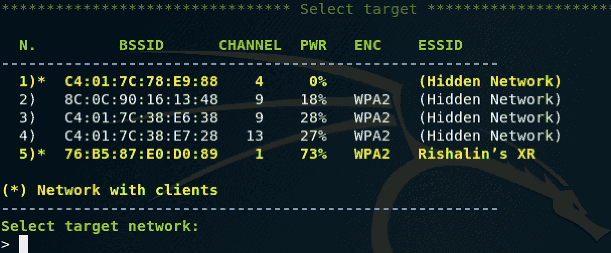

图 21:Airgeddon 网络选择

5.  选择要攻击的网络后，系统将显示 deauth 攻击菜单，如*图 22*所示：


图 22：Deauth 攻击菜单

这里有几个选项可供选择；您需要为正在攻击的网络找到最佳匹配。一般来说，`mdk4`攻击非常有效。

6.  选择 deauth 模式后，Airgeddon 将提示您进行一些其他设置，例如 DOS 追踪模式和在界面上启用 internet 访问。为了简单起见，我们将为这些选择`NO`。下一批选项涉及欺骗您的 mac 地址，并定义捕获文件（如果您已经拥有此文件）。如果您为捕获文件选择`NO`，您可以定义等待 WPA 建议的秒数。根据网络的活动程度，需要增加此值。如果不这样做，并且使用默认值，则可能无法获得 WPA 握手。

7.  完成选项后，将打开两个新窗口。捕获 WPA 握手后，Airgeddon 将通知您进入下一步，即定义捕获门户的语言。定义语言后，Airgeddon 将启动多个窗口（*图 23*）执行邪恶孪生攻击：


图 23:Airgeddon 邪恶双生攻击

生成的窗口与 DNS（用于拦截 DNS 请求）、DHCP（用于为站点提供有效的网络地址以便与假接入点通信）、假接入点（假接入点配置）、web 服务器（用于托管捕获门户）以及最后的信息窗口有关。所有这些都是托管一个伪捕获门户所必需的

现在，当站点连接到接入点时，它将显示一个捕获入口。一旦输入了预共享密钥，它将以明文显示（*图 24*）。可根据需要调整捕获门户：


图 24：捕获的预共享密钥

Airgeddon 使用起来非常简单。它拥有大量能够执行的攻击。随着您的进步，您可能会发现更多的工具，但知道如何使用`aircrack-ng`中的工具仍然是有益的，因为您可能已经注意到 Airgeddon 中的一些攻击仍然利用`aircrack-ng`套件的部分。

# 开裂 WEP、WPA 和 WPA2

Aircrack ng 是一个允许您破解 WEP、WPA 和 WPA2 预共享密钥的程序。它支持多种密码破解方法；这些方法如下：

*   **Pyshkin、Tews、Weinmann**（**PTW**），使用 ARP 包破解 WEP 密钥。
*   FMS/KoreK 使用统计攻击和蛮力技术破解 WEP 密钥。
*   dictionary 方法利用 dictionary 文件，该文件可用于强制执行 WEP、WPA/WPA2 密钥。注意，对于 WPA/WPA2 开裂，这是唯一使用的方法。

`aircrack-ng`的命令语法如下：

```
aircrack-ng [options] <capture file(s)>
```

`aircrack-ng`有很多选项可供使用。可以通过运行`aircrack-ng`命令查看这些内容，而无需定义任何其他内容。

# 开裂 WPA/WPA2

让我们看一个使用 HORT T0 来破解 WPA2 的例子。需要注意的是，破解 WPA2 的唯一可能方法是使用暴力技术的字典文件。对于所有暴力尝试，成功与否取决于您的单词列表的质量。请记住，较大的单词列表将需要更多的时间和处理能力。

在*图 25*中，您会注意到捕捉到 WPA 握手：


图 25:WPA 握手捕获

使用`aircrack-ng`破解此握手通过以下命令完成：

```
aircrack-ng -w [wordlist] [capture file]
```

`-w`开关表示将使用的单词列表的位置。您可以按名称定义捕获文件，如果有多个捕获文件，也可以使用`*.cap`。使用命令观察结果，如*图 26*所示：

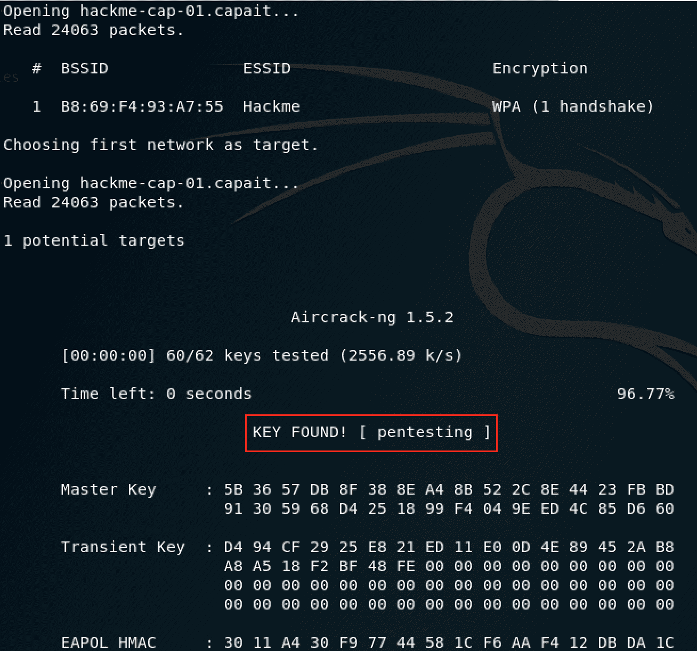

Figure 26: WPA key cracked using aircrack-ng

破解 WPA2 握手的过程与 WPA 的过程完全相同。

除了预共享密钥外，WPA/WPA2 还支持多种身份验证方法。Aircrack ng 只能破解使用预共享密钥的 WPA 网络。如果`airodump-ng`显示网络上有 PSK 以外的东西，不要费心破解它，因为这会浪费你的时间。

# 开裂 WEP

有多种方法可以破解 WEP 密钥。在上一节中，我们讨论了诸如假身份验证、caffe latte 攻击、PTW 攻击等攻击。

现在，我们将执行一些攻击来破解 WEP 密钥。此攻击要求至少有一个站点连接到接入点。

在我的设置中，我将主机用作连接的客户端。如果用于测试此攻击的路由器支持 WEP，请在执行以下步骤之前在路由器上设置 WEP：

1.  确保无线适配器处于监视模式。使用`airodump-ng`，我们将指定使用 WEP 的无线网络，并开始捕获数据包。在我的设置中，无线网络被称为`Hackme`*。*使用前面`airodump-ng`部分中定义的命令，我正在调整`airodump`以使用以下命令捕获专门用于无线网络的数据包：

```
airodump-ng -c 6 --bssid B8:69:F4:93:A7:55 -w hackme-cap [interface name]
```

破解 64 位 WEP 密钥需要大量的 IVs，至少大约 250000 个。让捕获处于空闲状态，需要一点时间才能获得足够数量的 IVs。为了加快进程，我们将捕获数据包并将其重放回接入点，以生成唯一的 IVs。在此之前，我们需要对接入点进行身份验证，否则我们发送的任何数据包都将被丢弃。

2.  为了对接入点进行身份验证，我们将执行一次假身份验证攻击（*图 27*。这种攻击通过说服接入点我们知道 WEP 密钥，但我们不发送密钥来工作。要执行此攻击，我们使用以下命令：

```
aireplay-ng -1 0 -e Hackme -a [MAC Address] -h [MAC Address] [interface name]
```

在这个命令中，我们使用`-1`定义攻击；`0`为重传时间，`-e`为 SSID，`-a`**为我们要认证的接入点 MAC 地址，`-h`为网卡 MAC 地址，`interface name`为无线`interface name`，处于监控模式：**

 **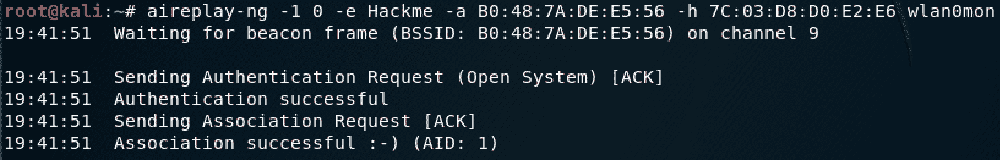

图 27：执行假身份验证攻击

请注意，身份验证成功；我们可以开始向接入点发送数据包。除非首先发送 WEP 密钥，否则接入点将不接受流量。因为我们没有发送密钥（因为我们还不知道它），所以我们需要从经过身份验证的客户端捕获数据包，并重播它们。为此，我们将使用 ARP 请求重放攻击。

3.  利用`aireplay-ng`，我们将告诉它捕获并重新广播接收到的任何 ARP 数据包。我们将使用的命令如下：

```
aireplay-ng -3 -b [MAC Address] -h [Mac Address] [interface name]
```

在这个命令（*图 28*中，我们使用`-3`定义攻击；`-b`用于定义接入点 MAC 地址，`-h`用于定义处于监控模式的无线适配器的 MAC 地址，`interface name`为处于监控模式的无线适配器的接口名称：


图 28：执行 ARP 请求重放攻击

注意这个警告。如果您定义了错误的 MAC 地址，`aireplay-ng`将提醒您。

随着通信量从经过身份验证的客户端传输到接入点，并捕获 ARP 请求，您将注意到 ARP 请求计数在增加。您可能会收到一条消息，说明您收到了一个`deauth/disassoc`数据包。如果发生这种情况，请确保再次运行伪身份验证攻击（*步骤 2*；*您可能需要多次这样做。*

 *收到足够的 IVs 后，如`#Data`栏下的*图 29*所示，您可以使用`aircrack-ng`破解钥匙：


图 29#数据列所示接收的大量 IVs

4.  要破解 WEP 密钥，请使用以下命令：

```
aircrack-ng -b [MAC Address] [capture]
```

在这个命令中，我们使用`-b`选项定义接入点 MAC 地址，然后定义捕获名称，也可以定义为`*.cap`。

如果您捕获了足够的 IVs，则钥匙将被破解，如图 30 所示*F**：*


图 30：WEP 键开裂

记住删除冒号`:`，以获取实际密钥。

开裂 WPA/WPA2 和 WEP 之间的区别在于方法。WEP 使用统计方法，可用于加速开裂过程，但在 WPA/WPA2 中，唯一存在的选择是蛮力。

# 总结

在本章中，您已经了解了各种无线攻击方法。我们已经确定了无线网络的一个关键组成部分，无线帧，以及可以从这些帧中获得的各种信息。您已经了解了哪些网卡能够执行数据包注入、拦截无线数据包，以及如何提高 Alfa 无线网卡的额定功率。

我们讨论了无线网络中存在的各种加密方法，以及它们的漏洞。您已经了解了各种攻击工具，以及如何执行不同类型的攻击。最后，您学习了如何破解 WEP 和 WPA/WPA2 预共享密钥。

在[第 10 章](10.html)、*横向移动和提升您的权限*中，我们将研究如何在网络中横向移动，目的是找到一个高权限帐户。您还将学习如何在网络中升级权限

# 问题

1.  命名三种类型的无线帧。
2.  从信标帧可以获得什么类型的信息？
3.  为什么 WPA2 比 WPA 更安全？
4.  说出四种类型的无线攻击。
5.  列举三种无线攻击工具。******