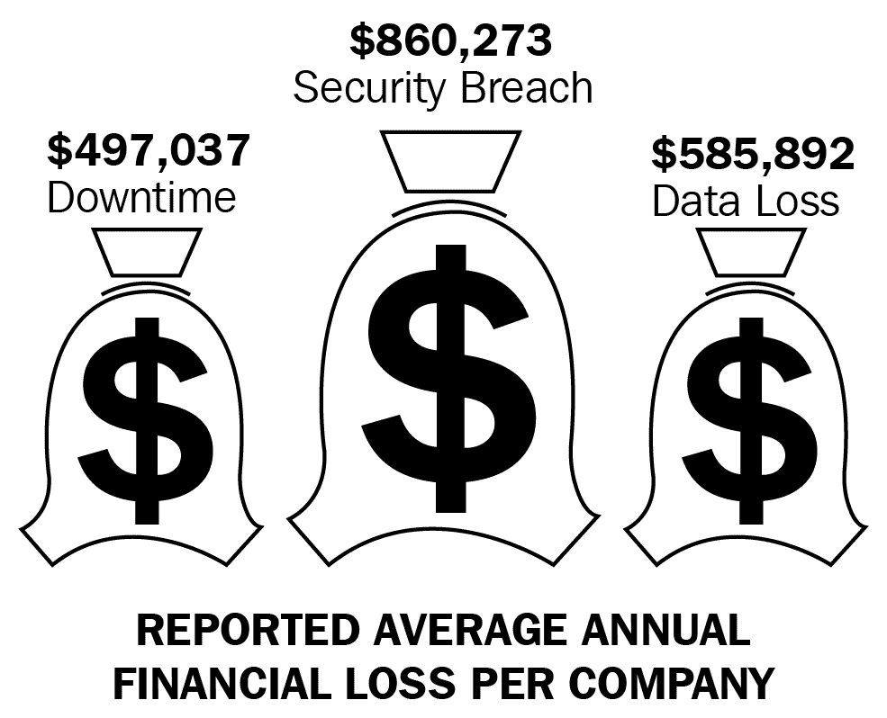
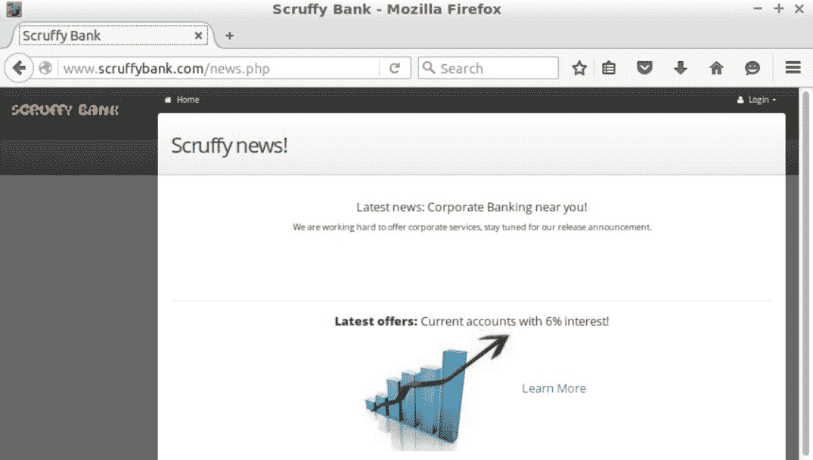

# Web 应用程序渗透测试简介

在本章中，我们将研究以下主题：

*   了解 web 应用程序渗透测试过程
*   典型 web 应用程序工具包
*   培训环境

让我们开始吧！

# 了解 web 应用程序渗透测试过程

在本节中，我们将了解什么是 web 应用程序渗透测试及其背后的过程。我们将从学习什么是 web 应用程序渗透测试开始，学习执行这些测试的重要性，学习什么是专业的方法，并简要解释为什么使用 Python 编写我们自己的工具很重要。

渗透测试是一种安全测试，它从攻击者的角度评估应用程序的安全性。这是一个攻击性的练习，你必须像攻击者一样思考，理解开发人员以及所涉及的技术，以便揭示所有缺陷。

目标是识别所有缺陷，并演示攻击者如何利用这些缺陷，以及对我们公司的影响。最后，报告将提供解决方案，以解决已检测到的问题。这是一个手动和动态测试。手册意味着它在很大程度上取决于测试人员的知识，这就是为什么学习如何编写自己的渗透测试工具很重要的原因，它将为您的职业生涯带来优势。动态测试是我们测试正在运行的应用程序的地方。它不是对源代码的静态分析。安全测试有助于验证和验证应用程序安全控制对我们的影响，并确定这些安全控制的松弛程度。

那么，我们为什么要进行渗透测试呢？如今，它已席卷全球。公司的大部分流程和数据都由计算机处理。这就是为什么公司需要投资于安全测试，以验证安全控制的有效性，而且很多时候还缺乏安全控制。

EMC 的一份报告（[https://www.scmagazine.com/study-it-leaders-count-the-cost-of-breaches-data-loss-and-downtime/article/542793/](https://www.scmagazine.com/study-it-leaders-count-the-cost-of-breaches-data-loss-and-downtime/article/542793/) 表示，每个公司关于年度财务损失的平均报告中，停机时间为 497037 美元，安全漏洞为 860273 美元，数据损失为 585892 美元。此外，公司资源始终投入到事件响应、修复、测试和部署问题中：

这就是为什么执行渗透测试将有助于公司保护其客户的数据、知识产权和服务。渗透测试是一种简单的方法，由以下四个主要部分组成：

*   **侦察**：在这一阶段，我们将收集信息，以确定使用的技术、支持应用程序的基础设施、软件配置、负载平衡等。这一阶段也称为指纹识别。

*   **映射**：然后我们进入映射阶段，在此阶段我们构建应用程序页面和功能的映射或图表。我们的目标是确定组件及其关系。支持映射的技术之一是爬行或爬行。此外，在此阶段，我们将通过执行暴力攻击来发现非链接资源。
*   **漏洞**：一旦我们确定了所有组件、参数、表单和功能，我们将进入第三阶段，开始漏洞发现。
*   **漏洞利用**：在识别所有漏洞后，我们可以进入最后一个阶段，即漏洞利用。根据 pen 测试的范围，一旦您利用该漏洞，您可以从新的有利位置重新启动该过程。通常，这是目标 DMZ，您将尝试进入其内部网段。

这里没有说明的一个步骤是报告阶段，在报告阶段，您记录所有的调查结果，以便将其呈现给您的客户、公司。

最后，有两种类型的渗透测试，即黑盒测试和白盒测试。黑盒测试发生在您没有关于目标的任何信息时，这与攻击者的情况基本相同，而白盒测试发生在客户向我们提供文档、源代码和配置以加速过程时，我们只关注感兴趣的领域。

您可能想知道，在此过程中，您应该测试哪些方面？以下是一些最重要的内容：

*   配置和部署管理测试
*   身份管理测试
*   认证测试
*   授权测试
*   会话管理测试
*   输入验证
*   测试错误处理
*   密码学
*   业务逻辑测试
*   客户端测试

我们将在本章中介绍其中的一些领域。

您可以通过阅读 OWASP 测试指南[扩展您在这些领域的知识 https://www.owasp.org/index.php/OWASP_Testing_Project](https://www.owasp.org/index.php/OWASP_Testing_Project) 。

那么，为什么要构建自己的工具呢？Web 应用程序非常不同，因为它们是使用多种技术、组合、流程和实现开发的。

这就是为什么没有一个工具可以涵盖你职业生涯中的所有场景。很多时候，我们会编写脚本来测试特定问题或执行特定任务，并利用漏洞进行攻击。在这本书的过程中，我们将看到如何编写工具和测试不同的领域，如身份验证、输入验证和发现，最后我们将编写一个简单的 To.T0 超文本传输协议 OLE T1（Ty2 T2）HTTP PosiT3）代理，这可能是我们自己的安全扫描器的基础。编写您自己的工具是一项宝贵的技能，它将使您领先于许多没有能力调整工具或编写自己的工具的渗透测试人员。在某些渗透测试项目中，这可能会产生很大的不同。

# 典型 web 应用程序工具包

在本节中，我们将了解安全专业人员用于执行 web 应用程序渗透测试的不同工具。

# HTTP 代理

测试 web 应用程序最重要的工具是 HTTP 代理。此工具允许您截获浏览器和服务器之间双向的所有通信。这些代理称为中间人代理。这些工具将让我们了解应用程序是如何工作的，最重要的是，它将允许我们拦截请求、响应并修改它们。

通常，代理将与用于测试应用程序的浏览器在同一台计算机上运行。安全专家使用最多的 HTTP 代理是 PortSwigger security（[的 Burp 套件 https://portswigger.net/burp/proxy.html](https://portswigger.net/burp/proxy.html) 和**Zed 攻击代理**（**ZAP**）（[https://www.owasp.org/index.php/OWASP_Zed_Attack_Proxy_Project](https://www.owasp.org/index.php/OWASP_Zed_Attack_Proxy_Project) 。我们还有 MITM 代理。它是用 Python 开发的较新的替代方案，适合构建工具或自动化某些场景。缺点是它是唯一的控制台，并且没有 GUI，这对于我们来说是一个好处。

# 爬虫和蜘蛛

爬虫和爬行器用于映射 web 应用程序，从而自动化对所有内容和功能进行编目的任务。该工具通过跟踪找到的所有链接、提交表单、分析新内容的响应并重复此过程，自动对应用程序进行爬网，直到覆盖整个应用程序。

有独立的爬虫和蜘蛛，如 Scrapy（[http://scrapy.org](http://scrapy.org) ），它们是用 Python 或命令行工具编写的，如 HT track（[http://www.httrack.com](http://www.httrack.com) ）。我们将爬虫和爬行器与代理（如 Burp 和 ZAP）集成，这些代理将从通过代理的内容中获益，从而丰富应用程序的知识。

当应用程序大量使用 JavaScript 时，这一点很有价值。传统的爬虫程序不会解释 JS，但浏览器会。因此，代理将看到它并将其添加到爬虫目录中。稍后我们将更详细地了解 Scrapy。

# 漏洞扫描程序

现在，让我们进入更复杂的工具：漏洞扫描器。

这些工具被认为更复杂，因为它们必须在一个工具中自动化大多数安全测试方法。他们将进行爬网、发现、漏洞检测和一些攻击。最常用的两个开源 web 应用程序安全扫描程序是 w3af（[http://w3af.org/](http://w3af.org/) ），它是用 Python 编写的，还有 Arachni（[http://www.arachni-scanner.com/](http://www.arachni-scanner.com/) ），用 Ruby 编写。

有多种商业替代品，如 Acunetix（[http://www.acunetix.com/](http://www.acunetix.com/) ），这是最便宜的产品之一，性价比很高。

# 蛮力/可预测资源定位器

Web 暴力部队或发现工具用于通过字典攻击查找文件、目录、servlet 或参数等内容。这些工具使用过去 10 年中由安全专业人员整理的单词列表，其中包含已知的文件名目录或仅在不同产品或 web 应用程序中找到的单词。

这类工具的前身是 DIRB（[http://dirb.sourceforge.net/](http://dirb.sourceforge.net/) ），仍然可用，并由 Dark Raver 维护。另一个很好的选择是 Wfuzz（[http://www.edge-security.com/wfuzz.php](http://www.edge-security.com/wfuzz.php) ），我过去开发的，现在由 Xavier Mendez 维护和开发。您可以在最常用的渗透测试发行版 Kali 中找到此工具。

Burp 和 ZAP 等工具提供了这些功能。所有这些工具都得益于 FUZZDB（[提供的单词列表 https://github.com/fuzzdb-project](https://github.com/fuzzdb-project) ），一个用于 web 应用程序测试的词表数据库。我们将看到如何为此目的构建一个类似于 Wfuzz 的工具。

# 特定任务工具

我们有大量的工具，它们专注于特定的任务，如编码器和哈希器、Base64、MD5、SHA1 和 Unicode。

为利用特定类型的漏洞而创建的工具，例如，SQL 注入器（如 SQL map）、XSS 控制台（如 Beef）以演示 XSS 和 DOM XSS 的影响、扫描仪（如 Dominator）等。此外，工具包中的一种重要工具是开发后工具。

一旦您设法利用漏洞并帮助您控制服务器、将文件、外壳、代理内容上载到内部网络以及在内部扩展攻击，就需要这些工具。在测试新的应用程序和技术时，有许多其他工具可以克服我们发现的无限挑战。

# 测试环境

在本节中，我们将了解我们的测试实验室环境。我们将首先安装 VirtualBox 软件来运行我们的实验室虚拟机。我们将访问易受攻击的 web 应用程序，熟悉文本编辑器，最后，我将给您一个重要的警告。

我们需要的第一个工具是 VirtualBox。这将允许您运行为此培训创建的实验室环境虚拟机。您可以从[下载 VirtualBoxhttps://www.virtualbox.org/wiki/Downloads](https://www.virtualbox.org/wiki/Downloads) 。选择您的主机操作系统并下载安装程序。下载 VirtualBox 后，我们可以从[下载为本课程创建的虚拟机 https://drive.google.com/open?id=0ByatLxAqtgoqckVEeGZ4TE1faVE.](https://drive.google.com/open?id=0ByatLxAqtgoqckVEeGZ4TE1faVE)

下载文件后，我们可以继续安装 VirtualBox。

安装 VirtualBox，在我的例子中，我必须通过双击`.dmg`文件来完成。按照安装说明进行操作。完成后，解压缩实验室虚拟机。在我的例子中，我在 OSX 中使用了一个存档。你可以在其他平台中使用 7ZIP。

解压缩后，我们将启动 VirtualBox。

打开虚拟机。一旦虚拟机加载到 VirtualBox 中，我们将启动机器并等待它启动，直到收到登录提示。我们将使用用户`Packt`和密码`secret`登录。

root 用户密码为`packt2016`。

现在，我们的实验室准备好行动了。在本书中，我们创建了一个易受攻击的 web 应用程序，它允许我们使用自己开发的工具测试不同类型的漏洞。该应用程序模拟一个非常简单的银行应用程序。

它是用 PHP 和 MySQL 开发的，由 Apache 提供服务。现在，我们将在虚拟机中打开浏览器。加载 URL`www.scruffybank.com`。我创建了一个`/ETC/hosts`条目，将主机名重定向到本地主机。此应用程序正在 VM 中的 Apache 服务器上运行。

您应该看到索引页面。如果单击“了解更多”，您将看到以下信息：

在右上方，您可以访问登录页面。

实验室中的最后一个工具是文本编辑器，我们将在其中编写脚本。一个可能的选择是 Atom，一个由 GitHub 开发的多平台开源免费编辑器。请随意安装或使用您喜欢的编辑器。

要启动 Atom，请转到名为 Atom 的桌面项，编辑器将以一个空白文件启动。您可以开始键入代码，但在保存文件并添加扩展名之前，它不会进行语法高亮显示。

我将在我的主目录中打开一个名为`Video-3.py`的示例。这是 Atom 中 Python 脚本的外观：

我想强调的是，未经目标公司许可，许多渗透测试活动（如果不是全部的话）是不允许执行的。
在许多国家，这些活动都是非法的，同样没有适当的许可。无论何时，只要您想尝试新的工具或技术，就要始终使用测试环境。同样，无论何时为客户执行渗透测试，都要获得书面授权。

# 总结

在本章中，我们了解了什么是 web 应用程序渗透测试，执行测试的重要性，执行渗透测试时要遵循的方法，需要涵盖的不同领域，以及了解如何使用 Python 编写自己的工具的重要性。

我们还看到了制作 web 应用程序笔测试工具包的工具。这有助于我们理解这些工具如何与方法相一致，并且在我们需要创建自己的工具、从中学习以及了解它们如何工作时，也将起到启发作用。

我们还看到了贯穿本书的实验室环境。

我们已经安装了 VirtualBox，运行了实验室虚拟机，并访问了测试 web 应用程序 scruffy bank。我们看到了文本编辑器的一个快速示例，最后，我们看到了一个关于未经客户许可进行渗透测试的后果的重要警告。

在[第 2 章](2.html#RL0A0-5a228e2885234f4ba832bb786a6d0c80)*与 Web 应用程序交互*中，我们将学习如何使用 Python 与 Web 应用程序交互，了解 HTTP 请求、URL、头、消息体的剖析，并创建一个脚本来执行请求并解释响应及其头。