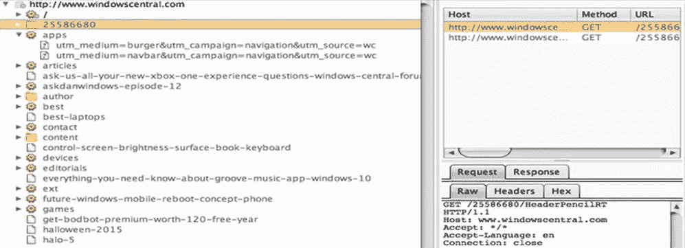
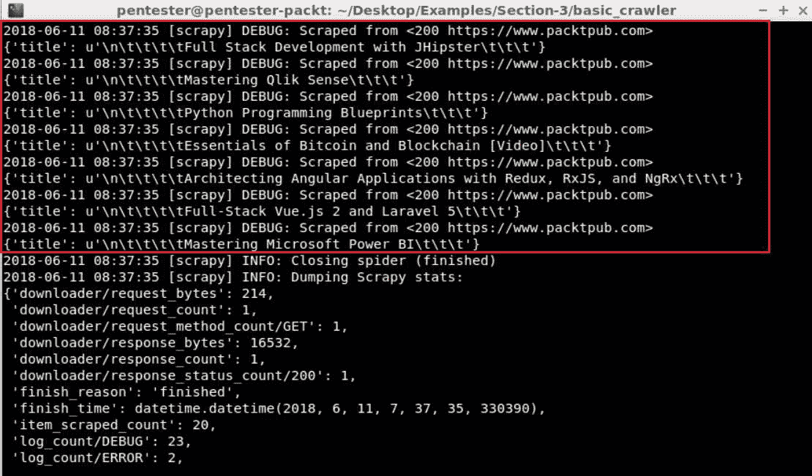
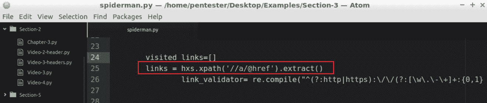
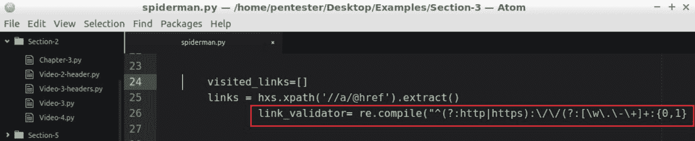
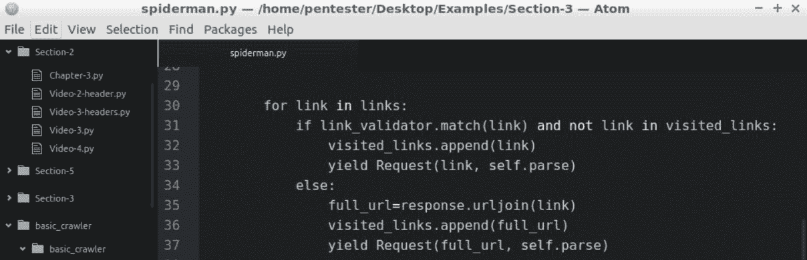
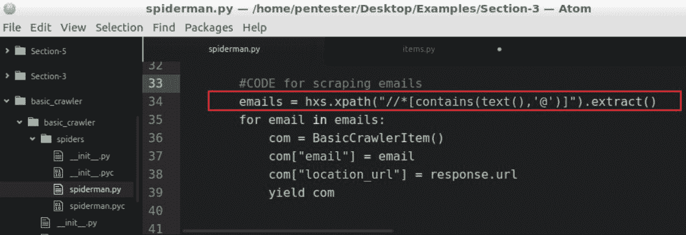
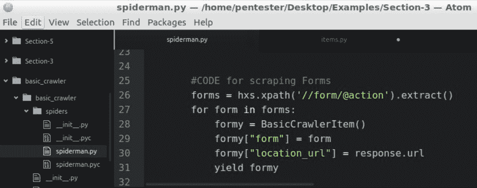
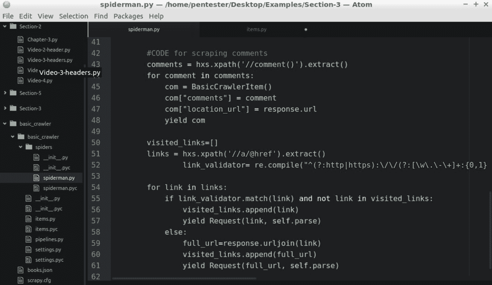
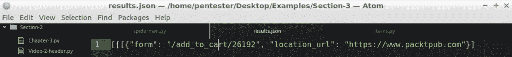

# 三、将 Scrapy 用于 Web 爬取——映射应用

在[第 2 章](2.html#RL0A0-5a228e2885234f4ba832bb786a6d0c80)*与 Web 应用交互*中，我们学习了如何使用 Python 和请求库以编程方式与 Web 应用交互。在本章中，我们将介绍以下主题：

*   Web 应用映射
*   用 Scrapy 创建我们自己的爬虫/蜘蛛
*   使爬虫递归
*   刮有趣的东西

# Web 应用映射

还记得在[第一章](1.html#I3QM0-5a228e2885234f4ba832bb786a6d0c80)*Web 应用渗透测试简介*中，我们了解了渗透测试过程。在这个过程中，第二个阶段是映射。

在映射阶段，我们需要构建应用资源和功能的映射或目录。作为一名安全测试人员，我们的目标是识别应用中的所有组件和入口点。我们感兴趣的主要组件是以参数作为输入的资源、表单和目录。

映射主要由爬虫执行。爬取器也称为爬取器，通常执行抓取任务，这意味着它们还将从应用中提取感兴趣的数据，如电子邮件、表单、注释、隐藏字段等。

为了执行应用映射，我们有以下选项：

*   第一种技术是爬取。其思想是请求第一个页面，传递所有内容，提取范围内的所有链接，并对已发现的链接重复此操作，直到覆盖整个应用。然后，我们可以使用 HTTP 代理来识别爬虫可能丢失的所有资源和链接。基本上，大多数使用 JavaScript 在浏览器中动态生成的 URL 都会被爬虫丢失，因为爬虫不会解释 JS。
*   另一种技术是使用字典攻击来发现应用中没有链接到任何地方的资源。在下一节中，我们将构建自己的 BruteForce。

这里，我们举了一个示例，说明 Burp 代理如何使用代理和爬取器功能创建应用映射：



我们可以看到目录、静态页面和接受参数的页面，它们具有不同的参数和值。

所有有趣的部分都将用于使用不同的技术处理漏洞，如 SQL 注入、跨站点脚本、XML 注入和 LDAP 注入。基本上，映射的目的是覆盖所有应用，以便为漏洞识别阶段识别感兴趣的资源。

在下一节中，我们将开始开发自己的爬虫程序。让我们准备好！

# 用 Scrapy 创建我们自己的爬虫/蜘蛛

在本节中，我们将创建第一个 Scrapy 项目。我们将定义目标，创建 spider，最后运行它并查看结果。

# 从刮痧开始

首先，我们需要定义我们想要实现的目标。在本例中，我们希望创建一个爬虫程序，该爬虫程序将从[中提取所有图书标题 https://www.packtpub.com/](https://www.packtpub.com/) 。为了做到这一点，我们需要分析我们的目标。如果我们去[https://www.packtpub.com/](https://www.packtpub.com/) 网站，右击书名并选择 Inspect，我们将看到该元素的源代码。在这种情况下，我们可以看到书名的格式如下：


创建用于提取所有图书标题的爬虫程序

在这里，我们可以看到`div`的`class`为`book-block-title`，然后是标题名。记住这一点，或者记在笔记本上，那样会更好。我们需要它来定义在爬网过程中要提取的内容。现在，让我们开始编码：

1.  让我们回到虚拟机，打开一个终端。为了创建爬虫，我们将切换到`/Examples/Section-3`目录：

```py
cd Desktop/Examples/Section-3/
```

2.  然后，我们需要使用以下 Scrapy 命令创建项目：

```py
scrapy startproject basic_crawler 
```

在我们的例子中，爬虫的名称是`basic_crawler`。

3.  当我们创建一个项目时，Scrapy 会自动生成一个具有爬虫基本结构的文件夹。
4.  在`basic_crawler`目录中，您将看到另一个名为`basic_crawler`的文件夹。我们有兴趣使用`items.py`文件和`spiders`文件夹的内容：


这是我们将处理的两个文件。

5.  所以，我们打开 Atom 编辑器，用 AddProject 文件夹添加我们的项目。。。在示例|第 3 节|基本履带下。

6.  现在，我们需要在 Atom 编辑器中打开`items.py`：


当使用 Scrapy 时，我们需要指定在抓取网站时我们感兴趣的内容。这些东西在 Scrapy 中称为 items，并将它们视为我们的数据模块。

7.  那么，让我们编辑`items.py`文件并定义我们的第一项。我们可以在前面的屏幕截图中看到，`BasicCrawlerItem`类是创建的。
8.  我们将创建一个名为`title`的变量，该变量将是类`Field`的对象：

```py
title = scrappy.Field()
```

9.  我们可以删除`title = scrappy.Field()`之后代码的剩余部分，因为它没有被使用。

这就是这个文件的全部内容。

10.  让我们来看看我们的蜘蛛。对于 spider，我们将处理`spiderman.py`文件，该文件是为本练习创建的，以节省时间。
11.  我们首先需要将其从`Examples/Section-3/examples/spiders/spiderman-base.py`复制到`/Examples/Section-3/basic_crawler/basic_crawler/spiders/spiderman.py`：

```py
cp examples/spiders/spiderman-base.py basic_crawler/basic_crawler/spiders/spiderman.py
```

12.  然后，在编辑器中打开该文件，我们可以在该文件的顶部看到工作所需的导入。我们有`BaseSpider`，这是基本的爬取类。然后，我们有`Selector`，它将帮助我们使用交叉路径提取数据。`BasicCrawlerItem`是我们在`items.py`文件中创建的模型。最后，找到一个将对网站执行请求的`Request`：


然后我们有`class MySpider`，它有以下字段：

*   `name`：这是我们蜘蛛的名字，以后需要调用它。在我们的例子中，它是`basic_crawler`。

*   `allowed_domains`：这是允许爬网的域列表。基本上，这样做是为了让爬虫保持在项目的范围内；在本例中，我们使用的是`packtpub.com`。
*   `start_urls`：这是一个列表，其中包含爬虫将在其中启动进程的起始 URL。在这种情况下，它是`https://www.packtpub.com`。
*   `parse`：顾名思义，这里是解析结果的地方。我们实例化`Selector`，用请求的`response`对其进行解析。

然后，我们定义包含执行以下交叉路径查询结果的`book_titles`变量。交叉路径查询是基于我们在本章开头进行的分析。这将生成一个数组，其中包含使用从响应内容中定义的交叉路径提取的所有书籍标题。现在，我们需要循环该数组并创建`BasicCrawlerItem`类型的图书，并将提取的图书标题指定给图书的标题。

这就是我们的基本爬虫。让我们转到终端，将目录更改为`basic_crawler`，然后使用`scrapy crawl basic_crawler`运行爬虫程序。

所有结果都打印在控制台中，我们可以看到正确地刮取书名：



现在，我们将文件夹的输出保存到一个文件中，添加`-o books.json -t`，然后添加文件类型`json`：

```py
scrapy crawl basic_crawler -o books.json -t json
```

现在，运行它。我们将使用`vi books.json`打开`books.json`文件。

我们可以看到，正在按预期提取的书名：


标题中有一些额外的制表符和空格，但我们知道了书的名称。这将是创建爬虫程序所需的最小结构，但您可能想知道我们只是在刮取索引页。我们如何让它递归地抓取整个网站？这是一个很好的问题，我们将在下一节中回答这个问题。

# 使爬虫递归

在本节中，我们将开始学习如何提取链接，然后使用它们使爬虫递归。现在我们已经创建了爬虫程序的基本结构，让我们添加一些功能：

1.  首先，让我们复制为本练习准备的`spiderman.py`文件。从`examples/spiders/spiderman-recursive.py`复制到`basic_crawler/basic_crawler/spiders/spiderman.py`。

2.  然后，回到我们的编辑那里。由于我们希望使爬虫递归，为此，我们将再次处理`spiderman.py`文件，并从添加另一个提取器开始。但是，这次我们将添加链接而不是标题，如以下屏幕截图所示：



3.  此外，我们需要确保链接有效且完整，因此我们将创建一个正则表达式，用于验证以下屏幕截图中突出显示的链接：



4.  此正则表达式应验证所有 HTTP 和 HTTPS 绝对链接。现在我们有了提取链接的代码，我们需要一个数组来控制访问的链接，因为我们不想重复链接和浪费资源。

5.  最后，我们需要创建一个循环来迭代找到的链接，如果该链接是一个绝对 URL 并且以前从未访问过，我们`yield`将使用该 URL 发出请求以继续该过程：



如果链接未通过验证，则表示它是一个相对 URL。因此，我们将把这个相对 URL 和基本 URL 连接起来，这个链接是通过创建一个有效的绝对 URL 获得的。然后，我们将使用`yield`请求。

6.  保存它，然后转到控制台。
7.  然后，我们将目录更改为`basic_crawler`，用`scrapy crawl basic_crawler -t json -o test.json`运行，然后按*进入*。

我们可以看到它现在正在工作。我们正在递归地抓取和抓取网站中的所有页面：


这可能需要很长时间，所以我们通过按*Ctrl*+*C*来取消，我们将获得到目前为止包含结果的文件。

让我们用`vi test.json`命令打开`test.json`文件。

正如我们在下面的屏幕截图中所看到的，我们有很多多页的书名：


祝贺我们已经构建了一个 web 应用爬虫。

考虑一下现在可以自动执行的所有任务。

# 刮有趣的东西

在本节中，我们将了解如何提取对安全分析有用的其他有趣信息，如电子邮件、表单和评论。

我们已经向爬虫程序添加了递归功能，所以现在我们准备添加更多功能。在本例中，我们将为电子邮件添加一些提取功能，因为拥有一个有效的帐户总是很有用的，这在我们的测试中很方便。当信息从浏览器提交到应用时，表单将非常有用。注释可以提供有趣的信息，开发人员可能在生产中没有意识到这些信息。

您可以从 web 应用中获得更多信息，但这些通常是最有用的：

1.  首先，让我们将这些字段添加到项目中。在 Atom 中打开`items.py`文件并添加以下代码：

```py
    link_url = scrapy.Field()
    comment = scrapy.Field()
    location_url = scrapy.Field()
    form = scrapy.Field()
    email = scrapy.Field()
```

这将用于指示在何处找到信息。

2.  那么，让我们回到`spiderman.py`文件。让我们复制一份准备好的`spicderman.py`文件。我们将把`examples/spiders/spiderman-c.py`复制到`basic_crawler/basic_crawler/spiders/spiderman.py`：

```py
cp examples/spiders/spiderman-c.py basic_crawler/basic_crawler/spiders/spiderman.py
```

3.  让我们回到编辑那里。
4.  为了提取电子邮件，我们需要将突出显示的代码添加到我们的`spiderman.py`文件中：



这个选择器可能会产生一些误报，因为它将提取任何包含`@`符号的单词，以及循环，以将选择器检测到的结果存储到我们的项目中。

就这样，通过代码，我们现在将提取爬取时找到的所有电子邮件地址。

现在，我们需要做同样的事情来提取`forms`动作。交叉路径将获得表单的 action 属性，该属性指向将处理用户提交的数据的页面。然后，我们迭代这些发现并将其添加到`items.py`文件中：



这就是表格。

现在，让我们对代码`comments`执行同样的操作。我们将创建提取器，然后再次迭代结果并将其添加到项目中。现在，我们可以运行爬虫程序并查看结果：



我们回到终点站，在`basic_crawler`中输入`scrapy crawl basic_crawler -o results.json -t json`并点击*进入*。

完成爬取需要很长时间。我们会在一段时间后按*CTRL*+*C*来停止它。

完成后，我们可以用 Atom 编辑器打开`results.json`，查看结果：



祝贺您已经扩展了爬虫程序以提取有关网站的有趣信息。

您可以看到结果、表单、注释等。我建议您看看如何处理结果的其他方法，比如将它们传递或存储到 SQLite 或 MongoDB 中。

祝贺您已经使用 Python 创建了第一个 web 爬虫程序。

# 总结

在本章中，我们了解了什么是 web 应用映射。我们学习了如何创建一个基本的 web 应用爬虫。在本章中，我们添加了递归功能，还学习了如何使爬虫递归。

最后，我们学习了如何使用 Python 和 Scrapy 库开发 web 应用爬虫。这将有助于映射 web 应用结构，并从页面的源代码中获取有趣的信息，如表单、电子邮件和注释。

现在，我们知道如何使用爬虫映射 web 应用，但大多数应用都有隐藏的资源。并非所有用户都可以访问这些资源，或者并非所有用户都可以链接这些资源。幸运的是，我们可以使用蛮力技术来发现目录、文件或参数，以便找到我们可以在测试中使用的漏洞或有趣的信息。

在[第 4 章](4.html#1ENBI0-5a228e2885234f4ba832bb786a6d0c80)*资源发现*中，我们将编写一个工具，在 web 应用的不同部分执行暴力攻击。