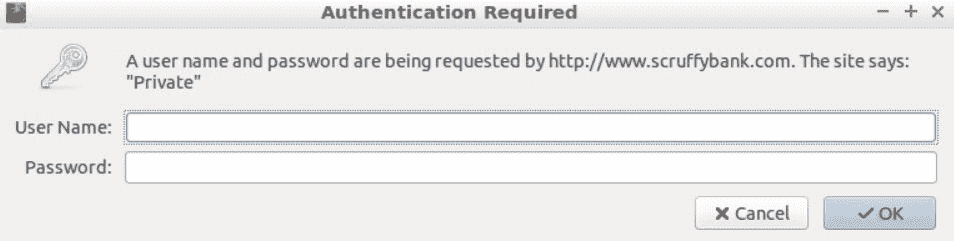
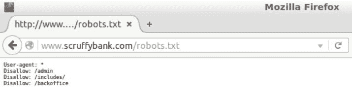
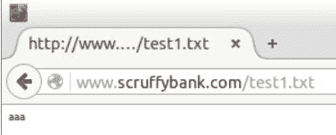
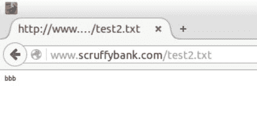
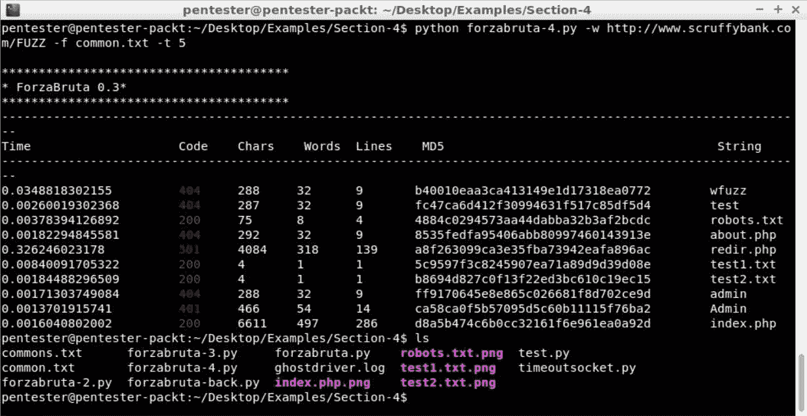
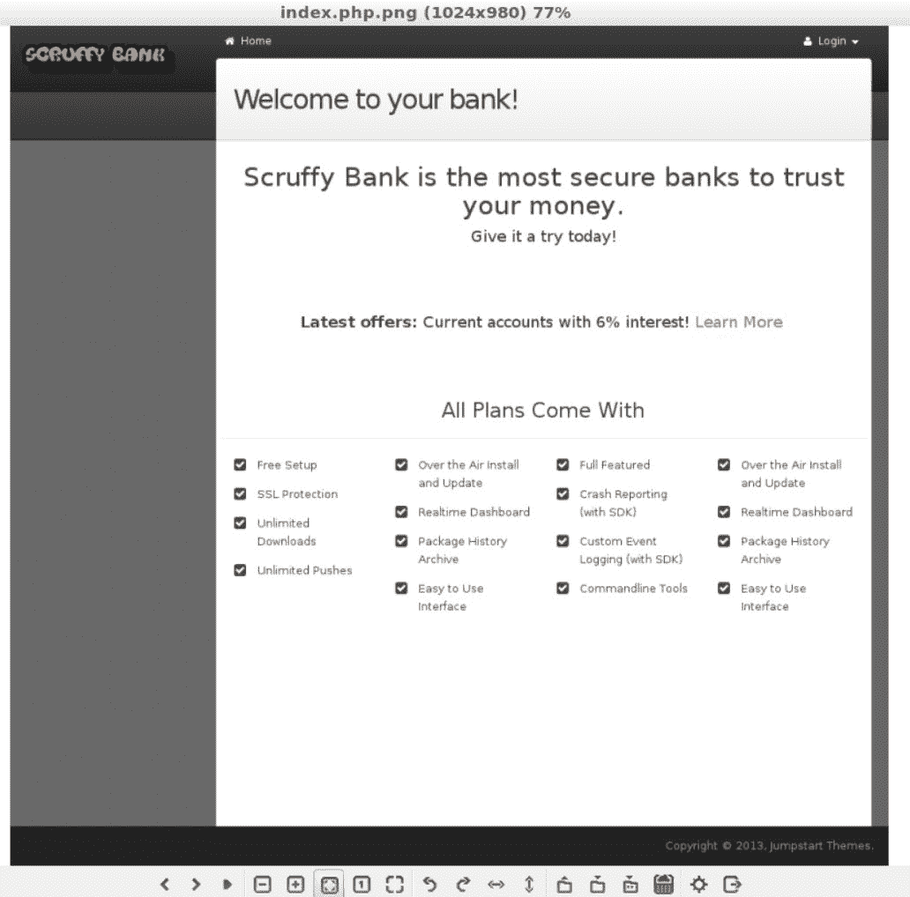

# 资源发现

在[第 3 章](3.html#181NK0-5a228e2885234f4ba832bb786a6d0c80)*使用 Scrapy 进行 Web 爬行–映射应用程序*中，我们了解了如何使用 Python 和 Scrapy 库编写我们自己的爬虫程序。在本章中，我们将学习：

*   什么是资源发现？
*   建立我们的第一个暴力力量
*   分析结果
*   添加更多信息
*   拍摄调查结果的截图

# 什么是资源发现？

在本节中，我们将学习什么是资源发现，以及为什么在测试 web 应用程序时资源发现很重要。此外，我们还将介绍 FUZZDB，它将在下一节中用作我们的字典数据库。

您会记得，在[第一章](1.html#I3QM0-5a228e2885234f4ba832bb786a6d0c80)、*Web 应用程序渗透测试简介*中，我们了解了渗透测试过程。该过程的第二个阶段是映射。在映射阶段，我们需要构建应用程序页面和功能的映射或目录。在前面的部分中，我们学习了如何使用爬虫执行应用程序映射。我们还了解到爬虫有一些局限性。例如，爬虫不会识别 JS 生成的链接。这可以通过使用 HTTP 代理或使用无头浏览器（如 PhantomJS）来克服。如果我们这样做，我们应该能够识别 web 应用程序中链接的所有资源，但我的个人经验告诉我，我们可以找到许多未链接的资源。

为了发现这些，我们需要通过已知单词的词典执行资源发现。这类工具称为：

*   **字典攻击**：这里，我们使用已知单词列表来识别资源
*   **暴力强制**：当使用字符串的排列或组合列表时，使用暴力来识别资源
*   **模糊化**：这并不正确，但通常用于资源发现

使用这些技术我们能找到什么？

*   **文件**：如备份文件、测试文件、笔记、脚本、文档、示例等
*   **目录**：如管理界面、备份、内部区域、上传目录等
*   **动作**：只要选项或参数中有动词名称，我们就可以使用类似单词的字典来识别其他功能
*   **servlet**：类似于动作，但有一个文件
*   **参数**：我们可以枚举参数中使用的潜在有效字符串的范围或组合

为了在执行资源恢复时取得成功，您需要有高质量的列表。有许多字典数据库，您可以在其中找到适合不同环境或场景的各种单词列表。FUZZDB（[https://github.com/fuzzdb-project/fuzzdb](https://github.com/fuzzdb-project/fuzzdb) 是互联网上最流行、最完整的数据库之一。我们将在下一节中使用它。

对于资源发现，我们将重点关注可预测的资源位置字典。我建议您在我们的虚拟机中，在本节的代码示例下查看它，并熟悉可用的不同词典或字符串列表。

# 建立我们的第一个暴力力量

在本节中，我们将构建一个脚本，它将帮助我们使用字典发现资源。我们将创建一个基本的暴力力量。我们将从定义该工具的目标开始，然后检查 BruteForcer 基本结构的代码。

最后，我们将使用以下步骤对测试 web 应用程序运行它：

1.  返回我们的编辑器，通过选择文件|添加项目文件夹…|打开第 4 节的项目文件夹桌面|示例|第 4 节| OK。
2.  然后，打开`forzabruta.py`的文件。
3.  在这个脚本中，我们有了 BruteForce 的基本结构。我们有典型的`import`，然后我们有`banner`函数，它将打印脚本的名称。打开`usage`函数，提供有关如何使用脚本的帮助。
4.  现在，让我们跳到`start`函数，当我们运行程序时会调用该函数：

```py
def start(argv):
    banner()
    if len(sys.argv) < 5:
           usage()
           sys.exit()
    try :
        opts, args = getopt.getopt(argv,"w:f:t:")
    except getopt.GetoptError:
               print "Error en arguments"
               sys.exit()

    for opt,arg in opts :
           if opt == '-w' :
                   url=arg
           elif opt == '-f':
                   dict= arg
           elif opt == '-t':
                   threads=arg
    try:
           f = open(dict, "r")
           words = f.readlines()
    except:
           print"Failed opening file: "+ dict+"\n"
           sys.exit()
    launcher_thread(words,threads,url)
```

打印`banner`，然后检查用于调用我们程序的参数。然后，传递参数并分配 URL 字典和线程数。打开字典，读所有的行，最后用`words`、`threads`和`url`来调用`launcher_thread`。

由于我们希望应用程序同时执行多个任务，因此可以使用线程。否则，我们的 BruteForce 将是连续的，而对于大型词典，它将是缓慢的。通过使用线程，我们可以加速这种攻击。只要我们想在其他工具中实现线程，我们就可以重用这个脚本的框架，因为线程通常很难实现。

5.  `launcher_thread`函数将基本上管理线程，并使用字典中的一个单词和目标 URL 实例化每个线程的类请求执行者，然后启动线程。这将针对字典中加载的每个单词执行：

```py
def launcher_thread(names,th,url):
    global i
    i=[]
    resultlist=[]
    i.append(0)
    while len(names):
        try:
            if i[0]<th:
                n = names.pop(0)
                i[0]=i[0]+1
                thread=request_performer(n,url)
                thread.start()

        except KeyboardInterrupt:
            print "ForzaBruta interrupted by user. Finishing attack.."
            sys.exit()
        thread.join()
    return

if __name__ == "__main__":
    try:
        start(sys.argv[1:])
    except KeyboardInterrupt:
        print "ForzaBruta interrupted by user, killing all threads..!!"
```

6.  线程实例化类`request_performer`。这个类有`init`方法，用来在对象创建后设置对象，基本上就是构造函数。在本例中，我们基本上创建了属性`self.word`和`self.urly`，这将用字典单词替换`FUZZ`标记。

然后，我们有方法`run`，它将执行请求并打印请求的 URL 和状态代码：

```py
class request_performer(Thread):
    def __init__( self,word,url):
        Thread.__init__(self)
        try:
            self.word = word.split("\n")[0]
            self.urly = url.replace('FUZZ',self.word)
            self.url = self.urly
        except Exception, e:
            print e

    def run(self):
        try:
            r = requests.get(self.url)
            print self.url + " - " + str(r.status_code)
            i[0]=i[0]-1 #Here we remove one thread from the counter
        except Exception, e:
                print e
```

最后，更新线程计数器。当字典中的单词被使用时，程序将完成。

前面的步骤显示了 BruteForce 的基本结构。

让我们看一个易受攻击测试应用程序的示例：

1.  转到终端并键入`python forzabruta.py`。
2.  我们现在有了第一个选项，即带有单词`FUZZ`的目标 URL，它是将被字典中的每个单词替换的标记。这是我们要测试的位置，在本例中是测试应用程序根目录中的字典和文件。然后，我们有选项`-t 5`，这是我们想要使用的线程数，最后是`-f comment.text`，这是为本练习创建的字典文件。这非常简单，但请记住，在实际测试中，您需要使用 FUZZDB 字典。

3.  运行此操作后，我们将看到以下屏幕截图中显示的结果：


字典里每个单词有一个结果。我们有一些有效的`200`状态码，还有一个`401`，表示需要认证，还有很多`404`没有找到。

让我们看看浏览器中的一些示例。我们对`/Admin`目录特别感兴趣。当我们请求`/Admin`时，会弹出需要用户名和密码的认证表单；稍后我们将回到这一点：



现在，让我们看看`robots.txt`是否有有趣的内容。`robots.txt`中有三个条目：



一个是`/admin`，另一个是`/includes/`目录。我们已经知道了 admin，但是`/backoffice`看起来很有趣。`robot.txt`经常产生一些有趣的结果，用于我们的测试目的。

哇，恭喜你。您编写了一个基本的 HTTP BruteForce。创造的脚本非常基本，结果也不是很好，但我们将在接下来的部分中对其进行改进。

# 分析结果

在本节中，我们将改进前一节中创建的 BruteForce，以便于对结果进行分析。我们将看看如何改进结果，然后将改进添加到代码中，最后在不测试 web 应用程序的情况下测试代码。

在上一节中，我们创建了一个基本的 BruteForcer，但我们看到结果有点基本，当我们有很多结果时，很难确定有趣的发现。因此，我们可以根据状态代码添加颜色。一个好的开始是以绿色打印状态代码大于或等于 200 且小于 300 的所有结果；红色表示状态代码大于或等于 400 且小于 500 的结果；最后，以蓝色显示状态代码大于或等于 300 且小于 400 的结果。这将帮助我们快速确定结果。我们主要关注绿色和蓝色的结果。

我们还可以通过更多关于回答的信息来丰富我们的结果，例如字符数、单词数和行数。这将帮助我们区分返回多个资源相同内容的页面，因为我们可以通过查看字符、单词或行来识别它们。

最后，我们将添加根据状态代码过滤或隐藏结果的选项。这将有助于删除任何通常为 404 的未找到的响应；尽管开发人员通常会自定义其应用程序或服务器以返回 200、301 或 302：

1.  我们回到编辑器，打开文件`forzabruta-2.py`。
2.  添加更多的导入，例如`termcolor`，这将允许我们在终端中打印颜色，对于正则表达式添加`re`：

```py
import requests
from threading import Thread
import sys
import time
import getopt
import re
from termcolor import colored
```

3.  在`request_performer`中，我们从响应中获取所有信息，例如：
    *   `lines`：统计新增行数
    *   `chars`：计算字符数
    *   `words`：计算字数
    *   `code`：计算`status_code`：

```py
class request_performer(Thread):
    def __init__(self, word, url,hidecode):
        Thread.__init__(self)
        try:
            self.word = word.split("\n")[0]
            self.urly = url.replace('FUZZ', self.word)
            self.url = self.urly
            self.hidecode = hidecode
        except Exception, e:
            print e

    def run(self):
        try:
            r = requests.get(self.url)
            lines = str(r.content.count("\n"))
            chars = str(len(r._content))
            words = str(len(re.findall("\S+", r.content)))
            code = str(r.status_code)
```

4.  现在，我们将把它们全部添加到结果输出中。这一条件链将允许我们使用与特定隐藏代码相同的代码过滤不感兴趣的响应，并使用三种不同的颜色可视化其他类型的请求：

```py
            if self.hidecode != code:
                if '200' <= code < '300':
                    print colored(code,'green') + " \t\t" + chars + " \t\t" + words + " \t\t " + lines +"\t" + self.url + "\t\t "
                elif '400' <= code < '500':
                    print colored(code,'red') + " \t\t" + chars + " \t\t" + words + " \t\t " + lines +"\t" + self.url + "\t\t "
                elif '300' <= code < '400':
                    print colored(code,'blue') + " \t\t" + chars + " \t\t" + words + " \t\t " + lines +"\t" + self.url + "\t\t "
                else:
                    print colored(code,'yellow') + " \t\t" + chars + " \t\t" + words + " \t\t " + lines +"\t" + self.url + "\t\t "
```

当结果大于或等于`300`小于`400`时，我们将使用`green`来表示大于或等于`200`小于`300`的状态代码；`red`来表示大于或等于`400`小于`500`的状态代码；`blue`。

5.  现在，我们需要在程序中添加一个新参数。我们在`getopt`参数中添加`c`，然后将`-c`的值赋给变量`hidecode`：

```py
def start(argv):
    banner()
    if len(sys.argv) < 5:
        usage()
        sys.exit()
    try:
        opts, args = getopt.getopt(argv, "w:f:t:c:")
    except getopt.GetoptError:
        print "Error en arguments"
        sys.exit()
    hidecode = 000
    for opt, arg in opts:
        if opt == '-w':
            url = arg
        elif opt == '-f':
            dict = arg
        elif opt == '-t':
            threads = arg
        elif opt == '-c':
 hidecode = arg
    try:
        f = open(dict, "r")
        words = f.readlines()
    except:
        print"Failed opening file: " + dict + "\n"
        sys.exit()
    launcher_thread(words, threads, url,hidecode)
```

6.  我们将`hidecode`传递到`launcher_thread`，然后传递到`request_performer`。在`request_performer`中，我们在打印前添加了一个条件。为了过滤掉我们不感兴趣的代码，这通常是 404。
7.  让我们回到终端并运行程序。
8.  将命令更改为`forzabruta-2.py`并运行：


您可以看到，由于可以快速识别不同的代码，因此结果更易于阅读。让我们再次尝试将参数`-c`和隐藏响应`404`添加到命令行：

```py
python forzabruta-2.py -w http://scruffybank.com/FUZZ -t 5 -f common.txt -c 404
```

这样好多了。

这将帮助我们快速确定有趣的东西在哪里：


但是看起来`test1.txt`和`test2.txt`是同一个文件，对吗？它们的编号为`lines`、`chars`和`words`，与前面的屏幕截图中突出显示的编号相同。

让我们在浏览器中键入`www.scruffybank.com/test1.txt`打开它们。您可以看到`test1.txt`只有`aaa`：



现在，让我们通过键入`www.scruffybank.com/test2.txt`来打开`test2.txt`。内容为`bbb`：



它们不一样，但使用我们当前的工具，我们无法区分这些文件。让我们在下一节中看看如何解决这个问题。

# 添加更多信息

在本节中，我们将继续向我们的 BruteForcer 添加功能，以改进检测并促进过滤。

首先，我们将添加检测是否存在重定向的代码，然后我们将添加请求-响应事务所花费的时间和响应的 MD5 哈希。最后，我们将测试改进后的脚本。

当前，`requests`库返回重定向后资源的`200`状态代码，因为它从重定向链中的最后一个资源返回状态代码。如果我们想知道是否存在重定向，我们需要检查请求的历史记录：

1.  让我们回到 Atom 编辑器并打开文件`forzaBruta-3.py`。我们需要添加此代码以改进重定向检测。
2.  在第 48 行之后，我们得到请求响应。此代码将检查是否存在重定向，并使用第一个重定向代码更新代码：

```py
            if r.history != []:
                first = r.history[0]
                code = str(first.status_code)
```

对于请求时间，我们可以执行以下操作：

1.  取请求前的时间和请求后的时间，然后从经过的时间中减去开始时间。

为了做到这一点，我们将使用`time`库。我们将在开头添加`import`库，如下代码所示：

```py
import requests
from threading import Thread
import sys
import time
import getopt
import re

import md5
from termcolor import colored
```

2.  然后，我们在请求之前添加以下行以捕获该时刻的时间，并在执行请求后执行相同操作：

```py
            start = time.time()
```

3.  然后，我们从经过的时间中减去开始时间，得到响应到达的时间：

```py
            r = requests.get(self.url)
            elaptime = time.time()
            totaltime = str(elaptime - start)
            lines = str(r.content.count("\n"))
            chars = str(len(r._content))
            words = str(len(re.findall("\S+", r.content)))
            code = str(r.status_code)
            hash = md5.new(r.content).hexdigest()
```

# 输入响应内容的哈希值

还记得上一个例子中的文件`test1.txt`和`test2.txt`有相似的结果吗？这是因为`lines`、`chars`和`words`的数量相同。但有时您需要知道内容中是否存在实际差异，为了做到这一点，我们可以计算内容的 MD5 散列以获得资源的唯一指纹。

我们需要导入 MD5 并添加`forzabruta-3.py`代码。该散列将是唯一的，并且对于过滤具有类似`chars`、`words`、`lines`和`code`的资源非常有用。

让我们试试看。

让我们回到终端，使用与前面相同的参数运行`forzabruta-3.py`。现在，这看起来好多了：


现在成果非常丰富。查看`test1.txt`和`test2.txt`的`MD5`散列中的差异。很酷，对吧？

我们现在有了一个值来区分它们。此外，我们可以看到蓝色的重定向，而不是`200`结果。如果我们只是想寻找`.php`文件呢？我们只需要在`FUZZ`字符串后面添加`.php`。

此外，我们将更改为`commons`，因为对于这种情况，它是一个更大的字典。让我们运行它：


你可以看到，我们有许多新的研究结果。好东西。做得好！现在您有了一个功能强大的 web 应用程序 BruteForcer。

如果我们想让暴力执行者截取资源的屏幕，然后返回 200 状态码，该怎么办？让我们在下一节中看一下。

# 拍摄调查结果的截图

在这一小段中，我们将学习如何自动从我们的 BruteForcer 截图。我们将了解为什么拍照会有用，以及我们需要哪些库将此功能添加到脚本中。最后，我们将运行一个新的 BruteForce 并拍摄一些照片。

我们希望在这一部分实现什么？基本上，我们希望对每个返回 200 代码的资源进行截图。这将帮助我们加快对大型应用程序的分析，或在较短时间内测试多个应用程序。

为此，我选择了用于 Python 的 selenium web 驱动程序（[http://docs.seleniumhq.org](http://docs.seleniumhq.org) 和幻影（[http://phantomjs.org/](http://phantomjs.org/) ）。SeleniumWebDriver 是一种实用的 web 浏览器自动化工具，主要用于软件测试目的。Selenium WebDriver 将驱动 PhantomJS，PhantomJS 是一种无头浏览器，可以访问 Python 中的 PhantomJS 功能，在本例中是屏幕截图功能。

但是我们也可以访问 DOM，这对于测试 DOM 注入非常有用。我已经在虚拟机中安装了 Selenium 和 PhantomJS，以便于培训。让我们看看如何将此添加到我们的 BruteForce：

1.  回到我们的编辑处，打开`forzabruta-4.py`。我们将在`import`区域添加以下 selenium 库：

```py
import requests
from threading import Thread
import sys
import time
import getopt
import re
import md5
from termcolor import colored

from selenium import webdriver
from selenium.webdriver.common.keys import Keys
from selenium.webdriver.common.desired_capabilities import DesiredCapabilities
```

2.  我们定义了我们指定的功能，我们希望使用 PhantomJS：

```py
                    dcap = dict(DesiredCapabilities.PHANTOMJS)
```

3.  然后，我们实例化具有这些功能的 WebDriver，并等待`2`秒以确保页面已加载：

```py
                    driver = webdriver.PhantomJS(desired_capabilities=dcap)
                    time.sleep(2)
```

4.  我们定义屏幕截图的大小，然后加载页面，最后将屏幕截图保存到`word.png`，结果名称如下：

```py
                    driver.set_window_size(1024, 768)
                    driver.get(self.url)
                    driver.save_screenshot(self.word+".png")
```

又短又简单，对吗？我们现在就开始吧。

让我们回到终端，使用与前面相同的参数运行`forzabruta-4.py`。我们将看到有一些延迟，但它们是由我们等待几秒钟以确保页面已加载引起的。现在，如果我们查看运行脚本的目录，我们会看到一些`.png`图像：



我们通过选择桌面上的 Examples 文件夹并点击 Section-4 | index.php.png 打开`index.php.png`。这是`index.php`内容的截图：



index.php 的屏幕截图

然后打开`robots.text.png`，最后打开`test1.txt.png`。我们现在可以看到文件的内容了。考虑到我们正在使用两个工具来自动化屏幕截图，这是非常有趣的：Selenium，它让我们可以驱动 PhantomJS，而 PhantomJS 又让我们可以截图。

祝贺现在您有了扩展 BruteForce 的知识，并添加了将来可能需要的任何内容。进一步开发的一些建议是通过`lines`、`words`、`chars`和`MD5`进行过滤，在检测目录时添加递归，并生成结果的 HTML 报告。

# 总结

在本节中，我们学习了如何编写 BruteForcer 工具，该工具将帮助我们发现和枚举资源，如文件、目录和参数。我们看到了如何添加过滤功能，我们看到了如何扩展这些功能，以便添加更多信息和功能，帮助我们过滤响应并识别感兴趣的响应。最后，我们了解了如何使用 Selenium 和 PhantomJS 自动截图。

在[第 5 章](5.html#1MBG20-5a228e2885234f4ba832bb786a6d0c80)、*密码测试*中，我们将学习密码质量测试，也称密码破解。