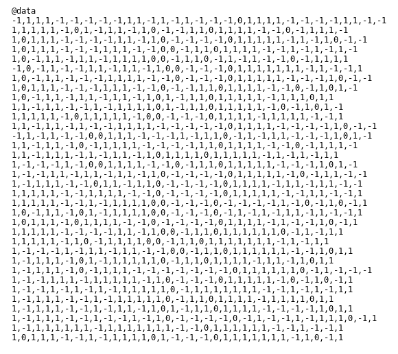
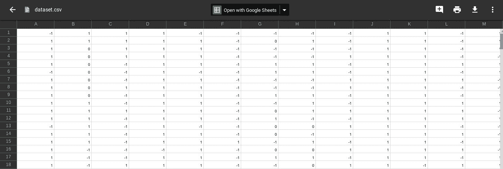
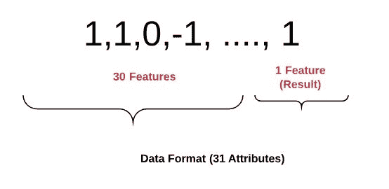
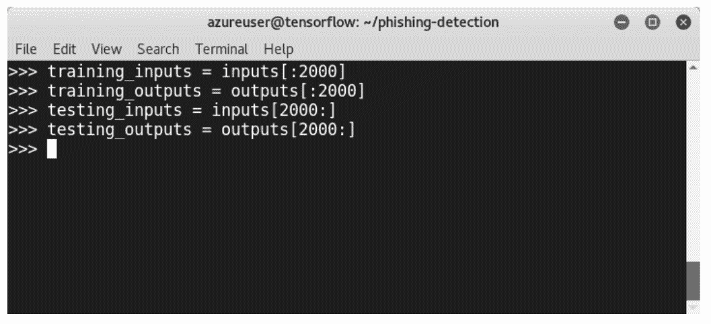
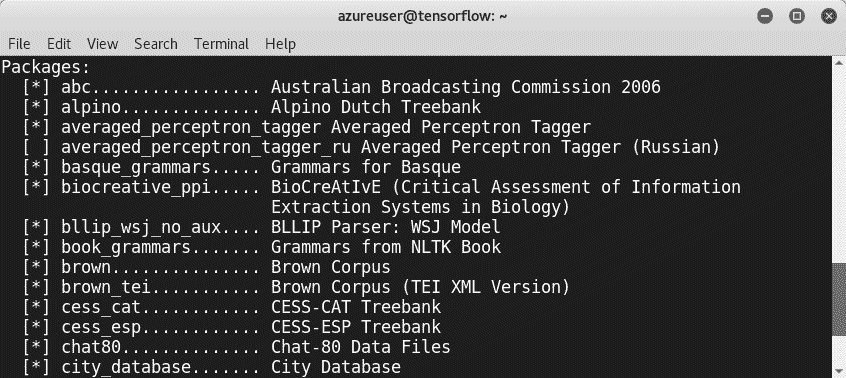
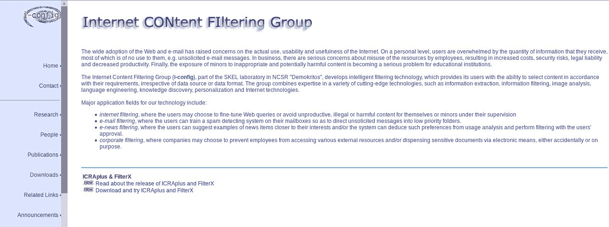
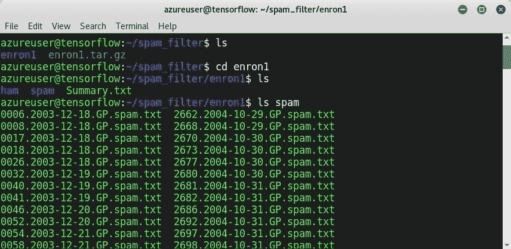
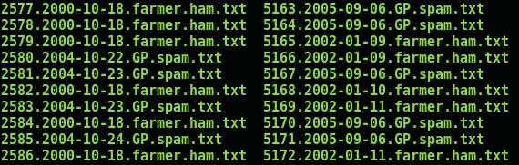
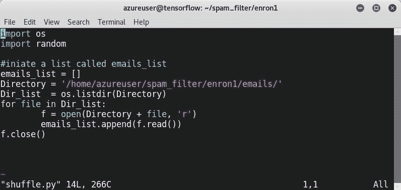

# 网络钓鱼域检测

社会工程是每个个人和现代组织面临的最危险的威胁之一。网络钓鱼是一种众所周知的基于计算机的社会工程技术。攻击者利用伪装的电子邮件地址作为攻击大公司的武器。由于每天都会收到大量的网络钓鱼电子邮件，公司无法检测到所有这些邮件。这就是为什么需要新的技术和保护措施来防范网络钓鱼。本章将介绍使用最先进的 Python 机器学习库构建三个不同的基于机器学习的项目以检测钓鱼企图所需的步骤。

在本章中，我们将介绍：

*   社会工程概述
*   社会工程渗透测试的步骤
*   使用不同的机器学习模型构建实时网络钓鱼攻击检测器：
    *   基于 logistic 回归的网络钓鱼检测
    *   基于决策树的网络钓鱼检测
    *   利用**自然语言处理**（**NLP**进行垃圾邮件检测）

# 技术要求

在本章中，我们将使用以下 Python 库：

*   scikit 学习 Python(≥ 2.7 或≥ 3.3)
*   努比(≥ 1.8.2)
*   NLTK

如果尚未安装，请确保在继续本章之前已安装。您可以在[找到代码文件 https://github.com/PacktPublishing/Mastering-Machine-Learning-for-Penetration-Testing/tree/master/Chapter02](https://github.com/PacktPublishing/Mastering-Machine-Learning-for-Penetration-Testing/tree/master/Chapter02) 。

# 社会工程概述

社会工程，顾名思义，是对一个人进行心理操纵，从他们那里获取有用和敏感的信息，这些信息后来可以用来破坏一个系统。换句话说，罪犯利用社会工程从人们那里获取机密信息，利用人类的行为。

# 社会工程参与框架

**社会工程参与框架**（**SEEF**是多米尼克·C·布拉克和亚历山大·巴姆拉姆开发的框架。它总结了多年来在信息安全和防范社会工程方面的经验。该框架的利益相关者是组织、政府和个人（个人）。社会工程参与管理经历三个步骤：

1.  **入职前流程**：准备社会工程操作
2.  **订婚过程中**发生订婚
3.  **聘用后流程**：**交报告**

 **罪犯使用了许多社会工程技术：

*   **诱饵**：说服被害人透露信息，承诺给他奖励或礼物。
*   **冒充**：冒充他人。
*   **垃圾箱潜水**：从垃圾箱收集有价值的信息（带有地址的文件、电子邮件等）。
*   **肩上冲浪**：在别人打字时，从背后监视别人的机器。
*   **网络钓鱼**：这是最常用的技术；当攻击者伪装成受信任的实体，欺骗受害者打开电子邮件、即时消息或文本消息时，就会发生这种情况。

# 社会工程渗透测试的步骤

渗透测试模拟黑帽黑客攻击，以评估公司部署所需安全措施的安全态势。渗透测试是一个方法学过程，需要经过明确的步骤。渗透测试有多种类型：

*   白盒五重测试
*   黑盒测试
*   灰盒测试

要执行社会工程渗透测试，您需要遵循以下步骤：


# 使用不同的机器学习模型构建实时网络钓鱼攻击检测器

在接下来的部分中，我们将学习如何构建机器学习网络钓鱼检测器。我们将介绍以下两种方法：

*   基于 logistic 回归的网络钓鱼检测
*   基于决策树的网络钓鱼检测

# 基于 logistic 回归的网络钓鱼检测

在本节中，我们将使用逻辑回归算法从头开始构建网络钓鱼检测器。Logistic 回归是一种众所周知的统计技术，用于进行二项预测（两类）。

就像在每个机器学习项目中一样，我们需要数据来支持我们的机器学习模型。对于我们的模型，我们将使用 UCI 机器学习库（钓鱼网站数据集）。您可以在[查看 https://archive.ics.uci.edu/ml/datasets/Phishing+网站](https://archive.ics.uci.edu/ml/datasets/Phishing+Websites)：


数据集作为`arff`文件提供：


以下是数据集中的快照：



为了更好地操作，我们将数据集组织成一个`csv`文件：



正如您可能从属性中注意到的，数据集的每一行都以以下格式表示—*{30 个属性（具有 IP 地址 URL 长度、异常 URL 等）}+{1 个属性（结果）}*：



对于我们的模型，我们将导入两个机器学习库，NumPy 和 scikit learn，我们已经在[第 1 章](01.html#K0RQ0-49a67f1d6e7843d3b2296f38e3fe05f5)、*Pentesting 机器学习简介*中安装了它们。

让我们打开 Python 环境并加载所需的库：

```py
>>> import numpy as np
>>> from sklearn import *
>>> from sklearn.linear_model import LogisticRegression
>>> from sklearn.metrics import accuracy_score
```

接下来，加载数据：

```py
training_data = np.genfromtxt('dataset.csv', delimiter=',', dtype=np.int32)
```

识别`inputs`（除最后一个属性外的所有属性）和`outputs`（最后一个属性）：

```py
>>> inputs = training_data[:,:-1]
>>> outputs = training_data[:, -1]
```

在上一章中，我们讨论了如何将数据集划分为培训数据和测试数据：

```py
training_inputs = inputs[:2000]
training_outputs = outputs[:2000] 
testing_inputs = inputs[2000:]
testing_outputs = outputs[2000:]
```



创建 scikit 学习逻辑回归分类器：

```py
classifier = LogisticRegression()
```

培训分类器：

```py
classifier.fit(training_inputs, training_outputs)
```

作出预测：

```py
predictions = classifier.predict(testing_inputs)
```

让我们打印出钓鱼探测器模型的准确性：

```py
accuracy = 100.0 * accuracy_score(testing_outputs, predictions) 
print ("The accuracy of your Logistic Regression on testing data is: " + str(accuracy))
```


我们的模型的准确率约为 85%。这是一个很好的准确性，因为我们的模型检测到 100 个钓鱼 URL 中有 85 个。但是，让我们尝试使用相同的数据，用决策树建立一个更好的模型。

# 基于决策树的网络钓鱼检测

为了构建第二个模型，我们将使用相同的机器学习库，因此无需再次导入它们。但是，我们将从`sklearn`导入决策树分类器：

```py
>>> from sklearn import tree
```

创建`tree.DecisionTreeClassifier()`scikit 学习分类器：

```py
classifier = tree.DecisionTreeClassifier()
```

培训模型：

```py
classifier.fit(training_inputs, training_outputs)
```

计算预测：

```py
predictions = classifier.predict(testing_inputs)
```

计算精度：

```py
accuracy = 100.0 * accuracy_score(testing_outputs, predictions)
```

然后，打印出结果：

```py
print ("The accuracy of your decision tree on testing data is: " + str(accuracy))
```


与第一个模型相比，第二个模型的精度约为 90.4%，这是一个很好的结果。我们现在已经学习了如何使用两种机器学习技术构建两个网络钓鱼检测器。

# NLP 深入概述

NLP 是通过机器分析和理解人类语言的艺术。根据许多研究，超过 75%的使用数据是非结构化的。非结构化数据没有预定义的数据模型，也没有以预定义的方式组织。电子邮件、推特、每日消息甚至我们录制的演讲都是非结构化数据的形式。NLP 是机器分析、理解和从自然语言中获得意义的一种方式。NLP 广泛应用于许多领域和应用，例如：

*   实时翻译
*   自动汇总
*   情绪分析
*   语音识别
*   构建聊天机器人

通常，NLP 有两个不同的组成部分：

*   **自然语言理解（NLU）**：这是指将输入映射为有用的表示。
*   **自然语言生成（NLG）**：指将内部表示转化为有用的表示。换句话说，它正在将数据转换为书面或口头叙述。商业智能仪表板的书面分析是 NLG 应用程序之一。

每个 NLP 项目都要经过五个步骤。建立 NLP 项目的第一步是识别和分析单词的结构。这一步包括将数据分成段落、句子和单词。然后我们分析句子中的单词以及它们之间的关系。第三步是检查文本是否有意义。然后，分析连续句的意义。最后，通过语用分析完成了本课题的研究。


# 开源 NLP 库

有许多开源 Python 库提供构建真实世界 NLP 应用程序所需的结构，例如：

*   ApacheOpenNLP
*   门 NLP 库
*   斯坦福 NLP
*   当然还有**自然语言工具包**（**NLTK**）

在上一章中，我们学习了如何安装许多开源机器学习 Python 库，包括 NLTK。让我们启动 Linux 机器并尝试一些实际操作技术。

打开 Python 终端，导入`nltk`：

```py
>>> import nltk
```

下载图书类型，如下所示：

```py
>>> nltk.download()
```


如果您想列出我们在上一章中已经下载的可用资源，请键入`l`：



您还可以键入：

```py
>> from nltk.book import *
```


要从链接中获取文本，建议使用`urllib`模块对网站进行爬网：

```py
>>> from urllib import urlopen
>>> url = "http://www.URL_HERE/file.txt"
```

作为演示，我们将加载一个名为`Security.in.Wireless.Ad.Hoc.and.Sensor.Networks`的文本：


我们对文本文件进行了爬网，并使用`len`检查其长度，`raw[:50]`显示一些内容。正如你从截图中看到的，文本中包含了很多对我们的项目毫无用处的符号。为了只获得我们需要的，我们使用**标记化**：

```py
>>> tokens = nltk.word_tokenize(raw)
>>> len(tokens)
> tokens[:10]
```

为了总结上一节所学内容，我们了解了如何下载网页、标记文本和规范单词。

# 基于 NLTK 的垃圾邮件检测

现在是时候使用 NLTK 构建我们的垃圾邮件检测器了。这种分类器原理简单；我们需要检测垃圾邮件发送者使用的词语。我们将使用 Python 和`nltk`库构建一个垃圾邮件/非垃圾邮件二进制分类器，以检测电子邮件是否为垃圾邮件。首先，我们需要像往常一样导入库：

```py
>>> import nltk
```

我们需要加载数据并向模型提供电子邮件数据集。为此，我们可以使用**互联网内容过滤组**交付的数据集。您可以访问网站[https://labs-repos.iit.demokritos.gr/skel/i-config/](https://labs-repos.iit.demokritos.gr/skel/i-config/) ：



基本上，该网站提供了四个数据集：

*   垃圾信息
*   PU1
*   PU123A
*   安然垃圾邮件

对于我们的项目，我们将使用安然垃圾邮件数据集：


让我们使用`wget`命令下载数据集：


使用`tar -xzf enron1.tar.gz`命令提取`tar.gz`文件：



洗牌`cp spam/* emails && cp ham/* emails`对象：



为了洗牌电子邮件，让我们编写一个小 Python 脚本，`Shuffle.py`，来完成这项工作：

```py
import os
import random
#initiate a list called emails_list
emails_list = []
Directory = '/home/azureuser/spam_filter/enron1/emails/'
Dir_list  = os.listdir(Directory)
for file in Dir_list:
    f = open(Directory + file, 'r')
    emails_list.append(f.read())
f.close()
```

只需更改目录变量，它将洗牌文件：



在准备数据集之后，您应该知道，正如我们之前所了解的，我们需要`tokenize`电子邮件：

```py
>> from nltk import word_tokenize
```


此外，我们还需要执行另一个步骤，称为柠檬化。柠檬化将具有不同形式的单词连接起来，如 hacker/hackers 和 is/are。我们需要进口`WordNetLemmatizer`：

```py
>>> from nltk import WordNetLemmatizer
```

为演示创建一个句子，并打印出 lemmatizer 的结果：

```py
>>> [lemmatizer.lemmatize(word.lower()) for word in word_tokenize(unicode(sentence, errors='ignore'))]
```


然后需要删除`stopwords`，如`of`、`is`、`the`等：

```py
from nltk.corpus import stopwords
stop = stopwords.words('english')
```

要处理电子邮件，必须创建一个名为`Process`的函数，用于`lemmatize`和`tokenize`我们的数据集：

```py
def Process(data):
 lemmatizer = WordNetLemmatizer()
 return [lemmatizer.lemmatize(word.lower()) for word in word_tokenize(unicode(sentence,   errors='ignore'))]
```

第二步是特征提取，通过阅读电子邮件的文字：

```py
from collections import Counter
def Features_Extraction(text, setting):
 if setting=='bow':
# Bow means  bag-of-words
 return {word: count for word, count in Counter(Process(text)).items() if not word in stop}
 else:
 return {word: True for word in Process(text) if not word in stop}
```

提取特征：

```py
features = [(Features_Extraction(email, 'bow'), label) for (email, label) in emails]
```

现在，让我们定义 Python 函数的训练模型：

```py
def training_Model (Features, samples):
 Size = int(len(Features) * samples)
 training , testing = Features[:Size], Features[Size:]
 print ('Training = ' + str(len(training)) + ' emails')
 print ('Testing = ' + str(len(testing)) + ' emails')
```

作为一种分类算法，我们将使用`NaiveBayesClassifier`：

```py
from nltk import NaiveBayesClassifier, classify
classifier = NaiveBayesClassifier.train(training)
```

最后，我们定义了评估 Python 函数：

```py
def evaluate(training, tesing, classifier):
 print ('Training Accuracy is ' + str(classify.accuracy(classifier, train_set)))
 print ('Testing Accuracy i ' + str(classify.accuracy(classifier, test_set)))
```


# 总结

在本章中，我们学习了通过从头开始构建三个不同的项目来检测钓鱼企图。首先，我们发现了如何使用两种不同的机器学习技术开发钓鱼检测器，这要归功于最先进的 Python 机器学习库。第三个项目是垃圾邮件过滤器，基于 NLP 和朴素贝叶斯分类。在下一章中，我们将使用不同的技术和 Python 机器学习库构建各种检测恶意软件的项目。

# 问题

我们希望这一章很容易读完。现在，和往常一样，是练习时间。您的工作是尝试构建自己的垃圾邮件检测系统。我们将引导您完成这些问题。

在本章的 GitHub 存储库中，您将发现一个数据集，该数据集收集自 Androutsopoulos、J.Koutsias、K.V.Chandrinos、George Paliouras 和 C.D.Spyropoulos 的研究：*对朴素贝叶斯反垃圾邮件过滤的评估*。*新信息时代机器学习研讨会论文集，G.Potamias，V.Moustakis 和**M.van Someren（编辑），第 11 届欧洲机器学习会议，西班牙巴塞罗那，第 9-17 页，2000 年*。

您现在可以准备数据：

1.  以下是要执行的一些文本清理任务：
    *   清除文本中的停止词、数字和标点符号。
    *   进行柠檬化。
2.  创建一个单词词典，包括它们的频率。

在电子邮件文本中，您会注意到第一行是电子邮件的主题，第三行是电子邮件的正文（我们只需要电子邮件正文）。

3.  从字典中删除非单词。
4.  从数据中提取特征。
5.  准备特征向量及其标签。
6.  使用线性支持向量机分类器对模型进行训练。
7.  打印出模型的混淆矩阵。**