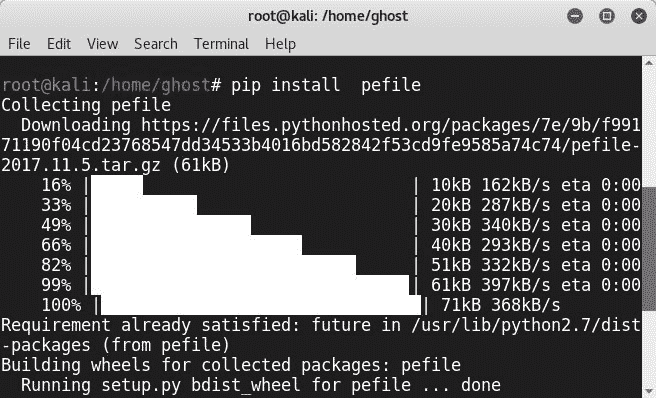
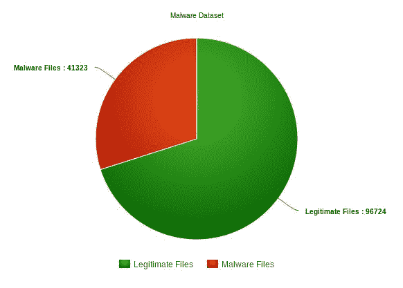
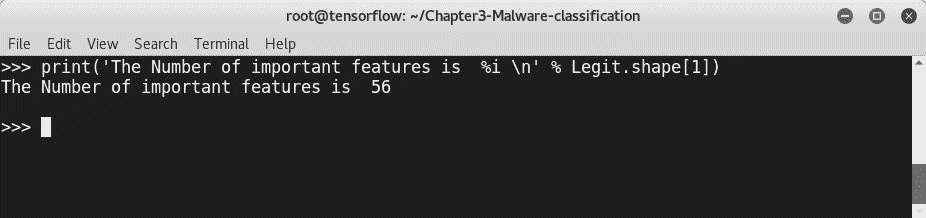
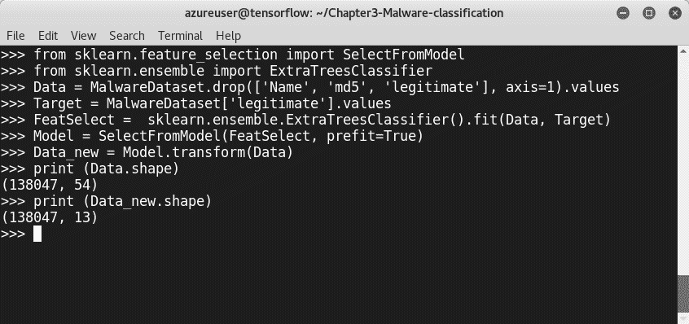
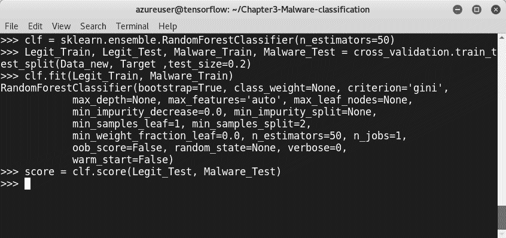
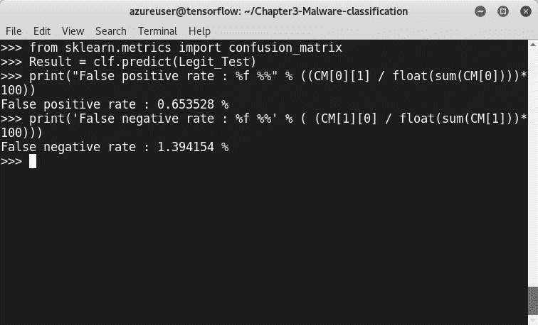
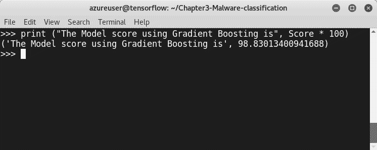
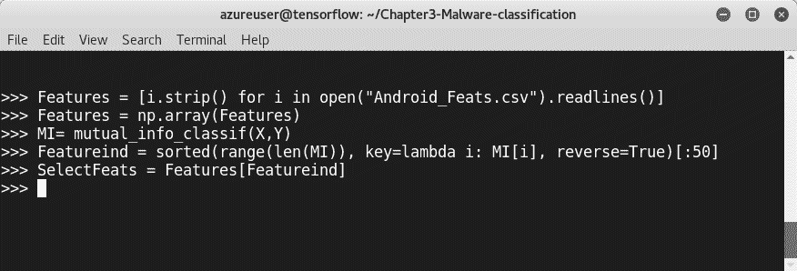
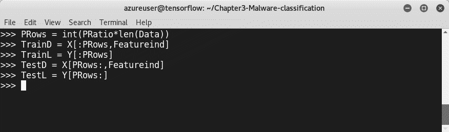

# 使用 API 调用和 PE 头进行恶意软件检测

信息安全中一些最令人讨厌的威胁是恶意程序。每天，我们都会听到关于数据泄露和恶意软件网络攻击的新闻。攻击者正在提高他们的开发技能，并构建能够绕过公司安全保护和 AV 产品的新恶意软件。本章将介绍一些使用尖端数据科学、Python 库和机器学习算法击败恶意软件的新技术和解决方案。

在本章中，我们将介绍：

*   恶意软件分析方法
*   机器学习辅助恶意软件分析技术，以及实际的 Python 项目

# 技术要求

在本章中，我们将使用已经安装的 Python 库。我们将在本书的大部分章节中使用这些库。这就是为什么我们使用第一章来教您如何安装所有必需的库。

您将在[的存储库中找到讨论的所有代码，以及一些其他有用的脚本 https://github.com/PacktPublishing/Mastering-Machine-Learning-for-Penetration-Testing/tree/master/Chapter03](https://github.com/PacktPublishing/Mastering-Machine-Learning-for-Penetration-Testing/tree/master/Chapter03) 。

# 恶意软件概述

恶意软件是未经用户同意而设计用于渗透和破坏信息系统的恶意软件。术语*恶意软件*涵盖了很多类别。有许多不同类型的恶意软件：

*   病毒
*   勒索软件
*   蠕虫
*   木马
*   后门
*   间谍软件
*   键盘记录器
*   广告软件、机器人和 rootkit

# 恶意软件分析

作为恶意软件分析师，您的工作是准确地发现系统发生了什么，并确保被恶意软件损坏的机器与组织的网络隔离。为了执行恶意软件分析，我们需要遵循特定的操作和方法。说到恶意软件分析，我们必须执行三种技术：静态恶意软件分析、动态恶意软件分析和内存恶意软件分析。我们将逐一查看它们。

# 静态恶意软件分析

恶意软件分析的第一步是收集有关恶意软件的所有信息。静态分析是使用不同的技术和实用程序收集有关恶意二进制文件的所有可用信息的艺术。在这个阶段，分析员检查恶意软件，而不是真正执行它。一些常见的静态恶意软件分析方法如下：

*   **在线防病毒扫描**：使用在线扫描仪扫描可疑文件是检查文件的一种好方法，这要归功于在线环境使您能够使用许多防病毒产品扫描文件。最著名的在线扫描仪是 VirusTotal。如果要扫描文件，只需访问[https://www.virustotal.com/#/home/upload](https://www.virustotal.com/#/home/upload) 并上传文件：


为了使任务自动化，VirusTotal 提供了一些有用的 API。因此，您可以用几行代码构建自己的 Python 脚本：


要扫描`file.exe`，您可以使用来自 VirusTotal 的以下代码片段：

```
import requests
 url = 'https://www.virustotal.com/vtapi/v2/file/scan'
 params = {'apikey': '<apikey>'}
 files = {'file': ('myfile.exe', open('myfile.exe', 'rb'))}
 response = requests.post(url, files=files, params=params)
 print(response.json())
```

要获取密钥，只需创建一个 VirusTotal 社区帐户。

*   **散列**：这是一种识别文件的技术。每个哈希文件都有一个唯一的哈希。最常用的散列函数是 MD5 和 SHA256。
*   **字符串**：这些也是很好的信息来源。从恶意程序中提取字符串将为我们提供有关恶意软件的丰富信息。一些字符串包括 URI、URL、错误消息和注释。

# 动态恶意软件分析

收集恶意软件信息后，应在隔离和安全的环境中运行。通常，这些环境称为**恶意软件分析沙盒**。沙盒中装载了分析和监视工具，用于在恶意软件运行时收集有关恶意软件的信息。恶意软件分析师可以收集以下信息，以及更多信息：

*   TCP 连接
*   DNS 摘要
*   恶意软件行为
*   系统调用

# 内存恶意软件分析

几年前，使用前两种技术就足以分析恶意软件，但攻击者现在正在使用新的、更复杂的技术来避免检测。我打赌你一定听说过无文件恶意软件。需要对内存恶意软件进行分析，以检测新一波恶意软件。内存恶意软件分析是通过分析从受感染机器收集的内存转储来进行的。为了执行内存分析，分析人员首先需要获取内存（转储内存），然后可以使用许多实用程序和技术对其进行分析。

最常用的框架之一是波动性框架。如果您已经安装了 Kali Linux 发行版，则可以直接在您的计算机上使用 volatility，而无需安装它。以下屏幕截图取自 Kali Linux 内置的挥发性框架：


波动性有助于分析师从内存转储中收集信息，包括以下内容及更多内容：

*   Bash 历史
*   API 挂钩
*   网络信息
*   内核加载模块

# 规避技巧

攻击者和恶意软件开发人员不断提出新的技术和方法来避免检测。一些最常见的技术包括：

*   **混淆**：这是使恶意软件更难检测或分析的做法。死代码插入、寄存器重新分配和加密是三种混淆技术。

*   **绑定**：将恶意软件与合法文件绑定，生成一个可执行文件。
*   **打包**：打包器，有时称为**自解压归档**，是一种在执行*打包文件*时将自身解压到内存中的软件。

# 可移植可执行格式文件

**可移植可执行文件**（**PE**文件）是 32 位和 64 位版本 Windows 中使用的可执行文件、DDL 和目标代码的文件格式。它们包含许多对恶意软件分析师有用的信息，包括导入、导出、时间-日期戳、子系统、部分和资源。以下是 PE 文件的基本结构：


PE 文件的某些组件如下所示：

*   **DOS 头**：从每个 PE 文件的前 64 个字节开始，这样 DOS 可以验证可执行文件，并可以在 DOS 存根模式下运行。
*   **PE 头**：包含代码的位置、大小等信息。
*   **PE 章节**：包含文件的主要内容。

要查看 PE 头的信息，可以使用许多工具，如 PE EXPLORER、PEview 和 PEstudio。

# 基于 PE 头的机器学习恶意软件检测

为了训练我们的机器学习模型来发现恶意软件数据集，有很多公开的数据源供数据科学家和恶意软件分析师使用。例如，以下网站使安全研究人员和机器学习爱好者能够下载许多不同的恶意软件样本：

*   **恶意软件流量分析**：[https://www.malware-traffic-analysis.net/](https://www.malware-traffic-analysis.net/)
*   **卡格尔恶意软件系列**：[https://www.kaggle.com/c/malware-classification](https://www.kaggle.com/c/malware-classification)
*   **VX 天堂**：[http://83.133.184.251/virensimulation.org/index.html](http://83.133.184.251/virensimulation.org/index.html)
*   **病毒总数**：[https://www.virustotal.com](https://www.virustotal.com)
*   **病毒共享**：[https://virusshare.com](https://virusshare.com)

要使用 PE 文件，我强烈建议使用一个名为`pefile`的惊人 Python 库。`pefile`使您能够检查标题、分析部分和检索数据，以及其他功能，如封隔器检测和 PEiD 签名生成。您可以在[查看 GitHub 项目 https://github.com/erocarrera/pefile](https://github.com/erocarrera/pefile) 。

您也可以使用 PIP 安装它，就像我们使用其他机器学习库所做的那样：

```
# pip install pefile
```

现在我们成功安装了`pefile`：



让我们开始构建我们的第一个恶意软件分类器。对于该模型，我们将使用三种不同的技术：

*   随机森林
*   梯度推进分类
*   AdaBoost 分类

正如您可能已经从本书中的分类算法中注意到的，我们正在尝试使用许多不同的技术。在某些情况下，您可以使用前面讨论的算法之一，但我尝试在每章中使用不同的技术，以便您能够清楚地了解如何使用每种机器学习技术。

到目前为止，您已经知道构建机器学习模型的第一步（当然，在研究了项目需求之后）是下载数据集。在本节中，我们将下载安全博客 Prateek Lalwani 提供的恶意软件数据集。恶意软件数据集包含从以下内容提取的功能：

*   41323 Windows 二进制文件（可执行文件`.exe`和`.dlls`），作为合法文件。
*   从 VirusShare 网站下载的 96724 个恶意软件文件。因此，数据集总共包含 138048 行。

数据集划分如下：



让我们首先使用`pandas`Python 库加载恶意软件数据集：

```
import pandas as pd
MalwareDataset = pd.read_csv('MalwareData.csv', sep='|')
Legit = MalwareDataset[0:41323].drop(['legitimate'], axis=1)
Malware = MalwareDataset[41323::].drop(['legitimate'], axis=1)
```


为了确保数据集已正确加载，让我们打印一些重要功能：

```
print('The Number of important features is  %i \n' % Legit.shape[1])
```

`The Number of important features is 56`将是结果行：



为了提高估计器的准确度，我们将使用`sklearn.feature_selection`模块。该模块用于数据集中的特征选择或降维。

为了计算特征的重要性，在我们的例子中，我们将使用基于树的特征选择。加载`sklearn.feature_selection`模块：

```
import sklearn
from sklearn.feature_selection import SelectFromModel
from sklearn.ensemble import ExtraTreesClassifier
from sklearn.model_selection import train_test_split
from sklearn import cross_validation 
Data = MalwareDataset.drop(['Name', 'md5', 'legitimate'], axis=1).values
Target = MalwareDataset['legitimate'].values
FeatSelect =  sklearn.ensemble.ExtraTreesClassifier().fit(Data, Target)
Model = SelectFromModel(FeatSelect, prefit=True)
Data_new = Model.transform(Data)
print (Data.shape)
print (Data_new.shape)
```



因此，算法为我们选择了九个重要特征。要将其打印出来，请使用以下命令：

```
Features = Data_new.shape[1]
Index = np.argsort(ske.ExtraTreesClassifier().fit(Data,Target).feature_importances_)[::-1][:Features]
for feat  in range(Features):
print(MalwareDataset.columns[2+index[feat]])
```

最重要的特点如下：


现在，是时候用随机森林分类器来训练我们的模型了。别忘了拆分数据集，就像我们之前学到的：

```
Legit_Train, Legit_Test, Malware_Train, Malware_Test = cross_validation.train_test_split(Data_new, Target ,test_size=0.2) 
clf =  sklearn.ensemble.RandomForestClassifier(n_estimators=50)
clf.fit(Legit_Train, Malware_Train)
score = clf.score(Legit_Test, Malware_Test)
```



让我们看一下最终结果：

```
print("The score of Random Forest Algorithm is," score*100))
```


比分似乎很有希望。该模型检测恶意软件的成功率为 99%，这是一个很好的结果。要获取有关我们的恶意软件分类器的`False positive`和`False negative`速率的更多信息，请导入 scikit 学习`confusion_matrix`模块：

```
from sklearn.metrics import confusion_matrix
```

添加以下行：

```
Result = clf.predict(Legit_Test)
CM = confusion_matrix(Malware_Test, Result)
print("False positive rate : %f %%" % ((CM[0][1] / float(sum(CM[0])))*100)) print('False negative rate : %f %%' % ( (CM[1][0] / float(sum(CM[1]))*100)))
```



`False positive rate`为 0.6%，`False negative rate`为 1.4%。

要使用另一个分类器训练模型，请重复前面的步骤，但不要选择随机森林分类器，而是选择机器学习算法。例如，我将选择渐变增强：

```
Clf = sklearn.ensemble.GradientBoostingClassifier(n_estimators=50)
Clf.fit(Legit_Train, Malware_Train)
Score = Clf.score(Legit_Test, Malware_Test)
```


让我们检查第二个分数：

```
print ("The Model score using Gradient Boosting is", Score * 100)
```



检测率为 98.8%。以下是使用 AdaBoost 分类器的分数：

```
Classifiers =
{ "RandomForest": ske.RandomForestClassifier(n_estimators=50), "GradientBoosting": ske.GradientBoostingClassifier(n_estimators=50), "AdaBoost": ske.AdaBoostClassifier(n_estimators=100),}

for Classif in Classifiers:
clf = Classifiers[Classif]
clf.fit(Legit_Train,Malware_Train)
score = clf.score(Legit_test, Malware_test)
print("%s : %f %%" % (Classif, score*100))
```


# 使用 API 调用的机器学习恶意软件检测

使用 API 调用分析恶意软件在恶意软件分析中扮演着重要角色。因此，API 可以让恶意软件分析师了解恶意软件的行为，特别是当基本静态分析由于混淆技术（如打包器、密码器和保护器）而无法成功时。恶意软件分析师可以通过研究 API 调用来了解恶意文件的工作原理。有许多在线工具可以让您在安全的环境中分析恶意软件。这些实用程序和环境称为沙盒。检测到的恶意软件由哈希函数（MD5 或 SHA256）标识。恶意软件分析人员使用哈希对文件进行签名。例如，以下 API 取自使用[进行在线恶意软件扫描的报告 https://www.hybrid-analysis.com](https://www.hybrid-analysis.com) 。

以下是有关恶意软件“PE32 可执行文件（GUI）英特尔 80386，适用于 MS Windows”的一些详细信息。其哈希为：4c510779ab6a58a3bdbbe8d5f3ec568fcf33df81b0f1a5bdacabf78a9c62f492


根据微软网站，[https://msdn.microsoft.com/](https://msdn.microsoft.com/) ，`GetProcAddress`从指定的**动态链接库**（**DLL**中检索导出函数或变量的地址。因此，如果您想了解有关其他调用的更多信息，只需转到 Microsoft developer network 并搜索 API 调用函数：


该报告包括调查结果的完整摘要，而不仅仅是 API 调用。它包括：

*   一般资料
*   恶意指示器
*   异常特征
*   反探测/隐身
*   反逆向工程
*   网络相关信息

以下是有关扫描的恶意软件的信息。我们之前讨论了大多数必需的发现（静态分析工件：大小、类型等）：


对于我们的第二个恶意软件分类器，我们将使用 API 调用来构建机器学习恶意软件检测器。要从恶意软件二进制文件中提取 API，恶意软件分析师需要执行定义明确的步骤：

1.  恶意软件解包
2.  汇编程序检索
3.  API 调用提取
4.  使用 Microsoft 官方网站分析 API 调用

您可以将恶意软件行为分为多个组。例如，巴拉特大学将 API 分类为六类，通过提取 API 调用 AUT1 来理解恶意软件行为。您可以使用它来分析您的发现：


作为演示，让我们使用 API 调用数据集提供的支持向量机学习算法构建一个 Android 恶意软件检测项目。本章的 GitHub 文件夹包含用于构建模型的准备好的数据集：


在构建模型之前，我们需要导入一些有用的模块：

```
>>> from sklearn.feature_selection import mutual_info_classif
>>> from sklearn import preprocessing
>>> import numpy as np
>>> from sklearn.svm import SVC, LinearSVC
>>> from sklearn import svm
>>> import csv
>>> import random
```


首先，让我们预处理我们的 CSV 文件（`Android_Feats.csv`：

```
>>> PRatio = 0.7
>>> Dataset =  open('Android_Feats.csv')
>>> Reader = csv.reader(Dataset)
>>> Data = list(Reader)
>>> Data = random.sample(Data, len(Data))
>>> Data = np.array(Data)
> Dataset.close()
```


使用 NumPy 标识文件中的数据和标签：

```
>>> cols = np.shape(Data)[1]
>>> Y = Data[:,cols-1]
>>> Y = np.array(Y)
>>> Y = np.ravel(Y,order='C')
>>> X = Data[:,:cols-1]
>>> X = X.astype(np.float)
>>> X = preprocessing.scale(X)
```


现在，处理阶段已经完成。如前所述，我们需要提取最重要的功能，因为计算所有可用功能将是一项繁重的任务：

```
Features = [i.strip() for i in open("Android_Feats.csv").readlines()]
Features = np.array(Features)
MI= mutual_info_classif(X,Y)
Featureind = sorted(range(len(MI)), key=lambda i: MI[i], reverse=True)[:50]
SelectFeats = Features[Featureind]
```



现在，将数据集（数据和标签）划分为训练集和测试集：

```
PRows = int(PRatio*len(Data))
TrainD = X[:PRows,Featureind]
TrainL = Y[:PRows]
TestD = X[PRows:,Featureind]
TestL = Y[PRows:]
```



功能选择已成功完成。为了训练模型，我们将使用支持向量机分类器：

```
>>> clf = svm.SVC()
>>> clf.fit(TrainD,TrainL)
>>> score = clf.score(TestD,TestL)
>>> print (score * 100)
```


瞧！新模型的准确率为 98%，具有较高的检测率。

# 总结

恶意软件是困扰现代组织安全的最普遍的网络威胁之一。黑帽黑客不断改进；因此，经典的检测技术已经过时，AV 产品通常无法检测高级持久性威胁。这就是为什么机器学习技术可以帮助我们检测恶意软件。

在本章中，我们学习了如何使用许多机器学习算法和开源 Python 库构建恶意软件分类器。下一章将教我们如何构建更健壮的系统来检测恶意软件，使用与人类思维相同的算法。我们将学习如何使用本书中使用的相同 Python 库，使用深度学习来检测恶意软件。

# 问题

您现在可以构建一个机器学习模型。让我们练习，测试我们的新技能。在本章的 GitHub 存储库中，您将找到一个包含 Android 恶意软件样本信息的数据集。现在，您需要按照以下说明构建自己的模型。

在`Chapter3-Practice`GitHub 存储库中，您将发现一个包含 11000 多个良性和恶意 Android 应用程序特征向量的数据集：

1.  使用`pandas`python 库加载数据集，这次添加`low_memory=False`参数。搜索该参数的作用。
2.  准备将用于培训的数据。
3.  使用`test_size=0.33`参数拆分数据。
4.  创建一组包含`DecisionTreeClassifier()`、`RandomForestClassifier(n_estimators=100)`和`AdaBoostClassifier()`的分类器。
5.  什么是`AdaBoostClassifier()`？
6.  使用三个分类器训练模型，并打印出每个分类器的度量。

# 进一步阅读

有关更多信息，请查看以下日志和文档：

*   PE 格式（Windows）：[https://msdn.microsoft.com/en-us/library/windows/desktop/ms680547（v=vs.85）。aspx](https://msdn.microsoft.com/en-us/library/windows/desktop/ms680547(v=vs.85).aspx)
*   *恶意软件分析：简介*：*[https://www.sans.org/reading-room/whitepapers/malicious/malware-analysis-introduction-2103](https://www.sans.org/reading-room/whitepapers/malicious/malware-analysis-introduction-2103)*

**   虚拟总体文档：[https://www.virustotal.com/en/documentation/](https://www.virustotal.com/en/documentation/)*