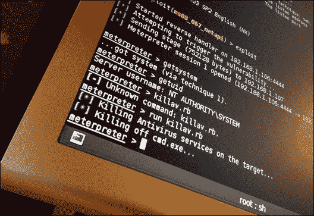
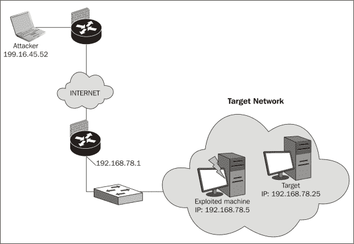
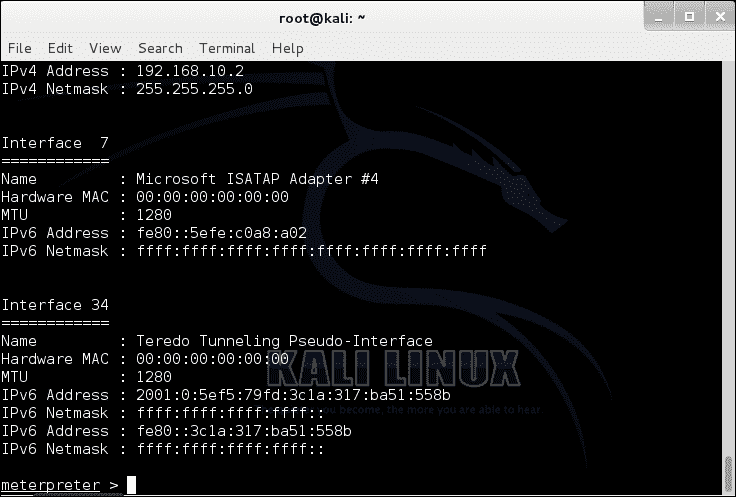
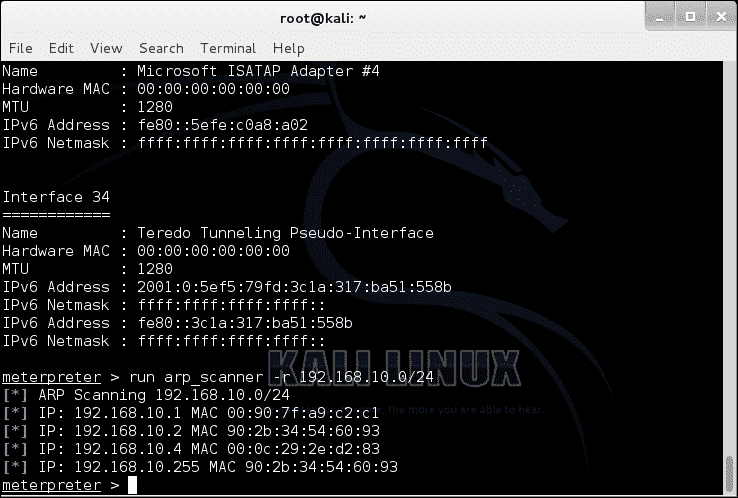

# 九、利用之后

欢迎我们在上一章中破坏了网络上的一个目标。那么接下来会发生什么，你可能会问自己？攻击者更有可能深入攻击内部工作站和服务器。在本章中，我们将介绍以下主题：

*   如何创建轴
*   记录我们的工作
*   清理我们的工作
*   保护自己不受旋转的影响



# 创建一个支点

我们破解了无线加密，接入了网络，并破坏了一个系统。攻击者将采取的下一步是避开**入侵防御系统**（**IPS**）或**入侵检测系统**（**IDS**）。通过将流量路由到受损系统，然后使用受损系统的流量对内部网络上的其他工作站和服务器发起额外攻击，Pivoting 可以实现这一点。这将使 IPS 和防火墙日志显示攻击者的内部 IP 地址，而不是外部 IP。



现在，你可能会问自己，如果不能保护我的网络，我到底为什么要购买 IDS 或 IPS？嗯，在网络上激活 ID 或 IP 不仅很重要，而且每天对其进行监控和审查也很重要。如果没有人正确地监视或检查 ID 或 IP，那么您可能已经有人在您不知情的情况下潜伏在您的网络上。

让我们花一些时间讨论为什么 IDS 或 IPS 是很重要的：

*   Physical security:

    *   您如何知道您的网络中没有人？

    他们现在可能正在访问敏感数据

    *   在防火墙上工作时是否忘记禁用 SSH？

    攻击者只需打开一个漏洞即可获得访问权限，然后可能获得对其他内容的访问权限

*   可靠性和稳定性：

    *   风险管理
    *   对业务运营的影响较小
    *   业务连续性
    *   业务停机时间较短

*   灵活性：

    *   访问其他
    *   无法访问的安全控制功能，提供额外的安全控制层

*   放心：

    *   当其他安全控制意外失败时，IDS 可以提供额外的安全服务
    *   知道谁和什么进入您的网络来访问数据是非常重要的，特别是当它包含客户数据或其他敏感信息

    时


总之，安全性越来越成为企业的一项要求。企业之所以亏损，是因为他们没有采取额外的安全措施来保护客户的个人数据。在某些情况下，这些信息可以公开发布。公开发布后，企业可能会失去现有客户和新客户。

关于 ID 和 IP 的讨论已经够多了，是时候开始本章的旋转演示了。在开始之前，我们必须已经破坏了一个可以访问 MeterMeter 会话的系统。如果您还没有这样做，请参考[第 8 章](08.html "Chapter 8. Data Capture and Exploitation")、*数据捕获和利用*。

开始吧！

1.  Access Meterpreter and type:

    ```
    ipconfig

    ```

    这将显示内部 IP 地址：

    

2.  Run a network scan and type:

    ```
    run arp_scanner –r 192.168.10.0/24

    ```

    这将显示内部网络上的所有主机：

    

3.  Then type `background`. This keeps the Meterpreter session running while we run other commands within the Metasploit console.

    

4.  Then, we add the route from the default gateway to the compromised system and type:

    ```
    route add 192.168.1.110 255.255.255.0 1

    ```

    这将通过受损系统路由所有来自默认网关的流量。这将使我们能够访问内部网络中的其他主机，因此也会损害这些系统。

    

祝贺您已成功创建枢轴。内部网络是完全可访问的，您可以在其他主机上运行漏洞攻击，而无需担心 IDS、IPS 或防火墙警报。这些攻击看起来像来自内部网络。

# 记录您的渗透测试

渗透测试最重要的部分之一可能就是记录你的工作。开始记录渗透测试的最佳方法是创建大纲。

以下是一个专业大纲的示例：

**引言**：

*   在客户端的 10.0.0.0/24 网络上执行渗透测试。此渗透测试的目的是确定 10.0.0.0/24 网络的无线安全性。评估是在几个目标系统上进行的。给出的结果并不适用于所有主机，而仅适用于 IP 范围内的系统。
*   在整个渗透测试过程中，客户 John Doe 确认检测到的所有已识别漏洞。本测试不运行任何**拒绝服务**（**DoS**攻击；但是，可以在不执行实际攻击的情况下确定主机是否容易受到 DoS 攻击。

**系统**：

*   Displays each target system on the network that will be identified and scanned for vulnerabilities

    

**方法和技术**：

*   Discovery:

    *   检查 DNS 记录、whois 服务器、使用网络工具（如 ping 和 traceroute）以及主干防火墙和路由器
    *   使用 TCP、UDP 和 ICMP 回显请求映射网络

    

    史蒂夫 p2008，知识共享 2.0（[https://www.flickr.com/photos/stevepj2009/6857101082/](https://www.flickr.com/photos/stevepj2009/6857101082/) ）

*   枚举：

    *   识别打开 TCP 和 UDP 端口
    *   检测操作系统和软件版本
    *   确定主机类型（防火墙、DNS 服务器和邮件服务器）
    *   确定主机是否易受远程攻击
    *   系统配置及旗帜抓取

*   漏洞利用：

    *   试图利用任何漏洞或弱点
    *   执行缓冲区溢出漏洞利用
    *   获取系统级访问
    *   暴力攻击

**风险**：

*   每个漏洞都按风险级别（低、中、高）以及安全问题的详细信息和这些漏洞所面临的威胁进行组织。
*   未经授权的用户可以访问有关客户数据、业务数据、员工或网络基础设施的敏感信息的任何信息。
*   安全问题，如弱密码或可能导致系统受损的社会工程攻击。
*   不需要任何钥匙或密码的非安全门口入口。通过这种方式，系统可以随时被破坏，以收集更多信息。
*   Open wireless networks are not on a separate subnet in which an attacker could remotely access servers or other hosts on the network.

    

**结论**：

*   详细说明渗透测试期间总体风险问题的百分比
*   提供有关漏洞、弱点、问题、数据泄漏和不明来源的详细信息

# 清理不必要的工作

现在是我们开始清理渗透测试结果的时候了。当我们完成渗透测试时，我们希望我们的报告尽可能干净、简单、专业。列出渗透测试期间执行的每个细节和所有操作。必须足够安全地清理任何受损主机，以免影响正常业务运营。该过程应由技术人员进行验证，以确保一切顺利完成。


如果没有某种重新配置或安全设置更改，任何遗留的不良安全实践和错误配置的系统都不应无人看管。加密和备份渗透测试期间使用的任何重要文件或信息。删除或删除为测试而创建的任何未使用的用户帐户。渗透测试人员有责任通知组织对网络所做的任何系统更改。

# 预防

在这一章中，我们看到了如何攻击一个系统，访问同一子网上的另一个系统，然后攻击另一个子网上的计算机。虽然该场景没有涵盖任何公司防火墙，但公司防火墙有可能阻止对这些系统或网络的访问。如果你碰巧相信你的网络正处于旋转或妥协的状态，立即断开网络连接。然后，开始追踪根本原因，并将其与网络的其他部分隔离开来。我们这里真正的问题是缺乏安全意识。受损用户可能单击了恶意链接或下载了他们认为合法的电子邮件附件或软件。


这就是为什么对员工进行安全教育极其重要的原因。为了提供更好的结果，社会工程攻击变得越来越复杂。保护自己的最好办法是让你和其他人了解这种威胁。

# 总结

本章首先介绍了数据透视及其工作原理，然后通过 Kali Linux 进行了演示。通过记录我们的渗透测试，我们能够组织我们的工作，并在大纲中列出每个细节。记录是一个重要的过程，为我们在下一章中规划和编写报告做好准备。一旦我们完成了工作记录，我们就开始清理所有不必要的工作。

应删除或删除任何新文件夹、文件、用户帐户或更改的系统设置。最后，我们简要介绍了如何保护自己免受旋转攻击。在下一章中，我们将提供一份渗透测试报告，该报告将包含关于我们之前的无线渗透测试漏洞的详细信息。