# 第 1 章选择笔测试平台

在本章中，我们将了解可用于构建低成本、占地面积小但功能强大的渗透测试平台的硬件和软件选项。我们将讨论我们权衡的一些考虑因素，以及为什么我们选择 Raspberry Pi 3 作为硬件平台，选择 Kali Linux 作为软件发行版来构建渗透测试平台。

我们将完成硬件设置和软件安装的步骤，这样我们将有一个功能齐全的 Raspberry Pi 3，并在其上运行 Kali Linux 2.0。

大多数人安装了操作系统，并立即开始使用这些工具；但是，我们建议不要这样做。通过遵循本章介绍的设置和最佳实践，人们遇到的许多问题都可以很容易地得到纠正。这些最佳实践包括安装前和安装后的修改。在我们开始工作之前，我们将讨论一些需要完成的最佳实践任务。

本章涵盖以下主题：

*   硬件选项以及为什么选择 Pi
*   软件选项和为什么选择 Kali
*   购买树莓皮
*   组装树莓皮
*   安装 Kali Linux
*   结合 Kali Linux 和 Raspberry Pi
*   克隆树莓皮 SD 卡
*   避免常见问题

# 硬件选项以及为什么选择 Pi

在研究廉价的便携式计算设备时，有许多设备可供选择。如果我们不知道自己在寻找什么，这会让这个过程有点让人望而生畏。在我们购买之前，我们首先列出了一系列我们认为重要的需求。我们在购买期权时的一些要求如下：

*   小脚印
*   强大的
*   广泛的社区支持
*   廉价的
*   便携式的

有非常受欢迎的选择，如 Arduino，香蕉皮，甚至英特尔新宣布的焦耳板。每个供应商都有一个很好的选择。Intel 平台非常强大，但成本太高，无法证明其合理性。Arduino 当然有很多社区支持和硬件选项，但缺乏我们所需要的一些动力。根据前面提到的要求，我们决定使用树莓 Pi。这是一台完美的小型计算机，它提供了大量的灵活性，深受社区的喜爱，并提供了大量的支持，而且价格绝对合理。

### 提示

这是这本书的第二版。第一版的重点是模型 B，所有概念都基于有限的性能。然而，这个版本将使用一个更流行的树莓皮模型，树莓皮 3，因此将提供更多的选择。

树莓皮已经有一段时间了。因此，如果你做任何研究，我们可以看到有多种选择。以下是可供选择的型号：


*   树莓皮 1 型 A+
*   700 Mhz ARMv6 32 位单核
*   512 MB RAM

    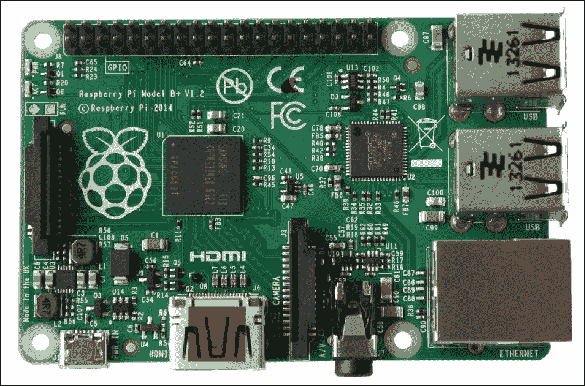

*   树莓皮 1 型 B+
*   700 Mhz ARMv6 32 位单核
*   512 MB RAM

    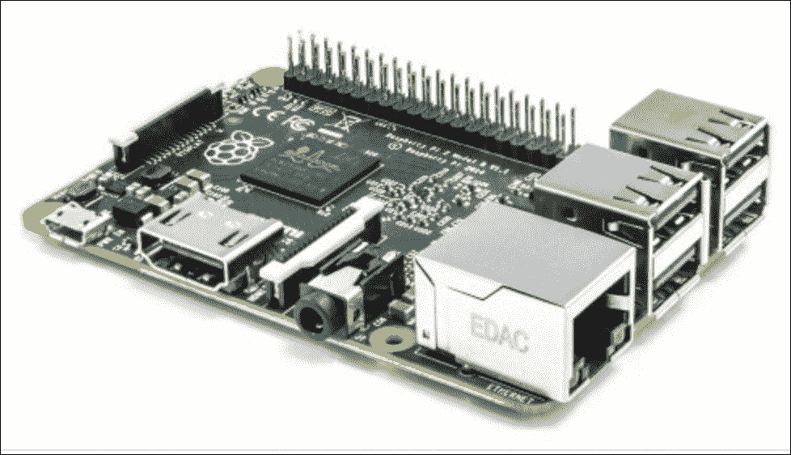

*   树莓皮 2 型 B
*   900 Mhz ARMv7 32 位四核
*   1 GB RAM

    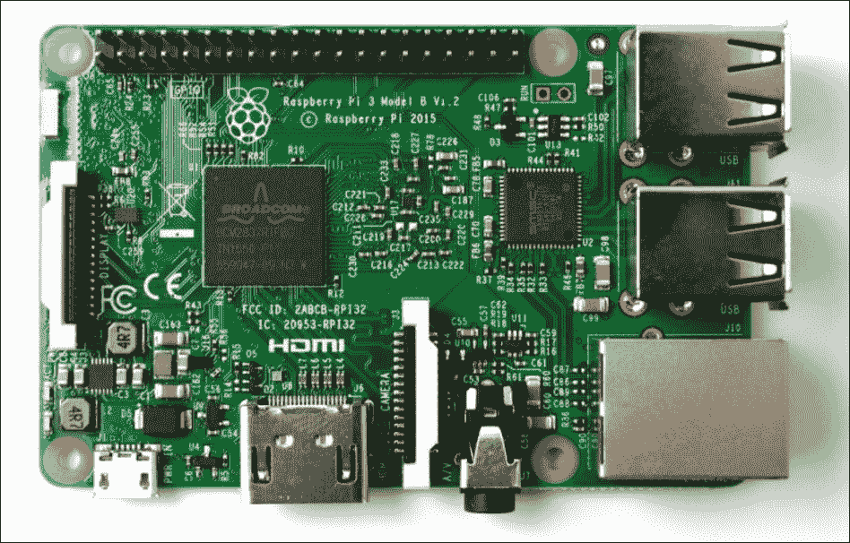

*   树莓皮 3 B 型
*   2 Ghz ARMv8 64 位四核
*   1GB 内存

让我们不要忘记最小的树莓皮，树莓皮零。这是一台非常便宜的电脑，通常售价 5 美元。Zero 是在 Raspberry Pi 2 型号 B 之后不久发布的。它非常适合我们可能想要构建的许多不同项目，提供单核 1 GHz 处理器和 512 MB SDRAM，并且比 Pi 2 或 Pi 3 型号更便宜。

我们应该记住，树莓皮零是一个低功耗的设备相比，皮 3，所以我们的里程可能会有所不同。它绝对不是 PI3 模型的直接替代品，特别是如果我们正在为我们的项目寻找更多的硬件资源。

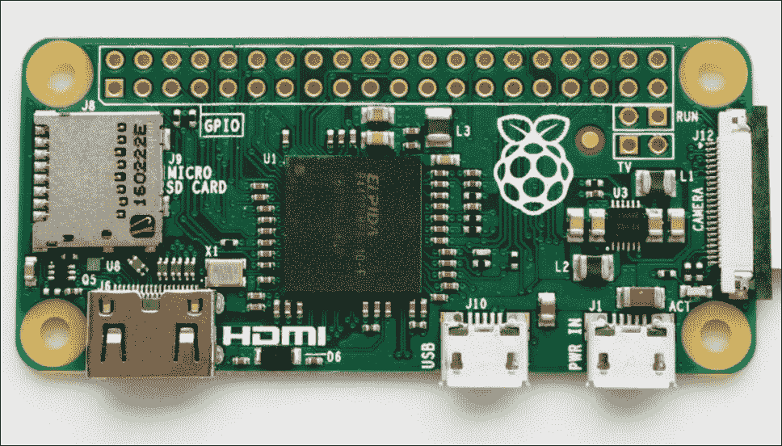

随着型号的进步，硬件也在进步。Pi 1 和 Pi 2 模型是非常好的单元，它们对于嵌入式项目来说仍然是完美的。但是由于硬件增强和 Raspberry Pi 3 的强大功能，型号 B 是我们在这个项目中的选择。我们想在这个小小的外形上获得尽可能多的能量。我们拥有的能力越大，我们就越希望笔测试工具的性能越好。

树莓皮 3 比树莓皮 2 的一些主要优势如下：

*   蓝牙 4.1 支持
*   蓝牙低能量（BLE）
*   2 GHZ 四核 ARM 处理器
*   802.11n 无线支持

这些新增加的功能无疑可以帮助我们创建完美的便携式笔测试平台，但正如我们稍后将看到的那样，这些功能中的一些功能还没有完全准备就绪。

有了这些选项，我们选择了树莓皮 3。当时的电源是 1.2GHz 的四核以及 SDRAM。但不仅仅是这样，Raspberry Pi 3 还提供了使用内置无线和蓝牙的新笔测试工具的灵活性。与过去的版本相比，我们非常兴奋地看到这些新选项。

# 软件选项和为什么选择 Kali

关于可以在 Raspberry Pi 上运行的操作系统，我们首先注意到的一点是，列表非常广泛。对硬件有很多支持。这也是我们选择 Raspberry Pi 硬件而不是其他可用平台的另一个原因。对于渗透测试软件，我们选择使用 Kali Linux（[https://www.kali.org](https://www.kali.org) 用于我们的 Pi 笔测试盒。Kali Linux 附带了大量已经安装的安全工具，它是 BackTrack 的继承者，BackTrack 是我们过去使用的一个备受尊敬的、面向安全的 Linux 发行版。Kali Linux 的 Raspberry Pi 自定义映像由攻击性安全（[维护 https://www.offensive-security.com/](https://www.offensive-security.com/) ）。

Kali Linux 并不是唯一一个伟大的**发行版**（或发行版——Linux 操作系统和应用程序的特定混合版）。其他伟大的笔测试发行版可用于渗透测试。这些其他发行版包括 PwnPi、Raspberry Pwn 和 PwnBerry Pi。我们稍后将在本书中讨论这些发行版，特别是在[第 6 章](6.html#ch06 "Chapter 6.  Finishing the Attack - Report and Withdraw")、*完成攻击-报告并撤回*中。但是现在，我们将把重点放在我们选择的发行版 Kali Linux 上，因为它拥有巨大的社区，并且支持我们在本书中所要包含的大多数项目。

### 提示

如果只是查找 Raspberry Pi 支持的发行版，您可以查看 Raspberry Pi 网站以获得下载（[https://www.raspberrypi.org/downloads/](https://www.raspberrypi.org/downloads/) ）。如果您不确定，**新的开箱即用软件**（**NOOBS**）是一个不错的选择，并且是推荐的默认软件。

# 购买树莓皮

购买树莓皮可能是一项艰巨的任务。互联网上有很多工具可供选择，还有很多配件可供选择。我们访问了 CanaKit 网站（[http://www.canakit.com](http://www.canakit.com) 查看一些选项。对于 Raspberry Pi 的初学者，我们绝对建议从许多可用的工具包中选择一个，而不是拼凑平台。大多数产品，比如我们选择的 CanaKit，都有很多我们马上就需要的东西，通过购买捆绑产品，与按单购买单个组件*相比，可以为我们节省一些钱*。

Raspberry Pi 3 的两个主要 CanaKit 产品是终极入门套件和完整入门套件。与完整的初学者工具包相比，终极初学者工具包附带了更多的配件。这些新增设备包括一个面包板、一条带状电缆、一个**通用输入/输出**（**GPIO**）到面包板接口卡，仅举几个例子。所有额外材料的价格仅为 15.00 美元，因此我们选择了终极入门套件，因为我们不仅发现它是总体上最划算的，而且还不确定未来的项目可能需要额外的硬件。我们通过亚马逊订购的价格约为 89 美元。四处逛逛，也有其他网站可以订购，如果我们是在教育行业，也有一些网站提供这些工具包，价格优惠很多。

下图来自完整初学者工具包的 CanaKits，如果我们想以最低价格寻找本书所需的所有主要组件，这是一个不错的选择：

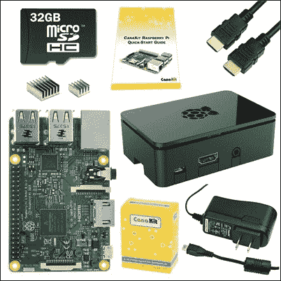

至于终极入门套件，以下来自 CanaKits 的图片显示了更多的功能。这是我们购买的工具包之一，只是为了让我们在未来有更多的项目选择：


# 组装树莓皮

把树莓皮 3 的基本操作是一个非常简单的过程。在初次使用之前，有几个项目需要组装。根据我们得到的包装，我们可能有一些额外的部件可以组装在一起。我们做的第一件事是在 Broadcom 芯片和 LAN 芯片上安装散热器：

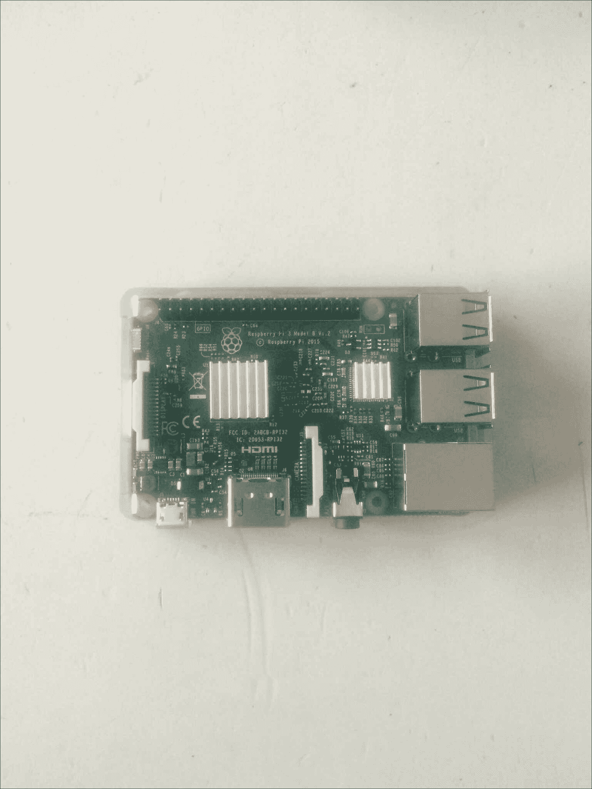

下一步，我们把董事会的情况下保护，因为我们不希望任何事情发生在我们的覆盆子皮。有不同的案例选择，根据我们得到的工具包，我们可能会得到不同的颜色或类型。例如，可能需要对其他人隐藏我们的 Pi。所以隐身有时是一种需要或要求，Pi 可以隐藏在物体中，或者放在一个普通的白色盒子里，看起来像是属于其他东西，比如电源适配器。在这样的情况下，我们可能想考虑使用 USB 电源来为我们的 Raspberry Pi 供电，以免引起从隐藏的 PI 到墙壁的电力电缆的注意。这对于真正的*电厂场景*来说非常理想。根据我们的测试，使用 USB 电源棒为 Pi 供电大约需要 1 周左右，但我们的里程数将根据电源棒的大小以及在这段时间内我们消耗 Pi 资源的程度而有所不同。

### 提示

有些人选择不使用散热器，或者想知道是否需要散热器。我们会一直使用散热器，特别是如果覆盆子 Pi 在一个案例中，并且/或者您计划对其进行超频（更多关于该主题的信息，请参见[第 2 章](2.html#page "Chapter 2.  Preparing for Battle")、*准备战斗*。这种芯片往往比前几代更热，你最不想做的就是把覆盆子皮加热到过热。

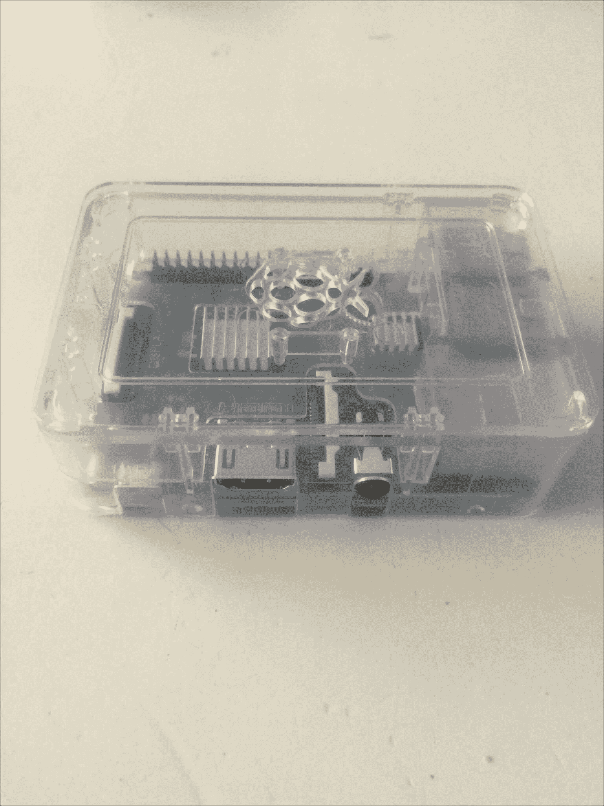

之后，Raspberry Pi 3 完全组装完毕，我们只需使用提供的电缆通过**高清多媒体接口**（**HDMI**）接口连接显示器，该电缆插入我们的 USB 鼠标和键盘，然后开始准备操作系统的 SD 卡。

# 安装 Kali Linux

在 Raspberry Pi 3 上安装 Kali Linux 的第一步是准备 microSD 卡。对于 Kali Linux，我们需要至少 8GB 的容量。为了获得最佳性能，我们将尝试确保 microSD 卡为 10 级。我们希望确保，通过四核 CPU 提供的所有新的电源和速度，我们不会因为 microSD 卡的速度慢而慢下来。这也有助于确保我们可能考虑的任何单独购买的 SD 卡都是兼容的或合适的，因为一些 SD 卡品牌和产品线比其他的工作得更好。查看此信息的一个很好的资源是 eLinux 网站（[http://elinux.org/RPi_SD_cards](http://elinux.org/RPi_SD_cards) ）。

### 提示

请务必查看 SD 协会网站，以更好地了解 SD 卡的课程速度以及在哪里可以找到它们。这适用于所有类型的 SD 卡，包括用于 Raspberry Pi 3 的 microSD 卡。

我们的 Raspberry Pi 附带的 SD 卡上可能已经有软件了。我们的 NOOBS 附带了 NOOBS，如果我们不确定要找哪个发行版，这很方便，因为我们可以在 NOOBS 的菜单中选择几个选项。因为我们知道我们想在 Raspberry Pi 上安装 Kali Linux，所以我们格式化了 microSD 卡，重新开始，并在其上安装了我们自己的操作系统。在将 microSD 卡吹走之前，最好将其现有内容复制到另一个地方。这样，我们就有了 NOOBS 的初始版本，以备将来需要使用。使用终极入门套件，我们收到了一个基于 USB 的 microSD 适配器。这是一个非常方便的适配器，因为大多数计算机上都没有 microSD 卡插槽，包括苹果设备。我们将 32 GB microSD 卡插入适配器，然后插入计算机；然后，我们准备摇滚。

下图显示了我们在实验室中使用的基于 USB 的 microSD 适配器：


获得正确的 Kali 图像对于正确操作非常重要。当我们浏览[时 https://www.kali.org/](https://www.kali.org/) 我们可以找到 Kali Linux 的所有可用选项。由于我们在 Raspberry Pi 上使用 ARM 处理器，因此需要安装 Raspberry Pi 特定的映像。该链接将把我们重定向到攻击性安全站点（[https://www.offensive-security.com/kali-linux-arm-img/](https://www.offensive-security.com/kali-linux-arm-img/) 用于定制卡利图像。我们应该注意，根据我们使用的硬件平台，有很多不同的 ARM 选项。因为我们使用的是 Raspberry Pi 3，所以我们将选择与该平台一起工作的版本。我们将确保注意到图像下载到的位置，这样以后就不必再搜索了。ARM 镜像是专门为 Raspberry Pi 硬件设计的，而不是完整的镜像。同样，让我们验证下载的图像是否正确。

### 提示

最好将下载文件的 SHA1 总和与网站上发布的 SHA1 总和进行比较。这样，您可以确保您的图像在安装之前没有被篡改。

现在我们已经下载了映像并准备好安装，我们需要将其写入 microSD 卡。我们如何做到这一点将取决于我们使用的操作系统。对于 Windows，我们可以使用`Win32DiskImager`。此实用程序可从以下 URL 获得：

[https://sourceforge.net/projects/win32diskimager/](https://sourceforge.net/projects/win32diskimager/)

下载并打开该实用程序后，我们就可以开始对 SD 卡进行成像了。我们首先需要解压卡利图像。我们可以使用像 7-Zip 这样的程序来解压图像。当我们解压文件时，会留下一个文件夹，在那里我们会找到`.img`文件。然后，我们需要在`Win32DiskImager`实用程序中选择图像文件，以及要继续图像的 microSD 卡的正确驱动器号。让我们点击**写**，让它完成它的工作。这个过程可能需要一些时间，所以要有耐心。完成后，按下**退出**按钮。

以下屏幕截图为`Win32DiskImager`实用程序的屏幕截图。这是一个非常好用的小实用程序：

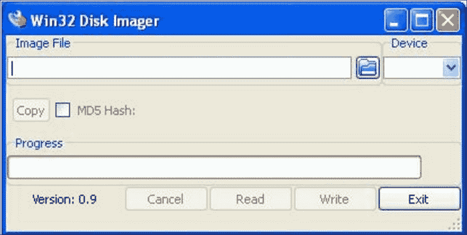

如果我们使用的是 Mac 或 Linux 机器，我们可以使用内置的`dd`实用程序来编写映像。

Mac 上的过程如下所示：

1.  我们将首先在 Mac 上打开一个终端窗口。
2.  我们需要解压缩图像。我们使用了一个名为`xz`的实用程序。我们也可以使用流行的工具，如**Keka**和**Unarchiver**：

    ```
    xz -d kali-2.1.2-rpi2.img.xz

    ```

3.  We then need to unmount the microSD card. To determine which device to refer to, we can use the `diskutil list` command. We can tell which disk is the correct one by either the size or by doing a preceding and following and seeing what disk has shown up:

    

    ### 提示

    此命令将允许我们查看安装在 Mac 上的所有磁盘。这是一个非常方便的工具，可以确保我们为`dd`选择了正确的目标。我们最不想做的就是覆盖错误的设备。

4.  一旦我们有了正确的设备，我们可以通过键入以下命令卸载 microSD 卡，其中指定的磁盘与我们的设备装载匹配：

    ```
    diskutil unmountDisk /dev/disk2

    ```

5.  Once we have unmounted the microSD drive, we can begin to copy the image over using `dd` . Let's type the following `dd` command to write the Kali Linux image to the microSD card. We need to make sure that we select the correct input file, as well as the correct output disk. This process can take some time, so we shouldn't feel as though it is not doing anything. On our computer, it took just over 10 minutes, but that time may vary. If we get impatient, we can press *Ctrl* + *T* to see the how much of the copy has completed:

    ```
    sudo dd if=kali-2.1.2-rpi2.img of=/dev/disk2 bs=1m

    ```

    ### 提示

    确保当前工作目录包含 Kali Linux 映像。如果您只需指定文件，则在`dd`命令中会更容易。

    下面的屏幕截图显示了执行这些命令的机器。我们可以看到，一路上我们按了几次*Ctrl*+*T*以确保`dd`仍在工作：

    

6.  Finally, we'll cleanly unmount the microSD card. We can use the following command:

    ```
    diskutil eject /dev/disk2

    ```

    我们的图像应该都设置好了，我们已经准备好将 microSD 卡安装到我们的 Raspberry Pi 中：

    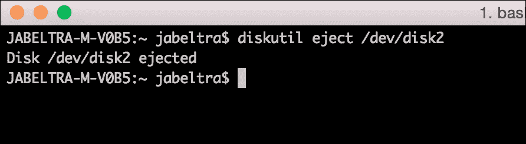

    一旦我们从计算机上卸下基于 USB 的 microSD 适配器，我们将取出新安装的 microSD 卡并放入 Pi 中。然后我们可以接通电源，看着它启动。

### 注

Raspberry Pi 3 上的 microSD 插槽不像 Raspberry Pi 2 那样是弹簧加载的。因此，插入 microSD 卡时要小心。当你没有那种被锁定的感觉时，你可能会感到奇怪——只是在把它推入插槽时不要过度。事实上，CanaKit 联系我们确认了这一变化，所以我们并没有破坏我们的树莓皮试着让 microSD 卡点击到位。

Raspberry Pi 3 的启动时间非常快，因为与以前的版本相比，它在硬件上有很好的提升。一旦 Kali Linux 启动，它应该在 GUI 中的登录提示符处。在这里，我们可以使用以下凭据首次登录：

用户：root

密码：toor


我们将点击**登录**，输入我们的默认凭证，现在我们应该登录到 Kali Linux，准备开始。这就是乐趣的开始！

# 结合 Kali Linux 和树莓 Pi

我们知道，深入到 Kali Linux 界面并开始运行一些很棒的安全工具是很有诱惑力的。但首先，有一些重要的家务事要处理。这些项目如下：

*   更改我们的密码。
*   更新 Kali Linux。
*   调整分区大小以使用该大 microSD 上的所有可用空间（在本例中为 32 GB）。这将大大减少在 Raspberry Pi 上使用 Kali Linux 时遇到常见问题的机会。

我们名单上的第一项是更改密码。Kali Linux 附带相同的默认凭据，因此我们希望确保除了我们之外没有人可以登录我们的邮箱。如果我们的渗透测试箱被另一方渗透，会有多尴尬。想想那里的讽刺吧！要开始这个过程，我们需要打开一个终端并输入`passwd`命令。我们将被要求输入两次密码以确保其正确性：


另一件非常重要的事情是尽快更新 Kali。这将确保我们拥有最新和最好的代码和应用程序版本。更新 Kali 的过程非常简单。我们只需在 CLI 中键入以下命令。

升级将安装所安装软件包的所有最新版本。`dist-upgrade`命令将安装此 plus，并使用新版本的软件包智能地更新所有依赖项。`dist-upgrade`命令当然不是必需的，但我们绝对推荐它：

```
apt-get update

apt-get upgrade

apt-get dist-upgrade

```

在这之后，我们重新启动 Raspberry Pi 3，当它回来时，我们应该有一个完全更新的操作系统，准备好使用一些笔测试工具。

接下来，我们要调整分区大小，以使用 32GB microSD 卡上的所有可用空间。我们将展示两种不同的方法。第一种方法是通过 CLI。第二个将利用 GUI 中的 gparted。

从 CLI 开始，如果我们运行`df -h `命令，下图显示我们没有接近 microSD 卡大小的分区。目前仅为**6.7G**：


扩展这个分区的过程包括两个步骤。以下步骤将帮助我们解锁 microSD 卡的全部可用大小。为日志文件、命令输出或*tcpdumps*留出额外空间非常重要。

我们需要确保非常小心地遵循这些步骤，因为我们不想擦除根分区。此过程使用`fdisk`、`parted`和`resize2fs`命令。以下是我们使用的流程：

1.  Let's check enter the disk utility, where we can view where the partitions currently stand. Here, we will want to run the `fdisk` command to check our current partitions:

    ```
    fdisk /dev/mmcblk0

    ```

    这将使我们进入`fdisk`实用程序，以便我们可以计划对分区表的更改。

2.  Now we'll obtain partition information. Once at the **Command (m for help)** prompt, we'll enter `p` . This will dump out the partition information for our microSD card:

    

3.  现在让我们删除当前分区。我们将通过键入`q`退出`fdisk`实用程序。现在我们想进入 parted 实用程序，并指定要修改的 microSD 卡。设备信息是从上一步收集的。我们可以通过键入以下命令来完成此操作：

    ```
    parted /dev/mmcblk0

    ```

4.  这将带我们进入分区表实用程序。一旦出现`(parted)`提示，我们将希望将装置更改为`chs`，用于气缸、缸盖和扇区。这将允许我们获得调整大小的正确数字。为此，让我们键入`chs`：

    ```
    (parted) unit chs

    ```

5.  一旦我们设置了正确的单元，我们希望在 parted 中以正确的单元打印分区信息。这将为我们提供正确的大小，允许我们调整分区大小。为此，我们只需在提示符处键入`print`：

    ```
    (parted) print

    ```

6.  现在，在这个输出中，我们要记下或记住 microSD 卡的总大小。这可以在以`Disk`开头的行中找到。在我们的示例中，它如下：

    ```
    Disk /dev/mmcblk0:  3822,237,62

    ```

7.  一旦我们在`chs`单元中得到 microSD 的总大小，我们就可以删除第二个分区。让我们在这里特别注意，因为我们不想删除根分区。在提示下，我们将要键入`rm 2`，其中 2 是分区号：

    ```
     (parted) rm 2

    ```

8.  系统将提示我们一个错误，并要求我们选择`Ignore`或`Cancel`。让我们输入`i`忽略：

    ```
    Ignore/Cancel? i

    ```

9.  我们现在已经删除了不需要的分区。我们可以通过再次打印分区信息来确认这一点，它将显示只有一个存在：

    ```
    (parted) print

    ```

10.  At this point, we can see that we only have that one partition and are ready to create the extended partition that uses all of the available space. The following figure is a screenshot of all that we talked about in steps 3-9:

    

11.  现在，让我们创建新分区。我们将再次使用`parted`，但这次是创建分区。首先，让我们通过输入`parted`命令来启动该工具。进入`parted`后，我们可以制作新的更大的分区。这就是我们在上一节的`parted print`命令中看到和记录的数字发挥作用的地方。在提示下，我们将使用`mkpart`来创建分区，第一个数字比第一个分区上的结束扇区号高一个数字。第二个数字是我们在同一输出中看到的磁盘号大小。对于 microSD 卡分区，我们运行以下命令：

    ```
    (parted) mkpart primary 7,199,9 3822,237,62

    ```

12.  Once that command has been entered, we will get a warning; we can hit `i` to ignore it. After that, we want to verify that our partition has been created. We can use the `print` command under `parted` to accomplish this. We should see the second entry, which shows the correct usable space for our microSD card. We can now quit out of `parted` . The following screenshot shows steps 11 and 12 of our example:

    

13.  Let's expand the filesystem. Now that we have all this space, we want to make sure that the filesystem can take advantage of it. We can accomplish this by using the `resize2fs` command. We will run this against that newly formed partition. The following command results in the following screenshot:

    ```
    resize2fs /dev/mmcblk0p2

    ```

    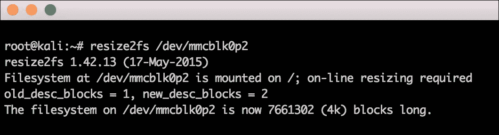

14.  Finally, we'll need to perform some verification. We can now verify that everything worked as planned if you run that same `df -h` command we did initially. We should see that the size closely matches our microSD card's advertised usable space:

    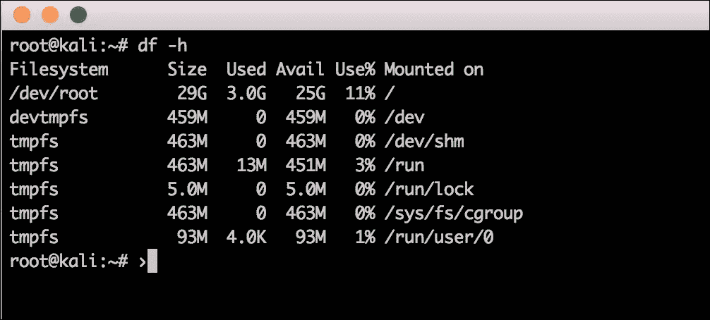

现在我们已经看到了增加分区大小的 CLI 命令，让我们看看在 Kali Linux 中使用 GUI 界面的另一种方法。这些步骤将贯穿整个过程：

1.  The tool we use is `gparted` , which is installed using the following command:

    ```
    apt-get install gparted

    ```

    

2.  Once we have installed it, we can launch it via command line (via X over SSH) using `gparted` . Once the GUI has started, we can click on the **Resize/Move** button:

    

3.  From here, we will click on the edge of the **fat16** partition and drag it over to include all of the unallocated space:

    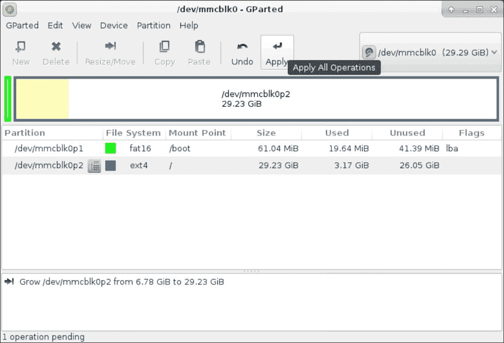

4.  Now we will click on **Apply** and verify that we indeed want this operation:

    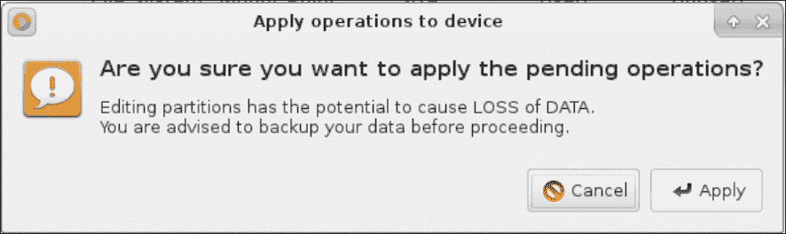

5.  It will take some time, but it will show us the progress of our repartitioning:

    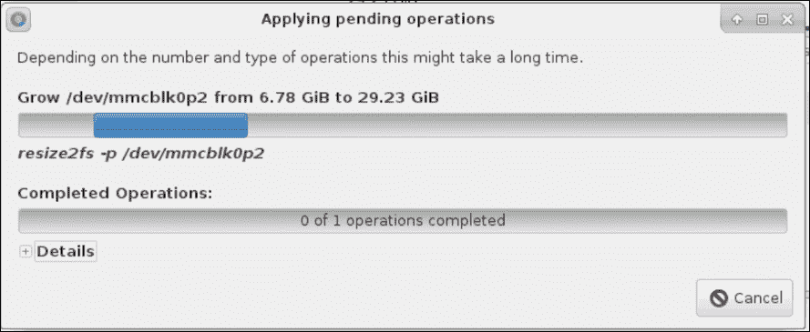

6.  Once it's completed, we can now see that the **fat16** partition that Kali Linux resides in now has direct access to the entire SD card:

    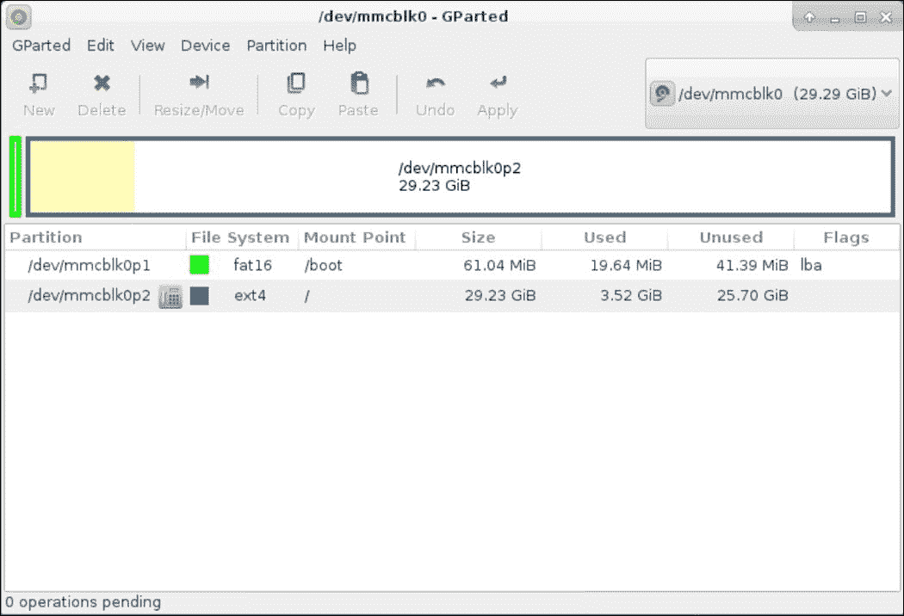

7.  虽然使用这个分区消耗整个物理驱动器是有用的，但我们可能会遇到需要使用多个分区的情况。我们当然可以通过`gparted`调整我们的方法来实现这一点。

# 克隆树莓皮 SD 卡

我们建议在为 Kali Linux 安装格式化 Raspberry Pi 之前，先备份 Raspberry Pi 附带的原始系统软件。大多数 Raspberry Pi microSD 卡都带有一种 NOOBS 形式，其中包含各种操作系统选项，您可以从中选择我们的主操作系统。希望我们早些时候采纳了自己的建议，将 microSD 卡上的默认文件复制到另一个位置。如果是这样，我们可以将它们复制回 SD 卡。但是，如果我们没有复制这些文件，我们可以根据需要从以下 URL 再次下载 NOOBS 软件：

[https://www.raspberrypi.org/downloads/](https://www.raspberrypi.org/downloads/)

克隆的最佳用例之一是为我们的 Raspberry Pi 创建一个 Kali Linux 的*黄金*映像。一旦我们将该图像全部设置好，我们就可以克隆该图像以在其他 microSD 卡上使用。在我们的示例中，我们将黄金图像复制到名为`raspberrypi.img`的文件中。

SD 卡的克隆过程非常简单。许多 Windows 实用程序，如本章前面介绍的 Win32 Disk Imager，将制作 SD 卡的精确副本。在 Mac 电脑上，我们可以打开命令提示符来识别我们的 SD 卡，然后键入`diskutil list`命令：


在前面的屏幕截图中，我们的 microSD 卡是`/dev/disk2`。在另一个系统上，我们的 microSD 卡可能与本例中的不同，因此我们需要确保验证每个设置的命名。我们可以通过创建磁盘映像并将其保存到桌面来克隆卡。我们将发出以下命令来完成此任务：

```
sudo dd if=/dev/disk2 of=raspberrypi.img

```

以下屏幕截图显示了在执行命令之前，我们必须如何输入密码：

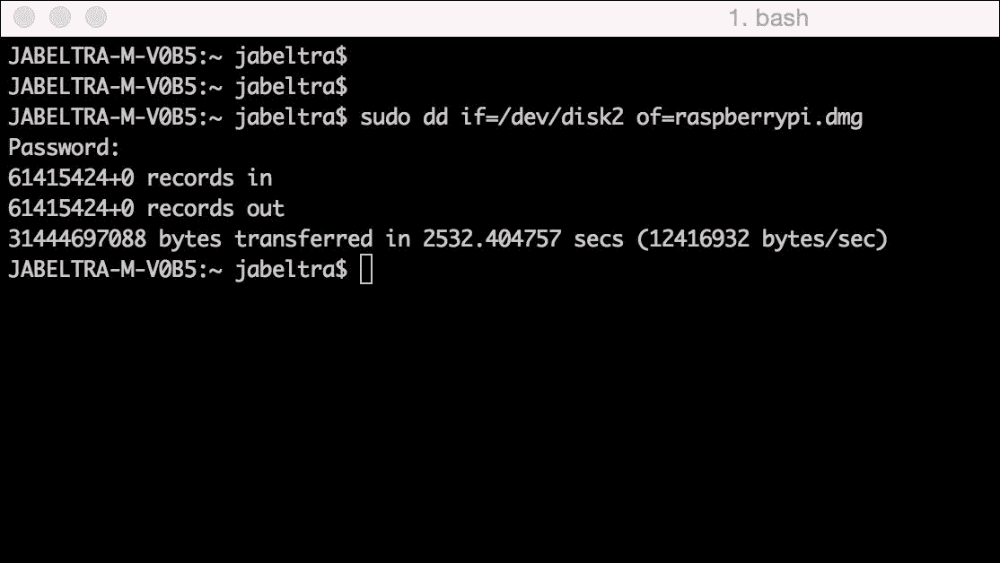

克隆 SD 卡可能需要 30 分钟或更长时间。创建图像的速度取决于 microSD 卡的大小和速度、卡上的数据量、复制计算机的速度以及我们指定的块大小。换句话说，我们需要耐心，让它照搬。

### 提示

如果未包含`sudo`逗号，则将映像写入 OS X 系统上的 microSD 卡时，可能会遇到权限拒绝错误。

# 避免常见问题

下面列出了我们遇到或听到其他人遇到的一些常见问题：

*   **电源问题**：我们（同样，在第一版中）尝试使用具有 5V 微型 USB 电源的小型 USB 钥匙链电源适配器，以使我们的系统非常便携。有时，这些都起作用了，有时，它们只是显示 Raspberry Pi 是通电的，但系统没有启动。如果不先进行测试就很难确定，因为有时某些电源适配器无法与特定配置一起工作。大多数覆盆子 Pi 板的侧面都有指示灯，电源指示灯为红色，正常工作时指示灯为黄色。我们可以查看每个型号的制造商网站了解更多详细信息。如果将 USB 电源用于隐身，则 USB 电源可能是一个非常重要的功能，因此我们需要确保在渗透测试实施之前对其进行测试。
*   **MicroSD 读卡问题**：我们听说有些人的 MicroSD 读卡器在将 SD 卡插入他们的系统后无法识别 SD 卡。一些 Mac 用户声称他们必须*吹进 SD 读卡器孔*，而其他人则发现他们必须使用外部读卡器才能让系统识别 microSD 卡。我们建议尝试其他系统。如果我们购买 microSD 转换器，我们应确保卖方已将其列为与 Raspberry Pi microSD 兼容。外部 microSD 阅读器的价格不应超过 10 美元。如果我们在 microSD 卡上安装映像后发现您的 Raspberry Pi 不工作，我们可以检查 microSD 卡是否正确插入。我们需要确保卡完全插入，因为 Pi 3 上没有弹簧加载机制。如果它看起来没有正确滑入，microSD 卡可能是颠倒的，或者是错误类型的卡。如果我们正确插入 microSD 卡，并且系统通电后什么也没有发生，我们可以验证是否使用了正确的电源。另一个问题可能是映像安装不正确。我们发现，有些人在`dd`过程中让电脑进入睡眠模式，只导致部分 Kali Linux 映像被复制。在安装之前，我们应该始终验证映像是否被正确复制。我们还应该检查我们下载的图像是否真实。攻击性安全包括**SHA1SUM**，我们可以用它来验证我们的图像是否被篡改。我们遇到的另一个问题是解压`tar`文件的方式。我们需要确保使用有效的方法，否则图像文件可能会损坏。如果我们注意到映像正在引导，我们可以在命令提示符变为可用之前观察引导序列中的错误消息。
*   **权限被拒绝**：许多 Mac 用户发现他们没有运行`dd`命令的适当权限。这个许可问题可能是由一些不同的事情引起的。首先，让我们确保 microSD 卡或 SD 适配器没有物理设置的保护模式。接下来，我们应该验证读取器和适配器是否正常工作。有报道称，MAC 用户不得不*吹 SD 阅读器*以清除灰尘并使其正常工作。我们还应该对前面警告中所述的整个语句使用`sudo`命令。如果错误仍然存在，我们可以尝试外部 microSD 读取器，因为当前的 microSD 读取器可能允许格式化，但 dd 命令有问题。
*   **在 GUI 中找不到 Kali Linux 程序**：我们发现 Raspberry Pi 的某些版本的 Kali Linux ARM 映像可以正常启动，启动后启动 GUI，但在 GUI 加载完成后不会在应用程序下拉菜单中显示 Kali Linux 工具。这是一个与前面解释的显示问题类似的问题，这意味着可以通过执行本书中解释的`apt-get`更新和`apt-get upgrade`步骤来修复该问题，这些步骤告诉我们第一次登录 GUI 后要做什么。更新和升级过程应安装和升级导致此问题的任何丢失的文件或较旧的驱动程序。我们曾经发现，经过更新和升级过程并重新启动系统后，Kali Linux 软件出现在应用程序菜单下。
*   **无法提取.xz 文件**：要提取这种类型的文件，我们需要有一个能够理解`.xy`文件的提取或解压缩程序。OSX 本应该能够在本地实现这一点，但我们没有成功，不得不下载一个程序来实现这一点。
*   **无法启动到 Kali**：当我们使用`dd`或`Win32DiskImager`时，我们应该选择我们从下载的文件中提取的图像，而不是`.xy`文件。
*   **使用 dd 复制图像需要很长时间**：我们应该使用`bs=XX`命令指定块大小，其中 XX 是大小，以避免这些较长的等待时间。找到正确的块大小可能很棘手，但我们最初使用了`bs=1m`，没有问题。使用指定的块大小的时间差为 10 分钟，而不指定块大小的时间差为 193 分钟。

# 总结

在本章中，我们介绍了各种可用的硬件选项以及选择 Raspberry Pi 3 的原因。我们讨论了可用的各种工具包、购买工具包的好处及其差异。我们还讨论了各种软件平台，以及为什么选择 Kali Linux 作为我们的软件平台。

接下来，我们介绍了开始使用 Kali Linux 和 Raspberry Pi 3 的方法。这包括准备好硬件，在 microSD 卡上安装软件，以及设置 Kali Linux 以确保其安全性的基础知识。此时，我们应该在 Raspberry Pi 3 上安装一个功能齐全、最新的 Kali Linux，并准备好开始使用这些工具，将这台计算机变成一个强大的笔测试平台。

在下一章中，我们将开始深入研究一些基本工具，这些工具将允许我们访问并使用树莓 Pi 3 作为笔测试盒。这将包括几种方法，我们可以使用远程和安全地访问 Raspberry Pi 3，配置各种类型的接口，以及设置命令和控制服务器。