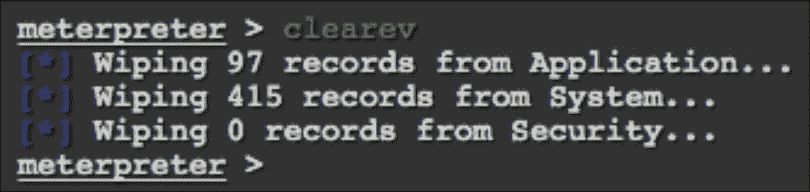
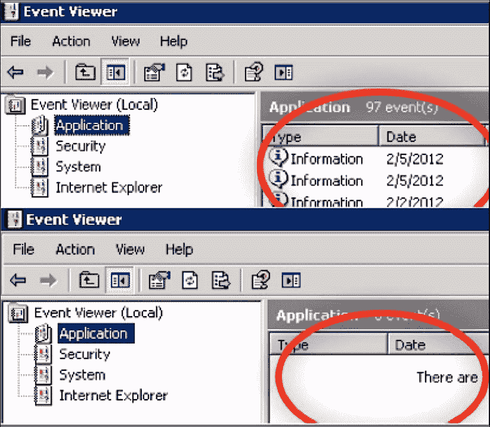
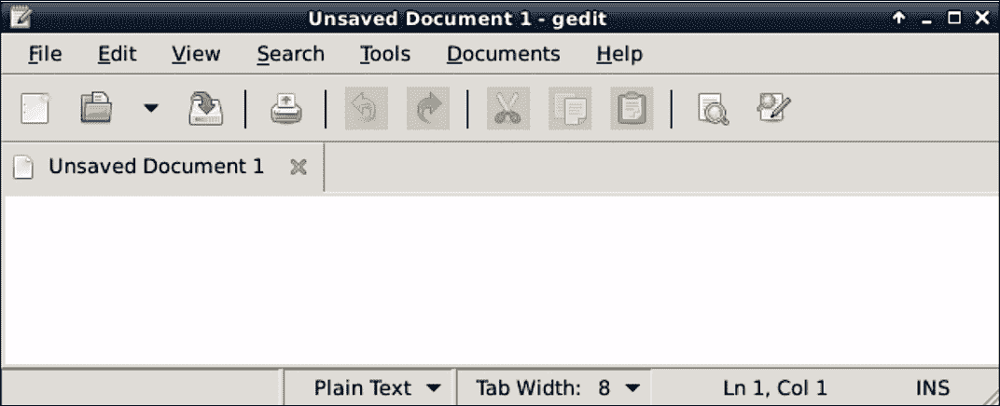
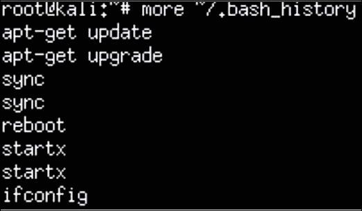
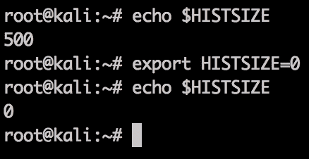
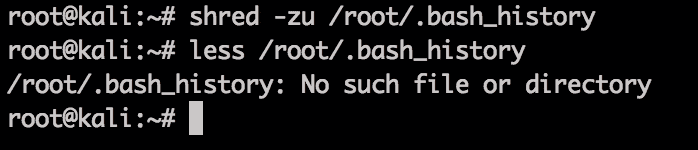
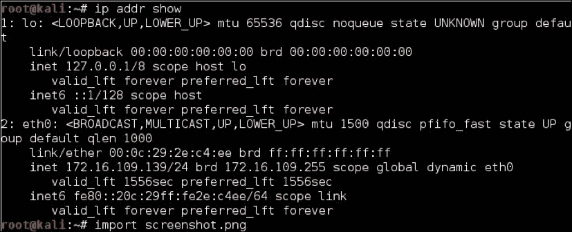
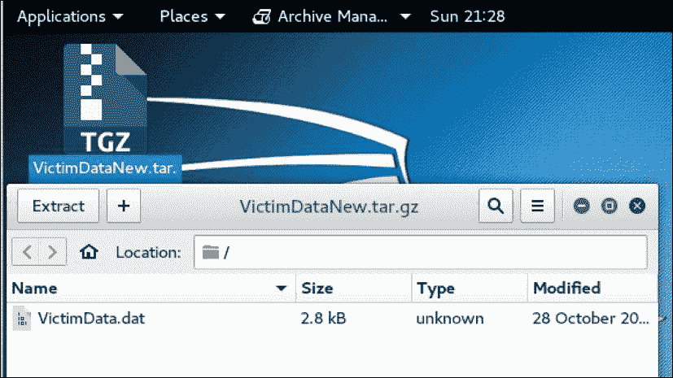
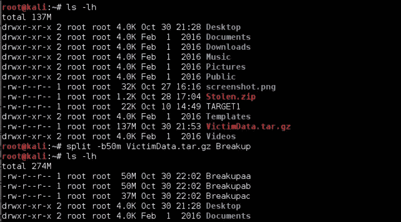

# 六、完成攻击——报告并撤退

现在我们已经在[第 5 章](5.html#ch05 "Chapter 5.  Taking Action - Intrude and Exploit")*采取行动-入侵和利用*中找到并利用了我们的目标，是时候进入渗透测试杀伤链的最后阶段了，即**报告**和**撤回**。有些人可能会争辩这一步骤的有效性和重要性，因为大部分的重击努力和影响是在[第 5 章](5.html#ch05 "Chapter 5.  Taking Action - Intrude and Exploit")中完成的，*采取行动-入侵和利用*，但没有适当清理和覆盖我们的足迹，我们可以留下一些面包屑，告诉别人我们去了哪里，我们做了什么。这肯定不仅会损害我们作为渗透测试人员的声誉，还会危及任务。报告本身就是我们的客户认为我们的产品。因此，毫不奇怪，我们应该非常小心地确保他们组织良好、信息丰富、准确，最重要的是，满足客户的目标。我们还应确保谨慎处理这一阶段。目标环境的用户和操作员的工作和声誉受到威胁。

本章涵盖以下主题：

*   掩盖我们的踪迹
*   掩盖我们的网络足迹
*   编写报告

# 掩盖我们的足迹

渗透测试人员和罪犯往往失败的关键任务之一是在他们破坏系统后进行清理。法医证据可以是任何东西，从数字网络足迹（IP 地址、在线路上看到的网络流量类型等）到受损端点上的日志。也有证据表明使用了一些工具，例如使用树莓 Pi 进行恶意操作时使用的工具。一个例子是在 Raspberry Pi 上运行`more ~/.bash_history`，以查看所使用命令的整个历史记录。

对于 RasBuri PI 黑客来说，好消息是他们不必担心 ROM 之类的存储元素，因为只考虑 MICROSD 卡的存储。这意味着攻击者只需重新刷新 microSD 卡即可擦除使用树莓 Pi 的证据。在做这件事之前，让我们通过清理过程，从受损的系统开始，到重新制作树莓 Pi 的最后一步。

### 注

您可以使用我们在[第 1 章](1.html#ch01 "Chapter 1. Choosing a Pen Test Platform")*中介绍的 SD 格式工具*选择渗透测试平台。您还可以使用[第 1 章](1.html#ch01 "Chapter 1. Choosing a Pen Test Platform")*选择渗透测试平台*中所述的步骤，在执行渗透测试之前备份您的图像，并将您的树莓 Pi 重置回该图像，以隐藏其在重新成像之前的使用方式。

## 擦拭原木

我们应该执行的第一步是从我们访问的受损系统中删除任何事件日志。对于 Windows 系统，我们可以使用**Metasploit**中名为**Clearev**的工具，以自动化方式为我们实现这一点。Clearev 旨在访问 Windows 系统并清除日志。当我们清理日志时，过于热心的管理员可能会注意到这些更改。但是，大多数管理员永远不会注意到这些更改。此外，由于日志被擦除，最糟糕的情况是管理员可能会发现他们的系统已被破坏，但包含我们访问信息的日志将被删除。

克利里夫配备了 Metasploit 兵工厂。一旦我们使用**流量计**突破 Windows 系统，要使用`clearev`，请键入`meterpreter > clearev`。没有进一步的配置，这意味着`clearev`只是在执行时擦除日志。下面的屏幕截图显示了它的外观：



以下是在 Windows 系统上擦除日志之前的日志示例：



从受损的 Windows 系统中擦除日志的另一种方法是安装 Windows 日志清理程序。有很多选项可供下载，例如[中的**ClearLogs**http://ntsecurity.nu/toolbox/clearlogs/](http://ntsecurity.nu/toolbox/clearlogs/) 。像这样的程序使用起来很简单；一旦完成渗透测试，我们就可以在目标上安装并运行它。我们也可以使用`C:\ del %WINDR%\* .log /a/s/q/f`命令手动删除日志。此命令使用`/a`引导所有日志，包括子文件夹`/s`，禁用任何查询，因此我们不会得到提示，`/f`强制执行此操作。

### 提示

无论使用哪种程序，请确保在删除日志文件后删除可执行文件，以便在将来的法医调查中不会识别该文件。

对于 Linux 系统，我们需要访问`/var/log`文件夹以查找日志文件。一旦我们有权访问日志文件，我们就可以简单地打开它们并删除所有条目。下面的屏幕截图显示了 Raspberry Pi 的`log`文件夹示例：


我们可以使用 remove 命令`rm`删除文件，例如键入`rm FILE.txt`，或者删除整个文件夹；然而，这并不像将现有文件从内存中清除一样隐蔽。另一个选项在**Bash**中。我们可以简单地键入`>/path/to/file`来清空文件的内容，而不必删除它。这种方法有一些隐蔽的好处。

Kali Linux 没有基于 GUI 的文本编辑器，因此我们可以安装一个易于使用的工具`gedit`。我们将使用`apt-get install gedit`下载它。一旦安装，我们可以在应用程序下拉列表中找到`gedit`，或者在终端窗口中键入`gedit`。正如我们从下面的屏幕截图中看到的，它看起来像许多常见的文本文件编辑器。点击**文件**并从`/var/log`文件夹中选择文件进行修改：



我们还需要删除命令历史记录，因为 bashshell 保存了最后 500 条命令。可通过键入`more ~/.bash_history`命令访问此法医证据。下面的屏幕截图显示了我们最近在我的 Raspberry Pi 上运行的数百个命令中的第一个：



要验证历史文件中存储的命令数，我们可以键入`echo $HISTSIZE`命令。要删除此历史记录，请键入`export HISTSIZE=0`。从这一点开始，shell 将不会存储任何命令历史记录，也就是说，如果按向上箭头键，它将不会显示最后一个命令。

### 注

这些命令也可以放在 Linux 主机上的`.bashrc`文件中。

下面的屏幕截图显示，我们已验证已存储最后 500 条命令。它还显示了我们删除它们后发生的情况：



### 注

最好的做法是在受损系统上使用任何命令之前设置此命令，以便事先不存储任何内容。一旦`export HISTSIZE=0`命令设置为清除您的历史记录，您就可以注销并重新登录。一旦你完成渗透测试，如果你对被调查有任何顾虑，你也应该在你的 C&C 服务器上这样做。

在 Linux 系统上删除历史文件的一种更积极、更快的方法是使用`shred -zu /root/.bash_history`命令将其撕碎。此命令用零覆盖历史文件，然后删除日志文件。我们可以使用`less /root/.bash_history`命令来验证这一点，以查看您的历史记录文件中是否还有任何内容，如以下屏幕截图所示：



# 掩盖我们的网络足迹

匿名性是执行攻击时的一个关键因素，除非我们不介意有人能够追踪到我们的位置并放弃我们的位置。正因为如此，我们需要一种方法来隐藏或掩盖我们来自哪里。如果我们真的想确保不会留下面包屑的痕迹，那么这种方法对于代理或代理组来说是完美的。使用代理时，攻击源看起来好像来自代理，而不是真正的源。

将多个代理分层有助于提供洋葱效应，其中每一层都隐藏了另一层，这使得在任何法医调查期间都很难确定真正的来源。

代理有各种类型和风格。有专门隐藏我们在线来源的网站，通过快速的谷歌搜索，我们可以看到一些最流行的网站，如**hide.me**、**Hidestar**、**NewIPNow**、**ProxySite**甚至**匿名**。以下是 NewIPNow 网站的截图：


### 注

代理的管理员可以查看所有流量，并识别通过其代理进行通信的目标和受害者。强烈建议您在使用任何代理之前对其进行研究，因为有些代理可能会使用未经您许可而捕获的信息。这包括向当局提供法医证据或出售您的敏感信息。

## 使用 ProxyChains

现在，如果基于 web 的代理不是我们想要的，我们可以使用 Raspberry Pi 作为代理服务器，使用**ProxyChains**应用程序。ProxyChains 是非常容易设置和开始使用的应用程序。首先，我们需要安装应用程序。这可以通过在 CLI 中运行以下命令来实现：

```
root@kali:~# apt-get install proxychains

```

一旦安装，我们只需要编辑位于`/etc/proxychains.conf`的 ProxyChains 配置，并将其放入我们想要使用的代理服务器中：


寻找公共代理有很多选择。我们当然应该谨慎使用，因为一些代理会在未经我们许可的情况下使用我们的数据，所以我们一定要在使用数据之前进行研究。

一旦我们选择了一个并更新了我们的`proxychains.conf`文件，我们就可以测试它了。要使用 ProxyChains，我们只需要遵循以下语法：

```
proxychains <command you want tunneled and proxied> <opt args>

```

基于该语法，要运行`nmap`扫描，我们将使用以下命令：

```
root@kali:~# proxychains nmap 192.168.245.0/24

ProxyChains-3.1 (http://proxychains.sf.net)

Starting Nmap 7.25BETA1 ( https://nmap.org )

```

## 清除树莓皮上的数据

现在，我们已经在网络端和端点上完成了跟踪，剩下的只是我们留下的任何设备。这包括我们的树莓皮。要将 Raspberry Pi 重置为出厂默认值，我们可以参考[第 1 章](1.html#ch01 "Chapter 1. Choosing a Pen Test Platform")*中的安装 Kali Linux，选择渗透测试平台*，重新安装 Kali 或 NOOBS 软件。这将允许我们再次运行干净的映像。如果我们在[第一章](1.html#ch01 "Chapter 1. Choosing a Pen Test Platform")*选择钢渗透测试平台*中克隆了您的*金色*图像，我们可以用该图像重新塑造我们的树莓皮。

如果我们没有重新映像或重新安装 Raspberry Pi 的选项，我们可以选择只销毁硬件。要销毁的最重要的一块是 microSD 卡（见下图），因为它包含了我们在 Pi 上所做的一切。但是，我们可能想考虑销毁您可能使用过的任何接口（USB Wi-Fi、以太网或蓝牙适配器），因为这些物理 MAC 地址中的任何一个可能已经被记录在目标网络上，因此可以证明设备在那里。如果我们使用了机载接口，我们甚至可能需要摧毁树莓 Pi 本身。


如果覆盆子 Pi 位于我们无法收回或摧毁它的位置，我们唯一的选择就是远程破坏它，这样我们就可以删除我们攻击目标的任何线索。为此，我们可以在 Kali 中使用`rm`命令。`rm`命令用于从操作系统中删除文件等。作为一个很酷的奖励，`rm`有一些有趣的标志，我们可以利用这些标志来发挥我们的优势。这些标志包括`-r`和`-f`标志。`-r`标志表示递归执行操作，因此该目录及以下目录中的所有内容都将被删除，`-f`标志强制删除，而无需询问。因此，从任何目录运行命令`rm -fr *`将删除该目录内的所有内容以及该目录下的任何内容。这个命令的有趣之处在于我们是否从`/`或目录结构的顶部运行它。由于该命令将删除该目录及以下目录中的所有内容，因此从顶层运行该命令将删除所有文件，从而使该框无法使用。任何数据取证人员都会告诉我们，数据仍然存在，只是没有被操作系统使用。所以，我们真的需要覆盖这些数据。我们可以使用`dd`命令来实现这一点。我们在[第一章](1.html#ch01 "Chapter 1. Choosing a Pen Test Platform")中设置树莓圆周率时使用`dd`，*选择钢渗透测试平台*。我们可以简单地使用以下方法来完成工作：

```
dd if=/dev/urandom of=/dev/sda1 (where sda1 is your microSD card)

```

在这个命令中，我们基本上是将随机字符写入 microSD 卡。或者，我们也可以使用`mkfs.ext4`命令重新格式化整个 microSD 卡：

```
mkfs.ext4 /dev/sda1 ( where sda1 is your microSD card )

```

这一切都很有帮助，但如果我们不想销毁设备，直到我们绝对需要-如果我们希望能够发送远程销毁信号？Kali Linux 现在安装了一个**LUKS Nuke**补丁。LUKS 允许一个统一的密钥进入容器，当与**逻辑卷管理器**（**LVM**相结合时，可以创建一个需要密码的加密容器来启动引导过程。使用 Nuke 选项时，如果我们在启动时指定 Nuke 密码而不是普通的密码短语，则系统上的所有密钥都将被删除，从而使数据无法访问。

### 注

以下是一些关于如何实现这一点的链接，以及有关其工作原理的更多详细信息：

[https://www.kali.org/tutorials/nuke-kali-linux-luks/](https://www.kali.org/tutorials/nuke-kali-linux-luks/)

[http://www.zdnet.com/article/developers-mull-adding-data-nuke-to-kali-linux/](http://www.zdnet.com/article/developers-mull-adding-data-nuke-to-kali-linux/)

# 开发报告

渗透测试服务最重要的部分是交付给客户的产品的质量。我们已经看到，非常有才华的测试人员完全根据客户对最终报告的反应，将业务输给了低质量但更专业的服务提供商。这是因为信息的传递方式考虑了目标受众、他们对坏消息的敏感程度以及提供的详细程度。为潜在客户定制信息的最佳方式是利用标准化报告的组合，以及想象他们将如何阅读材料。如果某个人对这项服务和其他服务的预算有影响，我们将其称为潜在的弱点可能是一个坏主意。对政治和动机的敏感性至关重要。根据调查结果及其呈现方式，报告可能会导致人们被解雇。我们需要确保员工影响事实上是合理的，并了解客户组织如何看待这些报告。

也就是说，我们需要在里面放些东西，对吗？不同的客户和测试目标将决定特定渗透测试报告或简报中涵盖的深度和细节，但大部分腿部工作将在早期阶段完成。我们在从目标网络撤退时清除的相同日志和线索可用于提供客户希望在最终简报中看到的大部分数据。

编制报告不仅仅是记录我们的发现。我们需要捕获整个场景，包括渗透测试之前的环境、预先提供的信息、关于当前条件的假设、提供服务时使用的步骤以及每个步骤的结果。我们可能会发现管理员会在完成报告之前修补漏洞，因此记录每个步骤的时间和日期至关重要。我们可以通过使用可信的来源，如[上的**开放式 Web 应用程序安全项目**（**OWASP**测试指南）了解更多关于开发报告的最佳实践 https://www.owasp.org/index.php/Testing_Guide_Introduction](https://www.owasp.org/index.php/Testing_Guide_Introduction) 、**渗透测试执行标准**（**PTES**），或参考更先进的渗透测试指南，如 Packt Publishing 自己的。

让我们看看一些可以用来帮助构建专业报告的工具。

## 采集和关联测试数据

在渗透测试过程中，我们可能会收集到大量信息。请记住，我们需要能够识别好的和坏的，适当的保护和他们的防御漏洞。我们使用的工具套件，如 Metasploit、**Maltego**、**Ettercap**、**BeEF**、**SET**和**Wireshark**都会生成大量记录或捕获供我们使用。我们的 Raspberry Pi 可以保存这些工具的关键数据，但对于严重的渗透测试，数据需要进行融合、消除重复、组织，然后在更像工作站的机器上编译和编辑，无论是 C&C 机器还是其他机器。这并不是说**vim**、**nano**或 Pi 上的其他本地文本编辑器无法完成这项工作，但考虑到我们将 Pi 用作我们的内部人员，对随时可能被发现和丢失的资产进行这一阶段的风险可能太高。

虽然这超出了本书的范围，但值得阅读更多关于利用 XML 或其他开放格式共享、导入和导出信息的信息收集工具的内容。Maltego 和 Metasploit 提供了消化或发布 XML 文件的能力，以便与软件包集成，如**Dradis**（[http://dradisframework.org/](http://dradisframework.org/) 或合作工具，如**Kvasir**（[https://github.com/KvasirSecurity/Kvasir](https://github.com/KvasirSecurity/Kvasir) 。这两种工具都可以帮助安排和理解信息，甚至有助于数据的呈现。作为额外的好处，它们还允许我们在一个团队中进行更复杂的测试，这样我们都可以在测试过程中访问统一的数据库。

尽管存在潜在的集成点，但仍然需要回传其他数据或捕获操作，以便为我们的报告添加颜色，因此，让我们看看如何捕获有用的屏幕截图，并将数据安全可靠地传输回我们的 C&C 节点。

## 制作截图

Kali Linux ARM 在保持操作系统精简方面的功能有限。使用标准的 Kali 工具，即使捕获屏幕截图也是一个乏味的过程。让我们看看一个基于命令行和 GUI 的工具，它可以简化这个过程。

### 使用 ImageMagick

**ImageMagick**是一个我们可以从终端下载并执行的工具，用于启动屏幕截图。要下载它，我们将键入`sudo apt-get install imagemagick`命令。安装后，我们可以键入`import screenshot.png`命令启动屏幕截图。ImageMagick 会将鼠标图标更改为一个框，表示它已准备好捕获某些内容。然后，我们可以点击想要捕获的屏幕部分，屏幕截图将保存为`/root`文件夹中的`.png`文件。如果我们点击一个窗口，ImageMagick 将只捕获该特定窗口。我们可以键入`eog /root/screenshot.png`命令来查看我们的屏幕截图：



要在引入延迟的同时捕获整个 Raspberry Pi VNC 会话屏幕，我们可以键入`sleep 5s; import -window root screenshot.png`命令。这对于包含需要交互的内容非常有用，例如在执行屏幕捕获时打开菜单。`sleep`后面的数字会给你截图前的延迟时间，后缀`s`表示秒（如果没有后缀则默认），`m`表示分钟，`h`表示小时。`import -window root`命令告诉 ImageMagick 拍摄整个屏幕的截图。命令的最后一部分是屏幕截图的名称。玩玩它，因为有很多选择。运行上述命令将显示以下屏幕截图：


### GIMP、屏幕截图和快门

从 VNC 或 RDP 会话中截图到桌面可以利用任意数量的软件包。我们在这本书的开发中使用的三个程序是**GNU 图像处理程序**（**GIMP**）、屏幕截图和快门。GIMP（[https://www.gimp.org/](https://www.gimp.org/) 是一个功能齐全的编辑器，可以在 Pi 上运行，但会大大降低其性能，因此我们只在 C&C 服务器上安装了它。也就是说，GIMP 是一个非常棒的工具，对任何人来说，无论是渗透测试人员还是其他人，都可以快速使用它。屏幕截图，或者类似的工具，比如**Scrot**，是非常基本的，但 Shutter 为您提供了更多的选项和更丰富的管理界面。要安装 Shutter，我们需要使用`apt-get install shutter`命令下载它。一旦安装，我们可以在**应用程序**下拉列表中找到它，或者在终端窗口中键入`shutter`。Shutter 有一个弹出窗口，在第一次完全启动之前通知您它正在更新其插件。

以下屏幕截图显示了一个**会话-快门**窗口：


快门将提供一个带有选项的窗口。要拍摄屏幕截图，我们可以根据版本单击箭头或剪刀图像。这将改变屏幕，并要求我们在想要截图的地方画一个矩形。一旦我们这样做了，我们可以画一个矩形围绕我们想要的图像和我们的屏幕截图将出现在快门窗口。从这里，我们可以编辑图像并将其保存到报告中。

以下示例显示了网站[一部分的屏幕截图 http://www.thesecurityblogger.com/](http://www.thesecurityblogger.com/) ：


另一个选项是通过单击标有“桌面”的正方形来获取整个桌面的屏幕截图，或者通过单击“桌面捕获”图像右侧的一个选项来获取部分窗口的各种方式。一旦我们有了一个图像，我们可以点击画笔来打开编辑功能，如下面的屏幕截图所示。在保存最终图像之前，我们可以进行裁剪、调整大小等操作。我们还可以使用计算机图像按钮上传图像，并使用画笔编辑这些图像。

# 移动数据

常识告诉我们，如果我们破坏了一个系统或网络，在某个时候我们可能会想插入或删除数据。这些数据可能很大，这意味着通过网络发送数据可能需要一段时间。如果我们在受损系统上的时间有限，这可能是一个问题。此外，从网络中移动大型文件可以触发安全防御，如**数据丢失预防**（**DLP**技术。

有很多方法可以解决这个问题。一些测试人员更愿意在 Raspberry Pi 和 Kali 之间设置 rsync、FTP 或**服务器消息块**（**SMB**）共享，以帮助自动回程存储在指定目录中的数据。这也允许我们使用速率限制或计划的活动时间，避免检测。如果不可能这样做，或者需要手动拉取（与解除其他安全措施的防护相协调，等等），则最好的前进路径可能是压缩文件并将其拆分为更小的大小，以加快下载/上载过程，并隐藏发送/接收操作。让我们看一看可以用来实现这些目标的命令行和 GUI 工具。

## 使用 Zip/Unzip 压缩文件

每个人都应该熟悉压缩程序，比如 Zip、tar/gzip 等等，这些程序可以让我们在 Raspberry Pi 上压缩文件，这样我们就可以将它们发送到 C&C 服务器，以恢复其正常形式。Tar（文件归档器）和 gzip（Tar 的好友，加密和压缩工具）应该作为一项规则包含在 Linux 中——我们可以通过`tar -help`、`man tar`和`man gzip`了解它们的很多用法。Zip 没有预先安装在 ARM 映像上，因此您需要使用`apt-get install zip`命令来安装它。

工具的选择取决于舒适度和偏好，次要的技术原因可能表明其中之一。Windows 用户可能会发现 Zip 更为熟悉，一旦安装，我们可以使用`zip <zip file name> <file to be zipped>`命令，其中`zip file name`是将调用的输出，`file to be zipped`是要压缩的文件。压缩文件中会增加一个`.zip`扩展名，这意味着本例压缩后将成为`data.zip`。以下屏幕截图显示了将`VictimData`文件压缩为`Stolen.zip`文件的过程：


我们可以使用`unzip Stolen.zip`以正常形式打开 ZIP 文件，即`VictimData.dat`。我们还可以指定要提取的特定文件，例如，`unzip Stolen.zip VictimData.doc`。以下截图显示了`Stolen.zip`的解压：


### 使用锉刀辊

如果我们正在寻找一个基于 GUI 的压缩程序，可以读取各种格式，文件辊可以满足我们的需要。就像 Zip 一样，我们可以使用简单的 GUI 打开和压缩文件。Kali-Linux-ARM 映像中不包含文件滚轮，因此我们需要使用`apt-get install file-roller`命令来安装它。一旦安装，我们可以在终端中键入`file-roller`，GUI 将打开。下面的屏幕截图显示了我们将`Stolen.zip`文件拖放到文件滚轮后的`VictimData`文件。我们也可以点击**打开**按钮打开压缩文件：


要压缩文件，我们可以将文件拖到窗口中，文件滚轮将询问我们是否要创建新的压缩文件。在本例中，我们将`VictimData`文件放入文件滚轮中，并创建了一个名为`VictimDataNew.tar.gz`的新压缩文件。

在文件提示下，我们让文件滚轮调用我们的新文件`VictimDataNew`，并在文件压缩后添加`.tar.gz`扩展名：



### 使用拆分

为了进一步将文件缩减为可管理的块，我们可以在通过网络发送之前将其拆分为多个部分。实现这一点的一个简单实用程序是*拆分*。要分割文件，请键入`split <size of each file> <file to be split> <name of split files>`。下面屏幕截图中的示例显示了我们将名为`VictimData`的文件拆分为名为`Breakup`的较小的 50MB 文件。

每个 50MB 文件的名称为`Breakup`，后跟以*a*开头的字母。因此，我们的示例创建了三个名为`Breakupaa`、`Breakupab`和`Breakupac`的文件：



要重新组合我们的三个文件，我们可以使用`cat <fileaa fileab fileac> > <final file name>`。因此，在我们的示例中，我们将使用文件`Breakupaa`、`Breakupab`和`Breakupac`组合`VictimData`文件。我们也可以使用`cat Breakupa[a-c] > VictimData`命令，如下面的屏幕截图所示，因为开始字符在数字序列中是相同的：


# 总结

如果我们仔细想想，任何渗透测试的主要目标都是进入，离开，在黑匣子测试的情况下，在没有注意到我们需要的所有信息的情况下这样做。本章中的主题对于任何成功的渗透测试都至关重要，与早期阶段一样，我们需要进行实践和计划。在本章中，我们重点讨论了掩盖我们的踪迹的不同方式，例如使用代理和匿名站点隐藏我们的身份，以及腐蚀或破坏我们的机器使其无效或破坏证据。它们都在确保没有面包屑留下方面发挥着重要作用。

最后，我们重点关注文档。开发报告使我们能够记录我们的发现供以后使用，而不必重复杀人链中的任何其他步骤。我们向友好的 C&C 服务器展示了一些收集和回送流量的好工具，以帮助充实我们的报告。从截图到移动文件，了解如何有效地使用这些工具和其他工具将有助于完成报告并记录我们在目标环境中所做的工作和学到的知识。

在下一章中，我们将从渗透测试杀死链转移到 Kali 之外的其他用途。Raspberry Pi 是一个很棒的平台，我们将在 Raspberry Pi 上做一些不同的事情。这将包括在渗透测试和安全方面使用一些不同的图像作为 Kali 的替代品，以及尝试一些我们认为可能是有趣的消遣，甚至是令人信服的不在场证明的额外项目。