# 三、Linux 中的汇编语言

在本章中，我们将讨论 Linux 中的汇编语言编程。我们将学习如何构建自己的代码。汇编语言是一种低级编程语言。低级编程语言是依赖于机器的编程，是计算机理解的最简单的形式。在汇编中，您将处理计算机体系结构组件，如寄存器和堆栈，这与大多数高级编程语言（如 Python 或 Java）不同。此外，汇编语言不是一种可移植语言，这意味着每种汇编编程语言都特定于一种硬件或一种计算机体系结构；例如，英特尔有自己特定的汇编语言。我们正在学习汇编，不是为了构建一个复杂的软件，而是为了构建我们自己的定制 Shellcode，所以我们将使它变得非常简单和简单。

我保证，在本章之后，你将以不同的方式看待每个程序和过程，你将能够理解计算机是如何真正执行你的指令的。让我们开始吧！

# 汇编语言代码结构

在这里，我们将不讨论语言结构，而是讨论代码结构。你还记得内存布局吗？

让我们再看一看：


我们将把我们的**可执行代码**放在`.text`部分，把我们的**变量**放在`.data`部分：

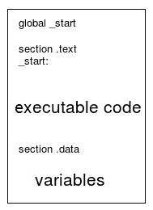

让我们进一步了解一下堆栈。堆栈为**LIFO**，表示**最后一次输入第一次输出**，因此它不是随机访问，而是使用推送和弹出操作。推就是把东西推到堆栈的顶部。让我们看一个例子。假设我们有一个堆栈，它只包含**0x1234**：

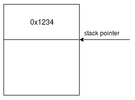

现在，让我们使用组件`push 0x5678`将某些内容推入堆栈。此指令将值**0x5678**推入堆栈，这将改变**堆栈指针**指向**0x5678**：


现在，如果我们想从堆栈中获取数据，我们使用一条`pop`指令，它将提取推入堆栈的最后一个元素。因此，采用相同的堆栈布局，让我们使用`pop rax`提取最后一个元素，它将提取值**0x5678**并将其移动到**RAX**寄存器：


这很简单！！

我们将如何在 Linux x64 上编写程序集？其实很简单,；你记得系统调用吗？这就是我们将如何通过调用系统命令来执行我们想要的。例如，如果我想退出一个程序，那么我必须使用`exit`系统调用。

首先，这个文件`/usr/include/x86_64-linux-gnu/asm/unistd_64.h`包含 Linux x64 的所有系统调用。让我们搜索`exit`系统调用：

```
$ cat /usr/include/x86_64-linux-gnu/asm/unistd_64.h | grep exit
#define __NR_exit 60
#define __NR_exit_group 231
```

`exit`系统调用有一个系统调用号`60`。

现在，让我们看看它的论点：

```
$ man 2 exit 
```

以下屏幕截图显示了前面命令的输出：

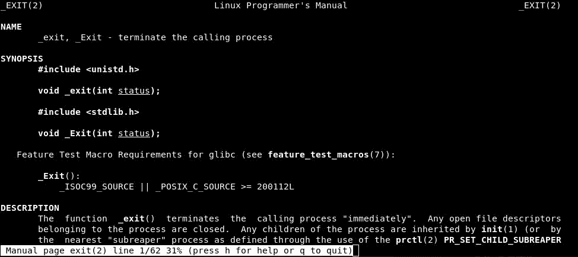

只有一个参数，`status`，并且它有`int`数据类型来定义退出状态，如零状态表示无错误：

```
void _exit(int status);
```

现在，让我们看看如何使用寄存器调用 Linux x64 系统调用：


我们只需将**系统调用号**放在**RAX**中，然后将**RDI**中的**第一个参数**，将**第二个参数**放在**RSI**中，依此类推，如上图所示。

让我们看看如何调用`exit`系统调用：

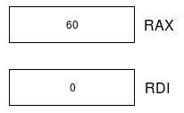

我们只需要在**RAX**中放入**60**，这是`exit`系统调用号，然后在**RDI**中放入**0**，这是退出状态；是的，就是这么简单！

让我们更深入地看汇编代码：

```
mov rax, 60
mov rdi, 0
```

第一行告诉处理器将值`60`移动到`rax`，第二行告诉处理器将值`0`移动到`rdi`。

如您所见，一条指令的一般结构为`{Operation} {Destination}, {Source}`。

# 数据类型

数据类型在汇编中很重要。我们可以使用它们来定义一个变量，或者当我们想要在寄存器或内存的一小部分上执行任何操作时。

下表说明了基于长度的部件中的数据类型：

| **名称** | **指令** | **字节** | **位** |
| 字节 | `db` | 1. | 8. |
| 单词 | `dw` | 2. | 16 |
| 双字 | `dd` | 4. | 32 |
| 四字 | `dq` | 8. | 64 |

为了完全理解，我们将在汇编中构建一个 hello world 程序。

# 你好，世界

好的，让我们开始更深入。我们将构建一个 hello world，它无疑是任何程序员的基本构建块。

首先，我们需要了解我们真正需要的是什么，这是在屏幕上打印`hello world`的系统调用。为此，让我们搜索`write`系统调用：

```
$ cat /usr/include/x86_64-linux-gnu/asm/unistd_64.h | grep write 
#define __NR_write 1
#define __NR_pwrite64 18
#define __NR_writev 20
#define __NR_pwritev 296
#define __NR_process_vm_writev 311
#define __NR_pwritev2 328
```

我们可以看到，`write`系统调用是编号为`1`；现在让我们看看它的论点：

```
$ man 2 write
```

以下屏幕截图显示了前面命令的输出：


`write`系统调用有三个参数；第一个是文件描述符：

```
ssize_t write(int fd, const void *buf, size_t count);
```

文件描述符有三种模式：

| **整数值** | **名称** | **为**`stdio.h`的别名 |
| `0` | 标准输入 | `stdin` |
| `1` | 标准输出 | `stdout` |
| `2` | 标准误差 | `stderr` |

当我们要在屏幕上打印`hello world`时，我们要选择标准输出`1`，第二个参数，它是指向我们要打印的字符串的指针；第三个参数是字符串的计数，包括空格。

下图说明了寄存器内部的内容：


现在，让我们跳到完整的代码：

```
global _start

section .text

_start:

    mov rax, 1
    mov rdi, 1
    mov rsi, hello_world
    mov rdx, length
    syscall

section .data

    hello_world: db 'hello world',0xa
    length: equ $-hello_world
```

在包含所有变量的`.data`部分中，代码中的第一个变量是数据类型为 byte（`db`的`hello_world`变量，它包含一个`hello world`字符串和`0xa`，这意味着一个新行，就像 C 中的`\n`一样。第二个变量是`length`，它包含一个长度为 byte 的`hello_world`字符串`equ`表示相等，`$-`表示评估当前行。

在`.text`部分，如前所述，我们将`1`移动到`rax`，表示`write`系统调用号，然后将`1`移动到`rdi`作为文件描述符设置为标准输出的指示符，然后将`hello_world`字符串的地址移动到`rsi`，并移动`hello_world`的长度字符串到`rdx`，最后，我们调用`syscall`，这意味着执行。

现在，让我们组装并链接目标代码，如下所示：

```
$ nasm -felf64 hello-world.nasm -o hello-world.o
$ ld hello-world.o -o hello-world
$ ./hello-world 
```

上述命令的输出如下所示：

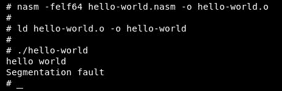

它打印了`hello world`字符串，但由于程序不知道下一步要去哪里，所以退出了`Segmentation fault`。我们可以通过添加`exit`系统调用来修复它：

```
global _start

section .text

_start:

    mov rax, 1
    mov rdi, 1
    mov rsi, hello_world
    mov rdx, length
    syscall

    mov rax, 60
    mov rdi, 1
    syscall

section .data

    hello_world: db 'hello world',0xa
    length: equ $-hello_world
```

我们只是通过将`60`移动到`rax`来添加`exit`系统调用，然后将`1`移动到`rdi`，表示退出状态，最后调用`syscall`执行`exit`系统调用：


让我们组装链接并重试：

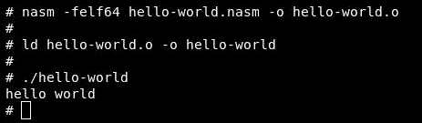

现在它正常退出；我们也用`echo $?`确认退出状态：


退出状态为`1`，如我们所选！

# 堆栈

正如我们在上一章中所讨论的，**堆栈**是为每个正在运行的应用程序分配的空间，用于存储变量和数据。堆栈支持两种操作（推送和弹出）；使用**push**操作将元素推送到堆栈，这将导致堆栈指针移动到较低的内存地址（堆栈从高内存增长到低内存）并指向堆栈顶部，而**pop**则获取堆栈顶部的第一个元素并提取它。

让我们来看一个简单的例子：

```
global _start

section .text

_start:

    mov rdx,0x1234
    push rdx
    push 0x5678
    pop rdi
    pop rsi

    mov rax, 60
    mov rdi, 0
    syscall
section .data
```

这个代码非常简单；让我们编译并链接它：

```
$ nasm -felf64 stack.nasm -o stack.o
$ ld stack.o -o stack
```

然后，我将在调试器中运行该应用程序（调试器将在下一章中解释），以向您展示堆栈的实际工作方式。

首先，在我们运行程序之前，除了 RSP 寄存器之外，所有寄存器都是空的，RSP 寄存器现在指向堆栈的顶部`00007ffdb3f53950`：

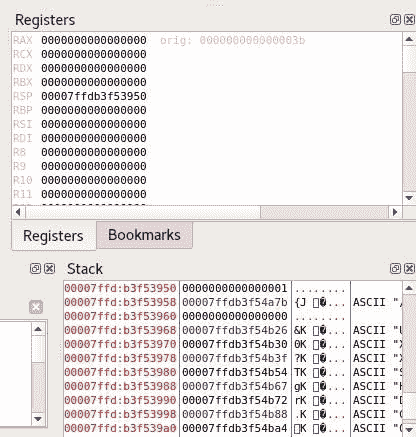

然后，执行第一条指令，将`0x1234`移动到`rdx`：


正如我们所看到的，`rdx`寄存器现在保存`0x1234`，堆栈中还没有任何更改。第二条指令将`rdx`的值推入堆栈，如下所示：

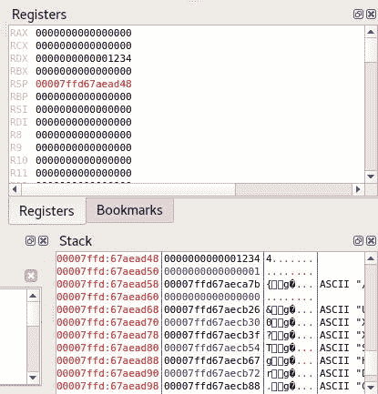

看看堆栈部分；移动到较低的地址（从`50`到`48`，现在包含`0x1234`。第三条指令是直接将`0x5678`推送到堆栈：

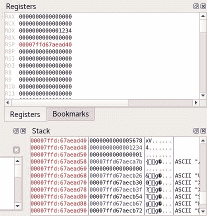

第四条指令将堆栈中的最后一个元素提取到`rdi`：

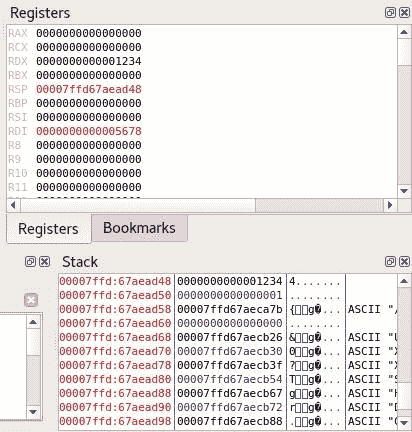

正如您所看到的，堆栈现在不再包含`0x5678`，它移动到了`rdi`。最后一条指令是将堆栈中的最后一个元素提取到`rsi`：

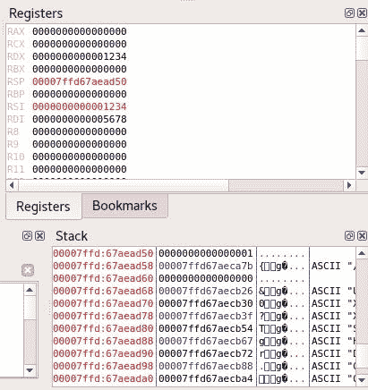

现在堆栈恢复正常，`0x1234`移动到`rsi`。

好的，到目前为止，我们已经介绍了两个关于如何构建 hello world 程序的基本示例，以及堆栈中的 push/pop 操作，其中我们看到了一些基本指令，例如`mov`、`push`、`pop`，还有更多。现在，您可能想知道为什么我没有解释这些说明，而是先带您浏览了这些示例。我的策略将带您进入下一节；在这里，我们将介绍汇编语言所需的所有基本指令。

# 数据操纵

**数据操作**是在汇编中移动数据，这是一个非常重要的话题，因为我们的大多数操作都是移动数据来执行指令，所以我们必须真正了解如何使用它们，比如`mov`指令，以及如何在寄存器之间、寄存器与内存之间移动数据，将地址复制到寄存器，以及如何使用`xchg`指令交换两个寄存器或寄存器与内存之间的内容，然后如何使用`lea`指令将源的有效地址加载到目标。

# mov 指令

`mov`指令是 Linux 汇编中使用的最重要的指令，我们在前面的所有示例中都使用了它。

`mov`指令用于在寄存器之间以及寄存器和内存之间移动数据。

让我们看一些例子。首先，让我们从将数据直接移动到寄存器开始：

```
global _start

section .text

_start:

    mov rax, 0x1234
    mov rbx, 0x56789

    mov rax, 60
    mov rdi, 0
    syscall

section .data
```

此代码只会将`0x1234`复制到`rax`和`0x56789`复制到`rbx`：

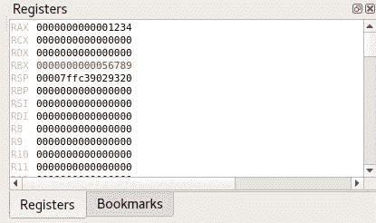

让我们更进一步，在前面的示例中添加一些寄存器之间的移动数据：

```
global _start

section .text

_start:

    mov rax, 0x1234
    mov rbx, 0x56789

    mov rdi, rax
    mov rsi, rbx

    mov rax, 60
    mov rdi, 0
    syscall

section .data
```

我们添加的只是将`rax`和`rbx`的内容分别移动到`rdi`和`rsi`：


让我们尝试在寄存器和内存之间移动数据：

```
global _start

section .text

_start:

    mov al, [mem1]
    mov bx, [mem2]
    mov ecx, [mem3]
    mov rdx, [mem4]

    mov rax, 60
    mov rdi, 0
    syscall

section .data
    mem1: db 0x12
    mem2: dw 0x1234
    mem3: dd 0x12345678
    mem4: dq 0x1234567891234567
```

在`mov al, [mem1]`中，括号表示将`mem1`的内容移动到`al`。如果我们使用不带括号的`mov al, mem1`，它会将`mem1`的指针移动到`al`。

在第一行中，我们将`0x12`移动到 RAX 寄存器，因为我们只移动 8 位，所以我们使用了 AL（RAX 寄存器中可以容纳 8 位的较低部分），因为我们不需要使用所有 64 位。还要注意的是，我们将`mem1`内存部分定义为`db`，它是字节，或者它可以容纳 8 位。

请看下表：

| **64 位寄存器** | **32 位寄存器** | **16 位寄存器** | **8 位寄存器** |
| 雷克斯 | EAX | 斧头 | 啊，艾尔 |
| RBX | EBX | BX | 波黑 |
| RCX | ECX | CX | CH，CL |
| 黑索今 | EDX | DX | DH，DL |
| RSI | ESI | 硅 | SIL |
| RDI | 电子数据交换 | DI | 迪尔 |
| RSP | ESP | 服务提供商 | SPL |
| 限制性商业惯例 | EBP | 英国石油公司 | BPL |
| R8 | R8D | R8W | R8B |
| R9 | R9D | R9W | R9B |
| R10 | R10D | R10W | R10B |
| R11 | R11D | R11W | R11B |
| R12 | R12D | R12W | R12B |
| R13 | R13D | R13W | R13B |
| R14 | R14D | R14W | R14B |
| R15 | R15D | R15W | R15B |

然后，我们将定义为`dw`的值`0x1234`移动到`rbx`寄存器中，然后我们在 BX 中移动了 2 个字节（16 位），可以容纳 16 位。

然后，我们将定义为`dd`的值`0x12345678`移动到 RCX 寄存器，将其 4 个字节（32 位）移动到 ECX。

最后，我们将定义为`dq`的`0x1234567891234567`移动到 RDX 寄存器，它是 8 个字节（64 位），因此我们将其移动到 RDX：

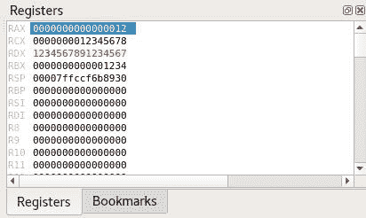

这是执行后在寄存器中的外观。

现在，让我们谈谈将数据从寄存器移动到内存。请看下面的代码：

```
global _start

section .text

_start:

    mov al, 0x34
    mov bx, 0x5678
    mov byte [mem1], al
    mov word [mem2], bx

    mov rax, 60
    mov rdi, 0
    syscall

section .data

    mem1: db 0x12
    mem2: dw 0x1234
    mem3: dd 0x12345678
    mem4: dq 0x1234567891234567
```

在第一条和第二条指令中，我们将值直接移动到寄存器，在第三条指令中，我们将寄存器 RAX（AL）的内容移动到`mem1`，并用字节指定长度。然后，在第四条指令中，我们将寄存器 RBX（RX）的内容移动到`mem2`并用字指定长度。

这是移动任何值之前的`mem1`和`mem2`的内容：

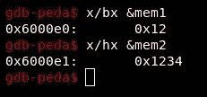

下一个屏幕截图是在将值移动到`mem1`和`mem2`之后，该值已更改：

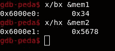

# 数据交换

**数据交换**也很容易；用于使用`xchg`指令在两个寄存器或寄存器与内存之间交换内容：

```
global _start

section .text

_start:

    mov rax, 0x1234
    mov rbx, 0x5678
    xchg rax, rbx
    mov rcx, 0x9876
    xchg rcx,[mem1]

```

```
    mov rax, 60
    mov rdi, 0
    syscall

section .data
    mem1: dw 0x1234
```

在前面的代码中，我们将`0x1234`移动到`rax`寄存器，然后将`0x5678`移动到`rbx`寄存器：

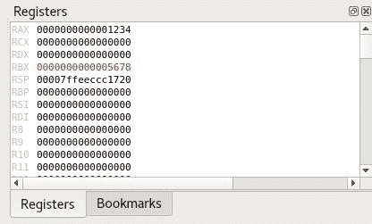

然后，在第三条指令中，我们将`rax`和`rbx`的内容与`xchg`指令交换：


然后，我们将`0x9876`推到`rcx`寄存器，`mem1`保持`0x1234`：


现在，交换`rcx`和`mem1`：

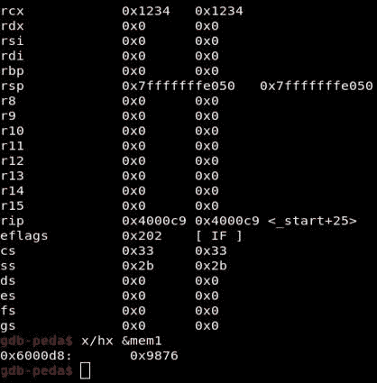

# 加载有效地址

**加载有效地址**（**lea**指令将源地址加载到目的地址：

```
global _start

section .text

_start:

    lea rax, [mem1]
    lea rbx, [rax]

    mov rax, 60
    mov rdi, 0
    syscall

section .data
    mem1: dw 0x1234
```

首先，我们将`mem1`的地址移动到`rax`，然后将`rax`内的地址移动到`rbx`：


现在两个都指向`mem1`，其中包含`0x1234`。

# 算术运算

现在，我们将讨论算术运算（加法和减法）。开始吧：

```
global _start

section .text

_start:

    mov rax,0x1
    add rax,0x2

    mov rbx,0x3
    add bl, byte [mem1]

    mov rcx, 0x9
    sub rcx, 0x1

    mov dl,0x5
    sub byte [mem2], dl

    mov rax, 60
    mov rdi, 0
    syscall

section .data
    mem1: db 0x2
    mem2: db 0x9
```

首先将`0x1`移动到`rax`寄存器，然后添加`0x2`，结果将存储在`rax`寄存器中。

然后，我们将`0x3`移动到`rbx`寄存器，并添加`mem1`的内容，其中包含`0x2`和`rbx`的内容，结果将存储在`rbx`中。

然后，我们将`0x9`移动到`rcx`寄存器，然后减去`0x1`，结果将存储在`rcx`中。

然后，我们将`0x5`移动到`rdx`寄存器，从`rdx`中减去`mem2`的内容，结果将存储在`mem2`存储部分：


减法后的`mem2`内容如下：

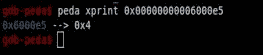

现在，让我们谈谈带进位的加法和带借位的减法：

```
global _start

section .text

_start:

    mov rax, 0x5
    stc
    adc rax, 0x1

    mov rbx, 0x5
    stc
    sbb rbx, 0x1

    mov rax, 60
    mov rdi, 0
    syscall

section .data
```

首先，我们将`0x5`移动到`rax`寄存器，然后设置进位标志，它将携带`1`。在此之后，我们将`rax`寄存器的内容添加到`0x1`中，并添加到进位标志，即`1`。这将给我们带来`0x7`*（5+1+1）*。

然后，我们将`0x5`移动到`rbx`寄存器并设置进位标志，然后从`rbx`寄存器中减去`0x1`，并在进位标志中减去另一个`1`；这将给我们`0x3`*（5-1-1）*：


现在，这里的最后一部分是递增和递减操作：

```
global _start

section .text

_start:

    mov rax, 0x5
    inc rax
    inc rax

    mov rbx, 0x6
    dec rbx
    dec rbx

    mov rax, 60
    mov rdi, 0
    syscall

section .data
```

首先，我们将`0x5`移动到`rax`寄存器，用`1`增加`rax`的值，然后我们再次增加，得到`0x7`。

然后，我们将`0x6`移动到`rbx`寄存器，用`1`递减`rbx`的值，然后我们再次递减，得到`0x4`：

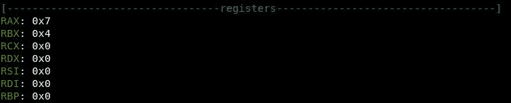

# 循环

现在，我们将讨论汇编中的循环。与任何其他高级语言（Python、Java 等）一样，我们可以使用循环进行迭代，使用 RCX 寄存器作为计数器，然后使用`loop`关键字。让我们看看下面的例子：

```
global _start

section .text

_start:

    mov rcx,0x5
    mov rbx,0x1

increment:

    inc rbx
    loop increment

    mov rax, 60
    mov rdi, 0
    syscall

section .data
```

在前面的代码中，我们希望将 RAX 的内容增加五倍，因此我们将`0x5`移动到`rcx`寄存器，然后将`0x1`移动到`rbx`寄存器：

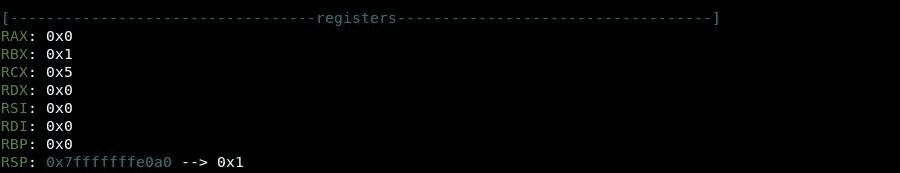

然后，我们添加了`increment`标记作为我们想要重复的块的开始指示，然后我们将递增指令添加到`rbx`寄存器的内容中：


然后，我们调用了`loop increment`，它将减少 RCX 寄存器的内容，然后从`increment`标记再次开始：

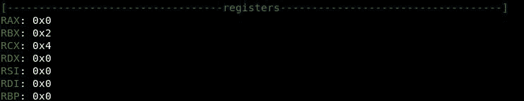

现在它将一直运行，直到 RCX 寄存器达到零，然后流将退出该循环：


现在，如果程序是用 RCX 上的值重写的呢？让我们看一个例子：

```
global _start

section .text

_start:

    mov rcx, 0x5

print:

    mov rax, 1
    mov rdi, 1
    mov rsi, hello
    mov rdx, length
    syscall

loop print

    mov rax, 60
    mov rdi, 0
    syscall

section .data
    hello: db 'Hello There!',0xa
    length: equ $-hello
```

执行此代码后，程序将陷入无限循环中，如果我们仔细观察，我们将看到代码在执行 syscall 后覆盖 RCX 寄存器中的值：

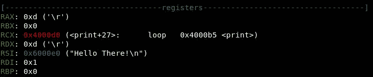

因此，我们必须找到一种保存 RCX 寄存器的方法，例如将其保存在堆栈中。首先，在执行 syscall 之前，我们在堆栈中推送当前值，在执行 syscall 之后，我们再次用我们的值覆盖 RCX 中的任何内容，然后减小该值并在堆栈中再次推送以保存它：

```
global _start

section .text

_start:

    mov rcx, 0x5

increment:

    push rcx
    mov rax, 1
    mov rdi, 1
    mov rsi, hello
    mov rdx, length
    syscall
    pop rcx

loop increment

    mov rax, 60
    mov rdi, 0
    syscall

section .data
    hello: db 'Hello There!',0xa
    length: equ $-hello
```

这样，我们将值保存在 RCX 寄存器中，然后再次将其放入 RCX 中使用。请看前面代码中的`pop rcx`指令。RCX 又回到了`0x5`，果然：


# 控制流量

在这里，我们将讨论控制执行流。正常的执行流程是执行步骤 1，然后执行步骤 2，依此类推，直到代码正常退出。如果我们决定要在第 2 步中发生一些事情，那么代码跳过第 3 步，直接执行第 4 步，或者我们只想跳过第 3 步而不等待事情发生，该怎么办？有两种类型的跳跃：

*   无条件改变流程
*   根据标志的更改更改流

现在，让我们从无条件跳转开始：

```
global _start

section .text

_start:

jmp exit_ten

    mov rax, 60
    mov rdi, 12
    syscall

    mov rax, 60
    mov rdi, 0
    syscall

exit_ten:

    mov rax, 60
    mov rdi, 10
    syscall

    mov rax, 60
    mov rdi, 1
    syscall

section .data
```

前面的代码包含四个`exit`系统调用，但退出状态不同（`12`、`0`、`10`、`1`），我们从`jmp exit_ten`开始，即跳转到`exit_ten`位置，跳转到这段代码：

```
    mov rax, 60
    mov rdi, 10
    syscall
```

执行并正常退出，退出状态为`10`。请注意，下一节永远不会执行：

```
    mov rax, 60
    mov rdi, 12
    syscall

    mov rax, 60
    mov rdi, 0
    syscall
```

让我们确认一下：

```
$ nasm -felf64 jmp-un.nasm -o jmp-un.o
$ ld jmp-un.o -o jmp-un
$ ./jmp-un
$ echo $?
```

在以下屏幕截图中可以看到上述命令的输出：


我们可以看到，代码以退出状态`10`退出。

让我们看另一个例子：

```
global _start

section .text

_start:

    mov rax, 1
    mov rdi, 1
    mov rsi, hello_one
    mov rdx, length_one
    syscall

jmp print_three

    mov rax, 1
    mov rdi, 1
    mov rsi, hello_two
    mov rdx, length_two
    syscall

print_three:
    mov rax, 1
    mov rdi, 1
    mov rsi, hello_three
    mov rdx, length_three
    syscall

    mov rax, 60
    mov rdi, 11
    syscall

section .data

    hello_one: db 'hello one',0xa
    length_one: equ $-hello_one

    hello_two: db 'hello two',0xa
    length_two: equ $-hello_two

    hello_three: db 'hello three',0xa
    length_three: equ $-hello_three
```

在前面的代码中，它以打印`hello_one`开始。然后点击`jmp print_three`按钮，执行流程变为`print_three`位置，开始打印`hello_three`。永远不会执行以下部分：

```
    mov rax, 1
    mov rdi, 1
    mov rsi, hello_two
    mov rdx, length_two
    syscall
```

让我们确认一下：

```
$ nasm -felf64 jmp_hello.nasm -o jmp_hello.o
$ ld jmp_hello.o -o jmp_hello
$ ./jmp_hello
```

在以下屏幕截图中可以看到上述命令的输出：

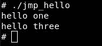

现在，让我们继续讨论条件，老实说，我们不能涵盖所有条件，因为列表很长，但我们将看到一些示例，以便您理解这个概念。

如果跳转低于（`jb`指令，则表示如果设置了**进位标志**（**CF**）则将执行跳转（CF 等于`1`。

如前所述，我们可以使用`stc`指令手动设置 CF。

让我们修改前面的示例，但使用`jb`指令，如下所示：

```
global _start

section .text

_start:

    mov rax, 1
    mov rdi, 1
    mov rsi, hello_one
    mov rdx, length_one
    syscall

    stc

jb print_three

    mov rax, 1
    mov rdi, 1
    mov rsi, hello_two
    mov rdx, length_two
    syscall

print_three:
    mov rax, 1
    mov rdi, 1
    mov rsi, hello_three
    mov rdx, length_three
    syscall

    mov rax, 60
    mov rdi, 11
    syscall

section .data

    hello_one: db 'hello one',0xa
    length_one: equ $-hello_one

    hello_two: db 'hello two',0xa
    length_two: equ $-hello_two

    hello_three: db 'hello three',0xa
    length_three: equ $-hello_three
```

如您所见，我们执行了`stc`来设置进位标志（即 CF 等于`1`，然后我们使用`jb`指令来测试，如果 CF 等于`1`，这意味着跳转到`print_three`。

下面是另一个例子：

```
global _start

section .text

_start:

    mov al, 0xaa
    add al, 0xaa

jb exit_ten

    mov rax, 60
    mov rdi, 0
    syscall

exit_ten:

    mov rax, 60
    mov rdi, 10
    syscall

section .data
```

在前面的示例中，add 操作将设置进位标志，然后我们使用`jb`指令进行测试；如果 CF 等于`1`，则跳至`exit_ten`。

现在，让我们看看另一种方法，即如果低于或等于（`jbe`指令），则跳转，这意味着 CF 等于`1`或**零标志（ZF**等于`1`。前面的示例也可以，但让我们尝试其他方法来设置 ZF 等于`1`：

```
global _start

section .text

_start:

    mov al, 0x1
    sub al, 0x1

jbe exit_ten

    mov rax, 60
    mov rdi, 0
    syscall

exit_ten:

    mov rax, 60
    mov rdi, 10
    syscall

section .data
```

在前面的代码中，减法操作将设置 ZF，然后我们将使用`jbe`指令测试 CF 是否等于`1`或 ZF 是否等于`1`；如果为 true，则跳转执行`exit_ten`。

另一种类型为非符号跳转（`jns`，表示 SF 等于`0`：

```
global _start

section .text

_start:

mov al, 0x1
sub al, 0x3

jns exit_ten

    mov rax, 60
    mov rdi, 0
    syscall

exit_ten:

    mov rax, 60
    mov rdi, 10
    syscall

section .data
```

在前面的代码中，减法操作会将**符号标志**（**SF**）设置为等于`1`。之后，我们将测试 SF 是否等于`0`，它将失败，并且不会跳转执行`exit_ten`，并将以退出状态`0`继续正常退出：

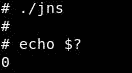

# 程序

汇编中的过程可以作为高级语言中的函数，这意味着您可以编写一段代码，然后调用它来执行。

例如，我们可以构建一个过程，该过程可以获取两个数字并将它们相加。此外，我们可以在执行过程中使用`call`指令多次使用它。

建造程序很简单。首先，在`_start`之前定义您的过程，然后添加您的指令并以`ret`指令结束您的过程。

让我们尝试构建一个可以接受两个数字并将其相加的过程：

```
global _start

section .text

addition:

    add bl,al
    ret

_start:

    mov al, 0x1
    mov bl, 0x3
    call addition

    mov r8,0x4
    mov r9, 0x2
    call addition

    mov rax, 60
    mov rdi, 1
    syscall

section .data
```

首先，我们在`_start`部分之前添加了`addition`部分。然后，在`addition`部分，我们使用`add`指令添加`R8`和`R9`寄存器中的内容，并将结果放入`R8`寄存器，然后我们用`ret`结束`addition`过程。

然后，我们将`1`移至`R8`寄存器，将`3`移至`R9`寄存器：


然后调用`addition`过程，将下一个指令地址推送到堆栈中，即`mov r8,0x4`：


注意`RSP`现在指向下一个操作，我们在`addition`过程中，然后代码将两个数字相加并将结果存储在`R8`寄存器中：


然后点击`ret`指令，将执行流程设置回`mov r8,0x4`。

这将移动`4`到`R8`寄存器，然后移动`2`到`R8`寄存器：


然后调用`addition`过程，将下一条指令推入堆栈，即`mov rax, 60`：


然后，将两个数字相加，并将结果存储在`R8`寄存器中：

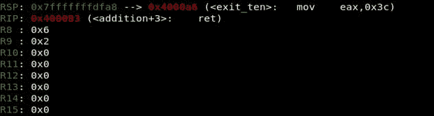

然后，我们再次点击`ret`指令，它将从堆栈中弹出下一条指令并将其放入`RIP`寄存器，这相当于`pop rip`：

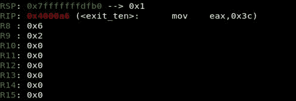

然后，代码将继续执行`exit`系统调用。

# 逻辑运算

现在，我们将讨论逻辑运算，如按位运算和位移位运算。

# 按位运算

逻辑运算中有四种位运算：AND、OR、XOR 和 NOT。

让我们从 AND 位操作开始：

```
global _start

section .text

_start:

    mov rax,0x10111011
    mov rbx,0x11010110
    and rax,rbx

    mov rax, 60
    mov rdi, 10
    syscall

section .data
```

首先，我们将`0x10111011`移动到`rax`寄存器，然后我们将`0x11010110`移动到`rbx`寄存器：


然后，我们在两侧执行了**和**位运算，并将结果存储在 RAX 中：


让我们看看`RAX`寄存器中的结果：


现在，让我们转到 OR 逐位操作，并修改前面的代码以执行该操作：

```
global _start

section .text

_start:

    mov rax,0x10111011
    mov rbx,0x11010110
    or rax,rbx

    mov rax, 60
    mov rdi, 10
    syscall

section .data
```

我们将两个值移到了`rax`和`rbx`寄存器：

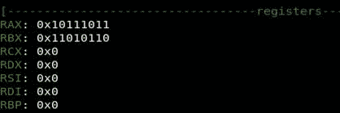

然后，我们对这些值执行 OR 操作：

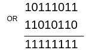

现在，让我们在`RAX`寄存器中确认结果：


现在让我们看看具有相同值的 XOR 逐位操作：

```
global _start

section .text

_start:

    mov rax,0x10111011
    mov rbx,0x11010110
    xor rax,rbx

    mov rax, 60
    mov rdi, 10
    syscall

section .data
```

将相同的值移动到`rax`和`rbx`寄存器：

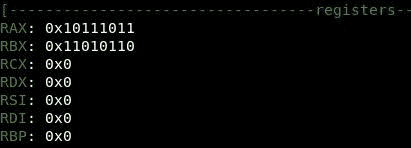

然后，执行 XOR 操作：


让我们看看`RAX`寄存器中的内容：

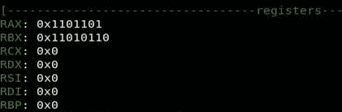

您可以使用寄存器上的 XOR 指令来清除该寄存器的内容。例如，`xor rax`和`rax`将用零填充 RAX 寄存器。

现在，让我们看最后一个，它不是按位操作，它将把 1 变成 0，把 0 变成 1：

```
global _start

section .text

_start:

    mov al,0x00
    not al

    mov rax, 60
    mov rdi, 10
    syscall

section .data
```

在以下屏幕截图中可以看到前面代码的输出：


发生的情况是 NOT 指令将 0 更改为 1（`ff`，反之亦然。

# 位移位操作

如果您遵循每个图表所示，那么位移位操作是一个简单的主题。主要有两种类型的位移位运算：算术移位运算和逻辑移位运算。但是，我们还将看到旋转操作。

让我们从算术移位运算开始。

# 算术移位运算

让我们把这件事尽可能简单。算术移位有两种类型：**左移位**（**SAL**）和**右移位**（**SAR**）。

在 SAL 中，我们在**最低有效位**侧推**0**，如果**最高有效位**侧的额外位是**1**，则可能会影响**CF**：

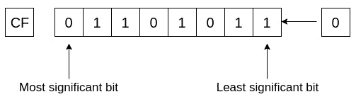

所以这个移位的结果不会影响**CF**上，它会是这样的：

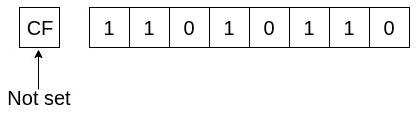

让我们举一个例子：

```
global _start

section .text

_start:

    mov rax, 0x0fffffffffffffff
    sal rax, 4
    sal rax, 4

    mov rax, 60
    mov rdi, 0
    syscall

section .data
```

我们将`0x0fffffffffffffff`移到`rax`寄存器，现在看起来是这样的：


现在，我们想一次用 4 位执行 SAL：


因为最高有效位为零，所以不会设置 CF：

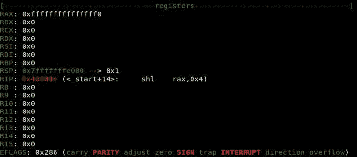

现在，让我们尝试另一轮：我们再推一个零，最高有效位是 1：

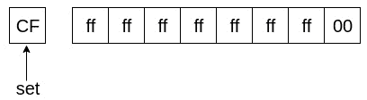

将设置进位标志：


现在，让我们看看 SAR 指令。在 SAR 中，根据**最高有效位**推送一个值，如果是**0**，则推送**0**，如果是**1**，则推送**1**以防止符号改变：

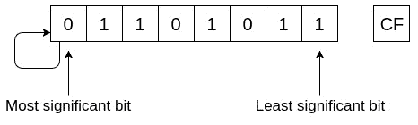

最高有效位用作符号指示，**0**表示正数，**1**表示负数。

因此，在合成孔径雷达中，它将随最重要位中的任何内容而移动。

让我们来看一个例子：

```
global _start

section .text

_start:

    mov rax, 0x0fffffffffffffff
    sar rax, 4

    mov rax, 60
    mov rdi, 0
    syscall

section .data
```

因此，输入将如下所示：

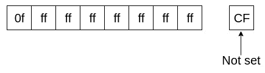

因此，SAR 四次将推送**0**四次，因为最高有效位为零：

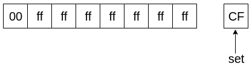

此外，设置 CF 是因为最低有效位为 1：


# 逻辑移位

逻辑移位也包含两种移位类型：**逻辑**左移**（**SHL**）和逻辑****右移**（**SHR**）。SHL 和萨尔一模一样。****

 ****让我们看看下面的代码：

```
global _start

section .text

_start:

    mov rax, 0x0fffffffffffffff
    shl rax, 4
    shl rax, 4

    mov rax, 60
    mov rdi, 0
    syscall

section .data
```

此外，它将从最低有效位侧推零四次：


这不会对进位标志产生任何影响：

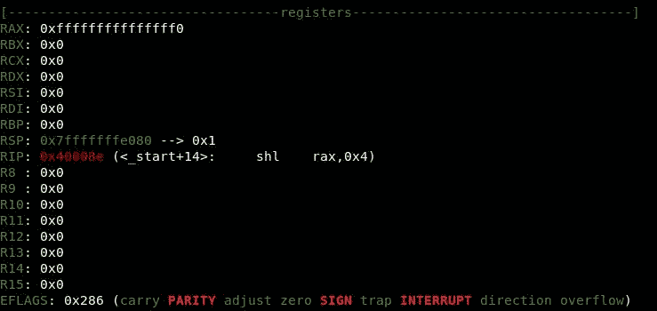

在第二轮，它将再次推动零位四次：


最高有效位为 1，因此这将设置进位标志：


现在让我们转到 SHR。它只需从**最高有效位**侧推送一个 0，而无需保持符号不变：


现在，请尝试以下代码：

```
global _start

section .text
_start:

    mov rax, 0xffffffffffffffff
    shr rax, 32

    mov rax, 60
    mov rdi, 0
    syscall

section .data
```

首先，我们移动 64 位的 1：


在此之后，我们将执行 SHR 32 次，这将把 32 个零推到最高有效位侧：


此外，由于最低有效位为 1，这将设置进位标志：

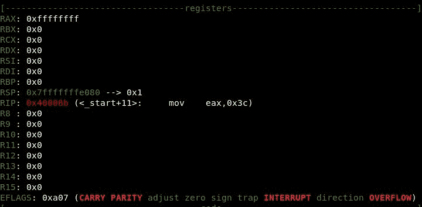

# 旋转操作

旋转操作很简单：我们将寄存器的内容向右或向左旋转。在这里，我们只讨论**向右旋转**（**ROR**）和**向左旋转**（**ROL**）。

让我们从 ROR 开始：


在 ROR 中，我们只是从右向左旋转位，而不添加任何位；让我们看看下面的代码：

```
global _start

section .text

_start:

    mov rax, 0xffffffff00000000
    ror rax, 32

    mov rax, 60
    mov rdi, 0
    syscall

section .data
```

我们将`0xffffffff00000000`移至`rax`寄存器：

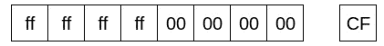

然后，我们将开始从右向左移动位 32 次：

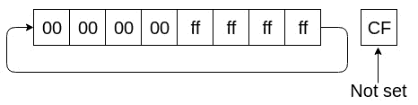

没有与 1 的转换，因此不会设置进位标志：


让我们移动 ROL，它与 ROR 相反，ROR 从左向右旋转位，而不添加任何位：


让我们看一下前面的示例，但 ROL：

```
global _start

section .text

_start:

    mov rax, 0xffffffff00000000
    rol rax, 32

    mov rax, 60
    mov rdi, 0
    syscall

section .data
```

首先，我们还将`0xffffffff00000000`移至`rax`寄存器：

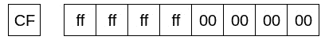

然后，我们将开始从左向右旋转位 32 次：

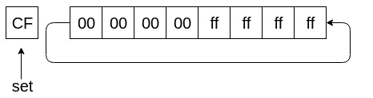

我们正在旋转，因此这将设置进位标志：


# 总结

在本章中，我们讨论了 Linux 中的 Intel x64 汇编语言，以及如何处理堆栈、数据操作、算术和逻辑运算，如何控制执行流，以及如何在程序集中调用系统调用。

现在我们已经准备好制作我们自己的定制 Shellcode，但在此之前，您需要学习调试和逆向工程的一些基础知识，这将是我们的下一章。****