# 逆向工程

在本章中，我们将学习什么是逆向工程，以及如何使用调试器让我们真正了解幕后的情况。此外，我们还将了解一次执行一条指令的流程，以及如何使用和熟悉 Microsoft Windows 和 Linux 的调试器。

本章将介绍以下主题：

*   Linux 下的调试
*   Windows 中的调试
*   任何代码的执行流程
*   用逆向工程检测和确认缓冲区溢出

我们开始好吗？

# Linux 下的调试

在这里，我们将向您介绍有史以来最可爱、功能最强大的调试器之一 GDB（GNU 调试器）。GDB 是一个开源的命令行调试器，可以在许多语言上工作，例如 C/C++，默认情况下，它安装在大多数 Linux 发行版上。

那么我们为什么要使用调试器呢？我们使用它们来查看每个步骤中的内部寄存器、内存或堆栈。此外，GDB 中还有一个反汇编，可以帮助我们理解汇编语言中每个函数的功能。

有些人觉得 GDB 很难使用，因为它是一个命令行界面，很难记住每个命令的参数，等等。让我们通过安装用于增强 GDB 接口的 PEDA，让这些人更容易接受 GDB。

**PEDA**代表**Python 开发援助**，可以使 GDB 更易于使用，外观更美观。

我们需要先下载它：

```
$ git clone https://github.com/longld/peda.git ~/peda
```

然后，将该文件复制到您的`home`目录中的`gdbinit`：

```
$ echo "source ~/peda/peda.py" >> ~/.gdbinit
```

然后，启动 GDB：

```
$ gdb
```

现在，它看起来没用了，但等一下；让我们试着调试一些简单的东西，比如我们的 assembly*hello world*示例：

```
global _start

section .text
_start:

    mov rax, 1
    mov rdi, 1
    mov rsi, hello_world
    mov rdx, length
    syscall

    mov rax, 60
    mov rdi, 11
    syscall

section .data

    hello_world: db 'hello there',0xa
    length: equ $-hello_world
```

让我们按如下方式组装和链接它：

```
$ nasm -felf64 hello.nasm -o hello.o
$ ld hello.o -o hello
```

现在使用 GDB 运行`./hello`，如下所示：

```
$ gdb ./hello
```

以下屏幕截图显示了前面命令的输出：


我们将把反汇编模式设置为英特尔：

```
set disassembly-flavor intel
```

然后，我们要设置一个断点，在这里我们要一步一步地开始调试，因为我们要跟踪所有指令，所以让我们把断点放在`_start`：

```
break _start
```

上述命令的输出如下所示：


既然我们已经设置了断点，现在，让我们使用`run`在 GDB 内部运行我们的应用程序，它将继续运行，直到到达断点。

您将看到三个部分（寄存器、代码和堆栈）：

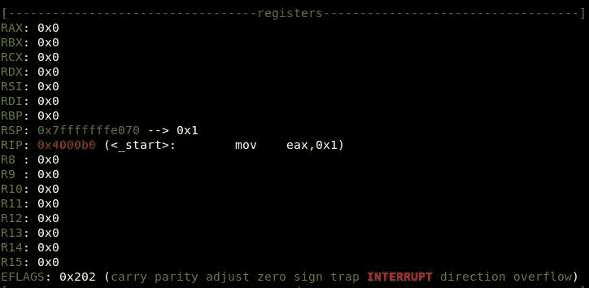

以下屏幕截图是代码部分：


如您所见，左边的小箭头指向下一条指令，该指令将`0x1`移动到`eax`寄存器。

下一个屏幕截图是堆栈部分：

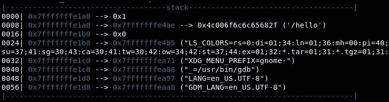

另外，我们可以通过`peda`命令找到很多命令选项：


还有更多：

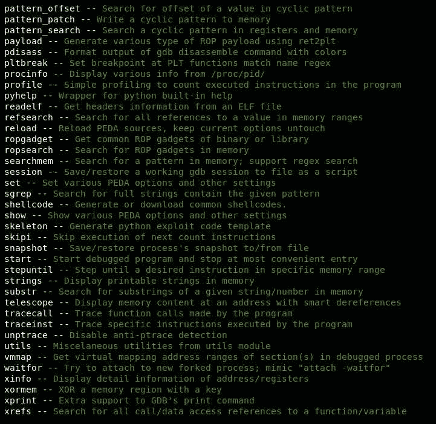

所有这些都是 PEDA 命令；您还可以使用 GDB 命令。

现在，让我们通过键入`stepi`继续我们的工作，或者您可以只使用`s`，这将开始执行一条指令，即`mov eax,0x1`：

`stepi`命令将步进`call`等指令，这将导致调试流程在该调用内切换，而`s`命令或步骤不会这样做，只会通过步进`call`指令从`call`指令获取返回值。

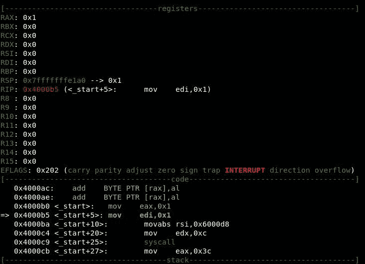

在上一屏幕上，`RAX`寄存器内有`0x1`，下一条指令指向`mov edi,0x1`。现在我们点击*进入*进入下一条指令：

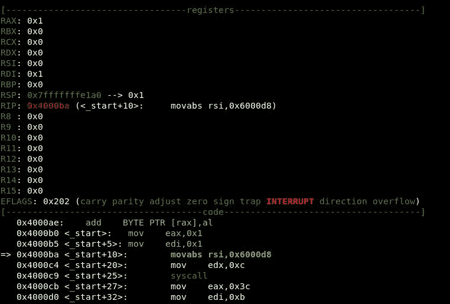

此外，如您所见，RDI 寄存器中有`1`，下一条指令是`movabs rsi,0x6000d8`。让我们试着使用`xprint 0x6000d8`查看内存地址`0x6000d8`中的内容：


现在很清楚，这就是持有`hello there`字符串的位置。我们也可以使用`peda hexprint 0x6000d8`或`peda hexdump 0x6000d8`将其以十六进制转储：


让我们继续使用`stepi`：


现在 RSI 寄存器中有一个指向`hello there`字符串的指针。

下一条指令是`mov edx,0xc`，它正在将`12`移动到 EDX 寄存器，这是`hello there`字符串的长度。现在，让我们进一步点击*进入*一次；将显示以下内容：

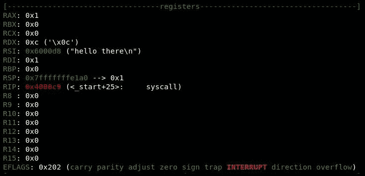

现在查看 RDX 寄存器，它保存着`0xc`，下一条指令是`syscall`。让我们继续使用`s`：

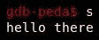

现在完成了`syscall`，并且打印了`hello there`字符串。

现在我们将执行`exit`系统调用，下一条指令是`mov eax,0x3c`，这意味着将`60`移动到 RAX 寄存器。让我们继续使用`s`：

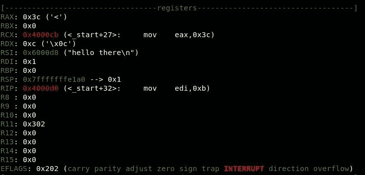

指令，`mov edi,0xb`表示将`11`移动到 RDI 寄存器：

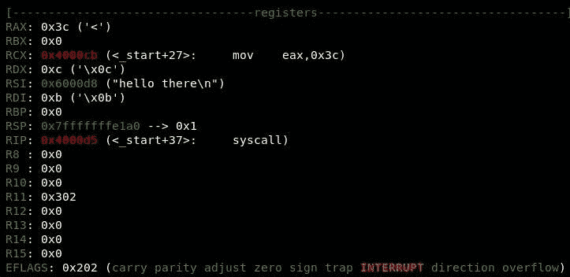

RDI 现在持有`0xb`，下一条指令是`syscall`，它将执行`exit`系统调用：


现在程序正常退出。

让我们看另一个例子，C 语言中的 hello world：

```
#include <stdio.h>

int main()
{
    printf ("hello world\n");
    return 0;
}
```

让我们使用 GDB 编译并调试它：

```
$ gcc hello.c -o hello
$ gdb ./hello
```

现在，让我们将反汇编模式设置为“英特尔”：

```
set disassembly-flavor intel
```

在`main`函数上设置断点：

```
break main
```

现在，如果我们想查看任何函数的汇编指令，那么我们应该使用`disassemble`命令，后跟函数名。例如，我们想要反汇编`main`函数，因此我们可以使用`disassemble main`：


前两条指令是通过将 RBP 推到堆栈来保存基指针或帧指针的内容，然后在最后将 RBP 提取回来。让我们运行应用程序，进一步了解如何使用`run`命令：


停在`lea rdi,[rip+0x9f] # 0x5555555546e4`处。

让我们检查一下该位置内的内容：

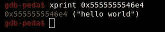

它指向`hello world`字符串的位置。

让我们使用`stepi`或`s`向前迈进：


如您所见，RDI 寄存器现在加载了`hello world`字符串的地址。

调用`printf`函数的下一条指令`call 0x555555554510 <puts@plt>`是打印`hello world`字符串。

我们也可以查看`0x555555554510`的内容：


这是`jmp`指令；让我们也检查一下那个位置：

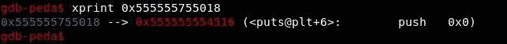

现在，让我们使用`stepi`命令前进一步：


让我们再次向前迈进：

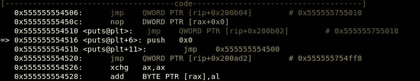

下一条指令为`push 0x0`；让我们继续使用`stepi`：


下一条指令为`jmp 0x555555554500`；让我们通过输入`s`向前迈进：

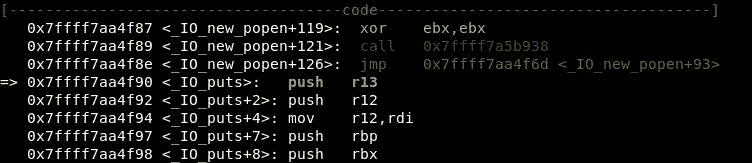

现在我们进入了`printf`函数的实际执行过程；继续前进，以获得下一条指令：


下一条指令`call 0x7ffff7abc650 <strlen>`意味着调用`strlen`函数来获取字符串的长度。

继续向前走，直到点击`ret`指令，然后在`printf`内再次回到我们的执行：

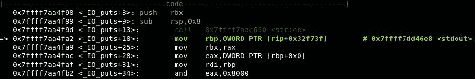

让我们使用`continue`命令使程序继续调试，直到它遇到错误：


在前面的示例中，我们并没有遵循所有的指令，只是学习了如何使用 GDB 进行调试，并理解和研究了每一条指令。

# Windows 中的调试

现在，让我们尝试一些更高级但非常简单的方法，而不必讨论细节。在这里，我们将看到如果在 Windows 中使用缓冲区溢出代码将会发生什么。如果我们执行该代码，我们将检测 CPU 内部将发生什么。

首先，在 Windows7 中打开*代码：：块*，然后进入文件菜单|新建|空文件。然后，编写缓冲区溢出：

```
#include <stdio.h>
#include <string.h>

void copytobuffer(char* input)
{
    char buffer[15];
    strcpy (buffer,input);
}
int main (int argc, char *argv[])
{
    int local_variable = 1;
    copytobuffer(argv[1]);
    return 0;
}
```

之后，进入文件菜单|保存文件，然后保存为`buffer.c`：

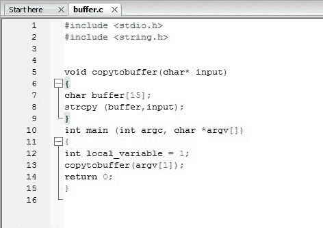

然后，进入构建菜单|构建。

然后，以管理员身份打开*免疫调试器*，从文件菜单【打开】中，选择可执行缓冲文件，然后指定我们的输入，不使我们的代码崩溃，只是为了查看差异，如`aaaa`：

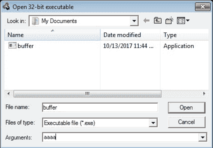

然后，点击打开：


要获得每个按钮的功能，只需将鼠标光标悬停在按钮上并读取状态栏。

例如，如果我将鼠标光标悬停在红色播放按钮上，它将在状态栏中显示其功能，即运行程序：

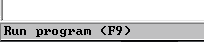

让我们按一下运行程序按钮。程序在程序入口点启动然后停止，这是`main`功能。让我们再次点击该按钮，并注意状态栏中发生的情况：

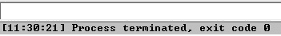

如您所见，程序退出时状态为零，这意味着没有错误。

好的，现在让我们尝试使程序崩溃以查看差异。让我们关闭免疫调试器并再次运行它，然后打开同一个程序，但我们需要导致程序崩溃，因此请指定参数，例如`a`字符的 40：


然后点击打开：


让我们点击运行程序按钮两次，并注意状态栏中发生的情况：

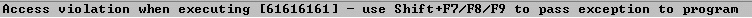

程序无法执行`61616161`；你知道为什么吗？这是我们的输入，61 是十六进制字符。

让我们看看寄存器和堆栈窗口：


请注意，堆栈中有 16 个`a`字符；我们的其余输入填充了 EAX 寄存器，它填充了 RIP，这就是为什么我们的应用程序抱怨它不能执行`61616161`。

# 总结

在本章中，我们介绍了调试，以及如何在 Linux 和 Microsoft Windows 中使用调试器。我们还研究了如何跟踪执行流程，并了解幕后发生了什么。我们只是触及了这个话题的表面，因为我们不想偏离我们的主要目标。现在让我们继续下一章，它将涵盖我们在这里的主要目标之一：创建外壳代码。我们将看看如何应用到目前为止所学的一切来创建定制的外壳代码。