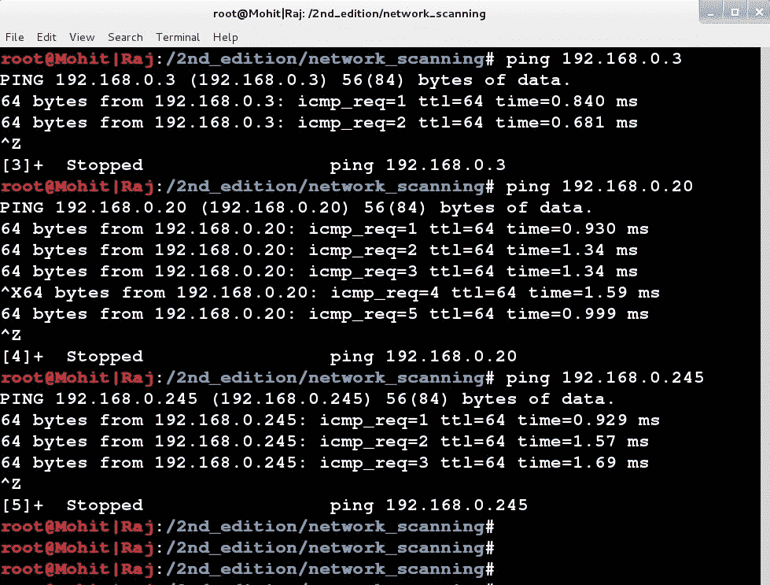
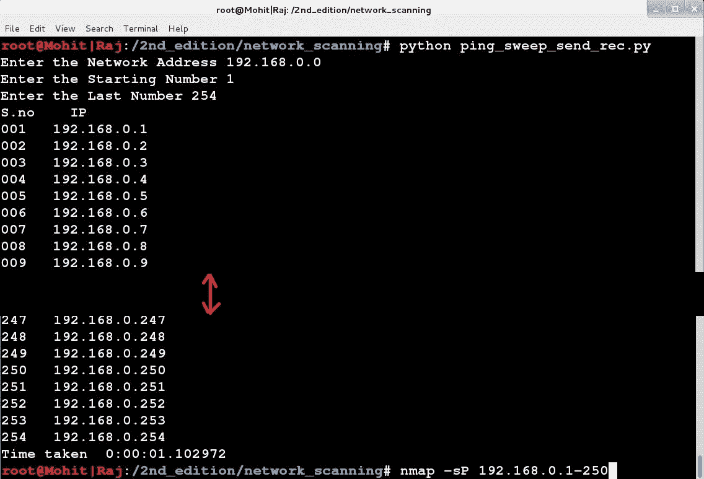
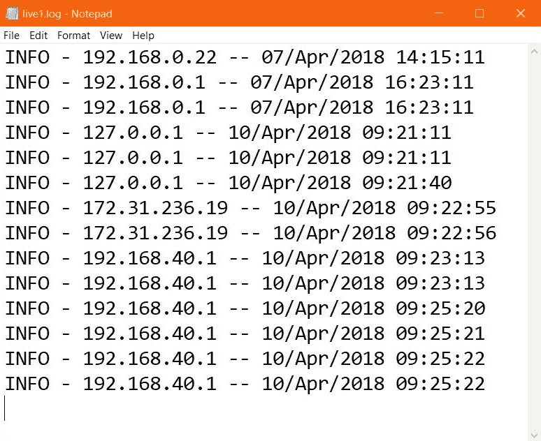

# 蜜罐–为攻击者构建陷阱

在[第 5 章](5.html)、*无线测试*中，您看到了各种网络攻击以及如何防范。在本章中，您将看到一些积极主动的方法。在[第 2 章](https://cdp.packtpub.com/python_penetration_testing_essentials__second_edition/wp-admin/post.php?post=52&action=edit)*扫描测试*中，您学习了使用 ping 扫描的 IP 扫描和使用 TCP 连接扫描的端口扫描。但是当 ping 扫描和端口扫描代码给你假目标时会发生什么呢？你会试图利用假目标。这台机器被设置成诱饵来引诱攻击者，它记录了攻击者的动作。在看到所有的技巧和攻击之后，管理员可以建立一个新的策略来加强网络。在本章中，我们将使用 Python 代码来完成这些任务

在本章中，我们将学习以下主题：

*   伪 ARP 应答
*   假平回复
*   假端口扫描应答
*   对 nmap 的假操作系统签名回复
*   假 web 服务器回复

ARP 协议属于 TCP/IP 第 1 层，即网络访问层

# 技术要求

您需要在系统上安装 Python2.7.x。最后，要使用本书的 Git 存储库，用户需要安装 Git。

本章代码文件可在 GitHub 上找到：

[https://github.com/PacktPublishing/Python-Penetration-Testing-Essentials-Second-Edition/tree/master/Chapter06](https://github.com/PacktPublishing/Python-Penetration-Testing-Essentials-Second-Edition/tree/master/Chapter06)

查看以下视频以查看代码的运行：
[https://goo.gl/jbgbBU](https://goo.gl/jbgbBU)

# 伪 ARP 应答

在本节中，我们将学习如何发送假 ARP 回复。伪 ARP 应答程序是针对伪 ping 应答而设计的，因为当攻击者向特定 IP 发送 ping 请求时，攻击者机器首先发送一个针对 MAC 地址的 ARP 请求

当攻击者位于蜜罐的子网内或子网外时，蜜罐将发送虚假回复。让我们看看拓扑图：


我使用了三台机器：运行蜜罐代码的 Debian、作为网关的 RHEL 和作为攻击者机器的 Kali Linux

让我们看看假回复码。代码名为`arp_reply.py`：

*   代码中将使用以下模块：

```
      import socket
      import struct
      import binascii
      import Queue
      import threading
      import sys
```

*   在下面的代码中，创建了两个套接字。一个用于接收器，另一个用于发送应答包。全局队列`Q`创建如下：

```
      mysocket = socket.socket(socket.PF_PACKET, socket.SOCK_RAW, 
      socket.ntohs(0x0806))
      mysocket_s = socket.socket(socket.PF_PACKET, socket.SOCK_RAW, 
      socket.ntohs(0x0806))
      mysocket_s.bind(('eth0',socket.htons(0x0806)))

      Q = Queue.Queue()
```

*   以下函数接收传入帧。`arp_l = struct.unpack("!2s2sss2s6s4s6s4s",arp_h)`代码解压 ARP 数据包，`if arp_l[4] == '\x00\x01':`语法仅广播 ARP 数据包。`Q.put([eth,arp_l])`语法将数据包放入全局队列`Q`，如下所示：

```
      def arp_receiver():
        while True:
          pkt = mysocket.recvfrom(1024)
          ethhead = pkt[0][0:14]
          eth = struct.unpack("!6s6s2s",ethhead)
          binascii.hexlify(eth[2])
          arp_h = pkt[0][14:42]
          arp_l = struct.unpack("!2s2sss2s6s4s6s4s",arp_h)
          if arp_l[4] == '\x00\x01':
            Q.put([eth,arp_l])
```

*   下面的函数从全局队列获取 ARP 数据包。该函数从用户提供的命令行参数中获取 MAC（当前机器 MAC）。形成以太网和 ARP 报文后，`mysocket_s.send(target_packet)`语法发送报文如下：

```
         def arp_sender():
            while True:
             main_list = Q.get()
             eth_header = main_list[0]
             arp_packet = main_list[1]
             mac_sender = sys.argv[1].decode('hex')
             eth1 = eth_header[1]+mac_sender+eth_header[-1]
             arp1 = "".join(arp_packet[0:4])
             arp1 = arp1+'\x00\x02'+mac_sender+   
             arp_packet[-1]+arp_packet[5]+arp_packet[6]
             target_packet = eth1+arp1
             mysocket_s.send(target_packet)
```

*   下面的代码创建了两个并行运行接收方和发送方函数的线程：

```
      r = threading.Thread(target=arp_receiver)
      s = threading.Thread(target=arp_sender)
      r.start()
      s.start()
```

在运行代码之前，请使用以下命令：

```
iptables -A OUTPUT -o eth0 -j DROP
```

前面的命令禁用内置 TCP/IP 应答，因为现在我们的程序将发送应答

让我们在 Debian 机器中使用以下命令运行代码：

```
python arp_reply.py <mac of machine>
```

在我的机器中，我给出了如下信息：

```
python arp_reply.py 000c29436fc7
```

现在`arp_reply`代码正在运行。现在，我们必须运行假代码，该代码将给出假 ping 回复

# 假平回复

在本节中，您将学习如何发送假 ping 回复包。在伪 ping 回复代码中，我没有使用任何库

让我们理解代码。代码名为`icmp_reply.py`。为了运行代码，您需要从[安装`ping`模块 https://pypi.python.org/pypi/ping/0.2](https://pypi.python.org/pypi/ping/0.2) ：

*   代码中使用了以下模块：

```
      import socket
      import struct
      import binascii
      import ping
      import Queue
      import threading
      import sys
      import random
      import my_logger
```

*   下面的代码定义了一个队列`Q`和两个套接字。一个套接字用于接收数据包，另一个用于发送数据包：

```
      Q = Queue.Queue()
      IP_address = 0
      my_socket = socket.socket(socket.PF_PACKET, socket.SOCK_RAW, 
      socket.ntohs(0x0800))
      my_socket_s = socket.socket(socket.PF_PACKET, socket.SOCK_RAW, 
      socket.ntohs(0x0800))
      my_socket_s.bind(('eth0',socket.htons(0x0800)))
```

*   以下代码将用于计算 ICMP 应答数据包的校验和。代码非常复杂：

```
      def calculate_checksum(source_string):
        countTo = (int(len(source_string) / 2)) * 2
        sum = 0
        count = 0
        # Handle bytes in pairs (decoding as short ints)
        loByte = 0
        hiByte = 0
        while count < countTo:
          if (sys.byteorder == "little"):
            loByte = source_string[count]
            hiByte = source_string[count + 1]
          else:
            loByte = source_string[count + 1]
            hiByte = source_string[count]
          sum = sum + (ord(hiByte) * 256 + ord(loByte))
          count += 2

        # Handle last byte if applicable (odd-number of bytes)
        # Endianness should be irrelevant in this case
        if countTo < len(source_string): # Check for odd length
          loByte = source_string[len(source_string) - 1]
          sum += ord(loByte)

        sum &= 0xffffffff # Truncate sum to 32 bits (a variance from 
        ping.c, which # uses signed ints, but overflow is unlikely in 
        ping)
   sum = (sum >> 16) + (sum & 0xffff) # Add high 16 bits to low 16 bits
   sum += (sum >> 16) # Add carry from above (if any)
   answer = ~sum & 0xffff # Invert and truncate to 16 bits
   answer = socket.htons(answer)

   return answer
```

*   以下函数用于计算 IPv4 数据包的校验和：

```
      def ip_checksum(ip_header, size):
        cksum = 0
        pointer = 0
        while size > 1:
          cksum += int((ip_header[pointer] + ip_header[pointer+1]),16)
          size -= 2
          pointer += 2
        if size: #This accounts for a situation where the header is odd
          cksum += ip_header[pointer]

        cksum = (cksum >> 16) + (cksum & 0xffff)
        cksum += (cksum >>16)

        check_sum1= (~cksum) & 0xFFFF
        check_sum1 = "%x" % (check_sum1,)
        return check_sum1
```

*   以下函数负责为 ICMP 应答数据包生成 IPv4 报头：

```
      def ipv4_creator(ipv4_header):
        try:
          global IP_address
          field1,ip_id,field2,ttl,protocol,checksum,ip1,ip2
          =struct.unpack("!4s2s2sss2s4s4s", ipv4_header)
          num = str(random.randint(1000,9999))
          ip_id = num.decode('hex')
          checksum = '\x00\x00'
          ipv4_new_header =   
          field1+ip_id+field2+'40'.decode('hex')+protocol+ip2+ip1
          raw_tuple =   
          struct.unpack("!ssssssssssssssssss",ipv4_new_header) 
          # for checksum
          header_list= [each.encode('hex') for each in raw_tuple]
          check_sum= str(ip_checksum(header_list, len(header_list)))
          ipv4_new_header =   
          field1+ip_id+field2+'40'.decode('hex')+protocol
          +check_sum.decode('hex')+ip2+ip1
          if IP_address != ip1:
          my_logger.logger.info(socket.inet_ntoa(ip1))

          IP_address = ip1
          return ipv4_new_header
        except Exception as e :
          my_logger.logger.error(e)
```

*   以下函数生成 ICMP 应答数据包。在`ipv4_creator`和`icmp_creator`函数中，我使用了不同的方法添加字段。你可以用任何你喜欢的方法。在`IPv4_creator`函数中，我使用`ipv4_new_header = field1+ip_id+field2+'40'.decode('hex')+protocol+check_sum.decode('hex')+ip2+ip1`添加字段，在`icmp_creator`中，我使用`struct.pack`形成数据包：

```
      def icmp_creator(icmp_header,icmp_data):
      try:
       dest_addr=""
       ICMP_REPLY = 0
       seq_number = 0
       identifier =0
       header_size = 8
       packet_size = 64
       type1, code, checksum, packet_id, seq_number =  
       struct.unpack("!BBHHH", icmp_header)
       cal_checksum = 0
       header = struct.pack("!BBHHH", ICMP_REPLY, 0, cal_checksum, 
       packet_id ,seq_number )
       cal_checksum = calculate_checksum(header +icmp_data)
       header = struct.pack("!BBHHH", ICMP_REPLY, 0, cal_checksum, 
       packet_id, seq_number )
       packet = header + icmp_data
       return packet
        except Exception as e :
          my_logger.logger.error(e)
```

*   以下函数用于创建以太网报头：

```
      def ethernet_creator(eth_header):
        eth1,eth2,field1 = struct.unpack("!6s6s2s",eth_header)
        eth_header = eth2+eth1+field1
        return eth_header
```

*   下面的代码接收传入的请求数据包。为了简单起见，我为 IPv4 头使用了 20 个字节：

```
      def receiver_icmp():
        while True:
          try:
            received_packet, addr = my_socket.recvfrom(1024)
            protocol_type = received_packet[23] 
            icmp_type = received_packet[34]
            protocol_type=struct.unpack("!B",protocol_type)[0]
            icmp_type = struct.unpack("!B",icmp_type)[0]
            if protocol_type==1 and icmp_type==8:
              eth_header = received_packet[0:14]
              ipv4_header = received_packet[14:34]
              icmpHeader = received_packet[34:42]
              icmp_data = received_packet[42:]
        data_tuple1 = (eth_header, ipv4_header, icmpHeader,icmp_data)
        Q.put(data_tuple1)
             except Exception as e :
               my_logger.logger.error(e)

```

*   以下函数发送 ICMP 应答数据包：

```
      def sender_icmp():
        while True:
          try:
            data_tuple1 = Q.get()
            icmp_packet = icmp_creator(data_tuple1[2],data_tuple1[3])
            ipv4_packet = ipv4_creator(data_tuple1[1])
            eth_packet = ethernet_creator(data_tuple1[0])
            frame = eth_packet+ipv4_packet+icmp_packet
            my_socket_s.send(frame)
          except Exception as e :
            my_logger.logger.error(e)
```

*   以下代码段创建了两个线程，它们运行接收方和发送方函数：

```
      r = threading.Thread(target=receiver_icmp)
      s = threading.Thread(target=sender_icmp)
      r.start()
      s.start()
```

编码部分完成后，运行`code icmp_reply.py`。请确保`arp_reply`正在运行。要测试代码，只需 ping 来自 Kali Linux 的不同 IP，如以下屏幕截图所示：



前面的输出显示代码工作正常。让我们使用[第 2 章](2.html)中的`ping_sweep_send_rec.py`代码、*扫描测试*进行测试。请参见以下屏幕截图：



我们收到 100 个 IP 的假回复。我们的下一个目标是向传输层提供虚假回复

# 假端口扫描应答

在本节中，我们将了解如何在 TCP 层提供虚假回复。该程序将向打开的端口提供虚假回复。对于这段代码，我们将使用 scapy 库，因为 TCP 头的制作非常复杂。程序名称为`tcp_trap.py`：

*   使用以下库和模块：

```
      import socket
      import struct
      import binascii
      import Queue
      from scapy.all import *
      import threading
```

*   已创建原始套接字以接收传入的数据包，如下所示：

```
      my_socket = socket.socket(socket.PF_PACKET, socket.SOCK_RAW, 8)
      Q = Queue.Queue()
```

*   以下函数接收传入的 TCP/IP 数据包。在[第 3 章](3.html)、*嗅探和渗透测试*中已经讨论了很多线路。if（`D_port==445`或`D_port==135`或`D_port==80`：语法表示我们只对端口`445`、`135`和`80`感兴趣：

```
      def receiver():
        while True:
        try:
         pkt = my_socket.recvfrom(2048)
         num=pkt[0][14].encode('hex')
         ip_length = (int(num)%10)*4
         ip_last_range = 14+ip_length
         ipheader = pkt[0][14:ip_last_range]
         ip_hdr = struct.unpack("!8sBB2s4s4s",ipheader)
         S_ip =socket.inet_ntoa(ip_hdr[4])
         D_ip =socket.inet_ntoa(ip_hdr[5])
         tcpheader = pkt[0][ip_last_range:ip_last_range+20]
         tcp_hdr = struct.unpack("!HHL4sBB6s",tcpheader)
         S_port = tcp_hdr[0]
         D_port = tcp_hdr[1]
         SQN = tcp_hdr[2]
         flags = tcp_hdr[5]
            if (D_port==445 or D_port==135 or D_port==80):
              tuple1 = (S_ip,D_ip,S_port,D_port,SQN,flags)
              Q.put(tuple1)

          except Exception as e:
            print e
```

*   以下函数为端口`445`和`135`发送 TCP SYN、ACK 标志启用响应，为端口`80`RST 发送 ACK 标志：

```
      def sender(): 
      while True:
        d_ip,s_ip,d_port,s_port,SQN,flag = Q.get()

        if (s_port==445 or s_port==135) and (flag==2):
        SQN= SQN+1
        print flag,"*"*100
        packet  
        =IP(dst=d_ip,src=s_ip)/TCP(dport=d_port,sport=s_port,
        ack=SQN,flags="SA",window=64240, 
            options=[('MSS',1460),("WScale",3)])
            #packet 
        =IP(dst=d_ip,src=s_ip)/TCP(dport=d_port,sport=s_port,
        ack=SQN,flags="SA")
          else :
            SQN= SQN+1
            packet 
        =IP(dst=d_ip,src=s_ip)/TCP(dport=d_port,sport=s_port,
        ack=SQN,seq=SQN,flags="RA",window=0) 
          send(packet) 
```

*   以下代码段指示线程的创建，一个用于处理接收方函数，三个用于处理发送方函数：

```
      r = threading.Thread(target=receiver)
      r.start()

      for each in xrange(3):
        s = threading.Thread(target=sender)
        s.start()
```

由于 scapy，库代码变得非常短。现在运行`tcp_trap.py`代码。确保`arp_reply.py`和`icmp_reply.py`代码也正在运行

从攻击者处，机器运行`nmap`；请参见以下屏幕截图：


在前面的输出中，我们使用了`nmap`和`portscanner_15.py`（[第 2 章](https://cdp.packtpub.com/python_penetration_testing_essentials__second_edition/wp-admin/post.php?post=52&action=edit)、*扫描测试*）。`nmap`和 Python 代码都使用三方握手过程。输出显示端口`135`和`445`打开

# 对 nmap 的假操作系统签名回复

在本节中，我们将创建一个伪操作系统签名。通过使用以下`nmap`，我们可以识别受害者机器的操作系统：

`nmap -O <ip-address>`：`nmap`发送七个 TCP/IP 精心编制的数据包，并使用自己的操作系统签名数据库评估响应。如需了解更多详细信息，请访问[网页 https://nmap.org/misc/defeat-nmap-osdetect.html](https://nmap.org/misc/defeat-nmap-osdetect.html) 。

`nmap`至少需要一个打开和一个关闭的端口来识别操作系统。同样，我们将使用前面的所有代码。端口`445`和`135`作为开放端口，`80`作为封闭端口

让我们运行`nmap`，如下截图所示：


它提供了一个不同的操作系统，而不是 Debian。通过学习`nmap`OS 检测算法，您可以使代码更加复杂

# 假 web 服务器回复

在本节中，您将学习如何创建假 web 服务器签名。这是应用层代码。本节的代码与以前的代码无关。为了获得服务器签名或抓取横幅，我将使用 ID Serve**工具。**

 **让我们看看`fake_webserver.py`代码：

*   在程序中使用以下模块。`logger1`模块用于创建日志文件。稍后您将看到`logger1`的代码：

```
   from BaseHTTPServer import BaseHTTPRequestHandler, HTTPServer
   import logger1
```

*   仔细看下面的代码。`fakewebserver `类继承`BaseHTTPRequestHandler`类。`send_response`方法正在重写`BaseHTTPRequestHandler`类的方法，因为我们正在以`self.send_header('Server', "mohit``raj")`的形式发送自定义消息。`log_date_time_string`和`send_header`方法以及`client_address`实例变量继承自`BaseHTTPRequestHandler`类。在这里，我发送`mohit raj`服务器名称为：

```
      class fakewebserver(BaseHTTPRequestHandler):

      def send_response(self, code, message=None): #overriding

        self.log_request(code)
        if message is None:
            if code in self.responses:
                message = self.responses[code][0]
            else:
                message = ''
        if self.request_version != 'HTTP/0.9':
            self.wfile.write("%s %d %s\r\n" %
                             (self.protocol_version, code, message))

        self.send_header('Server', "mohit raj")
        self.send_header('Tip',"Stay away")
        self.send_header('Date', self.date_time_string())
        str1 = self.client_address[0]+" -- 
        "+self.log_date_time_string()
        logger1.logger.info(str1)
```

*   以下方法发送标头和响应代码：

```
    def _set_headers(self):
        self.send_response(200)
        self.end_headers()
```

*   当`GET`请求出现时，将调用以下方法：

```
    def do_GET(self):
        self._set_headers()
        self.wfile.write("<html><body><h1>hi!</h1></body></html>")
```

*   当`HEAD`请求出现时，将调用以下方法：

```
    def do_HEAD(self):
        self._set_headers()
```

*   以下用于传入的`POST`请求：

```
    def do_POST(self):
        self._set_headers()
        self.wfile.write("<html><body><h1>POST!</h1></body></html>")
```

*   以下函数用于启动服务器。将使用端口`80`。`serve_forever`方法处理请求，直到收到显式`shutdown()`请求。该方法继承自`SocketServer.BaseServer`类：

```
      def start(port=80):
          server_address = ('', port)
          httpd = HTTPServer(server_address, fakewebserver)
          print 'Starting Server...'
          httpd.serve_forever()
```

在另一台机器上运行代码。我正在使用 Windows10 运行代码。从第二台计算机上，使用工具 ID server 查找服务器签名。我得到了以下输出：


从输出中，我们可以说我们的代码运行良好。这样你就可以编写自己的信息。

让我们看看`logger1`的代码：

```
import logging
logger = logging.getLogger("honeypot")
logger.setLevel(logging.INFO)
fh = logging.FileHandler("live1.log")
formatter = logging.Formatter('%(levelname)s - %(message)s')
fh.setFormatter(formatter)
logger.addHandler(fh)
```

前面的代码创建一个日志文件，告诉我们传入请求的客户端地址

参见`live1.log`文件的输出，如下图截图所示：



# 总结

在本章中，您学习了如何发送假 ICMP（ping）回复。为了发送 ICMP 应答，必须运行 ARP 协议。通过同时运行这两个代码，它们在网络层产生了一种错觉。但是，在运行代码之前，必须设置防火墙以删除传出帧。在传输层，进行了两个实验：假端口打开和假操作系统运行。通过了解更多关于`nmap`的信息，可以创建特定操作系统的精确假响应。在应用层，Python web 服务器代码给出了一个伪造的服务器签名。您可以根据需要更改服务器签名。

在[第 7 章](7.html)*脚印 Web 服务器和 Web 应用程序*中，您将了解如何脚印 Web 服务器。您还将学习如何获取 HTTP 的头文件以及如何获取横幅**